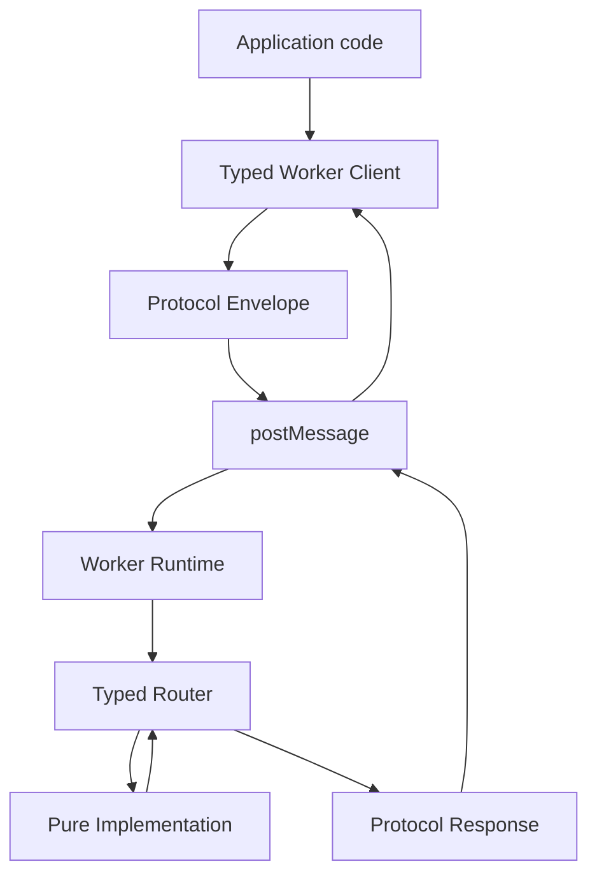
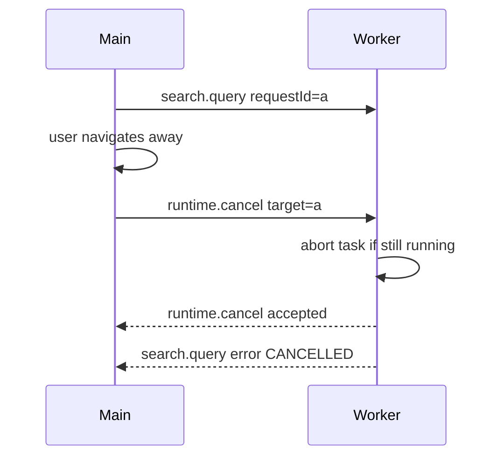

# Part 020 — Type-Safe Worker Contracts with TypeScript

A worker boundary is a network boundary in miniature.

The main thread and worker do not call each other directly. They exchange cloned or transferred messages through an asynchronous transport. That transport does not understand your business meaning. It does not know whether `taskId` is required, whether `payload.userId` should be a string, whether response `kind` matches request `kind`, or whether a binary buffer has been transferred instead of copied.

So the type system must describe the protocol, and runtime validation must protect the boundary.

The goal is not to make messages pretty. The goal is to prevent drift.

> A type-safe worker contract makes invalid conversations hard to write, easy to detect, and cheap to evolve.

---

## 1. The hidden failure

This code looks normal:

```ts
worker.postMessage({
  type: "search",
  query: "case escalation",
});
```

And the worker might reply:

```ts
postMessage({
  type: "search-result",
  rows: [],
});
```

The problem is that nothing ties the request to the response.

Questions the code does not answer:

- Which payload shape belongs to `search`?
- Which response shape belongs to `search`?
- Which errors are expected?
- Is the message versioned?
- Is the response correlated to a request?
- Is the payload structured-clone-safe?
- Are there transferables?
- What happens if the worker receives an unknown message from old code?
- What happens if the main thread receives a response from an old worker?

Without a contract, these questions are answered by convention and hope.

Hope is not a protocol.

---

## 2. Contract-first worker design

The clean shape is:

```txt
protocol.ts       shared types and schema
client.ts         typed main-thread API
worker.ts         runtime entrypoint
router.ts         typed worker handlers
implementation.ts pure worker logic
```



Only the protocol file is shared by both sides. The app should not import worker internals, and worker code should not import app UI internals.

---

## 3. Start with a request map

A request map is the simplest way to bind request kind to request and response types.

```ts
export type SearchHit = {
  id: string;
  title: string;
  score: number;
  snippet: string;
};

export type SearchProtocol = {
  "index.build": {
    request: {
      documents: Array<{
        id: string;
        title: string;
        body: string;
      }>;
    };
    response: {
      indexedCount: number;
      durationMs: number;
    };
  };

  "search.query": {
    request: {
      query: string;
      limit: number;
    };
    response: {
      hits: SearchHit[];
      durationMs: number;
    };
  };

  "index.clear": {
    request: Record<string, never>;
    response: {
      cleared: true;
    };
  };
};
```

Now the message kind is not a random string. It is a key of the protocol.

```ts
export type SearchRequestKind = keyof SearchProtocol;
```

---

## 4. Derive envelopes from the protocol

Do not hand-write every message union if you can derive it.

```ts
export type RequestEnvelope<K extends keyof SearchProtocol = keyof SearchProtocol> = {
  [Kind in K]: {
    direction: "request";
    kind: Kind;
    requestId: string;
    protocolVersion: 1;
    payload: SearchProtocol[Kind]["request"];
  };
}[K];

export type SuccessEnvelope<K extends keyof SearchProtocol = keyof SearchProtocol> = {
  [Kind in K]: {
    direction: "response";
    status: "ok";
    kind: Kind;
    requestId: string;
    protocolVersion: 1;
    payload: SearchProtocol[Kind]["response"];
  };
}[K];

export type FailureEnvelope<K extends keyof SearchProtocol = keyof SearchProtocol> = {
  [Kind in K]: {
    direction: "response";
    status: "error";
    kind: Kind;
    requestId: string;
    protocolVersion: 1;
    error: WorkerProtocolError;
  };
}[K];

export type ResponseEnvelope<K extends keyof SearchProtocol = keyof SearchProtocol> =
  | SuccessEnvelope<K>
  | FailureEnvelope<K>;

export type WorkerProtocolError = {
  code:
    | "BAD_REQUEST"
    | "CANCELLED"
    | "TIMEOUT"
    | "INTERNAL_ERROR"
    | "UNSUPPORTED_PROTOCOL";
  message: string;
  retryable: boolean;
};
```

This is a discriminated protocol:

- `direction` tells whether the envelope is a request or response;
- `kind` identifies the operation;
- `requestId` correlates request and response;
- `protocolVersion` supports compatibility checks;
- `status` separates success and failure response shape.

---

## 5. Typed client API

The app should not call `worker.postMessage` directly across the codebase.

Bad:

```ts
worker.postMessage({ kind: "search.query", payload: { query: q } });
```

Better:

```ts
const result = await searchWorker.request("search.query", {
  query: "case escalation",
  limit: 20,
});
```

The type of `result` should be inferred as:

```ts
{
  hits: SearchHit[];
  durationMs: number;
}
```

Implementation skeleton:

```ts
export class TypedWorkerClient<Protocol extends Record<string, any>> {
  readonly #worker: Worker;
  readonly #protocolVersion: number;
  readonly #pending = new Map<
    string,
    {
      resolve: (value: unknown) => void;
      reject: (reason: unknown) => void;
      timeoutId: ReturnType<typeof setTimeout>;
    }
  >();

  constructor(worker: Worker, protocolVersion: number) {
    this.#worker = worker;
    this.#protocolVersion = protocolVersion;

    this.#worker.addEventListener("message", (event) => {
      this.#handleMessage(event.data);
    });

    this.#worker.addEventListener("messageerror", () => {
      this.#rejectAll(new Error("Worker message deserialization failed"));
    });
  }

  request<K extends keyof Protocol & string>(
    kind: K,
    payload: Protocol[K]["request"],
    options: { timeoutMs?: number; transfer?: Transferable[] } = {},
  ): Promise<Protocol[K]["response"]> {
    const requestId = crypto.randomUUID();
    const timeoutMs = options.timeoutMs ?? 10_000;

    const envelope = {
      direction: "request",
      kind,
      requestId,
      protocolVersion: this.#protocolVersion,
      payload,
    };

    return new Promise((resolve, reject) => {
      const timeoutId = setTimeout(() => {
        this.#pending.delete(requestId);
        reject(new Error(`Worker request timed out: ${kind}`));
      }, timeoutMs);

      this.#pending.set(requestId, { resolve, reject, timeoutId });
      this.#worker.postMessage(envelope, options.transfer ?? []);
    });
  }

  #handleMessage(message: unknown): void {
    if (!isResponseEnvelope(message)) {
      console.warn("Ignoring unknown worker message", message);
      return;
    }

    const pending = this.#pending.get(message.requestId);
    if (!pending) {
      return;
    }

    clearTimeout(pending.timeoutId);
    this.#pending.delete(message.requestId);

    if (message.status === "ok") {
      pending.resolve(message.payload);
    } else {
      pending.reject(message.error);
    }
  }

  #rejectAll(reason: unknown): void {
    for (const [requestId, pending] of this.#pending) {
      clearTimeout(pending.timeoutId);
      pending.reject(reason);
      this.#pending.delete(requestId);
    }
  }
}
```

The public method is typed. The boundary handler still receives `unknown`, because runtime messages can be invalid.

That is the correct split:

> TypeScript protects your code before the boundary. Runtime validation protects your system at the boundary.

---

## 6. Runtime validation is not optional

TypeScript types disappear at runtime.

This means the worker may receive:

- messages from older app code;
- messages from newer app code;
- malformed messages caused by a bug;
- a response from an old cached worker;
- unexpected browser extension interference;
- a message deserialized from a different protocol version;
- a message that passed compile-time but failed structured-clone assumptions.

Always parse external messages as `unknown`.

```ts
function isObject(value: unknown): value is Record<string, unknown> {
  return typeof value === "object" && value !== null;
}

export function isRequestEnvelope(value: unknown): value is RequestEnvelope {
  return (
    isObject(value) &&
    value.direction === "request" &&
    typeof value.kind === "string" &&
    typeof value.requestId === "string" &&
    typeof value.protocolVersion === "number" &&
    "payload" in value
  );
}

export function isResponseEnvelope(value: unknown): value is ResponseEnvelope {
  return (
    isObject(value) &&
    value.direction === "response" &&
    typeof value.kind === "string" &&
    typeof value.requestId === "string" &&
    typeof value.protocolVersion === "number" &&
    (value.status === "ok" || value.status === "error")
  );
}
```

For complex payloads, use a schema validator or hand-written validators near the protocol. The key is not the library. The key is the invariant:

> No untrusted boundary message is used before validation.

---

## 7. Typed worker router

The worker side should also be typed.

```ts
type Handler<Protocol extends Record<string, any>, K extends keyof Protocol & string> = (
  payload: Protocol[K]["request"],
  context: WorkerHandlerContext,
) => Promise<Protocol[K]["response"]> | Protocol[K]["response"];

type Router<Protocol extends Record<string, any>> = {
  [K in keyof Protocol & string]: Handler<Protocol, K>;
};

export type WorkerHandlerContext = {
  requestId: string;
  signal: AbortSignal;
  startedAt: number;
};
```

Example router:

```ts
export const searchRouter = {
  "index.build": async (payload, context) => {
    const started = performance.now();
    const indexedCount = await buildIndex(payload.documents, context.signal);

    return {
      indexedCount,
      durationMs: performance.now() - started,
    };
  },

  "search.query": async (payload, context) => {
    const started = performance.now();
    const hits = await searchIndex(payload.query, payload.limit, context.signal);

    return {
      hits,
      durationMs: performance.now() - started,
    };
  },

  "index.clear": async () => {
    clearIndex();
    return { cleared: true };
  },
} satisfies Router<SearchProtocol>;
```

The `satisfies` operator is useful here because it checks the shape without losing the specific inferred types of the object.

If you add a new protocol operation but forget the handler, the router should fail type checking.

---

## 8. Worker runtime dispatch

Runtime dispatch receives unknown messages, validates them, routes them, and replies.

```ts
export function createWorkerRuntime<Protocol extends Record<string, any>>(
  router: Router<Protocol>,
  options: { protocolVersion: number; workerName: string },
) {
  self.addEventListener("message", async (event: MessageEvent<unknown>) => {
    const message = event.data;

    if (!isRequestEnvelope(message)) {
      postRuntimeError("BAD_REQUEST", "Malformed request envelope", undefined);
      return;
    }

    if (message.protocolVersion !== options.protocolVersion) {
      postMessage({
        direction: "response",
        status: "error",
        kind: message.kind,
        requestId: message.requestId,
        protocolVersion: options.protocolVersion,
        error: {
          code: "UNSUPPORTED_PROTOCOL",
          message: `Unsupported protocol version: ${message.protocolVersion}`,
          retryable: false,
        },
      });
      return;
    }

    const handler = router[message.kind as keyof Protocol & string];
    if (!handler) {
      postMessage({
        direction: "response",
        status: "error",
        kind: message.kind,
        requestId: message.requestId,
        protocolVersion: options.protocolVersion,
        error: {
          code: "BAD_REQUEST",
          message: `Unknown request kind: ${message.kind}`,
          retryable: false,
        },
      });
      return;
    }

    const controller = new AbortController();

    try {
      const payload = await handler(message.payload, {
        requestId: message.requestId,
        signal: controller.signal,
        startedAt: performance.now(),
      });

      postMessage({
        direction: "response",
        status: "ok",
        kind: message.kind,
        requestId: message.requestId,
        protocolVersion: options.protocolVersion,
        payload,
      });
    } catch (error) {
      postMessage({
        direction: "response",
        status: "error",
        kind: message.kind,
        requestId: message.requestId,
        protocolVersion: options.protocolVersion,
        error: normalizeWorkerError(error),
      });
    }
  });
}
```

This is intentionally boring. Production protocol dispatch should be boring.

The complex behavior belongs in bounded components:

- validation;
- routing;
- cancellation;
- transfer policy;
- observability;
- timeout;
- backpressure.

---

## 9. Exhaustiveness with discriminated unions

For smaller protocols, a discriminated union can be easier to read.

```ts
type WorkerCommand =
  | {
      kind: "index.build";
      payload: { documents: Array<{ id: string; body: string }> };
    }
  | {
      kind: "search.query";
      payload: { query: string; limit: number };
    }
  | {
      kind: "index.clear";
      payload: Record<string, never>;
    };
```

Use exhaustive checking:

```ts
function assertNever(value: never): never {
  throw new Error(`Unexpected value: ${JSON.stringify(value)}`);
}

async function handleCommand(command: WorkerCommand) {
  switch (command.kind) {
    case "index.build":
      return buildIndex(command.payload.documents);

    case "search.query":
      return search(command.payload.query, command.payload.limit);

    case "index.clear":
      return clearIndex();

    default:
      return assertNever(command);
  }
}
```

If a new command is added but not handled, TypeScript can make the default branch fail because `command` is no longer `never`.

For large systems, protocol maps scale better than manually maintained unions. Under the hood, both approaches rely on the same idea: a discriminant field narrows the valid shape.

---

## 10. Structured-clone-safe types

Not every TypeScript type is safe to send through `postMessage`.

Avoid pretending this is enough:

```ts
type Payload = any;
```

Create a project-level definition for data you allow across worker boundaries.

```ts
export type Primitive = string | number | boolean | null;

export type CloneSafe =
  | Primitive
  | Date
  | ArrayBuffer
  | Uint8Array
  | CloneSafe[]
  | { [key: string]: CloneSafe };
```

This is imperfect, but it forces the conversation.

You usually do **not** want to send:

- functions;
- class instances with behavior expectations;
- DOM nodes;
- framework objects;
- open database connections;
- `AbortSignal` directly as a behavior dependency;
- objects with important prototype behavior;
- huge nested object graphs by accident.

A stronger rule:

> Worker protocol payloads are DTOs, not domain objects.

---

## 11. Transferable-aware contracts

For large binary data, encode transfer policy in the contract.

```ts
export type ImageProtocol = {
  "image.resize": {
    request: {
      imageBytes: ArrayBuffer;
      width: number;
      height: number;
    };
    response: {
      resizedBytes: ArrayBuffer;
      width: number;
      height: number;
    };
    transfer: {
      request: ["imageBytes"];
      response: ["resizedBytes"];
    };
  };
};
```

Then centralize transfer extraction:

```ts
function transferForImageResizeRequest(
  payload: ImageProtocol["image.resize"]["request"],
): Transferable[] {
  return [payload.imageBytes];
}
```

Call site:

```ts
await imageWorker.request(
  "image.resize",
  payload,
  { transfer: transferForImageResizeRequest(payload) },
);
```

Transfer policy should not be scattered. A missing transfer can turn an O(1) ownership move into a large clone cost.

---

## 12. Type-safe event messages

Not every worker message is request-response. Workers may emit events.

Examples:

- progress;
- diagnostics;
- heartbeat;
- cache update;
- task started;
- task completed;
- memory pressure warning.

Define an event map:

```ts
export type SearchWorkerEvents = {
  "index.progress": {
    requestId: string;
    processed: number;
    total: number;
  };

  "runtime.heartbeat": {
    workerName: string;
    uptimeMs: number;
    currentTaskCount: number;
  };

  "runtime.warning": {
    code: "HIGH_MEMORY" | "SLOW_TASK";
    message: string;
  };
};

export type EventEnvelope<K extends keyof SearchWorkerEvents = keyof SearchWorkerEvents> = {
  [Kind in K]: {
    direction: "event";
    kind: Kind;
    protocolVersion: 1;
    payload: SearchWorkerEvents[Kind];
  };
}[K];
```

Now the client can offer typed subscriptions:

```ts
client.on("index.progress", (event) => {
  console.log(event.processed, event.total);
});
```

This keeps progress reporting out of the request-response path.

---

## 13. Cancellation contract

Cancellation should also be part of the protocol.

```ts
export type ControlProtocol = {
  "runtime.cancel": {
    request: {
      requestId: string;
      reason?: string;
    };
    response: {
      accepted: boolean;
    };
  };
};
```

Do not rely only on main-thread promise rejection. That cancels the caller's interest, not necessarily the worker's work.



Cancellation must be idempotent:

- cancel unknown request: accepted false or ignored;
- cancel already completed request: accepted false or completed state;
- duplicate cancel: same result;
- cancel during transfer: best effort.

---

## 14. Error contract

Avoid returning raw `Error` objects as protocol errors.

Use structured error DTOs.

```ts
export type WorkerProtocolError = {
  code:
    | "BAD_REQUEST"
    | "UNSUPPORTED_PROTOCOL"
    | "VALIDATION_FAILED"
    | "CANCELLED"
    | "TIMEOUT"
    | "RESOURCE_EXHAUSTED"
    | "INTERNAL_ERROR";
  message: string;
  retryable: boolean;
  details?: Record<string, CloneSafe>;
};
```

Do not leak sensitive internals in `message` or `details`.

A production error normalizer:

```ts
export function normalizeWorkerError(error: unknown): WorkerProtocolError {
  if (isAbortError(error)) {
    return {
      code: "CANCELLED",
      message: "Task was cancelled",
      retryable: false,
    };
  }

  if (isResourceExhausted(error)) {
    return {
      code: "RESOURCE_EXHAUSTED",
      message: "Worker resource limit exceeded",
      retryable: true,
    };
  }

  return {
    code: "INTERNAL_ERROR",
    message: "Worker task failed",
    retryable: false,
  };
}
```

Keep full stack traces in observability, not necessarily in protocol responses.

---

## 15. Protocol versioning

A worker protocol should have an explicit version.

```ts
export const SEARCH_WORKER_PROTOCOL_VERSION = 3 as const;
```

Include it in every envelope:

```ts
{
  direction: "request",
  kind: "search.query",
  requestId,
  protocolVersion: SEARCH_WORKER_PROTOCOL_VERSION,
  payload,
}
```

Policy options:

| Change | Compatibility | Version action |
|---|---|---|
| Add optional request field | backward-compatible | minor/internal |
| Add new event kind | usually compatible | minor/internal |
| Add required request field | breaking | bump protocol |
| Rename kind | breaking | bump protocol |
| Change response shape | breaking for caller | bump protocol |
| Change semantics without shape change | dangerous | bump if callers depend on old semantics |

The most dangerous change is semantic drift with identical types.

Example:

```ts
// v1
limit means maximum rows returned.

// v2
limit means maximum indexed documents scanned.
```

The type did not change, but the meaning did. That is a protocol break.

---

## 16. Capability negotiation

Protocol version alone is sometimes too coarse.

Use capabilities when features can be optional.

```ts
type RuntimeReady = {
  direction: "event";
  kind: "runtime.ready";
  protocolVersion: 3;
  payload: {
    workerName: string;
    buildId: string;
    capabilities: Array<
      | "search.basic"
      | "search.fuzzy"
      | "index.incremental"
      | "transfer.arraybuffer"
    >;
  };
};
```

Main thread policy:

```ts
if (!capabilities.has("index.incremental")) {
  disableIncrementalIndexingUi();
}
```

Do not fake unsupported features. Feature gates should be explicit.

---

## 17. Backpressure in the type contract

A type-safe client can also enforce request policy.

```ts
type RequestPolicy = {
  timeoutMs: number;
  maxInFlight: number;
  dedupeKey?: (payload: unknown) => string;
};

const policies: Record<keyof SearchProtocol, RequestPolicy> = {
  "index.build": {
    timeoutMs: 60_000,
    maxInFlight: 1,
  },
  "search.query": {
    timeoutMs: 5_000,
    maxInFlight: 4,
    dedupeKey: (payload) => JSON.stringify(payload),
  },
  "index.clear": {
    timeoutMs: 5_000,
    maxInFlight: 1,
  },
};
```

This prevents accidental request floods.

The protocol says what is possible. The policy says what is allowed at runtime.

---

## 18. Schema drift tests

Add compile-time tests for contract behavior.

Example using plain TypeScript assignments:

```ts
type QueryRequest = SearchProtocol["search.query"]["request"];

const validQuery: QueryRequest = {
  query: "appeal",
  limit: 10,
};

// @ts-expect-error limit is required
const missingLimit: QueryRequest = {
  query: "appeal",
};

// @ts-expect-error unknown field shape
const wrongLimit: QueryRequest = {
  query: "appeal",
  limit: "ten",
};
```

These tests are cheap and catch accidental type weakening.

Also add runtime contract tests:

```ts
it("rejects malformed request envelope", () => {
  expect(isRequestEnvelope({ kind: "search.query" })).toBe(false);
});
```

And integration tests:

```ts
it("returns typed search response", async () => {
  const response = await client.request("search.query", {
    query: "case",
    limit: 5,
  });

  expect(response.hits).toBeInstanceOf(Array);
});
```

---

## 19. Avoid `any` at the boundary

`any` erases the value of the contract.

Bad:

```ts
function handleMessage(message: any) {
  router[message.kind](message.payload);
}
```

Better:

```ts
function handleMessage(message: unknown) {
  if (!isRequestEnvelope(message)) {
    return rejectBadRequest();
  }

  routeValidatedMessage(message);
}
```

Inside the validated zone, you may use narrowed types. At the boundary, use `unknown`.

This is one of the most important TypeScript habits for production browser orchestration.

---

## 20. Avoid stringly typed call sites

Do not let string kinds leak everywhere.

Acceptable:

```ts
client.request("search.query", { query, limit: 10 });
```

Better for high-value operations:

```ts
export function querySearch(
  client: TypedWorkerClient<SearchProtocol>,
  input: { query: string; limit?: number },
) {
  return client.request("search.query", {
    query: input.query,
    limit: input.limit ?? 20,
  });
}
```

Now application code expresses intent:

```ts
const result = await querySearch(searchWorker, { query: "escalation" });
```

This gives you a seam for defaults, validation, tracing, feature flags, and deprecation warnings.

---

## 21. Contract boundaries for multiple workers

When an app has several workers, avoid one giant global protocol unless the workers are truly a single runtime.

Prefer per-worker contracts:

```ts
export type SearchProtocol = { /* search operations */ };
export type CsvParserProtocol = { /* parser operations */ };
export type CryptoProtocol = { /* crypto operations */ };
```

Then compose at the service level:

```ts
export type WorkerServices = {
  search: TypedWorkerClient<SearchProtocol>;
  csvParser: TypedWorkerClient<CsvParserProtocol>;
  crypto: TypedWorkerClient<CryptoProtocol>;
};
```

Each worker owns its own lifecycle and protocol.

Do not create a god-worker unless you explicitly need a single serialized execution context.

---

## 22. Protocol deprecation

Deprecation is a protocol feature.

Example:

```ts
export type SearchProtocol = {
  /** @deprecated use search.query.v2 */
  "search.query": {
    request: { query: string; limit: number };
    response: { hits: SearchHit[] };
  };

  "search.query.v2": {
    request: {
      query: string;
      limit: number;
      ranking: "exact" | "fuzzy";
    };
    response: {
      hits: SearchHit[];
      rankingUsed: "exact" | "fuzzy";
    };
  };
};
```

Policy:

1. add new operation;
2. support both for a compatibility window;
3. migrate call sites;
4. add warnings/metrics for old operation;
5. remove old operation in a planned protocol bump.

This is the same discipline used for service APIs, scaled down to browser runtime boundaries.

---

## 23. Security model

A type-safe contract is not a security boundary by itself.

It helps, but do not confuse compile-time correctness with trust.

Security rules:

- validate every inbound message;
- do not expose secrets through broad worker events;
- do not send full auth tokens unless the worker explicitly needs them;
- do not trust `kind` alone as authorization;
- include capability checks for sensitive operations;
- clear worker state on logout/session revocation;
- terminate workers when user identity changes if state isolation is required;
- never treat same-origin as same-intent.

A worker protocol can accidentally become an internal privilege escalation surface.

Example dangerous operation:

```ts
"admin.exportAllCases": {
  request: { format: "csv" | "json" };
  response: { bytes: ArrayBuffer };
}
```

This operation needs authorization policy, audit logging, and probably should not be callable from arbitrary UI code just because the type exists.

---

## 24. Production checklist

A worker contract is production-ready when:

- every operation is defined in a protocol map or discriminated union;
- every request kind has exactly one handler;
- every response is correlated with `requestId`;
- protocol version is explicit;
- runtime validation exists at both inbound boundaries;
- errors are structured DTOs;
- transferables are intentional and centralized;
- cancellation has protocol semantics;
- request policies define timeout and concurrency;
- unknown messages are rejected or ignored safely;
- old/new protocol mismatch is handled;
- compile-time contract tests exist;
- production integration tests boot the real worker;
- application code uses typed service methods, not raw `postMessage` calls.

---

## 25. Final mental model

Type-safe worker contracts are not about making TypeScript happy.

They are about controlling an asynchronous boundary where two independently loaded execution contexts exchange cloned data under lifecycle uncertainty.

The winning design has three layers:

1. **Static contract** — makes invalid code hard to write.
2. **Runtime validator** — makes invalid messages safe to receive.
3. **Protocol policy** — makes valid messages safe to execute.

When those layers are separated, worker systems become much easier to evolve.

That is the difference between a demo worker and an internal-engineering-grade browser runtime.

---

## References

- TypeScript Handbook — Discriminating unions and narrowing.
- TypeScript Handbook — `never` type and exhaustiveness checks.
- MDN Web Docs — Web Workers and `postMessage` structured-clone communication.
- MDN Web Docs — Structured clone algorithm and transferable objects.
