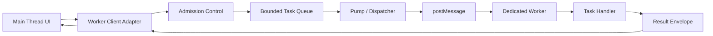
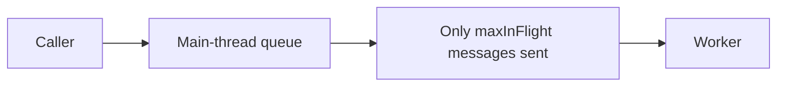
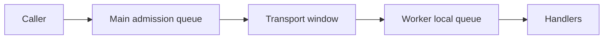
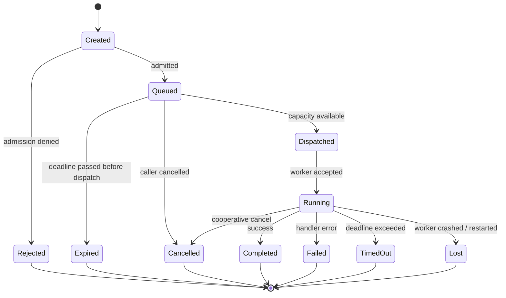
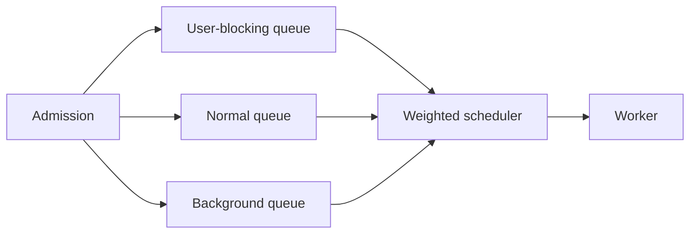

# Part 021 — Building a Worker Task Queue

A worker is not a magical background machine.

It is an execution context with its own event loop, memory, message queue, failure modes, and startup cost. If the main thread can submit work faster than the worker can finish it, then the worker boundary becomes a hidden overload point.

That overload point is usually invisible until production.

At first the code looks harmless:

```ts
worker.postMessage({ type: "parse-document", document });
worker.postMessage({ type: "parse-document", document });
worker.postMessage({ type: "parse-document", document });
```

But each message has cost:

- serialization or transfer cost
- queueing delay
- memory retention
- response correlation
- timeout handling
- stale result handling
- error propagation
- cancellation policy
- lifecycle cleanup

A worker task queue makes those costs explicit.

> A worker queue is the admission-control layer between user intent and background execution.

It answers one question: **what work is allowed to enter the system right now?**

---

## 1. The problem: `postMessage` has no backpressure

`worker.postMessage()` sends a message to a worker and schedules work on the receiving side's event loop. The browser transport does not expose a business-level queue size, priority model, deadline policy, cancellation model, or overload decision.

That means this code has no built-in way to say:

- reject this task because the worker is overloaded
- replace the previous search task with the latest one
- keep only the most recent progress request
- reserve capacity for high-priority tasks
- expire a task if it has waited too long
- cancel queued work that is no longer needed
- bound memory by payload byte size
- detect a stuck worker before the UI becomes stale

The browser gives us a message transport.

The application must build a scheduler.

---

## 2. Worker queue mental model

Think of a dedicated worker system as a small actor runtime.



The key design boundary is not `new Worker(...)`.

The key design boundary is **admission**.

Before work crosses into the worker, the adapter should decide:

1. Is this task valid?
2. Is there capacity?
3. Does it supersede an older task?
4. Is the payload cheap enough to clone or should it transfer data?
5. Is the deadline still meaningful?
6. Is the worker healthy enough to accept work?
7. How will the result be correlated, timed out, canceled, and observed?

A production worker queue is mostly policy.

---

## 3. Queue ownership options

There are three common placements.

### Option A — Main-thread-owned queue

The main thread adapter owns the queue and only sends tasks to the worker when there is capacity.



Use this when:

- you want clear UI-side overload behavior
- task admission depends on UI intent
- you need to cancel or replace queued tasks before serialization
- payloads are large and should not be cloned prematurely
- you want one predictable place for timeout and pending maps

This is the default for most dedicated worker clients.

### Option B — Worker-owned queue

The main thread sends everything and the worker queues internally.


Use this when:

- the producer is already bounded
- the worker receives tasks from multiple ports
- the worker is a hub-like component
- scheduling decisions require worker-local state

The risk is that memory pressure moves into the worker and becomes harder for the UI layer to reason about.

### Option C — Split queue

The main thread does admission control, while the worker also has a small internal queue for fairness or multiplexing.



Use this for advanced cases:

- one worker serves multiple logical clients
- tasks have different execution lanes
- worker can run some async I/O concurrently
- main thread must not know worker-internal scheduling details

This part builds Option A because it gives the clearest mental model.

---

## 4. The invariants

A serious task queue should maintain these invariants.

| Invariant | Meaning |
|---|---|
| Bounded admission | The queue has a maximum number of tasks and/or bytes. |
| Bounded in-flight | Only a limited number of tasks are sent but not settled. |
| Correlated result | Every result maps to one known request ID. |
| Single terminal state | A task completes, fails, times out, expires, or cancels exactly once. |
| Deadline-aware | Work that is no longer useful should not run. |
| Stale-safe | Old responses cannot overwrite newer UI state. |
| Observable | Queue delay, run duration, failure reason, and payload size are measurable. |
| Clean shutdown | Closing a page does not leave unresolved promises or leaked buffers. |

The easiest way to detect bad queue design is to ask:

> Can one fast user interaction create unbounded worker work?

If yes, the design is incomplete.

---

## 5. Task lifecycle

A task should not be represented as only a Promise.

A task has lifecycle.



This lifecycle matters because different terminal states imply different cleanup.

For example:

- `Rejected`: do not allocate large payloads if possible.
- `Expired`: do not send stale work to the worker.
- `TimedOut`: ignore late result, maybe send cancel.
- `Lost`: worker generation changed; retry only if idempotent.
- `Cancelled`: caller no longer wants result; cleanup pending entry.

---

## 6. Task shape

A useful task object has more than `type` and `payload`.

```ts
export type Priority = "user-blocking" | "normal" | "background";

export interface WorkerTask<RequestPayload = unknown, ResponsePayload = unknown> {
  id: string;
  kind: string;
  payload: RequestPayload;
  priority: Priority;
  createdAt: number;
  deadlineAt: number;
  sequence: number;
  transfer?: Transferable[];
  estimateBytes?: number;
  dedupeKey?: string;
  supersedesKey?: string;
  resolve: (value: ResponsePayload) => void;
  reject: (error: Error) => void;
}
```

Important fields:

| Field | Why it exists |
|---|---|
| `id` | Correlates request and response. |
| `kind` | Routes task to worker handler. |
| `priority` | Allows scheduling policy. |
| `createdAt` | Measures queue delay. |
| `deadlineAt` | Avoids useless stale work. |
| `sequence` | Preserves FIFO within same priority. |
| `transfer` | Prevents accidental large copies. |
| `estimateBytes` | Enables memory budget. |
| `dedupeKey` | Collapses duplicate work. |
| `supersedesKey` | Replaces old work with newer intent. |

A queue without metadata is just an array.

A production queue is a control surface.

---

## 7. Priority is policy, not decoration

Priority should map to user value.

| Priority | Typical work | Expected behavior |
|---|---|---|
| `user-blocking` | current search, active document parse, visible diff | low queue delay, reserve capacity |
| `normal` | precompute, non-critical validation | fair scheduling |
| `background` | indexing, cache warming, analytics aggregation | cancellable, coalescable, low priority |

Never create priority names like `high`, `medium`, `low` without semantics. They become political labels.

Prefer names that describe latency expectation.

---

## 8. FIFO inside priority

A simple priority queue can sort by:

1. priority weight
2. deadline
3. sequence number

```ts
const priorityWeight: Record<Priority, number> = {
  "user-blocking": 0,
  normal: 1,
  background: 2,
};

function compareTask(a: WorkerTask, b: WorkerTask): number {
  const byPriority = priorityWeight[a.priority] - priorityWeight[b.priority];
  if (byPriority !== 0) return byPriority;

  const byDeadline = a.deadlineAt - b.deadlineAt;
  if (byDeadline !== 0) return byDeadline;

  return a.sequence - b.sequence;
}
```

This gives deterministic scheduling:

- higher value work first
- earlier deadline first within same priority
- FIFO when priority and deadline are equal

Determinism makes tests easier and production behavior explainable.

---

## 9. Minimal binary heap queue

For small queues, sorting an array on each enqueue is acceptable.

For a reusable runtime, implement a heap.

```ts
export class TaskPriorityQueue<T> {
  private items: T[] = [];

  constructor(private readonly compare: (a: T, b: T) => number) {}

  get size(): number {
    return this.items.length;
  }

  push(item: T): void {
    this.items.push(item);
    this.bubbleUp(this.items.length - 1);
  }

  peek(): T | undefined {
    return this.items[0];
  }

  pop(): T | undefined {
    if (this.items.length === 0) return undefined;

    const top = this.items[0];
    const last = this.items.pop()!;

    if (this.items.length > 0) {
      this.items[0] = last;
      this.sinkDown(0);
    }

    return top;
  }

  remove(predicate: (item: T) => boolean): T[] {
    const removed: T[] = [];
    const kept: T[] = [];

    for (const item of this.items) {
      if (predicate(item)) removed.push(item);
      else kept.push(item);
    }

    this.items = [];
    for (const item of kept) this.push(item);
    return removed;
  }

  private bubbleUp(index: number): void {
    while (index > 0) {
      const parent = Math.floor((index - 1) / 2);
      if (this.compare(this.items[index], this.items[parent]) >= 0) return;
      this.swap(index, parent);
      index = parent;
    }
  }

  private sinkDown(index: number): void {
    while (true) {
      const left = index * 2 + 1;
      const right = index * 2 + 2;
      let smallest = index;

      if (
        left < this.items.length &&
        this.compare(this.items[left], this.items[smallest]) < 0
      ) {
        smallest = left;
      }

      if (
        right < this.items.length &&
        this.compare(this.items[right], this.items[smallest]) < 0
      ) {
        smallest = right;
      }

      if (smallest === index) return;
      this.swap(index, smallest);
      index = smallest;
    }
  }

  private swap(a: number, b: number): void {
    const tmp = this.items[a];
    this.items[a] = this.items[b];
    this.items[b] = tmp;
  }
}
```

This is enough for a worker queue because most browser-side queues should be intentionally small.

If you need a queue of tens of thousands of tasks in the browser, first challenge the product behavior.

---

## 10. Message envelopes

The transport should use envelopes, not raw payloads.

```ts
export type WorkerRequestEnvelope = {
  protocol: "worker-task-v1";
  direction: "request";
  id: string;
  kind: string;
  sentAt: number;
  deadlineAt: number;
  payload: unknown;
};

export type WorkerResponseEnvelope =
  | {
      protocol: "worker-task-v1";
      direction: "response";
      id: string;
      ok: true;
      receivedAt: number;
      completedAt: number;
      payload: unknown;
    }
  | {
      protocol: "worker-task-v1";
      direction: "response";
      id: string;
      ok: false;
      receivedAt: number;
      completedAt: number;
      error: {
        code: string;
        message: string;
        retryable: boolean;
      };
    };
```

The envelope lets the adapter measure:

```txt
queueDelay = sentAt - createdAt
workerDuration = completedAt - receivedAt
roundTrip = responseReceivedAt - sentAt
endToEnd = responseReceivedAt - createdAt
```

You cannot improve what you cannot measure.

---

## 11. Main-thread queue client

This client owns:

- queue
- pending map
- max queue size
- max in-flight count
- deadline checks
- worker generation
- timeout cleanup
- result correlation

```ts
import { TaskPriorityQueue } from "./task-priority-queue";

export type QueueOptions = {
  maxQueued: number;
  maxInFlight: number;
  defaultTimeoutMs: number;
  maxEstimatedBytes: number;
};

export class WorkerQueueClient {
  private sequence = 0;
  private closed = false;
  private generation = 0;

  private readonly queue = new TaskPriorityQueue<WorkerTask>(compareTask);
  private readonly pending = new Map<string, WorkerTask>();

  private estimatedQueuedBytes = 0;

  constructor(
    private readonly worker: Worker,
    private readonly options: QueueOptions,
  ) {
    this.worker.addEventListener("message", this.onMessage);
    this.worker.addEventListener("error", this.onWorkerError);
    this.worker.addEventListener("messageerror", this.onMessageError);
  }

  run<TRequest, TResponse>(input: {
    kind: string;
    payload: TRequest;
    priority?: Priority;
    timeoutMs?: number;
    transfer?: Transferable[];
    estimateBytes?: number;
    dedupeKey?: string;
    supersedesKey?: string;
  }): Promise<TResponse> {
    if (this.closed) {
      return Promise.reject(new Error("Worker queue is closed"));
    }

    const now = performance.now();
    const timeoutMs = input.timeoutMs ?? this.options.defaultTimeoutMs;
    const estimateBytes = input.estimateBytes ?? 0;

    if (estimateBytes > this.options.maxEstimatedBytes) {
      return Promise.reject(
        new Error(`Task payload exceeds byte budget: ${estimateBytes}`),
      );
    }

    if (this.queue.size >= this.options.maxQueued) {
      return Promise.reject(new Error("Worker queue is full"));
    }

    if (this.estimatedQueuedBytes + estimateBytes > this.options.maxEstimatedBytes) {
      return Promise.reject(new Error("Worker queue byte budget exceeded"));
    }

    return new Promise<TResponse>((resolve, reject) => {
      const task: WorkerTask<TRequest, TResponse> = {
        id: crypto.randomUUID(),
        kind: input.kind,
        payload: input.payload,
        priority: input.priority ?? "normal",
        createdAt: now,
        deadlineAt: now + timeoutMs,
        sequence: this.sequence++,
        transfer: input.transfer,
        estimateBytes,
        dedupeKey: input.dedupeKey,
        supersedesKey: input.supersedesKey,
        resolve,
        reject,
      };

      this.applySuperseding(task);
      this.queue.push(task as WorkerTask);
      this.estimatedQueuedBytes += estimateBytes;
      this.pump();
    });
  }

  close(reason = "Worker queue closed"): void {
    if (this.closed) return;
    this.closed = true;

    this.worker.removeEventListener("message", this.onMessage);
    this.worker.removeEventListener("error", this.onWorkerError);
    this.worker.removeEventListener("messageerror", this.onMessageError);

    for (const task of this.pending.values()) {
      task.reject(new Error(reason));
    }
    this.pending.clear();

    const queued = this.queue.remove(() => true);
    for (const task of queued) {
      task.reject(new Error(reason));
    }

    this.worker.terminate();
  }

  private pump(): void {
    if (this.closed) return;

    while (this.pending.size < this.options.maxInFlight) {
      const task = this.queue.pop();
      if (!task) return;

      this.estimatedQueuedBytes -= task.estimateBytes ?? 0;

      if (performance.now() >= task.deadlineAt) {
        task.reject(new Error("Task expired before dispatch"));
        continue;
      }

      this.dispatch(task);
    }
  }

  private dispatch(task: WorkerTask): void {
    this.pending.set(task.id, task);

    const envelope: WorkerRequestEnvelope = {
      protocol: "worker-task-v1",
      direction: "request",
      id: task.id,
      kind: task.kind,
      sentAt: performance.now(),
      deadlineAt: task.deadlineAt,
      payload: task.payload,
    };

    try {
      this.worker.postMessage(envelope, task.transfer ?? []);
    } catch (error) {
      this.pending.delete(task.id);
      task.reject(toError(error));
      this.pump();
    }
  }

  private onMessage = (event: MessageEvent<WorkerResponseEnvelope>): void => {
    const envelope = event.data;
    if (!isWorkerResponseEnvelope(envelope)) return;

    const task = this.pending.get(envelope.id);
    if (!task) {
      // Late, duplicate, or stale response.
      return;
    }

    this.pending.delete(envelope.id);

    if (performance.now() >= task.deadlineAt) {
      task.reject(new Error("Task result arrived after deadline"));
      this.pump();
      return;
    }

    if (envelope.ok) {
      task.resolve(envelope.payload);
    } else {
      task.reject(new Error(envelope.error.message));
    }

    this.pump();
  };

  private onWorkerError = (event: ErrorEvent): void => {
    this.failGeneration(new Error(event.message || "Worker error"));
  };

  private onMessageError = (): void => {
    this.failGeneration(new Error("Worker message deserialization failed"));
  };

  private failGeneration(error: Error): void {
    this.generation += 1;

    for (const task of this.pending.values()) {
      task.reject(error);
    }

    this.pending.clear();
  }

  private applySuperseding(newTask: WorkerTask): void {
    if (!newTask.supersedesKey) return;

    const removed = this.queue.remove(
      (task) => task.supersedesKey === newTask.supersedesKey,
    );

    for (const task of removed) {
      this.estimatedQueuedBytes -= task.estimateBytes ?? 0;
      task.reject(new Error("Task superseded by newer task"));
    }
  }
}

function toError(value: unknown): Error {
  return value instanceof Error ? value : new Error(String(value));
}
```

This is not complete yet. Part 022 will add cancellation and deeper backpressure. But even this basic client already prevents a major production failure: unbounded in-flight work.

---

## 12. Worker-side dispatcher

The worker should also validate envelopes and produce normalized responses.

```ts
type Handler = (payload: unknown, context: HandlerContext) => Promise<unknown>;

type HandlerContext = {
  taskId: string;
  deadlineAt: number;
  receivedAt: number;
};

const handlers = new Map<string, Handler>();

handlers.set("parse-json", async (payload) => {
  if (typeof payload !== "string") {
    throw new WorkerTaskError("INVALID_PAYLOAD", "Expected JSON string", false);
  }

  return JSON.parse(payload);
});

self.addEventListener("message", async (event: MessageEvent<WorkerRequestEnvelope>) => {
  const request = event.data;
  if (!isWorkerRequestEnvelope(request)) return;

  const receivedAt = performance.now();

  if (receivedAt >= request.deadlineAt) {
    postFailure(request, receivedAt, {
      code: "DEADLINE_EXCEEDED",
      message: "Task reached worker after deadline",
      retryable: false,
    });
    return;
  }

  const handler = handlers.get(request.kind);
  if (!handler) {
    postFailure(request, receivedAt, {
      code: "UNKNOWN_TASK_KIND",
      message: `Unknown task kind: ${request.kind}`,
      retryable: false,
    });
    return;
  }

  try {
    const result = await handler(request.payload, {
      taskId: request.id,
      deadlineAt: request.deadlineAt,
      receivedAt,
    });

    const response: WorkerResponseEnvelope = {
      protocol: "worker-task-v1",
      direction: "response",
      id: request.id,
      ok: true,
      receivedAt,
      completedAt: performance.now(),
      payload: result,
    };

    self.postMessage(response);
  } catch (error) {
    postFailure(request, receivedAt, normalizeWorkerError(error));
  }
});

function postFailure(
  request: WorkerRequestEnvelope,
  receivedAt: number,
  error: { code: string; message: string; retryable: boolean },
): void {
  const response: WorkerResponseEnvelope = {
    protocol: "worker-task-v1",
    direction: "response",
    id: request.id,
    ok: false,
    receivedAt,
    completedAt: performance.now(),
    error,
  };

  self.postMessage(response);
}
```

Notice the worker does not throw raw errors across the boundary.

It returns an error DTO.

Structured clone does support many built-in error properties, but production protocols should still normalize errors because app-specific retry policy needs stable fields like `code` and `retryable`.

---

## 13. `maxInFlight` is not always CPU parallelism

A dedicated worker runs JavaScript on its own thread, but that does not mean one worker can execute multiple CPU-bound JavaScript functions in parallel.

Inside one worker, CPU-bound JavaScript is still single-threaded.

So why allow `maxInFlight > 1`?

Because not all worker tasks are pure CPU.

Examples where multiple in-flight tasks may help:

- worker performs fetch-like async I/O
- worker awaits IndexedDB
- worker waits on streams
- worker delegates to WebAssembly with async boundary
- worker sends work to another internal component

Examples where `maxInFlight = 1` is usually better:

- parsing large JSON
- compression
- hashing
- diffing
- search indexing
- image processing in JS
- CPU-heavy WASM without internal threading

Decision rule:

| Worker workload | Recommended `maxInFlight` |
|---|---:|
| CPU-bound synchronous handler | 1 |
| CPU-bound chunked cooperative handler | 1–2 |
| Mostly async I/O | 4–16, measured |
| Mixed CPU and I/O | start with 2, measure |
| Untrusted payload size | 1 with strict byte budget |

Do not tune this by vibes.

Measure queue delay, worker duration, and memory.

---

## 14. Deadline vs timeout

A timeout is local.

A deadline is a contract.

```txt
timeoutMs = how long caller is willing to wait from now
deadlineAt = absolute monotonic timestamp after which work is useless
```

Use `performance.now()` for elapsed durations and deadlines inside a page/worker session. Do not use `Date.now()` for queue timing because wall-clock time can change.

The deadline should travel with the message:

```ts
{
  id: "task-123",
  kind: "search-index",
  deadlineAt: 123456.7,
  payload: {...}
}
```

The worker should check the deadline before expensive work.

```ts
if (performance.now() >= context.deadlineAt) {
  throw new WorkerTaskError("DEADLINE_EXCEEDED", "Task no longer useful", false);
}
```

For long CPU loops, check the deadline periodically.

```ts
for (let i = 0; i < rows.length; i++) {
  if ((i & 1023) === 0 && performance.now() >= context.deadlineAt) {
    throw new WorkerTaskError("DEADLINE_EXCEEDED", "Task expired during processing", false);
  }

  processRow(rows[i]);
}
```

A deadline prevents zombie work.

---

## 15. Superseding work

Some tasks should not queue behind their older versions.

Example: user types in a search box.

```txt
query: "c"
query: "ca"
query: "cas"
query: "case"
```

If each query creates a worker task, the app may waste time computing old results.

The right policy is usually **latest wins**.

```ts
queue.run({
  kind: "search",
  payload: { query },
  priority: "user-blocking",
  timeoutMs: 700,
  supersedesKey: "active-search",
});
```

This removes queued tasks with the same `supersedesKey` before admitting the new one.

Running tasks are harder. You cannot remove a message already being executed unless the worker cooperates. Part 022 handles cancellation.

---

## 16. Dedupe work

Some tasks are identical and should share one result.

Example:

```txt
parse schema version 42
parse schema version 42
parse schema version 42
```

Instead of three worker tasks, use single-flight dedupe.

```ts
class SingleFlightWorkerClient {
  private readonly inFlightByKey = new Map<string, Promise<unknown>>();

  constructor(private readonly queue: WorkerQueueClient) {}

  run<T>(key: string, factory: () => Promise<T>): Promise<T> {
    const existing = this.inFlightByKey.get(key);
    if (existing) return existing as Promise<T>;

    const promise = factory().finally(() => {
      this.inFlightByKey.delete(key);
    });

    this.inFlightByKey.set(key, promise);
    return promise;
  }
}
```

Usage:

```ts
const result = await singleFlight.run(`parse-schema:${schemaHash}`, () =>
  queue.run({
    kind: "parse-schema",
    payload: { schemaText },
    priority: "normal",
    timeoutMs: 3000,
  }),
);
```

Dedupe is for identical work.

Superseding is for obsolete work.

Do not confuse them.

---

## 17. Payload byte budget

Task count is not enough.

Ten tiny tasks are not the same as ten 100 MB buffers.

A practical queue needs byte budget.

```ts
function estimatePayloadBytes(payload: unknown): number {
  if (typeof payload === "string") return payload.length * 2;
  if (payload instanceof ArrayBuffer) return payload.byteLength;
  if (ArrayBuffer.isView(payload)) return payload.byteLength;

  // Approximate only. Do not use this for hot paths with huge objects.
  try {
    return JSON.stringify(payload).length * 2;
  } catch {
    return 1_000_000;
  }
}
```

This estimate is not perfect. It does not model structured clone internals. But it is better than pretending payload size does not exist.

Rules of thumb:

- use transferables for large binary buffers
- avoid sending class instances
- avoid sending huge nested object graphs
- prefer IDs or handles when data already exists in IndexedDB/OPFS
- chunk large data when progress/cancellation matters
- reject payloads above a clear budget

A queue protects memory by refusing work early.

---

## 18. Completion order is not submission order

If `maxInFlight > 1`, results may complete out of order.

```txt
submit A
submit B
submit C

complete B
complete C
complete A
```

The adapter must not assume FIFO completion.

Correlate by `id`.

The UI must also protect itself from stale results.

```ts
let searchGeneration = 0;

async function runSearch(query: string) {
  const generation = ++searchGeneration;

  const result = await queue.run({
    kind: "search",
    payload: { query },
    priority: "user-blocking",
    timeoutMs: 800,
    supersedesKey: "active-search",
  });

  if (generation !== searchGeneration) {
    return; // stale result
  }

  renderSearchResult(result);
}
```

A worker queue can prevent some stale work. The UI still needs generation guards when user intent changes.

---

## 19. Priority inversion and starvation

Priority queues can starve background tasks.

If user-blocking tasks arrive constantly, background tasks may never run.

There are several fixes.

### Aging

Increase effective priority as wait time grows.

```ts
function effectivePriorityWeight(task: WorkerTask): number {
  const base = priorityWeight[task.priority];
  const waitedMs = performance.now() - task.createdAt;
  const boost = Math.floor(waitedMs / 5000);
  return Math.max(0, base - boost);
}
```

### Reserved slots

Reserve occasional dispatch for background tasks.

```txt
For every 10 dispatched tasks:
- up to 8 user-blocking/normal
- up to 2 background if available
```

### Separate queues

Maintain one queue per lane.



Do not add fairness until you need it. But design the queue so fairness can be added without rewriting the protocol.

---

## 20. Observability fields

Emit structured metrics around each task.

```ts
type TaskMetric = {
  taskId: string;
  kind: string;
  priority: Priority;
  status: "completed" | "failed" | "cancelled" | "expired" | "timed-out";
  queueDelayMs: number;
  workerDurationMs?: number;
  endToEndMs: number;
  estimateBytes: number;
  queueSizeAtDispatch: number;
  inFlightAtDispatch: number;
};
```

Useful dashboards:

| Metric | What it reveals |
|---|---|
| queue depth | overload |
| queue delay p95 | user-visible latency pressure |
| worker duration p95 | slow handlers |
| timeout count | bad deadline or overloaded worker |
| rejection count | admission too strict or producer too aggressive |
| stale response count | lifecycle or cancellation issue |
| messageerror count | invalid clone/serialization problem |
| bytes queued | memory pressure |

A queue without metrics is a guess.

---

## 21. Testing the queue

Test behavior, not implementation details.

### Admission tests

```txt
Given maxQueued = 2
When 3 tasks are enqueued while worker is blocked
Then the third task is rejected
```

### Priority tests

```txt
Given queued background task B
And queued user-blocking task A
When capacity opens
Then A dispatches before B
```

### Deadline tests

```txt
Given a task expires while queued
When pump runs
Then the task is rejected and not posted to worker
```

### Stale response tests

```txt
Given task T has timed out and pending entry was removed
When worker later returns response for T
Then response is ignored
```

### Worker crash tests

```txt
Given two pending tasks
When worker emits error
Then both tasks reject and pending map is cleared
```

### Payload tests

```txt
Given payload estimate exceeds maxEstimatedBytes
When task is submitted
Then task is rejected before postMessage
```

Most bugs in worker queues are lifecycle bugs.

Write tests like a distributed system engineer, not like a component snapshot tester.

---

## 22. Anti-patterns

### Anti-pattern: `postMessage` from everywhere

```ts
worker.postMessage(taskA);
worker.postMessage(taskB);
worker.postMessage(taskC);
```

This spreads scheduling policy across the app.

Create one adapter.

### Anti-pattern: promise-only pending map

```ts
const pending = new Map<string, (value: unknown) => void>();
```

This loses deadline, priority, payload size, and cleanup semantics.

Store task metadata.

### Anti-pattern: no terminal-state discipline

A task should not resolve after timeout. It should not reject twice. It should not leak if the worker dies.

Terminal state must be single-assignment.

### Anti-pattern: queue size only

Queue size without byte budget still permits memory explosions.

### Anti-pattern: worker pool before queue

A worker pool multiplies capacity and complexity. It does not fix missing admission control.

Build the queue first.

---

## 23. Production checklist

Before using a worker queue in production, answer these:

- What is `maxQueued`?
- What is `maxInFlight`?
- What is max queued byte budget?
- Which tasks are user-blocking?
- Which tasks can be superseded?
- Which tasks can be deduped?
- Which tasks are safe to retry?
- What happens to queued tasks when page is hidden?
- What happens to running tasks when worker crashes?
- What metrics are emitted per task?
- How are stale responses ignored?
- How is shutdown handled?
- Are large binary payloads transferred rather than copied?
- Are task results versioned?
- Are handler errors normalized?

If the answer is “browser will handle it”, the design is not done.

---

## 24. Part summary

A worker task queue is not a convenience wrapper.

It is the browser-side equivalent of a small scheduler.

The main lessons:

- `postMessage` is a transport, not a scheduling system.
- Worker work must be admitted, bounded, correlated, and observed.
- Queue ownership is a design decision.
- For dedicated workers, main-thread-owned queues are usually the safest default.
- `maxInFlight` should reflect workload type, not optimism.
- Deadlines travel with tasks.
- Superseding removes obsolete work.
- Dedupe merges identical work.
- Payload byte budget matters as much as task count.
- Completion order is not submission order.
- Production queues need metrics and lifecycle cleanup.

Part 022 builds the missing half: cancellation, backpressure, and bounded cooperative work.

---

## References

- MDN — Worker `postMessage()`: https://developer.mozilla.org/en-US/docs/Web/API/Worker/postMessage
- MDN — Transferable objects: https://developer.mozilla.org/en-US/docs/Web/API/Web_Workers_API/Transferable_objects
- MDN — Structured clone algorithm: https://developer.mozilla.org/en-US/docs/Web/API/Web_Workers_API/Structured_clone_algorithm
- MDN — PerformanceLongTaskTiming: https://developer.mozilla.org/en-US/docs/Web/API/PerformanceLongTaskTiming
- MDN — Microtask guide: https://developer.mozilla.org/en-US/docs/Web/API/HTML_DOM_API/Microtask_guide
