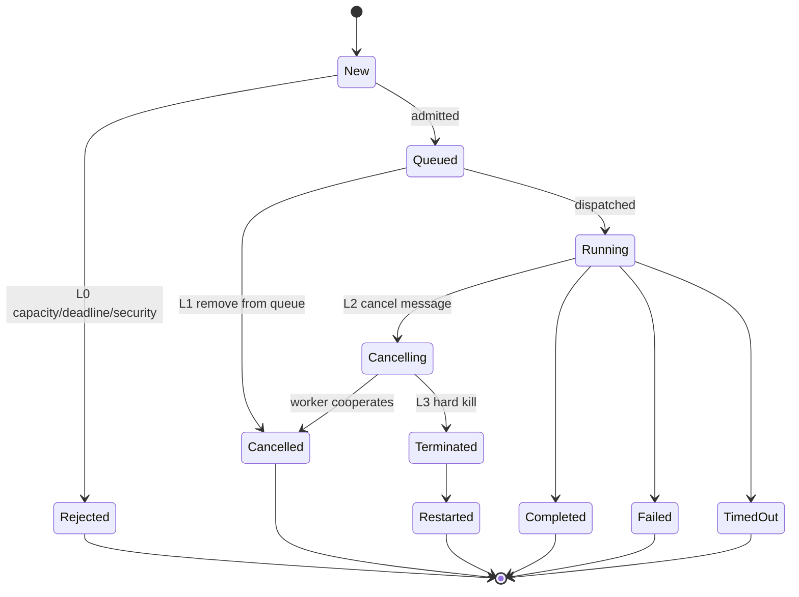
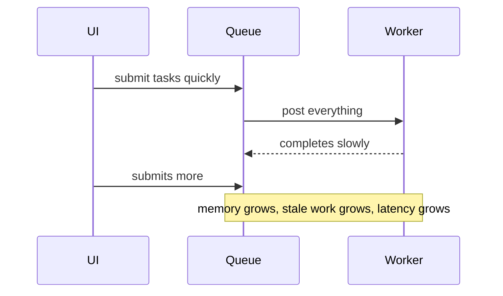
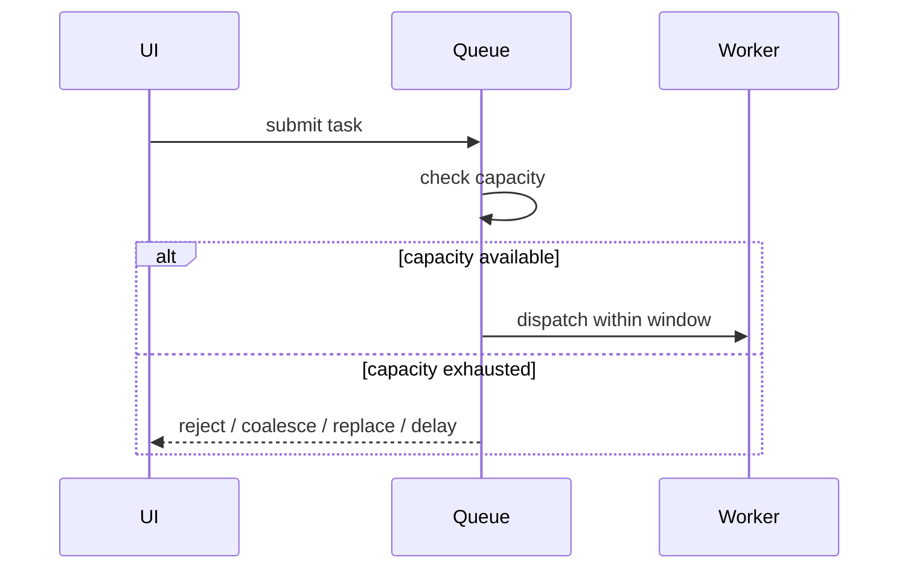
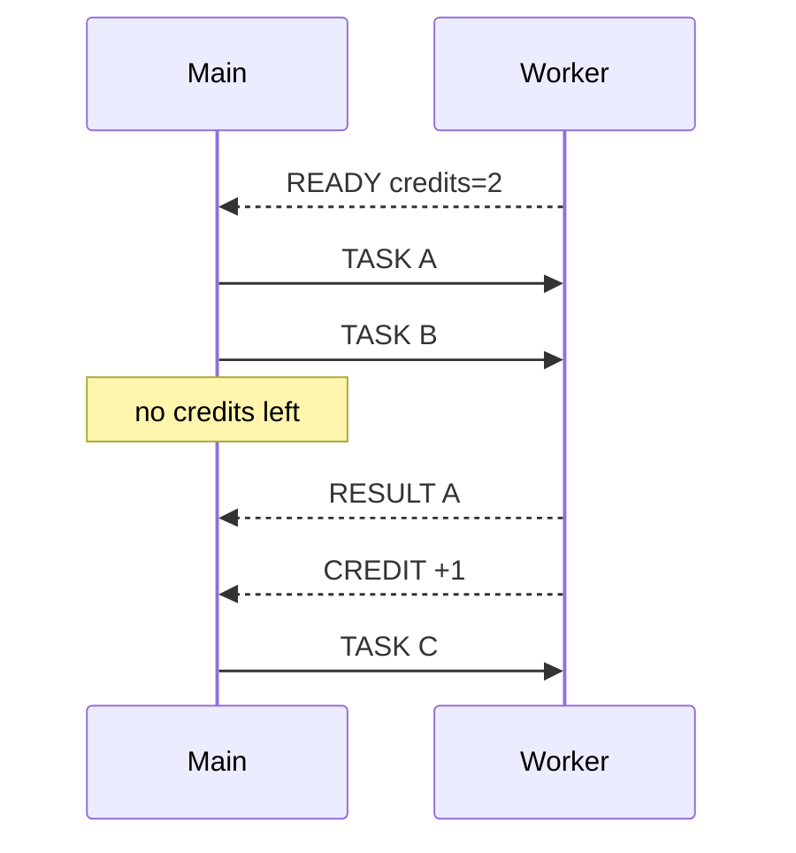

# Part 022 — Cancellation, Backpressure, and Bounded Work

A worker queue without cancellation is only half a scheduler.

It can decide what enters the system, but it cannot stop work that has become useless. In interactive applications, usefulness changes constantly:

- user types another character
- user navigates away
- tab becomes hidden
- auth state changes
- selected document changes
- component unmounts
- request deadline expires
- newer task supersedes older task
- memory pressure rises

If the worker keeps processing old intent, it may be technically correct and product-wise wrong.

> Cancellation is how user intent invalidates work. Backpressure is how system capacity invalidates admission.

Both are necessary.

---

## 1. Cancellation is not preemption

JavaScript cancellation is mostly cooperative.

An `AbortSignal` can notify async code that an operation should stop. It cannot magically interrupt arbitrary synchronous CPU code in the middle of a tight loop.

This is the first hard truth.

```ts
// This cannot be interrupted by an AbortSignal unless the loop checks it.
for (const row of tenMillionRows) {
  process(row);
}
```

To make CPU work cancellable, the worker must periodically check cancellation state.

```ts
for (let i = 0; i < rows.length; i++) {
  if ((i & 1023) === 0 && signal.aborted) {
    throw new DOMException("Task aborted", "AbortError");
  }

  process(rows[i]);
}
```

Cancellation is a protocol, not a wish.

---

## 2. Cancellation levels

There are four useful cancellation levels.

| Level | Where task is | Strategy | Cost |
|---|---|---|---|
| L0 | before admission | reject immediately | cheapest |
| L1 | queued, not dispatched | remove from queue | cheap |
| L2 | dispatched/running | send cancel signal and cooperate | medium |
| L3 | stuck/non-cooperative | terminate worker and restart | expensive |

A serious worker runtime supports all four.



The mistake is treating L3 as the default.

`worker.terminate()` is useful, but it is a hammer. It kills the worker immediately, which means every pending task in that worker generation becomes suspect.

Prefer cooperative cancellation first.

---

## 3. Why not send `AbortSignal` directly?

In normal application code, `AbortController` and `AbortSignal` are the standard pattern.

```ts
const controller = new AbortController();
await fetch(url, { signal: controller.signal });
controller.abort();
```

Across a worker boundary, the more robust design is usually not to rely on transferring the signal object itself. Instead, send protocol messages:

```txt
REQUEST task-1
CANCEL task-1
RESPONSE task-1 cancelled
```

The worker then maps `taskId` to a local `AbortController`.

Why this is better:

- it works with any message transport
- it is observable
- it can be versioned
- it can include reason and deadline
- it avoids browser compatibility surprises
- it integrates with queue state machine
- it lets the worker cancel non-fetch work too

Use `AbortController` inside each context. Use messages between contexts.

---

## 4. Cancellation protocol

Extend the envelope.

```ts
export type WorkerControlEnvelope =
  | {
      protocol: "worker-task-v1";
      direction: "control";
      control: "cancel";
      id: string;
      reason: string;
      sentAt: number;
    }
  | {
      protocol: "worker-task-v1";
      direction: "control";
      control: "shutdown";
      reason: string;
      sentAt: number;
    };
```

A cancel message is idempotent.

That means sending cancel twice is valid.

The worker should respond safely if:

- the task is running
- the task is already completed
- the task is unknown
- the task belongs to an old generation
- the cancel arrives before the request due to lifecycle weirdness

Unknown cancel should not crash the worker.

---

## 5. Main-thread cancellation API

The caller should be able to pass a signal.

```ts
queue.run({
  kind: "search",
  payload: { query },
  priority: "user-blocking",
  timeoutMs: 800,
  signal: controller.signal,
});
```

The client maps caller cancellation to queue/runtime cancellation.

```ts
type RunInput<TRequest> = {
  kind: string;
  payload: TRequest;
  priority?: Priority;
  timeoutMs?: number;
  transfer?: Transferable[];
  estimateBytes?: number;
  supersedesKey?: string;
  signal?: AbortSignal;
};
```

Then task metadata stores cancel behavior.

```ts
export interface CancellableWorkerTask<RequestPayload = unknown, ResponsePayload = unknown>
  extends WorkerTask<RequestPayload, ResponsePayload> {
  state: "queued" | "dispatched" | "settled";
  abortListener?: () => void;
  timeoutHandle?: ReturnType<typeof setTimeout>;
}
```

Use one terminal function.

```ts
function settleTask(
  task: CancellableWorkerTask,
  status: "completed" | "failed" | "cancelled" | "timed-out",
  action: () => void,
): void {
  if (task.state === "settled") return;

  task.state = "settled";

  if (task.timeoutHandle) clearTimeout(task.timeoutHandle);
  if (task.abortListener) task.abortListener();

  action();

  emitTaskMetric({
    taskId: task.id,
    kind: task.kind,
    status,
    endToEndMs: performance.now() - task.createdAt,
  });
}
```

Single terminal assignment prevents double resolve/reject bugs.

---

## 6. Cancelling queued tasks

Queued cancellation is simple.

```ts
private cancelQueued(taskId: string, reason: string): boolean {
  const removed = this.queue.remove((task) => task.id === taskId);

  for (const task of removed) {
    this.estimatedQueuedBytes -= task.estimateBytes ?? 0;
    settleTask(task as CancellableWorkerTask, "cancelled", () => {
      task.reject(new DOMException(reason, "AbortError"));
    });
  }

  return removed.length > 0;
}
```

If the task has not crossed the worker boundary, cancellation should not involve the worker.

Do the cheapest thing.

---

## 7. Cancelling running tasks

Running cancellation requires a control message.

```ts
private cancelRunning(taskId: string, reason: string): boolean {
  const task = this.pending.get(taskId) as CancellableWorkerTask | undefined;
  if (!task) return false;

  const envelope: WorkerControlEnvelope = {
    protocol: "worker-task-v1",
    direction: "control",
    control: "cancel",
    id: taskId,
    reason,
    sentAt: performance.now(),
  };

  this.worker.postMessage(envelope);
  return true;
}
```

Do not immediately reject the task unless your contract says cancellation is fire-and-forget.

A better contract is:

1. main sends cancel
2. worker aborts local controller
3. handler exits
4. worker sends cancellation response
5. main settles task

This makes cancellation observable.

For UI superseding, fire-and-forget cancellation is sometimes acceptable if stale response guards are strong. For data mutation or expensive resource cleanup, wait for acknowledgment.

---

## 8. Worker-side cancellation map

The worker owns local `AbortController` instances.

```ts
const running = new Map<
  string,
  {
    controller: AbortController;
    startedAt: number;
    kind: string;
  }
>();

self.addEventListener("message", async (event) => {
  const message = event.data;

  if (isCancelEnvelope(message)) {
    const entry = running.get(message.id);
    if (entry) {
      entry.controller.abort(message.reason);
    }
    return;
  }

  if (isWorkerRequestEnvelope(message)) {
    await runTask(message);
  }
});

async function runTask(request: WorkerRequestEnvelope): Promise<void> {
  const controller = new AbortController();
  const receivedAt = performance.now();

  running.set(request.id, {
    controller,
    startedAt: receivedAt,
    kind: request.kind,
  });

  try {
    const handler = getHandler(request.kind);
    const payload = await handler(request.payload, {
      taskId: request.id,
      deadlineAt: request.deadlineAt,
      signal: controller.signal,
      receivedAt,
    });

    postSuccess(request, receivedAt, payload);
  } catch (error) {
    if (controller.signal.aborted) {
      postFailure(request, receivedAt, {
        code: "ABORTED",
        message: String(controller.signal.reason ?? "Task aborted"),
        retryable: false,
      });
    } else {
      postFailure(request, receivedAt, normalizeWorkerError(error));
    }
  } finally {
    running.delete(request.id);
  }
}
```

The handler receives `signal` and must cooperate.

---

## 9. Cooperative CPU cancellation

CPU-heavy loops need checkpoints.

Bad:

```ts
function tokenize(text: string): Token[] {
  const tokens: Token[] = [];

  for (let i = 0; i < text.length; i++) {
    tokens.push(readToken(text, i));
  }

  return tokens;
}
```

Better:

```ts
function throwIfAborted(signal: AbortSignal): void {
  if (signal.aborted) {
    throw new DOMException("Task aborted", "AbortError");
  }
}

async function tokenize(
  text: string,
  context: { signal: AbortSignal; deadlineAt: number },
): Promise<Token[]> {
  const tokens: Token[] = [];

  for (let i = 0; i < text.length; i++) {
    if ((i & 4095) === 0) {
      throwIfAborted(context.signal);

      if (performance.now() >= context.deadlineAt) {
        throw new WorkerTaskError(
          "DEADLINE_EXCEEDED",
          "Tokenization exceeded deadline",
          false,
        );
      }

      await yieldToWorkerEventLoop();
    }

    tokens.push(readToken(text, i));
  }

  return tokens;
}

function yieldToWorkerEventLoop(): Promise<void> {
  return new Promise((resolve) => setTimeout(resolve, 0));
}
```

Why yield inside a worker?

Because a tight loop blocks the worker's own event loop. If the worker cannot process the cancel message, it cannot learn that the task has been cancelled.

A worker avoids blocking the UI thread, but it can still block itself.

---

## 10. Microtask trap

Do not use only microtask yielding for long CPU work.

```ts
await Promise.resolve();
```

This yields to the microtask queue, not necessarily to another task from the event loop. If you keep chaining microtasks, the worker may still starve message handling.

Prefer a macrotask yield for cancellation responsiveness:

```ts
await new Promise((resolve) => setTimeout(resolve, 0));
```

Where supported and measured, a scheduler API can provide better cooperative yielding. But the portable mental model is simple:

> To let the worker receive cancellation messages, periodically return control to the worker event loop.

---

## 11. Deadline as automatic cancellation

Timeout should become cancellation, not just promise rejection.

```ts
private armTimeout(task: CancellableWorkerTask): void {
  const delay = Math.max(0, task.deadlineAt - performance.now());

  task.timeoutHandle = setTimeout(() => {
    if (task.state === "queued") {
      this.cancelQueued(task.id, "Task deadline exceeded while queued");
      return;
    }

    if (task.state === "dispatched") {
      this.cancelRunning(task.id, "Task deadline exceeded while running");

      // Policy choice:
      // Either wait for worker cancellation response,
      // or locally settle as timed out and ignore late response.
      const pending = this.pending.get(task.id) as CancellableWorkerTask | undefined;
      if (pending) {
        this.pending.delete(task.id);
        settleTask(pending, "timed-out", () => {
          pending.reject(new Error("Task deadline exceeded"));
        });
        this.pump();
      }
    }
  }, delay);
}
```

This creates two possible contracts.

### Contract A — local timeout wins

The main thread rejects at deadline and ignores late worker response.

Use for:

- UI search
- previews
- speculative computation
- non-mutating work

### Contract B — cancellation acknowledgment required

The main thread marks the task as cancelling and waits for worker response or hard-kill deadline.

Use for:

- mutation preparation
- file writes
- cleanup-sensitive tasks
- tasks that hold scarce worker resources

Pick explicitly.

---

## 12. Backpressure mental model

Backpressure means the consumer can slow the producer.

Without backpressure, this happens:



With backpressure:



Backpressure is not always rejection. It is any explicit overload response.

---

## 13. Backpressure dimensions

Bound more than one dimension.

| Dimension | Example policy |
|---|---|
| queued task count | max 100 queued tasks |
| in-flight count | max 1 CPU task or max 8 async tasks |
| queued byte estimate | max 32 MB queued payload |
| task age | reject if deadline would be missed |
| producer rate | max N submissions per second per source |
| priority reserve | keep slot for user-blocking tasks |
| worker health | stop admission if heartbeat stale |
| page lifecycle | pause background work when hidden/frozen |

Count-only backpressure misses memory pressure.

Byte-only backpressure misses scheduler starvation.

Use multiple simple bounds.

---

## 14. Overload policies

When capacity is exhausted, choose a policy.

### Reject newest

```txt
Queue is full. New task is rejected.
```

Use when every admitted task is already meaningful and new tasks should not evict old ones.

Example:

- user explicitly requested batch export
- each queued task represents a durable operation

### Drop oldest

```txt
Queue is full. Oldest queued task is cancelled to make space.
```

Use when old work becomes less valuable over time.

Example:

- preview rendering
- cursor-adjacent precompute

### Latest wins

```txt
Queue stores only one task per supersedesKey.
```

Use for rapidly changing user intent.

Example:

- search-as-you-type
- current document validation
- current viewport indexing

### Coalesce

```txt
Multiple tasks merge into one larger task.
```

Use when batching is better.

Example:

- cache invalidation for many keys
- indexing several small documents
- analytics aggregation

### Sample

```txt
Keep a representative subset.
```

Use for telemetry or non-critical analysis.

Example:

- performance traces
- non-critical diagnostics

### Priority reserve

```txt
Background work can fill only part of capacity.
```

Use when background tasks must never block user-visible work.

Example:

- background search index warming
- offline cache hydration

A queue should encode these policies directly. Hidden overload behavior is a production bug.

---

## 15. Credit-based flow control

For more advanced systems, use credits.

The worker grants capacity.



This is useful when the worker knows its own internal capacity better than the main thread.

Message shape:

```ts
type WorkerCreditEnvelope = {
  protocol: "worker-task-v1";
  direction: "control";
  control: "credit";
  credits: number;
  workerQueueDepth: number;
  sentAt: number;
};
```

For one dedicated CPU worker, fixed `maxInFlight = 1` is usually enough.

For worker hubs, shared workers, or async worker services, credit-based flow control becomes more attractive.

---

## 16. Coalescing example: cache invalidation

Suppose many tabs ask a worker to invalidate cache keys.

Bad:

```txt
invalidate A
invalidate B
invalidate C
invalidate A
invalidate D
```

Better:

```ts
type InvalidationTask = {
  kind: "invalidate-cache";
  keys: Set<string>;
};

class InvalidationCoalescer {
  private keys = new Set<string>();
  private scheduled = false;

  constructor(private readonly queue: WorkerQueueClient) {}

  invalidate(key: string): void {
    this.keys.add(key);

    if (this.scheduled) return;
    this.scheduled = true;

    setTimeout(() => {
      this.flush();
    }, 25);
  }

  private flush(): void {
    this.scheduled = false;

    const keys = [...this.keys];
    this.keys.clear();

    void this.queue.run({
      kind: "invalidate-cache",
      payload: { keys },
      priority: "normal",
      timeoutMs: 2000,
      estimateBytes: keys.length * 128,
    });
  }
}
```

Coalescing reduces overhead and makes overload behavior predictable.

---

## 17. Latest-wins example: search

```ts
class SearchService {
  private controller?: AbortController;
  private generation = 0;

  constructor(private readonly queue: WorkerQueueClient) {}

  async search(query: string): Promise<void> {
    this.controller?.abort("Superseded by newer search");

    const controller = new AbortController();
    this.controller = controller;

    const generation = ++this.generation;

    try {
      const result = await this.queue.run({
        kind: "search",
        payload: { query },
        priority: "user-blocking",
        timeoutMs: 800,
        supersedesKey: "active-search",
        signal: controller.signal,
      });

      if (generation !== this.generation) return;
      renderSearchResult(result);
    } catch (error) {
      if (isAbortError(error)) return;
      renderSearchError(error);
    }
  }
}
```

This combines:

- caller-side abort
- queued superseding
- running cancellation
- stale response guard

This is the shape you want for interactive UI.

---

## 18. Hard cancellation: terminate and restart

Sometimes cooperative cancellation fails.

Reasons:

- handler has a bug
- loop never yields
- third-party code blocks
- WASM execution does not check cancellation
- worker is stuck in pathological input

Then use hard cancellation.

```ts
class RestartableWorkerRuntime {
  private worker = this.createWorker();
  private generation = 0;

  hardRestart(reason: string): void {
    const oldWorker = this.worker;
    this.generation += 1;

    oldWorker.terminate();

    this.failAllPending(new Error(`Worker restarted: ${reason}`));
    this.worker = this.createWorker();
    this.attachListeners(this.worker, this.generation);
  }

  private createWorker(): Worker {
    return new Worker(new URL("./worker.ts", import.meta.url), {
      type: "module",
    });
  }
}
```

Hard restart rules:

- increment generation
- reject all pending tasks from old generation
- ignore late messages from old generation if any arrive through old references
- re-handshake with new worker
- replay only idempotent tasks
- emit a metric

Hard restart is a circuit breaker, not normal control flow.

---

## 19. Bounded chunk processing

Large tasks should often be split into chunks.

Instead of:

```ts
processAll(records);
```

Use:

```ts
async function processInChunks<T>(input: {
  items: T[];
  chunkSize: number;
  signal: AbortSignal;
  deadlineAt: number;
  process: (chunk: T[]) => void;
  onProgress?: (done: number, total: number) => void;
}): Promise<void> {
  const total = input.items.length;

  for (let offset = 0; offset < total; offset += input.chunkSize) {
    if (input.signal.aborted) {
      throw new DOMException("Task aborted", "AbortError");
    }

    if (performance.now() >= input.deadlineAt) {
      throw new WorkerTaskError("DEADLINE_EXCEEDED", "Chunk processing expired", false);
    }

    const chunk = input.items.slice(offset, offset + input.chunkSize);
    input.process(chunk);
    input.onProgress?.(Math.min(offset + input.chunkSize, total), total);

    await yieldToWorkerEventLoop();
  }
}
```

Benefits:

- cancellation becomes responsive
- progress becomes possible
- memory can be released incrementally
- deadline checks become natural
- worker can process control messages between chunks

Chunk size is a performance knob.

Too small: overhead dominates.

Too large: cancellation and progress become sluggish.

Measure.

---

## 20. Progress messages and backpressure

Progress messages can overload the main thread if emitted too often.

Bad:

```ts
for (let i = 0; i < rows.length; i++) {
  postMessage({ type: "progress", done: i, total: rows.length });
}
```

Better:

```ts
function createProgressThrottler(taskId: string, intervalMs: number) {
  let lastSent = 0;

  return (done: number, total: number) => {
    const now = performance.now();
    if (now - lastSent < intervalMs && done !== total) return;

    lastSent = now;

    self.postMessage({
      protocol: "worker-task-v1",
      direction: "progress",
      id: taskId,
      done,
      total,
      sentAt: now,
    });
  };
}
```

Progress is also traffic.

Throttle it.

---

## 21. Memory cleanup rules

Cancellation without cleanup leaks memory.

Worker-side rules:

- delete `running` map entry in `finally`
- clear large local arrays when possible
- close ports that are no longer used
- release transferred buffers from owner references
- do not keep original payload in closure after completion
- avoid global caches unless bounded

Main-thread rules:

- remove pending map entry on every terminal state
- clear timeout handles
- remove abort listeners
- reject queued promises on shutdown
- ignore late responses after timeout/restart
- terminate worker on app/session teardown if owned

Most worker memory leaks are references accidentally retained by maps, closures, or event listeners.

---

## 22. Lifecycle-aware backpressure

Page lifecycle should affect queue policy.

| Page state | Suggested policy |
|---|---|
| visible + focused | allow user-blocking and normal work |
| visible but not focused | reduce background work |
| hidden | reject or pause non-critical background tasks |
| frozen | assume timers/messages may pause; rely on recovery |
| pagehide | cancel UI-bound work; persist durable work elsewhere |
| before logout | cancel all sensitive work and clear buffers |

A hidden tab should not keep burning CPU for work the user cannot see unless the task is explicitly durable and valuable.

Examples of valuable hidden work:

- finishing a user-requested export
- flushing a durable offline queue
- completing a short integrity check

Examples of bad hidden work:

- rendering previews for an inactive tab
- continuously re-indexing invisible UI state
- polling via worker without lifecycle policy

---

## 23. Worker queue as a capacity contract

After Part 021 and Part 022, the worker runtime now has a clearer contract:

```txt
Caller submits intent.
Queue admits only bounded work.
Queue dispatches only within capacity.
Worker executes cooperatively.
Cancellation invalidates obsolete work.
Backpressure prevents overload.
Deadlines stop zombie tasks.
Metrics expose pressure.
Hard restart handles non-cooperative failure.
```

This is the difference between a demo worker and a production worker subsystem.

---

## 24. Production checklist

Before shipping cancellation/backpressure, verify:

- Can caller cancel queued tasks?
- Can caller cancel running tasks?
- Does worker check `signal.aborted` during long work?
- Does long CPU work yield to the worker event loop?
- Are task deadlines checked before and during work?
- Are timeouts converted into cancellation or hard failure?
- Are late responses ignored?
- Are abort listeners removed?
- Are timeout handles cleared?
- Are large buffers released?
- Is queue capacity bounded by count and bytes?
- Are overload policies explicit?
- Does background work pause when page is hidden?
- Is hard restart available for stuck workers?
- Are only idempotent tasks replayed after restart?
- Are cancellation and rejection metrics emitted?

Cancellation is not complete until cleanup is complete.

Backpressure is not complete until overload behavior is explicit.

---

## 25. Part summary

The main lessons:

- Cancellation is cooperative, not preemptive.
- `AbortController` is excellent inside a context; protocol messages are better across worker boundaries.
- Queued tasks are cheap to cancel.
- Running tasks require worker cooperation.
- Stuck workers require termination and generation restart.
- Backpressure is explicit overload response, not merely a queue.
- Bound count, bytes, in-flight work, deadlines, and producer rate.
- Use latest-wins, coalescing, dedupe, rejection, or priority reserve based on product semantics.
- CPU-heavy worker code must yield if it needs to receive cancel messages.
- Progress messages also need throttling.
- Cleanup is part of cancellation semantics.

Part 023 extends this from one dedicated worker to a worker pool, where scheduling becomes a multi-worker placement problem.

---

## References

- MDN — AbortController: https://developer.mozilla.org/en-US/docs/Web/API/AbortController
- MDN — AbortSignal: https://developer.mozilla.org/en-US/docs/Web/API/AbortSignal
- MDN — AbortController.abort(): https://developer.mozilla.org/en-US/docs/Web/API/AbortController/abort
- MDN — Worker `postMessage()`: https://developer.mozilla.org/en-US/docs/Web/API/Worker/postMessage
- MDN — Worker `terminate()`: https://developer.mozilla.org/en-US/docs/Web/API/Worker/terminate
- MDN — Microtask guide: https://developer.mozilla.org/en-US/docs/Web/API/HTML_DOM_API/Microtask_guide
