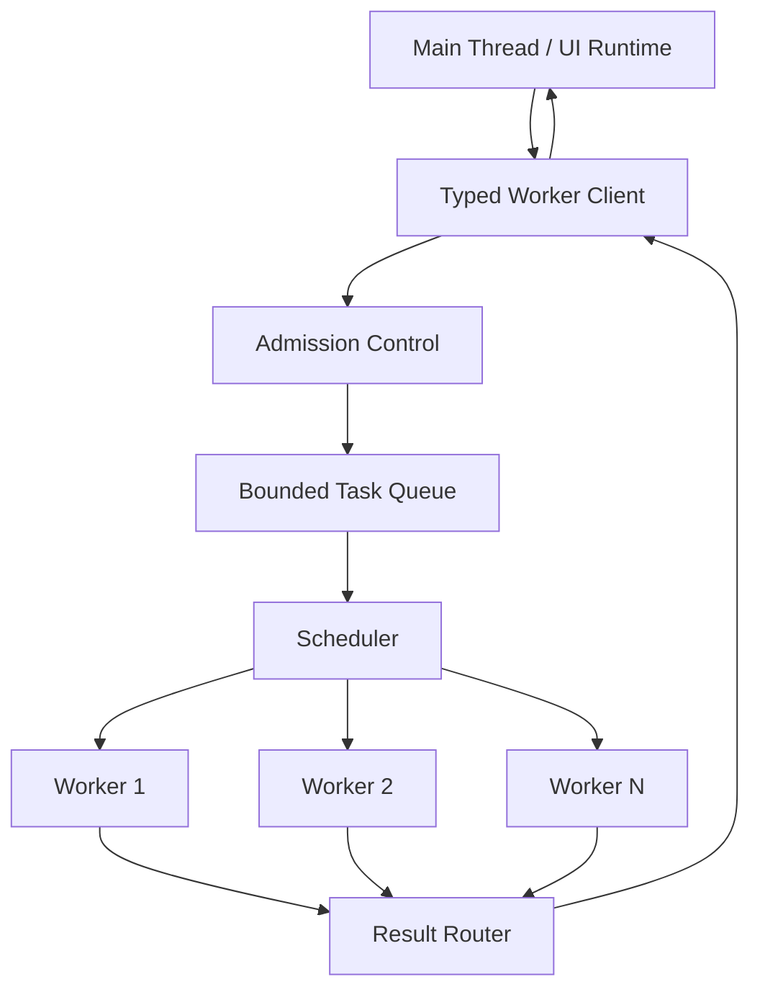
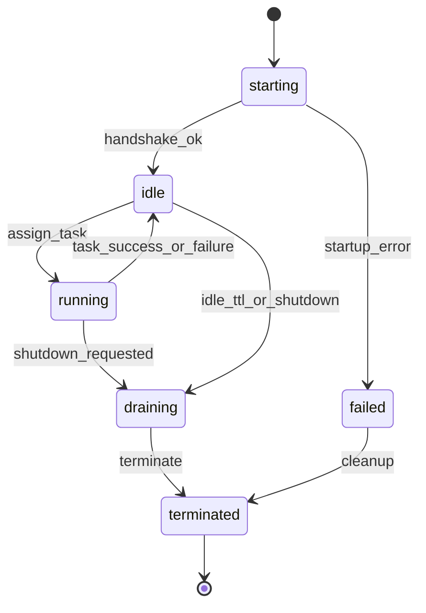
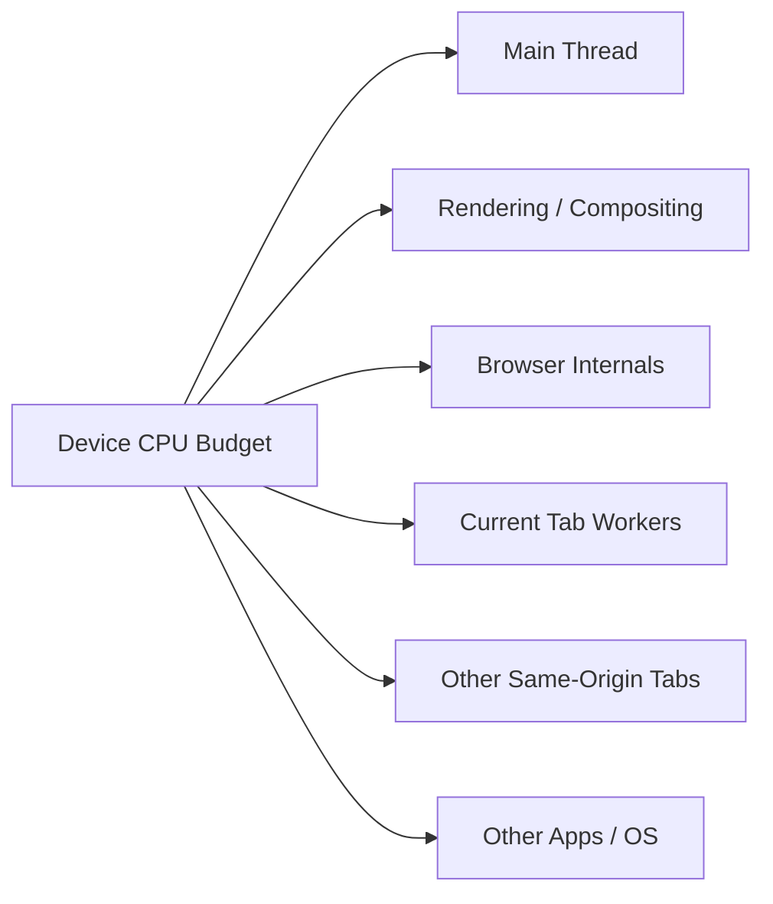
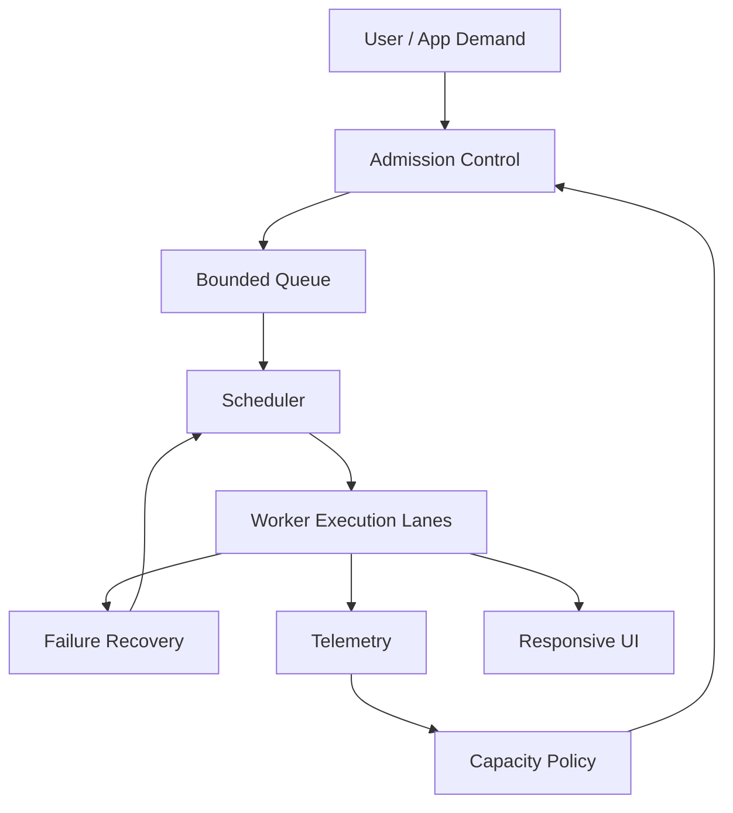

# Part 023 — Worker Pool Design

A worker pool is not a performance feature by default.

It is a concurrency control system.

That distinction matters. Many teams create a pool because “more workers means more parallelism”. In production, that often turns into the browser equivalent of a database connection storm: too many execution contexts, too many copied payloads, too much memory pressure, too many background tasks competing with the user interaction that the app was supposed to protect.

A good worker pool does not ask:

> How many workers can we start?

It asks:

> How much useful work can this tab safely run without making the browser, device, network, memory, and user experience worse?

This part builds the mental model and implementation surface for a serious browser-side worker pool.

---

## 1. Worker pool as a local scheduler

A single dedicated worker gives you one background execution lane.

A worker pool gives you several execution lanes plus a scheduler in front of them.



The pool has five responsibilities:

| Responsibility | Question |
|---|---|
| Admission | Should this task enter the system at all? |
| Scheduling | Which accepted task should run next? |
| Placement | Which worker should run it? |
| Lifecycle | When should workers start, restart, idle, or terminate? |
| Accounting | What happened, how long did it take, and what failed? |

If your implementation only wraps `new Worker()` in an array, you do not have a pool. You have several independent workers with no operating model.

---

## 2. When a worker pool is the wrong answer

Before building a pool, reject weak reasons.

A worker pool is usually the wrong answer when:

- the task is I/O-bound and already async, such as `fetch`
- the task is tiny and serialization cost dominates compute cost
- tasks mutate shared browser state that must be serialized anyway
- one worker already keeps CPU utilization high enough
- the app is mostly idle and tasks are user-triggered one at a time
- the browser is running on low-memory mobile devices
- multiple tabs may each create their own pool and multiply load

Workers are helpful when main-thread work blocks responsiveness. Pools are helpful when there are multiple independent CPU-heavy tasks that can make progress in parallel.

A useful rule:

> Use a worker to protect the UI. Use a pool only when one worker becomes the bottleneck and the workload is safely parallelizable.

---

## 3. The hidden cost model

A worker is not free.

It has startup cost, memory cost, module loading cost, message serialization cost, result routing cost, and operational complexity.

| Cost | Where it appears |
|---|---|
| Startup latency | first task waits for worker boot and handshake |
| Module fetch/evaluation | worker script and dependencies load separately |
| Heap overhead | each worker has its own JS runtime state |
| Data clone | structured clone copies most payloads |
| Transfer detachment | transferable ownership moves away from sender |
| Scheduling complexity | stale results, cancellation, retry, priority inversion |
| Debug complexity | errors happen outside the main execution stack |

The pool should therefore be **bounded by design**.

Unbounded worker pools are a bug.

---

## 4. Pool sizing is a policy, not a constant

The browser exposes `navigator.hardwareConcurrency`, which returns the number of logical processors available to the user agent. Treat it as a hint, not a promise.

Do not blindly do this:

```ts
const size = navigator.hardwareConcurrency;
```

That can overconsume the device, especially when:

- the browser itself needs CPU
- rendering/compositing needs CPU/GPU coordination
- other tabs are active
- the OS is doing background work
- the user is on mobile or battery saver
- the app has several same-origin tabs open

A safer baseline:

```ts
function choosePoolSize(options?: { max?: number; min?: number }) {
  const logical = navigator.hardwareConcurrency || 2;
  const min = options?.min ?? 1;
  const max = options?.max ?? 4;

  // Reserve capacity for browser, rendering, OS, and other tabs.
  const reserved = 1;
  const candidate = Math.max(min, logical - reserved);

  return Math.min(candidate, max);
}
```

For most browser applications, `1–4` workers is already a serious amount of parallelism.

A top-tier system does not maximize pool size. It adapts pool size to workload, device, and user experience.

---

## 5. Static vs adaptive pool sizing

There are three practical sizing models.

| Model | Description | Use when |
|---|---|---|
| Static | fixed pool size for app session | workload is predictable |
| Lazy | create workers only when demand appears | startup latency is acceptable |
| Adaptive | grow/shrink based on queue pressure and idle time | workload is bursty |

Static pool:

```ts
const pool = new WorkerPool({ size: 2 });
```

Lazy pool:

```ts
const pool = new WorkerPool({ minSize: 0, maxSize: 3, idleTtlMs: 30_000 });
```

Adaptive pool:

```ts
const pool = new WorkerPool({
  minSize: 1,
  maxSize: choosePoolSize({ max: 4 }),
  scaleUpWhenQueueDepthAtLeast: 2,
  idleTtlMs: 20_000,
});
```

Adaptive sizing sounds attractive, but it must be conservative. Worker startup itself consumes CPU and memory. Scaling up too aggressively during a burst can make the burst worse.

---

## 6. Worker states

A pool worker needs an explicit lifecycle.



Useful states:

| State | Meaning |
|---|---|
| `starting` | worker exists but has not completed handshake |
| `idle` | ready to accept a task |
| `running` | exactly one assigned task is active |
| `draining` | no new task, waiting for current task/cancel/timeout |
| `failed` | crashed, startup failed, or protocol violated |
| `terminated` | intentionally shut down and removed from pool |

Avoid implicit states. A worker that is “probably free” is a production incident waiting to happen.

---

## 7. Task shape for a pool

A pool task needs more metadata than a simple worker message.

```ts
type TaskPriority = "user-blocking" | "normal" | "background";

type PoolTask<TPayload = unknown> = {
  id: string;
  kind: string;
  payload: TPayload;
  transfer?: Transferable[];

  priority: TaskPriority;
  createdAt: number;
  deadlineAt?: number;
  timeoutMs: number;

  idempotencyKey?: string;
  supersedesKey?: string;
  estimatedCost?: "small" | "medium" | "large";
  estimatedBytes?: number;

  signal?: AbortSignal;
};
```

This metadata supports real scheduling decisions:

- reject expired work before running it
- drop superseded tasks
- prioritize user-blocking tasks
- avoid large-payload overload
- route cancellation
- enforce deadlines
- measure latency by queue time and run time

Without metadata, the pool can only do FIFO. FIFO is often wrong for UI systems.

---

## 8. Admission control

Admission control is the first line of defense.

A task can be rejected before entering the queue when:

- queue length is above limit
- total estimated queued bytes exceed budget
- task deadline is already expired
- caller already aborted the task
- a newer task supersedes an older one
- app lifecycle says background work is paused
- circuit breaker is open

```ts
function admit(task: PoolTask, queue: PoolTask[], policy: PoolPolicy) {
  if (task.signal?.aborted) {
    return { ok: false as const, reason: "aborted" };
  }

  if (task.deadlineAt !== undefined && performance.now() > task.deadlineAt) {
    return { ok: false as const, reason: "expired" };
  }

  if (queue.length >= policy.maxQueueDepth) {
    return { ok: false as const, reason: "queue_full" };
  }

  const queuedBytes = queue.reduce((sum, item) => sum + (item.estimatedBytes ?? 0), 0);
  if (queuedBytes + (task.estimatedBytes ?? 0) > policy.maxQueuedBytes) {
    return { ok: false as const, reason: "queue_bytes_exceeded" };
  }

  return { ok: true as const };
}
```

The goal is not to accept everything. The goal is to preserve useful work under constraint.

---

## 9. Scheduling strategies

A browser worker pool rarely needs a complex scheduler, but it needs an explicit one.

| Strategy | Good for | Risk |
|---|---|---|
| FIFO | simple batch work | user-blocking task can wait too long |
| Priority queue | interactive apps | background starvation |
| Earliest deadline first | deadline-sensitive work | noisy estimates cause churn |
| Shortest estimated job first | reducing average latency | large jobs starve |
| Sharded queue | key-based ordering | hot shard bottleneck |

A practical default:

1. reject expired tasks
2. run `user-blocking` first
3. then `normal`
4. then `background`
5. within each priority, FIFO
6. cap how many high-priority tasks can bypass background work continuously

```ts
const priorityRank: Record<TaskPriority, number> = {
  "user-blocking": 0,
  normal: 1,
  background: 2,
};

function pickNextTask(queue: PoolTask[]) {
  const now = performance.now();

  let bestIndex = -1;
  let best: PoolTask | undefined;

  for (let i = 0; i < queue.length; i++) {
    const task = queue[i];

    if (task.deadlineAt !== undefined && task.deadlineAt <= now) {
      continue;
    }

    if (!best) {
      best = task;
      bestIndex = i;
      continue;
    }

    const rankA = priorityRank[task.priority];
    const rankB = priorityRank[best.priority];

    if (rankA < rankB) {
      best = task;
      bestIndex = i;
    }
  }

  if (bestIndex === -1) return undefined;
  return queue.splice(bestIndex, 1)[0];
}
```

This is intentionally simple. Complexity belongs where measurement proves it is needed.

---

## 10. Placement strategies

Placement decides which idle worker gets the task.

Common strategies:

| Strategy | Description |
|---|---|
| Any idle | assign to first idle worker |
| Least recently used | rotate workers evenly |
| Affinity | send same key/category to same worker |
| Warm capability | assign task to worker that already loaded needed module/data |

Affinity matters when a worker maintains local caches.

Example: a search index worker may keep an in-memory index. Sending all search tasks to the same worker avoids rebuilding or copying the index repeatedly.

But affinity reduces parallelism. You are trading CPU distribution for memory locality.

```ts
function chooseWorker(workers: PoolWorker[], task: PoolTask) {
  const idle = workers.filter((worker) => worker.state === "idle");
  if (idle.length === 0) return undefined;

  if (task.kind.startsWith("search.")) {
    const warm = idle.find((worker) => worker.capabilities.has("search-index-loaded"));
    if (warm) return warm;
  }

  return idle[0];
}
```

---

## 11. Minimal worker pool implementation

This is a compact skeleton. It is not a library. It is a reference shape.

```ts
type PoolPolicy = {
  minSize: number;
  maxSize: number;
  maxQueueDepth: number;
  maxQueuedBytes: number;
  idleTtlMs: number;
};

type PoolWorker = {
  id: string;
  worker: Worker;
  state: "starting" | "idle" | "running" | "draining" | "failed" | "terminated";
  currentTaskId?: string;
  generation: number;
  capabilities: Set<string>;
  lastUsedAt: number;
};

type Pending = {
  resolve: (value: unknown) => void;
  reject: (reason: unknown) => void;
  timeoutId: number;
  startedAt?: number;
};

class WorkerPool {
  private workers = new Map<string, PoolWorker>();
  private queue: PoolTask[] = [];
  private pending = new Map<string, Pending>();
  private generation = 0;

  constructor(
    private readonly createWorker: () => Worker,
    private readonly policy: PoolPolicy,
  ) {}

  async submit<T>(task: PoolTask): Promise<T> {
    const admission = admit(task, this.queue, this.policy);
    if (!admission.ok) {
      throw new Error(`Worker pool rejected task: ${admission.reason}`);
    }

    return new Promise<T>((resolve, reject) => {
      const timeoutId = window.setTimeout(() => {
        this.pending.delete(task.id);
        reject(new Error(`Task timed out: ${task.id}`));
      }, task.timeoutMs);

      this.pending.set(task.id, { resolve: resolve as (value: unknown) => void, reject, timeoutId });
      this.queue.push(task);
      this.scaleIfNeeded();
      this.drain();
    });
  }

  private scaleIfNeeded() {
    const live = [...this.workers.values()].filter((w) => w.state !== "terminated");
    const idle = live.filter((w) => w.state === "idle");

    if (this.queue.length > idle.length && live.length < this.policy.maxSize) {
      this.spawnWorker();
    }
  }

  private spawnWorker() {
    const id = crypto.randomUUID();
    const worker = this.createWorker();
    const poolWorker: PoolWorker = {
      id,
      worker,
      state: "starting",
      generation: ++this.generation,
      capabilities: new Set(),
      lastUsedAt: performance.now(),
    };

    worker.onmessage = (event) => this.handleMessage(poolWorker, event.data);
    worker.onerror = (event) => this.handleWorkerFailure(poolWorker, event.error ?? event.message);
    worker.onmessageerror = () => this.handleWorkerFailure(poolWorker, new Error("messageerror"));

    this.workers.set(id, poolWorker);

    worker.postMessage({ type: "pool.init", workerId: id, generation: poolWorker.generation });
  }

  private drain() {
    while (true) {
      const idle = [...this.workers.values()].find((w) => w.state === "idle");
      if (!idle) return;

      const task = pickNextTask(this.queue);
      if (!task) return;

      idle.state = "running";
      idle.currentTaskId = task.id;
      idle.lastUsedAt = performance.now();

      const pending = this.pending.get(task.id);
      if (pending) pending.startedAt = performance.now();

      idle.worker.postMessage(
        {
          type: "task.run",
          taskId: task.id,
          kind: task.kind,
          payload: task.payload,
          deadlineAt: task.deadlineAt,
        },
        task.transfer ?? [],
      );
    }
  }

  private handleMessage(poolWorker: PoolWorker, message: any) {
    if (message?.type === "pool.ready") {
      poolWorker.state = "idle";
      for (const capability of message.capabilities ?? []) {
        poolWorker.capabilities.add(capability);
      }
      this.drain();
      return;
    }

    if (message?.type === "task.result" || message?.type === "task.error") {
      const taskId = message.taskId;
      const pending = this.pending.get(taskId);

      poolWorker.currentTaskId = undefined;
      poolWorker.state = "idle";
      poolWorker.lastUsedAt = performance.now();

      if (!pending) {
        // Stale result, timed-out task, cancelled task, or duplicate message.
        this.drain();
        return;
      }

      clearTimeout(pending.timeoutId);
      this.pending.delete(taskId);

      if (message.type === "task.result") {
        pending.resolve(message.result);
      } else {
        pending.reject(new Error(message.error?.message ?? "Worker task failed"));
      }

      this.drain();
    }
  }

  private handleWorkerFailure(poolWorker: PoolWorker, reason: unknown) {
    poolWorker.state = "failed";

    if (poolWorker.currentTaskId) {
      const pending = this.pending.get(poolWorker.currentTaskId);
      if (pending) {
        clearTimeout(pending.timeoutId);
        this.pending.delete(poolWorker.currentTaskId);
        pending.reject(reason);
      }
    }

    try {
      poolWorker.worker.terminate();
    } finally {
      poolWorker.state = "terminated";
      this.workers.delete(poolWorker.id);
      this.scaleIfNeeded();
      this.drain();
    }
  }
}
```

The important point is not the exact code. The important point is the shape:

- explicit worker state
- bounded queue
- pending request map
- timeout cleanup
- stale result guard
- crash path
- separate admission and scheduling

---

## 12. Worker-side dispatcher

The worker must also be protocol-aware.

```ts
type WorkerTaskMessage = {
  type: "task.run";
  taskId: string;
  kind: string;
  payload: unknown;
  deadlineAt?: number;
};

const handlers: Record<string, (payload: unknown, ctx: TaskContext) => Promise<unknown>> = {
  "csv.parse": parseCsv,
  "search.buildIndex": buildSearchIndex,
  "diff.compute": computeDiff,
};

type TaskContext = {
  taskId: string;
  deadlineAt?: number;
  throwIfExpired(): void;
};

self.onmessage = async (event) => {
  const message = event.data;

  if (message?.type === "pool.init") {
    self.postMessage({ type: "pool.ready", capabilities: Object.keys(handlers) });
    return;
  }

  if (message?.type !== "task.run") return;

  const task = message as WorkerTaskMessage;
  const handler = handlers[task.kind];

  if (!handler) {
    self.postMessage({
      type: "task.error",
      taskId: task.taskId,
      error: { code: "UNKNOWN_TASK_KIND", message: task.kind },
    });
    return;
  }

  const ctx: TaskContext = {
    taskId: task.taskId,
    deadlineAt: task.deadlineAt,
    throwIfExpired() {
      if (task.deadlineAt !== undefined && performance.now() > task.deadlineAt) {
        throw new Error("Task deadline expired");
      }
    },
  };

  try {
    const result = await handler(task.payload, ctx);
    self.postMessage({ type: "task.result", taskId: task.taskId, result });
  } catch (error) {
    self.postMessage({
      type: "task.error",
      taskId: task.taskId,
      error: serializeError(error),
    });
  }
};

function serializeError(error: unknown) {
  if (error instanceof Error) {
    return { name: error.name, message: error.message, stack: error.stack };
  }
  return { name: "UnknownError", message: String(error) };
}
```

The worker should reject unknown task kinds explicitly. Silent drop is a protocol bug.

---

## 13. Over-parallelism

Over-parallelism is when adding workers reduces system quality.

Symptoms:

- queue latency drops but UI still stutters
- total runtime gets worse
- memory usage spikes
- mobile browser kills or reloads the tab
- worker startup dominates task duration
- GC pauses increase
- battery drain becomes visible
- all same-origin tabs become slow together

The browser has multiple competing actors:



A pool that consumes all available cores can still harm UX if the rendering path, input handling, or other tabs are starved.

Use metrics, not confidence.

---

## 14. Multi-tab pool stampede

This series is about multi-tab orchestration, so we must state the larger problem early.

A per-tab worker pool is dangerous when users open several tabs of the same app.

If each tab creates a 4-worker pool and the user opens 5 tabs, the origin may create 20 workers.

That is rarely what you intended.

Mitigations:

| Strategy | Description |
|---|---|
| Visible-tab only pool | only active/visible tab runs heavy pool |
| Leader-tab execution | one elected tab performs shared background work |
| SharedWorker hub | same-origin contexts share one worker-like hub where supported |
| Web Locks coordination | acquire lock before running expensive shared job |
| Service Worker coordination | coordinate network/cache work centrally |
| Per-tab pool cap | reduce pool size when backgrounded |

A worker pool is local concurrency. Multi-tab orchestration is distributed concurrency. Do not confuse them.

---

## 15. Cancellation in a pool

Cancellation has two paths:

1. queued task cancellation
2. running task cancellation

Queued task cancellation is easy: remove from queue and reject promise.

Running task cancellation is a protocol message.

```ts
function cancelTask(taskId: string) {
  const queuedIndex = this.queue.findIndex((task) => task.id === taskId);

  if (queuedIndex >= 0) {
    this.queue.splice(queuedIndex, 1);
    const pending = this.pending.get(taskId);
    if (pending) {
      clearTimeout(pending.timeoutId);
      pending.reject(new DOMException("Task aborted", "AbortError"));
      this.pending.delete(taskId);
    }
    return;
  }

  const running = [...this.workers.values()].find((worker) => worker.currentTaskId === taskId);
  if (running) {
    running.worker.postMessage({ type: "task.cancel", taskId });
  }
}
```

The worker still needs cooperative checks. A cancel message cannot interrupt a tight CPU loop unless the loop yields or checks cancellation state.

---

## 16. Poison task detection

A poison task repeatedly crashes or hangs workers.

Production pools need to detect it.

Signals:

- same task kind crashes multiple workers
- same payload fingerprint causes repeated failure
- worker exits before responding
- timeout happens consistently for same task shape
- memory usage rises before crash

A simple defense:

```ts
type FailureKey = `${string}:${string}`; // kind:fingerprint
const failureCounts = new Map<FailureKey, number>();

function recordFailure(kind: string, fingerprint: string) {
  const key: FailureKey = `${kind}:${fingerprint}`;
  const next = (failureCounts.get(key) ?? 0) + 1;
  failureCounts.set(key, next);

  if (next >= 3) {
    openCircuitForTaskShape(kind, fingerprint);
  }
}
```

Never keep respawning workers forever for the same poison input.

That is a crash loop.

---

## 17. Result ordering

A pool breaks implicit ordering.

If task A is submitted before task B, B may finish first.

That is usually correct for independent work. It is wrong for stateful UI if the result should reflect latest user intent.

Use generation tokens.

```ts
let searchGeneration = 0;

async function runSearch(query: string) {
  const generation = ++searchGeneration;

  const result = await pool.submit<SearchResult>({
    id: crypto.randomUUID(),
    kind: "search.query",
    payload: { query },
    priority: "user-blocking",
    createdAt: performance.now(),
    timeoutMs: 5_000,
  });

  if (generation !== searchGeneration) {
    return; // stale result
  }

  renderSearchResult(result);
}
```

Do not expect the pool to know product freshness semantics. Freshness belongs to the caller or domain adapter.

---

## 18. Metrics that matter

Worker pool metrics should separate queueing from execution.

| Metric | Meaning |
|---|---|
| `queue.depth` | number of accepted but not started tasks |
| `queue.bytes` | estimated queued payload size |
| `task.wait_ms` | time from admission to worker assignment |
| `task.run_ms` | time inside worker |
| `task.total_ms` | wait + run + routing |
| `task.timeout_count` | exceeded deadline/timeout |
| `task.cancel_count` | cancelled before completion |
| `worker.spawn_ms` | startup and handshake latency |
| `worker.crash_count` | worker error/termination not requested |
| `result.stale_count` | result arrived after caller no longer needed it |
| `pool.rejection_count` | admission rejects by reason |

If you only measure total task time, you cannot tell whether the bottleneck is queueing, execution, startup, serialization, or stale result handling.

---

## 19. Debugging hooks

Expose a debug snapshot in development.

```ts
type PoolSnapshot = {
  workers: Array<{
    id: string;
    state: PoolWorker["state"];
    currentTaskId?: string;
    generation: number;
    lastUsedAt: number;
  }>;
  queue: Array<{
    id: string;
    kind: string;
    priority: TaskPriority;
    createdAt: number;
    deadlineAt?: number;
  }>;
  pendingCount: number;
};
```

Then attach it carefully:

```ts
if (import.meta.env.DEV) {
  Object.assign(window, {
    __workerPoolDebug: () => pool.snapshot(),
  });
}
```

Do not expose arbitrary worker control APIs in production globals.

---

## 20. Testing strategy

A worker pool must be tested as a scheduler, not only as an algorithm wrapper.

Test cases:

| Case | Expected behavior |
|---|---|
| queue full | submit rejects with clear reason |
| worker startup failure | task rejects and pool does not hang |
| stale result | ignored, not rendered |
| timeout | pending entry cleaned |
| crash during task | task rejects, worker removed/restarted according to policy |
| priority | user-blocking work runs before background work |
| cancellation before run | task removed from queue |
| cancellation while running | cancel message sent and result ignored if late |
| duplicate result | second result ignored |
| malformed worker message | worker marked failed or message rejected |

The failure path is the product.

---

## 21. Production checklist

Before shipping a worker pool, answer these:

- What is the maximum number of workers per tab?
- What happens when the user opens five tabs?
- What is the maximum queue depth?
- What is the maximum queued byte budget?
- Which tasks are user-blocking vs background?
- Which tasks are allowed while tab is hidden?
- How are stale results detected?
- How are workers restarted after crash?
- What prevents poison task crash loops?
- What is the timeout per task kind?
- Are transferables used for large binary payloads?
- Are long-running loops cancellable?
- Are worker startup failures visible in telemetry?
- Is production build worker loading tested, not only dev server?

A pool is ready when its overload behavior is intentional.

---

## 22. Final mental model

A worker pool is a miniature operating system component inside the browser.

It schedules work, owns execution lanes, enforces capacity, routes results, observes failure, and protects the user experience.

The trap is to treat it like a convenience wrapper.

The better model:



The pool exists to keep the UI responsive while doing useful background computation.

If the pool itself becomes a source of contention, it has failed its mission.

---

## References

- MDN — Web Workers API: https://developer.mozilla.org/en-US/docs/Web/API/Web_Workers_API
- MDN — Using Web Workers: https://developer.mozilla.org/en-US/docs/Web/API/Web_Workers_API/Using_web_workers
- MDN — Worker.postMessage(): https://developer.mozilla.org/en-US/docs/Web/API/Worker/postMessage
- MDN — Transferable objects: https://developer.mozilla.org/en-US/docs/Web/API/Web_Workers_API/Transferable_objects
- MDN — Navigator.hardwareConcurrency: https://developer.mozilla.org/en-US/docs/Web/API/Navigator/hardwareConcurrency
