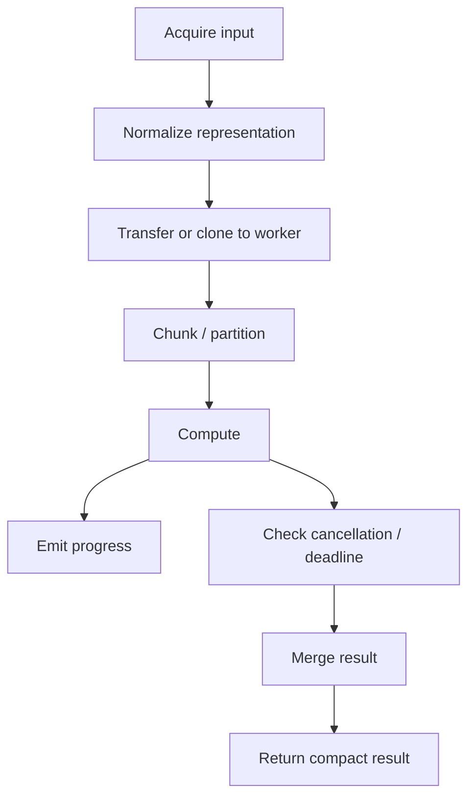
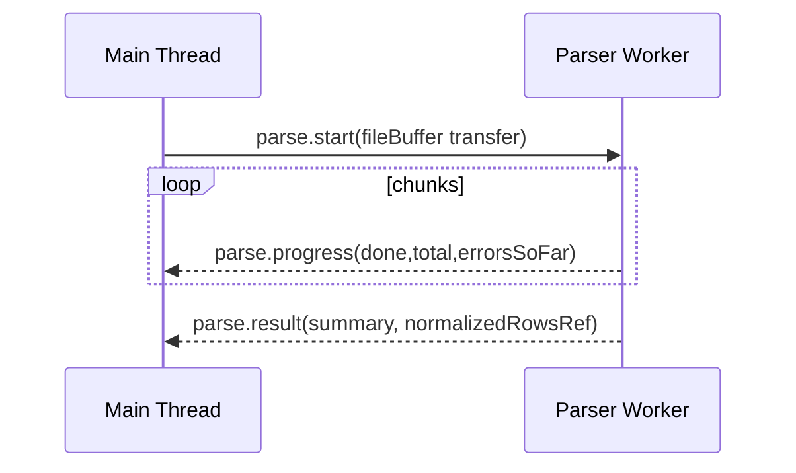
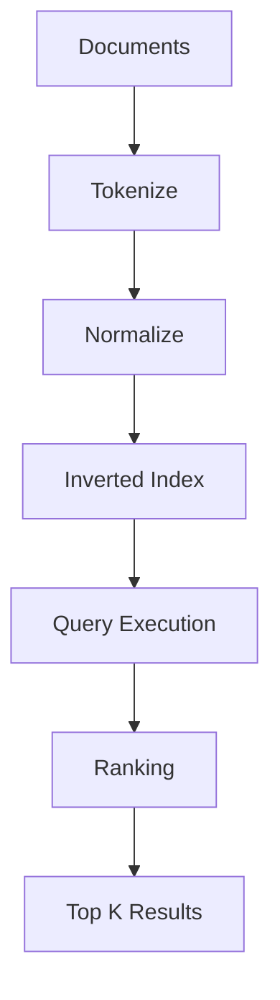
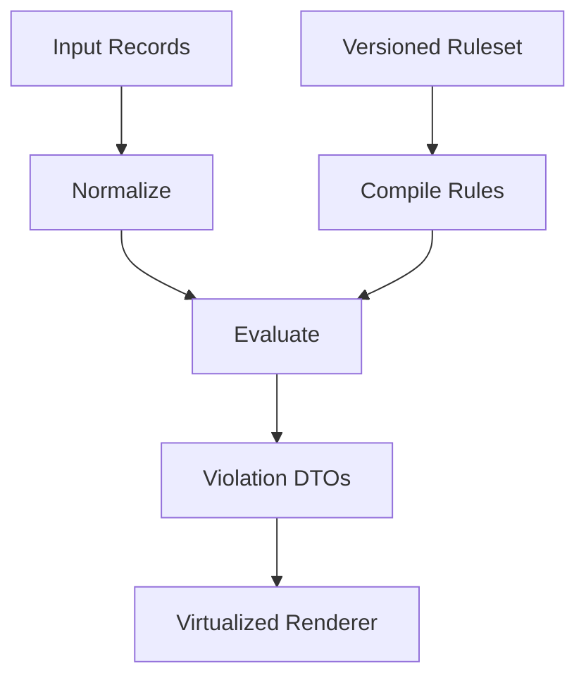
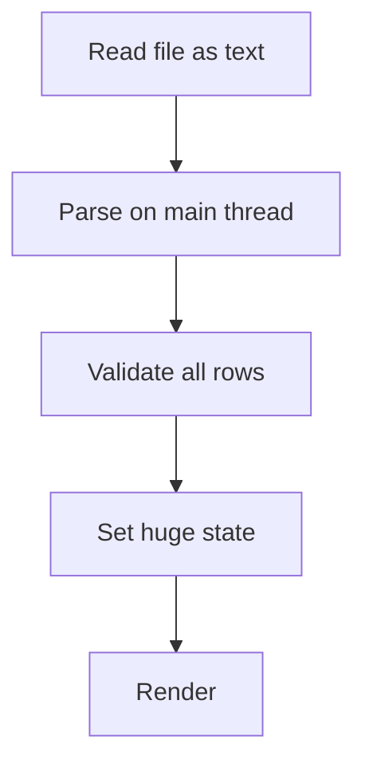
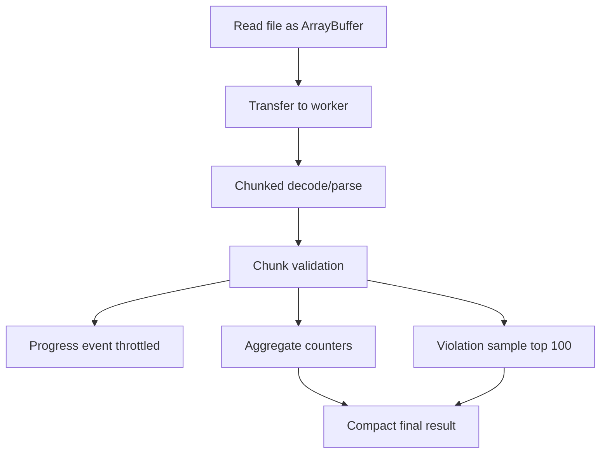
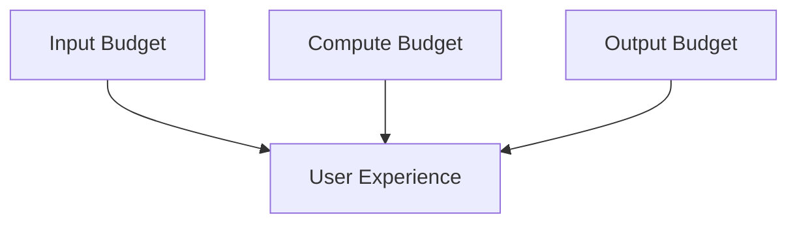

# Part 024 — CPU-Bound Workloads: Parsing, Search, Crypto, Compression, Diffing

Workers are most valuable when the main thread is doing work it should not be doing.

The easiest category to reason about is CPU-bound work: tasks where latency is dominated by computation rather than waiting for network or disk.

Examples:

- parsing large CSV/JSON/XML payloads
- validating thousands of records
- building search indexes
- computing fuzzy matches
- diffing large documents
- sorting, grouping, aggregating local datasets
- compressing or decompressing binary data
- hashing files or chunks
- transforming images or binary formats
- compiling templates or rules
- evaluating local policy/rule engines

The key question is not “can this run in a worker?”

The better question is:

> What is the smallest, safest unit of computation that can move off the main thread without creating more serialization, memory, lifecycle, and correctness problems than it solves?

---

## 1. CPU-bound work and the frame budget

The main thread is responsible for input handling, JavaScript execution, style, layout, paint coordination, and much of the application runtime.

A task that monopolizes the main thread for too long blocks responsiveness. The Long Tasks API models a long task as a UI-thread task taking 50 ms or more.

That does not mean 49 ms is good. It means 50 ms is an observable danger threshold.

At 60 frames per second, a frame budget is roughly 16.67 ms. Real application code gets only part of that budget because the browser also needs time.

So a 40 ms synchronous parse may not be reported as a long task, but it can still cause visible jank.

Workers give you another execution context so the main thread can continue responding.

They do not make the computation free.

---

## 2. The worker workload decision table

Use this table before moving work.

| Workload | Move to worker? | Reason |
|---|---:|---|
| Large local parse | yes | CPU-heavy and often bursty |
| Small JSON parse | usually no | message overhead may dominate |
| Search index build | yes | CPU + memory, can be amortized |
| Search query against existing small array | maybe | depends on size and frequency |
| File hashing | yes | chunked binary compute |
| Web Crypto digest | maybe | API already async and available in workers |
| Compression | yes | CPU-heavy, binary-friendly |
| DOM diff/patch | no | DOM is main-thread-bound |
| Virtual DOM render | usually no | framework-owned, DOM-adjacent |
| Data validation for thousands of rows | yes | pure compute, parallelizable |
| Network request | no | use async I/O, not worker by default |
| Business rule simulation | yes | deterministic CPU workload |

The strongest candidates are pure functions over serializable or transferable input.

```ts
type GoodWorkerTask = (input: SerializableOrTransferable) => SerializableOrTransferable;
```

The weakest candidates require live DOM, framework internals, global mutable UI state, or fine-grained synchronous callbacks into the main thread.

---

## 3. The CPU pipeline pattern

A CPU-heavy worker task should be modeled as a pipeline.



This gives you places to reason about cost:

| Stage | Common mistake |
|---|---|
| Acquire input | reading entire file into memory when streaming/chunking is possible |
| Normalize | converting binary to string too early |
| Transfer | copying large buffers instead of transferring them |
| Chunk | one giant loop that cannot observe cancellation |
| Compute | algorithmic complexity ignored |
| Progress | progress spam overwhelms main thread |
| Merge | returning huge result when caller needs summary |

A worker task is not just where computation happens. It is where data shape is controlled.

---

## 4. Chunking CPU work

A worker can run a long synchronous loop without blocking UI, but it still blocks that worker's own event loop.

That means:

- cancel messages cannot be processed
- progress cannot be emitted until loop yields
- other tasks assigned to same worker wait
- deadlines cannot be checked from external messages

So CPU work still benefits from chunking.

```ts
async function processInChunks<T>(
  items: T[],
  options: {
    chunkSize: number;
    signal: AbortSignal;
    onProgress?: (done: number, total: number) => void;
  },
  processOne: (item: T, index: number) => void,
) {
  for (let offset = 0; offset < items.length; offset += options.chunkSize) {
    if (options.signal.aborted) {
      throw new DOMException("Task aborted", "AbortError");
    }

    const end = Math.min(offset + options.chunkSize, items.length);

    for (let i = offset; i < end; i++) {
      processOne(items[i], i);
    }

    options.onProgress?.(end, items.length);

    // Yield so this worker can process cancellation and control messages.
    await new Promise<void>((resolve) => setTimeout(resolve, 0));
  }
}
```

In a worker, yielding is not about rendering. It is about control-plane responsiveness.

---

## 5. Parsing large data

Parsing is one of the most common worker workloads.

Examples:

- user imports a CSV file
- backend returns a large JSON snapshot
- app loads a policy/rules bundle
- document editor loads structured content
- BI UI loads local data extracts

The anti-pattern:

```ts
const rows = parseHugeCsvOnMainThread(fileText);
setRows(rows);
```

Problems:

- main thread freezes during parse
- memory spikes from full file text + parsed rows
- progress is unavailable
- cancellation is difficult
- invalid rows are discovered late

Better shape:



For large inputs, prefer binary-first thinking:

- read file as `ArrayBuffer`
- transfer the buffer to the worker when possible
- decode incrementally if format allows it
- emit compact progress events
- return normalized rows or write intermediate state to IndexedDB/OPFS if result is huge

A worker can protect the UI, but it cannot remove the memory cost of loading a huge file all at once.

---

## 6. CSV import example

A simple worker-side parser shape:

```ts
type CsvParseRequest = {
  delimiter: string;
  hasHeader: boolean;
  buffer: ArrayBuffer;
};

type CsvParseResult = {
  columns: string[];
  rows: Array<Record<string, string>>;
  errorCount: number;
};

async function parseCsv(payload: CsvParseRequest, ctx: TaskContext): Promise<CsvParseResult> {
  const decoder = new TextDecoder("utf-8");
  const text = decoder.decode(payload.buffer);

  const lines = text.split(/\r?\n/);
  const columns = payload.hasHeader
    ? splitCsvLine(lines[0], payload.delimiter)
    : inferColumns(lines[0], payload.delimiter);

  const rows: Array<Record<string, string>> = [];
  let errorCount = 0;

  for (let i = payload.hasHeader ? 1 : 0; i < lines.length; i++) {
    if ((i & 1023) === 0) {
      ctx.throwIfExpired();
      await ctx.yield?.();
    }

    try {
      const values = splitCsvLine(lines[i], payload.delimiter);
      rows.push(toRecord(columns, values));
    } catch {
      errorCount++;
    }
  }

  return { columns, rows, errorCount };
}
```

This is deliberately simplified. A production CSV parser needs correct quoted-field handling, streaming behavior, encoding strategy, row limits, and validation policy.

The architecture point remains: parse work belongs outside the UI thread when it is large enough to affect responsiveness.

---

## 7. Search indexing

Search has two different workloads:

1. building the index
2. querying the index

Index build is usually heavier and more worker-friendly.



A simple inverted index shape:

```ts
type DocumentInput = {
  id: string;
  title: string;
  body: string;
};

type InvertedIndex = Map<string, Set<string>>;

function buildIndex(docs: DocumentInput[]) {
  const index: InvertedIndex = new Map();

  for (const doc of docs) {
    const tokens = tokenize(`${doc.title} ${doc.body}`);

    for (const token of tokens) {
      let postings = index.get(token);
      if (!postings) {
        postings = new Set();
        index.set(token, postings);
      }
      postings.add(doc.id);
    }
  }

  return serializeIndex(index);
}
```

For production:

- store numeric document IDs instead of repeated strings
- use typed arrays for postings where possible
- separate token dictionary from postings lists
- return top-K results, not giant intermediate structures
- keep index inside a long-lived worker when memory locality matters
- version the index against source data generation

A search worker is often stateful. That means placement and lifecycle matter.

If the worker dies, the index must be rebuilt or restored.

---

## 8. Fuzzy search and cost control

Fuzzy search can get expensive quickly.

Distance algorithms such as Levenshtein are useful but can become costly across large candidate sets.

The usual production shape:

1. cheap candidate generation
2. expensive scoring only for candidates
3. top-K pruning
4. deadline/cancellation checks

```ts
function fuzzySearch(query: string, index: SearchIndex, deadlineAt: number) {
  const candidates = candidateLookup(query, index);
  const heap = new TopK<Result>(20);

  for (let i = 0; i < candidates.length; i++) {
    if ((i & 255) === 0 && performance.now() > deadlineAt) {
      throw new Error("Search deadline expired");
    }

    const candidate = candidates[i];
    const score = expensiveScore(query, candidate.normalizedText);
    heap.push({ id: candidate.id, score });
  }

  return heap.toSortedArray();
}
```

Do not compute expensive distance across every document if a cheap inverted index, prefix index, trigram index, or domain-specific filter can reduce the candidate set first.

Algorithm choice beats thread count.

---

## 9. Diffing large documents

Diffing looks simple until input size grows.

Common diff workloads:

- text diff
- JSON diff
- object graph diff
- document editor changes
- table row comparison
- policy/rule config comparison

Pitfalls:

- naive O(n²) algorithms on large input
- returning huge patch structures
- diffing unstable generated fields
- not canonicalizing before compare
- running diff on every keystroke
- rendering diff output on main thread without virtualization

Worker diff should produce compact, renderable output.

```ts
type DiffRequest = {
  left: string;
  right: string;
  mode: "line" | "word";
};

type DiffHunk = {
  kind: "equal" | "insert" | "delete" | "replace";
  leftStart: number;
  leftEnd: number;
  rightStart: number;
  rightEnd: number;
};
```

Avoid returning per-character UI spans for huge documents. Return hunks. Let the main thread render progressively.

---

## 10. Compression and decompression

Compression is usually CPU-heavy and binary-friendly.

It often fits workers well because:

- input/output are `ArrayBuffer` or typed arrays
- transferables reduce copy cost
- work can be chunked
- progress can be reported
- UI does not need synchronous access to intermediate state

Shape:

```ts
type CompressRequest = {
  input: ArrayBuffer;
  algorithm: "gzip" | "deflate";
};

type CompressResult = {
  output: ArrayBuffer;
  originalBytes: number;
  compressedBytes: number;
};
```

When returning a large `ArrayBuffer`, transfer it back:

```ts
self.postMessage(
  {
    type: "task.result",
    taskId,
    result: {
      output,
      originalBytes,
      compressedBytes: output.byteLength,
    },
  },
  [output],
);
```

The sender loses ownership of a transferred `ArrayBuffer`. That is the point. Transfer avoids copying by moving ownership.

---

## 11. Crypto and hashing

Crypto has a special rule:

> Do not invent cryptography because you moved code into a worker.

Use Web Crypto APIs where appropriate. `crypto.subtle.digest()` is available in workers and provides digest algorithms such as SHA-256. It is asynchronous and avoids hand-written hash implementations.

Example worker hash task:

```ts
type HashRequest = {
  algorithm: "SHA-256" | "SHA-384" | "SHA-512";
  input: ArrayBuffer;
};

async function hashFile(payload: HashRequest) {
  const digest = await crypto.subtle.digest(payload.algorithm, payload.input);
  return {
    algorithm: payload.algorithm,
    digestHex: toHex(new Uint8Array(digest)),
  };
}

function toHex(bytes: Uint8Array) {
  return [...bytes].map((byte) => byte.toString(16).padStart(2, "0")).join("");
}
```

Important caveats:

- digest APIs usually process the whole input passed to them
- for huge files, memory strategy matters
- hashing is not encryption
- checksums are not authenticity
- do not use raw hashes for password storage
- do not design authentication protocols inside app code

Workers help with placement. They do not make insecure crypto secure.

---

## 12. Validation and rule engines

Enterprise UIs often contain CPU-heavy validation:

- imported spreadsheet validation
- regulatory rule evaluation
- eligibility checks
- workflow condition evaluation
- schema validation
- cross-record consistency checks

These workloads are often ideal for workers because they are deterministic and can be expressed as pure computation over data snapshots.

Architecture:



Keep rule evaluation versioned.

```ts
type ValidationRequest = {
  dataVersion: string;
  rulesetVersion: string;
  records: unknown[];
};

type ValidationResult = {
  dataVersion: string;
  rulesetVersion: string;
  violations: Array<{
    recordId: string;
    ruleId: string;
    severity: "error" | "warning" | "info";
    message: string;
  }>;
};
```

The UI should reject stale validation results if the data or ruleset changed while the worker was running.

---

## 13. Sorting, grouping, and aggregation

Sorting a large array on the main thread is a classic jank source.

But moving sort to a worker is not automatically beneficial if the whole dataset must be cloned twice.

Better options:

| Scenario | Strategy |
|---|---|
| small array | sort on main thread |
| large primitive numeric data | use typed arrays and transfer |
| large records | sort IDs/indices, not full objects |
| visible table | sort worker-side, render virtualized subset |
| repeated sort/filter | keep worker-side indexed representation |

Instead of returning sorted full records, return sorted IDs.

```ts
type SortRequest = {
  rows: Array<{ id: string; amount: number; createdAt: number }>;
  by: "amount" | "createdAt";
  direction: "asc" | "desc";
};

type SortResult = {
  orderedIds: string[];
};
```

The main thread can then map IDs to existing records if it already owns the canonical data.

Avoid duplicating canonical state unless the worker is intentionally the owner of that state.

---

## 14. Returning less data

One of the best optimizations is to not return what the UI does not need.

Bad:

```ts
return allIntermediateMatches;
```

Better:

```ts
return {
  totalMatches,
  topResults,
  facets,
  truncated: totalMatches > topResults.length,
};
```

For CPU-bound tasks, result shape is part of performance design.

Ask:

- Does the UI need all rows or top-K?
- Does the UI need full records or IDs?
- Does the UI need raw output or summary?
- Can large results be stored in IndexedDB/OPFS and referenced by key?
- Can rendering be paginated or virtualized?

Workers protect computation. They do not protect the main thread from rendering a massive result.

---

## 15. Progress events without flooding

Progress is useful. Progress spam is not.

Do not post progress after every row.

Use throttling.

```ts
function createProgressReporter(taskId: string, minIntervalMs = 100) {
  let last = 0;

  return (done: number, total: number) => {
    const now = performance.now();
    if (now - last < minIntervalMs && done !== total) return;

    last = now;
    self.postMessage({
      type: "task.progress",
      taskId,
      done,
      total,
      ratio: total === 0 ? 1 : done / total,
    });
  };
}
```

The main thread should also treat progress as rendering input with its own cadence. Updating React/Vue state 100 times per second is often self-inflicted jank.

---

## 16. CPU workload envelope

A good CPU task envelope includes:

```ts
type CpuTaskEnvelope<TPayload> = {
  taskId: string;
  kind: string;
  payload: TPayload;
  createdAt: number;
  deadlineAt?: number;
  generation?: number;
  traceId?: string;
  expectedMaxOutputBytes?: number;
};
```

And a good CPU result includes:

```ts
type CpuTaskResult<TResult> = {
  taskId: string;
  ok: true;
  result: TResult;
  stats: {
    computeMs: number;
    inputBytes?: number;
    outputBytes?: number;
    chunks?: number;
  };
} | {
  taskId: string;
  ok: false;
  error: {
    code: string;
    message: string;
    retryable: boolean;
  };
  stats: {
    computeMs: number;
  };
};
```

This makes CPU tasks observable and comparable.

---

## 17. Benchmarking CPU tasks

Benchmark inside the worker and at the caller.

Inside worker:

```ts
const started = performance.now();
const result = compute(payload);
const computeMs = performance.now() - started;
```

At caller:

```ts
const submittedAt = performance.now();
const result = await pool.submit(task);
const totalMs = performance.now() - submittedAt;
```

You need both:

| Measurement | Meaning |
|---|---|
| compute time | actual worker CPU duration |
| queue wait | pool contention |
| total time | user-visible latency |
| clone/transfer time approximation | gap around `postMessage` + first worker timestamp |
| render time | cost after result returns |

Do not celebrate faster worker compute if total interaction latency stays the same because payload movement or rendering dominates.

---

## 18. Case study: large import validation

Scenario:

A user imports a 50 MB CSV with 500,000 rows. The app must parse, validate, show progress, display first 100 errors, and allow cancellation.

Naive design:



Failure:

- UI freezes
- memory spikes
- user cannot cancel
- all errors are stored before any feedback
- render receives too much data

Worker design:



Result DTO:

```ts
type ImportValidationResult = {
  rowCount: number;
  validCount: number;
  invalidCount: number;
  sampledViolations: Array<{
    rowNumber: number;
    column?: string;
    code: string;
    message: string;
  }>;
  truncatedViolations: boolean;
};
```

Notice what is missing: 500,000 parsed row objects returned to UI.

The UI probably does not need that immediately. Store full normalized data in IndexedDB/OPFS later if required, or return a handle/key in a later architecture.

---

## 19. Worker CPU anti-patterns

Avoid these:

| Anti-pattern | Why it fails |
|---|---|
| Move everything to worker | overhead and complexity explode |
| Return massive object graphs | clone cost and render cost dominate |
| No cancellation checks | obsolete work keeps running |
| No deadline | slow tasks consume capacity indefinitely |
| Progress per item | message storm |
| Pool size equals all cores | over-parallelism |
| Rebuild index every query | wasteful, bad latency |
| Store UI state inside worker | ownership confusion |
| Ignore version/generation | stale result overwrites fresh UI |
| Hand-written crypto | security risk |

A worker is a placement tool. It is not a substitute for algorithmic discipline.

---

## 20. Production checklist

Before moving CPU work to a worker, answer:

- Is the workload truly CPU-bound?
- How large is the input in bytes and records?
- What is the expected output size?
- Can input be transferred instead of cloned?
- Can the work be chunked?
- Can the work be cancelled?
- What is the deadline?
- What result generation/version makes stale results detectable?
- What progress cadence is safe?
- Is the algorithm complexity acceptable?
- Can the worker keep state, or must it be stateless?
- What happens when the tab is hidden?
- What happens when the worker crashes mid-task?
- Does the main thread still jank when rendering the result?

The last question is critical. Moving computation to a worker only solves the computation part.

---

## 21. Final mental model

A CPU-bound worker task has three budgets:



Input budget is the cost of moving and representing data.

Compute budget is the cost of the algorithm.

Output budget is the cost of returning and rendering results.

Many teams optimize only compute. Senior engineers optimize the whole pipeline.

The high-level rule:

> Move CPU-heavy pure work to workers, keep payloads compact, transfer binary ownership when possible, chunk long loops, make work cancellable, return less data, and reject stale results.

That is how workers become a production architecture tool instead of a demo trick.

---

## References

- MDN — Web Workers API: https://developer.mozilla.org/en-US/docs/Web/API/Web_Workers_API
- MDN — Worker.postMessage(): https://developer.mozilla.org/en-US/docs/Web/API/Worker/postMessage
- MDN — Transferable objects: https://developer.mozilla.org/en-US/docs/Web/API/Web_Workers_API/Transferable_objects
- MDN — PerformanceLongTaskTiming: https://developer.mozilla.org/en-US/docs/Web/API/PerformanceLongTaskTiming
- MDN — SubtleCrypto.digest(): https://developer.mozilla.org/en-US/docs/Web/API/SubtleCrypto/digest
