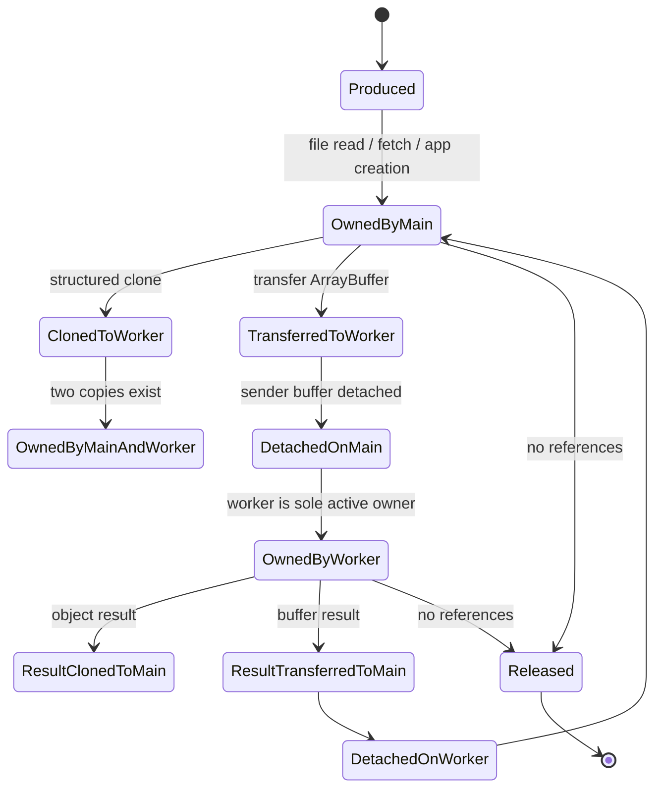
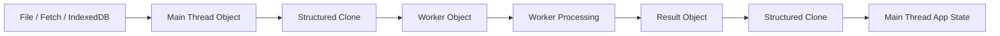
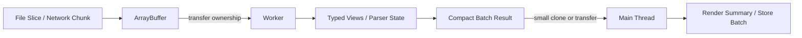
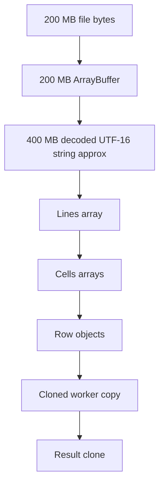
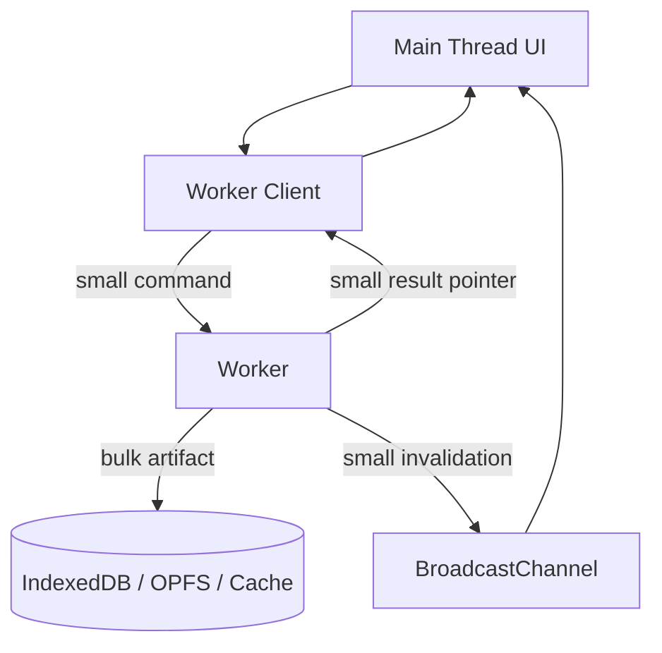
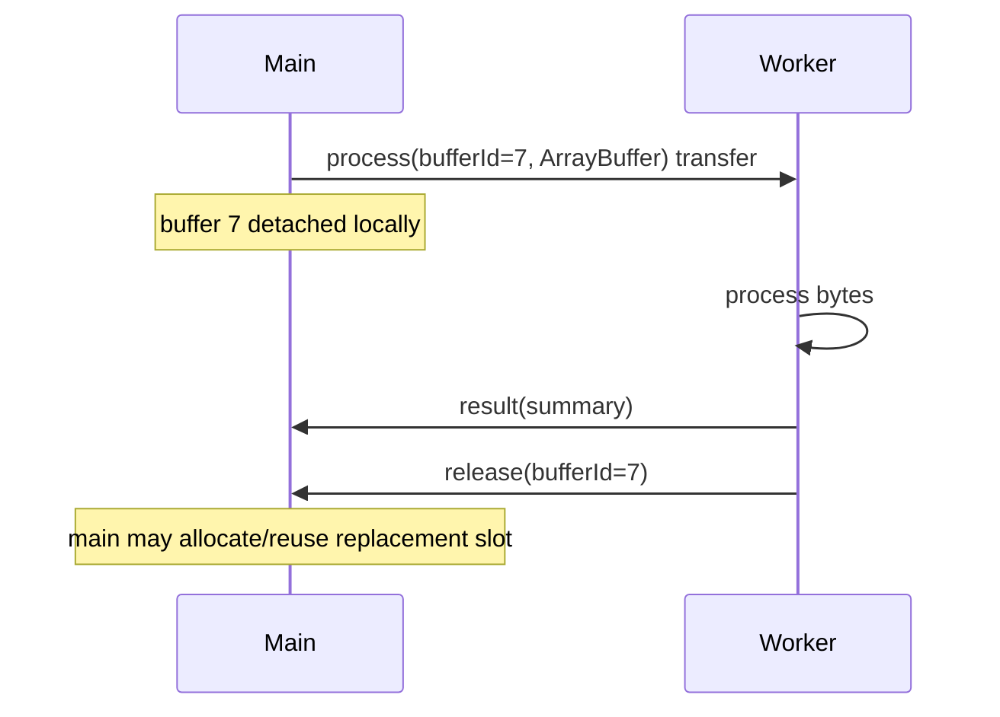
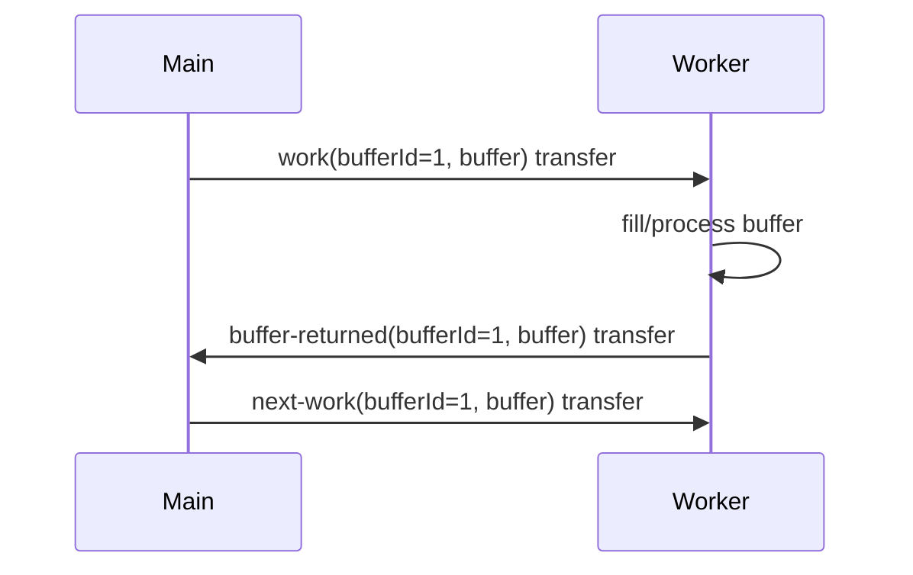
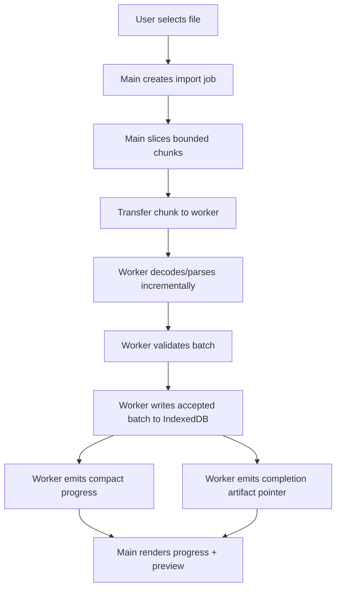

# Part 025 — Memory-Bound Workloads and Data Copy Avoidance

A worker does not automatically make a workload fast.

A worker only moves execution away from the main thread.

If the real bottleneck is allocation, cloning, object hydration, garbage collection, or moving a giant payload between contexts, a worker can make the system *feel* more responsive while still making total latency and memory consumption worse.

This part is about that category.

A CPU-bound workload asks:

> How many operations must we perform?

A memory-bound workload asks:

> How many bytes do we allocate, copy, retain, detach, rehydrate, and eventually force the garbage collector to clean up?

That second question is often the hidden reason a worker design fails in production.

---

## 1. The mental model: bytes have ownership

Treat every large payload as a resource with ownership.

Not as “some JavaScript object”.

Not as “just JSON”.

Not as “a result from the API”.

A large payload moves through states:



The important question is:

> At this point in the pipeline, who owns the bytes?

If your architecture cannot answer that, it will eventually leak memory, double memory usage, or corrupt protocol assumptions.

---

## 2. What “memory-bound” means in browser worker systems

A workload is memory-bound when latency, responsiveness, or reliability is dominated by data movement and memory pressure rather than arithmetic.

Common browser examples:

- parsing a 300 MB CSV file
- loading a large JSON API response
- building a client-side search index
- diffing two large documents
- manipulating binary file chunks
- image/video/audio metadata processing
- compiling a large local rule set
- syncing a large offline queue
- hydrating thousands of records into objects
- moving large results between tab, worker, IndexedDB, and cache
- broadcasting a large message to several tabs

The failure mode is usually not subtle:

- UI becomes responsive after introducing a worker, but end-to-end operation is slower
- memory spikes to 2×, 3×, or 5× input size
- mobile browsers kill the tab
- the worker “randomly” disappears under pressure
- GC pauses increase
- duplicate copies exist in main thread, worker, IndexedDB transaction, and app state
- progress messages flood the main thread
- output object graph becomes too expensive to clone back

A worker can hide jank.

It cannot hide physics.

Bytes still move.

---

## 3. The browser data movement pipeline

A typical naive worker pipeline looks like this:



That diagram hides multiple copies.

For example, a CSV import may accidentally allocate:

1. the original file bytes
2. a decoded string
3. an array of lines
4. an array of columns per line
5. one object per row
6. validation error objects
7. a cloned worker copy
8. a cloned result copy
9. React/Vue state copies
10. IndexedDB serialized copies

A “simple” import can easily use many times the original file size.

The better architecture is streaming, chunked, transferable, and compact:



The goal is not “zero copy” everywhere.

The goal is **intentional copy**.

---

## 4. Structured clone is safe but not free

When you send data via `postMessage`, browser APIs generally use the structured clone algorithm.

Structured clone is powerful. It can copy complex JavaScript values, preserve many built-in types, and handle cyclic references.

But for large object graphs, this is still work.

The browser must walk the graph, create new values, and preserve graph relationships where supported.

That has consequences:

| Payload shape | Clone cost risk | Reason |
|---|---:|---|
| Small command object | low | tiny envelope |
| Large flat `ArrayBuffer` | medium if cloned, low if transferred | bytes dominate |
| Deep nested JSON | high | graph traversal + object allocation |
| Huge array of row objects | high | many allocations |
| `Map<string, object>` with nested values | high | graph traversal |
| Class instances | correctness risk | prototype/private fields not preserved like normal object behavior |
| Functions/DOM nodes | not cloneable | protocol failure |
| Typed arrays over transferred buffer | good if ownership is clear | compact binary representation |

Structured clone is usually a good control-plane tool.

It is not always a good data-plane tool.

---

## 5. Transferable objects: move ownership, do not duplicate bytes

Transferable objects let you move ownership of certain resources across contexts.

The most common worker data-plane primitive is `ArrayBuffer` transfer.

When an `ArrayBuffer` is transferred, the sender's buffer becomes detached. The receiver gets ownership.

That is exactly what you want for large binary chunks.

```ts
// main-thread.ts
const buffer = await file.slice(offset, offset + chunkSize).arrayBuffer();

worker.postMessage(
  {
    type: "parse-chunk",
    chunkId,
    offset,
    byteLength: buffer.byteLength,
    buffer,
  },
  [buffer],
);

// After transfer, this buffer is detached on the sender side.
console.log(buffer.byteLength); // usually 0 after detachment
```

On the worker side:

```ts
// worker.ts
self.onmessage = (event: MessageEvent) => {
  if (event.data.type !== "parse-chunk") return;

  const { chunkId, buffer } = event.data;
  const bytes = new Uint8Array(buffer);

  const result = parseChunk(bytes);

  self.postMessage({
    type: "chunk-parsed",
    chunkId,
    result,
  });
};
```

The trade-off is explicit:

- clone keeps sender ownership but duplicates data
- transfer avoids duplication but sender loses access

Transfer is not an optimization detail.

It is an ownership contract.

---

## 6. Clone vs transfer decision table

Use this table as a default policy.

| Data | Preferred movement | Reason |
|---|---|---|
| Small command envelope | clone | simpler and cheap |
| Tiny config object | clone | no need for transfer |
| Large binary input | transfer | avoid copy |
| Large binary output | transfer | avoid copy |
| Large JSON object graph | avoid sending as-is | flatten/chunk first |
| File chunks | transfer `ArrayBuffer` chunks | bounded memory |
| Search index artifact | transfer binary representation if possible | compact storage |
| Progress update | clone small summary | never send large partial state |
| Error result | clone small DTO | keep error protocol simple |
| Shared mutable state | avoid; use later SharedArrayBuffer only with strict design | shared memory raises correctness cost |

The high-level rule:

> Clone control messages. Transfer bulk data.

---

## 7. The object graph tax

JavaScript object graphs are ergonomic.

They are also memory-expensive.

Consider this row format:

```ts
type UserRow = {
  id: string;
  name: string;
  email: string;
  age: number;
  country: string;
  status: "active" | "blocked";
};

const rows: UserRow[] = [
  { id: "u1", name: "A", email: "a@example.com", age: 30, country: "ID", status: "active" },
  // ... 1,000,000 rows
];
```

This shape is pleasant for business logic, but expensive for transport:

- one object per row
- repeated property names internally represented by engine structures, but still many object allocations
- many strings
- nested references
- high GC pressure
- expensive clone traversal

A more compact intermediate shape may be better:

```ts
type UserColumns = {
  ids: string[];
  names: string[];
  emails: string[];
  ages: Uint16Array;
  countryCodes: Uint16Array;
  statuses: Uint8Array;
};
```

This is a columnar representation.

It is less ergonomic, but it can be much cheaper to move, store, scan, and validate.

A production system often uses two models:

| Model | Used for | Shape |
|---|---|---|
| transport model | worker boundary, storage, indexing | compact, chunked, binary or columnar |
| domain/view model | UI rendering and user interaction | ergonomic objects, limited window |

Do not hydrate one million records into view objects just because the parser can produce them.

Hydrate only the visible window, current page, or current validation error subset.

---

## 8. The peak memory problem

Average memory is not the only danger.

Peak memory kills browser workloads.

Imagine a 200 MB file.

A naive path:



The system may only need 200 MB of source data, but peak memory may approach multiple gigabytes depending on representation and lifecycle.

The fix is not just “use worker”.

The fix is:

- chunk input
- transfer chunks
- parse incrementally
- release references early
- emit compact batches
- store durable batches before reading more
- bound in-flight chunks
- avoid retaining both raw and hydrated representation

The invariant:

> Peak memory should be proportional to bounded chunk size plus bounded output buffer, not total file size.

---

## 9. Chunking as a memory safety primitive

Chunking is not only for progress bars.

Chunking is a memory safety primitive.

A chunked pipeline has three limits:

1. maximum chunk byte size
2. maximum in-flight chunks
3. maximum buffered output

Example config:

```ts
type MemoryPipelineConfig = {
  chunkSizeBytes: number;
  maxInFlightChunks: number;
  maxBufferedOutputBatches: number;
  maxOutputBatchRows: number;
};

const config: MemoryPipelineConfig = {
  chunkSizeBytes: 512 * 1024,
  maxInFlightChunks: 2,
  maxBufferedOutputBatches: 4,
  maxOutputBatchRows: 1_000,
};
```

This makes peak memory a design property.

Approximate active input memory:

```txt
active_input_bytes <= chunkSizeBytes * maxInFlightChunks
```

Approximate buffered output memory:

```txt
active_output <= maxBufferedOutputBatches * maxOutputBatchRows * average_row_size
```

This is not exact because JavaScript object overhead, strings, engine internals, and GC timing vary.

But it forces the right design conversation.

---

## 10. A bounded transferable chunk pipeline

Main-thread side:

```ts
type ParseChunkRequest = {
  type: "parse-chunk";
  requestId: string;
  fileId: string;
  chunkIndex: number;
  offset: number;
  finalChunk: boolean;
  buffer: ArrayBuffer;
};

type ChunkAck = {
  type: "chunk-ack";
  requestId: string;
  chunkIndex: number;
};

class ChunkPump {
  private nextChunkIndex = 0;
  private offset = 0;
  private inFlight = 0;
  private stopped = false;

  constructor(
    private readonly file: File,
    private readonly worker: Worker,
    private readonly fileId: string,
    private readonly chunkSizeBytes: number,
    private readonly maxInFlight: number,
  ) {
    this.worker.addEventListener("message", this.onMessage);
  }

  start(): void {
    void this.pump();
  }

  stop(): void {
    this.stopped = true;
    this.worker.removeEventListener("message", this.onMessage);
  }

  private readonly onMessage = (event: MessageEvent<ChunkAck>) => {
    if (event.data.type !== "chunk-ack") return;

    this.inFlight -= 1;
    void this.pump();
  };

  private async pump(): Promise<void> {
    while (!this.stopped && this.inFlight < this.maxInFlight && this.offset < this.file.size) {
      const start = this.offset;
      const end = Math.min(this.file.size, start + this.chunkSizeBytes);
      const buffer = await this.file.slice(start, end).arrayBuffer();

      const request: ParseChunkRequest = {
        type: "parse-chunk",
        requestId: crypto.randomUUID(),
        fileId: this.fileId,
        chunkIndex: this.nextChunkIndex,
        offset: start,
        finalChunk: end >= this.file.size,
        buffer,
      };

      this.inFlight += 1;
      this.nextChunkIndex += 1;
      this.offset = end;

      this.worker.postMessage(request, [buffer]);
    }
  }
}
```

Worker side:

```ts
type ParseChunkRequest = {
  type: "parse-chunk";
  requestId: string;
  fileId: string;
  chunkIndex: number;
  offset: number;
  finalChunk: boolean;
  buffer: ArrayBuffer;
};

type ParseChunkResponse = {
  type: "chunk-result";
  requestId: string;
  chunkIndex: number;
  rowsAccepted: number;
  rowsRejected: number;
  errors: Array<{ row: number; code: string; message: string }>;
};

self.onmessage = (event: MessageEvent<ParseChunkRequest>) => {
  const message = event.data;
  if (message.type !== "parse-chunk") return;

  const bytes = new Uint8Array(message.buffer);
  const result = parseBytesIntoBoundedResult(bytes, {
    chunkIndex: message.chunkIndex,
    finalChunk: message.finalChunk,
  });

  const response: ParseChunkResponse = {
    type: "chunk-result",
    requestId: message.requestId,
    chunkIndex: message.chunkIndex,
    rowsAccepted: result.rowsAccepted,
    rowsRejected: result.rowsRejected,
    errors: result.errors.slice(0, 100),
  };

  self.postMessage(response);
  self.postMessage({ type: "chunk-ack", requestId: message.requestId, chunkIndex: message.chunkIndex });
};
```

The important design choices:

- the main thread transfers each chunk
- worker acknowledges each chunk
- in-flight chunks are bounded
- result is compact
- error list is capped
- raw input chunk is not retained after processing

This is not a demo trick.

This is a production memory invariant.

---

## 11. Backpressure must include byte budget, not only task count

A queue length of 10 means nothing if each task can carry a 200 MB payload.

A memory-safe worker client tracks both:

- number of in-flight tasks
- estimated in-flight bytes

```ts
type QueuedWork = {
  id: string;
  kind: string;
  estimatedBytes: number;
  run: () => void;
};

class ByteBudgetQueue {
  private queue: QueuedWork[] = [];
  private inFlightCount = 0;
  private inFlightBytes = 0;

  constructor(
    private readonly maxInFlightCount: number,
    private readonly maxInFlightBytes: number,
  ) {}

  enqueue(work: QueuedWork): boolean {
    if (work.estimatedBytes > this.maxInFlightBytes) {
      return false;
    }

    this.queue.push(work);
    this.drain();
    return true;
  }

  complete(work: QueuedWork): void {
    this.inFlightCount -= 1;
    this.inFlightBytes -= work.estimatedBytes;
    this.drain();
  }

  private drain(): void {
    while (this.queue.length > 0) {
      const next = this.queue[0]!;

      const countAllowed = this.inFlightCount + 1 <= this.maxInFlightCount;
      const bytesAllowed = this.inFlightBytes + next.estimatedBytes <= this.maxInFlightBytes;

      if (!countAllowed || !bytesAllowed) return;

      this.queue.shift();
      this.inFlightCount += 1;
      this.inFlightBytes += next.estimatedBytes;
      next.run();
    }
  }
}
```

This is crude but effective.

The queue admits work only when count and bytes are both safe.

---

## 12. Avoid large broadcasts

Broadcasting a large payload is one of the fastest ways to accidentally multiply memory usage.

If four tabs receive a 50 MB object graph, the browser may need to clone and deliver that graph to multiple contexts.

The right pattern is:

1. store large data in a shared durable location, usually IndexedDB, Cache API, or OPFS depending on use case
2. broadcast only a small invalidation or artifact pointer
3. let interested contexts fetch/load the artifact lazily

Bad:

```ts
channel.postMessage({
  type: "search-index-updated",
  index: giantIndexObject,
});
```

Better:

```ts
channel.postMessage({
  type: "search-index-updated",
  indexId: "customer-index",
  version: 42,
  storageKey: "search-index/customer/42",
  approximateBytes: 8_420_112,
});
```

The invariant:

> Cross-tab broadcast is a control plane, not a bulk data plane.

---

## 13. Memory-safe progress reporting

Progress messages can become a memory and scheduling bug.

A worker processing a large file may produce thousands of internal progress steps.

Do not post every step.

Throttle progress by time or percent delta.

```ts
class ProgressEmitter {
  private lastEmitAt = 0;
  private lastPercent = -1;

  constructor(
    private readonly minIntervalMs: number,
    private readonly minPercentDelta: number,
    private readonly emit: (progress: { percent: number; processedBytes: number }) => void,
  ) {}

  maybeEmit(processedBytes: number, totalBytes: number): void {
    const now = performance.now();
    const percent = Math.floor((processedBytes / totalBytes) * 100);

    const enoughTime = now - this.lastEmitAt >= this.minIntervalMs;
    const enoughDelta = percent - this.lastPercent >= this.minPercentDelta;

    if (!enoughTime && !enoughDelta) return;

    this.lastEmitAt = now;
    this.lastPercent = percent;
    this.emit({ percent, processedBytes });
  }
}
```

Progress should be a summary.

Not a stream of internal state.

---

## 14. Result shaping: return summaries first, details later

Many systems return too much from the worker.

Example bad response:

```ts
self.postMessage({
  type: "validation-complete",
  rows: allParsedRows,
  errors: allErrors,
  warnings: allWarnings,
  debug: fullTrace,
});
```

This creates a large clone back to the main thread.

A better response separates summary from detail:

```ts
type ValidationComplete = {
  type: "validation-complete";
  jobId: string;
  acceptedCount: number;
  rejectedCount: number;
  warningCount: number;
  errorPreview: Array<{ row: number; code: string; message: string }>;
  resultStoreKey: string;
  version: number;
};
```

The UI usually needs:

- count
- status
- first page of errors
- artifact pointer
- next action

It does not need every byte immediately.

---

## 15. Two-plane architecture: control plane and data plane

Production browser orchestration should separate control and data.



Control plane:

- job started
- job progress
- job completed
- artifact version
- error summary
- cancellation
- ownership transfer

Data plane:

- large file chunk
- binary index
- parsed batch
- cached artifact
- offline write log
- image buffer

The anti-pattern is mixing them:

```txt
message = control metadata + massive payload + debug trace + domain objects
```

Separate them early.

---

## 16. Buffer pooling and ownership return

When transferring buffers repeatedly, you may want a buffer ownership protocol.

This matters when the pipeline creates many fixed-size buffers.

A simple ownership-return flow:



However, be careful with the phrase “reuse”.

After transfer, the sender's original `ArrayBuffer` is detached. You cannot reuse that exact buffer on the sender side unless ownership is transferred back.

A true round-trip buffer pool looks like this:



This pattern is powerful but more complex.

Use it only when profiling shows allocation churn matters.

Basic version:

```ts
type BufferReturned = {
  type: "buffer-returned";
  bufferId: number;
  buffer: ArrayBuffer;
};

// Worker returns ownership.
self.postMessage(
  {
    type: "buffer-returned",
    bufferId,
    buffer,
  } satisfies BufferReturned,
  [buffer],
);
```

The invariant:

> A mutable buffer has one active owner at a time.

---

## 17. Text decoding is a memory trap

Text is not just bytes.

A binary file may be 100 MB on disk but become much larger when decoded, split, tokenized, and represented as JavaScript strings.

Naive:

```ts
const text = await file.text();
const lines = text.split("\n");
const rows = lines.map(parseLine);
```

This may allocate:

- one full decoded string
- many substring/string values
- one line array
- many cell arrays
- many row objects

Better:

- read chunks
- decode incrementally
- carry incomplete line between chunks
- emit bounded batches
- avoid retaining raw text once parsed

A conceptual incremental decoder:

```ts
class IncrementalLineDecoder {
  private decoder = new TextDecoder("utf-8");
  private carry = "";

  push(bytes: Uint8Array, final = false): string[] {
    const text = this.carry + this.decoder.decode(bytes, { stream: !final });
    const lines = text.split("\n");

    if (!final) {
      this.carry = lines.pop() ?? "";
    } else {
      this.carry = "";
    }

    return lines;
  }
}
```

This still allocates strings, but it avoids decoding the whole file at once.

For very large CSV, you may need a parser that works closer to bytes and only decodes fields as needed.

---

## 18. DOM is not a worker data structure

Workers cannot access the DOM.

That is a feature, not a limitation.

It forces separation between:

- compute model
- render model
- DOM mutation

Do not send DOM-derived structures to a worker.

Bad:

```ts
worker.postMessage({
  type: "analyze-table",
  tableElement: document.querySelector("table"),
});
```

DOM nodes are not cloneable.

Better:

```ts
const rows = Array.from(document.querySelectorAll("table tr"), (tr) =>
  Array.from(tr.querySelectorAll("td"), (td) => td.textContent ?? ""),
);

worker.postMessage({ type: "analyze-table", rows });
```

Better still for huge data:

- keep source data outside DOM
- render a virtualized window
- send compact source data to worker
- avoid extracting state from DOM as your source of truth

---

## 19. IndexedDB, Cache, and OPFS as data-plane stores

Large artifacts often should not move through messages at all.

They should be written to a local store and referenced by key.

| Store | Good for | Notes |
|---|---|---|
| IndexedDB | structured records, batches, metadata, offline queue | widely used for app state and durable object storage |
| Cache API | request/response-like artifacts, network cache, versioned resources | useful with Service Worker patterns |
| OPFS | file-like large local data, worker-heavy binary access | useful for advanced local storage patterns |
| memory only | temporary small intermediate data | fastest but volatile and dangerous if unbounded |

A worker can produce a durable artifact:

```ts
type ArtifactReady = {
  type: "artifact-ready";
  jobId: string;
  artifactKind: "search-index" | "parsed-batch" | "validation-report";
  artifactKey: string;
  version: number;
  approximateBytes: number;
};
```

The main thread receives a pointer, not the whole artifact.

---

## 20. Garbage collection is not a cleanup strategy

Garbage collection eventually releases unreachable memory.

It is not a substitute for lifecycle discipline.

Common leaks in worker orchestration:

- pending request map never deletes timed-out requests
- event listeners are not removed
- buffers are retained in closures
- progress history grows without bound
- debug traces store full payloads
- BroadcastChannel is not closed
- workers are not terminated when owner lifecycle ends
- caches keep every artifact version forever
- failed jobs retain input data for “debugging”

A cleanup contract should be explicit:

```ts
type Disposable = {
  dispose(): void;
};

class WorkerSession implements Disposable {
  private disposed = false;
  private readonly pending = new Map<string, unknown>();
  private readonly channel = new BroadcastChannel("worker-session");

  constructor(private readonly worker: Worker) {}

  dispose(): void {
    if (this.disposed) return;
    this.disposed = true;

    this.pending.clear();
    this.channel.close();
    this.worker.terminate();
  }
}
```

Every component that owns cross-context resources should have a deterministic cleanup path.

---

## 21. Measuring clone, transfer, and allocation cost

Do not guess.

Benchmark your actual payload shapes.

A small benchmark harness:

```ts
async function measureCloneRoundTrip(worker: Worker, payload: unknown): Promise<number> {
  const requestId = crypto.randomUUID();
  const startedAt = performance.now();

  return await new Promise<number>((resolve) => {
    const onMessage = (event: MessageEvent) => {
      if (event.data?.requestId !== requestId) return;
      worker.removeEventListener("message", onMessage);
      resolve(performance.now() - startedAt);
    };

    worker.addEventListener("message", onMessage);
    worker.postMessage({ type: "echo", requestId, payload });
  });
}

async function measureTransferRoundTrip(worker: Worker, byteLength: number): Promise<number> {
  const requestId = crypto.randomUUID();
  const buffer = new ArrayBuffer(byteLength);
  const startedAt = performance.now();

  return await new Promise<number>((resolve) => {
    const onMessage = (event: MessageEvent) => {
      if (event.data?.requestId !== requestId) return;
      worker.removeEventListener("message", onMessage);
      resolve(performance.now() - startedAt);
    };

    worker.addEventListener("message", onMessage);
    worker.postMessage({ type: "echo-buffer", requestId, buffer }, [buffer]);
  });
}
```

Worker:

```ts
self.onmessage = (event: MessageEvent) => {
  if (event.data.type === "echo") {
    self.postMessage({ requestId: event.data.requestId, payload: event.data.payload });
    return;
  }

  if (event.data.type === "echo-buffer") {
    const { requestId, buffer } = event.data;
    self.postMessage({ requestId, buffer }, [buffer]);
  }
};
```

Measure:

- small object
- large nested object
- array of 10k objects
- array of 1M numbers
- `ArrayBuffer` clone
- `ArrayBuffer` transfer
- typed array views
- realistic domain payload

The realistic domain payload is the only result that really matters.

---

## 22. The hidden cost of JSON

JSON is not a magic low-cost transport format.

If you `JSON.stringify` a large object before sending it to a worker, you may allocate a huge string.

Then the receiver may parse it into another object graph.

That can be worse than structured clone.

Bad:

```ts
worker.postMessage({
  type: "process-json",
  json: JSON.stringify(giantObject),
});
```

This may be useful only when:

- the source is already JSON text
- the worker is the right place to parse it
- you can transfer encoded bytes instead of building a huge main-thread object first

Better:

```ts
const bytes = new TextEncoder().encode(jsonTextFromNetworkOrFile);
worker.postMessage({ type: "parse-json-bytes", buffer: bytes.buffer }, [bytes.buffer]);
```

Even better: avoid materializing giant JSON as the app boundary format when you control the protocol.

Use pagination, streaming, NDJSON, columnar/binary formats, or server-side aggregation when appropriate.

---

## 23. Do not let debug mode break memory safety

Debug tooling often destroys memory discipline.

Dangerous debug patterns:

- attach full payload to every log
- keep all message history forever
- clone large data into devtools-visible state
- store failed job input in memory
- broadcast diagnostic snapshots to every tab

Safer diagnostic event:

```ts
type WorkerDiagnosticEvent = {
  type: "worker-diagnostic";
  jobId: string;
  event: string;
  payloadBytes?: number;
  durationMs?: number;
  queueDepth?: number;
  inFlightBytes?: number;
  sample?: unknown;
  sampleTruncated: boolean;
};
```

Store only bounded samples.

Never log full customer data, secrets, or large raw payloads.

---

## 24. Security: copy avoidance is not data protection

Transfer detaches a buffer from the sender.

That does not mean the data is destroyed.

It now exists in the receiver.

Security implications:

- do not broadcast sensitive payloads
- do not send tokens to generic worker protocols
- do not retain secrets in debug traces
- clear temporary buffers when feasible before release if they contain sensitive data
- enforce message schema and capability checks
- treat worker code as part of the same application trust boundary, not as an isolation sandbox for secrets

If a worker does not need a secret, do not give it the secret.

---

## 25. Practical import architecture

For large import workflows, use this architecture:



The main thread never owns the entire parsed dataset.

The worker never sends the entire dataset back.

The UI receives summaries and previews.

The durable store holds the bulk result.

This pattern scales better than “parse everything then set state”.

---

## 26. Design checklist

Before shipping a memory-heavy worker workload, answer these questions:

### Payload and ownership

- What is the largest input payload?
- What is the largest output payload?
- Which payloads are cloned?
- Which payloads are transferred?
- Which context owns each buffer after transfer?
- Are any large payloads broadcast to multiple tabs?

### Memory bound

- What is max chunk size?
- What is max in-flight chunk count?
- What is max in-flight byte count?
- What is max buffered output?
- What is peak memory estimate?
- What happens on low-memory devices?

### Object shape

- Are we sending hydrated domain objects or compact transport structures?
- Can we use typed arrays, columns, or batches?
- Are strings decoded incrementally?
- Are error lists capped?

### Lifecycle

- Are buffers released after use?
- Are pending maps cleaned on timeout?
- Are workers terminated on owner disposal?
- Are channels closed?
- Are artifact versions garbage-collected?

### Observability

- Do metrics include payload bytes?
- Do logs avoid full payloads?
- Do benchmarks compare clone vs transfer?
- Do tests include large realistic payloads?

---

## 27. Anti-patterns

Avoid these:

1. `file.text()` for huge files followed by `split("\n")` on the main thread.
2. Sending one giant parsed object graph to the worker.
3. Sending one giant parsed object graph back from the worker.
4. Broadcasting large payloads over `BroadcastChannel`.
5. Queue limits based only on task count.
6. Progress events for every internal row/chunk.
7. Keeping full debug traces in memory.
8. Treating transfer as “pass by reference”. It is ownership movement.
9. Hydrating every row into UI state.
10. Assuming GC will clean up quickly enough.

---

## 28. The invariant set

For top-tier browser worker architecture, keep these invariants:

1. **Control plane is small.** Messages carry commands, IDs, versions, summaries, and pointers.
2. **Data plane is explicit.** Bulk data is transferred, chunked, or stored by key.
3. **Large binary payloads use transfer where possible.** Avoid accidental clone.
4. **Memory is bounded by design.** Count bytes, not only tasks.
5. **Hydration is delayed.** Convert compact data into UI objects only near rendering.
6. **Broadcasts are invalidations.** They are not data distribution channels.
7. **Debug data is capped.** Observability must not become a memory leak.
8. **Ownership is documented.** Every mutable buffer has one active owner.

---

## 29. References

- MDN — Web Workers API: https://developer.mozilla.org/en-US/docs/Web/API/Web_Workers_API
- MDN — Worker.postMessage(): https://developer.mozilla.org/en-US/docs/Web/API/Worker/postMessage
- MDN — Structured clone algorithm: https://developer.mozilla.org/en-US/docs/Web/API/Web_Workers_API/Structured_clone_algorithm
- MDN — structuredClone(): https://developer.mozilla.org/en-US/docs/Web/API/Window/structuredClone
- MDN — Transferable objects: https://developer.mozilla.org/en-US/docs/Web/API/Web_Workers_API/Transferable_objects
- MDN — Broadcast Channel API: https://developer.mozilla.org/en-US/docs/Web/API/Broadcast_Channel_API
- MDN — IndexedDB API: https://developer.mozilla.org/en-US/docs/Web/API/IndexedDB_API
- MDN — Origin private file system: https://developer.mozilla.org/en-US/docs/Web/API/File_System_API/Origin_private_file_system

---

## 30. What this part gives us

We now have a memory model for worker architecture.

Workers are not just about CPU isolation.

They are about moving work *and bytes* across explicit boundaries.

A production worker system must know:

- what is cloned
- what is transferred
- what is stored
- what is retained
- what is released
- what is broadcast
- what is bounded

In the next part, we move from performance failure to correctness failure: worker errors, crash recovery, restart policy, and poison message detection.
