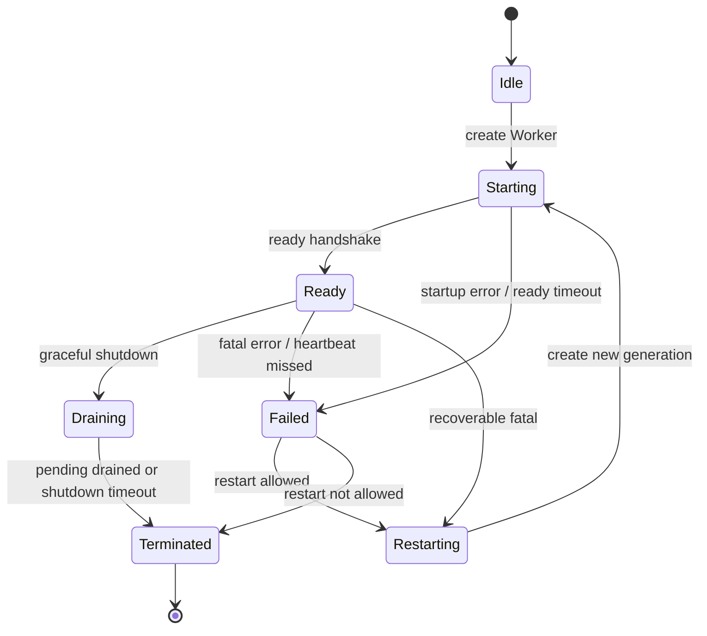
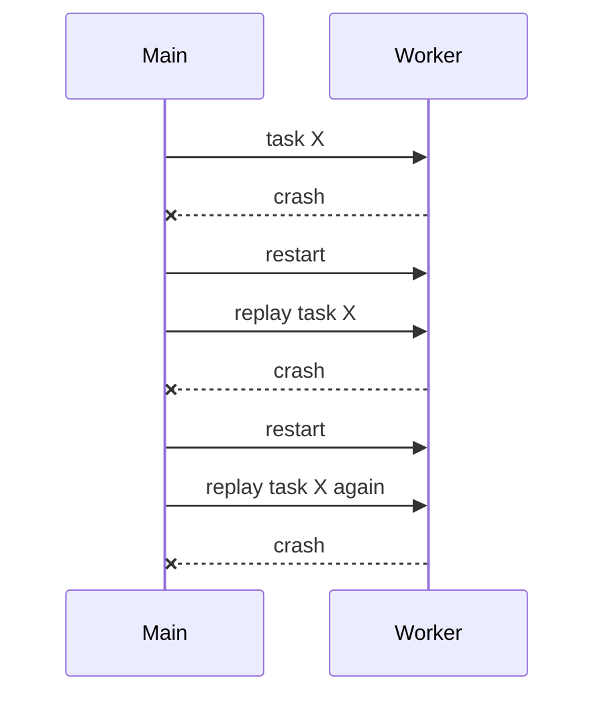
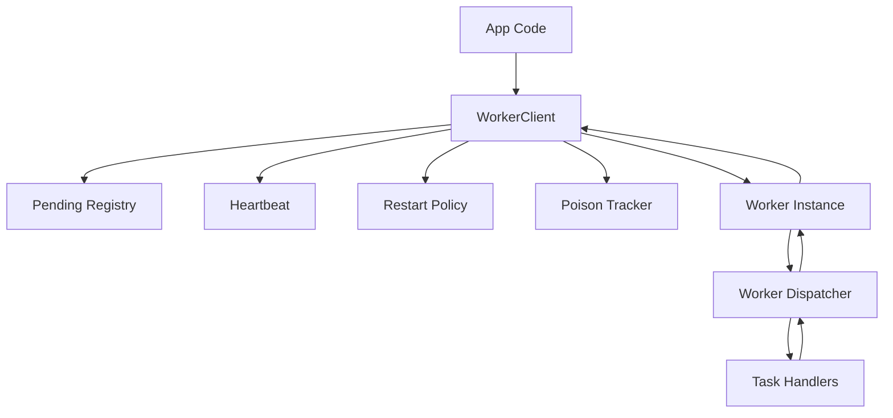
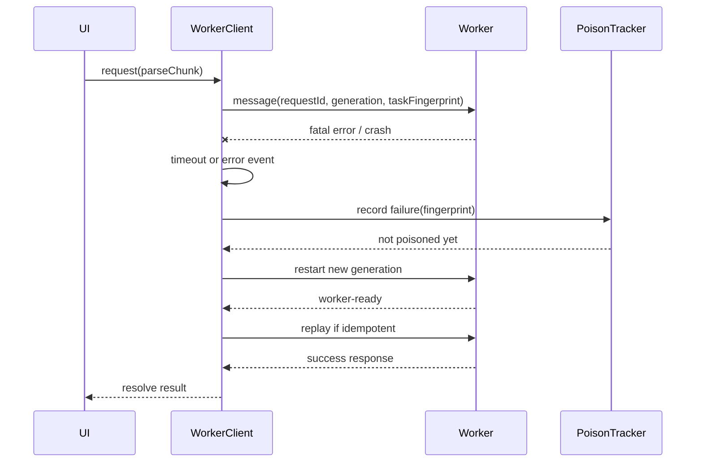
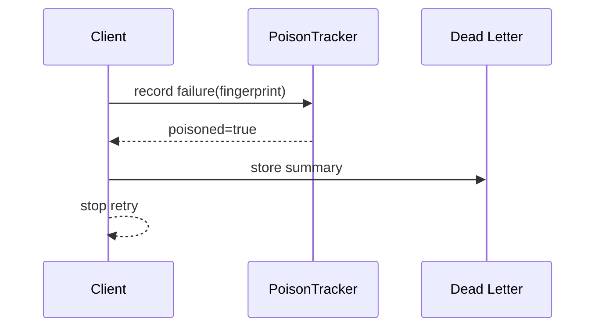

# Part 026 — Worker Error Handling, Crash Recovery, and Poison Message Detection

A worker is not reliable just because it runs away from the main thread.

A worker can fail during startup.

It can fail during import.

It can throw while handling a task.

It can receive an invalid message.

It can hang.

It can be terminated by the owner.

It can be killed indirectly when the owning page dies.

It can process a message successfully but return a response that no longer matters.

A production worker system must treat failure as part of the protocol.

Not as an exceptional afterthought.

---

## 1. The worker failure model

A worker has several failure surfaces:

| Failure | Where detected | Typical cause | Recovery style |
|---|---|---|---|
| startup failure | main `error` event or missing ready handshake | wrong URL, MIME, CSP, syntax error, import failure | fail fast, surface build/config issue |
| protocol violation | main or worker validator | unknown type, wrong version, malformed envelope | reject message, maybe close session |
| task error | worker task boundary | expected domain failure or bug in task | return error response, keep worker alive if safe |
| unhandled exception | worker `error`/global handler | bug outside task boundary | mark worker unhealthy, restart |
| unhandled promise rejection | worker global handler | async bug | mark worker unhealthy or fatal based on policy |
| deserialization failure | `messageerror` | unsupported clone shape or bad transferable handling | reject, log, fix protocol |
| hang | timeout/heartbeat | infinite loop, huge CPU burst, deadlock-like wait | terminate and restart |
| crash/kill | missing heartbeat, worker error, owner teardown | memory pressure, browser lifecycle, explicit termination | fail pending work and restart if owner active |
| stale response | generation/request guard | old worker responds after restart or cancel | ignore |
| poison message | repeated failure for same payload/task fingerprint | deterministic bug or unsupported input | quarantine, dead-letter, stop retry |

The core rule:

> Every worker request must have a known terminal outcome: success, typed failure, timeout, cancellation, stale ignored, or owner shutdown.

No request should remain pending forever.

---

## 2. Error events are necessary but not sufficient

The `Worker` object exposes an `error` event when an error occurs in the worker.

Workers also use message-passing APIs that can produce `messageerror` when incoming data cannot be deserialized.

Those browser events are low-level signals.

They are not a reliability architecture.

A serious worker wrapper needs:

- startup handshake
- explicit ready state
- pending request registry
- timeout per request
- generation token per worker instance
- fatal vs non-fatal error taxonomy
- restart policy
- poison task detection
- idempotency/replay policy
- stale response guard
- deterministic cleanup

Browser events tell you something happened.

Your runtime must decide what it means.

---

## 3. Worker lifecycle state machine

A robust worker client should model state explicitly.



Do not represent worker health as a boolean.

A worker can be:

- not created
- starting
- ready
- overloaded
- draining
- failed
- restarting
- terminated

Each state has different allowed operations.

---

## 4. Startup handshake

Creating a `Worker` object does not prove the worker is ready to serve your protocol.

The script may still be loading.

Its imports may fail.

It may have the wrong version.

It may not have initialized internal state.

Use an explicit handshake.

Main thread:

```ts
type WorkerReady = {
  type: "worker-ready";
  protocolVersion: number;
  buildId: string;
  capabilities: string[];
};

function startWorker(url: URL, timeoutMs: number): Promise<{ worker: Worker; ready: WorkerReady }> {
  const worker = new Worker(url, { type: "module" });

  return new Promise((resolve, reject) => {
    const timeout = window.setTimeout(() => {
      cleanup();
      worker.terminate();
      reject(new Error("Worker ready timeout"));
    }, timeoutMs);

    const cleanup = () => {
      window.clearTimeout(timeout);
      worker.removeEventListener("message", onMessage);
      worker.removeEventListener("error", onError);
    };

    const onMessage = (event: MessageEvent) => {
      if (event.data?.type !== "worker-ready") return;
      cleanup();
      resolve({ worker, ready: event.data });
    };

    const onError = (event: ErrorEvent) => {
      cleanup();
      worker.terminate();
      reject(event.error ?? new Error(event.message));
    };

    worker.addEventListener("message", onMessage);
    worker.addEventListener("error", onError);
  });
}
```

Worker:

```ts
const protocolVersion = 1;
const buildId = "2026.07.08.001";

self.postMessage({
  type: "worker-ready",
  protocolVersion,
  buildId,
  capabilities: ["parse", "validate", "hash"],
});
```

The ready message is not decorative.

It is the boundary between “worker exists” and “worker is protocol-compatible”.

---

## 5. Generation tokens prevent old-worker corruption

When a worker restarts, old asynchronous responses may arrive late in some designs, especially when multiple channels or wrappers are involved.

Use a generation token.

```ts
type Envelope<T> = {
  protocolVersion: number;
  generation: number;
  messageId: string;
  correlationId?: string;
  type: string;
  payload: T;
};
```

The main thread increments generation whenever it creates a new worker instance.

```ts
class WorkerGeneration {
  private currentGeneration = 0;

  next(): number {
    this.currentGeneration += 1;
    return this.currentGeneration;
  }

  isCurrent(generation: number): boolean {
    return generation === this.currentGeneration;
  }
}
```

Every response is checked:

```ts
function onWorkerMessage(event: MessageEvent<Envelope<unknown>>) {
  const message = event.data;

  if (!generationTracker.isCurrent(message.generation)) {
    metrics.increment("worker.response.stale_generation");
    return;
  }

  routeCurrentMessage(message);
}
```

The invariant:

> No response from a previous worker generation may mutate current application state.

---

## 6. Task-level error boundary

Most worker task errors should not crash the worker.

A validation failure, parse failure, unsupported file format, or domain rule rejection is a task result.

It should return a typed failure.

Worker-side dispatcher:

```ts
type RequestEnvelope<T> = {
  type: "request";
  requestId: string;
  operation: string;
  payload: T;
};

type SuccessResponse<T> = {
  type: "response";
  requestId: string;
  ok: true;
  result: T;
};

type FailureResponse = {
  type: "response";
  requestId: string;
  ok: false;
  error: WorkerErrorDto;
};

type WorkerErrorDto = {
  code: string;
  message: string;
  retryable: boolean;
  category: "validation" | "protocol" | "resource" | "internal" | "cancelled";
  details?: Record<string, unknown>;
};

self.onmessage = async (event: MessageEvent<RequestEnvelope<unknown>>) => {
  const request = event.data;

  try {
    const result = await dispatch(request.operation, request.payload);

    self.postMessage({
      type: "response",
      requestId: request.requestId,
      ok: true,
      result,
    } satisfies SuccessResponse<unknown>);
  } catch (error) {
    self.postMessage({
      type: "response",
      requestId: request.requestId,
      ok: false,
      error: normalizeWorkerError(error),
    } satisfies FailureResponse);
  }
};
```

This keeps the worker alive for expected task failures.

Do not confuse domain failure with runtime failure.

---

## 7. Error taxonomy

A worker error DTO should be stable and serializable.

Never rely on cloning native `Error` objects as your external contract.

Use a DTO:

```ts
type WorkerErrorCategory =
  | "validation"
  | "protocol"
  | "cancelled"
  | "timeout"
  | "resource"
  | "unsupported"
  | "internal";

type WorkerErrorDto = {
  code: string;
  category: WorkerErrorCategory;
  message: string;
  retryable: boolean;
  userVisible: boolean;
  taskFingerprint?: string;
  details?: Record<string, unknown>;
};
```

Examples:

| Code | Category | Retryable | Meaning |
|---|---|---:|---|
| `INVALID_MESSAGE` | protocol | false | envelope/schema invalid |
| `UNSUPPORTED_VERSION` | protocol | false | protocol mismatch |
| `CANCELLED` | cancelled | false | caller cancelled task |
| `INPUT_TOO_LARGE` | resource | false or maybe | rejected by byte budget |
| `PARSE_FAILED` | validation | false | input format invalid |
| `TEMPORARY_OVERLOAD` | resource | true | queue/resource pressure |
| `INTERNAL_ERROR` | internal | maybe | unexpected bug |
| `WORKER_TIMEOUT` | timeout | maybe | worker did not respond |
| `POISON_TASK` | internal | false | repeated deterministic failure |

The UI should not have to parse stack traces to decide what to do.

---

## 8. Protocol errors are not normal task errors

A protocol error means the caller and worker disagree about how to communicate.

Examples:

- unknown message type
- missing request ID
- unsupported protocol version
- missing transfer for required buffer
- invalid operation name
- payload exceeds configured byte limit
- message from unexpected source/channel

Protocol errors may indicate a deploy/version mismatch or a bug.

Worker-side validator:

```ts
function validateEnvelope(value: unknown): RequestEnvelope<unknown> {
  if (typeof value !== "object" || value === null) {
    throw protocolError("INVALID_ENVELOPE", "Envelope must be an object");
  }

  const candidate = value as Partial<RequestEnvelope<unknown>>;

  if (candidate.type !== "request") {
    throw protocolError("INVALID_TYPE", "Message type must be request");
  }

  if (typeof candidate.requestId !== "string" || candidate.requestId.length === 0) {
    throw protocolError("MISSING_REQUEST_ID", "requestId is required");
  }

  if (typeof candidate.operation !== "string" || candidate.operation.length === 0) {
    throw protocolError("MISSING_OPERATION", "operation is required");
  }

  return candidate as RequestEnvelope<unknown>;
}
```

Policy:

| Protocol error | Suggested behavior |
|---|---|
| one malformed request | reject request |
| repeated malformed requests | close session / mark caller bad |
| unsupported version | fail fast and reload/update app shell |
| impossible invariant violation | mark worker fatal |
| suspicious source | ignore and log security event |

Protocol errors should be observable.

They are often deployment bugs.

---

## 9. Timeouts and pending request cleanup

Every request needs a timeout.

A pending request without a timeout is a memory leak and a UX bug.

```ts
type PendingRequest<T> = {
  requestId: string;
  operation: string;
  startedAt: number;
  timeoutId: number;
  resolve: (value: T) => void;
  reject: (reason: unknown) => void;
};

class WorkerClient {
  private readonly pending = new Map<string, PendingRequest<unknown>>();

  constructor(private readonly worker: Worker) {
    worker.addEventListener("message", this.onMessage);
    worker.addEventListener("error", this.onWorkerError);
    worker.addEventListener("messageerror", this.onMessageError);
  }

  request<T>(operation: string, payload: unknown, timeoutMs: number): Promise<T> {
    const requestId = crypto.randomUUID();

    return new Promise<T>((resolve, reject) => {
      const timeoutId = window.setTimeout(() => {
        this.pending.delete(requestId);
        reject(new Error(`Worker request timed out: ${operation}`));
      }, timeoutMs);

      this.pending.set(requestId, {
        requestId,
        operation,
        startedAt: performance.now(),
        timeoutId,
        resolve: resolve as (value: unknown) => void,
        reject,
      });

      this.worker.postMessage({ type: "request", requestId, operation, payload });
    });
  }

  private readonly onMessage = (event: MessageEvent) => {
    const response = event.data;
    if (response?.type !== "response") return;

    const pending = this.pending.get(response.requestId);
    if (!pending) return;

    this.pending.delete(response.requestId);
    window.clearTimeout(pending.timeoutId);

    if (response.ok) {
      pending.resolve(response.result);
    } else {
      pending.reject(response.error);
    }
  };

  private readonly onWorkerError = (event: ErrorEvent) => {
    this.failAllPending(event.error ?? new Error(event.message));
  };

  private readonly onMessageError = () => {
    this.failAllPending(new Error("Worker message deserialization failed"));
  };

  private failAllPending(reason: unknown): void {
    for (const pending of this.pending.values()) {
      window.clearTimeout(pending.timeoutId);
      pending.reject(reason);
    }
    this.pending.clear();
  }
}
```

This is the minimum viable reliability wrapper.

It prevents orphan promises.

---

## 10. Fatal worker failure policy

Not every error should restart the worker.

Not every error should keep it alive.

Define policy.

| Failure | Fatal? | Reason |
|---|---:|---|
| task validation error | no | expected domain outcome |
| unsupported input format | no | request-specific |
| malformed protocol envelope | maybe | caller/worker mismatch |
| unhandled exception in task boundary | maybe | depends on isolation |
| unhandled exception outside task | yes | worker state may be corrupted |
| unhandled rejection from background loop | yes or maybe | depends on subsystem |
| ready timeout | yes | worker never became usable |
| heartbeat missed | yes | worker may be hung |
| messageerror | maybe | protocol/data bug |
| repeated same crash | yes + quarantine | poison task |

The safe default:

- expected task error: return typed failure
- invariant violation: worker fatal
- unknown global error: worker fatal
- repeated deterministic failure: poison

---

## 11. Global worker error boundary

Inside the worker, install global handlers.

```ts
self.addEventListener("error", (event) => {
  self.postMessage({
    type: "worker-fatal-error",
    error: {
      code: "UNHANDLED_WORKER_ERROR",
      message: event.message,
      filename: event.filename,
      lineno: event.lineno,
      colno: event.colno,
      retryable: true,
    },
  });
});

self.addEventListener("unhandledrejection", (event) => {
  self.postMessage({
    type: "worker-fatal-error",
    error: {
      code: "UNHANDLED_WORKER_REJECTION",
      message: String(event.reason?.message ?? event.reason ?? "Unknown rejection"),
      retryable: true,
    },
  });
});
```

This does not guarantee the worker can continue safely.

It gives the main thread a structured signal before the worker is terminated or restarted.

Main thread policy:

```ts
if (message.type === "worker-fatal-error") {
  markUnhealthy(message.error);
  terminateAndMaybeRestart(message.error);
}
```

---

## 12. Heartbeat and hang detection

Some failures do not throw.

A worker can enter an infinite loop or long-running CPU region and stop responding.

Use heartbeat for long-lived workers.

Main thread:

```ts
class WorkerHeartbeat {
  private lastPongAt = performance.now();
  private intervalId: number | undefined;

  constructor(
    private readonly worker: Worker,
    private readonly intervalMs: number,
    private readonly timeoutMs: number,
    private readonly onMissed: () => void,
  ) {
    worker.addEventListener("message", this.onMessage);
  }

  start(): void {
    this.intervalId = window.setInterval(() => {
      const now = performance.now();

      if (now - this.lastPongAt > this.timeoutMs) {
        this.onMissed();
        return;
      }

      this.worker.postMessage({ type: "ping", sentAt: now });
    }, this.intervalMs);
  }

  stop(): void {
    if (this.intervalId !== undefined) window.clearInterval(this.intervalId);
    this.worker.removeEventListener("message", this.onMessage);
  }

  private readonly onMessage = (event: MessageEvent) => {
    if (event.data?.type === "pong") {
      this.lastPongAt = performance.now();
    }
  };
}
```

Worker:

```ts
self.addEventListener("message", (event) => {
  if (event.data?.type === "ping") {
    self.postMessage({ type: "pong", sentAt: event.data.sentAt, receivedAt: performance.now() });
  }
});
```

Caveat:

A busy worker may miss heartbeat even if it is not “dead”.

That is still a useful signal.

A worker that cannot respond to control messages is unavailable from the orchestration perspective.

---

## 13. Restart policy

Restart is not free.

Restarting a worker can lose:

- in-memory cache
- parser state
- job progress
- pending requests
- transferred buffer ownership
- open handles
- warm WebAssembly module state
- internal indexes

A restart policy must define:

1. whether restart is allowed
2. maximum restart count
3. backoff delay
4. which tasks can be replayed
5. which tasks must fail
6. how state is rehydrated
7. when to give up

Example:

```ts
type RestartPolicy = {
  maxRestarts: number;
  baseDelayMs: number;
  maxDelayMs: number;
};

class RestartLimiter {
  private attempts = 0;

  constructor(private readonly policy: RestartPolicy) {}

  nextDelay(): number | null {
    if (this.attempts >= this.policy.maxRestarts) return null;

    const delay = Math.min(
      this.policy.maxDelayMs,
      this.policy.baseDelayMs * 2 ** this.attempts,
    );

    this.attempts += 1;
    return delay;
  }

  reset(): void {
    this.attempts = 0;
  }
}
```

Restart is a recovery tool.

Not a replacement for correctness.

---

## 14. Replay policy: only replay idempotent work

After restart, you may be tempted to replay every pending task.

Do not.

Only replay tasks that are idempotent and safe.

| Task | Replay after crash? | Reason |
|---|---:|---|
| pure parse chunk | yes | deterministic and side-effect-free |
| compute hash | yes | pure |
| validate local batch | yes | pure if input stable |
| write to IndexedDB with idempotency key | maybe | safe only with dedupe |
| send network mutation | usually no from worker alone | needs server idempotency |
| refresh token | no or carefully single-flight | security/session-sensitive |
| show notification | no | user-visible duplicate risk |
| delete local artifact | no unless operation is idempotent | destructive |

Worker wrapper should tag tasks:

```ts
type ReplayPolicy = "replayable" | "fail-on-restart" | "manual-recovery";

type PendingRequest<T> = {
  requestId: string;
  operation: string;
  payload: T;
  replayPolicy: ReplayPolicy;
};
```

On restart:

```ts
function recoverPending(pending: PendingRequest<unknown>[]): void {
  for (const request of pending) {
    switch (request.replayPolicy) {
      case "replayable":
        replay(request);
        break;
      case "fail-on-restart":
        fail(request, "Worker restarted before completion");
        break;
      case "manual-recovery":
        markNeedsUserAction(request);
        break;
    }
  }
}
```

The invariant:

> A crash must not cause duplicate side effects.

---

## 15. Poison message detection

A poison message is a message that repeatedly causes failure.

Examples:

- specific malformed file chunk crashes parser
- specific payload triggers infinite loop
- unsupported schema version trips invariant
- rare Unicode sequence breaks decoder
- huge input exceeds memory budget but keeps being retried
- task always kills worker during startup of a subsystem

Without poison detection, restart policy becomes a loop:



That is not recovery.

That is automated self-harm.

---

## 16. Task fingerprinting

To detect poison messages, compute a stable fingerprint for the task.

Do not include volatile fields like request ID or timestamp.

```ts
type TaskFingerprintInput = {
  operation: string;
  protocolVersion: number;
  payloadShape: string;
  contentHash?: string;
  byteLength?: number;
  schemaVersion?: number;
};

async function fingerprintTask(input: TaskFingerprintInput): Promise<string> {
  const encoded = new TextEncoder().encode(JSON.stringify(input));
  const digest = await crypto.subtle.digest("SHA-256", encoded);
  return [...new Uint8Array(digest)]
    .map((byte) => byte.toString(16).padStart(2, "0"))
    .join("");
}
```

For privacy and security, avoid hashing raw sensitive payload unless necessary.

Often a shape-based fingerprint is enough:

```ts
const fingerprintInput: TaskFingerprintInput = {
  operation: "parse-csv-chunk",
  protocolVersion: 1,
  payloadShape: "buffer+offset+delimiter+schemaVersion",
  byteLength: buffer.byteLength,
  schemaVersion: 3,
  contentHash: chunkHashIfAllowed,
};
```

---

## 17. Poison tracker

```ts
type PoisonRecord = {
  fingerprint: string;
  failures: number;
  firstFailureAt: number;
  lastFailureAt: number;
  lastErrorCode: string;
};

class PoisonTracker {
  private readonly records = new Map<string, PoisonRecord>();

  constructor(
    private readonly maxFailures: number,
    private readonly windowMs: number,
  ) {}

  recordFailure(fingerprint: string, errorCode: string): boolean {
    const now = Date.now();
    const existing = this.records.get(fingerprint);

    if (!existing || now - existing.firstFailureAt > this.windowMs) {
      this.records.set(fingerprint, {
        fingerprint,
        failures: 1,
        firstFailureAt: now,
        lastFailureAt: now,
        lastErrorCode: errorCode,
      });
      return false;
    }

    existing.failures += 1;
    existing.lastFailureAt = now;
    existing.lastErrorCode = errorCode;

    return existing.failures >= this.maxFailures;
  }

  isPoisoned(fingerprint: string): boolean {
    const record = this.records.get(fingerprint);
    if (!record) return false;
    return record.failures >= this.maxFailures;
  }
}
```

Usage:

```ts
const poisoned = poisonTracker.recordFailure(taskFingerprint, error.code);

if (poisoned) {
  failTask(task, {
    code: "POISON_TASK",
    category: "internal",
    message: "Task repeatedly failed and was quarantined",
    retryable: false,
    userVisible: false,
    taskFingerprint,
  });
}
```

A poison task should enter dead-letter/quarantine, not the retry queue.

---

## 18. Dead-letter queue for browser workers

A browser app may not need a full server-style DLQ.

But it does need somewhere to put failed work that should not be retried automatically.

```ts
type DeadLetterTask = {
  id: string;
  operation: string;
  fingerprint: string;
  failedAt: number;
  error: WorkerErrorDto;
  recovery: "ignore" | "user-action" | "developer-diagnostic";
  payloadSummary: Record<string, unknown>;
};
```

Storage options:

| Option | Use when |
|---|---|
| memory only | short-lived diagnostic, not important after reload |
| IndexedDB | offline queue/import job recovery |
| analytics/logging endpoint | production observability, privacy-safe summary only |
| user-visible error state | user can fix input or retry manually |

Never store full sensitive payloads in dead-letter records by default.

Store summaries.

---

## 19. Message deserialization failure

`messageerror` is a signal that a message could not be deserialized.

Treat it as a protocol/data-plane bug.

Main thread:

```ts
worker.addEventListener("messageerror", (event) => {
  metrics.increment("worker.messageerror");

  markWorkerUnhealthy({
    code: "MESSAGE_DESERIALIZATION_FAILED",
    category: "protocol",
    retryable: false,
    eventType: event.type,
  });
});
```

Worker side:

```ts
self.addEventListener("messageerror", (event) => {
  self.postMessage({
    type: "worker-protocol-error",
    error: {
      code: "MESSAGE_DESERIALIZATION_FAILED_IN_WORKER",
      category: "protocol",
      message: "Worker could not deserialize incoming message",
      retryable: false,
    },
  });
});
```

Common causes:

- unsupported object in payload
- accidental function/DOM node in message
- transferable misuse
- object shape not supported by structured clone
- cross-version protocol drift

The fix is usually schema discipline and payload tests.

---

## 20. Graceful shutdown vs immediate termination

There are two shutdown styles.

### Graceful shutdown

Use when worker is healthy and you want it to finish or cancel safely.

```ts
worker.postMessage({ type: "shutdown", reason: "owner-disposed" });
```

Worker:

```ts
let acceptingWork = true;

self.addEventListener("message", async (event) => {
  if (event.data?.type === "shutdown") {
    acceptingWork = false;
    await flushTelemetryOrReleaseResources();
    self.postMessage({ type: "shutdown-complete" });
    self.close();
  }
});
```

### Immediate termination

Use when worker is hung, poisoned, unsafe, or owner is gone.

```ts
worker.terminate();
```

Immediate termination does not let the worker finish current operations.

So the owner must fail pending requests and clean local state.

```ts
function forceTerminate(reason: unknown): void {
  heartbeat.stop();
  failAllPending(reason);
  worker.terminate();
  state = "terminated";
}
```

Rule:

> Graceful shutdown is a protocol. Termination is a kill switch.

---

## 21. Handling owner lifecycle

A dedicated worker is owned by the context that created it.

If the page navigates, closes, or is discarded, the worker should not be assumed to survive as an independent durable service.

Design implication:

- long-running durable coordination belongs in storage/protocol, not only worker memory
- jobs need resumable checkpoints if they matter after page death
- cleanup should be best-effort
- worker ownership should be explicit

Page lifecycle integration:

```ts
class PageOwnedWorkerRuntime {
  constructor(private readonly client: WorkerClient) {
    document.addEventListener("visibilitychange", this.onVisibilityChange);
    window.addEventListener("pagehide", this.onPageHide);
  }

  private readonly onVisibilityChange = () => {
    if (document.visibilityState === "hidden") {
      this.client.reduceWork("page-hidden");
    }
  };

  private readonly onPageHide = () => {
    this.client.shutdownBestEffort("pagehide");
  };
}
```

Do not depend on `beforeunload` for correctness.

Use it only as a best-effort signal.

---

## 22. State rehydration after restart

If the worker has meaningful state, define how to rebuild it.

Examples:

| Worker state | Rehydration strategy |
|---|---|
| parser carry buffer | replay from last checkpoint |
| search index | load artifact from IndexedDB/OPFS or rebuild |
| WASM module | reinitialize module |
| config/rules | send config version during handshake |
| auth/session info | avoid if possible; request capability-scoped token if needed |
| queue state | owned by main/client, replay based on policy |

Worker state should be cacheable or reconstructable.

If losing worker memory loses correctness, your design is too fragile.

---

## 23. Observability fields

Log events with enough structure to debug reliability without leaking data.

```ts
type WorkerReliabilityEvent = {
  event:
    | "worker_starting"
    | "worker_ready"
    | "worker_startup_failed"
    | "worker_request_timeout"
    | "worker_fatal_error"
    | "worker_restarting"
    | "worker_restarted"
    | "worker_poison_task"
    | "worker_messageerror";
  workerName: string;
  generation: number;
  operation?: string;
  requestId?: string;
  taskFingerprint?: string;
  durationMs?: number;
  queueDepth?: number;
  inFlight?: number;
  errorCode?: string;
  retryable?: boolean;
};
```

Metrics to track:

- startup duration
- startup failures
- ready timeout count
- request timeout count
- task failure count by code
- global worker error count
- restart count
- restart success/failure
- poison task count
- stale response count
- heartbeat missed count
- pending request count
- queue depth
- in-flight bytes

If you cannot observe worker health, you cannot operate the system.

---

## 24. Testing failure behavior

Test the failure model directly.

Worker test operations:

```ts
type TestOperation =
  | "ok"
  | "throw-sync"
  | "reject-async"
  | "hang"
  | "invalid-response"
  | "large-response"
  | "close-self"
  | "poison";
```

Worker:

```ts
async function dispatch(operation: string, payload: unknown): Promise<unknown> {
  switch (operation) {
    case "ok":
      return { ok: true };

    case "throw-sync":
      throw new Error("Synthetic sync failure");

    case "reject-async":
      return await Promise.reject(new Error("Synthetic async failure"));

    case "hang":
      while (true) {
        // synthetic hang; do not ship this outside test worker
      }

    case "close-self":
      self.close();
      return;

    case "poison":
      throw new Error("Synthetic poison failure");

    default:
      throw new Error(`Unknown test operation: ${operation}`);
  }
}
```

Test cases:

- ready handshake succeeds
- ready timeout fails startup
- task error returns typed failure
- pending request times out
- pending request is removed after timeout
- fatal error fails all pending requests
- restart increments generation
- stale response is ignored
- replayable task is replayed
- non-replayable task fails on restart
- poison task stops retry after threshold
- shutdown clears timers/listeners

Reliability is not proven by happy-path tests.

---

## 25. Production worker runtime skeleton

A simplified architecture:



Main thread wrapper responsibilities:

- create worker
- wait for ready
- validate protocol version
- assign generation
- send requests
- track pending
- apply timeout
- handle errors/messageerror
- detect missed heartbeat
- terminate/restart
- detect poison tasks
- fail/replay pending work
- expose metrics
- cleanup deterministically

Worker responsibilities:

- announce ready
- validate incoming messages
- route operations
- catch task errors
- return serializable DTOs
- avoid leaking large payloads
- emit fatal error signal when invariant breaks
- respond to ping/shutdown

---

## 26. End-to-end request flow with recovery



If the same task crashes repeatedly:



---

## 27. Anti-patterns

Avoid these:

1. Creating a worker and assuming it is ready without a handshake.
2. Letting requests wait forever.
3. Retrying every task after restart.
4. Retrying non-idempotent side effects.
5. Treating all worker errors as UI-visible messages.
6. Treating all worker errors as fatal.
7. Ignoring `messageerror`.
8. Not incrementing generation after restart.
9. Allowing old responses to mutate current state.
10. Restarting endlessly on the same poison payload.
11. Storing full poison payloads in logs or dead-letter records.
12. Using `terminate()` as normal flow control.
13. Keeping worker-local state that cannot be reconstructed.

---

## 28. Production checklist

Before shipping worker error handling, verify:

### Startup

- Worker emits `worker-ready`.
- Ready handshake has timeout.
- Protocol version is checked.
- Build ID/capability mismatch is handled.

### Request lifecycle

- Every request has correlation ID.
- Every request has timeout.
- Pending registry deletes completed requests.
- Pending registry deletes timed-out requests.
- Cancellation has a terminal response.

### Error taxonomy

- Task errors return typed DTOs.
- Protocol errors are explicit.
- Fatal errors are distinct from domain failures.
- Error DTOs are serializable and stable.

### Recovery

- Fatal errors fail or replay pending work by policy.
- Restart count is bounded.
- Restart uses backoff.
- Generation token prevents stale mutation.
- Worker state is reconstructable.

### Poison detection

- Task fingerprint excludes volatile fields.
- Repeated deterministic failures are quarantined.
- Dead-letter records contain summaries, not sensitive payloads.
- Poison tasks are not retried forever.

### Observability

- Startup, timeout, restart, fatal error, and poison events are logged.
- Payloads are not logged raw.
- Metrics include queue depth and in-flight bytes.

### Cleanup

- `terminate()` clears pending requests.
- listeners are removed on disposal.
- timers are cleared.
- channels are closed.

---

## 29. References

- MDN — Worker: https://developer.mozilla.org/en-US/docs/Web/API/Worker
- MDN — Worker error event: https://developer.mozilla.org/en-US/docs/Web/API/Worker/error_event
- MDN — Worker.postMessage(): https://developer.mozilla.org/en-US/docs/Web/API/Worker/postMessage
- MDN — Worker.terminate(): https://developer.mozilla.org/en-US/docs/Web/API/Worker/terminate
- MDN — DedicatedWorkerGlobalScope.close(): https://developer.mozilla.org/en-US/docs/Web/API/DedicatedWorkerGlobalScope/close
- MDN — MessagePort messageerror event: https://developer.mozilla.org/en-US/docs/Web/API/MessagePort/messageerror_event
- MDN — Structured clone algorithm: https://developer.mozilla.org/en-US/docs/Web/API/Web_Workers_API/Structured_clone_algorithm

---

## 30. What this part gives us

We now have a production failure model for dedicated workers.

The worker is no longer a fire-and-forget helper thread.

It is a managed runtime component with:

- lifecycle state
- startup handshake
- protocol validation
- task-level error boundaries
- global fatal error handling
- timeout cleanup
- heartbeat
- restart policy
- replay policy
- poison detection
- dead-letter handling
- observability

This closes the Dedicated Worker phase.

Next, we move to shared execution contexts: SharedWorker, Service Worker, and cross-context hubs.
