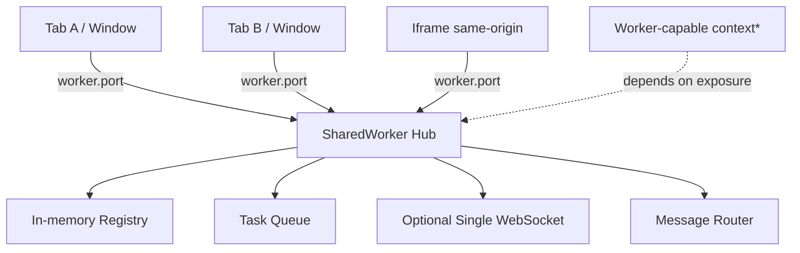
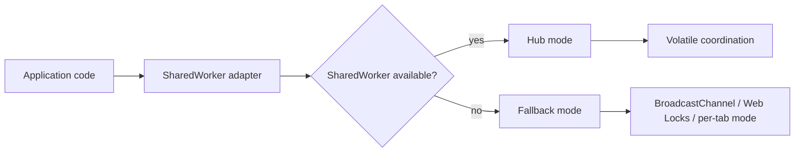
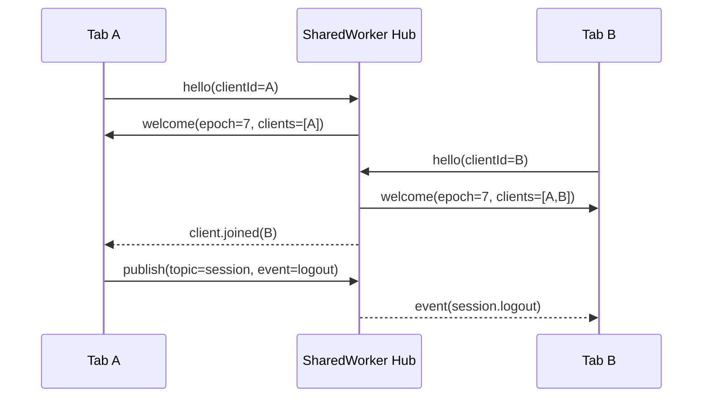
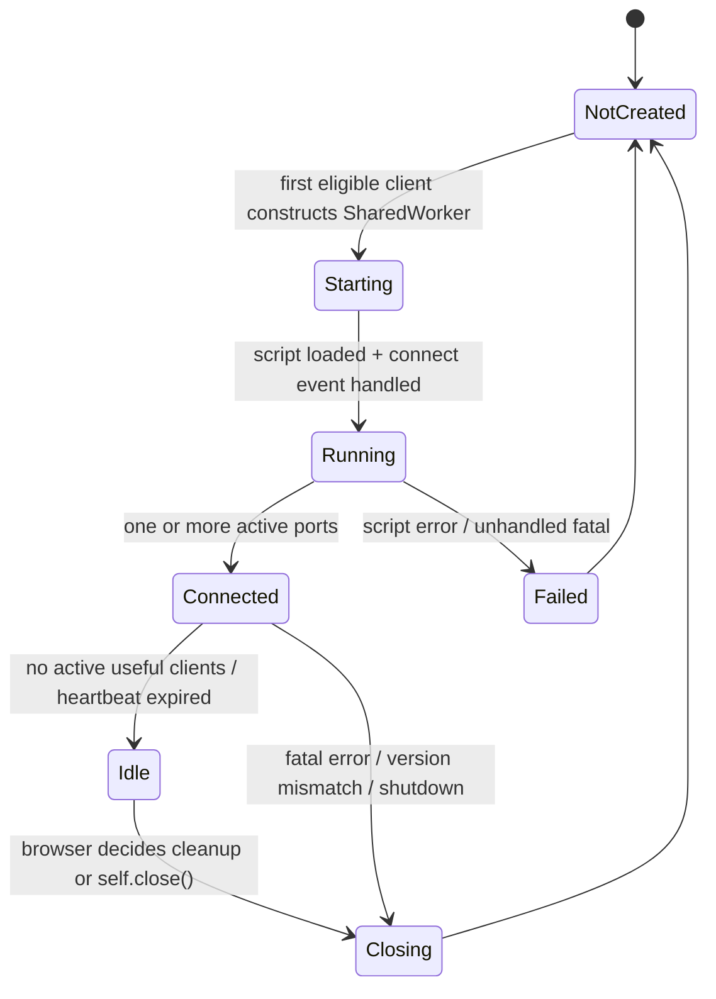
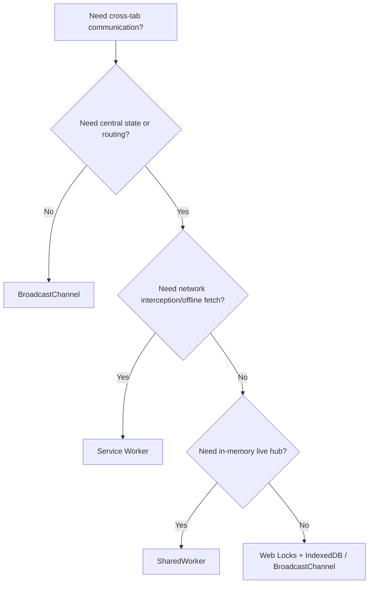
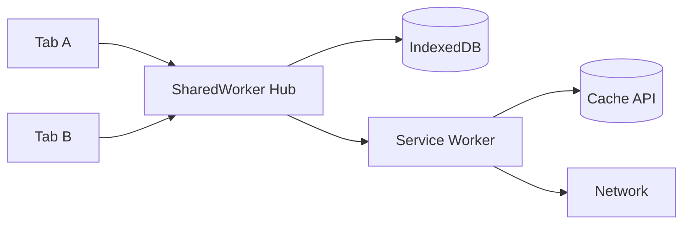
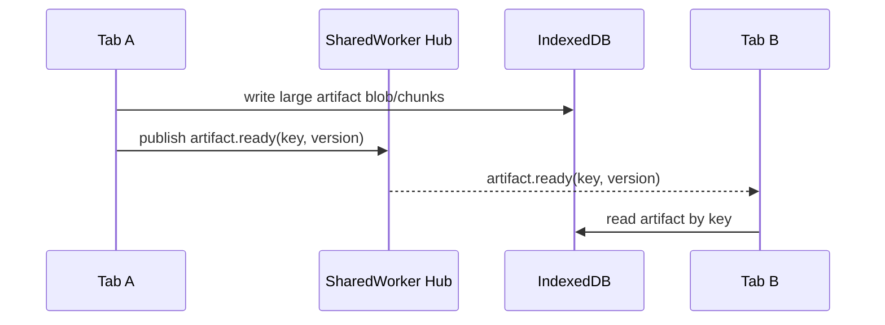
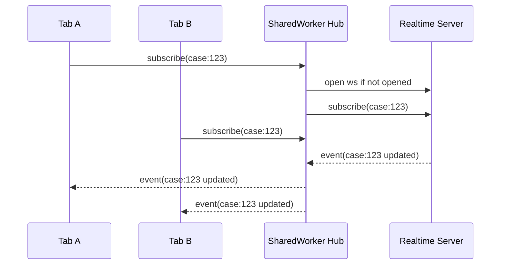
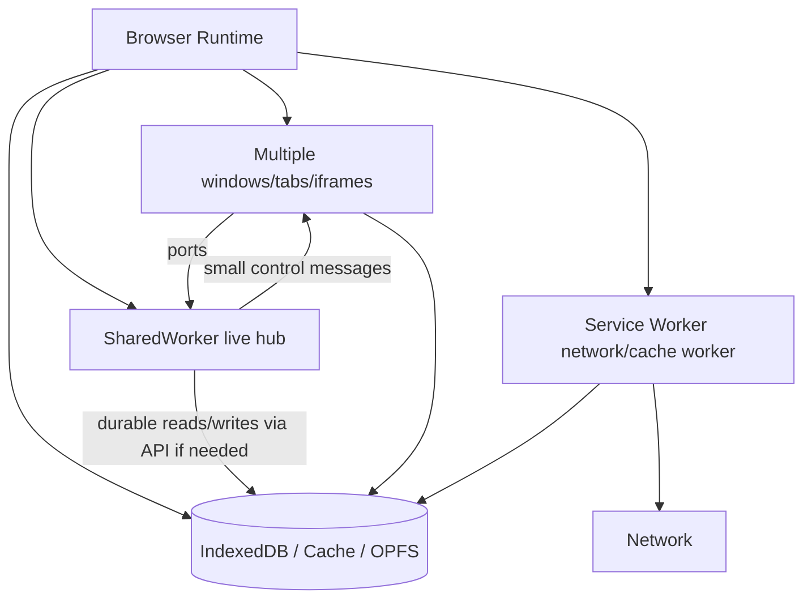

# Part 027 — SharedWorker Mental Model

Di part sebelumnya kita membahas `DedicatedWorker`: worker yang dimiliki oleh satu creator. Model itu cocok untuk compute isolation per tab, tetapi tidak cukup ketika masalahnya adalah **koordinasi lintas tab**.

Contoh masalah:

- user membuka aplikasi di 4 tab;
- hanya boleh ada satu koneksi WebSocket aktif;
- hanya boleh ada satu background sync loop;
- cache metadata perlu konsisten;
- session logout harus tersebar cepat;
- tab baru perlu tahu siapa saja context yang sedang aktif;
- tab lama bisa frozen, crashed, restored, atau version-skewed.

Di sinilah `SharedWorker` masuk.

Namun `SharedWorker` sering dipahami terlalu sederhana: “worker yang bisa dipakai banyak tab”. Itu benar, tetapi belum cukup. Untuk production engineering, mental model yang lebih tepat adalah:

> `SharedWorker` adalah **in-memory coordination hub** untuk beberapa same-origin execution context yang sedang hidup, diakses lewat `MessagePort`, tanpa hak istimewa network interception, tanpa DOM, dan tanpa jaminan durable lifetime.

Bukan service worker. Bukan database. Bukan background daemon permanen. Bukan global singleton lintas semua browser profile. Ia hanyalah hub runtime yang hidup selama browser masih mempertahankan scope dan koneksi yang relevan.

---

## 1. Problem yang Diselesaikan SharedWorker

Dengan `BroadcastChannel`, setiap context bisa broadcast message ke context lain. Tetapi semua context tetap **peer**. Tidak ada process pusat yang menyimpan registry, melakukan arbitration, atau memegang koneksi tunggal.

Dengan `DedicatedWorker`, satu tab bisa offload kerja berat. Tetapi worker itu tidak bisa langsung dipakai tab lain.

Dengan `Service Worker`, aplikasi bisa intercept request, mengelola cache, dan berpartisipasi dalam lifecycle network/offline. Tetapi service worker lifecycle bersifat event-driven dan tidak cocok dijadikan in-memory application hub jangka panjang.

`SharedWorker` mengisi ruang di tengah:

| Kebutuhan | BroadcastChannel | DedicatedWorker | Service Worker | SharedWorker |
|---|---:|---:|---:|---:|
| Message lintas tab | Ya | Tidak langsung | Ya, dengan client messaging | Ya |
| Central in-memory registry | Tidak | Per tab saja | Tidak ideal | Ya |
| Single connection owner | Sulit | Per tab | Tidak ideal | Ya |
| Network interception | Tidak | Tidak | Ya | Tidak |
| Background push/offline event | Tidak | Tidak | Ya | Tidak |
| Compute offload | Tidak | Ya | Terbatas/case-specific | Bisa, tapi jangan overload hub |
| Durable background lifetime | Tidak | Tidak | Tidak permanen | Tidak |
| Simpel untuk multi-client port routing | Tidak | Tidak | Sedang | Ya |

SharedWorker cocok jika sistem butuh **stateful coordinator while pages are alive**.

---

## 2. Topologi Dasar

`SharedWorker` diakses melalui constructor `new SharedWorker(url, options?)`. Client tidak berkomunikasi langsung lewat object worker seperti `DedicatedWorker`. Client berkomunikasi melalui `worker.port`, yaitu sebuah `MessagePort`.

Di dalam shared worker, setiap koneksi baru memicu event `connect`, dan port client tersedia melalui `event.ports[0]`.



Catatan penting: dukungan dan exposure API perlu diperlakukan sebagai compatibility concern. Dokumentasi modern menyebut `SharedWorker` sebagai worker yang dapat diakses dari beberapa browsing context seperti window dan iframe, dengan global scope berbeda (`SharedWorkerGlobalScope`) dan interface berbeda dari dedicated worker.

---

## 3. Identity: Kapan Dua Client Mendapat Shared Worker yang Sama?

Secara praktis, engineer perlu memperlakukan SharedWorker sebagai instance yang dikunci oleh kombinasi seperti:

- origin / storage partition;
- script URL;
- worker name;
- worker type/module options;
- browser implementation details.

Jangan mendesain sistem dengan asumsi “seluruh tab di browser pasti tersambung ke instance yang sama”. Lebih aman gunakan kalimat ini:

> Semua eligible same-origin context yang membuat `SharedWorker` dengan konfigurasi kompatibel **dapat** berbagi instance worker yang sama, tetapi desain tetap harus recoverable bila instance tidak ada, restart, atau tidak didukung.

Konsekuensi desain:

- jangan simpan state penting hanya di memory SharedWorker;
- jangan anggap hub selalu hidup sebelum tab pertama connect;
- jangan anggap hub masih hidup setelah semua port hilang;
- jangan anggap tab lama dan tab baru menjalankan versi protocol yang sama;
- jangan jadikan SharedWorker satu-satunya mekanisme security cleanup.

---

## 4. SharedWorker Bukan Singleton Global Aplikasi

Di sisi application architecture, sangat menggoda menamai SharedWorker sebagai “global app process”. Itu bisa menyesatkan.

Yang benar:



SharedWorker sebaiknya diposisikan sebagai **optimization + coordination layer**, bukan single source of truth.

Jika SharedWorker mati, sistem harus bisa:

1. reconnect;
2. rebuild registry;
3. reload durable snapshot dari IndexedDB/Cache/OPFS bila perlu;
4. re-elect owner bila ada resource ownership;
5. replay atau discard task sesuai semantics.

---

## 5. Execution Model

SharedWorker berjalan di thread terpisah dari main thread dan tidak memiliki akses DOM. Komunikasi dilakukan via message passing.

Hal yang perlu diingat:

- setiap client punya `MessagePort` sendiri;
- port harus di-start jika memakai `addEventListener('message', ...)`;
- worker menerima `connect` event saat client connect;
- hub bisa menyimpan mapping `clientId -> port`;
- hub bisa broadcast ke semua port;
- hub bisa route message ke client tertentu;
- port bisa error/close secara tidak eksplisit;
- tidak selalu ada event “tab closed” yang reliable.

State minimal di hub biasanya seperti ini:

```ts
type ClientRecord = {
  clientId: string;
  port: MessagePort;
  connectedAt: number;
  lastSeenAt: number;
  capabilities: string[];
  protocolVersion: number;
  visible?: boolean;
  leaderEligible?: boolean;
};

const clients = new Map<string, ClientRecord>();
```

Tetapi ini **volatile registry**, bukan durable membership database.

---

## 6. SharedWorker Sebagai Actor

Cara paling aman memahami SharedWorker adalah sebagai actor:

- punya mailbox: message dari port client;
- punya internal state: registry, queue, subscriptions, ownership;
- memproses message satu per satu di event loop worker;
- merespons via port;
- tidak berbagi mutable object secara langsung dengan tab;
- failure/restart menghapus in-memory state.



Actor model ini membantu mencegah desain yang salah seperti:

- shared mutable object lintas tab;
- direct function call mental model;
- synchronous coordination;
- hidden global variable sebagai truth;
- cleanup yang bergantung pada event unload.

---

## 7. Apa yang Cocok Ditaruh di SharedWorker?

SharedWorker cocok untuk **coordination state** yang:

- kecil;
- volatile;
- bisa dibangun ulang;
- butuh route ke banyak port;
- manfaatnya besar jika dipusatkan;
- tidak memerlukan DOM;
- tidak harus tetap berjalan ketika semua tab tertutup.

Contoh bagus:

### 7.1 Tab presence registry

Hub menyimpan daftar tab aktif, last heartbeat, visibility state, dan capability.

```ts
type PresenceEvent =
  | { type: 'client.joined'; clientId: string }
  | { type: 'client.left'; clientId: string; reason: 'timeout' | 'disconnect' | 'protocol-error' }
  | { type: 'client.heartbeat'; clientId: string; at: number };
```

### 7.2 Single WebSocket owner

Alih-alih setiap tab membuka WebSocket, SharedWorker bisa membuka satu koneksi dan multiplex message ke semua client.

Tetapi ini harus punya fallback. Bila SharedWorker tidak tersedia, aplikasi bisa downgrade ke per-tab WebSocket atau Web Locks + BroadcastChannel.

### 7.3 Cross-tab request coalescing

Jika 5 tab meminta data yang sama, hub bisa single-flight request atau mencegah duplicate heavy work.

### 7.4 Shared compute scheduler ringan

Hub bisa menerima job kecil, dedupe, lalu mengirim job ke dedicated worker pool internal atau memproses sendiri jika aman.

Namun jangan jadikan hub sebagai CPU furnace. Jika hub overload, seluruh koordinasi lintas tab ikut macet.

### 7.5 Subscription router

Client subscribe topic tertentu, hub route event hanya ke subscriber yang relevan.

```ts
type Subscription = {
  topic: string;
  clientId: string;
};
```

---

## 8. Apa yang Tidak Cocok Ditaruh di SharedWorker?

### 8.1 Durable source of truth

Jangan simpan order queue penting, audit event, payment state, atau sync cursor penting hanya di memory SharedWorker. Simpan di IndexedDB atau server.

### 8.2 Secret vault

SharedWorker bisa diakses multiple same-origin context. Jika origin sudah terkena XSS, same-origin script jahat berpotensi berinteraksi dengan hub. Same-origin bukan same-trust.

### 8.3 Network proxy

SharedWorker tidak intercept fetch global. Untuk network proxy/cache/offline fetch, gunakan Service Worker.

### 8.4 Background daemon setelah semua tab tertutup

SharedWorker bukan daemon permanen. Jika semua context hilang dan browser membersihkan scope, state hilang.

### 8.5 Heavy CPU worker utama

Bisa, tetapi sering salah. SharedWorker lebih baik sebagai coordinator. Compute berat bisa dikirim ke dedicated worker pool atau WebAssembly worker.

---

## 9. Lifecycle Mental Model

SharedWorker lifecycle lebih baik dipandang seperti ini:



Yang penting bukan state exact browser internal. Yang penting adalah contract desain:

- tab pertama harus bisa bootstrap hub;
- tab baru harus handshake;
- hub harus bisa menolak protocol version yang tidak kompatibel;
- client harus bisa reconnect;
- hub harus bisa rebuild registry;
- stale port harus dihapus via heartbeat timeout;
- durable state harus berada di storage lain.

---

## 10. MessagePort Adalah Connection, Bukan Event Bus Global

Saat client membuat SharedWorker:

```ts
const worker = new SharedWorker('/shared-hub.js', { name: 'app-hub', type: 'module' });
worker.port.start();
worker.port.postMessage({ type: 'hello', clientId: crypto.randomUUID() });
```

Di worker:

```ts
self.onconnect = (event) => {
  const port = event.ports[0];
  port.start();
  port.postMessage({ type: 'welcome' });
};
```

Port adalah connection point. Itu berarti kita bisa membangun semantic seperti:

- `hello`;
- `welcome`;
- `ping/pong`;
- `subscribe/unsubscribe`;
- `publish`;
- `request/response`;
- `shutdown`;
- `protocol.error`.

Tetapi semua semantic itu buatan kita. Browser hanya memberi pipe.

---

## 11. Hub Protocol Minimal

Untuk produksi, jangan kirim message mentah seperti `{ action: 'x' }`. Gunakan envelope.

```ts
type HubEnvelope<TPayload = unknown> = {
  protocol: 'app.shared-hub';
  version: 1;
  id: string;
  type: string;
  sourceClientId?: string;
  targetClientId?: string;
  timestamp: number;
  payload: TPayload;
};
```

Invariant:

1. setiap message punya `id`;
2. setiap message punya `version`;
3. setiap message punya `type`;
4. payload divalidasi;
5. unknown type tidak diproses diam-diam;
6. oversized payload ditolak;
7. stale/duplicate message aman;
8. error dikirim sebagai DTO, bukan raw `Error` object.

---

## 12. Client Identity

Jangan pakai `Date.now()` sebagai client ID. Gunakan UUID dan simpan sementara di tab/session scope.

Pilihan:

| Identity | Scope | Cocok untuk |
|---|---|---|
| `crypto.randomUUID()` per load | page instance | presence ephemeral |
| `sessionStorage` ID | tab session | reconnect setelah reload di tab yang sama |
| server session ID | user session | auth/session correlation |
| durable device ID | device/browser | perlu privacy review serius |

Untuk orchestration, biasanya cukup:

```ts
function getClientId(): string {
  const key = 'app.clientId';
  const existing = sessionStorage.getItem(key);
  if (existing) return existing;
  const created = crypto.randomUUID();
  sessionStorage.setItem(key, created);
  return created;
}
```

Tetapi jangan gunakan client ID ini sebagai security identity. Itu hanya routing identity.

---

## 13. SharedWorker vs BroadcastChannel

Keduanya sering terlihat overlap. Bedanya mendasar.

BroadcastChannel:

- peer-to-peer broadcast;
- tidak ada central memory;
- pengirim tidak menerima message-nya sendiri di channel yang sama;
- cocok untuk signal sederhana;
- sulit untuk request routing kompleks;
- tidak punya registry built-in.

SharedWorker:

- central hub;
- bisa punya registry;
- bisa route direct message;
- bisa enforce admission/backpressure;
- bisa multiplex single connection;
- butuh port lifecycle management;
- fallback lebih kompleks.

Decision rule:



---

## 14. SharedWorker vs Service Worker

Service Worker dan SharedWorker sama-sama worker, tetapi masalahnya berbeda.

| Aspek | SharedWorker | Service Worker |
|---|---|---|
| Trigger utama | Client connects via constructor | Browser events: install, activate, fetch, message, push, sync |
| Communication | MessagePort per client | `postMessage`, `clients.matchAll`, MessageChannel |
| Network interception | Tidak | Ya |
| Cache/offline app shell | Tidak utama | Ya |
| Multi-tab in-memory hub | Ya | Tidak ideal |
| Lifecycle | Tied to active clients / implementation | Event-driven, can be terminated between events |
| Best role | live coordinator | network/cache coordinator |

Pola production yang baik sering menggabungkan keduanya:



SharedWorker mengelola live routing. Service Worker mengelola fetch/cache/offline. IndexedDB menyimpan durable client-side state.

---

## 15. Failure Model SharedWorker

SharedWorker failure model harus eksplisit.

| Failure | Dampak | Mitigasi |
|---|---|---|
| Hub script gagal load | semua client gagal connect | fallback mode + telemetry |
| Hub crash/error | registry hilang | reconnect + rebuild from clients |
| Client tab close | port mungkin tidak memberi cleanup reliable | heartbeat timeout |
| Client frozen | heartbeat terlambat | generous timeout + visibility-aware policy |
| Protocol mismatch | message tidak bisa dipahami | version negotiation |
| Oversized message | memory pressure | reject + data-plane indirection |
| Poison message | hub terus gagal | schema validation + quarantine |
| Hub overloaded | semua tab terdampak | bounded queues + backpressure |

Prinsipnya:

> SharedWorker boleh mempercepat dan merapikan koordinasi, tetapi tidak boleh menjadi satu-satunya tempat di mana correctness disimpan.

---

## 16. Compatibility Strategy

Karena browser support dan runtime environment bisa berubah, gunakan feature detection.

```ts
function canUseSharedWorker(): boolean {
  return typeof window !== 'undefined' && 'SharedWorker' in window;
}
```

Lalu siapkan adapter:

```ts
type CoordinationMode = 'shared-worker' | 'broadcast-channel' | 'local-only';

function chooseCoordinationMode(): CoordinationMode {
  if (typeof window === 'undefined') return 'local-only';
  if ('SharedWorker' in window) return 'shared-worker';
  if ('BroadcastChannel' in window) return 'broadcast-channel';
  return 'local-only';
}
```

Fallback bukan nice-to-have. Ia bagian dari correctness.

---

## 17. SharedWorker as Control Plane, Storage as Data Plane

SharedWorker sebaiknya tidak mengirim payload besar antar port. Gunakan pola control plane/data plane.



Keuntungan:

- message kecil;
- structured clone cost lebih rendah;
- hub tidak menanggung memory peak besar;
- retry lebih mudah;
- durable state bisa diinspeksi dan dimigrasi.

---

## 18. Invariants Untuk SharedWorker Hub

Gunakan invariant ini sebagai baseline sebelum implementasi:

1. Hub menerima hanya message envelope valid.
2. Hub tidak mempercayai payload walau berasal dari same-origin.
3. Client harus handshake sebelum message lain diproses.
4. Client ID tidak boleh duplicate tanpa policy eksplisit.
5. Port yang tidak heartbeat akan dianggap mati.
6. Hub boleh restart kapan pun.
7. Durable correctness tidak bergantung pada hub memory.
8. Setiap request punya timeout.
9. Broadcast besar ditolak.
10. Unknown protocol version tidak diproses diam-diam.
11. Hub overload harus memberi sinyal backpressure.
12. Fallback mode harus ada.

---

## 19. Anti-Pattern

### Anti-pattern 1 — Hub sebagai tempat semua state aplikasi

Salah:

```ts
const allUserData = new Map(); // hanya di SharedWorker memory
```

Jika hub mati, data hilang. Jika tab lama connect dengan versi lama, schema bisa rusak.

Benar:

```ts
// SharedWorker menyimpan index volatile.
// Data penting ada di IndexedDB/server.
```

### Anti-pattern 2 — Broadcast payload raksasa via hub

Salah:

```ts
port.postMessage({ type: 'report.loaded', payload: hugeJson });
```

Benar:

```ts
port.postMessage({ type: 'report.ready', key: 'report:123:v4' });
```

### Anti-pattern 3 — Hub sebagai security boundary

Salah:

```ts
// "Aman karena token hanya ada di SharedWorker"
```

Jika attacker menjalankan script same-origin, ia bisa mencoba bicara dengan hub. Security boundary tetap harus server-side, CSP, Trusted Types, token handling, dan message authorization.

### Anti-pattern 4 — Tidak ada fallback

Salah:

```ts
const hub = new SharedWorker('/hub.js');
```

Benar:

```ts
const coordinator = createCoordinator({
  preferred: 'shared-worker',
  fallback: ['broadcast-channel', 'local-only'],
});
```

---

## 20. Mini Case Study: Single WebSocket Across Tabs

Masalah: aplikasi real-time dibuka di banyak tab. Jika setiap tab membuat WebSocket sendiri:

- server connection count naik;
- user menerima duplicate notification;
- auth refresh lebih kompleks;
- subscription state terfragmentasi;
- throttling lebih sulit.

SharedWorker solution:



Hub state:

```ts
type Topic = string;

const topicSubscribers = new Map<Topic, Set<string>>();
const clientPorts = new Map<string, MessagePort>();
```

Important correctness rules:

- subscription state harus bisa dibangun ulang saat reconnect;
- tab harus re-send desired subscriptions setelah `welcome`;
- WebSocket auth token harus direfresh dengan policy aman;
- server harus tetap menjadi source of truth;
- duplicate events harus idempotent di client;
- hub crash tidak boleh membuat UI stuck selamanya.

---

## 21. Hub Boundary yang Baik

SharedWorker hub sebaiknya punya public API kecil.

```ts
type SharedHubClient = {
  connect(): Promise<void>;
  disconnect(): void;
  publish(topic: string, payload: unknown): void;
  subscribe(topic: string, handler: (event: unknown) => void): () => void;
  request<TResponse>(type: string, payload: unknown): Promise<TResponse>;
  getSnapshot(): Promise<HubSnapshot>;
};
```

Jangan bocorkan `MessagePort` ke seluruh aplikasi. Bungkus dengan adapter agar:

- retry bisa konsisten;
- schema validation bisa central;
- metrics bisa central;
- fallback mode bisa transparan;
- protocol version bisa dinegosiasi;
- testing lebih mudah.

---

## 22. Checklist Desain SharedWorker

Sebelum memilih SharedWorker, jawab pertanyaan ini:

| Pertanyaan | Jika jawabannya “ya” |
|---|---|
| Apakah butuh central live registry lintas tab? | SharedWorker masuk akal |
| Apakah butuh network fetch interception? | Gunakan Service Worker |
| Apakah state harus durable setelah semua tab tertutup? | Gunakan IndexedDB/server |
| Apakah payload besar? | Gunakan storage sebagai data plane |
| Apakah browser target mendukung SharedWorker? | Tetap feature-detect dan fallback |
| Apakah worker akan memproses CPU berat? | Pertimbangkan dedicated worker pool |
| Apakah message berasal dari same-origin tapi tidak necessarily trusted? | Validasi dan authorize message |
| Apakah tab bisa frozen/discarded? | Heartbeat + timeout + reconnect |

---

## 23. Mental Model Final

Simpan model ini:



SharedWorker adalah **control plane untuk live contexts**.

Bukan durable data plane. Bukan security boundary. Bukan service worker. Bukan magic singleton. Tetapi bila dipakai benar, ia membuat multi-tab application terasa seperti satu sistem yang koheren, bukan beberapa tab yang saling tidak tahu.

---

## 24. Apa yang Akan Dibangun di Part 028

Di part berikutnya kita akan membangun **SharedWorker Hub** dari nol:

- client adapter;
- worker entry;
- typed envelope;
- handshake;
- port registry;
- broadcast;
- direct routing;
- subscription;
- heartbeat;
- cleanup;
- request/response;
- fallback boundary;
- production checklist.

Tujuannya bukan membuat library final, tetapi membangun kernel yang cukup kuat untuk menjadi dasar orchestration runtime di part-part berikutnya.

---

## References

- MDN Web Docs — `SharedWorker`
- MDN Web Docs — `SharedWorker.port`
- MDN Web Docs — `SharedWorkerGlobalScope: connect event`
- MDN Web Docs — `MessagePort`
- HTML Standard — Workers
- web.dev — Workers overview
