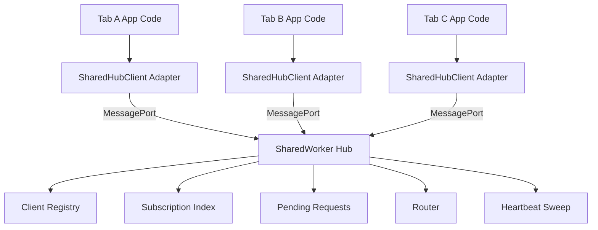

# Part 028 — Building a SharedWorker Hub

Di Part 027 kita membentuk mental model: `SharedWorker` adalah **live coordination hub**. Sekarang kita bangun implementasinya.

Kita tidak akan membuat demo “hello world”. Kita akan membuat kernel yang cukup production-minded:

- typed protocol envelope;
- client adapter;
- SharedWorker entry;
- connection handshake;
- port registry;
- presence snapshot;
- broadcast;
- direct routing;
- topic subscription;
- heartbeat;
- stale client cleanup;
- request/response;
- error DTO;
- bounded payload;
- version negotiation;
- fallback boundary.

Target desain:

> Banyak tab dapat connect ke satu hub. Hub tahu siapa client aktif, bisa route message, bisa broadcast event, bisa mendeteksi stale client, dan bisa diekstrak menjadi orchestration runtime yang lebih besar.

---

## 1. Architecture Overview



Kita buat boundary seperti ini:

```txt
app code
  ↓
SharedHubClient adapter
  ↓
MessagePort
  ↓
shared-worker.ts hub kernel
  ↓
registry / router / subscription / heartbeat
```

Kenapa adapter penting?

Karena aplikasi tidak boleh tersebar memanggil `worker.port.postMessage()` langsung. Tanpa adapter, protocol akan bocor ke seluruh codebase, retry tidak konsisten, timeout tersebar, metrics susah, dan fallback sulit.

---

## 2. File Layout

Contoh layout:

```txt
src/
  shared-hub/
    protocol.ts
    create-shared-hub-client.ts
    shared-hub.worker.ts
    fallback-broadcast-client.ts
    index.ts
```

Untuk bundler modern:

```ts
const worker = new SharedWorker(
  new URL('./shared-hub.worker.ts', import.meta.url),
  {
    name: 'app-shared-hub',
    type: 'module',
  },
);
```

Tetap lakukan production smoke test setelah build. Dev server sering menyembunyikan masalah path, MIME, CSP, dan module worker loading.

---

## 3. Protocol Types

Mulai dari contract. Transport boleh berubah, tetapi protocol harus stabil.

```ts
// src/shared-hub/protocol.ts

export const HUB_PROTOCOL = 'app.shared-hub' as const;
export const HUB_PROTOCOL_VERSION = 1 as const;

export type ClientId = string;
export type MessageId = string;
export type Topic = string;

export type HubEnvelope<TType extends string = string, TPayload = unknown> = {
  protocol: typeof HUB_PROTOCOL;
  version: typeof HUB_PROTOCOL_VERSION;
  id: MessageId;
  type: TType;
  sourceClientId?: ClientId;
  targetClientId?: ClientId;
  timestamp: number;
  payload: TPayload;
};

export type HelloPayload = {
  clientId: ClientId;
  tabId: string;
  url: string;
  visibilityState: DocumentVisibilityState;
  capabilities: string[];
};

export type WelcomePayload = {
  hubEpoch: string;
  clientId: ClientId;
  serverTime: number;
  clients: ClientSummary[];
};

export type ClientSummary = {
  clientId: ClientId;
  tabId: string;
  url: string;
  visibilityState: DocumentVisibilityState | 'unknown';
  connectedAt: number;
  lastSeenAt: number;
  capabilities: string[];
};

export type HubErrorPayload = {
  code:
    | 'PROTOCOL_MISMATCH'
    | 'INVALID_MESSAGE'
    | 'UNKNOWN_TYPE'
    | 'CLIENT_NOT_FOUND'
    | 'PAYLOAD_TOO_LARGE'
    | 'NOT_HANDSHAKEN'
    | 'INTERNAL_ERROR'
    | 'TIMEOUT';
  message: string;
  requestId?: MessageId;
  retryable: boolean;
};
```

Lalu message union:

```ts
export type ClientToHubMessage =
  | HubEnvelope<'hello', HelloPayload>
  | HubEnvelope<'heartbeat', { visibilityState: DocumentVisibilityState }>
  | HubEnvelope<'subscribe', { topic: Topic }>
  | HubEnvelope<'unsubscribe', { topic: Topic }>
  | HubEnvelope<'publish', { topic: Topic; event: unknown }>
  | HubEnvelope<'send.to.client', { targetClientId: ClientId; event: unknown }>
  | HubEnvelope<'request.snapshot', Record<string, never>>;

export type HubToClientMessage =
  | HubEnvelope<'welcome', WelcomePayload>
  | HubEnvelope<'client.joined', ClientSummary>
  | HubEnvelope<'client.left', { clientId: ClientId; reason: string }>
  | HubEnvelope<'event', { topic: Topic; event: unknown }>
  | HubEnvelope<'direct.event', { fromClientId: ClientId; event: unknown }>
  | HubEnvelope<'snapshot', { clients: ClientSummary[] }>
  | HubEnvelope<'error', HubErrorPayload>
  | HubEnvelope<'pong', { at: number }>;
```

Invariant penting:

- `hello` wajib jadi message pertama;
- message tanpa envelope ditolak;
- unknown protocol ditolak;
- unknown version ditolak atau dinegosiasi;
- hub tidak boleh throw karena payload client;
- error dikembalikan sebagai DTO.

---

## 4. Envelope Helper

```ts
export function createEnvelope<TType extends string, TPayload>(args: {
  type: TType;
  payload: TPayload;
  sourceClientId?: ClientId;
  targetClientId?: ClientId;
}): HubEnvelope<TType, TPayload> {
  return {
    protocol: HUB_PROTOCOL,
    version: HUB_PROTOCOL_VERSION,
    id: crypto.randomUUID(),
    type: args.type,
    sourceClientId: args.sourceClientId,
    targetClientId: args.targetClientId,
    timestamp: Date.now(),
    payload: args.payload,
  };
}
```

Untuk production, timestamp wall-clock tidak boleh dijadikan ordering correctness. Gunakan hanya untuk observability atau expiry kasar. Ordering dan idempotency harus berbasis message ID, sequence, fencing token, atau storage version.

---

## 5. Runtime Validation Minimal

TypeScript tidak melindungi runtime message. Data dari `postMessage` tetap harus divalidasi.

```ts
function isObject(value: unknown): value is Record<string, unknown> {
  return typeof value === 'object' && value !== null;
}

function isEnvelope(value: unknown): value is HubEnvelope {
  if (!isObject(value)) return false;
  return (
    value.protocol === HUB_PROTOCOL &&
    value.version === HUB_PROTOCOL_VERSION &&
    typeof value.id === 'string' &&
    typeof value.type === 'string' &&
    typeof value.timestamp === 'number' &&
    'payload' in value
  );
}
```

Untuk aplikasi besar, gunakan validator schema seperti Zod, Valibot, ArkType, atau custom generated schema. Tetapi prinsipnya sama: **never trust message shape**.

---

## 6. Client Adapter

Adapter menyembunyikan `SharedWorker` dan `MessagePort`.

```ts
// src/shared-hub/create-shared-hub-client.ts

import {
  createEnvelope,
  type ClientId,
  type HubEnvelope,
  type HubToClientMessage,
  type Topic,
} from './protocol';

type SharedHubClientOptions = {
  workerUrl: URL;
  workerName: string;
  heartbeatMs?: number;
  requestTimeoutMs?: number;
};

type EventHandler = (event: unknown) => void;

type PendingRequest = {
  resolve: (value: unknown) => void;
  reject: (reason: unknown) => void;
  timeoutId: number;
};

export type SharedHubClient = {
  clientId: ClientId;
  connect(): Promise<void>;
  disconnect(): void;
  publish(topic: Topic, event: unknown): void;
  subscribe(topic: Topic, handler: EventHandler): () => void;
  sendToClient(targetClientId: ClientId, event: unknown): void;
  requestSnapshot(): Promise<unknown>;
};
```

Client ID:

```ts
function getOrCreateClientId(): ClientId {
  const key = 'app.sharedHub.clientId';
  const existing = sessionStorage.getItem(key);
  if (existing) return existing;

  const created = crypto.randomUUID();
  sessionStorage.setItem(key, created);
  return created;
}

function createTabId(): string {
  return crypto.randomUUID();
}
```

`clientId` stabil selama session tab. `tabId` baru setiap page load. Ini membantu membedakan reload pada tab yang sama dari page instance baru.

---

## 7. Client Adapter Implementation

```ts
export function createSharedHubClient(options: SharedHubClientOptions): SharedHubClient {
  const clientId = getOrCreateClientId();
  const tabId = createTabId();
  const heartbeatMs = options.heartbeatMs ?? 5_000;
  const requestTimeoutMs = options.requestTimeoutMs ?? 10_000;

  let worker: SharedWorker | null = null;
  let port: MessagePort | null = null;
  let connected = false;
  let heartbeatTimer: number | null = null;

  const topicHandlers = new Map<Topic, Set<EventHandler>>();
  const pending = new Map<string, PendingRequest>();

  function post<TType extends string, TPayload>(type: TType, payload: TPayload): string {
    if (!port || !connected) {
      throw new Error(`SharedHubClient is not connected`);
    }

    const envelope = createEnvelope({
      type,
      payload,
      sourceClientId: clientId,
    });

    port.postMessage(envelope);
    return envelope.id;
  }

  function handleMessage(message: HubToClientMessage): void {
    switch (message.type) {
      case 'welcome': {
        connected = true;
        return;
      }

      case 'event': {
        const { topic, event } = message.payload as { topic: Topic; event: unknown };
        const handlers = topicHandlers.get(topic);
        if (!handlers) return;
        for (const handler of handlers) handler(event);
        return;
      }

      case 'direct.event': {
        const handlers = topicHandlers.get('__direct__');
        if (!handlers) return;
        for (const handler of handlers) handler(message.payload);
        return;
      }

      case 'snapshot': {
        const requestId = message.targetClientId;
        // In this simplified skeleton, response correlation is shown later.
        return;
      }

      case 'error': {
        console.warn('[shared-hub] error from hub', message.payload);
        return;
      }

      case 'client.joined':
      case 'client.left':
      case 'pong': {
        return;
      }

      default: {
        console.warn('[shared-hub] unknown message', message);
      }
    }
  }

  function startHeartbeat(): void {
    stopHeartbeat();
    heartbeatTimer = window.setInterval(() => {
      if (!port || !connected) return;
      post('heartbeat', { visibilityState: document.visibilityState });
    }, heartbeatMs);
  }

  function stopHeartbeat(): void {
    if (heartbeatTimer !== null) {
      window.clearInterval(heartbeatTimer);
      heartbeatTimer = null;
    }
  }

  return {
    clientId,

    async connect(): Promise<void> {
      if (!('SharedWorker' in window)) {
        throw new Error('SharedWorker is not supported in this environment');
      }

      worker = new SharedWorker(options.workerUrl, {
        name: options.workerName,
        type: 'module',
      });

      port = worker.port;
      port.start();

      await new Promise<void>((resolve, reject) => {
        const timeoutId = window.setTimeout(() => {
          reject(new Error('SharedWorker hello timeout'));
        }, requestTimeoutMs);

        const onMessage = (event: MessageEvent) => {
          const message = event.data as HubToClientMessage;
          if (message?.type === 'welcome') {
            window.clearTimeout(timeoutId);
            connected = true;
            port?.removeEventListener('message', onMessage);
            port?.addEventListener('message', (nextEvent) => {
              handleMessage(nextEvent.data as HubToClientMessage);
            });
            resolve();
          }
        };

        port!.addEventListener('message', onMessage);

        port!.postMessage(createEnvelope({
          type: 'hello',
          sourceClientId: clientId,
          payload: {
            clientId,
            tabId,
            url: location.href,
            visibilityState: document.visibilityState,
            capabilities: ['topic-subscription', 'direct-message', 'snapshot'],
          },
        }));
      });

      startHeartbeat();

      document.addEventListener('visibilitychange', () => {
        if (!connected) return;
        post('heartbeat', { visibilityState: document.visibilityState });
      });
    },

    disconnect(): void {
      stopHeartbeat();
      connected = false;

      for (const request of pending.values()) {
        window.clearTimeout(request.timeoutId);
        request.reject(new Error('SharedHubClient disconnected'));
      }
      pending.clear();

      port?.close();
      port = null;
      worker = null;
    },

    publish(topic: Topic, event: unknown): void {
      post('publish', { topic, event });
    },

    subscribe(topic: Topic, handler: EventHandler): () => void {
      let handlers = topicHandlers.get(topic);
      if (!handlers) {
        handlers = new Set();
        topicHandlers.set(topic, handlers);
        if (connected) post('subscribe', { topic });
      }

      handlers.add(handler);

      return () => {
        const current = topicHandlers.get(topic);
        if (!current) return;
        current.delete(handler);
        if (current.size === 0) {
          topicHandlers.delete(topic);
          if (connected) post('unsubscribe', { topic });
        }
      };
    },

    sendToClient(targetClientId: ClientId, event: unknown): void {
      post('send.to.client', { targetClientId, event });
    },

    requestSnapshot(): Promise<unknown> {
      return new Promise((resolve, reject) => {
        const id = post('request.snapshot', {});
        const timeoutId = window.setTimeout(() => {
          pending.delete(id);
          reject(new Error('request.snapshot timeout'));
        }, requestTimeoutMs);

        pending.set(id, { resolve, reject, timeoutId });
      });
    },
  };
}
```

Kode di atas masih skeleton. Kita akan memperbaiki correlation response di bagian request/response. Tetapi struktur boundary sudah benar: aplikasi tidak langsung bicara ke port.

---

## 8. SharedWorker Global Type

TypeScript sering tidak memberi typing sempurna untuk `SharedWorkerGlobalScope`. Buat deklarasi minimal.

```ts
// src/shared-hub/shared-hub.worker.ts

/// <reference lib="webworker" />

import {
  HUB_PROTOCOL,
  HUB_PROTOCOL_VERSION,
  createEnvelope,
  type ClientId,
  type ClientSummary,
  type ClientToHubMessage,
  type HubEnvelope,
  type Topic,
} from './protocol';

declare const self: SharedWorkerGlobalScope;

export {};
```

Jika environment TypeScript belum mengenali `SharedWorkerGlobalScope`, buat declaration file lokal atau gunakan type package yang sesuai. Jangan biarkan `any` menyebar ke seluruh hub.

---

## 9. Hub State

```ts
type ClientRecord = {
  clientId: ClientId;
  tabId: string;
  port: MessagePort;
  url: string;
  visibilityState: DocumentVisibilityState | 'unknown';
  connectedAt: number;
  lastSeenAt: number;
  capabilities: string[];
  handshaken: boolean;
};

const hubEpoch = crypto.randomUUID();
const clients = new Map<ClientId, ClientRecord>();
const subscriptions = new Map<Topic, Set<ClientId>>();

const MAX_MESSAGE_BYTES = 128 * 1024;
const CLIENT_TTL_MS = 20_000;
const SWEEP_MS = 5_000;
```

Kenapa ada `hubEpoch`?

Karena client perlu tahu apakah hub restart. Jika hub restart, in-memory subscription hilang. Client harus re-handshake dan re-subscribe.

---

## 10. Message Size Guard

Tidak ada ukuran message universal yang selalu benar. Tetapi hub harus punya policy.

```ts
function roughSizeBytes(value: unknown): number {
  try {
    return new Blob([JSON.stringify(value)]).size;
  } catch {
    return Number.POSITIVE_INFINITY;
  }
}

function isPayloadTooLarge(value: unknown): boolean {
  return roughSizeBytes(value) > MAX_MESSAGE_BYTES;
}
```

Ini bukan measurement sempurna untuk structured clone cost. Tetapi cukup sebagai guard awal. Untuk payload besar, gunakan IndexedDB/Cache/OPFS sebagai data plane, lalu kirim key kecil via hub.

---

## 11. Hub Send Helpers

```ts
function send<TType extends string, TPayload>(
  port: MessagePort,
  type: TType,
  payload: TPayload,
  targetClientId?: ClientId,
): void {
  port.postMessage(createEnvelope({
    type,
    payload,
    targetClientId,
  }));
}

function sendError(
  port: MessagePort,
  code: string,
  message: string,
  requestId?: string,
  retryable = false,
): void {
  send(port, 'error', {
    code,
    message,
    requestId,
    retryable,
  });
}

function toSummary(record: ClientRecord): ClientSummary {
  return {
    clientId: record.clientId,
    tabId: record.tabId,
    url: record.url,
    visibilityState: record.visibilityState,
    connectedAt: record.connectedAt,
    lastSeenAt: record.lastSeenAt,
    capabilities: record.capabilities,
  };
}

function allSummaries(): ClientSummary[] {
  return [...clients.values()].map(toSummary);
}
```

---

## 12. Runtime Envelope Validation in Hub

```ts
function isObject(value: unknown): value is Record<string, unknown> {
  return typeof value === 'object' && value !== null;
}

function isEnvelope(value: unknown): value is HubEnvelope {
  if (!isObject(value)) return false;

  return (
    value.protocol === HUB_PROTOCOL &&
    value.version === HUB_PROTOCOL_VERSION &&
    typeof value.id === 'string' &&
    typeof value.type === 'string' &&
    typeof value.timestamp === 'number' &&
    'payload' in value
  );
}
```

Production version sebaiknya memvalidasi payload per message type. Minimal skeleton ini sudah menolak message yang bukan protocol kita.

---

## 13. Connect Handler

```ts
self.addEventListener('connect', (event: MessageEvent) => {
  const port = event.ports[0];
  port.start();

  let attachedClientId: ClientId | null = null;

  port.addEventListener('message', (messageEvent: MessageEvent) => {
    try {
      const raw = messageEvent.data;

      if (isPayloadTooLarge(raw)) {
        sendError(port, 'PAYLOAD_TOO_LARGE', 'Message exceeded hub payload budget');
        return;
      }

      if (!isEnvelope(raw)) {
        sendError(port, 'INVALID_MESSAGE', 'Message is not a valid hub envelope');
        return;
      }

      if (raw.type === 'hello') {
        attachedClientId = handleHello(port, raw as ClientToHubMessage);
        return;
      }

      if (!attachedClientId) {
        sendError(port, 'NOT_HANDSHAKEN', 'Client must send hello before other messages', raw.id);
        return;
      }

      const record = clients.get(attachedClientId);
      if (!record) {
        sendError(port, 'CLIENT_NOT_FOUND', 'Client record was not found', raw.id, true);
        return;
      }

      record.lastSeenAt = Date.now();
      handleClientMessage(record, raw as ClientToHubMessage);
    } catch (error) {
      sendError(
        port,
        'INTERNAL_ERROR',
        error instanceof Error ? error.message : 'Unknown hub error',
        undefined,
        true,
      );
    }
  });
});
```

Important detail:

- setiap connection menyimpan `attachedClientId` lokal;
- message non-hello sebelum handshake ditolak;
- hub tidak throw keluar handler;
- raw message divalidasi sebelum dispatch;
- payload terlalu besar ditolak lebih awal.

---

## 14. Hello Handler

```ts
function handleHello(port: MessagePort, message: ClientToHubMessage): ClientId {
  if (message.type !== 'hello') {
    throw new Error('handleHello called with non-hello message');
  }

  const payload = message.payload as {
    clientId: ClientId;
    tabId: string;
    url: string;
    visibilityState: DocumentVisibilityState;
    capabilities: string[];
  };

  if (!payload.clientId || typeof payload.clientId !== 'string') {
    sendError(port, 'INVALID_MESSAGE', 'hello.clientId is required', message.id);
    throw new Error('Invalid hello.clientId');
  }

  const now = Date.now();
  const existing = clients.get(payload.clientId);

  if (existing) {
    // Same tab reloaded or previous port became stale.
    try {
      existing.port.close();
    } catch {
      // Ignore close errors.
    }
  }

  const record: ClientRecord = {
    clientId: payload.clientId,
    tabId: payload.tabId,
    port,
    url: payload.url,
    visibilityState: payload.visibilityState ?? 'unknown',
    connectedAt: now,
    lastSeenAt: now,
    capabilities: payload.capabilities ?? [],
    handshaken: true,
  };

  clients.set(record.clientId, record);

  send(port, 'welcome', {
    hubEpoch,
    clientId: record.clientId,
    serverTime: now,
    clients: allSummaries(),
  });

  broadcastExcept(record.clientId, 'client.joined', toSummary(record));

  return record.clientId;
}
```

Policy duplicate client ID di sini: koneksi baru menggantikan record lama. Ini cocok untuk reload tab. Untuk sistem yang butuh strict uniqueness, ubah policy menjadi reject duplicate atau tambahkan `tabId` sebagai part of identity.

---

## 15. Broadcast and Direct Routing

```ts
function broadcast<TType extends string, TPayload>(type: TType, payload: TPayload): void {
  for (const record of clients.values()) {
    send(record.port, type, payload, record.clientId);
  }
}

function broadcastExcept<TType extends string, TPayload>(
  exceptClientId: ClientId,
  type: TType,
  payload: TPayload,
): void {
  for (const record of clients.values()) {
    if (record.clientId === exceptClientId) continue;
    send(record.port, type, payload, record.clientId);
  }
}

function sendToClient<TType extends string, TPayload>(
  targetClientId: ClientId,
  type: TType,
  payload: TPayload,
): boolean {
  const target = clients.get(targetClientId);
  if (!target) return false;
  send(target.port, type, payload, targetClientId);
  return true;
}
```

Kita sengaja membedakan:

- broadcast semua;
- broadcast kecuali pengirim;
- direct target.

Jangan satu function “emit” ambigu. Ambiguitas routing adalah sumber bug multi-tab.

---

## 16. Subscription Index

```ts
function subscribe(clientId: ClientId, topic: Topic): void {
  let set = subscriptions.get(topic);
  if (!set) {
    set = new Set();
    subscriptions.set(topic, set);
  }
  set.add(clientId);
}

function unsubscribe(clientId: ClientId, topic: Topic): void {
  const set = subscriptions.get(topic);
  if (!set) return;
  set.delete(clientId);
  if (set.size === 0) subscriptions.delete(topic);
}

function removeClientFromSubscriptions(clientId: ClientId): void {
  for (const [topic, set] of subscriptions) {
    set.delete(clientId);
    if (set.size === 0) subscriptions.delete(topic);
  }
}

function publishTopic(sourceClientId: ClientId, topic: Topic, event: unknown): void {
  const subscribers = subscriptions.get(topic);
  if (!subscribers) return;

  for (const clientId of subscribers) {
    const target = clients.get(clientId);
    if (!target) continue;

    send(target.port, 'event', {
      topic,
      event,
      sourceClientId,
    }, clientId);
  }
}
```

Policy: publisher juga menerima event jika ia subscribe topic itu. Jika tidak diinginkan, tambahkan `publishExceptSource`.

---

## 17. Client Message Router

```ts
function handleClientMessage(record: ClientRecord, message: ClientToHubMessage): void {
  switch (message.type) {
    case 'heartbeat': {
      const payload = message.payload as { visibilityState?: DocumentVisibilityState };
      record.lastSeenAt = Date.now();
      record.visibilityState = payload.visibilityState ?? 'unknown';
      send(record.port, 'pong', { at: Date.now() }, record.clientId);
      return;
    }

    case 'subscribe': {
      const payload = message.payload as { topic: Topic };
      if (!payload.topic) {
        sendError(record.port, 'INVALID_MESSAGE', 'subscribe.topic is required', message.id);
        return;
      }
      subscribe(record.clientId, payload.topic);
      return;
    }

    case 'unsubscribe': {
      const payload = message.payload as { topic: Topic };
      if (!payload.topic) return;
      unsubscribe(record.clientId, payload.topic);
      return;
    }

    case 'publish': {
      const payload = message.payload as { topic: Topic; event: unknown };
      if (!payload.topic) {
        sendError(record.port, 'INVALID_MESSAGE', 'publish.topic is required', message.id);
        return;
      }
      publishTopic(record.clientId, payload.topic, payload.event);
      return;
    }

    case 'send.to.client': {
      const payload = message.payload as { targetClientId: ClientId; event: unknown };
      const ok = sendToClient(payload.targetClientId, 'direct.event', {
        fromClientId: record.clientId,
        event: payload.event,
      });

      if (!ok) {
        sendError(record.port, 'CLIENT_NOT_FOUND', 'Target client not found', message.id, true);
      }
      return;
    }

    case 'request.snapshot': {
      send(record.port, 'snapshot', { clients: allSummaries() }, record.clientId);
      return;
    }

    default: {
      sendError(record.port, 'UNKNOWN_TYPE', `Unknown message type: ${message.type}`, message.id);
    }
  }
}
```

Ini masih router sederhana. Tetapi ia sudah punya property penting:

- explicit switch;
- validation per command;
- no silent ignore untuk unknown type;
- route semantics jelas;
- error response tidak crash hub.

---

## 18. Heartbeat Sweep

Tidak semua tab memberi sinyal close yang reliable. Karena itu stale client harus dibersihkan dengan heartbeat.

```ts
function removeClient(clientId: ClientId, reason: string): void {
  const record = clients.get(clientId);
  if (!record) return;

  clients.delete(clientId);
  removeClientFromSubscriptions(clientId);

  try {
    record.port.close();
  } catch {
    // Ignore close errors.
  }

  broadcast('client.left', { clientId, reason });
}

setInterval(() => {
  const now = Date.now();

  for (const record of clients.values()) {
    if (now - record.lastSeenAt > CLIENT_TTL_MS) {
      removeClient(record.clientId, 'heartbeat-timeout');
    }
  }
}, SWEEP_MS);
```

Timeout harus lebih besar dari heartbeat interval. Untuk browser lifecycle yang agresif terhadap background tabs, jangan terlalu pendek.

Contoh:

```txt
heartbeat interval: 5s
client ttl: 20s–60s depending on product tolerance
```

Jika false positive removal tidak berbahaya, TTL bisa lebih pendek. Jika removal bisa mengganggu user, TTL harus lebih longgar dan reconnect harus smooth.

---

## 19. Fixing Request/Response Correlation

Skeleton adapter sebelumnya belum menghubungkan response snapshot ke pending request. Kita butuh `replyTo`.

Update envelope:

```ts
export type HubEnvelope<TType extends string = string, TPayload = unknown> = {
  protocol: typeof HUB_PROTOCOL;
  version: typeof HUB_PROTOCOL_VERSION;
  id: MessageId;
  replyTo?: MessageId;
  type: TType;
  sourceClientId?: ClientId;
  targetClientId?: ClientId;
  timestamp: number;
  payload: TPayload;
};
```

Update helper:

```ts
export function createEnvelope<TType extends string, TPayload>(args: {
  type: TType;
  payload: TPayload;
  sourceClientId?: ClientId;
  targetClientId?: ClientId;
  replyTo?: MessageId;
}): HubEnvelope<TType, TPayload> {
  return {
    protocol: HUB_PROTOCOL,
    version: HUB_PROTOCOL_VERSION,
    id: crypto.randomUUID(),
    replyTo: args.replyTo,
    type: args.type,
    sourceClientId: args.sourceClientId,
    targetClientId: args.targetClientId,
    timestamp: Date.now(),
    payload: args.payload,
  };
}
```

Update `send` helper di hub:

```ts
function send<TType extends string, TPayload>(
  port: MessagePort,
  type: TType,
  payload: TPayload,
  targetClientId?: ClientId,
  replyTo?: string,
): void {
  port.postMessage(createEnvelope({
    type,
    payload,
    targetClientId,
    replyTo,
  }));
}
```

Update snapshot handler:

```ts
case 'request.snapshot': {
  send(record.port, 'snapshot', { clients: allSummaries() }, record.clientId, message.id);
  return;
}
```

Update client message handler:

```ts
function handleMessage(message: HubToClientMessage): void {
  if (message.replyTo) {
    const request = pending.get(message.replyTo);
    if (request) {
      pending.delete(message.replyTo);
      window.clearTimeout(request.timeoutId);

      if (message.type === 'error') {
        request.reject(message.payload);
      } else {
        request.resolve(message.payload);
      }
      return;
    }
  }

  switch (message.type) {
    // normal event handling...
  }
}
```

Sekarang request/response punya correlation yang jelas.

---

## 20. Resubscribe After Hub Restart

Jika hub restart, subscription memory hilang. Client harus re-send subscriptions setelah reconnect/welcome.

Tambahkan function:

```ts
function resubscribeAll(): void {
  for (const topic of topicHandlers.keys()) {
    post('subscribe', { topic });
  }
}
```

Panggil setelah `welcome`:

```ts
if (message?.type === 'welcome') {
  connected = true;
  resubscribeAll();
  resolve();
}
```

Lebih baik lagi, simpan `hubEpoch` terakhir. Jika berubah, clear pending request dan rebuild state.

```ts
let currentHubEpoch: string | null = null;

function handleWelcome(payload: { hubEpoch: string }): void {
  if (currentHubEpoch && currentHubEpoch !== payload.hubEpoch) {
    for (const request of pending.values()) {
      window.clearTimeout(request.timeoutId);
      request.reject(new Error('Shared hub restarted'));
    }
    pending.clear();
  }

  currentHubEpoch = payload.hubEpoch;
  resubscribeAll();
}
```

---

## 21. Fallback Boundary

Jangan expose `createSharedHubClient()` langsung ke application layer. Buat factory.

```ts
export function createCoordinator(): SharedHubClient {
  if (typeof window !== 'undefined' && 'SharedWorker' in window) {
    return createSharedHubClient({
      workerUrl: new URL('./shared-hub.worker.ts', import.meta.url),
      workerName: 'app-shared-hub',
    });
  }

  if (typeof window !== 'undefined' && 'BroadcastChannel' in window) {
    return createBroadcastFallbackClient({
      channelName: 'app-shared-hub-fallback',
    });
  }

  return createLocalOnlyClient();
}
```

Aplikasi hanya tahu interface:

```ts
type Coordinator = {
  connect(): Promise<void>;
  disconnect(): void;
  publish(topic: string, event: unknown): void;
  subscribe(topic: string, handler: (event: unknown) => void): () => void;
};
```

Dengan begitu, fallback tidak memecah codebase.

---

## 22. React/Vue Integration Pattern

Karena user context project ini banyak menyentuh UI engineering, pattern integrasinya harus aman terhadap lifecycle component.

### React-style hook

```ts
function useSharedTopic(topic: string, onEvent: (event: unknown) => void) {
  useEffect(() => {
    const unsubscribe = coordinator.subscribe(topic, onEvent);
    return unsubscribe;
  }, [topic, onEvent]);
}
```

Masalah umum: `onEvent` identity berubah setiap render. Untuk production, gunakan stable callback/ref agar tidak unsubscribe/subscribe terlalu sering.

### Vue-style composable

```ts
export function useSharedTopic(topic: string, handler: (event: unknown) => void) {
  let unsubscribe: (() => void) | null = null;

  onMounted(() => {
    unsubscribe = coordinator.subscribe(topic, handler);
  });

  onUnmounted(() => {
    unsubscribe?.();
  });
}
```

Ingat: component lifecycle bukan tab lifecycle. Hub client sebaiknya singleton per page instance, sedangkan subscription bisa per component.

---

## 23. Observability Hooks

Tambahkan metrics dari awal.

```ts
type HubMetric =
  | { type: 'hub.connected'; hubEpoch: string; clientCount: number }
  | { type: 'hub.message.sent'; messageType: string; bytes: number }
  | { type: 'hub.message.received'; messageType: string; bytes: number }
  | { type: 'hub.client.timeout'; clientId: string }
  | { type: 'hub.error'; code: string; retryable: boolean };
```

Di adapter:

```ts
function emitMetric(metric: HubMetric): void {
  console.debug('[shared-hub metric]', metric);
  // production: forward to telemetry pipeline with sampling
}
```

Metrics minimal:

| Metric | Kenapa penting |
|---|---|
| connected clients | mendeteksi leak/registry anomali |
| message count by type | melihat flood |
| payload rough bytes | melihat data-plane violation |
| heartbeat timeout | lifecycle/browser pressure |
| reconnect count | hub instability |
| pending request count | backpressure signal |
| request latency | routing health |
| error code count | protocol drift |

---

## 24. Testing Strategy

### Unit test router

Pisahkan router logic dari raw `MessagePort` agar bisa diuji.

```ts
function createHubKernel() {
  // registry + subscriptions + handlers
}
```

Test:

- `hello` registers client;
- duplicate client replaces old port;
- subscribe adds index;
- unsubscribe removes index;
- publish only sends to subscribers;
- direct send to missing client returns error;
- heartbeat updates lastSeen;
- sweep removes stale client.

### Browser integration test

Gunakan Playwright multi-page:

```ts
test('shared hub broadcasts between two tabs', async ({ browser }) => {
  const context = await browser.newContext();
  const pageA = await context.newPage();
  const pageB = await context.newPage();

  await pageA.goto('/');
  await pageB.goto('/');

  await pageA.evaluate(() => window.__coordinator.connect());
  await pageB.evaluate(() => window.__coordinator.connect());

  await pageB.evaluate(() => {
    window.__events = [];
    window.__coordinator.subscribe('demo', (event) => window.__events.push(event));
  });

  await pageA.evaluate(() => {
    window.__coordinator.publish('demo', { ok: true });
  });

  await expect.poll(async () => {
    return pageB.evaluate(() => window.__events.length);
  }).toBe(1);
});
```

Test failure:

- close page A;
- wait heartbeat timeout;
- page B receives `client.left`;
- reload page B;
- reconnect and resubscribe;
- simulate oversized message;
- simulate protocol mismatch.

---

## 25. Security Rules

SharedWorker berada di same-origin, tetapi jangan perlakukan semua same-origin script sebagai trusted.

Rules:

1. Validasi semua envelope.
2. Batasi message type.
3. Batasi payload size.
4. Jangan simpan token rahasia sebagai service API terbuka di hub.
5. Jangan expose command seperti `eval`, `fetchAnyUrl`, `readSecret`, atau `dumpAllState`.
6. Jangan jadikan client-provided `clientId` sebagai authorization identity.
7. Untuk action sensitif, server tetap melakukan authorization.
8. Gunakan CSP dan Trusted Types untuk mengurangi risiko XSS.
9. Log protocol abuse dengan sampling.
10. Version mismatch harus fail closed.

Contoh command berbahaya:

```ts
type BadCommand = {
  type: 'run';
  payload: { code: string };
};
```

Jangan pernah buat hub sebagai remote execution engine.

---

## 26. Production Hardening Checklist

| Area | Checklist |
|---|---|
| Compatibility | feature detect `SharedWorker`, fallback tersedia |
| Bundling | module worker build diverifikasi di production preview |
| Protocol | versioned envelope, runtime validation |
| Lifecycle | heartbeat, sweep, reconnect, resubscribe |
| Failure | timeout, error DTO, hub epoch, stale response guard |
| Payload | max bytes, no large broadcast, storage indirection |
| Security | no secret vault, no eval, allowlist command |
| Observability | metrics untuk message, error, reconnect, timeout |
| Testing | multi-page integration test |
| Performance | bounded pending request, no heavy CPU in hub |
| Migration | protocol version strategy |

---

## 27. Complete Minimal Worker Kernel

Berikut condensed version yang bisa dipakai sebagai titik awal.

```ts
/// <reference lib="webworker" />

declare const self: SharedWorkerGlobalScope;

const PROTOCOL = 'app.shared-hub';
const VERSION = 1;
const hubEpoch = crypto.randomUUID();

const clients = new Map<string, {
  clientId: string;
  tabId: string;
  port: MessagePort;
  url: string;
  visibilityState: DocumentVisibilityState | 'unknown';
  connectedAt: number;
  lastSeenAt: number;
  capabilities: string[];
}>();

const subscriptions = new Map<string, Set<string>>();

function envelope(type: string, payload: unknown, replyTo?: string) {
  return {
    protocol: PROTOCOL,
    version: VERSION,
    id: crypto.randomUUID(),
    replyTo,
    type,
    timestamp: Date.now(),
    payload,
  };
}

function send(port: MessagePort, type: string, payload: unknown, replyTo?: string) {
  port.postMessage(envelope(type, payload, replyTo));
}

function summary(record: NonNullable<ReturnType<typeof clients.get>>) {
  return {
    clientId: record.clientId,
    tabId: record.tabId,
    url: record.url,
    visibilityState: record.visibilityState,
    connectedAt: record.connectedAt,
    lastSeenAt: record.lastSeenAt,
    capabilities: record.capabilities,
  };
}

function allSummaries() {
  return [...clients.values()].map(summary);
}

function removeClient(clientId: string, reason: string) {
  const record = clients.get(clientId);
  if (!record) return;

  clients.delete(clientId);

  for (const [topic, set] of subscriptions) {
    set.delete(clientId);
    if (set.size === 0) subscriptions.delete(topic);
  }

  try { record.port.close(); } catch {}

  for (const target of clients.values()) {
    send(target.port, 'client.left', { clientId, reason });
  }
}

self.addEventListener('connect', (event) => {
  const port = event.ports[0];
  port.start();

  let clientId: string | null = null;

  port.addEventListener('message', (event) => {
    const message = event.data;

    if (!message || message.protocol !== PROTOCOL || message.version !== VERSION) {
      send(port, 'error', { code: 'INVALID_MESSAGE', message: 'Invalid protocol' });
      return;
    }

    if (message.type === 'hello') {
      const payload = message.payload;
      clientId = payload.clientId;

      const now = Date.now();
      const existing = clients.get(clientId);
      if (existing) {
        try { existing.port.close(); } catch {}
      }

      const record = {
        clientId,
        tabId: payload.tabId,
        port,
        url: payload.url,
        visibilityState: payload.visibilityState ?? 'unknown',
        connectedAt: now,
        lastSeenAt: now,
        capabilities: payload.capabilities ?? [],
      };

      clients.set(clientId, record);

      send(port, 'welcome', {
        hubEpoch,
        clientId,
        serverTime: now,
        clients: allSummaries(),
      }, message.id);

      for (const target of clients.values()) {
        if (target.clientId !== clientId) {
          send(target.port, 'client.joined', summary(record));
        }
      }
      return;
    }

    if (!clientId || !clients.has(clientId)) {
      send(port, 'error', { code: 'NOT_HANDSHAKEN', message: 'Send hello first' }, message.id);
      return;
    }

    const record = clients.get(clientId)!;
    record.lastSeenAt = Date.now();

    switch (message.type) {
      case 'heartbeat':
        record.visibilityState = message.payload?.visibilityState ?? 'unknown';
        send(port, 'pong', { at: Date.now() }, message.id);
        break;

      case 'subscribe': {
        const topic = message.payload.topic;
        let set = subscriptions.get(topic);
        if (!set) subscriptions.set(topic, set = new Set());
        set.add(clientId);
        break;
      }

      case 'unsubscribe': {
        const topic = message.payload.topic;
        const set = subscriptions.get(topic);
        if (!set) break;
        set.delete(clientId);
        if (set.size === 0) subscriptions.delete(topic);
        break;
      }

      case 'publish': {
        const { topic, event } = message.payload;
        const set = subscriptions.get(topic);
        if (!set) break;

        for (const targetClientId of set) {
          const target = clients.get(targetClientId);
          if (!target) continue;
          send(target.port, 'event', { topic, event, sourceClientId: clientId });
        }
        break;
      }

      case 'request.snapshot':
        send(port, 'snapshot', { clients: allSummaries() }, message.id);
        break;

      default:
        send(port, 'error', { code: 'UNKNOWN_TYPE', message: message.type }, message.id);
    }
  });
});

setInterval(() => {
  const now = Date.now();
  for (const record of clients.values()) {
    if (now - record.lastSeenAt > 20_000) {
      removeClient(record.clientId, 'heartbeat-timeout');
    }
  }
}, 5_000);
```

Ini belum final untuk semua use case, tetapi sudah memiliki bentuk yang benar: connection-based, versioned, heartbeat-aware, registry-driven, dan recoverable.

---

## 28. Where This Goes Next

Part 029 akan memperdalam **Port Registry, Client Tracking, dan Heartbeats**.

Di part ini kita sudah punya registry minimal. Berikutnya kita akan membuatnya lebih serius:

- registry state machine;
- client lease;
- heartbeat jitter;
- visibility-aware TTL;
- stale port cleanup;
- duplicate tab identity;
- ghost client;
- reconnect semantics;
- presence event correctness;
- test matrix untuk freeze/restore/reload/close.

SharedWorker hub tanpa registry yang kuat akan terlihat bekerja di demo, tetapi gagal saat user membuka banyak tab, sleep laptop, restore browser session, atau deploy versi baru saat tab lama masih hidup.

---

## References

- MDN Web Docs — `SharedWorker`
- MDN Web Docs — `SharedWorker.port`
- MDN Web Docs — `SharedWorkerGlobalScope: connect event`
- MDN Web Docs — `MessagePort.start()` and `MessagePort.close()`
- HTML Standard — Workers
