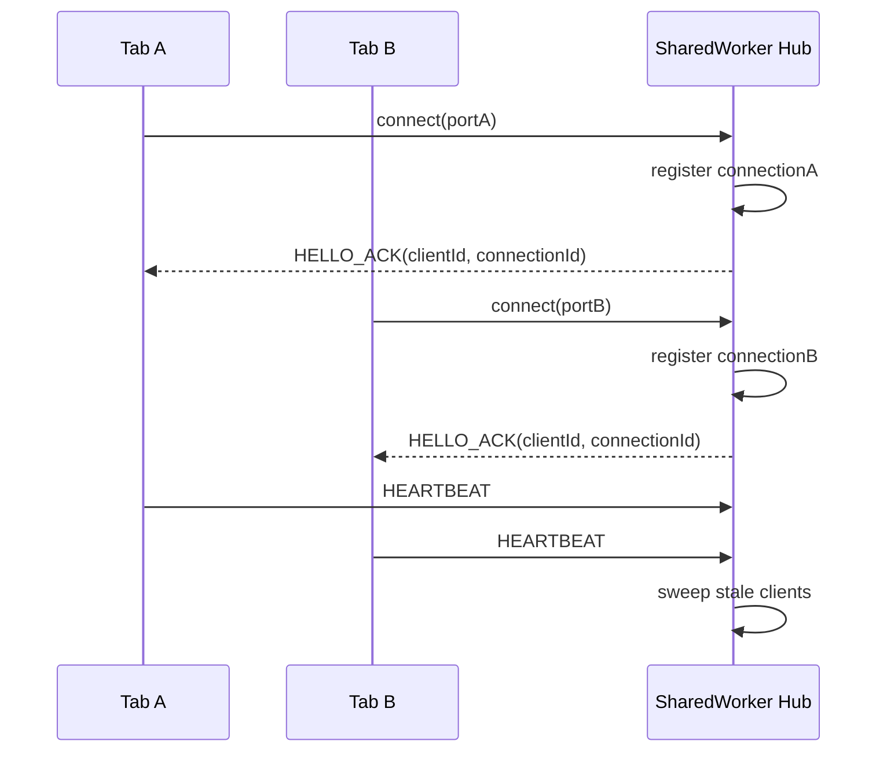
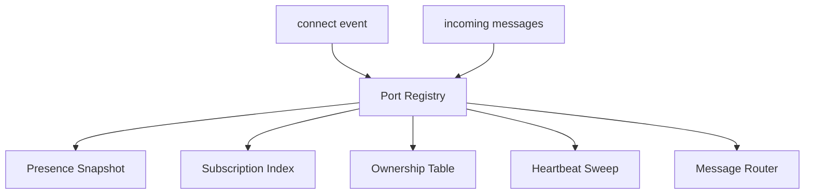
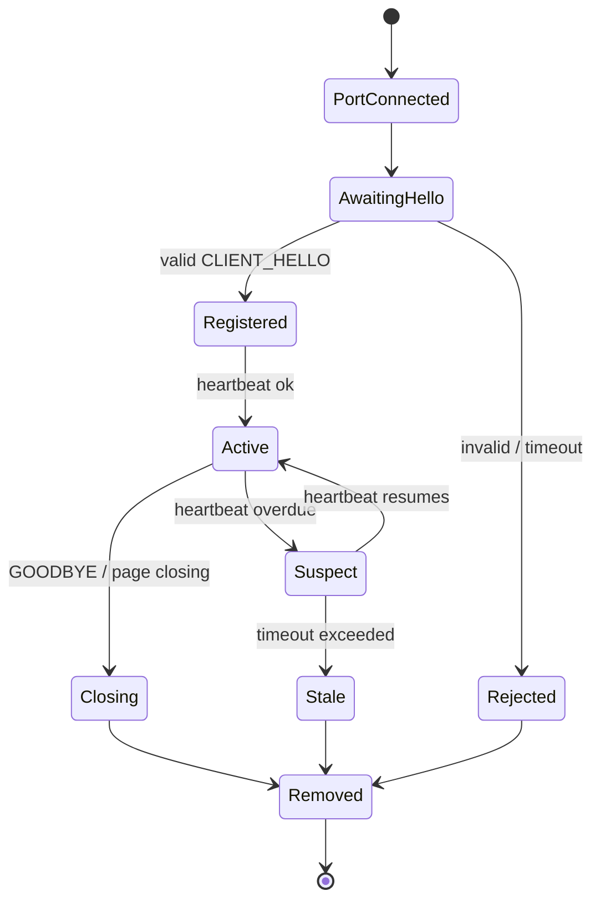
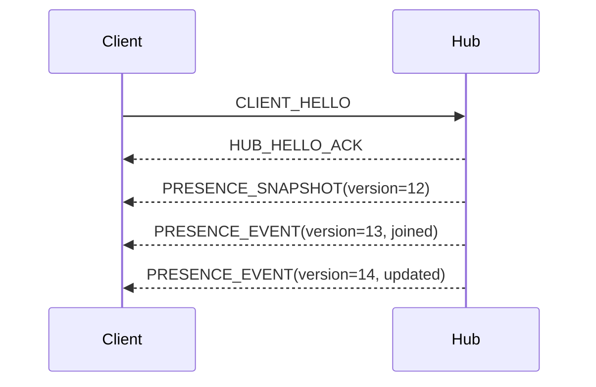

# Part 029 — Port Registry, Client Tracking, Heartbeats

Di Part 028 kita membangun **SharedWorker hub**. Hub itu sudah bisa menerima koneksi, route message, dan broadcast event.

Sekarang kita masuk ke bagian yang menentukan apakah hub tersebut bisa dipakai di sistem nyata:

> Bagaimana hub tahu siapa yang sedang hidup, siapa yang stale, siapa yang visible, siapa yang leader candidate, siapa yang punya capability tertentu, dan kapan sebuah `MessagePort` harus dianggap mati?

Ini bukan sekadar array of ports.

Ini adalah **membership subsystem**.

Dalam sistem distributed backend, kita punya service discovery, health check, leases, fencing token, dan membership registry. Di browser, konsepnya sama, hanya mediumnya berbeda:

- client = tab/window/iframe/worker context;
- connection = `MessagePort`;
- process death = tab closed / page discarded / worker terminated / navigation;
- unreliable scheduler = hidden/frozen page;
- shared memory optional = tidak boleh diasumsikan;
- network visibility = tidak cukup untuk liveness tab;
- cleanup event = tidak boleh dipercaya penuh.

Tujuan bagian ini:

1. membangun port registry yang eksplisit;
2. membedakan identity, connection, dan session;
3. mendesain heartbeat yang tidak naif;
4. memahami liveness vs presence vs readiness;
5. menangani reconnect/resync;
6. membuat registry aman dari leak, duplicate, stale route, dan split-brain ringan.

---

## 1. Core Mental Model

`SharedWorker` menerima koneksi melalui `connect` event. Setiap koneksi membawa satu `MessagePort`.



Tiga hal harus dipisahkan:

| Konsep | Arti | Contoh |
|---|---|---|
| `clientId` | identity logical tab/context | `tab_01J...` |
| `connectionId` | identity koneksi port saat ini | `conn_01J...` |
| `sessionId` | identity sesi login/app runtime | `sess_abc` |

Kesalahan umum: memakai `clientId` sebagai `connectionId`.

Akibatnya saat tab reconnect setelah navigation/restore, worker bisa salah route ke port lama, atau menganggap dua connection sebagai satu connection valid.

Invariant pertama:

> `clientId` boleh bertahan lintas reconnect. `connectionId` harus baru untuk setiap port baru.

---

## 2. Why Port Registry Is Not Optional

Tanpa registry, hub hanya punya event handler.

Dengan registry, hub punya model runtime.

Registry menjawab pertanyaan seperti:

- tab mana yang aktif?
- tab mana yang visible?
- tab mana yang sedang holding task?
- tab mana yang mendukung protocol versi tertentu?
- tab mana yang punya role `leader-candidate`?
- tab mana yang subscription ke topic tertentu?
- port mana yang harus menerima response untuk request tertentu?
- tab mana yang stale dan harus dikeluarkan?
- apakah broadcast boleh dikirim ke semua tab atau hanya foreground tab?

Registry adalah struktur data inti untuk orchestration.



---

## 3. Minimum Registry Model

Kita mulai dari model minimum.

```ts
type ClientId = string;
type ConnectionId = string;
type UnixMs = number;

type VisibilityState = 'visible' | 'hidden' | 'prerender' | 'unknown';
type LifecycleState = 'active' | 'passive' | 'hidden' | 'frozen-risk' | 'closing' | 'unknown';

type ClientRole =
  | 'app-tab'
  | 'admin-tab'
  | 'iframe-client'
  | 'background-client'
  | 'test-client';

type ClientCapability =
  | 'auth-refresh'
  | 'notification-display'
  | 'large-payload-download'
  | 'opfs-access'
  | 'foreground-ui'
  | 'leader-candidate';

interface ClientRecord {
  clientId: ClientId;
  connectionId: ConnectionId;
  port: MessagePort;

  connectedAt: UnixMs;
  lastSeenAt: UnixMs;
  lastHeartbeatAt: UnixMs;
  lastMessageAt: UnixMs;

  protocolVersion: number;
  appVersion: string;
  buildId: string;

  role: ClientRole;
  capabilities: Set<ClientCapability>;

  visibility: VisibilityState;
  lifecycle: LifecycleState;

  userIdHash?: string;
  sessionId?: string;
  route?: string;

  inflightRequests: Set<string>;
  subscriptions: Set<string>;

  closed: boolean;
  closeReason?: string;
}
```

Ini bukan final, tapi sudah cukup untuk:

- track port;
- routing;
- heartbeat;
- subscription;
- lifecycle-aware decisions;
- version-aware broadcast;
- cleanup.

---

## 4. Identity: Client ID vs Connection ID

### 4.1 Client ID

`clientId` adalah identity logical untuk context.

Biasanya dibuat di page dan disimpan di `sessionStorage`, bukan `localStorage`.

```ts
function getOrCreateClientId(): string {
  const key = 'app:tab-client-id';
  const existing = sessionStorage.getItem(key);
  if (existing) return existing;

  const created = `tab_${crypto.randomUUID()}`;
  sessionStorage.setItem(key, created);
  return created;
}
```

Kenapa `sessionStorage`?

- per top-level browsing context;
- tidak otomatis sama untuk semua tab;
- cocok untuk identity tab;
- hilang saat tab/session context selesai;
- lebih aman dibanding menyimpan identity tab di `localStorage` yang shared across tabs.

Tapi jangan salah paham: `sessionStorage` bukan security boundary. Ini cuma practical tab identity store.

### 4.2 Connection ID

`connectionId` dibuat setiap kali adapter connect ke SharedWorker.

```ts
function createConnectionId(): string {
  return `conn_${crypto.randomUUID()}`;
}
```

Satu `clientId` bisa punya beberapa `connectionId` sepanjang waktu:

```txt
clientId tab_A
  conn_1  initial page load
  conn_2  after navigation restore
  conn_3  after HMR reload
  conn_4  after worker restart
```

Invariant:

> Hub harus route ke connection terbaru yang masih valid, bukan sekadar record pertama untuk client tersebut.

### 4.3 Session ID

`sessionId` merepresentasikan authentication/application session.

Satu user session bisa punya banyak client:

```txt
session user_X
  tab_A
  tab_B
  iframe_C
```

Untuk security-sensitive event seperti logout, session boundary lebih penting daripada client boundary.

---

## 5. HELLO Handshake

Jangan register port hanya karena `connect` terjadi.

Port baru harus mengirim `HELLO` dengan metadata.

```ts
type ClientHello = {
  type: 'CLIENT_HELLO';
  messageId: string;
  clientId: string;
  connectionId: string;
  protocolVersion: number;
  appVersion: string;
  buildId: string;
  role: ClientRole;
  capabilities: ClientCapability[];
  visibility: VisibilityState;
  lifecycle: LifecycleState;
  sessionId?: string;
  userIdHash?: string;
  route?: string;
  sentAt: number;
};

type HubHelloAck = {
  type: 'HUB_HELLO_ACK';
  messageId: string;
  correlationId: string;
  accepted: true;
  hubId: string;
  hubStartedAt: number;
  heartbeatIntervalMs: number;
  heartbeatTimeoutMs: number;
  protocolVersion: number;
  serverTime: number;
};

type HubHelloReject = {
  type: 'HUB_HELLO_REJECT';
  messageId: string;
  correlationId: string;
  accepted: false;
  reason: 'UNSUPPORTED_PROTOCOL' | 'INVALID_CLIENT' | 'VERSION_SKEW' | 'MISSING_CAPABILITY';
  detail?: string;
};
```

Handshake memberi hub kesempatan untuk:

- validate protocol;
- reject unsupported client;
- replace stale connection;
- negotiate heartbeat interval;
- capture version metadata;
- initialize subscriptions;
- emit presence event.

---

## 6. Connection State Machine



Registry tidak boleh hanya punya boolean `connected`.

Minimal state:

```ts
type ConnectionState =
  | 'awaiting-hello'
  | 'active'
  | 'suspect'
  | 'closing'
  | 'stale'
  | 'removed';
```

`active` artinya belum tentu visible, belum tentu ready, belum tentu boleh jadi leader. `active` hanya berarti hub masih menerima sinyal liveness yang cukup baru.

---

## 7. Registry Data Structures

Kita butuh beberapa index.

```ts
interface RegistryState {
  byClientId: Map<ClientId, ClientRecord>;
  byConnectionId: Map<ConnectionId, ClientRecord>;
  bySessionId: Map<string, Set<ClientId>>;
  byCapability: Map<ClientCapability, Set<ClientId>>;
  byTopic: Map<string, Set<ClientId>>;
}
```

Kenapa banyak index?

Karena operation yang dibutuhkan berbeda:

| Operation | Index |
|---|---|
| send to client | `byClientId` |
| ignore stale message | `byConnectionId` |
| logout session | `bySessionId` |
| choose notification tab | `byCapability` + visibility |
| publish topic | `byTopic` |

Jangan scan semua client untuk semua operation jika aplikasi punya banyak context, iframe, atau embedded panels.

---

## 8. Replacing an Existing Client

Jika `CLIENT_HELLO` datang dengan `clientId` yang sudah ada, jangan langsung reject.

Kemungkinan:

1. tab reconnect;
2. page reload;
3. HMR reload;
4. duplicate bootstrap bug;
5. malicious/buggy same-origin script memakai `clientId` sama;
6. bfcache restore dengan connection lama masih ada;
7. old worker state menerima message terlambat.

Policy yang masuk akal:

- jika `connectionId` sama: treat as duplicate hello;
- jika `connectionId` berbeda dan record lama stale/suspect/closing: replace;
- jika record lama active: pilih berdasarkan fencing token atau generation;
- always close old port setelah replacement;
- emit `CLIENT_REPLACED` event internal.

```ts
function registerClient(record: ClientRecord) {
  const existing = registry.byClientId.get(record.clientId);

  if (!existing) {
    insertRecord(record);
    emitPresence('joined', record);
    return;
  }

  if (existing.connectionId === record.connectionId) {
    refreshExisting(existing, record);
    return;
  }

  const shouldReplace = shouldReplaceConnection(existing, record);

  if (!shouldReplace) {
    reject(record.port, 'CLIENT_ALREADY_ACTIVE');
    safeClosePort(record.port);
    return;
  }

  markClosed(existing, 'replaced-by-new-connection');
  safePost(existing.port, {
    type: 'HUB_CONNECTION_REPLACED',
    messageId: crypto.randomUUID(),
    newConnectionId: record.connectionId,
    at: now(),
  });
  safeClosePort(existing.port);
  removeRecord(existing, 'replaced');

  insertRecord(record);
  emitPresence('reconnected', record);
}
```

Replacement adalah sumber bug besar jika tidak eksplisit.

---

## 9. Fencing Token for Connection Generation

Untuk menghindari stale message dari connection lama, tambahkan generation.

```ts
interface ClientRecord {
  clientId: string;
  connectionId: string;
  generation: number;
  // ...
}
```

Hub increment generation per client.

```ts
const clientGenerations = new Map<ClientId, number>();

function nextGeneration(clientId: ClientId): number {
  const next = (clientGenerations.get(clientId) ?? 0) + 1;
  clientGenerations.set(clientId, next);
  return next;
}
```

Setiap message dari client menyertakan generation.

```ts
type ClientEnvelope = {
  type: string;
  messageId: string;
  clientId: string;
  connectionId: string;
  generation: number;
  sentAt: number;
};
```

Hub memvalidasi:

```ts
function isCurrentEnvelope(msg: ClientEnvelope): boolean {
  const record = registry.byClientId.get(msg.clientId);
  return !!record
    && record.connectionId === msg.connectionId
    && record.generation === msg.generation;
}
```

Invariant:

> Setiap message dari connection lama harus bisa ditolak tanpa efek samping.

---

## 10. Heartbeat: What It Proves and What It Does Not

Heartbeat membuktikan satu hal sempit:

> Dalam window waktu tertentu, sebuah context berhasil menjalankan JavaScript dan mengirim message ke hub.

Heartbeat tidak membuktikan:

- user sedang melihat tab;
- tab punya koneksi internet;
- app state konsisten;
- client bisa menjalankan task berat;
- client boleh menjadi leader;
- UI siap menerima event;
- user masih authenticated;
- semua message sebelumnya sudah diproses.

Jadi jangan gunakan heartbeat sebagai proxy semua health.

Gunakan heartbeat untuk liveness, lalu metadata lain untuk readiness.

```ts
interface ClientHealth {
  liveness: 'alive' | 'suspect' | 'stale';
  visibility: 'visible' | 'hidden' | 'unknown';
  readiness: 'ready' | 'busy' | 'degraded' | 'unknown';
  session: 'authenticated' | 'anonymous' | 'revoked' | 'unknown';
}
```

---

## 11. Heartbeat Protocol

```ts
type ClientHeartbeat = {
  type: 'CLIENT_HEARTBEAT';
  messageId: string;
  clientId: string;
  connectionId: string;
  generation: number;
  seq: number;
  visibility: VisibilityState;
  lifecycle: LifecycleState;
  route?: string;
  load?: {
    pendingTasks: number;
    queueDepth: number;
    lastLongTaskAt?: number;
    memoryPressure?: 'low' | 'medium' | 'high' | 'unknown';
  };
  sentAt: number;
};

type HubHeartbeatAck = {
  type: 'HUB_HEARTBEAT_ACK';
  messageId: string;
  correlationId: string;
  seq: number;
  hubTime: number;
  registryVersion: number;
  commands?: HubCommand[];
};
```

ACK tidak selalu wajib, tapi useful untuk:

- detect hub restart;
- detect connection still working both ways;
- carry commands;
- sync registry version;
- measure approximate round-trip latency.

---

## 12. Heartbeat Interval Selection

Interval terlalu pendek = battery/CPU cost.

Interval terlalu panjang = stale detection lambat.

Mulai dari baseline:

| Context | Heartbeat Interval | Timeout |
|---|---:|---:|
| visible tab | 5–10s | 20–30s |
| hidden tab | 15–30s | 60–120s |
| frozen-risk | best effort | TTL based |
| critical leader | 3–5s | 10–15s |
| low priority client | 30–60s | 2–5m |

Jangan hardcode satu angka untuk semua.

```ts
function heartbeatPolicy(record: ClientRecord) {
  if (record.capabilities.has('leader-candidate') && record.visibility === 'visible') {
    return { intervalMs: 5_000, timeoutMs: 15_000 };
  }

  if (record.visibility === 'hidden') {
    return { intervalMs: 30_000, timeoutMs: 120_000 };
  }

  return { intervalMs: 10_000, timeoutMs: 30_000 };
}
```

Namun worker tidak bisa memaksa page mengirim tepat waktu. Browser bisa throttle timer di hidden page. Karena itu timeout harus toleran terhadap lifecycle.

---

## 13. Heartbeat from Client Adapter

```ts
class SharedHubClient {
  private heartbeatSeq = 0;
  private heartbeatTimer: number | undefined;
  private lastAckAt = 0;

  constructor(
    private readonly port: MessagePort,
    private readonly identity: {
      clientId: string;
      connectionId: string;
      generation: number;
    },
  ) {}

  startHeartbeat(intervalMs: number) {
    this.stopHeartbeat();

    const tick = () => {
      this.sendHeartbeat();
      this.heartbeatTimer = window.setTimeout(tick, this.computeNextInterval(intervalMs));
    };

    this.heartbeatTimer = window.setTimeout(tick, jitter(intervalMs));
  }

  stopHeartbeat() {
    if (this.heartbeatTimer !== undefined) {
      window.clearTimeout(this.heartbeatTimer);
      this.heartbeatTimer = undefined;
    }
  }

  private sendHeartbeat() {
    this.port.postMessage({
      type: 'CLIENT_HEARTBEAT',
      messageId: crypto.randomUUID(),
      clientId: this.identity.clientId,
      connectionId: this.identity.connectionId,
      generation: this.identity.generation,
      seq: ++this.heartbeatSeq,
      visibility: document.visibilityState,
      lifecycle: inferLifecycleState(),
      route: location.pathname,
      sentAt: Date.now(),
    });
  }

  private computeNextInterval(baseMs: number) {
    if (document.visibilityState === 'hidden') return jitter(Math.max(baseMs, 30_000));
    return jitter(baseMs);
  }
}

function jitter(ms: number) {
  const delta = ms * 0.2;
  return Math.round(ms - delta + Math.random() * delta * 2);
}
```

Jitter penting agar banyak tab tidak mengirim heartbeat bersamaan.

---

## 14. Lifecycle-Aware Heartbeat

Client adapter harus react ke lifecycle event.

```ts
function installLifecycleSignals(send: (patch: Partial<ClientHeartbeat>) => void) {
  document.addEventListener('visibilitychange', () => {
    send({
      visibility: document.visibilityState,
      lifecycle: inferLifecycleState(),
      sentAt: Date.now(),
    });
  });

  window.addEventListener('pagehide', (event) => {
    send({
      lifecycle: event.persisted ? 'frozen-risk' : 'closing',
      sentAt: Date.now(),
    });
  });

  window.addEventListener('pageshow', (event) => {
    send({
      lifecycle: event.persisted ? 'active' : inferLifecycleState(),
      sentAt: Date.now(),
    });
  });

  window.addEventListener('beforeunload', () => {
    try {
      send({ lifecycle: 'closing', sentAt: Date.now() });
    } catch {
      // Do not depend on this. It is best-effort only.
    }
  });
}
```

Important:

> `beforeunload`, `unload`, `pagehide`, dan cleanup signal harus dianggap best effort, bukan correctness mechanism.

Correctness harus datang dari TTL/lease/heartbeat expiry.

---

## 15. Hub-Side Heartbeat Handling

```ts
function handleHeartbeat(msg: ClientHeartbeat) {
  const record = registry.byClientId.get(msg.clientId);

  if (!record) {
    // Client thinks it is registered, hub does not.
    // Likely hub restarted or registry was cleared.
    safePostByPort(msg.connectionId, {
      type: 'HUB_RESYNC_REQUIRED',
      messageId: crypto.randomUUID(),
      reason: 'UNKNOWN_CLIENT',
      at: now(),
    });
    return;
  }

  if (record.connectionId !== msg.connectionId || record.generation !== msg.generation) {
    metrics.increment('hub.heartbeat.stale_connection');
    return;
  }

  const oldVisibility = record.visibility;
  const oldLifecycle = record.lifecycle;

  record.lastSeenAt = now();
  record.lastHeartbeatAt = now();
  record.lastMessageAt = now();
  record.visibility = msg.visibility;
  record.lifecycle = msg.lifecycle;
  record.route = msg.route ?? record.route;

  if (oldVisibility !== record.visibility || oldLifecycle !== record.lifecycle) {
    emitPresence('updated', record);
  }

  safePost(record.port, {
    type: 'HUB_HEARTBEAT_ACK',
    messageId: crypto.randomUUID(),
    correlationId: msg.messageId,
    seq: msg.seq,
    hubTime: now(),
    registryVersion,
  });
}
```

---

## 16. Sweep Loop

Hub perlu sweep stale clients.

```ts
const SWEEP_INTERVAL_MS = 5_000;

function startSweepLoop() {
  setInterval(() => {
    const t = now();

    for (const record of registry.byClientId.values()) {
      const policy = heartbeatPolicy(record);
      const age = t - record.lastHeartbeatAt;

      if (record.closed) continue;

      if (age > policy.timeoutMs * 2) {
        removeRecord(record, 'heartbeat-timeout');
        continue;
      }

      if (age > policy.timeoutMs) {
        markSuspect(record, 'heartbeat-overdue');
      }
    }
  }, SWEEP_INTERVAL_MS);
}
```

Dua level lebih baik daripada satu:

| State | Meaning | Action |
|---|---|---|
| suspect | heartbeat terlambat | jangan route critical task baru |
| stale | timeout jauh lewat | remove/close/release ownership |

---

## 17. Presence Snapshot

Presence adalah view dari registry.

```ts
type PresenceClient = {
  clientId: string;
  role: ClientRole;
  visibility: VisibilityState;
  lifecycle: LifecycleState;
  capabilities: ClientCapability[];
  route?: string;
  connectedAt: number;
  lastSeenAt: number;
  health: 'alive' | 'suspect' | 'stale';
};

type PresenceSnapshot = {
  type: 'PRESENCE_SNAPSHOT';
  registryVersion: number;
  generatedAt: number;
  clients: PresenceClient[];
};
```

Jangan expose raw `ClientRecord` ke app. Jangan leak `MessagePort`, internal generation, atau debugging-only metadata.

```ts
function toPresenceClient(record: ClientRecord): PresenceClient {
  return {
    clientId: record.clientId,
    role: record.role,
    visibility: record.visibility,
    lifecycle: record.lifecycle,
    capabilities: Array.from(record.capabilities),
    route: record.route,
    connectedAt: record.connectedAt,
    lastSeenAt: record.lastSeenAt,
    health: healthOf(record),
  };
}
```

---

## 18. Registry Version

Setiap perubahan membership menaikkan `registryVersion`.

```ts
let registryVersion = 0;

function bumpRegistryVersion() {
  registryVersion += 1;
  return registryVersion;
}
```

Event presence membawa version.

```ts
type PresenceEvent = {
  type: 'PRESENCE_EVENT';
  registryVersion: number;
  event: 'joined' | 'left' | 'updated' | 'suspect' | 'reconnected';
  client: PresenceClient;
  at: number;
};
```

Kenapa version penting?

Karena client bisa menerima event out of order setelah reconnect. Dengan version, client bisa ignore event lama atau request snapshot baru.

```ts
class PresenceStore {
  private version = 0;

  apply(event: PresenceEvent) {
    if (event.registryVersion <= this.version) return;
    this.version = event.registryVersion;
    // apply event
  }
}
```

---

## 19. Presence Event vs Snapshot

Gunakan dua model:

1. snapshot saat client baru connect atau resync;
2. event incremental setelah itu.



Jika client mendeteksi gap:

```ts
if (event.registryVersion !== localVersion + 1) {
  requestPresenceSnapshot();
}
```

Ini mirip log replication sederhana.

---

## 20. Subscriptions and Topic Index

Port registry biasanya terhubung ke subscription index.

```ts
type SubscribeMessage = {
  type: 'SUBSCRIBE';
  messageId: string;
  clientId: string;
  connectionId: string;
  generation: number;
  topics: string[];
};

type UnsubscribeMessage = {
  type: 'UNSUBSCRIBE';
  messageId: string;
  clientId: string;
  connectionId: string;
  generation: number;
  topics: string[];
};
```

Index:

```ts
const byTopic = new Map<string, Set<ClientId>>();

function subscribe(record: ClientRecord, topics: string[]) {
  for (const topic of topics) {
    record.subscriptions.add(topic);

    let set = byTopic.get(topic);
    if (!set) {
      set = new Set();
      byTopic.set(topic, set);
    }
    set.add(record.clientId);
  }
}

function unsubscribe(record: ClientRecord, topics: string[]) {
  for (const topic of topics) {
    record.subscriptions.delete(topic);
    const set = byTopic.get(topic);
    if (!set) continue;
    set.delete(record.clientId);
    if (set.size === 0) byTopic.delete(topic);
  }
}
```

Cleanup harus remove subscriptions.

```ts
function removeRecord(record: ClientRecord, reason: string) {
  record.closed = true;
  record.closeReason = reason;

  registry.byClientId.delete(record.clientId);
  registry.byConnectionId.delete(record.connectionId);

  for (const topic of record.subscriptions) {
    const set = registry.byTopic.get(topic);
    set?.delete(record.clientId);
    if (set?.size === 0) registry.byTopic.delete(topic);
  }

  for (const capability of record.capabilities) {
    const set = registry.byCapability.get(capability);
    set?.delete(record.clientId);
    if (set?.size === 0) registry.byCapability.delete(capability);
  }

  removeFromSessionIndex(record);
  safeClosePort(record.port);

  bumpRegistryVersion();
  emitPresence('left', record);
}
```

---

## 21. Routing by Client ID

```ts
function sendToClient(clientId: string, message: unknown): boolean {
  const record = registry.byClientId.get(clientId);
  if (!record) return false;
  if (record.closed) return false;
  if (healthOf(record) === 'stale') return false;

  return safePost(record.port, message);
}
```

`safePost` harus catch `DataCloneError` dan port errors.

```ts
function safePost(port: MessagePort, message: unknown, transfer?: Transferable[]): boolean {
  try {
    if (transfer) port.postMessage(message, transfer);
    else port.postMessage(message);
    return true;
  } catch (error) {
    metrics.increment('hub.port.post_failed');
    metrics.event('hub.port.post_failed_detail', {
      name: error instanceof Error ? error.name : 'unknown',
      message: error instanceof Error ? error.message : String(error),
    });
    return false;
  }
}
```

Post failure bukan selalu proof bahwa client mati, tapi cukup untuk menandai suspect jika berulang.

---

## 22. Routing by Capability

Contoh: pilih satu tab visible yang bisa menampilkan notification.

```ts
function selectClientByCapability(capability: ClientCapability): ClientRecord | undefined {
  const ids = registry.byCapability.get(capability);
  if (!ids) return undefined;

  const candidates = Array.from(ids)
    .map((id) => registry.byClientId.get(id))
    .filter((x): x is ClientRecord => !!x && !x.closed)
    .filter((x) => healthOf(x) === 'alive');

  candidates.sort((a, b) => scoreClient(b) - scoreClient(a));
  return candidates[0];
}

function scoreClient(record: ClientRecord): number {
  let score = 0;
  if (record.visibility === 'visible') score += 100;
  if (record.lifecycle === 'active') score += 50;
  if (record.role === 'app-tab') score += 10;
  score -= record.inflightRequests.size;
  score -= now() - record.lastSeenAt > 10_000 ? 20 : 0;
  return score;
}
```

Ini lebih baik daripada random.

Capability routing dipakai untuk:

- notification display;
- foreground UI command;
- auth refresh owner;
- large file upload/download owner;
- browser API yang hanya tersedia di window;
- task yang butuh user-visible tab.

---

## 23. Session Index

Untuk security-sensitive broadcast:

```ts
function broadcastToSession(sessionId: string, message: unknown) {
  const ids = registry.bySessionId.get(sessionId);
  if (!ids) return;

  for (const clientId of ids) {
    sendToClient(clientId, message);
  }
}
```

Contoh logout:

```ts
function revokeSession(sessionId: string, reason: string) {
  broadcastToSession(sessionId, {
    type: 'SESSION_REVOKED',
    messageId: crypto.randomUUID(),
    sessionId,
    reason,
    at: now(),
  });

  for (const clientId of registry.bySessionId.get(sessionId) ?? []) {
    const record = registry.byClientId.get(clientId);
    if (record) {
      record.sessionId = undefined;
      record.capabilities.delete('auth-refresh');
    }
  }

  bumpRegistryVersion();
}
```

Jangan broadcast auth token lewat hub. Broadcast event invalidasi, bukan secret.

---

## 24. Handling `messageerror`

`MessagePort` bisa menerima `messageerror` jika message tidak bisa dideserialize.

```ts
port.addEventListener('messageerror', (event) => {
  metrics.increment('hub.port.messageerror');

  const record = findRecordByPort(port);
  if (record) {
    markSuspect(record, 'messageerror');
  }
});
```

`messageerror` bisa terjadi karena:

- payload tidak cloneable;
- mismatch structured clone support;
- transferred object bermasalah;
- browser/version edge case;
- bug protocol.

Policy:

- increment metric;
- mark suspect jika berulang;
- jangan crash hub;
- minta client resync jika possible;
- simpan sample terbatas, jangan log payload besar/secret.

---

## 25. Port Close Reality

Tidak ada event universal yang sempurna: “port sudah benar-benar mati”.

Karena itu:

- client mengirim `GOODBYE` best effort;
- hub timeout heartbeat;
- hub cleanup subscriptions;
- hub idempotent remove;
- stale ownership dilepas lewat lease expiry.

```ts
type ClientGoodbye = {
  type: 'CLIENT_GOODBYE';
  messageId: string;
  clientId: string;
  connectionId: string;
  generation: number;
  reason: 'pagehide' | 'logout' | 'navigation' | 'manual-close' | 'unknown';
  sentAt: number;
};
```

Handler:

```ts
function handleGoodbye(msg: ClientGoodbye) {
  const record = registry.byClientId.get(msg.clientId);
  if (!record) return;

  if (record.connectionId !== msg.connectionId || record.generation !== msg.generation) {
    return;
  }

  removeRecord(record, `goodbye:${msg.reason}`);
}
```

`GOODBYE` mempercepat cleanup, tapi tidak boleh menjadi satu-satunya cleanup mechanism.

---

## 26. Liveness vs Readiness

Backend engineer sering memisahkan liveness probe dan readiness probe. Di browser juga perlu.

| Probe | Pertanyaan | Contoh |
|---|---|---|
| liveness | masih hidup? | heartbeat baru diterima |
| readiness | boleh diberi kerja? | queue rendah, visible, session valid |
| capability | bisa melakukan kerja X? | punya API/permission/role |
| ownership | sedang memegang lease? | auth-refresh owner |

Contoh readiness:

```ts
type ClientReadiness = 'ready' | 'busy' | 'degraded' | 'not-ready';

function readinessOf(record: ClientRecord): ClientReadiness {
  if (record.closed) return 'not-ready';
  if (healthOf(record) !== 'alive') return 'not-ready';
  if (record.lifecycle === 'closing') return 'not-ready';
  if (record.inflightRequests.size > 20) return 'busy';
  if (record.visibility === 'hidden') return 'degraded';
  return 'ready';
}
```

Jangan pilih leader hanya karena heartbeat alive. Pilih leader dari readiness + capability + lease.

---

## 27. Heartbeat ACK as Command Carrier

ACK bisa membawa command kecil.

```ts
type HubCommand =
  | { type: 'RESYNC_PRESENCE'; reason: string }
  | { type: 'UPDATE_HEARTBEAT_POLICY'; intervalMs: number; timeoutMs: number }
  | { type: 'DROP_SUBSCRIPTION'; topic: string; reason: string }
  | { type: 'REFRESH_CAPABILITIES'; reason: string };
```

Ini useful karena tidak perlu channel command terpisah untuk hal-hal kecil.

Tapi batasi:

- jangan kirim payload besar via heartbeat ACK;
- command harus idempotent;
- command harus punya reason;
- command harus aman jika duplicate.

---

## 28. Avoiding Heartbeat Storms

Jika 20 tab dibuka, heartbeat bisa sinkron.

Gunakan:

- jitter interval;
- adaptive interval hidden/visible;
- piggyback liveness pada message normal;
- suspend low-priority heartbeat saat hub idle;
- exponential backoff saat hub tidak ACK;
- one visible representative untuk heavy reporting.

```ts
function shouldSendHeartbeat(lastMessageAt: number, lastHeartbeatAt: number, intervalMs: number) {
  const t = Date.now();

  // Recent normal traffic proves client-to-hub liveness.
  if (t - lastMessageAt < intervalMs / 2) return false;

  return t - lastHeartbeatAt >= intervalMs;
}
```

Heartbeat adalah overhead. Perlakukan sebagai control-plane traffic.

---

## 29. Registry Memory Leak Patterns

Leak umum:

1. subscriptions tidak dihapus saat client pergi;
2. inflight request tidak di-cleanup saat port stale;
3. pending response masih memegang closure besar;
4. capability index menyimpan client ID lama;
5. event listener port tidak dilepas;
6. presence history tidak dibatasi;
7. dead-letter queue tidak dibatasi;
8. reconnect membuat duplicate record;
9. route snapshot menyimpan object besar;
10. metrics label memakai high-cardinality `clientId` mentah.

Checklist cleanup:

```ts
function cleanupRecord(record: ClientRecord) {
  record.closed = true;
  record.inflightRequests.clear();
  record.subscriptions.clear();
  record.capabilities.clear();

  try {
    record.port.close();
  } catch {
    // best effort
  }
}
```

Metrics jangan pakai label terlalu granular:

```txt
bad:  hub_client_heartbeat_lag{clientId="tab_abc"}
good: hub_client_heartbeat_lag_bucket{role="app-tab", visibility="hidden"}
```

---

## 30. Reconnect and Resubscribe

Setiap reconnect harus dianggap fresh connection.

Client adapter harus menyimpan desired subscriptions local.

```ts
class SharedHubClient {
  private desiredTopics = new Set<string>();

  subscribe(topic: string) {
    this.desiredTopics.add(topic);
    this.sendSubscribe([topic]);
  }

  async reconnect() {
    await this.connect();
    await this.hello();

    if (this.desiredTopics.size > 0) {
      this.sendSubscribe(Array.from(this.desiredTopics));
    }

    this.requestPresenceSnapshot();
  }
}
```

Hub tidak boleh menganggap subscription lama masih valid setelah connection diganti. Subscription adalah property connection aktif, bukan property eternal client.

---

## 31. Duplicate Tab Identity Problem

Browser duplicate tab bisa menyalin `sessionStorage` pada beberapa kondisi.

Akibatnya dua tab bisa muncul dengan `clientId` sama.

Mitigasi:

- selalu punya `connectionId` unik;
- hub replacement policy mendeteksi active duplicate;
- client bisa regenerate `clientId` saat menerima `CLIENT_ID_CONFLICT`;
- tambahkan boot nonce;
- gunakan short conflict resolution handshake.

```ts
type ClientIdConflict = {
  type: 'CLIENT_ID_CONFLICT';
  messageId: string;
  existingConnectionId: string;
  suggestedAction: 'REGENERATE_CLIENT_ID';
  at: number;
};
```

Client handling:

```ts
function handleClientIdConflict() {
  const newClientId = `tab_${crypto.randomUUID()}`;
  sessionStorage.setItem('app:tab-client-id', newClientId);
  reconnectWithClientId(newClientId);
}
```

This is rare, but production systems should have an answer.

---

## 32. Iframes and Embedded Contexts

Same-origin iframes can connect to the same SharedWorker.

Jangan semua iframe diperlakukan sebagai app tab penuh.

Tambahkan role:

```ts
type ClientRole =
  | 'app-tab'
  | 'iframe-client'
  | 'embedded-widget'
  | 'background-client';
```

Policy:

| Role | Bisa leader? | Bisa notification? | Bisa auth refresh? |
|---|---:|---:|---:|
| app-tab visible | yes | yes | yes |
| app-tab hidden | maybe | no | maybe |
| iframe-client | usually no | no | no |
| embedded-widget | no | no | no |
| test-client | no | no | no |

Jangan beri capability berdasarkan role saja. Role adalah default; capability adalah explicit claim yang divalidasi.

---

## 33. Version Skew in Registry

Saat rolling deploy, tab lama dan tab baru bisa connect ke hub yang sama jika script URL/name masih mengarah ke instance yang sama.

Registry harus menyimpan:

- app version;
- build id;
- protocol version;
- capability set.

```ts
function validateHello(msg: ClientHello): ValidationResult {
  if (msg.protocolVersion < MIN_PROTOCOL_VERSION) {
    return { ok: false, reason: 'UNSUPPORTED_PROTOCOL' };
  }

  if (msg.protocolVersion > HUB_PROTOCOL_VERSION) {
    return { ok: false, reason: 'UNSUPPORTED_PROTOCOL' };
  }

  return { ok: true };
}
```

Gunakan capability negotiation daripada asumsi versi tunggal.

```ts
const supportsOpfs = record.capabilities.has('opfs-access');
```

---

## 34. Registry Events as Internal Domain Events

Jangan langsung mutate semua subsystem dari handler.

Emit internal event:

```ts
type RegistryEvent =
  | { type: 'CLIENT_JOINED'; record: ClientRecord; at: number }
  | { type: 'CLIENT_LEFT'; record: PresenceClient; reason: string; at: number }
  | { type: 'CLIENT_UPDATED'; before: PresenceClient; after: PresenceClient; at: number }
  | { type: 'CLIENT_SUSPECT'; record: PresenceClient; reason: string; at: number }
  | { type: 'CLIENT_RECONNECTED'; oldConnectionId: string; record: ClientRecord; at: number };
```

Consumers:

- presence broadcaster;
- ownership manager;
- leader election module;
- task scheduler;
- debug panel;
- metrics exporter.

Ini menjaga registry tetap focused.

---

## 35. Ownership Release on Stale Client

Jika client memegang ownership, stale cleanup harus melepas ownership.

```ts
interface LeaseRecord {
  resource: string;
  ownerClientId: string;
  ownerConnectionId: string;
  token: number;
  expiresAt: number;
}
```

Saat client removed:

```ts
function releaseLeasesForClient(record: ClientRecord) {
  for (const lease of leases.values()) {
    if (lease.ownerClientId === record.clientId && lease.ownerConnectionId === record.connectionId) {
      lease.expiresAt = now();
      emitLeaseExpired(lease, 'owner-left');
    }
  }
}
```

Jangan release hanya berdasarkan `clientId` jika generation/connection berubah. Bisa jadi client reconnect dan sudah punya connection baru.

---

## 36. Handling Hub Restart

SharedWorker bisa hilang jika semua clients disconnect atau browser memutus lifecycle. Client harus bisa mendeteksi hub baru.

Hub punya `hubId` dan `hubStartedAt`.

```ts
const hubId = `hub_${crypto.randomUUID()}`;
const hubStartedAt = Date.now();
```

ACK membawa metadata:

```ts
{
  type: 'HUB_HEARTBEAT_ACK',
  hubId,
  hubStartedAt,
  registryVersion,
}
```

Client:

```ts
function handleHeartbeatAck(ack: HubHeartbeatAck & { hubId: string }) {
  if (this.hubId && this.hubId !== ack.hubId) {
    this.onHubRestartDetected();
  }

  this.hubId = ack.hubId;
}
```

Saat hub restart:

- re-HELLO;
- resubscribe;
- resend capability;
- request presence snapshot;
- invalidate pending hub-local requests;
- reacquire leases through proper mechanism.

---

## 37. Backpressure in Registry

Registry harus melindungi hub dari client buruk.

Policy:

- max clients;
- max subscriptions per client;
- max topics globally;
- max inflight requests per client;
- max message size;
- rate limit heartbeat anomalies;
- drop low-priority broadcasts under load.

```ts
const LIMITS = {
  maxClients: 64,
  maxSubscriptionsPerClient: 128,
  maxInflightPerClient: 32,
  maxTopicNameLength: 128,
  maxMessageBytes: 256_000,
};
```

Contoh validation:

```ts
function canSubscribe(record: ClientRecord, topics: string[]) {
  if (record.subscriptions.size + topics.length > LIMITS.maxSubscriptionsPerClient) {
    return false;
  }

  return topics.every((topic) => topic.length <= LIMITS.maxTopicNameLength);
}
```

---

## 38. Observability

Metrics minimal:

```txt
hub.registry.clients.active
hub.registry.clients.suspect
hub.registry.clients.by_visibility
hub.registry.heartbeat.received_total
hub.registry.heartbeat.timeout_total
hub.registry.heartbeat.lag_ms
hub.registry.reconnect_total
hub.registry.client_conflict_total
hub.registry.presence.version
hub.port.post_failed_total
hub.port.messageerror_total
hub.subscription.count
hub.subscription.topic_count
```

Debug snapshot:

```ts
type DebugRegistrySnapshot = {
  hubId: string;
  hubStartedAt: number;
  registryVersion: number;
  clients: Array<{
    clientId: string;
    connectionId: string;
    generation: number;
    role: string;
    visibility: string;
    lifecycle: string;
    health: string;
    capabilities: string[];
    subscriptions: string[];
    inflight: number;
    connectedAgeMs: number;
    heartbeatAgeMs: number;
  }>;
};
```

Jangan expose debug snapshot ke untrusted UI tanpa access control.

---

## 39. Testing the Registry

Test bukan hanya unit test handler.

Test scenarios:

1. one client connects and receives ack;
2. duplicate hello same connection is idempotent;
3. same client reconnects with new connection;
4. stale connection message is ignored;
5. heartbeat updates visibility;
6. timeout marks suspect;
7. longer timeout removes client;
8. removal clears topic index;
9. removal clears capability index;
10. session broadcast reaches only same session;
11. `GOODBYE` removes client;
12. missed `GOODBYE` still removed by timeout;
13. registry version increments monotonically;
14. presence gap triggers resync;
15. hub restart causes client re-HELLO.

Example fake port:

```ts
class FakePort {
  sent: unknown[] = [];
  listeners = new Map<string, Function[]>();

  postMessage(message: unknown) {
    this.sent.push(message);
  }

  addEventListener(type: string, fn: Function) {
    const arr = this.listeners.get(type) ?? [];
    arr.push(fn);
    this.listeners.set(type, arr);
  }

  close() {
    this.listeners.clear();
  }
}
```

---

## 40. Chaos Scenarios

Run these manually or in browser automation:

- open 5 tabs, close leader tab;
- duplicate tab quickly;
- reload one tab repeatedly;
- put tab in background for 5 minutes;
- throttle CPU;
- block main thread for 10 seconds;
- send malformed payload;
- send huge payload;
- deploy new app build while old tab remains open;
- kill SharedWorker through devtools if possible;
- toggle offline/online;
- navigate away and back with bfcache;
- open same app in iframe;
- run in private/incognito mode.

Expected property:

> Registry may temporarily be wrong, but must converge after heartbeat timeout/resync without corrupting ownership or delivering critical command to stale connection.

---

## 41. Production Registry Skeleton

Below is condensed hub code. It is intentionally not tiny.

```ts
type RegistryRemoveReason =
  | 'goodbye'
  | 'heartbeat-timeout'
  | 'replaced'
  | 'hello-timeout'
  | 'protocol-reject'
  | 'manual';

class PortRegistry {
  private byClientId = new Map<ClientId, ClientRecord>();
  private byConnectionId = new Map<ConnectionId, ClientRecord>();
  private bySessionId = new Map<string, Set<ClientId>>();
  private byCapability = new Map<ClientCapability, Set<ClientId>>();
  private byTopic = new Map<string, Set<ClientId>>();
  private generationByClient = new Map<ClientId, number>();
  private version = 0;

  registerFromHello(port: MessagePort, hello: ClientHello): HubHelloAck | HubHelloReject {
    const validation = this.validateHello(hello);
    if (!validation.ok) {
      safeClosePort(port);
      return {
        type: 'HUB_HELLO_REJECT',
        messageId: crypto.randomUUID(),
        correlationId: hello.messageId,
        accepted: false,
        reason: validation.reason,
      };
    }

    const generation = this.nextGeneration(hello.clientId);
    const record: ClientRecord = {
      clientId: hello.clientId,
      connectionId: hello.connectionId,
      generation,
      port,
      connectedAt: now(),
      lastSeenAt: now(),
      lastHeartbeatAt: now(),
      lastMessageAt: now(),
      protocolVersion: hello.protocolVersion,
      appVersion: hello.appVersion,
      buildId: hello.buildId,
      role: hello.role,
      capabilities: new Set(hello.capabilities),
      visibility: hello.visibility,
      lifecycle: hello.lifecycle,
      userIdHash: hello.userIdHash,
      sessionId: hello.sessionId,
      route: hello.route,
      inflightRequests: new Set(),
      subscriptions: new Set(),
      closed: false,
    };

    this.replaceOrInsert(record);
    this.version++;

    return {
      type: 'HUB_HELLO_ACK',
      messageId: crypto.randomUUID(),
      correlationId: hello.messageId,
      accepted: true,
      hubId,
      hubStartedAt,
      heartbeatIntervalMs: heartbeatPolicy(record).intervalMs,
      heartbeatTimeoutMs: heartbeatPolicy(record).timeoutMs,
      protocolVersion: HUB_PROTOCOL_VERSION,
      serverTime: now(),
    };
  }

  touchHeartbeat(msg: ClientHeartbeat) {
    const record = this.byClientId.get(msg.clientId);
    if (!record) return { ok: false as const, reason: 'UNKNOWN_CLIENT' };
    if (record.connectionId !== msg.connectionId || record.generation !== msg.generation) {
      return { ok: false as const, reason: 'STALE_CONNECTION' };
    }

    record.lastSeenAt = now();
    record.lastHeartbeatAt = now();
    record.lastMessageAt = now();
    record.visibility = msg.visibility;
    record.lifecycle = msg.lifecycle;
    record.route = msg.route ?? record.route;

    this.version++;
    return { ok: true as const, record, version: this.version };
  }

  sweep() {
    const removed: ClientRecord[] = [];

    for (const record of this.byClientId.values()) {
      if (record.closed) continue;

      const policy = heartbeatPolicy(record);
      const age = now() - record.lastHeartbeatAt;

      if (age > policy.timeoutMs * 2) {
        this.remove(record, 'heartbeat-timeout');
        removed.push(record);
      }
    }

    return removed;
  }

  remove(record: ClientRecord, reason: RegistryRemoveReason) {
    if (record.closed) return;

    record.closed = true;
    record.closeReason = reason;

    this.byClientId.delete(record.clientId);
    this.byConnectionId.delete(record.connectionId);

    if (record.sessionId) {
      const set = this.bySessionId.get(record.sessionId);
      set?.delete(record.clientId);
      if (set?.size === 0) this.bySessionId.delete(record.sessionId);
    }

    for (const capability of record.capabilities) {
      const set = this.byCapability.get(capability);
      set?.delete(record.clientId);
      if (set?.size === 0) this.byCapability.delete(capability);
    }

    for (const topic of record.subscriptions) {
      const set = this.byTopic.get(topic);
      set?.delete(record.clientId);
      if (set?.size === 0) this.byTopic.delete(topic);
    }

    record.inflightRequests.clear();
    record.subscriptions.clear();
    record.capabilities.clear();
    safeClosePort(record.port);

    this.version++;
  }

  snapshot(): PresenceSnapshot {
    return {
      type: 'PRESENCE_SNAPSHOT',
      registryVersion: this.version,
      generatedAt: now(),
      clients: Array.from(this.byClientId.values()).map(toPresenceClient),
    };
  }

  private replaceOrInsert(record: ClientRecord) {
    const existing = this.byClientId.get(record.clientId);
    if (existing && existing.connectionId !== record.connectionId) {
      this.remove(existing, 'replaced');
    }

    this.byClientId.set(record.clientId, record);
    this.byConnectionId.set(record.connectionId, record);

    if (record.sessionId) {
      insertSet(this.bySessionId, record.sessionId, record.clientId);
    }

    for (const capability of record.capabilities) {
      insertSet(this.byCapability, capability, record.clientId);
    }
  }

  private nextGeneration(clientId: string) {
    const next = (this.generationByClient.get(clientId) ?? 0) + 1;
    this.generationByClient.set(clientId, next);
    return next;
  }

  private validateHello(hello: ClientHello) {
    if (hello.protocolVersion < MIN_PROTOCOL_VERSION) {
      return { ok: false as const, reason: 'UNSUPPORTED_PROTOCOL' as const };
    }
    if (hello.protocolVersion > HUB_PROTOCOL_VERSION) {
      return { ok: false as const, reason: 'UNSUPPORTED_PROTOCOL' as const };
    }
    return { ok: true as const };
  }
}

function insertSet<K, V>(map: Map<K, Set<V>>, key: K, value: V) {
  let set = map.get(key);
  if (!set) {
    set = new Set<V>();
    map.set(key, set);
  }
  set.add(value);
}
```

---

## 42. Design Rules

### Rule 1: never route by stale connection

Always validate:

```txt
clientId + connectionId + generation
```

### Rule 2: heartbeat is not readiness

Heartbeat proves recent JavaScript execution. It does not prove the client should receive work.

### Rule 3: cleanup must be TTL-based

`GOODBYE` is optimization, not correctness.

### Rule 4: registry changes must be versioned

Presence without version becomes race-prone under reconnect.

### Rule 5: subscription belongs to active connection

After reconnect, resubscribe.

### Rule 6: ownership must include fencing

Client identity alone is not enough for resource ownership.

### Rule 7: debug metadata is not business data

Do not build product behavior on fragile debug-only fields.

---

## 43. Common Anti-Patterns

| Anti-pattern | Why bad | Better |
|---|---|---|
| array of ports | no identity/index/cleanup | explicit registry |
| no heartbeat | stale clients remain forever | heartbeat + sweep |
| heartbeat = leader | liveness ≠ ownership | lease/Web Locks/fencing |
| `localStorage` client ID | all tabs share identity | `sessionStorage` + connection ID |
| no generation | stale message can mutate state | generation/fencing token |
| cleanup only on unload | not reliable | TTL expiry |
| raw presence broadcast | leaks internals | sanitized snapshot |
| no version | out-of-order events corrupt view | registry version |
| unbounded subscriptions | memory leak/DoS | limits |
| log full message | secret/PII leak | redacted structured logs |

---

## 44. Final Mental Model

A SharedWorker hub has two layers:

```txt
transport layer:
  MessagePort connection

membership layer:
  who is connected, alive, ready, capable, subscribed, stale, or replaced
```

Most production bugs happen because teams build transport but skip membership.

Port registry is not bookkeeping. It is the hub's operating system table.

---

## 45. Practical Checklist

Before moving on, your SharedWorker hub should answer:

- [ ] How is `clientId` generated?
- [ ] How is `connectionId` generated?
- [ ] Can one `clientId` reconnect safely?
- [ ] Can stale messages be rejected?
- [ ] Is there a heartbeat?
- [ ] Is heartbeat interval adaptive?
- [ ] Is cleanup independent of `unload`?
- [ ] Are subscriptions removed on disconnect?
- [ ] Are capabilities indexed?
- [ ] Are session broadcasts scoped?
- [ ] Is presence versioned?
- [ ] Can client resync after hub restart?
- [ ] Are message post failures handled?
- [ ] Is `messageerror` observed?
- [ ] Are max clients/subscriptions/inflight limits enforced?
- [ ] Are debug snapshots redacted?

---

## 46. What Comes Next

Part 030 will intentionally be less “code happy” and more architectural.

We will discuss **SharedWorker limitations and browser/deployment constraints**:

- compatibility reality;
- same-origin and URL/name identity;
- CSP `worker-src`;
- MIME and module worker loading;
- private browsing/WebView constraints;
- lifecycle non-persistence;
- bundler pitfalls;
- fallback design;
- production rollout strategy.

The goal is to prevent a common senior-level mistake:

> Designing as if SharedWorker is a universal always-on browser daemon.

It is not.

---

## References

- MDN — `SharedWorker`: https://developer.mozilla.org/en-US/docs/Web/API/SharedWorker
- MDN — `SharedWorkerGlobalScope: connect` event: https://developer.mozilla.org/en-US/docs/Web/API/SharedWorkerGlobalScope/connect_event
- MDN — `MessagePort.postMessage()`: https://developer.mozilla.org/en-US/docs/Web/API/MessagePort/postMessage
- MDN — `MessagePort.close()`: https://developer.mozilla.org/en-US/docs/Web/API/MessagePort/close
- MDN — `BroadcastChannel.close()`: https://developer.mozilla.org/en-US/docs/Web/API/BroadcastChannel/close
- WHATWG HTML — Workers: https://html.spec.whatwg.org/multipage/workers.html
