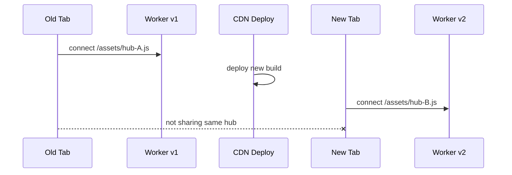
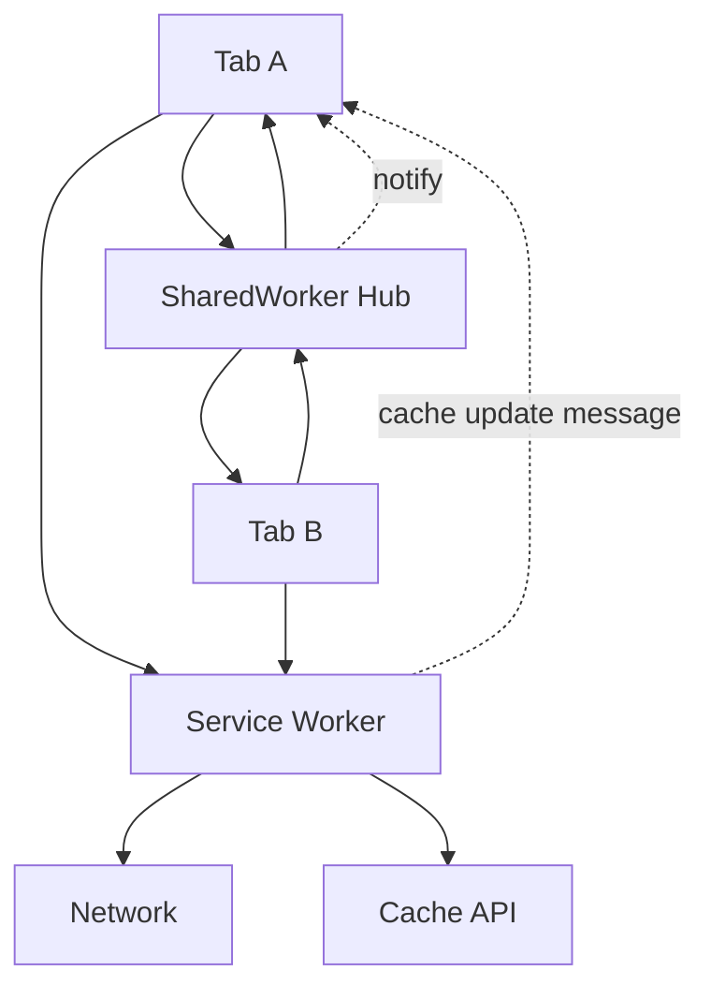
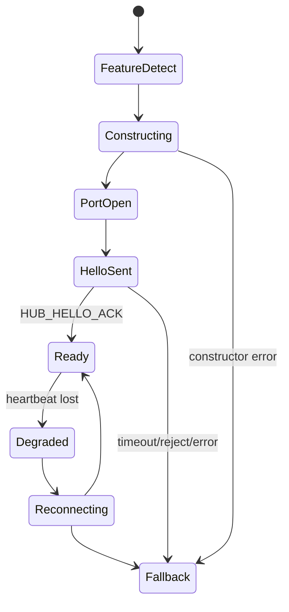
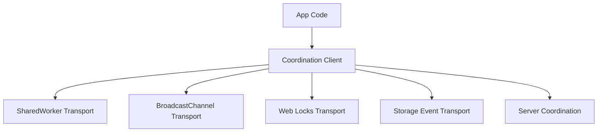
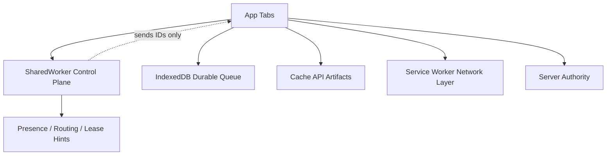
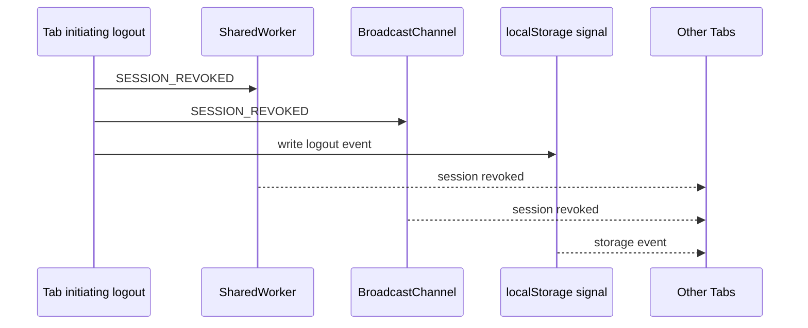

# Part 030 — SharedWorker Limitations and Browser/Deployment Constraints

`SharedWorker` terlihat seperti jawaban elegan untuk multi-tab orchestration:

> satu hub, banyak tab, satu registry, satu tempat koordinasi.

Tapi sistem produksi tidak boleh didesain dari API shape saja. Kita harus mulai dari batasan.

Part ini membahas sisi yang biasanya baru terasa setelah fitur masuk staging atau production:

- browser support dan historical compatibility;
- URL/name/origin identity;
- lifecycle yang tidak persistent;
- Content Security Policy;
- module worker dan bundler output;
- MIME type dan CDN;
- storage partitioning dan iframe;
- WebView/private browsing;
- deploy rolling update;
- observability gap;
- fallback architecture.

Kita tidak akan menyimpulkan “jangan pakai SharedWorker”. Kesimpulan yang benar lebih tajam:

> Pakai SharedWorker untuk live same-origin coordination jika environment mendukung, tetapi jangan jadikan SharedWorker satu-satunya source of truth untuk correctness jangka panjang.

---

## 1. SharedWorker Is a Live Coordination Primitive

SharedWorker cocok untuk:

- cross-tab in-memory coordination;
- port registry;
- presence tracking;
- volatile pub/sub;
- deduplicating work while tabs are open;
- lightweight task ownership;
- selecting foreground tab;
- coordinating UI/session events;
- request fanout/fanin;
- short-lived orchestration state.

SharedWorker tidak cocok sebagai:

- durable database;
- persistent background daemon;
- guaranteed scheduler;
- security boundary;
- replacement for Service Worker;
- replacement for server-side coordination;
- long-term lock manager tanpa lease/fencing;
- universal browser compatibility layer;
- hidden always-on process.

Mental model:

```txt
SharedWorker = live in-memory hub while same-origin clients exist and browser allows it
```

Bukan:

```txt
SharedWorker = always-on singleton process for the origin
```

---

## 2. Capability and Compatibility Reality

Historically, SharedWorker support has been uneven. Modern compatibility is much better, but serious applications still need feature detection and fallback.

Feature detection:

```ts
export function supportsSharedWorker(): boolean {
  return typeof globalThis.SharedWorker === 'function';
}
```

But feature detection alone is insufficient.

You also need runtime construction test:

```ts
export function createSharedWorkerOrNull(url: URL, options: SharedWorkerOptions): SharedWorker | null {
  if (typeof globalThis.SharedWorker !== 'function') return null;

  try {
    return new SharedWorker(url, options);
  } catch (error) {
    reportWorkerCreateFailure(error);
    return null;
  }
}
```

Why?

Because `SharedWorker` may exist, but creation can still fail due to:

- CSP;
- wrong MIME type;
- cross-origin script URL;
- unsupported module worker mode;
- blocked blob/data URL policy;
- WebView limitation;
- enterprise browser policy;
- extension/privacy tooling;
- malformed bundle path.

Production detection should answer:

```txt
can we actually construct, connect, handshake, and exchange a message?
```

Not just:

```txt
is SharedWorker in window?
```

---

## 3. Same-Origin Is Mandatory

SharedWorker is scoped by origin. Multiple browsing contexts must share the same origin to access the same shared worker.

That means protocol, host, and port matter:

```txt
https://app.example.com      yes
https://app.example.com:443  effectively same default port
https://admin.example.com    no
http://app.example.com       no
https://app.example.com:8443 no
```

If your application uses multiple subdomains, SharedWorker will not automatically unify them.

Common architecture trap:

```txt
app.example.com
admin.example.com
reports.example.com
```

Even if these are all “your app”, they are different origins.

Options:

| Goal | Option | Trade-off |
|---|---|---|
| same-origin hub | serve shells under same origin path | routing/deployment complexity |
| cross-origin coordination | server-side channel | latency/network dependency |
| iframe bridge | same-origin bridge iframe | security and complexity |
| no global hub | per-origin orchestration | less coordination |

Do not assume product domain equals browser origin.

---

## 4. URL and Name Identity

Shared workers are identified by script URL and optional name within origin-level scoping rules.

This matters during bundling and deployment.

```ts
const worker = new SharedWorker(
  new URL('./shared-hub.worker.ts', import.meta.url),
  {
    name: 'app-shared-hub',
    type: 'module',
  },
);
```

If the resolved worker URL changes, you may get a different worker instance.

Example production build:

```txt
/assets/shared-hub.worker-AAA111.js
/assets/shared-hub.worker-BBB222.js
```

Old tab uses `AAA111`, new tab uses `BBB222`. They may not share the same hub.

This is not a bug in the browser. It is a deployment identity problem.

---

## 5. The Rolling Deploy Problem

Scenario:



Now you have two hubs in one browser profile.

Symptoms:

- tab presence incomplete;
- logout propagation inconsistent;
- single-flight dedupe fails;
- leader election split;
- auth refresh storm returns;
- cache invalidation only reaches same-build tabs.

Mitigations:

### Option A — stable worker URL

Serve worker at stable URL:

```txt
/shared-workers/app-hub.js
```

Pros:

- all tabs target same URL;
- easier same-hub behavior.

Cons:

- cache invalidation must be explicit;
- old page code may talk to new worker protocol;
- requires compatibility discipline.

### Option B — versioned protocol with compatibility window

Allow old and new tabs to talk to same worker version or negotiate features.

```ts
interface ClientHello {
  protocolVersion: number;
  appVersion: string;
  buildId: string;
  capabilities: string[];
}
```

Pros:

- supports gradual deploy;
- safer with stable URL.

Cons:

- protocol maintenance overhead.

### Option C — accept split hubs and use fallback bus for global events

Critical events like logout also go through `BroadcastChannel` or `storage` event.

Pros:

- robust against worker split;
- less dependence on one hub.

Cons:

- more complex design.

Practical recommendation:

> Use stable worker URL for hub identity, plus versioned protocol, plus fallback broadcast for critical session events.

---

## 6. Name Collision and Mismatch

The `name` option is not cosmetic. It participates in identifying/debugging the shared worker scope.

Bad:

```ts
new SharedWorker(workerUrl, { name: `hub-${Date.now()}`, type: 'module' });
```

This defeats sharing because every page creates a distinct name.

Good:

```ts
new SharedWorker(workerUrl, { name: 'app-shared-hub-v1', type: 'module' });
```

Even better: make name stable for the compatibility window, not per build hash.

```ts
const HUB_NAME = 'regulatory-case-platform-hub-protocol-v3';
```

If you change the name, treat it like a new cluster.

---

## 7. SharedWorker Is Not Persistent

A SharedWorker should be expected to live while there are connected clients. It should not be treated as a permanent background runtime.

Implications:

- registry is memory-only;
- pending tasks can disappear;
- leader state can disappear;
- timers can stop;
- in-memory subscriptions reset;
- hub ID can change;
- clients must re-handshake;
- clients must resubscribe;
- durable progress must live elsewhere.

If a state matters after all tabs close, it does not belong only in SharedWorker.

Use:

| State | Storage |
|---|---|
| live presence | SharedWorker memory |
| user preferences | IndexedDB/localStorage/server |
| offline mutation queue | IndexedDB/OPFS |
| auth token | secure app-specific auth storage strategy; not broadcast as payload |
| cache artifact | Cache API / IndexedDB / OPFS |
| task progress that must survive | IndexedDB/server |
| current UI subscribers | SharedWorker memory |

---

## 8. SharedWorker vs Service Worker Lifecycle

Do not confuse them.

| Dimension | SharedWorker | Service Worker |
|---|---|---|
| Primary role | live JS coordination hub | network/cache/event proxy |
| Client connection | `MessagePort` via `SharedWorker.port` | `navigator.serviceWorker`, `clients.matchAll()` |
| Can intercept fetch | no | yes |
| Can run without visible page | not reliable as app daemon | event-driven, browser-controlled |
| Good for port registry | yes | awkward |
| Good for offline cache | no | yes |
| Good for multi-tab presence | yes | possible but not ideal |
| Durable state | no | no, still use storage |

Service Worker is not a general always-running process either. But it has a browser-managed event lifecycle for fetch, push, sync, etc. SharedWorker is better for live same-origin tabs talking through ports.

Use both when appropriate:



---

## 9. CSP `worker-src`

Content Security Policy can block SharedWorker creation.

If your app has CSP, you must explicitly allow worker scripts.

Typical stricter setup:

```http
Content-Security-Policy: default-src 'self'; script-src 'self'; worker-src 'self';
```

If your bundler emits blob workers, you may need `blob:`:

```http
Content-Security-Policy: default-src 'self'; script-src 'self'; worker-src 'self' blob:;
```

But be careful.

`blob:` in `worker-src` broadens what can be executed as worker script. Do not add it casually just to silence an error. Prefer real static worker assets when possible.

CSP-related failure looks like:

```txt
Refused to create a worker from ... because it violates the following Content Security Policy directive: "worker-src ..."
```

Production checklist:

- [ ] `worker-src` allows the worker URL;
- [ ] `script-src`/fallback behavior is understood;
- [ ] local dev and production CSP are not contradictory;
- [ ] staging has production-like CSP;
- [ ] CSP reports are collected;
- [ ] no accidental `blob:` dependency unless approved.

---

## 10. MIME Type and Module Worker Loading

Worker scripts must be served with a JavaScript MIME type the browser accepts.

Common deployment bug:

```txt
/assets/shared-hub.worker.js -> text/html
```

This happens when CDN/server fallback returns `index.html` for missing asset paths.

Symptoms:

- works in dev;
- fails after build;
- error says module script MIME type is invalid;
- network tab shows 200 HTML instead of JS;
- service worker cache may serve old HTML for worker URL.

Smoke test:

```ts
async function smokeTestWorkerAsset(url: string) {
  const res = await fetch(url, { cache: 'no-store' });
  const contentType = res.headers.get('content-type') ?? '';

  if (!res.ok) throw new Error(`Worker asset HTTP ${res.status}`);
  if (!contentType.includes('javascript') && !contentType.includes('ecmascript')) {
    throw new Error(`Worker asset has suspicious content-type: ${contentType}`);
  }
}
```

Do this in CI/deployment verification, not only manually.

---

## 11. Classic Worker vs Module Worker

Classic worker:

```ts
new SharedWorker('/shared-hub.js');
```

Module worker:

```ts
new SharedWorker('/shared-hub.js', { type: 'module' });
```

Module worker advantages:

- `import` syntax;
- ESM dependency graph;
- stricter semantics;
- better fit with modern bundlers.

Potential issues:

- older browsers/environments;
- MIME stricter;
- CSP interaction;
- bundler output path;
- import graph chunk loading;
- cross-origin asset/CDN path;
- source map behavior.

Production recommendation:

> Prefer module worker for modern controlled environments, but test construction and handshake in your actual support matrix.

---

## 12. Bundler Constraints

Bundlers do not all treat SharedWorker equally.

Common patterns:

```ts
new SharedWorker(new URL('./shared-hub.worker.ts', import.meta.url), {
  name: 'app-shared-hub',
  type: 'module',
});
```

Potential pitfalls:

- dynamic URL not statically analyzable;
- worker emitted under hashed URL;
- base path mismatch;
- asset served from CDN origin instead of app origin;
- worker chunk imports served with wrong CORS/CSP;
- dev server supports path but production server does not;
- SSR tries to evaluate `SharedWorker` on server;
- test runner lacks browser worker implementation.

Bad:

```ts
const path = './shared-hub.worker.ts';
new SharedWorker(new URL(path, import.meta.url), { type: 'module' });
```

Many bundlers need static analyzable path.

Good:

```ts
new SharedWorker(new URL('./shared-hub.worker.ts', import.meta.url), {
  type: 'module',
  name: HUB_NAME,
});
```

SSR guard:

```ts
export function canUseBrowserWorkers() {
  return typeof window !== 'undefined'
    && typeof SharedWorker === 'function';
}
```

---

## 13. CDN and Asset Origin

If app shell is served from:

```txt
https://app.example.com
```

but assets from:

```txt
https://cdn.example.com/assets/...
```

then worker construction may fail because worker script URL must satisfy origin/security constraints.

Possible approaches:

| Approach | Notes |
|---|---|
| serve worker from app origin | simplest for SharedWorker identity |
| proxy worker asset through app origin | good for CDN-backed assets |
| avoid SharedWorker in CDN-only shell | use BroadcastChannel/Web Locks fallback |
| configure same-origin asset host | operationally harder |

Do not assume “same company domain” equals same origin.

---

## 14. Service Worker Cache Can Break Worker Loading

If your Service Worker caches app shell aggressively, worker URL can accidentally return stale or wrong content.

Common bug:

```txt
request /assets/shared-hub.worker.js
service worker fallback -> /index.html
browser tries to load HTML as module worker
failure
```

Service Worker fetch logic should distinguish worker assets.

```ts
self.addEventListener('fetch', (event) => {
  const url = new URL(event.request.url);

  if (url.pathname.endsWith('.worker.js')) {
    event.respondWith(fetch(event.request));
    return;
  }

  // app-shell fallback for navigations only
  if (event.request.mode === 'navigate') {
    event.respondWith(appShellFallback(event.request));
    return;
  }
});
```

Also verify cache headers:

```http
Cache-Control: public, max-age=31536000, immutable  # hashed assets
Cache-Control: no-cache                             # stable worker URL if protocol compatible
```

Stable worker URL and immutable cache do not mix unless URL changes on update. Choose deliberately.

---

## 15. Storage Partitioning and Embedded Contexts

Modern browsers increasingly partition storage and communication by top-level site and other privacy boundaries.

Practical impact:

- same-origin iframe embedded under different top-level site may not share the same communication/storage context you expect;
- third-party embedded apps can behave differently than first-party app shell;
- BroadcastChannel and storage behavior can be partitioned;
- SharedWorker behavior may differ across embedding context and browser policies.

Design implication:

> Treat embedded deployment as a separate runtime mode, not just “same app in iframe”.

Runtime mode detection:

```ts
function detectEmbeddingMode() {
  return {
    isTopLevel: window.top === window,
    ancestorOrigins: Array.from(window.location.ancestorOrigins ?? []),
    origin: location.origin,
  };
}
```

Policy example:

```ts
const role: ClientRole = window.top === window
  ? 'app-tab'
  : 'iframe-client';
```

Do not allow iframe clients to become leaders unless explicitly designed.

---

## 16. Private Browsing and WebViews

Private browsing, mobile WebViews, embedded browsers, and enterprise-managed browsers can differ from mainstream desktop browser behavior.

Potential issues:

- worker creation blocked or unstable;
- storage quota lower;
- storage cleared aggressively;
- background tabs suspended aggressively;
- timer throttling stronger;
- debugging APIs limited;
- CSP enforced differently by host app;
- Service Worker disabled in some WebViews;
- SharedWorker absent in older mobile environments.

If your product supports WebViews, test real host containers.

Do not rely on desktop Chrome behavior as the universal browser model.

---

## 17. No DOM Access

SharedWorker does not have DOM access.

Good:

- protocol routing;
- in-memory registry;
- compute tasks;
- fetch coordination;
- message fanout;
- IndexedDB access if available;
- Cache API access depending on browser/API support;
- lightweight scheduling.

Not possible directly:

- read DOM;
- show modal;
- access React state directly;
- use `document.visibilityState` directly;
- manipulate local UI;
- access `window` APIs;
- call UI-only browser APIs.

Therefore clients must report UI state.

```ts
port.postMessage({
  type: 'CLIENT_HEARTBEAT',
  visibility: document.visibilityState,
  route: location.pathname,
});
```

SharedWorker knows what clients report. It does not observe the DOM itself.

---

## 18. API Availability Inside SharedWorker

Do not assume every browser API available in `window` is available in SharedWorker.

Create a capability probe inside worker:

```ts
const workerCapabilities = {
  fetch: typeof fetch === 'function',
  indexedDB: typeof indexedDB !== 'undefined',
  broadcastChannel: typeof BroadcastChannel !== 'undefined',
  cryptoRandomUUID: typeof crypto?.randomUUID === 'function',
  locks: typeof navigator !== 'undefined' && 'locks' in navigator,
};
```

Send it in `HUB_HELLO_ACK`:

```ts
{
  type: 'HUB_HELLO_ACK',
  hubCapabilities: workerCapabilities,
}
```

This avoids silent assumptions.

---

## 19. Security Boundary Problem

Same-origin scripts can obtain a reference to the same SharedWorker and communicate with it.

That means any script running in your origin has potential access.

Do not treat SharedWorker as secure just because it is off-main-thread.

Security rules:

- validate every message;
- use explicit protocol version;
- reject unknown message kinds;
- do not broadcast secrets;
- do not store raw auth tokens in hub memory unless your threat model explicitly accepts it;
- limit capabilities by role/session;
- sanitize debug APIs;
- require session binding for sensitive commands;
- never expose internal admin commands to arbitrary clients;
- assume XSS in same origin can talk to the hub.

Capability check example:

```ts
function requireCapability(record: ClientRecord, capability: ClientCapability) {
  if (!record.capabilities.has(capability)) {
    throw new ProtocolError('MISSING_CAPABILITY');
  }
}
```

But capability claims from clients are not enough. The hub should verify based on trusted context where possible.

---

## 20. Message Payload Constraints

SharedWorker communication uses message passing. Payloads go through structured clone and may optionally transfer ownership of transferables.

Constraints:

- object graph cost can be high;
- functions/classes/prototypes do not behave like RPC objects;
- `ArrayBuffer` transfer detaches sender buffer;
- large payload broadcast multiplies memory pressure;
- `DataCloneError` can happen;
- `messageerror` must be observed.

Policy:

```ts
const MAX_CONTROL_MESSAGE_BYTES = 64_000;
const MAX_DATA_MESSAGE_BYTES = 1_000_000;
```

Prefer data-plane indirection:

```ts
{
  type: 'ARTIFACT_READY',
  artifactId: 'import_123',
  store: 'indexeddb',
  key: 'imports/import_123/chunk_manifest'
}
```

Instead of broadcasting 20MB payload to every tab.

---

## 21. Startup Ordering

App code often assumes:

```txt
construct worker -> immediately ready
```

Wrong.

Correct startup phases:



Client API should expose readiness:

```ts
type HubClientState =
  | 'unsupported'
  | 'connecting'
  | 'ready'
  | 'degraded'
  | 'fallback'
  | 'closed';
```

Do not let app code call hub methods before `ready` unless methods are queued and bounded.

---

## 22. Handshake Timeout

If `HUB_HELLO_ACK` never arrives, fallback.

```ts
async function connectWithTimeout(ms: number): Promise<HubClient> {
  const worker = new SharedWorker(workerUrl, { name: HUB_NAME, type: 'module' });
  const port = worker.port;
  port.start();

  const ack = await waitForHelloAck(port, ms);
  return new HubClient(port, ack);
}
```

Policy:

| Failure | Action |
|---|---|
| constructor throws | fallback immediately |
| no ACK | close port, fallback |
| reject unsupported protocol | reload prompt or fallback limited mode |
| messageerror | fallback or resync |
| heartbeat lost | reconnect then fallback if repeated |

---

## 23. Fallback Architecture

A serious app should not have only one coordination transport.

Layered design:



Do not expose transport directly to application code.

```ts
interface CoordinationClient {
  publish(topic: string, event: unknown): void;
  subscribe(topic: string, handler: (event: unknown) => void): () => void;
  request<T>(target: string, request: unknown): Promise<T>;
  getPresence(): Promise<PresenceSnapshot>;
  close(): void;
}
```

Transport selection:

```ts
async function createCoordinationClient(): Promise<CoordinationClient> {
  const shared = await tryCreateSharedWorkerClient();
  if (shared) return shared;

  const broadcast = tryCreateBroadcastChannelClient();
  if (broadcast) return broadcast;

  return createStorageEventClient();
}
```

But beware: fallbacks do not have equivalent semantics.

---

## 24. Fallback Semantics Matrix

| Feature | SharedWorker | BroadcastChannel | storage event | Web Locks | server |
|---|---:|---:|---:|---:|---:|
| central registry | strong | no | no | no | yes |
| direct client routing | yes | no | no | no | yes |
| pub/sub | yes | yes | crude | no | yes |
| leader election | possible | weak | weak | strong lock primitive | yes |
| durable state | no | no | no | no | yes/db |
| works cross-origin | no | no | no | no | yes |
| good for logout signal | yes | yes | yes | no | yes |
| good for request fanin | yes | awkward | bad | no | yes |
| needs active pages | yes | yes | yes | yes | no |

Design application behavior by semantic level.

Example:

- logout propagation: SharedWorker or BroadcastChannel or storage event acceptable;
- exact single owner: prefer Web Locks/server lease;
- durable offline queue: IndexedDB/server, not SharedWorker;
- debug presence: SharedWorker only, fallback can report limited presence.

---

## 25. Degraded Mode Is a Product Decision

If SharedWorker unavailable, what happens?

Options:

| Feature | Degraded behavior |
|---|---|
| presence panel | hidden or approximate |
| cross-tab logout | BroadcastChannel/storage fallback |
| auth refresh dedupe | Web Locks fallback |
| notification suppression | best effort BroadcastChannel |
| single-flight download | disabled or server-coordinated |
| offline queue | still durable in IndexedDB |
| cache invalidation | Service Worker/client broadcast |

Do not silently fail.

Expose capability:

```ts
const coordinationStatus = {
  mode: 'shared-worker' as 'shared-worker' | 'broadcast-channel' | 'storage-event' | 'none',
  features: {
    presence: true,
    directRouting: true,
    leaderElection: 'lease-required',
    durableQueue: false,
  },
};
```

---

## 26. Observability of Fallback

You need metrics for which transport is actually used.

```txt
coordination.transport.selected_total{transport="shared-worker"}
coordination.transport.selected_total{transport="broadcast-channel"}
coordination.transport.selected_total{transport="storage-event"}
coordination.transport.create_failed_total{transport="shared-worker", reason="csp"}
coordination.transport.handshake_timeout_total
coordination.transport.reconnect_total
coordination.transport.fallback_total
```

Without this, you may think the system uses SharedWorker while 30% of sessions are silently on fallback.

---

## 27. DevTools and Debugging Constraints

Debugging SharedWorker can be less obvious than debugging main-thread code.

Practical tips:

- include `hubId` and `hubStartedAt` in logs;
- expose debug snapshot through a controlled message;
- use stable worker `name` for easier identification;
- log lifecycle transitions, not every heartbeat;
- sample high-volume events;
- include app build ID and protocol version;
- add a browser debug panel that can request registry snapshot.

Example debug command:

```ts
type DebugRequest = {
  type: 'DEBUG_GET_REGISTRY_SNAPSHOT';
  messageId: string;
  authz: 'dev-only';
};
```

In production, guard it.

---

## 28. Testing in Real Browsers

Unit tests cannot prove SharedWorker works in your deployment.

You need browser-level tests:

1. build production bundle;
2. serve with production-like headers;
3. open two tabs;
4. verify both connect to same hub ID;
5. verify message from tab A reaches tab B;
6. reload tab A;
7. verify registry replacement;
8. close tab B;
9. verify timeout cleanup;
10. deploy new build;
11. verify old/new behavior under rolling update policy.

Playwright-style scenario:

```ts
test('two pages share the same hub', async ({ browser }) => {
  const context = await browser.newContext();
  const pageA = await context.newPage();
  const pageB = await context.newPage();

  await pageA.goto(APP_URL);
  await pageB.goto(APP_URL);

  const hubA = await pageA.evaluate(() => window.__debugHubId?.());
  const hubB = await pageB.evaluate(() => window.__debugHubId?.());

  expect(hubA).toBeTruthy();
  expect(hubA).toBe(hubB);
});
```

Run in all supported browser channels.

---

## 29. Production Smoke Test Endpoint

Create a smoke route:

```txt
/diagnostics/browser-coordination
```

It should report:

```ts
type CoordinationDiagnostics = {
  sharedWorkerSupported: boolean;
  sharedWorkerConstructed: boolean;
  handshakeOk: boolean;
  hubId?: string;
  hubStartedAt?: number;
  transport: string;
  workerUrl: string;
  workerName: string;
  protocolVersion: number;
  appBuildId: string;
  cspLikelyBlocked?: boolean;
  lastError?: string;
};
```

Do not expose sensitive internals to normal users. Diagnostics route can be dev/admin only.

---

## 30. Handling Protocol Drift

Stable worker URL means old tabs and new tabs may talk to the same worker.

You need compatibility rules.

### Rule 1: additive messages are safe if ignored

Unknown optional field should not break old clients.

### Rule 2: unknown required command must be rejected

```ts
{
  type: 'ERROR',
  code: 'UNSUPPORTED_MESSAGE_TYPE',
  messageType: msg.type,
}
```

### Rule 3: major protocol changes require new hub name

```ts
const HUB_NAME = 'app-shared-hub-protocol-v4';
```

### Rule 4: capabilities beat version checks

```ts
if (client.capabilities.includes('presence-v2')) {
  sendPresenceV2(client);
} else {
  sendPresenceV1(client);
}
```

### Rule 5: never assume every tab updates together

Browser tabs can stay open for days.

---

## 31. Worker Update Strategy

If using stable worker URL:

```txt
/shared-workers/app-hub.js
```

You need cache strategy.

Options:

| Strategy | Description | Risk |
|---|---|---|
| no-cache stable URL | browser revalidates | more requests |
| version query | `/app-hub.js?v=3` | changes URL identity |
| hashed file | immutable cache | split hubs |
| service worker managed | controlled update | complexity |

There is no free option.

For orchestration hub, prioritize semantic stability over cache micro-optimization.

Recommended baseline:

```http
/shared-workers/app-hub.js
Cache-Control: no-cache
Content-Type: text/javascript; charset=utf-8
```

Then rely on protocol compatibility.

---

## 32. Same Worker or Same Version?

Sometimes you do not actually need every tab to share exactly one worker.

Ask the requirement:

| Requirement | Need same worker? |
|---|---:|
| presence debug only | nice, not critical |
| logout propagation | no, fallback event enough |
| auth refresh dedupe | no, Web Locks better |
| single in-memory task queue | yes |
| cross-tab RPC | yes |
| cache invalidation | no, BroadcastChannel/SW ok |
| session revocation | no, use multiple signals |
| foreground tab selection | yes-ish |

This prevents over-coupling.

---

## 33. When SharedWorker Is the Wrong Primitive

Avoid SharedWorker when:

- you need cross-origin coordination;
- you need durable background processing after tabs close;
- you need guaranteed delivery;
- you need push/network fetch interception;
- your environment includes unsupported WebViews;
- your deployment uses many asset origins;
- you cannot control CSP;
- you cannot test real browser support;
- your data plane payloads are huge;
- your correctness requires server truth anyway.

Use alternatives:

| Need | Better primitive |
|---|---|
| network/cache/offline interception | Service Worker |
| mutual exclusion same-origin | Web Locks |
| durable local queue | IndexedDB/OPFS |
| simple cross-tab event | BroadcastChannel |
| legacy logout signal | storage event |
| cross-device/session | server channel |
| CPU work per tab | Dedicated Worker/pool |
| rendering off-main-thread | OffscreenCanvas worker |

---

## 34. When SharedWorker Is Excellent

Use SharedWorker when:

- all relevant contexts are same-origin;
- you need live client registry;
- you need direct routing to specific tabs;
- you need pub/sub plus presence;
- you need a single in-memory coordinator while app is open;
- you control browser support matrix;
- you control CSP/deployment;
- failure can degrade gracefully;
- durable state is stored elsewhere;
- protocol is versioned.

In that envelope, SharedWorker is a powerful primitive.

---

## 35. Architecture Pattern: SharedWorker as Control Plane Only

Do not put everything through the hub.



Control plane:

- signals;
- metadata;
- ownership hints;
- presence;
- routing;
- small commands.

Data plane:

- IndexedDB;
- OPFS;
- Cache API;
- server;
- direct fetch;
- transferable buffer only when bounded.

Rule:

> The hub should coordinate large work, not become the large work payload bus.

---

## 36. Architecture Pattern: Critical Events Use Multiple Signals

For critical session events, do not depend on only one channel.

Logout propagation:



All receivers perform idempotent logout cleanup.

```ts
function handleSessionRevoked(event: SessionRevoked) {
  if (seenRevocationIds.has(event.revocationId)) return;
  seenRevocationIds.add(event.revocationId);
  clearSensitiveState();
  redirectToLoginIfNeeded();
}
```

This is not “overengineering” for auth/session safety. It is defense against transport variance.

---

## 37. Architecture Pattern: Lease via Web Locks, Registry via SharedWorker

Do not implement hard mutual exclusion only with SharedWorker memory unless loss is acceptable.

Better:

```txt
SharedWorker: who wants to be owner?
Web Locks: who actually owns same-origin lock?
IndexedDB/server: durable record if needed
```

Example:

```ts
await navigator.locks.request('auth-refresh', { ifAvailable: true }, async (lock) => {
  if (!lock) return false;
  await refreshTokenOnce();
  return true;
});
```

SharedWorker can announce owner, but Web Locks provides the browser-level coordination primitive.

---

## 38. Failure Mode Table

| Failure | Symptom | Required response |
|---|---|---|
| SharedWorker unsupported | constructor unavailable | fallback transport |
| CSP blocks worker | constructor throws/security error | report + fallback |
| MIME wrong | module load fails | deployment fix + fallback |
| old/new hashed worker split | incomplete presence | stable URL or fallback critical signals |
| hub restarts | heartbeat ACK hubId changes | re-HELLO/resubscribe |
| tab closes without goodbye | stale registry entry | heartbeat timeout sweep |
| hidden tab throttled | heartbeat late | adaptive timeout |
| duplicate tab ID | conflict/replacement | connection generation + conflict handling |
| message clone fails | `DataCloneError`/`messageerror` | reject payload + metrics |
| storage partition | embedded clients isolated | separate mode/fallback |
| same-origin XSS | malicious hub messages | validation + no secrets |

---

## 39. Deployment Checklist

Before enabling SharedWorker in production:

- [ ] worker URL resolves under same origin;
- [ ] worker URL is stable or split-hub behavior is accepted;
- [ ] worker `name` is stable;
- [ ] CSP `worker-src` permits worker script;
- [ ] worker asset returns JS MIME, not HTML;
- [ ] module/classic mode tested;
- [ ] production build tested, not only dev server;
- [ ] Service Worker fetch handler does not app-shell fallback worker asset;
- [ ] old/new tab protocol compatibility tested;
- [ ] unsupported browser fallback exists;
- [ ] private browsing/WebView behavior tested if supported;
- [ ] `messageerror` and constructor errors are observed;
- [ ] hub restart causes re-handshake;
- [ ] all durable state is outside SharedWorker memory;
- [ ] critical security events use idempotent multi-signal propagation;
- [ ] diagnostics can show selected transport;
- [ ] monitoring tracks fallback rate.

---

## 40. Decision Matrix

| Constraint | Recommendation |
|---|---|
| controlled evergreen browsers, same-origin app | SharedWorker hub is strong choice |
| multiple subdomains | avoid hub as global coordinator |
| app embedded third-party iframe | treat as separate runtime mode |
| strict CSP but controllable | use static same-origin worker URL |
| CDN-only hashed assets | beware split hubs |
| WebView-heavy product | fallback-first design |
| auth refresh dedupe | Web Locks, with hub as observability/control plane |
| durable offline mutation | IndexedDB/OPFS, not hub memory |
| simple logout event | BroadcastChannel/storage fallback enough |
| direct tab RPC | SharedWorker is appropriate |

---

## 41. Build a Capability Contract

At app boot:

```ts
type CoordinationCapabilities = {
  transport: 'shared-worker' | 'broadcast-channel' | 'storage-event' | 'none';
  directRouting: boolean;
  presence: boolean;
  centralRegistry: boolean;
  crossTabBroadcast: boolean;
  lockPrimitive: 'web-locks' | 'none';
  durableQueue: 'indexeddb' | 'none';
};
```

Expose this to feature modules.

```ts
if (!capabilities.directRouting) {
  disableCrossTabRpcFeature();
}

if (!capabilities.centralRegistry) {
  hidePresenceDebugPanel();
}
```

Do not let feature modules guess transport details.

---

## 42. Reference Transport Selection

```ts
export async function createBrowserCoordination(): Promise<CoordinationClient> {
  const errors: Array<{ transport: string; error: unknown }> = [];

  try {
    const shared = await trySharedWorkerTransport({ timeoutMs: 2_000 });
    if (shared) {
      metrics.increment('coordination.transport.selected', { transport: 'shared-worker' });
      return shared;
    }
  } catch (error) {
    errors.push({ transport: 'shared-worker', error });
  }

  try {
    const broadcast = tryBroadcastChannelTransport();
    if (broadcast) {
      metrics.increment('coordination.transport.selected', { transport: 'broadcast-channel' });
      return broadcast;
    }
  } catch (error) {
    errors.push({ transport: 'broadcast-channel', error });
  }

  try {
    const storage = tryStorageEventTransport();
    if (storage) {
      metrics.increment('coordination.transport.selected', { transport: 'storage-event' });
      return storage;
    }
  } catch (error) {
    errors.push({ transport: 'storage-event', error });
  }

  metrics.increment('coordination.transport.selected', { transport: 'none' });
  metrics.event('coordination.transport.all_failed', { errors: summarizeErrors(errors) });

  return createNoopCoordinationClient();
}
```

Noop client should be explicit:

```ts
function createNoopCoordinationClient(): CoordinationClient {
  return {
    publish() {},
    subscribe() { return () => {}; },
    async request() { throw new Error('Coordination unavailable'); },
    async getPresence() { return { type: 'PRESENCE_SNAPSHOT', registryVersion: 0, generatedAt: Date.now(), clients: [] }; },
    close() {},
  };
}
```

---

## 43. Rollout Strategy

Do not enable SharedWorker orchestration for all users blindly.

Suggested rollout:

1. hidden diagnostics only;
2. enable hub but no critical behavior;
3. enable presence/debug features;
4. enable non-critical pub/sub;
5. enable auth/session event propagation as additional signal only;
6. enable dedupe features with fallback;
7. enable direct routing features;
8. monitor fallback/error rate;
9. tighten CSP and deployment config;
10. document support matrix.

Metrics gate example:

```txt
SharedWorker handshake success rate > 99% on supported browsers
fallback rate explained by known unsupported browsers
messageerror rate near zero
constructor failure rate near zero after CSP rollout
split hub diagnostic below threshold
```

---

## 44. Practical Production Invariant

The most important invariant:

> A browser coordination feature must remain safe when SharedWorker is absent, split, restarted, stale, or unable to load.

Safe does not mean feature-equivalent.

Safe means:

- no duplicate destructive action;
- no leaked secret;
- no stuck lock forever;
- no permanent stale ownership;
- no infinite retry storm;
- no UI blocked forever waiting for hub;
- no hidden production failure without telemetry.

---

## 45. Common Anti-Patterns

| Anti-pattern | Why bad | Better |
|---|---|---|
| treat SharedWorker as daemon | lifecycle not persistent | re-handshake/resubscribe |
| use hashed worker URL blindly | split hubs during deploy | stable URL/protocol compatibility |
| no fallback | unsupported environments break | layered transport |
| only feature detect | construction can still fail | handshake smoke test |
| broadcast secrets | same-origin XSS risk | broadcast invalidation only |
| large payload hub | clone/memory pressure | data-plane store + IDs |
| cleanup only in hub memory | state lost on restart | durable storage |
| no CSP test | production blocks worker | production-like headers in CI |
| assume dev server = prod | path/MIME/CSP differ | built preview smoke tests |
| one global timeout | hidden tabs throttle | lifecycle-aware timeout |

---

## 46. Final Mental Model

SharedWorker is a strong primitive when used inside the right boundary:

```txt
same-origin + live clients + controlled deployment + versioned protocol + fallback
```

It is weak when used as:

```txt
cross-origin durable always-on global coordinator
```

The senior-level move is not “use SharedWorker everywhere”.

The senior-level move is:

1. define required semantics;
2. choose SharedWorker for live coordination;
3. keep durable truth outside it;
4. protect with feature detection and handshake;
5. deploy with stable identity;
6. fallback for degraded environments;
7. measure actual runtime behavior.

---

## 47. What Comes Next

Part 031 moves into **Service Worker as Network Coordinator**.

The relationship is important:

- SharedWorker coordinates live tabs;
- Service Worker coordinates network/cache boundary;
- IndexedDB/OPFS/Cache API hold durable local state;
- Web Locks helps same-origin mutual exclusion;
- server remains authority for cross-device truth.

We are gradually building a real browser-side distributed architecture, not isolated API tutorials.

---

## References

- MDN — `SharedWorker`: https://developer.mozilla.org/en-US/docs/Web/API/SharedWorker
- MDN — `SharedWorker()` constructor: https://developer.mozilla.org/en-US/docs/Web/API/SharedWorker/SharedWorker
- MDN — `SharedWorkerGlobalScope: connect` event: https://developer.mozilla.org/en-US/docs/Web/API/SharedWorkerGlobalScope/connect_event
- WHATWG HTML — Workers: https://html.spec.whatwg.org/multipage/workers.html
- MDN — CSP `worker-src`: https://developer.mozilla.org/en-US/docs/Web/HTTP/Reference/Headers/Content-Security-Policy/worker-src
- MDN — `MessagePort.postMessage()`: https://developer.mozilla.org/en-US/docs/Web/API/MessagePort/postMessage
- MDN — `BroadcastChannel`: https://developer.mozilla.org/en-US/docs/Web/API/BroadcastChannel
- MDN — Service Worker API: https://developer.mozilla.org/en-US/docs/Web/API/Service_Worker_API
