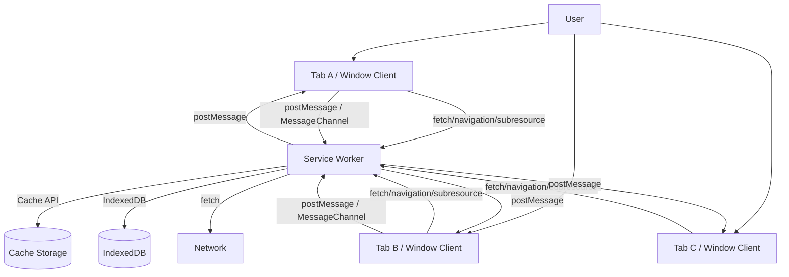
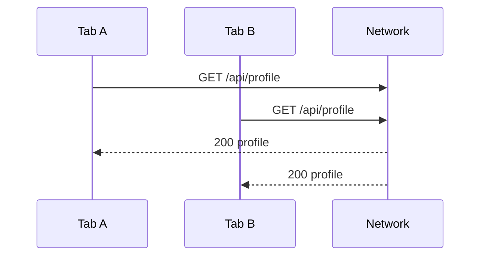
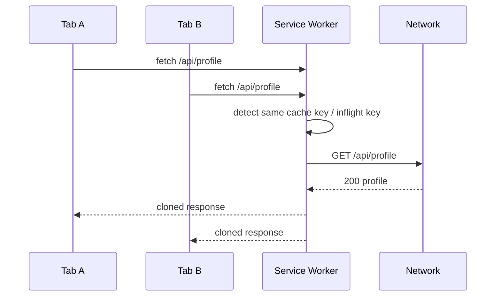
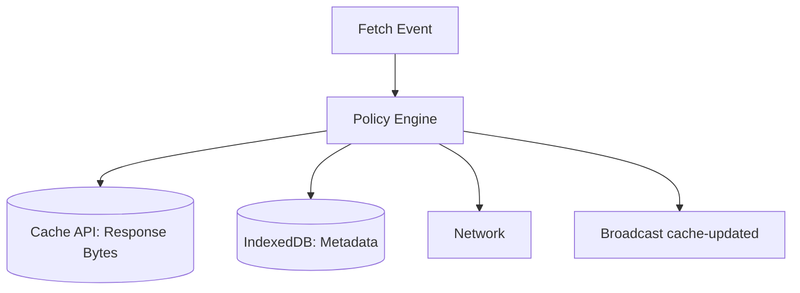
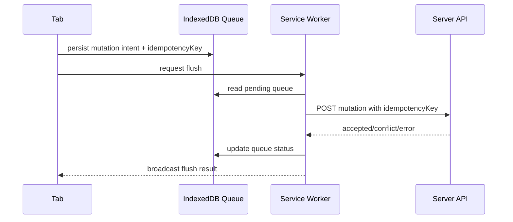
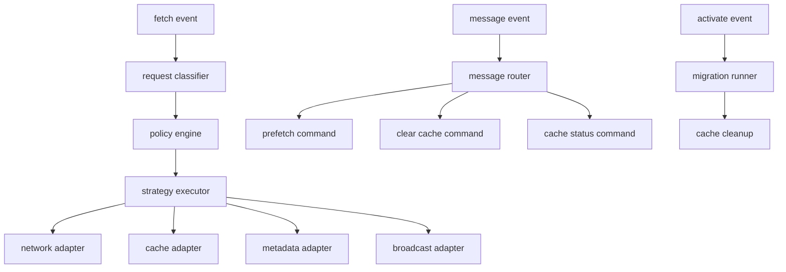

# Part 031 — Service Worker as Network Coordinator

Di part sebelumnya kita memakai `SharedWorker` sebagai hub live lintas tab. Sekarang kita masuk ke primitive yang lebih dekat ke jalur network: `Service Worker`.

Service Worker sering dipelajari sebagai fitur PWA: cache asset, offline page, install prompt. Itu benar, tapi terlalu sempit untuk engineer yang ingin membangun sistem browser-side yang serius.

Mental model yang lebih berguna:

> Service Worker adalah event-driven network coordinator yang berada di antara controlled clients dan network/cache layer.

Ia bukan sekadar “worker lain”. Ia punya posisi khusus:

- bisa mengintercept request dari controlled clients;
- bisa menjawab request dari Cache API, network, atau response hasil komposisi sendiri;
- bisa menjadi tempat deduplikasi network request;
- bisa memberi tahu banyak tab bahwa cache/state berubah;
- bisa menjadi boundary untuk offline behavior;
- bisa tetap hidup hanya selama event berjalan, lalu dihentikan browser;
- tidak punya akses DOM;
- tidak bisa membaca `localStorage`;
- tidak boleh dianggap always-on daemon.

Part ini membangun Service Worker sebagai komponen arsitektur produksi, bukan tutorial PWA basic.

---

## 1. Posisi Service Worker Dalam Runtime Browser

Kita mulai dari topologi.



Service Worker berada pada jalur yang berbeda dari `DedicatedWorker` dan `SharedWorker`.

| Primitive | Scope utama | Cocok untuk | Tidak cocok untuk |
|---|---|---|---|
| Dedicated Worker | satu owner/client | CPU-bound work per tab | koordinasi lintas tab |
| SharedWorker | banyak same-origin client | live hub lintas tab | durable network/cache policy |
| Service Worker | origin/scope controlled clients | fetch/cache/offline/network coordination | DOM work, long-lived in-memory state |
| BroadcastChannel | same-origin/storage partition bus | signal volatile | durability/correctness sendiri |
| Web Locks | same-origin lock manager | mutual exclusion | message bus |

Service Worker bukan pengganti semua primitive. Ia adalah coordinator untuk **network-facing concerns**.

---

## 2. Apa Arti “Network Coordinator”?

Network coordinator berarti Service Worker bertanggung jawab atas policy sebelum request benar-benar mencapai network atau cache.

Contoh policy:

- apakah request boleh langsung ke network?
- apakah response cache masih valid?
- apakah request ini bisa digabung dengan request identik yang sedang berjalan?
- apakah offline fallback tersedia?
- apakah navigation harus diarahkan ke app shell?
- apakah background revalidation perlu dilakukan?
- apakah client perlu diberi notifikasi bahwa data/cache berubah?
- apakah request harus bypass cache karena mengandung credential sensitif?
- apakah response perlu disimpan sebagai versioned artifact?
- apakah error network boleh diturunkan menjadi stale response?

Tanpa coordinator, setiap tab membuat keputusan sendiri.

Masalahnya:



Dengan coordinator, request yang sama bisa dibuat single-flight.



Service Worker memberi tempat alami untuk kebijakan ini karena ia melihat request dari controlled clients.

---

## 3. Batas Kritis: Controlled Client

Service Worker hanya bisa mengintercept request dari client yang berada dalam scope dan sudah controlled.

Konsekuensi:

- first page load setelah registration biasanya belum controlled;
- tab lama bisa masih dikontrol Service Worker versi lama;
- tab baru bisa dikontrol versi baru;
- request di luar scope tidak lewat Service Worker;
- iframe/client berbeda scope bisa punya controller berbeda;
- `navigator.serviceWorker.controller` bisa `null`.

Client-side code harus defensif.

```ts
export function hasServiceWorkerController(): boolean {
  return Boolean(navigator.serviceWorker?.controller);
}

export async function sendToController(message: unknown): Promise<void> {
  const controller = navigator.serviceWorker.controller;

  if (!controller) {
    // Page belum controlled. Jangan anggap SW path tersedia.
    return;
  }

  controller.postMessage(message);
}
```

Invariant produksi:

> Semua fitur yang membutuhkan Service Worker harus punya fallback saat page belum controlled.

Jangan membuat login, checkout, atau critical data mutation bergantung pada asumsi bahwa Service Worker selalu aktif.

---

## 4. Fetch Event: Boundary Tempat Policy Dieksekusi

Core event Service Worker untuk network coordination adalah `fetch` event.

Pseudo-shape:

```ts
self.addEventListener('fetch', (event: FetchEvent) => {
  const request = event.request;

  if (!shouldHandle(request)) {
    return;
  }

  event.respondWith(handleRequest(event));
});
```

`respondWith()` adalah titik takeover. Ketika dipanggil, browser memakai `Response` yang diberikan Service Worker, bukan default fetch handling.

Hal penting:

- `respondWith()` harus dipanggil saat dispatch event, bukan setelah async delay arbitrer;
- response harus valid untuk request destination;
- response body stream umumnya one-shot, sehingga perlu `response.clone()` jika ingin dikembalikan sekaligus disimpan;
- request/response mungkin opaque untuk cross-origin no-cors;
- Service Worker bisa dihentikan setelah event selesai;
- pekerjaan tambahan perlu diikat dengan `event.waitUntil()`.

Skeleton yang lebih benar:

```ts
declare const self: ServiceWorkerGlobalScope;

self.addEventListener('fetch', (event) => {
  const request = event.request;

  if (!isWithinRuntimePolicy(request)) {
    return;
  }

  event.respondWith(routeFetch(event));
});

async function routeFetch(event: FetchEvent): Promise<Response> {
  const request = event.request;

  if (isNavigationRequest(request)) {
    return handleNavigation(event);
  }

  if (isStaticAssetRequest(request)) {
    return handleStaticAsset(event);
  }

  if (isApiReadRequest(request)) {
    return handleApiRead(event);
  }

  return fetch(request);
}
```

Perhatikan separation:

- `fetch` event listener tipis;
- classification jelas;
- strategy per class;
- fallback eksplisit;
- tidak semua request diintercept.

---

## 5. Request Classification

Production Service Worker harus mengklasifikasi request sebelum memilih strategy.

Dimensi klasifikasi:

| Dimensi | Contoh | Dampak |
|---|---|---|
| method | GET, POST, PUT, DELETE | hanya GET yang biasanya aman dicache |
| mode | navigate, cors, no-cors, same-origin | response semantics berbeda |
| destination | document, script, style, image, font, empty | fallback berbeda |
| URL path | `/assets/`, `/api/`, `/auth/` | policy berbeda |
| credential | include/same-origin/omit | jangan cache sembarangan |
| cache mode | reload, no-store | hormati intent tertentu |
| user state | authenticated/anonymous | cache key harus hati-hati |
| version | app version/cache version | migration dan invalidation |

Contoh classifier:

```ts
type RequestClass =
  | { kind: 'navigation' }
  | { kind: 'static-asset'; cacheName: string }
  | { kind: 'api-read'; cacheable: boolean; ttlMs: number }
  | { kind: 'api-mutation' }
  | { kind: 'auth-sensitive' }
  | { kind: 'bypass'; reason: string };

function classify(request: Request): RequestClass {
  const url = new URL(request.url);

  if (request.mode === 'navigate') {
    return { kind: 'navigation' };
  }

  if (request.method !== 'GET') {
    return { kind: 'api-mutation' };
  }

  if (url.pathname.startsWith('/auth/') || url.pathname.startsWith('/session/')) {
    return { kind: 'auth-sensitive' };
  }

  if (url.pathname.startsWith('/assets/')) {
    return { kind: 'static-asset', cacheName: CACHE_STATIC };
  }

  if (url.pathname.startsWith('/api/')) {
    return { kind: 'api-read', cacheable: true, ttlMs: 30_000 };
  }

  return { kind: 'bypass', reason: 'unclassified' };
}
```

Rule utama:

> Jangan pilih cache strategy berdasarkan URL regex saja jika request membawa credential, user-specific data, atau mutation semantics.

---

## 6. Strategy Catalog

Service Worker strategy bukan mantra. Setiap strategy punya invariant.

### 6.1 Network Only

Gunakan saat:

- auth mutation;
- payment/checkout;
- high-risk write;
- data harus real-time;
- response tidak boleh stale;
- request mengandung credential sensitif.

```ts
async function networkOnly(request: Request): Promise<Response> {
  return fetch(request);
}
```

Kelebihan: correctness lebih mudah.

Risiko: offline gagal total.

---

### 6.2 Cache First

Gunakan untuk versioned immutable assets.

```ts
async function cacheFirst(request: Request, cacheName: string): Promise<Response> {
  const cache = await caches.open(cacheName);
  const cached = await cache.match(request);

  if (cached) {
    return cached;
  }

  const response = await fetch(request);

  if (response.ok) {
    await cache.put(request, response.clone());
  }

  return response;
}
```

Cocok untuk:

- hashed JS/CSS chunks;
- fonts;
- images immutable;
- build artifacts versioned.

Tidak cocok untuk:

- `index.html` SPA shell tanpa revalidation policy;
- auth-dependent API;
- mutable JSON tanpa TTL.

---

### 6.3 Network First

Gunakan saat fresh data lebih penting, tetapi stale fallback masih diterima.

```ts
async function networkFirst(request: Request, cacheName: string): Promise<Response> {
  const cache = await caches.open(cacheName);

  try {
    const response = await fetch(request);

    if (response.ok) {
      await cache.put(request, response.clone());
    }

    return response;
  } catch {
    const cached = await cache.match(request);

    if (cached) {
      return cached;
    }

    throw new Error('network failed and cache miss');
  }
}
```

Cocok untuk:

- dashboard yang boleh stale sementara;
- configuration read;
- content read;
- offline fallback.

Risiko:

- stale data bisa membingungkan user;
- cache harus punya metadata umur;
- response dari user A tidak boleh diberikan ke user B.

---

### 6.4 Stale While Revalidate

Gunakan saat response cepat lebih penting, dan update bisa datang kemudian.

```ts
async function staleWhileRevalidate(event: FetchEvent, request: Request, cacheName: string): Promise<Response> {
  const cache = await caches.open(cacheName);
  const cached = await cache.match(request);

  const revalidatePromise = fetch(request).then(async (response) => {
    if (response.ok) {
      await cache.put(request, response.clone());
      await broadcastCacheUpdated(request.url);
    }
    return response;
  });

  event.waitUntil(revalidatePromise.catch(() => undefined));

  return cached ?? revalidatePromise;
}
```

Cocok untuk:

- read-mostly content;
- config yang boleh lag;
- low-risk catalog data;
- article/media metadata.

Tidak cocok untuk:

- permission/ACL;
- balance/financial state;
- session validity;
- regulatory case state yang harus akurat sebelum action.

---

## 7. `event.waitUntil()` Sebagai Lifetime Contract

Service Worker bisa dihentikan browser setelah event selesai. Karena itu, side effect async yang harus menyelesaikan pekerjaan event perlu didaftarkan dengan `event.waitUntil()`.

Contoh:

```ts
self.addEventListener('activate', (event) => {
  event.waitUntil(cleanupOldCaches());
});
```

Pada fetch revalidation:

```ts
self.addEventListener('fetch', (event) => {
  event.respondWith(handleFetch(event));
});

async function handleFetch(event: FetchEvent): Promise<Response> {
  const response = await fetch(event.request);

  event.waitUntil(
    persistMetadata(event.request, response.clone())
      .catch((error) => logSwError('metadata.persist.failed', error))
  );

  return response;
}
```

Mental model:

- `respondWith()` menentukan response ke browser;
- `waitUntil()` memperpanjang lifetime event untuk pekerjaan terkait;
- keduanya bukan pengganti durable queue;
- jika pekerjaan sangat penting, simpan intent dulu ke IndexedDB, baru jalankan.

---

## 8. Cache API Sebagai Artifact Store, Bukan Database

Cache API menyimpan pasangan `Request` → `Response`.

Ini cocok untuk:

- static assets;
- API read response yang aman dicache;
- navigation fallback;
- precomputed response;
- offline shell.

Tidak cocok untuk:

- relational query;
- partial object update;
- conflict resolution;
- secure secret storage;
- state dengan transactional semantics kompleks.

Untuk state aplikatif, kombinasikan:

```txt
Cache API   -> response/artifact store
IndexedDB   -> metadata, queue, manifest, version, idempotency key
BroadcastChannel / Client.postMessage -> invalidation signal
```

Pattern:



Cache entry tanpa metadata sering berubah menjadi mystery cache.

Metadata yang berguna:

```ts
type CacheMetadata = {
  cacheKey: string;
  url: string;
  method: 'GET';
  createdAt: number;
  updatedAt: number;
  maxAgeMs: number;
  etag?: string;
  lastModified?: string;
  appVersion: string;
  userPartition?: string;
  contentType?: string;
  contentLength?: number;
};
```

---

## 9. Request Coalescing di Service Worker

Jika tiga tab meminta resource yang sama, Service Worker bisa menduplikasi atau menggabungkan.

Request coalescing harus hati-hati karena `Response` stream one-shot. Untuk membagikan hasil ke beberapa caller, gunakan `response.clone()`.

```ts
const inflight = new Map<string, Promise<Response>>();

function makeInflightKey(request: Request): string {
  const url = new URL(request.url);
  url.searchParams.sort();
  return `${request.method}:${url.toString()}:${request.credentials}`;
}

async function singleFlightFetch(request: Request): Promise<Response> {
  const key = makeInflightKey(request);

  const existing = inflight.get(key);
  if (existing) {
    const response = await existing;
    return response.clone();
  }

  const promise = fetch(request).finally(() => {
    inflight.delete(key);
  });

  inflight.set(key, promise);

  const response = await promise;
  return response.clone();
}
```

Tetapi jangan coalesce sembarangan.

Aman relatif:

- idempotent GET;
- same credentials mode;
- same URL canonicalization;
- same relevant request headers;
- same user/session partition;
- same freshness requirement.

Berbahaya:

- mutation request;
- request dengan Authorization header berbeda;
- request yang bergantung pada `Accept-Language`, tenant, role, feature flag;
- request streaming body;
- request yang response-nya personal tapi key tidak memasukkan user partition.

Better key:

```ts
type InflightKeyInput = {
  method: string;
  url: string;
  credentials: RequestCredentials;
  authorizationHash?: string;
  tenantId?: string;
  userPartition?: string;
  acceptLanguage?: string;
};
```

Rule:

> Kalau tidak yakin dua request equivalent secara security dan semantics, jangan coalesce.

---

## 10. Service Worker ⇄ Client Messaging

Service Worker perlu mengirim sinyal ke tab:

- cache updated;
- app version available;
- offline queue flushed;
- background revalidation failed;
- session revoked;
- route preload ready;
- notification clicked;
- leader handoff needed.

Client bisa mengirim command ke Service Worker:

- prefetch route;
- clear cache;
- skip waiting request;
- flush offline queue;
- set runtime config;
- ask cache status;
- subscribe debug trace.

Basic client send:

```ts
navigator.serviceWorker.controller?.postMessage({
  protocol: 'sw-control',
  version: 1,
  kind: 'PREFETCH_ROUTE',
  route: '/cases/123',
});
```

Service Worker receive:

```ts
self.addEventListener('message', (event) => {
  const message = event.data;

  if (!isValidSwMessage(message)) {
    return;
  }

  event.waitUntil(handleClientMessage(event, message));
});
```

Broadcast to clients:

```ts
async function broadcastToWindowClients(message: unknown): Promise<void> {
  const clients = await self.clients.matchAll({
    type: 'window',
    includeUncontrolled: false,
  });

  for (const client of clients) {
    client.postMessage(message);
  }
}
```

Client receive:

```ts
navigator.serviceWorker.addEventListener('message', (event) => {
  const message = event.data;

  switch (message.kind) {
    case 'CACHE_UPDATED':
      invalidateClientQuery(message.cacheKey);
      break;
    case 'APP_UPDATE_AVAILABLE':
      showUpdateBanner(message.version);
      break;
  }
});
```

---

## 11. Request/Response Dengan MessageChannel

Untuk command yang butuh response eksplisit, gunakan `MessageChannel`.

Client adapter:

```ts
type SwRequest = {
  protocol: 'sw-control';
  version: 1;
  id: string;
  kind: 'GET_CACHE_STATUS';
};

type SwResponse = {
  protocol: 'sw-control';
  version: 1;
  id: string;
  ok: boolean;
  result?: unknown;
  error?: { code: string; message: string };
};

export function requestServiceWorker(message: SwRequest, timeoutMs = 3000): Promise<SwResponse> {
  const controller = navigator.serviceWorker.controller;

  if (!controller) {
    return Promise.reject(new Error('service worker controller unavailable'));
  }

  const channel = new MessageChannel();

  return new Promise((resolve, reject) => {
    const timeout = setTimeout(() => {
      channel.port1.close();
      reject(new Error('service worker request timeout'));
    }, timeoutMs);

    channel.port1.onmessage = (event) => {
      clearTimeout(timeout);
      channel.port1.close();
      resolve(event.data);
    };

    controller.postMessage(message, [channel.port2]);
  });
}
```

Service Worker handler:

```ts
self.addEventListener('message', (event) => {
  const replyPort = event.ports[0];
  const message = event.data;

  if (!replyPort) {
    return;
  }

  event.waitUntil((async () => {
    try {
      const result = await handleRpc(message);
      replyPort.postMessage({
        protocol: 'sw-control',
        version: 1,
        id: message.id,
        ok: true,
        result,
      });
    } catch (error) {
      replyPort.postMessage({
        protocol: 'sw-control',
        version: 1,
        id: message.id,
        ok: false,
        error: normalizeError(error),
      });
    } finally {
      replyPort.close();
    }
  })());
});
```

Ini membuat command Service Worker lebih seperti RPC bounded, bukan fire-and-forget liar.

---

## 12. Offline Queue: Apa yang Boleh Dijalankan Service Worker?

Service Worker bisa membantu offline workflow, tetapi jangan mencampur semua tanggung jawab.

Mutation offline umumnya membutuhkan:

- durable queue di IndexedDB;
- idempotency key;
- conflict detection;
- retry policy;
- user-visible status;
- authentication strategy;
- server-side idempotency support;
- replay ordering;
- poison message handling.

Service Worker cocok untuk:

- flush queue saat ada trigger;
- retry bounded;
- broadcast status ke clients;
- cache update setelah flush;
- network reachability probe;
- background revalidation.

Service Worker tidak cukup untuk:

- menjamin exactly-once;
- menyelesaikan konflik domain;
- menyimpan secret refresh token sembarangan;
- membuat mutation critical tanpa server idempotency.

Flow:



Rule:

> Persist intent before attempting network. Network first, persist later is how offline mutations disappear.

---

## 13. Navigation Handling Untuk SPA

SPA biasanya ingin navigation request ke route internal jatuh ke app shell.

Naive version:

```ts
async function handleNavigation(event: FetchEvent): Promise<Response> {
  const cache = await caches.open(CACHE_APP_SHELL);
  const shell = await cache.match('/index.html');

  return shell ?? fetch(event.request);
}
```

Production version harus mempertimbangkan:

- app shell version;
- route yang bukan SPA route;
- auth route;
- server-rendered route;
- offline fallback;
- stale shell risk;
- chunk mismatch;
- reload loop;
- navigation preload;
- deployment rollback.

Classifier:

```ts
function isSpaNavigation(request: Request): boolean {
  const url = new URL(request.url);

  if (request.mode !== 'navigate') return false;
  if (url.origin !== self.location.origin) return false;
  if (url.pathname.startsWith('/api/')) return false;
  if (url.pathname.startsWith('/admin/server-rendered/')) return false;

  return true;
}
```

Handling:

```ts
async function handleNavigation(event: FetchEvent): Promise<Response> {
  const request = event.request;

  try {
    const networkResponse = await fetch(request);

    // Optionally update shell metadata here.
    return networkResponse;
  } catch {
    const cache = await caches.open(CACHE_APP_SHELL);
    const shell = await cache.match('/index.html');

    if (shell) {
      return shell;
    }

    return new Response('Offline and app shell unavailable', {
      status: 503,
      headers: { 'Content-Type': 'text/plain' },
    });
  }
}
```

Jangan membuat semua navigation selalu cache-first kecuali deployment model benar-benar immutable dan tested.

---

## 14. Auth dan Session: Jangan Salah Menaruh Secret

Service Worker sering menggoda untuk dipakai sebagai tempat token refresh global. Hati-hati.

Fakta boundary:

- Service Worker tidak punya akses `localStorage`;
- Service Worker bisa akses IndexedDB;
- Service Worker bisa melakukan `fetch`;
- Service Worker bisa menerima message dari controlled clients;
- Service Worker bisa hidup lebih lama dari tab tertentu, tapi tidak always-on;
- compromised Service Worker script adalah risiko berat karena berada di network path.

Design options:

| Strategy | Kelebihan | Risiko |
|---|---|---|
| HttpOnly secure cookie | token tidak terbaca JS | CSRF harus didesain |
| access token in memory per tab | exposure lebih kecil | refresh storm lintas tab |
| token in IndexedDB | bisa diakses SW | XSS tetap berbahaya |
| token via message to SW | centralization | message boundary harus ketat |
| no SW auth handling | sederhana | dedupe refresh di tempat lain |

Rule konservatif:

> Jangan cache response auth-sensitive di Cache API kecuali key, partition, TTL, invalidation, dan logout cleanup benar-benar jelas.

Contoh bypass:

```ts
function isAuthSensitive(request: Request): boolean {
  const url = new URL(request.url);

  return (
    url.pathname.startsWith('/auth/') ||
    url.pathname.startsWith('/session/') ||
    request.headers.has('Authorization')
  );
}

self.addEventListener('fetch', (event) => {
  if (isAuthSensitive(event.request)) {
    event.respondWith(fetch(event.request));
    return;
  }

  event.respondWith(routeFetch(event));
});
```

Part 045 nanti akan membahas auth token refresh orchestration secara khusus. Di sini kita cukup menetapkan boundary: Service Worker boleh menjadi participant, tetapi tidak otomatis menjadi trusted auth vault.

---

## 15. Cache Invalidation Across Tabs

Service Worker bisa melakukan cache update dan broadcast sinyal ke tab.

```ts
async function broadcastCacheUpdated(url: string): Promise<void> {
  await broadcastToWindowClients({
    protocol: 'sw-event',
    version: 1,
    kind: 'CACHE_UPDATED',
    url,
    at: Date.now(),
  });
}
```

Client harus menganggap broadcast sebagai invalidation signal, bukan source of truth.

```ts
navigator.serviceWorker.addEventListener('message', (event) => {
  const message = event.data;

  if (message.kind === 'CACHE_UPDATED') {
    queryClient.invalidateQueries({ queryKey: ['resource', message.url] });
  }
});
```

Anti-pattern:

```ts
// Bad: menjadikan message payload sebagai canonical data tanpa revalidation.
if (message.kind === 'CACHE_UPDATED') {
  setState(message.data);
}
```

Lebih baik:

```txt
message says: something changed
client decides: do I refetch, invalidate, ignore, or show banner?
```

---

## 16. Service Worker Memory Is Not Durable

Service Worker global memory bisa tampak stabil selama development. Jangan tertipu.

Browser bisa menghentikan Service Worker saat idle. Ketika event berikutnya datang, script bisa dievaluasi ulang dan memory kosong lagi.

Boleh disimpan di memory:

- in-flight request map;
- short-lived debounce;
- per-event temporary cache;
- runtime counters best-effort;
- hot policy table loaded dari static code.

Jangan hanya disimpan di memory:

- offline mutation queue;
- cache manifest authoritative;
- user session state;
- migration status;
- idempotency dedupe jangka panjang;
- critical feature flag;
- pending background job yang harus survive restart.

Pattern:

```ts
// OK: short-lived only
const inflight = new Map<string, Promise<Response>>();

// Not OK as sole source of truth
let pendingMutations: MutationIntent[] = [];
```

Correct version:

```txt
in-memory = acceleration
IndexedDB/Cache/server = correctness
```

---

## 17. Navigation Preload

Saat Service Worker aktif, navigation bisa menunggu Service Worker startup sebelum network berjalan. Navigation preload memungkinkan browser memulai network request paralel dengan Service Worker startup.

Pattern konseptual:

```ts
self.addEventListener('activate', (event) => {
  event.waitUntil((async () => {
    if (self.registration.navigationPreload) {
      await self.registration.navigationPreload.enable();
    }
  })());
});

self.addEventListener('fetch', (event) => {
  if (event.request.mode === 'navigate') {
    event.respondWith(handleNavigationWithPreload(event));
  }
});

async function handleNavigationWithPreload(event: FetchEvent): Promise<Response> {
  const preload = await event.preloadResponse;

  if (preload) {
    return preload;
  }

  return fetch(event.request);
}
```

Gunakan untuk mengurangi latency navigation pada app yang heavily controlled by Service Worker.

Tetapi jangan aktifkan tanpa observability. Ukur:

- navigation response time;
- service worker startup delay;
- preload hit rate;
- duplicate network risk;
- fallback behavior saat preload unavailable.

---

## 18. Security Threat Model

Karena Service Worker berada di jalur network, compromise-nya serius.

Threat yang relevan:

- XSS yang mendaftarkan Service Worker berbahaya;
- cache poisoning;
- serving stale vulnerable JS;
- intercepting auth request;
- leaking data antar user session;
- retaining previous user cache setelah logout;
- malicious update stuck in active controller;
- opaque response misuse;
- overbroad scope;
- CDN misconfiguration serving wrong worker script.

Hardening:

- scope sekecil mungkin;
- CSP ketat;
- no dynamic worker script from untrusted source;
- versioned cache names;
- cleanup on logout;
- bypass auth-sensitive endpoints;
- validate message protocol;
- never trust client message blindly;
- pair cache with metadata;
- update monitoring;
- kill switch via server config jika perlu.

Message validation:

```ts
function isTrustedClientMessage(value: unknown): value is SwClientMessage {
  if (!value || typeof value !== 'object') return false;

  const message = value as Record<string, unknown>;

  return (
    message.protocol === 'sw-control' &&
    message.version === 1 &&
    typeof message.kind === 'string'
  );
}
```

Ingat: same-origin client belum tentu same-trust. XSS di salah satu page same-origin bisa mengirim message ke Service Worker.

---

## 19. Observability Untuk Network Coordinator

Service Worker sulit didebug jika tidak punya telemetry.

Minimum metrics:

| Metric | Arti |
|---|---|
| `sw.fetch.total` | jumlah request yang dilihat |
| `sw.fetch.handled` | request yang diintercept |
| `sw.fetch.bypassed` | request yang sengaja bypass |
| `sw.cache.hit` | cache hit |
| `sw.cache.miss` | cache miss |
| `sw.network.error` | fetch gagal |
| `sw.response.strategy` | strategy yang dipakai |
| `sw.singleflight.joined` | request yang bergabung ke inflight |
| `sw.message.in` | command dari client |
| `sw.message.out` | event ke client |
| `sw.waitUntil.error` | side effect gagal |
| `sw.version.active` | versi SW aktif |

Trace envelope:

```ts
type SwTrace = {
  traceId: string;
  swVersion: string;
  event: string;
  requestUrl?: string;
  strategy?: string;
  cacheKey?: string;
  durationMs?: number;
  outcome: 'ok' | 'error' | 'bypass';
  errorCode?: string;
};
```

Jangan log full URL jika query mengandung data sensitif. Redact.

```ts
function redactUrl(url: string): string {
  const parsed = new URL(url);
  parsed.search = '';
  return parsed.toString();
}
```

---

## 20. Reference Architecture

Service Worker produksi sebaiknya dipisah menjadi beberapa modul konseptual.



Suggested file layout:

```txt
src/sw/
  sw.ts
  version.ts
  protocol.ts
  classify-request.ts
  policy-engine.ts
  strategies/
    network-only.ts
    cache-first.ts
    network-first.ts
    stale-while-revalidate.ts
  cache/
    cache-names.ts
    cache-metadata.ts
    cleanup.ts
  messaging/
    broadcast.ts
    router.ts
    rpc.ts
  offline/
    queue-store.ts
    flush.ts
  observability/
    trace.ts
    metrics.ts
```

---

## 21. Production Skeleton

```ts
/// <reference lib="webworker" />

declare const self: ServiceWorkerGlobalScope;

const SW_VERSION = '2026.07.08.031';
const CACHE_STATIC = `static-${SW_VERSION}`;
const CACHE_RUNTIME = `runtime-${SW_VERSION}`;

self.addEventListener('install', (event) => {
  event.waitUntil(onInstall());
});

self.addEventListener('activate', (event) => {
  event.waitUntil(onActivate());
});

self.addEventListener('fetch', (event) => {
  const classification = classify(event.request);

  if (classification.kind === 'bypass') {
    return;
  }

  event.respondWith(handleFetch(event, classification));
});

self.addEventListener('message', (event) => {
  event.waitUntil(handleMessage(event));
});

async function onInstall(): Promise<void> {
  const cache = await caches.open(CACHE_STATIC);
  await cache.addAll([
    '/',
    '/index.html',
  ]);
}

async function onActivate(): Promise<void> {
  await cleanupOldCaches([CACHE_STATIC, CACHE_RUNTIME]);
  await broadcastToWindowClients({
    protocol: 'sw-event',
    version: 1,
    kind: 'SW_ACTIVATED',
    swVersion: SW_VERSION,
  });
}

async function handleFetch(event: FetchEvent, classification: RequestClass): Promise<Response> {
  const start = performance.now();

  try {
    switch (classification.kind) {
      case 'navigation':
        return await handleNavigation(event);
      case 'static-asset':
        return await cacheFirst(event.request, classification.cacheName);
      case 'api-read':
        return await networkFirst(event.request, CACHE_RUNTIME);
      case 'api-mutation':
      case 'auth-sensitive':
        return await fetch(event.request);
      default:
        return await fetch(event.request);
    }
  } finally {
    const durationMs = performance.now() - start;
    event.waitUntil(recordFetchMetric(classification.kind, durationMs));
  }
}
```

---

## 22. Failure Matrix

| Failure | Symptom | Required design response |
|---|---|---|
| page uncontrolled | messages to controller fail | fallback path |
| SW killed after event | memory lost | durable store for critical state |
| stale cache | user sees old data | version + TTL + invalidation |
| cache poisoning | wrong response served | strict classification + metadata |
| old tab controlled by old SW | inconsistent behavior | version handshake + update UX |
| fetch handler throws | request fails | catch and fallback where safe |
| revalidation fails | cache remains stale | broadcast only on success |
| logout in one tab | cached user data remains | multi-context cleanup protocol |
| network offline | mutation lost | persist intent before send |
| duplicate request | network storm | single-flight for safe GET |
| auth request cached | data leak | auth-sensitive bypass |

---

## 23. Checklist

Service Worker as network coordinator layak produksi jika:

- request classification eksplisit;
- auth-sensitive request bypass atau dipartisi dengan benar;
- cache names versioned;
- `index.html` punya update strategy jelas;
- response clone dilakukan dengan sadar;
- cache metadata tersedia untuk mutable data;
- `event.waitUntil()` dipakai untuk side effect terkait event;
- offline mutation memakai durable queue;
- Service Worker memory tidak jadi source of truth;
- client messaging typed dan validated;
- first-load uncontrolled state ditangani;
- old/new Service Worker version skew ditangani;
- logout membersihkan cache/state yang relevan;
- telemetry ada untuk cache hit/miss, strategy, error, update;
- ada kill switch atau safe rollback strategy.

---

## 24. Mental Model Final

Service Worker bukan tempat untuk memindahkan semua logic aplikasi. Ia adalah policy gate di jalur network.

Ringkasnya:

```txt
DedicatedWorker  -> compute actor
SharedWorker     -> live coordination hub
ServiceWorker    -> network/cache/offline coordinator
IndexedDB        -> durable local state
Cache API        -> response artifact store
BroadcastChannel -> volatile invalidation signal
Web Locks        -> mutual exclusion
```

Kalau desainmu membutuhkan correctness jangka panjang, jangan simpan di memory Service Worker saja. Kalau desainmu membutuhkan live multi-tab state, Service Worker bisa membantu broadcast, tetapi bukan hub paling ergonomis. Kalau desainmu membutuhkan network/cache policy, Service Worker adalah tempat yang tepat.

Di part berikutnya kita akan membahas jebakan terbesar Service Worker: lifecycle dan update.

Karena Service Worker memiliki versi aktif, waiting, installing, controller, client, cache versi, dan app shell versi, update yang salah bisa membuat user menjalankan kombinasi kode lama dan cache baru. Itulah sumber banyak bug production yang sulit direproduksi.

---

## Referensi Resmi

- MDN — Service Worker API
- MDN — Using Service Workers
- MDN — FetchEvent and `respondWith()`
- MDN — Clients API and `clients.matchAll()`
- MDN — Cache API
- MDN — ServiceWorkerContainer and controller
- web.dev — Service Worker Lifecycle
- Chrome Developers — Workbox Service Worker Lifecycle
