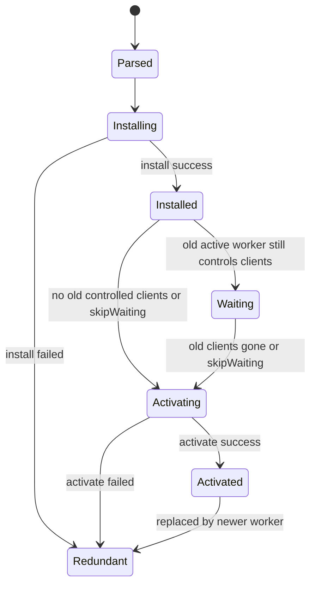
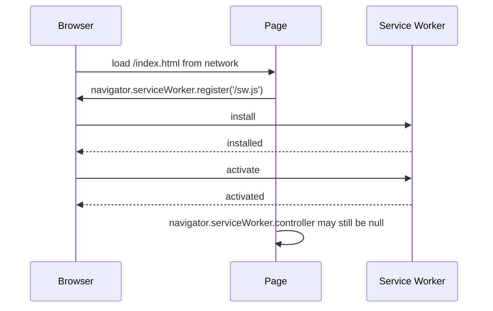
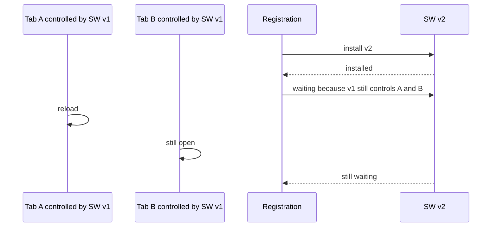
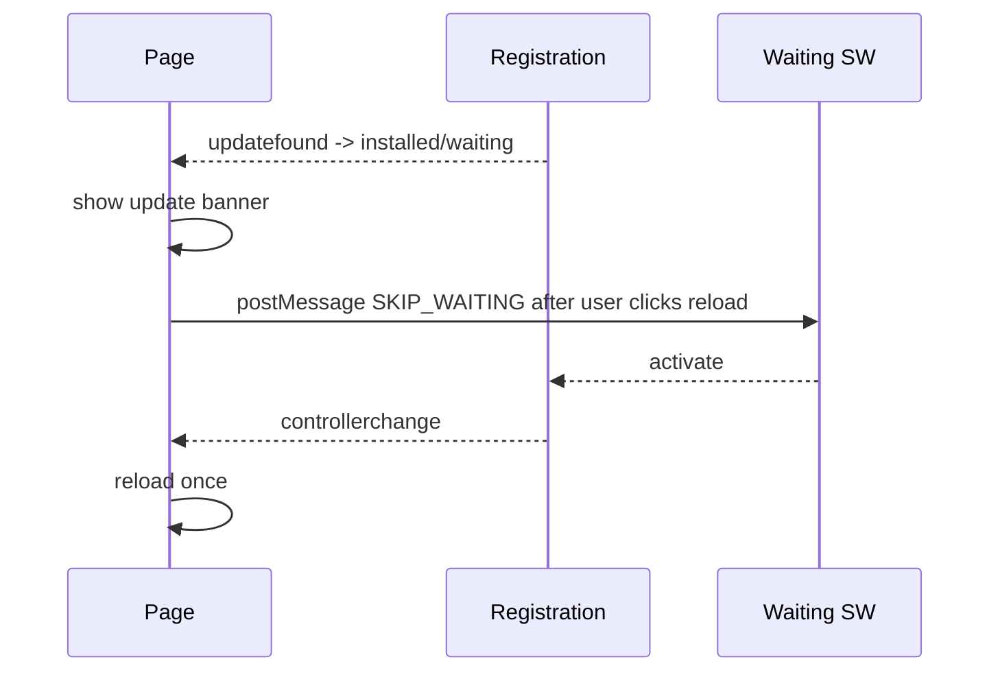
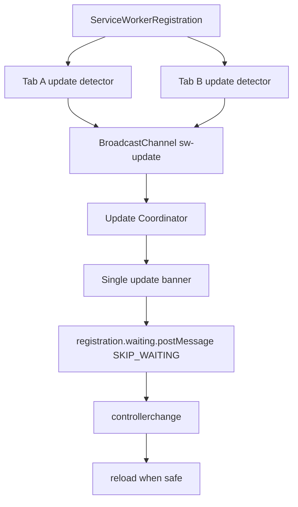

# Part 032 — Service Worker Lifecycle and Update Traps

Service Worker lifecycle adalah salah satu bagian Web Platform yang paling sering disalahpahami.

Bukan karena API-nya terlalu banyak, tetapi karena ada beberapa versi realitas yang berjalan bersamaan:

- versi Service Worker script di server;
- versi Service Worker yang sedang installing;
- versi yang waiting;
- versi yang active;
- versi yang mengontrol tab A;
- versi yang mengontrol tab B;
- versi app shell yang sedang berjalan di memory tab;
- versi cache asset;
- versi IndexedDB schema;
- versi protocol message antara tab dan Service Worker.

Kesalahan mental model umum:

> “Saya deploy Service Worker baru, berarti semua tab langsung pakai logic baru.”

Itu salah.

Mental model yang lebih aman:

> Service Worker update adalah rolling deployment kecil di dalam browser, dengan old clients, new worker, waiting state, controller handoff, cache migration, dan compatibility contract.

Part ini membahas lifecycle dan update trap secara sistematis.

---

## 1. Lifecycle State Machine

State utama Service Worker:



Dalam registration, kamu bisa melihat:

```txt
registration.installing
registration.waiting
registration.active
```

Dalam page, kamu melihat:

```txt
navigator.serviceWorker.controller
```

Keduanya berbeda.

- `registration.active` berarti ada active Service Worker pada registration;
- `navigator.serviceWorker.controller` berarti page saat ini dikontrol oleh Service Worker;
- active worker belum tentu mengontrol page yang sedang terbuka;
- waiting worker bisa ada walaupun page masih dikontrol active worker lama.

Invariant:

> Active Service Worker adalah milik registration. Controller adalah relasi antara page/client dan Service Worker tertentu.

---

## 2. First Load Bias: Page Pertama Sering Uncontrolled

Saat user pertama kali membuka aplikasi:

1. browser load page dari network;
2. page menjalankan JS;
3. JS mendaftarkan Service Worker;
4. Service Worker install;
5. Service Worker activate;
6. page yang sudah terlanjur load belum tentu controlled.

Sequence:



Konsekuensi:

- fetch dari page pertama bisa tidak lewat SW;
- `navigator.serviceWorker.controller?.postMessage(...)` bisa gagal karena `controller` null;
- fitur yang mengandalkan SW harus punya fallback;
- `clients.claim()` bisa membuat active SW mengambil kontrol clients dalam scope, tetapi ini harus dipakai sadar.

Client guard:

```ts
export function getCurrentController(): ServiceWorker | null {
  return navigator.serviceWorker?.controller ?? null;
}

export function requireController(): ServiceWorker {
  const controller = getCurrentController();

  if (!controller) {
    throw new Error('Current page is not controlled by a service worker');
  }

  return controller;
}
```

Untuk aplikasi serius, jangan sembunyikan state ini. Jadikan runtime signal.

```ts
type SwControlState =
  | { kind: 'unsupported' }
  | { kind: 'uncontrolled' }
  | { kind: 'controlled'; version?: string };
```

---

## 3. `install`: Bukan Tempat Migrasi Berat Sembarangan

`install` dipakai untuk menyiapkan worker baru.

Contoh umum:

```ts
self.addEventListener('install', (event) => {
  event.waitUntil(precacheAppShell());
});
```

Jika promise di `install` reject, Service Worker baru gagal install dan menjadi redundant. Worker lama tetap dipakai.

Ini bagus untuk atomicity, tetapi berbahaya jika install terlalu banyak pekerjaan:

- precache terlalu besar;
- network dependency flakey;
- cache opaque response gagal dipahami;
- CDN timeout;
- user koneksi lambat;
- storage quota penuh;
- asset list tidak cocok dengan deploy.

Guideline:

> Install harus cukup kecil untuk reliable, tetapi cukup lengkap untuk membuat worker baru safe.

Jangan install seluruh dunia.

Lebih baik:

```txt
install:
  - cache minimal app shell / offline fallback / manifest penting
activate:
  - cleanup cache lama yang aman dihapus
runtime:
  - lazy cache asset/data berdasarkan request
```

---

## 4. `activate`: Migration Boundary

`activate` dipanggil saat Service Worker baru menjadi active.

Biasanya dipakai untuk:

- membersihkan cache lama;
- enable navigation preload;
- migrate metadata;
- claim clients jika policy memilih immediate control;
- broadcast activation;
- initialize durable schema boundary.

Contoh:

```ts
const CURRENT_CACHES = new Set([
  'app-shell-v7',
  'runtime-v7',
]);

self.addEventListener('activate', (event) => {
  event.waitUntil((async () => {
    const names = await caches.keys();

    await Promise.all(
      names
        .filter((name) => !CURRENT_CACHES.has(name))
        .map((name) => caches.delete(name))
    );
  })());
});
```

Trap besar:

> Jangan menghapus cache lama jika masih ada tab lama yang membutuhkan chunk/cache versi lama.

Misalnya:

- Tab A menjalankan app shell v6;
- Service Worker v7 activate;
- activate menghapus cache asset v6;
- Tab A lazy-load chunk v6;
- chunk sudah hilang;
- user mendapat blank screen.

Solusi:

- gunakan hashed immutable chunk dari network/CDN yang tetap tersedia sementara;
- jangan cleanup asset terlalu agresif;
- keep N previous cache versions;
- cleanup setelah tidak ada old clients;
- update UX minta reload;
- gunakan manifest yang tahu versi app shell per client.

---

## 5. Waiting Worker: Fitur, Bukan Bug

Saat worker baru berhasil install tetapi masih ada page yang dikontrol worker lama, worker baru masuk `waiting`.

Ini mencegah update worker baru mengambil alih page lama secara tiba-tiba.

Problem yang sering muncul:

```txt
Dev deploy v2
Browser installs v2
v2 waiting
Tab masih pakai v1
Engineer reload biasa
Masih tampak v1
Bingung
```

Kenapa?

Reload biasa tidak selalu menutup semua controlled clients. Jika masih ada tab/app window lain yang dikontrol old worker, worker baru tetap waiting.

Multi-tab membuat ini lebih jelas:



Waiting bukan bug. Waiting adalah safety mechanism.

---

## 6. `skipWaiting()`: Force Activation

`self.skipWaiting()` meminta browser agar worker waiting segera menjadi active.

Contoh:

```ts
self.addEventListener('message', (event) => {
  if (event.data?.kind === 'SKIP_WAITING') {
    event.waitUntil(self.skipWaiting());
  }
});
```

Atau automatic:

```ts
self.addEventListener('install', (event) => {
  event.waitUntil(self.skipWaiting());
});
```

Automatic `skipWaiting()` terlihat menarik, tetapi berisiko.

Risiko:

- page lama masih menjalankan JS bundle lama;
- active SW baru punya fetch/cache policy baru;
- old page meminta old chunk;
- new SW memberi response berdasarkan new manifest;
- protocol message old page tidak cocok dengan new SW;
- cache migration menghapus resource yang masih dibutuhkan.

Gunakan automatic skipWaiting hanya jika kamu punya compatibility contract kuat.

Safe-ish jika:

- aplikasi stateless sederhana;
- asset hashed immutable dan old assets tetap tersedia;
- protocol backward-compatible;
- cache cleanup tidak agresif;
- update bugfix kritis;
- ada reload orchestration setelah controllerchange.

Tidak safe jika:

- schema IndexedDB berubah besar;
- Service Worker mengubah auth/session behavior;
- cache key berubah incompatible;
- app shell/chunk coupling kuat;
- long-running form/workflow bisa hilang saat reload;
- domain high-risk/regulatory action sedang berjalan.

---

## 7. `clients.claim()`: Claim Controlled Scope

`clients.claim()` membuat active Service Worker mengambil kontrol clients dalam scope yang belum controlled.

Biasanya dipakai di `activate`:

```ts
self.addEventListener('activate', (event) => {
  event.waitUntil(self.clients.claim());
});
```

Efeknya:

- page dalam scope bisa mendapatkan controller tanpa reload;
- `controllerchange` event bisa terjadi di client;
- first-load uncontrolled gap bisa berkurang.

Tapi sama seperti `skipWaiting()`, ini bukan tombol ajaib.

Risiko:

- page yang dimuat tanpa SW tiba-tiba menjadi controlled;
- fetch berikutnya berubah behavior di tengah session;
- client code mungkin belum siap terhadap controllerchange;
- old page bisa berbicara dengan SW yang belum ia negosiasikan protokolnya.

Rule:

> Pakai `clients.claim()` hanya jika client-side runtime siap menghadapi `controllerchange`.

Client listener:

```ts
navigator.serviceWorker.addEventListener('controllerchange', () => {
  // Jangan langsung reload tanpa guard, bisa reload loop.
  onServiceWorkerControllerChanged();
});
```

Reload guard:

```ts
let hasReloadedForControllerChange = false;

function onServiceWorkerControllerChanged(): void {
  if (hasReloadedForControllerChange) {
    return;
  }

  hasReloadedForControllerChange = true;

  if (isSafeToReloadNow()) {
    window.location.reload();
  } else {
    showReloadRequiredBanner();
  }
}
```

---

## 8. Update Detection Di Client

Client bisa mendeteksi update dengan `registration.updatefound`.

```ts
export async function registerServiceWorker(): Promise<void> {
  if (!('serviceWorker' in navigator)) {
    return;
  }

  const registration = await navigator.serviceWorker.register('/sw.js');

  registration.addEventListener('updatefound', () => {
    const worker = registration.installing;

    if (!worker) return;

    worker.addEventListener('statechange', () => {
      if (worker.state === 'installed') {
        if (navigator.serviceWorker.controller) {
          showUpdateAvailable(registration);
        } else {
          markServiceWorkerInstalledForFirstUse();
        }
      }
    });
  });
}
```

Interpretasi:

- `installed` + ada controller = update tersedia;
- `installed` + tidak ada controller = first install;
- `waiting` = ada worker baru yang menunggu;
- `controllerchange` = page controller berubah.

Jangan menganggap semua `installed` berarti “reload now”.

---

## 9. Update UX: Prompt vs Immediate

Ada dua strategi utama.

### 9.1 Prompted Update

User diberi banner:

```txt
A new version is available. Reload to update.
```

Flow:



Kelebihan:

- user tidak kehilangan work-in-progress;
- cocok untuk enterprise workflows;
- bisa tunggu safe point;
- mengurangi surprise reload.

Kekurangan:

- user bisa lama di versi lama;
- bugfix/security update tidak langsung masuk;
- butuh UI state.

---

### 9.2 Immediate Update

Worker baru langsung `skipWaiting()` dan `clients.claim()`.

Flow:

```txt
install -> skipWaiting -> activate -> clients.claim -> controllerchange -> reload/continue
```

Kelebihan:

- update cepat;
- cocok untuk consumer app sederhana;
- critical fix bisa didorong.

Kekurangan:

- version skew berisiko;
- reload loop mudah terjadi;
- form/workflow bisa hilang;
- cache migration harus backward-compatible.

Untuk sistem case management, enforcement lifecycle, financial/regulatory, atau form berat, prompted/safe-point update biasanya lebih defensible.

---

## 10. Safe-Point Update Protocol

Aplikasi serius sebaiknya tidak reload sembarang waktu.

Contoh safe-point:

- tidak ada unsaved form;
- tidak ada mutation in-flight;
- tidak ada lock ownership lokal;
- tidak sedang melakukan upload;
- tidak sedang menandatangani approval;
- tidak sedang menjalankan critical workflow step;
- current route bisa direstore.

State:

```ts
type ReloadSafety = {
  hasUnsavedChanges: boolean;
  inFlightMutations: number;
  activeUploads: number;
  ownsCriticalLock: boolean;
  currentRouteRestorable: boolean;
};

function isSafeToReload(state: ReloadSafety): boolean {
  return (
    !state.hasUnsavedChanges &&
    state.inFlightMutations === 0 &&
    state.activeUploads === 0 &&
    !state.ownsCriticalLock &&
    state.currentRouteRestorable
  );
}
```

Update coordinator:

```ts
async function applyWaitingServiceWorker(registration: ServiceWorkerRegistration): Promise<void> {
  const waiting = registration.waiting;

  if (!waiting) {
    return;
  }

  waiting.postMessage({
    protocol: 'sw-control',
    version: 1,
    kind: 'SKIP_WAITING',
  });
}
```

Client reload:

```ts
let refreshing = false;

navigator.serviceWorker.addEventListener('controllerchange', () => {
  if (refreshing) return;
  refreshing = true;

  if (isSafeToReloadNow()) {
    window.location.reload();
  } else {
    showReloadRequiredBanner();
  }
});
```

---

## 11. Version Skew: Masalah Utama

Version skew terjadi saat beberapa komponen versi berbeda berjalan bersama.

Contoh:

```txt
Tab JS: v10
Service Worker active: v11
Cache app shell: v11
IndexedDB schema: v10
SharedWorker protocol: v10
```

Atau:

```txt
Tab A: app v10 controlled by SW v10
Tab B: app v11 controlled by SW v11
BroadcastChannel: both send messages
IndexedDB: shared schema v11
```

Risiko:

- message protocol mismatch;
- IndexedDB migration conflict;
- old tab membaca schema baru;
- new SW menghapus cache old tab;
- old tab lazy-load chunk yang sudah tidak ada;
- mutation format berubah;
- feature flag interpretation berubah.

Solusi bukan “hindari update”. Solusi adalah version compatibility.

---

## 12. Compatibility Contract

Setiap deploy perlu menjawab:

1. Apakah app shell lama bisa bekerja dengan Service Worker baru?
2. Apakah app shell baru bisa bekerja dengan Service Worker lama?
3. Apakah message protocol backward-compatible?
4. Apakah cache lama masih boleh dibaca?
5. Apakah cache baru aman untuk old client?
6. Apakah IndexedDB schema migration reversible atau at least old-client-safe?
7. Apakah mutation format masih accepted server?
8. Apakah logout cleanup berlaku untuk semua versi?
9. Apakah update bisa menunggu safe point?
10. Apakah rollback tersedia?

Contract sederhana:

```ts
type RuntimeCompatibility = {
  appVersion: string;
  swVersion: string;
  protocolMin: number;
  protocolMax: number;
  cacheSchema: number;
  idbSchema: number;
};
```

Handshake client ke Service Worker:

```ts
navigator.serviceWorker.controller?.postMessage({
  protocol: 'sw-control',
  version: 1,
  kind: 'CLIENT_HELLO',
  clientId,
  appVersion: APP_VERSION,
  supportedProtocol: { min: 1, max: 2 },
});
```

Service Worker response:

```ts
{
  protocol: 'sw-event',
  version: 1,
  kind: 'SW_HELLO',
  swVersion: SW_VERSION,
  requiredClientAction: 'none' | 'reload-recommended' | 'reload-required'
}
```

---

## 13. Cache Versioning Strategy

Gunakan cache name versioned.

```ts
const APP_VERSION = '2026.07.08';

const CACHE_NAMES = {
  shell: `shell-${APP_VERSION}`,
  static: `static-${APP_VERSION}`,
  runtime: `runtime-${APP_VERSION}`,
};
```

Tetapi versioned cache saja tidak cukup.

Masalah:

- activate v11 menghapus cache v10;
- Tab v10 masih hidup;
- user route ke lazy chunk v10;
- cache miss;
- network/CDN sudah cleanup v10;
- blank page.

Safer cleanup:

```ts
const MAX_OLD_CACHE_VERSIONS = 2;

async function cleanupOldVersionedCaches(): Promise<void> {
  const names = await caches.keys();
  const grouped = groupByCacheFamily(names);

  for (const [family, versions] of grouped) {
    const sorted = sortNewestFirst(versions);
    const toDelete = sorted.slice(MAX_OLD_CACHE_VERSIONS + 1);

    await Promise.all(toDelete.map((entry) => caches.delete(entry.name)));
  }
}
```

Lebih baik lagi: cleanup berdasarkan active clients.

```ts
async function hasOldClients(): Promise<boolean> {
  const clients = await self.clients.matchAll({ type: 'window' });

  for (const client of clients) {
    // Butuh registry/hello protocol untuk tahu appVersion per client.
    if (await clientLooksOld(client)) {
      return true;
    }
  }

  return false;
}
```

Praktisnya, simpan versi client melalui `CLIENT_HELLO` registry sementara dan durable metadata ringan.

---

## 14. IndexedDB Migration Trap

IndexedDB lebih sensitif daripada cache.

Jika tab lama dan tab baru membuka database yang sama dengan schema berbeda:

- migration bisa blocked;
- old code tidak tahu object store baru;
- new code mengubah format record;
- old code menulis format lama;
- new code membaca record campuran.

Prinsip:

1. Additive migration lebih aman daripada destructive migration.
2. Jangan hapus field/store yang masih mungkin dipakai old clients.
3. Gunakan record-level schema version.
4. Buat readers tolerant terhadap old shape.
5. Buat writers menyertakan `schemaVersion`.
6. Jangan melakukan destructive cleanup sampai yakin old clients hilang.

Record example:

```ts
type QueueRecordV2 = {
  id: string;
  schemaVersion: 2;
  kind: string;
  payload: unknown;
  idempotencyKey: string;
  createdAt: number;
  lastAttemptAt?: number;
};
```

Reader tolerant:

```ts
function normalizeQueueRecord(record: unknown): QueueRecordV2 {
  if (isQueueRecordV2(record)) {
    return record;
  }

  if (isQueueRecordV1(record)) {
    return {
      id: record.id,
      schemaVersion: 2,
      kind: record.type,
      payload: record.body,
      idempotencyKey: record.idempotencyKey ?? record.id,
      createdAt: record.createdAt,
    };
  }

  throw new Error('unknown queue record schema');
}
```

---

## 15. Multi-Tab Update Orchestration

Update harus dikoordinasikan lintas tab.

Target:

- semua tab tahu ada update;
- hanya satu tab mungkin memimpin prompt;
- tab dengan unsaved work bisa menunda;
- user tidak mendapat banyak banner;
- saat apply, semua tab menuju state konsisten;
- reload loop dicegah.

Architecture:



Protocol:

```ts
type SwUpdateMessage =
  | {
      kind: 'UPDATE_FOUND';
      registrationScope: string;
      detectedBy: string;
      at: number;
    }
  | {
      kind: 'UPDATE_READY';
      version?: string;
      waiting: true;
      detectedBy: string;
      at: number;
    }
  | {
      kind: 'UPDATE_APPLY_REQUESTED';
      requestedBy: string;
      at: number;
    }
  | {
      kind: 'UPDATE_RELOAD_REQUIRED';
      reason: string;
      at: number;
    };
```

Client broadcast:

```ts
const channel = new BroadcastChannel('sw-update');

function announceUpdateReady(): void {
  channel.postMessage({
    kind: 'UPDATE_READY',
    waiting: true,
    detectedBy: clientId,
    at: Date.now(),
  });
}
```

Single prompt strategy:

```ts
let updatePromptVisible = false;

channel.onmessage = (event) => {
  const message = event.data as SwUpdateMessage;

  if (message.kind === 'UPDATE_READY' && !updatePromptVisible) {
    updatePromptVisible = true;
    showUpdateBanner();
  }
};
```

Part 038–040 nanti akan membahas leader election lebih dalam. Untuk update prompt, solusi sederhana sering cukup: dedupe via shared UI state + BroadcastChannel.

---

## 16. Avoid Reload Loops

Reload loop umum terjadi saat:

- `controllerchange` selalu memanggil `location.reload()`;
- page reload, update detection masih melihat waiting worker;
- skipWaiting dikirim berulang;
- controllerchange terjadi lagi;
- reload lagi.

Guard minimal:

```ts
const RELOAD_GUARD_KEY = 'sw-controllerchange-reloaded-at';
const RELOAD_GUARD_WINDOW_MS = 30_000;

function shouldReloadForControllerChange(): boolean {
  const last = Number(sessionStorage.getItem(RELOAD_GUARD_KEY) ?? 0);
  const now = Date.now();

  if (now - last < RELOAD_GUARD_WINDOW_MS) {
    return false;
  }

  sessionStorage.setItem(RELOAD_GUARD_KEY, String(now));
  return true;
}

navigator.serviceWorker.addEventListener('controllerchange', () => {
  if (shouldReloadForControllerChange() && isSafeToReloadNow()) {
    window.location.reload();
  }
});
```

Lebih baik: reload hanya setelah apply eksplisit.

```ts
let reloadExpected = false;

async function applyUpdate(registration: ServiceWorkerRegistration): Promise<void> {
  reloadExpected = true;
  registration.waiting?.postMessage({ kind: 'SKIP_WAITING' });
}

navigator.serviceWorker.addEventListener('controllerchange', () => {
  if (!reloadExpected) {
    return;
  }

  window.location.reload();
});
```

---

## 17. The “New SW, Old Page” Protocol Problem

Misalnya page v1 mengirim:

```ts
{ kind: 'CLEAR_CACHE' }
```

Service Worker v2 mengharapkan:

```ts
{ protocol: 'sw-control', version: 2, kind: 'CACHE_CLEAR', scope: 'runtime' }
```

Jika v2 tidak backward-compatible, command gagal atau lebih buruk: salah interpretasi.

Solusi:

```ts
type ProtocolEnvelope = {
  protocol: 'sw-control';
  version: number;
  kind: string;
  id?: string;
};

function handleMessageByVersion(message: ProtocolEnvelope): Promise<unknown> {
  switch (message.version) {
    case 1:
      return handleV1(message);
    case 2:
      return handleV2(message);
    default:
      return Promise.reject(new Error(`unsupported protocol version: ${message.version}`));
  }
}
```

Policy:

- support at least previous major protocol while old tabs may exist;
- reject unknown version explicitly;
- include `minSupportedClientVersion` in SW_HELLO;
- ask old clients to reload if incompatible;
- never silently treat unknown message as success.

---

## 18. Deployment Trap: Hashed Chunks and App Shell

Modern bundlers emit hashed assets:

```txt
/index.html
/assets/index-a1b2.js
/assets/vendor-c3d4.js
/assets/case-route-e5f6.js
```

Deploy v2:

```txt
/index.html
/assets/index-x7y8.js
/assets/vendor-z9w0.js
/assets/case-route-q1r2.js
```

If server/CDN removes old chunks immediately, old open tabs break when lazy-loading.

Solutions:

- keep old assets for a retention window;
- immutable cache headers for hashed assets;
- do not overwrite hashed chunks;
- make Service Worker cache-first for immutable hashed assets;
- prompt reload for new app shell;
- do not cache `index.html` as immutable;
- monitor chunk load failures.

Client-side chunk error handler:

```ts
window.addEventListener('error', (event) => {
  const target = event.target as HTMLElement | null;

  if (target?.tagName === 'SCRIPT') {
    reportChunkLoadFailure({
      src: (target as HTMLScriptElement).src,
      appVersion: APP_VERSION,
    });

    showReloadRequiredBanner();
  }
}, true);
```

---

## 19. Update Check Semantics

Browser checks Service Worker script for updates under specific conditions, including registration/navigation/update calls depending on browser behavior and caching constraints.

Practical tools:

```ts
const registration = await navigator.serviceWorker.getRegistration();
await registration?.update();
```

Use cases:

- user opens app after long idle;
- settings/about page “check for updates”;
- before critical workflow start;
- after network reconnect;
- after receiving server-side “new version available” signal.

Do not call `registration.update()` in a tight loop.

Bounded polling:

```ts
const UPDATE_CHECK_INTERVAL_MS = 60 * 60 * 1000;
let lastUpdateCheckAt = 0;

export async function maybeCheckForSwUpdate(): Promise<void> {
  const now = Date.now();

  if (now - lastUpdateCheckAt < UPDATE_CHECK_INTERVAL_MS) {
    return;
  }

  lastUpdateCheckAt = now;
  const registration = await navigator.serviceWorker.getRegistration();
  await registration?.update();
}
```

---

## 20. `updateViaCache`

When registering Service Worker, `updateViaCache` controls how HTTP cache is used when checking for updates to the worker script and imports.

Example:

```ts
navigator.serviceWorker.register('/sw.js', {
  updateViaCache: 'none',
});
```

Options are commonly used to reduce stale update checks for worker scripts/imports.

Production guidance:

- serve `/sw.js` with conservative cache headers;
- avoid long-lived immutable caching for the worker script itself;
- hashed imports can be cached aggressively;
- test update behavior behind CDN;
- verify MIME type and CSP;
- monitor active/waiting versions.

Rule:

> It is fine for app chunks to be immutable. It is usually not fine for `/sw.js` itself to be effectively immutable for too long.

---

## 21. Service Worker Script Cache Headers

Recommended shape:

```http
/service-worker.js
Cache-Control: no-cache
Content-Type: text/javascript
```

For hashed chunks:

```http
/assets/index-a1b2c3.js
Cache-Control: public, max-age=31536000, immutable
Content-Type: text/javascript
```

Why?

- Service Worker script needs update checks;
- hashed chunks are content-addressed;
- old chunks should remain available during rollout;
- app shell `/index.html` usually should revalidate;
- wrong MIME can prevent worker install.

---

## 22. Kill Switch Pattern

Service Worker bugs can be sticky. Build a kill switch.

Options:

1. server config tells clients to unregister;
2. Service Worker checks kill-switch endpoint and unregisters;
3. deploy empty/pass-through Service Worker;
4. clear known caches;
5. force reload at safe point.

Client-side unregister:

```ts
export async function unregisterAllServiceWorkers(): Promise<void> {
  const registrations = await navigator.serviceWorker.getRegistrations();

  await Promise.all(registrations.map((registration) => registration.unregister()));
}
```

Pass-through SW:

```ts
self.addEventListener('fetch', () => {
  // no respondWith => browser default network handling
});
```

Kill switch must be tested before emergency.

Checklist:

- Can we disable fetch interception?
- Can we clear runtime cache?
- Can we preserve user offline queue?
- Can we avoid deleting forensic/debug data too early?
- Can we recover old broken waiting worker?
- Can we detect clients still controlled by bad version?

---

## 23. Observing Lifecycle In Production

Track:

| Signal | Source |
|---|---|
| registration success/failure | client |
| updatefound | client |
| installing state changes | client |
| waiting worker present | client |
| controllerchange | client |
| active SW version | SW hello |
| client app version | client hello |
| skipWaiting requested | client/SW |
| clients.claim called | SW |
| activate duration | SW |
| cache cleanup count | SW |
| reload after update | client |
| chunk load failure | client |

Debug command:

```ts
export async function getSwDebugSnapshot(): Promise<unknown> {
  const registration = await navigator.serviceWorker.getRegistration();

  return {
    controller: navigator.serviceWorker.controller?.state ?? null,
    installing: registration?.installing?.state ?? null,
    waiting: registration?.waiting?.state ?? null,
    active: registration?.active?.state ?? null,
    scope: registration?.scope,
  };
}
```

Service Worker version endpoint via message:

```ts
self.addEventListener('message', (event) => {
  if (event.data?.kind !== 'GET_SW_VERSION') return;

  const port = event.ports[0];
  port?.postMessage({
    kind: 'SW_VERSION',
    swVersion: SW_VERSION,
  });
});
```

---

## 24. Testing Lifecycle and Updates

Unit test tidak cukup. Butuh browser automation.

Test matrix:

| Scenario | Expected |
|---|---|
| first install | app works with controller null |
| second load | page controlled |
| new SW installed while one tab open | waiting detected |
| user accepts update | skipWaiting sent |
| controllerchange | reload once |
| unsaved form | reload deferred |
| two tabs open | single update prompt |
| old tab lazy-loads chunk | chunk still available |
| cache cleanup | old required cache retained |
| incompatible protocol | old client asked to reload |
| bad SW deploy | kill switch works |

Playwright-style conceptual test:

```ts
test('service worker update waits until user accepts', async ({ browser }) => {
  const context = await browser.newContext();
  const page = await context.newPage();

  await page.goto(appUrl);
  await waitForServiceWorkerActive(page);

  await deployServiceWorkerVersion('v2');
  await page.reload();

  await expect(page.getByText('New version available')).toBeVisible();
  await page.getByRole('button', { name: 'Reload to update' }).click();

  await waitForControllerChange(page);
  await expect(page).toHaveURL(appUrl);
});
```

Chaos cases:

- close tab during waiting;
- open second tab during update;
- go offline during install;
- storage quota full;
- activate cleanup throws;
- reload during controllerchange;
- old chunk missing;
- invalid MIME for sw.js;
- CDN serves stale sw.js;
- IndexedDB upgrade blocked by old tab.

---

## 25. Practical Update Policy Decision Matrix

| App type | Recommended update policy |
|---|---|
| static content site | immediate update often acceptable |
| simple dashboard | prompt or immediate with reload guard |
| SaaS CRUD app | prompted update at safe point |
| long form workflow | safe-point update only |
| financial/regulatory action system | explicit prompt + compatibility contract |
| app with offline mutations | conservative update + migration protocol |
| security hotfix | immediate possible, with forced reload messaging |
| internal admin tool | depends on workflow criticality |

Do not choose update policy from frontend convenience. Choose it from consequence of losing or corrupting user work.

---

## 26. Production Update Recipe

A defensible default for complex apps:

1. Register Service Worker with conservative cache behavior.
2. Do not automatic `skipWaiting()` for normal deploys.
3. Detect `registration.waiting` and `updatefound`.
4. Broadcast update-ready signal across tabs.
5. Show one update banner.
6. Let user apply update or defer.
7. Before apply, check safe-point state.
8. Send `SKIP_WAITING` to waiting worker.
9. On `controllerchange`, reload once with guard.
10. Keep old hashed assets for retention window.
11. Keep at least one old cache generation or cleanup based on client versions.
12. Make message protocol backward-compatible.
13. Make IndexedDB migration additive/tolerant.
14. Track active/waiting/controller versions in telemetry.
15. Maintain kill switch.

Example:

```ts
export async function setupSwUpdates(): Promise<void> {
  if (!('serviceWorker' in navigator)) return;

  const registration = await navigator.serviceWorker.register('/sw.js', {
    updateViaCache: 'none',
  });

  if (registration.waiting && navigator.serviceWorker.controller) {
    notifyUpdateReady(registration);
  }

  registration.addEventListener('updatefound', () => {
    const installing = registration.installing;
    if (!installing) return;

    installing.addEventListener('statechange', () => {
      if (installing.state === 'installed' && navigator.serviceWorker.controller) {
        notifyUpdateReady(registration);
      }
    });
  });

  let reloadExpected = false;

  navigator.serviceWorker.addEventListener('controllerchange', () => {
    if (!reloadExpected) return;
    if (!shouldReloadForControllerChange()) return;

    window.location.reload();
  });

  onUserAcceptsUpdate(async () => {
    if (!isSafeToReloadNow()) {
      showReloadBlockedByUnsavedWork();
      return;
    }

    reloadExpected = true;
    registration.waiting?.postMessage({
      protocol: 'sw-control',
      version: 1,
      kind: 'SKIP_WAITING',
    });
  });
}
```

Service Worker:

```ts
self.addEventListener('message', (event) => {
  const message = event.data;

  if (message?.protocol === 'sw-control' && message.kind === 'SKIP_WAITING') {
    event.waitUntil(self.skipWaiting());
  }
});

self.addEventListener('activate', (event) => {
  event.waitUntil((async () => {
    await cleanupCachesConservatively();
    await self.clients.claim();
  })());
});
```

Note: `clients.claim()` di sini dipakai karena reload sudah diatur oleh client runtime. Jika kamu tidak siap menghadapi controllerchange, jangan klaim otomatis.

---

## 27. Anti-Patterns

### Anti-pattern 1: Always `skipWaiting()`

```ts
self.addEventListener('install', () => self.skipWaiting());
```

Tidak selalu salah, tetapi terlalu sering dipakai tanpa compatibility contract.

---

### Anti-pattern 2: Delete All Old Caches On Activate

```ts
self.addEventListener('activate', (event) => {
  event.waitUntil(
    caches.keys().then((names) => Promise.all(names.map((name) => caches.delete(name))))
  );
});
```

Ini bisa merusak old tabs.

---

### Anti-pattern 3: Blind Reload On Any Controller Change

```ts
navigator.serviceWorker.addEventListener('controllerchange', () => {
  location.reload();
});
```

Reload loop risk.

---

### Anti-pattern 4: No Update UI

User tetap di versi lama berhari-hari karena tab tidak pernah ditutup.

---

### Anti-pattern 5: Protocol Without Version

```ts
postMessage({ kind: 'CLEAR_CACHE' });
```

Tidak ada ruang untuk compatibility.

---

### Anti-pattern 6: Cache `index.html` Forever

App shell stale bisa membuat user terus menjalankan bundle lama walaupun deploy baru sudah ada.

---

## 28. Mental Model Final

Service Worker lifecycle bukan detail PWA. Ia adalah deployment model.

Untuk aplikasi multi-tab, Service Worker update memiliki sifat seperti rolling deploy:

```txt
old clients + old controller
new worker installing
new worker waiting
user accepts update
new worker activates
controller changes
clients reload at safe point
old cache eventually cleaned
```

Kebenaran penting:

- waiting worker adalah safety mechanism;
- active worker tidak sama dengan current controller;
- first load bisa uncontrolled;
- `skipWaiting()` mempercepat activation, tapi bisa menciptakan version skew;
- `clients.claim()` memperluas control, tapi client harus siap;
- cache cleanup harus mempertimbangkan old tabs;
- message protocol harus versioned;
- IndexedDB migration harus tolerant;
- update UX adalah bagian dari correctness, bukan kosmetik.

Di part berikutnya kita akan membahas bagaimana Service Worker mengirim update/event ke banyak tab: broadcasting dari Service Worker ke clients, invalidation event, update notification, dan protocol yang aman agar tab tidak menjadikan broadcast volatile sebagai source of truth.

---

## Referensi Resmi

- MDN — Using Service Workers
- MDN — ServiceWorkerRegistration
- MDN — ServiceWorkerGlobalScope `skipWaiting()`
- MDN — Clients `claim()`
- MDN — ServiceWorkerContainer `controllerchange`
- MDN — FetchEvent `respondWith()`
- web.dev — The Service Worker Lifecycle
- Chrome Developers — Workbox Service Worker Lifecycle
