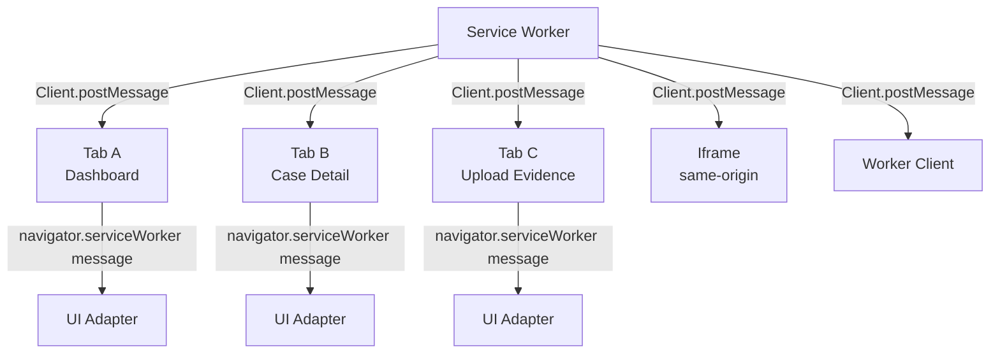
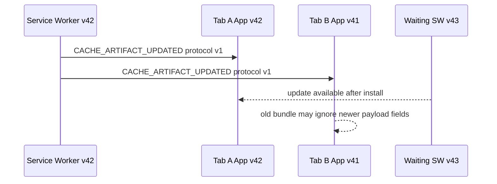

# Part 033 — Service Worker Broadcasting to Tabs

Service Worker sering dipahami sebagai "cache layer". Itu terlalu sempit.

Dalam aplikasi serius, Service Worker juga bisa menjadi **event coordinator** di sisi browser: ia melihat network event, cache update, push notification, background sync, navigation request, dan lifecycle update. Masalahnya, Service Worker tidak punya UI. Semua informasi yang perlu memengaruhi pengguna harus dikirim ke **client**: tab, window, iframe, atau worker context yang berada dalam scope-nya.

Di bagian ini kita membangun pola **Service Worker broadcasting to tabs** secara production-grade.

Target mental model:

> Service Worker boleh menjadi sumber event, tetapi tab tetap menjadi owner UI decision. Broadcast dari Service Worker adalah signal, bukan command absolut.

---

## 1. Problem yang Ingin Diselesaikan

Bayangkan aplikasi case management regulatory system dibuka di tiga tab:

1. tab dashboard,
2. tab detail case,
3. tab upload evidence.

Service Worker mendeteksi beberapa hal:

- data artifact baru sudah tersedia di cache,
- request offline berhasil direplay,
- token session sudah invalid,
- app shell version berubah,
- push notification diterima,
- file upload background selesai,
- cache migration selesai,
- network kembali online.

Pertanyaannya:

> Bagaimana Service Worker memberi tahu semua tab yang relevan tanpa membuat race condition, duplicate UI, notification spam, stale update, atau tab lama mengambil keputusan salah?

Naive solution:

```js
const clients = await self.clients.matchAll();
for (const client of clients) {
  client.postMessage({ type: 'UPDATED' });
}
```

Ini benar sebagai demo. Tidak cukup sebagai desain produksi.

Kita perlu menjawab:

- client mana yang harus menerima message?
- apakah uncontrolled client ikut dikirim?
- bagaimana jika tidak ada client?
- bagaimana jika client berbeda versi app?
- bagaimana jika tab frozen dan baru membaca message terlambat?
- apakah message perlu ACK?
- apakah message boleh hilang?
- apakah message durable?
- apakah message harus deduplicated?
- apakah message punya security boundary?
- bagaimana menghindari spam UI di banyak tab?

---

## 2. Primitive Resmi: `clients.matchAll()` dan `Client.postMessage()`

Di dalam Service Worker, global scope menyediakan `self.clients`.

Konsep dasarnya:

```js
const windowClients = await self.clients.matchAll({
  type: 'window',
  includeUncontrolled: true,
});

for (const client of windowClients) {
  client.postMessage({
    type: 'CACHE_UPDATED',
    cacheVersion: 'app-v42',
  });
}
```

Di client page:

```js
navigator.serviceWorker.addEventListener('message', event => {
  console.log('message from service worker', event.data);
});
```

Mental model:

- `clients.matchAll()` menemukan executable contexts yang dikenal Service Worker dalam origin/scope terkait.
- `Client.postMessage()` mengirim message dari Service Worker ke client.
- message diterima di page lewat `navigator.serviceWorker` `message` event.
- payload memakai structured clone algorithm.
- delivery bersifat best-effort volatile message, bukan durable event log.

Jangan menganggap broadcast sebagai database.

---

## 3. Service Worker Broadcast Topology



Important nuance:

Service Worker can message multiple client types, but most UI orchestration targets `window` clients. For app-level tab behavior, start with `type: 'window'` unless you intentionally coordinate worker clients too.

---

## 4. Broadcast Is Not Pub/Sub Yet

Raw broadcast only gives you:

- enumerate clients,
- send message,
- receive message.

It does **not** give you:

- topic subscription,
- durable delivery,
- ACK,
- retry,
- ordering,
- deduplication,
- schema validation,
- client capability check,
- backpressure,
- recipient filtering by route,
- recipient filtering by app version,
- recipient filtering by auth/session.

Therefore, production broadcast needs a small protocol layer.

---

## 5. Message Envelope

Use a common envelope. Do not send ad-hoc objects.

```ts
type ServiceWorkerToClientMessage = {
  protocol: 'sw-client-v1';
  id: string;
  type:
    | 'APP_UPDATE_AVAILABLE'
    | 'CACHE_ARTIFACT_UPDATED'
    | 'OFFLINE_REPLAY_COMPLETED'
    | 'SESSION_REVOKED'
    | 'BACKGROUND_UPLOAD_PROGRESS'
    | 'BACKGROUND_UPLOAD_COMPLETED'
    | 'NAVIGATION_PRELOAD_STATUS'
    | 'PUSH_EVENT_RECEIVED';
  source: {
    kind: 'service-worker';
    swVersion: string;
    buildId: string;
  };
  createdAt: number;
  expiresAt?: number;
  topic?: string;
  target?: {
    clientId?: string;
    routePrefix?: string;
    visibility?: 'visible' | 'hidden' | 'any';
    appVersion?: string;
  };
  payload: unknown;
  delivery?: {
    requireAck?: boolean;
    dedupeKey?: string;
    priority?: 'low' | 'normal' | 'high';
  };
};
```

Why envelope fields matter:

| Field | Purpose |
|---|---|
| `protocol` | reject unknown message families |
| `id` | trace, ACK, dedupe |
| `type` | routing |
| `source.swVersion` | detect Service Worker/app mismatch |
| `createdAt` | latency and staleness check |
| `expiresAt` | reject stale UI actions |
| `topic` | subscription-style filtering |
| `target` | avoid sending everything to everyone |
| `payload` | business data |
| `delivery` | define ACK/dedupe behavior |

The envelope is not bureaucracy. It is the difference between an event system and random global mutation.

---

## 6. Client Capability Registration

Service Worker cannot automatically know whether a tab is a dashboard, a detail page, or a background upload page. You need explicit registration.

Client page:

```ts
type ClientHello = {
  protocol: 'client-sw-v1';
  id: string;
  type: 'CLIENT_HELLO';
  payload: {
    clientInstanceId: string;
    appVersion: string;
    buildId: string;
    route: string;
    visible: boolean;
    capabilities: string[];
    subscriptions: string[];
  };
};

export async function registerClientWithServiceWorker(snapshot: {
  clientInstanceId: string;
  appVersion: string;
  buildId: string;
  route: string;
  visible: boolean;
  capabilities: string[];
  subscriptions: string[];
}) {
  const controller = navigator.serviceWorker.controller;
  if (!controller) return;

  controller.postMessage({
    protocol: 'client-sw-v1',
    id: crypto.randomUUID(),
    type: 'CLIENT_HELLO',
    payload: snapshot,
  } satisfies ClientHello);
}
```

Service Worker registry:

```ts
type ClientRecord = {
  clientInstanceId: string;
  swClientId: string;
  appVersion: string;
  buildId: string;
  route: string;
  visible: boolean;
  capabilities: Set<string>;
  subscriptions: Set<string>;
  lastSeenAt: number;
};

const clientRegistry = new Map<string, ClientRecord>();

self.addEventListener('message', event => {
  const msg = event.data;

  if (msg?.protocol !== 'client-sw-v1') return;

  if (msg.type === 'CLIENT_HELLO') {
    const client = event.source;
    if (!client || !('id' in client)) return;

    clientRegistry.set(client.id, {
      swClientId: client.id,
      clientInstanceId: msg.payload.clientInstanceId,
      appVersion: msg.payload.appVersion,
      buildId: msg.payload.buildId,
      route: msg.payload.route,
      visible: msg.payload.visible,
      capabilities: new Set(msg.payload.capabilities),
      subscriptions: new Set(msg.payload.subscriptions),
      lastSeenAt: Date.now(),
    });
  }
});
```

Caveat:

`clientRegistry` is in-memory. Service Worker can be terminated and restarted. Registry is a performance optimization, not source of truth. Clients must re-register on:

- page load,
- `controllerchange`,
- visibility change,
- route change,
- app version change,
- periodic heartbeat.

---

## 7. Broadcast Helper

A production helper should separate **discovery**, **filtering**, **delivery**, and **metrics**.

```ts
type BroadcastOptions = {
  type?: ClientTypes;
  includeUncontrolled?: boolean;
  topic?: string;
  routePrefix?: string;
  requireCapability?: string;
  visibleOnly?: boolean;
  appVersion?: string;
  requireAck?: boolean;
  expiresInMs?: number;
};

async function broadcastToClients(
  message: Omit<ServiceWorkerToClientMessage, 'id' | 'createdAt' | 'expiresAt'>,
  options: BroadcastOptions = {},
) {
  const createdAt = Date.now();
  const envelope: ServiceWorkerToClientMessage = {
    ...message,
    id: crypto.randomUUID(),
    createdAt,
    expiresAt: options.expiresInMs ? createdAt + options.expiresInMs : undefined,
    delivery: {
      ...message.delivery,
      requireAck: options.requireAck ?? message.delivery?.requireAck,
    },
  };

  const clients = await self.clients.matchAll({
    type: options.type ?? 'window',
    includeUncontrolled: options.includeUncontrolled ?? true,
  });

  let sent = 0;
  let skipped = 0;

  for (const client of clients) {
    const record = clientRegistry.get(client.id);

    if (!shouldSendToClient(record, options)) {
      skipped++;
      continue;
    }

    client.postMessage(envelope);
    sent++;
  }

  return {
    messageId: envelope.id,
    sent,
    skipped,
  };
}

function shouldSendToClient(
  record: ClientRecord | undefined,
  options: BroadcastOptions,
): boolean {
  if (!record) {
    // If the client has not registered, only send generic critical broadcasts.
    return !options.topic && !options.requireCapability && !options.routePrefix;
  }

  if (options.topic && !record.subscriptions.has(options.topic)) return false;
  if (options.requireCapability && !record.capabilities.has(options.requireCapability)) return false;
  if (options.visibleOnly && !record.visible) return false;
  if (options.routePrefix && !record.route.startsWith(options.routePrefix)) return false;
  if (options.appVersion && record.appVersion !== options.appVersion) return false;

  return true;
}
```

Key idea:

> Broadcast should be intentional fan-out, not blind spraying.

---

## 8. Client-Side Message Router

The page should never let arbitrary Service Worker messages mutate UI directly.

Create a client-side router:

```ts
type ClientMessageHandler = (message: ServiceWorkerToClientMessage) => void | Promise<void>;

class ServiceWorkerMessageRouter {
  private handlers = new Map<string, ClientMessageHandler>();
  private seen = new Set<string>();

  on(type: ServiceWorkerToClientMessage['type'], handler: ClientMessageHandler) {
    this.handlers.set(type, handler);
  }

  start() {
    navigator.serviceWorker.addEventListener('message', event => {
      void this.handle(event.data);
    });
  }

  private async handle(raw: unknown) {
    const message = parseSwMessage(raw);
    if (!message) return;

    if (message.expiresAt && Date.now() > message.expiresAt) {
      return;
    }

    const dedupeKey = message.delivery?.dedupeKey ?? message.id;
    if (this.seen.has(dedupeKey)) return;
    this.seen.add(dedupeKey);

    const handler = this.handlers.get(message.type);
    if (!handler) return;

    await handler(message);
  }
}

function parseSwMessage(raw: unknown): ServiceWorkerToClientMessage | null {
  if (!raw || typeof raw !== 'object') return null;
  const msg = raw as Partial<ServiceWorkerToClientMessage>;
  if (msg.protocol !== 'sw-client-v1') return null;
  if (!msg.id || !msg.type || !msg.source) return null;
  return msg as ServiceWorkerToClientMessage;
}
```

The router provides:

- schema boundary,
- stale message rejection,
- dedupe,
- handler isolation,
- future observability hook.

---

## 9. Example: Broadcast App Update Available

Service Worker has installed a new version and wants existing tabs to show an update banner.

```ts
async function notifyAppUpdateAvailable(nextBuildId: string) {
  return broadcastToClients(
    {
      protocol: 'sw-client-v1',
      type: 'APP_UPDATE_AVAILABLE',
      source: {
        kind: 'service-worker',
        swVersion: SW_VERSION,
        buildId: BUILD_ID,
      },
      payload: {
        nextBuildId,
        strategy: 'safe-point-reload',
      },
      delivery: {
        dedupeKey: `app-update:${nextBuildId}`,
        priority: 'high',
      },
    },
    {
      includeUncontrolled: true,
      visibleOnly: false,
      expiresInMs: 10 * 60_000,
    },
  );
}
```

Client:

```ts
router.on('APP_UPDATE_AVAILABLE', message => {
  const payload = message.payload as {
    nextBuildId: string;
    strategy: 'safe-point-reload';
  };

  showUpdateBanner({
    buildId: payload.nextBuildId,
    onReload: () => window.location.reload(),
  });
});
```

Do not force reload every tab immediately unless your product intentionally accepts data loss or interrupted workflows.

For enterprise workflows, prefer:

- show banner,
- wait for form-safe boundary,
- persist draft state,
- then reload.

---

## 10. Example: Cache Artifact Updated

Use case:

- Service Worker fetched a fresh policy dictionary.
- Multiple tabs may need to refresh local UI caches.

Service Worker:

```ts
await broadcastToClients(
  {
    protocol: 'sw-client-v1',
    type: 'CACHE_ARTIFACT_UPDATED',
    source: {
      kind: 'service-worker',
      swVersion: SW_VERSION,
      buildId: BUILD_ID,
    },
    topic: 'reference-data',
    payload: {
      artifact: 'policy-dictionary',
      version: '2026-07-08T10:00:00Z',
      cacheName: 'reference-data-v9',
      revalidateHint: true,
    },
    delivery: {
      dedupeKey: 'artifact:policy-dictionary:2026-07-08T10:00:00Z',
      priority: 'normal',
    },
  },
  {
    topic: 'reference-data',
    expiresInMs: 60_000,
  },
);
```

Client:

```ts
router.on('CACHE_ARTIFACT_UPDATED', async message => {
  const payload = message.payload as {
    artifact: string;
    version: string;
    revalidateHint: boolean;
  };

  if (payload.artifact !== 'policy-dictionary') return;

  await referenceDataStore.invalidate(payload.artifact, payload.version);
  await queryClient.invalidateQueries({ queryKey: ['reference-data', payload.artifact] });
});
```

The Service Worker should not mutate tab state directly. It should emit a fact. The tab decides how to update UI based on its current route, dirty forms, and local state.

---

## 11. Example: Offline Replay Completed

Use case:

- User submits evidence while offline.
- Request is queued.
- Later Service Worker or background sync sends it.
- Relevant tabs should update.

Service Worker:

```ts
async function notifyReplayCompleted(result: {
  queueItemId: string;
  entityType: 'case' | 'evidence' | 'comment';
  entityId: string;
  serverVersion: number;
}) {
  await broadcastToClients(
    {
      protocol: 'sw-client-v1',
      type: 'OFFLINE_REPLAY_COMPLETED',
      source: {
        kind: 'service-worker',
        swVersion: SW_VERSION,
        buildId: BUILD_ID,
      },
      topic: `entity:${result.entityType}:${result.entityId}`,
      payload: result,
      delivery: {
        dedupeKey: `replay:${result.queueItemId}`,
        priority: 'high',
      },
    },
    {
      topic: `entity:${result.entityType}:${result.entityId}`,
      expiresInMs: 5 * 60_000,
    },
  );
}
```

Client:

```ts
router.on('OFFLINE_REPLAY_COMPLETED', async message => {
  const payload = message.payload as {
    entityType: string;
    entityId: string;
    serverVersion: number;
  };

  await localOutbox.markSynced(payload.entityType, payload.entityId, payload.serverVersion);
  await queryClient.invalidateQueries({ queryKey: [payload.entityType, payload.entityId] });
});
```

Subtle point:

The broadcast is not the source of truth. If the tab missed it, the next query/load should still reconcile with server/local outbox state.

---

## 12. ACK Pattern

Sometimes broadcast needs acknowledgement.

Examples:

- update banner displayed,
- session revocation handled,
- local draft persisted before reload,
- cache migration warning shown,
- offline replay result observed by foreground tab.

Message with ACK requirement:

```ts
await broadcastToClients(
  {
    protocol: 'sw-client-v1',
    type: 'SESSION_REVOKED',
    source: {
      kind: 'service-worker',
      swVersion: SW_VERSION,
      buildId: BUILD_ID,
    },
    payload: {
      reason: 'server-revoked',
      logoutUrl: '/login?reason=session-revoked',
    },
    delivery: {
      requireAck: true,
      dedupeKey: 'session-revoked:current',
      priority: 'high',
    },
  },
  {
    requireAck: true,
    includeUncontrolled: true,
    expiresInMs: 30_000,
  },
);
```

Client ACK:

```ts
async function ackSwMessage(message: ServiceWorkerToClientMessage, status: 'handled' | 'ignored' | 'failed') {
  navigator.serviceWorker.controller?.postMessage({
    protocol: 'client-sw-v1',
    id: crypto.randomUUID(),
    type: 'CLIENT_ACK',
    payload: {
      ackFor: message.id,
      status,
      handledAt: Date.now(),
      clientInstanceId: getClientInstanceId(),
    },
  });
}
```

Service Worker ACK tracking:

```ts
type PendingAck = {
  messageId: string;
  sentAt: number;
  expiresAt: number;
  expectedClientIds: Set<string>;
  received: Map<string, 'handled' | 'ignored' | 'failed'>;
};

const pendingAcks = new Map<string, PendingAck>();

self.addEventListener('message', event => {
  const msg = event.data;
  if (msg?.protocol !== 'client-sw-v1') return;

  if (msg.type === 'CLIENT_ACK') {
    const pending = pendingAcks.get(msg.payload.ackFor);
    if (!pending) return;

    const source = event.source;
    if (!source || !('id' in source)) return;

    pending.received.set(source.id, msg.payload.status);
  }
});
```

Important:

ACK does not guarantee that UI updated correctly. It only means the client reported that it handled the event. Treat ACK as observability and coordination signal, not proof of business correctness.

---

## 13. Choosing Which Clients to Include

`includeUncontrolled` is tricky.

| Mode | Meaning | When to use |
|---|---|---|
| `includeUncontrolled: false` | only clients currently controlled by this Service Worker | normal app events requiring current SW protocol |
| `includeUncontrolled: true` | include matching clients not controlled by active Service Worker | update banners, first-load coordination, broad session/security notices |

If message protocol assumes current Service Worker controller, uncontrolled clients may not understand it. So either:

- send only very generic messages to uncontrolled clients, or
- include protocol/version fields and allow clients to ignore unknown messages safely.

---

## 14. Broadcast and Version Skew

Multiple versions may coexist:



Rules:

1. Additive message fields are safer than breaking changes.
2. Every message needs a protocol version.
3. Clients must ignore unknown message types.
4. Service Worker should include `swVersion` and `buildId`.
5. Critical state should be recoverable by pull, not only pushed.

For breaking changes, use capability negotiation:

```ts
if (record.capabilities.has('cache-artifact-update-v2')) {
  sendV2(client);
} else {
  sendV1(client);
}
```

---

## 15. Avoiding Multi-Tab UI Spam

If all tabs receive a broadcast, all tabs might show a toast. Bad.

Patterns:

### Pattern A — Visible Tab Only

```ts
await broadcastToClients(message, { visibleOnly: true });
```

This requires clients to report visibility changes.

### Pattern B — Leader Tab Displays UI

Use BroadcastChannel or Web Locks on client side to choose one foreground display owner.

```ts
navigator.locks.request('ui-notification-owner', { ifAvailable: true }, async lock => {
  if (!lock) return;
  showToast('Upload completed');
});
```

### Pattern C — Service Worker Sends Fact, Client Suppresses UI

All tabs update local cache, but only active route shows UX.

```ts
router.on('OFFLINE_REPLAY_COMPLETED', async message => {
  await updateLocalState(message);

  if (!document.hidden && isRelevantRoute(location.pathname, message)) {
    showToast('Offline action synced');
  }
});
```

Prefer Pattern C for most apps. It is simple and resilient.

---

## 16. Request-Response with `MessageChannel`

Sometimes a page wants to ask Service Worker for state:

- current cache version,
- pending outbox count,
- active SW version,
- update waiting status,
- preload status.

Use `MessageChannel` for direct response instead of global event matching.

Client:

```ts
export function requestSwState(): Promise<unknown> {
  return new Promise((resolve, reject) => {
    const controller = navigator.serviceWorker.controller;
    if (!controller) {
      reject(new Error('No service worker controller'));
      return;
    }

    const channel = new MessageChannel();
    const timeout = setTimeout(() => {
      channel.port1.close();
      reject(new Error('Service worker request timed out'));
    }, 3000);

    channel.port1.onmessage = event => {
      clearTimeout(timeout);
      channel.port1.close();
      resolve(event.data);
    };

    controller.postMessage(
      {
        protocol: 'client-sw-v1',
        id: crypto.randomUUID(),
        type: 'GET_SW_STATE',
        payload: {},
      },
      [channel.port2],
    );
  });
}
```

Service Worker:

```ts
self.addEventListener('message', event => {
  const msg = event.data;
  if (msg?.protocol !== 'client-sw-v1') return;

  if (msg.type === 'GET_SW_STATE') {
    const port = event.ports?.[0];
    if (!port) return;

    port.postMessage({
      protocol: 'sw-client-v1',
      id: crypto.randomUUID(),
      type: 'SW_STATE_RESPONSE',
      source: {
        kind: 'service-worker',
        swVersion: SW_VERSION,
        buildId: BUILD_ID,
      },
      createdAt: Date.now(),
      payload: {
        swVersion: SW_VERSION,
        buildId: BUILD_ID,
        cacheNames: Array.from(knownCaches),
      },
    });
  }
});
```

Use broadcast for fan-out events. Use MessageChannel for direct request-response.

---

## 17. Handling No Clients

`clients.matchAll()` may return no clients.

That is not an error by itself. Service Worker can wake for events when no page is open.

Examples:

- push received while app closed,
- sync event runs later,
- cache cleanup after install,
- background fetch completes.

Decision matrix:

| Event | If no clients exist |
|---|---|
| cache update available | store version marker, next client pulls state |
| offline replay completed | update outbox durable state, maybe notification |
| session revoked | clear SW-managed caches/state, next client redirects |
| push received | show system notification if permitted/relevant |
| upload progress | persist final state; progress events can be dropped |

Rule:

> If event matters after tab is gone, persist it somewhere durable. If it only matters to live UI, allow it to be dropped.

---

## 18. Durable Event Marker Pattern

Broadcast is volatile. Pair it with durable markers for important events.

Service Worker writes marker:

```ts
type DurableSwEvent = {
  id: string;
  type: string;
  createdAt: number;
  expiresAt: number;
  payload: unknown;
};

async function recordDurableEvent(event: DurableSwEvent) {
  const db = await openMetaDb();
  await db.put('sw-events', event);
}
```

Then broadcast:

```ts
const event = {
  id: crypto.randomUUID(),
  type: 'OFFLINE_REPLAY_COMPLETED',
  createdAt: Date.now(),
  expiresAt: Date.now() + 24 * 60 * 60_000,
  payload: result,
};

await recordDurableEvent(event);
await broadcastToClients(/* event envelope */);
```

Client startup pulls missed events:

```ts
async function reconcileMissedSwEvents() {
  const events = await swEventStore.listUnconsumed();

  for (const event of events) {
    await handleDurableSwEvent(event);
    await swEventStore.markConsumed(event.id);
  }
}
```

This is the same mental model as distributed systems:

- push for fast path,
- pull for correctness path.

---

## 19. Security Rules

Service Worker messages are same-origin, but same-origin is not same-trust.

Rules:

1. Validate every incoming page message.
2. Never accept arbitrary cache names or URLs from page without allowlist.
3. Never broadcast secrets.
4. Avoid sending tokens through broadcast messages.
5. Treat every message as untrusted input.
6. Include protocol/version/type checks.
7. For destructive operations, require server confirmation or durable state check.
8. For session events, prefer clearing state and forcing re-auth instead of passing sensitive reason details.

Bad:

```ts
client.postMessage({
  type: 'TOKEN_REFRESHED',
  accessToken,
});
```

Better:

```ts
client.postMessage({
  protocol: 'sw-client-v1',
  id: crypto.randomUUID(),
  type: 'SESSION_STATE_CHANGED',
  source: swSource(),
  createdAt: Date.now(),
  payload: {
    state: 'needs-revalidation',
  },
});
```

Let the client perform its own secure session check.

---

## 20. Broadcast Failure Matrix

| Failure | Symptom | Mitigation |
|---|---|---|
| client not controlled | message not received or protocol mismatch | `includeUncontrolled` only for generic events; client pull state on startup |
| client frozen | UI reacts late | `expiresAt`, reconcile on visibility restore |
| client closed | message lost | durable marker if important |
| SW restarted | in-memory registry lost | client periodic HELLO/heartbeat |
| duplicate message | double toast/action | `dedupeKey` on client |
| old app version | handler missing | protocol version + unknown message ignored |
| broadcast storm | UI spam/perf degradation | topic filter, visibility filter, throttling |
| large payload | clone cost/memory spike | send pointer/version, store data in Cache/IndexedDB |
| poisoned payload | handler crash | schema validation and error boundary |
| no ACK | uncertain handling | timeout and fallback pull/retry if needed |

---

## 21. Production Service Worker Broadcaster Skeleton

```ts
const SW_VERSION = '33.0.0';
const BUILD_ID = '__BUILD_ID__';

function swSource() {
  return {
    kind: 'service-worker' as const,
    swVersion: SW_VERSION,
    buildId: BUILD_ID,
  };
}

async function emitSwEvent(params: {
  type: ServiceWorkerToClientMessage['type'];
  payload: unknown;
  topic?: string;
  dedupeKey?: string;
  durable?: boolean;
  expiresInMs?: number;
}) {
  const createdAt = Date.now();
  const eventId = crypto.randomUUID();

  if (params.durable) {
    await recordDurableEvent({
      id: eventId,
      type: params.type,
      createdAt,
      expiresAt: createdAt + (params.expiresInMs ?? 24 * 60 * 60_000),
      payload: params.payload,
    });
  }

  return broadcastToClients(
    {
      protocol: 'sw-client-v1',
      id: eventId,
      type: params.type,
      source: swSource(),
      createdAt,
      topic: params.topic,
      payload: params.payload,
      delivery: {
        dedupeKey: params.dedupeKey,
        priority: 'normal',
      },
    },
    {
      topic: params.topic,
      expiresInMs: params.expiresInMs,
      includeUncontrolled: true,
    },
  );
}
```

This skeleton gives:

- envelope standardization,
- durable event option,
- dedupe key,
- expiry,
- topic filtering,
- version identity.

---

## 22. Testing Strategy

Test cases:

1. one tab receives broadcast,
2. multiple tabs receive broadcast,
3. hidden tab receives but suppresses UI,
4. uncontrolled tab ignores unknown protocol,
5. duplicate event is deduped,
6. stale event is ignored,
7. no clients exist and durable marker is written,
8. Service Worker restarts and client re-registers,
9. app version mismatch does not crash,
10. large payload is rejected by policy,
11. session revoked event clears sensitive state,
12. update available event shows one banner per tab at most.

Playwright-style browser test shape:

```ts
test('service worker broadcasts cache update to open tabs', async ({ browser }) => {
  const context = await browser.newContext();
  const pageA = await context.newPage();
  const pageB = await context.newPage();

  await pageA.goto('/dashboard');
  await pageB.goto('/cases/123');

  await pageA.evaluate(() => window.__testApi.registerSwMessageSpy());
  await pageB.evaluate(() => window.__testApi.registerSwMessageSpy());

  await pageA.evaluate(() => window.__testApi.triggerSwCacheUpdate('policy-dictionary'));

  await expect.poll(() => pageA.evaluate(() => window.__testApi.receivedMessages())).toContainEqual(
    expect.objectContaining({ type: 'CACHE_ARTIFACT_UPDATED' }),
  );

  await expect.poll(() => pageB.evaluate(() => window.__testApi.receivedMessages())).toContainEqual(
    expect.objectContaining({ type: 'CACHE_ARTIFACT_UPDATED' }),
  );
});
```

---

## 23. Design Checklist

Before broadcasting from Service Worker, answer:

- Is this event volatile or durable?
- Which clients should receive it?
- Is `includeUncontrolled` safe?
- Can old app versions ignore it safely?
- Is payload small enough for message passing?
- Does it contain secrets?
- Does it need ACK?
- Is duplicate handling safe?
- Is stale handling safe?
- Should UI be shown in all tabs, one tab, or none?
- What is the pull-based recovery path?
- How do we observe delivery, skip, ACK, and handler failure?

---

## 24. Key Takeaways

Service Worker broadcasting is powerful, but raw broadcast is not architecture.

The production model is:

1. Service Worker emits facts.
2. Facts use typed envelope.
3. Clients validate and route messages.
4. Critical facts have durable markers.
5. UI decisions stay in tabs.
6. Duplicate/stale messages are expected.
7. Version skew is normal.
8. Broadcast is fast path; pull/reconcile is correctness path.

Once you see it this way, Service Worker messaging becomes a small distributed event system running inside the browser.

---

## References

- MDN — `Client.postMessage()`
- MDN — `ServiceWorker.postMessage()`
- MDN — `Clients.matchAll()` / `Clients`
- MDN — Using Service Workers
- web.dev — The Service Worker Lifecycle
