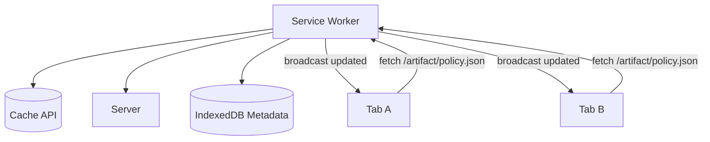
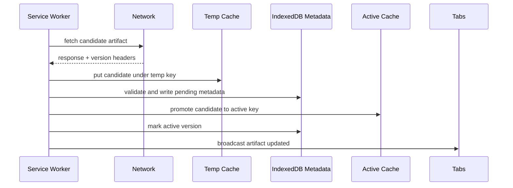
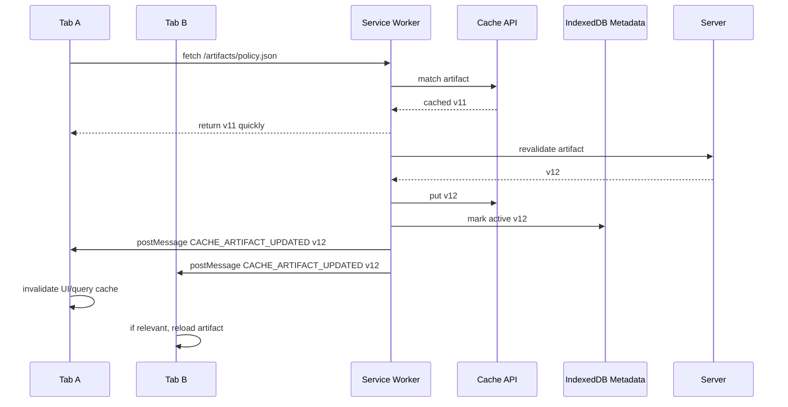

# Part 034 — Cache Consistency Across Tabs

Cache inconsistency is one of the fastest ways to make a frontend feel haunted.

The user opens two tabs. One tab sees policy dictionary v12. Another tab sees v11. One tab submits a form using old validation metadata. Another tab shows a new status enum. A Service Worker cache returns an old shell while API requests return new data. The user refreshes and gets a mix of old JavaScript, new HTML, and stale cached JSON.

This part is about preventing that class of bugs.

We are not discussing generic "cache for speed" here. We are discussing **cache as replicated state** inside the browser.

Target mental model:

> Every browser cache entry is a versioned artifact with ownership, invalidation semantics, and compatibility constraints. If you do not define those semantics, the browser will still cache things, but your users will debug the ambiguity.

---

## 1. Cache Consistency Problem

Service Worker can intercept requests and respond from cache.

That creates power and risk:



The hard part is not "can we store a response?". The hard part is deciding:

- which version is valid?
- which tabs may consume it?
- when should stale data be allowed?
- when must stale data be rejected?
- how do tabs know a cache changed?
- how do we avoid old tab + new artifact incompatibility?
- how do we update cache atomically?
- what happens if update fails halfway?
- what happens if multiple tabs trigger revalidation?

---

## 2. Cache API Is a Store, Not a Consistency Protocol

The Cache API gives primitives:

- open cache by name,
- match request,
- put response,
- delete entry,
- enumerate keys,
- delete cache.

It does not give:

- schema migration,
- transactional multi-entry update,
- dependency graph,
- cache version compatibility,
- cache invalidation protocol,
- cross-tab update notification,
- single-flight revalidation,
- rollback semantics,
- stale data policy,
- server freshness proof.

So you must build those explicitly.

---

## 3. Classes of Cached Things

Not all cache entries deserve the same policy.

| Cache class | Example | Consistency requirement | Typical strategy |
|---|---|---|---|
| app shell | JS/CSS/static HTML | version compatible as a bundle | precache by build revision |
| immutable asset | hashed JS, image | never changes at same URL | cache forever with hash URL |
| reference data | status enum, policy dictionary | bounded staleness, version-aware | stale-while-revalidate + broadcast |
| user data | case detail, profile | often needs freshness | network-first or query cache, not blind SW cache |
| mutation result | POST response | must be durable/idempotent | outbox + server reconciliation |
| offline artifact | uploaded evidence draft | must not be lost | IndexedDB/OPFS, not only Cache API |
| feature config | flags, rollout config | short TTL, version-sensitive | network-first with fallback |

Anti-pattern:

> Put every `GET` response into Cache API and hope invalidation solves itself.

That is not caching. That is accumulating stale state.

---

## 4. Consistency Levels for Browser Cache

Define consistency in terms users and product can tolerate.

### 4.1 Strong-ish Freshness

The app should not use cached data if network is available and data may affect correctness.

Example:

- permission decision,
- payment state,
- enforcement action status,
- compliance deadline,
- legal/regulatory requirement.

Strategy:

- network-first,
- short timeout fallback only if safe,
- visible stale indicator,
- server version check,
- no silent stale mutation.

### 4.2 Bounded Staleness

Cached data may be stale for a defined window.

Example:

- reference dictionary,
- dashboard summary,
- feature metadata,
- document template list.

Strategy:

- stale-while-revalidate,
- max age,
- background refresh,
- broadcast update.

### 4.3 Eventual Consistency

UI can catch up later.

Example:

- notification count,
- recent activity feed,
- non-critical recommendations.

Strategy:

- cache-first or stale-while-revalidate,
- pull-to-refresh,
- broadcast best-effort.

### 4.4 Immutable Consistency

At a hashed URL, content should never change.

Example:

- `/assets/app.abc123.js`,
- `/assets/logo.f00d.png`.

Strategy:

- long cache lifetime,
- no invalidation needed,
- update by URL revision.

---

## 5. Versioned Cache Naming

Use explicit cache names.

```ts
const BUILD_ID = '__BUILD_ID__';
const APP_SHELL_CACHE = `app-shell:${BUILD_ID}`;
const STATIC_CACHE = `static:${BUILD_ID}`;
const REFERENCE_DATA_CACHE = 'reference-data';
const API_CACHE = 'api-cache:v1';
```

Do not use one global cache for everything.

Bad:

```ts
const CACHE_NAME = 'cache-v1';
```

Better:

```ts
const cachesByClass = {
  appShell: `app-shell:${BUILD_ID}`,
  static: `static:${BUILD_ID}`,
  referenceData: 'reference-data:v3',
  runtimeApi: 'runtime-api:v2',
};
```

Why separate caches?

- different cleanup policy,
- different invalidation policy,
- easier observability,
- safer migration,
- easier rollback,
- smaller blast radius.

---

## 6. Artifact Metadata Store

Cache API stores responses. It does not store enough metadata for consistency decisions.

Use IndexedDB for metadata:

```ts
type CachedArtifactMeta = {
  key: string;
  url: string;
  cacheName: string;
  artifactType: 'app-shell' | 'reference-data' | 'api-response';
  version: string;
  etag?: string;
  lastModified?: string;
  storedAt: number;
  expiresAt?: number;
  buildCompatibility?: {
    minBuildId?: string;
    maxBuildId?: string;
  };
  integrity?: {
    sha256?: string;
  };
};
```

Cache entry without metadata is a blob. Cache entry with metadata is an artifact.

---

## 7. Atomic-ish Cache Update Pattern

Cache API does not provide database-style transactions across cache writes and IndexedDB metadata. But you can design an atomic-ish two-phase update.

Naive update:

```ts
const cache = await caches.open('reference-data');
await cache.put('/policy.json', response);
```

Problem:

- cache changed but metadata not changed,
- metadata changed but cache not changed,
- clients read during update,
- partially downloaded response cached,
- old and new artifact mixed.

Safer pattern:



Implementation sketch:

```ts
async function updateReferenceArtifact(params: {
  url: string;
  key: string;
  expectedType: 'application/json';
}) {
  const response = await fetch(params.url, {
    cache: 'no-store',
    headers: {
      Accept: params.expectedType,
    },
  });

  if (!response.ok) {
    throw new Error(`Artifact fetch failed: ${response.status}`);
  }

  const version = response.headers.get('ETag') ?? response.headers.get('Last-Modified') ?? crypto.randomUUID();
  const tempKey = `${params.key}::pending::${version}`;

  const tempCache = await caches.open('reference-data:pending');
  await tempCache.put(tempKey, response.clone());

  await artifactMetaStore.put({
    key: tempKey,
    url: params.url,
    cacheName: 'reference-data:pending',
    artifactType: 'reference-data',
    version,
    storedAt: Date.now(),
  });

  await validateCachedJson(tempCache, tempKey);

  const activeCache = await caches.open('reference-data:v3');
  const candidate = await tempCache.match(tempKey);
  if (!candidate) throw new Error('Pending artifact disappeared');

  await activeCache.put(params.key, candidate.clone());

  await artifactMetaStore.put({
    key: params.key,
    url: params.url,
    cacheName: 'reference-data:v3',
    artifactType: 'reference-data',
    version,
    storedAt: Date.now(),
    expiresAt: Date.now() + 60 * 60_000,
  });

  await tempCache.delete(tempKey);

  await emitSwEvent({
    type: 'CACHE_ARTIFACT_UPDATED',
    topic: 'reference-data',
    dedupeKey: `reference-data:${params.key}:${version}`,
    expiresInMs: 60_000,
    payload: {
      key: params.key,
      version,
    },
  });
}
```

This is not fully transactional, but it provides:

- candidate isolation,
- validation before promotion,
- metadata update,
- explicit broadcast after promotion,
- cleanup path.

---

## 8. Stale-While-Revalidate Correctly

Stale-while-revalidate means:

1. serve cached response quickly if available,
2. revalidate in background,
3. update cache if network has newer artifact,
4. notify clients.

Bad version:

```ts
return cached || fetch(request);
```

That is cache-first, not stale-while-revalidate.

Better:

```ts
async function staleWhileRevalidate(request: Request, options: {
  cacheName: string;
  artifactKey: string;
  topic: string;
}) {
  const cache = await caches.open(options.cacheName);
  const cached = await cache.match(request);

  const revalidatePromise = revalidateAndBroadcast(request, options).catch(error => {
    console.warn('background revalidation failed', error);
  });

  // Keep Service Worker alive long enough for background task.
  // In a fetch event, call event.waitUntil(revalidatePromise).

  if (cached) {
    return {
      response: cached,
      background: revalidatePromise,
    };
  }

  const network = await fetch(request);
  if (network.ok) {
    await cache.put(request, network.clone());
  }
  return {
    response: network,
    background: Promise.resolve(),
  };
}
```

In fetch handler:

```ts
self.addEventListener('fetch', event => {
  const request = event.request;

  if (isReferenceDataRequest(request)) {
    event.respondWith((async () => {
      const result = await staleWhileRevalidate(request, {
        cacheName: 'reference-data:v3',
        artifactKey: new URL(request.url).pathname,
        topic: 'reference-data',
      });

      event.waitUntil(result.background);
      return result.response;
    })());
  }
});
```

Key subtlety:

`respondWith()` determines response. `waitUntil()` extends lifetime for side effects. Mixing these without discipline creates hard-to-debug behavior.

---

## 9. Single-Flight Revalidation

If five tabs request the same artifact, the Service Worker should not send five network revalidations.

Use an in-memory single-flight map:

```ts
const inFlightRevalidations = new Map<string, Promise<void>>();

function singleFlightRevalidate(key: string, fn: () => Promise<void>): Promise<void> {
  const existing = inFlightRevalidations.get(key);
  if (existing) return existing;

  const promise = fn().finally(() => {
    inFlightRevalidations.delete(key);
  });

  inFlightRevalidations.set(key, promise);
  return promise;
}
```

Usage:

```ts
async function revalidateAndBroadcast(request: Request, options: {
  cacheName: string;
  artifactKey: string;
  topic: string;
}) {
  return singleFlightRevalidate(options.artifactKey, async () => {
    const response = await fetch(request, { cache: 'no-store' });
    if (!response.ok) return;

    const version = response.headers.get('ETag') ?? response.headers.get('Last-Modified');
    const current = await artifactMetaStore.get(options.artifactKey);

    if (current?.version && version && current.version === version) {
      return;
    }

    const cache = await caches.open(options.cacheName);
    await cache.put(request, response.clone());

    await artifactMetaStore.put({
      key: options.artifactKey,
      url: request.url,
      cacheName: options.cacheName,
      artifactType: 'reference-data',
      version: version ?? crypto.randomUUID(),
      storedAt: Date.now(),
    });

    await emitSwEvent({
      type: 'CACHE_ARTIFACT_UPDATED',
      topic: options.topic,
      dedupeKey: `${options.artifactKey}:${version}`,
      payload: {
        key: options.artifactKey,
        version,
      },
      expiresInMs: 60_000,
    });
  });
}
```

Caveat:

Service Worker memory is not durable. If the Service Worker restarts, the in-flight map is lost. That is acceptable for optimization. Correctness must come from metadata/version checks.

---

## 10. Cache Version Compatibility

A cached artifact can be fresh but incompatible.

Example:

- App v41 expects status enum field `code`.
- App v42 expects field `id`.
- Service Worker updates dictionary to v42 while old tab still runs v41.

Fresh does not mean safe.

Add compatibility metadata:

```json
{
  "artifact": "policy-dictionary",
  "artifactVersion": "2026.07.08",
  "schemaVersion": 3,
  "compatibleAppRange": {
    "min": "42.0.0",
    "max": "42.x"
  }
}
```

Client validates before consuming:

```ts
function assertArtifactCompatible(meta: CachedArtifactMeta, appVersion: string) {
  const range = meta.buildCompatibility;
  if (!range) return;

  if (range.minBuildId && appVersion < range.minBuildId) {
    throw new Error('Cached artifact requires newer app version');
  }

  if (range.maxBuildId && appVersion > range.maxBuildId) {
    throw new Error('Cached artifact is too old for this app version');
  }
}
```

Better yet: compatibility should be based on schema version/capability, not lexicographic string comparison. The example shows the guard shape, not a full semver implementation.

---

## 11. App Shell Consistency

App shell has a special rule:

> HTML, JS, CSS, and static assets must be treated as a coherent release unit.

Worst failure mode:

- HTML from build 43,
- JS from build 42,
- CSS from build 41,
- Service Worker from build 44.

Mitigations:

1. Use hashed asset URLs.
2. Avoid long-caching unversioned HTML.
3. Precache asset manifest by build revision.
4. Keep old app shell cache until no old tabs need it.
5. Do not delete all old caches immediately if active clients might still request old chunks.
6. Use update banner + safe reload.
7. Avoid aggressive `skipWaiting()` unless you understand the impact.

Cache cleanup should be conservative:

```ts
async function cleanupOldAppShellCaches(activeBuildId: string) {
  const names = await caches.keys();
  const appShellCaches = names.filter(name => name.startsWith('app-shell:'));

  for (const name of appShellCaches) {
    if (name === `app-shell:${activeBuildId}`) continue;

    // In production, consider keeping N previous builds or delaying cleanup.
    await caches.delete(name);
  }
}
```

For enterprise apps, keeping a small number of previous build caches can reduce broken chunk loads during rolling deploys.

---

## 12. API Response Cache Rules

Be careful caching API responses in Service Worker.

Usually better:

- app-level query cache for active UI state,
- HTTP cache headers for browser-managed caching,
- Service Worker cache only for specific offline/reference cases.

If you cache API responses in Service Worker, define:

```ts
type ApiCachePolicy = {
  match: (request: Request) => boolean;
  consistency: 'network-first' | 'stale-while-revalidate' | 'cache-first';
  maxAgeMs: number;
  allowOfflineFallback: boolean;
  cacheKey: (request: Request) => string;
  varyBy: Array<'authorization' | 'tenant' | 'locale' | 'role' | 'feature-set'>;
};
```

Never ignore `Authorization`, tenant, role, or locale dimensions.

Bad:

```ts
await cache.put('/api/cases/123', response);
```

Better:

```ts
const key = buildApiCacheKey(request, {
  tenantId,
  userId,
  roleHash,
  locale,
});
```

But ask first: should this response be cached by Service Worker at all?

---

## 13. Invalidation Models

There are several invalidation strategies.

### 13.1 Time-Based Expiry

```ts
if (Date.now() > meta.expiresAt) {
  return fetchFresh();
}
```

Simple, but can serve stale data until expiry.

### 13.2 Version-Based Invalidation

Server provides ETag, version, revision, or manifest.

```ts
if (serverVersion !== localVersion) {
  await updateArtifact();
}
```

Good for reference artifacts and build manifests.

### 13.3 Event-Based Invalidation

Server push, WebSocket, SSE, or Service Worker event tells app to invalidate.

Good for active sessions, but volatile unless paired with durable state.

### 13.4 Dependency-Based Invalidation

Artifact A depends on B.

Example:

- form schema depends on policy dictionary,
- validation rules depend on feature config,
- case view model depends on user permissions.

Represent dependency explicitly:

```ts
type ArtifactDependency = {
  artifact: string;
  dependsOn: string[];
};
```

Then invalidate transitive dependents.

---

## 14. Cache Manifest Pattern

A manifest gives one source of truth for artifact versions.

```json
{
  "buildId": "2026.07.08.4",
  "artifacts": {
    "policy-dictionary": {
      "url": "/artifacts/policy-dictionary.json",
      "version": "pd-8842",
      "schemaVersion": 3,
      "maxAgeSeconds": 3600
    },
    "form-schema-case": {
      "url": "/artifacts/forms/case.schema.json",
      "version": "fs-1931",
      "schemaVersion": 7,
      "dependsOn": ["policy-dictionary"]
    }
  }
}
```

Service Worker fetches manifest:

```ts
async function refreshArtifactManifest() {
  const response = await fetch('/artifact-manifest.json', { cache: 'no-store' });
  if (!response.ok) return;

  const manifest = await response.clone().json();
  const current = await artifactMetaStore.getManifest();

  if (current?.buildId === manifest.buildId) return;

  await artifactMetaStore.putManifest(manifest);

  await emitSwEvent({
    type: 'CACHE_ARTIFACT_UPDATED',
    topic: 'artifact-manifest',
    dedupeKey: `manifest:${manifest.buildId}`,
    payload: {
      buildId: manifest.buildId,
      changedArtifacts: diffArtifacts(current, manifest),
    },
    durable: true,
    expiresInMs: 24 * 60 * 60_000,
  });
}
```

This shifts consistency from random per-request checks to a controlled artifact graph.

---

## 15. Multi-Tab Cache Update Flow



This flow intentionally separates:

- response path,
- background update path,
- metadata path,
- notification path,
- UI reconciliation path.

---

## 16. Avoiding Cache Stampede Across Tabs

Without coordination:

- every tab detects stale artifact,
- every tab sends fetch,
- every tab writes cache,
- every tab broadcasts update.

Mitigations:

1. Service Worker centralizes fetch handling.
2. In-memory single-flight map dedupes concurrent revalidations.
3. Metadata version check prevents redundant writes.
4. Web Locks can coordinate cross-context work outside Service Worker if needed.
5. Broadcast dedupe suppresses duplicate UI.

Service Worker single-flight is usually enough for fetch events controlled by the SW.

For work outside Service Worker, use Web Locks:

```ts
await navigator.locks.request('reference-data-refresh', { ifAvailable: true }, async lock => {
  if (!lock) return;
  await refreshReferenceData();
});
```

---

## 17. Handling Corrupted or Invalid Cached Responses

Caches can contain bad data due to:

- partial logic bug,
- old schema,
- server bug,
- wrong content type,
- poisoned response from previous deployment,
- failed migration.

Validate before promotion and before consumption.

```ts
async function validateCachedJson(cache: Cache, key: string) {
  const response = await cache.match(key);
  if (!response) throw new Error('missing cached response');

  const contentType = response.headers.get('content-type') ?? '';
  if (!contentType.includes('application/json')) {
    throw new Error(`unexpected content type: ${contentType}`);
  }

  const data = await response.clone().json();

  if (!data || typeof data !== 'object') {
    throw new Error('invalid JSON artifact');
  }

  return data;
}
```

On validation failure:

- delete candidate,
- keep current active version,
- record telemetry,
- maybe mark artifact unhealthy,
- avoid broadcasting update.

---

## 18. Rollback Model

A new cache entry may be bad.

Rollback is possible only if old cache state still exists.

Rules:

1. Do not delete old version before new version is validated.
2. Keep previous version metadata.
3. Make clients capable of falling back.
4. Broadcast rollback event if active version changes back.
5. Do not assume reload fixes corrupted cache.

Metadata with previous pointer:

```ts
type ActiveArtifactPointer = {
  key: string;
  activeVersion: string;
  previousVersion?: string;
  updatedAt: number;
};
```

Rollback:

```ts
async function rollbackArtifact(key: string) {
  const pointer = await artifactMetaStore.getPointer(key);
  if (!pointer?.previousVersion) return false;

  await artifactMetaStore.setActiveVersion(key, pointer.previousVersion);

  await emitSwEvent({
    type: 'CACHE_ARTIFACT_UPDATED',
    topic: 'reference-data',
    dedupeKey: `rollback:${key}:${pointer.previousVersion}`,
    payload: {
      key,
      version: pointer.previousVersion,
      reason: 'rollback',
    },
    durable: true,
  });

  return true;
}
```

---

## 19. Deleting Old Caches Safely

Cache cleanup is dangerous if old tabs still use old bundles.

Bad activate handler:

```ts
self.addEventListener('activate', event => {
  event.waitUntil(
    caches.keys().then(names => Promise.all(names.map(name => caches.delete(name))))
  );
});
```

This deletes everything. It can break currently open tabs.

Safer:

```ts
async function cleanupCaches() {
  const allowed = new Set([
    `app-shell:${BUILD_ID}`,
    `static:${BUILD_ID}`,
    'reference-data:v3',
    'runtime-api:v2',
  ]);

  const names = await caches.keys();

  for (const name of names) {
    if (allowed.has(name)) continue;

    if (name.startsWith('app-shell:')) {
      // Optional: keep previous N builds.
      if (await shouldRetainPreviousBuildCache(name)) continue;
    }

    await caches.delete(name);
  }
}
```

Cleanup policy should be release-aware, not impulsive.

---

## 20. Service Worker Update + Cache Consistency

Service Worker update can break cache consistency if lifecycle is rushed.

Danger scenario:

1. new SW installs,
2. calls `skipWaiting()`,
3. claims old clients,
4. deletes old caches,
5. old tabs still run old JS and request old chunks,
6. old chunks missing,
7. app crashes.

Safer approach:

- install new caches,
- announce update available,
- wait for user-safe reload,
- claim clients after controlled transition,
- keep old build caches for grace period,
- only delete old caches after no clients or after retention policy.

For mission-critical workflows, user-safe reload matters more than instant update.

---

## 21. Cache and Authorization Boundary

Never let Service Worker cache sensitive user/tenant data without a clear partition key.

Questions:

- Is response user-specific?
- Is response tenant-specific?
- Is response role-specific?
- Is response permission-specific?
- Can another user on same browser session see it?
- Should it be cleared on logout?
- Should it be encrypted or not stored at all?

Logout cleanup:

```ts
async function clearSessionScopedCaches() {
  const sessionCaches = [
    'runtime-api:v2',
    'user-artifacts:v1',
  ];

  await Promise.all(sessionCaches.map(name => caches.delete(name)));
  await artifactMetaStore.clearSessionScoped();

  await emitSwEvent({
    type: 'SESSION_REVOKED',
    topic: 'session',
    dedupeKey: 'session-cleared',
    payload: {
      state: 'session-cache-cleared',
    },
    durable: true,
  });
}
```

Reference data may survive logout. User-specific data usually should not.

---

## 22. Observability

Record cache behavior as events.

Metrics:

- cache hit count,
- cache miss count,
- stale response served count,
- revalidation started/completed/failed,
- artifact version changed,
- cache write failure,
- validation failure,
- broadcast sent/skipped,
- client ACK count,
- cache cleanup count,
- storage quota failure.

Debug endpoint for local development:

```ts
self.addEventListener('message', async event => {
  const msg = event.data;
  if (msg?.type !== 'DEBUG_CACHE_STATE') return;

  const port = event.ports?.[0];
  if (!port) return;

  const cacheNames = await caches.keys();
  const artifacts = await artifactMetaStore.listAll();

  port.postMessage({
    cacheNames,
    artifacts,
  });
});
```

Production observability can sample and send diagnostics after user consent/policy alignment.

---

## 23. Testing Strategy

Minimum tests:

1. cache hit returns response,
2. cache miss fetches network and stores response,
3. stale response triggers background revalidation,
4. new version updates cache and metadata,
5. duplicate revalidation is single-flighted,
6. failed revalidation keeps old artifact,
7. invalid candidate is not promoted,
8. update broadcast sent only after promotion,
9. old app version ignores incompatible artifact,
10. logout clears session-scoped caches,
11. old app shell cache retained during active old tab,
12. rollback restores previous active version,
13. no-client update stores durable marker,
14. tab startup reconciles missed marker.

Chaos tests:

- kill Service Worker during pending update,
- close all tabs during revalidation,
- open old and new app versions together,
- simulate quota exceeded,
- simulate invalid JSON artifact,
- simulate slow network and repeated tab reloads,
- simulate server returning same ETag with different body,
- simulate delete cache during active request.

---

## 24. Production Checklist

Before caching with Service Worker:

- Is this cache entry immutable, bounded stale, or correctness-critical?
- Does it have a version?
- Does it have metadata?
- Is it compatible with current app build?
- Is update atomic-ish?
- Is validation done before promotion?
- Is stale usage visible when needed?
- Is revalidation single-flighted?
- Is update broadcast deduped?
- Can clients recover by pulling state?
- Are old caches retained long enough?
- Are session-scoped caches cleared on logout?
- Is quota failure handled?
- Is cache behavior observable?

---

## 25. Key Takeaways

Cache consistency across tabs is not solved by Cache API alone.

A strong design has:

1. separate caches by artifact class,
2. explicit cache metadata,
3. versioned artifacts,
4. compatibility checks,
5. atomic-ish promotion,
6. stale-while-revalidate with `waitUntil`,
7. single-flight revalidation,
8. broadcast after promotion,
9. durable marker for important events,
10. conservative cleanup,
11. session-aware cache partitioning,
12. pull-based reconciliation.

The simplest reliable rule:

> Cache data for speed, but design cache state like a replicated datastore.

---

## References

- MDN — Cache API / CacheStorage
- MDN — Using Service Workers
- MDN — `FetchEvent.respondWith()`
- MDN — `ExtendableEvent.waitUntil()`
- web.dev — The Service Worker Lifecycle
- Chrome Developers — Service Worker lifecycle and Workbox cache management
