# Part 035 — BroadcastChannel vs SharedWorker vs Service Worker vs Storage Event

Most broken browser orchestration systems are broken before the first line of implementation.

The failure usually starts with a bad primitive choice:

- using `BroadcastChannel` as if it were durable storage,
- using `localStorage` as if it were a low-latency event bus,
- using Service Worker as if it were a long-running application daemon,
- using SharedWorker as if support, lifecycle, deployment, and reload semantics were trivial,
- using Web Locks as if a lock itself stored business state,
- using IndexedDB as if writes automatically notified all open tabs.

This part is a practical decision matrix.

The goal is not to crown one API as best. The goal is to choose the smallest primitive that satisfies the required semantics.

> Do not select a browser coordination primitive by feature popularity. Select it by failure semantics.

---

## 1. The Real Question

When choosing a hub or channel, you are not asking:

> “Which API can send a message?”

You are asking:

> “Which primitive gives me the correct reach, lifecycle, ordering, durability, ownership, recovery, and performance profile for this coordination problem?”

A transport that can send a message is not necessarily a transport that can coordinate a system.

For example:

| Requirement | Wrong Question | Better Question |
|---|---|---|
| Logout all tabs | Can I broadcast? | Can every sensitive context clear state even if the message is missed? |
| Refresh token once | Can tabs talk? | Can only one tab own refresh at a time, and can losers recover? |
| Cache update notification | Can Service Worker message clients? | Can clients verify version and reject stale updates? |
| Large payload sharing | Can I post a big object? | Where should the bytes live, and what signal references them? |
| Background sync | Can one tab do it? | What happens if the owner tab freezes or closes? |
| Presence | Can tabs announce themselves? | How do we expire dead tabs without relying on unload? |

The primitive is only one part of the design. The protocol matters more.

---

## 2. Primitive Map

The browser gives several coordination primitives. They overlap, but not cleanly.

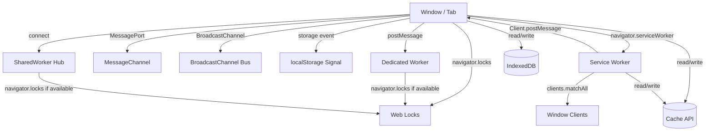

A useful classification:

| Primitive | Category | Durable? | Direction | Good For |
|---|---|---:|---|---|
| `postMessage` | direct message | No | one-to-one | window-worker or iframe communication |
| `MessageChannel` / `MessagePort` | explicit pipe | No | one-to-one / routed | private RPC, request-response |
| `BroadcastChannel` | volatile bus | No | many-to-many | same-origin fanout signals |
| `storage` event | legacy signal | Indirectly via storage | many-context signal | fallback logout/invalidation |
| SharedWorker | live hub | No | many-to-one-to-many | same-origin connection registry and routing |
| Service Worker | network/cache coordinator | Not itself | service-worker-client | request interception, cache, offline, updates |
| Web Locks | mutual exclusion | No | coordination primitive | single owner for shared work/resource |
| IndexedDB | durable state store | Yes | read/write | source of truth, queue, registry snapshot |
| Cache API | durable artifact store | Yes | read/write | versioned response artifacts |
| OPFS | durable file-like store | Yes | read/write | large local byte storage |

The common mistake is treating category boundaries as interchangeable.

A bus is not a database. A lock is not a queue. A worker is not automatically a coordinator. A cache is not automatically consistent.

---

## 3. The Decision Axes

Before picking an API, score the requirement across these axes.

### 3.1 Reach

Who needs to communicate?

| Reach Needed | Candidate |
|---|---|
| page to its own dedicated worker | `Worker.postMessage` |
| page to iframe/window it owns | `window.postMessage` with strict origin policy |
| one explicit peer pipe | `MessageChannel` |
| all same-origin tabs/workers | `BroadcastChannel` |
| all same-origin tabs with older fallback behavior | `storage` event |
| all connected same-origin clients through one live hub | SharedWorker |
| Service Worker to controlled/uncontrolled clients | `clients.matchAll()` + `Client.postMessage()` |
| mutual exclusion across same-origin contexts | Web Locks |
| persistence across reload/close | IndexedDB / Cache API / OPFS |

Reach is not just “can it reach all tabs?”.

Reach also includes:

- same-origin constraints,
- storage partitioning constraints,
- iframe nesting,
- private/incognito behavior,
- controlled vs uncontrolled Service Worker clients,
- build URL identity for workers,
- tab lifecycle state.

A message that theoretically reaches a context may still be ignored, delayed, dropped, or processed after the state is already obsolete.

---

### 3.2 Durability

Can the information survive after all tabs are closed?

| Need | Use |
|---|---|
| ephemeral signal | BroadcastChannel / MessagePort / Client.postMessage |
| current live registry | SharedWorker memory + heartbeat fallback |
| recoverable state | IndexedDB/localStorage snapshot |
| recoverable queue | IndexedDB |
| recoverable artifact | Cache API / OPFS |
| recoverable ownership | Web Locks + durable fencing metadata |

Broadcasting a message is not durability.

If a tab was frozen, not yet loaded, or not listening, it may miss the signal. For critical semantics, broadcast should usually mean:

> “A hint that durable state changed.”

Not:

> “The state itself.”

Good pattern:

```ts
channel.postMessage({
  type: "CACHE_INVALIDATED",
  cacheVersion: "artifact:v42",
  manifestKey: "app-cache-manifest"
});
```

The receiver then reads the authoritative manifest from IndexedDB or Cache metadata.

Bad pattern:

```ts
channel.postMessage({
  type: "FULL_APP_STATE_REPLACEMENT",
  state: hugeMutableObject
});
```

That turns a volatile bus into a fragile replication protocol.

---

### 3.3 Ownership

Does the task require exactly one active owner?

Examples:

- refresh token once,
- flush offline queue once,
- run background sync once,
- migrate IndexedDB once,
- warm cache once,
- own a websocket connection once,
- show a notification once.

For single-owner semantics, a plain broadcast is not enough.

You need one of these:

1. Web Lock ownership,
2. SharedWorker central ownership,
3. Service Worker event ownership,
4. durable lease with fencing token,
5. server-side idempotency/lease.

In serious systems, use at least two layers:

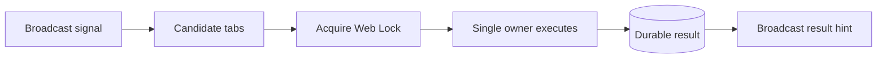

The signal wakes candidates. The lock chooses the owner. Durable state stores the result. Broadcast announces that receivers should re-read.

---

### 3.4 Lifecycle Stability

Some contexts are less stable than they look.

| Context | Lifecycle Reality |
|---|---|
| Window/tab | may hide, freeze, close, crash, navigate, enter bfcache |
| Dedicated Worker | owned by creator; dies with owner or on explicit termination |
| SharedWorker | live while clients are connected; can disappear when no clients remain |
| Service Worker | event-driven; can be stopped and restarted by browser |
| BroadcastChannel | only useful while listener exists |
| localStorage event | depends on write and listener contexts; not for high-frequency traffic |
| Web Lock | held only while callback is active and context remains alive |

Do not design as if any browser context is a server process.

The closest thing to a browser-side daemon is Service Worker, but even Service Worker is event-driven and lifecycle-managed by the browser. It is not an always-on background thread.

---

### 3.5 Payload Shape

Payload determines primitive choice more often than people admit.

| Payload | Prefer |
|---|---|
| small control event | BroadcastChannel / MessagePort |
| request-response command | MessageChannel / SharedWorker route |
| large binary payload | Transferable ArrayBuffer through Worker/MessagePort |
| large shared artifact | Cache API / OPFS / IndexedDB + signal |
| frequent progress events | throttled MessagePort |
| secret/session marker | durable storage cleanup + minimal signal, never broad secret payload |

The high-level rule:

> Send intent over channels. Store large or durable data elsewhere.

---

## 4. Primitive-by-Primitive Analysis

## 4.1 Direct `postMessage`

Direct `postMessage` is the simplest coordination primitive.

Use it when communication topology is naturally one-to-one:

- page ↔ dedicated worker,
- page ↔ iframe,
- opener ↔ opened window,
- Service Worker object ↔ Service Worker global scope,
- client ↔ known `MessagePort`.

Strengths:

- low conceptual overhead,
- good for request-response,
- can transfer ownership of transferables,
- explicit sender and receiver,
- easy to type with protocol envelope.

Weaknesses:

- not a broadcast mechanism by itself,
- no persistence,
- no built-in retry/ACK/timeout,
- no global registry,
- easy to confuse origin trust with object reference trust.

Use direct `postMessage` when you have a clear peer and you can model the pair as a client/server boundary.

Bad use:

```ts
// Do not invent a mesh of windows manually unless you really need it.
for (const windowRef of everyWindowWeSomehowKnow) {
  windowRef.postMessage(message, origin);
}
```

At that point, you probably need a hub or broadcast bus.

---

## 4.2 MessageChannel / MessagePort

`MessageChannel` gives you two entangled `MessagePort`s. It is the browser equivalent of creating a private pipe.

Use it when you need:

- a private RPC channel,
- explicit ownership of a connection,
- request-response semantics,
- backpressure per peer,
- a port transferred through another channel,
- Service Worker client reply channel,
- SharedWorker routed client connection.

```ts
const channel = new MessageChannel();

navigator.serviceWorker.controller?.postMessage(
  { type: "GET_CACHE_STATUS" },
  [channel.port2]
);

channel.port1.onmessage = (event) => {
  console.log("reply", event.data);
};
```

Strengths:

- explicit connection object,
- supports transferables,
- good fit for RPC,
- easy to close,
- can isolate traffic per request or per client.

Weaknesses:

- no global discovery,
- no durability,
- no persistence after peer death,
- lifecycle must be managed.

Mental model:

> MessagePort is a connection, not a system.

You still need:

- handshake,
- heartbeat if long-lived,
- timeout,
- close semantics,
- version negotiation,
- error handling,
- bounded in-flight requests.

---

## 4.3 BroadcastChannel

`BroadcastChannel` is often the best first primitive for same-origin fanout signals.

Use it for:

- logout notification,
- token refresh result hint,
- cache invalidation hint,
- tab presence heartbeat,
- leader heartbeat signal,
- route/activity awareness,
- UI suppression signal,
- “state changed, re-read source of truth” event.

Good BroadcastChannel message:

```ts
{
  type: "AUTH_SESSION_REVOKED",
  sessionVersion: 42,
  reason: "server-revoked",
  issuedAt: 1783512000000
}
```

Bad BroadcastChannel message:

```ts
{
  type: "AUTH_SECRET_SYNC",
  accessToken: "...",
  refreshToken: "..."
}
```

Strengths:

- simple many-to-many fanout,
- no central worker required,
- available in workers,
- good for volatile control messages,
- low ceremony.

Weaknesses:

- no durable delivery,
- no delivery to tabs not listening,
- not a lock,
- not a store,
- can flood contexts,
- structured clone cost still applies,
- receivers need idempotency and stale guards.

BroadcastChannel should usually be paired with durable state for critical operations.

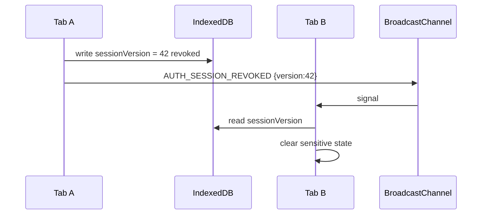

The broadcast is a wake-up signal. IndexedDB/localStorage/session metadata is the source of truth.

---

## 4.4 `storage` Event

The `storage` event is a legacy cross-tab signaling tool.

It fires in other browsing contexts when storage changes. For `localStorage`, that means other same-origin browsing contexts. The writing context does not receive its own event.

Use it when:

- you need a fallback where BroadcastChannel is unavailable,
- you need coarse logout propagation,
- you need a low-frequency invalidation signal,
- you already have a localStorage compatibility layer.

Do not use it for:

- high-frequency heartbeats,
- large payloads,
- binary data,
- reliable queue semantics,
- fast RPC,
- lock-like ownership,
- frequent state replication.

A reasonable fallback bus:

```ts
const KEY = "app:cross-tab-signal";

export function publishStorageSignal(message: unknown) {
  localStorage.setItem(KEY, JSON.stringify({
    id: crypto.randomUUID(),
    at: Date.now(),
    message
  }));
}

window.addEventListener("storage", (event) => {
  if (event.key !== KEY || !event.newValue) return;

  const signal = JSON.parse(event.newValue);
  handleSignal(signal.message);
});
```

Design caveat:

- writes are synchronous,
- payload is string only,
- storage may be unavailable or quota-limited,
- event delivery is not a substitute for durable state semantics,
- listeners must reject stale/duplicate messages.

Treat it as:

> last-resort low-frequency signal bus.

---

## 4.5 SharedWorker

SharedWorker gives you a live, same-origin hub.

Use it when you need:

- connected client registry,
- per-client ports,
- explicit routing,
- central subscription index,
- one in-memory coordinator while clients exist,
- multiplexed request-response,
- one websocket per browser profile/session,
- central throttling/debouncing,
- shared computation service across tabs.

Strengths:

- real hub topology,
- direct per-client routing,
- better than raw BroadcastChannel for RPC-like coordination,
- can maintain live in-memory indexes,
- can track connected clients via ports.

Weaknesses:

- same-origin constraints,
- support/deployment considerations,
- worker URL/name identity problems,
- no durability after all clients disconnect,
- lifecycle depends on connected clients,
- not a network proxy,
- not available in every embedded/browser environment.

SharedWorker is great when your problem is live connection coordination.

It is weak when your problem is offline durability or network interception.

A good SharedWorker hub use case:

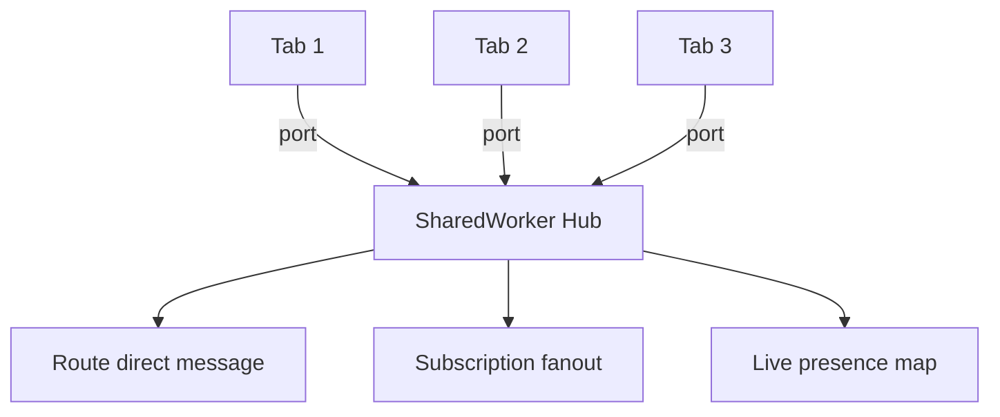

But if every tab closes, the hub’s in-memory state is gone. Anything important must be persisted elsewhere.

---

## 4.6 Service Worker

Service Worker is not a general application coordinator.

It is best understood as:

> an event-driven network/cache/update coordinator with client messaging ability.

Use it for:

- fetch interception,
- offline shell,
- Cache API strategies,
- asset versioning,
- background sync-related boundaries where supported,
- push/notification flows,
- app update notifications,
- network request policy,
- client broadcast about cache/update events.

Do not use it for:

- storing volatile UI state,
- long-running CPU compute,
- reliable always-on background loops,
- high-frequency tab heartbeat processing,
- secrets synchronization,
- app-wide singleton that must always be alive.

Service Worker messaging is powerful when paired with client verification:

```ts
const clients = await self.clients.matchAll({
  type: "window",
  includeUncontrolled: true
});

for (const client of clients) {
  client.postMessage({
    type: "APP_UPDATE_READY",
    appVersion: "2026.07.08-1"
  });
}
```

But a client should not blindly trust the message. It should verify:

- does this version apply to this client?
- is this client controlled by the expected worker?
- has the user reached a safe reload point?
- has this message already been processed?
- is the update compatible with current IndexedDB schema?

---

## 4.7 Web Locks

Web Locks is not a message bus. It is a mutual-exclusion primitive.

Use it when you need same-origin scripts in tabs/workers to coordinate access to a resource.

Examples:

- only one tab refreshes token,
- only one tab flushes offline queue,
- only one tab migrates local database,
- only one tab writes a shared snapshot,
- only one tab owns a websocket connection,
- only one worker compacts local logs.

```ts
await navigator.locks.request("auth-refresh", async () => {
  const current = await readAuthState();
  if (!needsRefresh(current)) return;

  const next = await refreshToken(current);
  await persistAuthState(next);

  broadcast({ type: "AUTH_REFRESHED", version: next.version });
});
```

Strengths:

- browser-provided coordination,
- avoids localStorage spin locks,
- supports async critical sections,
- works across same-origin tabs/workers where available.

Weaknesses:

- no durable result by itself,
- no business idempotency by itself,
- no cross-device coordination,
- not a substitute for server-side concurrency control,
- still needs timeout/deadline and fallback strategy.

A Web Lock says:

> “Only one same-origin actor is inside this critical section now.”

It does not say:

> “The work was committed exactly once globally.”

For serious workflows, combine Web Locks with idempotent server APIs and durable local metadata.

---

## 4.8 IndexedDB, Cache API, and OPFS

These are not messaging channels. They are data-plane stores.

Use them to hold state that messages refer to.

| Store | Use For |
|---|---|
| IndexedDB | metadata, queue, registry, log, normalized state |
| Cache API | HTTP-like response artifacts, app shell, versioned API responses |
| OPFS | large file-like local bytes, worker-heavy data pipelines |

The pattern:

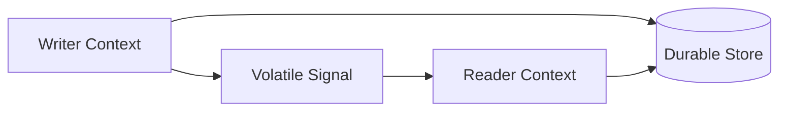

Examples:

- IndexedDB stores offline queue; BroadcastChannel signals `QUEUE_CHANGED`.
- Cache API stores artifact v42; Service Worker broadcasts `CACHE_VERSION_READY`.
- OPFS stores large parsed dataset; worker sends only dataset ID.

This separation avoids large clone cost, lost message state loss, and duplicate replication bugs.

---

## 5. Decision Matrix

## 5.1 Compact Matrix

| Use Case | Best First Choice | Add When Serious | Avoid |
|---|---|---|---|
| logout all tabs | BroadcastChannel | durable session version + storage fallback | broadcasting tokens |
| refresh token once | Web Locks | durable auth version + idempotent server refresh | every tab refreshing independently |
| cache update notification | Service Worker → clients | Cache manifest + safe reload protocol | forced reload all tabs immediately |
| same-origin live presence | BroadcastChannel | durable registry + TTL | unload-only cleanup |
| cross-tab RPC | SharedWorker | MessagePort request-response + heartbeat | BroadcastChannel RPC without routing |
| one websocket per browser session | SharedWorker or elected leader | Web Lock/fencing fallback | one socket per tab by accident |
| offline queue flush | Web Lock + IndexedDB | Service Worker where event-driven fits | memory-only queue |
| heavy CPU compute per tab | Dedicated Worker | worker pool, cancellation | main-thread compute |
| shared heavy compute service | SharedWorker | durable input refs + backpressure | huge broadcast payloads |
| app shell caching | Service Worker | versioned Cache API manifest | unversioned cache names |
| old-browser fallback signal | storage event | stale/duplicate guard | high-frequency traffic |
| durable local workflow | IndexedDB | signal bus + locks | volatile messages as source of truth |

---

## 5.2 Semantics Matrix

| Primitive | Multi-Tab Reach | Durable | Owner Election | Request/Response | Large Payload | Lifecycle Risk | Recommended Role |
|---|---:|---:|---:|---:|---:|---|---|
| direct `postMessage` | No | No | No | Good | Good with transfer | peer death | direct peer pipe |
| `MessageChannel` | No by itself | No | No | Excellent | Good with transfer | port leak/death | private connection/RPC |
| BroadcastChannel | Yes | No | No | Weak | Poor | missed/flooded messages | volatile fanout signal |
| `storage` event | Yes-ish | storage-backed | No | Poor | Poor | sync write/quota | legacy fallback signal |
| SharedWorker | Yes while connected | No | Central live owner | Good | Medium | hub death/version split | live hub/router |
| Service Worker | Clients in scope | cache/state external | Event-specific | Good with ports | Medium | update/lifecycle complexity | network/cache/update coordinator |
| Web Locks | Same-origin contexts | No | Yes | N/A | N/A | availability/fallback | mutual exclusion |
| IndexedDB | All same-origin contexts | Yes | With locks/lease | N/A | Medium | migration/version lock | durable state |
| Cache API | SW/window/worker availability | Yes | No | N/A | HTTP responses | stale artifacts | durable artifact store |
| OPFS | origin-scoped | Yes | With locks/worker ownership | N/A | Excellent | support/access pattern | large byte store |

---

## 6. Decision Flow

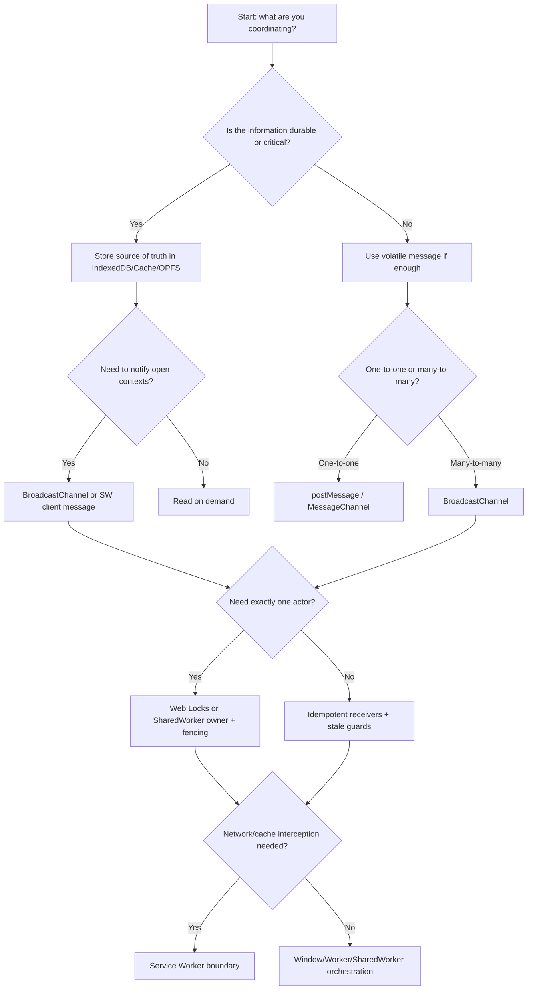

This flow produces a reliable default architecture:

1. durable store for critical state,
2. volatile signal for wakeup,
3. lock/hub for ownership,
4. idempotent protocol for recovery.

---

## 7. Hybrid Architecture Patterns

## 7.1 Durable State + Broadcast Signal

Use when many tabs need to react to durable state changes.

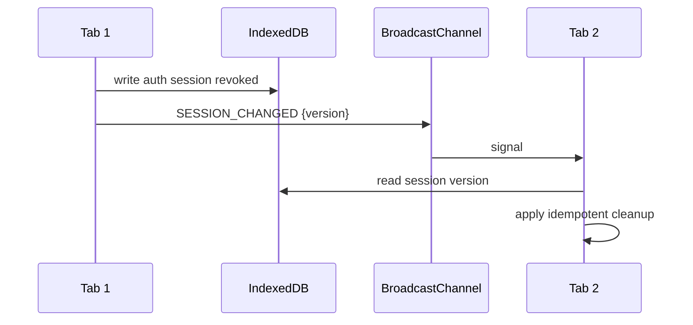

Use cases:

- logout,
- settings update,
- feature flag refresh,
- cache manifest changed,
- offline queue changed,
- local document state changed.

Why it works:

- missed signal is recoverable,
- duplicate signal is harmless,
- receiver can verify current state,
- large data stays out of the bus.

---

## 7.2 Broadcast Signal + Web Lock Owner

Use when all tabs may observe a need, but only one should act.

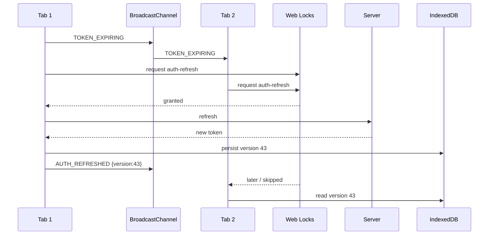

The broadcast does not elect the owner. The lock does.

---

## 7.3 SharedWorker Hub + Durable Recovery

Use when you want live routing but cannot lose state on hub death.

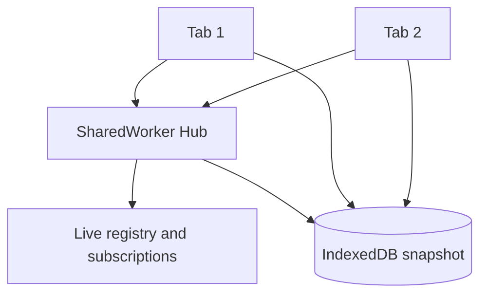

Pattern:

- SharedWorker tracks live connections.
- Durable state lives in IndexedDB.
- On reconnect, tabs resubscribe and reload snapshot.
- Hub never becomes the only source of truth for critical business state.

---

## 7.4 Service Worker Cache Coordinator + Client Broadcast

Use when network/cache state changes should notify tabs.

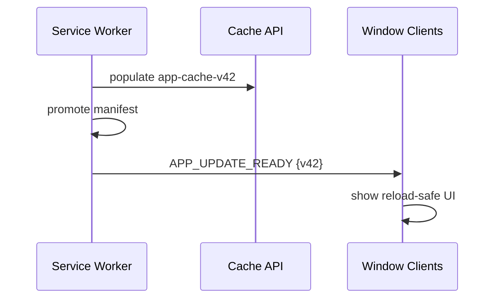

The client must verify:

- expected app version,
- safe reload point,
- IndexedDB compatibility,
- active controller state,
- duplicate notification state.

---

## 8. Anti-Patterns

## 8.1 BroadcastChannel as Database

Bad:

```ts
channel.postMessage({ type: "SET_FULL_STATE", state });
```

Why it fails:

- missed messages lose state,
- duplicate messages can overwrite newer state,
- large clone cost,
- no schema migration boundary,
- no cold-start recovery.

Better:

```ts
await db.state.put(snapshot);
channel.postMessage({ type: "STATE_CHANGED", version: snapshot.version });
```

---

## 8.2 localStorage Spin Lock

Bad:

```ts
while (localStorage.getItem("lock")) {
  // busy wait or retry loop
}
localStorage.setItem("lock", tabId);
```

Why it fails:

- no atomic compare-and-set,
- stale lock after tab crash,
- synchronous main-thread blocking,
- race between read and write,
- hard to reason under freeze/discard.

Better:

- use Web Locks when available,
- use durable lease with fencing if you must fallback,
- keep critical server operations idempotent.

---

## 8.3 Service Worker as Always-On Scheduler

Bad mental model:

> “The Service Worker will keep running and periodically coordinate everything.”

Better mental model:

> “The Service Worker handles events. Work must be resumable, idempotent, and stored durably outside worker memory.”

---

## 8.4 SharedWorker as Durable Singleton

Bad:

```ts
// All important state only lives here.
const state = new Map();
```

Why it fails:

- all clients can disconnect,
- worker can be recreated,
- deploy can split worker versions,
- private/webview support may differ,
- memory state cannot recover cold start.

Better:

```ts
// SharedWorker keeps hot index.
const liveClients = new Map();

// Durable state is loaded from IndexedDB.
const durableSnapshot = await loadSnapshot();
```

---

## 8.5 Message Without Version

Bad:

```ts
{ type: "UPDATED" }
```

Better:

```ts
{
  type: "UPDATED",
  resource: "policy-dictionary",
  version: 42,
  schemaVersion: 3,
  issuedAt: Date.now(),
  messageId: crypto.randomUUID()
}
```

Every cross-context message should carry enough metadata to reject stale, duplicate, incompatible, or unauthorized handling.

---

## 9. Production Selection Template

Use this template before implementation.

```md
# Cross-Context Coordination Design

## Problem
What state/work is being coordinated?

## Participants
Which contexts participate?
- window tabs:
- iframes:
- dedicated workers:
- shared worker:
- service worker:

## Semantics
- durable or volatile:
- one-to-one or fanout:
- exactly-one owner needed:
- ordering requirement:
- duplicate tolerance:
- missed message recovery:
- payload size:
- security sensitivity:

## Chosen Primitives
- durable store:
- signal bus:
- ownership primitive:
- request-response channel:
- fallback:

## Failure Handling
- tab close:
- tab freeze:
- worker crash:
- missed message:
- duplicate message:
- version skew:
- storage failure:

## Observability
- message count:
- latency:
- dropped/stale messages:
- lock wait time:
- queue depth:
- active clients:
```

This template prevents primitive-driven architecture.

---

## 10. API Selection by Scenario

## 10.1 Auth Logout

Recommended:

- write durable `sessionVersion` / `logoutAt`,
- clear sensitive local state in current tab,
- BroadcastChannel `SESSION_REVOKED`,
- storage-event fallback if needed,
- every tab re-reads durable session marker,
- Service Worker clears auth-bound caches if applicable.

Avoid:

- sending tokens over BroadcastChannel,
- relying only on unload,
- assuming every tab receives the message.

---

## 10.2 Auth Refresh

Recommended:

- Web Lock `auth-refresh`,
- durable auth state version,
- idempotent server refresh,
- BroadcastChannel result signal,
- stale request guard.

Avoid:

- every tab refreshing independently,
- localStorage spin locks,
- using BroadcastChannel as election.

---

## 10.3 Global Notification Suppression

Recommended:

- BroadcastChannel for `NOTIFICATION_SHOWN`,
- durable short TTL marker for critical suppression,
- idempotent UI display logic.

Avoid:

- central server call for every local UI duplicate,
- trusting only in-memory state.

---

## 10.4 Offline Queue Flush

Recommended:

- IndexedDB queue,
- Web Lock owner,
- idempotency keys per operation,
- broadcast queue status,
- Service Worker involvement only where lifecycle/event model fits.

Avoid:

- memory queue per tab,
- no idempotency key,
- assuming exactly-once delivery.

---

## 10.5 One WebSocket Per Browser Session

Options:

| Option | When |
|---|---|
| SharedWorker owns socket | browser support acceptable and tabs need live hub |
| elected leader tab owns socket | SharedWorker unavailable, Web Lock/fencing available |
| one socket per tab | acceptable server cost and simpler failure model |
| Service Worker owns socket | generally avoid; not a stable always-on process |

For regulated or enterprise systems, one socket per tab is sometimes operationally safer than clever local singleton ownership if server cost is acceptable.

Simple is often more reliable than locally clever.

---

## 11. Reference Decision Function

This is not production code. It is a thinking tool.

```ts
type Requirement = {
  durable: boolean;
  fanout: boolean;
  exactlyOneOwner: boolean;
  networkInterception: boolean;
  requestResponse: boolean;
  largePayload: boolean;
  needsLiveRegistry: boolean;
  needsFallback: boolean;
};

type PrimitivePlan = {
  store?: "IndexedDB" | "Cache API" | "OPFS";
  signal?: "BroadcastChannel" | "storage event" | "Service Worker client message";
  owner?: "Web Locks" | "SharedWorker" | "durable lease";
  pipe?: "postMessage" | "MessageChannel" | "SharedWorker port";
  notes: string[];
};

export function choosePrimitives(req: Requirement): PrimitivePlan {
  const plan: PrimitivePlan = { notes: [] };

  if (req.durable) {
    plan.store = req.largePayload ? "OPFS" : "IndexedDB";
    plan.notes.push("Use messages as change hints, not source of truth.");
  }

  if (req.networkInterception) {
    plan.signal = "Service Worker client message";
    plan.store = plan.store ?? "Cache API";
    plan.notes.push("Treat Service Worker as event-driven network/cache coordinator.");
  } else if (req.fanout) {
    plan.signal = "BroadcastChannel";
  }

  if (req.exactlyOneOwner) {
    plan.owner = req.needsLiveRegistry ? "SharedWorker" : "Web Locks";
    plan.notes.push("Add fencing token or durable version for recovery.");
  }

  if (req.requestResponse) {
    plan.pipe = req.needsLiveRegistry ? "SharedWorker port" : "MessageChannel";
    plan.notes.push("Use correlation ID, timeout, and bounded in-flight requests.");
  }

  if (req.needsFallback && plan.signal === "BroadcastChannel") {
    plan.notes.push("Add storage event fallback for coarse low-frequency signals.");
  }

  return plan;
}
```

The function is intentionally biased toward explicit semantics:

- store for durability,
- signal for wakeup,
- owner for critical section,
- pipe for RPC.

---

## 12. Compatibility and Progressive Enhancement

Do not put all browsers into the same path blindly.

A production app usually needs a capability profile:

```ts
export type BrowserCoordinationCapabilities = {
  broadcastChannel: boolean;
  sharedWorker: boolean;
  serviceWorker: boolean;
  webLocks: boolean;
  indexedDB: boolean;
  cacheApi: boolean;
  opfs: boolean;
};

export function detectCapabilities(): BrowserCoordinationCapabilities {
  return {
    broadcastChannel: "BroadcastChannel" in globalThis,
    sharedWorker: "SharedWorker" in globalThis,
    serviceWorker: "serviceWorker" in navigator,
    webLocks: "locks" in navigator,
    indexedDB: "indexedDB" in globalThis,
    cacheApi: "caches" in globalThis,
    opfs: Boolean(navigator.storage?.getDirectory)
  };
}
```

Then design tiers:

| Tier | Features | Behavior |
|---|---|---|
| Full | BroadcastChannel + Web Locks + IndexedDB + Service Worker | rich orchestration |
| Medium | BroadcastChannel + IndexedDB | fanout and recovery, limited ownership |
| Fallback | storage event + localStorage marker | coarse logout/invalidation |
| Minimal | no reliable local coordination | server-driven recovery, per-tab isolation |

Progressive enhancement beats brittle cleverness.

---

## 13. Security Selection Rules

Use these as hard constraints.

1. Do not broadcast secrets.
2. Do not trust same-origin messages blindly if your app embeds untrusted same-origin content.
3. Add `appId`, `protocolVersion`, and `senderId` to envelopes.
4. Validate message kind and payload at runtime.
5. Reject messages from incompatible versions.
6. Keep auth/session invalidation durable.
7. Treat Service Worker cache as security-sensitive if responses contain user data.
8. Clear or version auth-bound caches on logout/session switch.
9. Do not use localStorage for high-value secrets.
10. Treat browser coordination as local convenience, not global authority.

Same-origin is a browser boundary. It is not automatically an application trust boundary.

---

## 14. Observability Matrix

| Primitive | Metrics |
|---|---|
| BroadcastChannel | sent, received, stale, duplicate, messageerror, avg payload bytes |
| MessagePort | opened, closed, in-flight, timeout, error, avg latency |
| SharedWorker | connected clients, registry size, heartbeat age, dropped ports |
| Service Worker | controlled clients, cache version, update state, broadcast count |
| Web Locks | wait time, hold time, contention, timeout, abandoned attempts |
| IndexedDB | write latency, transaction aborts, quota errors, migration time |
| Cache API | hit/miss, version, cleanup count, stale served count |
| storage event | published, received, parse failures, stale signals |

Without these, you will not know whether the issue is transport, lifecycle, storage, versioning, or business logic.

---

## 15. Final Mental Model

Do not think in API names first.

Think in these four planes:

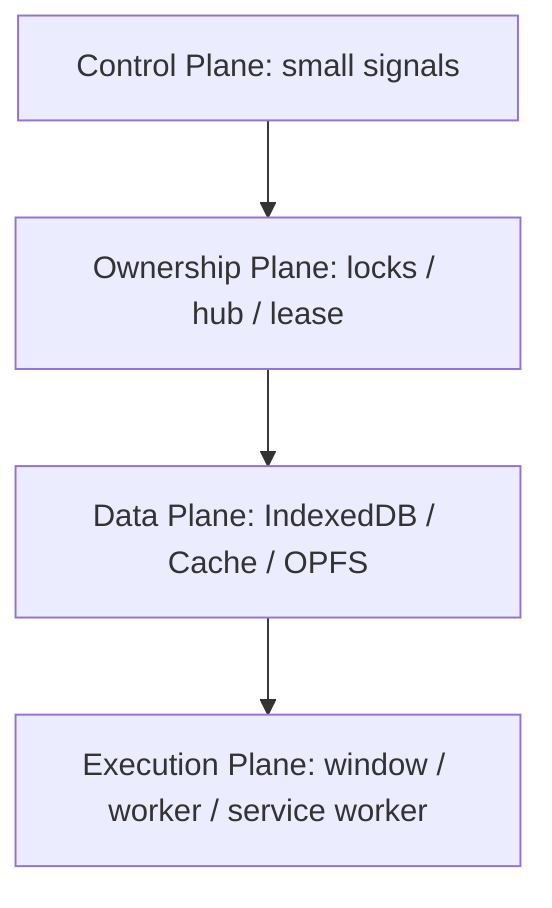

Then map browser APIs onto the planes:

| Plane | API Families |
|---|---|
| Control plane | BroadcastChannel, postMessage, MessagePort, storage event |
| Ownership plane | Web Locks, SharedWorker owner, durable lease, fencing token |
| Data plane | IndexedDB, Cache API, OPFS |
| Execution plane | Window, Dedicated Worker, SharedWorker, Service Worker |

This separation is the difference between a demo and an architecture.

---

## 16. Checklist

Before selecting a primitive, answer:

- [ ] Is the message itself the source of truth, or only a hint?
- [ ] What happens if the message is missed?
- [ ] What happens if the message is duplicated?
- [ ] What happens if the receiver is old code?
- [ ] What happens if the sender dies mid-operation?
- [ ] Does the task require exactly one owner?
- [ ] Is the payload small enough to clone?
- [ ] Does the data contain secrets?
- [ ] Does the operation need Service Worker fetch/cache integration?
- [ ] Does the state need to survive all tabs closing?
- [ ] What is the fallback if an API is unavailable?
- [ ] How will you observe failures in production?

If you cannot answer these, you are not ready to pick the primitive.

---

## References

- MDN — Broadcast Channel API: https://developer.mozilla.org/en-US/docs/Web/API/Broadcast_Channel_API
- MDN — SharedWorker: https://developer.mozilla.org/en-US/docs/Web/API/SharedWorker
- MDN — Client.postMessage: https://developer.mozilla.org/en-US/docs/Web/API/Client/postMessage
- MDN — Clients.matchAll: https://developer.mozilla.org/en-US/docs/Web/API/Clients/matchAll
- MDN — Web Locks API: https://developer.mozilla.org/en-US/docs/Web/API/Web_Locks_API
- WHATWG HTML — Workers: https://html.spec.whatwg.org/multipage/workers.html

