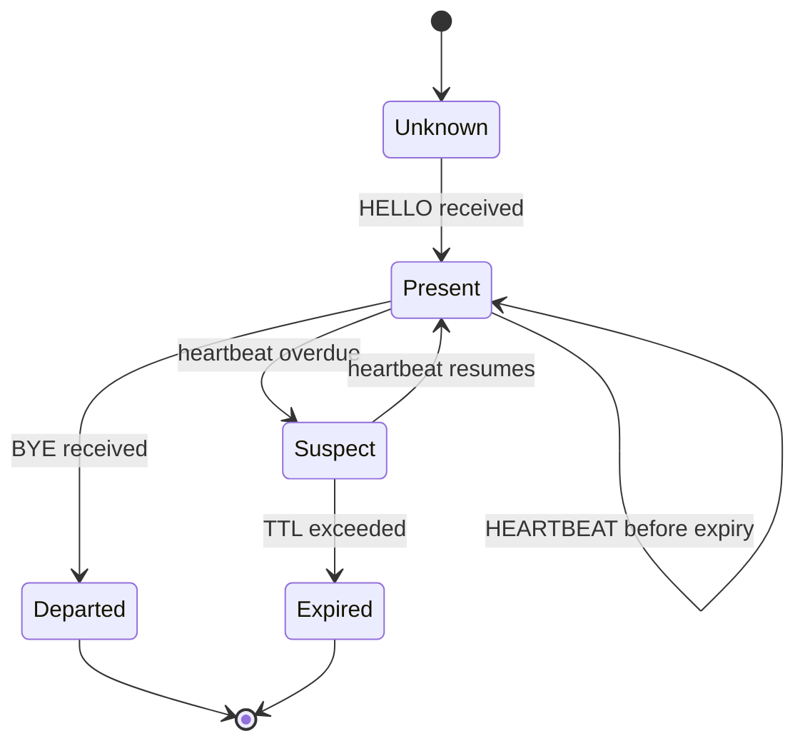
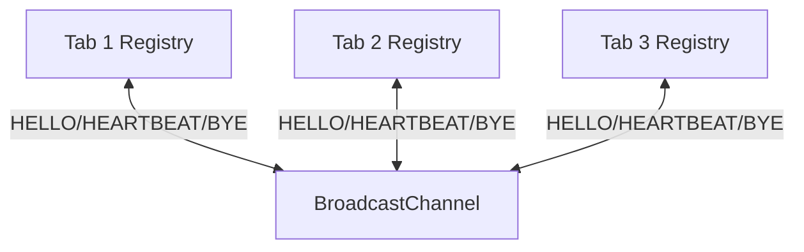
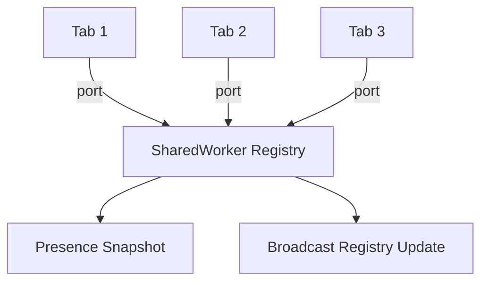
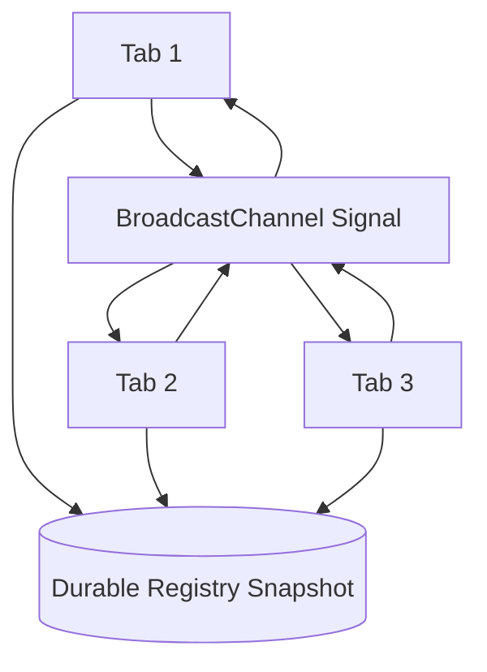

# Part 036 — Tab Registry and Presence System

A multi-tab system starts with a deceptively simple question:

> “Which tabs are currently open?”

The browser does not give you a perfect answer.

You can observe hints. You can maintain a registry. You can expire stale entries. You can build confidence. But you cannot build a perfect global truth from volatile tabs, frozen timers, navigations, crashes, and missed messages.

So the production-grade question is not:

> “How do I know all tabs exactly?”

The better question is:

> “How do I maintain a useful, bounded-staleness view of same-origin clients, and design every consumer to tolerate uncertainty?”

That is a tab registry and presence system.

---

## 1. Why Presence Matters

Presence is the foundation for higher-level orchestration:

- leader election,
- refresh-token ownership,
- one websocket per browser session,
- notification suppression,
- multi-tab logout,
- route-aware UX,
- distributed dirty-form detection,
- offline queue coordination,
- cache update UX,
- collaborative local editing,
- observability of live browser contexts.

Without presence, tabs become ghosts.

One tab thinks it is the leader. Another tab thinks the leader died. A hidden tab keeps a stale socket. A discarded tab leaves stale state. A newly restored tab applies an old update.

Presence does not eliminate these failures. It gives you a structured way to detect and bound them.

---

## 2. What a Tab Registry Is

A tab registry is a local, same-origin directory of browser contexts that are believed to be alive.

A registry entry usually answers:

| Field | Meaning |
|---|---|
| `tabId` | stable ID for this tab lifetime |
| `connectionId` | ID for current runtime connection/generation |
| `sessionId` | browser/app session identity if available |
| `userIdHash` | optional non-sensitive user identity hash |
| `appVersion` | frontend build/protocol version |
| `protocolVersion` | message protocol compatibility |
| `route` | current high-level route or feature area |
| `visibility` | visible, hidden, prerender-like, unknown |
| `lifecycleState` | active, passive, hidden, frozen-ish, unloading, unknown |
| `role` | normal, leader-candidate, leader, observer |
| `capabilities` | Web Locks, BroadcastChannel, SharedWorker, etc. |
| `startedAt` | tab runtime start time |
| `lastSeenAt` | latest heartbeat/update timestamp |
| `expiresAt` | time after which entry is considered stale |

Presence is not just a set of IDs. It is a time-indexed belief.

```ts
type TabRegistryEntry = {
  tabId: string;
  connectionId: string;
  sessionId?: string;
  userIdHash?: string;
  appVersion: string;
  protocolVersion: number;
  route: string;
  visibility: DocumentVisibilityState | "unknown";
  lifecycleState: "active" | "passive" | "hidden" | "frozen-ish" | "unloading" | "unknown";
  role: "normal" | "candidate" | "leader" | "observer";
  capabilities: {
    broadcastChannel: boolean;
    webLocks: boolean;
    sharedWorker: boolean;
    serviceWorker: boolean;
    indexedDB: boolean;
  };
  startedAt: number;
  lastSeenAt: number;
  expiresAt: number;
};
```

The key field is not `tabId`. It is `expiresAt`.

A registry without expiry becomes a graveyard.

---

## 3. Identity Model

Do not use one ID for everything.

You need at least two IDs:

| ID | Lifetime | Purpose |
|---|---|---|
| `tabId` | tab lifetime | represents the logical tab instance |
| `connectionId` | current JS runtime/generation | distinguishes reload/reconnect/recreated runtime |

A tab can reload and preserve `tabId` if stored in `sessionStorage`. But the runtime changed, so `connectionId` must change.

```ts
const TAB_ID_KEY = "app:tab-id";

export function getOrCreateTabId(): string {
  const existing = sessionStorage.getItem(TAB_ID_KEY);
  if (existing) return existing;

  const id = crypto.randomUUID();
  sessionStorage.setItem(TAB_ID_KEY, id);
  return id;
}

export function createConnectionId(): string {
  return crypto.randomUUID();
}
```

Why `sessionStorage`?

- It is scoped to the page session/top-level tab behavior.
- It is not shared across all tabs like `localStorage`.
- It often survives reload for the same tab.

Caveat:

- duplicated tabs may copy session state in some browser flows,
- restored sessions may preserve more than you expect,
- do not treat `tabId` as security identity,
- always use `connectionId` and generation checks for stale message rejection.

A stronger entry key is:

```ts
type RegistryKey = `${string}:${string}`; // tabId:connectionId
```

This prevents a late message from an old runtime from overwriting a newer runtime state.

---

## 4. Presence Semantics

Presence is a lease, not a fact.

A tab does not say:

> “I am alive forever.”

It says:

> “I was alive at time T, and you may consider this claim valid until time T + TTL.”



Definitions:

| State | Meaning |
|---|---|
| `present` | latest heartbeat is within TTL |
| `suspect` | heartbeat late, but not expired enough for destructive action |
| `expired` | should be removed or ignored |
| `departed` | explicit BYE received; useful but not guaranteed |

Never depend on BYE.

`beforeunload`, `pagehide`, and unload-like cleanup are best-effort. They are not a correctness mechanism.

Correctness comes from expiry.

---

## 5. Architecture Options

There are three common registry architectures.

## 5.1 BroadcastChannel + In-Memory Registry

Each tab maintains its own local view.



Pros:

- simple,
- no central hub,
- fast enough for many use cases,
- good for volatile presence.

Cons:

- each tab has a possibly different view,
- missed messages create temporary divergence,
- cold-start tab needs discovery strategy,
- not durable.

Use for:

- UI awareness,
- duplicate notification suppression,
- leader election hints,
- route awareness,
- lightweight orchestration.

---

## 5.2 SharedWorker Central Registry

SharedWorker holds one live registry for connected clients.



Pros:

- central live view,
- direct port tracking,
- better routing,
- simpler connected-client list.

Cons:

- SharedWorker support/deployment caveats,
- hub dies when no clients remain,
- still not durable,
- reconnect logic required.

Use for:

- live tab router,
- one websocket owner,
- cross-tab RPC,
- subscription fanout.

---

## 5.3 Durable Snapshot + Volatile Signal

Registry writes a snapshot to IndexedDB/localStorage and uses BroadcastChannel for wakeups.



Pros:

- cold-start recovery,
- missed signal recovery,
- useful for debugging,
- supports page reloads better.

Cons:

- storage write overhead,
- cleanup required,
- contention risk,
- not real-time exact truth.

Use for:

- critical local workflow ownership hints,
- recoverable presence snapshot,
- observability,
- fallback to durable read after missed signals.

Recommended default for serious systems:

> BroadcastChannel for live signal + durable snapshot for recovery + TTL for correctness.

---

## 6. Message Protocol

Presence protocol should be small and explicit.

```ts
type PresenceMessage =
  | {
      type: "TAB_HELLO";
      messageId: string;
      sender: TabRegistryEntry;
      sentAt: number;
    }
  | {
      type: "TAB_HEARTBEAT";
      messageId: string;
      tabId: string;
      connectionId: string;
      patch: Partial<Pick<TabRegistryEntry,
        "route" | "visibility" | "lifecycleState" | "role" | "lastSeenAt" | "expiresAt"
      >>;
      sentAt: number;
    }
  | {
      type: "TAB_BYE";
      messageId: string;
      tabId: string;
      connectionId: string;
      reason: "pagehide" | "beforeunload" | "logout" | "manual";
      sentAt: number;
    }
  | {
      type: "TAB_QUERY";
      messageId: string;
      requester: { tabId: string; connectionId: string };
      sentAt: number;
    }
  | {
      type: "TAB_SNAPSHOT";
      messageId: string;
      sender: { tabId: string; connectionId: string };
      entries: TabRegistryEntry[];
      sentAt: number;
    };
```

Core commands:

| Message | Purpose |
|---|---|
| `TAB_HELLO` | announce new runtime |
| `TAB_HEARTBEAT` | update liveness and small metadata |
| `TAB_BYE` | best-effort departure signal |
| `TAB_QUERY` | ask other tabs for their current view |
| `TAB_SNAPSHOT` | provide registry snapshot to new/recovering tab |

`TAB_QUERY` is important for cold start.

A new tab may open after previous `HELLO` messages were already sent. It needs a way to ask:

> “Who is currently here?”

---

## 7. Timing Model

Timing is a trade-off.

Short heartbeat intervals improve freshness but increase CPU/battery/message load. Long intervals reduce overhead but increase stale presence.

A reasonable default:

```ts
const HEARTBEAT_INTERVAL_MS = 5_000;
const PRESENCE_TTL_MS = 15_000;
const SUSPECT_AFTER_MS = 8_000;
const SWEEP_INTERVAL_MS = 5_000;
```

A tab is:

```ts
function classifyEntry(entry: TabRegistryEntry, now = Date.now()) {
  const age = now - entry.lastSeenAt;

  if (now > entry.expiresAt) return "expired";
  if (age > SUSPECT_AFTER_MS) return "suspect";
  return "present";
}
```

But timing must be lifecycle-aware.

Hidden tabs may throttle timers. Frozen pages may not run timers at all. A mobile browser may suspend execution aggressively.

Therefore:

- do not use heartbeat absence alone for destructive security decisions,
- do use heartbeat absence for leadership failover with fencing,
- revalidate durable state after a tab resumes,
- broadcast a fresh `HELLO`/heartbeat on visibility regain/pageshow.

---

## 8. Implementation: Presence Bus

Start with a small transport wrapper.

```ts
const CHANNEL_NAME = "app:presence:v1";

type Listener<T> = (message: T) => void;

export class PresenceBus<TMessage> {
  private channel?: BroadcastChannel;
  private listeners = new Set<Listener<TMessage>>();

  constructor(private readonly name = CHANNEL_NAME) {}

  start() {
    if (!("BroadcastChannel" in globalThis)) {
      throw new Error("BroadcastChannel unavailable");
    }

    this.channel = new BroadcastChannel(this.name);
    this.channel.addEventListener("message", (event) => {
      for (const listener of this.listeners) {
        listener(event.data as TMessage);
      }
    });

    this.channel.addEventListener("messageerror", () => {
      // Increment metric. Do not crash the app.
    });
  }

  subscribe(listener: Listener<TMessage>) {
    this.listeners.add(listener);
    return () => this.listeners.delete(listener);
  }

  publish(message: TMessage) {
    this.channel?.postMessage(message);
  }

  close() {
    this.channel?.close();
    this.channel = undefined;
    this.listeners.clear();
  }
}
```

This wrapper intentionally does not implement reliability. The registry layer will handle idempotency and staleness.

---

## 9. Implementation: Registry Core

```ts
type RegistryEvent =
  | { type: "entry-upserted"; entry: TabRegistryEntry }
  | { type: "entry-removed"; tabId: string; connectionId: string; reason: string }
  | { type: "snapshot-changed"; entries: TabRegistryEntry[] };

type RegistryListener = (event: RegistryEvent) => void;

export class TabRegistry {
  private entries = new Map<string, TabRegistryEntry>();
  private seenMessages = new Set<string>();
  private listeners = new Set<RegistryListener>();

  constructor(
    private readonly self: TabRegistryEntry,
    private readonly bus: PresenceBus<PresenceMessage>
  ) {}

  start() {
    this.bus.subscribe((message) => this.onMessage(message));
    this.upsert(this.self);
    this.hello();
    this.query();
  }

  subscribe(listener: RegistryListener) {
    this.listeners.add(listener);
    return () => this.listeners.delete(listener);
  }

  snapshot(now = Date.now()): TabRegistryEntry[] {
    return [...this.entries.values()]
      .filter((entry) => entry.expiresAt > now)
      .sort((a, b) => a.startedAt - b.startedAt);
  }

  hello() {
    this.bus.publish({
      type: "TAB_HELLO",
      messageId: crypto.randomUUID(),
      sender: this.self,
      sentAt: Date.now()
    });
  }

  heartbeat(patch: PresenceMessage extends never ? never : Partial<TabRegistryEntry> = {}) {
    const now = Date.now();

    this.self.lastSeenAt = now;
    this.self.expiresAt = now + PRESENCE_TTL_MS;
    Object.assign(this.self, patch);

    this.upsert(this.self);

    this.bus.publish({
      type: "TAB_HEARTBEAT",
      messageId: crypto.randomUUID(),
      tabId: this.self.tabId,
      connectionId: this.self.connectionId,
      patch: {
        route: this.self.route,
        visibility: this.self.visibility,
        lifecycleState: this.self.lifecycleState,
        role: this.self.role,
        lastSeenAt: this.self.lastSeenAt,
        expiresAt: this.self.expiresAt
      },
      sentAt: now
    });
  }

  bye(reason: "pagehide" | "beforeunload" | "logout" | "manual") {
    this.bus.publish({
      type: "TAB_BYE",
      messageId: crypto.randomUUID(),
      tabId: this.self.tabId,
      connectionId: this.self.connectionId,
      reason,
      sentAt: Date.now()
    });
  }

  query() {
    this.bus.publish({
      type: "TAB_QUERY",
      messageId: crypto.randomUUID(),
      requester: {
        tabId: this.self.tabId,
        connectionId: this.self.connectionId
      },
      sentAt: Date.now()
    });
  }

  sweep(now = Date.now()) {
    for (const [key, entry] of this.entries) {
      if (entry.expiresAt <= now) {
        this.entries.delete(key);
        this.emit({
          type: "entry-removed",
          tabId: entry.tabId,
          connectionId: entry.connectionId,
          reason: "expired"
        });
      }
    }

    this.emit({ type: "snapshot-changed", entries: this.snapshot(now) });
  }

  private onMessage(message: PresenceMessage) {
    if (this.seenMessages.has(message.messageId)) return;
    this.seenMessages.add(message.messageId);

    switch (message.type) {
      case "TAB_HELLO":
        this.upsert(message.sender);
        this.sendSnapshot();
        return;

      case "TAB_HEARTBEAT":
        this.applyHeartbeat(message);
        return;

      case "TAB_BYE":
        this.remove(message.tabId, message.connectionId, message.reason);
        return;

      case "TAB_QUERY":
        if (message.requester.connectionId !== this.self.connectionId) {
          this.sendSnapshot();
        }
        return;

      case "TAB_SNAPSHOT":
        for (const entry of message.entries) {
          this.upsert(entry);
        }
        return;
    }
  }

  private applyHeartbeat(message: Extract<PresenceMessage, { type: "TAB_HEARTBEAT" }>) {
    const key = this.key(message.tabId, message.connectionId);
    const existing = this.entries.get(key);

    if (!existing) {
      this.upsert({
        tabId: message.tabId,
        connectionId: message.connectionId,
        sessionId: undefined,
        appVersion: "unknown",
        protocolVersion: 1,
        route: message.patch.route ?? "unknown",
        visibility: message.patch.visibility ?? "unknown",
        lifecycleState: message.patch.lifecycleState ?? "unknown",
        role: message.patch.role ?? "normal",
        capabilities: {
          broadcastChannel: true,
          webLocks: false,
          sharedWorker: false,
          serviceWorker: false,
          indexedDB: false
        },
        startedAt: message.sentAt,
        lastSeenAt: message.patch.lastSeenAt ?? message.sentAt,
        expiresAt: message.patch.expiresAt ?? message.sentAt + PRESENCE_TTL_MS
      });
      return;
    }

    const next = { ...existing, ...message.patch };
    if ((next.lastSeenAt ?? 0) < existing.lastSeenAt) return;

    this.upsert(next);
  }

  private sendSnapshot() {
    this.bus.publish({
      type: "TAB_SNAPSHOT",
      messageId: crypto.randomUUID(),
      sender: {
        tabId: this.self.tabId,
        connectionId: this.self.connectionId
      },
      entries: this.snapshot(),
      sentAt: Date.now()
    });
  }

  private upsert(entry: TabRegistryEntry) {
    if (entry.protocolVersion !== this.self.protocolVersion) {
      // In production, record version skew metric.
      return;
    }

    const key = this.key(entry.tabId, entry.connectionId);
    const existing = this.entries.get(key);

    if (existing && existing.lastSeenAt > entry.lastSeenAt) {
      return;
    }

    this.entries.set(key, entry);
    this.emit({ type: "entry-upserted", entry });
    this.emit({ type: "snapshot-changed", entries: this.snapshot() });
  }

  private remove(tabId: string, connectionId: string, reason: string) {
    const key = this.key(tabId, connectionId);
    if (!this.entries.delete(key)) return;

    this.emit({ type: "entry-removed", tabId, connectionId, reason });
    this.emit({ type: "snapshot-changed", entries: this.snapshot() });
  }

  private key(tabId: string, connectionId: string) {
    return `${tabId}:${connectionId}`;
  }

  private emit(event: RegistryEvent) {
    for (const listener of this.listeners) listener(event);
  }
}
```

The code is intentionally explicit. Hidden magic in a registry becomes painful during incident debugging.

---

## 10. Lifecycle Integration

Presence must react to page lifecycle.

```ts
function readVisibility(): DocumentVisibilityState | "unknown" {
  if (typeof document === "undefined") return "unknown";
  return document.visibilityState;
}

function inferLifecycleState(): TabRegistryEntry["lifecycleState"] {
  if (document.visibilityState === "visible") return "active";
  if (document.visibilityState === "hidden") return "hidden";
  return "unknown";
}

export function attachLifecyclePresence(registry: TabRegistry) {
  document.addEventListener("visibilitychange", () => {
    registry.heartbeat({
      visibility: readVisibility(),
      lifecycleState: inferLifecycleState()
    });
  });

  window.addEventListener("pageshow", () => {
    registry.hello();
    registry.heartbeat({
      visibility: readVisibility(),
      lifecycleState: inferLifecycleState()
    });
    registry.query();
  });

  window.addEventListener("pagehide", () => {
    registry.bye("pagehide");
  });

  window.addEventListener("beforeunload", () => {
    registry.bye("beforeunload");
  });
}
```

Important:

- `BYE` is an optimization.
- TTL expiry is correctness.
- `pageshow` should re-announce because bfcache restore can revive old runtime state.
- visibility change should publish metadata but not cause destructive decisions.

---

## 11. Heartbeat Scheduler

A simple heartbeat loop:

```ts
export function startPresenceLoop(registry: TabRegistry) {
  const heartbeatTimer = window.setInterval(() => {
    registry.heartbeat({
      visibility: readVisibility(),
      lifecycleState: inferLifecycleState()
    });
  }, HEARTBEAT_INTERVAL_MS);

  const sweepTimer = window.setInterval(() => {
    registry.sweep();
  }, SWEEP_INTERVAL_MS);

  return () => {
    clearInterval(heartbeatTimer);
    clearInterval(sweepTimer);
    registry.bye("manual");
  };
}
```

This loop is enough for many cases, but remember:

- hidden tabs may throttle intervals,
- frozen tabs may not execute intervals,
- mobile browsers may suspend tabs,
- long main-thread tasks can delay heartbeat,
- system sleep can make every heartbeat late.

Therefore, expiry should be forgiving enough for normal throttling but short enough for failover.

For leader election, presence alone is not enough. It must be paired with a lock or fencing token.

---

## 12. Durable Snapshot

In-memory registry is useful while the tab is alive. Durable snapshot helps cold start and debugging.

For simplicity, here is a localStorage snapshot. For larger systems, use IndexedDB.

```ts
const SNAPSHOT_KEY = "app:tab-registry:snapshot:v1";

type DurableRegistrySnapshot = {
  writtenAt: number;
  writer: { tabId: string; connectionId: string };
  entries: TabRegistryEntry[];
};

export function writeRegistrySnapshot(
  writer: { tabId: string; connectionId: string },
  entries: TabRegistryEntry[]
) {
  const now = Date.now();

  const snapshot: DurableRegistrySnapshot = {
    writtenAt: now,
    writer,
    entries: entries.filter((entry) => entry.expiresAt > now)
  };

  localStorage.setItem(SNAPSHOT_KEY, JSON.stringify(snapshot));
}

export function readRegistrySnapshot(): DurableRegistrySnapshot | undefined {
  const raw = localStorage.getItem(SNAPSHOT_KEY);
  if (!raw) return undefined;

  try {
    const snapshot = JSON.parse(raw) as DurableRegistrySnapshot;
    const now = Date.now();

    return {
      ...snapshot,
      entries: snapshot.entries.filter((entry) => entry.expiresAt > now)
    };
  } catch {
    return undefined;
  }
}
```

But avoid writing localStorage on every heartbeat in large apps.

Better pattern:

- heartbeat stays in BroadcastChannel,
- snapshot writes are throttled,
- writes happen on meaningful changes,
- IndexedDB is used when snapshot grows.

```ts
function throttle<TArgs extends unknown[]>(fn: (...args: TArgs) => void, ms: number) {
  let last = 0;
  let timer: number | undefined;

  return (...args: TArgs) => {
    const now = Date.now();
    const remaining = ms - (now - last);

    if (remaining <= 0) {
      last = now;
      fn(...args);
      return;
    }

    window.clearTimeout(timer);
    timer = window.setTimeout(() => {
      last = Date.now();
      fn(...args);
    }, remaining);
  };
}
```

---

## 13. Handling Clock Problems

Presence uses local time. Local time can jump.

Issues:

- user changes clock,
- device sleeps,
- system resumes,
- NTP adjustment,
- background throttling,
- tab freeze.

For local presence, `Date.now()` is usually acceptable if you design conservatively.

Rules:

1. Never use local presence timestamp as legal/audit truth.
2. Never use it as server-side security authority.
3. Use it only for local coordination hints.
4. On large time jumps, re-announce and re-read durable state.
5. Use monotonic `performance.now()` for local duration measurements inside one runtime, but not for cross-tab timestamp comparison.

Cross-tab comparison needs a shared comparable timestamp, so most systems use `Date.now()` and tolerate imperfectness.

---

## 14. Conflict Handling

Two entries may claim the same `tabId`.

Reasons:

- duplicate tab copied sessionStorage,
- restored browser session,
- reload race,
- old runtime late message,
- test environment artifact.

Do not collapse by `tabId` alone.

Use `tabId + connectionId` for registry identity.

When presenting UI, you may group by `tabId`:

```ts
type LogicalTabView = {
  tabId: string;
  activeConnections: TabRegistryEntry[];
  latest: TabRegistryEntry;
};

function groupByLogicalTab(entries: TabRegistryEntry[]): LogicalTabView[] {
  const groups = new Map<string, TabRegistryEntry[]>();

  for (const entry of entries) {
    const group = groups.get(entry.tabId) ?? [];
    group.push(entry);
    groups.set(entry.tabId, group);
  }

  return [...groups.entries()].map(([tabId, activeConnections]) => {
    const latest = activeConnections.reduce((a, b) =>
      a.lastSeenAt > b.lastSeenAt ? a : b
    );

    return { tabId, activeConnections, latest };
  });
}
```

For ownership and fencing, use connection-level identity. For human-facing display, logical tab grouping is fine.

---

## 15. Security Boundaries

Presence messages are local same-origin signals. They are not authentication proof.

Do not include:

- access tokens,
- refresh tokens,
- full user profile,
- PII-heavy payload,
- authorization claims,
- sensitive route parameters,
- document contents,
- case details,
- regulatory data.

Prefer:

- hashed or opaque user/session marker,
- coarse route name instead of full URL,
- capability flags,
- protocol version,
- state version.

Bad:

```ts
{
  type: "TAB_HEARTBEAT",
  route: "/cases/ENF-2026-000123/suspects/999",
  userEmail: "person@example.com"
}
```

Better:

```ts
{
  type: "TAB_HEARTBEAT",
  route: "case-detail",
  userIdHash: "u:sha256:..."
}
```

Even same-origin contexts may not have equal trust if your app hosts plugins, legacy pages, embedded admin tools, or same-origin iframes with different privilege expectations.

---

## 16. Presence Consumers

A registry is only valuable if consumers use it safely.

## 16.1 Notification Suppression

Goal: avoid showing duplicate notification toast across tabs.

Use presence to pick a visible tab:

```ts
function chooseNotificationTab(entries: TabRegistryEntry[]) {
  return entries
    .filter((entry) => entry.visibility === "visible")
    .sort((a, b) => a.startedAt - b.startedAt)[0];
}
```

But do not rely on this alone for critical user notifications. Use server/durable notification read state for actual correctness.

---

## 16.2 Leader Candidate Filtering

Only visible or active tabs may be good leader candidates for UI-bound tasks.

Background tasks may prefer hidden tabs if they are less disruptive, but hidden timers may be throttled.

Presence helps score candidates:

```ts
function scoreLeaderCandidate(entry: TabRegistryEntry) {
  let score = 0;

  if (entry.visibility === "visible") score += 20;
  if (entry.lifecycleState === "active") score += 20;
  if (entry.capabilities.webLocks) score += 30;
  if (entry.capabilities.indexedDB) score += 10;
  if (entry.role === "leader") score -= 5; // avoid sticky leadership if desired

  score -= Math.min(20, Math.floor((Date.now() - entry.lastSeenAt) / 1000));

  return score;
}
```

But actual leader election still needs a lock or fencing mechanism.

Presence selects candidates. It does not prove ownership.

---

## 16.3 Dirty Form Awareness

A tab can announce coarse dirty state:

```ts
registry.heartbeat({
  route: "case-edit",
  lifecycleState: inferLifecycleState()
});
```

Avoid broadcasting form contents.

If another tab opens the same entity, it can show:

> “Another tab may be editing this case.”

Use words like “may” if presence is uncertain.

Do not say:

> “This case is locked by another tab.”

Unless you have an actual lock.

---

## 17. Observability

Presence bugs are hard to reproduce. Instrument early.

Metrics:

| Metric | Meaning |
|---|---|
| `presence.hello.sent` | current tab announced itself |
| `presence.heartbeat.sent` | heartbeat loop running |
| `presence.heartbeat.received` | other tab liveness observed |
| `presence.entry.expired` | stale entry removed |
| `presence.snapshot.size` | active registry size |
| `presence.message.stale` | stale message rejected |
| `presence.message.duplicate` | duplicate ignored |
| `presence.protocol.mismatch` | incompatible peer observed |
| `presence.clock.jump` | large local time jump detected |
| `presence.bus.messageerror` | deserialization failure |

Debug snapshot example:

```ts
export function debugPresenceSnapshot(registry: TabRegistry) {
  return registry.snapshot().map((entry) => ({
    tabId: entry.tabId.slice(0, 8),
    connectionId: entry.connectionId.slice(0, 8),
    route: entry.route,
    visibility: entry.visibility,
    lifecycleState: entry.lifecycleState,
    role: entry.role,
    ageMs: Date.now() - entry.lastSeenAt,
    expiresInMs: entry.expiresAt - Date.now(),
    appVersion: entry.appVersion,
    protocolVersion: entry.protocolVersion
  }));
}
```

Never dump secrets into debug snapshots.

---

## 18. Testing Strategy

Test the registry as a distributed component.

## 18.1 Unit Tests

Test pure logic:

- classify present/suspect/expired,
- reject stale heartbeat,
- dedupe message ID,
- group logical tab,
- protocol version mismatch,
- BYE removal,
- snapshot filtering.

## 18.2 Multi-Page Integration Tests

With Playwright or equivalent:

- open two pages same origin,
- verify both see each other,
- close one page,
- verify expiry removes it,
- reload one page,
- verify new `connectionId`,
- simulate duplicate tab where possible,
- simulate hidden page with visibility-related behavior where possible.

Pseudo-test:

```ts
test("two tabs discover each other", async ({ browser }) => {
  const context = await browser.newContext();
  const a = await context.newPage();
  const b = await context.newPage();

  await a.goto(appUrl);
  await b.goto(appUrl);

  await expect.poll(async () => {
    return await a.evaluate(() => window.__presenceDebug().length);
  }).toBeGreaterThanOrEqual(2);
});
```

## 18.3 Chaos Cases

Manually or automatically test:

- tab closes without BYE,
- heartbeat delayed,
- message duplicated,
- stale heartbeat arrives after new connection,
- app version mismatch,
- BroadcastChannel unavailable,
- localStorage quota/blocked fallback,
- system sleep/resume,
- bfcache restore,
- long main-thread task delaying heartbeat.

Presence should degrade, not collapse.

---

## 19. Failure Matrix

| Failure | Expected Behavior |
|---|---|
| tab closes cleanly | BYE removes entry quickly |
| tab crashes | TTL expiry removes entry |
| tab freezes | entry becomes suspect/expired; resumed tab re-announces |
| message missed | snapshot/query recovers eventually |
| duplicate message | message ID dedupe ignores duplicate |
| old runtime sends late heartbeat | connection ID/generation prevents overwrite |
| protocol mismatch | peer ignored or downgraded |
| BroadcastChannel unavailable | fallback to storage event or degraded single-tab mode |
| snapshot write fails | live presence continues; durability disabled |
| system time jumps forward | entries may expire; tabs re-announce on activity |
| system time jumps backward | stale entries may live longer; sweep should cap max age if needed |

A tab registry is not correct because failures never happen. It is correct because failures are bounded and recoverable.

---

## 20. Production Hardening Checklist

- [ ] Use separate `tabId` and `connectionId`.
- [ ] Do not depend on `unload`/`beforeunload` for correctness.
- [ ] Use TTL expiry.
- [ ] Include `messageId` and dedupe.
- [ ] Include `protocolVersion` and reject incompatible peers.
- [ ] Include `appVersion` for deployment debugging.
- [ ] Keep payload small and non-sensitive.
- [ ] Use durable snapshot only for recovery/debugging, not perfect truth.
- [ ] Throttle snapshot writes.
- [ ] Send HELLO on startup and pageshow.
- [ ] Send heartbeat on visibility changes.
- [ ] Re-query after resume/reload.
- [ ] Treat presence as a hint for UX and candidate selection.
- [ ] Use locks/fencing for real ownership.
- [ ] Instrument stale, duplicate, expired, and mismatch events.
- [ ] Provide degraded mode when BroadcastChannel is unavailable.

---

## 21. Final Mental Model

A tab registry is a local membership protocol.

It is closer to a small distributed-systems component than a frontend utility hook.

The invariants:

1. Presence is a lease.
2. Expiry beats cleanup events.
3. `tabId` is not enough; use `connectionId`.
4. Messages are hints, not absolute truth.
5. Cold-start tabs need discovery.
6. Consumers must tolerate uncertainty.
7. Ownership requires a stronger primitive than presence.
8. Sensitive state must not ride on presence messages.

This registry becomes the foundation for the next parts: heartbeat/liveness, leader election, split-brain prevention, single-flight requests, and auth refresh orchestration.

---

## References

- MDN — Broadcast Channel API: https://developer.mozilla.org/en-US/docs/Web/API/Broadcast_Channel_API
- MDN — BroadcastChannel `messageerror`: https://developer.mozilla.org/en-US/docs/Web/API/BroadcastChannel/messageerror_event
- MDN — Page Visibility API: https://developer.mozilla.org/en-US/docs/Web/API/Page_Visibility_API
- Chrome Developers — Page Lifecycle API: https://developer.chrome.com/docs/web-platform/page-lifecycle-api
- MDN — Window `storage` event: https://developer.mozilla.org/en-US/docs/Web/API/Window/storage_event
- MDN — SharedWorker: https://developer.mozilla.org/en-US/docs/Web/API/SharedWorker

