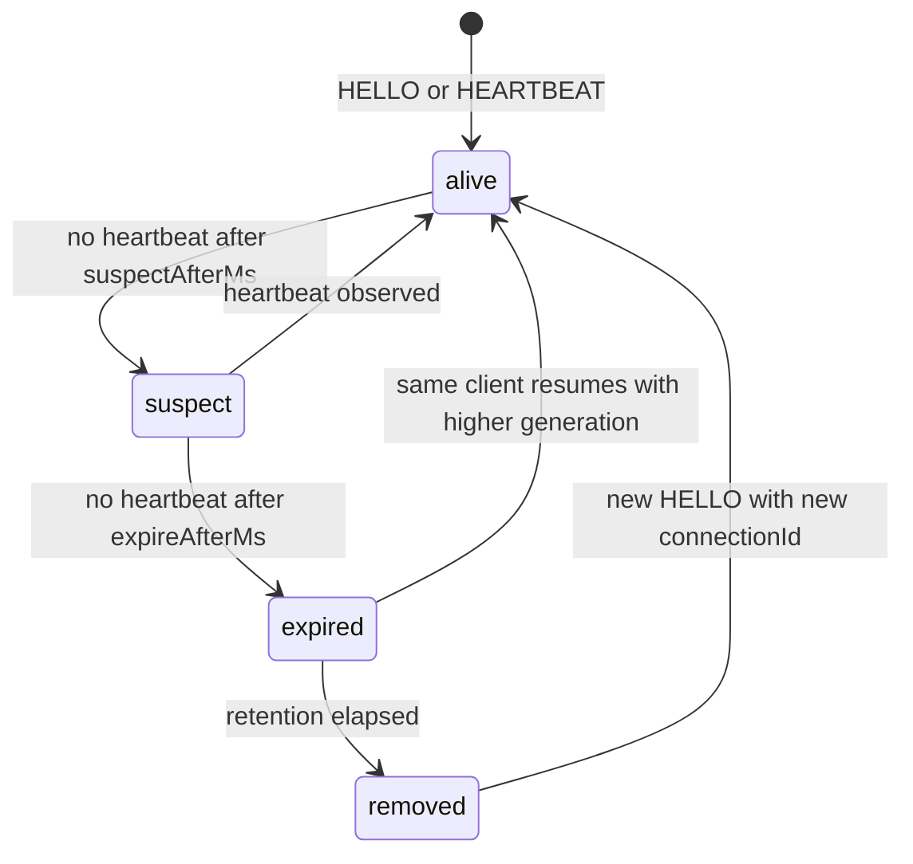
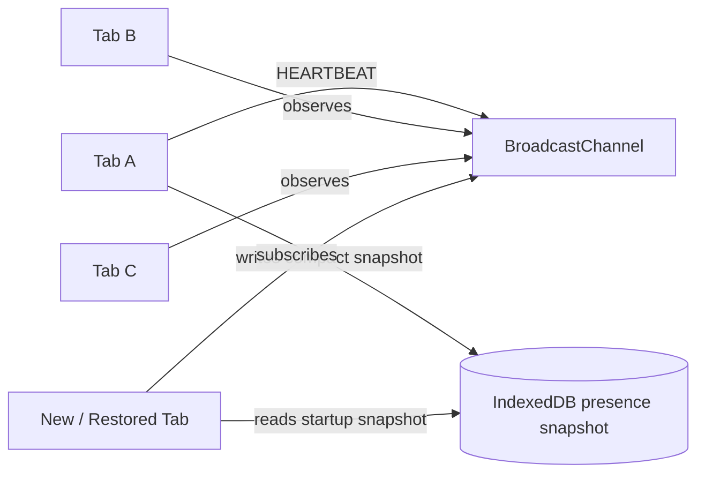
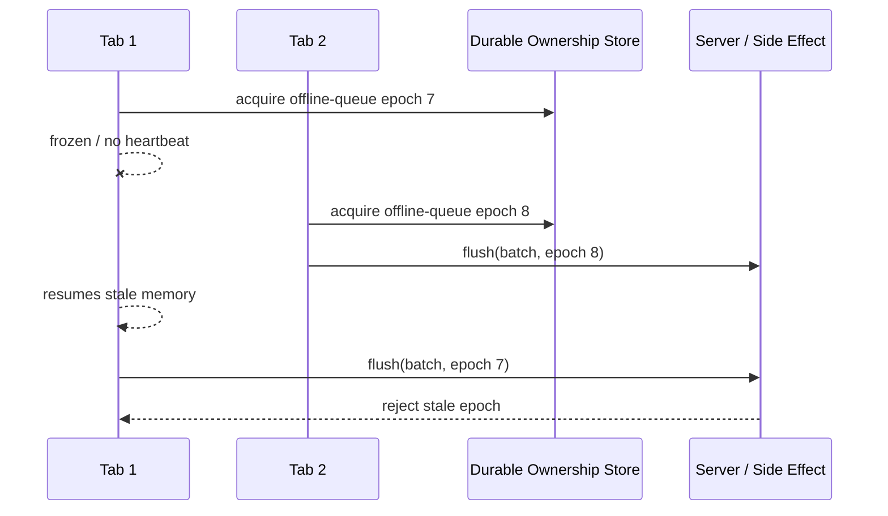

# Part 037 — Heartbeat, Liveness, and Dead Tab Detection

A tab registry tells us which browser contexts have announced themselves.

A heartbeat system tells us whether those contexts are still plausibly alive.

Those are not the same thing.

A tab can be registered but dead. A tab can be alive but temporarily unable to send timely heartbeats because it is hidden, frozen, throttled, busy, suspended, or restoring from the back-forward cache. A tab can send a `BYE` event during graceful navigation, but crash or discard without sending anything. A worker can stop while its owning tab still exists. A Service Worker can be activated while some clients still run older app code.

So liveness in the browser is not truth. It is an estimate.

The production question is not:

> “How do I know whether another tab is alive?”

The better question is:

> “How do I maintain a bounded-staleness estimate of liveness, and make every consumer safe when that estimate is wrong?”

That is the mental model for this part.

---

## 1. Presence vs Liveness

Presence answers:

> “Which clients have announced that they exist?”

Liveness answers:

> “Which clients have recently demonstrated progress?”

Readiness answers:

> “Which clients are currently able to accept responsibility for work?”

These are separate states.

A visible tab with an active event loop may be present, live, and ready.

A hidden tab may be present and live, but less ready.

A frozen tab may be present, not currently live, but not dead either.

A crashed tab may still be present in the last durable snapshot, but not live.

A newly restored tab may be live but not yet ready because its app state is stale.

Do not collapse all of this into `isOnline: true`.

That boolean is a trap.

A robust registry stores richer data:

```ts
type ClientLifecycle =
  | "active"
  | "passive"
  | "hidden"
  | "frozen"
  | "restored"
  | "closing"
  | "unknown";

type LivenessState =
  | "alive"
  | "suspect"
  | "expired"
  | "removed";

type ClientPresence = {
  tabId: string;
  connectionId: string;
  generation: number;
  role: "window" | "iframe" | "worker" | "shared-worker-client";
  appVersion: string;
  protocolVersion: number;
  lifecycle: ClientLifecycle;
  liveness: LivenessState;
  lastSeenWallTimeMs: number;
  lastHeartbeatSeq: number;
  startedAtWallTimeMs: number;
  capabilities: string[];
};
```

The registry should answer with uncertainty:

```ts
type PresenceSnapshot = {
  nowWallTimeMs: number;
  clients: ClientPresence[];
  approximate: true;
  reason: "local-observation" | "durable-snapshot" | "hub-snapshot";
};
```

That `approximate: true` is not decoration.

It is the contract.

---

## 2. Failure Detector Mental Model

Heartbeat is a failure detector.

A failure detector does not directly detect failure. It detects missing evidence of progress.

That distinction matters.

When a tab stops heartbeating, possible causes include:

- the tab closed,
- the tab crashed,
- the browser discarded it,
- the page is frozen,
- timers are throttled,
- the main thread is blocked,
- the device is overloaded,
- the browser process is under memory pressure,
- the message channel is delayed,
- the app bundle has a bug,
- the client is alive but running a different app version,
- the observer is the broken one.

The heartbeat system therefore has two jobs:

1. detect probable death quickly enough to recover useful work;
2. avoid unsafe decisions when the detection is wrong.

This leads to two design principles.

First:

> Missing heartbeat may justify suspicion. It does not prove death.

Second:

> Any irreversible action must be protected by a stronger ownership primitive than heartbeat alone.

Heartbeat can trigger election. It should not be the only proof of leadership.

---

## 3. The Four-State Liveness Machine

Use a state machine instead of a boolean.



The key states:

| State | Meaning | Safe assumptions |
|---|---|---|
| `alive` | Client recently sent heartbeat | Can be considered active for low-risk routing |
| `suspect` | Client missed expected heartbeat | Do not route new exclusive work to it |
| `expired` | Client exceeded liveness TTL | Treat ownership as lost unless fenced elsewhere |
| `removed` | Registry entry garbage-collected | No longer appears in normal snapshots |

Why not remove immediately?

Because delayed messages can arrive after suspicion. Operators need observability. Consumers may need to distinguish “unknown” from “known expired”. A restored tab may need to see that its old generation expired and start fresh.

Immediate deletion hides causality.

---

## 4. Lease-Based Liveness

The most useful abstraction is a lease.

A heartbeat extends a lease. If the lease expires, the client loses claims that depend on liveness.

```ts
type Lease = {
  ownerId: string;
  generation: number;
  lastRenewedAtWallTimeMs: number;
  expiresAtWallTimeMs: number;
};
```

A lease is not a lock.

A lease is a time-bounded claim.

The invariant is:

> A client may act under a lease only while it believes the lease is valid and all side effects are protected by fencing or idempotency.

This is especially important when a frozen tab wakes up. It may still believe it owns work from before it froze. Without fencing, it can perform stale side effects after a newer tab has taken over.

So every lease-based owner needs a fencing token:

```ts
type FencedLease = {
  resource: string;
  ownerId: string;
  epoch: number;
  expiresAtWallTimeMs: number;
};
```

The `epoch` increases whenever ownership changes. Any side effect must include the current epoch. Receivers reject stale epochs.

For example:

```ts
type SyncCommand = {
  kind: "SYNC_FLUSH";
  resource: "offline-queue";
  ownerId: string;
  epoch: number;
  batchId: string;
};
```

If the worker, server, IndexedDB record, or coordination layer sees an older epoch, it rejects the command.

Heartbeat alone says:

> “I was alive recently.”

Fencing says:

> “I am still the accepted owner generation for this resource.”

Do not confuse them.

---

## 5. Choosing Heartbeat Intervals

There is no universal correct interval.

The interval must fit the risk of the work being coordinated.

A notification suppression system can tolerate slower detection. A token refresh owner may need faster failover. A local sync loop may need moderate speed. A UI presence indicator should avoid flicker more than it needs instant accuracy.

Start with this table:

| Use case | Heartbeat interval | Suspect after | Expire after | Notes |
|---|---:|---:|---:|---|
| UI-only tab count | 10–20s | 30–45s | 60–120s | Prefer stability over speed |
| Notification suppression | 10–15s | 30s | 60s | False positives cause duplicate notifications |
| Token refresh ownership | 3–8s | 12–20s | 20–45s | Use Web Locks/fencing for actual ownership |
| Offline queue owner | 5–10s | 20–30s | 45–90s | Work must be idempotent |
| One websocket owner | 5–15s | 20–45s | 60–120s | Avoid rapid reconnect storms |
| Observability only | 15–60s | 2x interval | 3–5x interval | Low risk |

But browser lifecycle changes the policy.

A hidden tab may have delayed timers. A frozen page may not run timers at all. Mobile browsers can suspend aggressively. So use adaptive intervals:

```ts
type HeartbeatPolicy = {
  visibleIntervalMs: number;
  hiddenIntervalMs: number;
  suspectAfterMs: number;
  expireAfterMs: number;
  retentionAfterExpireMs: number;
  jitterRatio: number;
};

const DEFAULT_HEARTBEAT_POLICY: HeartbeatPolicy = {
  visibleIntervalMs: 5_000,
  hiddenIntervalMs: 15_000,
  suspectAfterMs: 20_000,
  expireAfterMs: 60_000,
  retentionAfterExpireMs: 5 * 60_000,
  jitterRatio: 0.2,
};
```

The interval should be shorter than `suspectAfterMs`, and `expireAfterMs` should be long enough to tolerate normal background delay.

The relationship is usually:

```txt
heartbeat interval < suspectAfter < expireAfter < retentionAfterExpire
```

Use jitter so every tab does not heartbeat at the same millisecond after app startup.

```ts
function withJitter(baseMs: number, ratio = 0.2): number {
  const spread = baseMs * ratio;
  return Math.round(baseMs - spread + Math.random() * spread * 2);
}
```

Jitter prevents synchronized spikes.

Small systems need it too.

---

## 6. Time Semantics: Wall Clock vs Monotonic Clock

Browser code has two common clocks:

- `Date.now()` gives wall-clock time.
- `performance.now()` gives monotonic time relative to the current context's time origin.

For cross-tab registry records, use wall-clock timestamps because they can be compared across contexts.

For local durations, use monotonic time.

```ts
type Clock = {
  wallNow(): number;
  monotonicNow(): number;
};

const browserClock: Clock = {
  wallNow: () => Date.now(),
  monotonicNow: () => performance.now(),
};
```

Wall clocks can jump because the user or OS changes time.

Monotonic clocks cannot be directly compared across tabs.

So the practical rule is:

| Need | Clock |
|---|---|
| Persist heartbeat timestamp to IndexedDB | `Date.now()` |
| Compare another tab's heartbeat age | `Date.now()` |
| Measure local task latency | `performance.now()` |
| Timeout an in-flight local request | `performance.now()` or `AbortSignal.timeout()` where available |
| Produce telemetry durations | `performance.now()` |

Defend against impossible wall-clock jumps:

```ts
function ageMs(now: number, lastSeen: number): number {
  // If system clock moved backward, do not produce negative age.
  return Math.max(0, now - lastSeen);
}
```

For highly sensitive ownership, do not trust wall-clock leases alone. Use Web Locks or a durable epoch/fencing record.

---

## 7. Heartbeat Message Contract

Heartbeat should be tiny.

It is control-plane traffic.

```ts
type HeartbeatMessage = {
  kind: "HEARTBEAT";
  protocolVersion: 1;
  tabId: string;
  connectionId: string;
  generation: number;
  seq: number;
  sentAtWallTimeMs: number;
  lifecycle: ClientLifecycle;
  appVersion: string;
  capabilities: string[];
};
```

Fields that matter:

| Field | Purpose |
|---|---|
| `tabId` | Stable identity for a logical tab session |
| `connectionId` | Identity for current runtime connection |
| `generation` | Increments after restart/restore/reconnect |
| `seq` | Detect duplicate, stale, or out-of-order heartbeat |
| `sentAtWallTimeMs` | Approximate sender wall-clock time |
| `lifecycle` | Helps observers interpret heartbeat cadence |
| `appVersion` | Detect version skew |
| `capabilities` | Avoid routing unsupported messages |

A stale heartbeat should be ignored:

```ts
function shouldAcceptHeartbeat(prev: ClientPresence | undefined, msg: HeartbeatMessage): boolean {
  if (!prev) return true;

  if (msg.tabId !== prev.tabId) return false;

  if (msg.generation < prev.generation) return false;

  if (msg.generation === prev.generation && msg.seq <= prev.lastHeartbeatSeq) {
    return false;
  }

  return true;
}
```

This matters because browser message delivery is not your database log.

Messages can be delayed. A restored tab can emit an old heartbeat. A duplicate message can arrive after a newer snapshot. Version-skewed clients can talk to the same channel.

Always treat heartbeat as an event with causality metadata.

---

## 8. Transport: Signal Fast, Persist Snapshot

A practical design uses two layers:

1. BroadcastChannel for fast volatile signals.
2. IndexedDB or another durable store for snapshots.



Why both?

BroadcastChannel is good for live notification. It is not durable.

IndexedDB is good for restoring state after missed messages. It is not a low-latency event bus.

So use BroadcastChannel to say:

> “Something changed.”

Use IndexedDB to answer:

> “What is the latest known snapshot?”

For simple apps, `localStorage` may be used as a coarse fallback, but do not write heartbeat every few seconds to localStorage if you can avoid it. It is synchronous and can hurt responsiveness.

A better compromise:

- send every heartbeat over BroadcastChannel;
- persist compact snapshot less frequently;
- persist immediately on important lifecycle transitions;
- persist on `hidden` as best effort;
- expire old entries during startup and periodic sweep.

---

## 9. Lifecycle-Aware Heartbeat

A tab's heartbeat cadence must react to lifecycle.

```ts
function currentLifecycle(): ClientLifecycle {
  if (document.visibilityState === "hidden") return "hidden";
  return "active";
}
```

But visibility is only one signal.

Also listen to:

- `visibilitychange`,
- `pagehide`,
- `pageshow`,
- `freeze` where supported,
- `resume` where supported,
- `beforeunload` only as best effort, not correctness.

A minimal lifecycle adapter:

```ts
type LifecycleListener = (state: ClientLifecycle) => void;

class PageLifecycleAdapter {
  private listeners = new Set<LifecycleListener>();

  start() {
    document.addEventListener("visibilitychange", this.onVisibilityChange);
    window.addEventListener("pagehide", this.onPageHide);
    window.addEventListener("pageshow", this.onPageShow);

    // Chromium Page Lifecycle events. Feature-detect in real code.
    document.addEventListener("freeze", this.onFreeze as EventListener);
    document.addEventListener("resume", this.onResume as EventListener);
  }

  stop() {
    document.removeEventListener("visibilitychange", this.onVisibilityChange);
    window.removeEventListener("pagehide", this.onPageHide);
    window.removeEventListener("pageshow", this.onPageShow);
    document.removeEventListener("freeze", this.onFreeze as EventListener);
    document.removeEventListener("resume", this.onResume as EventListener);
  }

  subscribe(listener: LifecycleListener) {
    this.listeners.add(listener);
    return () => this.listeners.delete(listener);
  }

  private emit(state: ClientLifecycle) {
    for (const listener of this.listeners) listener(state);
  }

  private onVisibilityChange = () => {
    this.emit(document.visibilityState === "hidden" ? "hidden" : "active");
  };

  private onPageHide = () => {
    this.emit("closing");
  };

  private onPageShow = () => {
    this.emit("restored");
  };

  private onFreeze = () => {
    this.emit("frozen");
  };

  private onResume = () => {
    this.emit("restored");
  };
}
```

When a tab becomes hidden, send one immediate heartbeat with lifecycle `hidden`.

When it restores, send one immediate heartbeat with a higher generation if necessary.

When it freezes, do not assume a final message will be delivered.

When it closes, send `BYE` as a hint only.

---

## 10. `BYE` Is an Optimization, Not Correctness

A graceful tab can send:

```ts
type ByeMessage = {
  kind: "BYE";
  protocolVersion: 1;
  tabId: string;
  connectionId: string;
  generation: number;
  reason: "pagehide" | "logout" | "manual-close" | "navigation" | "unknown";
  sentAtWallTimeMs: number;
};
```

Consumers can mark it as closing:

```ts
function applyBye(entry: ClientPresence, msg: ByeMessage): ClientPresence {
  if (msg.generation < entry.generation) return entry;
  if (msg.connectionId !== entry.connectionId) return entry;

  return {
    ...entry,
    lifecycle: "closing",
    liveness: "expired",
    lastSeenWallTimeMs: msg.sentAtWallTimeMs,
  };
}
```

But `BYE` must never be required.

Tabs crash. Browsers discard. Users kill apps. Mobile OSes suspend. Network process state changes. The page may be in bfcache. Some lifecycle handlers may not execute.

The invariant is:

> The system remains correct if `BYE` is never sent.

`BYE` improves speed. TTL preserves correctness.

---

## 11. Dead Tab Detection Algorithm

A simple observer sweep:

```ts
function classifyLiveness(nowWallTimeMs: number, lastSeenWallTimeMs: number, policy: HeartbeatPolicy): LivenessState {
  const age = Math.max(0, nowWallTimeMs - lastSeenWallTimeMs);

  if (age >= policy.expireAfterMs) return "expired";
  if (age >= policy.suspectAfterMs) return "suspect";
  return "alive";
}
```

Apply it during sweep:

```ts
type Registry = Map<string, ClientPresence>;

function sweepRegistry(registry: Registry, now: number, policy: HeartbeatPolicy): Registry {
  const next = new Map(registry);

  for (const [tabId, entry] of next) {
    const state = classifyLiveness(now, entry.lastSeenWallTimeMs, policy);

    const expiredAge = Math.max(0, now - entry.lastSeenWallTimeMs);
    const shouldRemove =
      state === "expired" &&
      expiredAge >= policy.expireAfterMs + policy.retentionAfterExpireMs;

    if (shouldRemove) {
      next.delete(tabId);
      continue;
    }

    next.set(tabId, { ...entry, liveness: state });
  }

  return next;
}
```

But there is a subtle design decision.

Who sweeps?

Options:

| Sweeper | Pros | Cons |
|---|---|---|
| Every tab sweeps locally | Simple, no central dependency | Snapshots may differ |
| SharedWorker sweeps | Central live hub | SharedWorker support/lifecycle limitations |
| Leader tab sweeps | Good for advanced orchestration | Requires election/lock correctness |
| Service Worker sweeps | Useful for client messaging/cache cases | Service Worker is event-driven, not always alive |

In many apps, every tab can sweep locally because presence is approximate.

For exclusive ownership decisions, do not rely on local sweep only. Use a stronger primitive.

---

## 12. Heartbeat Runtime Skeleton

Below is a compact but production-shaped runtime.

It intentionally separates:

- identity,
- lifecycle,
- transport,
- registry,
- timing policy.

```ts
type ControlMessage = HeartbeatMessage | ByeMessage;

type HeartbeatRuntimeOptions = {
  channelName: string;
  appVersion: string;
  protocolVersion: 1;
  capabilities: string[];
  policy: HeartbeatPolicy;
  clock: Clock;
};

class HeartbeatRuntime {
  private readonly channel: BroadcastChannel;
  private readonly tabId: string;
  private readonly connectionId = crypto.randomUUID();
  private generation = 1;
  private seq = 0;
  private lifecycle: ClientLifecycle = "active";
  private timer: number | undefined;
  private sweepTimer: number | undefined;
  private registry: Registry = new Map();
  private readonly lifecycleAdapter = new PageLifecycleAdapter();

  constructor(private readonly options: HeartbeatRuntimeOptions) {
    this.channel = new BroadcastChannel(options.channelName);
    this.tabId = this.loadOrCreateTabId();
  }

  start() {
    this.channel.addEventListener("message", this.onMessage);
    this.channel.addEventListener("messageerror", this.onMessageError);

    this.lifecycleAdapter.subscribe((state) => {
      this.lifecycle = state;
      if (state === "restored") this.generation++;
      this.emitHeartbeat();
      this.reschedule();
    });

    this.lifecycleAdapter.start();

    window.addEventListener("pagehide", this.onPageHide);

    this.emitHeartbeat();
    this.reschedule();
    this.startSweep();
  }

  stop() {
    window.removeEventListener("pagehide", this.onPageHide);
    this.lifecycleAdapter.stop();
    this.channel.removeEventListener("message", this.onMessage);
    this.channel.removeEventListener("messageerror", this.onMessageError);
    this.channel.close();

    if (this.timer !== undefined) window.clearTimeout(this.timer);
    if (this.sweepTimer !== undefined) window.clearInterval(this.sweepTimer);
  }

  snapshot(): PresenceSnapshot {
    return {
      nowWallTimeMs: this.options.clock.wallNow(),
      clients: [...this.registry.values()],
      approximate: true,
      reason: "local-observation",
    };
  }

  private emitHeartbeat() {
    const now = this.options.clock.wallNow();
    const msg: HeartbeatMessage = {
      kind: "HEARTBEAT",
      protocolVersion: this.options.protocolVersion,
      tabId: this.tabId,
      connectionId: this.connectionId,
      generation: this.generation,
      seq: ++this.seq,
      sentAtWallTimeMs: now,
      lifecycle: this.lifecycle,
      appVersion: this.options.appVersion,
      capabilities: this.options.capabilities,
    };

    this.applyHeartbeat(msg);
    this.channel.postMessage(msg);
  }

  private emitBye(reason: ByeMessage["reason"]) {
    const msg: ByeMessage = {
      kind: "BYE",
      protocolVersion: this.options.protocolVersion,
      tabId: this.tabId,
      connectionId: this.connectionId,
      generation: this.generation,
      reason,
      sentAtWallTimeMs: this.options.clock.wallNow(),
    };

    this.channel.postMessage(msg);
  }

  private onMessage = (event: MessageEvent<ControlMessage>) => {
    const msg = event.data;
    if (!msg || typeof msg !== "object") return;

    switch (msg.kind) {
      case "HEARTBEAT":
        this.applyHeartbeat(msg);
        break;
      case "BYE":
        this.applyBye(msg);
        break;
    }
  };

  private applyHeartbeat(msg: HeartbeatMessage) {
    const prev = this.registry.get(msg.tabId);
    if (!shouldAcceptHeartbeat(prev, msg)) return;

    this.registry.set(msg.tabId, {
      tabId: msg.tabId,
      connectionId: msg.connectionId,
      generation: msg.generation,
      role: "window",
      appVersion: msg.appVersion,
      protocolVersion: msg.protocolVersion,
      lifecycle: msg.lifecycle,
      liveness: "alive",
      lastSeenWallTimeMs: this.options.clock.wallNow(),
      lastHeartbeatSeq: msg.seq,
      startedAtWallTimeMs: prev?.startedAtWallTimeMs ?? msg.sentAtWallTimeMs,
      capabilities: msg.capabilities,
    });
  }

  private applyBye(msg: ByeMessage) {
    const prev = this.registry.get(msg.tabId);
    if (!prev) return;
    if (msg.generation < prev.generation) return;
    if (msg.connectionId !== prev.connectionId) return;

    this.registry.set(msg.tabId, {
      ...prev,
      lifecycle: "closing",
      liveness: "expired",
      lastSeenWallTimeMs: this.options.clock.wallNow(),
    });
  }

  private onMessageError = () => {
    // Increment telemetry. Do not crash the registry because one peer sent
    // non-deserializable data or incompatible structured-clone payload.
  };

  private onPageHide = () => {
    this.emitBye("pagehide");
  };

  private reschedule() {
    if (this.timer !== undefined) window.clearTimeout(this.timer);

    const base = this.lifecycle === "hidden"
      ? this.options.policy.hiddenIntervalMs
      : this.options.policy.visibleIntervalMs;

    this.timer = window.setTimeout(() => {
      this.emitHeartbeat();
      this.reschedule();
    }, withJitter(base, this.options.policy.jitterRatio));
  }

  private startSweep() {
    this.sweepTimer = window.setInterval(() => {
      this.registry = sweepRegistry(
        this.registry,
        this.options.clock.wallNow(),
        this.options.policy,
      );
    }, Math.max(1_000, Math.floor(this.options.policy.suspectAfterMs / 2)));
  }

  private loadOrCreateTabId(): string {
    const key = "orchestration.tabId";
    const existing = sessionStorage.getItem(key);
    if (existing) return existing;

    const created = crypto.randomUUID();
    sessionStorage.setItem(key, created);
    return created;
  }
}
```

This is intentionally not a complete library.

It is a shape.

The shape is more important than the exact code.

---

## 13. Handling Restored Tabs

Restored tabs are dangerous.

They may resume with old memory and stale assumptions.

A restored tab should:

1. increment generation or reconnect identity;
2. broadcast immediate heartbeat;
3. reload durable snapshot;
4. discard stale in-flight ownership;
5. revalidate app/session state;
6. resubscribe to channels;
7. recheck feature flags and app version;
8. reacquire any exclusive resource through proper locking.

The dangerous anti-pattern:

```ts
window.addEventListener("pageshow", () => {
  // Bad: assumes old in-memory leadership is still valid.
  if (wasLeaderBeforePageCache) {
    resumeSyncLoop();
  }
});
```

The safer pattern:

```ts
window.addEventListener("pageshow", async (event) => {
  generation++;
  emitHeartbeat();

  await reloadPresenceSnapshot();
  await invalidateInFlightOwnership();
  await recheckSession();

  if (event.persisted) {
    await reacquireLeadershipThroughLock();
  }
});
```

Do not let old memory become authority.

---

## 14. False Positives and False Negatives

Failure detection has two common errors.

A false positive means:

> You think a tab is dead, but it is alive.

A false negative means:

> You think a tab is alive, but it is dead.

Both happen.

| Error | Browser cause | Consequence | Mitigation |
|---|---|---|---|
| False positive | background throttling, freeze, long task | duplicate owner, duplicate notification | suspect state, long TTL, fencing |
| False negative | stale durable snapshot | work routed to dead tab | expiry sweep, ACK timeout |
| False positive | observer's timer delayed | unnecessary election | Web Locks, jitter, grace window |
| False negative | missed `BYE` | ghost tab | TTL expiration |
| False positive | version-skewed heartbeat parser | client ignored | protocol compatibility window |

You cannot eliminate these errors.

You can design so they are cheap.

---

## 15. Dead Tab Detection Is Not Work Stealing

When a tab expires, another tab may take over work.

But expiry is not sufficient for safe takeover.

Example:

```txt
T1 owns offline queue epoch 7
T1 freezes
T2 sees T1 expire
T2 starts offline queue epoch 8
T1 resumes and continues epoch 7
```

If the queue flush API does not reject stale epoch 7, both tabs may send duplicate writes.

The correct design:



Heartbeat decides when to try takeover.

Fencing decides whether the takeover is safe.

---

## 16. Registry Consumers

Different consumers should interpret liveness differently.

### 16.1 UI Tab Count

UI count can show approximate state:

```ts
const visibleClients = snapshot.clients.filter(c => c.liveness !== "removed");
```

It can include suspect clients to avoid flicker.

### 16.2 Direct Message Routing

Routing should require `alive` or a recent ACK.

```ts
function canRouteDirectly(client: ClientPresence): boolean {
  return client.liveness === "alive" && client.lifecycle !== "closing";
}
```

If no direct route is safe, fall back to durable queue.

### 16.3 Exclusive Work

Exclusive work should not rely on liveness alone.

```ts
async function maybeStartExclusiveWork(resource: string) {
  const candidates = snapshot.clients.filter(c => c.liveness === "alive");

  if (!isBestCandidate(localTab, candidates)) return;

  await acquireRealOwnership(resource); // Web Locks or durable fenced lease.
}
```

### 16.4 Notification Suppression

Notification suppression should prefer conservative behavior:

- if any visible tab is alive, suppress background notification;
- if only hidden/suspect tabs exist, decide based on product policy;
- never use stale presence to hide security-critical notification forever.

### 16.5 Token Refresh

Token refresh should use heartbeat only as a hint.

The actual refresh owner should be guarded by Web Locks or a durable lease.

---

## 17. Heartbeat Storms

A heartbeat storm happens when many tabs emit at the same time.

Triggers:

- app startup after browser restore,
- user opens many tabs from session restore,
- visibility changes across multiple tabs,
- Service Worker update notification,
- token expiry event broadcast,
- synchronized interval timers.

Mitigations:

1. jitter all periodic timers;
2. coalesce lifecycle-triggered heartbeats;
3. cap broadcast payload size;
4. use one durable snapshot write per time window;
5. avoid writing every heartbeat to localStorage;
6. use leader/hub for aggregation when available;
7. expose telemetry for heartbeat rate.

Coalescing example:

```ts
class CoalescedEmitter {
  private timer: number | undefined;

  constructor(private readonly emit: () => void, private readonly delayMs: number) {}

  request() {
    if (this.timer !== undefined) return;
    this.timer = window.setTimeout(() => {
      this.timer = undefined;
      this.emit();
    }, this.delayMs);
  }
}
```

Do not build a distributed thundering herd inside the user's browser.

---

## 18. Security Boundary

Heartbeat messages are same-origin signals.

That does not mean they are trusted.

A compromised script running in the origin can emit fake heartbeats.

So heartbeat must not carry secrets:

Bad:

```ts
channel.postMessage({
  kind: "HEARTBEAT",
  accessToken,
  refreshToken,
  userProfile,
});
```

Better:

```ts
channel.postMessage({
  kind: "HEARTBEAT",
  tabId,
  connectionId,
  generation,
  seq,
  lifecycle,
  capabilities,
});
```

Do not put tokens, PII, raw claims, or sensitive authorization state inside control-plane traffic.

Also validate incoming messages:

```ts
function isHeartbeatMessage(value: unknown): value is HeartbeatMessage {
  if (!value || typeof value !== "object") return false;
  const msg = value as Partial<HeartbeatMessage>;
  return msg.kind === "HEARTBEAT"
    && msg.protocolVersion === 1
    && typeof msg.tabId === "string"
    && typeof msg.connectionId === "string"
    && typeof msg.generation === "number"
    && typeof msg.seq === "number"
    && typeof msg.sentAtWallTimeMs === "number";
}
```

Schema validation is not optional in long-lived multi-context systems.

---

## 19. Observability

You need telemetry, otherwise liveness bugs look random.

Track:

| Metric | Meaning |
|---|---|
| `presence.clients.alive` | Count of alive clients |
| `presence.clients.suspect` | Count of suspect clients |
| `presence.clients.expired` | Count of expired clients |
| `presence.heartbeat.sent` | Local heartbeats sent |
| `presence.heartbeat.received` | Heartbeats observed |
| `presence.heartbeat.stale` | Stale heartbeats ignored |
| `presence.heartbeat.message_error` | Deserialization failures |
| `presence.bye.received` | Graceful close hints |
| `presence.sweep.duration_ms` | Local sweep cost |
| `presence.registry.size` | Entry count before GC |

Also log sampled state transitions:

```ts
type LivenessTransitionLog = {
  event: "liveness.transition";
  tabIdHash: string;
  from: LivenessState;
  to: LivenessState;
  ageMs: number;
  lifecycle: ClientLifecycle;
  appVersion: string;
};
```

Hash or redact identifiers before sending telemetry.

You need enough observability to answer:

- Are hidden tabs being falsely expired too often?
- Did a new browser version change timer behavior?
- Are many clients stuck in `suspect` after deployment?
- Are message payloads failing deserialization?
- Did version skew increase after rollout?

---

## 20. Testing Matrix

Test the failure detector as a system, not as isolated functions.

| Scenario | Expected behavior |
|---|---|
| Two tabs open | Both see each other alive |
| One tab closes gracefully | Other marks closing/expired quickly |
| One tab crashes/no BYE | Other marks suspect then expired after TTL |
| Hidden tab delays heartbeat | Other may mark suspect but should not perform unsafe side effects |
| Tab restores from bfcache | Generation increases or stale work invalidates |
| Duplicate heartbeat arrives | Ignored by seq/generation |
| Old generation heartbeat arrives | Ignored |
| Malformed message arrives | Count message error, do not crash |
| Many tabs restore at once | Jitter prevents synchronized storm |
| Version-skewed tab joins | Capabilities/version recorded; unsupported messages avoided |

Playwright can help with multi-page tests:

```ts
test("marks closed tab as expired", async ({ browser }) => {
  const context = await browser.newContext();
  const a = await context.newPage();
  const b = await context.newPage();

  await a.goto(appUrl);
  await b.goto(appUrl);

  await expect.poll(() => b.evaluate(() => window.__presenceSnapshot().clients.length))
    .toBeGreaterThanOrEqual(2);

  await a.close();

  await expect.poll(() => b.evaluate(() => {
    return window.__presenceSnapshot().clients.some(
      (c: any) => c.liveness === "expired"
    );
  }), { timeout: 70_000 }).toBe(true);
});
```

Expose test hooks deliberately.

Do not test orchestration only through DOM side effects.

---

## 21. Common Anti-Patterns

### Anti-pattern 1: `unload` as correctness

```ts
window.addEventListener("unload", () => markTabDead(tabId));
```

This is not enough.

The event may not fire, may be restricted, and may harm bfcache behavior.

Use TTL.

### Anti-pattern 2: heartbeat means leadership

```ts
if (leaderLastSeenRecently) {
  doNothing();
} else {
  becomeLeader();
}
```

This can produce split brain.

Use heartbeat to trigger acquisition. Use Web Locks or fenced lease to own work.

### Anti-pattern 3: one global `isAlive`

```ts
type Tab = { id: string; isAlive: boolean };
```

This loses lifecycle, generation, staleness, and confidence.

Use state plus timestamps.

### Anti-pattern 4: persisting every heartbeat synchronously

```ts
setInterval(() => {
  localStorage.setItem("heartbeat", JSON.stringify(largePayload));
}, 1000);
```

This can cause main-thread pressure.

Broadcast frequently; persist compact snapshots selectively.

### Anti-pattern 5: large heartbeat payloads

Heartbeat should not carry application state.

It should carry identity, generation, seq, lifecycle, and capability hints.

---

## 22. Production Checklist

Before using heartbeat for real orchestration, verify:

- [ ] Heartbeat message has `tabId`, `connectionId`, `generation`, and `seq`.
- [ ] Registry uses `alive`, `suspect`, `expired`, not boolean liveness.
- [ ] TTL is tuned separately from heartbeat interval.
- [ ] Hidden/frozen/restored lifecycle is handled.
- [ ] `BYE` is treated as best-effort only.
- [ ] Stale generations are ignored.
- [ ] Duplicate and out-of-order messages are ignored.
- [ ] Message validation exists.
- [ ] Heartbeat payload contains no secrets.
- [ ] Jitter is applied.
- [ ] Dead-tab detection does not directly grant exclusive ownership.
- [ ] Exclusive work uses Web Locks or fenced durable lease.
- [ ] Observability exists for transitions and message errors.
- [ ] Tests cover crash/no-BYE, restore, hidden delay, and version skew.

---

## 23. Mental Model

Think of heartbeat as a lease-renewal signal in a hostile runtime.

A tab is not alive because it once registered.

A tab is not dead because it missed one heartbeat.

A tab is not safe to own exclusive work because every other tab looks expired.

A production browser orchestrator separates three layers:

1. presence: who has announced itself;
2. liveness: who has recently shown progress;
3. ownership: who is allowed to perform side effects.

Heartbeat handles the second layer.

It supports ownership.

It does not replace ownership.

That distinction is what keeps multi-tab systems from turning into race-condition generators.

---

## References

- MDN — Broadcast Channel API: https://developer.mozilla.org/en-US/docs/Web/API/Broadcast_Channel_API
- MDN — BroadcastChannel `messageerror`: https://developer.mozilla.org/en-US/docs/Web/API/BroadcastChannel/messageerror_event
- MDN — Page Visibility API: https://developer.mozilla.org/en-US/docs/Web/API/Page_Visibility_API
- MDN — Document `visibilitychange`: https://developer.mozilla.org/en-US/docs/Web/API/Document/visibilitychange_event
- MDN — Web Locks API: https://developer.mozilla.org/en-US/docs/Web/API/Web_Locks_API
