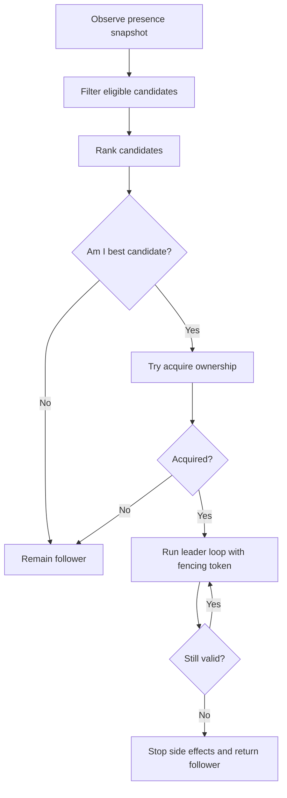
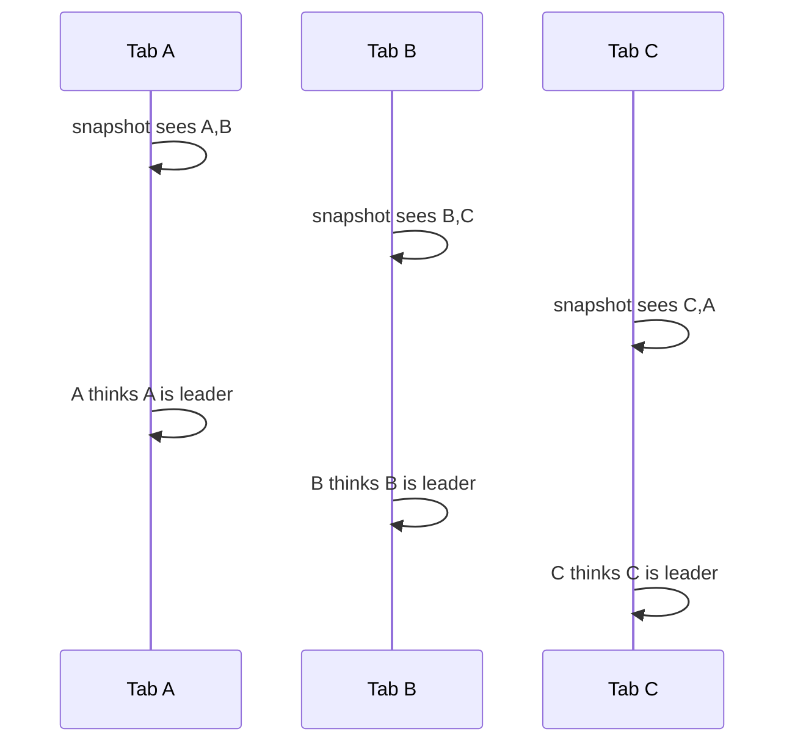
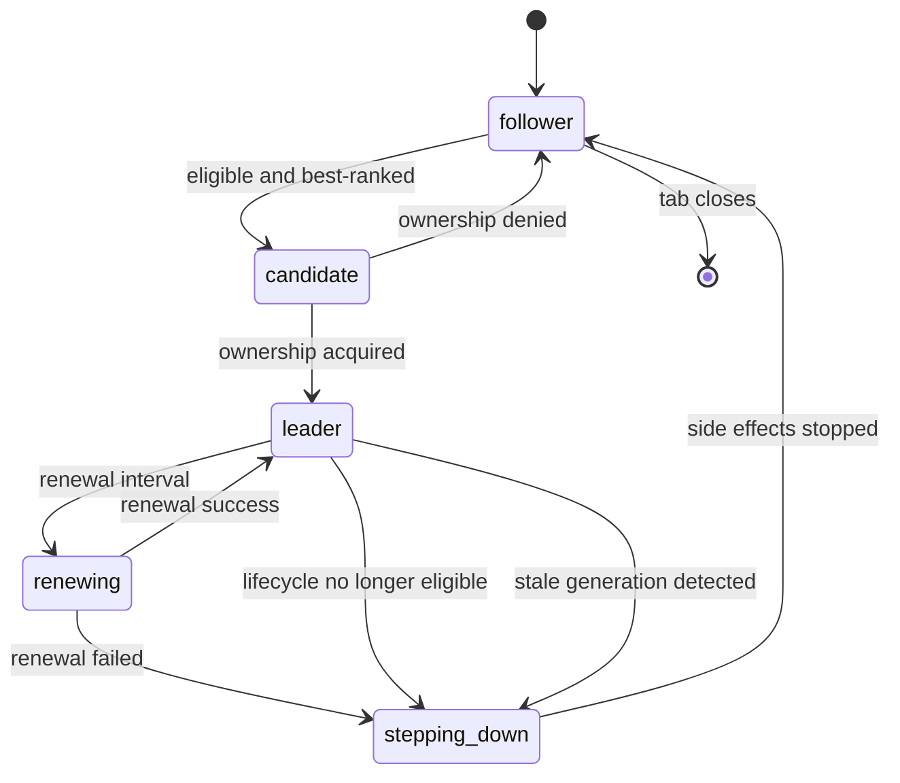
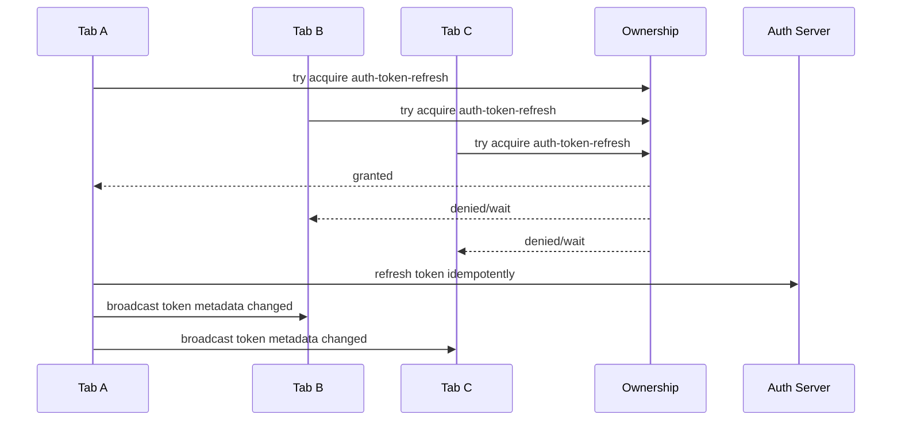
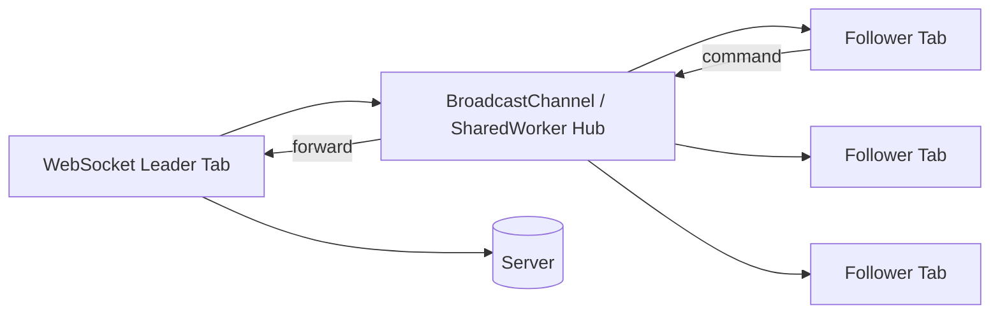

# Part 038 — Leader Election Basics

Leader election answers one question:

> “Among multiple live browser contexts, which one should coordinate a shared responsibility right now?”

That sounds simple.

It is not.

In browser applications, leader election is usually introduced because a team wants to avoid duplicate work:

- only one tab should own a WebSocket;
- only one tab should refresh an auth token;
- only one tab should flush the offline queue;
- only one tab should run cache revalidation;
- only one tab should show a notification;
- only one tab should execute an expensive background sync;
- only one tab should perform IndexedDB migration;
- only one tab should coordinate Service Worker update UX.

The mistake is assuming “choose one tab” is the hard part.

It is not.

The hard part is maintaining safety when the chosen tab disappears, freezes, resumes stale memory, runs old code, misses messages, races another tab, or performs side effects after losing leadership.

This part is intentionally called **Leader Election Basics**.

The next part will use Web Locks for a stronger implementation. Here we build the mental model and invariants first.

---

## 1. What Leadership Means

Leadership is not status.

Leadership is permission to coordinate a resource.

```ts
type Leadership = {
  resource: string;
  leaderId: string;
  epoch: number;
  acquiredAtWallTimeMs: number;
  expiresAtWallTimeMs?: number;
};
```

A tab can be leader for one resource and follower for another.

Example:

```txt
Tab A: leader for websocket
Tab B: leader for token-refresh
Tab C: leader for cache-revalidation
```

This is often better than one global browser leader.

A global leader becomes overloaded and increases blast radius.

Resource-scoped leadership gives finer control:

```ts
type ResourceName =
  | "auth-token-refresh"
  | "offline-queue-flush"
  | "notification-suppression"
  | "websocket-owner"
  | "cache-revalidation"
  | "schema-migration";
```

Use resource-scoped leadership unless you have a clear reason not to.

---

## 2. Election vs Lock vs Lease vs Consensus

These terms are often mixed together.

They are not the same.

| Concept | Browser meaning |
|---|---|
| Election | Deciding which candidate should try to coordinate |
| Lock | Exclusive access to a resource while held |
| Lease | Time-bounded ownership that expires if not renewed |
| Fencing token | Monotonic token used to reject stale owners |
| Consensus | Agreement protocol among distributed nodes; usually overkill inside browser tabs |

For browser tabs, you usually need:

```txt
election hint + exclusive acquisition + fencing + idempotent side effects
```

Election alone is not enough.

A tab may be elected and then freeze. Another tab may elect itself after TTL. The old tab may resume. Without fencing, both can perform side effects.

So the real invariant is not:

> “Only one tab thinks it is leader.”

That invariant is too strong for a browser runtime.

The practical invariant is:

> “Only the current fenced owner can successfully perform leader-protected side effects.”

This is more achievable.

---

## 3. Leadership Invariants

Before choosing an algorithm, define invariants.

### 3.1 Safety

At most one effective leader may perform protected side effects for a resource at a time.

“Effective” matters.

Two tabs may temporarily believe they are leader during failure. That is bad but sometimes unavoidable with weak primitives. The side-effect layer must reject stale leadership.

### 3.2 Liveness

If at least one eligible tab remains alive long enough, the system should eventually get a leader.

A system that never duplicates work but also never recovers is not useful.

### 3.3 Bounded stale ownership

A leader that stops making progress should eventually lose ownership.

This is where heartbeat and lease expiration matter.

### 3.4 Fencing

Every leadership epoch must be distinguishable from older epochs.

```ts
type LeadershipToken = {
  resource: string;
  ownerId: string;
  epoch: number;
};
```

### 3.5 Idempotency

Leader work must survive duplicate attempts.

Even with good election, retry and failover can duplicate work.

### 3.6 Lifecycle awareness

Hidden/frozen/restored states must affect leadership readiness.

A frozen tab should not remain the preferred owner forever.

---

## 4. Candidate Eligibility

Not every tab should be allowed to lead.

A tab can be present but not eligible.

Eligibility depends on resource.

```ts
type Candidate = {
  tabId: string;
  connectionId: string;
  generation: number;
  lifecycle: "active" | "hidden" | "frozen" | "restored" | "closing" | "unknown";
  liveness: "alive" | "suspect" | "expired" | "removed";
  appVersion: string;
  protocolVersion: number;
  capabilities: string[];
  startedAtWallTimeMs: number;
};

function isEligibleForResource(candidate: Candidate, resource: ResourceName): boolean {
  if (candidate.liveness !== "alive") return false;
  if (candidate.lifecycle === "closing") return false;
  if (candidate.lifecycle === "frozen") return false;

  switch (resource) {
    case "auth-token-refresh":
      return candidate.capabilities.includes("auth.refresh.v1");
    case "offline-queue-flush":
      return candidate.capabilities.includes("offline.flush.v1");
    case "websocket-owner":
      return candidate.capabilities.includes("ws.owner.v1");
    default:
      return true;
  }
}
```

A hidden tab may be eligible for some resources and not others.

For example:

| Resource | Hidden tab eligible? | Reason |
|---|---:|---|
| Auth token refresh | Usually yes | Better than forcing visible tab only |
| Notification suppression | Maybe | Product-dependent |
| WebSocket owner | Maybe | Hidden throttling may hurt reconnect behavior |
| UI prompt coordinator | No | User cannot see it |
| CPU-heavy sync | Usually no | Avoid battery/performance impact |
| Schema migration | Yes, if locked | Must be exclusive and quick |

Eligibility is policy.

Do not bake it into the transport.

---

## 5. Election Algorithm Shape

Most browser leader election implementations follow this shape:



The two important steps are:

1. ranking candidates;
2. acquiring ownership.

Ranking is only a hint.

Acquisition is the authority.

In Part 039, acquisition will be done with Web Locks. For now, we will examine the weaker algorithms so the failure modes are obvious.

---

## 6. Ranking Candidates

A deterministic ranking prevents every tab from trying to lead at once.

Common ranking strategies:

| Strategy | Meaning | Problem |
|---|---|---|
| Oldest tab wins | lowest `startedAt` | Old hidden/frozen tabs may lead forever |
| Newest tab wins | highest `startedAt` | Leadership churn on new tab open |
| Lowest random id wins | stable deterministic | No lifecycle awareness |
| Visible tab wins | active UX priority | Leader changes during tab switch |
| Capability score wins | most suitable tab leads | More complex |
| Hybrid score | lifecycle + capability + stability | Usually best |

A practical scoring function:

```ts
function scoreCandidate(c: Candidate, resource: ResourceName): number {
  let score = 0;

  if (c.lifecycle === "active") score += 100;
  if (c.lifecycle === "hidden") score += 40;
  if (c.lifecycle === "restored") score += 20;

  if (c.capabilities.includes(`${resource}.preferred`)) score += 30;

  // Prefer stable older tabs slightly, but do not dominate lifecycle.
  const ageMs = Date.now() - c.startedAtWallTimeMs;
  score += Math.min(20, Math.floor(ageMs / 60_000));

  return score;
}

function compareCandidates(a: Candidate, b: Candidate, resource: ResourceName): number {
  const scoreDiff = scoreCandidate(b, resource) - scoreCandidate(a, resource);
  if (scoreDiff !== 0) return scoreDiff;

  // Deterministic tie breaker.
  return a.tabId.localeCompare(b.tabId);
}
```

Deterministic ranking reduces noise.

It does not guarantee safety.

---

## 7. Weak Algorithm 1: Broadcast-Only Election

The simplest algorithm:

1. every tab broadcasts heartbeat;
2. every tab builds candidate list;
3. every tab independently ranks candidates;
4. the top-ranked candidate considers itself leader.

```ts
function amILeader(snapshot: PresenceSnapshot, local: Candidate, resource: ResourceName): boolean {
  const candidates = snapshot.clients
    .filter((c): c is Candidate => isEligibleForResource(c as Candidate, resource))
    .sort((a, b) => compareCandidates(a, b, resource));

  return candidates[0]?.tabId === local.tabId;
}
```

This is attractive because it needs no storage and no lock.

It is unsafe for exclusive side effects.

Why?

Each tab has a different local snapshot.



Broadcast-only election can be acceptable for low-risk UI behavior:

- choosing which tab updates a badge;
- choosing which tab writes non-critical telemetry;
- choosing a debug coordinator;
- choosing a preferred candidate before lock acquisition.

It is not acceptable for token refresh, migration, queue flushing, or server side effects unless those side effects are separately fenced/idempotent.

---

## 8. Weak Algorithm 2: localStorage Claim

Another common attempt:

```ts
localStorage.setItem("leader", JSON.stringify({ tabId, expiresAt }));
```

Then every tab reads the key and tries to claim if expired.

The problem: read-check-write is not a robust distributed lock.

```ts
const current = JSON.parse(localStorage.getItem("leader") ?? "null");

if (!current || current.expiresAt < Date.now()) {
  localStorage.setItem("leader", JSON.stringify({ tabId, expiresAt: Date.now() + 30_000 }));
  // Do I own it? Maybe. Maybe another tab wrote at the same time.
}
```

You can read back after writing:

```ts
function tryClaimLeader(resource: string, tabId: string): boolean {
  const key = `leader.${resource}`;
  const expiresAt = Date.now() + 30_000;

  localStorage.setItem(key, JSON.stringify({ tabId, expiresAt }));

  const after = JSON.parse(localStorage.getItem(key) ?? "null");
  return after?.tabId === tabId && after?.expiresAt === expiresAt;
}
```

This reduces some races but does not make the design great.

Issues:

- `localStorage` operations are synchronous on the main thread;
- no built-in atomic compare-and-swap;
- stale owners can resume;
- clocks can jump;
- payload parsing can fail;
- all tabs contend on the same key;
- no fairness;
- storage may be unavailable or partitioned in some contexts;
- correctness depends on everyone following the protocol.

For serious work, prefer Web Locks or IndexedDB transaction-based fenced ownership.

Use localStorage claim only for simple compatibility fallback, and keep side effects idempotent.

---

## 9. Weak Algorithm 3: IndexedDB Lease Record

IndexedDB gives transactions, which can support better ownership records.

A leader record can look like this:

```ts
type LeaderRecord = {
  resource: string;
  ownerId: string;
  connectionId: string;
  generation: number;
  epoch: number;
  acquiredAtWallTimeMs: number;
  renewedAtWallTimeMs: number;
  expiresAtWallTimeMs: number;
  appVersion: string;
};
```

The acquisition algorithm:

1. open a readwrite transaction;
2. read record for resource;
3. if missing/expired/same owner, write new record;
4. increment epoch on owner change;
5. commit transaction;
6. read back or rely on committed transaction result;
7. run side effects with epoch.

Pseudo-code:

```ts
async function tryAcquireIndexedDbLease(input: {
  resource: string;
  ownerId: string;
  connectionId: string;
  generation: number;
  leaseMs: number;
  appVersion: string;
}): Promise<LeaderRecord | null> {
  return runReadWriteTransaction("leaderStore", async (store) => {
    const now = Date.now();
    const current = await store.get(input.resource) as LeaderRecord | undefined;

    const currentStillValid = current && current.expiresAtWallTimeMs > now;
    const sameOwner = current?.ownerId === input.ownerId
      && current?.connectionId === input.connectionId
      && current?.generation === input.generation;

    if (currentStillValid && !sameOwner) {
      return null;
    }

    const next: LeaderRecord = {
      resource: input.resource,
      ownerId: input.ownerId,
      connectionId: input.connectionId,
      generation: input.generation,
      epoch: sameOwner ? current!.epoch : (current?.epoch ?? 0) + 1,
      acquiredAtWallTimeMs: sameOwner ? current!.acquiredAtWallTimeMs : now,
      renewedAtWallTimeMs: now,
      expiresAtWallTimeMs: now + input.leaseMs,
      appVersion: input.appVersion,
    };

    await store.put(next, input.resource);
    return next;
  });
}
```

This is much better than broadcast-only election.

But it is still not perfect:

- lease depends on wall clock;
- a frozen old owner may resume stale work;
- every side effect still needs epoch checking;
- transaction code must handle blocked upgrades/version changes;
- IndexedDB failure or quota issues must be handled;
- some resource ownership is better represented as a Web Lock.

IndexedDB lease is useful when you need durable leadership state or a fencing epoch.

Web Locks is usually simpler for live mutual exclusion.

---

## 10. Stronger Shape: Election Hint + Lock Acquisition

The most practical shape is:

1. heartbeat builds presence;
2. ranking chooses best candidate;
3. best candidate tries to acquire a lock;
4. lock holder performs work;
5. work includes fencing or idempotency where needed;
6. lock is released when done or when context dies.

```ts
async function leaderLoop(resource: ResourceName) {
  const snapshot = presence.snapshot();

  if (!amIBestCandidate(snapshot, localCandidate(), resource)) {
    return;
  }

  await navigator.locks.request(resource, { ifAvailable: true }, async (lock) => {
    if (!lock) return;

    const token = await createOrReadFencingToken(resource);
    await runLeaderWork(resource, token);
  });
}
```

This preview uses Web Locks, which will be explored deeply in Part 039.

The key principle:

> Election should reduce contention; lock acquisition should decide authority.

---

## 11. Leadership State Machine

A local tab should model leadership explicitly.



A TypeScript model:

```ts
type LeadershipState =
  | { kind: "follower" }
  | { kind: "candidate"; resource: ResourceName; startedAt: number }
  | { kind: "leader"; resource: ResourceName; token: LeadershipToken; startedAt: number }
  | { kind: "stepping-down"; resource: ResourceName; reason: string };
```

Never represent leadership as only:

```ts
let isLeader = false;
```

That loses token, resource, epoch, transition reason, and recovery behavior.

---

## 12. Step-Down Semantics

Becoming leader is not enough.

You also need to stop being leader safely.

A tab should step down when:

- lock is lost or callback ends;
- lease renewal fails;
- app goes to unsupported lifecycle state;
- protocol version becomes incompatible;
- session changes;
- logout happens;
- generation changes;
- fatal error occurs;
- another owner with higher epoch is observed;
- the tab is closing;
- browser goes offline for a resource requiring network.

Step-down must cancel leader work:

```ts
class LeaderController {
  private abortController: AbortController | undefined;

  async start(token: LeadershipToken) {
    this.abortController = new AbortController();
    await runLeaderLoop(token, this.abortController.signal);
  }

  async stop(reason: string) {
    this.abortController?.abort(reason);
    this.abortController = undefined;
    await flushLeaderTelemetry(reason);
  }
}
```

If leader work cannot be cancelled, it must be fenced.

Prefer both.

---

## 13. Fencing Tokens

Fencing is the difference between “probably safe” and “designed for stale owners”.

A fencing token is monotonically increasing per resource.

```ts
type FencingToken = {
  resource: string;
  epoch: number;
  ownerId: string;
};
```

Every protected side effect includes it:

```ts
await server.flushOfflineQueue({
  batchId,
  operations,
  fencing: token,
});
```

The receiver rejects stale epochs:

```ts
function acceptSideEffect(currentEpoch: number, requestEpoch: number): boolean {
  return requestEpoch >= currentEpoch;
}
```

For server-side effects, the server should maintain the accepted epoch or idempotency key.

For IndexedDB effects, the transaction can check the current epoch before applying changes.

For in-memory worker effects, the worker can reject stale owner messages.

```ts
type WorkerCommand = {
  kind: "RUN_INDEXING";
  owner: FencingToken;
  jobId: string;
};

function handleWorkerCommand(command: WorkerCommand) {
  if (command.owner.epoch < currentOwnerEpoch(command.owner.resource)) {
    return { ok: false, error: "STALE_OWNER" };
  }

  return runJob(command);
}
```

Heartbeat tells you when to suspect.

Fencing protects you when suspicion is wrong.

---

## 14. Leader Responsibilities Should Be Small

A leader should coordinate, not hoard.

Bad leader design:

```txt
leader owns websocket
leader owns token refresh
leader owns offline queue
leader owns cache update
leader owns notification UX
leader owns migrations
leader owns analytics
```

This creates a browser-side single point of failure.

Better:

```txt
resource-specific leaders
short-lived ownership
bounded leader loops
idempotent work batches
clear step-down
separate observability
```

A leader should do one of these:

- serialize a specific resource;
- deduplicate one class of work;
- act as a coordinator for a bounded period;
- own a single long-lived connection when necessary.

Leadership is not a promotion.

It is a temporary burden.

---

## 15. Long-Lived vs Short-Lived Leadership

Not all leadership should be long-lived.

| Type | Example | Design |
|---|---|---|
| Short-lived | schema migration | acquire, run, release |
| Periodic | cache revalidation | acquire per cycle |
| Lease-renewed | offline queue owner | renew while active |
| Long-lived | WebSocket owner | hold while useful; step down on lifecycle |
| UI-scoped | update banner coordinator | visible tab preferred |

Prefer short-lived leadership when possible.

Long-lived leadership requires more lifecycle and recovery logic.

Example short-lived task:

```ts
async function runSingleFlightMigration() {
  await navigator.locks.request("schema-migration", async () => {
    await migrateIfNeeded();
  });
}
```

Example long-lived loop:

```ts
async function runSocketOwner(signal: AbortSignal) {
  const socket = new WebSocket(url);

  signal.addEventListener("abort", () => {
    socket.close(1000, "leader step down");
  });

  await waitForSocketClosed(socket, signal);
}
```

Use long-lived leadership only when the resource itself is long-lived.

---

## 16. Election Triggers

Do not run election only on intervals.

Run it when meaningful events occur:

- startup;
- heartbeat snapshot changes;
- leader becomes suspect;
- leader expires;
- local lifecycle changes;
- app becomes visible;
- network comes online;
- session changes;
- capability flags change;
- Service Worker update occurs;
- lock/lease acquisition fails and backoff expires;
- leader explicitly steps down.

But coalesce triggers.

```ts
class ElectionScheduler {
  private timer: number | undefined;

  constructor(private readonly run: () => Promise<void>) {}

  request(reason: string) {
    recordElectionTrigger(reason);

    if (this.timer !== undefined) return;

    this.timer = window.setTimeout(async () => {
      this.timer = undefined;
      await this.run();
    }, 100 + Math.random() * 300);
  }
}
```

Without coalescing, every heartbeat can cause every tab to run election.

That is unnecessary noise.

---

## 17. Backoff

If a tab fails to acquire leadership, it should back off.

```ts
type Backoff = {
  attempt: number;
  nextDelayMs(): number;
  reset(): void;
};

class ExponentialBackoff implements Backoff {
  attempt = 0;

  constructor(
    private readonly baseMs = 250,
    private readonly maxMs = 10_000,
  ) {}

  nextDelayMs() {
    const raw = Math.min(this.maxMs, this.baseMs * 2 ** this.attempt++);
    return Math.round(raw * (0.5 + Math.random()));
  }

  reset() {
    this.attempt = 0;
  }
}
```

Backoff prevents contention when:

- many tabs start together;
- leader disappears;
- storage is temporarily busy;
- lock is not available;
- a visible tab repeatedly wins ranking.

Election systems need politeness.

---

## 18. Split Brain

Split brain happens when more than one context acts as leader for the same resource.

Browser causes:

- each tab has different presence snapshot;
- leader heartbeat is delayed;
- old leader resumes from freeze;
- clock jump expires a lease early;
- version-skewed code interprets ownership differently;
- localStorage claim races;
- IndexedDB acquisition has a bug;
- side-effect receiver does not reject stale epoch.

Split brain is not only theoretical.

It appears as:

- duplicate refresh-token requests;
- duplicated sync writes;
- multiple WebSockets;
- duplicate notifications;
- cache corruption;
- migration conflicts;
- UI banner flickering;
- high battery/network usage.

Mitigation layers:

```txt
candidate ranking
+ lock or lease
+ fencing token
+ idempotency key
+ server-side dedupe
+ observability
```

Do not rely on one layer.

---

## 19. Leader Election and Auth Token Refresh

Token refresh is a classic example.

Bad design:

```ts
if (tokenExpiresSoon()) {
  await refreshToken();
}
```

If five tabs do this, you get refresh storm.

Better design:



Important:

- do not broadcast refresh tokens;
- broadcast only metadata/invalidation;
- store sensitive token material according to your security model;
- protect refresh with lock/fencing;
- make refresh idempotent where backend supports it;
- handle failure by waking followers after backoff.

Leader election reduces storms.

It does not solve auth security by itself.

---

## 20. Leader Election and WebSocket Ownership

One WebSocket per browser session can reduce server load.

But it is harder than token refresh because it is long-lived.

Questions:

- Should a hidden tab keep the socket?
- Should a visible tab take over?
- What happens on network offline/online?
- How do followers receive socket events?
- What happens when the leader is frozen?
- How do you avoid reconnect storms?

A safer design:



But this design needs:

- leader heartbeat;
- followers' request timeout;
- reconnect backoff;
- leader step-down on lifecycle policy;
- message ACK if follower commands matter;
- fallback if no leader available;
- security filtering so any tab cannot send arbitrary privileged command.

For many apps, a SharedWorker is a better WebSocket hub if supported.

Leader election is not always the best architecture.

---

## 21. Leader Election and Offline Queue

Offline queue ownership is a good fit for resource-scoped leadership.

The invariant:

> Only one owner should flush a given queue partition at a time, and every operation must be idempotent.

Design:

1. store operations with idempotency keys;
2. elect/acquire queue owner;
3. owner reads bounded batch;
4. owner marks batch as in-flight with epoch;
5. owner sends to server;
6. server dedupes by operation id;
7. owner marks committed;
8. stale owner cannot commit old epoch.

Pseudo-record:

```ts
type OfflineOperation = {
  opId: string;
  partition: string;
  payloadRef: string;
  status: "pending" | "in-flight" | "committed" | "failed";
  ownerEpoch?: number;
  attempts: number;
};
```

Election protects throughput.

Idempotency protects correctness.

---

## 22. Observability

Leader election bugs are often invisible until production.

Track these metrics:

| Metric | Meaning |
|---|---|
| `leader.election.triggered` | Election run requested |
| `leader.election.coalesced` | Trigger merged with pending run |
| `leader.candidate.rank` | Local rank for resource |
| `leader.acquire.attempt` | Ownership attempt started |
| `leader.acquire.success` | Ownership acquired |
| `leader.acquire.denied` | Ownership denied |
| `leader.epoch` | Current epoch per resource |
| `leader.step_down` | Leader stopped and why |
| `leader.split_brain_detected` | More than one apparent owner |
| `leader.stale_command_rejected` | Fencing worked |
| `leader.work.duplicate_deduped` | Idempotency worked |

Log transitions:

```ts
type LeadershipLog = {
  event: "leadership.transition";
  resource: ResourceName;
  from: LeadershipState["kind"];
  to: LeadershipState["kind"];
  reason: string;
  epoch?: number;
  lifecycle: string;
  visible: boolean;
};
```

Hash tab identifiers before telemetry leaves the browser.

---

## 23. Testing Matrix

Test leader election under hostile conditions.

| Scenario | Expected behavior |
|---|---|
| One tab open | It becomes leader if eligible |
| Two tabs open simultaneously | At most one effective owner |
| Leader closes | Follower eventually takes over |
| Leader freezes | Follower may take over; stale leader side effects rejected |
| Old leader resumes | It steps down or is fenced |
| New visible tab opens | Leadership changes only if policy allows |
| Storage unavailable | Fallback or no leader; no unsafe side effects |
| Lock denied | Candidate remains follower and backs off |
| Version-skewed tab joins | Incompatible candidate not eligible |
| Malformed leader record | Record quarantined or reset safely |
| Network offline | Network-bound leader pauses or steps down |
| Logout | All leadership stops immediately |

A useful test hook:

```ts
declare global {
  interface Window {
    __orchestration: {
      presenceSnapshot(): PresenceSnapshot;
      leadershipState(resource: ResourceName): LeadershipState;
      forceElection(resource: ResourceName): Promise<void>;
      simulateFreeze(): void;
      simulateRestore(): void;
    };
  }
}
```

You cannot reliably test this only by clicking UI.

Expose internal state in test builds.

---

## 24. Common Anti-Patterns

### Anti-pattern 1: lowest tab ID wins forever

```ts
const leader = tabs.sort()[0];
```

This ignores lifecycle, capability, and staleness.

### Anti-pattern 2: leader boolean in sessionStorage

```ts
sessionStorage.setItem("leader", "true");
```

`sessionStorage` is per top-level browsing context. It does not coordinate across all tabs.

### Anti-pattern 3: localStorage read-check-write as a lock

```ts
if (!localStorage.getItem("leader")) {
  localStorage.setItem("leader", tabId);
  runCriticalWork();
}
```

This is race-prone and lacks fencing.

### Anti-pattern 4: no step-down path

```ts
if (becameLeader) {
  setInterval(runSync, 5000);
}
```

Who cancels the interval when leadership is lost?

### Anti-pattern 5: no stale owner rejection

```ts
await flushQueue();
```

Where is the epoch? Where is the idempotency key? Where is stale-owner rejection?

### Anti-pattern 6: leader does everything

A global browser leader becomes a hidden mini-backend with no process manager.

Use resource-scoped leadership.

---

## 25. Production Checklist

Before shipping leader election:

- [ ] Leadership is resource-scoped.
- [ ] Candidate eligibility is explicit.
- [ ] Candidate ranking is deterministic.
- [ ] Ranking is treated as hint, not authority.
- [ ] Ownership acquisition uses Web Locks or durable lease.
- [ ] Leadership has state machine, not boolean.
- [ ] Leader work is cancellable.
- [ ] Step-down path exists.
- [ ] Every protected side effect has fencing or idempotency.
- [ ] Old generation owners are rejected.
- [ ] Hidden/frozen/restored lifecycle affects eligibility.
- [ ] Election triggers are coalesced.
- [ ] Failed acquisition uses backoff.
- [ ] Version skew is handled.
- [ ] Logout/session change stops leadership.
- [ ] Observability tracks acquisition, epoch, step-down, stale rejection.
- [ ] Tests cover crash, freeze, restore, simultaneous startup, and storage failure.

---

## 26. Mental Model

Leader election in the browser is not about declaring a winner.

It is about safely coordinating work among unreliable, short-lived, lifecycle-constrained contexts.

The browser gives you contexts, messages, storage, and locks.

It does not give you correctness.

Your correctness comes from invariants:

- leadership is resource-scoped;
- liveness is approximate;
- election is a hint;
- ownership requires acquisition;
- side effects require fencing or idempotency;
- stale owners must be harmless;
- step-down is as important as startup.

If you internalize that, Web Locks in the next part becomes easy.

You will not use it as magic.

You will use it as one authority layer inside a larger orchestration design.

---

## References

- MDN — Web Locks API: https://developer.mozilla.org/en-US/docs/Web/API/Web_Locks_API
- W3C — Web Locks API Working Draft: https://www.w3.org/TR/web-locks/
- MDN — Broadcast Channel API: https://developer.mozilla.org/en-US/docs/Web/API/Broadcast_Channel_API
- MDN — Page Visibility API: https://developer.mozilla.org/en-US/docs/Web/API/Page_Visibility_API
- MDN — IndexedDB API: https://developer.mozilla.org/en-US/docs/Web/API/IndexedDB_API
