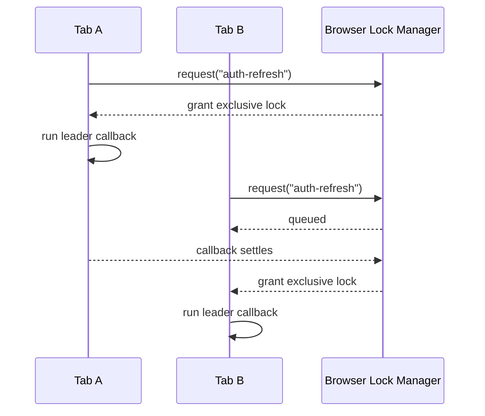
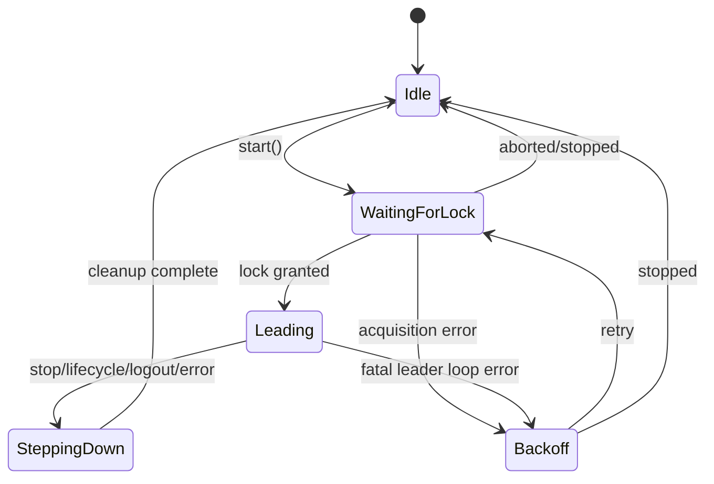
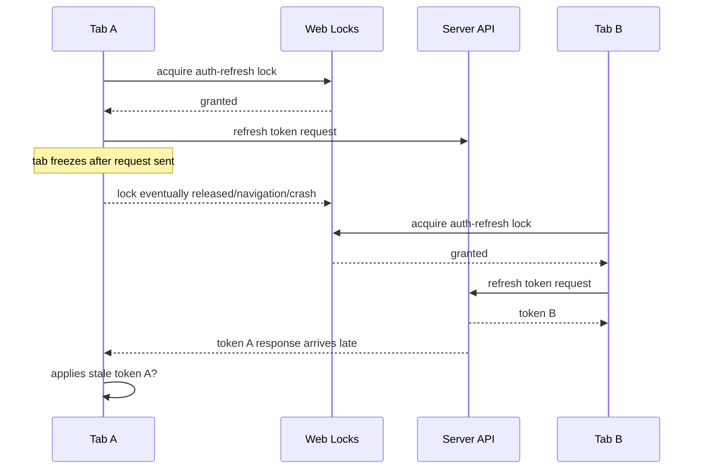

# Part 039 — Web Locks Leader Election

In the previous part, we separated **leadership** from **status**.

A leader is not the tab that shouted first.

A leader is the tab that currently has permission to coordinate a named resource.

In browser applications, the Web Locks API is the closest platform primitive to a cross-tab mutual exclusion mechanism. It lets same-origin scripts coordinate access to a named resource. A tab or worker asks the browser lock manager for a lock. The browser grants that lock to at most one exclusive holder at a time. The lock is released when the callback finishes or rejects.

That makes Web Locks a useful foundation for leader election.

But there is an important constraint:

> Web Locks gives you mutual exclusion for the lock callback. It does not automatically make your business side effects safe.

This part builds a production-grade leader election layer on top of Web Locks.

We will cover:

- what Web Locks solves;
- what Web Locks does not solve;
- lock naming;
- leader loop design;
- abortable acquisition;
- lifecycle-aware stepping down;
- heartbeat and follower observation;
- safe side-effect boundaries;
- fallback strategy;
- testing and observability.

---

## 1. Why Web Locks Changes the Shape of the Problem

Without Web Locks, many teams implement leadership like this:

```ts
localStorage.setItem("leader", tabId);
```

Then each tab reads the value and decides whether it is leader.

That is unsafe because `localStorage` write/read alone is not a real mutual exclusion primitive. Two tabs can race. A stale tab can resume and still believe it owns leadership. A crashed tab may leave stale ownership behind. A `storage` event can be missed or delayed. Timer throttling can distort leases.

With Web Locks, the browser participates in coordination.

Simplified model:

```ts
await navigator.locks.request("my-resource", async (lock) => {
  // exactly one exclusive holder for this lock name at this time
});
```

Inside that callback, this context owns the lock.

Outside that callback, it does not.

That gives us a much stronger local invariant:

> A tab may claim live leadership only while its Web Locks callback is currently executing for the named resource.

This shifts the leader election model from **claiming state** to **holding a browser-managed resource**.

---

## 2. Web Locks Mental Model

Think of Web Locks as a same-origin lock manager in the browser.

A script says:

> “Run this callback when I can hold lock `X`.”

The browser queues the request. When the lock can be granted, it invokes the callback and passes a lock object. When the callback settles, the lock is released.



The lock manager is not your database. It is not a durable lease store. It is not a consensus system. It is a coordination primitive scoped to the browser/user agent environment.

### Important properties

| Property | Meaning |
|---|---|
| Named lock | Locks are identified by string name. |
| Exclusive mode | Only one exclusive holder for a name. |
| Shared mode | Multiple shared holders can coexist if no exclusive holder conflicts. |
| Async callback | Lock is held while the callback promise is pending. |
| Automatic release | Lock is released when callback resolves/rejects. |
| Abortable request | A pending request can be aborted with `AbortSignal`. |
| Non-blocking attempt | `ifAvailable` allows immediate “try lock” behavior. |
| Queryable state | `navigator.locks.query()` can inspect held/pending locks. |
| Available in workers | The API is exposed through `Navigator.locks` in supporting window/worker contexts. |

For leader election, we mostly use **exclusive locks**.

---

## 3. The First Rule: Lock Callback Is the Leadership Boundary

This is the safest basic implementation:

```ts
await navigator.locks.request("app:leader:auth-refresh", async () => {
  await runAsAuthRefreshLeader();
});
```

The leader exists only while `runAsAuthRefreshLeader()` is pending.

Do not do this:

```ts
let isLeader = false;

navigator.locks.request("app:leader:auth-refresh", async () => {
  isLeader = true;
});

if (isLeader) {
  await refreshToken();
}
```

The flag escapes the lock boundary.

A safer form:

```ts
await navigator.locks.request("app:leader:auth-refresh", async () => {
  await refreshTokenInsideLeadershipBoundary();
});
```

### Invariant

Any operation requiring leadership must either:

1. execute inside the Web Locks callback; or
2. carry a fencing token that lets the receiver reject stale leadership.

Part 040 will focus on fencing tokens.

---

## 4. Lock Naming Is Architecture

Lock names are not random strings.

They are resource identity.

Bad:

```txt
leader
lock
sync
main
```

Good:

```txt
myapp:v3:leader:auth-refresh
myapp:v3:leader:websocket:user:123
myapp:v3:leader:offline-queue:tenant:acme
myapp:v3:mutation:indexeddb-schema:case-db
myapp:v3:cache-revalidate:artifact:policy-catalog
```

A lock name should answer:

- which application owns this name?
- which protocol version owns this name?
- which resource is coordinated?
- is the resource global, user-scoped, tenant-scoped, or document-scoped?
- is the lock used for leadership, mutation, migration, or single-flight work?

### Suggested naming scheme

```ts
function lockName(parts: {
  app: string;
  protocolVersion: number;
  kind: "leader" | "mutation" | "single-flight" | "migration";
  resource: string;
  scope?: string;
}) {
  const scope = parts.scope ? `:${parts.scope}` : "";
  return `${parts.app}:v${parts.protocolVersion}:${parts.kind}:${parts.resource}${scope}`;
}
```

Example:

```ts
const AUTH_REFRESH_LOCK = lockName({
  app: "regcase",
  protocolVersion: 3,
  kind: "leader",
  resource: "auth-refresh",
  scope: "user:current",
});
```

### Why include protocol version?

Because old tabs exist.

During rolling deploys, a user may have:

- Tab A running app version 103;
- Tab B running app version 104;
- Service Worker serving cached assets from version 102;
- IndexedDB schema partly migrated;
- BroadcastChannel messages from an older envelope version.

If the leadership protocol changes incompatibly, using a versioned lock name prevents old and new protocols from accidentally coordinating through a contract they interpret differently.

Versioning lock names is not always required, but when leadership controls high-impact side effects, it is a cheap safety boundary.

---

## 5. Minimal Leader Election with Web Locks

A naive implementation:

```ts
async function becomeLeader() {
  await navigator.locks.request("app:leader:sync", async () => {
    while (true) {
      await doLeaderWork();
      await delay(5_000);
    }
  });
}
```

This is not production-safe.

Problems:

- no cancellation;
- no lifecycle integration;
- no observability;
- no way to step down;
- no way to stop on logout;
- no stale side-effect guard;
- no error policy;
- no bounded loop;
- no fallback;
- no readiness check.

A better leader runtime must be explicit.

---

## 6. Leader Runtime State Machine



The visible application may expose a simpler status:

```ts
type LeaderStatus =
  | { state: "idle" }
  | { state: "waiting"; lockName: string }
  | { state: "leading"; lockName: string; since: number; generation: number }
  | { state: "stepping-down"; reason: string }
  | { state: "backoff"; reason: string; retryAt: number };
```

Do not expose a naked boolean `isLeader` as your only state.

A boolean cannot encode:

- pending lock request;
- stale leader generation;
- stepping down;
- stopped by lifecycle;
- stopped by logout;
- acquisition timeout;
- protocol incompatibility.

---

## 7. A Practical `LeaderElection` Class

We will build a reusable runtime.

Design goals:

- hold leadership only inside Web Locks callback;
- support `start()` / `stop()`;
- abort pending acquisition;
- cancel running leader loop;
- emit status changes;
- generate leadership epoch;
- report errors;
- avoid tight retry loops;
- support lifecycle step-down;
- prepare for fencing tokens.

### Helper functions

```ts
function sleep(ms: number, signal?: AbortSignal): Promise<void> {
  return new Promise((resolve, reject) => {
    if (signal?.aborted) {
      reject(signal.reason ?? new DOMException("Aborted", "AbortError"));
      return;
    }

    const timer = setTimeout(resolve, ms);

    signal?.addEventListener(
      "abort",
      () => {
        clearTimeout(timer);
        reject(signal.reason ?? new DOMException("Aborted", "AbortError"));
      },
      { once: true },
    );
  });
}

function randomId(prefix: string): string {
  return `${prefix}_${crypto.randomUUID()}`;
}
```

### Types

```ts
type LeaderContext = {
  lockName: string;
  contenderId: string;
  generation: number;
  signal: AbortSignal;
  startedAt: number;
};

type LeaderLoop = (ctx: LeaderContext) => Promise<void>;

type LeaderEvent =
  | { type: "waiting"; lockName: string; contenderId: string }
  | { type: "leading"; lockName: string; contenderId: string; generation: number }
  | { type: "stepping-down"; lockName: string; reason: string }
  | { type: "stopped"; lockName: string; reason: string }
  | { type: "error"; lockName: string; error: unknown };
```

### Runtime implementation

```ts
class WebLockLeaderElection {
  private readonly contenderId = randomId("tab");
  private readonly listeners = new Set<(event: LeaderEvent) => void>();
  private controller: AbortController | null = null;
  private started = false;
  private generation = 0;

  constructor(
    private readonly lockName: string,
    private readonly loop: LeaderLoop,
  ) {}

  onEvent(listener: (event: LeaderEvent) => void): () => void {
    this.listeners.add(listener);
    return () => this.listeners.delete(listener);
  }

  start() {
    if (this.started) return;
    this.started = true;
    this.controller = new AbortController();
    void this.run(this.controller.signal);
  }

  stop(reason = "manual-stop") {
    if (!this.started) return;
    this.started = false;
    this.controller?.abort(new DOMException(reason, "AbortError"));
    this.controller = null;
  }

  private emit(event: LeaderEvent) {
    for (const listener of this.listeners) {
      try {
        listener(event);
      } catch {
        // Observability listeners must not break leadership runtime.
      }
    }
  }

  private async run(signal: AbortSignal) {
    while (!signal.aborted) {
      try {
        this.emit({
          type: "waiting",
          lockName: this.lockName,
          contenderId: this.contenderId,
        });

        await navigator.locks.request(
          this.lockName,
          { mode: "exclusive", signal },
          async () => {
            if (signal.aborted) return;

            const generation = ++this.generation;
            const ctx: LeaderContext = {
              lockName: this.lockName,
              contenderId: this.contenderId,
              generation,
              signal,
              startedAt: performance.now(),
            };

            this.emit({
              type: "leading",
              lockName: this.lockName,
              contenderId: this.contenderId,
              generation,
            });

            try {
              await this.loop(ctx);
            } finally {
              this.emit({
                type: "stepping-down",
                lockName: this.lockName,
                reason: signal.aborted ? "aborted" : "loop-finished",
              });
            }
          },
        );

        // If callback exits normally while still started, reacquire after a small delay.
        if (!signal.aborted) {
          await sleep(250, signal);
        }
      } catch (error) {
        if (signal.aborted) break;

        this.emit({ type: "error", lockName: this.lockName, error });

        // Prevent hot-looping if the lock manager or callback fails repeatedly.
        await sleep(1_000 + Math.random() * 1_000, signal).catch(() => {});
      }
    }

    this.emit({
      type: "stopped",
      lockName: this.lockName,
      reason: signal.reason?.message ?? "stopped",
    });
  }
}
```

Usage:

```ts
const election = new WebLockLeaderElection(
  "regcase:v3:leader:auth-refresh:user:current",
  async (ctx) => {
    while (!ctx.signal.aborted) {
      await runAuthRefreshCoordinator(ctx);
      await sleep(30_000, ctx.signal);
    }
  },
);

election.onEvent((event) => {
  console.debug("[leader-election]", event);
});

election.start();

window.addEventListener("pagehide", () => {
  election.stop("pagehide");
});
```

This is not the final version, but it already enforces the most important boundary: leadership work runs inside the lock callback.

---

## 8. Using `ifAvailable`: Try-Lock, Not Election

Sometimes you do not want to wait.

Example:

```ts
await navigator.locks.request(
  "regcase:v3:single-flight:cache-revalidate:policy-catalog",
  { ifAvailable: true },
  async (lock) => {
    if (!lock) {
      return { acquired: false };
    }

    await revalidateCatalog();
    return { acquired: true };
  },
);
```

`ifAvailable` gives try-lock behavior.

It is useful for opportunistic work:

- “If no other tab is already revalidating, do it.”
- “If migration lock is free, start migration.”
- “If another tab owns it, skip.”

It is weaker for long-running leadership because callers that fail to acquire must decide whether to retry, wait, or observe.

### Rule

Use queued `request()` for stable leadership.

Use `ifAvailable` for opportunistic single-flight work.

---

## 9. Abortable Acquisition with Timeout

A pending lock request can wait indefinitely if another context holds the lock.

That may be fine for a follower that simply waits to become leader. But for UI-triggered work, you usually want a deadline.

```ts
async function tryAcquireWithin<T>(
  name: string,
  timeoutMs: number,
  callback: () => Promise<T>,
): Promise<T | { timeout: true }> {
  const controller = new AbortController();
  const timer = setTimeout(() => controller.abort(), timeoutMs);

  try {
    return await navigator.locks.request(
      name,
      { signal: controller.signal },
      async () => callback(),
    );
  } catch (error) {
    if (controller.signal.aborted) {
      return { timeout: true };
    }
    throw error;
  } finally {
    clearTimeout(timer);
  }
}
```

Use cases:

- IndexedDB migration must not block page boot forever;
- one-off cache warming should give up if another tab is busy;
- an admin action wants quick feedback;
- a diagnostics tool wants to check ownership without hanging.

For long-running leadership, timeout usually applies to **startup readiness**, not to holding the lock.

---

## 10. Leadership Loop Shape

A leader loop should be boring.

It should:

1. check cancellation frequently;
2. perform bounded work;
3. update heartbeat/status;
4. avoid long uninterruptible tasks;
5. catch recoverable errors;
6. exit cleanly on stop;
7. never assume it will run forever.

Bad:

```ts
async function runLeader(ctx: LeaderContext) {
  while (true) {
    await syncEverything();
  }
}
```

Better:

```ts
async function runLeader(ctx: LeaderContext) {
  while (!ctx.signal.aborted) {
    const batch = await loadNextBatch({ limit: 25, signal: ctx.signal });

    if (batch.length === 0) {
      await sleep(5_000, ctx.signal);
      continue;
    }

    for (const item of batch) {
      if (ctx.signal.aborted) return;
      await processItem(item, ctx);
    }
  }
}
```

The loop is cooperative.

A browser cannot magically cancel arbitrary JavaScript. Your code must honor the signal.

---

## 11. Lifecycle-Aware Leadership

Browser pages are not server processes.

A tab may become:

- hidden;
- frozen;
- discarded;
- restored;
- background throttled;
- disconnected from network;
- replaced by navigation;
- suspended by OS memory pressure.

Leadership policy must answer:

| Event | Should leader step down? | Why |
|---|---:|---|
| `visibilitychange` to hidden | maybe | Depends on resource. Hidden tabs may still run but can be throttled. |
| `pagehide` | usually yes | Navigation/bfcache boundary. Cleanup must be best-effort. |
| `freeze` | yes if available | Frozen pages cannot be trusted for active coordination. |
| logout | yes | Session boundary invalidates leadership. |
| token revoked | yes | Credentials are no longer valid. |
| network offline | maybe | Some resources cannot be coordinated offline; offline queue may still need leader. |

### Example lifecycle integration

```ts
function attachLeadershipLifecycle(election: WebLockLeaderElection) {
  document.addEventListener("visibilitychange", () => {
    if (document.visibilityState === "hidden") {
      // Policy decision. For auth refresh, stepping down is often safer.
      election.stop("document-hidden");
    }
  });

  window.addEventListener("pagehide", () => {
    election.stop("pagehide");
  });

  window.addEventListener("offline", () => {
    election.stop("offline");
  });
}
```

This is conservative.

For some workloads, a hidden tab can continue leading. For others, especially WebSocket ownership or UI-sensitive notification coordination, prefer a visible/active tab.

---

## 12. Candidate Eligibility

Not every tab should be allowed to lead every resource.

Example rules:

```ts
type CandidateEligibility = {
  visible: boolean;
  online: boolean;
  authenticated: boolean;
  schemaReady: boolean;
  protocolCompatible: boolean;
  hasRequiredCapability: boolean;
};
```

A tab should not acquire leadership if it cannot safely perform the job.

```ts
function canLeadAuthRefresh(): boolean {
  return navigator.onLine &&
    document.visibilityState === "visible" &&
    authStore.status === "authenticated" &&
    protocol.version === 3;
}
```

Then:

```ts
async function leadershipSupervisor(election: WebLockLeaderElection) {
  let running = false;

  setInterval(() => {
    const eligible = canLeadAuthRefresh();

    if (eligible && !running) {
      running = true;
      election.start();
    }

    if (!eligible && running) {
      running = false;
      election.stop("not-eligible");
    }
  }, 1_000);
}
```

This prevents a background, outdated, unauthenticated, or schema-incompatible tab from taking leadership just because it exists.

---

## 13. Observing the Leader

Web Locks itself does not broadcast “Tab A is leader” to all tabs.

Followers often need to know:

- is there a leader?
- who is it?
- since when?
- what version?
- is it healthy?
- what resource does it own?

Use BroadcastChannel for observation, not authority.

```ts
type LeaderAnnouncement = {
  type: "LEADER_HEARTBEAT";
  resource: string;
  lockName: string;
  leaderId: string;
  generation: number;
  protocolVersion: number;
  sentAtWallTimeMs: number;
  sentAtMonoMs: number;
};
```

Leader loop:

```ts
async function emitLeaderHeartbeat(ctx: LeaderContext, channel: BroadcastChannel) {
  channel.postMessage({
    type: "LEADER_HEARTBEAT",
    resource: "auth-refresh",
    lockName: ctx.lockName,
    leaderId: ctx.contenderId,
    generation: ctx.generation,
    protocolVersion: 3,
    sentAtWallTimeMs: Date.now(),
    sentAtMonoMs: performance.now(),
  } satisfies LeaderAnnouncement);
}
```

Follower state:

```ts
type ObservedLeader = {
  leaderId: string;
  generation: number;
  lastSeenWallTimeMs: number;
};
```

Important:

> Follower observation is advisory. Web Locks authority is inside the lock callback.

If BroadcastChannel says “no leader”, that does not prove there is no leader. The heartbeat may be delayed, the listener may be frozen, or the message may be missed.

---

## 14. Web Locks Query Is Diagnostic, Not Core Logic

`navigator.locks.query()` can inspect lock manager state.

Example:

```ts
const snapshot = await navigator.locks.query();
console.table(snapshot.held);
console.table(snapshot.pending);
```

This is useful for:

- debugging;
- development panels;
- tests;
- telemetry sampling;
- support diagnostics.

Avoid building critical business logic around `query()`.

Why?

Because a snapshot is stale the moment it is returned.

Do not do:

```ts
const state = await navigator.locks.query();
if (state.held.length === 0) {
  // assume no one is leader
}
```

Instead, request the lock.

---

## 15. `steal` Is a Disaster Button

The Web Locks API has a `steal` option.

Treat it as a recovery mechanism, not normal coordination.

If a tab can steal a lock whenever it is impatient, then your leadership invariant is broken.

Possible uses:

- manual admin/debug tool in non-production;
- test harness;
- emergency recovery path behind kill switch;
- migration from a broken old client where stale locks are known to wedge.

Normal app code should almost never use `steal`.

If you think you need `steal`, you probably need:

- shorter lock callback;
- lifecycle step-down;
- better cancellation;
- better timeout;
- smaller resource scope;
- fencing token on side effects.

---

## 16. Side Effects Must Still Be Fenced

Consider this flow:



Web Locks prevented simultaneous lock ownership during the callback.

It did not automatically prevent stale async responses from applying after leadership changed.

That is why every external side effect needs one of:

- server-side idempotency key;
- monotonic leadership epoch;
- compare-and-swap state update;
- fencing token;
- stale response guard;
- abortable request;
- “apply only if still current” check.

Example local stale guard:

```ts
async function refreshTokenAsLeader(ctx: LeaderContext) {
  const generation = ctx.generation;

  const response = await fetch("/api/auth/refresh", {
    method: "POST",
    signal: ctx.signal,
    headers: {
      "Idempotency-Key": `${ctx.lockName}:${ctx.contenderId}:${generation}`,
    },
  });

  if (ctx.signal.aborted) return;
  if (generation !== currentLeadershipGeneration()) return;

  const token = await response.json();
  applyTokenIfStillCurrent(token, generation);
}
```

This is only partial. Part 040 will make fencing explicit.

---

## 17. Auth Refresh Leader Election

Auth refresh is a common multi-tab bug source.

Bad behavior:

- ten tabs detect token expiry;
- ten tabs call refresh endpoint;
- server rotates refresh token;
- nine requests fail because the token was already rotated;
- tabs disagree about auth state;
- some tabs log out the user incorrectly.

Web Locks can enforce one refresh coordinator.

```ts
const AUTH_REFRESH_LOCK = "regcase:v3:leader:auth-refresh:user:current";

const authRefreshLeader = new WebLockLeaderElection(
  AUTH_REFRESH_LOCK,
  async (ctx) => {
    while (!ctx.signal.aborted) {
      const nextRefreshAt = authStore.getNextRefreshTime();
      const delayMs = Math.max(0, nextRefreshAt - Date.now() - 10_000);

      await sleep(delayMs, ctx.signal);

      if (ctx.signal.aborted) return;
      if (!authStore.isAuthenticated()) return;

      await refreshTokenWithFencing(ctx);

      await sleep(1_000, ctx.signal);
    }
  },
);
```

Followers do not refresh directly.

They can either:

1. wait for token update broadcast;
2. request the leader to refresh;
3. attempt lock if no leader heartbeat is observed;
4. fall back to full page re-auth if state is unrecoverable.

### Token update broadcast

```ts
type AuthTokenUpdated = {
  type: "AUTH_TOKEN_UPDATED";
  epoch: number;
  expiresAt: number;
  updatedAt: number;
};

function broadcastTokenUpdated(event: AuthTokenUpdated) {
  new BroadcastChannel("regcase:auth:v3").postMessage(event);
}
```

Do not broadcast raw tokens unless your threat model explicitly accepts that exposure.

Prefer storing sensitive tokens in appropriate browser storage based on your app architecture and broadcasting only metadata/invalidation signals.

---

## 18. WebSocket Ownership

Another common resource: one WebSocket per user session.

Without leadership:

```txt
5 tabs = 5 sockets = duplicate events = inconsistent UI = unnecessary load
```

With leadership:

```txt
1 tab owns socket
followers receive event fan-out via BroadcastChannel/SharedWorker
```

Leader loop:

```ts
async function runSocketLeader(ctx: LeaderContext) {
  const socket = new WebSocket("wss://example.com/realtime");

  const closed = new Promise<void>((resolve) => {
    socket.addEventListener("close", () => resolve(), { once: true });
  });

  socket.addEventListener("message", (event) => {
    if (ctx.signal.aborted) return;

    realtimeBus.postMessage({
      type: "REALTIME_EVENT",
      leaderId: ctx.contenderId,
      generation: ctx.generation,
      payload: JSON.parse(event.data),
    });
  });

  ctx.signal.addEventListener(
    "abort",
    () => socket.close(1000, "leader-step-down"),
    { once: true },
  );

  await closed;
}
```

Caveat:

If hidden tabs can hold the lock indefinitely, the visible tab may not own the socket. Decide whether that matters.

For UI-sensitive real-time work, candidate eligibility may require `document.visibilityState === "visible"`.

---

## 19. Offline Queue Ownership

Offline queue flushing is a good Web Locks use case.

Only one context should drain pending mutations.

```ts
const OFFLINE_QUEUE_LOCK = "regcase:v3:leader:offline-queue:user:current";

const offlineQueueElection = new WebLockLeaderElection(
  OFFLINE_QUEUE_LOCK,
  async (ctx) => {
    while (!ctx.signal.aborted) {
      if (!navigator.onLine) {
        await sleep(5_000, ctx.signal);
        continue;
      }

      const item = await offlineQueue.claimNext({
        owner: ctx.contenderId,
        generation: ctx.generation,
      });

      if (!item) {
        await sleep(2_000, ctx.signal);
        continue;
      }

      await flushOneMutation(item, ctx);
    }
  },
);
```

Even with Web Locks, queue items should have their own claim/attempt state.

Why?

Because the tab can crash after claiming an item but before marking it complete.

Browser leadership does not replace durable queue recovery.

---

## 20. IndexedDB Migration Lock

Schema migration is dangerous across open tabs.

A migration lock can coordinate app-level migration work:

```ts
await navigator.locks.request(
  "regcase:v3:migration:indexeddb:case-db",
  async () => {
    await runAppLevelMigration();
  },
);
```

But IndexedDB itself has its own versionchange/blocking semantics.

A Web Lock is not a substitute for correct IndexedDB upgrade handling.

Use Web Locks for:

- app-level migration orchestration;
- one tab deciding when to prompt reload;
- preventing duplicate expensive backfill;
- serializing logical migration steps.

Still handle:

- `blocked`;
- `versionchange`;
- old connections;
- rollback strategy;
- migration idempotency.

---

## 21. Fallback When Web Locks Is Unavailable

Do not assume Web Locks is universally available in every browser/WebView/environment.

Detection:

```ts
function supportsWebLocks(): boolean {
  return typeof navigator !== "undefined" &&
    "locks" in navigator &&
    typeof navigator.locks?.request === "function";
}
```

Fallback options:

| Fallback | Strength | Notes |
|---|---:|---|
| SharedWorker hub | good where supported | Central live coordinator, but lifecycle/availability differs. |
| BroadcastChannel + IndexedDB lease | moderate | Needs careful lease/fencing logic. |
| localStorage lease | weak | Acceptable only for low-impact best-effort coordination. |
| Server-side coordination | strongest for business effects | Best when side effects must be globally serialized. |
| No coordination | sometimes okay | Prefer duplicate-safe server idempotency. |

A serious app should choose fallback per resource, not globally.

Example:

```ts
type CoordinationStrategy =
  | "web-locks"
  | "shared-worker"
  | "indexeddb-lease"
  | "best-effort"
  | "server-only";

function chooseStrategy(resource: string): CoordinationStrategy {
  if (supportsWebLocks()) return "web-locks";

  if (resource === "auth-refresh") return "server-only";
  if (resource === "cache-revalidate") return "best-effort";

  return "indexeddb-lease";
}
```

Do not silently degrade high-impact workflows to weak localStorage leadership.

---

## 22. Fairness and Starvation

The lock manager queues requests, but application-level fairness is still your responsibility.

Risk patterns:

- one tab immediately reacquires after releasing;
- visible tab never gets leadership because hidden tab loops forever;
- a long-running leader blocks urgent one-off work;
- lock scope is too broad;
- low-priority background work competes with high-priority work.

Mitigations:

1. use resource-scoped lock names;
2. step down periodically for long-lived roles;
3. require visible/ready candidate for UI-sensitive resources;
4. use `ifAvailable` for opportunistic tasks;
5. avoid a single global `leader` lock;
6. split leadership from short mutation locks.

Example periodic lease-style loop:

```ts
async function runLeaderForWindow(ctx: LeaderContext, maxHoldMs: number) {
  const started = performance.now();

  while (!ctx.signal.aborted) {
    if (performance.now() - started > maxHoldMs) {
      return; // release lock voluntarily
    }

    await doOneLeaderTick(ctx);
  }
}
```

This lets other eligible tabs compete periodically.

---

## 23. Anti-Pattern: Long Lock Around UI Work

Bad:

```ts
await navigator.locks.request("global", async () => {
  await showModalAndWaitForUser();
});
```

This lock may be held for minutes.

Do not hold a lock while waiting for human interaction unless that is exactly the resource you want to serialize.

Better:

```ts
const decision = await showModalAndWaitForUser();

await navigator.locks.request("mutation:dangerous-action", async () => {
  await applyDecision(decision);
});
```

Leadership is for coordination, not for wrapping arbitrary application flows.

---

## 24. Anti-Pattern: Lock as Authorization

A lock is not a permission system.

Do not treat holding a Web Lock as proof the user is allowed to do something.

Bad:

```ts
await navigator.locks.request("admin-action", async () => {
  await deleteCase(caseId); // assumes lock means authorized
});
```

Authorization must still be enforced server-side.

Web Locks only coordinate same-origin browser contexts.

A malicious user can run modified client code. A compromised script can request the same lock. A lock has no business authority outside the local browser runtime.

---

## 25. Observability

At minimum, emit:

| Metric | Meaning |
|---|---|
| `leader_wait_ms` | Time spent waiting for lock. |
| `leader_hold_ms` | Time lock was held. |
| `leader_generation` | Local generation counter. |
| `leader_step_down_reason` | Why leadership ended. |
| `leader_loop_error_count` | Recoverable/fatal errors. |
| `leader_heartbeat_gap_ms` | Follower-observed heartbeat gap. |
| `lock_acquire_timeout_count` | Aborted pending acquisition. |
| `lock_strategy` | `web-locks`, fallback, server-only, etc. |

Example event log:

```ts
election.onEvent((event) => {
  telemetry.capture("browser_leader_event", {
    ...event,
    tabId,
    appVersion,
    visibility: document.visibilityState,
    online: navigator.onLine,
    at: Date.now(),
  });
});
```

Keep payload small.

Do not log tokens, personal data, or sensitive request bodies.

---

## 26. Testing Web Locks Leadership

You need multi-context tests.

Single-tab unit tests cannot prove coordination.

Test cases:

1. two tabs start, only one enters leader loop;
2. leader closes, follower becomes leader;
3. leader goes hidden and steps down if policy requires;
4. pending acquisition aborts on stop;
5. leader loop error releases lock;
6. no stale response applied after step-down;
7. lock name version mismatch does not coordinate accidentally;
8. follower can observe leader heartbeat;
9. fallback path works without `navigator.locks`;
10. `ifAvailable` skips when lock is held.

Pseudo Playwright-style shape:

```ts
test("only one tab owns auth-refresh leadership", async ({ browser }) => {
  const ctx = await browser.newContext();
  const pageA = await ctx.newPage();
  const pageB = await ctx.newPage();

  await pageA.goto(appUrl);
  await pageB.goto(appUrl);

  await pageA.evaluate(() => window.__startAuthRefreshLeader());
  await pageB.evaluate(() => window.__startAuthRefreshLeader());

  await expect.poll(async () => {
    const a = await pageA.evaluate(() => window.__leaderStatus());
    const b = await pageB.evaluate(() => window.__leaderStatus());
    return [a.state, b.state].sort().join(",");
  }).toBe("leading,waiting");
});
```

### Chaos cases

- close leader tab mid-request;
- reload leader during hold;
- freeze/restore if environment supports simulation;
- inject slow server response;
- throw inside leader loop;
- remove network;
- run old app version in one tab;
- clear storage mid-run;
- Service Worker update while leader active.

---

## 27. Production Checklist

Before using Web Locks leadership for a resource, answer these:

- What exact resource is protected?
- Is the lock name scoped narrowly enough?
- Is the lock name versioned if protocol compatibility matters?
- Who is eligible to lead?
- Does leadership work run inside the lock callback?
- What happens on hidden/pagehide/freeze/logout/offline?
- Can the leader loop be cancelled cooperatively?
- Are external side effects idempotent or fenced?
- Is there a follower observation channel?
- Is stale heartbeat treated as suspicion, not fact?
- Is `steal` avoided in normal code?
- Is fallback explicit per resource?
- Are metrics emitted for wait/hold/step-down/error?
- Are multi-tab tests in CI?
- Are old tabs and rolling deploys considered?

---

## 28. Final Mental Model

Web Locks gives you a browser-managed answer to:

> “Who may run this critical section right now?”

It does not answer:

- whether the leader is business-authorized;
- whether the leader's async response is still current;
- whether server-side side effects are safe;
- whether old tabs understand the protocol;
- whether followers received every message;
- whether leadership should prefer visible tabs;
- whether retrying is safe;
- whether duplicate work is harmful.

Use Web Locks as the local coordination primitive.

Then wrap it with:

- typed protocol;
- lifecycle policy;
- eligibility;
- cancellation;
- observability;
- idempotency;
- fencing.

That is the difference between a demo and a production leader election runtime.

---

## References

- MDN Web Docs — Web Locks API
- W3C — Web Locks API Specification
- Chrome Developers — Page Lifecycle API
- MDN Web Docs — Broadcast Channel API
- MDN Web Docs — AbortController / AbortSignal
