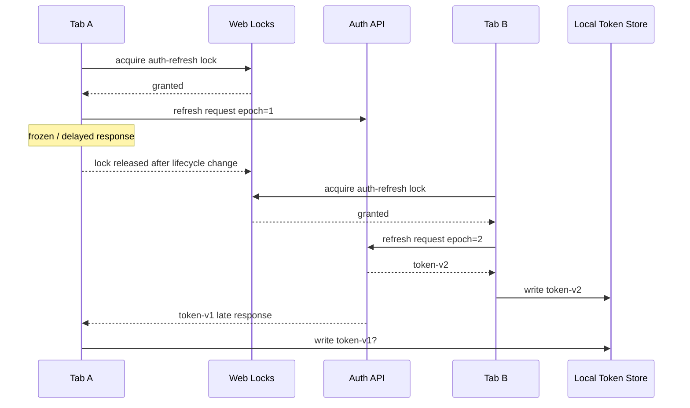
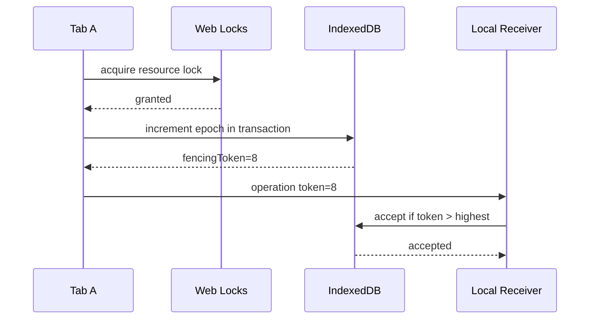
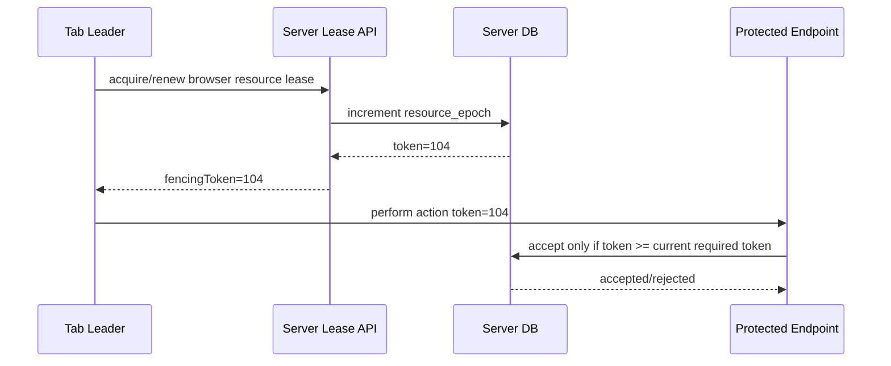
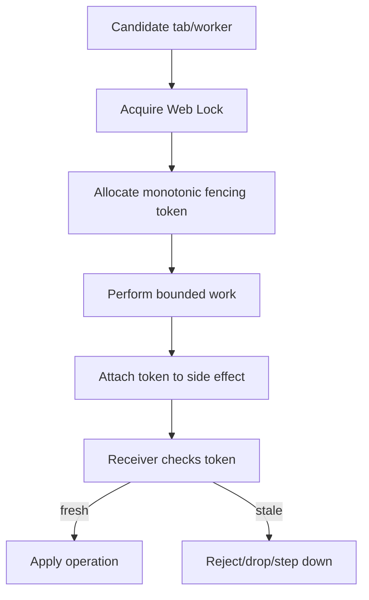

# Part 040 — Fencing Tokens and Split-Brain Prevention

Part 039 gave us a better local primitive: Web Locks.

That solves one important problem:

> At most one same-origin browser context should hold a named exclusive Web Lock at a time.

But production systems fail at a different boundary.

The stale leader problem.

A tab may hold leadership, start a side effect, lose leadership, freeze, resume, and then apply an old result. Another tab may already have become leader and completed a newer action.

If the stale result is accepted, the system can go backward.

That is split brain at the side-effect boundary.

This part explains how to prevent it using **fencing tokens**.

---

## 1. The Problem Web Locks Does Not Fully Solve

Imagine auth token refresh.



The dangerous line is the last one.

A stale leader writes stale state after a newer leader already wrote newer state.

Web Locks reduced concurrent leadership, but it did not automatically protect:

- delayed network responses;
- async callbacks that outlive intent;
- resumed frozen tabs;
- old app versions;
- duplicate retries;
- server responses from previous epochs;
- local writes performed after leadership changed.

The fix is not “trust the leader harder”.

The fix is receiver-side rejection.

---

## 2. Fencing Token Mental Model

A fencing token is a monotonic value attached to an operation to prove freshness.

Every time leadership for a resource advances, the token increases.

Receivers remember the highest accepted token.

A stale operation with a lower token is rejected.

```txt
accepted token = 42
incoming token = 41 -> reject
incoming token = 42 -> maybe idempotent duplicate
incoming token = 43 -> accept and advance
```

This is the core invariant:

> A receiver must not accept a side effect from a leadership epoch older than the highest epoch it has already accepted for the same resource.

The lock holder sends the token.

The receiver enforces the token.

Leadership cannot enforce itself after it becomes stale.

---

## 3. Split Brain in Browser Apps

Split brain does not require two tabs literally holding the same Web Lock at the exact same nanosecond.

In browser applications, split brain usually appears as **overlapping belief** or **stale side effects**.

Examples:

| Scenario | Split-brain shape |
|---|---|
| Delayed fetch | Old leader applies response after new leader applied newer response. |
| Frozen page resumes | Old tab resumes with stale memory and emits events. |
| Broadcast delay | Follower believes no leader exists and starts fallback path. |
| Version skew | Old protocol and new protocol both coordinate same resource incorrectly. |
| Storage lease fallback | Two tabs believe a localStorage/IndexedDB lease is theirs. |
| Service Worker update | Old page and new Service Worker disagree about cache/schema version. |
| Offline replay | Two tabs flush the same mutation with different assumptions. |

Split brain is a receiver problem.

If the receiver accepts stale operations, the system is unsafe.

---

## 4. Epoch vs Generation vs Fencing Token

These words are often used loosely. Define them.

| Term | Meaning | Scope |
|---|---|---|
| `generation` | Local counter inside one runtime instance. | Per tab/process. |
| `epoch` | Monotonic leadership version for a resource. | Shared/resource-scoped. |
| `fencingToken` | Token attached to side effects and checked by receiver. | Receiver-enforced. |
| `term` | Raft-like word for leadership era. | Distributed system literature. |
| `leaseId` | Identifier for one ownership interval. | Usually unique, not necessarily ordered. |

A local `generation` is not enough.

```ts
// Tab A generation=1
// Tab B generation=1
```

Both can independently use generation 1.

A fencing token must be comparable at the receiver.

Usually it needs to come from a shared monotonic source:

- server database sequence;
- server-issued lease token;
- IndexedDB transaction that increments a per-resource counter;
- OPFS/IndexedDB durable state with compare-and-swap semantics;
- Service Worker-controlled local sequencer;
- SharedWorker hub sequencer, if hub lifecycle is acceptable.

For business-critical server side effects, prefer server-issued fencing tokens.

---

## 5. Local Fencing with IndexedDB

For browser-local resources, IndexedDB can hold a resource epoch.

Model:

```ts
type ResourceEpochRecord = {
  resource: string;
  epoch: number;
  ownerId: string;
  updatedAt: number;
};
```

When a tab becomes leader under Web Lock, it increments the epoch in IndexedDB.

```ts
async function allocateLocalFencingToken(input: {
  resource: string;
  ownerId: string;
}): Promise<number> {
  return await db.transaction("resourceEpoch", "readwrite", async (tx) => {
    const store = tx.objectStore("resourceEpoch");
    const current = await store.get(input.resource) as ResourceEpochRecord | undefined;

    const next: ResourceEpochRecord = {
      resource: input.resource,
      epoch: (current?.epoch ?? 0) + 1,
      ownerId: input.ownerId,
      updatedAt: Date.now(),
    };

    await store.put(next);
    return next.epoch;
  });
}
```

Then all local side effects include this token.

```ts
type FencedOperation<TPayload> = {
  resource: string;
  fencingToken: number;
  ownerId: string;
  operationId: string;
  payload: TPayload;
};
```

Receiver checks:

```ts
type ReceiverFenceRecord = {
  resource: string;
  highestAcceptedToken: number;
};

async function acceptFencedLocalOperation<T>(
  op: FencedOperation<T>,
  apply: () => Promise<void>,
): Promise<"accepted" | "duplicate" | "stale"> {
  return await db.transaction(["receiverFence", "data"], "readwrite", async (tx) => {
    const fenceStore = tx.objectStore("receiverFence");
    const current = await fenceStore.get(op.resource) as ReceiverFenceRecord | undefined;

    const highest = current?.highestAcceptedToken ?? 0;

    if (op.fencingToken < highest) {
      return "stale";
    }

    if (op.fencingToken === highest) {
      // Same token can be allowed only if operationId is idempotently handled.
      return "duplicate";
    }

    await apply();

    await fenceStore.put({
      resource: op.resource,
      highestAcceptedToken: op.fencingToken,
    });

    return "accepted";
  });
}
```

This is the minimum shape.

But there is a subtle problem: `apply()` must use the same transaction if it writes to IndexedDB. If `apply()` performs a separate async write outside the transaction, the fence and state can diverge.

Better:

```ts
async function acceptFencedMutation(
  op: FencedOperation<{ value: string }>,
): Promise<"accepted" | "duplicate" | "stale"> {
  return await db.transaction(["receiverFence", "settings"], "readwrite", async (tx) => {
    const fence = tx.objectStore("receiverFence");
    const settings = tx.objectStore("settings");

    const current = await fence.get(op.resource) as ReceiverFenceRecord | undefined;
    const highest = current?.highestAcceptedToken ?? 0;

    if (op.fencingToken < highest) return "stale";
    if (op.fencingToken === highest) return "duplicate";

    await settings.put({ key: "activePolicy", value: op.payload.value });
    await fence.put({ resource: op.resource, highestAcceptedToken: op.fencingToken });

    return "accepted";
  });
}
```

The fence update and business write happen together.

---

## 6. Why Web Lock + IndexedDB Token Works Locally

A safe local pattern:



Web Lock ensures only one tab at a time allocates a token for that resource through the protected path.

IndexedDB makes the token durable and monotonic locally.

The receiver checks token freshness before applying state.

That gives three layers:

1. mutual exclusion at leadership acquisition;
2. durable monotonic token allocation;
3. receiver-side stale rejection.

Do not skip layer 3.

---

## 7. Server-Issued Fencing Tokens

For server-side effects, local fencing is not enough.

A malicious or stale client can send any number it wants.

The server must enforce freshness.

Better flow:



Server-side model:

```sql
CREATE TABLE browser_resource_fence (
  user_id TEXT NOT NULL,
  resource TEXT NOT NULL,
  highest_token BIGINT NOT NULL,
  updated_at TIMESTAMP NOT NULL,
  PRIMARY KEY (user_id, resource)
);
```

Token allocation:

```sql
UPDATE browser_resource_fence
SET highest_token = highest_token + 1,
    updated_at = now()
WHERE user_id = :userId
  AND resource = :resource
RETURNING highest_token;
```

Protected write:

```sql
UPDATE user_session_state
SET value = :value,
    fencing_token = :incomingToken
WHERE user_id = :userId
  AND resource = :resource
  AND :incomingToken >= fencing_token;
```

Or stricter:

```sql
AND :incomingToken > fencing_token
```

The exact comparison depends on duplicate/idempotency policy.

### Key principle

> The server should not trust the browser to be fresh. It should verify the fencing token against server state.

---

## 8. Fencing Token vs Idempotency Key

They solve different problems.

| Mechanism | Prevents | Does not prevent |
|---|---|---|
| Idempotency key | Duplicate execution of same operation. | Older operation overwriting newer operation. |
| Fencing token | Older leader side effect accepted after newer leader. | Duplicate same-token retry unless idempotency also exists. |
| Correlation ID | Matching request/response. | Duplicate or stale execution. |
| Web Lock | Local concurrent holders for named lock. | Stale async effects after lock loss. |

Usually you need both idempotency and fencing.

Example request:

```http
POST /api/offline-queue/flush
Idempotency-Key: mutation-8c0c6c2e
X-Browser-Fencing-Resource: offline-queue:user:123
X-Browser-Fencing-Token: 104
```

Server behavior:

1. If idempotency key already completed, return same result.
2. Else check fencing token freshness.
3. If stale, reject with `409 Conflict` or domain-specific stale-owner code.
4. Else execute operation and record both idempotency key and accepted token atomically.

---

## 9. Local Stale Response Guard

Not every stale result crosses the network.

Sometimes the danger is local memory.

Example:

```ts
let currentEpoch = 0;

async function runSearch(query: string) {
  const epoch = ++currentEpoch;
  const result = await workerSearch(query);

  if (epoch !== currentEpoch) return;

  render(result);
}
```

This pattern is a local fencing guard.

For leadership:

```ts
class LeadershipEpochGuard {
  private current = new Map<string, number>();

  advance(resource: string, token: number) {
    const previous = this.current.get(resource) ?? 0;
    if (token > previous) {
      this.current.set(resource, token);
    }
  }

  isCurrent(resource: string, token: number): boolean {
    return (this.current.get(resource) ?? 0) === token;
  }

  isStale(resource: string, token: number): boolean {
    return token < (this.current.get(resource) ?? 0);
  }
}
```

Usage:

```ts
const guard = new LeadershipEpochGuard();

async function applyLeaderResult(ctx: FencedLeaderContext, result: Result) {
  if (ctx.signal.aborted) return;
  if (!guard.isCurrent(ctx.resource, ctx.fencingToken)) return;

  render(result);
}
```

This guards UI application.

It does not replace durable/server fencing for real state mutations.

---

## 10. Fenced Leader Context

Upgrade the leader context from Part 039.

```ts
type FencedLeaderContext = {
  resource: string;
  lockName: string;
  contenderId: string;
  lockGeneration: number;
  fencingToken: number;
  signal: AbortSignal;
  startedAt: number;
};
```

Leadership startup:

```ts
async function runFencedLeader(
  baseCtx: LeaderContext,
  resource: string,
  loop: (ctx: FencedLeaderContext) => Promise<void>,
) {
  const fencingToken = await allocateLocalFencingToken({
    resource,
    ownerId: baseCtx.contenderId,
  });

  const ctx: FencedLeaderContext = {
    resource,
    lockName: baseCtx.lockName,
    contenderId: baseCtx.contenderId,
    lockGeneration: baseCtx.generation,
    fencingToken,
    signal: baseCtx.signal,
    startedAt: baseCtx.startedAt,
  };

  await loop(ctx);
}
```

Now all side effects can carry `ctx.fencingToken`.

---

## 11. Fenced Broadcast Messages

BroadcastChannel messages should carry fencing metadata when they describe leader-owned state.

```ts
type FencedEnvelope<TPayload> = {
  protocol: "regcase-browser-orchestration";
  protocolVersion: 3;
  messageId: string;
  kind: string;
  resource: string;
  ownerId: string;
  fencingToken: number;
  sentAt: number;
  payload: TPayload;
};
```

Follower receiver:

```ts
const highestByResource = new Map<string, number>();

function onLeaderMessage(message: FencedEnvelope<unknown>) {
  const highest = highestByResource.get(message.resource) ?? 0;

  if (message.fencingToken < highest) {
    metrics.increment("stale_leader_message_rejected", {
      resource: message.resource,
      incoming: message.fencingToken,
      highest,
    });
    return;
  }

  if (message.fencingToken > highest) {
    highestByResource.set(message.resource, message.fencingToken);
  }

  applyLeaderMessage(message);
}
```

This prevents old leader broadcasts from rolling back follower state.

### Duplicate same-token messages

Same-token messages may be valid if they are different events from the same current leader.

Therefore, do not reject `== highest` globally.

Instead, dedupe by `messageId` or event sequence.

```ts
type ResourceCursor = {
  highestToken: number;
  seenMessageIds: Set<string>;
};
```

For event streams, add sequence:

```ts
type FencedSequencedEnvelope<TPayload> = FencedEnvelope<TPayload> & {
  sequence: number;
};
```

Then reject lower sequence within same token.

---

## 12. Fenced Offline Queue Flush

Offline queue is where fencing becomes concrete.

Data model:

```ts
type OfflineMutation = {
  mutationId: string;
  createdAt: number;
  status: "pending" | "claimed" | "sent" | "failed";
  claimedBy?: string;
  claimToken?: number;
  claimExpiresAt?: number;
  idempotencyKey: string;
  payload: unknown;
};
```

Leader claims item:

```ts
async function claimNextMutation(ctx: FencedLeaderContext): Promise<OfflineMutation | null> {
  return await db.transaction("offlineMutations", "readwrite", async (tx) => {
    const store = tx.objectStore("offlineMutations");
    const next = await findFirstPendingMutation(store);

    if (!next) return null;

    const claimed: OfflineMutation = {
      ...next,
      status: "claimed",
      claimedBy: ctx.contenderId,
      claimToken: ctx.fencingToken,
      claimExpiresAt: Date.now() + 30_000,
    };

    await store.put(claimed);
    return claimed;
  });
}
```

Before sending:

```ts
function assertClaimStillCurrent(item: OfflineMutation, ctx: FencedLeaderContext) {
  if (item.claimedBy !== ctx.contenderId) throw new Error("Lost claim owner");
  if (item.claimToken !== ctx.fencingToken) throw new Error("Lost claim token");
  if ((item.claimExpiresAt ?? 0) < Date.now()) throw new Error("Claim expired");
}
```

Send with headers:

```ts
async function sendMutation(item: OfflineMutation, ctx: FencedLeaderContext) {
  assertClaimStillCurrent(item, ctx);

  const response = await fetch("/api/mutations", {
    method: "POST",
    headers: {
      "Content-Type": "application/json",
      "Idempotency-Key": item.idempotencyKey,
      "X-Client-Resource": ctx.resource,
      "X-Client-Fencing-Token": String(ctx.fencingToken),
    },
    body: JSON.stringify(item.payload),
    signal: ctx.signal,
  });

  if (!response.ok) {
    throw new Error(`Mutation failed: ${response.status}`);
  }
}
```

Mark complete only if still claimed by same token:

```ts
async function markMutationSent(item: OfflineMutation, ctx: FencedLeaderContext) {
  await db.transaction("offlineMutations", "readwrite", async (tx) => {
    const store = tx.objectStore("offlineMutations");
    const current = await store.get(item.mutationId) as OfflineMutation | undefined;

    if (!current) return;
    if (current.claimedBy !== ctx.contenderId) return;
    if (current.claimToken !== ctx.fencingToken) return;

    await store.put({
      ...current,
      status: "sent",
      sentAt: Date.now(),
    });
  });
}
```

This protects local completion state from stale leaders.

---

## 13. Fenced Auth Refresh

Auth refresh is harder because tokens are security-sensitive and refresh token rotation may be server-enforced.

Local browser fencing helps avoid stale local apply.

Server-side idempotency and refresh-token rotation rules still matter.

Local shape:

```ts
type TokenState = {
  accessTokenExpiresAt: number;
  tokenVersion: number;
  updatedByFencingToken: number;
};
```

Apply response:

```ts
async function applyRefreshResult(
  result: RefreshResult,
  ctx: FencedLeaderContext,
) {
  await db.transaction("tokenState", "readwrite", async (tx) => {
    const store = tx.objectStore("tokenState");
    const current = await store.get("current") as TokenState | undefined;

    const highest = current?.updatedByFencingToken ?? 0;

    if (ctx.fencingToken < highest) {
      metrics.increment("auth_refresh_stale_apply_rejected");
      return;
    }

    await store.put({
      accessTokenExpiresAt: result.expiresAt,
      tokenVersion: result.tokenVersion,
      updatedByFencingToken: ctx.fencingToken,
    });
  });
}
```

Broadcast only metadata:

```ts
authChannel.postMessage({
  type: "AUTH_REFRESHED",
  resource: ctx.resource,
  fencingToken: ctx.fencingToken,
  expiresAt: result.expiresAt,
  tokenVersion: result.tokenVersion,
});
```

Do not use BroadcastChannel as a casual token transport unless the application's security model has explicitly accepted that all same-origin scripts can observe the token.

---

## 14. Fenced Cache Update

Cache updates also need stale rejection.

Example:

```txt
Leader A downloads catalog v10 slowly.
Leader B downloads catalog v11 quickly.
Leader B promotes v11.
Leader A later promotes v10.
```

That is a rollback.

Cache manifest:

```ts
type CacheManifest = {
  artifact: string;
  version: string;
  promotedByToken: number;
  promotedAt: number;
  cacheName: string;
};
```

Promotion:

```ts
async function promoteCacheArtifact(
  artifact: string,
  version: string,
  cacheName: string,
  ctx: FencedLeaderContext,
) {
  await db.transaction("cacheManifest", "readwrite", async (tx) => {
    const store = tx.objectStore("cacheManifest");
    const current = await store.get(artifact) as CacheManifest | undefined;

    if ((current?.promotedByToken ?? 0) > ctx.fencingToken) {
      return; // stale leader tries to promote older cache
    }

    await store.put({
      artifact,
      version,
      cacheName,
      promotedByToken: ctx.fencingToken,
      promotedAt: Date.now(),
    });
  });
}
```

If artifact versions are semantically ordered, also compare version.

But do not assume string comparison is enough for all version formats.

---

## 15. Compare-and-Swap as a Fence

Many local and server operations can be expressed as compare-and-swap.

Local example:

```ts
async function updateIfTokenFresh(input: {
  resource: string;
  token: number;
  value: unknown;
}) {
  await db.transaction(["resourceFence", "resourceValue"], "readwrite", async (tx) => {
    const fenceStore = tx.objectStore("resourceFence");
    const valueStore = tx.objectStore("resourceValue");

    const fence = await fenceStore.get(input.resource) as ReceiverFenceRecord | undefined;
    const highest = fence?.highestAcceptedToken ?? 0;

    if (input.token < highest) return false;

    await valueStore.put({ resource: input.resource, value: input.value });
    await fenceStore.put({
      resource: input.resource,
      highestAcceptedToken: input.token,
    });

    return true;
  });
}
```

Server SQL shape:

```sql
UPDATE resource_state
SET value = :value,
    fencing_token = :token
WHERE resource_id = :resourceId
  AND fencing_token <= :token;
```

This is receiver-enforced freshness.

---

## 16. Handling Same-Token Duplicates

A fencing token is an epoch, not necessarily an operation ID.

A leader may perform many operations under the same token.

So you need an operation-level identity.

```ts
type FencedOperation<T> = {
  resource: string;
  fencingToken: number;
  operationId: string;
  sequence: number;
  payload: T;
};
```

Receiver cursor:

```ts
type ReceiverCursor = {
  resource: string;
  highestToken: number;
  highestSequenceByToken: Record<string, number>;
  seenOperationIds: string[];
};
```

Simpler production option:

- keep `highestToken` for stale leader rejection;
- keep an idempotency table keyed by `operationId` for duplicate execution;
- keep per-stream `sequence` if ordering matters.

Do not overload one field to solve all problems.

---

## 17. Token Source Decision Matrix

| Token source | Use when | Risk |
|---|---|---|
| Local counter in memory | UI stale result guard only | Not shared; resets on reload. |
| IndexedDB counter | Browser-local state coordination | Needs transaction discipline. |
| SharedWorker counter | Live tab coordination | Hub death/reset unless persisted. |
| Service Worker counter | Network/cache coordination | Lifecycle is event-driven; not always alive. |
| Server-issued token | Business/server side effects | Requires server support. |
| Timestamp | Rarely as tie-breaker only | Clock skew; not monotonic enough. |
| UUID | Identity only | Not ordered; cannot fence stale operations. |

Default recommendation:

- UI-only stale apply: local generation is enough.
- Browser-local durable state: IndexedDB fencing token.
- Server mutation: server-issued fencing token + idempotency key.
- Cache promotion: IndexedDB manifest token, optionally paired with artifact version.
- Cross-tab live event stream: token + sequence + message ID.

---

## 18. Why Timestamp Is Not a Fencing Token

This looks tempting:

```ts
const token = Date.now();
```

Problems:

- system clock can move backward;
- two tabs can generate the same millisecond value;
- hidden/frozen pages can resume with old assumptions;
- user/device time can be changed;
- cross-device/server comparison is unreliable;
- timestamps are not allocated under mutual exclusion unless you add another primitive.

A timestamp can be useful metadata.

It is not enough as the freshness authority.

Use a monotonic counter allocated by a shared authority.

---

## 19. Fencing and Leases

A lease says:

> “This owner may act until this expiration time.”

A fencing token says:

> “This operation belongs to leadership epoch N; reject it if you have seen a newer epoch.”

They complement each other.

Lease alone failure:

```txt
Leader A lease expires.
Leader B gets lease.
Leader A's old request arrives late.
Receiver accepts A because it never checked epoch.
```

Fencing fixes that.

Recommended lease record:

```ts
type LeaseRecord = {
  resource: string;
  ownerId: string;
  leaseId: string;
  fencingToken: number;
  expiresAt: number;
  renewedAt: number;
};
```

Every new lease increments `fencingToken`.

Every protected operation carries it.

Every receiver checks it.

---

## 20. Stale Leader Recovery

When a stale leader is rejected, what should happen?

Do not always log out or crash the app.

Possible outcomes:

| Rejection | Action |
|---|---|
| stale local broadcast | drop silently + metric |
| stale UI result | ignore |
| stale cache promotion | ignore + cleanup unused cache later |
| stale offline mutation completion | re-read queue state |
| stale auth refresh apply | re-read token state / force session validation |
| stale server mutation | stop leadership, reload state, maybe retry through current leader |

Example:

```ts
async function handleStaleOwnerRejection(ctx: FencedLeaderContext, error: StaleOwnerError) {
  metrics.increment("stale_owner_rejected", {
    resource: ctx.resource,
    token: ctx.fencingToken,
  });

  // This context is no longer a safe coordinator.
  ctx.signal.throwIfAborted?.();

  // If the server says this token is stale, exit the leader loop.
  throw new LostLeadershipError(ctx.resource, ctx.fencingToken, error.highestToken);
}
```

The leader runtime should treat stale-owner rejection as a reason to step down.

---

## 21. Lost Leadership Error

Define domain-specific errors.

```ts
class LostLeadershipError extends Error {
  constructor(
    readonly resource: string,
    readonly token: number,
    readonly highestKnownToken?: number,
  ) {
    super(`Lost leadership for ${resource}; token=${token}; highest=${highestKnownToken}`);
    this.name = "LostLeadershipError";
  }
}
```

Leader loop:

```ts
async function leaderLoop(ctx: FencedLeaderContext) {
  try {
    while (!ctx.signal.aborted) {
      await doOneFencedTick(ctx);
    }
  } catch (error) {
    if (error instanceof LostLeadershipError) {
      return; // release Web Lock by exiting callback
    }

    throw error;
  }
}
```

If you lose leadership, release the lock.

Do not keep acting under a rejected token.

---

## 22. Sequence Numbers Inside an Epoch

If a leader sends a stream of events, a token alone is insufficient.

Example:

```txt
token=10 seq=1 account updated
token=10 seq=2 status updated
token=10 seq=1 duplicate arrives late
```

Add sequence:

```ts
class FencedSequencer {
  private seq = 0;

  constructor(private readonly ctx: FencedLeaderContext) {}

  next<T>(kind: string, payload: T): FencedSequencedEnvelope<T> {
    return {
      protocol: "regcase-browser-orchestration",
      protocolVersion: 3,
      messageId: crypto.randomUUID(),
      kind,
      resource: this.ctx.resource,
      ownerId: this.ctx.contenderId,
      fencingToken: this.ctx.fencingToken,
      sequence: ++this.seq,
      sentAt: Date.now(),
      payload,
    };
  }
}
```

Receiver:

```ts
function shouldAcceptSequenced(
  cursor: { token: number; sequence: number },
  incoming: { fencingToken: number; sequence: number },
) {
  if (incoming.fencingToken < cursor.token) return false;
  if (incoming.fencingToken > cursor.token) return true;
  return incoming.sequence > cursor.sequence;
}
```

This is useful for:

- realtime event fan-out;
- progress events;
- cache update phases;
- sync status;
- worker task progress.

---

## 23. UI State Is Also a Receiver

Developers often fence database writes but forget UI.

A stale leader can show stale UI:

- “Sync complete” after sync was superseded;
- “You are offline” after network restored;
- duplicate notification;
- old progress bar reaches 100%;
- outdated cache update prompt.

Treat UI reducers as receivers.

```ts
type SyncUiState = {
  resource: string;
  token: number;
  phase: "idle" | "running" | "complete" | "failed";
};

function reduceSyncUi(
  state: SyncUiState,
  event: FencedSequencedEnvelope<{ phase: SyncUiState["phase"] }>,
): SyncUiState {
  if (event.fencingToken < state.token) return state;

  return {
    resource: event.resource,
    token: event.fencingToken,
    phase: event.payload.phase,
  };
}
```

A stale UI update is less catastrophic than stale database state, but it still damages trust.

---

## 24. Fencing Across Service Worker and Tabs

Service Worker introduces another split-brain axis:

- old page controlled by old Service Worker;
- new page controlled by new Service Worker;
- waiting Service Worker with new cache;
- clients on different app versions.

When a Service Worker broadcasts update state, include version and token.

```ts
type ServiceWorkerUpdateMessage = {
  type: "SW_CACHE_PROMOTED";
  appVersion: string;
  cacheEpoch: number;
  cacheName: string;
  sentAt: number;
};
```

Page receiver:

```ts
function onServiceWorkerUpdate(message: ServiceWorkerUpdateMessage) {
  const current = cacheState.get(message.cacheName);

  if (current && message.cacheEpoch < current.cacheEpoch) {
    return;
  }

  updateCacheState(message);
}
```

If update order matters, pair:

- `appVersion`;
- `cacheEpoch`;
- `manifestHash`;
- `serviceWorkerScriptURL`;
- `controllerchange` event handling.

Do not rely on “last message wins”.

---

## 25. Fencing Across Workers

Dedicated worker results can also be stale.

Example:

```txt
User types query "abc".
Worker starts search token=1.
User types query "abcd".
Worker starts search token=2.
Search token=2 returns first.
Search token=1 returns later.
```

Guard:

```ts
let latestSearchToken = 0;

function search(query: string) {
  const token = ++latestSearchToken;

  worker.postMessage({
    type: "SEARCH",
    token,
    query,
  });
}

worker.addEventListener("message", (event) => {
  const message = event.data;

  if (message.type === "SEARCH_RESULT") {
    if (message.token !== latestSearchToken) return;
    renderSearchResult(message.result);
  }
});
```

This is the same mental model, at smaller scope.

Once you see it, fencing appears everywhere:

- search result freshness;
- form autosave;
- upload progress;
- worker pool task result;
- token refresh;
- cache promotion;
- offline replay;
- Service Worker update;
- multi-tab leadership.

---

## 26. Full Reference Pattern: Fenced Web Locks Leader

Here is the core composition.

```ts
type FencedLeaderLoop = (ctx: FencedLeaderContext) => Promise<void>;

class FencedWebLockLeaderElection {
  private readonly base: WebLockLeaderElection;

  constructor(
    private readonly resource: string,
    lockName: string,
    private readonly loop: FencedLeaderLoop,
  ) {
    this.base = new WebLockLeaderElection(lockName, async (baseCtx) => {
      const fencingToken = await allocateLocalFencingToken({
        resource: this.resource,
        ownerId: baseCtx.contenderId,
      });

      const fencedCtx: FencedLeaderContext = {
        resource: this.resource,
        lockName: baseCtx.lockName,
        contenderId: baseCtx.contenderId,
        lockGeneration: baseCtx.generation,
        fencingToken,
        signal: baseCtx.signal,
        startedAt: baseCtx.startedAt,
      };

      await this.loop(fencedCtx);
    });
  }

  start() {
    this.base.start();
  }

  stop(reason?: string) {
    this.base.stop(reason);
  }

  onEvent(listener: (event: LeaderEvent) => void) {
    return this.base.onEvent(listener);
  }
}
```

Usage:

```ts
const queueLeader = new FencedWebLockLeaderElection(
  "offline-queue:user:current",
  "regcase:v3:leader:offline-queue:user:current",
  async (ctx) => {
    while (!ctx.signal.aborted) {
      const item = await claimNextMutation(ctx);

      if (!item) {
        await sleep(2_000, ctx.signal);
        continue;
      }

      await sendMutation(item, ctx);
      await markMutationSent(item, ctx);
    }
  },
);

queueLeader.start();
```

This still needs production hardening, but the important pieces are present:

- browser mutual exclusion;
- durable token allocation;
- receiver-side stale rejection;
- idempotency opportunity;
- cancellation signal;
- resource scoping.

---

## 27. Testing Split-Brain Prevention

You must test stale operations deliberately.

### Test 1: stale local apply rejected

```ts
test("older token cannot overwrite newer token", async () => {
  await acceptFencedMutation({
    resource: "cache:catalog",
    fencingToken: 2,
    ownerId: "tab-b",
    operationId: "op-2",
    payload: { value: "v2" },
  });

  const result = await acceptFencedMutation({
    resource: "cache:catalog",
    fencingToken: 1,
    ownerId: "tab-a",
    operationId: "op-1",
    payload: { value: "v1" },
  });

  expect(result).toBe("stale");
});
```

### Test 2: late network response ignored

```ts
test("late refresh response does not overwrite newer token", async () => {
  const oldCtx = makeFencedCtx({ token: 10 });
  const newCtx = makeFencedCtx({ token: 11 });

  await applyRefreshResult({ expiresAt: 2000, tokenVersion: 11 }, newCtx);
  await applyRefreshResult({ expiresAt: 1000, tokenVersion: 10 }, oldCtx);

  const state = await readTokenState();
  expect(state.tokenVersion).toBe(11);
});
```

### Test 3: server stale-owner rejection causes step-down

```ts
test("leader exits when server rejects fencing token", async () => {
  const ctx = makeFencedCtx({ token: 5 });

  await expect(doOneFencedTick(ctx)).rejects.toThrow(LostLeadershipError);
});
```

### Test 4: same-token duplicate is idempotent

```ts
test("duplicate operation id is not executed twice", async () => {
  const op = makeOperation({ token: 7, operationId: "same-op" });

  await acceptOperation(op);
  await acceptOperation(op);

  expect(await executionCount("same-op")).toBe(1);
});
```

---

## 28. Common Mistakes

### Mistake 1: Assuming Web Lock is enough

Web Lock protects the callback boundary.

It does not protect stale async results after the world changes.

### Mistake 2: Using UUID as fencing token

UUID identifies an owner or operation.

It does not establish order.

### Mistake 3: Using timestamp as authority

Time is metadata.

A monotonic sequence allocated by a shared authority is authority.

### Mistake 4: Updating fence after business write

If the app crashes between write and fence update, receiver state can become inconsistent.

Update fence and business state atomically when possible.

### Mistake 5: Rejecting all same-token messages

Same leader epoch may legitimately emit many events.

Use operation ID or sequence for duplicate/ordering handling.

### Mistake 6: Server trusts browser token blindly

A client can lie.

Server must allocate or verify server-side fencing tokens for server-side effects.

### Mistake 7: No test for delayed responses

Most stale leader bugs appear only under delay, freeze, reload, and retry.

Inject those cases.

---

## 29. Production Checklist

For each resource, define:

- What is the protected resource?
- What side effects can stale leaders perform?
- Is the side effect local, server-side, cache-side, or UI-only?
- What is the fencing token source?
- Is the token monotonic for that resource?
- Which receiver enforces the token?
- Is the fence check atomic with the business write?
- How are same-token duplicate operations handled?
- Is there an idempotency key?
- What happens when stale operation is rejected?
- Does stale rejection cause leader step-down?
- Are old app versions protocol-compatible?
- Are token values logged safely?
- Are delayed response tests included?
- Are browser lifecycle events tested?

---

## 30. Final Mental Model

Leader election chooses an owner.

Web Locks makes local owner selection much safer.

Fencing tokens make stale owners harmless.

The complete model is:



The receiver is the source of safety.

Not the sender.

Not the leader.

Not the lock alone.

Once you internalize that, multi-tab orchestration becomes less magical and more like ordinary distributed systems engineering: define ownership, version it, fence it, observe it, and assume stale actors will eventually speak.

---

## References

- MDN Web Docs — Web Locks API
- W3C — Web Locks API Specification
- MDN Web Docs — IndexedDB API
- MDN Web Docs — Broadcast Channel API
- Chrome Developers — Page Lifecycle API
