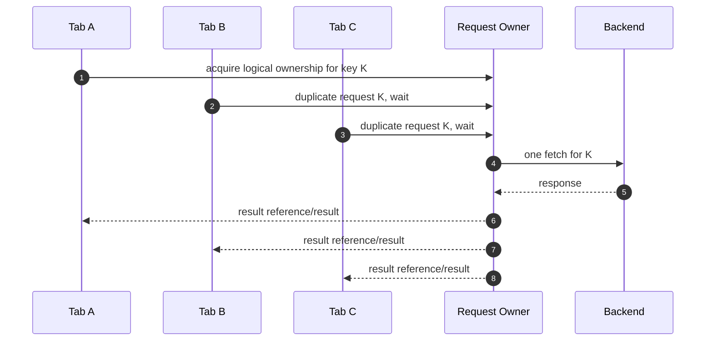
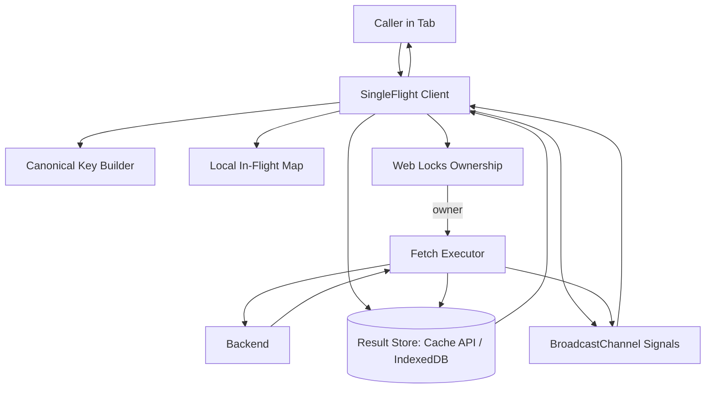
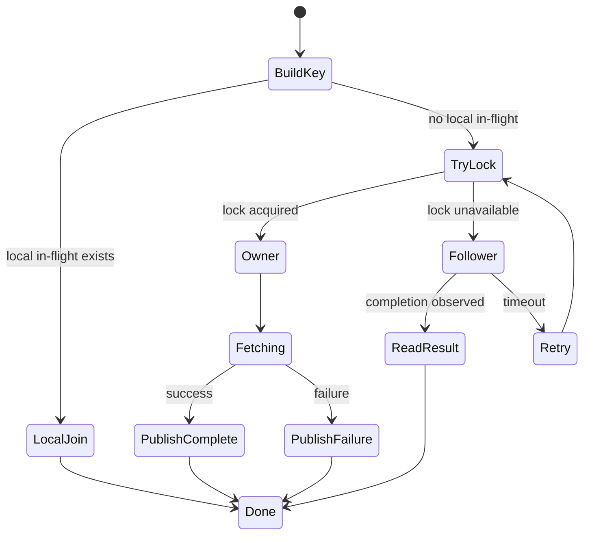
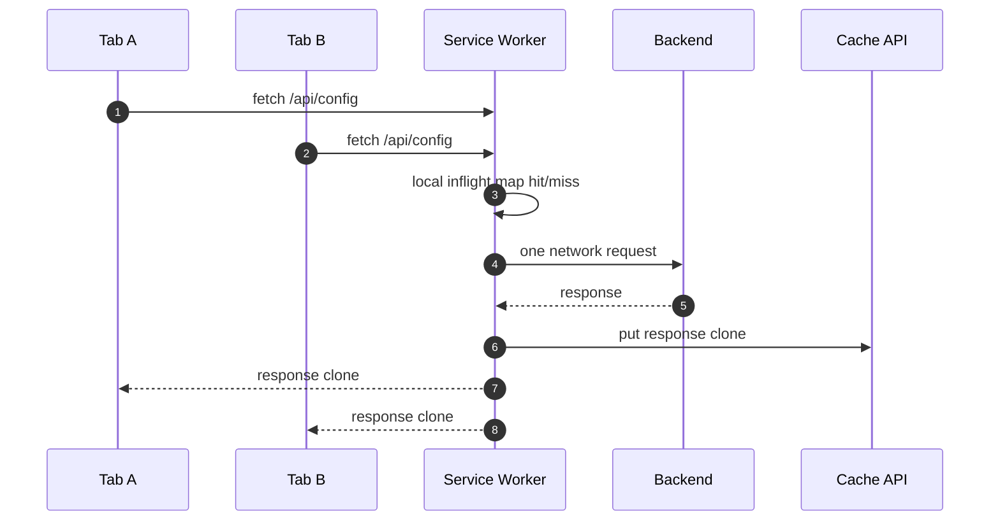
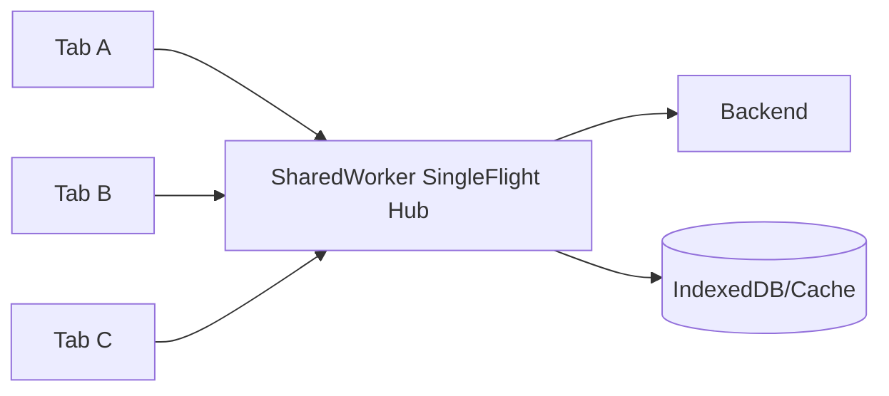
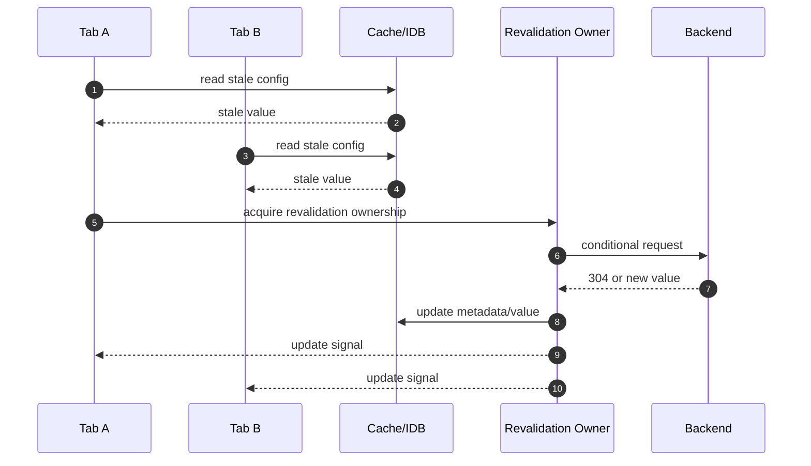

# Part 041 — Single-Flight Network Requests Across Tabs

> Goal: build a browser-side request coalescing layer so five open tabs do not execute the same expensive request five times.

Single-flight is a small idea with a large production impact:

> for one logical operation key, allow only one producer to execute the expensive work, while all duplicate callers wait for or reuse the same result.

Inside one JavaScript process this looks easy. Across multiple tabs it becomes a distributed coordination problem.

A browser app with many open tabs is not one runtime. It is several execution contexts sharing some origin-scoped primitives, each with unstable lifecycle. A tab can be hidden, frozen, discarded, refreshed, logged out, or running a different bundle version. A Service Worker can wake up and die. A SharedWorker may exist in some browsers and not others. A BroadcastChannel message can be missed by a newly opened tab.

So the correct mental model is not:

> "put a global `Map` somewhere."

It is:

> "design a short-lived ownership protocol around a canonical request key, with bounded waiting, idempotent fallback, and a safe result handoff path."

---

## 1. The problem: request storm as a distributed cache miss

Imagine an admin dashboard opened in four tabs:

1. Tab A becomes visible and refreshes `/api/me`.
2. Tab B receives focus and refreshes `/api/me`.
3. Tab C detects token nearing expiry and refreshes `/api/me`.
4. Tab D reconnects after offline and refreshes `/api/me`.

Without coordination, the backend sees four equivalent requests. For cheap reads, that may be tolerable. For expensive reads, slow search queries, report previews, configuration bootstrap, metadata hydration, or token refresh, this causes real damage:

- backend load spike;
- rate limit hit;
- cache stampede;
- duplicate side effects if request is not truly safe;
- user-visible latency because each tab competes for CPU/network;
- inconsistent UI if results arrive in different order;
- refresh storm after network reconnect;
- observability noise.

Single-flight does not replace caching. It protects the gap where cache has missed or expired and many clients ask for the same work at the same time.



---

## 2. Vocabulary

Use precise words because many teams mix these concepts.

| Term | Meaning | Example |
|---|---|---|
| Deduplication | Avoid doing equivalent work more than once | Do not start another `/api/me` fetch while one is running |
| Coalescing | Attach duplicate callers to one in-flight operation | Three tabs wait for the owner result |
| Caching | Reuse a completed result for a freshness window | Serve `/api/config` from Cache API for 5 minutes |
| Single-flight | Coalescing for in-flight work keyed by a logical operation | Only one tab fetches bootstrap config |
| Lock | Mutual exclusion primitive | Web Lock named `request:/api/config` |
| Lease | Time-bounded ownership assumption | Owner is valid until `expiresAt` |
| Fencing token | Monotonic ownership generation used by receivers | Reject stale result from older owner |
| Idempotency key | Server-side duplicate operation key | Same mutation retry does not duplicate side effect |

Single-flight is primarily about **in-flight work**. Caching is about **completed results**. Idempotency is about **safe retries and duplicate side-effect suppression**.

Production systems usually need all three.

---

## 3. What counts as "same request"?

The hardest part is not the lock. The hardest part is the **canonical key**.

Two browser requests are equivalent only if sharing the result is semantically safe.

A canonical key may include:

- HTTP method;
- normalized URL;
- sorted query parameters;
- request body hash for body-bearing requests;
- relevant headers;
- current user/session scope;
- tenant or organization scope;
- permission scope;
- response format/version;
- locale/timezone if response depends on them;
- feature flag snapshot if response varies by flag;
- cache mode/freshness requirement;
- API version;
- auth token generation if relevant;
- caller intent, such as `foreground`, `prefetch`, `revalidate`, or `background`.

Bad key:

```ts
const key = url;
```

Better key:

```ts
type RequestKeyInput = {
  method: string;
  url: string;
  bodyHash?: string;
  userId: string;
  tenantId?: string;
  authGeneration: number;
  accept: string;
  locale?: string;
  freshness: "cache-ok" | "revalidate" | "network-only";
};

function canonicalRequestKey(input: RequestKeyInput): string {
  const url = new URL(input.url, location.origin);
  url.searchParams.sort();

  return [
    "request-v1",
    input.method.toUpperCase(),
    url.pathname + "?" + url.searchParams.toString(),
    `body:${input.bodyHash ?? "none"}`,
    `user:${input.userId}`,
    `tenant:${input.tenantId ?? "none"}`,
    `auth:${input.authGeneration}`,
    `accept:${input.accept}`,
    `locale:${input.locale ?? "default"}`,
    `freshness:${input.freshness}`,
  ].join("|");
}
```

The key must be stable enough to deduplicate equivalent work, but specific enough to avoid leaking or mixing user-specific results.

---

## 4. Good candidates and bad candidates

### Good candidates

Single-flight is useful for:

- app bootstrap configuration;
- `/me` or session hydration;
- token refresh;
- permission/ACL snapshot refresh;
- feature flag snapshot;
- expensive search query;
- metadata dictionaries;
- report preview generation request;
- file checksum calculation;
- cache revalidation;
- offline queue flush ownership;
- WebSocket connection ownership;
- background polling ownership.

### Risky candidates

Be careful with:

- non-idempotent mutations;
- request whose response depends on volatile per-tab state;
- request with streaming response body consumed by one caller;
- request containing sensitive payload that should not be broadcast;
- request requiring per-tab cancellation semantics;
- request whose authorization differs across tabs because one tab is mid-login/logout;
- request whose freshness requirements differ.

### Usually wrong candidates

Do not use cross-tab single-flight for:

- small cheap static GETs already cached by HTTP cache;
- UI-local interactions where latency of coordination exceeds request cost;
- secrets propagation;
- payment/financial side effects unless server idempotency is already strong;
- upload streams where ownership and progress semantics are complex.

---

## 5. Invariants

A production single-flight layer should preserve these invariants:

1. **At most one active owner per request key per coordination scope.**
2. **Followers must not wait forever.**
3. **A stale owner result must be rejectable.**
4. **A tab that misses the start signal can still recover.**
5. **A tab that misses the completion signal can still recover.**
6. **Sensitive response payloads must not be broadcast casually.**
7. **Cancellation by one follower must not accidentally abort all followers.**
8. **Owner crash must degrade to retry/fallback, not permanent starvation.**
9. **Result sharing must respect user/session/tenant boundaries.**
10. **The backend must still tolerate duplicate requests.**

The final invariant is important. Browser coordination is best-effort. The server must remain correct even when the browser layer fails.

---

## 6. Coordination options

| Design | Strength | Weakness | Use When |
|---|---|---|---|
| Per-tab in-memory Map | Simple, fast | Only dedupes within one tab | Single-page duplicate calls |
| BroadcastChannel only | Easy discovery | Race-prone, no mutual exclusion | Low-risk hints, presence, notifications |
| localStorage claim | Broad support | Synchronous, stale, poor atomicity | Legacy fallback only |
| IndexedDB lease | Durable-ish | More code, still not true global lock | Fallback when Web Locks unavailable |
| Web Locks | Strong local mutual exclusion | Browser support constraints, not durable | Best default for same-origin mutual exclusion |
| SharedWorker hub | Central live coordinator | Availability/deploy constraints | Browser supports it and hub is valuable |
| Service Worker coordinator | Good for network/cache | Lifecycle/update complexity | Request passes through fetch/cache layer |
| Server single-flight | Strongest correctness | Backend work required | Expensive global resource or side effect |

A good browser architecture often combines:

- Web Locks for ownership;
- BroadcastChannel for notification;
- Cache API or IndexedDB for result handoff;
- server idempotency/cache for correctness when browser coordination fails.

---

## 7. Reference architecture



The architecture splits responsibilities:

| Component | Responsibility |
|---|---|
| Key builder | Determines equivalence |
| Local in-flight map | Coalesces duplicates in same tab |
| Web Lock | Elects one owner across contexts |
| BroadcastChannel | Announces start/completion/failure |
| Result store | Holds response large enough or sensitive enough not to broadcast |
| Fetch executor | Runs actual request |
| Follower wait loop | Waits for result, timeout, or fallback |
| Observability layer | Records dedupe, wait, owner, failure metrics |

---

## 8. Message protocol

Keep messages small and metadata-heavy. Do not broadcast large or sensitive payload by default.

```ts
type SingleFlightMessage =
  | {
      type: "SF_STARTED";
      protocol: 1;
      key: string;
      ownerId: string;
      fencingToken: number;
      deadlineAt: number;
      startedAt: number;
    }
  | {
      type: "SF_COMPLETED";
      protocol: 1;
      key: string;
      ownerId: string;
      fencingToken: number;
      resultRef: ResultRef;
      completedAt: number;
    }
  | {
      type: "SF_FAILED";
      protocol: 1;
      key: string;
      ownerId: string;
      fencingToken: number;
      error: SerializedError;
      retryable: boolean;
      completedAt: number;
    };

type ResultRef =
  | { kind: "cache"; cacheName: string; requestUrl: string }
  | { kind: "idb"; db: string; store: string; id: string }
  | { kind: "inline"; payload: unknown };
```

Default to `cache` or `idb` result references for substantial data.

Inline payload is acceptable only for small, non-sensitive results.

---

## 9. Result handoff options

### 9.1 Inline payload

Good for:

- tiny status messages;
- small metadata;
- non-sensitive values;
- already public data.

Bad for:

- large JSON;
- binary payload;
- user-private payload;
- data with complex structured clone cost;
- payload that should not be visible to all same-origin contexts.

### 9.2 Cache API handoff

Good for:

- HTTP-like GET responses;
- response reuse;
- revalidation strategy;
- Service Worker integration.

Caveats:

- cache keys must include enough variation;
- authenticated responses need careful scoping;
- Response bodies are streams and must be cloned before multiple reads;
- cleanup/versioning is your responsibility.

### 9.3 IndexedDB handoff

Good for:

- JSON snapshots;
- typed records;
- operation results;
- metadata indexes;
- durable completion markers.

Caveats:

- schema migration across open tabs is hard;
- large object graphs can still be expensive;
- transaction design matters;
- privacy/logout purge must be explicit.

---

## 10. Minimal algorithm with Web Locks

High-level algorithm:

1. Build canonical key.
2. Check local in-flight map.
3. Try to become owner with Web Lock using `ifAvailable`.
4. If lock acquired, execute fetch and publish result reference.
5. If lock unavailable, become follower and wait for completion signal or result store entry.
6. If wait times out, retry ownership or execute fallback according to policy.



Example shape:

```ts
type SingleFlightOptions<T> = {
  key: string;
  timeoutMs: number;
  execute: (signal: AbortSignal) => Promise<T>;
  writeResult: (value: T) => Promise<ResultRef>;
  readResult: (ref: ResultRef) => Promise<T>;
  isSafeToFallback?: boolean;
};

class SingleFlightClient {
  private local = new Map<string, Promise<unknown>>();
  private channel = new BroadcastChannel("single-flight:v1");
  private tabId = crypto.randomUUID();

  run<T>(options: SingleFlightOptions<T>): Promise<T> {
    const existing = this.local.get(options.key) as Promise<T> | undefined;
    if (existing) return existing;

    const promise = this.runUncached(options).finally(() => {
      this.local.delete(options.key);
    });

    this.local.set(options.key, promise);
    return promise;
  }

  private async runUncached<T>(options: SingleFlightOptions<T>): Promise<T> {
    if ("locks" in navigator) {
      const ownedResult = await navigator.locks.request(
        `sf:${options.key}`,
        { ifAvailable: true },
        async (lock) => {
          if (!lock) return { owned: false as const };
          return {
            owned: true as const,
            value: await this.executeAsOwner(options),
          };
        },
      );

      if (ownedResult.owned) return ownedResult.value;
    }

    return this.waitAsFollower(options);
  }

  private async executeAsOwner<T>(options: SingleFlightOptions<T>): Promise<T> {
    const controller = new AbortController();
    const fencingToken = Date.now(); // replace with monotonic IDB/server token in stricter designs
    const ownerId = `${this.tabId}:${crypto.randomUUID()}`;

    this.channel.postMessage({
      type: "SF_STARTED",
      protocol: 1,
      key: options.key,
      ownerId,
      fencingToken,
      deadlineAt: Date.now() + options.timeoutMs,
      startedAt: Date.now(),
    });

    try {
      const value = await options.execute(controller.signal);
      const resultRef = await options.writeResult(value);

      this.channel.postMessage({
        type: "SF_COMPLETED",
        protocol: 1,
        key: options.key,
        ownerId,
        fencingToken,
        resultRef,
        completedAt: Date.now(),
      });

      return value;
    } catch (err) {
      this.channel.postMessage({
        type: "SF_FAILED",
        protocol: 1,
        key: options.key,
        ownerId,
        fencingToken,
        error: serializeError(err),
        retryable: isRetryable(err),
        completedAt: Date.now(),
      });

      throw err;
    }
  }

  private waitAsFollower<T>(options: SingleFlightOptions<T>): Promise<T> {
    return new Promise<T>((resolve, reject) => {
      const timeout = setTimeout(() => {
        cleanup();
        reject(new Error(`single-flight timeout for ${options.key}`));
      }, options.timeoutMs);

      const onMessage = async (event: MessageEvent<SingleFlightMessage>) => {
        const msg = event.data;
        if (!msg || msg.key !== options.key) return;

        if (msg.type === "SF_COMPLETED") {
          try {
            cleanup();
            resolve(await options.readResult(msg.resultRef));
          } catch (err) {
            reject(err);
          }
        }

        if (msg.type === "SF_FAILED") {
          cleanup();
          reject(deserializeError(msg.error));
        }
      };

      const cleanup = () => {
        clearTimeout(timeout);
        this.channel.removeEventListener("message", onMessage);
      };

      this.channel.addEventListener("message", onMessage);
    });
  }
}
```

This example is intentionally incomplete in two places:

1. `fencingToken` should be stronger than `Date.now()` for strict side effects.
2. follower should also poll/read result store because it may miss the completion broadcast.

---

## 11. Follower recovery path

A follower can miss `SF_COMPLETED` if:

- it subscribed too late;
- it was frozen;
- BroadcastChannel was unavailable;
- it reloaded;
- the owner completed but the follower was not alive;
- version skew caused protocol rejection.

So follower waiting must not depend only on receiving a broadcast.

Better follower logic:

```ts
async function waitForResultOrTimeout<T>(input: {
  key: string;
  timeoutMs: number;
  intervalMs: number;
  readCompletionRecord: (key: string) => Promise<ResultRef | null>;
  readResult: (ref: ResultRef) => Promise<T>;
}): Promise<T> {
  const startedAt = performance.now();

  while (performance.now() - startedAt < input.timeoutMs) {
    const ref = await input.readCompletionRecord(input.key);
    if (ref) return input.readResult(ref);

    await sleep(input.intervalMs);
  }

  throw new Error(`single-flight result wait timed out: ${input.key}`);
}
```

The completion record can live in IndexedDB:

```ts
type CompletionRecord = {
  key: string;
  ownerId: string;
  fencingToken: number;
  resultRef: ResultRef;
  status: "completed" | "failed";
  error?: SerializedError;
  expiresAt: number;
  createdAt: number;
};
```

BroadcastChannel becomes a latency optimization. IndexedDB or Cache becomes recovery path.

---

## 12. Request key canonicalization details

### 12.1 URL normalization

Normalize:

- origin;
- pathname;
- query parameter order;
- default values;
- trailing slashes if backend treats them equivalently;
- encoded values consistently.

Do not normalize away values that affect response.

### 12.2 Header normalization

Include only response-varying headers:

- `Accept`;
- `Accept-Language` if backend varies by language;
- tenant/org header;
- API version header;
- feature cohort header;
- authorization generation, not raw token.

Avoid putting raw secrets in keys.

### 12.3 Body hash

For body-bearing requests:

- canonicalize JSON before hashing;
- sort object keys if semantics allow;
- include content type;
- include request intent;
- include idempotency key for mutations.

```ts
async function sha256Hex(data: string | ArrayBuffer): Promise<string> {
  const bytes = typeof data === "string" ? new TextEncoder().encode(data) : data;
  const digest = await crypto.subtle.digest("SHA-256", bytes);
  return [...new Uint8Array(digest)]
    .map((b) => b.toString(16).padStart(2, "0"))
    .join("");
}
```

---

## 13. Service Worker version

For network requests passing through a Service Worker, the Service Worker can act as a natural single-flight coordinator.



In a single Service Worker instance:

```ts
const inflight = new Map<string, Promise<Response>>();

self.addEventListener("fetch", (event) => {
  const request = event.request;

  if (!shouldSingleFlight(request)) return;

  event.respondWith(singleFlightFetch(request));
});

async function singleFlightFetch(request: Request): Promise<Response> {
  const key = await keyForRequest(request);
  const existing = inflight.get(key);

  if (existing) return (await existing).clone();

  const promise = fetch(request).then((response) => {
    if (!response.ok) return response;
    return response;
  }).finally(() => {
    inflight.delete(key);
  });

  inflight.set(key, promise);
  return (await promise).clone();
}
```

This dedupes inside the currently running Service Worker instance. It is useful, but not a complete distributed guarantee:

- Service Worker lifecycle can stop and restart;
- different browser internal scheduling may affect lifetime;
- in-memory `Map` is not durable;
- response body needs cloning carefully;
- this only applies to requests intercepted by the Service Worker.

For stronger behavior, combine Service Worker with Cache API completion markers and/or Web Locks from pages.

---

## 14. SharedWorker version

If SharedWorker is viable, it can centralize request single-flight as a live hub.



Advantages:

- one live in-memory `Map` across connected contexts;
- easy subscriber list;
- easy cancellation reference counting;
- no BroadcastChannel race for connected clients.

Weaknesses:

- SharedWorker availability/deployment constraints;
- lost state after hub termination;
- not a durable background runner;
- versioning and URL identity pitfalls.

Use SharedWorker for live coordination, not durable correctness.

---

## 15. Cancellation model

Cancellation is subtle.

There are two cancellation scopes:

1. **Follower cancellation**: caller no longer cares.
2. **Owner cancellation**: actual network request should stop.

Do not abort the owner just because one follower aborts. Abort owner only when:

- owner itself cancels;
- all followers are gone and policy allows abort;
- deadline expires;
- lifecycle requires shutdown;
- a higher-priority fresh request supersedes the current one.

```ts
type InflightEntry = {
  key: string;
  ownerId: string;
  controller: AbortController;
  followers: Set<string>;
  startedAt: number;
  deadlineAt: number;
};

function maybeAbortOwner(entry: InflightEntry) {
  if (entry.followers.size === 0 && isAbortWhenNoFollowers(entry.key)) {
    entry.controller.abort("no-followers");
  }
}
```

For a Service Worker fetch handler, be very careful. The browser expects a response. Aborting the shared network request may fail all attached fetches.

---

## 16. Freshness and revalidation

Single-flight needs a freshness policy.

| Policy | Meaning |
|---|---|
| `network-only` | Always go to network, but coalesce duplicates |
| `cache-first` | Serve fresh cache, single-flight only on miss |
| `stale-while-revalidate` | Serve stale result and single-flight the revalidation |
| `revalidate` | Conditional request with ETag/Last-Modified, coalesced |
| `force-refresh` | Bypass existing cache and own new fetch |

For stale-while-revalidate:

1. All tabs can read stale cached value immediately.
2. Only one tab/worker performs revalidation.
3. Completion signal tells tabs to update if still relevant.



---

## 17. Error semantics

Single-flight does not mean one failure poisons all callers forever.

Classify errors:

| Error | Owner action | Follower action |
|---|---|---|
| 400/validation | publish terminal failure | fail without retry |
| 401/403 | publish auth failure by session generation | trigger auth flow carefully |
| 404 | cache negative only if safe | fail or cache according to endpoint |
| 409 | conflict handling | domain-specific |
| 429 | publish retry-after | back off |
| 500/503 | publish retryable failure | retry with jitter/fallback |
| network offline | publish retryable/offline | wait for connectivity |
| timeout | abort owner | retry ownership after jitter |
| owner crash | no publish | follower timeout and retry |

Negative caching should be explicit. A 404 for one user/tenant may not apply to another.

---

## 18. Security model

Single-flight crosses tab boundaries, so treat it as a security-sensitive data path.

Rules:

1. Never broadcast raw access tokens.
2. Never use raw token as part of BroadcastChannel message.
3. Include user/session/tenant scope in the key.
4. Purge result stores on logout/session switch.
5. Avoid inline payload for sensitive data.
6. Validate message schema at runtime.
7. Reject unknown protocol versions.
8. Bind completion records to auth generation.
9. Never trust a same-origin message blindly.
10. Prefer server-side authorization for every request regardless of browser coordination.

Same-origin is not same-trust when your page may include multiple app shells, legacy bundles, iframes, or third-party scripts running inside the same origin.

---

## 19. Failure matrix

| Failure | Symptom | Mitigation |
|---|---|---|
| Owner tab closes | followers wait forever | timeout + retry ownership |
| Owner frozen | request stalls | deadline + fallback |
| Completion broadcast missed | follower timeout despite success | completion record in IDB/Cache |
| Duplicate owners | backend sees duplicate fetch | server cache/idempotency + fencing |
| Stale completion | old result overwrites newer | fencing token/auth generation check |
| Result store quota failure | owner cannot handoff | inline small result or fail retryably |
| Key too broad | data leak/wrong result | stricter canonical key |
| Key too narrow | no dedupe benefit | normalize equivalent inputs |
| Large inline payload | clone cost/GC pressure | result reference |
| Auth changes mid-flight | wrong session result | auth generation in key and result |
| SW update mid-flight | in-memory map lost | Cache/IDB completion and retry |

---

## 20. Observability

Track these metrics:

| Metric | Why it matters |
|---|---|
| `single_flight_requests_total` | how often layer is used |
| `single_flight_owner_total` | owner rate |
| `single_flight_follower_total` | dedupe benefit |
| `single_flight_join_ratio` | followers / total |
| `single_flight_wait_ms` | follower latency |
| `single_flight_owner_duration_ms` | backend/network latency |
| `single_flight_timeout_total` | failure or bad deadlines |
| `single_flight_fallback_total` | duplicate network risk |
| `single_flight_payload_bytes` | clone/store pressure |
| `single_flight_result_store_error_total` | storage reliability |
| `single_flight_key_cardinality` | key design health |

Log one compact event per lifecycle transition:

```ts
type SingleFlightLog = {
  event:
    | "sf.owner.start"
    | "sf.owner.complete"
    | "sf.owner.fail"
    | "sf.follower.join"
    | "sf.follower.timeout"
    | "sf.result.read.fail";
  keyHash: string;
  ownerId?: string;
  fencingToken?: number;
  durationMs?: number;
  waitMs?: number;
  resultRefKind?: string;
  errorCode?: string;
};
```

Hash or redact keys before logging if they contain user/resource identifiers.

---

## 21. Testing strategy

### Unit tests

Test:

- key canonicalization;
- header inclusion/exclusion;
- body hash;
- local in-flight map behavior;
- timeout cleanup;
- stale result rejection;
- error classification;
- result store read/write.

### Multi-tab integration tests

Use browser automation to open multiple pages:

1. Open three tabs.
2. Intercept backend request.
3. Trigger the same logical request in all tabs.
4. Assert backend sees one request under normal conditions.
5. Assert all tabs receive result.
6. Close owner tab mid-flight.
7. Assert follower recovers and backend sees at most bounded duplicate.

### Chaos tests

Inject:

- random owner termination;
- delayed BroadcastChannel messages;
- missing completion broadcast;
- stale completion record;
- quota error;
- 429 retry-after;
- logout during request;
- new bundle version during in-flight request.

---

## 22. Production checklist

Before shipping:

- [ ] request key includes user/session/tenant/auth generation;
- [ ] no raw secrets in key, message, or logs;
- [ ] Web Locks path works;
- [ ] fallback path exists when Web Locks unavailable;
- [ ] followers have timeout;
- [ ] owner has deadline;
- [ ] completion record exists for missed broadcast recovery;
- [ ] stale result rejection uses generation/fencing;
- [ ] sensitive payload uses result reference, not broadcast inline;
- [ ] result store is purged on logout;
- [ ] response body cloning is handled correctly;
- [ ] server tolerates duplicate request;
- [ ] metrics show owner/follower ratio;
- [ ] chaos tests cover owner death and missed completion;
- [ ] kill switch exists.

---

## 23. Minimal decision rule

Use this rule when choosing a design:

| Requirement | Design |
|---|---|
| Same tab only | local in-memory Promise map |
| Multi-tab volatile read | Web Locks + BroadcastChannel |
| Multi-tab large result | Web Locks + IDB/Cache result ref |
| Network/cache controlled by SW | Service Worker in-memory + Cache completion |
| Strong live hub needed | SharedWorker hub + fallback |
| Expensive global backend work | server-side single-flight/idempotency too |
| Mutation side effect | server idempotency mandatory |

---

## 24. Mental model recap

Single-flight across tabs is not just "dedupe fetch".

It is a mini-protocol with:

- canonical identity;
- owner election;
- bounded follower wait;
- result handoff;
- stale owner rejection;
- security scoping;
- observability;
- fallback when browser lifecycle breaks the happy path.

The browser can reduce duplicate work. It cannot be the only correctness boundary.

For reads, single-flight improves efficiency and consistency. For mutations, it is only a helper; server idempotency remains mandatory.

---

## References

- MDN — Web Locks API: https://developer.mozilla.org/en-US/docs/Web/API/Web_Locks_API
- W3C — Web Locks API: https://www.w3.org/TR/web-locks/
- MDN — Broadcast Channel API: https://developer.mozilla.org/en-US/docs/Web/API/Broadcast_Channel_API
- MDN — Fetch API: https://developer.mozilla.org/en-US/docs/Web/API/Fetch_API
- MDN — AbortSignal: https://developer.mozilla.org/en-US/docs/Web/API/AbortSignal
