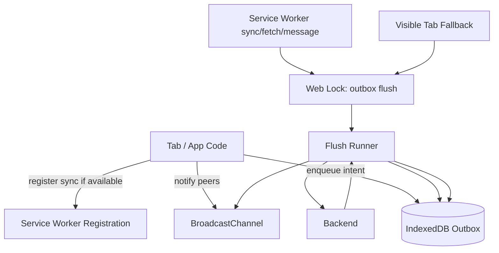
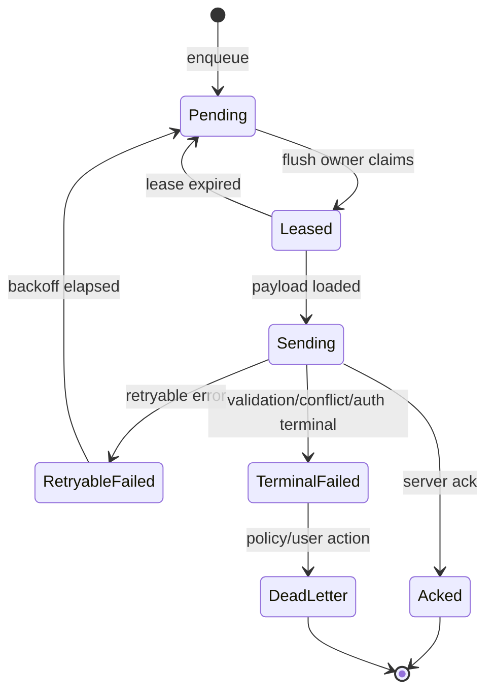
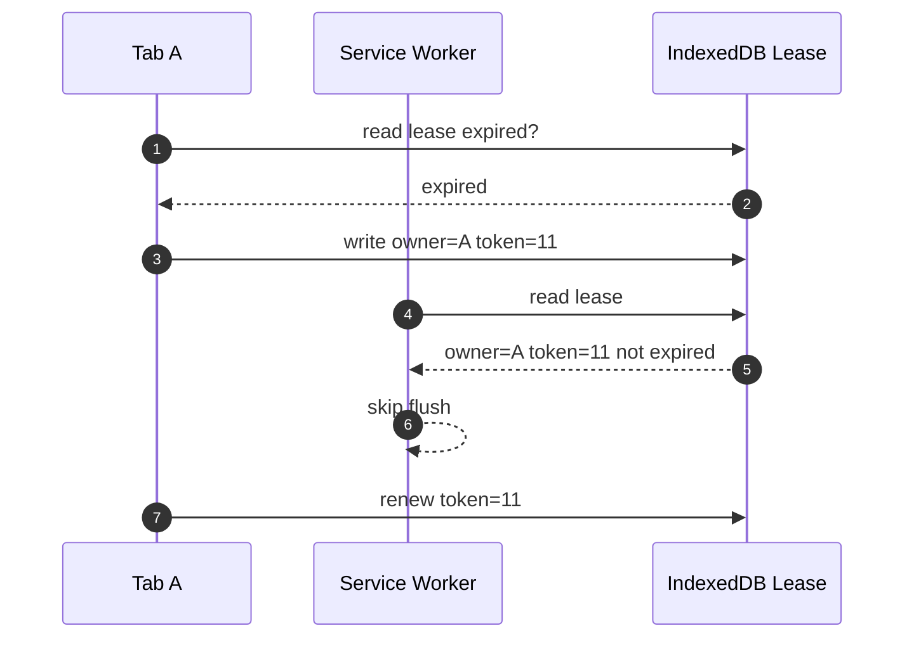
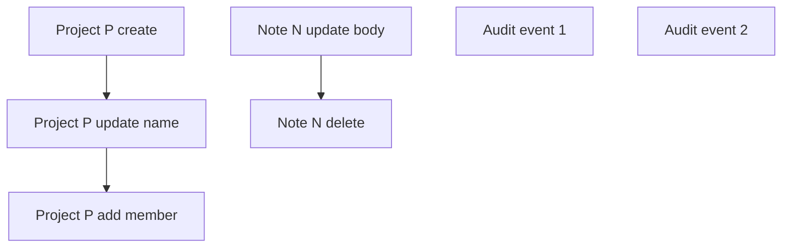

# Part 042 — Deduplicated Background Sync

> Goal: design background synchronization so offline/queued work is flushed once, safely, even when many tabs, workers, and service-worker events try to flush at the same time.

Background sync looks simple in demos:

```ts
await registration.sync.register("flush-outbox");
```

Production reality is harder:

- the API is not uniformly available across all major browsers;
- the Service Worker may be started and stopped by the browser;
- several tabs may also try to flush when they become visible or online;
- the same queued operation can be retried after crash;
- the server may receive duplicates;
- auth may expire while offline;
- schema may migrate while old tabs are still open;
- queue order may matter;
- conflict resolution may be domain-specific.

So this part does not treat Background Sync as magic.

We will design sync as a durable, idempotent, lock-protected outbox protocol.

---

## 1. Mental model

A serious background sync system has three layers:

1. **Intent persistence**: store what must eventually be sent.
2. **Execution ownership**: decide who is allowed to flush now.
3. **Delivery semantics**: make duplicate execution safe.



The queue is the source of truth. Not memory. Not BroadcastChannel. Not the `sync` event itself.

---

## 2. Background Sync is a trigger, not your queue

The Background Synchronization API lets a web app defer synchronization work so a Service Worker can handle it later, often when connectivity is more suitable. The key phrase is **defer work**.

It does not define your business queue.

You still need:

- durable operation records;
- idempotency keys;
- retry policy;
- backoff;
- dead-letter behavior;
- auth refresh behavior;
- conflict handling;
- observability;
- fallback for unsupported browsers.

Treat Background Sync as one possible trigger among several:

| Trigger | Source | Reliability role |
|---|---|---|
| `sync` event | Service Worker | opportunistic background trigger |
| `online` event | Window | foreground fallback hint |
| page visible | Window | good time to retry |
| manual user retry | UI | explicit recovery |
| push/message | Service Worker | server-driven hint |
| periodic timer | visible tab | weak fallback, throttled in background |
| app startup | Window | queue recovery checkpoint |

The outbox must be correct even if some triggers never fire.

---

## 3. Delivery semantics: exactly-once is still a lie

Browser background sync cannot guarantee exactly-once delivery.

At best, we build:

- **at-least-once attempt** from client to server;
- **at-most-once effect** on the server using idempotency;
- **eventual convergence** in client state using acknowledgments and reconciliation.

This is the core rule:

> The client may send the same operation more than once. The server must decide whether it creates a new effect or returns the previous effect.

For mutation sync, server-side idempotency is not optional.

---

## 4. Outbox record design

A robust outbox record should separate identity, ordering, state, payload, and retry metadata.

```ts
type OutboxRecord = {
  id: string;                    // local immutable record id
  operationKey: string;          // semantic dedupe key
  idempotencyKey: string;        // server duplicate-suppression key
  entityType: string;
  entityId?: string;
  operationType: "create" | "update" | "delete" | "command";

  payloadRef: PayloadRef;        // avoid storing giant objects inline when needed
  payloadHash: string;
  payloadSchemaVersion: number;

  status:
    | "pending"
    | "leased"
    | "sending"
    | "acked"
    | "retryable_failed"
    | "terminal_failed"
    | "dead_letter";

  attempts: number;
  maxAttempts: number;
  nextAttemptAt: number;
  lastError?: SerializedError;

  leaseOwnerId?: string;
  leaseToken?: number;
  leaseExpiresAt?: number;

  dependencyIds: string[];
  createdAt: number;
  updatedAt: number;
  ackedAt?: number;
};

type PayloadRef =
  | { kind: "inline"; value: unknown }
  | { kind: "idb-blob"; store: string; id: string }
  | { kind: "opfs"; path: string };
```

### Why both `operationKey` and `idempotencyKey`?

They solve different problems.

| Key | Scope | Example |
|---|---|---|
| `operationKey` | client-side queue dedupe/coalescing | latest update for draft `D123` |
| `idempotencyKey` | server-side effect dedupe | mutation command `cmd_abc123` |

`operationKey` may collapse multiple local operations. `idempotencyKey` should usually be stable for one submitted command.

---

## 5. Queue state machine



Important detail: `sending` must be recoverable. If the owner dies after marking `sending`, another flush should be able to detect lease expiry and retry.

Do not create a state that can only be exited by the dead owner.

---

## 6. Enqueue path

The enqueue path must be fast, durable, and deterministic.

```ts
type EnqueueInput = {
  entityType: string;
  entityId?: string;
  operationType: OutboxRecord["operationType"];
  payload: unknown;
  operationKey: string;
};

async function enqueueOperation(input: EnqueueInput): Promise<string> {
  const now = Date.now();
  const id = crypto.randomUUID();
  const idempotencyKey = crypto.randomUUID();
  const payloadHash = await hashPayload(input.payload);

  const record: OutboxRecord = {
    id,
    operationKey: input.operationKey,
    idempotencyKey,
    entityType: input.entityType,
    entityId: input.entityId,
    operationType: input.operationType,
    payloadRef: { kind: "inline", value: input.payload },
    payloadHash,
    payloadSchemaVersion: 1,
    status: "pending",
    attempts: 0,
    maxAttempts: 10,
    nextAttemptAt: now,
    dependencyIds: [],
    createdAt: now,
    updatedAt: now,
  };

  await outbox.put(record);
  await registerBackgroundSyncBestEffort();
  announceOutboxChanged();

  return id;
}
```

`registerBackgroundSyncBestEffort()` should never be required for correctness.

```ts
async function registerBackgroundSyncBestEffort() {
  if (!("serviceWorker" in navigator)) return;

  const registration = await navigator.serviceWorker.ready;
  const sync = (registration as ServiceWorkerRegistration & {
    sync?: { register: (tag: string) => Promise<void> };
  }).sync;

  if (!sync) return;

  try {
    await sync.register("flush-outbox");
  } catch {
    // Registration can fail due to permissions, browser support, private mode,
    // service-worker state, or user-agent policy. Foreground fallback must exist.
  }
}
```

---

## 7. Deduplication at enqueue time

Some operations should not create unlimited queue entries.

Example: user edits a draft title ten times offline. You often want one final `update-draft` operation, not ten.

```ts
type DedupPolicy =
  | "append"        // keep every operation
  | "replace-latest" // replace pending operation with same operationKey
  | "merge"         // merge payload with existing pending operation
  | "drop-if-exists"; // avoid duplicate intent
```

| Domain | Suggested policy |
|---|---|
| Chat message send | `append` |
| Save draft | `replace-latest` or `merge` |
| Mark notification read | `drop-if-exists` or `merge` |
| File upload chunk | `append` with ordered dependencies |
| Delete entity | `replace-latest` and cancel prior updates |
| Audit event | `append` |

Dedup policy is domain logic. Do not hide it inside a generic queue without explicit configuration.

---

## 8. Flush ownership with Web Locks

Multiple triggers can fire at once:

- visible tab startup;
- online event;
- BroadcastChannel notification;
- Service Worker `sync` event;
- manual retry;
- Service Worker message from a client.

Use a single lock name for one queue scope.

```ts
async function flushOutboxWithLock(reason: string): Promise<void> {
  if ("locks" in navigator) {
    await navigator.locks.request(
      "outbox-flush:v1",
      { ifAvailable: true },
      async (lock) => {
        if (!lock) return;
        await flushOutbox({ reason });
      },
    );
    return;
  }

  await flushOutboxWithIndexedDbLease(reason);
}
```

In a Service Worker, `navigator` is not the global object. Web Locks availability should be feature-detected in the worker global context:

```ts
async function withGlobalLock(name: string, fn: () => Promise<void>) {
  const locks = self.navigator?.locks;
  if (!locks) {
    await fn();
    return;
  }

  await locks.request(name, { ifAvailable: true }, async (lock) => {
    if (!lock) return;
    await fn();
  });
}
```

The fallback IndexedDB lease must have expiry and fencing.

---

## 9. IndexedDB lease fallback

A lease is not a lock. It is a time-bounded claim that other contenders can take over after expiry.

```ts
type LeaseRecord = {
  name: string;
  ownerId: string;
  token: number;
  expiresAt: number;
  updatedAt: number;
};
```

Claim algorithm:

1. Open transaction.
2. Read current lease.
3. If missing or expired, write new lease with higher token.
4. If unexpired and owned by another contender, do not flush.
5. During long flush, renew lease periodically.
6. Each record claim stores the lease token.
7. Before committing ack/failure, verify token is still current.



A lease fallback can still split brain if clocks, transactions, or renewal policy are wrong. Keep TTL short, verify token often, and rely on server idempotency for final correctness.

---

## 10. Flush runner algorithm

A safe flush runner should process bounded batches.

```ts
type FlushOptions = {
  reason: string;
  batchSize: number;
  maxDurationMs: number;
  ownerId: string;
  leaseToken: number;
};

async function flushOutbox(options: Partial<FlushOptions> = {}) {
  const ctx: FlushOptions = {
    reason: options.reason ?? "unknown",
    batchSize: options.batchSize ?? 25,
    maxDurationMs: options.maxDurationMs ?? 20_000,
    ownerId: options.ownerId ?? crypto.randomUUID(),
    leaseToken: options.leaseToken ?? Date.now(),
  };

  const deadline = performance.now() + ctx.maxDurationMs;

  while (performance.now() < deadline) {
    const records = await outbox.claimDueBatch({
      ownerId: ctx.ownerId,
      leaseToken: ctx.leaseToken,
      limit: ctx.batchSize,
      now: Date.now(),
    });

    if (records.length === 0) break;

    for (const record of records) {
      if (performance.now() >= deadline) break;
      await sendOneRecord(record, ctx);
    }
  }
}
```

Record send:

```ts
async function sendOneRecord(record: OutboxRecord, ctx: FlushOptions) {
  try {
    await outbox.markSending(record.id, ctx.ownerId, ctx.leaseToken);

    const payload = await loadPayload(record.payloadRef);

    const response = await fetch(endpointFor(record), {
      method: "POST",
      headers: {
        "content-type": "application/json",
        "idempotency-key": record.idempotencyKey,
        "x-client-operation-id": record.id,
      },
      body: JSON.stringify(payload),
    });

    if (response.ok) {
      const ack = await response.json().catch(() => null);
      await outbox.markAcked(record.id, ctx.ownerId, ctx.leaseToken, ack);
      announceRecordAcked(record.id);
      return;
    }

    await handleHttpFailure(record, response, ctx);
  } catch (err) {
    await outbox.markRetryableFailure(record.id, ctx.ownerId, ctx.leaseToken, {
      error: serializeError(err),
      nextAttemptAt: computeBackoff(record.attempts + 1),
    });
  }
}
```

Every state mutation checks `(record.leaseOwnerId, record.leaseToken)`. If ownership changed, the stale runner must not update the record.

---

## 11. Retry and backoff

Retry must avoid thundering herds after reconnect.

Use:

- exponential backoff;
- jitter;
- `Retry-After` header when present;
- max attempts;
- terminal failure classification;
- per-entity ordering rules;
- global flush duration cap.

```ts
function computeBackoff(attempt: number): number {
  const base = 1_000;
  const cap = 5 * 60_000;
  const exponential = Math.min(cap, base * 2 ** Math.min(attempt, 8));
  const jitter = Math.floor(Math.random() * exponential * 0.3);
  return Date.now() + exponential + jitter;
}
```

Classify responses:

| Response | Client behavior |
|---|---|
| 200/201/204 | mark acked |
| 400 | terminal failure unless payload migration can fix |
| 401 | pause queue, require auth refresh/login |
| 403 | terminal or permission refresh depending domain |
| 404 | terminal or conflict depending operation |
| 409 | conflict resolution path |
| 412 | precondition failed, reconcile |
| 422 | terminal validation failure |
| 429 | retry using `Retry-After` if provided |
| 500/502/503/504 | retryable with backoff |
| network error | retryable |

---

## 12. Ordering and dependencies

Not all queues are FIFO.

Examples:

1. `create project` must happen before `update project`.
2. `upload file chunk 2` depends on chunk 1.
3. `delete note` may supersede prior `update note`.
4. `audit event` should preserve creation order.
5. `mark as read` can be collapsed.

Represent dependencies explicitly.

```ts
type DependencyPolicy = {
  canSend: (record: OutboxRecord, allPending: OutboxRecord[]) => boolean;
  onEnqueue?: (newRecord: OutboxRecord, existing: OutboxRecord[]) => OutboxRecord[];
};
```

Common strategy:

- group by entity;
- preserve order within each entity;
- allow independent entities to send concurrently in bounded fashion;
- coalesce replaceable updates before sending;
- stop a group on conflict until reconciliation.



---

## 13. Auth and session boundary

Outbox sync must be scoped to session/user/tenant.

Do not let a record created under user A be flushed under user B.

Add fields:

```ts
type SessionScopedFields = {
  userId: string;
  tenantId?: string;
  authGeneration: number;
  createdUnderSessionId: string;
};
```

Rules:

1. On logout, either purge queue or encrypt/preserve only if product explicitly supports account switching.
2. On login as different user, do not flush old user's records.
3. On token refresh, update current auth generation but do not mutate historical record identity blindly.
4. On 401, pause queue and request auth recovery.
5. On 403, do not infinite-retry.
6. Never store raw access token inside queue records.

---

## 14. Background Sync Service Worker handler

Service Worker handler:

```ts
self.addEventListener("sync", (event) => {
  if (event.tag !== "flush-outbox") return;

  event.waitUntil(
    withGlobalLock("outbox-flush:v1", async () => {
      await flushOutbox({ reason: "background-sync" });
    }),
  );
});
```

Important constraints:

- keep work bounded;
- use `event.waitUntil()` for async work;
- tolerate termination and retry;
- avoid assuming UI is open;
- do not require DOM APIs;
- do not rely on in-memory state;
- ensure IndexedDB code is available in Service Worker bundle;
- handle version skew between page and Service Worker.

---

## 15. Foreground fallback

Because Background Sync is not universally available, visible pages should also trigger flush.

```ts
function installForegroundSyncTriggers() {
  window.addEventListener("online", () => {
    void flushOutboxWithLock("window-online");
  });

  document.addEventListener("visibilitychange", () => {
    if (document.visibilityState === "visible") {
      void flushOutboxWithLock("page-visible");
    }
  });

  window.addEventListener("focus", () => {
    void flushOutboxWithLock("window-focus");
  });
}
```

These are hints, not correctness guarantees.

`online` does not mean your API is reachable. It only means the browser believes network connectivity is available. Always handle real fetch failures.

---

## 16. BroadcastChannel as a wake-up signal

When one tab enqueues work, it can notify peers:

```ts
const outboxChannel = new BroadcastChannel("outbox:v1");

function announceOutboxChanged() {
  outboxChannel.postMessage({
    type: "OUTBOX_CHANGED",
    protocol: 1,
    at: Date.now(),
  });
}

outboxChannel.addEventListener("message", (event) => {
  if (event.data?.type === "OUTBOX_CHANGED") {
    void flushOutboxWithLock("broadcast-outbox-changed");
  }
});
```

This is safe because the lock deduplicates actual execution.

Without lock, BroadcastChannel can amplify storms: one enqueue can wake many tabs and all can flush.

---

## 17. Conflict handling

Conflicts are domain truth, not transport failure.

Common conflict cases:

- server version changed while client was offline;
- user no longer has permission;
- entity was deleted;
- validation rules changed;
- duplicate command already applied;
- precondition failed;
- merge required.

Handle conflicts with explicit state:

```ts
type ConflictInfo = {
  serverVersion?: string;
  localBaseVersion?: string;
  serverSnapshotRef?: PayloadRef;
  localPayloadRef: PayloadRef;
  resolution:
    | "user-action-required"
    | "auto-merged"
    | "server-wins"
    | "client-wins-retry"
    | "discarded";
};
```

Do not keep retrying conflicts forever. Move them to a visible recovery queue.

---

## 18. Coalescing queued operations

Outbox dedupe can reduce work before network.

Example: update note body offline many times.

```ts
async function enqueueReplaceLatest(input: EnqueueInput) {
  await db.transaction("rw", db.outbox, async () => {
    const existing = await db.outbox
      .where("operationKey")
      .equals(input.operationKey)
      .and((r) => r.status === "pending" || r.status === "retryable_failed")
      .first();

    if (existing) {
      await db.outbox.update(existing.id, {
        payloadRef: { kind: "inline", value: input.payload },
        payloadHash: await hashPayload(input.payload),
        updatedAt: Date.now(),
        status: "pending",
        nextAttemptAt: Date.now(),
      });
      return existing.id;
    }

    return enqueueOperation(input);
  });
}
```

But do not coalesce operations that represent distinct business facts, such as submitted comments, payments, audit events, or messages.

---

## 19. Idempotent server contract

For any mutation synced from an outbox, the server should support idempotency.

Client sends:

```http
POST /api/commands
Idempotency-Key: 5fdc6c3f-52aa-4f46-b971-6d53e4c48f68
Content-Type: application/json
```

Server behavior:

1. If key is new, process command and store result by key.
2. If key was already processed with same payload hash, return stored result.
3. If key was already processed with different payload hash, reject as idempotency conflict.
4. Keep idempotency records long enough for expected retry windows.
5. Bind idempotency key to user/tenant/security scope.

Without this, browser-side dedupe is only optimization, not correctness.

---

## 20. Large payloads and uploads

Large payload sync needs a different design.

Problems:

- IndexedDB quota;
- structured clone cost;
- background execution time;
- retry of large body;
- partial upload resume;
- progress UI;
- battery/network impact.

Better approach:

- store metadata in outbox;
- store binary data in Blob/OPFS when appropriate;
- chunk large uploads;
- make each chunk idempotent;
- track chunk ack state;
- resume from last acked chunk;
- avoid duplicate chunks via checksum/chunk index;
- separate file lifecycle from command lifecycle.

```ts
type UploadChunkRecord = {
  uploadId: string;
  chunkIndex: number;
  chunkHash: string;
  byteStart: number;
  byteEnd: number;
  payloadRef: PayloadRef;
  status: "pending" | "sending" | "acked" | "failed";
};
```

---

## 21. Multi-tab UI state

Background sync is not only backend delivery. Tabs need to know what happened.

Use a lightweight status projection:

```ts
type OutboxProjection = {
  pendingCount: number;
  sendingCount: number;
  failedCount: number;
  deadLetterCount: number;
  lastFlushAt?: number;
  lastError?: SerializedError;
};
```

Each tab can render:

- "3 changes pending";
- "Syncing...";
- "Sync failed. Retry";
- "Conflict requires review";
- "Offline changes saved".

Tabs should read the projection from IndexedDB, not rely only on BroadcastChannel. BroadcastChannel is a wake-up signal.

---

## 22. Versioning and migrations

Outbox records may survive deployment.

You need:

- `payloadSchemaVersion`;
- migration function;
- terminal failure for unrecognized old schema;
- Service Worker/page version compatibility policy;
- queue freeze during migration;
- rollback behavior;
- feature flag for new operation type.

```ts
type PayloadMigration = {
  from: number;
  to: number;
  migrate: (payload: unknown) => unknown;
};
```

Migration risk is high when old tabs remain open. A new Service Worker may flush records enqueued by an old page. A new page may read records created by an old Service Worker.

Design the queue schema as a compatibility contract, not an implementation detail.

---

## 23. Observability

Track:

| Metric | Meaning |
|---|---|
| `outbox_records_pending` | backlog size |
| `outbox_flush_started_total` | flush trigger count |
| `outbox_flush_owner_total` | actual owner count |
| `outbox_flush_skipped_lock_total` | dedupe working |
| `outbox_record_attempt_total` | send attempts |
| `outbox_record_acked_total` | successful delivery |
| `outbox_record_retryable_failed_total` | transient failures |
| `outbox_record_terminal_failed_total` | domain failures |
| `outbox_record_dead_letter_total` | requires intervention |
| `outbox_oldest_pending_age_ms` | user risk/SLA |
| `outbox_flush_duration_ms` | execution cost |
| `outbox_auth_pause_total` | auth boundary issues |
| `outbox_conflict_total` | domain conflict rate |

Log compact events:

```ts
type OutboxLogEvent = {
  event:
    | "outbox.enqueue"
    | "outbox.flush.start"
    | "outbox.flush.skip_locked"
    | "outbox.record.claim"
    | "outbox.record.ack"
    | "outbox.record.retry"
    | "outbox.record.terminal"
    | "outbox.conflict"
    | "outbox.dead_letter";
  recordId?: string;
  operationKeyHash?: string;
  ownerId?: string;
  leaseToken?: number;
  attempt?: number;
  durationMs?: number;
  reason?: string;
  errorCode?: string;
};
```

Never log full payload by default.

---

## 24. Testing strategy

### Unit tests

Test:

- enqueue record shape;
- dedupe policy;
- backoff calculation;
- HTTP error classification;
- lease expiry;
- stale lease token rejection;
- payload migration;
- idempotency key stability;
- conflict classification.

### Multi-context integration tests

1. Open three tabs.
2. Enqueue same operation from multiple tabs.
3. Trigger flush from all tabs.
4. Assert only one lock owner flushes at a time.
5. Assert server receives one effect for one idempotency key.
6. Kill owner mid-send.
7. Assert record returns to retryable state after lease expiry.
8. Bring app online.
9. Assert retry succeeds.

### Service Worker tests

Test:

- `sync` event calls `event.waitUntil()`;
- unsupported Background Sync falls back to foreground trigger;
- old Service Worker can read compatible queue schema;
- new Service Worker does not corrupt old records;
- queue survives reload;
- logout purges or pauses records.

### Chaos tests

Inject:

- network flapping;
- 429 with Retry-After;
- 500 storm;
- auth expiry during flush;
- IDB quota error;
- transaction abort;
- owner tab closed;
- Service Worker update during flush;
- conflict response;
- duplicate server response;
- response lost after server applied mutation.

The last case is critical: server applied mutation but client crashed before marking acked. Idempotency key must allow retry to return prior result.

---

## 25. Common anti-patterns

### Anti-pattern 1: memory queue

```ts
const queue: Operation[] = [];
```

Lost on reload/crash. Not background sync.

### Anti-pattern 2: every tab flushes on `online`

```ts
window.addEventListener("online", flushOutbox);
```

Without lock, reconnect creates a storm.

### Anti-pattern 3: no idempotency key

Retries can duplicate side effects.

### Anti-pattern 4: infinite retry of validation error

Bad payload will drain battery/network forever.

### Anti-pattern 5: raw token in queued payload

Token can expire or leak. Use current auth layer at send time, scoped safely.

### Anti-pattern 6: treating Background Sync support as universal

The API has limited availability. Foreground fallback is required.

### Anti-pattern 7: assuming `online` means backend reachable

Captive portals, DNS issues, API outage, and blocked corporate networks exist.

---

## 26. Production checklist

Before shipping:

- [ ] outbox stored durably in IndexedDB or equivalent;
- [ ] every mutation has idempotency key;
- [ ] idempotency key is bound server-side to user/tenant/payload hash;
- [ ] enqueue dedupe policy is explicit per operation type;
- [ ] flush owner protected by Web Locks or robust lease fallback;
- [ ] records have recoverable lease expiry;
- [ ] state transitions verify owner/token;
- [ ] retry policy has exponential backoff and jitter;
- [ ] terminal failures stop retrying;
- [ ] conflicts are surfaced to user/domain resolver;
- [ ] auth/session boundary is enforced;
- [ ] logout behavior is defined;
- [ ] Background Sync feature detection exists;
- [ ] foreground fallback exists;
- [ ] Service Worker uses `event.waitUntil()`;
- [ ] queue schema has version and migration plan;
- [ ] large payload path avoids giant inline records;
- [ ] metrics expose backlog age and failure rate;
- [ ] chaos tests cover owner death, duplicate send, and response-lost-after-commit;
- [ ] kill switch exists.

---

## 27. Mental model recap

Deduplicated background sync is not:

> "register a sync event and send pending requests."

It is:

> "persist user intent, elect one bounded flush owner, send idempotent commands, recover after crash, and reconcile conflicts."

The browser can help schedule work. It cannot guarantee exactly-once effects.

For serious systems, the correctness chain is:


If any link is missing, background sync becomes a source of duplicate writes, lost work, or user confusion.

---

## References

- MDN — Background Synchronization API: https://developer.mozilla.org/en-US/docs/Web/API/Background_Synchronization_API
- MDN — SyncManager: https://developer.mozilla.org/en-US/docs/Web/API/SyncManager
- MDN — Service Worker API: https://developer.mozilla.org/en-US/docs/Web/API/Service_Worker_API
- MDN — ExtendableEvent.waitUntil(): https://developer.mozilla.org/en-US/docs/Web/API/ExtendableEvent/waitUntil
- MDN — Web Locks API: https://developer.mozilla.org/en-US/docs/Web/API/Web_Locks_API
- MDN — Broadcast Channel API: https://developer.mozilla.org/en-US/docs/Web/API/Broadcast_Channel_API
