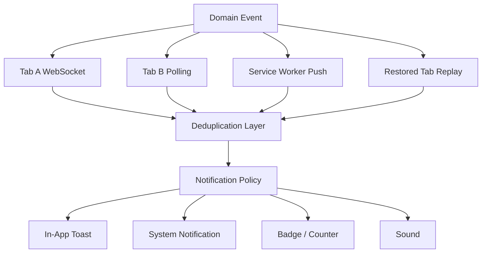
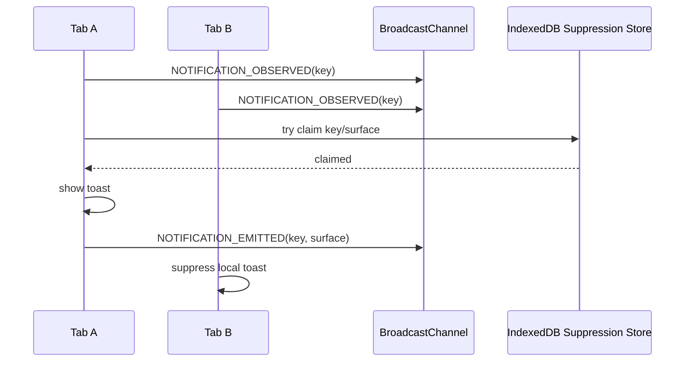
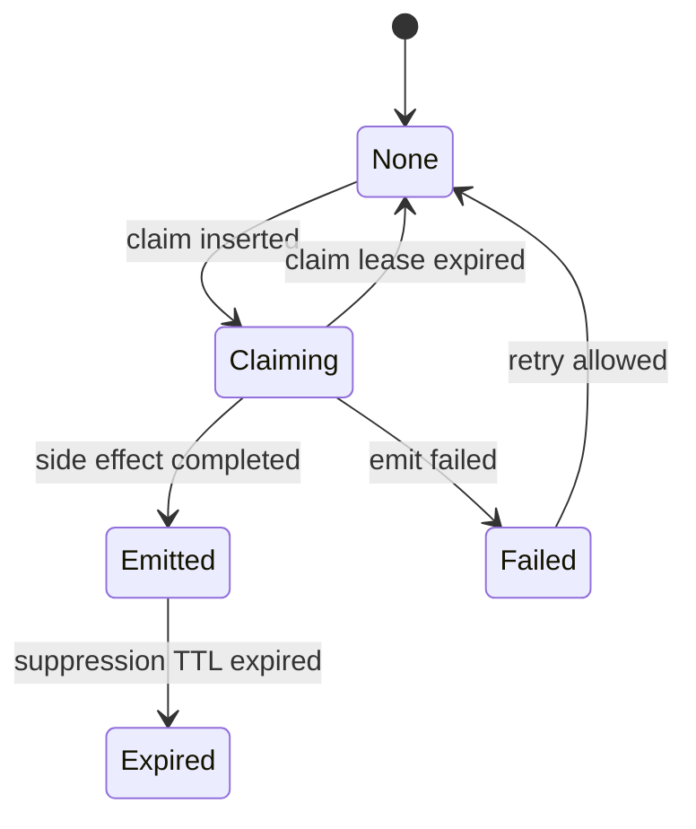

# Part 043 — Cross-Tab Notification Suppression

> Goal: design a notification system that emits the right user-facing signal once, even when the same event is observed by several tabs, workers, and service-worker paths.

A notification system is not just a UI component.

In a multi-tab application, notification delivery is a distributed side effect.

The same domain event can arrive through several paths:

- an active WebSocket in tab A;
- a polling loop in tab B;
- a Service Worker push event;
- a background sync result;
- a cache revalidation event;
- a BroadcastChannel event emitted by another tab;
- a restored tab replaying stale local state;
- an offline queue flush response;
- a user action completing in a worker.

If every context reacts independently, the user gets duplicate toast messages, duplicate sounds, duplicate badge increments, duplicate system notifications, and inconsistent unread counters.

That is not a cosmetic bug. It is a broken side-effect protocol.

---

## 1. Mental model

Notification suppression is the act of converting **many observations** into **one user-facing effect**.



The real problem is not "how do I show a notification?"

The real problem is:

> Which context owns this notification side effect, under which conditions, with which dedupe key, for how long, and how do other contexts learn that it already happened?

---

## 2. Notification surfaces are different systems

Do not treat all notification-like effects as one thing.

| Surface | Example | Typical owner | Suppression concern |
|---|---|---|---|
| In-app toast | small UI banner inside app | visible/focused tab | duplicate toasts across tabs |
| System notification | OS-level notification | Service Worker or elected tab | duplicate OS notifications |
| Badge/counter | unread count, app badge | shared state owner | double increment |
| Sound/vibration | audible attention signal | focused tab or leader | repeated annoying effect |
| Modal/alert | blocking prompt | active tab only | catastrophic UX if repeated |
| Activity feed entry | durable UI item | data store | duplicate durable records |

A production system must decide suppression per surface.

For example:

- an in-app toast should usually be shown only in the most relevant visible tab;
- a system notification should usually be shown only when no app window is focused;
- a badge update should be idempotent and derived from unread state, not incremented blindly;
- a sound should be rate-limited more aggressively than a visual toast;
- a durable activity item should be written once by event ID.

---

## 3. Browser facts you must design around

There are several browser constraints behind this design.

1. The Notifications API displays system-level notifications outside the page viewport and requires origin-level permission.
2. `Notification.requestPermission()` is permission-sensitive and should be driven by explicit user intent, not random background orchestration.
3. BroadcastChannel can communicate between same-origin browsing contexts and workers, but it is a volatile bus, not a durable log.
4. Page visibility and focus are signals, not perfect proof of user attention.
5. The transition to `hidden` is often the last reliably observable page lifecycle event.
6. A Service Worker can inspect window clients and has `WindowClient.focused` / `WindowClient.visibilityState`, but it still cannot know the user's semantic intent.

That means notification policy should be conservative.

Never spam the user because the runtime cannot prove uniqueness.

---

## 4. Event identity

Suppression starts with identity.

A notification without a stable dedupe key cannot be reliably suppressed.

Bad dedupe keys:

```ts
const key = Date.now().toString();
const key = crypto.randomUUID();
const key = `${title}:${body}`;
```

Those identify the local rendering attempt, not the domain event.

Better keys:

```ts
type NotificationKey = string;

function notificationKey(event: DomainEvent): NotificationKey {
  return [
    event.tenantId,
    event.kind,
    event.aggregateType,
    event.aggregateId,
    event.eventId,
  ].join(":");
}
```

For events without server IDs, derive a semantic idempotency key:

```ts
function derivedKey(input: {
  tenantId: string;
  actorId: string;
  targetId: string;
  action: string;
  occurredAtBucket: string;
}): string {
  return [
    input.tenantId,
    input.action,
    input.targetId,
    input.actorId,
    input.occurredAtBucket,
  ].join(":");
}
```

But derived keys are always weaker than authoritative event IDs.

---

## 5. Suppression store

A suppression decision must outlive one JavaScript call stack.

You need a small local record:

```ts
type NotificationSurface = "toast" | "system" | "badge" | "sound";

type SuppressionRecord = {
  key: string;
  surface: NotificationSurface;
  firstSeenAt: number;
  lastSeenAt: number;
  emittedAt?: number;
  emittedBy?: string;
  eventVersion?: number;
  reason?: string;
  expiresAt: number;
};
```

Possible stores:

| Store | Use | Caveat |
|---|---|---|
| Memory map | same-tab duplicate suppression | lost on reload |
| BroadcastChannel | announce emitted side effect | not durable |
| IndexedDB | durable suppression window | async and needs cleanup |
| localStorage | legacy coarse signal | synchronous and limited |
| Server state | authoritative unread/notification state | network latency |

A good pattern is:

1. decide locally using memory for speed;
2. persist recent emitted keys in IndexedDB;
3. broadcast emission to peers;
4. make rendering idempotent on every receiver.

---

## 6. Suppression windows

Not every event should be suppressed forever.

| Event type | Example | Suggested window |
|---|---|---|
| Unique server event | comment created | forever or until store compaction |
| Polling refresh | data updated | 10–60 seconds |
| Connection event | reconnected | 30–120 seconds |
| Error alert | sync failed | exponential cool-down |
| Security event | session revoked | no suppression for state transition; suppress repeated UI noise |
| Chat message | message ID | dedupe by message ID |

The suppression window should match the domain semantics.

A bad design uses one global `5 seconds` rule for everything.

A better design defines policy per event kind:

```ts
type NotificationPolicy = {
  surface: NotificationSurface;
  ttlMs: number;
  requiresVisibleTab?: boolean;
  requiresFocusedTab?: boolean;
  allowSystemNotificationWhenFocused?: boolean;
  maxPerMinute?: number;
  severity: "low" | "normal" | "high" | "critical";
};

const policies: Record<string, NotificationPolicy> = {
  "case.assigned": {
    surface: "toast",
    ttlMs: 60_000,
    requiresVisibleTab: true,
    severity: "normal",
  },
  "session.revoked": {
    surface: "toast",
    ttlMs: 5 * 60_000,
    severity: "critical",
  },
  "sync.failed": {
    surface: "toast",
    ttlMs: 2 * 60_000,
    requiresVisibleTab: true,
    severity: "normal",
  },
};
```

---

## 7. Active tab arbitration

When several tabs are visible, which one should show the toast?

You need a rank function.

Common signals:

- `document.visibilityState === "visible"`;
- `document.hasFocus()`;
- last user input timestamp;
- route relevance;
- tab role/capability;
- leader status;
- app foreground status;
- current user/session/tenant.

A practical ranking model:

```ts
type AttentionSnapshot = {
  tabId: string;
  sessionId: string;
  tenantId: string;
  route: string;
  visible: boolean;
  focused: boolean;
  lastInputAt: number;
  lastHeartbeatAt: number;
  capabilities: string[];
};

function attentionScore(s: AttentionSnapshot, event: DomainEvent): number {
  let score = 0;

  if (s.visible) score += 100;
  if (s.focused) score += 100;
  if (Date.now() - s.lastInputAt < 30_000) score += 50;
  if (routeMatchesEvent(s.route, event)) score += 40;
  if (s.capabilities.includes("notify:toast")) score += 10;

  return score;
}
```

Then choose the highest eligible tab.

But do not let ranking be the only safety mechanism. Ranking can disagree under race.

Use ranking for UX, and use a suppression key for correctness.

---

## 8. Broadcast protocol

Use BroadcastChannel to coordinate recent notification observations.

```ts
type NotificationBusMessage =
  | {
      type: "NOTIFICATION_OBSERVED";
      key: string;
      eventKind: string;
      observedBy: string;
      observedAt: number;
      eventVersion?: number;
    }
  | {
      type: "NOTIFICATION_EMITTED";
      key: string;
      surface: NotificationSurface;
      emittedBy: string;
      emittedAt: number;
      expiresAt: number;
    }
  | {
      type: "ATTENTION_SNAPSHOT";
      snapshot: AttentionSnapshot;
    };
```

Lifecycle:



The exact claim operation should be idempotent.

If using IndexedDB, model it as "insert if absent or expired".

---

## 9. IndexedDB claim pattern

Pseudo-code:

```ts
type ClaimResult =
  | { ok: true; record: SuppressionRecord }
  | { ok: false; record: SuppressionRecord; reason: "already-emitted" | "cooldown" };

async function tryClaimNotification(input: {
  key: string;
  surface: NotificationSurface;
  tabId: string;
  ttlMs: number;
  now: number;
}): Promise<ClaimResult> {
  return idbTx("readwrite", ["notificationSuppression"], async (tx) => {
    const store = tx.objectStore("notificationSuppression");
    const id = `${input.surface}:${input.key}`;
    const existing = await store.get(id) as SuppressionRecord | undefined;

    if (existing && existing.expiresAt > input.now && existing.emittedAt) {
      existing.lastSeenAt = input.now;
      await store.put(existing, id);
      return { ok: false, record: existing, reason: "already-emitted" };
    }

    const record: SuppressionRecord = {
      key: input.key,
      surface: input.surface,
      firstSeenAt: existing?.firstSeenAt ?? input.now,
      lastSeenAt: input.now,
      emittedAt: input.now,
      emittedBy: input.tabId,
      expiresAt: input.now + input.ttlMs,
    };

    await store.put(record, id);
    return { ok: true, record };
  });
}
```

This is not a perfect distributed transaction, but it is good enough for local browser duplicate suppression when paired with server-side idempotent event IDs.

For high-value effects, combine it with Web Locks:

```ts
async function withNotificationClaim<T>(
  key: string,
  surface: NotificationSurface,
  fn: () => Promise<T>,
): Promise<T | undefined> {
  return navigator.locks.request(
    `notification:${surface}:${key}`,
    { ifAvailable: true },
    async (lock) => {
      if (!lock) return undefined;
      return fn();
    },
  );
}
```

Use the lock to serialize claim attempts. Use the store to remember the result.

---

## 10. In-app toast suppression

In-app toast rules should avoid showing a toast in a tab where the user is not looking.

Simple policy:

1. If one focused tab exists, show toast there.
2. Else if one visible tab exists, show toast there.
3. Else do not show in-app toast; consider system notification if policy allows.
4. If several tabs qualify, pick the highest attention score.
5. If no attention snapshot is fresh, suppress or elect leader conservatively.

Implementation sketch:

```ts
async function handleDomainEvent(event: DomainEvent) {
  const key = notificationKey(event);
  const policy = policyFor(event);

  bus.postMessage({
    type: "NOTIFICATION_OBSERVED",
    key,
    eventKind: event.kind,
    observedBy: tabId,
    observedAt: Date.now(),
  });

  const eligibleOwner = chooseToastOwner(event, presence.getFreshSnapshots());
  if (eligibleOwner !== tabId) return;

  const claim = await tryClaimNotification({
    key,
    surface: "toast",
    tabId,
    ttlMs: policy.ttlMs,
    now: Date.now(),
  });

  if (!claim.ok) return;

  showToast(renderToast(event));

  bus.postMessage({
    type: "NOTIFICATION_EMITTED",
    key,
    surface: "toast",
    emittedBy: tabId,
    emittedAt: Date.now(),
    expiresAt: claim.record.expiresAt,
  });
}
```

---

## 11. System notification suppression

System notifications are more sensitive than in-app toasts.

Bad behavior:

- each tab calls `new Notification(...)`;
- visible tab and Service Worker both show a notification;
- push notification appears while the user is already reading the same page;
- notification click opens a duplicate window;
- stale restored tab emits old system notification.

Better policy:

| Condition | Behavior |
|---|---|
| focused app client exists | do not show system notification; maybe show in-app toast |
| visible but unfocused app client exists | usually suppress or use subtle badge |
| no visible/focused app client | Service Worker may show system notification |
| event already read/acknowledged | suppress |
| event severity critical | maybe show even if visible, but dedupe strictly |

In a Service Worker push handler:

```ts
self.addEventListener("push", (event) => {
  event.waitUntil(handlePush(event));
});

async function handlePush(event: PushEvent) {
  const payload = event.data?.json() as DomainEvent | undefined;
  if (!payload) return;

  const key = notificationKey(payload);
  const clientsList = await self.clients.matchAll({
    type: "window",
    includeUncontrolled: true,
  });

  const hasFocusedClient = clientsList.some((client) => {
    const wc = client as WindowClient;
    return wc.focused;
  });

  if (hasFocusedClient && !isCritical(payload)) {
    await broadcastToClients({
      type: "DOMAIN_EVENT_AVAILABLE",
      key,
      event: payload,
      suggestedSurface: "toast",
    });
    return;
  }

  const claim = await tryClaimSystemNotificationInSW(key, payload);
  if (!claim.ok) return;

  await self.registration.showNotification(payload.title, {
    body: payload.summary,
    tag: key,
    data: {
      key,
      url: urlForEvent(payload),
    },
  });
}
```

The `tag` option is useful because some platforms may replace existing notifications with the same tag. Still, do not rely on platform replacement as your only dedupe layer.

---

## 12. Notification click routing

Notification click is another orchestration problem.

Desired behavior:

1. close the clicked notification;
2. focus an existing relevant tab if possible;
3. otherwise open a new window;
4. broadcast navigation intent;
5. avoid opening duplicate route windows;
6. mark notification as handled idempotently.

```ts
self.addEventListener("notificationclick", (event) => {
  event.notification.close();

  event.waitUntil((async () => {
    const data = event.notification.data as { url?: string; key?: string };
    const targetUrl = data.url ?? "/";

    const windows = await self.clients.matchAll({
      type: "window",
      includeUncontrolled: true,
    });

    const existing = windows.find((client) => {
      const url = new URL(client.url);
      return url.pathname === new URL(targetUrl, self.location.origin).pathname;
    }) as WindowClient | undefined;

    if (existing) {
      await existing.focus();
      existing.postMessage({
        type: "NAVIGATE_FROM_NOTIFICATION",
        key: data.key,
        url: targetUrl,
      });
      return;
    }

    await self.clients.openWindow(targetUrl);
  })());
});
```

Even this is best-effort. Browser policy may restrict focus/open behavior depending on context and platform.

---

## 13. Badge and unread suppression

Never use duplicate event observations to increment unread counts blindly.

Bad:

```ts
unreadCount += 1;
```

Better:

```ts
type UnreadEvent = {
  eventId: string;
  targetId: string;
  userId: string;
  readStateVersion: number;
};

function applyUnreadEvent(state: UnreadState, event: UnreadEvent): UnreadState {
  if (state.appliedEventIds.has(event.eventId)) return state;

  return {
    ...state,
    appliedEventIds: new Set([...state.appliedEventIds, event.eventId]),
    unreadByTarget: incrementOnce(state.unreadByTarget, event.targetId),
    version: Math.max(state.version, event.readStateVersion),
  };
}
```

For serious systems, unread count should be derived from server state or from an idempotent local event log.

The UI may optimistically display a count, but reconciliation must be authoritative.

---

## 14. Sound and vibration suppression

Sound is the most annoying surface.

Apply stricter rules:

- only focused or recently interacted tab can play sound;
- never play sound from multiple tabs;
- rate-limit by event kind;
- respect user preferences;
- respect OS/browser autoplay restrictions;
- suppress when page hidden unless the user explicitly enabled background sound;
- do not play sound for replayed events.

```ts
type SoundBudget = {
  windowMs: number;
  max: number;
};

const soundBudgets: Record<string, SoundBudget> = {
  "chat.message": { windowMs: 60_000, max: 3 },
  "case.assigned": { windowMs: 60_000, max: 1 },
  "sync.failed": { windowMs: 10 * 60_000, max: 1 },
};
```

The correct default is silence.

---

## 15. Stale event suppression

A restored tab may replay events from old memory or stale IndexedDB query results.

Every notification event should include freshness metadata:

```ts
type NotifiableEvent = {
  eventId: string;
  kind: string;
  occurredAt: number;
  observedAt: number;
  version?: number;
  aggregateId?: string;
};

function isTooStale(event: NotifiableEvent, now = Date.now()): boolean {
  const maxAgeMs = maxNotificationAgeFor(event.kind);
  return now - event.occurredAt > maxAgeMs;
}
```

Stale does not always mean ignored.

For example:

- a stale unread event may still update a feed;
- a stale security event may still force logout;
- a stale toast should usually be suppressed;
- a stale system notification should almost always be suppressed.

Separate **state application** from **user-facing alert**.

---

## 16. Version-aware suppression

If event version increases, you may want to update an existing notification rather than suppress it.

Example:

- case assigned;
- case reassigned;
- case escalated;
- case resolved.

A single aggregate may produce several related notifications.

Define collapse keys and event keys separately:

```ts
type NotificationIdentity = {
  eventKey: string;     // unique event
  collapseKey: string;  // replace/update group
};

function identityFor(event: DomainEvent): NotificationIdentity {
  return {
    eventKey: `${event.tenantId}:${event.eventId}`,
    collapseKey: `${event.tenantId}:${event.aggregateType}:${event.aggregateId}`,
  };
}
```

Use `eventKey` for dedupe.

Use `collapseKey` for UI grouping/replacement.

---

## 17. Security boundary

Do not broadcast sensitive notification payloads across every same-origin context unless every context is equally trusted.

Bad:

```ts
channel.postMessage({
  type: "NEW_CASE_NOTIFICATION",
  caseTitle: "Sensitive investigation title",
  complainantName: "...",
  internalRiskScore: 93,
});
```

Better:

```ts
channel.postMessage({
  type: "DOMAIN_EVENT_AVAILABLE",
  key,
  eventKind: "case.assigned",
  aggregateId: caseId,
  minRole: "case:read",
});
```

The receiving tab should check authorization and fetch the detail if needed.

Remember: same-origin does not necessarily mean same app trust level. Embedded admin tools, legacy pages, and feature-preview iframes may share origin but not security posture.

---

## 18. Notification orchestrator skeleton

```ts
type NotificationOrchestratorConfig = {
  tabId: string;
  sessionId: string;
  channelName: string;
  policies: Record<string, NotificationPolicy>;
};

class NotificationOrchestrator {
  private channel: BroadcastChannel;
  private emitted = new Map<string, SuppressionRecord>();

  constructor(private config: NotificationOrchestratorConfig) {
    this.channel = new BroadcastChannel(config.channelName);
    this.channel.addEventListener("message", (event) => this.onBusMessage(event.data));
  }

  async observe(event: DomainEvent): Promise<void> {
    const key = notificationKey(event);
    const policy = this.config.policies[event.kind];
    if (!policy) return;

    if (isTooStale(event)) return;

    this.channel.postMessage({
      type: "NOTIFICATION_OBSERVED",
      key,
      eventKind: event.kind,
      observedBy: this.config.tabId,
      observedAt: Date.now(),
    });

    const surface = chooseSurface(event, policy);
    if (!surface) return;

    const owner = chooseOwner(event, surface);
    if (owner !== this.config.tabId) return;

    const claim = await tryClaimNotification({
      key,
      surface,
      tabId: this.config.tabId,
      ttlMs: policy.ttlMs,
      now: Date.now(),
    });

    if (!claim.ok) return;

    await emitSurface(surface, event);

    this.channel.postMessage({
      type: "NOTIFICATION_EMITTED",
      key,
      surface,
      emittedBy: this.config.tabId,
      emittedAt: Date.now(),
      expiresAt: claim.record.expiresAt,
    });
  }

  private onBusMessage(message: NotificationBusMessage): void {
    if (message.type === "NOTIFICATION_EMITTED") {
      this.emitted.set(`${message.surface}:${message.key}`, {
        key: message.key,
        surface: message.surface,
        firstSeenAt: message.emittedAt,
        lastSeenAt: message.emittedAt,
        emittedAt: message.emittedAt,
        emittedBy: message.emittedBy,
        expiresAt: message.expiresAt,
      });
    }
  }

  close(): void {
    this.channel.close();
  }
}
```

The skeleton hides many implementation details, but the shape is the important part: observe → classify → choose owner → claim → emit → broadcast emitted.

---

## 19. Failure matrix

| Failure | Symptom | Mitigation |
|---|---|---|
| Broadcast message lost | another tab also emits | durable claim store + short TTL |
| IndexedDB unavailable | duplicate possible | degrade to memory + rate limit |
| tab freezes after claim before emit | notification lost | claim state should distinguish claimed vs emitted |
| Service Worker emits while tab emits | duplicate system/toast | shared dedupe key + `tag` + client focus check |
| restored tab replays old event | stale notification | occurredAt/version guard |
| different app versions disagree | inconsistent suppression | versioned envelope + conservative default |
| user has multiple browser profiles | cannot suppress across profiles | server-side read/notification state |
| permission denied | system notification impossible | fallback to in-app surfaces |
| OS replaces notification differently | UX inconsistency | do not depend only on platform behavior |

---

## 20. Claimed vs emitted

A subtle bug: a tab may claim a notification and then crash before showing it.

Do not store only `emittedAt` immediately if the side effect is not yet complete.

Better state:

```ts
type SuppressionStatus = "claiming" | "emitted" | "failed";

type SuppressionRecordV2 = SuppressionRecord & {
  status: SuppressionStatus;
  claimExpiresAt?: number;
};
```

Flow:

1. insert `claiming` with short claim lease;
2. emit notification;
3. update to `emitted` with longer TTL;
4. if crash occurs, another context can reclaim after `claimExpiresAt`.



---

## 21. Testing strategy

Test notification suppression like a distributed system.

Scenarios:

1. two tabs receive same WebSocket event at nearly same time;
2. Service Worker push arrives while focused tab is open;
3. tab claims but crashes before emit;
4. stale restored tab observes old event;
5. BroadcastChannel is unavailable or closed;
6. IndexedDB write fails;
7. old app version sends old envelope;
8. notification permission is denied;
9. user clicks notification while existing tab is open;
10. event replay after network reconnect.

Playwright can simulate multiple pages in one browser context:

```ts
test("only one tab shows toast for same event", async ({ browser }) => {
  const context = await browser.newContext();
  const a = await context.newPage();
  const b = await context.newPage();

  await a.goto(appUrl);
  await b.goto(appUrl);

  await Promise.all([
    a.evaluate((event) => window.__testBus.emit(event), sampleEvent),
    b.evaluate((event) => window.__testBus.emit(event), sampleEvent),
  ]);

  const toastCountA = await a.locator("[data-toast]").count();
  const toastCountB = await b.locator("[data-toast]").count();

  expect(toastCountA + toastCountB).toBe(1);
});
```

---

## 22. Observability

Log notification decisions without logging sensitive payload.

```ts
type NotificationDecisionLog = {
  ts: number;
  tabId: string;
  eventKind: string;
  keyHash: string;
  surface: NotificationSurface;
  decision:
    | "emitted"
    | "suppressed_duplicate"
    | "suppressed_stale"
    | "suppressed_not_owner"
    | "suppressed_permission"
    | "suppressed_not_visible"
    | "failed";
  owner?: string;
  reason?: string;
  visibilityState?: DocumentVisibilityState;
  focused?: boolean;
};
```

Useful metrics:

- observed events by kind;
- emitted notifications by surface;
- duplicate suppression rate;
- stale suppression rate;
- claim failure rate;
- claim-to-emit latency;
- notification click-through;
- notification permission state;
- Service Worker vs tab emission ratio.

A high duplicate suppression rate may be healthy if many tabs are open. A sudden drop may mean BroadcastChannel or the suppression store broke.

---

## 23. Anti-patterns

Avoid these:

1. every tab independently shows notifications;
2. dedupe by title/body;
3. `localStorage.setItem("lastNotification", key)` with no TTL/version;
4. assuming focus means user saw the event;
5. assuming hidden means no user relevance;
6. showing system notification from visible tab and Service Worker;
7. broadcasting sensitive payloads;
8. incrementing unread count per observation;
9. relying only on Notification `tag`;
10. requesting notification permission during background work;
11. suppressing critical security state transitions because "already shown";
12. using one global cooldown for all event kinds.

---

## 24. Production checklist

Before shipping cross-tab notification logic, verify:

- every notifiable event has a stable idempotency key;
- event identity and collapse identity are separate;
- each notification surface has a policy;
- visible/focused/recently-active tab selection is explicit;
- system notification is suppressed when focused client exists unless intentionally allowed;
- suppression records expire and are compacted;
- claim state distinguishes `claiming` and `emitted`;
- stale restored events are suppressed for alert surfaces;
- unread/badge state is idempotent;
- Notification permission denial is handled;
- Service Worker and tab paths share the same dedupe key;
- notification click focuses existing clients where possible;
- sensitive payload is not broadcast unnecessarily;
- duplicate suppression has metrics;
- chaos tests cover simultaneous tabs, crash-before-emit, and stale replay.

---

## 25. Key takeaways

Cross-tab notification suppression is a side-effect ownership problem.

The invariant is:

> Many contexts may observe an event, but only one eligible context should perform each user-facing notification side effect.

The implementation pattern is:

1. derive stable event key;
2. classify notification surface;
3. choose eligible owner;
4. claim side effect idempotently;
5. emit once;
6. broadcast emitted marker;
7. persist suppression window;
8. treat state updates separately from alert effects.

Once this is in place, notifications stop being noisy race conditions and become a predictable part of your browser orchestration runtime.

---

## References

- MDN — Notifications API: https://developer.mozilla.org/en-US/docs/Web/API/Notifications_API
- MDN — Notification.requestPermission(): https://developer.mozilla.org/en-US/docs/Web/API/Notification/requestPermission_static
- MDN — Broadcast Channel API: https://developer.mozilla.org/en-US/docs/Web/API/Broadcast_Channel_API
- MDN — Document visibilitychange event: https://developer.mozilla.org/en-US/docs/Web/API/Document/visibilitychange_event
- MDN — WindowClient: https://developer.mozilla.org/en-US/docs/Web/API/WindowClient
