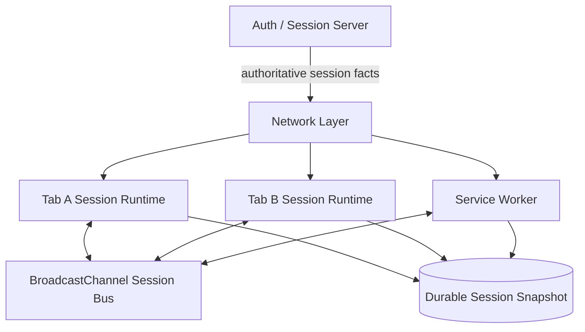
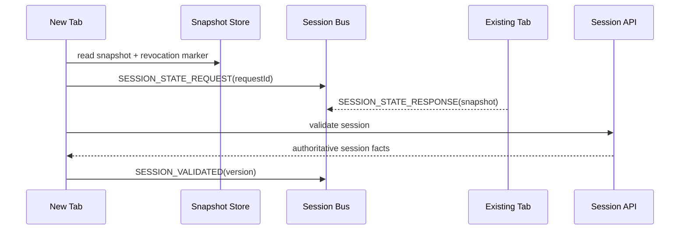
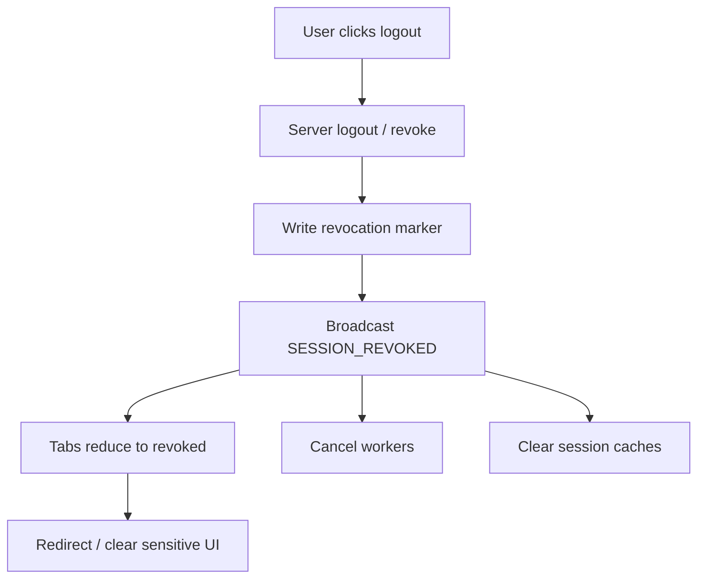

# Part 044 — Global Session State Across Tabs

> Goal: design session state that behaves consistently across tabs without turning localStorage, memory, or BroadcastChannel into a fake source of truth.

A session is not a boolean called `isLoggedIn`.

In a serious browser application, session state includes:

- authenticated principal;
- tenant/workspace/account context;
- authorization snapshot;
- token freshness status;
- revocation status;
- logout state;
- idle timeout state;
- security posture;
- current device/browser instance metadata;
- session-scoped feature flags;
- migration/version compatibility;
- cross-tab transition history.

Multiple tabs can observe and mutate parts of this state concurrently.

If you model it as one mutable object in each tab, your app will eventually produce impossible states:

- one tab is logged out, another keeps making authorized requests;
- one tab switches tenant, another submits data to the old tenant;
- one tab refreshes auth state while another uses stale permissions;
- one tab receives session revocation while another ignores it;
- a restored tab replays pre-logout state;
- a worker continues processing tasks after the user changed identity.

This part defines session as a versioned state machine replicated across browser contexts.

---

## 1. Mental model

Session state is local replicated state with one important rule:

> The server is authoritative for identity and authorization; the browser maintains a cached, versioned, revocable projection.



Do not design this as "sync all variables between tabs".

Design it as:

1. define the session state machine;
2. define versioned events that move the machine;
3. define authority for each transition;
4. broadcast transitions;
5. persist minimal safe snapshot;
6. reconcile on visibility/focus/network changes;
7. fail closed for security-sensitive uncertainty.

---

## 2. State machine first

Start with the states.

```ts
type SessionState =
  | { tag: "unknown"; reason: "startup" | "restore" | "revalidate" }
  | { tag: "anonymous" }
  | {
      tag: "authenticated";
      userId: string;
      tenantId: string;
      sessionVersion: number;
      authzVersion: number;
      issuedAt: number;
      expiresAt: number;
      lastValidatedAt: number;
    }
  | {
      tag: "refreshing";
      previous: AuthenticatedSession;
      refreshStartedAt: number;
      refreshOwner: string;
    }
  | {
      tag: "revoked";
      revokedAt: number;
      reason: "server" | "logout" | "idle_timeout" | "security_policy";
      sessionVersion: number;
    }
  | {
      tag: "error";
      previous?: AuthenticatedSession;
      errorKind: "network" | "protocol" | "storage";
      retryAfter?: number;
    };

type AuthenticatedSession = Extract<SessionState, { tag: "authenticated" }>;
```

The critical improvement is that states are explicit.

A tab is not "kind of logged in". It is one of the states above.

---

## 3. Transition authority

Not every tab is allowed to invent every transition.

| Transition | Authority | Local behavior |
|---|---|---|
| `unknown -> anonymous` | local boot + no valid server/session evidence | allowed |
| `unknown -> authenticated` | server response / validated snapshot | allowed only with proof |
| `authenticated -> refreshing` | elected refresh owner | broadcast intent |
| `refreshing -> authenticated` | server refresh success | require newer/equal version |
| `authenticated -> revoked` | server revocation, logout, security policy | apply immediately |
| `authenticated -> error(network)` | local network failure | temporary, do not clear auth blindly |
| `revoked -> authenticated` | fresh login only | never by stale broadcast |
| `tenant A -> tenant B` | explicit user action + server/session confirmation | requires version bump |

This table is your defense against stale tabs.

A restored tab must not broadcast "I am authenticated" and resurrect a revoked session.

---

## 4. Versioning model

Global session state needs monotonic versions.

At minimum:

```ts
type SessionVersion = {
  sessionVersion: number;
  authzVersion: number;
  tenantVersion: number;
};
```

Suggested semantics:

| Version | Meaning |
|---|---|
| `sessionVersion` | increments on login, logout, revocation, refresh family rotation, security reset |
| `authzVersion` | increments when permissions/roles/policy snapshot changes |
| `tenantVersion` | increments when active tenant/workspace changes |

A transition is stale if it carries older authority than current state.

```ts
function isStaleTransition(current: SessionState, event: SessionEvent): boolean {
  if (current.tag === "revoked") {
    return event.sessionVersion < current.sessionVersion;
  }

  if ("sessionVersion" in current) {
    return event.sessionVersion < current.sessionVersion;
  }

  return false;
}
```

For security-sensitive transitions, stale should fail closed.

---

## 5. Session events

Do not broadcast raw state object mutations.

Broadcast events.

```ts
type SessionEvent =
  | {
      type: "SESSION_VALIDATED";
      source: string;
      sessionVersion: number;
      authzVersion: number;
      tenantVersion: number;
      userId: string;
      tenantId: string;
      expiresAt: number;
      validatedAt: number;
    }
  | {
      type: "SESSION_REFRESH_STARTED";
      source: string;
      sessionVersion: number;
      ownerTabId: string;
      startedAt: number;
    }
  | {
      type: "SESSION_REFRESH_SUCCEEDED";
      source: string;
      sessionVersion: number;
      authzVersion: number;
      tenantVersion: number;
      expiresAt: number;
      validatedAt: number;
    }
  | {
      type: "SESSION_REVOKED";
      source: string;
      sessionVersion: number;
      revokedAt: number;
      reason: "server" | "logout" | "idle_timeout" | "security_policy";
    }
  | {
      type: "TENANT_SWITCHED";
      source: string;
      sessionVersion: number;
      tenantVersion: number;
      tenantId: string;
      switchedAt: number;
    }
  | {
      type: "AUTHZ_SNAPSHOT_INVALIDATED";
      source: string;
      sessionVersion: number;
      authzVersion: number;
      invalidatedAt: number;
      reason: string;
    };
```

Each event should be:

- typed;
- versioned;
- idempotent;
- minimal;
- non-sensitive where possible;
- rejectable if stale;
- safe to receive multiple times.

---

## 6. Session bus

BroadcastChannel is a good fit for volatile session events.

```ts
class SessionBus {
  private channel = new BroadcastChannel("app:session:v1");

  constructor(private onEvent: (event: SessionEvent) => void) {
    this.channel.addEventListener("message", (message) => {
      const event = parseSessionEvent(message.data);
      if (!event.ok) return;
      this.onEvent(event.value);
    });

    this.channel.addEventListener("messageerror", () => {
      // Increment metric; malformed cross-version payload likely happened.
    });
  }

  publish(event: SessionEvent): void {
    this.channel.postMessage(event);
  }

  close(): void {
    this.channel.close();
  }
}
```

The bus distributes transitions.

It does not make those transitions authoritative.

Authority is checked by the reducer.

---

## 7. Reducer as the consistency gate

Every tab should apply session events through one reducer.

```ts
function reduceSession(current: SessionState, event: SessionEvent): SessionState {
  if (isStaleTransition(current, event)) return current;

  switch (event.type) {
    case "SESSION_VALIDATED":
      if (current.tag === "revoked" && event.sessionVersion <= current.sessionVersion) {
        return current;
      }

      return {
        tag: "authenticated",
        userId: event.userId,
        tenantId: event.tenantId,
        sessionVersion: event.sessionVersion,
        authzVersion: event.authzVersion,
        issuedAt: event.validatedAt,
        expiresAt: event.expiresAt,
        lastValidatedAt: event.validatedAt,
      };

    case "SESSION_REFRESH_STARTED":
      if (current.tag !== "authenticated") return current;
      return {
        tag: "refreshing",
        previous: current,
        refreshStartedAt: event.startedAt,
        refreshOwner: event.ownerTabId,
      };

    case "SESSION_REFRESH_SUCCEEDED":
      if (current.tag !== "authenticated" && current.tag !== "refreshing") {
        return current;
      }

      const previous = current.tag === "refreshing" ? current.previous : current;

      return {
        ...previous,
        tag: "authenticated",
        sessionVersion: event.sessionVersion,
        authzVersion: event.authzVersion,
        tenantVersion: event.tenantVersion,
        expiresAt: event.expiresAt,
        lastValidatedAt: event.validatedAt,
      } as AuthenticatedSession;

    case "SESSION_REVOKED":
      return {
        tag: "revoked",
        revokedAt: event.revokedAt,
        reason: event.reason,
        sessionVersion: event.sessionVersion,
      };

    case "TENANT_SWITCHED":
      if (current.tag !== "authenticated") return current;
      if (event.tenantVersion < current.authzVersion) return current;
      return {
        ...current,
        tenantId: event.tenantId,
        sessionVersion: event.sessionVersion,
      };

    case "AUTHZ_SNAPSHOT_INVALIDATED":
      if (current.tag !== "authenticated") return current;
      if (event.authzVersion <= current.authzVersion) return current;
      return {
        ...current,
        authzVersion: event.authzVersion,
        lastValidatedAt: 0,
      };
  }
}
```

A reducer is boring. That is why it is valuable.

All weird cross-tab messages go through a deterministic gate.

---

## 8. What to persist

Do not persist everything.

Persist the minimum safe snapshot needed for startup and reconciliation.

```ts
type SessionSnapshot = {
  schemaVersion: 1;
  stateTag: "anonymous" | "authenticated" | "revoked";
  userId?: string;
  tenantId?: string;
  sessionVersion: number;
  authzVersion: number;
  tenantVersion: number;
  expiresAt?: number;
  lastValidatedAt?: number;
  revokedAt?: number;
  revocationReason?: string;
  writtenAt: number;
};
```

Store options:

| Store | Suitable for | Warning |
|---|---|---|
| Memory | current tab runtime | lost on reload |
| IndexedDB | structured session metadata, versioned snapshots | protect sensitive payloads |
| localStorage | simple logout/revocation marker | synchronous, coarse, visible to same-origin JS |
| sessionStorage | per-tab state | not global across all tabs |
| Cookie | server session continuity | subject to HTTP/security policy |

Avoid storing access tokens in broadly readable JavaScript storage if your threat model includes XSS. Token storage strategy belongs to auth architecture and will be treated more deeply in Part 045.

For this part, the rule is simple:

> Store session metadata; be extremely cautious with credentials.

---

## 9. Durable revocation marker

Logout/revocation needs a durable marker so stale tabs cannot resurrect old state.

```ts
type RevocationMarker = {
  schemaVersion: 1;
  sessionVersion: number;
  revokedAt: number;
  reason: "server" | "logout" | "idle_timeout" | "security_policy";
};
```

On startup:

1. load durable revocation marker;
2. load session snapshot;
3. if marker version >= snapshot version, start as revoked/anonymous;
4. revalidate with server before treating session as fully authenticated;
5. broadcast current safe state to peers.

```ts
async function bootSession(): Promise<SessionState> {
  const [snapshot, revocation] = await Promise.all([
    readSessionSnapshot(),
    readRevocationMarker(),
  ]);

  if (revocation && (!snapshot || revocation.sessionVersion >= snapshot.sessionVersion)) {
    return {
      tag: "revoked",
      revokedAt: revocation.revokedAt,
      reason: revocation.reason,
      sessionVersion: revocation.sessionVersion,
    };
  }

  if (!snapshot || snapshot.stateTag !== "authenticated") {
    return { tag: "unknown", reason: "startup" };
  }

  if (snapshot.expiresAt && snapshot.expiresAt <= Date.now()) {
    return { tag: "unknown", reason: "revalidate" };
  }

  return {
    tag: "unknown",
    reason: "revalidate",
  };
}
```

Note the conservative startup: a snapshot can suggest a previous session, but server validation should decide whether it is currently usable.

---

## 10. Startup handshake

When a new tab opens, it needs current session context.

Options:

1. read durable snapshot;
2. ask peers via BroadcastChannel;
3. call server `/session` endpoint;
4. wait for Service Worker/session leader.

A robust startup sequence:



Peer response can speed up UI hydration, but it should not replace server validation for sensitive actions.

---

## 11. Tenant/workspace context

Tenant switching is session state.

It must not be a random React state variable.

Problems if tenant context is not global:

- tab A shows tenant A, tab B submits to tenant B;
- worker processes offline queue under stale tenant;
- permission snapshot belongs to previous tenant;
- cache keys collide;
- notification routes open the wrong workspace.

Model tenant switch as a versioned session transition:

```ts
type TenantSwitchCommand = {
  tenantId: string;
  requestedBy: string;
  requestId: string;
};

async function switchTenant(command: TenantSwitchCommand) {
  const result = await api.switchTenant(command.tenantId, {
    idempotencyKey: command.requestId,
  });

  const event: SessionEvent = {
    type: "TENANT_SWITCHED",
    source: tabId,
    sessionVersion: result.sessionVersion,
    tenantVersion: result.tenantVersion,
    tenantId: result.tenantId,
    switchedAt: Date.now(),
  };

  applyAndPublish(event);
}
```

On tenant switch, invalidate:

- authorization snapshot;
- tenant-scoped caches;
- active subscriptions;
- open WebSocket channels;
- worker task queues containing tenant-bound work;
- optimistic writes for previous tenant unless safely namespaced.

---

## 12. Authorization snapshot invalidation

Authorization is not static.

A user can lose a role while multiple tabs are open.

Session state should carry an `authzVersion`.

When a tab sees `AUTHZ_SNAPSHOT_INVALIDATED`, it should:

1. mark local permissions stale;
2. prevent new sensitive actions until revalidated;
3. cancel or fence in-flight worker tasks that require old permissions;
4. refresh permission snapshot;
5. update UI affordances;
6. not rely on hidden tabs to cleanup.

```ts
function canPerform(state: SessionState, permission: string): boolean {
  if (state.tag !== "authenticated") return false;
  if (state.lastValidatedAt === 0) return false;
  return permissionStore.has(permission, state.authzVersion);
}
```

Fail closed when authorization state is stale.

---

## 13. Worker integration

Workers must not keep using old session context forever.

A worker task envelope should include a session fence.

```ts
type WorkerTaskEnvelope<T> = {
  taskId: string;
  kind: string;
  payload: T;
  sessionFence: {
    userId: string;
    tenantId: string;
    sessionVersion: number;
    authzVersion: number;
  };
};
```

Before executing a task, the worker checks whether the fence is still valid.

```ts
function isTaskSessionValid(task: WorkerTaskEnvelope<unknown>, state: SessionState): boolean {
  if (state.tag !== "authenticated") return false;

  return (
    task.sessionFence.userId === state.userId &&
    task.sessionFence.tenantId === state.tenantId &&
    task.sessionFence.sessionVersion === state.sessionVersion &&
    task.sessionFence.authzVersion <= state.authzVersion
  );
}
```

On session revocation:

- cancel sensitive worker tasks;
- clear task queues carrying old session fence;
- terminate workers if they may hold sensitive memory;
- restart workers with anonymous state if needed.

---

## 14. Service Worker integration

Service Worker is tricky because it can wake up independently.

It should not assume in-memory session state exists.

Service Worker should:

- read minimal durable session metadata when needed;
- avoid storing secret tokens in uncontrolled memory assumptions;
- consult server or client when session is uncertain;
- handle revocation marker before serving sensitive cached responses;
- broadcast session-related network errors/revocation events to clients;
- clear or partition caches on logout/tenant switch.

Example fetch guard:

```ts
self.addEventListener("fetch", (event) => {
  const url = new URL(event.request.url);

  if (!isApiRequest(url)) return;

  event.respondWith((async () => {
    const revocation = await readRevocationMarker();
    if (revocation) {
      return new Response(JSON.stringify({ error: "session_revoked" }), {
        status: 401,
        headers: { "content-type": "application/json" },
      });
    }

    const response = await fetch(event.request);

    if (response.status === 401 || response.status === 403) {
      await broadcastSessionProblem(response.status);
    }

    return response;
  })());
});
```

Do not let Service Worker cache serve private data after logout unless the cache key and invalidation policy are rigorously session-scoped.

---

## 15. Logout as a transaction

Logout is not one operation.

It is a cross-context teardown protocol.



A practical logout flow:

```ts
async function logout(reason: "logout" | "idle_timeout") {
  const nextVersion = currentSessionVersion() + 1;

  try {
    await api.logout({ sessionVersion: nextVersion });
  } finally {
    const event: SessionEvent = {
      type: "SESSION_REVOKED",
      source: tabId,
      sessionVersion: nextVersion,
      revokedAt: Date.now(),
      reason,
    };

    await writeRevocationMarker({
      schemaVersion: 1,
      sessionVersion: nextVersion,
      revokedAt: event.revokedAt,
      reason,
    });

    await clearSensitiveLocalState();
    applyAndPublish(event);
  }
}
```

Even if the server call fails due to network loss, local teardown may still be appropriate depending on product/security policy.

---

## 16. Idle timeout coordination

Idle timeout is cross-tab state.

If tab A sees user activity, tab B should not log the user out because its own timer is idle.

Track activity globally:

```ts
type ActivityEvent = {
  type: "USER_ACTIVITY";
  tabId: string;
  occurredAt: number;
  sessionVersion: number;
};
```

But do not broadcast every mousemove.

Throttle activity signals:

```ts
let lastActivityBroadcast = 0;

function onUserActivity() {
  const now = Date.now();
  if (now - lastActivityBroadcast < 15_000) return;
  lastActivityBroadcast = now;

  sessionBus.publish({
    type: "USER_ACTIVITY" as any,
    tabId,
    occurredAt: now,
    sessionVersion: currentSessionVersion(),
  });
}
```

Better still: centralize idle decision with a leader or durable activity timestamp.

Idle timeout must be based on server/security policy, not just local UI timers.

---

## 17. Request fencing

Every API request should be bound to the session version used to create it.

```ts
type RequestContext = {
  requestId: string;
  sessionVersion: number;
  authzVersion: number;
  tenantId: string;
};
```

When response returns:

```ts
function shouldAcceptResponse(ctx: RequestContext, state: SessionState): boolean {
  if (state.tag !== "authenticated") return false;
  if (ctx.sessionVersion !== state.sessionVersion) return false;
  if (ctx.tenantId !== state.tenantId) return false;
  return true;
}
```

This prevents stale responses from mutating the UI after logout or tenant switch.

This is the same fencing idea from Part 040, applied to session state.

---

## 18. Global session runtime skeleton

```ts
type SessionRuntimeOptions = {
  tabId: string;
  bus: SessionBus;
  store: SessionStore;
  api: SessionApi;
};

class SessionRuntime {
  private state: SessionState = { tag: "unknown", reason: "startup" };

  constructor(private options: SessionRuntimeOptions) {}

  async start(): Promise<void> {
    this.state = await bootSession();
    this.options.bus.publish(this.snapshotEvent("startup"));

    await this.revalidate("startup");

    document.addEventListener("visibilitychange", () => {
      if (document.visibilityState === "visible") {
        void this.revalidate("visible");
      }
    });
  }

  onRemoteEvent(event: SessionEvent): void {
    this.apply(event, { publish: false });
  }

  async revalidate(reason: "startup" | "visible" | "focus" | "timer"): Promise<void> {
    try {
      const result = await this.options.api.getSession();
      const event: SessionEvent = {
        type: "SESSION_VALIDATED",
        source: this.options.tabId,
        sessionVersion: result.sessionVersion,
        authzVersion: result.authzVersion,
        tenantVersion: result.tenantVersion,
        userId: result.userId,
        tenantId: result.tenantId,
        expiresAt: result.expiresAt,
        validatedAt: Date.now(),
      };
      this.apply(event, { publish: true });
    } catch (error) {
      this.state = {
        tag: "error",
        previous: this.state.tag === "authenticated" ? this.state : undefined,
        errorKind: "network",
        retryAfter: Date.now() + 30_000,
      };
    }
  }

  private apply(event: SessionEvent, options: { publish: boolean }): void {
    const next = reduceSession(this.state, event);
    if (next === this.state) return;

    this.state = next;
    void this.options.store.writeSnapshot(snapshotFromState(next));

    if (event.type === "SESSION_REVOKED") {
      void this.options.store.writeRevocationMarker({
        schemaVersion: 1,
        sessionVersion: event.sessionVersion,
        revokedAt: event.revokedAt,
        reason: event.reason,
      });
      void clearSensitiveRuntimeState();
    }

    if (options.publish) {
      this.options.bus.publish(event);
    }
  }

  private snapshotEvent(sourceReason: string): SessionEvent {
    if (this.state.tag === "authenticated") {
      return {
        type: "SESSION_VALIDATED",
        source: this.options.tabId,
        sessionVersion: this.state.sessionVersion,
        authzVersion: this.state.authzVersion,
        tenantVersion: 0,
        userId: this.state.userId,
        tenantId: this.state.tenantId,
        expiresAt: this.state.expiresAt,
        validatedAt: this.state.lastValidatedAt,
      };
    }

    return {
      type: "SESSION_REVOKED",
      source: this.options.tabId,
      sessionVersion: this.state.tag === "revoked" ? this.state.sessionVersion : 0,
      revokedAt: Date.now(),
      reason: "security_policy",
    };
  }
}
```

The exact implementation will vary, but the shape should remain:

- one runtime;
- one reducer;
- one bus;
- one durable snapshot;
- explicit revalidation;
- fenced requests and worker tasks.

---

## 19. Security design rules

Session orchestration has security consequences.

Rules:

1. logout/revocation beats all stale authenticated events;
2. no tab may resurrect a session from memory alone;
3. authorization stale means deny sensitive actions;
4. tenant switch invalidates tenant-bound work;
5. broadcast minimal metadata, not secrets;
6. clear sensitive memory on revocation;
7. clear/partition private caches by user/session/tenant;
8. fence requests and worker tasks with session version;
9. server remains authoritative;
10. uncertainty should degrade to revalidation, not silent trust.

---

## 20. Failure matrix

| Failure | Symptom | Mitigation |
|---|---|---|
| BroadcastChannel message lost | one tab misses logout | durable revocation marker + revalidate on visible/focus |
| restored tab has old memory | stale authenticated UI appears | startup boot as unknown + server validation |
| logout API fails | local session may remain | local teardown in `finally` if user intent is logout |
| Service Worker serves private cache after logout | data leak | session-scoped cache keys + revocation guard |
| worker task completes after tenant switch | wrong-tenant mutation | session fence response guard |
| authz changes while UI open | stale action buttons | authz version invalidation + fail closed |
| old app version sends old event | reducer misreads payload | schema version + runtime validation |
| storage write fails | revocation marker missing | in-memory revoke + server validation + telemetry |
| multiple tabs refresh session | refresh storm | Part 045 token refresh orchestration |

---

## 21. Testing strategy

Test the state machine, not only UI behavior.

Unit tests:

- stale authenticated event cannot override revoked state;
- newer revocation overrides authenticated state;
- tenant switch updates tenant version;
- authz invalidation forces permission stale;
- duplicate event is idempotent;
- unknown startup does not permit sensitive actions.

Multi-tab tests:

1. login in one tab updates another;
2. logout in one tab revokes all tabs;
3. hidden tab becomes visible after logout and does not resurrect session;
4. tenant switch cancels old worker task;
5. Service Worker sees revocation marker before serving private response;
6. BroadcastChannel disabled path still revalidates on focus;
7. old event schema is rejected.

Example reducer test:

```ts
it("does not resurrect revoked session from stale validation", () => {
  const current: SessionState = {
    tag: "revoked",
    revokedAt: 1000,
    reason: "logout",
    sessionVersion: 10,
  };

  const stale: SessionEvent = {
    type: "SESSION_VALIDATED",
    source: "old-tab",
    sessionVersion: 9,
    authzVersion: 3,
    tenantVersion: 1,
    userId: "u1",
    tenantId: "t1",
    expiresAt: Date.now() + 60_000,
    validatedAt: Date.now(),
  };

  expect(reduceSession(current, stale)).toBe(current);
});
```

---

## 22. Observability

Session bugs are often reported as vague user complaints.

Add structured logs:

```ts
type SessionTransitionLog = {
  ts: number;
  tabId: string;
  from: SessionState["tag"];
  to: SessionState["tag"];
  eventType: SessionEvent["type"];
  eventSource: string;
  sessionVersion?: number;
  authzVersion?: number;
  tenantIdHash?: string;
  accepted: boolean;
  rejectReason?: "stale" | "invalid_schema" | "security_policy";
};
```

Metrics:

- session validation latency;
- rejected stale session events;
- logout propagation latency;
- revocation marker write failures;
- authz invalidation count;
- tenant switch propagation latency;
- worker task cancellation due to session fence;
- private cache clears;
- session revalidation failures;
- BroadcastChannel `messageerror` count.

Never log tokens, full PII, or sensitive permission payloads.

---

## 23. Anti-patterns

Avoid these:

1. `localStorage.isLoggedIn = "true"` as source of truth;
2. broadcasting access tokens across tabs;
3. treating BroadcastChannel event as authoritative login proof;
4. logout that only clears current tab memory;
5. tenant/workspace stored only in React state;
6. worker tasks without session fence;
7. applying API response after logout;
8. permission snapshot with no version;
9. Service Worker private cache not scoped by session/tenant;
10. old tab allowed to overwrite new session state;
11. no revocation marker;
12. no revalidation on visibility/focus after long suspension.

---

## 24. Production checklist

Before shipping global session orchestration, verify:

- session is modeled as an explicit state machine;
- transitions have authority rules;
- every transition carries session/authz/tenant versions where relevant;
- reducer rejects stale transitions;
- logout/revocation has durable marker;
- startup does not trust stale memory;
- new tabs perform snapshot read + peer query + server validation;
- tenant switch invalidates tenant-bound resources;
- authorization snapshot can be invalidated independently;
- worker tasks carry session fences;
- API responses are fenced before UI mutation;
- Service Worker checks revocation before private cache response;
- sensitive data is not broadcast;
- storage errors are observable;
- multi-tab tests include hidden/restored tabs;
- old app version events are rejected or downgraded safely.

---

## 25. Key takeaways

Global session state is not a shared variable.

It is a replicated, versioned, security-sensitive state machine.

The invariant is:

> No stale tab, worker, Service Worker, cache response, or broadcast event may resurrect or misuse an older session context after a newer security-relevant transition.

The implementation pattern is:

1. explicit session states;
2. authoritative transitions;
3. versioned events;
4. reducer-based application;
5. durable revocation marker;
6. minimal safe snapshot;
7. revalidation on lifecycle changes;
8. session fences on requests and worker tasks;
9. security-first failure behavior.

Part 045 builds directly on this foundation: auth token refresh orchestration without refresh storms.

---

## References

- MDN — Broadcast Channel API: https://developer.mozilla.org/en-US/docs/Web/API/Broadcast_Channel_API
- MDN — Window storage event: https://developer.mozilla.org/en-US/docs/Web/API/Window/storage_event
- MDN — Document visibilitychange event: https://developer.mozilla.org/en-US/docs/Web/API/Document/visibilitychange_event
- MDN — Service Worker API: https://developer.mozilla.org/en-US/docs/Web/API/Service_Worker_API
- MDN — IndexedDB API: https://developer.mozilla.org/en-US/docs/Web/API/IndexedDB_API
