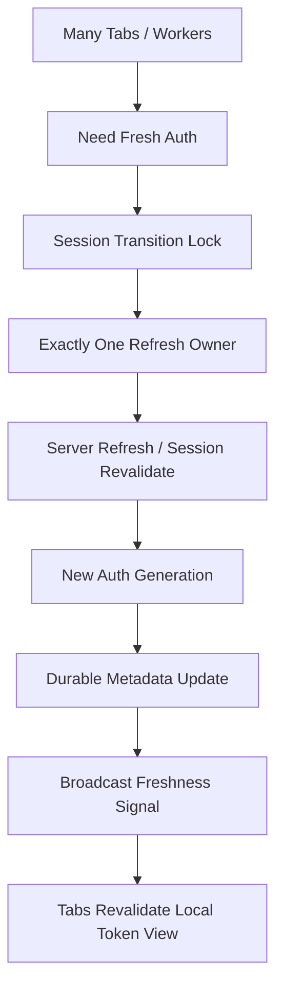
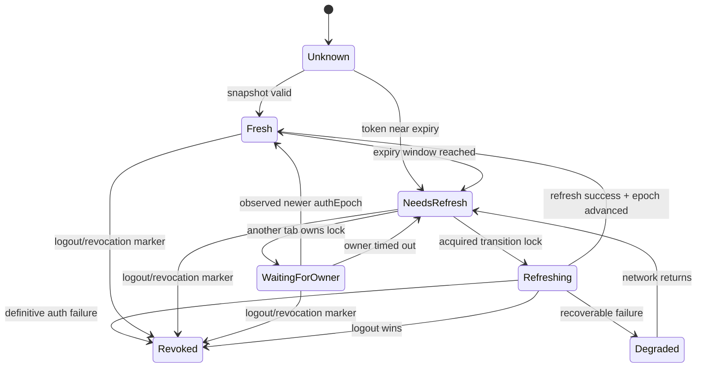
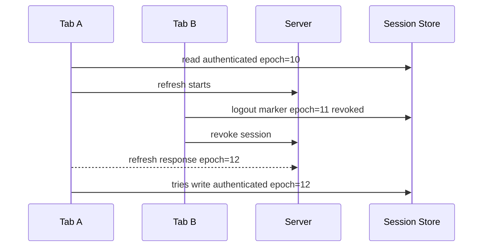
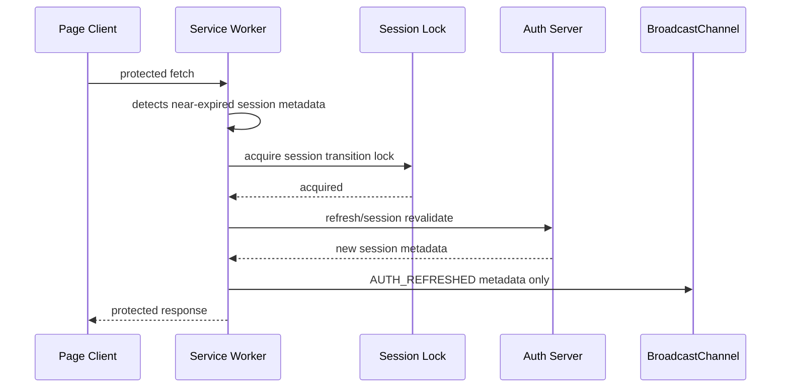

# Part 045 — Auth Token Refresh Orchestration Without Refresh Storms

> Goal: design browser-side token refresh as a serialized, versioned session transition, not as a timer callback copied into every tab.

Multiple-tab auth refresh looks simple until production traffic exposes the race.

You open five tabs. The access token expires at the same time in every tab. Each tab observes the same stale token and independently calls `/refresh`. If the refresh token is rotated or single-use, one request wins and the rest fail with `invalid_grant`. If your client treats that failure as logout, four healthy tabs can force the whole browser session out. If your client stores tokens in shared storage, a slower stale response may overwrite the winner. If your client broadcasts tokens to other tabs, every same-origin script with access to the channel becomes part of your token exposure surface.

This part builds a production-grade refresh coordinator.

We are not re-teaching OAuth, OIDC, PKCE, cookies, CSRF, or basic auth flows. The focus here is orchestration inside the browser once a session already exists.

---

## 1. Mental model

Token refresh is a cross-context state transition.

It is not merely this:

```ts
setInterval(refreshToken, 60_000);
```

It is this:



The invariant:

> For a single browser profile, single origin, and single session, at most one context should perform refresh side effects at a time.

The second invariant:

> Receiving a refresh signal is not the same as receiving a token.

Broadcast state transitions, not secrets.

---

## 2. Why refresh storms happen

A refresh storm is a thundering herd caused by replicated clients sharing the same expiration boundary.

Common triggers:

- every tab starts the same refresh timer;
- a hidden tab wakes after timer throttling and finds an expired token;
- every fetch wrapper sees `401` and calls refresh;
- every route guard calls `ensureFreshToken()` during app startup;
- a service worker and window client both decide to refresh;
- multiple API calls inside one tab all trigger refresh concurrently;
- tabs restored from bfcache resume with stale in-memory auth;
- all tabs receive a `SESSION_NEEDS_REFRESH` broadcast and interpret it as "call refresh now".

The bug is usually not the refresh endpoint.

The bug is that each execution context behaves as if it is the only client.

---

## 3. Threat and failure model

Before choosing an implementation, be explicit about what can go wrong.

| Failure | Example | Required defense |
|---|---|---|
| Duplicate refresh | Five tabs call `/refresh` | Cross-tab lock or durable lease |
| Token rotation race | Loser uses old refresh token | Server-side rotation handling + client serialization |
| Stale overwrite | Slow response writes older token metadata | Generation/fencing check |
| Token leak | Raw token posted over BroadcastChannel | Never broadcast secrets |
| Hidden tab drift | Hidden tab misses refresh signal | Revalidate on visible/focus/startup |
| Offline refresh | Refresh attempted while offline | Mark degraded, retry with backoff |
| Refresh/logout race | Tab A refreshes while Tab B logs out | Serialize session transitions |
| 401 storm | Every failed request triggers refresh | Single-flight refresh + request replay policy |
| Worker stale auth | Worker keeps processing with old token | Auth epoch in every task/request |
| Version skew | Old tab handles new auth event incorrectly | Protocol version + conservative fallback |

The browser is not a stable cluster. A tab can disappear without cleanup. A timer can be delayed. A worker can be terminated. A restored document can continue with stale memory.

Design refresh around recovery, not perfect delivery.

---

## 4. Security baseline

A browser application is a hostile environment compared to a confidential backend.

Practical rules:

1. Prefer server-mediated sessions or a Backend-for-Frontend when possible.
2. Do not put refresh tokens in BroadcastChannel, localStorage events, logs, analytics, or worker messages.
3. Do not treat same-origin as same-trust if the origin serves many apps or third-party scripts.
4. Keep access tokens short-lived.
5. Treat refresh as a security-sensitive session transition.
6. Make logout/revocation win over refresh.
7. Revalidate after visibility restore, bfcache restore, and app startup.
8. Scope tokens by subject, tenant, audience, and session generation.

A safe broadcast event looks like this:

```ts
type AuthEvent =
  | {
      type: 'AUTH_REFRESHED';
      protocolVersion: 1;
      sessionIdHash: string;
      authEpoch: number;
      accessTokenExpiresAt: number;
      issuedAt: number;
    }
  | {
      type: 'AUTH_REFRESH_FAILED';
      protocolVersion: 1;
      sessionIdHash: string;
      authEpoch: number;
      recoverable: boolean;
      reason: 'offline' | 'server-rejected' | 'network' | 'unknown';
    }
  | {
      type: 'SESSION_REVOKED';
      protocolVersion: 1;
      sessionIdHash: string;
      authEpoch: number;
      reason: 'logout' | 'expired' | 'admin-revoked' | 'token-reuse-detected';
    };
```

A dangerous broadcast event looks like this:

```ts
// Do not do this.
channel.postMessage({
  type: 'AUTH_REFRESHED',
  accessToken,
  refreshToken,
});
```

If a tab needs a usable token, it should obtain it from its own trusted in-memory token vault, a controlled same-tab auth module, or a server-mediated cookie session. A broadcast should only say: "auth generation changed; re-read or revalidate through the authorized path."

---

## 5. Architecture variants

There is no single right answer because token storage architecture changes the client-side problem.

### 5.1 BFF / cookie-backed session

In this model, the browser does not hold OAuth refresh tokens in JavaScript. It holds an HTTP-only secure cookie or session cookie. Refresh may be represented as:

```txt
POST /session/refresh
```

or simply a server-side session extension.

Client-side orchestration is still useful because multiple tabs can stampede the endpoint, but the blast radius is smaller because JS does not handle refresh tokens.

Best fit:

- enterprise systems;
- high-security apps;
- complex authorization;
- regulatory/audited apps;
- apps with backend control.

Client rule:

> Coordinate refresh requests, but do not invent token sharing.

### 5.2 SPA with Authorization Code + PKCE and refresh token rotation

In this model, JS may hold token material depending on identity provider policy and storage design.

This needs stricter local discipline:

- one refresh owner;
- no token broadcast;
- refresh token rotation race protection;
- immediate logout on definitive reuse/revocation signal;
- stale response rejection;
- memory-first storage where feasible;
- strict XSS posture.

Client rule:

> Treat the refresh token as a single-use rotating capability. Serialize access to it.

### 5.3 Service Worker token mediator

Some architectures put network mediation into a Service Worker. Be careful: a Service Worker is not a secret vault by default. It can improve request centralization but introduces lifecycle/update complexity.

Use it for:

- request classification;
- cache and offline behavior;
- central network fetch wrapper;
- broadcasting auth invalidation.

Be cautious using it for:

- long-lived token storage;
- hidden refresh loops;
- cross-tab secret distribution;
- refresh while no controlled client is active.

Client rule:

> A Service Worker can coordinate network behavior, but server authority still decides identity and revocation.

---

## 6. Token snapshot vs token material

Separate metadata from secrets.

```ts
export type AuthSnapshot = {
  sessionIdHash: string;
  subjectIdHash: string;
  tenantId?: string;
  authEpoch: number;
  accessTokenExpiresAt: number;
  refreshNotBefore?: number;
  status: 'anonymous' | 'authenticated' | 'refreshing' | 'degraded' | 'revoked';
  lastRefreshStartedAt?: number;
  lastRefreshFinishedAt?: number;
  lastRefreshOwnerId?: string;
};
```

This snapshot may be stored or broadcast if it contains no secrets.

Token material is different:

```ts
export type TokenMaterial = {
  accessToken: string;
  refreshToken?: string;
};
```

Token material should not be broadcast. Depending on your architecture, it may live in:

- HTTP-only cookies, inaccessible to JS;
- memory-only token vault;
- secure backend session;
- identity-provider SDK internals;
- last-resort browser storage with explicit risk acceptance.

Do not blur this boundary.

---

## 7. Refresh triggers

A robust app should not rely on one timer.

Refresh can be triggered by several sources:

| Trigger | Purpose | Risk |
|---|---|---|
| Startup | recover stale/restored app | can stampede across tabs |
| Visibility/focus | recover hidden/frozen tab | can fire often |
| Before protected API request | avoid request failure | can block user action |
| 401 response | recover from expiry | can cause retry storm |
| Scheduled pre-expiry timer | smooth experience | timer throttling/drift |
| Push/SSE/session event | react to server signal | not always available |
| Manual user action | user initiated reauth | must avoid duplicate UI |

All triggers should call the same function:

```ts
await authCoordinator.ensureFreshAuth({
  reason: 'before-api-request',
  minValidityMs: 60_000,
  deadlineMs: 8_000,
});
```

Do not let each trigger implement its own refresh path.

---

## 8. Early refresh window and jitter

If every tab refreshes exactly 60 seconds before expiry, you still get synchronization.

Use a refresh window:

```ts
function shouldRefresh(snapshot: AuthSnapshot, now = Date.now()): boolean {
  const baseMarginMs = 90_000;
  const jitterMs = stableJitter(snapshot.sessionIdHash, 0, 30_000);
  return snapshot.accessTokenExpiresAt - now <= baseMarginMs + jitterMs;
}
```

Jitter reduces herd behavior across browser profiles/devices. Cross-tab locking reduces herd behavior inside one browser profile.

You need both.

---

## 9. Refresh state machine



Important detail:

> `Refreshing` is not globally trusted unless it is backed by a lock or lease.

A boolean like `localStorage.refreshing = true` is not enough. It can remain stale forever after a tab crash.

---

## 10. Use one lock for session transitions

Refresh, logout, tenant switch, and session revalidation are not independent operations. They mutate the same security state.

Use one serialized resource:

```txt
session:<sessionIdHash>:transition
```

Not separate unrelated locks like:

```txt
auth-refresh
logout
switch-tenant
```

Separate locks can interleave in unsafe ways.

A transition lock gives this invariant:

> Only one security transition for a session may execute at a time.

---

## 11. Web Locks implementation

Web Locks is the cleanest browser primitive for same-origin cross-tab/worker mutual exclusion when available.

```ts
export type LockOptions = {
  name: string;
  timeoutMs: number;
  ifAvailable?: boolean;
};

export async function withWebLock<T>(
  options: LockOptions,
  fn: () => Promise<T>
): Promise<T> {
  if (!('locks' in navigator)) {
    throw new Error('Web Locks API not available');
  }

  const controller = new AbortController();
  const timeout = window.setTimeout(() => controller.abort(), options.timeoutMs);

  try {
    return await navigator.locks.request(
      options.name,
      {
        mode: 'exclusive',
        signal: controller.signal,
        ifAvailable: options.ifAvailable ?? false,
      },
      async lock => {
        if (!lock) {
          throw new Error(`Lock not available: ${options.name}`);
        }
        return await fn();
      }
    );
  } finally {
    window.clearTimeout(timeout);
  }
}
```

Use it like this:

```ts
await withWebLock(
  {
    name: `session:${sessionIdHash}:transition`,
    timeoutMs: 10_000,
  },
  async () => {
    await refreshIfStillNeeded();
  }
);
```

Notice the inner function name: `refreshIfStillNeeded`.

You must re-check after acquiring the lock.

Another tab may have refreshed while this tab waited.

---

## 12. Re-check after lock acquisition

This is the most common missing line.

```ts
async function refreshIfStillNeeded(): Promise<AuthSnapshot> {
  const before = await authStore.readSnapshot();

  if (before.status === 'revoked') {
    throw new SessionRevokedError();
  }

  if (!shouldRefresh(before)) {
    return before;
  }

  const refreshOwnerId = crypto.randomUUID();
  const refreshStartedAt = Date.now();

  await authStore.writeSnapshot({
    ...before,
    status: 'refreshing',
    lastRefreshOwnerId: refreshOwnerId,
    lastRefreshStartedAt: refreshStartedAt,
  });

  const result = await authApi.refreshSession({
    sessionIdHash: before.sessionIdHash,
    previousAuthEpoch: before.authEpoch,
  });

  const latest = await authStore.readSnapshot();

  if (latest.status === 'revoked') {
    throw new SessionRevokedError();
  }

  if (latest.authEpoch > before.authEpoch) {
    // Someone advanced the session generation. Do not overwrite it.
    return latest;
  }

  const next: AuthSnapshot = {
    ...latest,
    status: 'authenticated',
    authEpoch: result.authEpoch,
    accessTokenExpiresAt: result.accessTokenExpiresAt,
    lastRefreshFinishedAt: Date.now(),
    lastRefreshOwnerId: refreshOwnerId,
  };

  await authStore.writeSnapshot(next);
  authBus.publishRefreshed(next);

  return next;
}
```

Two important guards:

1. `status === 'revoked'` wins.
2. `latest.authEpoch > before.authEpoch` prevents stale overwrite.

---

## 13. Refresh coordinator skeleton

```ts
export class AuthRefreshCoordinator {
  private localInflight: Promise<AuthSnapshot> | null = null;

  constructor(
    private readonly tabId: string,
    private readonly store: AuthStore,
    private readonly api: AuthApi,
    private readonly bus: AuthBus,
    private readonly lock: SessionLock
  ) {}

  async ensureFreshAuth(input: {
    reason: string;
    minValidityMs: number;
    deadlineMs: number;
  }): Promise<AuthSnapshot> {
    const snapshot = await this.store.readSnapshot();

    if (snapshot.status === 'revoked') {
      throw new SessionRevokedError();
    }

    if (hasMinimumValidity(snapshot, input.minValidityMs)) {
      return snapshot;
    }

    if (this.localInflight) {
      return await this.localInflight;
    }

    this.localInflight = this.runCrossTabRefresh(input)
      .finally(() => {
        this.localInflight = null;
      });

    return await this.localInflight;
  }

  private async runCrossTabRefresh(input: {
    reason: string;
    minValidityMs: number;
    deadlineMs: number;
  }): Promise<AuthSnapshot> {
    const snapshot = await this.store.readSnapshot();
    const lockName = `session:${snapshot.sessionIdHash}:transition`;

    return await this.lock.withExclusive(lockName, input.deadlineMs, async () => {
      const latest = await this.store.readSnapshot();

      if (latest.status === 'revoked') {
        throw new SessionRevokedError();
      }

      if (hasMinimumValidity(latest, input.minValidityMs)) {
        return latest;
      }

      return await this.performRefresh(latest, input.reason);
    });
  }

  private async performRefresh(
    snapshot: AuthSnapshot,
    reason: string
  ): Promise<AuthSnapshot> {
    const ownerId = `${this.tabId}:${crypto.randomUUID()}`;
    const startedAt = Date.now();

    await this.store.writeSnapshot({
      ...snapshot,
      status: 'refreshing',
      lastRefreshOwnerId: ownerId,
      lastRefreshStartedAt: startedAt,
    });

    this.bus.publish({
      type: 'AUTH_REFRESH_STARTED',
      sessionIdHash: snapshot.sessionIdHash,
      authEpoch: snapshot.authEpoch,
      ownerId,
      reason,
      startedAt,
    });

    try {
      const result = await this.api.refresh({
        sessionIdHash: snapshot.sessionIdHash,
        expectedAuthEpoch: snapshot.authEpoch,
      });

      const afterCall = await this.store.readSnapshot();

      if (afterCall.status === 'revoked') {
        throw new SessionRevokedError();
      }

      if (afterCall.authEpoch > snapshot.authEpoch) {
        return afterCall;
      }

      const next: AuthSnapshot = {
        ...afterCall,
        status: 'authenticated',
        authEpoch: result.authEpoch,
        accessTokenExpiresAt: result.accessTokenExpiresAt,
        lastRefreshFinishedAt: Date.now(),
        lastRefreshOwnerId: ownerId,
      };

      await this.store.writeSnapshot(next);
      this.bus.publishRefreshed(next);
      return next;
    } catch (error) {
      return await this.handleRefreshError(snapshot, ownerId, error);
    }
  }

  private async handleRefreshError(
    snapshot: AuthSnapshot,
    ownerId: string,
    error: unknown
  ): Promise<AuthSnapshot> {
    const classification = classifyAuthError(error);

    if (classification.definitiveRevocation) {
      const revoked: AuthSnapshot = {
        ...snapshot,
        status: 'revoked',
        authEpoch: snapshot.authEpoch + 1,
        lastRefreshOwnerId: ownerId,
      };

      await this.store.writeSnapshot(revoked);
      this.bus.publishRevoked(revoked, classification.reason);
      throw new SessionRevokedError();
    }

    const degraded: AuthSnapshot = {
      ...snapshot,
      status: 'degraded',
      refreshNotBefore: Date.now() + classification.retryAfterMs,
      lastRefreshOwnerId: ownerId,
    };

    await this.store.writeSnapshot(degraded);
    this.bus.publishRefreshFailed(degraded, classification.reason);

    return degraded;
  }
}
```

This class does three forms of dedupe:

1. local in-tab single-flight via `localInflight`;
2. cross-tab mutual exclusion via lock;
3. post-call stale overwrite guard via `authEpoch`.

All three are necessary.

---

## 14. Broadcast protocol

The bus should not instruct everyone to refresh immediately. It should announce state transitions.

```ts
export type AuthBusMessage =
  | {
      type: 'AUTH_REFRESH_STARTED';
      protocolVersion: 1;
      sessionIdHash: string;
      authEpoch: number;
      ownerId: string;
      reason: string;
      startedAt: number;
    }
  | {
      type: 'AUTH_REFRESHED';
      protocolVersion: 1;
      sessionIdHash: string;
      authEpoch: number;
      accessTokenExpiresAt: number;
      finishedAt: number;
    }
  | {
      type: 'AUTH_REFRESH_FAILED';
      protocolVersion: 1;
      sessionIdHash: string;
      authEpoch: number;
      recoverable: boolean;
      retryAfterMs?: number;
      reason: string;
    }
  | {
      type: 'SESSION_REVOKED';
      protocolVersion: 1;
      sessionIdHash: string;
      authEpoch: number;
      reason: string;
      revokedAt: number;
    };
```

Consumer logic:

```ts
bus.onMessage(async message => {
  if (!isAuthBusMessage(message)) return;
  if (message.protocolVersion !== 1) return;

  const local = await authStore.readSnapshot();

  if (message.sessionIdHash !== local.sessionIdHash) return;
  if (message.authEpoch < local.authEpoch) return;

  switch (message.type) {
    case 'AUTH_REFRESHED': {
      await authStore.mergeMetadata({
        status: 'authenticated',
        authEpoch: message.authEpoch,
        accessTokenExpiresAt: message.accessTokenExpiresAt,
      });
      await tokenVault.revalidateLocalView();
      break;
    }

    case 'SESSION_REVOKED': {
      await sessionRuntime.handleRevocation(message.reason);
      break;
    }
  }
});
```

Again: no tokens on the bus.

---

## 15. 401 handling without retry storms

A naive fetch wrapper:

```ts
if (response.status === 401) {
  await refresh();
  return fetch(request);
}
```

This can explode. Ten concurrent requests get `401`; all ten refresh; all ten replay.

A safer wrapper:

```ts
export async function authorizedFetch(
  input: RequestInfo,
  init: RequestInit = {}
): Promise<Response> {
  const sessionAtStart = await authStore.readSnapshot();

  if (sessionAtStart.status === 'revoked') {
    throw new SessionRevokedError();
  }

  await authCoordinator.ensureFreshAuth({
    reason: 'before-api-request',
    minValidityMs: 30_000,
    deadlineMs: 8_000,
  });

  const response = await fetch(input, attachAuth(init));

  if (response.status !== 401) {
    return response;
  }

  const sessionAfter401 = await authStore.readSnapshot();

  if (sessionAfter401.status === 'revoked') {
    throw new SessionRevokedError();
  }

  // Only one replay attempt.
  await authCoordinator.ensureFreshAuth({
    reason: '401-recovery',
    minValidityMs: 30_000,
    deadlineMs: 8_000,
  });

  const sessionBeforeReplay = await authStore.readSnapshot();

  if (sessionBeforeReplay.authEpoch <= sessionAtStart.authEpoch) {
    // Refresh did not advance auth generation. Do not loop forever.
    throw new AuthRecoveryFailedError();
  }

  return await fetch(input, attachAuth(init));
}
```

Rules:

1. Preemptively ensure freshness before request.
2. On `401`, perform at most one recovery refresh.
3. Replay only if auth generation advanced.
4. Do not replay unsafe non-idempotent requests blindly.
5. Let logout/revocation win.

For non-idempotent requests, use server-side idempotency keys.

---

## 16. Refresh vs logout race

This is the race that causes security bugs.

Timeline:



Should Tab A be allowed to resurrect the session?

No.

The write path must check the current local session state before accepting refresh result:

```ts
const latest = await store.readSnapshot();

if (latest.status === 'revoked') {
  throw new SessionRevokedError();
}
```

Even better: refresh and logout should use the same session transition lock, so this interleaving is less likely locally. But server authority must still reject refresh after session revocation.

Client-side locks are defense-in-depth. They are not authorization.

---

## 17. IndexedDB lease fallback

If Web Locks is unavailable, use a durable lease in IndexedDB.

Shape:

```ts
type SessionLease = {
  resource: string;
  ownerId: string;
  leaseEpoch: number;
  expiresAt: number;
  heartbeatAt: number;
};
```

Acquisition logic:

1. Open a transaction.
2. Read existing lease.
3. If missing or expired, write new lease with incremented epoch.
4. Commit.
5. Re-read and verify ownership.
6. Heartbeat while doing work.
7. Release best-effort.

Pseudo-code:

```ts
async function tryAcquireLease(resource: string, ttlMs: number): Promise<LeaseHandle | null> {
  const ownerId = `${tabId}:${crypto.randomUUID()}`;
  const now = Date.now();

  return await db.transaction('rw', db.leases, async () => {
    const current = await db.leases.get(resource);

    if (current && current.expiresAt > now) {
      return null;
    }

    const next: SessionLease = {
      resource,
      ownerId,
      leaseEpoch: (current?.leaseEpoch ?? 0) + 1,
      expiresAt: now + ttlMs,
      heartbeatAt: now,
    };

    await db.leases.put(next);

    const verify = await db.leases.get(resource);
    if (verify?.ownerId !== ownerId) {
      return null;
    }

    return new LeaseHandle(next);
  });
}
```

Caveat:

> IndexedDB lease is a fallback coordination mechanism. It is weaker than Web Locks and must use TTL/fencing because owners can disappear.

---

## 18. Timer design

Do not maintain one always-running refresh timer in every tab.

Better:

- only eligible active tab schedules eager refresh;
- hidden tabs rely on focus/visibility recovery;
- every tab can call `ensureFreshAuth()` before protected work;
- scheduled timer is treated as an optimization;
- refresh deadline uses jitter;
- logout/revocation marker cancels timers.

```ts
function scheduleRefresh(snapshot: AuthSnapshot): void {
  clearRefreshTimer();

  if (snapshot.status !== 'authenticated') return;
  if (!tabEligibility.canScheduleBackgroundAuth()) return;

  const now = Date.now();
  const marginMs = 90_000 + stableJitter(snapshot.sessionIdHash, 0, 30_000);
  const delayMs = Math.max(0, snapshot.accessTokenExpiresAt - now - marginMs);

  refreshTimer = window.setTimeout(() => {
    authCoordinator.ensureFreshAuth({
      reason: 'scheduled-pre-expiry',
      minValidityMs: 60_000,
      deadlineMs: 8_000,
    }).catch(reportAuthRefreshError);
  }, delayMs);
}
```

Timer is not correctness.

`ensureFreshAuth()` is correctness.

---

## 19. Worker integration

Workers should not keep using auth state forever.

Every worker task that performs protected work should include an auth/session fence:

```ts
type WorkerTaskEnvelope<T> = {
  taskId: string;
  authEpoch: number;
  sessionIdHash: string;
  tenantId?: string;
  payload: T;
};
```

Worker-side guard:

```ts
function assertCurrentSession(task: WorkerTaskEnvelope<unknown>) {
  const current = sessionRuntime.snapshot();

  if (current.status !== 'authenticated') {
    throw new SessionRevokedError();
  }

  if (task.sessionIdHash !== current.sessionIdHash) {
    throw new StaleSessionTaskError();
  }

  if (task.authEpoch < current.authEpoch) {
    throw new StaleSessionTaskError();
  }
}
```

On auth refresh:

- update worker metadata;
- cancel stale protected tasks if policy requires;
- do not send raw token unless worker is explicitly trusted and isolated;
- prefer main/network layer to attach auth.

---

## 20. Service Worker integration

If a Service Worker handles protected requests, it must participate in the auth epoch model.

Basic pattern:



But be careful:

- Service Worker lifecycle is event-driven;
- it can be killed between events;
- it may not control the first page load;
- multiple app versions may exist during update;
- holding secrets in Service Worker memory is not durable;
- if no clients are alive, refresh behavior should be explicitly designed, not accidental.

For most apps, the Service Worker should not be the only place that knows the session.

---

## 21. Server contract

Client orchestration is only half of the system.

The server should support:

- short-lived access tokens;
- refresh token rotation or secure cookie-backed sessions;
- definitive revocation response;
- idempotency keys for unsafe request replay;
- refresh reuse detection policy;
- session generation or token generation in response;
- tenant/account version in session metadata;
- clock skew tolerance;
- clear error classification.

Example refresh response:

```json
{
  "sessionIdHash": "s_abc",
  "authEpoch": 42,
  "accessTokenExpiresAt": 1783512345000,
  "subjectVersion": 8,
  "authorizationVersion": 17,
  "tenantVersion": 4
}
```

Error classification matters:

| Server response | Client meaning |
|---|---|
| `invalid_grant` due to revoked refresh token | definitive logout/revoke |
| token reuse detected | definitive revoke all related state |
| session expired | logout or reauth required |
| network timeout | recoverable degraded state |
| `503` | recoverable retry with backoff |
| clock skew hint | adjust refresh margin, not token trust |
| tenant authorization changed | refresh authz snapshot |

The client must not interpret every refresh failure as logout.

---

## 22. Failure handling matrix

| Situation | Correct behavior |
|---|---|
| Lock timeout | Re-read snapshot, wait for bus, retry once with backoff |
| Owner tab crashes | Web Lock auto-releases; lease fallback expires |
| Network offline | Mark degraded, do not spam refresh |
| Refresh 500 | Backoff and keep old token if still valid |
| Refresh 401 definitive | Write revocation marker and broadcast |
| Refresh succeeds but local marker revoked | Discard success |
| Tab restored after hours | Re-read snapshot and server revalidate |
| Access token expires while offline | Move to degraded/offline mode |
| Multiple 401s | Single-flight refresh, bounded replay |
| Old app version sees unknown event | Ignore and force session revalidation |

---

## 23. Observability

You need client-side auth refresh metrics because server logs alone do not show browser coordination failures.

Track:

- refresh attempts by reason;
- refresh owner tab/context type;
- lock wait duration;
- lock timeout count;
- local single-flight hits;
- cross-tab dedupe hits;
- refresh success/failure classification;
- duplicate refresh attempts per session window;
- 401 recovery count;
- replay count;
- stale response discard count;
- refresh/logout race detections;
- hidden-tab refresh attempts;
- degraded session duration;
- token expiry margin at refresh time.

Example event:

```ts
metrics.emit('auth.refresh.completed', {
  reason,
  ownerContext: 'window',
  lockWaitMs,
  durationMs,
  authEpochBefore,
  authEpochAfter,
  result: 'success',
});
```

Never log token values.

Not even partial tokens.

---

## 24. Testing strategy

Test refresh orchestration as a concurrency system.

### 24.1 Unit tests

- `shouldRefresh()` margin and jitter;
- auth snapshot reducer;
- stale auth epoch rejection;
- error classification;
- bus message validation;
- local single-flight dedupe.

### 24.2 Integration tests

- five tabs call `ensureFreshAuth()` simultaneously;
- one tab refreshes while another logs out;
- refresh owner crashes before broadcast;
- follower misses broadcast and recovers via store;
- hidden tab resumes after token expiry;
- `401` storm from concurrent requests;
- IndexedDB lease expiry fallback;
- old protocol version ignores new message safely.

### 24.3 Chaos tests

Inject:

- random message delay;
- dropped broadcast;
- duplicate broadcast;
- network timeout;
- refresh response reordering;
- tab close during lock;
- worker termination;
- storage write failure;
- clock skew.

Invariant checks:

```ts
expect(server.refreshCallsFor(sessionId)).toBeLessThanOrEqual(1);
expect(noSecretWasBroadcast()).toBe(true);
expect(noRevokedSessionWasResurrected()).toBe(true);
expect(noRequestReplayedMoreThanOnce()).toBe(true);
```

---

## 25. Production checklist

Before shipping cross-tab refresh orchestration, answer these questions:

- What is the source of truth for identity?
- Where does refresh token material live?
- Can JavaScript read refresh token material?
- Is raw token material ever broadcast?
- What is the lock resource name?
- Are refresh/logout/tenant switch serialized together?
- Is there a fallback if Web Locks is unavailable?
- Does every refresh re-check state after lock acquisition?
- Can stale refresh response overwrite newer state?
- Does logout/revocation always win?
- Are 401 retries bounded?
- Are unsafe requests protected with idempotency keys?
- Do hidden/restored tabs revalidate?
- Do workers use auth/session fencing?
- Does Service Worker participate safely?
- Are errors classified as recoverable vs definitive?
- Are metrics emitted without token leakage?
- Are chaos tests covering dropped/duplicated/reordered messages?

---

## 26. Common anti-patterns

### Anti-pattern: refresh in every tab timer

```ts
setInterval(refresh, 5 * 60_000);
```

This guarantees correlated behavior.

### Anti-pattern: localStorage boolean lock

```ts
localStorage.setItem('refreshing', 'true');
```

This has no owner generation, no TTL, no atomicity guarantee, and no crash recovery semantics.

### Anti-pattern: broadcasting token values

```ts
broadcast.postMessage({ accessToken, refreshToken });
```

This expands the exposure surface and makes audit harder.

### Anti-pattern: logout as UI-only state

```ts
setIsLoggedIn(false);
```

Logout is a security transaction. It must cancel work, clear state, revoke server session, and fence stale contexts.

### Anti-pattern: infinite 401 recovery

```ts
while (response.status === 401) {
  await refresh();
  response = await fetch(request);
}
```

This can create request loops and hide definitive revocation.

---

## 27. Final mental model

Auth refresh is a distributed systems problem compressed into one browser profile.

The high-level algorithm:

1. Represent session as a versioned state machine.
2. Separate token metadata from token material.
3. Route all triggers through `ensureFreshAuth()`.
4. Deduplicate locally inside one tab.
5. Serialize globally across tabs using Web Locks or a lease fallback.
6. Re-check after lock acquisition.
7. Perform refresh.
8. Reject stale writes using `authEpoch`.
9. Broadcast metadata-only transition event.
10. Revalidate local token view.
11. Let logout/revocation override everything.
12. Measure the system.

The goal is not "never call refresh twice".

The goal is:

> No duplicate refresh storm, no token leak through coordination channels, no stale token resurrection, no unsafe replay, and no tab that silently continues after revocation.

That is the standard for production multi-tab authentication.

---

## References

- MDN Web Locks API — cross-context same-origin asynchronous resource coordination.
- MDN Broadcast Channel API — same-origin/storage-partitioned communication between tabs, frames, and workers.
- MDN Page Visibility API — visibility transitions used for lifecycle-aware revalidation.
- IETF OAuth 2.0 for Browser-Based Applications draft — browser client security considerations.
- OAuth 2.0 Security Best Current Practice — refresh token rotation and replay-detection concepts.
