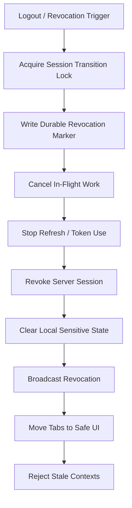
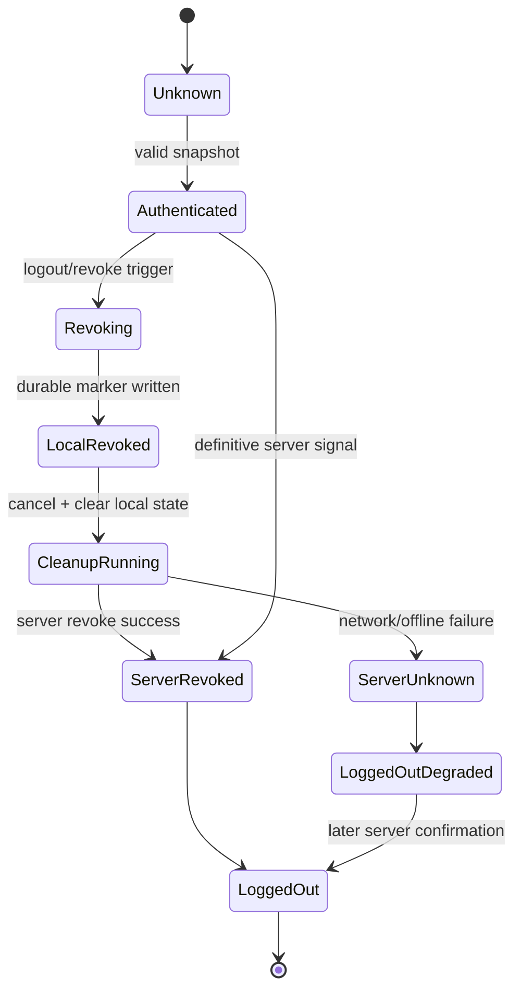

# Part 046 — Multi-Tab Logout, Session Revocation, and Security Cleanup

> Goal: design logout and revocation as a browser-wide security transaction, not as a redirect to `/login`.

Logout is often implemented as UI state:

```ts
setUser(null);
navigate('/login');
```

That is not logout.

That is a visual effect.

A real logout must answer harder questions:

- Can another tab still send authenticated requests?
- Can a hidden tab refresh the session after logout?
- Can a worker finish a protected task after logout?
- Can a service worker serve private cached data after logout?
- Can a restored bfcache page show stale private UI?
- Can IndexedDB, Cache API, OPFS, localStorage, or memory still contain sensitive data?
- Can old app code ignore new logout messages?
- Can server-side credentials remain valid after local cleanup?

This part defines logout and revocation as a coordinated state transition across windows, workers, service worker, storage, network, and server authority.

---

## 1. Mental model

Logout is not an event.

Logout is a transaction with side effects.



Invariant:

> Once a session revocation marker is accepted locally, no browser context may start new protected work for that session.

Second invariant:

> A stale context may be late, but it must not be able to resurrect the session.

---

## 2. Logout vs revocation

These are related but not identical.

| Term | Source | Meaning |
|---|---|---|
| User logout | user action in one tab | user wants to end current session |
| Idle timeout | client/server policy | session expired due to inactivity |
| Server revocation | backend/admin/security event | server invalidated the session |
| Token reuse detection | auth server | refresh token replay/reuse was detected |
| Account switch | user action | old session must be fenced before new identity/tenant |
| Local emergency cleanup | client-side safety | browser deletes local sensitive state even if server unreachable |

Every path should converge to the same local transition:

```txt
authenticated -> revoking -> revoked
```

Do not create separate inconsistent code paths for "logout button", "401", "admin revoke", and "token reuse".

---

## 3. Session revocation marker

The durable marker is the core of recovery.

BroadcastChannel messages can be missed. `beforeunload` is unreliable. Hidden tabs can be frozen. Workers can die. A tab can be restored from bfcache.

A durable marker allows late contexts to discover that the old session is dead.

```ts
export type RevocationMarker = {
  sessionIdHash: string;
  revokedEpoch: number;
  revokedAt: number;
  reason:
    | 'user-logout'
    | 'idle-timeout'
    | 'server-revoked'
    | 'token-reuse-detected'
    | 'account-switch'
    | 'local-security-cleanup';
  initiatedByTabId?: string;
  tenantId?: string;
  subjectIdHash?: string;
  protocolVersion: 1;
};
```

Store it in a durable place that survives tab lifetime:

- IndexedDB session metadata store;
- localStorage fallback for old/simple apps;
- server-side session endpoint for authoritative check;
- Service Worker-accessible metadata if the Service Worker participates.

Do not store raw token values in the marker.

---

## 4. Revocation state machine



Important distinction:

- `LoggedOut` means local browser state is safe and server revocation confirmed.
- `LoggedOutDegraded` means local browser state is safe but server confirmation is pending or failed.

The user should not remain authenticated locally just because the network is offline.

---

## 5. Serialize session transitions

Logout must race safely against refresh, tenant switch, and background sync.

Use the same lock introduced in Part 045:

```txt
session:<sessionIdHash>:transition
```

Do not use independent locks for refresh and logout.

```ts
await sessionLock.withExclusive(
  `session:${sessionIdHash}:transition`,
  10_000,
  async () => {
    await revokeSessionTransaction({ reason: 'user-logout' });
  }
);
```

Inside the lock:

1. re-read latest session snapshot;
2. if already revoked, continue cleanup idempotently;
3. write revocation marker first;
4. abort refresh and protected requests;
5. call server revoke if applicable;
6. clear local sensitive state;
7. broadcast revocation;
8. navigate current tab to safe UI.

Why marker first?

Because cleanup can be interrupted. If the tab dies after the marker, another tab can finish cleanup. If the tab dies before the marker, other tabs may continue as if the session is valid.

---

## 6. Logout transaction skeleton

```ts
export class SessionRevocationCoordinator {
  constructor(
    private readonly tabId: string,
    private readonly store: SessionStore,
    private readonly server: SessionServerApi,
    private readonly bus: SessionBus,
    private readonly lock: SessionLock,
    private readonly runtime: BrowserRuntimeRegistry
  ) {}

  async logout(reason: RevocationMarker['reason'] = 'user-logout'): Promise<void> {
    const snapshot = await this.store.readSnapshot();

    if (snapshot.status === 'anonymous') {
      await this.navigateToSafeScreen();
      return;
    }

    const lockName = `session:${snapshot.sessionIdHash}:transition`;

    await this.lock.withExclusive(lockName, 10_000, async () => {
      await this.revokeInsideTransition(snapshot.sessionIdHash, reason);
    });
  }

  private async revokeInsideTransition(
    sessionIdHash: string,
    reason: RevocationMarker['reason']
  ): Promise<void> {
    const latest = await this.store.readSnapshot();

    const marker: RevocationMarker = {
      sessionIdHash,
      revokedEpoch: Math.max(latest.authEpoch + 1, latest.revokedEpoch ?? 0),
      revokedAt: Date.now(),
      reason,
      initiatedByTabId: this.tabId,
      tenantId: latest.tenantId,
      subjectIdHash: latest.subjectIdHash,
      protocolVersion: 1,
    };

    await this.store.writeRevocationMarker(marker);
    await this.store.writeSnapshot({
      ...latest,
      status: 'revoked',
      authEpoch: marker.revokedEpoch,
    });

    this.runtime.abortProtectedWork(marker);
    this.bus.publishRevoked(marker);

    try {
      await this.server.revokeSession({ sessionIdHash, reason });
    } catch (error) {
      await this.store.markServerRevocationUnknown({
        sessionIdHash,
        reason,
        errorClass: classifyNetworkError(error),
      });
    }

    await this.runtime.clearSensitiveLocalState(marker);
    this.bus.publishCleanupCompleted(marker);
    await this.navigateToSafeScreen();
  }

  private async navigateToSafeScreen(): Promise<void> {
    window.location.assign('/login');
  }
}
```

This operation must be idempotent.

Any tab may repeat cleanup after seeing a revocation marker.

---

## 7. Broadcast revocation, not logout intent

A logout button click is intent. Revocation marker is fact.

Broadcast the fact:

```ts
type SessionRevokedMessage = {
  type: 'SESSION_REVOKED';
  protocolVersion: 1;
  sessionIdHash: string;
  revokedEpoch: number;
  revokedAt: number;
  reason: RevocationMarker['reason'];
  initiatedByTabId?: string;
};
```

Consumer:

```ts
bus.onMessage(async event => {
  if (event.type !== 'SESSION_REVOKED') return;

  const local = await sessionStore.readSnapshot();

  if (event.sessionIdHash !== local.sessionIdHash) return;
  if (event.revokedEpoch < local.authEpoch) return;

  await sessionStore.writeRevocationMarker({
    sessionIdHash: event.sessionIdHash,
    revokedEpoch: event.revokedEpoch,
    revokedAt: event.revokedAt,
    reason: event.reason,
    initiatedByTabId: event.initiatedByTabId,
    protocolVersion: 1,
  });

  await runtime.abortProtectedWork(event);
  await runtime.clearSensitiveLocalState(event);
  await router.goToSafeLoggedOutScreen();
});
```

Do not wait for every tab to ACK before making the current tab safe.

ACK can be used for observability, not correctness.

---

## 8. Network request fencing

Every protected request path must check revocation before sending.

```ts
export async function protectedFetch(input: RequestInfo, init: RequestInit = {}) {
  const snapshot = await sessionStore.readSnapshot();

  if (snapshot.status === 'revoked') {
    throw new SessionRevokedError();
  }

  const controller = sessionAbortRegistry.bind(init.signal, snapshot.sessionIdHash);

  const response = await fetch(input, {
    ...init,
    signal: controller.signal,
  });

  const after = await sessionStore.readSnapshot();

  if (after.status === 'revoked' || after.authEpoch > snapshot.authEpoch) {
    // The response belongs to an old security context.
    // Do not commit it into app state.
    throw new StaleSessionResponseError();
  }

  return response;
}
```

This protects against a common bug:

1. request starts while logged in;
2. user logs out;
3. response returns after logout;
4. stale response updates UI/store with private data.

The fix is not only abort. Abort is best effort. You also need response commit fencing.

---

## 9. Abort all protected work

Use a session-level abort registry.

```ts
export class SessionAbortRegistry {
  private controllersBySession = new Map<string, Set<AbortController>>();

  bind(parentSignal: AbortSignal | undefined, sessionIdHash: string): AbortController {
    const controller = new AbortController();

    if (parentSignal) {
      parentSignal.addEventListener('abort', () => controller.abort(parentSignal.reason), {
        once: true,
      });
    }

    let set = this.controllersBySession.get(sessionIdHash);
    if (!set) {
      set = new Set();
      this.controllersBySession.set(sessionIdHash, set);
    }

    set.add(controller);

    controller.signal.addEventListener('abort', () => {
      set?.delete(controller);
    }, { once: true });

    return controller;
  }

  abortSession(sessionIdHash: string, reason: unknown): void {
    const set = this.controllersBySession.get(sessionIdHash);
    if (!set) return;

    for (const controller of set) {
      controller.abort(reason);
    }

    this.controllersBySession.delete(sessionIdHash);
  }
}
```

Apply this to:

- API requests;
- long polling;
- SSE/WebSocket reconnect loops;
- worker task requests;
- upload/download operations;
- offline queue flush;
- scheduled refresh timers;
- background sync ownership loops.

---

## 10. Worker cleanup

Dedicated workers and SharedWorkers must receive revocation as a fence.

```ts
type WorkerSessionMessage =
  | {
      type: 'SESSION_REVOKED';
      sessionIdHash: string;
      revokedEpoch: number;
      reason: string;
    }
  | {
      type: 'SESSION_CONTEXT_CHANGED';
      sessionIdHash: string;
      authEpoch: number;
      tenantId?: string;
    };
```

Worker behavior:

```ts
function handleSessionRevoked(event: SessionRevokedMessage) {
  sessionState = {
    status: 'revoked',
    sessionIdHash: event.sessionIdHash,
    authEpoch: event.revokedEpoch,
  };

  cancelProtectedTasks(event.reason);
  clearSensitiveWorkerMemory();
  rejectPendingProtectedRequests(new SessionRevokedError());
}
```

Task admission guard:

```ts
function admitTask(task: WorkerTaskEnvelope<unknown>) {
  if (sessionState.status === 'revoked') {
    throw new SessionRevokedError();
  }

  if (task.sessionIdHash !== sessionState.sessionIdHash) {
    throw new StaleSessionTaskError();
  }

  if (task.authEpoch < sessionState.authEpoch) {
    throw new StaleSessionTaskError();
  }
}
```

For high-risk data, terminate workers after cleanup:

```ts
worker.postMessage({ type: 'SESSION_REVOKED', ...marker });
setTimeout(() => worker.terminate(), 500);
```

Do not assume the worker will clean up perfectly. The owner should also drop references and reject pending promises.

---

## 11. SharedWorker hub cleanup

A SharedWorker can outlive an individual tab while other connected tabs remain. Its registry must understand session boundaries.

On revocation:

- mark session as revoked in hub memory;
- reject queued protected requests;
- broadcast to connected ports;
- clear per-session subscriptions;
- clear sensitive cached payloads;
- stop background ownership loops;
- reject new tasks for revoked session;
- require fresh `HELLO` for a new session/account.

Hub rule:

```ts
if (message.sessionIdHash && revokedSessions.has(message.sessionIdHash)) {
  port.postMessage({
    type: 'ERROR',
    code: 'SESSION_REVOKED',
    correlationId: message.correlationId,
  });
  return;
}
```

Do not let SharedWorker become a cross-account memory leak.

---

## 12. Service Worker cleanup

Service Worker complicates logout because it owns network/cache behavior and may receive events after a page logs out.

On logout, the page should message the Service Worker:

```ts
navigator.serviceWorker.controller?.postMessage({
  type: 'SESSION_REVOKED',
  sessionIdHash: marker.sessionIdHash,
  revokedEpoch: marker.revokedEpoch,
  reason: marker.reason,
});
```

Service Worker behavior:

```ts
self.addEventListener('message', event => {
  const message = event.data;

  if (message?.type !== 'SESSION_REVOKED') return;

  event.waitUntil(handleSessionRevokedInServiceWorker(message));
});

async function handleSessionRevokedInServiceWorker(message) {
  await putRevocationMarker(message);
  await deletePrivateCaches(message.sessionIdHash);
  await notifyAllClients(message);
}
```

Fetch guard in Service Worker:

```ts
self.addEventListener('fetch', event => {
  event.respondWith(handleFetch(event));
});

async function handleFetch(event) {
  const sessionIdHash = extractSessionIdHash(event.request);

  if (sessionIdHash && await isRevoked(sessionIdHash)) {
    return new Response('Session revoked', { status: 401 });
  }

  return fetch(event.request);
}
```

Private cache names should include session/user/tenant scope or be easy to purge:

```ts
const privateCacheName = `private:${sessionIdHash}:v3`;
```

Never mix private API responses with public static asset caches.

---

## 13. Cache cleanup

Logout should clear sensitive browser-managed app caches.

Potential stores:

| Store | Cleanup action |
|---|---|
| Memory stores | clear immediately |
| React/Vue/Svelte query cache | remove protected queries |
| IndexedDB | delete session-scoped stores/records |
| localStorage | remove session metadata, keep only safe marker if needed |
| sessionStorage | clear session scoped values |
| Cache API | delete private caches |
| OPFS | delete session-scoped files/directories |
| BroadcastChannel | close channels or reset listeners |
| SharedWorker | reject and clear session-scoped state |
| Service Worker | delete private caches and revoke fetch access |
| WebSocket/SSE | close connections |

Cache API cleanup:

```ts
async function deletePrivateCaches(sessionIdHash: string): Promise<void> {
  const names = await caches.keys();

  await Promise.all(
    names
      .filter(name => name.startsWith(`private:${sessionIdHash}:`))
      .map(name => caches.delete(name))
  );
}
```

IndexedDB cleanup:

```ts
async function clearSessionRecords(sessionIdHash: string): Promise<void> {
  await db.transaction(
    'rw',
    [db.privateDocuments, db.outbox, db.sessionMetadata],
    async () => {
      await db.privateDocuments.where('sessionIdHash').equals(sessionIdHash).delete();
      await db.outbox.where('sessionIdHash').equals(sessionIdHash).delete();
      await db.sessionMetadata.where('sessionIdHash').equals(sessionIdHash).delete();
    }
  );
}
```

Rule:

> Prefer session-scoped keys and stores so logout cleanup is a bounded operation, not a full database migration.

---

## 14. Clear-Site-Data

For high-security logout, the server can return `Clear-Site-Data` on the logout response.

Example:

```http
HTTP/1.1 204 No Content
Clear-Site-Data: "cache", "cookies", "storage"
```

This tells the browser to clear categories of site data for the origin. It is powerful and disruptive.

Use it carefully:

- good for full logout/reset;
- good for incident response;
- good for account deletion or device unlinking;
- risky if your app has non-sensitive offline drafts that should survive logout;
- can clear more than the current app if multiple apps share one origin;
- may affect service worker registration/storage depending on directive/browser behavior.

Do not send it on every response.

A targeted logout endpoint is the common place.

---

## 15. Server-side revocation

Client cleanup is not enough.

If the server session remains valid, a stolen token/cookie can still be used. If the refresh token remains valid, another device or stale client may continue.

Server revocation should:

- invalidate the session;
- invalidate or rotate refresh token family as needed;
- invalidate remember-me/device token if policy requires;
- update session generation;
- make old access tokens unusable or short-lived enough to age out;
- reject refresh after logout;
- emit security audit event;
- optionally send back `Clear-Site-Data`;
- classify response clearly for the client.

Client behavior for server errors:

| Server revoke result | Client behavior |
|---|---|
| success | finish logout normally |
| already revoked | finish logout normally |
| network error | local logout still succeeds, mark server unknown |
| 5xx | local logout still succeeds, schedule best-effort retry if safe |
| CSRF/auth failure | local logout still succeeds, report anomaly |

The user should not remain logged in locally because revoke endpoint failed.

---

## 16. Server-initiated revocation

Revocation can arrive without a logout button.

Sources:

- `401` or `403` with revocation code;
- refresh response `invalid_grant`;
- WebSocket/SSE security event;
- push notification handled by Service Worker;
- polling `/session/status`;
- focus/visibility revalidation;
- admin action detected on next request;
- token reuse detection.

Normalize all into one local transition:

```ts
async function handleDefinitiveRevocation(reason: RevocationMarker['reason']) {
  await revocationCoordinator.logout(reason);
}
```

Do not scatter session cleanup across every API client.

---

## 17. bfcache and restored tabs

A page can be restored with old JS memory.

On `pageshow`, check whether it was persisted:

```ts
window.addEventListener('pageshow', event => {
  if (event.persisted) {
    sessionRuntime.reconcileAfterRestore({ reason: 'bfcache-restore' });
  }
});
```

On visibility:

```ts
document.addEventListener('visibilitychange', () => {
  if (document.visibilityState === 'visible') {
    sessionRuntime.reconcileAfterRestore({ reason: 'visible' });
  }
});
```

Reconciliation:

```ts
async function reconcileAfterRestore(input: { reason: string }) {
  const marker = await sessionStore.readRevocationMarker();

  if (marker) {
    await runtime.abortProtectedWork(marker);
    await runtime.clearSensitiveLocalState(marker);
    await router.goToSafeLoggedOutScreen();
    return;
  }

  await authCoordinator.ensureFreshAuth({
    reason: input.reason,
    minValidityMs: 30_000,
    deadlineMs: 8_000,
  });
}
```

A restored page must prove the session is still valid. It should not trust old memory.

---

## 18. Offline logout

Offline logout is subtle.

User expectation:

> "I clicked logout. This browser should stop showing my account."

Security requirement:

> Local credentials and sensitive data should be invalidated locally even if server cannot be reached.

Design:

1. write local revocation marker;
2. clear local sensitive state;
3. stop protected work;
4. move UI to logged-out state;
5. queue best-effort server revocation if policy allows;
6. on next network availability, call revoke endpoint without resurrecting local session.

Do not let offline server failure block local logout.

But be transparent in audit/telemetry:

```ts
audit.emit('session.logout.server_revocation_pending', {
  sessionIdHash,
  reason: 'network-offline',
});
```

---

## 19. Account switch and tenant switch

Account switch is not just login as someone else.

It is:

```txt
revoke/fence old session -> clear old sensitive state -> establish new session
```

Tenant switch may or may not revoke the whole identity session, but it still needs a security transition:

- cancel old tenant requests;
- clear tenant-scoped caches;
- invalidate authorization snapshot;
- advance auth/session epoch;
- notify workers;
- prevent stale response commit;
- route UI to safe loading state.

Do not reuse the same query cache keys across tenants without tenant ID in the key.

Bad:

```ts
['cases', page]
```

Good:

```ts
['tenant', tenantId, 'cases', page]
```

Tenant mistakes are data leaks.

---

## 20. UI routing model

On revocation, the UI should stop rendering protected data immediately.

Bad pattern:

```ts
await server.logout();
navigate('/login');
clearStores();
```

Better:

```ts
await writeLocalRevocationMarker();
clearProtectedStoresSynchronously();
navigate('/login');
void finishAsyncCleanup();
```

Separate:

- immediate UI safety;
- asynchronous cleanup;
- server confirmation;
- telemetry.

Use a global session boundary component:

```tsx
function SessionBoundary({ children }: { children: React.ReactNode }) {
  const session = useSessionSnapshot();

  if (session.status === 'revoked' || session.status === 'anonymous') {
    return <LoggedOutScreen />;
  }

  if (session.status === 'reconciling') {
    return <SessionReconcileScreen />;
  }

  return <>{children}</>;
}
```

Never let every screen decide its own logout handling.

---

## 21. Version skew

Old tabs may run old JavaScript.

They may not understand a new revocation event shape.

Defensive message design:

```ts
if (message.type === 'SESSION_REVOKED') {
  // Even if some fields are unknown, the safe action is logout.
  forceLocalLogout('unknown-revocation-message');
}
```

For security messages, unknown-but-recognizable should fail closed.

For non-security messages, unknown can be ignored.

Versioned event:

```ts
type VersionedSecurityEvent = {
  type: 'SESSION_REVOKED';
  minHandlerVersion?: number;
  protocolVersion: number;
  sessionIdHash: string;
  revokedEpoch: number;
};
```

If handler version is too old:

```ts
window.location.reload();
```

Use reload sparingly, but security transitions may justify it.

---

## 22. Logout ACKs

Sometimes product teams ask: "Can we ensure every tab logged out?"

Inside browser orchestration, you can observe best-effort ACKs, but you cannot guarantee every stale/frozen/crashed context handled the event immediately.

ACK message:

```ts
type LogoutAck = {
  type: 'SESSION_REVOKED_ACK';
  sessionIdHash: string;
  revokedEpoch: number;
  tabId: string;
  cleanedStores: string[];
  acknowledgedAt: number;
};
```

Use ACK for:

- metrics;
- debugging;
- test assertions;
- UI diagnostics in internal tools.

Do not use ACK as the only correctness mechanism.

Correctness comes from:

- durable revocation marker;
- request admission guard;
- stale response fencing;
- server-side revocation;
- lifecycle reconciliation.

---

## 23. Security limitations

Client-side logout cannot fully defend against active XSS.

If arbitrary attacker-controlled JS is executing in your origin, it can:

- intercept tokens readable by JS;
- prevent cleanup logic;
- spoof messages;
- read same-origin storage;
- call APIs as the user while credentials remain valid.

Therefore:

- prevent XSS with CSP, output encoding, Trusted Types where applicable, dependency hygiene;
- prefer HTTP-only secure cookies or BFF for high-value sessions;
- revoke server-side credentials;
- keep access tokens short-lived;
- avoid token material in JS-accessible durable storage;
- do not share origins between unrelated trust domains;
- keep logout endpoint CSRF-protected if cookie-based;
- audit session transitions server-side.

Multi-tab logout is necessary.

It is not a substitute for server security.

---

## 24. Observability

Track logout and revocation as security events.

Client metrics:

- logout trigger reason;
- initiating tab/context;
- transition lock wait time;
- time to durable marker;
- time to UI safe state;
- server revoke duration/result;
- number of tabs notified;
- number of ACKs received;
- cleanup duration by store;
- cache deletion failures;
- pending request abort count;
- stale response rejection count;
- worker task cancellation count;
- Service Worker cleanup result;
- restored tab revocation detections.

Example:

```ts
metrics.emit('session.revocation.completed', {
  reason,
  serverResult,
  lockWaitMs,
  uiSafeMs,
  cleanupMs,
  abortedRequests,
  cancelledWorkerTasks,
  privateCachesDeleted,
});
```

Logs must not contain raw tokens, private data, or full user identifiers.

Use hashes or opaque IDs suitable for your privacy model.

---

## 25. Testing strategy

### 25.1 Unit tests

- revocation reducer is monotonic;
- old auth epoch cannot override revoked state;
- unknown security event fails closed;
- protected fetch rejects after revocation;
- stale response cannot commit;
- cleanup functions are idempotent.

### 25.2 Multi-tab integration tests

- Tab A logs out; Tab B immediately stops protected requests;
- Tab A logs out while Tab B refreshes;
- Tab A logs out while Tab B has in-flight API response;
- hidden tab receives revocation after becoming visible;
- restored bfcache tab detects revocation marker;
- Service Worker deletes private cache;
- SharedWorker rejects new protected task after revocation;
- old app version reloads/fails closed.

### 25.3 Chaos tests

Inject:

- dropped BroadcastChannel message;
- delayed logout message;
- duplicated logout message;
- cleanup exception halfway;
- server revoke timeout;
- tab close during logout transaction;
- worker crash during cleanup;
- IndexedDB quota/write failure;
- Cache API deletion failure;
- network response after logout.

Assertions:

```ts
expect(noProtectedRequestAfterRevocation()).toBe(true);
expect(noStaleResponseCommitted()).toBe(true);
expect(privateCachesFor(sessionIdHash)).toHaveLength(0);
expect(revocationMarkerExists(sessionIdHash)).toBe(true);
expect(serverSessionEventuallyRevokedOrMarkedPending()).toBe(true);
```

---

## 26. Production checklist

Before shipping logout/revocation orchestration, verify:

- Is logout implemented as a transaction, not only UI navigation?
- Is there a durable revocation marker?
- Is logout serialized with refresh and tenant switch?
- Does revocation marker get written before best-effort cleanup?
- Does every protected request check revocation before send?
- Does every protected response check session epoch before commit?
- Are in-flight requests aborted?
- Are workers notified and fenced?
- Is SharedWorker state session-scoped?
- Is Service Worker private cache cleared?
- Are private Cache API keys session-scoped?
- Are IndexedDB records session/tenant-scoped?
- Is OPFS cleanup defined if used?
- Is server revocation called?
- Does local logout still succeed offline?
- Are stale tabs reconciled on `pageshow` and visibility restore?
- Does unknown security message fail closed?
- Is `Clear-Site-Data` appropriate for this origin?
- Are metrics/audit events emitted safely?
- Are token values absent from messages/logs/storage?

---

## 27. Common anti-patterns

### Anti-pattern: logout only in the current tab

```ts
setUser(null);
navigate('/login');
```

Other tabs keep running.

### Anti-pattern: server revoke before local marker

```ts
await api.logout();
await writeLocalMarker();
```

If `api.logout()` hangs, local session remains active. Write local marker first.

### Anti-pattern: clearing only localStorage

```ts
localStorage.clear();
```

Private data may exist in memory, IndexedDB, Cache API, Service Worker, workers, query caches, OPFS, and in-flight responses.

### Anti-pattern: trusting broadcast delivery

```ts
channel.postMessage({ type: 'LOGOUT' });
```

A frozen or closed tab may miss it. Use durable marker and lifecycle reconciliation.

### Anti-pattern: letting stale responses commit

```ts
const data = await response.json();
store.setCases(data);
```

Always check session epoch before committing protected response data.

### Anti-pattern: mixing private and public caches

```ts
caches.open('app-cache-v1');
```

If the same cache stores static assets and private API responses, logout cleanup becomes dangerous. Keep private caches separate and session-scoped.

---

## 28. Final mental model

A serious logout pipeline looks like this:

1. Acquire the session transition lock.
2. Re-read current session.
3. Write a durable revocation marker.
4. Advance session/auth epoch.
5. Abort protected requests and background work.
6. Fence workers and service worker.
7. Clear session-scoped memory, IndexedDB, Cache API, OPFS, and query caches.
8. Broadcast revocation fact.
9. Call server revoke.
10. Move UI to safe logged-out state.
11. Reconcile restored/hidden/stale tabs later.
12. Reject stale responses forever for that session epoch.

Logout is not about making the current screen look logged out.

Logout is about making the old session incapable of producing new trusted side effects.

That is the bar for multi-tab security cleanup.

---

## References

- MDN Broadcast Channel API — same-origin/storage-partitioned communication between windows, tabs, frames, iframes, and workers.
- MDN Web Locks API — same-origin asynchronous resource coordination across tabs and workers.
- MDN Clear-Site-Data header — server-directed clearing of cookies, storage, cache, and related site data categories.
- MDN Cache API / CacheStorage — cache storage cleanup from window or worker contexts where available.
- MDN Page Visibility and Page Lifecycle guidance — reconcile hidden/restored pages instead of trusting stale memory.
- MDN Service Worker API — client messaging, fetch interception, and lifecycle implications for private cache cleanup.
