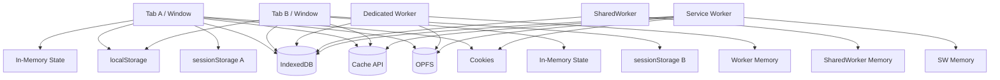
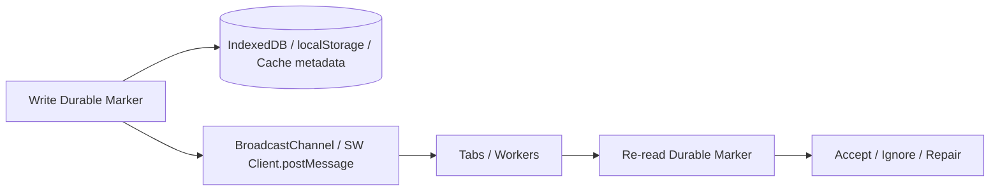
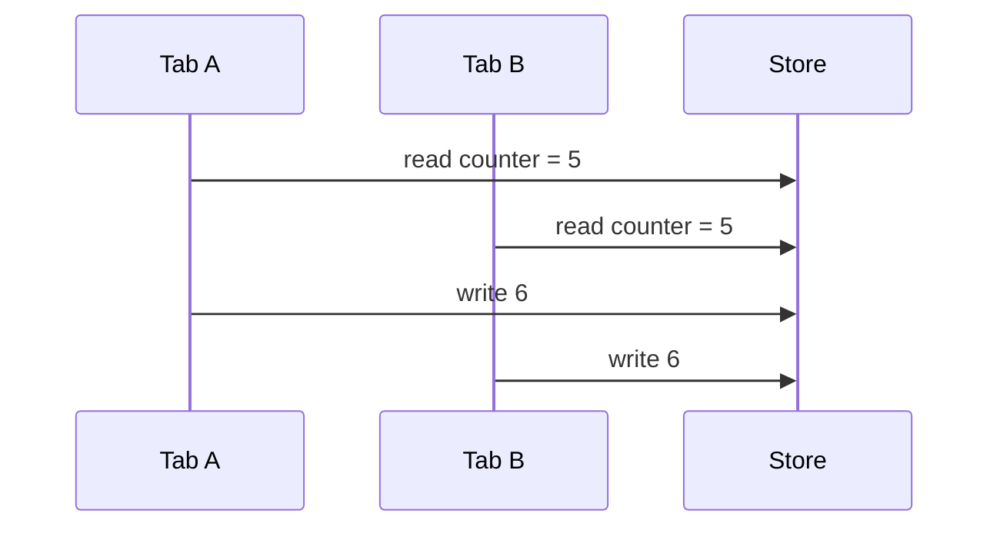
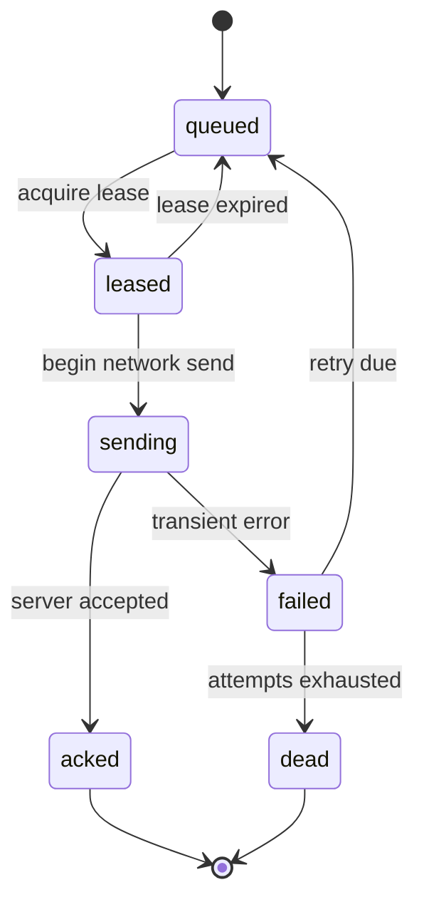
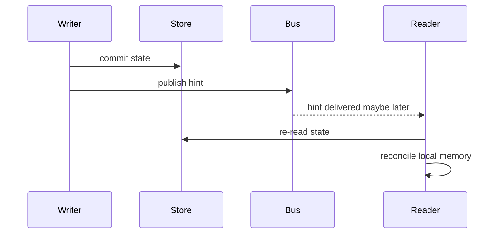
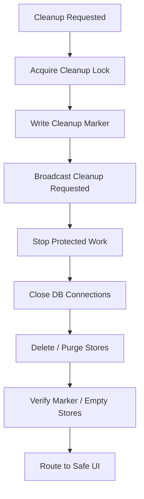
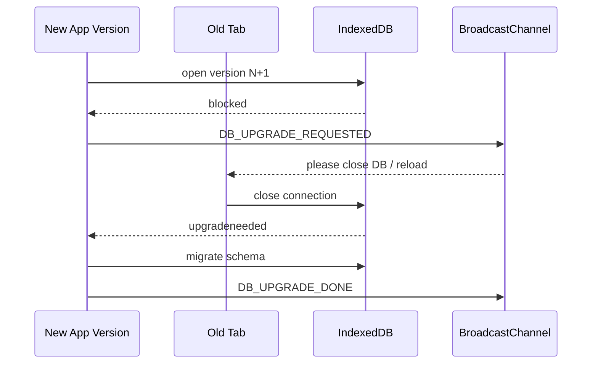
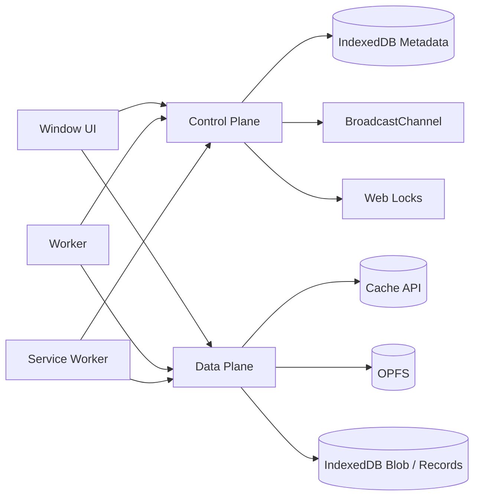

# Part 047 — Browser Storage Consistency Model

> Goal: stop thinking of browser storage as “a place to put data”, and start thinking of it as several independent storage systems with different consistency, latency, scope, lifecycle, quota, and security semantics.

Most production bugs around multi-tab orchestration are not caused by missing APIs.

They are caused by false assumptions:

- `localStorage` is treated as a database.
- IndexedDB is treated as if it had database-server behavior.
- Cache API is treated as if it had cache invalidation semantics.
- BroadcastChannel is treated as if it were durable.
- Service Worker cache is treated as if every tab instantly agrees with it.
- hidden/frozen/discarded tabs are treated as live participants.
- schema migrations are treated as a one-tab problem.
- refresh/logout/auth state is treated as memory-only UI state.

Browser storage is closer to a small, embedded, multi-client system with weak operational guarantees than a clean client-side key-value store.

This part builds the mental model.

---

## 1. The core model

A browser app does not have one storage layer.

It has a storage topology.



Each box answers different questions:

| Store | Good for | Bad for |
|---|---|---|
| Memory | fast derived state, UI state, in-flight maps | durability, cross-tab truth |
| `sessionStorage` | per-tab state | cross-tab coordination |
| `localStorage` | small durable flags, legacy signaling | large data, transactional state, secrets, high-frequency writes |
| IndexedDB | structured durable state, outbox, metadata, event log | synchronous reads, simple mental model, schema upgrades across stale tabs |
| Cache API | request/response artifact cache | business state, fine-grained mutation semantics |
| OPFS | large origin-private files, worker-heavy binary data | simple querying, broad compatibility assumptions, cross-context coordination without locks |
| Cookies | server-bound credential/session transport | client-side state model, large data, complex app state |

The first invariant:

> No browser storage primitive gives you a complete distributed consistency model by itself.

The second invariant:

> Durable state and notification are separate concerns.

A write to durable storage does not guarantee all tabs know immediately.
A message to all tabs does not guarantee durable state exists.

---

## 2. Three kinds of state

Before picking storage, classify state.

### 2.1 Ephemeral state

Exists only while a context lives.

Examples:

- pending RPC map
- selected row
- open modal
- current worker task
- active drag state
- in-memory cache of decoded records

Use memory.

Do not persist it unless restoration matters.

### 2.2 Durable client state

Must survive reload or tab close.

Examples:

- offline outbox
- last accepted session epoch
- cache manifest
- migration version
- upload checkpoint
- local event log
- feature flag snapshot

Use IndexedDB, Cache API, OPFS, or carefully scoped `localStorage`.

### 2.3 Coordinated state

Must be understood by more than one context.

Examples:

- session revoked
- leader lease
- background sync ownership
- token refresh in progress
- active tab ownership
- cache version promoted

Use durable marker plus signal bus.



The signal says: “something may have changed.”

The store says: “this is the state I can verify.”

---

## 3. Storage is scoped

Storage scope is not just origin.

You must reason about:

- origin
- top-level site partitioning
- browsing context
- storage bucket/partition behavior
- private/incognito mode
- third-party iframe restrictions
- user clearing site data
- browser eviction
- service worker scope
- deployment path/base URL

A design that works in a first-party app tab may fail inside an embedded iframe or WebView.

### 3.1 `localStorage`

`localStorage` is shared by same-origin documents and persists beyond browser restart.

But it is synchronous.

That is the killer detail.

A synchronous write can block the main thread. A high-frequency `localStorage` bus is not a serious data plane.

Use it for:

- small compatibility flags
- last-known session epoch
- simple logout marker fallback
- legacy cross-tab signal fallback

Avoid it for:

- large JSON blobs
- high-frequency presence heartbeats
- task queues
- binary data
- security-sensitive secrets
- anything requiring multi-record atomicity

### 3.2 `sessionStorage`

`sessionStorage` is tab-scoped.

That makes it useful for per-tab identity.

Example:

```ts
function getOrCreateTabId(): string {
  const key = "app.tabId";
  const existing = sessionStorage.getItem(key);
  if (existing) return existing;

  const tabId = crypto.randomUUID();
  sessionStorage.setItem(key, tabId);
  return tabId;
}
```

But do not use `sessionStorage` as cross-tab shared truth.

### 3.3 IndexedDB

IndexedDB is the default durable structured state store.

It supports object stores, indexes, transactions, version upgrades, and works from windows and workers.

But it has browser-specific operational realities:

- transactions are scoped and auto-commit.
- database upgrades require a `versionchange` transaction.
- old open connections can block upgrades.
- connections can close unexpectedly.
- requests are asynchronous.
- large object graphs still pay clone/serialization cost.
- schema design matters.
- cross-tab notification is not automatic.

Use IndexedDB for durable truth.

Do not use it as a magical real-time database.

### 3.4 Cache API

Cache API stores request/response pairs.

It is excellent for:

- static assets
- API response artifacts
- versioned bundles
- offline response strategy
- immutable content-addressed artifacts

It is bad for:

- domain state transitions
- partial record mutation
- queryable business data
- sensitive per-user data unless carefully scoped and purged

Treat Cache API as an artifact store, not as your application database.

### 3.5 OPFS

Origin Private File System is useful when the data model is file-like or binary-heavy.

Examples:

- large imported CSV/Parquet-like artifacts
- local search index segments
- WASM database files
- media/transcode intermediates
- large generated exports
- binary checkpoints

OPFS is not a coordination primitive.

If multiple contexts access OPFS, you still need ownership, locking, or single-writer discipline.

### 3.6 Cookies

Cookies are mainly part of the HTTP credential/session channel.

For client orchestration, cookies are awkward because:

- JavaScript cannot read `HttpOnly` cookies.
- cookie changes do not give you rich local state transitions.
- cookies ride with requests automatically.
- cookie lifetime/path/domain/SameSite rules are security policy, not app state protocol.

If your app uses cookie-based auth, client-side orchestration should still maintain a separate metadata state:

```ts
type SessionMetadata = {
  sessionIdHash: string;
  authEpoch: number;
  tenantId: string;
  revokedAt?: number;
  lastValidatedAt: number;
};
```

Do not store the actual secret if you can avoid it.

---

## 4. Consistency vocabulary

Use explicit vocabulary.

| Term | Meaning in browser orchestration |
|---|---|
| Source of truth | State that readers must re-check before side effects |
| Signal | Volatile notification that state may have changed |
| Lease | Time-bounded ownership claim |
| Fencing token | Monotonic token used to reject stale owner effects |
| Idempotency key | Key that lets the same operation be safely retried |
| Generation | Runtime incarnation number of a tab/worker/session/leader |
| Snapshot | Point-in-time read result, not automatically live |
| Durable marker | Small persisted fact used to force reconciliation |
| Derived state | Recomputable state that should not drive irreversible effects |

A top-tier frontend storage design says which of these it uses.

A weak design says: “we store it in localStorage.”

---

## 5. Browser storage consistency is not one thing

Different stores give different behavior.

| Primitive | Atomic unit | Cross-tab visibility | Notification | Transactional? | Blocking? |
|---|---|---|---|---|---|
| Memory | JS object | no | no | no | no |
| `sessionStorage` | key write | same tab only | limited | no | yes |
| `localStorage` | key write | same-origin tabs | `storage` event to other contexts | no multi-key transaction | yes |
| IndexedDB | transaction | shared store after commit | no built-in cross-tab event for arbitrary writes | yes, scoped | no direct sync block, but async cost exists |
| Cache API | request/response entry | shared by origin context | no app-level event | per operation | async |
| OPFS | file/handle operation | origin-private | no app-level event | depends on access pattern | async/sync access handles in workers |
| BroadcastChannel | message | live contexts | itself | no durability | async |
| Service Worker message | message | controlled clients | itself | no durability | async |

The design rule:

> Use transactions to create facts. Use messages to wake readers. Use fencing to reject stale effects.

---

## 6. The classic bug: signal without state

Imagine logout uses only BroadcastChannel.

```ts
channel.postMessage({ type: "LOGOUT" });
```

Problems:

- hidden tab may be frozen.
- discarded tab never receives it.
- newly opened tab has no memory of it.
- old app version may ignore it.
- message may arrive while tab is mid-refresh.

Better:

```ts
await idb.transaction("session", "readwrite", async (tx) => {
  await tx.session.put({
    key: "revocation",
    sessionIdHash,
    revokedAt: Date.now(),
    authEpoch,
    reason: "user_logout",
  });
});

channel.postMessage({
  type: "SESSION_REVOKED",
  sessionIdHash,
  authEpoch,
});
```

Every protected operation checks the durable marker.

```ts
async function assertSessionUsable(sessionIdHash: string, authEpoch: number) {
  const marker = await sessionStore.getRevocation(sessionIdHash);

  if (marker && marker.authEpoch >= authEpoch) {
    throw new Error("Session has been revoked locally");
  }
}
```

Now late contexts can recover.

---

## 7. The opposite bug: state without signal

Imagine cache version promotion writes metadata only.

```ts
await db.cacheManifests.put({ version: "2026.07.08.1", status: "active" });
```

Other tabs may continue using stale in-memory manifest until reload.

Better:

```ts
await promoteCacheManifest(nextManifest);
channel.postMessage({
  type: "CACHE_MANIFEST_CHANGED",
  version: nextManifest.version,
});
```

On receive:

```ts
channel.addEventListener("message", async (event) => {
  if (event.data.type !== "CACHE_MANIFEST_CHANGED") return;

  const active = await manifestStore.getActive();
  if (active.version !== currentManifest.version) {
    await switchManifest(active);
  }
});
```

Notification does not carry the entire state.

It triggers re-read.

---

## 8. Multi-tab storage race patterns

### 8.1 Lost update

Two tabs read the same value, modify locally, then write back.



Expected `7`, got `6`.

Mitigations:

- use IndexedDB transaction where possible.
- store append-only events instead of overwriting aggregate state.
- use compare-and-swap with version field.
- use Web Lock for single-writer mutation.
- keep server as authority for business-critical mutation.

### 8.2 Write skew

Two tabs update different records after reading a shared invariant.

Example:

- invariant: only one tab may flush outbox.
- Tab A sees no flusher.
- Tab B sees no flusher.
- both write different ownership rows.

Mitigations:

- unique ownership key.
- Web Lock.
- transaction over the invariant record.
- fencing token.

### 8.3 Stale read

A tab reads state once at boot and never revalidates.

Mitigations:

- revalidate on `visibilitychange` to visible.
- revalidate on focus.
- revalidate before irreversible side effects.
- include generation/epoch in stateful operations.

### 8.4 Duplicate processing

Two tabs process the same outbox job.

Mitigations:

- idempotency key.
- job state machine.
- lease with expiry.
- attempt counter.
- fencing token.
- server-side idempotency.

---

## 9. Store state machines, not booleans

Weak model:

```ts
type SyncFlag = {
  syncing: boolean;
};
```

Better:

```ts
type OutboxJob = {
  id: string;
  idempotencyKey: string;
  state: "queued" | "leased" | "sending" | "acked" | "failed" | "dead";
  leaseOwner?: string;
  leaseToken?: number;
  leaseExpiresAt?: number;
  attempt: number;
  createdAt: number;
  updatedAt: number;
  nextAttemptAt?: number;
  lastErrorCode?: string;
};
```

A boolean erases history.

A state machine gives you recovery.



---

## 10. Durable marker pattern

A durable marker is a small persisted fact that forces future contexts to reconcile.

Use it for:

- session revoked
- app version obsolete
- cache manifest promoted
- migration required
- outbox flush in progress
- local data wipe requested
- offline mode entered
- tenant switched

Shape:

```ts
type DurableMarker = {
  key: string;
  type: string;
  epoch: number;
  createdAt: number;
  expiresAt?: number;
  payload?: unknown;
};
```

Write:

```ts
async function writeMarker(marker: DurableMarker) {
  await db.transaction("markers", "readwrite", async (tx) => {
    const existing = await tx.markers.get(marker.key);

    if (existing && existing.epoch > marker.epoch) {
      return;
    }

    await tx.markers.put(marker);
  });

  channel.postMessage({
    type: "MARKER_CHANGED",
    key: marker.key,
    epoch: marker.epoch,
  });
}
```

Read before side effect:

```ts
async function rejectIfObsolete(required: { key: string; minEpoch: number }) {
  const marker = await db.markers.get(required.key);

  if (marker && marker.epoch >= required.minEpoch) {
    throw new Error(`Blocked by marker ${required.key}@${marker.epoch}`);
  }
}
```

---

## 11. Single-writer discipline

The easiest consistency model is one writer.

This does not mean one tab forever.

It means one writer per resource at a time.

Examples:

| Resource | Single writer candidate |
|---|---|
| auth refresh | Web Lock holder |
| outbox flush | Service Worker sync event or foreground leader |
| cache promotion | Service Worker active version |
| OPFS index segment | Dedicated worker or SharedWorker |
| WebSocket connection | elected leader tab |
| migration | IndexedDB versionchange owner |

Use Web Locks when available:

```ts
await navigator.locks.request("outbox-flush", async () => {
  await flushDueJobs();
});
```

Fallback with IndexedDB lease:

```ts
type Lease = {
  resource: string;
  ownerId: string;
  token: number;
  expiresAt: number;
};
```

The invariant:

> Every externally visible side effect must carry ownership identity or be idempotent.

---

## 12. Read-your-own-write is local, not global

After a tab writes to IndexedDB, that tab can usually read back its committed change.

But another tab may still have:

- stale memory cache
- stale derived state
- old app version
- frozen event loop
- pending transaction
- unprocessed notification

Therefore, do not design as if writes instantly update the whole browser.

Design as:



---

## 13. Version every meaningful state

Every stored object that can race should carry versioning.

```ts
type Versioned<T> = {
  id: string;
  version: number;
  updatedAt: number;
  updatedBy: string;
  value: T;
};
```

Optimistic update:

```ts
async function updateIfVersion<T>(
  id: string,
  expectedVersion: number,
  mutate: (current: T) => T,
) {
  return db.transaction("records", "readwrite", async (tx) => {
    const current = await tx.records.get(id);
    if (!current) throw new Error("Missing record");

    if (current.version !== expectedVersion) {
      return { ok: false as const, reason: "version_conflict", current };
    }

    const next = {
      ...current,
      version: current.version + 1,
      value: mutate(current.value),
      updatedAt: Date.now(),
    };

    await tx.records.put(next);
    return { ok: true as const, next };
  });
}
```

This works only if the read and write are in the same transaction or protected by a single-writer policy.

---

## 14. Append-only event log pattern

For conflict-prone state, append events instead of overwriting snapshots.

```ts
type ClientEvent = {
  eventId: string;
  streamId: string;
  sequence?: number;
  type: string;
  payload: unknown;
  createdAt: number;
  actorTabId: string;
  actorSessionEpoch: number;
  idempotencyKey: string;
};
```

Benefits:

- retries are easier.
- duplicate detection is explicit.
- recovery has history.
- server sync can be idempotent.
- derived projections can be rebuilt.

Costs:

- compaction needed.
- projections can be stale.
- ordering must be defined.
- conflict resolution still exists.

Use this for offline-first workflows, audit-heavy UI, forms with draft history, and complex sync.

---

## 15. Storage event pattern

`storage` event is useful as a fallback signal.

The important semantics:

- it fires in other documents sharing the storage area.
- it does not fire in the same document that made the change.
- `localStorage` is shared across same-origin tabs.
- `sessionStorage` is scoped to the same top-level browsing context.

Use it as:

```ts
function emitStorageSignal(topic: string, payload: unknown) {
  const signal = {
    id: crypto.randomUUID(),
    topic,
    createdAt: Date.now(),
    payload,
  };

  localStorage.setItem("app.signal", JSON.stringify(signal));
}

window.addEventListener("storage", (event) => {
  if (event.key !== "app.signal" || !event.newValue) return;

  const signal = JSON.parse(event.newValue);
  handleSignal(signal);
});
```

Do not use it as:

```ts
localStorage.setItem("allAppState", JSON.stringify(hugeState));
```

That is main-thread blocking state replication.

---

## 16. Quota and eviction are consistency problems

Storage can fail.

A system that cannot write its durable marker cannot enforce its coordination contract.

Examples:

- logout marker write fails.
- offline outbox enqueue fails.
- cache promotion metadata fails.
- OPFS checkpoint write fails.
- IndexedDB is cleared externally.

Your storage layer needs error classes.

```ts
type StorageErrorCode =
  | "quota_exceeded"
  | "db_closed"
  | "upgrade_blocked"
  | "schema_mismatch"
  | "serialization_failed"
  | "permission_denied"
  | "unknown";
```

And policy:

| Error | Safe policy |
|---|---|
| logout marker write failed | fail closed; stop protected work anyway |
| outbox enqueue failed | surface user-visible retry/export path |
| cache write failed | fallback to network; do not promote manifest |
| DB unexpectedly closed | reopen and reconcile |
| migration blocked | notify stale tabs; delay upgrade; safe reload flow |
| storage wiped | treat as cold start; validate session/server authority |

Do not collapse all storage errors into `console.error`.

---

## 17. Storage cleanup is a workflow

Deleting state is not trivial in multi-tab apps.

Bad cleanup:

```ts
indexedDB.deleteDatabase("app");
```

Problem:

- old open connections can block deletion.
- active tabs can rewrite data.
- workers can hold stale memory.
- Service Worker can repopulate Cache API.
- hidden tabs can later resume.

Better cleanup flow:



Every context must check the marker on startup/resume.

---

## 18. Schema migration is cross-tab coordination

IndexedDB schema changes require version upgrades.

Old open DB connections can block upgrades.

Therefore, migration is not just code in `onupgradeneeded`.

It is a coordination flow:



Part 056 will go deep on migration.

For now, remember the invariant:

> Any durable schema upgrade must assume stale tabs exist.

---

## 19. Use memory caches defensively

In-memory caches are fast but dangerous.

Rules:

1. include version/epoch in cached values.
2. invalidate on relevant signals.
3. revalidate on focus/visible.
4. never use stale memory for security decisions.
5. store derived state separately from durable truth.

Example:

```ts
type MemorySnapshot<T> = {
  value: T;
  loadedAt: number;
  sourceVersion: number;
};

function isSnapshotFresh(snapshot: MemorySnapshot<unknown>, maxAgeMs: number) {
  return performance.now() - snapshot.loadedAt < maxAgeMs;
}
```

Security-sensitive checks should read durable marker or server authority.

---

## 20. Practical architecture: storage control plane vs data plane

Separate small coordination metadata from large payload.



Control plane:

- epochs
- markers
- leases
- manifests
- pointers
- state machines

Data plane:

- large response bodies
- binary files
- imported datasets
- search indexes
- cached artifacts
- chunks

If you broadcast the data plane, you will eventually hit memory/performance failure.

Broadcast pointers.

Store payloads.

---

## 21. Example: consistent cache manifest promotion

Problem:

A service worker downloads new assets and wants all tabs to switch safely.

Bad design:

```ts
await caches.open("v2");
channel.postMessage({ type: "NEW_CACHE" });
```

Better design:

```ts
type CacheManifest = {
  version: string;
  status: "staging" | "active" | "retired";
  createdAt: number;
  activatedAt?: number;
  assets: Array<{ url: string; cacheKey: string; integrity?: string }>;
};
```

Promotion flow:

1. write manifest `v2` as `staging`.
2. populate cache.
3. verify required entries.
4. acquire `cache-promotion` lock.
5. mark old manifest `retired` and new manifest `active` in one metadata transaction.
6. broadcast `CACHE_MANIFEST_CHANGED`.
7. tabs re-read active manifest.
8. cleanup old cache only when safe.

This makes cache promotion a state transition.

---

## 22. Example: session state reconciliation on resume

A tab resumes after being hidden.

It must not trust memory.

```ts
window.addEventListener("visibilitychange", () => {
  if (document.visibilityState === "visible") {
    void reconcileSessionOnResume();
  }
});

async function reconcileSessionOnResume() {
  const memory = sessionRuntime.current();
  const marker = await sessionStore.getRevocation(memory.sessionIdHash);

  if (marker && marker.authEpoch >= memory.authEpoch) {
    await sessionRuntime.forceLogout("local_revocation_marker");
    return;
  }

  if (Date.now() - memory.lastValidatedAt > 60_000) {
    await sessionRuntime.validateWithServer();
  }
}
```

This turns page lifecycle into a reconciliation trigger.

---

## 23. API selection matrix

| Requirement | Preferred primitive |
|---|---|
| volatile same-origin signal | BroadcastChannel |
| legacy cross-tab fallback | `storage` event |
| private request-response pipe | MessageChannel |
| live multi-tab hub | SharedWorker |
| network/cache coordination | Service Worker |
| mutual exclusion | Web Locks |
| durable structured metadata | IndexedDB |
| request/response artifact cache | Cache API |
| large file-like binary data | OPFS |
| server-bound session credential | secure cookie / token strategy |
| cross-context durable notification | durable marker + signal bus |
| exactly-once local processing | impossible; use idempotency + leases + recovery |

---

## 24. Storage invariants checklist

For each stored domain object, write down:

```ts
type StorageContract = {
  owner: "window" | "dedicated-worker" | "shared-worker" | "service-worker" | "multi-writer";
  sourceOfTruth: "server" | "indexeddb" | "cache" | "opfs" | "memory";
  notification: "broadcastchannel" | "storage-event" | "service-worker-message" | "none";
  atomicUnit: string;
  versionField?: string;
  idempotencyKey?: string;
  lease?: string;
  fencingToken?: string;
  cleanupPolicy: string;
  migrationPolicy: string;
  quotaPolicy: string;
};
```

If you cannot fill this, you do not yet understand your storage model.

---

## 25. Common anti-patterns

### Anti-pattern 1: localStorage as replicated Redux store

Symptoms:

- UI jank.
- random overwrite bugs.
- huge JSON parse/stringify cost.
- security leakage.
- stale state restored after logout.

Fix:

Use IndexedDB for durable state, BroadcastChannel for invalidation, and memory for derived UI state.

### Anti-pattern 2: BroadcastChannel as source of truth

Symptoms:

- reload loses state.
- hidden tabs miss transitions.
- newly opened tabs are wrong.

Fix:

Messages are hints. Re-read durable source.

### Anti-pattern 3: Cache API as domain database

Symptoms:

- hard partial updates.
- awkward querying.
- stale business data.
- auth leak risk.

Fix:

Cache API stores artifacts. IndexedDB stores metadata and business state.

### Anti-pattern 4: IndexedDB without versionchange policy

Symptoms:

- deploy causes upgrade blocked.
- old tabs break new code.
- users stuck until closing all tabs.

Fix:

Implement blocked/versionchange handlers, migration UX, and safe reload.

### Anti-pattern 5: no storage error policy

Symptoms:

- quota error becomes data loss.
- private mode breaks silently.
- logout cleanup half-fails.

Fix:

Classify storage errors and fail closed for security state.

---

## 26. Build-from-scratch storage coordinator skeleton

```ts
type StorageSignal = {
  id: string;
  type:
    | "marker.changed"
    | "manifest.changed"
    | "session.changed"
    | "outbox.changed"
    | "schema.upgrade-requested";
  key: string;
  epoch: number;
  createdAt: number;
  sourceTabId: string;
};

class StorageCoordinator {
  private readonly channel = new BroadcastChannel("app.storage");
  private readonly seen = new Set<string>();

  constructor(
    private readonly tabId: string,
    private readonly handlers: Record<string, (signal: StorageSignal) => Promise<void>>,
  ) {
    this.channel.addEventListener("message", (event) => {
      void this.onSignal(event.data as StorageSignal);
    });

    window.addEventListener("storage", (event) => {
      if (event.key !== "app.storage.signal" || !event.newValue) return;
      void this.onSignal(JSON.parse(event.newValue));
    });
  }

  async publish(signal: Omit<StorageSignal, "id" | "createdAt" | "sourceTabId">) {
    const full: StorageSignal = {
      ...signal,
      id: crypto.randomUUID(),
      createdAt: Date.now(),
      sourceTabId: this.tabId,
    };

    this.channel.postMessage(full);

    // Legacy wake-up path. Keep payload tiny.
    localStorage.setItem("app.storage.signal", JSON.stringify(full));
  }

  private async onSignal(signal: StorageSignal) {
    if (!signal?.id || this.seen.has(signal.id)) return;
    this.seen.add(signal.id);

    const handler = this.handlers[signal.type];
    if (!handler) return;

    await handler(signal);
  }

  close() {
    this.channel.close();
  }
}
```

This coordinator is not the source of truth.

It is the wake-up layer.

---

## 27. What should be true after this part

You should now be able to reason about browser storage like an engineer designing a small distributed system:

- state has scope.
- writes have atomic boundaries.
- notifications can be lost.
- readers can be stale.
- lifecycle can pause participants.
- migration is a coordination problem.
- storage can fail.
- security state must fail closed.
- durable facts and volatile signals must be separate.

The next part applies this model to IndexedDB as the primary durable shared state store.

---

## References

- MDN — Web Storage API: `https://developer.mozilla.org/en-US/docs/Web/API/Web_Storage_API`
- MDN — Using the Web Storage API: `https://developer.mozilla.org/en-US/docs/Web/API/Web_Storage_API/Using_the_Web_Storage_API`
- MDN — Window storage event: `https://developer.mozilla.org/en-US/docs/Web/API/Window/storage_event`
- MDN — IndexedDB API: `https://developer.mozilla.org/en-US/docs/Web/API/IndexedDB_API`
- MDN — Using IndexedDB: `https://developer.mozilla.org/en-US/docs/Web/API/IndexedDB_API/Using_IndexedDB`
- MDN — Cache API: `https://developer.mozilla.org/en-US/docs/Web/API/Cache`
- MDN — Origin Private File System: `https://developer.mozilla.org/en-US/docs/Web/API/File_System_API/Origin_private_file_system`
- MDN — BroadcastChannel API: `https://developer.mozilla.org/en-US/docs/Web/API/Broadcast_Channel_API`
- MDN — Web Locks API: `https://developer.mozilla.org/en-US/docs/Web/API/Web_Locks_API`
