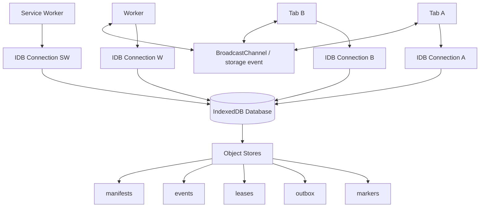
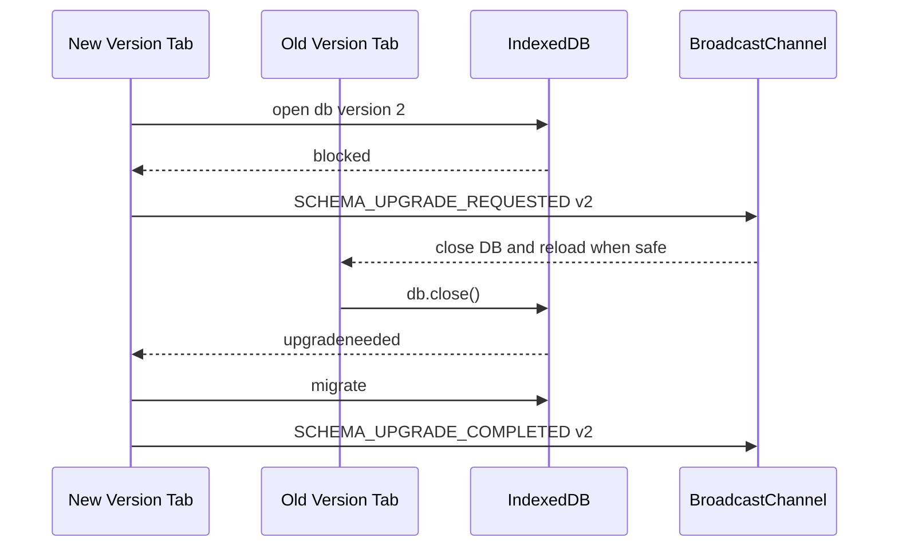
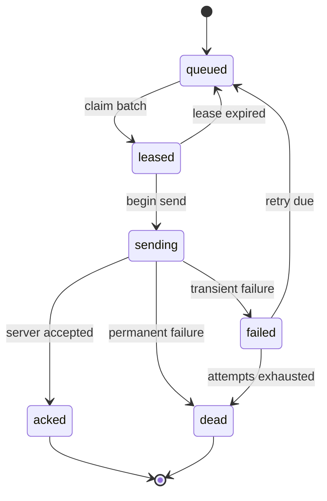
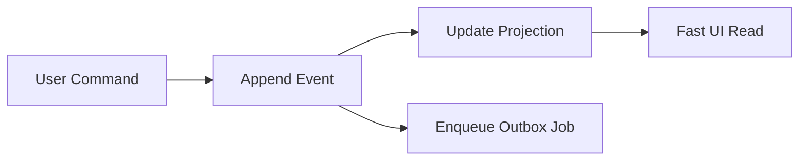
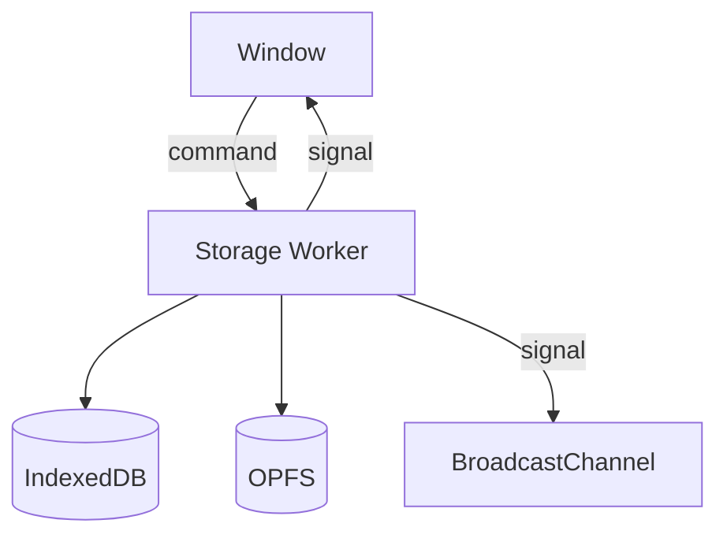
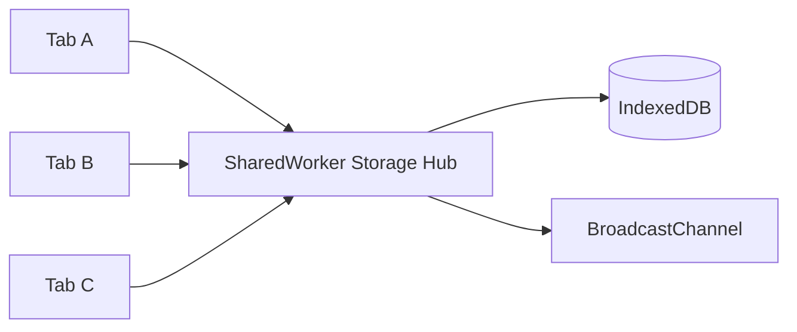
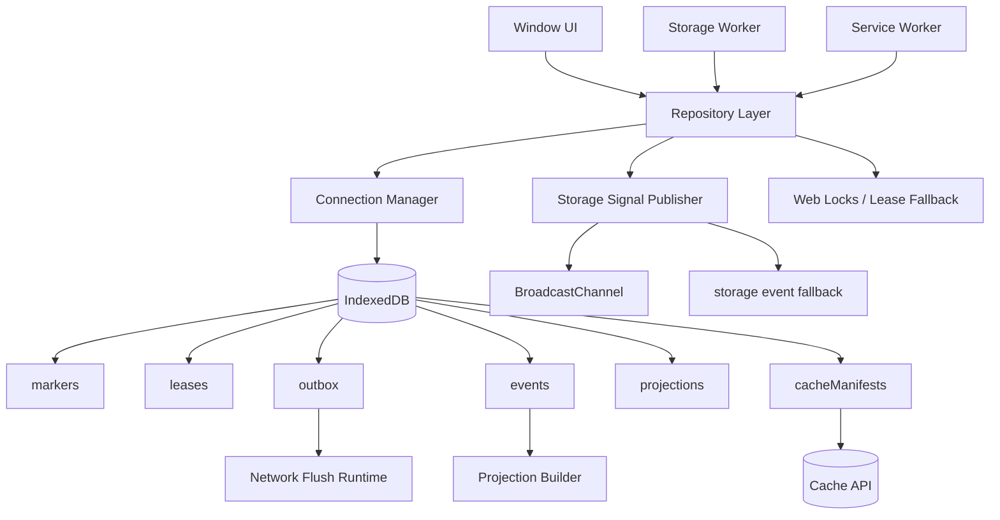
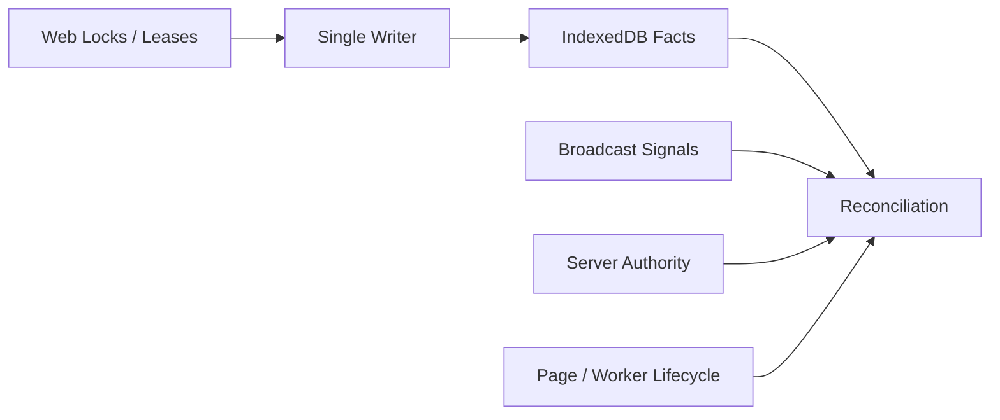

# Part 048 — IndexedDB as Shared State Store

> Goal: use IndexedDB as a durable coordination and state layer without pretending it is PostgreSQL, Redis, Kafka, or a magical reactive database.

IndexedDB is the browser’s most important general-purpose durable structured storage API.

For serious multi-tab systems, it often becomes the place for:

- session metadata
- durable revocation markers
- leader lease fallback
- offline outbox
- event log
- cache manifest metadata
- upload checkpoints
- local projections
- schema version markers
- idempotency keys
- dead-letter records

That does not mean IndexedDB should contain everything.

IndexedDB is good at durable structured records and transactions within the browser.
It is not good at broadcasting changes, resolving distributed conflicts by itself, hiding schema upgrade complexity, or replacing server authority.

This part shows how to design it as a shared state store.

---

## 1. Mental model

IndexedDB is an embedded transactional object store exposed through an asynchronous browser API.

It is shared by same-origin contexts such as windows and workers, subject to browser storage scoping and partitioning behavior.

It is not a process that pushes changes to all clients.



Design principle:

> IndexedDB stores facts. BroadcastChannel wakes readers. Web Locks coordinates owners. Server remains authority for server-owned truth.

---

## 2. What IndexedDB gives you

IndexedDB gives you:

- named databases
- versioned schema upgrade flow
- object stores
- keys and key paths
- indexes
- transactions
- async requests
- structured-clone storage semantics
- access from windows and workers

Useful properties:

- a transaction groups operations over selected object stores.
- read/write operations are asynchronous.
- schema change happens through `versionchange` upgrade.
- stores can persist structured objects.
- multiple tabs can open the same database.

Dangerous properties:

- old connections can block upgrades.
- arbitrary writes do not emit cross-tab change events.
- large object graphs can be expensive.
- transactions have lifetime rules that surprise developers.
- browser quota and user cleanup can remove data.
- schema migrations are deployment workflows.

---

## 3. What IndexedDB does not give you

IndexedDB does not give you:

- automatic cross-tab reactivity
- server-style SQL joins
- distributed consensus
- automatic conflict resolution
- exactly-once processing
- strong durability guarantees across every browser/storage mode
- secret isolation from your own JavaScript
- automatic schema compatibility between old and new app versions

If your design needs one of those, build a layer.

---

## 4. Store design: start with state machines

Bad IndexedDB schema:

```ts
type AppState = {
  everything: unknown;
};
```

Better schema:

```ts
type AppDbSchema = {
  meta: MetaRecord;
  markers: DurableMarker;
  leases: LeaseRecord;
  outbox: OutboxJob;
  events: ClientEvent;
  projections: ProjectionRecord;
  cacheManifests: CacheManifest;
  deadLetters: DeadLetterRecord;
};
```

Each store has a purpose.

| Store | Purpose |
|---|---|
| `meta` | schema/runtime metadata |
| `markers` | durable facts such as logout/revocation/migration-required |
| `leases` | fallback ownership records |
| `outbox` | durable operations to send to server |
| `events` | append-only local event log |
| `projections` | derived snapshots rebuilt from source records/events |
| `cacheManifests` | metadata for Cache API artifacts |
| `deadLetters` | poison/finally failed tasks |

---

## 5. Object store examples

### 5.1 Durable markers

```ts
type DurableMarker = {
  key: string;
  type: "session.revoked" | "schema.upgrade" | "cache.promoted" | "data.wipe";
  epoch: number;
  createdAt: number;
  expiresAt?: number;
  payload?: unknown;
};
```

Key path: `key`.

Usage:

- logout marker
- force reload marker
- cache promotion marker
- tenant switch marker

### 5.2 Lease records

```ts
type LeaseRecord = {
  resource: string;
  ownerId: string;
  fencingToken: number;
  acquiredAt: number;
  expiresAt: number;
  heartbeatAt: number;
};
```

Key path: `resource`.

Usage:

- Web Locks fallback
- outbox flusher
- cache promoter
- websocket owner

### 5.3 Outbox jobs

```ts
type OutboxJob = {
  id: string;
  idempotencyKey: string;
  type: string;
  payloadRef?: string;
  payloadInline?: unknown;
  state: "queued" | "leased" | "sending" | "acked" | "failed" | "dead";
  leaseOwner?: string;
  leaseToken?: number;
  leaseExpiresAt?: number;
  attempt: number;
  nextAttemptAt: number;
  createdAt: number;
  updatedAt: number;
  lastError?: {
    code: string;
    message: string;
    at: number;
  };
};
```

Indexes:

- `state`
- `nextAttemptAt`
- `idempotencyKey`
- `[state, nextAttemptAt]` if your wrapper supports compound keys

### 5.4 Event log

```ts
type ClientEvent = {
  eventId: string;
  streamId: string;
  type: string;
  payload: unknown;
  actorId: string;
  sessionEpoch: number;
  idempotencyKey: string;
  createdAt: number;
  sequence?: number;
};
```

Indexes:

- `streamId`
- `createdAt`
- `idempotencyKey`

---

## 6. Schema creation

Raw IndexedDB is verbose. A wrapper such as `idb` or Dexie can reduce boilerplate, but you must still understand the underlying lifecycle.

Raw shape:

```ts
const request = indexedDB.open("app-db", 1);

request.onupgradeneeded = () => {
  const db = request.result;

  if (!db.objectStoreNames.contains("markers")) {
    db.createObjectStore("markers", { keyPath: "key" });
  }

  if (!db.objectStoreNames.contains("leases")) {
    db.createObjectStore("leases", { keyPath: "resource" });
  }

  if (!db.objectStoreNames.contains("outbox")) {
    const outbox = db.createObjectStore("outbox", { keyPath: "id" });
    outbox.createIndex("by_state", "state");
    outbox.createIndex("by_next_attempt", "nextAttemptAt");
    outbox.createIndex("by_idempotency", "idempotencyKey", { unique: true });
  }

  if (!db.objectStoreNames.contains("events")) {
    const events = db.createObjectStore("events", { keyPath: "eventId" });
    events.createIndex("by_stream", "streamId");
    events.createIndex("by_created_at", "createdAt");
    events.createIndex("by_idempotency", "idempotencyKey", { unique: true });
  }
};
```

Important:

> Object stores and indexes can be created/deleted only during versionchange upgrade transactions.

---

## 7. Connection lifecycle

A DB connection is not immortal.

It can become stale or close unexpectedly.

You need a connection manager.

```ts
type DbState = "idle" | "opening" | "open" | "blocked" | "closed" | "failed";

class IndexedDbConnectionManager {
  private db: IDBDatabase | null = null;
  private state: DbState = "idle";
  private opening: Promise<IDBDatabase> | null = null;

  open(): Promise<IDBDatabase> {
    if (this.db) return Promise.resolve(this.db);
    if (this.opening) return this.opening;

    this.state = "opening";

    this.opening = new Promise((resolve, reject) => {
      const request = indexedDB.open("app-db", 1);

      request.onupgradeneeded = () => migrate(request.result, request.transaction!);

      request.onblocked = () => {
        this.state = "blocked";
        signalSchemaUpgradeBlocked();
      };

      request.onerror = () => {
        this.state = "failed";
        reject(request.error ?? new Error("IndexedDB open failed"));
      };

      request.onsuccess = () => {
        const db = request.result;

        db.onversionchange = () => {
          // Another context wants to upgrade/delete this DB.
          db.close();
          this.db = null;
          this.state = "closed";
          signalDbClosedForUpgrade();
        };

        db.onclose = () => {
          this.db = null;
          this.state = "closed";
          signalDbUnexpectedlyClosed();
        };

        this.db = db;
        this.state = "open";
        resolve(db);
      };
    }).finally(() => {
      this.opening = null;
    });

    return this.opening;
  }

  close() {
    this.db?.close();
    this.db = null;
    this.state = "closed";
  }
}
```

This is boring infrastructure.

It prevents painful production incidents.

---

## 8. Upgrade blocked is a product problem

An upgrade can be blocked because another tab still has an older DB connection open.

That old tab might be:

- visible and active.
- hidden.
- frozen.
- running old JavaScript.
- stuck in bfcache-like restoration behavior.
- controlled by old service worker code.

So upgrade handling needs UX and protocol.



Minimal old-tab handler:

```ts
db.onversionchange = () => {
  db.close();
  showReloadRequiredBanner();
};
```

The strong invariant:

> Old code should close its connection when a versionchange event arrives.

---

## 9. Transaction boundaries

IndexedDB transactions are scoped to specific object stores and modes.

Conceptually:

```ts
const tx = db.transaction(["outbox", "leases"], "readwrite");
const outbox = tx.objectStore("outbox");
const leases = tx.objectStore("leases");
```

You must decide what needs to be atomic together.

Examples:

| Operation | Stores in one transaction |
|---|---|
| enqueue outbox job | `outbox`, maybe `events` |
| acquire lease fallback | `leases` |
| claim outbox job | `outbox`, `leases` |
| accept server ack | `outbox`, `events`, `projections` |
| promote cache manifest | `cacheManifests`, `markers` |
| logout marker write | `markers`, `outbox`, maybe `session` |

If two records must satisfy one invariant, put them in the same transaction or use stronger ownership.

---

## 10. Transaction lifetime trap

Raw IndexedDB transactions auto-complete when control returns to the event loop and there are no pending requests.

This means you should avoid arbitrary `await` inside a raw transaction unless your wrapper explicitly supports it safely.

Danger shape:

```ts
const tx = db.transaction("outbox", "readwrite");
const store = tx.objectStore("outbox");

await fetch("/something"); // dangerous: transaction may already be inactive

store.put(job);
```

Better:

```ts
const responsePayload = await fetchPayloadBeforeTransaction();

const tx = db.transaction("outbox", "readwrite");
tx.objectStore("outbox").put(responsePayload);
```

Rule:

> Keep IndexedDB transactions short, local, and storage-only.

Do network work outside the transaction.

---

## 11. Repository layer

Do not scatter raw IndexedDB calls across UI components.

Create repositories with explicit contracts.

```ts
type MarkerRepository = {
  get(key: string): Promise<DurableMarker | undefined>;
  putIfNewer(marker: DurableMarker): Promise<"stored" | "ignored_older_epoch">;
};

class IndexedDbMarkerRepository implements MarkerRepository {
  constructor(private readonly getDb: () => Promise<IDBDatabase>) {}

  async get(key: string): Promise<DurableMarker | undefined> {
    const db = await this.getDb();
    return requestToPromise(
      db.transaction("markers", "readonly").objectStore("markers").get(key),
    );
  }

  async putIfNewer(marker: DurableMarker) {
    const db = await this.getDb();
    const tx = db.transaction("markers", "readwrite");
    const store = tx.objectStore("markers");

    const existing = await requestToPromise(store.get(marker.key));

    if (existing && existing.epoch > marker.epoch) {
      return "ignored_older_epoch" as const;
    }

    store.put(marker);
    await transactionDone(tx);
    return "stored" as const;
  }
}
```

The repository hides IndexedDB ceremony but exposes consistency semantics.

---

## 12. Request helpers

Raw IndexedDB is event-based.

A minimal promise adapter:

```ts
function requestToPromise<T>(request: IDBRequest<T>): Promise<T> {
  return new Promise((resolve, reject) => {
    request.onsuccess = () => resolve(request.result);
    request.onerror = () => reject(request.error);
  });
}

function transactionDone(tx: IDBTransaction): Promise<void> {
  return new Promise((resolve, reject) => {
    tx.oncomplete = () => resolve();
    tx.onabort = () => reject(tx.error ?? new Error("Transaction aborted"));
    tx.onerror = () => reject(tx.error ?? new Error("Transaction failed"));
  });
}
```

In production, prefer a mature wrapper if it matches your constraints.

But the mental model must remain yours.

---

## 13. Change notification layer

IndexedDB does not automatically tell every tab about arbitrary writes.

So after a meaningful commit, publish a hint.

```ts
type DbChangeSignal = {
  id: string;
  store: "markers" | "outbox" | "events" | "cacheManifests";
  key?: string;
  reason: string;
  epoch?: number;
  createdAt: number;
};
```

Pattern:

```ts
async function writeMarkerAndNotify(marker: DurableMarker) {
  const result = await markerRepo.putIfNewer(marker);

  if (result === "stored") {
    channel.postMessage({
      id: crypto.randomUUID(),
      store: "markers",
      key: marker.key,
      reason: marker.type,
      epoch: marker.epoch,
      createdAt: Date.now(),
    } satisfies DbChangeSignal);
  }
}
```

Receiver:

```ts
channel.addEventListener("message", async (event) => {
  const signal = event.data as DbChangeSignal;
  if (signal.store !== "markers") return;

  const marker = await markerRepo.get(signal.key!);
  if (!marker) return;

  await reconcileMarker(marker);
});
```

Again:

> The message is not the data. The message is a wake-up.

---

## 14. Lease fallback with IndexedDB

Prefer Web Locks for same-origin mutual exclusion where available.

But if you need a durable fallback, use a lease record.

```ts
async function tryAcquireLease(input: {
  resource: string;
  ownerId: string;
  now: number;
  ttlMs: number;
}): Promise<{ acquired: boolean; token?: number }> {
  const db = await openDb();
  const tx = db.transaction("leases", "readwrite");
  const store = tx.objectStore("leases");

  const existing = await requestToPromise<LeaseRecord | undefined>(store.get(input.resource));

  if (existing && existing.expiresAt > input.now && existing.ownerId !== input.ownerId) {
    return { acquired: false };
  }

  const nextToken = (existing?.fencingToken ?? 0) + 1;

  const next: LeaseRecord = {
    resource: input.resource,
    ownerId: input.ownerId,
    fencingToken: nextToken,
    acquiredAt: input.now,
    heartbeatAt: input.now,
    expiresAt: input.now + input.ttlMs,
  };

  store.put(next);
  await transactionDone(tx);

  return { acquired: true, token: nextToken };
}
```

Use the fencing token on side effects.

```ts
await sendOutboxBatch({ leaseOwner, fencingToken });
```

Receiver or next stage rejects stale tokens.

---

## 15. Lease renewal

Lease renewal must also be conditional.

```ts
async function renewLease(input: {
  resource: string;
  ownerId: string;
  fencingToken: number;
  now: number;
  ttlMs: number;
}): Promise<boolean> {
  const db = await openDb();
  const tx = db.transaction("leases", "readwrite");
  const store = tx.objectStore("leases");

  const current = await requestToPromise<LeaseRecord | undefined>(store.get(input.resource));

  if (!current) return false;
  if (current.ownerId !== input.ownerId) return false;
  if (current.fencingToken !== input.fencingToken) return false;

  current.heartbeatAt = input.now;
  current.expiresAt = input.now + input.ttlMs;
  store.put(current);

  await transactionDone(tx);
  return true;
}
```

If renewal fails, step down.

Do not continue side effects under stale ownership.

---

## 16. Outbox design

An IndexedDB outbox is the backbone of offline-capable client systems.



Enqueue:

```ts
async function enqueueOutboxJob(command: {
  type: string;
  payload: unknown;
  idempotencyKey: string;
}) {
  const now = Date.now();

  const job: OutboxJob = {
    id: crypto.randomUUID(),
    idempotencyKey: command.idempotencyKey,
    type: command.type,
    payloadInline: command.payload,
    state: "queued",
    attempt: 0,
    nextAttemptAt: now,
    createdAt: now,
    updatedAt: now,
  };

  const db = await openDb();
  const tx = db.transaction("outbox", "readwrite");
  tx.objectStore("outbox").add(job);
  await transactionDone(tx);

  publishDbChange({ store: "outbox", reason: "job.enqueued" });
}
```

The unique `idempotencyKey` index prevents duplicate enqueue for the same logical operation.

---

## 17. Claiming outbox jobs

Claim a bounded batch.

```ts
async function claimDueJobs(input: {
  ownerId: string;
  leaseToken: number;
  now: number;
  limit: number;
  leaseTtlMs: number;
}): Promise<OutboxJob[]> {
  const db = await openDb();
  const tx = db.transaction("outbox", "readwrite");
  const store = tx.objectStore("outbox");
  const index = store.index("by_next_attempt");

  const claimed: OutboxJob[] = [];

  let cursor = await requestToPromise(index.openCursor(IDBKeyRange.upperBound(input.now)));

  while (cursor && claimed.length < input.limit) {
    const job = cursor.value as OutboxJob;

    if (job.state === "queued" || job.state === "failed") {
      const next: OutboxJob = {
        ...job,
        state: "leased",
        leaseOwner: input.ownerId,
        leaseToken: input.leaseToken,
        leaseExpiresAt: input.now + input.leaseTtlMs,
        updatedAt: input.now,
      };

      cursor.update(next);
      claimed.push(next);
    }

    cursor = await requestToPromise(cursor.continue());
  }

  await transactionDone(tx);
  return claimed;
}
```

Real production code needs careful cursor typing and error handling, but the invariant matters more:

> A claimed job has owner, token, expiry, and bounded lease duration.

---

## 18. Accepting ACKs safely

Only the current owner should mark a job `acked`.

```ts
async function markAcked(input: {
  jobId: string;
  ownerId: string;
  leaseToken: number;
  serverAckId: string;
}) {
  const db = await openDb();
  const tx = db.transaction(["outbox", "events"], "readwrite");
  const outbox = tx.objectStore("outbox");
  const events = tx.objectStore("events");

  const job = await requestToPromise<OutboxJob | undefined>(outbox.get(input.jobId));
  if (!job) return "missing" as const;

  if (job.leaseOwner !== input.ownerId || job.leaseToken !== input.leaseToken) {
    return "stale_owner" as const;
  }

  outbox.put({
    ...job,
    state: "acked",
    updatedAt: Date.now(),
  });

  events.add({
    eventId: crypto.randomUUID(),
    streamId: `outbox:${job.id}`,
    type: "outbox.acked",
    payload: { serverAckId: input.serverAckId },
    actorId: input.ownerId,
    sessionEpoch: 0,
    idempotencyKey: `ack:${job.id}:${input.serverAckId}`,
    createdAt: Date.now(),
  } satisfies ClientEvent);

  await transactionDone(tx);
  return "acked" as const;
}
```

The ACK transition and audit event are atomic together.

---

## 19. Event log and projections

An event log stores history.

A projection stores convenient read models.



Transaction:

```ts
async function applyLocalCommand(command: LocalCommand) {
  const db = await openDb();
  const tx = db.transaction(["events", "projections", "outbox"], "readwrite");

  const event = commandToEvent(command);
  tx.objectStore("events").add(event);

  const projection = await loadProjectionInTx(tx, command.aggregateId);
  tx.objectStore("projections").put(reduceProjection(projection, event));

  tx.objectStore("outbox").add(eventToOutboxJob(event));

  await transactionDone(tx);
  publishDbChange({ store: "events", reason: "event.appended" });
}
```

This gives you:

- local responsiveness.
- durable sync intent.
- auditable transitions.
- recovery after crash.

But do not pretend local events are globally accepted until the server acknowledges them.

---

## 20. IndexedDB and workers

Workers are excellent places to isolate IndexedDB-heavy work.

Use workers for:

- bulk import
- reindexing
- projection rebuild
- search index generation
- compaction
- outbox batch preparation
- large structured clone cost isolation

Architecture:



Benefits:

- UI thread avoids long serialization/reduction work.
- one worker can enforce single-writer discipline within a tab.
- complex storage code is isolated.

Costs:

- message protocol required.
- worker lifecycle must be managed.
- still not a cross-tab singleton unless using SharedWorker or Web Locks.

---

## 21. SharedWorker + IndexedDB pattern

A SharedWorker can centralize live IndexedDB access for multiple tabs.



Advantages:

- fewer open connections.
- one live hub can serialize writes.
- presence and subscriptions can live near storage.

Limits:

- SharedWorker availability/compatibility must be considered.
- it is not durable.
- it can die.
- service worker does not simply become a client of your SharedWorker architecture.
- fallback still needed.

Use SharedWorker as a live optimization, not the only correctness mechanism.

---

## 22. Service Worker + IndexedDB pattern

Service Worker can use IndexedDB for:

- offline queue metadata
- cache manifests
- background sync records
- notification click routing metadata
- durable update markers

But remember:

- Service Worker lifecycle is event-driven.
- it may start and stop.
- global memory is not reliable durable state.
- long-running DB work must be tied to `event.waitUntil()` where relevant.

Example:

```ts
self.addEventListener("sync", (event) => {
  if (event.tag !== "outbox") return;

  event.waitUntil(flushOutboxFromServiceWorker());
});
```

The DB is the continuity.

The Service Worker instance is not.

---

## 23. Large payload strategy

Do not put every payload inline in IndexedDB.

Decision matrix:

| Payload | Suggested storage |
|---|---|
| small JSON command | IndexedDB inline |
| medium structured record | IndexedDB record |
| API response artifact | Cache API + IndexedDB metadata |
| large binary import | OPFS + IndexedDB pointer |
| image/blob export | OPFS or Cache API depending access pattern |
| encrypted local file | OPFS + key management policy |

Pointer record:

```ts
type PayloadPointer = {
  ref: string;
  kind: "idb" | "cache" | "opfs";
  sizeBytes: number;
  contentType?: string;
  digest?: string;
};
```

Outbox job:

```ts
type OutboxJobWithPointer = OutboxJob & {
  payloadRef: PayloadPointer;
};
```

This keeps the control plane small.

---

## 24. Compaction and retention

Durable stores grow.

You need retention policy.

Examples:

| Store | Retention policy |
|---|---|
| `events` | keep until server ack + checkpoint, or domain audit policy |
| `outbox` | delete acked after N days or after checkpoint |
| `deadLetters` | keep bounded count and export diagnostics |
| `markers` | expire non-security markers; keep revocation until session impossible |
| `cacheManifests` | keep active + previous safe rollback version |
| `projections` | rebuildable; can clear on schema change |

Compaction should be owned.

```ts
await navigator.locks.request("idb-compaction", async () => {
  await compactStores();
});
```

If Web Locks unavailable, use an IndexedDB lease.

---

## 25. Schema evolution strategy

Version upgrades should be incremental and idempotent.

```ts
function migrate(db: IDBDatabase, tx: IDBTransaction) {
  switch (db.version) {
    case 1:
      createV1(db);
      break;
    case 2:
      migrateV2(db, tx);
      break;
  }
}
```

Raw `onupgradeneeded` gives you `oldVersion` and `newVersion` via the event.

Typical style:

```ts
request.onupgradeneeded = (event) => {
  const db = request.result;
  const oldVersion = event.oldVersion;

  if (oldVersion < 1) createV1(db);
  if (oldVersion < 2) migrateToV2(db, request.transaction!);
  if (oldVersion < 3) migrateToV3(db, request.transaction!);
};
```

Migration rule:

> Never assume all tabs run the same code during deployment.

Part 056 will go deeper on schema migration/versioning.

---

## 26. Error taxonomy

Map IndexedDB errors to domain-level storage errors.

```ts
type DbError =
  | { code: "open_failed"; cause: unknown }
  | { code: "upgrade_blocked"; dbName: string; targetVersion: number }
  | { code: "transaction_aborted"; storeNames: string[]; cause: unknown }
  | { code: "constraint_violation"; index?: string; cause: unknown }
  | { code: "quota_exceeded"; cause: unknown }
  | { code: "db_closed"; cause?: unknown }
  | { code: "serialization_failed"; cause: unknown };
```

Then decide policy.

| Error | Policy |
|---|---|
| constraint violation on idempotency key | treat as duplicate success or fetch existing |
| quota exceeded during outbox enqueue | stop operation and ask user to free/export data |
| upgrade blocked | notify stale tabs and show reload UX |
| db closed | reopen and reconcile |
| transaction aborted during logout marker | fail closed in memory and retry marker write |
| serialization failed | reject payload shape before storage |

---

## 27. Observability

You need metrics for IndexedDB.

Minimum:

```ts
type DbMetric = {
  operation: string;
  store?: string;
  durationMs: number;
  success: boolean;
  errorCode?: string;
  recordCount?: number;
  approxBytes?: number;
  tabId: string;
  appVersion: string;
};
```

Track:

- open duration.
- blocked upgrade count.
- transaction duration.
- transaction abort count.
- quota errors.
- outbox depth.
- dead-letter count.
- lease acquisition success/failure.
- compaction duration.
- schema version distribution across tabs.

A browser storage system without observability will eventually fail invisibly.

---

## 28. Testing strategy

Test IndexedDB as a concurrent embedded system.

### 28.1 Unit tests

- repository operations.
- state machine transitions.
- idempotency behavior.
- version conflict behavior.
- error mapping.

### 28.2 Integration tests

- open DB.
- migrate schema.
- enqueue and claim outbox.
- lease expiry.
- blocked upgrade simulation.
- unexpected close recovery.

### 28.3 Multi-tab tests

Use browser automation:

- open two pages.
- enqueue same command in both.
- force one tab hidden.
- trigger schema upgrade.
- close old connection.
- verify no duplicate processing.

### 28.4 Chaos tests

- kill worker during transaction boundary.
- reload leader during outbox flush.
- clear site data manually.
- simulate quota error.
- delay BroadcastChannel messages.
- run old app version beside new app version.

---

## 29. Production checklist

Before using IndexedDB as shared state store, verify:

- schema has explicit stores and indexes.
- each store has retention policy.
- migrations handle old versions incrementally.
- `blocked` handler exists.
- `versionchange` handler closes old connections.
- unexpected `close` handler triggers reconciliation.
- transactions are short and storage-only.
- no network `await` inside raw transaction lifetime.
- writes that matter emit change signals.
- receivers re-read state instead of trusting message payload.
- security markers fail closed.
- outbox jobs have idempotency keys.
- leases have expiry and fencing token.
- payloads are bounded or stored by pointer.
- errors are classified.
- quota has user/product policy.
- tests cover two-tab races.

---

## 30. Reference architecture



Layer responsibility:

| Layer | Responsibility |
|---|---|
| connection manager | open, close, blocked, versionchange, unexpected close |
| migration layer | schema creation/evolution |
| repositories | domain-specific storage operations |
| signal publisher | notify other contexts after commits |
| lock/lease layer | ownership of shared workflows |
| outbox runtime | durable sync processing |
| projection builder | derived read model updates |
| observability | metrics and diagnostics |

---

## 31. Common anti-patterns

### Anti-pattern 1: one giant store

A single `state` store containing giant records makes transactions, indexes, retention, migration, and conflict resolution worse.

Use purpose-built stores.

### Anti-pattern 2: no idempotency index

If an offline command can be enqueued twice, it will eventually be sent twice.

Use unique idempotency keys.

### Anti-pattern 3: migration without blocked/versionchange handling

Users with multiple tabs will hit stuck upgrades.

Design upgrade UX.

### Anti-pattern 4: storing huge payload inline by default

Large records increase serialization and memory pressure.

Use payload pointers.

### Anti-pattern 5: assuming service worker memory is durable

Service worker global memory can disappear between events.

Store workflow state in IndexedDB.

### Anti-pattern 6: treating IndexedDB as auth vault

IndexedDB is accessible to your JavaScript. XSS can read it.

Do not store high-value secrets casually.

---

## 32. Final mental model

IndexedDB should be your browser-side durable state core when you need structured persistence.

But the complete system is bigger:



The mature position is:

> IndexedDB is where local facts live. It is not where distributed truth is magically solved.

Use it with transactions, versioning, signals, leases, fencing, idempotency, and recovery.

That is how it becomes production-grade.

---

## References

- MDN — IndexedDB API: `https://developer.mozilla.org/en-US/docs/Web/API/IndexedDB_API`
- MDN — Using IndexedDB: `https://developer.mozilla.org/en-US/docs/Web/API/IndexedDB_API/Using_IndexedDB`
- MDN — `IDBOpenDBRequest: blocked` event: `https://developer.mozilla.org/en-US/docs/Web/API/IDBOpenDBRequest/blocked_event`
- MDN — `IDBDatabase: versionchange` event: `https://developer.mozilla.org/en-US/docs/Web/API/IDBDatabase/versionchange_event`
- MDN — `IDBDatabase: close` event: `https://developer.mozilla.org/en-US/docs/Web/API/IDBDatabase/close_event`
- MDN — BroadcastChannel API: `https://developer.mozilla.org/en-US/docs/Web/API/Broadcast_Channel_API`
- MDN — Web Locks API: `https://developer.mozilla.org/en-US/docs/Web/API/Web_Locks_API`
- MDN — Background Synchronization API: `https://developer.mozilla.org/en-US/docs/Web/API/Background_Synchronization_API`
