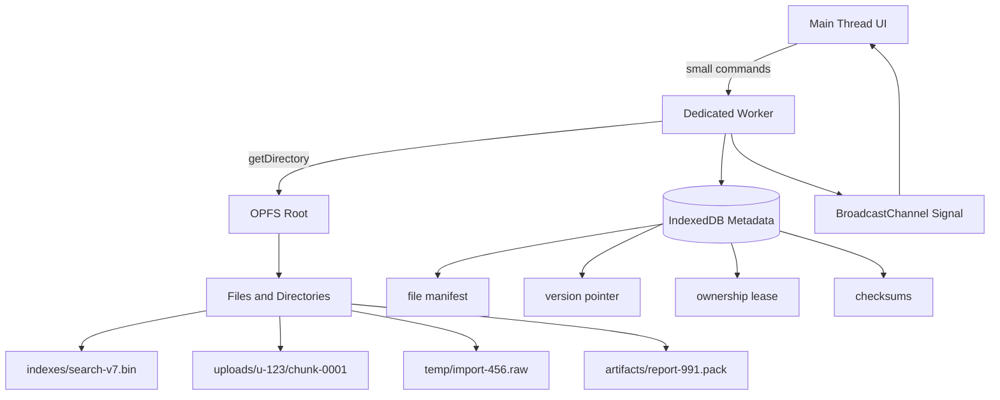
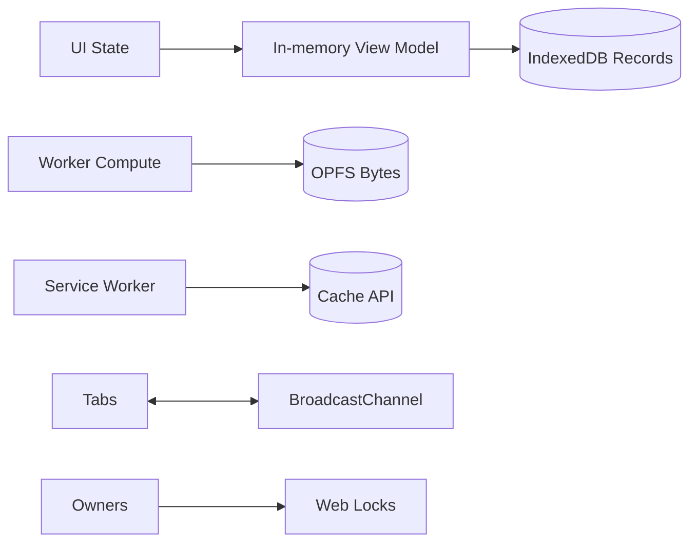
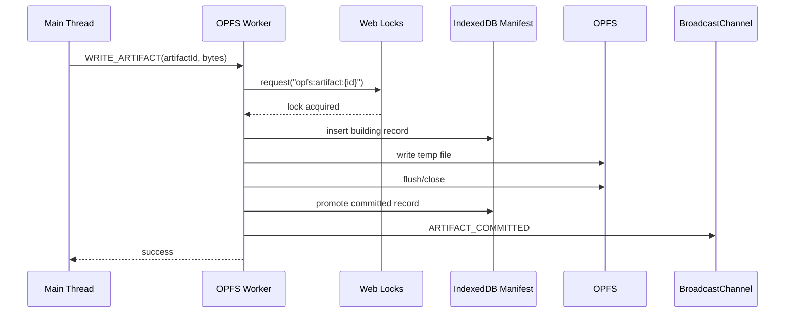
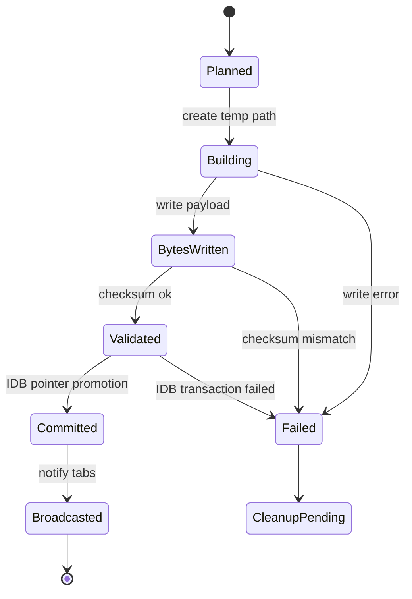
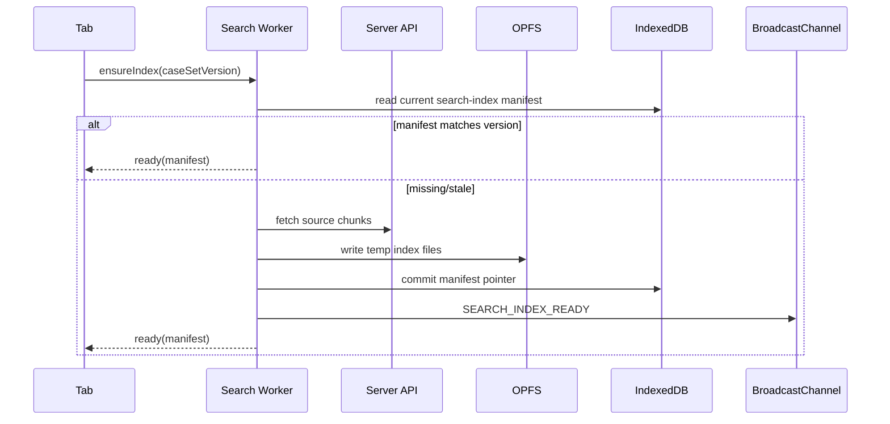
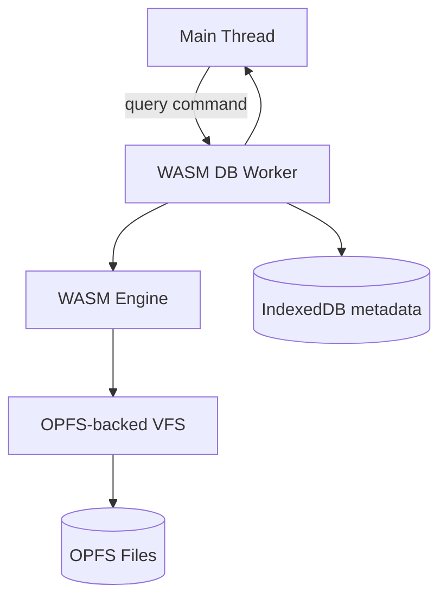
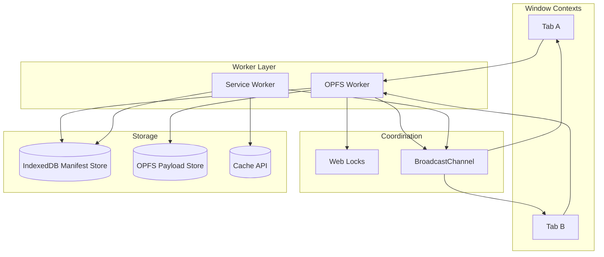

# Part 049 — OPFS for Worker-Heavy Data

> Goal: use the Origin Private File System as a high-throughput browser-local data plane without turning it into an unbounded, invisible disk dump.

IndexedDB is good for structured durable records.
Cache API is good for `Request`/`Response` artifacts.
OPFS is different.

OPFS is useful when your browser application needs to store and mutate large byte-oriented data privately inside the origin:

- local search indexes
- large import/export staging files
- compressed archives
- media processing intermediates
- WASM database files
- resumable upload chunks
- document diff snapshots
- rule engine working sets
- binary projections generated by workers
- client-side analytics batches
- temporary data too large to keep in memory

The key is not “OPFS is faster.”

The key is that OPFS lets you move certain workloads out of object graphs and into file-like byte ranges, often from a worker, with less main-thread pressure and better control over peak memory.

That is a different storage design than IndexedDB.

---

## 1. Mental model

Think of OPFS as an origin-private file system exposed to JavaScript.

It is:

- private to the origin
- not user-visible like a normal local file chosen via file picker
- subject to browser storage quota and site data clearing
- accessible through File System API handles
- useful from workers
- good for file-like data and byte ranges

It is not:

- a replacement for server storage
- a globally shared POSIX file system
- a cross-origin exchange mechanism
- a permissionless place to store secrets forever
- a consistency protocol
- a message bus
- a cache invalidation system
- automatically garbage-collected at the application semantic level



The production pattern is simple:

**OPFS stores bytes. IndexedDB stores meaning. BroadcastChannel signals change. Web Locks or leases coordinate ownership.**

Do not invert that.

If OPFS becomes the only source of truth for both bytes and semantic state, every startup must crawl a filesystem, infer intent from filenames, and repair partial writes. That can work for tiny systems. It becomes painful in real apps.

---

## 2. When OPFS is the right tool

Use OPFS when the dominant problem is byte movement, not record querying.

| Need | Better primitive | Why |
|---|---|---|
| Structured entities, lookup by key | IndexedDB | Transactions, indexes, object stores |
| HTTP response artifact | Cache API | Native `Request`/`Response` model |
| Cross-tab signal | BroadcastChannel / storage event | Storage is not notification |
| Mutual exclusion | Web Locks / lease | File existence is a weak lock |
| Large binary file | OPFS | File-like storage, byte access |
| WASM database file | OPFS | Local file-like backing store |
| Temporary processing scratch space | OPFS | Avoid main memory blow-up |
| User-visible save/open file | File System Access API | User-facing file permissions |

A worker-heavy application often uses all of them:



The mistake is trying to make one primitive do every job.

---

## 3. Design rule: separate metadata from payload

A robust OPFS design almost always has two layers:

1. **Payload layer** in OPFS.
2. **Metadata layer** in IndexedDB.

The metadata layer answers:

- What logical artifact does this file represent?
- Which version is current?
- Which files are committed?
- Which files are temporary?
- Which writer owns the artifact?
- Which checksum validates the payload?
- Which schema wrote the payload?
- Which files can be deleted?
- Which files are referenced by active tabs?

The payload layer stores:

- raw bytes
- chunk files
- packed binary data
- generated indexes
- append-only segments
- snapshots
- temporary working files

```ts
export type OpfsArtifactRecord = {
  artifactId: string;
  kind: "search-index" | "upload-chunk" | "import-scratch" | "report-pack";
  version: number;
  state: "building" | "committed" | "obsolete" | "failed";
  path: string;
  sizeBytes: number;
  checksum?: string;
  schemaVersion: number;
  writerId: string;
  createdAt: number;
  committedAt?: number;
  expiresAt?: number;
};
```

This record belongs in IndexedDB.

The bytes belong in OPFS.

---

## 4. Basic OPFS access

Access starts from `navigator.storage.getDirectory()`.

```ts
export async function getOpfsRoot(): Promise<FileSystemDirectoryHandle> {
  if (!("storage" in navigator) || !("getDirectory" in navigator.storage)) {
    throw new Error("OPFS is not available in this browser/runtime");
  }

  return await navigator.storage.getDirectory();
}
```

From the root, create or open directories and files:

```ts
export async function ensureDirectory(
  parent: FileSystemDirectoryHandle,
  name: string,
): Promise<FileSystemDirectoryHandle> {
  return await parent.getDirectoryHandle(name, { create: true });
}

export async function ensureFile(
  parent: FileSystemDirectoryHandle,
  name: string,
): Promise<FileSystemFileHandle> {
  return await parent.getFileHandle(name, { create: true });
}
```

For main-thread use, prefer asynchronous operations.

For heavy byte manipulation, prefer moving the work into a dedicated worker.

---

## 5. Worker-first OPFS architecture

Do not let UI components manipulate OPFS directly.

Expose a worker command API:

```ts
type OpfsCommand =
  | {
      type: "WRITE_ARTIFACT";
      requestId: string;
      artifactId: string;
      bytes: ArrayBuffer;
      transfer: true;
    }
  | {
      type: "READ_ARTIFACT";
      requestId: string;
      artifactId: string;
    }
  | {
      type: "DELETE_ARTIFACT";
      requestId: string;
      artifactId: string;
    }
  | {
      type: "COMPACT";
      requestId: string;
      budgetMs: number;
    };
```

The UI sends intention.
The worker owns file handles.
The metadata repository owns semantic state.



This design prevents random UI state from becoming filesystem state.

---

## 6. File layout

A file layout is an API.

Treat it like a schema.

Bad layout:

```txt
/root
  file1
  file2
  stuff
  temp
  new-new-final.bin
```

Good layout:

```txt
/root
  artifacts/
    search-index/
      v00000007/
        index.bin
        terms.bin
        metadata.json
      v00000008.building.3f1a/
        index.tmp
    reports/
      report-2026-07-08/
        payload.pack
  uploads/
    upload-8fa7/
      chunk-000000
      chunk-000001
      manifest.json
  temp/
    import-9ca2/
      raw.bin
      normalized.bin
  trash/
    2026-07-08T10-00-00Z/
      orphan-abc.bin
```

Rules:

- Include kind in path.
- Include version when artifact can be replaced.
- Use `.building`, `.tmp`, or a random build directory for incomplete writes.
- Do not overwrite committed files in place unless you have a strong reason.
- Keep metadata in IndexedDB even if you also place small `metadata.json` files near payloads.
- Make cleanup deterministic.

---

## 7. Atomic-ish promotion

OPFS does not automatically give your application atomic multi-file artifact promotion.

So design promotion as a metadata transaction.

The durable semantic switch should happen in IndexedDB:

1. Write bytes to a temporary OPFS path.
2. Flush/close the file handle.
3. Validate size/checksum.
4. In one IndexedDB transaction:
   - mark old artifact obsolete
   - mark new artifact committed
   - update current pointer
5. Broadcast `ARTIFACT_COMMITTED`.
6. Delete obsolete bytes later.



The important invariant:

> Readers only read files referenced by committed metadata.

Never let a reader discover “current” by scanning for the newest file in OPFS.

---

## 8. Writing payloads safely

A simple asynchronous write:

```ts
export async function writeBytesAsync(
  directory: FileSystemDirectoryHandle,
  fileName: string,
  bytes: Uint8Array,
): Promise<void> {
  const fileHandle = await directory.getFileHandle(fileName, { create: true });
  const writable = await fileHandle.createWritable();

  try {
    await writable.write(bytes);
  } finally {
    await writable.close();
  }
}
```

For worker-heavy byte operations, a sync access handle may be appropriate when available in a worker context:

```ts
export async function writeBytesWithSyncHandle(
  directory: FileSystemDirectoryHandle,
  fileName: string,
  bytes: Uint8Array,
): Promise<void> {
  const fileHandle = await directory.getFileHandle(fileName, { create: true });

  // Intended for worker context. Feature-detect in real code.
  const accessHandle = await fileHandle.createSyncAccessHandle();

  try {
    accessHandle.truncate(0);
    accessHandle.write(bytes, { at: 0 });
    accessHandle.flush();
  } finally {
    accessHandle.close();
  }
}
```

Do not call sync-heavy operations on the main thread.

The point is to keep blocking byte operations away from UI scheduling.

---

## 9. Read strategy

There are three common read patterns.

### 9.1 Read whole file

Good for small artifacts.

```ts
export async function readWholeFile(
  directory: FileSystemDirectoryHandle,
  fileName: string,
): Promise<ArrayBuffer> {
  const handle = await directory.getFileHandle(fileName);
  const file = await handle.getFile();
  return await file.arrayBuffer();
}
```

Risk: peak memory.

If the file is 300 MB, this can become a bad idea quickly.

### 9.2 Read byte ranges

Good for indexes, segments, and packed formats.

```ts
export async function readRangeWithSyncHandle(
  directory: FileSystemDirectoryHandle,
  fileName: string,
  offset: number,
  length: number,
): Promise<ArrayBuffer> {
  const handle = await directory.getFileHandle(fileName);
  const access = await handle.createSyncAccessHandle();

  try {
    const buffer = new ArrayBuffer(length);
    const view = new Uint8Array(buffer);
    access.read(view, { at: offset });
    return buffer;
  } finally {
    access.close();
  }
}
```

### 9.3 Stream/chunk through worker protocol

Good when the main thread needs progress or partial results.

```ts
export type ChunkMessage = {
  type: "CHUNK";
  requestId: string;
  offset: number;
  length: number;
  buffer: ArrayBuffer;
};
```

Transfer the `ArrayBuffer` to avoid copying when possible:

```ts
postMessage(
  {
    type: "CHUNK",
    requestId,
    offset,
    length: buffer.byteLength,
    buffer,
  },
  [buffer],
);
```

---

## 10. OPFS is not your metadata database

You can store `manifest.json` files beside payloads, but do not rely only on them for coordination.

Why?

Because application-level metadata needs transactions, indexes, and queries:

- list all committed artifacts of kind `search-index`
- find expired temp files
- atomically promote current version
- detect stale writer generation
- map logical artifact to physical paths
- track checksum and schema
- find orphans

IndexedDB is better for that.

Recommended split:

| Data | Location |
|---|---|
| Artifact bytes | OPFS |
| Current artifact pointer | IndexedDB |
| Writer lease | Web Locks or IndexedDB |
| Build state | IndexedDB |
| Change signal | BroadcastChannel |
| Cross-version compatibility | metadata field in IndexedDB |
| Recovery scan marker | IndexedDB |
| Large response body | Cache API or OPFS, depending on semantics |

---

## 11. Ownership and concurrency

OPFS can be accessed by multiple same-origin contexts.

Your design must decide who writes each file.

The safest rule:

> One writer per logical artifact. Many readers by committed pointer.

Use Web Locks when available:

```ts
export async function withArtifactLock<T>(
  artifactId: string,
  work: () => Promise<T>,
): Promise<T> {
  return await navigator.locks.request(`opfs:artifact:${artifactId}`, async () => {
    return await work();
  });
}
```

Fallback with IndexedDB lease when Web Locks are unavailable:

```ts
type LeaseRecord = {
  name: string;
  ownerId: string;
  generation: number;
  expiresAt: number;
};
```

But remember the Part 040 invariant:

> A lease without fencing can still accept stale side effects.

For file promotion, use generation numbers:

```ts
type BuildRecord = {
  artifactId: string;
  buildId: string;
  writerId: string;
  writerGeneration: number;
  state: "building" | "committed" | "failed";
  tempPath: string;
  finalPath: string;
};
```

A writer may create bytes.
Only a writer with the current generation may promote metadata.

---

## 12. Reader isolation

Readers should avoid partially-written files.

Bad:

```ts
const root = await navigator.storage.getDirectory();
const dir = await root.getDirectoryHandle("search-index");
const newest = await findNewestDirectoryByName(dir);
const bytes = await readWholeFile(newest, "index.bin");
```

Good:

```ts
const manifest = await artifactRepository.getCurrent("search-index");

if (!manifest || manifest.state !== "committed") {
  throw new Error("No committed search index");
}

const bytes = await opfs.read(manifest.path);
```

This makes OPFS a data plane, not a discovery mechanism.

---

## 13. Example: search index artifact

Imagine a regulatory case management UI with large local search across cases.

The server sends compact records.
The browser builds a search index in a worker.
The index is too large to keep rebuilding on every tab load.

Architecture:



Metadata:

```ts
type SearchIndexManifest = {
  artifactId: "search-index";
  sourceVersion: string;
  indexVersion: number;
  paths: {
    terms: string;
    postings: string;
    metadata: string;
  };
  sizeBytes: number;
  checksum: string;
  state: "committed";
  committedAt: number;
};
```

Query flow:

1. UI sends query string to search worker.
2. Worker reads committed manifest from memory or IndexedDB.
3. Worker reads OPFS byte ranges needed by index.
4. Worker returns top N results.
5. UI fetches display records from IndexedDB/server.

Do not send the whole index to the main thread.

---

## 14. Example: upload staging

Large uploads are a natural OPFS fit.

Instead of holding a 1 GB file transformation in memory:

1. User selects file.
2. Worker chunks and transforms data.
3. Chunks are written to OPFS.
4. IndexedDB records upload manifest.
5. Service Worker or foreground worker flushes chunks.
6. Server receives idempotent chunk writes.
7. Committed upload deletes local chunks.

```ts
type UploadManifest = {
  uploadId: string;
  sourceName: string;
  state: "staging" | "ready" | "uploading" | "complete" | "failed";
  chunkSize: number;
  totalChunks: number;
  chunks: Array<{
    index: number;
    path: string;
    sizeBytes: number;
    checksum: string;
    uploadedAt?: number;
  }>;
  createdAt: number;
  updatedAt: number;
};
```

Invariant:

> Upload state is driven by manifest records, not directory scans.

If the app crashes after chunk 77, startup reads the manifest and resumes from chunk 78 or repairs missing chunks.

---

## 15. Append-only segment design

For logs or generated binary indexes, append-only segments are often safer than rewriting a huge file.

Layout:

```txt
/events/
  stream-a/
    segment-000000.pack
    segment-000001.pack
    segment-000002.building.pack
```

Manifest:

```ts
type SegmentManifest = {
  streamId: string;
  committedSegments: Array<{
    segmentNo: number;
    path: string;
    sizeBytes: number;
    firstOffset: number;
    lastOffset: number;
    checksum: string;
  }>;
  openSegment?: {
    segmentNo: number;
    path: string;
    writerId: string;
  };
};
```

Benefits:

- bounded write amplification
- easier repair
- easier compaction
- easier partial upload
- easier range reads

Costs:

- more metadata
- compaction required
- readers must merge segments

---

## 16. Compaction

OPFS makes it easy to accumulate garbage.

Any production OPFS design needs compaction.

Compaction categories:

| Garbage type | Cause | Cleanup rule |
|---|---|---|
| Temp build dirs | crash during build | delete if no active build lease and older than TTL |
| Obsolete artifact versions | successful promotion | keep last N or last known-good, delete older |
| Uploaded chunks | upload complete | delete after server commit confirmation |
| Failed imports | user abandoned workflow | delete after expiry |
| Orphan files | metadata lost or migration bug | quarantine then delete |
| Corrupt files | checksum mismatch | mark failed and delete later |

Never compact blindly on startup while many tabs are active.

Better:

1. Elect one compactor with Web Locks.
2. Read metadata.
3. Build candidate deletion list.
4. Move candidates to trash/quarantine or mark `deletePending`.
5. Delete under a small time budget.
6. Record metrics.

```ts
export async function compactOpfsOnce(now: number): Promise<void> {
  await navigator.locks.request("opfs:compactor", { ifAvailable: true }, async (lock) => {
    if (!lock) return;

    const candidates = await artifactRepository.findDeletionCandidates(now);

    for (const candidate of candidates.slice(0, 50)) {
      try {
        await opfsDeletePath(candidate.path);
        await artifactRepository.markDeleted(candidate.artifactId, candidate.version);
      } catch (error) {
        await artifactRepository.recordCleanupFailure(candidate, String(error));
      }
    }
  });
}
```

Bound compaction. Do not turn cleanup into a startup denial-of-service.

---

## 17. Quota management

OPFS is subject to origin storage quota.

That means every OPFS subsystem must know its budget.

Use `navigator.storage.estimate()` as telemetry, not as a perfect guarantee:

```ts
export async function getStoragePressure(): Promise<{
  usage: number;
  quota: number;
  ratio: number;
}> {
  const estimate = await navigator.storage.estimate();
  const usage = estimate.usage ?? 0;
  const quota = estimate.quota ?? 0;

  return {
    usage,
    quota,
    ratio: quota > 0 ? usage / quota : 1,
  };
}
```

Budget by category:

```ts
type StorageBudgetPolicy = {
  searchIndexMaxBytes: number;
  uploadStagingMaxBytes: number;
  importScratchMaxBytes: number;
  reportArtifactMaxBytes: number;
  globalSoftLimitRatio: number;
  globalHardLimitRatio: number;
};
```

Policy examples:

- reject new import if scratch budget exceeded
- delete obsolete search indexes before staging large upload
- ask user before storing very large offline artifact
- keep only last successful generated pack
- pause background precomputation when storage ratio is high

A professional OPFS system has a deletion story before it has a write story.

---

## 18. Security and privacy boundary

OPFS is private to the origin, not invisible to your own JavaScript.

Assume any script running in the same origin can attempt to access same-origin storage APIs, subject to browser/runtime capability.

Security rules:

- Do not store long-lived bearer tokens in OPFS.
- Do not treat OPFS as a secret vault.
- Avoid writing sensitive raw PII unless encrypted or strictly necessary.
- Bind artifacts to session/tenant version where needed.
- Delete session-scoped artifacts on logout/revocation.
- Avoid exposing OPFS file paths in untrusted UI messages.
- Validate artifact metadata before reading bytes.
- Enforce maximum file size and count per feature.

Example session-scoped artifact:

```ts
type SessionScopedArtifact = {
  artifactId: string;
  sessionIdHash: string;
  tenantId: string;
  authzVersion: number;
  path: string;
  state: "committed" | "deletePending";
};
```

On logout:

1. Acquire session transition lock.
2. Abort active workers.
3. Mark session-scoped artifacts `deletePending`.
4. Broadcast logout metadata.
5. Delete sensitive OPFS paths under bounded cleanup.
6. Clear in-memory handles.

---

## 19. Cross-tab consistency

OPFS file writes do not automatically inform other tabs.

Use a signal bus:

```ts
type ArtifactSignal =
  | {
      type: "ARTIFACT_COMMITTED";
      artifactId: string;
      kind: string;
      version: number;
      manifestRevision: number;
    }
  | {
      type: "ARTIFACT_DELETED";
      artifactId: string;
      version: number;
    }
  | {
      type: "ARTIFACT_INVALIDATED";
      kind: string;
      reason: "schema-upgrade" | "logout" | "server-revocation";
    };
```

Receiver behavior:

```ts
channel.onmessage = async (event) => {
  const signal = parseArtifactSignal(event.data);

  if (signal.type === "ARTIFACT_COMMITTED") {
    const manifest = await artifactRepository.get(signal.artifactId);

    if (!manifest || manifest.version !== signal.version) {
      return;
    }

    await localRuntime.refreshArtifact(manifest);
  }
};
```

The signal is not the truth.
The manifest is the truth.
The bytes are the payload.

---

## 20. Recovery after crash

Startup recovery should be deterministic.

Recovery workflow:

1. Open IndexedDB.
2. Read artifact records in non-terminal states.
3. For each `building` record:
   - check writer lease/generation
   - if stale, mark failed or cleanup pending
4. For each `committed` record:
   - optionally verify referenced path exists
   - optionally verify checksum lazily
5. For OPFS orphan scan:
   - run only under compactor lock
   - compare filesystem paths to manifest references
   - quarantine unknown files before delete
6. Broadcast recovery result if user-visible state changed.

```ts
type RecoveryAction =
  | { type: "MARK_FAILED"; artifactId: string; reason: string }
  | { type: "DELETE_TEMP"; path: string }
  | { type: "VERIFY_COMMITTED"; artifactId: string; path: string }
  | { type: "NOOP" };
```

Do not perform an expensive checksum over every large artifact on every startup.

Use lazy validation or periodic maintenance.

---

## 21. Versioning and migration

OPFS data formats need schema versions.

There are two version layers:

1. **Storage schema version**: IndexedDB schema/object stores.
2. **Payload format version**: binary file format, pack format, index format.

Never assume an old worker can read a new OPFS payload.

Manifest example:

```ts
type VersionedPayloadManifest = {
  artifactId: string;
  producerAppVersion: string;
  payloadFormat: "search-index-pack";
  payloadFormatVersion: 4;
  minReaderVersion: 3;
  path: string;
  state: "committed";
};
```

Reader check:

```ts
function assertReadable(manifest: VersionedPayloadManifest, readerVersion: number): void {
  if (readerVersion < manifest.minReaderVersion) {
    throw new Error(
      `Reader version ${readerVersion} cannot read payload requiring ${manifest.minReaderVersion}`,
    );
  }
}
```

Rolling deploy problem:

- Tab A loads old app version.
- Tab B loads new app version.
- New worker writes OPFS payload format v5.
- Old tab receives signal and tries to read v5.
- Old parser crashes or returns corrupt result.

Mitigation:

- include `minReaderVersion`
- reject incompatible artifacts
- keep last compatible artifact until no old clients remain
- coordinate app update reload when format changes
- use feature negotiation across tabs

---

## 22. OPFS plus WASM

Many browser-side databases and engines prefer file-like storage.

OPFS is useful for WASM-backed systems because the worker can host the WASM runtime and treat OPFS as persistent local backing storage.

Architecture:



Rules:

- Keep WASM database ownership single-writer unless the engine explicitly supports concurrent writers.
- Do not let multiple tabs open the same database file for writes without a coordination protocol.
- Fence write sessions.
- Keep UI query protocol bounded.
- Treat database compaction/vacuum as a scheduled heavy job.
- Measure startup cost.

---

## 23. Observability

OPFS problems are otherwise invisible.

Track:

- total bytes by artifact kind
- file count by directory
- write duration
- read duration
- flush duration
- checksum duration
- quota estimate before/after write
- compaction candidates
- compaction deleted bytes
- failed cleanup count
- orphan count
- stale build count
- incompatible payload count
- active writer lock wait time

Example event:

```ts
type OpfsMetricEvent = {
  type: "opfs.write.completed";
  artifactKind: string;
  artifactId: string;
  version: number;
  sizeBytes: number;
  durationMs: number;
  quotaRatioAfter: number;
};
```

Debug endpoint:

```ts
type OpfsDebugSnapshot = {
  usageEstimate: {
    usage: number;
    quota: number;
    ratio: number;
  };
  artifactCounts: Record<string, number>;
  bytesByKind: Record<string, number>;
  buildingArtifacts: number;
  cleanupPendingArtifacts: number;
  lastCompactionAt?: number;
};
```

A serious browser app should have a way to answer: “Why is this origin using 900 MB?”

---

## 24. Testing strategy

Test OPFS code like a storage engine.

### Unit tests

- path builder rejects unsafe names
- manifest promotion validates state transitions
- reader rejects uncommitted artifacts
- cleanup selects correct candidates
- payload format version rejects incompatible reader
- byte range reader handles EOF

### Integration tests

- write artifact then read after reload
- crash after temp write before manifest promotion
- crash after manifest building record before bytes exist
- two tabs attempt same artifact build
- stale writer attempts promotion after lock lost
- quota pressure path rejects new write
- compaction does not delete current artifact

### Chaos tests

- terminate worker mid-write
- reload tab during promotion
- start new app version while old tab alive
- corrupt a manifest reference
- delete a payload file manually through test harness
- simulate OPFS unavailable
- simulate private mode behavior where storage APIs fail

### Performance tests

- 10 MB write
- 100 MB write
- chunked read latency
- peak memory during import
- main-thread long tasks during OPFS workflow
- worker startup and warm cache path

---

## 25. Anti-patterns

### Anti-pattern 1: Store everything in OPFS

Problem: no indexes, no query layer, painful recovery.

Fix: OPFS for bytes, IndexedDB for metadata.

### Anti-pattern 2: Discover current version by filename

Problem: partial writes and stale files can look valid.

Fix: committed metadata pointer.

### Anti-pattern 3: Multiple writers to same file

Problem: corrupted file, last-writer-wins, undefined application state.

Fix: one writer per logical artifact with lock/lease/fencing.

### Anti-pattern 4: No cleanup policy

Problem: invisible disk growth.

Fix: TTL, version retention, compactor lock, quota telemetry.

### Anti-pattern 5: Large payload through BroadcastChannel

Problem: clone cost, memory spike, message failure.

Fix: store payload in OPFS, signal manifest revision.

### Anti-pattern 6: Store secrets as files

Problem: OPFS is not a vault.

Fix: avoid long-lived secrets; rely on secure server/session design.

### Anti-pattern 7: Assume OPFS exists everywhere

Problem: compatibility and runtime mode differences.

Fix: feature detection and fallback.

---

## 26. Reference architecture



Core invariants:

1. OPFS files are never the only semantic truth.
2. Readers only read committed manifest paths.
3. Writers use lock/lease/fencing.
4. Promotion is metadata-driven.
5. Cleanup is bounded and observable.
6. Version compatibility is explicit.
7. Large bytes do not move through cross-tab message buses.
8. Session-scoped bytes are deleted or invalidated on logout.
9. Startup recovery is deterministic.
10. Quota pressure is part of normal operation.

---

## 27. Production checklist

Before using OPFS in a serious app, answer these:

- What data belongs in OPFS instead of IndexedDB or Cache API?
- What is the logical artifact model?
- Where is the committed pointer stored?
- What is the file layout?
- What is the temporary write path?
- What is the promotion transaction?
- How do readers avoid partial files?
- Who is allowed to write?
- What lock/lease/fencing protects writes?
- What is the cleanup policy?
- What happens on quota pressure?
- What data is session-scoped?
- What happens on logout?
- How are payload formats versioned?
- Can old tabs read new files?
- How do tabs learn that an artifact changed?
- How are corrupt files detected?
- How are orphan files cleaned?
- What metrics expose usage and failures?
- What is the fallback when OPFS is unavailable?

---

## 28. Summary

OPFS is powerful because it gives browser applications a private, file-like byte store.

But OPFS does not solve coordination.
It does not solve schema management.
It does not solve cache invalidation.
It does not solve cross-tab signaling.
It does not solve cleanup.

The production design is:

```txt
IndexedDB = metadata, manifests, state transitions
OPFS     = large bytes and mutable file-like payloads
Web Locks = writer ownership
BroadcastChannel = volatile change signal
Worker    = byte-heavy execution owner
```

That architecture lets you build local search indexes, upload staging systems, WASM-backed storage, large import pipelines, and binary projections without overwhelming the main thread or flooding cross-tab channels.

The next part moves to the Cache API as a versioned artifact store: when the payload is not arbitrary bytes, but HTTP-shaped `Request`/`Response` data.

---

## References

- MDN — Origin private file system: https://developer.mozilla.org/en-US/docs/Web/API/File_System_API/Origin_private_file_system
- MDN — File System API: https://developer.mozilla.org/en-US/docs/Web/API/File_System_API
- MDN — StorageManager.estimate(): https://developer.mozilla.org/en-US/docs/Web/API/StorageManager/estimate
- MDN — Web Workers API: https://developer.mozilla.org/en-US/docs/Web/API/Web_Workers_API
- MDN — Web Locks API: https://developer.mozilla.org/en-US/docs/Web/API/Web_Locks_API
