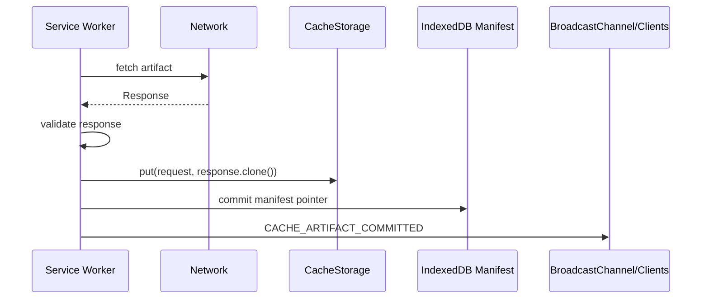
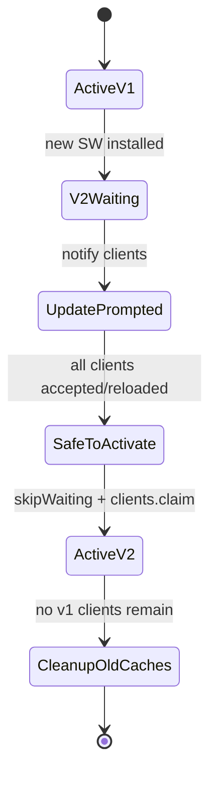
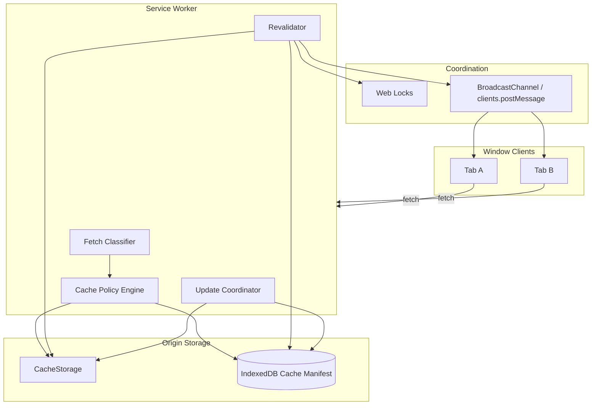

# Part 050 — Cache API as Versioned Artifact Store

> Goal: use the Cache API as a deliberate versioned artifact store, not as a magic HTTP cache and not as an unbounded offline junk drawer.

The Cache API is often taught as a Service Worker feature:

```ts
const cache = await caches.open("v1");
await cache.addAll(["/", "/app.js", "/style.css"]);
```

That example is useful.
It is also far too small for production reasoning.

In real multi-tab apps, the Cache API becomes a storage layer for HTTP-shaped artifacts:

- app shell assets
- route data responses
- tenant configuration responses
- policy dictionary snapshots
- generated report downloads
- avatar/image blobs
- static lookup tables
- API response snapshots for offline mode
- versioned feature bundles
- server-provided search dictionaries

The Cache API stores `Request`/`Response` pairs.
That is a strong shape.
Use it when your artifact is naturally HTTP-shaped.

Do not use it as a general key-value database.
Do not use it as the source of semantic truth without a manifest.
Do not assume HTTP caching headers govern it.
Do not assume entries expire automatically.

---

## 1. Mental model

The Cache API gives an origin a set of named caches.
Each cache contains request/response pairs.

```mermaid
flowchart TD
  CS[CacheStorage: caches] --> C1[app-shell-v42]
  CS --> C2[api-snapshots-v17]
  CS --> C3[tenant-policy-v5]

  C1 --> A1[/index.html -> Response]
  C1 --> A2[/assets/app.abc123.js -> Response]
  C2 --> R1[/api/cases?page=1 -> Response]
  C3 --> P1[/api/policy-dictionary?tenant=A -> Response]

  SW[Service Worker] --> CS
  W[Worker] --> CS
  T[Window] --> CS
```

The Cache API is exposed to window and worker scopes, not only Service Workers.

But the Service Worker is usually the central runtime that decides how cached HTTP-shaped artifacts are served to fetches.

---

## 2. Cache API is not the browser HTTP cache

This is the first production trap.

The Cache API does not behave like the normal browser HTTP cache.

You decide:

- what gets stored
- when it gets stored
- how keys are matched
- when entries are updated
- when entries are deleted
- which cache name is current
- how stale data is detected
- how quota pressure is handled

The browser does not magically apply your intended expiration policy.

A `Response` in the Cache API can have HTTP cache headers, but your script still decides whether to read, revalidate, replace, or delete it.

Professional framing:

> Cache API is an application-managed artifact store whose object model happens to be `Request`/`Response`.

---

## 3. What belongs in Cache API

Use Cache API when the artifact is naturally a response to a request.

| Artifact | Cache API fit? | Reason |
|---|---:|---|
| Static JS/CSS/image assets | High | Request/Response-shaped, immutable by URL hash |
| HTML shell | High, with care | Offline shell, update lifecycle issues |
| API GET snapshot | Medium | Useful offline, must manage auth/tenant freshness |
| Large binary report download | Medium | If response-shaped and access controlled |
| Search index binary | Low/Medium | OPFS may be better if byte-range mutation needed |
| Entity records | Low | IndexedDB better for query/update |
| Session token | No | Security risk |
| Cross-tab message | No | Use BroadcastChannel/storage event |
| Lock/lease | No | Use Web Locks/IndexedDB |

---

## 4. Naming caches as versions

Cache names are part of your deployment protocol.

Bad:

```ts
const cache = await caches.open("cache");
```

Better:

```ts
const CACHE_NAMES = {
  appShell: "app-shell@2026-07-08T01",
  staticAssets: "static-assets@build-8fa31c",
  apiSnapshots: "api-snapshots@schema-17",
  policyDictionary: "policy-dictionary@tenant-A@policy-v42",
} as const;
```

Naming dimensions:

| Dimension | Example | Why |
|---|---|---|
| App build | `build-8fa31c` | Avoid old worker reading new assets incorrectly |
| Schema | `schema-17` | Response payload shape compatibility |
| Tenant | `tenant-A` | Prevent cross-tenant leaks |
| Auth scope | `role-admin-v9` | Authorization-dependent data |
| Artifact version | `policy-v42` | Server semantic freshness |
| Environment | `prod`, `staging` | Avoid accidental mixing |

Do not put sensitive raw values into cache names.
Hash or abstract them when needed.

---

## 5. Cache manifest

The Cache API can list named caches and keys, but that is not enough for production semantics.

Use IndexedDB as manifest store.

```ts
type CacheArtifactManifest = {
  artifactId: string;
  kind: "app-shell" | "api-snapshot" | "policy-dictionary" | "report";
  cacheName: string;
  requestUrl: string;
  requestVaryKey?: string;
  version: string;
  schemaVersion: number;
  tenantId?: string;
  authzVersion?: number;
  state: "building" | "committed" | "obsolete" | "deletePending" | "failed";
  etag?: string;
  lastModified?: string;
  checksum?: string;
  sizeBytes?: number;
  createdAt: number;
  committedAt?: number;
  expiresAt?: number;
};
```

Why manifest?

Because `caches.keys()` tells you cache names.
It does not tell you:

- which tenant owns the response
- which authz version allowed it
- which schema can read it
- whether the artifact is committed or mid-update
- whether it is safe to delete
- why it exists
- which app version created it

Same principle as OPFS:

```txt
Cache API = HTTP-shaped payloads
IndexedDB = semantic metadata and state transitions
BroadcastChannel = change signal
Service Worker = serving policy
```

---

## 6. Service Worker as cache policy owner

The Service Worker is the natural place to intercept fetches and decide:

- serve from cache
- serve network first
- serve stale while revalidating
- reject offline
- fall back to shell
- update cache in background
- notify clients about new artifact

```ts
self.addEventListener("fetch", (event) => {
  const request = event.request;

  if (isAppShellRequest(request)) {
    event.respondWith(handleAppShell(request));
    return;
  }

  if (isPolicyDictionaryRequest(request)) {
    event.respondWith(handlePolicyDictionary(request));
    return;
  }

  if (isApiSnapshotEligible(request)) {
    event.respondWith(handleApiSnapshot(request));
    return;
  }
});
```

Do not cache everything.

Classify request types explicitly.

---

## 7. Request classification

Build a classifier before building cache strategies.

```ts
type CachePolicy =
  | { type: "BYPASS"; reason: string }
  | { type: "CACHE_FIRST"; cacheName: string; ttlMs?: number }
  | { type: "NETWORK_FIRST"; cacheName: string; timeoutMs: number }
  | { type: "STALE_WHILE_REVALIDATE"; cacheName: string; maxStaleMs: number }
  | { type: "OFFLINE_REQUIRED"; cacheName: string }
  | { type: "APP_SHELL"; cacheName: string };

export function classifyRequest(request: Request, context: RuntimeContext): CachePolicy {
  const url = new URL(request.url);

  if (request.method !== "GET") {
    return { type: "BYPASS", reason: "non-get" };
  }

  if (url.origin !== location.origin) {
    return { type: "BYPASS", reason: "cross-origin-default" };
  }

  if (url.pathname.startsWith("/assets/")) {
    return { type: "CACHE_FIRST", cacheName: context.staticAssetsCache };
  }

  if (url.pathname === "/api/policy-dictionary") {
    return {
      type: "STALE_WHILE_REVALIDATE",
      cacheName: context.policyCache,
      maxStaleMs: 10 * 60_000,
    };
  }

  if (url.pathname.startsWith("/api/cases")) {
    return {
      type: "NETWORK_FIRST",
      cacheName: context.apiSnapshotCache,
      timeoutMs: 2500,
    };
  }

  return { type: "BYPASS", reason: "unclassified" };
}
```

A request without a classification should not be cached accidentally.

---

## 8. Cache key design

The request is the key.

That sounds simple.
It is not.

The same URL can represent different payloads depending on:

- method
- query params
- headers
- credentials/session
- tenant
- locale
- feature flags
- authorization version
- API schema version

The Cache API matching behavior also interacts with `Vary` headers.

For application-managed caches, normalize keys deliberately.

```ts
export function buildSnapshotRequestKey(input: {
  url: string;
  tenantId: string;
  schemaVersion: number;
  authzVersion: number;
  locale: string;
}): Request {
  const url = new URL(input.url);

  url.searchParams.set("__tenant", hashTenant(input.tenantId));
  url.searchParams.set("__schema", String(input.schemaVersion));
  url.searchParams.set("__authz", String(input.authzVersion));
  url.searchParams.set("__locale", input.locale);

  return new Request(url.toString(), {
    method: "GET",
    credentials: "same-origin",
  });
}
```

Do not leak sensitive values into URLs if logs, browser history, or debugging surfaces might expose them.
Use opaque hashes where appropriate.

---

## 9. Response cloning and stream ownership

A `Response` body is a stream.
Once consumed, it cannot be read again unless cloned before consumption.

Common pattern:

```ts
async function fetchAndCache(request: Request, cacheName: string): Promise<Response> {
  const response = await fetch(request);

  if (!response.ok) {
    return response;
  }

  const cache = await caches.open(cacheName);
  await cache.put(request, response.clone());

  return response;
}
```

Do not do this blindly for huge responses.

For very large binary bodies:

- decide whether Cache API or OPFS is better
- bound content length when available
- record size metadata
- avoid caching streaming endpoints
- avoid caching user-specific sensitive data unless explicitly designed

---

## 10. Versioned promotion

The safe pattern mirrors OPFS:

1. Fetch new response.
2. Validate status/content type/schema/checksum.
3. Put into build cache or versioned target cache.
4. Update manifest in IndexedDB.
5. Broadcast artifact committed.
6. Delete old cache later.



Invariant:

> A cache entry is current only if committed metadata points to it.

Do not let “entry exists in cache” mean “entry is valid.”

---

## 11. Cache-first strategy

Good for immutable hashed assets.

```ts
async function cacheFirst(request: Request, cacheName: string): Promise<Response> {
  const cache = await caches.open(cacheName);
  const cached = await cache.match(request);

  if (cached) {
    return cached;
  }

  const response = await fetch(request);

  if (response.ok) {
    await cache.put(request, response.clone());
  }

  return response;
}
```

Use when:

- URL includes content hash
- artifact is immutable
- stale asset is safe within app version
- Service Worker lifecycle controls update

Avoid for:

- auth-sensitive API data
- tenant-specific data without scoped key
- frequently changing policy data
- data where stale response can cause regulatory/business errors

---

## 12. Network-first strategy

Good for API snapshots where fresh data is preferred but offline fallback is useful.

```ts
async function networkFirst(
  request: Request,
  cacheName: string,
  timeoutMs: number,
): Promise<Response> {
  const cache = await caches.open(cacheName);
  const controller = new AbortController();
  const timeout = setTimeout(() => controller.abort(), timeoutMs);

  try {
    const response = await fetch(request, { signal: controller.signal });

    if (response.ok && isCacheableApiResponse(response)) {
      await cache.put(request, response.clone());
    }

    return response;
  } catch (error) {
    const cached = await cache.match(request);

    if (cached) {
      return cached;
    }

    throw error;
  } finally {
    clearTimeout(timeout);
  }
}
```

Add metadata header or wrapper if UI must know the response is stale.

```ts
function markStale(response: Response): Response {
  const headers = new Headers(response.headers);
  headers.set("X-App-Cache-State", "stale");
  return new Response(response.body, {
    status: response.status,
    statusText: response.statusText,
    headers,
  });
}
```

Be careful: wrapping a response with `response.body` transfers the stream. Clone first if needed.

---

## 13. Stale-while-revalidate

Good for data where immediate response matters and slight staleness is acceptable.

```ts
async function staleWhileRevalidate(request: Request, cacheName: string): Promise<Response> {
  const cache = await caches.open(cacheName);
  const cached = await cache.match(request);

  const revalidate = fetch(request)
    .then(async (response) => {
      if (response.ok && isCacheableApiResponse(response)) {
        await cache.put(request, response.clone());
        await notifyClients({ type: "CACHE_REVALIDATED", url: request.url });
      }
    })
    .catch(() => undefined);

  // In a Service Worker fetch event, attach revalidate to event.waitUntil(...).

  if (cached) {
    return cached;
  }

  await revalidate;
  const updated = await cache.match(request);

  if (updated) {
    return updated;
  }

  return await fetch(request);
}
```

In actual Service Worker code, use `event.waitUntil(revalidatePromise)` so background work is tied to event lifetime.

---

## 14. Single-flight revalidation

Without coordination, ten tabs can trigger ten revalidations.

Use Web Locks or a Service Worker-local in-flight map.

```ts
const inFlight = new Map<string, Promise<void>>();

function singleFlight(key: string, work: () => Promise<void>): Promise<void> {
  const existing = inFlight.get(key);

  if (existing) {
    return existing;
  }

  const promise = work().finally(() => inFlight.delete(key));
  inFlight.set(key, promise);
  return promise;
}
```

In a multi-context design:

```ts
await navigator.locks.request(`cache:revalidate:${artifactId}`, async () => {
  await revalidateArtifact(artifactId);
});
```

Service Worker-local single-flight helps inside one worker instance.
Web Locks coordinates across tabs/workers that might update the same artifact.
Manifest fencing protects against stale promotion.

---

## 15. Cache invalidation

Invalidation must be explicit.

Invalidation causes:

- app build changed
- API schema changed
- tenant changed
- logout
- authz version changed
- policy dictionary version changed
- server event invalidated artifact
- user manually cleared offline data
- quota pressure cleanup

Invalidation event:

```ts
type CacheInvalidationEvent = {
  type: "CACHE_INVALIDATED";
  scope:
    | "app-shell"
    | "static-assets"
    | "api-snapshots"
    | "tenant-policy"
    | "session-scoped";
  tenantId?: string;
  authzVersion?: number;
  reason:
    | "app-update"
    | "schema-change"
    | "tenant-switch"
    | "logout"
    | "server-revocation"
    | "quota-pressure"
    | "manual-clear";
  issuedAt: number;
};
```

Receiver behavior:

- stop using in-memory references
- reload manifest
- reject stale cached response if policy says so
- notify UI when user-visible
- schedule cleanup

---

## 16. Multi-tab cache consistency

Problem scenario:

1. Tab A has Service Worker v1 controller.
2. Tab B loads and installs Service Worker v2.
3. v2 populates `app-shell@v2`.
4. Tab A still uses v1 runtime and expects `app-shell@v1`.
5. v2 deletes v1 cache too early.
6. Tab A breaks offline or during navigation.

Rule:

> Do not delete caches still needed by active clients.

Design:

- Include app build in cache names.
- Track active clients and their app build/session in IndexedDB or Service Worker memory.
- Delay deletion until no active compatible clients remain or until safe reload.
- Keep last-known-good app shell.
- Use update UI before aggressive cleanup.



---

## 17. App shell caching

App shell caching is where many apps break.

Recommended principles:

- Precache hashed static assets.
- Treat HTML shell carefully because it points to build-specific assets.
- Avoid serving old HTML with deleted new assets or new HTML with old assets.
- Keep a manifest mapping HTML shell to asset list.
- Keep previous shell until update is safe.
- Handle navigation fallback only for app routes, not arbitrary URLs.

Navigation fallback example:

```ts
function isNavigationRequest(request: Request): boolean {
  return request.mode === "navigate";
}

async function handleNavigation(request: Request): Promise<Response> {
  const cache = await caches.open(CACHE_NAMES.appShell);
  const shell = await cache.match("/index.html");

  if (shell) {
    return shell;
  }

  return await fetch(request);
}
```

Do not return the app shell for `/api/...`, asset URLs, or external navigations.

---

## 18. API snapshot caching

API snapshot caching can be dangerous in regulatory/business systems.

Ask:

- Is stale data allowed?
- How stale?
- Does stale data need a UI marker?
- Is the data authorization-sensitive?
- Does data depend on tenant, role, policy version, or case assignment?
- Can a user act on stale data?
- Does server need to reject stale mutation attempts?

Safer snapshot response metadata:

```ts
type SnapshotMetadata = {
  urlKey: string;
  cachedAt: number;
  serverVersion?: string;
  tenantId: string;
  authzVersion: number;
  schemaVersion: number;
  maxUsableAgeMs: number;
};
```

Serving stale data should be a product decision, not an accidental offline side effect.

---

## 19. Authorization boundary

Cache API is same-origin storage.

That does not mean every future same-origin session should read every cached response.

Dangerous case:

1. User logs in as tenant A.
2. App caches `/api/cases/123`.
3. User logs out.
4. Different user logs in on same device for tenant B.
5. App serves tenant A cached response.

Mitigation:

- scope cache names by tenant/session where needed
- include authz version in manifest
- clear session-scoped caches on logout
- avoid caching highly sensitive data
- require server revalidation before actions
- never cache opaque authenticated responses without policy

Logout cleanup:

```ts
async function clearSessionScopedCaches(sessionIdHash: string): Promise<void> {
  const names = await caches.keys();

  for (const name of names) {
    if (name.includes(`session-${sessionIdHash}`)) {
      await caches.delete(name);
    }
  }
}
```

Prefer structured naming or manifest lookup over fragile string matching.

---

## 20. Cache cleanup

Cache entries do not expire unless you delete them or replace the containing cache.

Cleanup strategies:

### 20.1 Delete entire old cache

Good for build/version caches.

```ts
async function deleteOldCaches(allowedNames: Set<string>): Promise<void> {
  const names = await caches.keys();

  await Promise.all(
    names
      .filter((name) => !allowedNames.has(name))
      .map((name) => caches.delete(name)),
  );
}
```

### 20.2 Delete selected entries

Good for API snapshots.

```ts
async function deleteExpiredEntries(cacheName: string, expiredRequests: Request[]): Promise<void> {
  const cache = await caches.open(cacheName);

  for (const request of expiredRequests) {
    await cache.delete(request);
  }
}
```

### 20.3 Manifest-driven cleanup

Best for serious systems.

```ts
async function cleanupCacheArtifacts(now: number): Promise<void> {
  await navigator.locks.request("cache:cleanup", { ifAvailable: true }, async (lock) => {
    if (!lock) return;

    const candidates = await cacheManifestRepository.findDeleteCandidates(now);

    for (const candidate of candidates.slice(0, 100)) {
      const cache = await caches.open(candidate.cacheName);
      await cache.delete(new Request(candidate.requestUrl));
      await cacheManifestRepository.markDeleted(candidate.artifactId);
    }
  });
}
```

Bound cleanup. Measure deleted bytes when possible.

---

## 21. Quota pressure

Cache API storage contributes to origin storage usage.

Browsers may evict origin data under storage pressure.

Your app should handle:

- `cache.match()` returning nothing
- cache names missing
- partial cleanup after browser/site data clearing
- failed `cache.put()`
- unavailable CacheStorage in certain modes

Use `navigator.storage.estimate()` as operational telemetry:

```ts
async function shouldAvoidCachingLargeResponse(): Promise<boolean> {
  const estimate = await navigator.storage.estimate();
  const usage = estimate.usage ?? 0;
  const quota = estimate.quota ?? 0;

  if (quota === 0) return true;

  return usage / quota > 0.8;
}
```

Degrade gracefully:

- bypass cache
- reduce snapshot retention
- keep only essential app shell
- clear obsolete caches
- ask user before offline bulk download

---

## 22. Cache API vs OPFS

| Question | Cache API | OPFS |
|---|---|---|
| Is data naturally HTTP `Request`/`Response`? | Yes | Not necessary |
| Need byte-range mutation? | No | Yes |
| Need `fetch` interception? | Yes | No |
| Need file-like WASM backing store? | No | Yes |
| Need response headers/status? | Yes | No |
| Need arbitrary binary pack? | Maybe | Yes |
| Need browser route offline response? | Yes | No |
| Need object store queries? | No | No, use IndexedDB |

Example:

- `/assets/app.abc.js` → Cache API
- `/api/policy-dictionary` response snapshot → Cache API + manifest
- search index packed binary with byte-range reads → OPFS + manifest
- case records projection → IndexedDB
- logout signal → BroadcastChannel/storage event

---

## 23. Cache API plus IndexedDB manifest

Implementation skeleton:

```ts
class VersionedCacheStore {
  constructor(
    private readonly manifestRepo: CacheManifestRepository,
    private readonly bus: BroadcastChannel,
  ) {}

  async putCommitted(input: {
    artifactId: string;
    kind: CacheArtifactManifest["kind"];
    cacheName: string;
    request: Request;
    response: Response;
    version: string;
    schemaVersion: number;
    tenantId?: string;
    authzVersion?: number;
  }): Promise<void> {
    const cache = await caches.open(input.cacheName);

    if (!input.response.ok) {
      throw new Error(`Cannot cache non-ok response: ${input.response.status}`);
    }

    await cache.put(input.request, input.response.clone());

    await this.manifestRepo.commit({
      artifactId: input.artifactId,
      kind: input.kind,
      cacheName: input.cacheName,
      requestUrl: input.request.url,
      version: input.version,
      schemaVersion: input.schemaVersion,
      tenantId: input.tenantId,
      authzVersion: input.authzVersion,
      state: "committed",
      createdAt: Date.now(),
      committedAt: Date.now(),
    });

    this.bus.postMessage({
      type: "CACHE_ARTIFACT_COMMITTED",
      artifactId: input.artifactId,
      version: input.version,
    });
  }

  async matchCommitted(artifactId: string): Promise<Response | undefined> {
    const manifest = await this.manifestRepo.getCommitted(artifactId);

    if (!manifest) {
      return undefined;
    }

    const cache = await caches.open(manifest.cacheName);
    return await cache.match(new Request(manifest.requestUrl));
  }
}
```

Again: the manifest decides committed state.
The cache stores the response bytes and headers.

---

## 24. Failure model

| Failure | Symptom | Design response |
|---|---|---|
| `fetch()` fails | no fresh response | return cached if policy allows |
| `cache.put()` fails | response not stored | serve network response, record metric |
| Manifest commit fails | cache entry exists but not committed | cleanup later as orphan |
| Browser evicts cache | manifest points to missing response | mark artifact missing and refetch |
| Old SW deletes cache | old tab fails | retain compatible caches until safe |
| Logout during cache write | sensitive response stored after logout | session fence before commit |
| Authz changes | old response unauthorized | invalidate authz-scoped caches |
| Stale revalidation wins | older response overwrites newer | version/fencing check before commit |
| Response body consumed | cache put fails or returned response empty | clone before consuming |
| Private mode unavailable | cache API throws | bypass and degrade |

Production systems treat cache misses and cache disappearance as normal.

---

## 25. Fencing cache promotion

If two workers fetch the same artifact, the older response must not overwrite the newer one.

Use manifest revision/fencing:

```ts
type CacheBuildRecord = {
  artifactId: string;
  buildId: string;
  expectedBaseRevision: number;
  targetVersion: string;
  state: "building" | "committed" | "failed";
};
```

Promotion transaction:

```ts
async function promoteCacheArtifact(input: {
  artifactId: string;
  buildId: string;
  expectedBaseRevision: number;
  targetVersion: string;
  cacheName: string;
  requestUrl: string;
}): Promise<boolean> {
  return await manifestRepo.compareAndSwap(input.artifactId, {
    expectedRevision: input.expectedBaseRevision,
    next: {
      version: input.targetVersion,
      cacheName: input.cacheName,
      requestUrl: input.requestUrl,
      state: "committed",
    },
  });
}
```

If CAS fails, the cache entry may be unused. Mark it cleanup pending.

---

## 26. Service Worker install/activate cache lifecycle

During install:

- create new versioned cache
- prefetch essential assets
- validate all critical assets exist
- fail install if critical cache population fails

During activate:

- claim clients only when update policy says so
- delete old caches only if safe
- migrate manifest if needed
- notify clients of new version

```ts
self.addEventListener("install", (event) => {
  event.waitUntil(precacheAppShell());
});

self.addEventListener("activate", (event) => {
  event.waitUntil(activateCacheVersionSafely());
});
```

Do not combine “new worker activated” with “all old caches can be deleted.”
Those are different lifecycle facts.

---

## 27. Observability

Track:

- cache hit/miss by policy
- stale response served count
- revalidation duration
- revalidation failure count
- cache put failure count
- cache delete failure count
- bytes written by cache kind
- number of cache names
- number of entries by cache
- manifest/cache mismatch count
- app shell version served
- old-client cache retention duration
- storage quota estimate
- logout cleanup duration

Example metric:

```ts
type CacheMetric =
  | {
      type: "cache.hit";
      cacheName: string;
      policy: string;
      urlKey: string;
      ageMs?: number;
    }
  | {
      type: "cache.miss";
      cacheName: string;
      policy: string;
      urlKey: string;
    }
  | {
      type: "cache.revalidated";
      artifactId: string;
      durationMs: number;
      version: string;
    }
  | {
      type: "cache.cleanup.deleted";
      cacheName: string;
      entryCount?: number;
    };
```

A cache system without hit/miss metrics is guesswork.

---

## 28. Testing strategy

### Unit tests

- request classifier excludes non-GET
- auth-sensitive URL requires scoped key
- cache name builder includes schema/build dimensions
- stale response policy rejects too-old response
- manifest promotion rejects stale revision
- logout invalidation selects correct caches

### Integration tests

- install precaches app shell
- fetch returns cached asset offline
- stale-while-revalidate updates cache and notifies client
- network-first falls back to cache on timeout
- app update keeps old cache while old client active
- logout deletes session-scoped cache entries
- manifest points to missing cache entry and repairs

### Multi-tab tests

- two tabs trigger same revalidation
- only one promotion wins
- old tab ignores incompatible cache artifact
- new tab does not delete old tab’s required cache
- BroadcastChannel signal reloads manifest instead of trusting payload

### Chaos tests

- kill Service Worker after cache put before manifest commit
- fail manifest commit after cache put
- clear site data mid-session
- simulate quota failure
- activate new worker while fetch in progress
- serve stale API snapshot then server rejects mutation due to version mismatch

---

## 29. Anti-patterns

### Anti-pattern 1: Cache everything from `fetch`

Problem: sensitive data, huge responses, unstable semantics.

Fix: classify requests explicitly.

### Anti-pattern 2: One cache name forever

Problem: version skew and unsafe cleanup.

Fix: version cache names by build/schema/artifact scope.

### Anti-pattern 3: Delete old caches on activate unconditionally

Problem: active old tabs break.

Fix: safe activation and active-client awareness.

### Anti-pattern 4: Cache API as database

Problem: poor querying, awkward metadata, no semantic transactions.

Fix: IndexedDB manifest and records.

### Anti-pattern 5: Trust cached auth data after logout

Problem: cross-user/tenant data leak.

Fix: session-scoped cache policy and logout cleanup.

### Anti-pattern 6: Ignore `Response.clone()`

Problem: consumed stream and broken response.

Fix: clone before cache put when returning original response.

### Anti-pattern 7: No quota policy

Problem: app fills origin storage invisibly.

Fix: estimate usage, retention limits, cleanup budgets.

---

## 30. Reference architecture



Invariants:

1. Every cached artifact has an explicit policy.
2. Versioned cache names reflect compatibility boundaries.
3. IndexedDB manifest defines semantic committed state.
4. Cache entries are payloads, not truth by themselves.
5. Service Worker owns fetch-serving policy.
6. Cache cleanup is safe for active clients.
7. Session-scoped responses are invalidated on logout/revocation.
8. Revalidation is single-flight where needed.
9. Stale data is visible to the app/user when it matters.
10. Cache disappearance is treated as normal recoverable behavior.

---

## 31. Production checklist

Before using Cache API as a serious artifact store:

- Which request classes are cacheable?
- Which are explicitly not cacheable?
- What is the cache naming scheme?
- What compatibility dimensions are in the cache name?
- Is there an IndexedDB manifest?
- How is committed state promoted?
- How are stale promotions fenced?
- What is the offline policy for each artifact?
- How are stale responses marked?
- What happens on logout?
- What happens on tenant switch?
- What happens on authz version change?
- What happens when cache is missing but manifest exists?
- What happens when cache entry exists but manifest does not?
- What cleanup is safe during Service Worker activate?
- How are active old clients protected?
- What quota policy limits storage growth?
- What metrics expose hit/miss and stale serving?
- What is the fallback when CacheStorage is unavailable?

---

## 32. Summary

Cache API is a strong primitive when the thing you store is naturally a `Request`/`Response` artifact.

It becomes dangerous when treated as a magical HTTP cache, a generic database, or a place where stale authorization-sensitive data can live without policy.

The robust architecture is:

```txt
Service Worker = request classification and serving policy
Cache API      = versioned HTTP-shaped payloads
IndexedDB      = manifest, committed state, retention policy
Web Locks      = single-flight revalidation and cleanup ownership
BroadcastChannel / clients.postMessage = change notification
```

Use cache names as compatibility boundaries.
Use manifests as semantic truth.
Use cleanup as part of the design, not an afterthought.

The next part moves from storage primitives to event sourcing in the browser: how to model local state changes as durable, replayable events without pretending the browser is Kafka.

---

## References

- MDN — CacheStorage: https://developer.mozilla.org/en-US/docs/Web/API/CacheStorage
- MDN — Cache: https://developer.mozilla.org/en-US/docs/Web/API/Cache
- MDN — CacheStorage.open(): https://developer.mozilla.org/en-US/docs/Web/API/CacheStorage/open
- MDN — Cache.put(): https://developer.mozilla.org/en-US/docs/Web/API/Cache/put
- MDN — Service Worker API: https://developer.mozilla.org/en-US/docs/Web/API/Service_Worker_API
- MDN — StorageManager.estimate(): https://developer.mozilla.org/en-US/docs/Web/API/StorageManager/estimate
