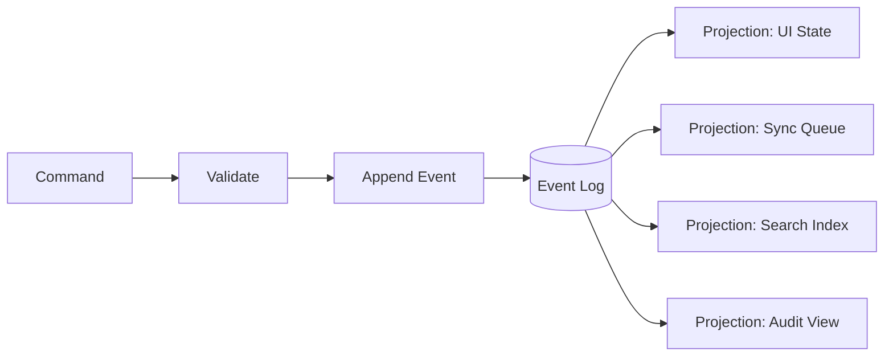
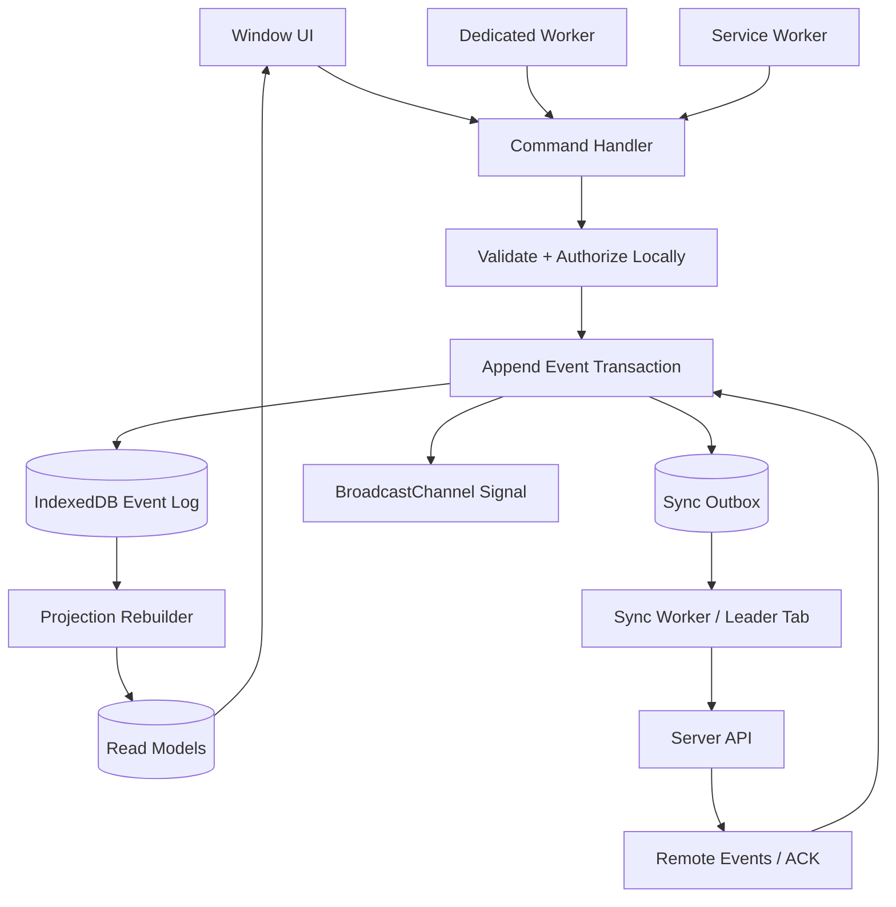
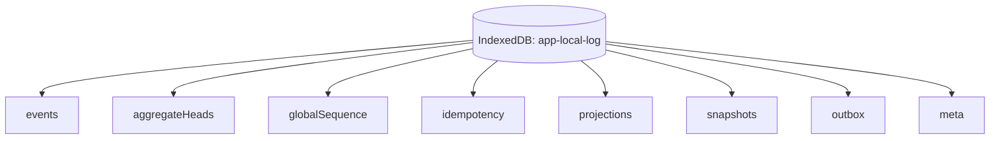
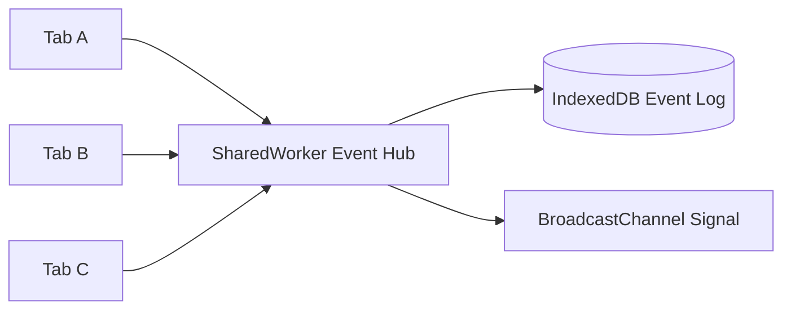
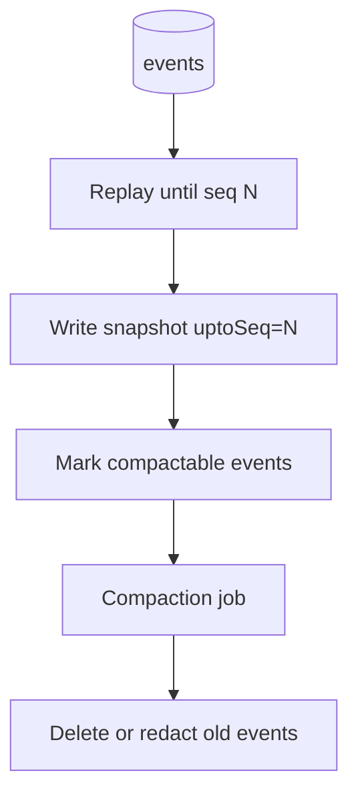
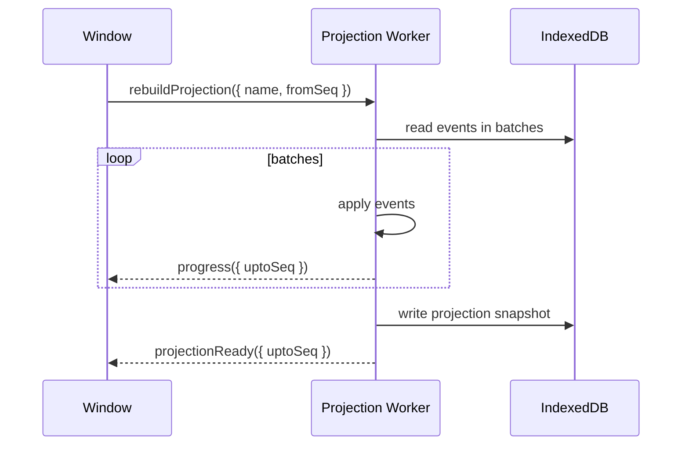

# Part 051 — Event Sourcing in the Browser

> Goal: design browser-local state as a recoverable event stream instead of a fragile pile of mutable objects scattered across tabs.

Most frontend state systems teach this shape:

```ts
state.case.status = "APPROVED";
state.case.updatedAt = Date.now();
render(state);
```

That is fine for transient UI.
It is weak for multi-tab orchestration.

In a serious browser application, several execution contexts may exist at the same time:

- tab A edits an object
- tab B receives a server push
- a Service Worker updates cache metadata
- a Dedicated Worker imports a large file
- a SharedWorker maintains presence
- the page is frozen, restored, or discarded
- another tab logs the user out
- offline work is replayed later

If every context mutates its own copy of state directly, the system becomes hard to reason about.
You get stale state, duplicate side effects, lost updates, broken recovery, and debugging sessions that depend on browser timing.

Event sourcing offers a different mental model.

Instead of saying:

> “What is the current state?”

Start with:

> “What happened, in what order, according to which authority, and how do we rebuild the current state from that history?”

This chapter does not sell event sourcing as a universal pattern.
It shows when it is useful inside the browser, how to implement it without pretending the browser is Kafka, and how to avoid the common trap: building an append-only mess with no compaction, no idempotency, no ownership, and no operational limits.

---

## 1. Event sourcing, reduced to the useful core

Event sourcing means the durable source of truth is an append-only sequence of facts.
State is derived by replaying those facts.



A command is an intent:

```ts
{
  type: "case.approve.requested",
  caseId: "CASE-123",
  reason: "all checks passed"
}
```

An event is a fact:

```ts
{
  eventId: "01J...",
  type: "case.approved",
  aggregateId: "case:CASE-123",
  aggregateSeq: 42,
  globalSeq: 9871,
  occurredAt: "2026-07-08T03:21:10.000Z",
  payload: {
    caseId: "CASE-123",
    approvedBy: "user:17",
    reason: "all checks passed"
  }
}
```

A projection is a derived read model:

```ts
{
  caseId: "CASE-123",
  status: "APPROVED",
  lastEventId: "01J...",
  lastSeq: 42
}
```

The power is not “append-only” by itself.
The power is this invariant:

> Every important state transition has a durable, ordered, replayable explanation.

For multi-tab browser systems, that explanation is often more valuable than the current state itself.

---

## 2. When browser-side event sourcing is worth it

Use browser-side event sourcing when at least one of these is true:

| Situation | Why event sourcing helps |
|---|---|
| Offline-first workflow | You need to remember local intent and replay it later. |
| Multi-step wizard | You need resumability, auditability, and recovery after reload. |
| Multi-tab session | You need deterministic reconciliation after stale tabs wake up. |
| Complex case management | You need explainable transitions, not just final state. |
| Background import/export | Workers emit progress/facts; UI projections can be rebuilt. |
| Conflict detection | You need to compare local history with remote history. |
| Long-running sync | You need idempotency and replay semantics. |
| Regulatory or audit-sensitive UI | You need a defensible local trail for user-visible operations. |

Do not use it for everything.

Avoid browser-side event sourcing when:

- state is purely visual and disposable
- state is tiny and short-lived
- there is no recovery requirement
- mutation order is irrelevant
- users never work offline
- you cannot define stable event schemas
- you cannot afford storage cleanup/compaction work

The browser is not your system of record.
A browser event log is usually a local operational log, not the final audit ledger.
Server-side authority still matters.

---

## 3. The browser-specific twist

Server-side event sourcing usually assumes a durable service process and a database.
Browser-side event sourcing has harsher constraints.

| Constraint | Browser reality |
|---|---|
| Process lifetime | Tabs/workers can close, freeze, crash, or be discarded. |
| Single writer | Multiple tabs may attempt writes. |
| Durable storage | IndexedDB can be blocked by version upgrades and affected by quota/eviction policy. |
| Ordering | Broadcast messages are not a durable ordered log. |
| Clock | Wall-clock timestamps are not safe ordering primitives. |
| Secret data | Local logs may persist sensitive payloads. |
| Migration | Old tabs can keep old code alive during rolling deploy. |
| Cleanup | No background daemon is guaranteed to run forever. |

So the browser version must be conservative:

1. append events durably before publishing signals
2. treat BroadcastChannel as notification only
3. use IndexedDB as the event log store
4. use Web Locks or an IndexedDB lease for write coordination when needed
5. use monotonic local sequence numbers for ordering
6. make events idempotent
7. compact aggressively enough to avoid unbounded local growth
8. revalidate with the server when the tab becomes active again

The browser can maintain a serious local log.
It cannot assume server-grade always-on durability.

---

## 4. Core architecture

A production browser event sourcing architecture separates five concerns.



Key rule:

> The event log is the durable fact store. BroadcastChannel is only the doorbell.

A tab that misses the doorbell can still query IndexedDB and catch up.
A worker that restarts can still replay from the last projection checkpoint.
A tab restored from bfcache can compare its last seen sequence with the log head.

---

## 5. Event schema design

A browser event should be explicit, versioned, scoped, and safe to store.

```ts
type BrowserEvent<TType extends string = string, TPayload = unknown> = {
  eventId: string;
  type: TType;
  schemaVersion: number;

  // Ordering.
  globalSeq: number;
  aggregateId: string;
  aggregateSeq: number;

  // Origin.
  actorId: string;
  tabId: string;
  connectionId: string;
  sessionId: string;
  tenantId?: string;

  // Time.
  occurredAt: string;     // wall-clock for humans
  monotonicMs?: number;   // diagnostic only, not durable ordering

  // Idempotency and causality.
  commandId?: string;
  causationId?: string;
  correlationId?: string;
  idempotencyKey?: string;

  // Data.
  payload: TPayload;

  // Operational metadata.
  localOnly?: boolean;
  syncStatus?: "pending" | "acked" | "rejected" | "compacted";
  redaction?: "none" | "payload-redacted" | "secret-free";
};
```

### 5.1 Event ID

Use a stable unique ID.
Good choices:

- UUID v4 for uniqueness
- ULID-style or UUIDv7-style IDs when sortable IDs are useful
- server-issued event IDs for authoritative remote events

Do not use `Date.now()` as the event ID.
Do not use array index.
Do not use only `aggregateSeq` globally.

### 5.2 Global sequence

The local event log needs a local monotonic sequence.
This is not a distributed consensus sequence.
It is a local ordering mechanism for one browser origin storage.

```ts
{
  globalSeq: 18742
}
```

Use it to answer:

- has this tab caught up?
- what events came after my checkpoint?
- which projection records are stale?
- which signals can be ignored?

### 5.3 Aggregate sequence

For domain entities, keep per-aggregate sequence.

```ts
{
  aggregateId: "case:CASE-123",
  aggregateSeq: 42
}
```

This lets you detect conflicts:

```ts
if (event.aggregateSeq !== current.aggregateSeq + 1) {
  throw new Error("aggregate sequence gap");
}
```

### 5.4 Command ID and idempotency key

Commands can be retried.
Events should not be duplicated because the user double-clicked, the tab retried, or a worker restarted.

```ts
const commandId = crypto.randomUUID();
const idempotencyKey = `approve-case:${caseId}:${commandId}`;
```

The event append transaction should reject or return the existing event if the same idempotency key already exists.

---

## 6. Event type taxonomy

Not every message is an event.
Do not log everything.

| Type | Durable? | Example |
|---|---:|---|
| Domain event | Yes | `case.statusChanged` |
| User intent event | Sometimes | `draft.saveRequested` |
| Sync event | Yes | `outbox.itemAcked` |
| Projection event | Usually no | `caseList.filtered` |
| UI event | Usually no | `modal.opened` |
| Presence event | Usually no/TTL | `tab.heartbeat` |
| Security event | Yes, carefully redacted | `session.revokedObserved` |
| Telemetry event | Separate store | `worker.taskTimedOut` |

A useful browser event log usually contains:

- local commands that must survive reload
- domain facts needed for offline projection
- sync state transitions
- conflict/rejection facts
- security/session transitions
- schema migration markers

It should not contain:

- mouse movement
- hover state
- raw access tokens
- unbounded debug logs
- large binary payloads inline
- high-frequency progress events without compaction

---

## 7. IndexedDB layout

A practical event sourcing store can use these object stores.



Suggested stores:

| Store | Purpose | Key |
|---|---|---|
| `events` | Append-only local facts | `globalSeq` |
| `eventsById` index | Find exact event | `eventId` |
| `eventsByAggregate` index | Replay one aggregate | `[aggregateId, aggregateSeq]` |
| `aggregateHeads` | Current aggregate sequence | `aggregateId` |
| `globalSequence` | Last local sequence | fixed key |
| `idempotency` | Dedupe commands | `idempotencyKey` |
| `projections` | Read models | projection-specific key |
| `snapshots` | Compaction checkpoints | `[projectionName, seq]` |
| `outbox` | Pending remote sync | `outboxId` |
| `meta` | schema/runtime metadata | string key |

IndexedDB gives transactions.
Use them.
A multi-store transaction is the difference between “event sourced” and “event-ish”.

---

## 8. Append transaction

Appending an event should be one atomic IndexedDB transaction over the relevant stores.

```ts
type AppendCommand<TPayload> = {
  type: string;
  aggregateId: string;
  expectedAggregateSeq?: number;
  payload: TPayload;
  actorId: string;
  sessionId: string;
  tenantId?: string;
  idempotencyKey?: string;
};
```

Pseudo-code:

```ts
async function appendEvent(cmd: AppendCommand<unknown>): Promise<BrowserEvent> {
  return withReadWriteTx(
    ["events", "aggregateHeads", "globalSequence", "idempotency", "outbox"],
    async tx => {
      if (cmd.idempotencyKey) {
        const existing = await tx.idempotency.get(cmd.idempotencyKey);
        if (existing) return await tx.events.get(existing.globalSeq);
      }

      const aggregateHead = await tx.aggregateHeads.get(cmd.aggregateId);
      const currentAggregateSeq = aggregateHead?.seq ?? 0;

      if (
        cmd.expectedAggregateSeq !== undefined &&
        cmd.expectedAggregateSeq !== currentAggregateSeq
      ) {
        throw new ConflictError({
          aggregateId: cmd.aggregateId,
          expected: cmd.expectedAggregateSeq,
          actual: currentAggregateSeq,
        });
      }

      const globalSeq = await nextGlobalSeq(tx);
      const aggregateSeq = currentAggregateSeq + 1;

      const event: BrowserEvent = {
        eventId: crypto.randomUUID(),
        type: cmd.type,
        schemaVersion: 1,
        globalSeq,
        aggregateId: cmd.aggregateId,
        aggregateSeq,
        actorId: cmd.actorId,
        tabId: runtime.tabId,
        connectionId: runtime.connectionId,
        sessionId: cmd.sessionId,
        tenantId: cmd.tenantId,
        occurredAt: new Date().toISOString(),
        idempotencyKey: cmd.idempotencyKey,
        payload: cmd.payload,
        syncStatus: "pending",
      };

      await tx.events.add(event);
      await tx.aggregateHeads.put({
        aggregateId: cmd.aggregateId,
        seq: aggregateSeq,
        globalSeq,
        eventId: event.eventId,
      });

      if (cmd.idempotencyKey) {
        await tx.idempotency.add({
          idempotencyKey: cmd.idempotencyKey,
          eventId: event.eventId,
          globalSeq,
          createdAt: event.occurredAt,
        });
      }

      await tx.outbox.add({
        outboxId: event.eventId,
        eventId: event.eventId,
        globalSeq,
        status: "pending",
        attempts: 0,
        nextAttemptAt: event.occurredAt,
      });

      return event;
    }
  );
}
```

Important details:

- allocate sequence inside the transaction
- update aggregate head inside the same transaction
- insert idempotency record inside the same transaction
- insert outbox item inside the same transaction when remote sync is required
- broadcast after the transaction commits, not before

```ts
const event = await appendEvent(cmd);
bus.publish({ type: "event-log.appended", fromSeq: event.globalSeq, toSeq: event.globalSeq });
```

If broadcast fails, the event is still durable.
Tabs can catch up later.

---

## 9. The projection loop

A projection transforms events into a read model.

```ts
type Projection<TState> = {
  name: string;
  initialState(): TState;
  apply(state: TState, event: BrowserEvent): TState;
};
```

Example:

```ts
const caseSummaryProjection: Projection<CaseSummaryState> = {
  name: "case-summary",

  initialState() {
    return { cases: new Map(), lastSeq: 0 };
  },

  apply(state, event) {
    switch (event.type) {
      case "case.created": {
        state.cases.set(event.payload.caseId, {
          caseId: event.payload.caseId,
          status: "DRAFT",
          title: event.payload.title,
          lastSeq: event.globalSeq,
        });
        return state;
      }

      case "case.statusChanged": {
        const row = state.cases.get(event.payload.caseId);
        if (row) {
          row.status = event.payload.status;
          row.lastSeq = event.globalSeq;
        }
        return state;
      }

      default:
        return state;
    }
  },
};
```

A projection runner should store its checkpoint.

```ts
type ProjectionCheckpoint = {
  projectionName: string;
  lastAppliedSeq: number;
  updatedAt: string;
};
```

Projection catch-up:

```ts
async function catchUpProjection(name: string) {
  const checkpoint = await loadCheckpoint(name);
  const events = await loadEventsAfter(checkpoint.lastAppliedSeq, { limit: 500 });

  let state = await loadProjectionState(name);

  for (const event of events) {
    state = projections[name].apply(state, event);
    checkpoint.lastAppliedSeq = event.globalSeq;
  }

  await saveProjectionStateAndCheckpoint(name, state, checkpoint);
}
```

Projection updates can run:

- in the tab
- in a Dedicated Worker
- in a SharedWorker
- lazily on query
- eagerly after event append
- in small batches to avoid UI blocking

For large projections, prefer a worker.
For small projections, a tab-local incremental reducer is often enough.

---

## 10. BroadcastChannel as projection invalidation signal

BroadcastChannel should not carry the whole event log.
It should carry a small invalidation signal.

```ts
type EventLogSignal = {
  type: "event-log.appended";
  logId: string;
  fromSeq: number;
  toSeq: number;
  senderTabId: string;
  sentAt: string;
};
```

Receiver:

```ts
bus.on("event-log.appended", async signal => {
  if (signal.logId !== currentLogId) return;
  if (signal.toSeq <= projection.lastAppliedSeq) return;

  await catchUpFrom(signal.fromSeq);
});
```

The signal says:

> “Something changed. Read the durable log.”

It does not say:

> “Here is the authoritative event.”

This is the same pattern as database notification systems: notify cheaply, read durably.

---

## 11. Ordering model

Inside one local browser event log, ordering can be simple.
Use `globalSeq`.

Across server and browser, ordering is not simple.

There are at least three sequences:

| Sequence | Authority | Meaning |
|---|---|---|
| `globalSeq` | browser local log | local ordering in this browser profile/storage partition |
| `aggregateSeq` | local or server aggregate | ordering per entity |
| `serverSeq` | backend | authoritative remote ordering |

Remote ACK may look like this:

```ts
{
  eventId: "local-01",
  serverEventId: "srv-991",
  serverSeq: 88210,
  aggregateId: "case:123",
  aggregateSeq: 43,
  status: "accepted"
}
```

Do not overwrite local event history blindly.
Append an ACK event.

```ts
{
  type: "sync.eventAccepted",
  aggregateId: "sync:local-01",
  payload: {
    localEventId: "local-01",
    serverEventId: "srv-991",
    serverSeq: 88210
  }
}
```

Rejected command:

```ts
{
  type: "sync.eventRejected",
  aggregateId: "sync:local-01",
  payload: {
    localEventId: "local-01",
    reason: "VERSION_CONFLICT",
    serverAggregateSeq: 44
  }
}
```

This preserves explainability.
A projection can then show:

- pending
- synced
- rejected
- conflict needs resolution

---

## 12. Command handling

A command handler converts intent into one or more events.

```ts
async function approveCase(command: ApproveCaseCommand) {
  const current = await caseProjection.get(command.caseId);

  if (!current) throw new Error("case not found");
  if (current.status !== "READY_FOR_APPROVAL") {
    throw new Error("case is not approvable");
  }

  return appendEvent({
    type: "case.approvalRequested",
    aggregateId: `case:${command.caseId}`,
    expectedAggregateSeq: current.aggregateSeq,
    actorId: command.actorId,
    sessionId: command.sessionId,
    tenantId: command.tenantId,
    idempotencyKey: command.idempotencyKey,
    payload: {
      caseId: command.caseId,
      reason: command.reason,
      clientObservedStatus: current.status,
    },
  });
}
```

Command validation should be divided:

| Validation | Browser can do? | Server must do? |
|---|---:|---:|
| Shape/schema | Yes | Yes |
| Local UI invariant | Yes | Yes |
| Authorization | Partial | Yes |
| Business rule authority | Partial | Yes |
| Concurrency/conflict | Partial | Yes |
| Side-effect permission | No | Yes |

Browser-side event sourcing does not remove server validation.
It makes local behavior recoverable and explainable.

---

## 13. Multi-tab writers

If two tabs append events concurrently, you need coordination.

### Option A: IndexedDB transaction as coordinator

For many cases, a single readwrite transaction over `globalSequence`, `events`, and `aggregateHeads` is enough.
The browser serializes conflicting transactions at the storage layer.

This is simple and usually sufficient for local append.

### Option B: Web Locks around append

Use Web Locks when you need a broader critical section:

- append event
- update OPFS payload metadata
- update Cache manifest
- publish signal
- run a short ownership-bound side effect

```ts
await navigator.locks.request("event-log:append", async () => {
  const event = await appendEvent(cmd);
  bus.publish(toSignal(event));
});
```

Keep the lock short.
Do not hold it while doing network I/O unless that is explicitly the resource you are locking.

### Option C: single writer hub

A SharedWorker can centralize writes.



This simplifies ordering while the hub is alive.
But it introduces fallback and lifecycle concerns.
SharedWorker availability is not universal in all environments, and the hub can still terminate.

Preferred default:

> Use IndexedDB transactions for append correctness, Web Locks for named resource ownership, and BroadcastChannel for invalidation.

---

## 14. Snapshotting and compaction

An infinite local event log is a bug.

You need snapshots.

```ts
type Snapshot<T> = {
  projectionName: string;
  snapshotId: string;
  uptoSeq: number;
  createdAt: string;
  state: T;
  schemaVersion: number;
};
```

Snapshot flow:



Compaction policy examples:

| Data | Policy |
|---|---|
| security/session events | keep minimal redacted markers |
| offline commands pending sync | keep until ACK/rejection + retention window |
| imported-file progress events | compact aggressively |
| domain draft events | compact after final server persistence |
| telemetry | separate retention, not main event log |
| large payload references | keep metadata, delete unused OPFS blobs |

Compaction must respect sync status.
Do not delete events that have not been acknowledged or resolved.

---

## 15. Large payloads

Do not store large binary payloads directly inside events.

Bad:

```ts
{
  type: "file.imported",
  payload: {
    fileBytes: hugeArrayBuffer
  }
}
```

Better:

```ts
{
  type: "file.importStaged",
  payload: {
    objectRef: "opfs://imports/2026/07/08/import-123.bin",
    sizeBytes: 9812312,
    sha256: "...",
    contentType: "text/csv"
  }
}
```

Event log stores metadata.
OPFS stores bytes.
Cache API stores HTTP-shaped artifacts.
IndexedDB can store structured objects, but large values still increase clone, memory, quota, and migration cost.

Use this split:

| Data kind | Store |
|---|---|
| event metadata | IndexedDB `events` |
| projection state | IndexedDB `projections` |
| binary working files | OPFS |
| HTTP response artifacts | Cache API |
| temporary per-tab UI state | memory/sessionStorage |
| volatile signal | BroadcastChannel |

---

## 16. Conflict model

Browser-side event sourcing makes conflicts explicit.

Example:

1. tab A loads case seq 10
2. tab B changes case to seq 11
3. tab A, still stale, tries to approve based on seq 10
4. append handler sees current aggregate head seq 11
5. append is rejected locally or recorded as conflict intent

Two strategies:

### Reject before append

```ts
if (expectedSeq !== actualSeq) {
  throw new ConflictError();
}
```

Use this when stale action should not be recorded.

### Append conflict fact

```ts
{
  type: "case.approvalRejectedLocally",
  aggregateId: "case:123",
  payload: {
    reason: "STALE_VERSION",
    expectedSeq: 10,
    actualSeq: 11
  }
}
```

Use this when the UI needs explainability or user-visible recovery.

Server conflict should also be appended as a fact:

```ts
{
  type: "case.approvalRejectedByServer",
  payload: {
    localEventId: "...",
    serverReason: "POLICY_CHANGED",
    serverSeq: 45
  }
}
```

---

## 17. Security and privacy

A local event log is dangerous if treated casually.

Never store:

- access tokens
- refresh tokens
- raw password fields
- one-time codes
- private keys
- unnecessary PII
- unredacted server error dumps
- entire downloaded documents unless required and protected by retention policy

Prefer events like:

```ts
{
  type: "session.revokedObserved",
  payload: {
    reasonCode: "SERVER_REVOKED",
    observedAt: "..."
  }
}
```

not:

```ts
{
  type: "session.revokedObserved",
  payload: {
    oldAccessToken: "...",
    responseBody: "..."
  }
}
```

For regulated domains, define a redaction policy per event type.

```ts
type EventRetentionPolicy = {
  eventType: string;
  containsPii: boolean;
  containsSecrets: false;
  retentionDays: number;
  compactPayloadAfterSync: boolean;
  allowedInTelemetry: boolean;
};
```

A production event log must be intentionally boring from a secrets perspective.

---

## 18. Schema evolution

Events are durable.
That means old events will meet new code.

Use `schemaVersion`.

```ts
switch (event.type) {
  case "case.statusChanged": {
    if (event.schemaVersion === 1) return applyV1(state, event);
    if (event.schemaVersion === 2) return applyV2(state, event);
    return handleUnknownEvent(state, event);
  }
}
```

Do not mutate historical events unless doing a deliberate migration.

Safer strategies:

1. reader upcasting: convert old event to current in memory
2. projection rebuild: keep event history and rebuild read model
3. migration event: append fact that changes interpretation
4. snapshot refresh: rebuild snapshot with new schema
5. payload redaction: delete sensitive payload after retention while keeping marker

Example upcaster:

```ts
function upcast(event: BrowserEvent): BrowserEvent {
  if (event.type === "case.statusChanged" && event.schemaVersion === 1) {
    return {
      ...event,
      schemaVersion: 2,
      payload: {
        ...event.payload,
        changedBy: event.actorId,
      },
    };
  }

  return event;
}
```

Version skew across tabs means old code and new code may run simultaneously.
Design event types to be forwards-compatible:

- ignore unknown fields
- reject unknown critical event types safely
- include protocol/schema version
- keep old readers working during rollout window
- use feature flags for new event writers

---

## 19. Worker-based projection rebuild

Rebuilding a projection can be CPU-heavy.
Use a Dedicated Worker when:

- event count is large
- projection requires indexing/search
- payload transformation is expensive
- UI must remain responsive



Batch the replay:

```ts
while (true) {
  const events = await loadEventsAfter(lastSeq, { limit: 500 });
  if (events.length === 0) break;

  for (const event of events) {
    state = projection.apply(state, upcast(event));
    lastSeq = event.globalSeq;
  }

  await maybeYield();
  reportProgress(lastSeq);
}
```

Do not post every applied event to the UI.
Progress should be throttled.

---

## 20. Observability

Event sourcing helps observability if you expose the right metadata.

Track:

| Metric | Why it matters |
|---|---|
| log head seq | current local progress |
| projection checkpoint seq | projection lag |
| append duration | IndexedDB pressure |
| transaction abort count | concurrency/schema issue |
| conflict count | stale UI or sync contention |
| outbox pending count | offline/sync health |
| compaction lag | storage growth risk |
| unknown event count | version skew |
| replay duration | startup performance |
| snapshot age | recovery cost |

Debug panel idea:

```txt
Event Log
---------
headSeq:                 18,492
oldestSeq:               12,000
pendingOutbox:           7
lastCompactionAt:         2026-07-08T01:20:00Z

Projection: case-summary
------------------------
lastAppliedSeq:           18,470
lag:                      22
lastRebuildMs:            183
unknownEvents:            0

Runtime
-------
tabId:                    tab-7
connectionId:             conn-13
eventWriter:              indexeddb-tx
signalBus:                broadcastchannel
```

When debugging a multi-tab race, this view is often more valuable than console logs.

---

## 21. Testing strategy

Test event sourcing at four levels.

### 21.1 Reducer tests

```ts
it("applies case.statusChanged", () => {
  const state = projection.initialState();
  const next = projection.apply(state, event("case.statusChanged", {
    caseId: "123",
    status: "APPROVED",
  }));

  expect(next.cases.get("123")?.status).toBe("APPROVED");
});
```

### 21.2 Append transaction tests

- duplicate idempotency key
- aggregate seq mismatch
- transaction abort
- outbox insert failure
- schema validation failure

### 21.3 Multi-tab tests

With Playwright or equivalent:

- open two tabs
- append in tab A
- tab B catches up from signal
- freeze/simulate background tab behavior where possible
- close tab during append
- reload after append before broadcast
- create conflicting command from stale tab

### 21.4 Recovery tests

- delete projection, rebuild from events
- corrupt/unknown event type
- migrate schema version
- compact old events
- restore after bfcache
- resume after Service Worker update

Event-sourced code that cannot replay is not event-sourced.
It is just event-shaped logging.

---

## 22. Failure matrix

| Failure | Expected behavior |
|---|---|
| Tab crashes after append before broadcast | Other tabs catch up on visibility/focus/poll/query. |
| Broadcast message lost | Durable log remains authoritative. |
| Projection worker crashes | Restart and replay from checkpoint. |
| Duplicate command | Idempotency store returns existing event. |
| IndexedDB transaction aborts | No partial event/outbox/head update committed. |
| Old tab writes unknown event | New code validates or quarantines by schema version. |
| New tab writes event old tab cannot read | Old tab ignores non-critical event or forces reload. |
| Quota error | Stop admitting large events, compact, surface recovery UI. |
| Server rejects local event | Append rejection/compensation event. |
| User logs out | Stop writers, append redacted revocation marker, cleanup sensitive stores. |

---

## 23. Anti-patterns

### Anti-pattern: broadcast full events as truth

```ts
channel.postMessage({ type: "case.approved", payload: hugePayload });
```

Problem:

- lost messages lose facts
- large payload duplication
- stale tabs miss history
- no replay

Better:

```ts
channel.postMessage({ type: "event-log.appended", fromSeq, toSeq });
```

### Anti-pattern: no idempotency

```ts
await appendEvent({ type: "payment.submitted", payload });
await appendEvent({ type: "payment.submitted", payload });
```

Better:

```ts
await appendEvent({
  type: "payment.submitted",
  idempotencyKey: `payment:${paymentDraftId}:submit`,
  payload,
});
```

### Anti-pattern: event log as garbage dump

Do not store every UI interaction forever.
A local log needs retention and meaning.

### Anti-pattern: server authority ignored

Browser event sourcing is not a permission system.
The server still decides authoritative acceptance.

### Anti-pattern: no compaction

Append-only without compaction eventually becomes operational debt.

---

## 24. Minimal reference implementation shape

```ts
class BrowserEventStore {
  constructor(
    private readonly db: EventDb,
    private readonly bus: EventSignalBus,
  ) {}

  async append(cmd: AppendCommand<unknown>): Promise<BrowserEvent> {
    const event = await this.db.transaction(
      ["events", "aggregateHeads", "globalSequence", "idempotency", "outbox"],
      "readwrite",
      tx => appendEventInTx(tx, cmd),
    );

    this.bus.publish({
      type: "event-log.appended",
      logId: "default",
      fromSeq: event.globalSeq,
      toSeq: event.globalSeq,
      senderTabId: runtime.tabId,
      sentAt: new Date().toISOString(),
    });

    return event;
  }

  async readAfter(seq: number, limit = 500): Promise<BrowserEvent[]> {
    return this.db.eventsAfter(seq, limit);
  }

  async head(): Promise<number> {
    return this.db.currentGlobalSeq();
  }
}
```

Projection subscriber:

```ts
class ProjectionRuntime {
  private running = false;

  constructor(
    private readonly store: BrowserEventStore,
    private readonly projection: Projection<unknown>,
  ) {}

  async catchUp(): Promise<void> {
    if (this.running) return;
    this.running = true;

    try {
      let checkpoint = await loadCheckpoint(this.projection.name);

      while (true) {
        const events = await this.store.readAfter(checkpoint.lastAppliedSeq, 250);
        if (events.length === 0) break;

        await applyAndPersistBatch(this.projection, events, checkpoint);
        checkpoint = await loadCheckpoint(this.projection.name);
      }
    } finally {
      this.running = false;
    }
  }
}
```

---

## 25. Production checklist

Before using browser-side event sourcing in production, answer these questions:

- What event types are durable?
- Which event types are local-only?
- Which events sync to the server?
- What is the idempotency key for each command?
- What is the aggregate boundary?
- What sequence numbers exist?
- Which store owns the bytes?
- What is the compaction policy?
- What is the redaction policy?
- What happens when quota is exceeded?
- What happens when an old tab sees a new event type?
- What happens when a new tab sees an old event schema?
- How does a restored tab catch up?
- How does logout stop writers and cleanup local facts?
- How do projections rebuild from scratch?
- How do you observe projection lag?
- How do you test duplicate append and stale command conflict?

If these answers are unclear, event sourcing will make the application more complicated without making it more reliable.

---

## 26. Final mental model

Browser-side event sourcing is not about copying a backend architecture into the frontend.
It is about giving the browser a small, disciplined local history.

The browser cannot guarantee always-on execution.
It can keep durable local facts.

The browser cannot make BroadcastChannel reliable.
It can use BroadcastChannel as an invalidation signal.

The browser cannot make stale tabs disappear.
It can require every restored tab to catch up from a sequence.

The browser cannot make offline writes magically correct.
It can preserve intent, replay it idempotently, and record acceptance or rejection.

The invariant is simple:

> If a state transition matters, it should be represented as a fact that can be replayed, rejected, compacted, or explained.

That is the reason to use event sourcing in the browser.

---

## References

- MDN — IndexedDB API: https://developer.mozilla.org/en-US/docs/Web/API/IndexedDB_API
- MDN — IDBTransaction: https://developer.mozilla.org/en-US/docs/Web/API/IDBTransaction
- MDN — Broadcast Channel API: https://developer.mozilla.org/en-US/docs/Web/API/Broadcast_Channel_API
- MDN — Web Locks API: https://developer.mozilla.org/en-US/docs/Web/API/Web_Locks_API
- Chrome Developers — Page Lifecycle API: https://developer.chrome.com/docs/web-platform/page-lifecycle-api
