# Part 052 — Client-Side Write-Ahead Log

> Goal: build a browser-local write-ahead log that makes important client-side mutations recoverable after crashes, reloads, worker restarts, tab races, and partial side effects.

A write-ahead log, or WAL, is a simple idea:

> Before mutating important state, first record the intent durably.

Databases use WALs to recover after crashes.
Browser applications can use the same principle at a smaller scale.

The browser version is not a database engine.
It is a reliability pattern for local workflows such as:

- offline mutation queue
- multi-step form save
- staged file import
- Cache API manifest promotion
- OPFS blob write
- IndexedDB projection update
- auth/session cleanup transaction
- background sync replay
- Service Worker cache update
- cross-tab single-flight result handoff

The problem is not that IndexedDB transactions are useless.
They are useful.
The problem is that real browser workflows often span more than one operation boundary:

```txt
write IndexedDB row
write OPFS file
update Cache API response
send network request
broadcast signal
update projection
```

No browser API gives you a single atomic transaction across all of those.
A client-side WAL gives you a recovery protocol.

---

## 1. WAL mental model

A WAL separates three things:

1. intent
2. application of intent
3. completion marker

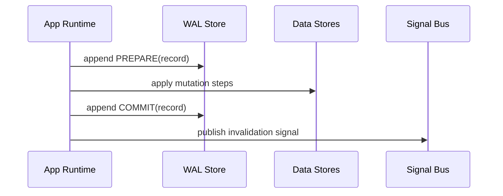

If the tab crashes after `PREPARE` but before `COMMIT`, recovery can inspect the WAL and decide what to do.

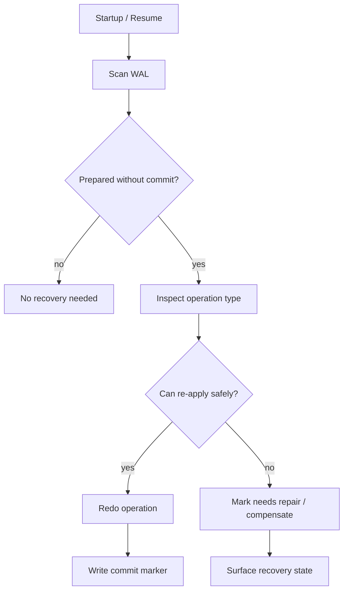

The WAL does not remove failure.
It turns hidden partial failure into an explicit state.

---

## 2. WAL vs event log vs outbox

These terms overlap but are not the same.

| Pattern | Main question | Typical content |
|---|---|---|
| Event log | What happened? | Domain facts and state transitions |
| Outbox | What must be sent? | Pending server sync items |
| WAL | What local mutation is in progress? | Prepare/apply/commit records for recovery |

A single implementation can share storage.
But the mental model should stay separate.

Example: offline case approval.

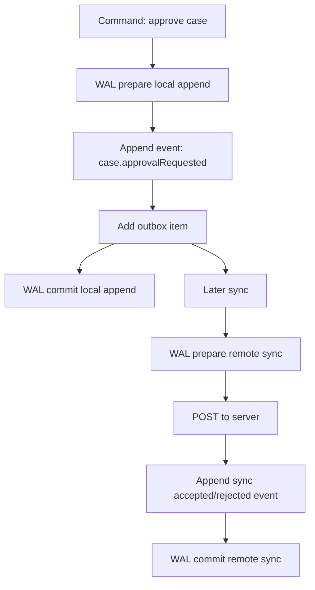

The event log explains domain state.
The outbox tracks remote delivery.
The WAL protects multi-step local mutation.

---

## 3. Browser-specific WAL constraints

A browser WAL must be designed around these realities:

| Constraint | Consequence |
|---|---|
| Tabs can close anytime | Recovery must happen on next startup/resume. |
| Workers can terminate | Worker tasks need durable step markers. |
| Broadcast can be missed | WAL completion cannot depend on broadcast delivery. |
| IndexedDB has transactions, but not across OPFS/Cache/network | WAL protects cross-store workflows. |
| Page may freeze | Do not require cleanup callbacks. |
| Multiple tabs may recover simultaneously | Recovery must be coordinated or idempotent. |
| Storage quota exists | WAL must be compacted. |
| Old code may run | WAL records need schema versioning. |

A browser WAL should prefer redo over rollback.

Rollback is hard because external side effects may already have happened.
Redo is safe if the operation is idempotent.

---

## 4. WAL record schema

A WAL record should be explicit enough for recovery without requiring the original in-memory context.

```ts
type WalRecord = {
  walId: string;
  operationId: string;
  operationType: string;
  schemaVersion: number;

  phase: "prepare" | "step" | "commit" | "abort" | "repair-required";
  step?: string;

  status: "open" | "committed" | "aborted" | "repair-required";

  actorId?: string;
  tabId: string;
  connectionId: string;
  sessionId?: string;
  tenantId?: string;

  idempotencyKey?: string;
  fencingToken?: string;

  createdAt: string;
  updatedAt: string;
  deadlineAt?: string;

  payloadRef?: string;
  payload?: unknown;

  error?: {
    name: string;
    message: string;
    code?: string;
    retryable?: boolean;
  };
};
```

Important fields:

| Field | Purpose |
|---|---|
| `walId` | Unique record ID. |
| `operationId` | Groups all records for one logical operation. |
| `operationType` | Recovery strategy selector. |
| `phase` | What part of the operation this record represents. |
| `status` | Whether the operation is still open. |
| `idempotencyKey` | Prevents duplicate external or local effects. |
| `fencingToken` | Prevents stale owner from committing after leadership changed. |
| `payloadRef` | Points to OPFS/Cache/IndexedDB payload instead of embedding large bytes. |

Use small WAL records.
Large payloads belong in OPFS, Cache API, or a dedicated IndexedDB store referenced by ID.

---

## 5. WAL store layout in IndexedDB

Suggested stores:

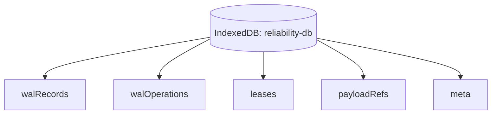

Object stores:

| Store | Key | Purpose |
|---|---|---|
| `walRecords` | `walId` | Append-ish records for operation phases. |
| `walOperations` | `operationId` | Current operation status/head. |
| `payloadRefs` | `payloadId` | Metadata for OPFS/Cache/large values. |
| `leases` | `resourceId` | Fallback recovery ownership if Web Locks unavailable. |
| `meta` | string | schema, runtime, compaction metadata. |

Useful indexes:

| Index | Query |
|---|---|
| `byOperation` | all records for operation |
| `byStatus` | open/repair operations |
| `byTypeStatus` | recovery by operation type |
| `byCreatedAt` | compaction and stale detection |
| `byDeadline` | expired operation detection |
| `byIdempotencyKey` | duplicate prevention |

---

## 6. Minimal WAL API

A clean WAL API looks like this:

```ts
type BeginWalInput = {
  operationType: string;
  operationId?: string;
  idempotencyKey?: string;
  fencingToken?: string;
  payload?: unknown;
  payloadRef?: string;
  deadlineAt?: string;
};

type WalHandle = {
  operationId: string;
  appendStep(step: string, payload?: unknown): Promise<void>;
  commit(payload?: unknown): Promise<void>;
  abort(error: unknown): Promise<void>;
  markRepairRequired(error: unknown): Promise<void>;
};
```

Usage:

```ts
const wal = await walStore.begin({
  operationType: "case-local-append",
  idempotencyKey: `case:${caseId}:approve:${commandId}`,
  payload: { caseId, commandId },
});

try {
  await appendEventAndOutboxItem(command);
  await wal.appendStep("event-and-outbox-written", { caseId });

  await updateProjectionHint(caseId);
  await wal.appendStep("projection-hint-written");

  await wal.commit();
  eventBus.publish({ type: "event-log.appended", fromSeq, toSeq });
} catch (err) {
  await wal.abort(err);
  throw err;
}
```

This is not enough for every operation.
But it creates a consistent shape.

---

## 7. Atomicity inside IndexedDB

If the entire workflow fits inside one IndexedDB transaction, use the transaction first.
Do not add WAL complexity unnecessarily.

Good transaction-only workflow:

```ts
await tx(["events", "aggregateHeads", "outbox"], "readwrite", async tx => {
  await tx.events.add(event);
  await tx.aggregateHeads.put(head);
  await tx.outbox.add(outboxItem);
});
```

No WAL needed if:

- all writes are in the same IndexedDB database
- all writes are in one transaction
- no external side effect occurs in the middle
- failure means transaction aborts cleanly

Use WAL when:

- operation crosses IndexedDB + OPFS
- operation crosses IndexedDB + Cache API
- operation crosses local write + network call
- operation has long-running worker steps
- operation must resume after restart
- operation has external side effects
- operation must be observable during recovery

A WAL is not a replacement for transactions.
It is what you use when transactions stop at the API boundary.

---

## 8. Operation pattern: OPFS staged write + IndexedDB metadata

Example: a worker imports a large CSV file into OPFS and registers metadata in IndexedDB.

Desired invariant:

> Metadata should not point to a missing or incomplete file.

Workflow:

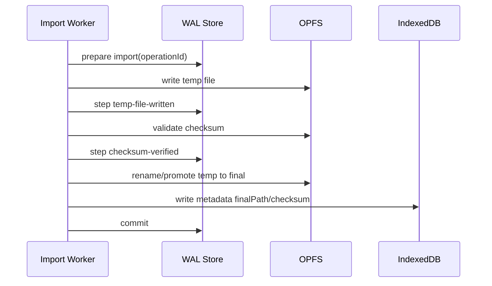

Recovery states:

| Last WAL phase | Recovery action |
|---|---|
| prepare only | delete temp if exists, mark aborted or retry |
| temp-file-written | verify file/checksum, continue or cleanup |
| checksum-verified | promote if final missing, else verify metadata |
| metadata-written but no commit | verify final file + metadata, then commit |
| commit | no recovery needed |

Pseudo-code:

```ts
async function recoverImport(op: WalOperation) {
  const records = await wal.recordsFor(op.operationId);
  const last = lastRecord(records);

  switch (last.step) {
    case undefined:
      await cleanupTemp(op.operationId);
      return wal.abortOperation(op.operationId, "no progress before crash");

    case "temp-file-written":
      if (await checksumMatches(op.payloadRef)) {
        return continueImportFromChecksum(op);
      }
      await cleanupTemp(op.operationId);
      return wal.markRepairRequired(op.operationId, "temp checksum mismatch");

    case "metadata-written":
      if (await finalFileAndMetadataMatch(op)) {
        return wal.commitOperation(op.operationId);
      }
      return wal.markRepairRequired(op.operationId, "metadata/file mismatch");

    default:
      return wal.markRepairRequired(op.operationId, "unknown import step");
  }
}
```

The WAL makes recovery local and deterministic.

---

## 9. Operation pattern: Cache manifest promotion

Problem:

You want to update a set of cached artifacts.
You do not want tabs to see a half-promoted cache version.

Use a manifest with WAL.

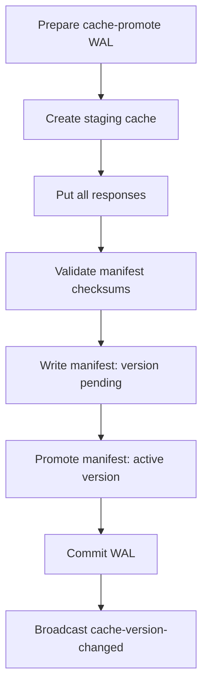

Recovery:

| Failure point | Recovery |
|---|---|
| staging cache created, incomplete | delete staging cache |
| staging complete, manifest not pending | resume manifest write or delete staging |
| pending manifest exists | validate and promote or rollback |
| active manifest promoted, WAL not committed | commit WAL and broadcast later |

Do not let readers choose “latest cache name by sorting names”.
Readers should read the manifest.

```ts
type CacheManifest = {
  activeVersion: string;
  previousVersion?: string;
  status: "active" | "promoting" | "rollback";
  updatedAt: string;
  artifacts: Array<{
    requestUrl: string;
    cacheName: string;
    integrity?: string;
  }>;
};
```

The manifest is the authority.
Cache names are storage implementation details.

---

## 10. Operation pattern: offline outbox send

Sending an outbox item has external side effects.
A crash can happen after the server accepted the request but before the browser records the ACK.

The only safe answer is idempotency.

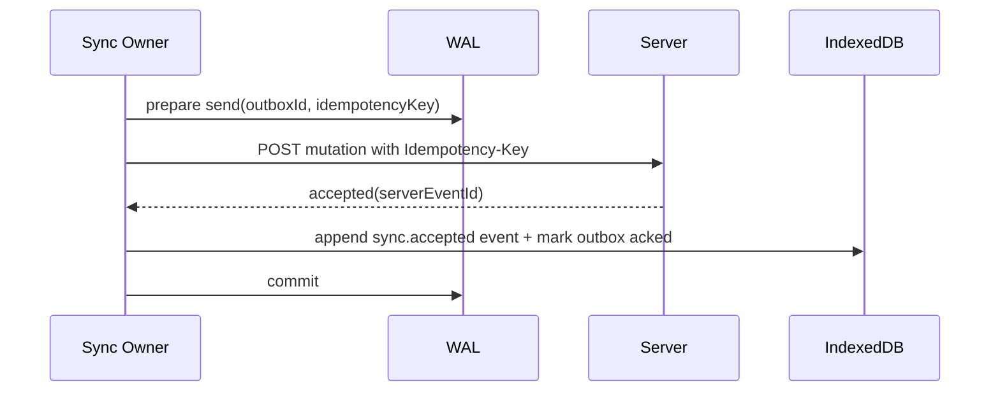

If crash occurs after server accepted but before local ACK:

1. recovery sees open WAL send
2. retry sends same idempotency key
3. server returns same result or current status
4. browser records ACK
5. WAL commits

Without server idempotency, the browser cannot make this safe.
It can only reduce damage.

---

## 11. WAL recovery ownership

Multiple tabs may try to recover the same WAL records.
Use ownership.

Preferred:

```ts
await navigator.locks.request("wal:recovery", async () => {
  await recoverOpenOperations();
});
```

If Web Locks is unavailable, use an IndexedDB lease.

```ts
type Lease = {
  resourceId: string;
  ownerId: string;
  fencingToken: number;
  expiresAt: string;
};
```

Acquisition:

```ts
async function acquireRecoveryLease(now: number): Promise<Lease | null> {
  return tx(["leases"], "readwrite", async tx => {
    const lease = await tx.leases.get("wal:recovery");

    if (lease && Date.parse(lease.expiresAt) > now) {
      return null;
    }

    const next: Lease = {
      resourceId: "wal:recovery",
      ownerId: runtime.connectionId,
      fencingToken: (lease?.fencingToken ?? 0) + 1,
      expiresAt: new Date(now + 15_000).toISOString(),
    };

    await tx.leases.put(next);
    return next;
  });
}
```

Every recovery commit should verify the fencing token when possible.

Stale recovery owners must not finalize operations after lease loss.

---

## 12. Startup recovery flow

Run recovery at controlled times:

- app startup after DB open
- tab visible/focus after being hidden
- Service Worker activation, if relevant
- leader election acquisition
- before starting sync flush
- after schema migration

Flow:

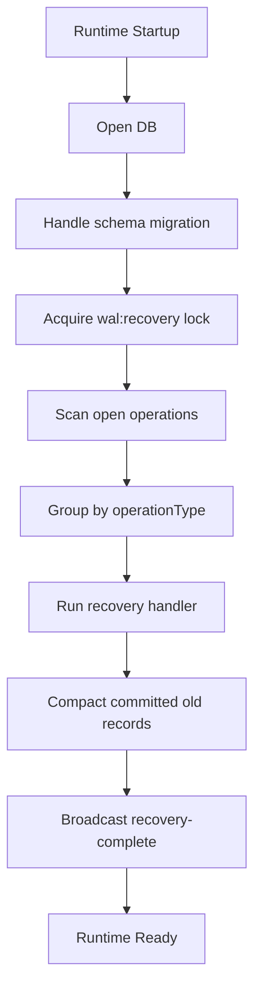

A runtime should not declare itself fully ready until critical WAL recovery has run.

```ts
async function boot() {
  await openDatabase();
  await runCriticalRecovery();
  await startProjectionRuntime();
  await startUserInterface();
}
```

Some recovery can be non-critical and continue later.
For example, cleaning old staging cache can be delayed.
Session revocation cleanup should not be delayed.

---

## 13. Recovery handler registry

Each operation type needs a recovery handler.

```ts
type RecoveryHandler = {
  operationType: string;
  recover(operation: WalOperation, records: WalRecord[]): Promise<void>;
};
```

Registry:

```ts
const recoveryHandlers: Record<string, RecoveryHandler> = {
  "opfs-import": opfsImportRecovery,
  "cache-promote": cachePromoteRecovery,
  "outbox-send": outboxSendRecovery,
  "session-logout": sessionLogoutRecovery,
  "projection-rebuild": projectionRebuildRecovery,
};
```

Unknown operation type:

```ts
await wal.markRepairRequired(operation.operationId, {
  name: "UnknownWalOperation",
  message: `No recovery handler for ${operation.operationType}`,
  retryable: false,
});
```

Do not silently ignore unknown open WAL records.
That is how local state corruption becomes invisible.

---

## 14. Idempotent local steps

Design every WAL-protected step to be idempotent.

| Step | Idempotent design |
|---|---|
| Write OPFS temp file | deterministic temp path per operation ID |
| Promote OPFS file | if final exists, verify checksum |
| Write IndexedDB metadata | upsert with expected operation ID |
| Insert event | idempotency key returns existing event |
| Add Cache entry | same request key and integrity metadata |
| Mark outbox acked | idempotent status transition |
| Broadcast signal | safe to send multiple times |
| Cleanup temp | ignore missing temp file |

Example:

```ts
async function promoteFile(op: ImportOperation) {
  if (await exists(op.finalPath)) {
    if (await checksum(op.finalPath) === op.expectedSha256) return;
    throw new Error("final path exists with wrong checksum");
  }

  await rename(op.tempPath, op.finalPath);
}
```

Idempotency turns crash recovery from guesswork into engineering.

---

## 15. WAL status state machine

A WAL operation should have a small state machine.

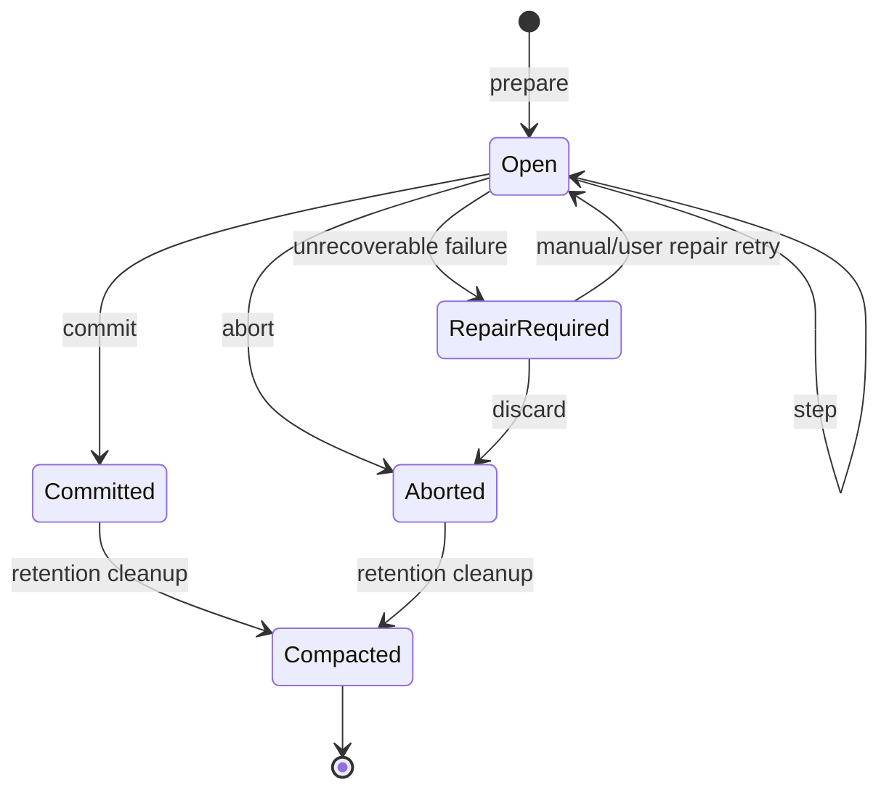

Invalid transitions should be rejected.

```ts
function assertTransition(from: WalStatus, to: WalStatus) {
  const allowed = new Set([
    "open->committed",
    "open->aborted",
    "open->repair-required",
    "repair-required->open",
    "repair-required->aborted",
    "committed->compacted",
    "aborted->compacted",
  ]);

  if (!allowed.has(`${from}->${to}`)) {
    throw new Error(`invalid WAL transition ${from} -> ${to}`);
  }
}
```

A WAL with free-form statuses becomes another unreliable state store.

---

## 16. Deadlines and stale operations

Every open WAL operation should eventually be classified.

```ts
type WalDeadlinePolicy = {
  operationType: string;
  softDeadlineMs: number;
  hardDeadlineMs: number;
  onSoftDeadline: "warn" | "retry" | "recover";
  onHardDeadline: "repair-required" | "abort" | "force-recover";
};
```

Example policies:

| Operation | Soft deadline | Hard deadline | Hard action |
|---|---:|---:|---|
| OPFS import | 1 min | 30 min | repair-required |
| Cache promote | 30 sec | 5 min | rollback or repair |
| Outbox send | 30 sec | 24 hr | keep pending, no repair if offline |
| Session logout cleanup | 5 sec | 30 sec | force cleanup again |
| Projection rebuild | 10 sec | 5 min | restart rebuild |

Do not mark offline outbox sends as corrupt just because the user stayed offline.
Deadline policy must reflect operation semantics.

---

## 17. WAL and Service Worker

Service Workers can participate in WAL-protected workflows, but do not assume they are always running.

Use Service Worker WAL for:

- cache promotion
- background sync attempt markers
- push handling dedupe
- notification click routing markers
- offline request replay coordination

Caveats:

- Service Worker can be terminated when idle
- long async work must be tied to extendable events correctly
- clients may be uncontrolled on first load
- multiple service worker versions can exist during update lifecycle
- IndexedDB connections can be blocked by old clients

A Service Worker recovery handler should be short and idempotent.

```ts
self.addEventListener("activate", event => {
  event.waitUntil((async () => {
    await claimIfPolicyAllows();
    await recoverServiceWorkerWalOperations();
  })());
});
```

Do not rely only on Service Worker activation for recovery.
The window runtime should also recover critical operations.

---

## 18. WAL and Dedicated Workers

Dedicated Workers are useful for long-running WAL-protected operations.

Pattern:

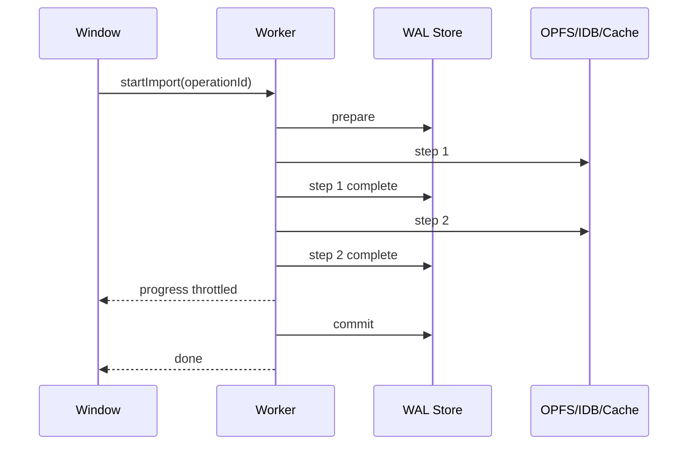

If the worker crashes, the UI can restart it and ask recovery to continue from the WAL.

Worker messages should include `operationId`.

```ts
type WorkerTask = {
  taskId: string;
  operationId: string;
  type: "import-file";
  payloadRef: string;
};
```

Do not use worker memory as the only source of progress.
Progress that matters must be durable.

---

## 19. WAL and page lifecycle

Page lifecycle events are best-effort signals, not reliable commit hooks.

Bad:

```ts
window.addEventListener("beforeunload", async () => {
  await finishCriticalMutation();
});
```

Better:

```ts
await wal.begin(...);
await doRecoverableSteps();
await wal.commit();
```

Use lifecycle events to trigger recovery/catch-up, not to guarantee cleanup.

```ts
document.addEventListener("visibilitychange", () => {
  if (document.visibilityState === "visible") {
    void recoverOpenWalOperations();
  }
});
```

When page becomes hidden, stop admitting risky new long operations unless they are designed to recover.

---

## 20. Compaction

A WAL is operational metadata.
It should not grow forever.

Compaction policy:

| WAL status | Suggested retention |
|---|---|
| open | keep until recovered/classified |
| committed | short retention, e.g. hours/days for debugging |
| aborted | short retention if harmless, longer if user-visible |
| repair-required | keep until resolved/manual cleanup |
| compacted | remove records and maybe keep summary marker |

Compaction job:

```ts
async function compactWal(now: Date) {
  await withRecoveryLock(async () => {
    const candidates = await wal.findCompactable(now);

    for (const op of candidates) {
      if (op.status === "open") continue;
      if (op.status === "repair-required") continue;

      await cleanupPayloadRefs(op);
      await wal.compact(op.operationId);
    }
  });
}
```

Compaction must cleanup referenced payloads safely:

- OPFS temp files
- staging caches
- orphaned payload rows
- expired idempotency records

Never delete payloads still referenced by event log, outbox, manifest, or projection.

---

## 21. Security-sensitive WAL operations

Logout/session revocation is a good WAL use case.

Desired invariant:

> Once logout begins, stale async work should not resurrect sensitive state.

Workflow:

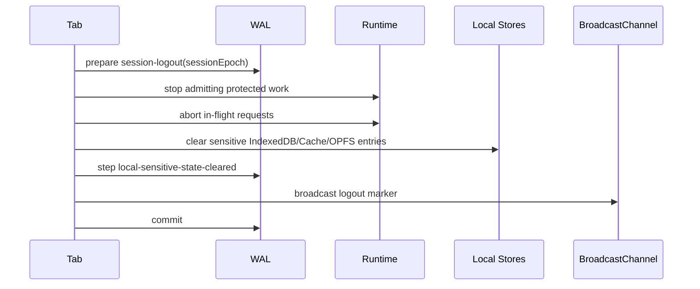

Recovery after crash:

- if logout WAL is open, repeat cleanup
- reject protected work with stale session epoch
- force auth revalidation before UI becomes ready
- broadcast logout marker again if needed

Do not store tokens in the WAL.
Store session epoch and reason code only.

---

## 22. Observability

Expose WAL health.

Metrics:

| Metric | Meaning |
|---|---|
| open WAL operations | possible in-progress or stuck work |
| repair-required count | user/system intervention needed |
| oldest open operation age | stalled workflow detector |
| recovery duration | startup cost |
| recovery success/failure count | reliability signal |
| compaction lag | storage growth risk |
| operations by type/status | failure hotspot |
| duplicate idempotency hits | retry/double-click signal |
| stale fencing rejects | leadership race signal |

Debug view:

```txt
WAL
---
open:                  2
repairRequired:        1
oldestOpenAge:          00:03:12
lastRecoveryAt:         2026-07-08T04:10:13Z
lastRecoveryDuration:   42ms

Open operations
---------------
opfs-import   op-123   step=temp-file-written   owner=conn-9
outbox-send   op-456   step=request-sent         owner=sw-v52

Repair required
---------------
cache-promote op-555   reason=manifest/cache integrity mismatch
```

For advanced debugging, keep a compact recent WAL trace:

```ts
type WalTrace = {
  operationId: string;
  transition: string;
  at: string;
  runtimeId: string;
};
```

---

## 23. Testing strategy

WAL testing should intentionally kill things between steps.

### 23.1 Unit tests

- valid state transitions
- invalid state transitions
- duplicate idempotency key
- unknown operation type
- recovery handler classification
- compaction candidate selection

### 23.2 Integration tests

- crash after prepare
- crash after each step
- crash after external request but before local ACK
- duplicate recovery from two tabs
- stale fencing token commit
- quota error during WAL append
- schema migration with open WAL records

### 23.3 Browser automation tests

With Playwright or similar:

1. open tab A
2. begin import
3. force reload after WAL prepare
4. verify recovery resumes or repairs
5. open tab B simultaneously
6. verify only one recovery owner commits
7. verify UI shows consistent final state

### 23.4 Chaos hooks

Add test-only crash points:

```ts
await chaos.point("after-wal-prepare");
await chaos.point("after-temp-file-written");
await chaos.point("after-server-accepted-before-ack");
await chaos.point("before-wal-commit");
```

A WAL without crash-point tests is mostly wishful thinking.

---

## 24. Common anti-patterns

### Anti-pattern: WAL without recovery

Writing prepare records but never scanning them is worse than no WAL.
It creates false confidence.

### Anti-pattern: WAL as audit log

A WAL is operational recovery data.
It is not automatically a domain audit log.
Use event log for domain facts.

### Anti-pattern: no idempotency

If recovery repeats a side effect and creates duplicates, the WAL did not solve the problem.
It just made duplicate execution more systematic.

### Anti-pattern: embedding huge payloads

Large payloads in WAL records create clone cost, quota pressure, and slow recovery.
Use payload references.

### Anti-pattern: committing after broadcast

Bad:

```ts
broadcastChange();
await wal.commit();
```

Better:

```ts
await wal.commit();
broadcastChange();
```

Receivers should only observe committed durable state.

### Anti-pattern: one global recovery handler

Different operation types require different recovery semantics.
A generic “retry everything” loop will eventually corrupt something.

---

## 25. Reference WAL runtime skeleton

```ts
class ClientWal {
  constructor(private readonly db: WalDb) {}

  async begin(input: BeginWalInput): Promise<WalHandle> {
    const now = new Date().toISOString();
    const operationId = input.operationId ?? crypto.randomUUID();
    const walId = crypto.randomUUID();

    await this.db.tx(["walRecords", "walOperations"], "readwrite", async tx => {
      if (input.idempotencyKey) {
        const existing = await tx.walOperations.index("byIdempotencyKey").get(input.idempotencyKey);
        if (existing && existing.status !== "aborted") {
          throw new DuplicateOperationError(existing.operationId);
        }
      }

      await tx.walOperations.add({
        operationId,
        operationType: input.operationType,
        status: "open",
        idempotencyKey: input.idempotencyKey,
        fencingToken: input.fencingToken,
        createdAt: now,
        updatedAt: now,
        deadlineAt: input.deadlineAt,
      });

      await tx.walRecords.add({
        walId,
        operationId,
        operationType: input.operationType,
        schemaVersion: 1,
        phase: "prepare",
        status: "open",
        tabId: runtime.tabId,
        connectionId: runtime.connectionId,
        sessionId: runtime.sessionId,
        tenantId: runtime.tenantId,
        idempotencyKey: input.idempotencyKey,
        fencingToken: input.fencingToken,
        createdAt: now,
        updatedAt: now,
        payload: input.payload,
        payloadRef: input.payloadRef,
      });
    });

    return new IndexedDbWalHandle(this.db, operationId);
  }

  async recoverAll(registry: RecoveryRegistry): Promise<void> {
    await withWalRecoveryOwnership(async lease => {
      const openOps = await this.db.findOpenOperations();

      for (const op of openOps) {
        if (lease && op.fencingToken && Number(op.fencingToken) > lease.fencingToken) {
          continue;
        }

        const handler = registry.get(op.operationType);
        if (!handler) {
          await this.markRepairRequired(op.operationId, new Error("unknown operation type"));
          continue;
        }

        const records = await this.db.recordsFor(op.operationId);
        await handler.recover(op, records);
      }
    });
  }

  async markRepairRequired(operationId: string, err: unknown) {
    await this.db.markRepairRequired(operationId, serializeError(err));
  }
}
```

Handle:

```ts
class IndexedDbWalHandle implements WalHandle {
  constructor(
    private readonly db: WalDb,
    public readonly operationId: string,
  ) {}

  async appendStep(step: string, payload?: unknown): Promise<void> {
    await this.db.appendRecord(this.operationId, {
      phase: "step",
      step,
      payload,
    });
  }

  async commit(payload?: unknown): Promise<void> {
    await this.db.tx(["walRecords", "walOperations"], "readwrite", async tx => {
      const op = await tx.walOperations.get(this.operationId);
      assertTransition(op.status, "committed");

      await tx.walRecords.add(record({
        operationId: this.operationId,
        phase: "commit",
        status: "committed",
        payload,
      }));

      await tx.walOperations.put({
        ...op,
        status: "committed",
        updatedAt: new Date().toISOString(),
      });
    });
  }

  async abort(error: unknown): Promise<void> {
    await this.db.abortOperation(this.operationId, serializeError(error));
  }

  async markRepairRequired(error: unknown): Promise<void> {
    await this.db.markRepairRequired(this.operationId, serializeError(error));
  }
}
```

This skeleton is intentionally plain.
The hard part is not class design.
The hard part is defining recovery semantics per operation type.

---

## 26. Production checklist

Before adding a client-side WAL, define:

- Which operations need WAL protection?
- What is the operation boundary?
- What are the steps?
- Which steps are idempotent?
- Which steps have external side effects?
- What idempotency key protects each side effect?
- What payload is stored inline vs by reference?
- What store owns payload references?
- What does recovery do after each possible last step?
- Can two tabs recover at the same time?
- What lock/lease/fencing mechanism prevents stale commits?
- What is the compaction policy?
- What is the repair-required UX?
- What happens on logout/session revocation?
- What happens on schema migration?
- What metrics prove the WAL is healthy?
- What crash points are tested?

If you cannot define recovery behavior, do not add a WAL record yet.
A WAL is a recovery contract, not a decorative log.

---

## 27. Final mental model

A client-side WAL is useful because browser workflows are interrupted all the time.
Tabs close.
Workers die.
Pages freeze.
Broadcasts are missed.
Service Workers update.
Network calls succeed while local writes fail.
OPFS writes and IndexedDB updates do not share one universal transaction.

The WAL gives you a durable sentence:

> “I started operation X, reached step Y, and therefore recovery should do Z.”

That sentence is the difference between guessing and engineering.

Use IndexedDB transactions when one transaction is enough.
Use event sourcing when you need replayable domain facts.
Use an outbox when work must be delivered remotely.
Use a WAL when a local operation can be interrupted between meaningful steps.

The invariant is:

> No important cross-store or external side-effect workflow should be able to fail halfway without leaving enough durable information to finish, retry, rollback, or ask for repair.

That is the role of a client-side write-ahead log.

---

## References

- MDN — IndexedDB API: https://developer.mozilla.org/en-US/docs/Web/API/IndexedDB_API
- MDN — IDBTransaction: https://developer.mozilla.org/en-US/docs/Web/API/IDBTransaction
- MDN — Web Locks API: https://developer.mozilla.org/en-US/docs/Web/API/Web_Locks_API
- MDN — Broadcast Channel API: https://developer.mozilla.org/en-US/docs/Web/API/Broadcast_Channel_API
- Chrome Developers — Page Lifecycle API: https://developer.chrome.com/docs/web-platform/page-lifecycle-api
