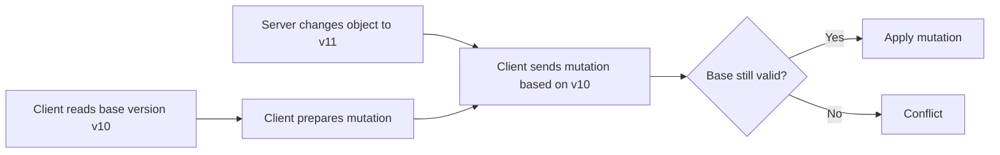
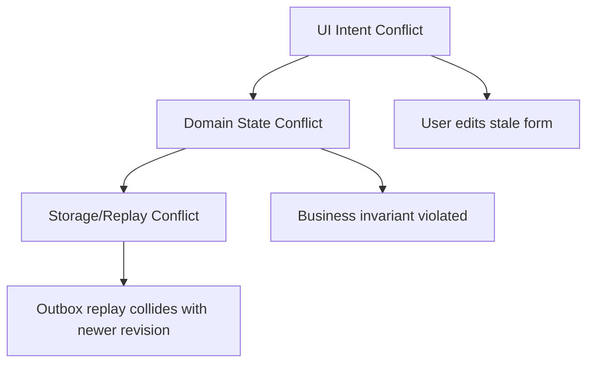
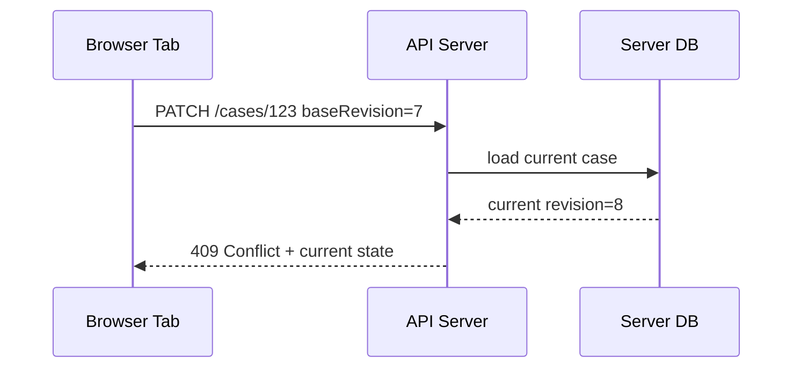
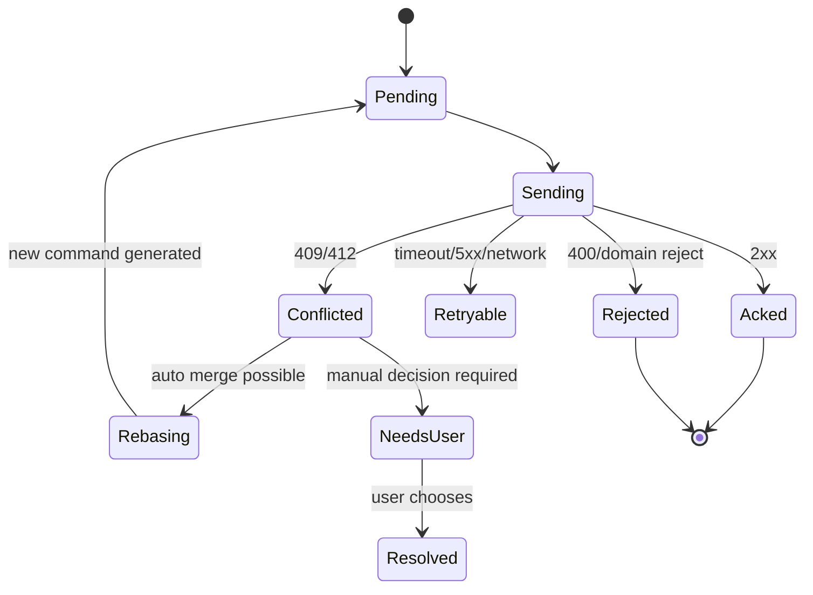
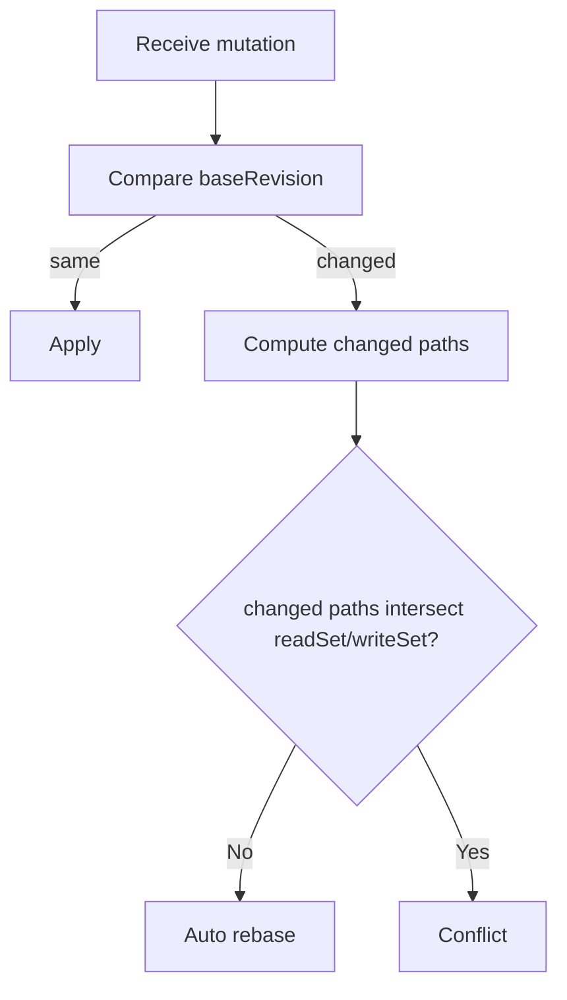
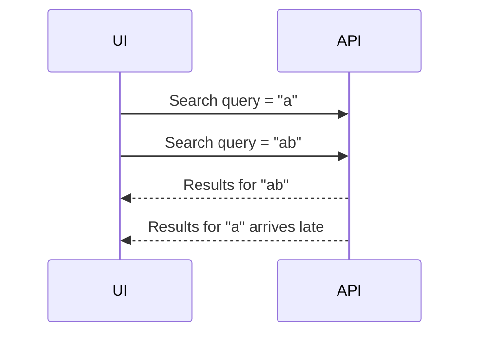
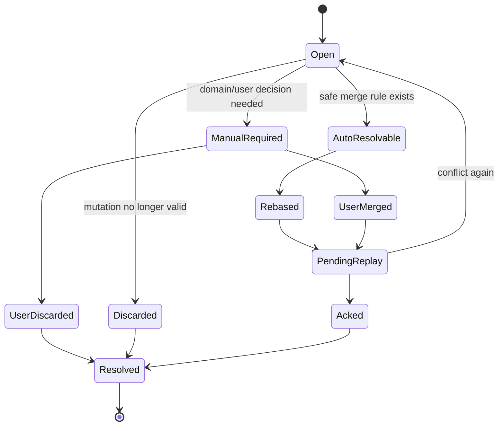
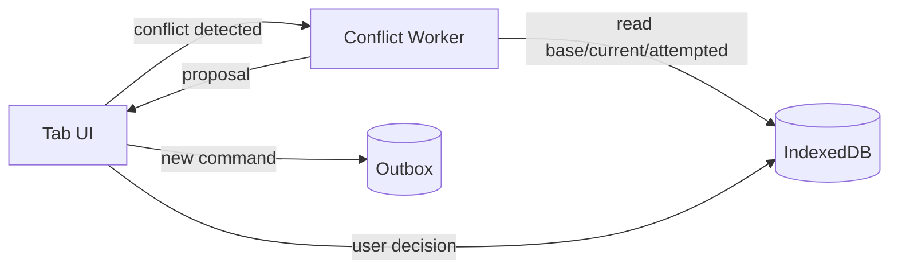

# Part 053 — Conflict Detection and Resolution

> Goal: design conflict handling for browser applications that can survive offline edits, multi-tab edits, stale projections, retry, replay, server rejection, and user-visible merge decisions.

Conflict resolution is where frontend engineering stops being “UI state” and starts becoming distributed systems.

A browser app can have several writers:

- tab A editing a record
- tab B editing the same record
- a Dedicated Worker rebuilding a projection
- a SharedWorker coordinating background work
- a Service Worker replaying an offline mutation
- the server changing the same object because another user acted
- a background refresh replacing stale local data
- a schema migration transforming old local records

If those writers touch the same logical entity, conflict is not an edge case.
It is a normal consequence of concurrency.

The important question is not:

> “How do we avoid all conflicts?”

The real question is:

> “Which conflicts can be merged automatically, which must be rejected, which must be surfaced to the user, and which must be prevented by ownership?”

This part builds that model.

---

## 1. Conflict mental model

A conflict happens when two or more operations make assumptions about the same state, and at least one assumption is no longer true.



A conflict is not the same as an error.

| Situation | Meaning |
|---|---|
| Network timeout | Unknown delivery result |
| 500 response | Server failed to process request |
| 401 response | Session/auth boundary changed |
| 409 response | Mutation conflicts with current resource state |
| Duplicate request | Same intent delivered more than once |
| Stale response | Old result arrived after newer state |
| Local write race | Two local writers mutated same logical object |

A conflict system must preserve three properties:

1. **safety** — never silently corrupt state
2. **explainability** — know why a mutation was accepted, rejected, or merged
3. **recoverability** — after reload/crash/offline replay, conflict state is still understandable

Top-tier browser-side architecture treats conflict as a first-class workflow, not as a toast message.

---

## 2. The three conflict layers

In browser apps, conflicts appear at three layers.



### 2.1 UI intent conflict

The user intended to change something based on a version of the screen.
The screen may no longer reflect the latest state.

Example:

- user opens invoice `INV-100`
- server-side payment status changes from `PENDING` to `PAID`
- user tries to cancel the invoice from stale UI

This is not just a storage conflict.
The user's action may no longer make business sense.

### 2.2 Domain state conflict

Two changes violate a domain invariant.

Examples:

- two officers claim the same case as exclusive owner
- two tabs submit different final decisions for the same workflow step
- quota is consumed twice
- a task is completed after the parent case is closed
- a record is edited under old authorization scope

These require domain policy.
No generic merge algorithm knows the correct answer.

### 2.3 Storage/replay conflict

Local state or offline replay collides with newer persisted state.

Examples:

- outbox mutation has `baseRevision=42`, server is at `revision=45`
- IndexedDB projection applies event `seq=103` after already applying `seq=105`
- OPFS staged file is promoted using old metadata
- two tabs try to compact the same event log

These require protocol mechanics: revisions, idempotency keys, compare-and-swap checks, fencing tokens, and replay state machines.

---

## 3. Conflict is a policy decision, not a library feature

Many engineers reach for a library too early.
A conflict library can help with mechanics.
It cannot answer domain questions.

Before implementing anything, classify each entity by conflict policy.

| Entity / workflow | Conflict policy |
|---|---|
| User preference theme | Last writer wins may be acceptable |
| Draft note body | Field-level or text merge may be useful |
| Regulatory case decision | Must not auto-merge final decision |
| Auth session | Server authority wins |
| Offline comment creation | Idempotent append with client-generated ID |
| File upload metadata | Versioned compare-and-swap |
| Cache artifact manifest | Single owner + versioned promotion |
| Notification read marker | Monotonic max timestamp or sequence |
| Task claim | Exclusive lock / server transaction |

The most dangerous default is “last writer wins everywhere”.
It feels simple because it hides conflict.
It is often silent data loss.

Use last-writer-wins only when:

- the field is low-value
- overwriting is acceptable
- no audit requirement exists
- no irreversible action depends on it
- the user will not be surprised

For serious systems, make conflict policy explicit per entity and per operation.

---

## 4. Version fields: the minimum viable conflict detector

A common conflict detector is a resource version.

```ts
export interface CaseRecord {
  id: string;
  revision: number;
  status: 'draft' | 'submitted' | 'review' | 'closed';
  assignedTo: string | null;
  updatedAt: string;
  data: unknown;
}
```

A mutation carries the base revision it was built from.

```ts
export interface UpdateCaseCommand {
  commandId: string;
  caseId: string;
  baseRevision: number;
  patch: Array<{
    op: 'replace' | 'add' | 'remove';
    path: string;
    value?: unknown;
  }>;
}
```

Server rule:

```txt
IF command.baseRevision == current.revision:
  apply command
  revision = revision + 1
ELSE:
  reject with conflict
```

This is optimistic concurrency control.



This works well for many workflows.
But it is not enough by itself.

It detects that something changed.
It does not decide whether the change can be merged.

---

## 5. Server ETag and If-Match

For HTTP resources, the protocol-level version can be represented as an `ETag`.

A client reads:

```http
GET /cases/123

HTTP/1.1 200 OK
ETag: "case-123-rev-7"
```

Then updates conditionally:

```http
PATCH /cases/123
If-Match: "case-123-rev-7"
```

If the server's current entity tag does not match, the server should reject the mutation with a precondition failure or conflict-style response, depending on API convention.

The browser-side point is simple:

> Do not send blind writes for conflict-sensitive resources.

Carry a base version.
Require the server to check it.
Persist the base version in the outbox.

```ts
export interface OutboxMutation {
  mutationId: string;
  entityType: string;
  entityId: string;
  method: 'PATCH' | 'POST' | 'DELETE';
  url: string;
  baseRevision?: number;
  ifMatch?: string;
  body: unknown;
  idempotencyKey: string;
  status: 'pending' | 'sending' | 'acked' | 'conflicted' | 'failed';
  createdAt: number;
}
```

Without persisted `baseRevision` or `ifMatch`, offline replay becomes guesswork.

---

## 6. Conflict response shape

A serious API does not return only `409`.
It returns enough information for deterministic handling.

```ts
export interface ConflictResponse<TCurrent, TAttempt> {
  type: 'conflict';
  conflictId: string;
  entityType: string;
  entityId: string;
  serverRevision: number;
  attemptedBaseRevision: number;
  current: TCurrent;
  attempted: TAttempt;
  conflictingFields: string[];
  reason:
    | 'revision_mismatch'
    | 'state_transition_invalid'
    | 'ownership_changed'
    | 'permission_changed'
    | 'duplicate_semantic_action'
    | 'server_policy_reject';
  mergeHint?:
    | 'client_can_retry_after_rebase'
    | 'manual_resolution_required'
    | 'server_wins'
    | 'client_action_no_longer_valid';
}
```

Browser handling becomes a state machine:



Do not flatten conflict into generic error.
It needs durable state.

---

## 7. Local conflict store

If a conflict can survive page reload, it deserves local persistence.

IndexedDB object stores:

```ts
interface ConflictRecord {
  conflictId: string;
  mutationId: string;
  entityType: string;
  entityId: string;
  reason: string;
  baseRevision: number | null;
  serverRevision: number | null;
  attempted: unknown;
  current: unknown;
  conflictingFields: string[];
  resolutionStatus: 'open' | 'auto_rebased' | 'user_resolved' | 'discarded';
  createdAt: number;
  updatedAt: number;
}
```

Schema sketch:

```ts
function upgrade(db: IDBDatabase) {
  const conflicts = db.createObjectStore('conflicts', {
    keyPath: 'conflictId',
  });

  conflicts.createIndex('byEntity', ['entityType', 'entityId']);
  conflicts.createIndex('byStatus', 'resolutionStatus');
  conflicts.createIndex('byMutation', 'mutationId', { unique: true });
}
```

A conflict record should contain enough to answer:

- what did the user attempt?
- what was the assumed base?
- what is the current state?
- what invariant failed?
- is auto-rebase allowed?
- what action is needed now?

This is especially important for regulated workflows.
A conflict is not just a UI inconvenience; it may become evidence of why an action was not applied.

---

## 8. Automatic merge strategies

Automatic merge is acceptable only when the merge rule is deterministic and safe.

### 8.1 Server wins

Use when client state is advisory.

Examples:

- session state
- server-computed status
- permissions
- billing state
- moderation state

```ts
function resolveServerWins(conflict: ConflictRecord) {
  replaceLocalProjection(conflict.entityType, conflict.entityId, conflict.current);
  markMutationDiscarded(conflict.mutationId, 'server_wins');
}
```

### 8.2 Client wins

Use rarely.

Client wins is only safe when the client has authority over that data.

Examples:

- local-only UI preference
- unsynced draft label
- client-side workspace layout

Do not use client-wins for shared business records unless the server has explicitly accepted that model.

### 8.3 Field-level merge

If two patches touched different fields, merge may be safe.

```txt
Base:
  title = "Old"
  description = "Old desc"

Server changed:
  title = "Server title"

Client changed:
  description = "Client desc"

Merged:
  title = "Server title"
  description = "Client desc"
```

But field-level merge is safe only if fields are independent.

Bad assumption:

```txt
status and assignedTo are independent fields
```

In many workflow systems, `status` and `assignedTo` are coupled by invariant.

### 8.4 Operation rebase

Instead of replaying final state, replay intent against the latest state.

Example command:

```ts
export interface AddCommentCommand {
  type: 'case.comment.add';
  caseId: string;
  commentId: string;
  body: string;
}
```

If the case changed but remains commentable, the command can be rebased.
If the case is closed, the command may conflict.

Operation-based design is usually better than sending whole-object replacement.

### 8.5 Semantic merge

Domain-specific merge rules.

Examples:

- unread count uses max sequence
- tags can be set-union
- comments can be append-only
- checklist item completion may be per-item
- final decision cannot be merged
- case ownership requires exclusive transition

Semantic merge is where serious engineering happens.
It encodes business invariants.

---

## 9. Patch-based conflict detection

If the client sends patch operations, the server can detect overlap more precisely.

```ts
interface PatchMutation {
  entityId: string;
  baseRevision: number;
  patch: JsonPatchOperation[];
  readSet?: string[];
  writeSet: string[];
}
```

`writeSet` tells which paths the mutation intends to change.
`readSet` tells which paths the mutation depended on.

Example:

```json
{
  "baseRevision": 10,
  "readSet": ["/status", "/assignedTo"],
  "writeSet": ["/assignedTo"],
  "patch": [
    { "op": "replace", "path": "/assignedTo", "value": "officer-42" }
  ]
}
```

If only `/description` changed on the server, rebase may be safe.
If `/status` changed, the mutation may be invalid.



This model is stronger than blind revision mismatch.
It avoids unnecessary user conflicts.
But it requires careful server support.

---

## 10. Command-based design beats state replacement

A state replacement says:

```json
{
  "status": "submitted",
  "assignedTo": "officer-7",
  "notes": "..."
}
```

A command says:

```json
{
  "type": "case.submit",
  "caseId": "case-123",
  "baseRevision": 41,
  "actorId": "user-9",
  "idempotencyKey": "idem-abc"
}
```

Commands are better for conflict handling because they preserve intent.

| Replacement | Command |
|---|---|
| “Make object look like this” | “Perform this domain action” |
| Hard to rebase safely | Can validate against current state |
| Easy to overwrite fields | Easier to enforce invariants |
| Poor audit semantics | Strong audit semantics |
| Generic conflict only | Domain-specific conflict reason |

For offline queues, command-based mutation is usually superior.

A command should include:

- command type
- entity ID
- actor identity or session boundary marker
- base revision or ETag
- idempotency key
- domain payload
- client creation timestamp
- client schema/protocol version

---

## 11. Multi-tab local conflict

Not all conflicts involve the server.

Two tabs can mutate local state concurrently.

Example:

- tab A edits draft `D1`
- tab B edits draft `D1`
- both write to IndexedDB
- last transaction wins locally
- one edit disappears

For important local entities, use local optimistic concurrency too.

```ts
async function updateDraft(
  db: IDBDatabase,
  draftId: string,
  expectedRevision: number,
  patch: Partial<DraftRecord>,
) {
  return tx(db, ['drafts'], 'readwrite', async (stores) => {
    const current = await get<DraftRecord>(stores.drafts, draftId);

    if (!current) throw new Error('draft_not_found');

    if (current.localRevision !== expectedRevision) {
      throw new LocalConflictError({
        draftId,
        expectedRevision,
        actualRevision: current.localRevision,
        current,
        attemptedPatch: patch,
      });
    }

    await put(stores.drafts, {
      ...current,
      ...patch,
      localRevision: current.localRevision + 1,
      updatedAt: Date.now(),
    });
  });
}
```

Then notify other tabs:

```ts
channel.postMessage({
  type: 'draft.changed',
  draftId,
  localRevision: nextRevision,
});
```

BroadcastChannel is notification.
IndexedDB is source of truth.

---

## 12. Stale response conflict

A stale response is a conflict between time and intent.



If the UI accepts the late response, it regresses.

Use request generations:

```ts
let searchGeneration = 0;

async function search(query: string) {
  const generation = ++searchGeneration;
  const result = await api.search(query);

  if (generation !== searchGeneration) {
    return;
  }

  render(result);
}
```

For shared systems, carry generation in the envelope:

```ts
interface ResponseEnvelope<T> {
  correlationId: string;
  requestGeneration: number;
  producerId: string;
  payload: T;
}
```

Stale response handling is a conflict resolution strategy.
It says:

> newer intent wins over older async result.

---

## 13. Conflict UX is part of the protocol

Conflict handling is not complete until the user can resolve conflicts safely.

A good conflict UI answers:

- what did I try to do?
- what changed meanwhile?
- can my change still be applied?
- what are my options?
- will retry duplicate anything?
- what happens to my draft?

Example actions:

| User action | System behavior |
|---|---|
| Keep server version | discard or archive local mutation |
| Apply my change again | create new command based on current revision |
| Merge fields manually | generate new patch with current base revision |
| Save as draft | keep local state, do not replay |
| Cancel action | mark mutation discarded with reason |
| Refresh view | reload projection from server/current store |

Never ask users to resolve raw JSON conflicts.
Present domain language.

Bad:

> Conflict on `/status` and `/assignedTo`.

Better:

> This case was reassigned while you were editing. Your note can still be saved, but your ownership change cannot be applied.

---

## 14. Conflict resolution state machine



Persist each transition.

```ts
interface ConflictTransition {
  conflictId: string;
  at: number;
  from: string;
  to: string;
  actor: 'system' | 'user';
  reason: string;
  details?: unknown;
}
```

For audit-heavy systems, transitions are not debug logs.
They are part of the record.

---

## 15. Rebase algorithm skeleton

A safe rebase algorithm needs explicit constraints.

```ts
interface RebaseInput<T> {
  base: T;
  current: T;
  attemptedPatch: JsonPatchOperation[];
  readSet: string[];
  writeSet: string[];
  changedPathsSinceBase: string[];
}

interface RebaseResult {
  status: 'rebased' | 'conflict';
  patch?: JsonPatchOperation[];
  reason?: string;
  conflictingPaths?: string[];
}

function rebase(input: RebaseInput<unknown>): RebaseResult {
  const conflicts = intersection(
    new Set([...input.readSet, ...input.writeSet]),
    new Set(input.changedPathsSinceBase),
  );

  if (conflicts.length > 0) {
    return {
      status: 'conflict',
      reason: 'read_or_write_set_intersection',
      conflictingPaths: conflicts,
    };
  }

  return {
    status: 'rebased',
    patch: input.attemptedPatch,
  };
}
```

This algorithm is intentionally conservative.
It avoids silent data loss.

Then domain-specific merge can override:

```ts
const mergePolicyByCommand = {
  'case.comment.add': appendOnlyMerge,
  'case.tags.add': setUnionMerge,
  'case.submit': noAutoMerge,
  'case.note.update': fieldLevelMerge,
};
```

The key invariant:

> Generic merge must never violate domain invariants.

---

## 16. Conflict categories for workflow systems

For case management, enforcement lifecycle, approvals, regulatory workflows, or task orchestration, conflict categories should be explicit.

| Category | Example | Default policy |
|---|---|---|
| Ownership conflict | two actors claim same task | reject/require current owner check |
| State transition conflict | approve after withdrawal | reject with current state |
| Evidence conflict | update attachment metadata after deletion | manual/domain-specific |
| Authorization conflict | actor lost permission | reject/server wins |
| Comment conflict | two comments added | append/idempotent |
| Draft conflict | two local drafts diverge | manual merge or save copies |
| SLA conflict | deadline recalculated | server wins with explanation |
| Assignment conflict | reassigned while editing | partial merge possible |
| Final decision conflict | two outcomes submitted | no auto-merge |

Conflict policy should be part of the workflow definition.

Example:

```ts
interface WorkflowTransitionPolicy {
  transition: string;
  requiredBaseFields: string[];
  autoMergeAllowed: boolean;
  conflictReasons: string[];
  retryAfterRebaseAllowed: boolean;
  manualResolutionAllowed: boolean;
}
```

This turns conflict from ad-hoc frontend code into domain architecture.

---

## 17. Idempotency is not conflict resolution

Idempotency prevents duplicate side effects for the same intent.
Conflict resolution handles different intents or stale assumptions.

```txt
Same idempotency key repeated:
  duplicate delivery of same command

Different idempotency keys with same entity:
  possible conflict between different commands
```

Example:

- user clicks “submit” twice due to retry
- same idempotency key should prevent duplicate submission

But:

- user A submits case
- user B withdraws case
- different commands conflict by domain rule

You need both:

- idempotency key
- base version / invariant check

Do not substitute one for the other.

---

## 18. Vector clocks and why you probably do not need them first

A vector clock tracks causality across multiple writers.

Conceptually:

```json
{
  "tab-a": 4,
  "tab-b": 2,
  "server": 9
}
```

It can detect whether one state descends from another or whether two states are concurrent.

This is powerful.
It is also more complex than most business apps need.

Most browser apps should start with:

- server revision / ETag
- command idempotency key
- local revision for local-only records
- timestamp only for display or low-value tie-breaks
- conflict record for unresolved decisions

Use vector clocks only when:

- multiple independent writers can produce durable state offline
- merge is decentralized
- server is not the sole authority
- causality must be preserved across peers

For most client-server apps, server-issued revision is the simplest correct starting point.

---

## 19. CRDTs are not a free pass

Conflict-free replicated data types can automatically merge certain data structures.
They are useful for collaborative text, sets, counters, maps, and peer-like replication scenarios.

But CRDTs do not remove domain conflicts.

CRDT can merge:

- two users add different tags
- two users edit different rich text regions
- counters increment independently

CRDT cannot decide safely:

- whether a case can be closed
- who owns an exclusive task
- whether evidence can be deleted after submission
- whether an authorization boundary changed
- whether a final decision is valid

Use CRDTs for the right layer.
Do not use them to bypass workflow invariants.

---

## 20. Conflict detection in IndexedDB projections

If you maintain local projections from event streams, you need sequence checks.

```ts
interface ProjectionMeta {
  projectionName: string;
  lastAppliedSeq: number;
  schemaVersion: number;
  rebuiltAt: number;
}
```

Apply rule:

```txt
IF event.seq == lastAppliedSeq + 1:
  apply event
ELSE IF event.seq <= lastAppliedSeq:
  ignore duplicate/stale event
ELSE:
  gap detected; fetch missing events or rebuild
```

Implementation sketch:

```ts
async function applyEvent(event: DomainEvent) {
  await tx(db, ['projection_meta', 'case_projection'], 'readwrite', async (stores) => {
    const meta = await get<ProjectionMeta>(stores.projection_meta, 'case_projection');

    if (event.seq <= meta.lastAppliedSeq) {
      return;
    }

    if (event.seq !== meta.lastAppliedSeq + 1) {
      throw new ProjectionGapError({
        expected: meta.lastAppliedSeq + 1,
        actual: event.seq,
      });
    }

    await reduceCaseProjection(stores.case_projection, event);
    await put(stores.projection_meta, {
      ...meta,
      lastAppliedSeq: event.seq,
    });
  });
}
```

This is conflict detection for derived state.
If you ignore sequence gaps, your UI can become confidently wrong.

---

## 21. Worker involvement

Workers are excellent places to run conflict logic that is CPU-heavy or independent of DOM:

- diffing base/current/attempted objects
- generating patch proposals
- rebuilding projections
- validating command dependencies
- compacting conflict logs
- preparing user-facing conflict summaries

Architecture:



Worker rule:

> The worker may propose conflict resolution. It should not silently perform dangerous domain decisions unless policy explicitly allows it.

The UI remains accountable for user-facing decisions.
The server remains accountable for authoritative domain validation.

---

## 22. Multi-tab conflict coordination

If one tab opens a conflict resolver, another tab should not unknowingly resolve the same conflict differently.

Use a conflict resolution lock.

```ts
await navigator.locks.request(
  `conflict:${conflictId}`,
  { mode: 'exclusive' },
  async () => {
    const latest = await conflictRepo.get(conflictId);
    if (latest.resolutionStatus !== 'open') return;

    const decision = await openResolutionUI(latest);
    await conflictRepo.applyDecision(conflictId, decision);
  },
);
```

Broadcast resolution:

```ts
channel.postMessage({
  type: 'conflict.resolved',
  conflictId,
  entityId,
  resolvedAt: Date.now(),
});
```

Other tabs should refresh conflict state from IndexedDB, not trust the broadcast payload.

---

## 23. Security and privacy boundaries

Conflict records can contain sensitive attempted data.

Examples:

- unsent form contents
- evidence metadata
- personal information
- decision notes
- authorization details
- rejected payloads

Rules:

1. Do not broadcast full conflict payloads.
2. Store only what is needed to resolve/recover.
3. Clear conflict records on logout/session revocation if they are session-bound.
4. Encrypting at rest inside browser rarely solves XSS; fix XSS and reduce stored sensitivity.
5. Never include tokens/secrets in conflict payload.
6. Treat conflict export/debug tools as sensitive.

Conflict handling is part of your threat model.

---

## 24. Observability

Track conflict metrics separately from generic errors.

Useful counters:

```ts
interface ConflictMetrics {
  conflictsDetected: number;
  autoResolved: number;
  manualRequired: number;
  discarded: number;
  rebaseSucceeded: number;
  rebaseFailed: number;
  conflictByEntityType: Record<string, number>;
  conflictByReason: Record<string, number>;
  averageResolutionMs: number;
  unresolvedCount: number;
}
```

Useful logs:

```json
{
  "event": "conflict_detected",
  "conflictId": "conf_123",
  "entityType": "case",
  "entityId": "case_9",
  "mutationId": "mut_8",
  "baseRevision": 10,
  "serverRevision": 12,
  "reason": "state_transition_invalid",
  "autoResolvable": false
}
```

Do not log sensitive attempted payload unless your logging pipeline is approved for it.

---

## 25. Testing conflict behavior

Test conflicts as deterministic scenarios.

### 25.1 Server revision conflict

```txt
Given local projection revision 10
And outbox mutation baseRevision 10
And server current revision 11
When replay sends mutation
Then mutation becomes conflicted
And conflict record is persisted
And UI is notified
```

### 25.2 Auto rebase

```txt
Given base object
And server changed unrelated field
And client changed another independent field
When conflict is detected
Then client patch is rebased onto current object
And new mutation uses serverRevision as base
```

### 25.3 Domain reject

```txt
Given case is closed on server
And offline outbox contains add-evidence command
When replay runs
Then command is rejected or conflicted by policy
And evidence payload is retained/discarded according to retention rule
```

### 25.4 Multi-tab resolver race

```txt
Given conflict C is open
And tab A and tab B attempt resolution
When both start resolver
Then only one holds conflict lock
And loser reloads current conflict state
```

### 25.5 Stale response

```txt
Given request generation 5 is active
And generation 4 response arrives late
Then response is ignored
And no projection rollback occurs
```

---

## 26. Production checklist

Before shipping conflict resolution, answer these:

- Which entities support offline mutation?
- Which entities require base revision / ETag?
- Which operations are command-based instead of state replacement?
- Which conflicts are auto-resolvable?
- Which conflicts require user decision?
- What data is stored in conflict records?
- How are conflict records cleared on logout?
- Can conflict UI survive reload?
- Are conflict decisions auditable?
- Do workers only propose safe merges?
- Is outbox replay blocked by unresolved dependencies?
- Are duplicate requests separated from true conflicts?
- Are stale async responses fenced by generation?
- Does multi-tab conflict resolution use lock/lease?
- Do logs avoid sensitive payloads?

---

## 27. Mental model summary

Conflict resolution is a domain protocol built on storage and messaging primitives.

Use this hierarchy:

```txt
1. prevent when ownership must be exclusive
2. detect with revision, ETag, read set, write set, sequence, or generation
3. classify by domain reason
4. auto-merge only when deterministic and safe
5. persist unresolved conflicts
6. let users resolve business-level ambiguity
7. replay using new base version
8. audit important decisions
```

Do not hide conflict.
Do not over-merge conflict.
Do not treat stale state as normal UI error.

A high-quality browser orchestration system is honest about concurrency.
It makes conflicts visible, bounded, explainable, and recoverable.

---

## References

- MDN — IndexedDB API: https://developer.mozilla.org/en-US/docs/Web/API/IndexedDB_API
- MDN — Web Locks API: https://developer.mozilla.org/en-US/docs/Web/API/Web_Locks_API
- MDN — Broadcast Channel API: https://developer.mozilla.org/en-US/docs/Web/API/Broadcast_Channel_API
- MDN — Using Fetch: https://developer.mozilla.org/en-US/docs/Web/API/Fetch_API/Using_Fetch
