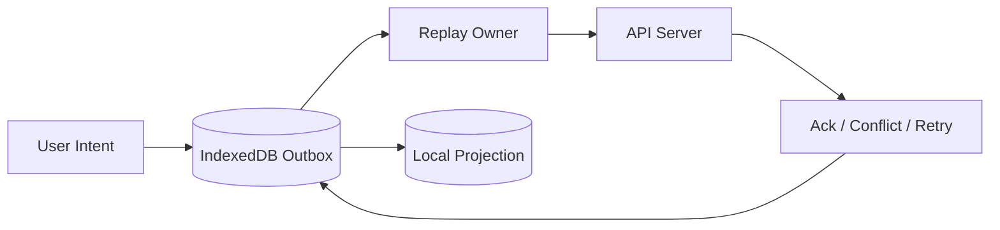
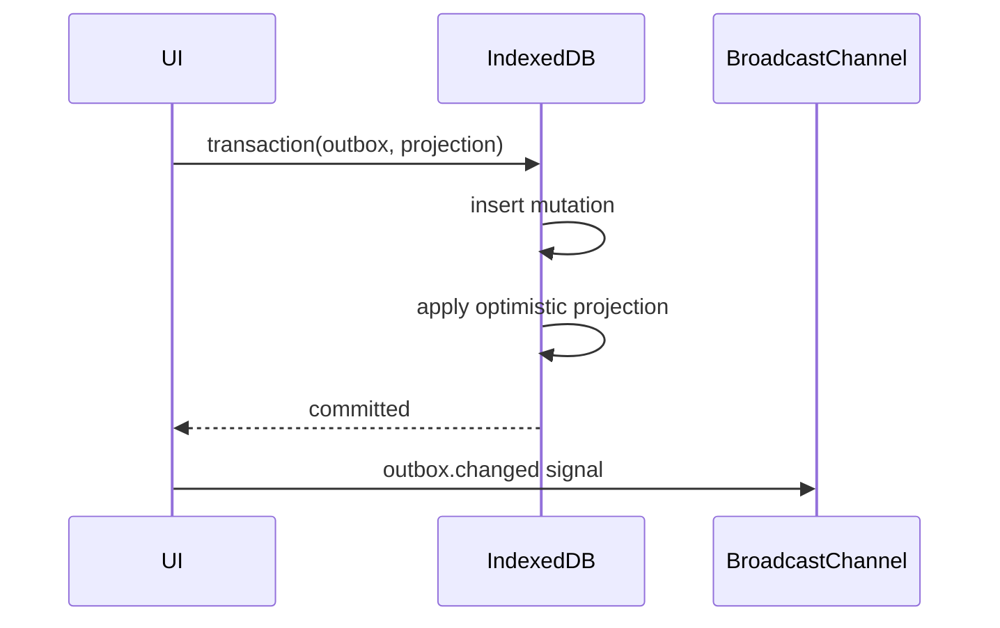
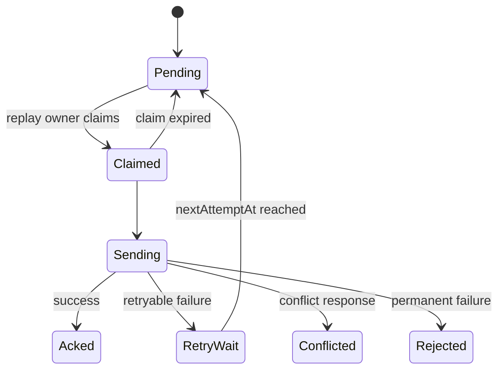
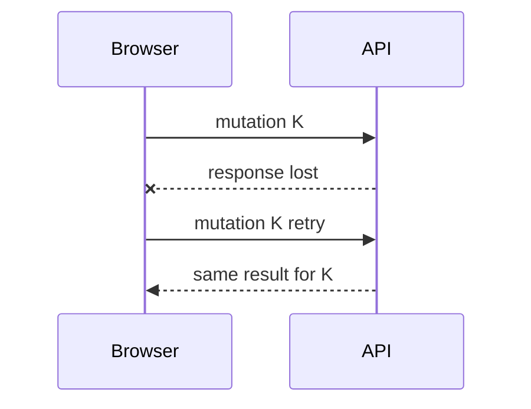
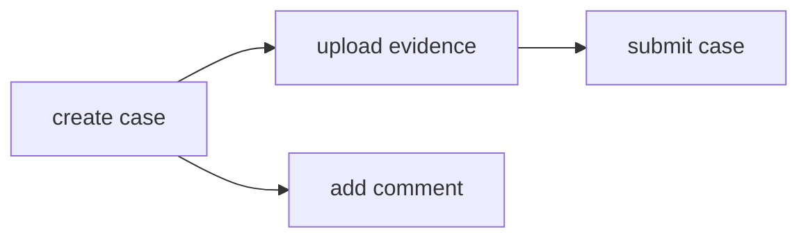
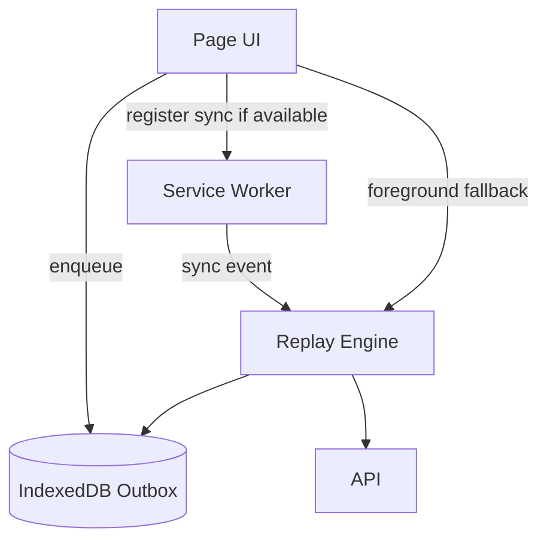
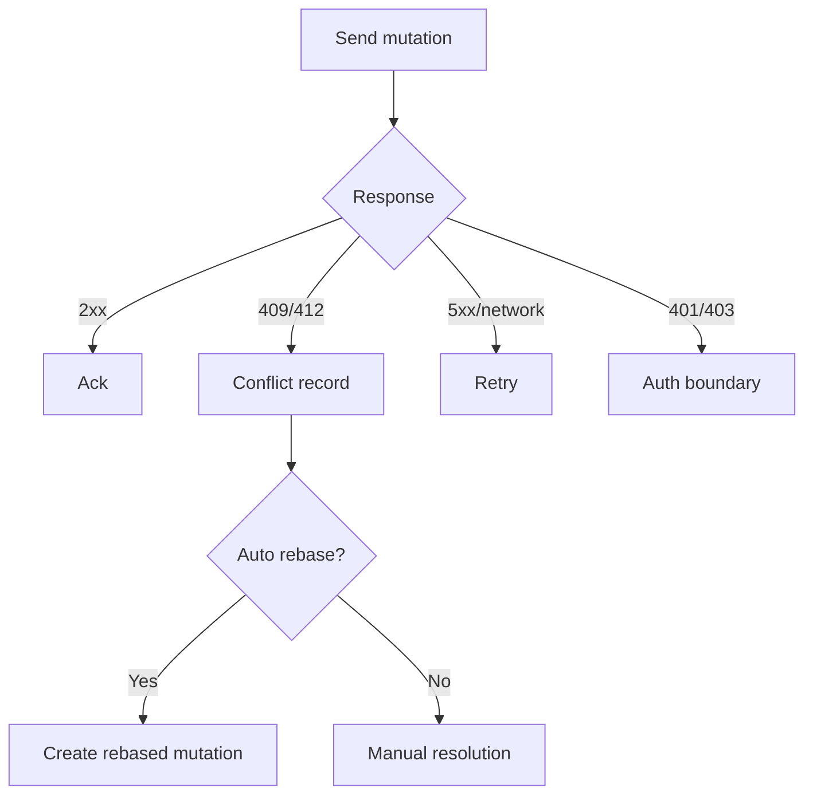
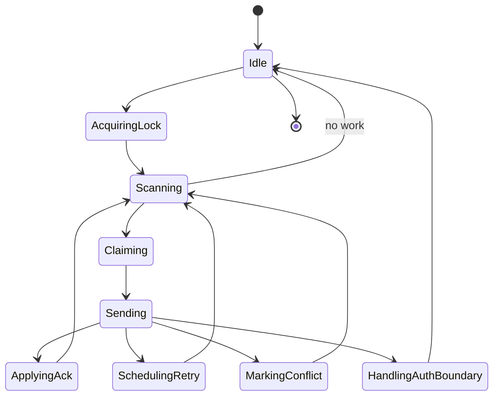
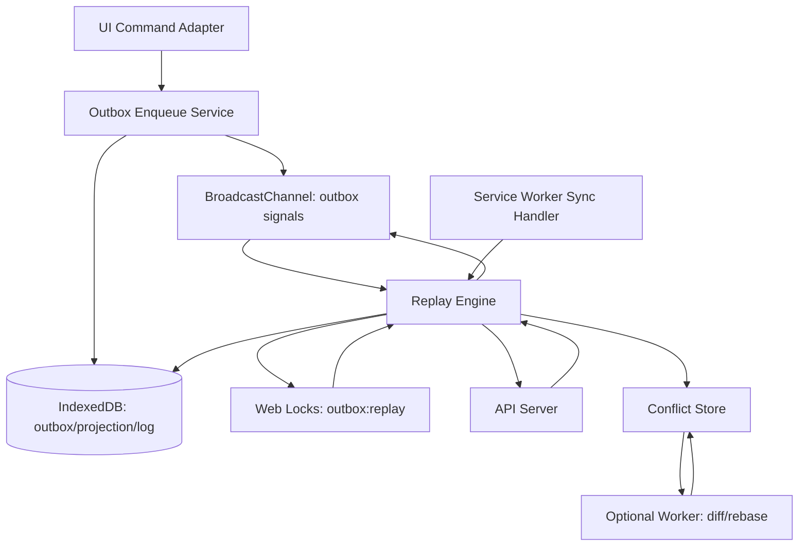

# Part 054 — Offline Queue and Replay

> Goal: build an offline queue that can safely persist user intent, replay it later, avoid duplicate side effects, coordinate across tabs, recover after crashes, and respect auth/session/domain constraints.

Offline queue sounds simple:

> “When network is unavailable, save requests and retry later.”

That statement hides almost every hard part.

A production offline queue is not a list of failed fetches.
It is a durable mutation pipeline.

It must answer:

- what exactly was the user's intent?
- has this intent already been sent?
- did the server receive it before timeout?
- can it be retried safely?
- does it depend on another mutation?
- is the user's session still valid?
- did the entity change while offline?
- which tab or worker owns replay?
- what happens if replay crashes halfway?
- how is conflict surfaced?

This part builds the queue as a browser-side system.

---

## 1. Offline queue mental model

An offline queue is a local outbox.



The key idea:

> Store intent durably before attempting delivery.

Do not treat offline as a special error branch.
Treat all mutations as going through a pipeline:

```txt
enqueue -> maybe optimistic apply -> send -> ack/conflict/retry -> finalize
```

This is the same mental model as a server-side outbox, but adapted to browser constraints.

---

## 2. Do not queue raw fetch blindly

Naive queue:

```ts
queue.push({
  url: '/api/cases/123',
  method: 'PATCH',
  body: JSON.stringify(formState),
});
```

This is dangerous.

Missing information:

- base revision / ETag
- idempotency key
- command type
- schema version
- dependency relationship
- session boundary
- tenant boundary
- retry count
- conflict policy
- payload sensitivity
- expiration policy
- optimistic projection impact

Better:

```ts
export interface OfflineMutation<TPayload = unknown> {
  mutationId: string;
  idempotencyKey: string;
  commandType: string;
  entityType: string;
  entityId: string;
  baseRevision?: number;
  ifMatch?: string;
  payload: TPayload;
  status:
    | 'pending'
    | 'claimed'
    | 'sending'
    | 'acked'
    | 'retry_wait'
    | 'conflicted'
    | 'rejected'
    | 'expired'
    | 'cancelled';
  createdAt: number;
  updatedAt: number;
  nextAttemptAt: number;
  attemptCount: number;
  maxAttempts: number;
  dependsOn: string[];
  sessionId: string;
  tenantId?: string;
  actorId?: string;
  protocolVersion: number;
  schemaVersion: number;
  priority: 'high' | 'normal' | 'low';
  expiresAt?: number;
  lastError?: SerializedReplayError;
}
```

Queue intent, not implementation accident.

---

## 3. Outbox schema in IndexedDB

IndexedDB is a practical default for offline queues because it supports structured records and transactions.

Store layout:

```ts
function upgrade(db: IDBDatabase) {
  const outbox = db.createObjectStore('outbox', {
    keyPath: 'mutationId',
  });

  outbox.createIndex('byStatusNextAttempt', ['status', 'nextAttemptAt']);
  outbox.createIndex('byEntity', ['entityType', 'entityId']);
  outbox.createIndex('byIdempotencyKey', 'idempotencyKey', { unique: true });
  outbox.createIndex('bySession', 'sessionId');
  outbox.createIndex('byTenant', 'tenantId');

  const replayMeta = db.createObjectStore('replay_meta', {
    keyPath: 'key',
  });

  const mutationLog = db.createObjectStore('mutation_log', {
    keyPath: 'logId',
  });

  mutationLog.createIndex('byMutation', 'mutationId');
}
```

Why unique `idempotencyKey` locally?

Because duplicate enqueue can happen before network delivery:

- double click
- retry button spam
- tab restore
- React StrictMode-like duplicate execution in development
- optimistic action re-fired after reload
- two tabs submit same local draft

Local dedupe prevents self-inflicted duplication.

---

## 4. Enqueue transaction

The enqueue operation should be atomic with local optimistic state when possible.



Implementation skeleton:

```ts
async function enqueueMutation<T>(input: EnqueueInput<T>) {
  const now = Date.now();

  const mutation: OfflineMutation<T> = {
    mutationId: crypto.randomUUID(),
    idempotencyKey: input.idempotencyKey ?? crypto.randomUUID(),
    commandType: input.commandType,
    entityType: input.entityType,
    entityId: input.entityId,
    baseRevision: input.baseRevision,
    ifMatch: input.ifMatch,
    payload: input.payload,
    status: 'pending',
    createdAt: now,
    updatedAt: now,
    nextAttemptAt: now,
    attemptCount: 0,
    maxAttempts: input.maxAttempts ?? 10,
    dependsOn: input.dependsOn ?? [],
    sessionId: input.sessionId,
    tenantId: input.tenantId,
    actorId: input.actorId,
    protocolVersion: 1,
    schemaVersion: 1,
    priority: input.priority ?? 'normal',
    expiresAt: input.expiresAt,
  };

  await tx(db, ['outbox', 'projection', 'mutation_log'], 'readwrite', async (stores) => {
    await stores.outbox.add(mutation);

    if (input.optimisticApply) {
      await input.optimisticApply(stores.projection, mutation);
    }

    await stores.mutation_log.add({
      logId: crypto.randomUUID(),
      mutationId: mutation.mutationId,
      at: now,
      event: 'enqueued',
    });
  });

  outboxBus.postMessage({
    type: 'outbox.changed',
    mutationId: mutation.mutationId,
  });

  return mutation.mutationId;
}
```

Important invariant:

> If the UI shows optimistic state, the durable mutation that justifies that state must already exist.

Never show important optimistic state that cannot survive reload.

---

## 5. Replay ownership

If multiple tabs are open, multiple runtimes may try to replay the same outbox.

That causes:

- duplicate requests
- race on status updates
- server load spikes
- confusing conflict states
- inconsistent retry schedule

Use one replay owner per logical queue.

```ts
async function runReplayLoop() {
  await navigator.locks.request(
    'outbox:replay',
    { mode: 'exclusive' },
    async () => {
      while (shouldContinue()) {
        const batch = await claimReplayBatch();
        if (batch.length === 0) break;

        for (const mutation of batch) {
          await replayOne(mutation);
        }
      }
    },
  );
}
```

Web Locks is ideal when available because the lock is scoped across same-origin tabs/workers.

Fallback if Web Locks is unavailable:

- IndexedDB lease row
- monotonic-ish expiry timestamp
- fencing token
- compare-and-set style transaction
- short lease duration
- heartbeat renewal

Fallback is weaker than Web Locks but can be practical.

---

## 6. Claiming work

Do not select pending rows and send them without claiming.

Bad:

```txt
read pending rows
send request
update status
```

Two tabs can read the same row.

Better:

```txt
claim pending rows in transaction
then send claimed rows
```

```ts
interface ReplayClaim {
  ownerId: string;
  claimedAt: number;
  claimExpiresAt: number;
  claimToken: string;
}
```

Status transition:



Claim function:

```ts
async function claimReplayBatch(ownerId: string, limit = 10) {
  const now = Date.now();
  const claimToken = crypto.randomUUID();
  const claimExpiresAt = now + 30_000;

  return tx(db, ['outbox'], 'readwrite', async (stores) => {
    const candidates = await findReadyPendingMutations(stores.outbox, now, limit);
    const claimed: OfflineMutation[] = [];

    for (const mutation of candidates) {
      if (!dependenciesSatisfied(mutation)) continue;
      if (mutation.expiresAt && mutation.expiresAt <= now) {
        await markExpired(stores.outbox, mutation);
        continue;
      }

      const next = {
        ...mutation,
        status: 'claimed' as const,
        updatedAt: now,
        claim: {
          ownerId,
          claimedAt: now,
          claimExpiresAt,
          claimToken,
        },
      };

      await stores.outbox.put(next);
      claimed.push(next);
    }

    return claimed;
  });
}
```

A replay owner should verify the claim token before final status update.
That prevents stale owners from overwriting newer state.

---

## 7. Replay one mutation

Replay is a transaction around an unreliable network call.
You cannot make the network call inside IndexedDB transaction and expect atomicity.

Use a durable state machine.

```ts
async function replayOne(mutation: OfflineMutation) {
  await markSending(mutation);

  try {
    const response = await sendMutation(mutation);

    if (response.ok) {
      await markAckedAndApplyServerResult(mutation, await response.json());
      return;
    }

    if (response.status === 409 || response.status === 412) {
      await markConflicted(mutation, await response.json());
      return;
    }

    if (response.status === 401 || response.status === 403) {
      await handleAuthBoundary(mutation, response.status);
      return;
    }

    if (isPermanentClientError(response.status)) {
      await markRejected(mutation, await safeErrorBody(response));
      return;
    }

    await scheduleRetry(mutation, {
      kind: 'http',
      status: response.status,
    });
  } catch (error) {
    await scheduleRetry(mutation, serializeError(error));
  }
}
```

Keep the classification sharp.

| Result | Queue action |
|---|---|
| 2xx | ack/finalize |
| timeout | retry, but delivery result may be unknown |
| network error | retry |
| 409 / 412 | conflict workflow |
| 400 validation | rejected unless stale schema can migrate |
| 401 / 403 | session boundary handling |
| 404 | domain-specific: rejected or conflict |
| 429 | retry with server backoff |
| 5xx | retry with backoff |

---

## 8. Idempotency key

Every replayable mutation must have an idempotency key.

```http
POST /case-actions
Idempotency-Key: 8f2d2f2d-9e8d-4d4e-a9b2-...
Content-Type: application/json
```

Server contract:

```txt
If same idempotency key and same semantic request is received again:
  return the original result or equivalent stable response

If same idempotency key with different semantic request:
  reject as idempotency conflict
```

Browser reason:



Without idempotency, timeout creates ambiguity.
The request may have succeeded server-side even though the browser saw failure.

---

## 9. Ordering and dependencies

Not all mutations can replay independently.

Example:

```txt
1. create local draft case
2. upload evidence to that case
3. submit case
```

If step 2 runs before step 1 is acknowledged, the server may not know the case ID.

Represent dependencies explicitly:

```ts
interface OfflineMutation {
  mutationId: string;
  dependsOn: string[];
  dependencyPolicy: 'all_acked' | 'none' | 'same_entity_order';
}
```

Dependency graph:



Rules:

- Do not rely only on queue insertion order.
- Preserve order per aggregate/entity when required.
- Allow safe parallel replay across independent entities.
- Cancel or conflict dependents when parent is rejected.
- Re-map temporary client IDs after server ack.

Temporary ID mapping:

```ts
interface IdMapping {
  localId: string;
  serverId: string;
  mutationId: string;
  createdAt: number;
}
```

When `create case` returns server ID, dependent payloads need deterministic rewrite.

---

## 10. Optimistic projection and rollback

Offline apps often show optimistic changes immediately.
That creates a local truth problem.

Two main strategies:

### Strategy A — optimistic patch log

Store base projection plus pending patches.
Render:

```txt
server projection + optimistic pending patches
```

Pros:

- rollback is easier
- conflicts can remove specific patch
- audit of pending changes is clear

Cons:

- render pipeline more complex
- patch composition can be hard

### Strategy B — materialized optimistic projection

Apply optimistic change directly to projection.

Pros:

- read path is simple
- UI is fast

Cons:

- rollback requires inverse patch or rebuild
- conflict handling is harder

For serious offline systems, prefer event/patch log or keep enough information to rebuild projections.

```ts
interface OptimisticPatch {
  patchId: string;
  mutationId: string;
  entityType: string;
  entityId: string;
  forwardPatch: JsonPatchOperation[];
  inversePatch?: JsonPatchOperation[];
  createdAt: number;
}
```

If a mutation is rejected, you can remove/revert its optimistic effect.

---

## 11. Retry and backoff

Retry must be bounded.

Bad retry loop:

```txt
while true:
  send request
```

Production retry:

- exponential backoff
- jitter
- max attempts
- server `Retry-After` support
- per-error classification
- session boundary stop
- network visibility trigger
- replay lock
- global rate limit

```ts
function computeNextAttempt(input: {
  attemptCount: number;
  retryAfterMs?: number;
  baseMs?: number;
  maxMs?: number;
}) {
  if (input.retryAfterMs != null) {
    return Date.now() + input.retryAfterMs;
  }

  const base = input.baseMs ?? 1_000;
  const max = input.maxMs ?? 5 * 60_000;
  const exponential = Math.min(max, base * 2 ** input.attemptCount);
  const jitter = Math.floor(Math.random() * exponential * 0.25);

  return Date.now() + exponential + jitter;
}
```

Backoff is not only server politeness.
It prevents battery drain, queue storms, and multi-tab amplification.

---

## 12. Online detection is a hint, not truth

`navigator.onLine` and `online`/`offline` events are useful signals.
They are not a guarantee that your API is reachable.

A browser can be “online” but:

- captive portal blocks traffic
- corporate proxy blocks API
- DNS fails
- server is down
- token expired
- network is too slow
- request times out

Use network events as triggers, not correctness proofs.

```ts
window.addEventListener('online', () => {
  scheduleReplaySoon('browser_online_event');
});

window.addEventListener('visibilitychange', () => {
  if (document.visibilityState === 'visible') {
    scheduleReplaySoon('page_visible');
  }
});
```

The real test is an actual request outcome.

---

## 13. Service Worker sync integration

Service Worker can replay queue when page is closed or later connectivity is available, depending on browser support.

Architecture:



Register sync when available:

```ts
async function registerOutboxSync() {
  const registration = await navigator.serviceWorker.ready;

  if ('sync' in registration) {
    await registration.sync.register('outbox-replay');
    return true;
  }

  return false;
}
```

Service Worker:

```ts
self.addEventListener('sync', (event) => {
  if (event.tag === 'outbox-replay') {
    event.waitUntil(runOutboxReplayFromServiceWorker());
  }
});
```

But do not make Background Sync your only replay mechanism.
It has limited availability across browsers.
Always include foreground replay triggers.

---

## 14. Replay from Service Worker vs page

| Runtime | Strength | Weakness |
|---|---|---|
| Page tab | easy UI feedback, auth context easier | tab may close/freeze |
| Dedicated Worker | avoids UI blocking | owned by page lifecycle |
| SharedWorker | shared live coordinator | not universally ideal; still live-context dependent |
| Service Worker | can handle network/cache and sync events | lifecycle is event-driven; no DOM; update/version traps |

Best practical model:

- shared replay engine library
- page can trigger replay
- Service Worker can trigger replay
- Web Locks or lease prevents duplicate ownership
- UI observes outbox state through IndexedDB/BroadcastChannel

Do not duplicate replay logic separately in page and Service Worker.
Factor it into a runtime-safe module.

---

## 15. Auth and session boundary

Offline queue must not replay under the wrong session.

Each mutation should carry:

- `sessionId`
- `actorId`
- `tenantId`
- maybe `authzVersion`
- enqueue time
- security classification

Replay rule:

```txt
IF current session does not match mutation.sessionId:
  do not replay automatically
```

Options:

| Situation | Policy |
|---|---|
| same user, refreshed token | replay allowed |
| logged out | block or purge session-bound queue |
| different user logged in | do not replay old user's mutations |
| tenant switched | block tenant-bound mutations |
| permission changed | server may reject/conflict |
| token expired | refresh once, then retry bounded |

Do not solve auth by storing long-lived secrets in the queue.
Store intent, not credentials.

---

## 16. Payload sensitivity and large data

Some offline mutations include large or sensitive data.

Examples:

- file upload
- evidence attachment
- image annotation
- long report draft
- offline generated PDF

Do not put large blobs directly into every outbox record.

Use payload references:

```ts
interface PayloadRef {
  kind: 'indexeddb_blob' | 'opfs_file' | 'cache_request';
  ref: string;
  sizeBytes: number;
  sha256?: string;
}

interface UploadEvidencePayload {
  caseId: string;
  fileName: string;
  mimeType: string;
  payloadRef: PayloadRef;
}
```

Pattern:

```txt
1. write file/blob to data-plane store
2. write outbox row referencing it
3. replay reads reference
4. after ack, cleanup payload if no longer needed
```

Use a WAL if payload write + outbox insert spans multiple stores/APIs.

---

## 17. Conflict handling during replay

Replay can produce conflicts.



Replay engine should not blindly keep retrying conflict responses.

Conflict is not transient.
It needs resolution.

When conflict occurs:

1. mark mutation `conflicted`
2. persist conflict record
3. remove or freeze optimistic effect if needed
4. notify UI
5. block dependent mutations
6. optionally auto-rebase if policy allows

---

## 18. Replayer state machine



The replayer is not a timer.
It is a state machine.

Triggers:

- enqueue mutation
- `online` event
- page becomes visible
- user clicks retry
- Service Worker sync event
- periodic foreground tick
- auth refresh success
- dependency acked

Each trigger only schedules a replay attempt.
The replay lock decides whether this runtime becomes the owner.

---

## 19. Crash recovery

Assume crash after every step.

| Crash point | Recovery behavior |
|---|---|
| after enqueue before broadcast | replay scanner finds pending row later |
| after claim before send | claim expires; row becomes claimable |
| after send before ack update | retry with same idempotency key |
| after ack update before projection update | WAL or ack-finalize transaction repairs |
| after conflict response before conflict record | status transition should be transactional with conflict record |
| after payload upload before metadata mutation | resumable upload or idempotent server endpoint needed |

A robust offline queue is designed by asking:

> If the tab dies here, what durable state remains?

If the answer is unclear, add WAL/claim/fencing/idempotency.

---

## 20. Applying ack safely

Server ack often includes authoritative state.

```ts
interface MutationAck<TServerState = unknown> {
  mutationId?: string;
  idempotencyKey: string;
  entityType: string;
  entityId: string;
  serverRevision: number;
  serverState?: TServerState;
  events?: DomainEvent[];
}
```

Apply ack and local projection in one IndexedDB transaction when possible.

```ts
async function markAckedAndApplyServerResult(
  mutation: OfflineMutation,
  ack: MutationAck,
) {
  await tx(db, ['outbox', 'projection', 'mutation_log'], 'readwrite', async (stores) => {
    const latest = await stores.outbox.get(mutation.mutationId);

    if (!sameClaim(latest, mutation)) {
      return;
    }

    await stores.outbox.put({
      ...latest,
      status: 'acked',
      updatedAt: Date.now(),
      ack,
    });

    if (ack.serverState) {
      await upsertProjection(stores.projection, ack.serverState);
    }

    await stores.mutation_log.add({
      logId: crypto.randomUUID(),
      mutationId: mutation.mutationId,
      at: Date.now(),
      event: 'acked',
    });
  });
}
```

Do not let stale replay owners finalize rows they no longer own.

---

## 21. Queue compaction and cleanup

An outbox grows forever unless cleaned.

Cleanup policy:

| Row status | Cleanup rule |
|---|---|
| acked | retain briefly for audit/debug, then compact |
| rejected | retain until user sees or policy expires |
| conflicted | retain until resolved |
| expired | retain enough for explanation |
| cancelled | retain if user-visible; otherwise compact |
| pending/retry | never compact silently |

Compaction should be single-owner:

```ts
await navigator.locks.request('outbox:compact', async () => {
  await compactAckedRows({ olderThanMs: 7 * 24 * 60 * 60 * 1000 });
});
```

For high-value workflows, do not delete audit records immediately.
Move them to a compact mutation log or sync to server audit trail.

---

## 22. User-facing queue states

Offline queue should be visible when it matters.

UI concepts:

| Queue state | User copy |
|---|---|
| pending | Saved locally. Waiting to sync. |
| sending | Syncing... |
| retry_wait | Sync failed. Will retry. |
| conflicted | Needs review before syncing. |
| rejected | Could not apply. See reason. |
| expired | No longer valid. |
| acked | Synced. |

Avoid fake certainty.

Bad:

> Saved.

Better:

> Saved on this device. Sync pending.

For regulatory/business workflows, the distinction between local save and server accepted is critical.

---

## 23. Observability

Metrics:

```ts
interface OutboxMetrics {
  pendingCount: number;
  claimedCount: number;
  retryWaitCount: number;
  conflictedCount: number;
  rejectedCount: number;
  oldestPendingAgeMs: number;
  replayAttempts: number;
  replaySuccesses: number;
  replayFailures: number;
  averageAckLatencyMs: number;
  conflictRate: number;
  duplicateAckCount: number;
}
```

Logs:

```json
{
  "event": "outbox_replay_attempt",
  "mutationId": "mut_123",
  "commandType": "case.submit",
  "attemptCount": 2,
  "ownerId": "tab_7",
  "sessionId": "sess_abc",
  "nextAttemptAt": 1783500000000
}
```

Do not log sensitive payloads by default.

Operational alerts:

- queue stuck for too long
- high conflict rate after release
- retry storm
- many auth-bound blocked mutations
- compaction failure
- large payload leak
- replay owner crash loop

---

## 24. Testing offline queue

Test with deterministic failure injection.

### 24.1 Enqueue survives reload

```txt
Given user submits mutation while offline
When page reloads
Then outbox still contains pending mutation
And UI shows local pending state
```

### 24.2 Timeout after server success

```txt
Given server applies mutation
And response is lost
When replayer retries with same idempotency key
Then server returns same result
And outbox is acked once
```

### 24.3 Multi-tab replay dedupe

```txt
Given two tabs are open
And outbox has pending mutation
When both schedule replay
Then only one runtime claims/sends it
```

### 24.4 Conflict blocks dependents

```txt
Given mutation B depends on mutation A
And mutation A conflicts
When replay runs
Then mutation B is not sent
And UI shows dependency blocked
```

### 24.5 Auth boundary

```txt
Given mutation belongs to session S1
And user logs into session S2
When replay runs
Then S1 mutation is not sent under S2
```

### 24.6 Crash after send

```txt
Given mutation is marked sending
And browser crashes before ack is persisted
When app restarts
Then mutation is retried with same idempotency key
```

---

## 25. Anti-patterns

Avoid these:

- queueing raw `Request` without domain metadata
- no idempotency key
- blind replay after logout
- treating `navigator.onLine` as correctness guarantee
- retrying 409 forever
- no dependency graph
- no replay ownership in multi-tab app
- storing tokens in queued payload
- optimistic UI without durable mutation
- deleting rejected/conflicted rows silently
- replaying large blobs without cleanup policy
- separate replay engines in page and Service Worker with different semantics
- using Background Sync with no fallback
- assuming timeout means server did not process request

---

## 26. Reference architecture



Module boundaries:

| Module | Responsibility |
|---|---|
| Command adapter | converts UI intent into durable command |
| Outbox repository | IndexedDB persistence and status transitions |
| Replay scheduler | receives triggers and starts replay attempt |
| Replay owner | lock/lease acquisition |
| Sender | maps mutation to HTTP/API call |
| Result classifier | ack/conflict/retry/reject/auth classification |
| Conflict repository | durable conflict workflow |
| Projection updater | apply optimistic/server state |
| Cleanup service | compaction and payload cleanup |
| Observability adapter | metrics/logging/tracing |

---

## 27. Production checklist

Before shipping offline replay:

- Is every mutation durable before UI claims local success?
- Does every replayable mutation have idempotency key?
- Does every conflict-sensitive mutation carry base revision or ETag?
- Is replay single-owner across tabs/workers?
- Is there a fallback if Background Sync is unavailable?
- Are retry policies bounded with backoff and jitter?
- Are 409/412 treated as conflict, not retryable transient failure?
- Are auth/session/tenant boundaries enforced?
- Are dependencies explicit?
- Can temporary IDs be mapped after server ack?
- Can queue survive reload/crash at every transition?
- Are large payloads stored by reference with cleanup policy?
- Is sensitive payload excluded from broadcast/logs?
- Can user see pending/conflicted/rejected states?
- Is queue compaction safe and single-owner?
- Are stale replay owners fenced by claim token?
- Is the server idempotency contract implemented and tested?

---

## 28. Mental model summary

Offline queue is not a retry array.
It is a durable mutation pipeline.

The core invariants are:

```txt
1. persist intent before side effect
2. send with idempotency key
3. coordinate replay ownership
4. classify result precisely
5. persist every important transition
6. stop on conflict/auth boundary
7. retry only bounded transient failures
8. preserve dependencies
9. recover after crash at any point
10. make pending/conflicted local state visible
```

Once you think this way, offline support becomes less magical and more mechanical.
The browser is unreliable as an execution environment, but it can still be reliable as a workflow runtime if the workflow is explicit, durable, and recoverable.

---

## References

- MDN — IndexedDB API: https://developer.mozilla.org/en-US/docs/Web/API/IndexedDB_API
- MDN — Background Synchronization API: https://developer.mozilla.org/en-US/docs/Web/API/Background_Synchronization_API
- MDN — Web Locks API: https://developer.mozilla.org/en-US/docs/Web/API/Web_Locks_API
- MDN — Navigator.onLine: https://developer.mozilla.org/en-US/docs/Web/API/Navigator/onLine
- Chrome for Developers — Workbox Background Sync: https://developer.chrome.com/docs/workbox/modules/workbox-background-sync
