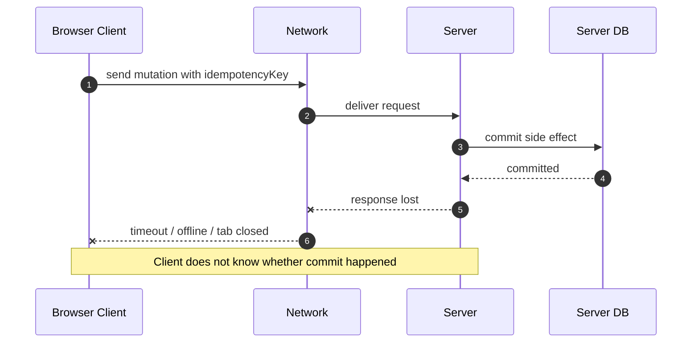
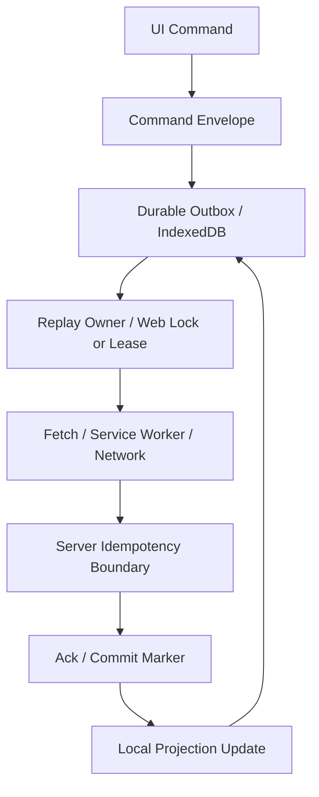
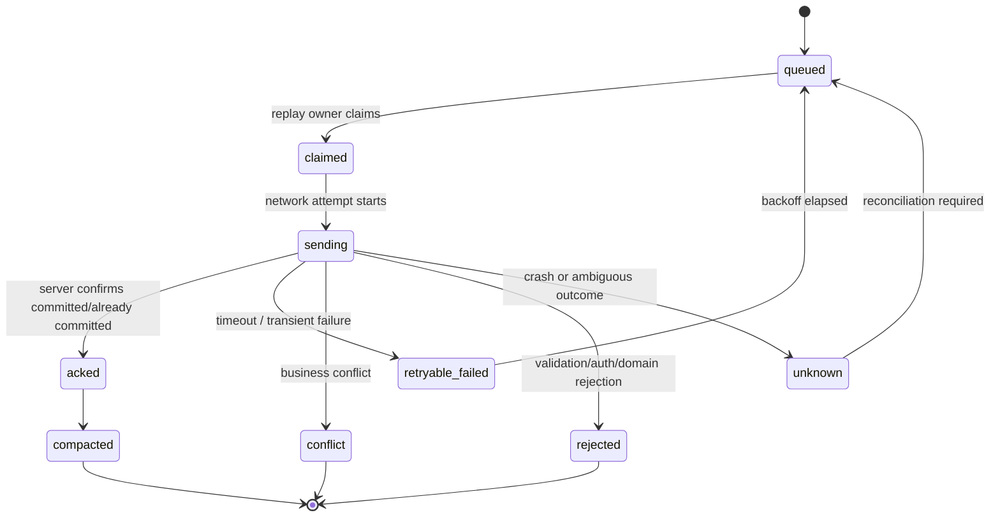
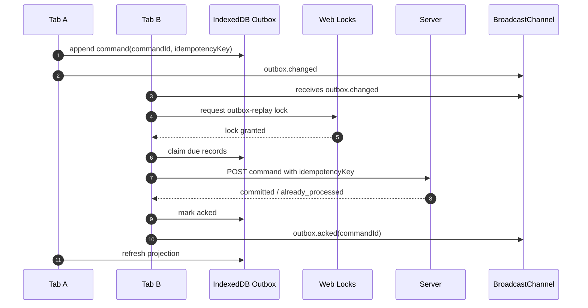

# Part 055 — Exactly-Once Is a Lie: Practical Delivery Semantics

The dangerous sentence is:

> "This operation must happen exactly once."

In a browser application, especially one with multiple tabs, workers, Service Worker, offline queue, retries, page freeze, crash recovery, and network uncertainty, **exactly-once delivery is not a primitive you get from the platform**.

You can build something that looks like exactly once to the business domain, but the implementation is almost always a composition of:

1. **at-least-once attempt**
2. **idempotent command identity**
3. **dedupe window or durable dedupe table**
4. **server-side idempotency contract**
5. **client-side stale response fencing**
6. **observable state machine**
7. **recovery after unknown outcome**

This part is about replacing wishful thinking with a precise, production-grade delivery model.

---

## 1. The Core Problem

A browser app does not control all parts of the execution path.

A user can:

- open the same app in five tabs;
- close the leader tab during a flush;
- go offline after the request reaches the server but before the response returns;
- resume a frozen tab with stale state;
- reload during IndexedDB migration;
- trigger the same action in two visible windows;
- restore a page from bfcache;
- clear site data;
- rotate auth tokens while an old request is in flight.

A network call can:

- time out after server commit;
- fail before server receipt;
- fail after server receipt;
- be retried by client code;
- be retried by Service Worker logic;
- be replayed from an offline queue;
- be replayed by a newer tab after old tab crash.

A message between browser contexts can:

- arrive late;
- be duplicated by retry logic;
- be lost because the receiver is closed;
- be rejected because structured clone failed;
- be processed after leadership changed;
- arrive at a tab running an older app version.

So the real question is not:

> "How do we guarantee exactly once?"

The real question is:

> "Which side effects are allowed to be retried, which are allowed to be dropped, and which require durable idempotency?"

---

## 2. Delivery Terms That Actually Matter

### 2.1 At-most-once

The system attempts the operation zero or one time.

If the attempt is lost, it is not retried.

Good for:

- ephemeral UI notification;
- analytics event where loss is acceptable;
- best-effort presence signal;
- progress update;
- cache invalidation signal when another durable source exists.

Bad for:

- payment;
- form submission;
- regulatory case action;
- document upload commit;
- logout revocation;
- permission mutation.

Invariant:

```txt
No duplicate attempt is acceptable, but loss is acceptable.
```

### 2.2 At-least-once

The system retries until it believes the operation succeeded.

This can produce duplicates.

Good for:

- durable outbox;
- offline queue;
- sync replay;
- conflict resolution submission;
- server mutation with idempotency key.

Bad when:

- receiver is not idempotent;
- duplicate side effects are expensive or illegal;
- dedupe identity is missing;
- retry has no deadline or poison-message policy.

Invariant:

```txt
Loss is unacceptable, duplicate attempts are expected.
```

### 2.3 Effectively-once

The operation may be attempted multiple times, but the business effect is applied once.

This is what most teams mean when they say exactly-once.

It requires a receiver-side contract.

Invariant:

```txt
Duplicate attempts may happen, but duplicate business effect must not happen.
```

### 2.4 Exactly-once

In distributed systems, exactly-once is usually a marketing phrase unless the boundary is extremely constrained.

Inside a single IndexedDB transaction, you can reason about atomic local changes.

Across:

- browser tab;
- worker;
- Service Worker;
- network;
- server;
- database;
- notification system;
- file storage;
- cache;

there is no universal exactly-once primitive.

You build **effectively-once semantics** using idempotency, dedupe, fencing, durable state, and compensating logic.

---

## 3. The Two Failure Windows

Every remote mutation has two ambiguous windows.



From the browser's point of view, after a timeout there are several possibilities:

| Possibility | Server received? | Server committed? | Client knows? |
|---|---:|---:|---:|
| Request never left browser | no | no | no |
| Request reached network but not server | no | no | no |
| Server received but rejected | yes | no | maybe not |
| Server committed but response lost | yes | yes | no |
| Server committed and response returned to closed tab | yes | yes | no durable client state |

The client cannot infer the truth from timeout alone.

Therefore retrying without idempotency is unsafe.

---

## 4. Delivery Semantics by Operation Type

Not every operation deserves the same delivery semantics.

A mature system classifies operations.

| Operation | Suggested semantics | Required design |
|---|---|---|
| Presence heartbeat | at-most-once | TTL expiry, no retry storm |
| Typing indicator | at-most-once | drop stale indicators |
| Cache invalidation signal | at-most-once or at-least-once | durable version check on next read |
| Analytics event | at-most-once or batched at-least-once | dedupe event ID if business-critical |
| Notification read receipt | at-least-once | idempotency key per notification/user/action |
| Draft save | effectively-once latest-write-wins or revision-based | entity revision, conflict handling |
| Case status transition | effectively-once | command ID, optimistic concurrency, audit log |
| Payment | effectively-once server-side | idempotency key, durable server dedupe, reconciliation |
| File upload commit | effectively-once | upload session ID, manifest, commit token |
| Logout | at-least-once local cleanup + server revocation | durable revocation marker |
| Token refresh | single-flight + fenced result | refresh generation, session version |

A top-tier engineer does not ask "can we retry?" in isolation.

They ask:

> "What is the receiver contract if the same command arrives twice?"

---

## 5. The Browser Delivery Stack

A reliable browser-side mutation pipeline usually has five layers.



Each layer has a different job.

| Layer | Responsibility | Must not do |
|---|---|---|
| UI | create user intent | decide delivery truth |
| Command envelope | carry stable identity | carry secrets unnecessarily |
| Outbox | survive reload/crash/offline | assume network success |
| Replay owner | avoid duplicate concurrent flush | assume ownership implies effect applied |
| Transport | send attempt | invent idempotency |
| Server | dedupe and commit | depend on client honesty alone |
| Projection | update local read model | accept stale response blindly |
| Ack marker | record terminal state | erase forensic evidence too early |

---

## 6. Command Identity

A retryable operation needs a stable identity.

Do not use a new ID on every retry.

Bad:

```ts
async function submitCaseTransition(caseId: string, nextStatus: string) {
  await fetch('/api/cases/transition', {
    method: 'POST',
    body: JSON.stringify({
      requestId: crypto.randomUUID(), // wrong: changes if rebuilt on retry
      caseId,
      nextStatus,
    }),
  });
}
```

Better:

```ts
type CommandId = string;

type CaseTransitionCommand = {
  commandId: CommandId;
  entityType: 'case';
  entityId: string;
  operation: 'transition-status';
  expectedRevision: number;
  payload: {
    nextStatus: string;
    reasonCode: string;
  };
  createdAtMs: number;
  actorSessionId: string;
};
```

The command ID is created once when the user intent is accepted, persisted durably, and reused for every retry.

---

## 7. Idempotency Key Design

An idempotency key is not just a random UUID.

It is a contract.

A good idempotency key answers:

1. Which operation is being deduped?
2. Which actor/session/tenant does it belong to?
3. Which resource does it mutate?
4. What is the dedupe lifetime?
5. What response should be returned for duplicate attempts?
6. What happens if the same key is reused with a different payload?

### 7.1 Recommended shape

```ts
function buildIdempotencyKey(command: CaseTransitionCommand): string {
  return [
    'case-transition',
    command.entityId,
    command.commandId,
  ].join(':');
}
```

### 7.2 Server-side record

```ts
type IdempotencyRecord = {
  key: string;
  tenantId: string;
  actorId: string;
  operation: string;
  payloadHash: string;
  status: 'started' | 'committed' | 'failed';
  responseCode?: number;
  responseBody?: unknown;
  createdAt: string;
  expiresAt: string;
};
```

### 7.3 Payload hash invariant

If the same idempotency key arrives with a different payload, the server should usually reject it.

```txt
same key + same payload     => return original result
same key + different payload => reject as idempotency conflict
```

Otherwise, a client bug can accidentally collapse two different business operations into one.

---

## 8. Local Dedupe Is Not Enough

Client-side dedupe is useful for reducing duplicate attempts.

It is not enough for correctness.

Why?

- user may open another browser profile;
- user may use another device;
- browser storage may be cleared;
- client may crash before writing ack;
- Service Worker may retry;
- reverse proxy may retry;
- user may click submit twice before local state persists;
- old tab may replay after new tab already replayed.

Client dedupe is an optimization and UX guard.

Server dedupe is the business correctness boundary.

---

## 9. Outbox Record State Machine

A durable outbox record should not be just `{ pending: true }`.

It needs states.



### 9.1 Example schema

```ts
type OutboxRecord = {
  commandId: string;
  idempotencyKey: string;
  operation: string;
  payload: unknown;
  payloadHash: string;
  status:
    | 'queued'
    | 'claimed'
    | 'sending'
    | 'retryable_failed'
    | 'unknown'
    | 'conflict'
    | 'rejected'
    | 'acked';
  claim?: {
    ownerId: string;
    token: string;
    expiresAtMs: number;
  };
  attempt: number;
  nextAttemptAtMs: number;
  lastError?: {
    code: string;
    message: string;
    atMs: number;
  };
  createdAtMs: number;
  updatedAtMs: number;
  sessionVersion: number;
  schemaVersion: number;
};
```

---

## 10. The Difference Between ACK and Commit

An ACK is a message.

A commit is a state transition at the receiver.

These are not the same.

| Event | Meaning |
|---|---|
| HTTP 200 received | client received response |
| server returned `already_processed` | server recognized idempotency key |
| local outbox marked `acked` | client persisted terminal state |
| local projection updated | user-facing state changed |
| server audit log appended | business effect recorded |

If the browser receives HTTP 200 but crashes before marking outbox `acked`, it may retry after restart.

That is fine if server idempotency is correct.

---

## 11. Stale Response Fencing

A response can be correct for an old session, old leader, old tenant, old entity revision, or old schema.

Do not apply it blindly.

```ts
type FencedResponse<T> = {
  commandId: string;
  sessionVersion: number;
  tenantId: string;
  entityId: string;
  entityRevision: number;
  serverAppliedAt: string;
  body: T;
};

function canApplyResponse(response: FencedResponse<unknown>, local: LocalState): boolean {
  if (response.tenantId !== local.tenantId) return false;
  if (response.sessionVersion < local.sessionVersion) return false;
  if (local.revokedAtMs !== undefined) return false;
  return true;
}
```

The invariant:

```txt
Receiving a response does not grant permission to mutate local state.
```

The reducer decides whether a response is still relevant.

---

## 12. Idempotent Local Reducer

Even local projection updates should be idempotent.

Bad:

```ts
state.unreadCount -= 1;
```

If replayed twice, the count becomes wrong.

Better:

```ts
function applyNotificationRead(state: State, event: NotificationReadEvent): State {
  const notification = state.notifications[event.notificationId];
  if (!notification) return state;

  if (notification.readAtMs !== undefined) {
    return state;
  }

  return {
    ...state,
    notifications: {
      ...state.notifications,
      [event.notificationId]: {
        ...notification,
        readAtMs: event.readAtMs,
      },
    },
    unreadCount: Math.max(0, state.unreadCount - 1),
  };
}
```

Best for counters:

```ts
function deriveUnreadCount(notifications: Record<string, NotificationItem>): number {
  return Object.values(notifications).filter((n) => n.readAtMs === undefined).length;
}
```

Avoid storing derived counters as the only truth unless you have a reconciliation strategy.

---

## 13. Delivery Semantics for Cross-Tab Messages

`BroadcastChannel`, `MessagePort`, `postMessage`, and Service Worker client messaging are transport primitives.

They do not give you durable delivery.

### 13.1 Suggested semantics

| Message type | Delivery expectation | Design |
|---|---|---|
| `presence.heartbeat` | at-most-once | TTL expiry |
| `session.logout` | at-least-once signal + durable marker | IndexedDB/localStorage marker |
| `cache.invalidate` | at-most-once signal + version check | check manifest on read |
| `outbox.changed` | at-most-once signal | durable outbox query |
| `leader.claimed` | advisory | Web Lock/lease is source of truth |
| `token.refreshed` | metadata only | follower re-reads token state or memory-safe channel |
| `migration.required` | advisory + durable app version gate | DB version/protocol check |

The pattern is:

```txt
volatile message tells you: "something changed"
durable store tells you: "what is true"
```

---

## 14. Retry Policy

Retries without policy become self-inflicted DDoS.

A retry policy needs:

- max attempts or max age;
- exponential backoff;
- jitter;
- error classification;
- auth/session awareness;
- network status awareness;
- poison-message detection;
- observability;
- user escalation path.

### 14.1 Example error classification

| Failure | Retry? | State |
|---|---:|---|
| network offline | yes | `retryable_failed` |
| request timeout | yes, but unknown outcome | `unknown` or `retryable_failed` |
| HTTP 409 conflict | no automatic retry | `conflict` |
| HTTP 400 validation | no | `rejected` |
| HTTP 401 stale token | refresh once, then retry | `queued` after auth refresh |
| HTTP 403 revoked permission | no | `rejected` + session/authz invalidation |
| HTTP 429 | yes with server delay | `retryable_failed` |
| HTTP 500 | yes with backoff | `retryable_failed` |
| payload schema unsupported | no | `rejected` or `requires_upgrade` |

### 14.2 Backoff helper

```ts
function nextBackoffMs(attempt: number): number {
  const base = 1_000;
  const max = 60_000;
  const exponential = Math.min(max, base * 2 ** attempt);
  const jitter = Math.floor(Math.random() * 1_000);
  return exponential + jitter;
}
```

---

## 15. Unknown Outcome Handling

Timeout is not always retryable in the same way as connection refused.

A timeout may mean:

- server never saw request;
- server is processing slowly;
- server committed but response was lost.

For high-value mutations, introduce reconciliation.

```ts
type ReconciliationRequest = {
  idempotencyKey: string;
  commandId: string;
  entityId: string;
};
```

Server response:

```ts
type ReconciliationResponse =
  | { status: 'not_seen' }
  | { status: 'processing' }
  | { status: 'committed'; response: unknown }
  | { status: 'failed'; errorCode: string };
```

Client policy:

| Reconciliation status | Client action |
|---|---|
| `not_seen` | retry original command |
| `processing` | wait/backoff |
| `committed` | mark acked and apply response if fenced |
| `failed` | terminal failure or retry depending on code |

---

## 16. Single-Owner Replay Is Not Exactly-Once

Using Web Locks for replay ownership reduces duplicate concurrent attempts.

It does not prove the operation happened once.

```ts
await navigator.locks.request('outbox-replay', async () => {
  await flushOutboxOnce();
});
```

This ensures that while the lock is held, another same-origin tab/worker cannot acquire that same lock.

But duplicates can still happen if:

- previous owner timed out after server commit;
- old owner crashed before marking ACK;
- another device sent same logical command;
- server retried internally;
- user repeated operation with same semantic effect;
- IndexedDB lease fallback split-brained due to bug.

Web Locks coordinates **attempt ownership**.

Idempotency coordinates **business effect**.

---

## 17. Service Worker Replay Caveat

Service Worker can be a good replay owner, but it is not a permanent process.

It can be started and stopped by the browser.

Therefore a replay design should not assume in-memory state survives.

Good:

```txt
Service Worker wakes -> reads outbox -> claims records -> sends -> persists result
```

Bad:

```txt
Service Worker stores pending replay only in memory
```

A Service Worker is a coordinator, not your durable database.

---

## 18. Multi-Tab Replay Architecture



Key point:

The BroadcastChannel message is only a wake-up.

IndexedDB is the durable source of truth.

Server idempotency is the business correctness boundary.

---

## 19. Dedupe Window

Dedupe cannot be infinite without storage cost.

A server idempotency table needs retention.

| Operation | Suggested dedupe retention |
|---|---:|
| UI duplicate submit | minutes to hours |
| offline outbox mutation | days to weeks |
| payment | provider/domain-specific, usually longer |
| audit-critical case action | long-lived or permanent command/audit ID |
| analytics event | short or sampled |

The retention window must exceed the maximum realistic retry/replay window.

If a browser can replay a command seven days later, a one-hour server dedupe window is not enough.

---

## 20. Idempotency and Authorization

Idempotency does not bypass authorization.

A duplicate command should be handled carefully when permission changes.

Scenario:

1. User had permission at command creation time.
2. User goes offline.
3. Permission is revoked.
4. Offline queue replays later.

Possible policies:

| Policy | Meaning |
|---|---|
| authorize at execution time | replay fails after revocation |
| authorize at intent time | command includes signed capability/delegation |
| mixed | certain operations use durable approval token |

For regulatory or audit systems, this policy must be explicit.

Do not let client-side retry semantics accidentally become an authorization loophole.

---

## 21. Idempotency and Audit Logs

For critical systems, audit logs should record command identity.

Example audit event:

```ts
type AuditEvent = {
  auditId: string;
  commandId: string;
  idempotencyKey: string;
  actorId: string;
  tenantId: string;
  entityType: string;
  entityId: string;
  operation: string;
  previousRevision: number;
  nextRevision: number;
  result: 'committed' | 'duplicate_returned' | 'rejected' | 'conflict';
  occurredAt: string;
};
```

This allows debugging questions such as:

- did the browser send twice?
- did the server apply twice?
- did the duplicate return cached response?
- did authorization change between attempts?
- did replay happen after logout?

---

## 22. Anti-Patterns

### 22.1 Retrying POST blindly

```ts
for (let i = 0; i < 3; i++) {
  await fetch('/api/submit', { method: 'POST', body });
}
```

Without idempotency, this can duplicate business effects.

### 22.2 Treating HTTP timeout as failure

A timeout is unknown outcome, not proof of failure.

### 22.3 Removing outbox record before local projection is consistent

If you mark done too early, crash recovery loses the ability to reconcile.

### 22.4 Broadcasting durable data as a message

Large mutable state should live in IndexedDB/Cache/OPFS.

Messages should carry small invalidation signals.

### 22.5 Using timestamp as dedupe identity

Two tabs can generate close timestamps.

Clock skew and precision limits make this fragile.

### 22.6 Assuming leader election equals idempotency

Leader election reduces concurrency.

It does not solve unknown outcome after network failure.

---

## 23. Implementation Sketch: Replay Engine

```ts
type ReplayDecision =
  | { kind: 'send'; record: OutboxRecord }
  | { kind: 'skip'; reason: string }
  | { kind: 'stop'; reason: string };

class OutboxReplayEngine {
  constructor(
    private readonly repo: OutboxRepository,
    private readonly transport: CommandTransport,
    private readonly session: SessionRuntime,
  ) {}

  async flushOnce(): Promise<void> {
    await navigator.locks.request('outbox-replay', async () => {
      const due = await this.repo.findDueRecords({ limit: 20, nowMs: Date.now() });

      for (const record of due) {
        const decision = this.decide(record);

        if (decision.kind === 'stop') return;
        if (decision.kind === 'skip') continue;

        await this.sendOne(decision.record);
      }
    });
  }

  private decide(record: OutboxRecord): ReplayDecision {
    if (this.session.isRevoked()) {
      return { kind: 'stop', reason: 'session-revoked' };
    }

    if (record.sessionVersion < this.session.version) {
      return { kind: 'skip', reason: 'stale-session-version' };
    }

    return { kind: 'send', record };
  }

  private async sendOne(record: OutboxRecord): Promise<void> {
    const claim = await this.repo.claim(record.commandId, {
      ownerId: this.session.tabId,
      token: crypto.randomUUID(),
      ttlMs: 30_000,
    });

    if (!claim.acquired) return;

    try {
      await this.repo.markSending(record.commandId, claim.token);

      const response = await this.transport.send({
        idempotencyKey: record.idempotencyKey,
        payloadHash: record.payloadHash,
        payload: record.payload,
      });

      if (!this.session.canApply(response.fence)) {
        await this.repo.markRetryable(record.commandId, {
          code: 'STALE_RESPONSE',
          message: 'Response fence rejected by local session runtime',
        });
        return;
      }

      await this.repo.markAcked(record.commandId, response);
    } catch (error) {
      await this.repo.markFailure(record.commandId, classifyReplayError(error));
    }
  }
}
```

This is still not exactly-once.

It is a controlled at-least-once replay engine with idempotency and fencing.

That is the point.

---

## 24. Testing Delivery Semantics

You cannot validate delivery semantics with only happy-path tests.

Use failure injection.

| Test | Expected invariant |
|---|---|
| duplicate click | one command ID or duplicate rejected |
| timeout after server commit | retry returns same server result |
| tab crash after HTTP 200 before ACK | retry does not duplicate business effect |
| two tabs flush same outbox | only one owner sends each claim, duplicates still safe |
| leader changes during send | stale leader response not applied if fenced out |
| logout during replay | replay stops or rejects stale response |
| server 409 conflict | record becomes conflict, not infinite retry |
| payload changed with same key | server rejects idempotency conflict |
| Service Worker wakes twice | durable claim prevents concurrent local duplicate |
| dedupe retention expired | system has defined reconciliation/escalation path |

### 24.1 Chaos helper ideas

Inject random failure at each boundary:

```ts
type FailurePoint =
  | 'before-outbox-write'
  | 'after-outbox-write'
  | 'after-claim'
  | 'before-network-send'
  | 'after-network-send-before-response'
  | 'after-response-before-ack'
  | 'after-ack-before-projection';
```

A robust system can recover or expose a clear terminal state from every point.

---

## 25. Production Checklist

Before shipping retry/replay, answer these:

- What is the command ID?
- Is it stable across retries?
- What is the idempotency key?
- Does the server persist idempotency state?
- What is the dedupe retention window?
- What happens if same key arrives with different payload?
- What is the outbox state machine?
- What errors are retryable?
- What errors are terminal?
- How are unknown outcomes reconciled?
- What prevents multiple tabs from flushing concurrently?
- What happens if that prevention fails?
- Are server mutations idempotent anyway?
- Can stale responses mutate local state?
- How is logout/session revocation handled during replay?
- How are conflicts represented to the user?
- How are poison messages detected?
- How is replay observed in logs/metrics?
- How is compaction done without deleting forensic data too early?

---

## 26. Mental Model Summary

Exactly-once is not a browser feature.

For serious browser orchestration, use this model:

```txt
Transport may duplicate.
Network outcome may be unknown.
Tabs may race.
Workers may die.
Messages may be stale.
Storage may be blocked.
Server must dedupe business effects.
Client must persist intent and fence stale results.
```

The practical target is:

```txt
at-least-once attempts + idempotent receiver + durable client state + fencing = effectively-once business effect
```

That is the production-grade version of "exactly once".

---

## References

- MDN — Web Locks API: https://developer.mozilla.org/en-US/docs/Web/API/Web_Locks_API
- MDN — IndexedDB API: https://developer.mozilla.org/en-US/docs/Web/API/IndexedDB_API
- MDN — IDBTransaction: https://developer.mozilla.org/en-US/docs/Web/API/IDBTransaction
- MDN — Background Synchronization API: https://developer.mozilla.org/en-US/docs/Web/API/Background_Synchronization_API
- MDN — Broadcast Channel API: https://developer.mozilla.org/en-US/docs/Web/API/Broadcast_Channel_API
