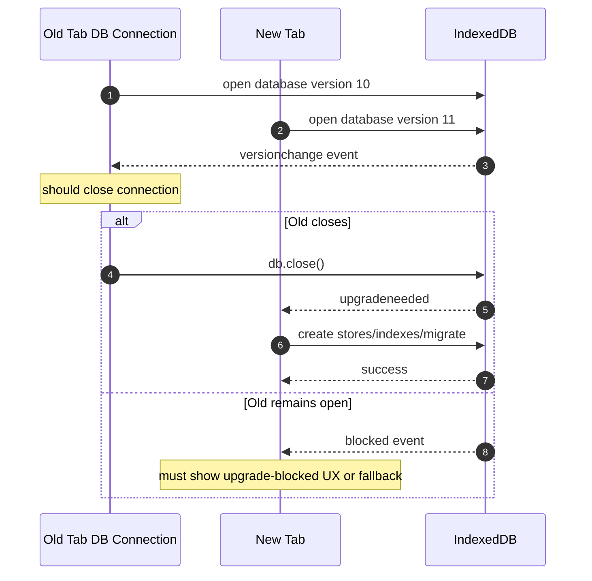
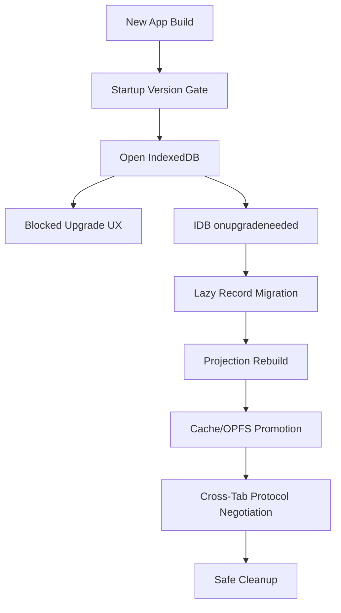
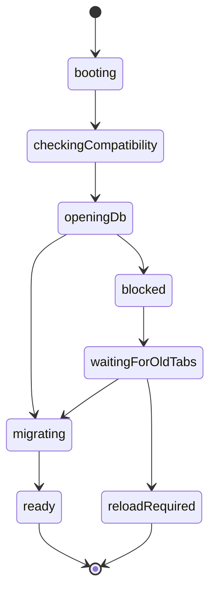

# Part 056 — Schema Versioning and Migration Across Open Tabs

Schema migration in a browser app is not just a database problem.

It is a coordination problem across:

- old tabs;
- new tabs;
- frozen tabs;
- discarded/restored tabs;
- Dedicated Workers;
- SharedWorker hubs;
- Service Worker versions;
- IndexedDB connections;
- Cache API versions;
- OPFS file layouts;
- protocol versions;
- offline queues created by old code.

A server can usually run migrations in a controlled deployment environment.

A browser cannot.

A user may keep an old tab open for days.

That old tab may still hold an IndexedDB connection.

That old tab may block an upgrade.

That old tab may resume later and write old-shaped records.

This part builds a migration strategy for that world.

---

## 1. The Core Failure Mode

Imagine this release sequence:

1. User opens Tab A on app version `v1`.
2. Tab A opens IndexedDB database version `10`.
3. You deploy app version `v2`, requiring IndexedDB version `11`.
4. User opens Tab B.
5. Tab B tries to open DB version `11`.
6. Tab A still has an open DB connection.
7. Upgrade is blocked.
8. Tab A is hidden or frozen and does not close the connection quickly.
9. Tab B cannot complete startup.

This is not theoretical. IndexedDB has explicit `blocked`, `upgradeneeded`, and `versionchange` behavior for this reason.

The production question is:

> "What should the app do while another tab blocks schema upgrade?"

Not:

> "Why did IndexedDB fail?"

---

## 2. Version Types You Must Separate

Do not collapse all versioning into one number.

You need several versions.

| Version | Scope | Example | Purpose |
|---|---|---|---|
| App build version | deployed JS bundle | `2026.07.08.1` | debug and rollout |
| Protocol version | cross-context message contract | `protocol: 5` | tab/worker compatibility |
| IndexedDB schema version | IDB database integer version | `db: 11` | object stores/indexes |
| Record schema version | per-record payload format | `schemaVersion: 3` | lazy migration/compatibility |
| Projection version | derived read model shape | `projectionVersion: 7` | rebuild stale views |
| Cache artifact version | Cache API namespace | `app-shell-v42` | cache promotion/cleanup |
| OPFS layout version | file layout | `opfsLayout: 2` | byte store compatibility |
| Server API version | backend contract | `api: 2026-07` | remote compatibility |

A top-tier browser architecture treats these as independent but related axes.

---

## 3. IndexedDB Upgrade Mental Model

IndexedDB upgrades are special because database structure changes happen during a version upgrade transaction.



Important implications:

- The upgrading tab is not fully in control.
- Other tabs can block it.
- Old tabs must cooperate by closing connections on `versionchange`.
- The app needs a user-facing or automated recovery path.

---

## 4. The Minimum IndexedDB Connection Contract

Every app connection to IndexedDB should install lifecycle handlers.

```ts
type DbRuntimeOptions = {
  dbName: string;
  version: number;
  appVersion: string;
  onUpgradeBlocked: () => void;
  onVersionChangeRequired: () => void;
  onUnexpectedClose: () => void;
};

async function openAppDb(options: DbRuntimeOptions): Promise<IDBDatabase> {
  return new Promise((resolve, reject) => {
    const request = indexedDB.open(options.dbName, options.version);

    request.onupgradeneeded = () => {
      const db = request.result;
      migrateDb(db, request.transaction!, request.oldVersion, options.version);
    };

    request.onblocked = () => {
      options.onUpgradeBlocked();
    };

    request.onerror = () => {
      reject(request.error);
    };

    request.onsuccess = () => {
      const db = request.result;

      db.onversionchange = () => {
        db.close();
        options.onVersionChangeRequired();
      };

      db.onclose = () => {
        options.onUnexpectedClose();
      };

      resolve(db);
    };
  });
}
```

The invariant:

```txt
Every old tab must close its DB connection when versionchange arrives.
```

If it does not, new schema rollout can stall.

---

## 5. Migration Is Not Just `onupgradeneeded`

`onupgradeneeded` is only one piece.

A full migration strategy has multiple layers.



If your migration plan only says "bump IndexedDB version and create a store", it is incomplete.

---

## 6. Migration Taxonomy

Different schema changes have different risk.

| Change | Risk | Strategy |
|---|---:|---|
| Add object store | low/medium | IDB version upgrade |
| Add index | medium | IDB version upgrade, may cost time |
| Rename store | high | create new, copy, dual-read/dual-write if needed |
| Delete store | high | delayed cleanup after compatibility window |
| Change record shape | medium/high | record schema version + lazy migration |
| Change primary key | high | new store + copy + validation |
| Rebuild projection | medium | projection version and background rebuild |
| Change outbox command schema | very high | backward-compatible replay or migration gate |
| Change OPFS layout | high | manifest version + staged migration |
| Change Cache API namespace | medium | versioned cache promotion |
| Change cross-tab protocol | high | capability negotiation |

---

## 7. Expand-Migrate-Contract for Browser Storage

Server teams often use expand/contract migrations.

Browser apps need the same discipline.

### 7.1 Expand

Add new schema without breaking old code.

Examples:

- add optional field;
- add new object store;
- add new index;
- add new cache namespace;
- write both old and new projection fields.

### 7.2 Migrate

Move data gradually.

Examples:

- lazy migrate records on read;
- rebuild projection in worker;
- promote Cache API artifact after manifest validation;
- migrate OPFS files through staged temporary files;
- convert outbox command shapes before replay.

### 7.3 Contract

Remove old schema only after old app versions can no longer write it.

Examples:

- delete old cache namespace;
- drop legacy object store;
- stop dual-write;
- reject old protocol;
- compact migration logs.

The contract phase is where most browser apps break, because old tabs can remain alive longer than deployment pipelines assume.

---

## 8. Record-Level Schema Versioning

Do not rely only on database version.

Each durable record that may live across releases should carry its own schema version.

```ts
type StoredCaseDraftV1 = {
  schemaVersion: 1;
  id: string;
  title: string;
  body: string;
};

type StoredCaseDraftV2 = {
  schemaVersion: 2;
  id: string;
  title: string;
  body: string;
  classification: 'low' | 'medium' | 'high';
};

type StoredCaseDraft = StoredCaseDraftV1 | StoredCaseDraftV2;

function upgradeDraft(record: StoredCaseDraft): StoredCaseDraftV2 {
  switch (record.schemaVersion) {
    case 1:
      return {
        schemaVersion: 2,
        id: record.id,
        title: record.title,
        body: record.body,
        classification: 'medium',
      };
    case 2:
      return record;
    default:
      return assertNever(record);
  }
}

function assertNever(value: never): never {
  throw new Error(`Unsupported draft schema: ${JSON.stringify(value)}`);
}
```

This enables lazy migration even when full database migration would be expensive.

---

## 9. Lazy Migration on Read

Lazy migration is useful when:

- record count is large;
- only a subset is read frequently;
- migration is deterministic;
- old shape can still be understood safely;
- write-back can happen transactionally.

```ts
async function readDraft(id: string): Promise<StoredCaseDraftV2 | undefined> {
  return dbTx('readwrite', ['drafts'], async (tx) => {
    const store = tx.objectStore('drafts');
    const raw = await idbGet<StoredCaseDraft>(store, id);
    if (!raw) return undefined;

    const upgraded = upgradeDraft(raw);

    if (upgraded.schemaVersion !== raw.schemaVersion) {
      await idbPut(store, upgraded);
    }

    return upgraded;
  });
}
```

Caution:

Lazy migration can create hidden write load during reads.

For high-volume reads, budget it.

---

## 10. Projection Versioning

A projection is derived state.

Do not treat projection schema as source-of-truth schema.

```ts
type ProjectionMeta = {
  name: string;
  version: number;
  sourceLogPosition: number;
  rebuiltAtMs: number;
};
```

On startup:

```ts
async function ensureProjection(name: string, requiredVersion: number) {
  const meta = await projectionRepo.getMeta(name);

  if (!meta || meta.version < requiredVersion) {
    await navigator.locks.request(`projection-rebuild:${name}`, async () => {
      const latest = await projectionRepo.getMeta(name);
      if (latest && latest.version >= requiredVersion) return;
      await rebuildProjection(name, requiredVersion);
    });
  }
}
```

Projection rebuild should be:

- cancellable;
- resumable if expensive;
- isolated from source event log;
- observable;
- safe if two tabs attempt it.

---

## 11. Protocol Versioning Across Tabs

Old and new tabs may run at the same time.

Their BroadcastChannel or SharedWorker messages must not assume identical code.

### 11.1 Envelope

```ts
type ProtocolEnvelope<T> = {
  protocolVersion: number;
  minReaderVersion: number;
  messageId: string;
  kind: string;
  sender: {
    appVersion: string;
    tabId: string;
    role: 'window' | 'dedicated-worker' | 'shared-worker' | 'service-worker';
  };
  payload: T;
};
```

### 11.2 Compatibility rule

```ts
function canReadEnvelope(envelope: ProtocolEnvelope<unknown>, runtime: RuntimeVersion): boolean {
  return envelope.minReaderVersion <= runtime.protocolVersion;
}
```

If a message cannot be read:

- ignore if advisory;
- ask user to reload if mandatory;
- read durable store instead if possible;
- emit metric.

Never crash the tab because another tab emitted a newer message.

---

## 12. Migration Broadcast Protocol

A new tab attempting migration should notify old tabs.

```ts
type MigrationMessage =
  | {
      kind: 'migration.required';
      targetDbVersion: number;
      targetAppVersion: string;
      reason: 'idb-upgrade' | 'protocol-incompatible' | 'cache-incompatible';
      requestedAtMs: number;
    }
  | {
      kind: 'migration.blocked';
      targetDbVersion: number;
      blockedForMs: number;
    }
  | {
      kind: 'migration.completed';
      dbVersion: number;
      appVersion: string;
      completedAtMs: number;
    };
```

Old tab behavior:

1. Stop accepting new writes.
2. Flush or persist in-flight work if possible.
3. Close IndexedDB connection.
4. Notify user that app update is available.
5. Reload at a safe point.

---

## 13. Startup Version Gate

The app should not fully start before version compatibility is known.



### 13.1 Gate responsibilities

The startup gate checks:

- minimum supported app version;
- server compatibility;
- required IndexedDB version;
- protocol compatibility;
- pending forced logout/revocation marker;
- unfinished WAL records;
- projection rebuild requirement;
- Service Worker controller version;
- cache manifest version.

This prevents the app from running half-old and half-new.

---

## 14. Handling `blocked`

When upgrade is blocked, do not spin forever silently.

Recommended policy:

| Block duration | Action |
|---:|---|
| 0-500ms | wait silently |
| 500ms-3s | show loading/update state |
| 3s-15s | broadcast `migration.required` |
| >15s | show user action: "Close other tabs or reload" |
| too long | offer safe reset only if domain permits |

### 14.1 Example blocked handler

```ts
function createBlockedUpgradeController() {
  let startedAtMs = 0;
  let timer: number | undefined;

  return {
    start(targetVersion: number) {
      startedAtMs = Date.now();

      timer = window.setInterval(() => {
        const blockedForMs = Date.now() - startedAtMs;

        migrationBus.publish({
          kind: 'migration.blocked',
          targetDbVersion: targetVersion,
          blockedForMs,
        });

        if (blockedForMs > 15_000) {
          showBlockedUpgradeUi();
        }
      }, 2_000);
    },
    stop() {
      if (timer !== undefined) window.clearInterval(timer);
    },
  };
}
```

---

## 15. Old Tab Write Freeze

When a tab receives `versionchange` or migration-required signal, it should stop writing old-shaped data.

```ts
type WriteGateState = 'open' | 'draining' | 'closed';

class WriteGate {
  private state: WriteGateState = 'open';

  beginDrain() {
    if (this.state === 'open') this.state = 'draining';
  }

  close() {
    this.state = 'closed';
  }

  assertCanWrite() {
    if (this.state !== 'open') {
      throw new Error(`Writes are disabled during app migration: ${this.state}`);
    }
  }
}
```

Old tab policy:

- allow read-only UI if safe;
- persist draft to memory or old DB before closing if safe;
- reject new durable mutations after drain starts;
- show reload/update banner;
- close DB connection.

---

## 16. Outbox Migration Is High Risk

Outbox records are not passive data.

They are future side effects.

If you change command schema, you must preserve replay semantics.

### 16.1 Example

Old command:

```ts
type SubmitCommentV1 = {
  schemaVersion: 1;
  commandId: string;
  caseId: string;
  body: string;
};
```

New command:

```ts
type SubmitCommentV2 = {
  schemaVersion: 2;
  commandId: string;
  caseId: string;
  body: string;
  visibility: 'internal' | 'external';
};
```

Migration rule:

```ts
function migrateSubmitComment(command: SubmitCommentV1 | SubmitCommentV2): SubmitCommentV2 {
  if (command.schemaVersion === 2) return command;

  return {
    schemaVersion: 2,
    commandId: command.commandId,
    caseId: command.caseId,
    body: command.body,
    visibility: 'internal',
  };
}
```

But this default must be a real business decision.

If there is no safe default, the command should become `requires_user_resolution`, not silently mutate semantics.

---

## 17. Migration Locks

Use Web Locks for expensive non-IDB work that should have one owner.

Examples:

- projection rebuild;
- OPFS layout migration;
- Cache API promotion;
- outbox command upgrade;
- dedupe table compaction;
- event log snapshot rebuild.

```ts
await navigator.locks.request('migration:projection:case-list:v7', async () => {
  const meta = await projectionRepo.getMeta('case-list');
  if (meta?.version >= 7) return;

  await rebuildCaseListProjectionV7();
});
```

Web Locks should not be the only correctness mechanism.

The migration should be idempotent and resumable if the owner dies.

---

## 18. Resumable Migration Records

For long migrations, store progress.

```ts
type MigrationRecord = {
  migrationId: string;
  version: number;
  status: 'pending' | 'running' | 'completed' | 'failed';
  owner?: {
    tabId: string;
    token: string;
    expiresAtMs: number;
  };
  cursor?: string;
  processedCount: number;
  startedAtMs?: number;
  updatedAtMs: number;
  error?: {
    code: string;
    message: string;
  };
};
```

A long migration should support:

- claim ownership;
- process bounded batch;
- persist cursor;
- release/yield;
- resume after crash;
- verify final invariant;
- mark completed.

---

## 19. OPFS Layout Migration

OPFS stores file-like data.

Migrating it needs file-system discipline.

Recommended pattern:

```txt
/data/v1/...       old layout
/data/v2.tmp/...   staged new layout
/data/v2/...       promoted new layout
manifest.json      current layout pointer
```

Steps:

1. Acquire migration ownership.
2. Read current manifest.
3. If already on target layout, exit.
4. Create staged target layout.
5. Copy/transform bounded batches.
6. Validate staged files.
7. Atomically-ish update manifest pointer.
8. Keep old layout until compatibility window expires.
9. Clean old layout later.

Do not delete old bytes before the new manifest is durable and validated.

---

## 20. Cache API Version Migration

Cache API migration should be versioned by namespace.

```ts
const CACHE_VERSION = 'case-app-shell-v42';
const OLD_CACHE_PREFIX = 'case-app-shell-';
```

Safe promotion:

1. Open new cache namespace.
2. Populate required artifacts.
3. Validate manifest/hash/version.
4. Broadcast `cache.ready`.
5. Let new app use new cache.
6. Delete old caches only after no old clients require them.

Deleting old caches too early can break old tabs still controlled by an older Service Worker or running older JS chunks.

---

## 21. Service Worker Version Interaction

Service Worker update and IndexedDB migration can interfere.

Problem cases:

- new page controlled by old Service Worker;
- old page controlled by new Service Worker;
- new Service Worker serves new assets while old tab still uses old protocol;
- Service Worker activates and deletes caches needed by old clients;
- migration requires reload but Service Worker update also requests reload.

Recommended design:

| Concern | Strategy |
|---|---|
| App shell assets | versioned cache namespace |
| API/cache protocol | explicit `appVersion` and `protocolVersion` |
| SW activation | safe-point update UX |
| Cache cleanup | delay until no old clients or after compatibility window |
| Client messaging | capability negotiation |
| DB migration | close old connections on `versionchange` |

Service Worker should not assume all clients upgrade atomically.

---

## 22. Compatibility Window

A browser deployment needs a compatibility window.

During this window:

- new code can read old records;
- old code may still exist in open tabs;
- new Service Worker may need to serve old chunks;
- old Service Worker may still control pages;
- server may need to accept old command shapes;
- cleanup must be delayed.

A practical rule:

```txt
Only remove backward compatibility after you can prove old clients are gone or safely blocked.
```

For internal tools, this may mean forcing reload.

For public apps, this may mean longer compatibility.

---

## 23. Forced Upgrade Policy

Sometimes backward compatibility is too expensive or unsafe.

Then force upgrade explicitly.

Examples:

- security-sensitive schema change;
- authorization model change;
- token storage policy change;
- outbox command semantics changed incompatibly;
- encryption key layout changed;
- server no longer accepts old protocol.

Forced upgrade flow:

1. Detect incompatibility.
2. Stop writes.
3. Persist recoverable user draft if safe.
4. Close DB connection.
5. Show blocking reload screen.
6. Reload app shell.
7. Re-open with new schema.
8. Run recovery/reconciliation.

Do not let old tabs continue mutating incompatible state.

---

## 24. Migration UX

Production migration needs UX.

Possible states:

| State | User message |
|---|---|
| background compatible migration | no message |
| short startup migration | "Updating local data..." |
| blocked by other tab | "Close or reload other open tabs to finish updating." |
| forced reload required | "This version is outdated and must reload." |
| migration failed recoverably | "We could not update local data. Retry." |
| migration failed irrecoverably | domain-specific support/reset flow |

Avoid technical words like IndexedDB in user-facing text unless your users are developers.

---

## 25. Safe Reset Is Domain-Specific

A "clear local data" button is dangerous.

It may be safe for:

- cached app shell;
- derived projections;
- temporary search indexes;
- downloaded artifacts that can be re-fetched.

It may be unsafe for:

- unsynced outbox mutations;
- offline drafts;
- pending uploads;
- audit-relevant local command log;
- encryption keys not recoverable from server.

Before offering reset, classify storage.

| Storage | Can reset? | Condition |
|---|---:|---|
| Cache API app shell | usually | can redownload |
| derived projection | yes | source log exists |
| IndexedDB outbox | usually no | unless server confirms no pending intent |
| OPFS staged upload | maybe | if upload can restart |
| local encryption key | dangerous | depends on recovery model |

---

## 26. Migration Observability

Log migration as a first-class workflow.

Useful events:

```ts
type MigrationTelemetryEvent =
  | { kind: 'db.open.started'; dbVersion: number; appVersion: string }
  | { kind: 'db.upgrade.started'; oldVersion: number; newVersion: number }
  | { kind: 'db.upgrade.blocked'; blockedForMs: number }
  | { kind: 'db.versionchange.received'; currentVersion: number }
  | { kind: 'db.connection.closed-for-upgrade' }
  | { kind: 'migration.batch.completed'; migrationId: string; count: number; cursor?: string }
  | { kind: 'migration.completed'; migrationId: string; durationMs: number }
  | { kind: 'migration.failed'; migrationId: string; code: string; message: string };
```

Metrics:

- startup migration duration;
- blocked upgrade count;
- average blocked duration;
- failed migrations by version;
- old app versions still active;
- protocol mismatch count;
- forced reload count;
- projection rebuild duration;
- outbox migration failures.

Without observability, migration bugs look like random startup hangs.

---

## 27. Testing Multi-Tab Migration

Use deterministic tests and chaos tests.

| Test | Expected invariant |
|---|---|
| old tab open, new tab upgrades | old tab receives `versionchange` and closes DB |
| old tab ignores `versionchange` | new tab shows blocked upgrade UX |
| hidden tab blocks upgrade | broadcast/update UX still resolves or escalates |
| migration interrupted halfway | next startup resumes or rolls forward safely |
| old message hits new tab | protocol rejects or ignores safely |
| new message hits old tab | old tab ignores unsupported message |
| old outbox command replays after migration | command is migrated or blocked for resolution |
| cache cleanup while old tab open | old tab still has required assets or reloads safely |
| Service Worker activates during DB migration | no mixed-version corruption |
| OPFS migration crash after staging | manifest still points to valid old layout |

### 27.1 Playwright-style scenario

Pseudo-flow:

```ts
test('new tab upgrade is blocked by old tab until old connection closes', async ({ browser }) => {
  const context = await browser.newContext();

  const oldTab = await context.newPage();
  await oldTab.goto('/app?v=old');
  await oldTab.evaluate(() => window.__test.openDbVersion(10));

  const newTab = await context.newPage();
  await newTab.goto('/app?v=new');
  await newTab.evaluate(() => window.__test.openDbVersion(11));

  await expect(newTab.locator('[data-testid="migration-blocked"]')).toBeVisible();

  await oldTab.evaluate(() => window.__test.closeDb());

  await expect(newTab.locator('[data-testid="app-ready"]')).toBeVisible();
});
```

---

## 28. Migration Runbook

For every release with storage changes, prepare a runbook.

### 28.1 Before release

- List schema changes.
- Identify compatibility risks.
- Define app/protocol/db/record/cache versions.
- Verify old app can survive new messages.
- Verify new app can read old records.
- Verify server accepts old and new command shapes if needed.
- Test blocked upgrade.
- Test downgrade/rollback scenario.
- Prepare kill switch.

### 28.2 During release

- Monitor blocked upgrade count.
- Monitor migration failure rate.
- Monitor old app active clients.
- Monitor Service Worker activation errors.
- Monitor outbox replay errors.
- Watch support reports for startup hangs.

### 28.3 After release

- Delay destructive cleanup.
- Verify old versions have drained.
- Run cleanup migration.
- Compact logs/projections.
- Remove compatibility code in a later release.

---

## 29. Anti-Patterns

### 29.1 Bumping DB version without handling blocked

If you do not handle `blocked`, users can see startup hangs with no explanation.

### 29.2 Deleting old stores immediately

Old tabs may still try to read/write old state.

### 29.3 Changing outbox payload without migration

Old offline commands become unreplayable or semantically wrong.

### 29.4 Assuming deploy means all clients updated

Browser clients update when users load/reload, not when CI/CD finishes.

### 29.5 Using one global `APP_VERSION` for everything

DB schema, message protocol, cache namespace, and record schema evolve differently.

### 29.6 Running expensive migration on main thread

Large migration work can block UI and trigger bad user behavior like refresh/close.

Use workers or chunked processing when appropriate.

### 29.7 No rollback plan

Once a DB upgrade runs, old code may not be able to read the new schema.

Plan rollback before shipping.

---

## 30. Production Checklist

Before shipping a browser storage migration, answer:

- What is the old DB version?
- What is the new DB version?
- What object stores/indexes change?
- Can old code read data after this migration?
- Can new code read old records?
- Do records carry `schemaVersion`?
- Is lazy migration safe?
- Is projection rebuild resumable?
- Are outbox commands backward compatible?
- What happens if an old tab blocks upgrade?
- Does every DB connection handle `versionchange`?
- Does the new opener handle `blocked`?
- Is there a user-facing blocked upgrade state?
- Are Service Worker caches compatible with old clients?
- Is Cache API cleanup delayed safely?
- Are OPFS layout changes staged and recoverable?
- Are cross-tab messages versioned?
- Can old tabs ignore new messages?
- Can new tabs ignore old messages?
- Is there a forced upgrade path?
- Is there a rollback plan?
- Are metrics emitted for blocked/failed migrations?
- Is destructive cleanup delayed to a later release?

---

## 31. Mental Model Summary

Browser schema migration is not a single transaction.

It is a distributed rollout across long-lived clients.

The invariant is:

```txt
New code must tolerate old data.
Old code must either tolerate new signals or be safely stopped.
Durable records must carry enough version information to migrate or reject safely.
Destructive cleanup must wait until compatibility risk is gone.
```

The practical strategy:

```txt
version every boundary
close old connections on versionchange
handle blocked upgrades visibly
migrate records explicitly
make long migrations resumable
keep protocols backward-compatible
force reload only when compatibility is unsafe
```

Schema migration is not just a storage concern.

It is part of your browser orchestration protocol.

---

## References

- MDN — IDBOpenDBRequest: https://developer.mozilla.org/en-US/docs/Web/API/IDBOpenDBRequest
- MDN — IDBDatabase close event: https://developer.mozilla.org/en-US/docs/Web/API/IDBDatabase/close_event
- W3C — Indexed Database API 3.0: https://www.w3.org/TR/IndexedDB/
- MDN — Web Locks API: https://developer.mozilla.org/en-US/docs/Web/API/Web_Locks_API
- MDN — CacheStorage: https://developer.mozilla.org/en-US/docs/Web/API/CacheStorage
- MDN — Origin Private File System: https://developer.mozilla.org/en-US/docs/Web/API/File_System_API/Origin_private_file_system
