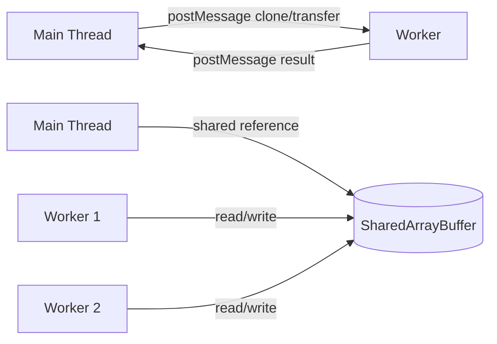
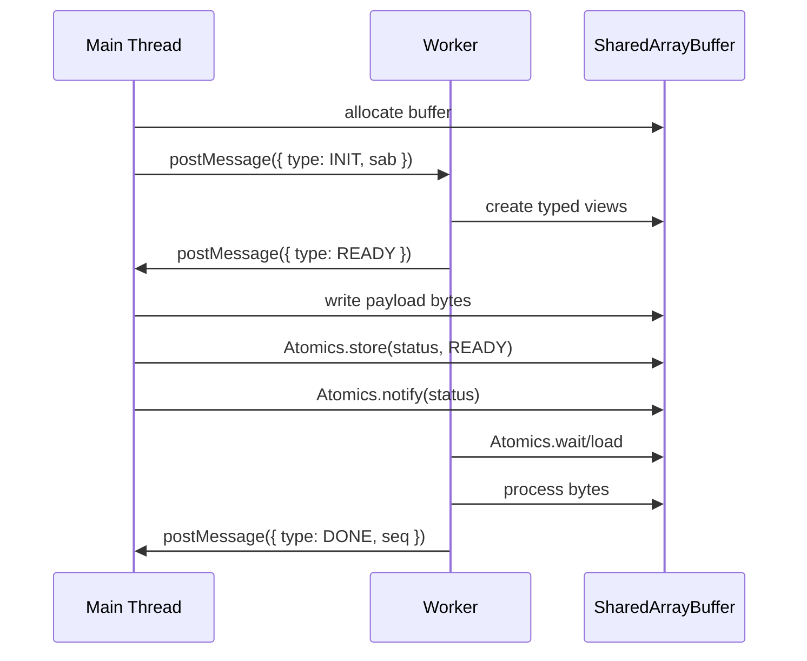
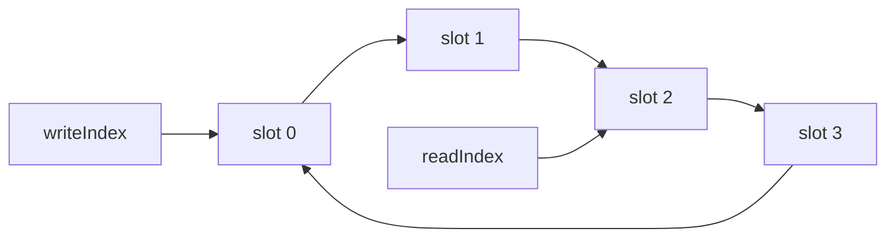
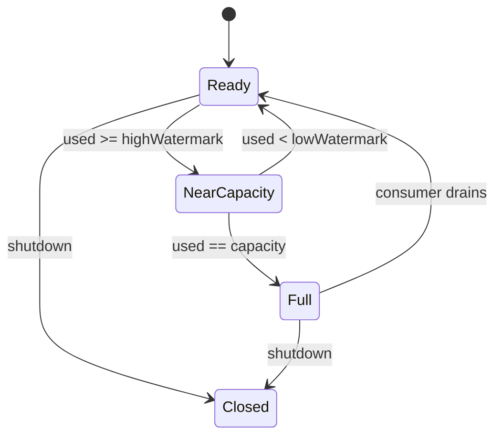
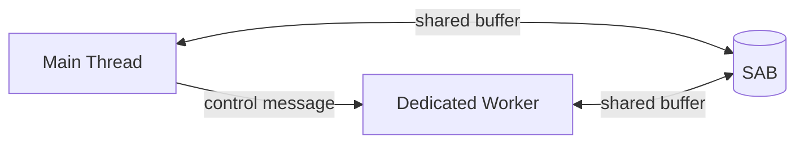
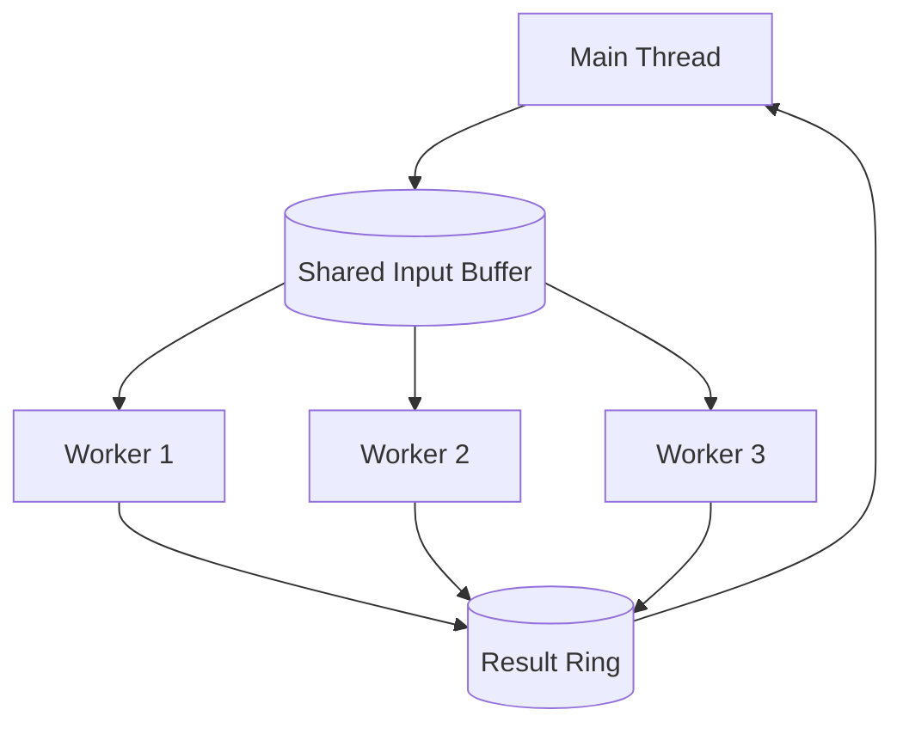
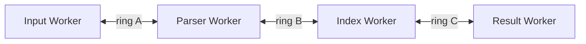
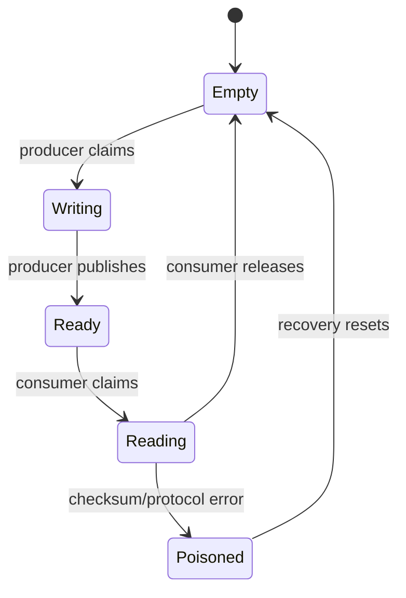
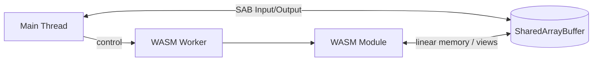
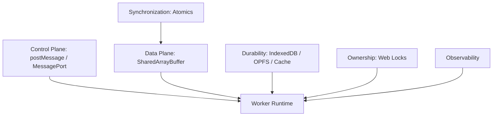

------
title: Learn Multiple Tab Orchestration and Web Worker In Action - Part 057
description: SharedArrayBuffer dan Atomics untuk shared memory concurrency di browser: mental model, invariants, memory layout, synchronization, ring buffer, backpressure, dan failure model.
series: learn-multiple-tab-orchestration-web-worker
seriesTitle: Learn Multiple Tab Orchestration and Web Worker In Action
order: 57
partTitle: SharedArrayBuffer and Atomics
tags:
  - javascript
  - web-worker
  - sharedarraybuffer
  - atomics
  - concurrency
  - browser-runtime
  - performance
date: 2026-07-08
---

# Part 057 — SharedArrayBuffer and Atomics

> Kita sudah memakai `postMessage`, `MessagePort`, `BroadcastChannel`, Web Locks, IndexedDB, Cache API, dan OPFS. Semua itu adalah koordinasi berbasis message, lock, atau durable store. Sekarang kita masuk ke primitive paling tajam di browser concurrency: **shared memory**.

`SharedArrayBuffer` bukan “cara lebih cepat mengirim object”. Ia adalah perubahan model komputasi.

Dengan `postMessage`, data berpindah sebagai pesan.

Dengan `SharedArrayBuffer`, beberapa execution context membaca dan menulis **byte yang sama**.

Konsekuensinya besar:

- tidak ada clone cost untuk byte yang sama,
- latency antar worker bisa sangat rendah,
- throughput bisa tinggi,
- tetapi correctness pindah ke tangan kita,
- dan bug-nya tidak lagi mudah terlihat seperti exception biasa.

Kalau bagian sebelumnya memperlakukan browser seperti sistem aktor, bagian ini memperlakukan browser seperti runtime concurrent shared-memory.

---

## 1. The Core Shift: Message Passing vs Shared Memory

Dalam browser modern, ada dua model besar untuk komunikasi antar execution context.



### Message passing model

Message passing memberi kita boundary yang lebih aman:

- sender mengirim payload,
- receiver menerima payload setelah structured clone atau transfer,
- ownership lebih eksplisit,
- ordering mengikuti event queue,
- race relatif lebih mudah dilokalisasi.

Tetapi message passing punya biaya:

- object graph clone,
- transfer ownership yang membuat sender tidak bisa memakai buffer lagi,
- extra allocation,
- latency karena task queue,
- payload besar bisa menekan GC.

### Shared memory model

Shared memory memberi beberapa context akses ke memory region yang sama.

Keuntungannya:

- tidak perlu copy ulang byte besar,
- cocok untuk stream binary, audio, video frame, WASM memory pipeline, parser pipeline, telemetry buffer, dan high-frequency worker communication,
- bisa dipakai untuk bounded queue/ring buffer dengan overhead rendah.

Biayanya:

- perlu synchronization,
- race condition bisa silently corrupt state,
- debugging lebih sulit,
- deadlock/livelock mungkin terjadi,
- cross-origin isolation biasanya menjadi syarat deployment.

Mental model yang benar:

> `SharedArrayBuffer` memberi kita memory. `Atomics` memberi kita alat minimum untuk membuat akses memory itu bisa disinkronisasi. Sisanya adalah protocol design.

---

## 2. What Is Actually Shared?

`SharedArrayBuffer` adalah raw binary buffer. Ia bukan object store.

Kita tidak share object JavaScript seperti ini:

```ts
// Salah secara mental model.
const shared = {
  jobs: [],
  currentUser: { id: "u1" }
};
```

Kita share byte seperti ini:

```ts
const sab = new SharedArrayBuffer(1024 * 1024);
const bytes = new Uint8Array(sab);
const control = new Int32Array(sab, 0, 16);
```

Object JavaScript tetap berada di heap masing-masing agent/context. Yang shared adalah underlying bytes dari `SharedArrayBuffer`.

Karena itu desain shared memory harus dimulai dari **layout**.

---

## 3. Shared Memory Layout Thinking

Shared memory yang serius harus punya layout eksplisit.

Contoh layout sederhana:

```txt
+----------------------+-----------------------+
| Header / Control     | Payload Region        |
| Int32Array           | Uint8Array            |
+----------------------+-----------------------+
| status               | bytes...              |
| writeIndex           |                       |
| readIndex            |                       |
| capacity             |                       |
| generation           |                       |
| cancelFlag           |                       |
+----------------------+-----------------------+
```

Header biasanya memakai `Int32Array` karena banyak operasi `Atomics` bekerja di typed array integer tertentu.

Payload biasanya memakai `Uint8Array`, `Float32Array`, atau typed array lain sesuai data.

```ts
const HEADER_INTS = 16;
const HEADER_BYTES = HEADER_INTS * Int32Array.BYTES_PER_ELEMENT;
const CAPACITY = 1024 * 1024;

const sab = new SharedArrayBuffer(HEADER_BYTES + CAPACITY);

const header = new Int32Array(sab, 0, HEADER_INTS);
const payload = new Uint8Array(sab, HEADER_BYTES, CAPACITY);

const H = {
  STATUS: 0,
  WRITE: 1,
  READ: 2,
  CAPACITY: 3,
  GENERATION: 4,
  CANCEL: 5,
  ERROR: 6,
} as const;

Atomics.store(header, H.CAPACITY, CAPACITY);
Atomics.store(header, H.GENERATION, 1);
```

Invariant pertama:

> Setiap integer yang dipakai sebagai coordination variable harus dibaca/ditulis melalui `Atomics`, bukan akses normal.

---

## 4. Why Atomics Exist

Tanpa `Atomics`, dua worker bisa membaca dan menulis value yang sama dengan interleaving yang tidak kita kontrol.

Contoh bug klasik:

```ts
// Tidak aman untuk shared counter.
counter[0] = counter[0] + 1;
```

Operasi itu bukan satu langkah. Secara konseptual:

1. load `counter[0]`,
2. tambah 1,
3. store hasil.

Dua worker bisa melakukan interleaving:

```txt
counter = 7
Worker A load 7
Worker B load 7
Worker A store 8
Worker B store 8
```

Expected: 9. Actual: 8.

Dengan `Atomics.add`:

```ts
const previous = Atomics.add(counter, 0, 1);
const current = previous + 1;
```

Operasi increment menjadi atomic terhadap agent lain yang memakai operasi atomic kompatibel.

---

## 5. Atomic Operations You Actually Use

Kita tidak perlu menghafal semua operasi di awal. Dalam production worker orchestration, operasi berikut paling sering dipakai.

| Operation | Use Case |
|---|---|
| `Atomics.load` | membaca coordination variable dengan memory ordering yang benar |
| `Atomics.store` | menulis coordination variable dengan publish semantics |
| `Atomics.add` / `sub` | counter, in-flight count, sequence number |
| `Atomics.compareExchange` | claim ownership, CAS state transition |
| `Atomics.exchange` | swap flag/status |
| `Atomics.wait` | worker sleep sampai value berubah |
| `Atomics.notify` | membangunkan worker yang menunggu |
| `Atomics.waitAsync` | non-blocking wait pattern, ketika tersedia dan cocok |

Contoh compare-and-swap:

```ts
const UNLOCKED = 0;
const LOCKED = 1;

function tryLock(lock: Int32Array, index: number): boolean {
  const prev = Atomics.compareExchange(lock, index, UNLOCKED, LOCKED);
  return prev === UNLOCKED;
}

function unlock(lock: Int32Array, index: number) {
  Atomics.store(lock, index, UNLOCKED);
  Atomics.notify(lock, index, 1);
}
```

Ini bukan rekomendasi membuat mutex sendiri untuk semua kasus. Untuk koordinasi lintas tab/worker level resource, Web Locks lebih aman dan lebih tinggi level. Mutex SAB berguna untuk koordinasi low-level di dalam cluster worker yang memang didesain untuk shared memory.

---

## 6. `Atomics.wait` Is Not a Main Thread Tool

`Atomics.wait()` dapat membuat agent tidur sampai value berubah atau timeout. Ini berguna di worker karena worker boleh blocking tanpa membekukan UI.

Jangan desain main thread yang blocking menunggu shared memory.

Pattern benar:

```txt
Main thread:
  - membuat SAB
  - mengirim SAB ke worker
  - tetap event-driven
  - menerima progress/result via postMessage atau polling ringan

Worker:
  - boleh wait pada control variable
  - memproses payload
  - notify worker lain bila perlu
```

Contoh worker waiting loop:

```ts
// worker.ts
const EMPTY = 0;
const READY = 1;
const CLOSED = 2;

function workerLoop(header: Int32Array, payload: Uint8Array) {
  while (true) {
    const status = Atomics.load(header, H.STATUS);

    if (status === CLOSED) return;

    if (status === EMPTY) {
      Atomics.wait(header, H.STATUS, EMPTY, 1000);
      continue;
    }

    if (status === READY) {
      processPayload(payload);
      Atomics.store(header, H.STATUS, EMPTY);
      Atomics.notify(header, H.STATUS, 1);
    }
  }
}
```

Main thread tetap jangan melakukan `Atomics.wait` karena itu akan memblokir responsiveness.

---

## 7. Bootstrap: Shared Memory Still Starts with Message Passing

Untuk memakai `SharedArrayBuffer`, kita tetap memakai `postMessage` untuk bootstrap.



Shared memory tidak menggantikan message protocol sepenuhnya. Ia biasanya menggantikan **data plane**, bukan **control plane**.

Control plane:

- init,
- capability negotiation,
- error,
- shutdown,
- metrics,
- ownership,
- task metadata.

Data plane:

- byte payload,
- stream segment,
- ring buffer,
- decoded frames,
- WASM input/output memory.

Invariant:

> Gunakan message passing untuk control. Gunakan shared memory hanya untuk payload/coordination yang benar-benar butuh low-copy dan low-latency.

---

## 8. SAB Is Not Transferable

`ArrayBuffer` bisa ditransfer sehingga ownership pindah.

`SharedArrayBuffer` tidak berpindah ownership dengan cara yang sama. Ia tetap shared.

```ts
// ArrayBuffer transfer: sender kehilangan akses usable.
worker.postMessage({ buffer }, [buffer]);

// SharedArrayBuffer: referensi ke shared memory dikirim, memory tetap shared.
worker.postMessage({ sharedBuffer: sab });
```

Karena tetap shared, lifetime management harus eksplisit.

Pertanyaan yang harus dijawab:

- Siapa yang membuat buffer?
- Siapa yang boleh menulis region mana?
- Kapan buffer dianggap closed?
- Bagaimana reader tahu producer sudah mati?
- Bagaimana generation lama dicegah menulis ke protocol baru?
- Bagaimana cancellation dilakukan?
- Bagaimana memory diputus dari app session saat logout?

---

## 9. Producer/Consumer Contract

SAB paling aman ketika ownership region jelas.

Contoh single-producer single-consumer:

```txt
Producer owns:
  - writeIndex
  - payload write region

Consumer owns:
  - readIndex
  - payload read progress

Both coordinate through:
  - status
  - sequence
  - capacity
  - closed flag
```

Jangan biarkan semua worker menulis ke semua posisi.

Bad design:

```txt
Any worker can write any offset anytime.
```

Good design:

```txt
Worker A writes slot assigned by atomic claim.
Worker B reads slot after status READY.
Slot owner resets slot after ACK.
```

---

## 10. Minimal Shared Slot Protocol

Kita mulai dari satu slot sebelum ring buffer.

```ts
const SLOT_EMPTY = 0;
const SLOT_WRITING = 1;
const SLOT_READY = 2;
const SLOT_READING = 3;
const SLOT_CLOSED = 4;

const S = {
  STATE: 0,
  LENGTH: 1,
  SEQ: 2,
  ERROR: 3,
} as const;
```

Producer:

```ts
function publish(bytes: Uint8Array) {
  const prev = Atomics.compareExchange(header, S.STATE, SLOT_EMPTY, SLOT_WRITING);
  if (prev !== SLOT_EMPTY) {
    return false;
  }

  payload.set(bytes, 0);
  Atomics.store(header, S.LENGTH, bytes.length);
  Atomics.add(header, S.SEQ, 1);

  Atomics.store(header, S.STATE, SLOT_READY);
  Atomics.notify(header, S.STATE, 1);
  return true;
}
```

Consumer:

```ts
function consume() {
  while (true) {
    const state = Atomics.load(header, S.STATE);

    if (state === SLOT_CLOSED) return null;

    if (state !== SLOT_READY) {
      Atomics.wait(header, S.STATE, state, 1000);
      continue;
    }

    const prev = Atomics.compareExchange(header, S.STATE, SLOT_READY, SLOT_READING);
    if (prev !== SLOT_READY) continue;

    const length = Atomics.load(header, S.LENGTH);
    const copy = payload.slice(0, length); // copy out if consumer needs stable snapshot

    Atomics.store(header, S.STATE, SLOT_EMPTY);
    Atomics.notify(header, S.STATE, 1);

    return copy;
  }
}
```

Perhatikan bahwa consumer melakukan `slice`. Kalau consumer bisa memproses sebelum slot dikosongkan, copy bisa dihindari. Tetapi jika producer akan segera menimpa slot, consumer perlu snapshot atau ownership window yang jelas.

---

## 11. Ring Buffer Mental Model

Satu slot mudah tetapi throughput terbatas. Ring buffer memungkinkan producer menulis beberapa item sebelum consumer selesai semua.



Ring buffer punya dua pointer:

- `writeIndex`: posisi next write,
- `readIndex`: posisi next read.

Untuk single-producer single-consumer, desainnya jauh lebih sederhana daripada multi-producer multi-consumer.

Invariant umum:

```txt
used = writeIndex - readIndex
free = capacity - used
producer may write only if free > 0
consumer may read only if used > 0
```

Gunakan sequence number monotonik, bukan index modulo saja. Index modulo dipakai untuk lokasi slot, sequence monotonik dipakai untuk membedakan wrap-around.

---

## 12. Simplified SPSC Ring Buffer

Layout:

```txt
header Int32:
  0 writeSeq
  1 readSeq
  2 capacitySlots
  3 slotSize
  4 closed

payload:
  slot 0 bytes
  slot 1 bytes
  ...
```

Implementasi ring buffer minimal:

```ts
class SpscByteRing {
  private readonly header: Int32Array;
  private readonly bytes: Uint8Array;

  constructor(
    private readonly sab: SharedArrayBuffer,
    private readonly capacitySlots: number,
    private readonly slotSize: number,
  ) {
    this.header = new Int32Array(sab, 0, 16);
    this.bytes = new Uint8Array(sab, 16 * 4);
  }

  tryWrite(input: Uint8Array): boolean {
    if (input.length > this.slotSize - 4) {
      throw new Error("slot too small");
    }

    const writeSeq = Atomics.load(this.header, 0);
    const readSeq = Atomics.load(this.header, 1);
    const used = writeSeq - readSeq;

    if (used >= this.capacitySlots) {
      return false;
    }

    const slot = writeSeq % this.capacitySlots;
    const offset = slot * this.slotSize;

    const view = new DataView(this.bytes.buffer, this.bytes.byteOffset + offset, this.slotSize);
    view.setUint32(0, input.length, true);
    this.bytes.set(input, offset + 4);

    Atomics.store(this.header, 0, writeSeq + 1);
    Atomics.notify(this.header, 0, 1);
    return true;
  }

  readBlocking(timeoutMs = 1000): Uint8Array | null {
    while (true) {
      if (Atomics.load(this.header, 4) === 1) return null;

      const writeSeq = Atomics.load(this.header, 0);
      const readSeq = Atomics.load(this.header, 1);

      if (writeSeq === readSeq) {
        Atomics.wait(this.header, 0, writeSeq, timeoutMs);
        continue;
      }

      const slot = readSeq % this.capacitySlots;
      const offset = slot * this.slotSize;
      const view = new DataView(this.bytes.buffer, this.bytes.byteOffset + offset, this.slotSize);
      const length = view.getUint32(0, true);

      const output = this.bytes.slice(offset + 4, offset + 4 + length);
      Atomics.store(this.header, 1, readSeq + 1);
      Atomics.notify(this.header, 1, 1);
      return output;
    }
  }
}
```

Ini sengaja simplified:

- single producer,
- single consumer,
- fixed slot size,
- payload copied out on read,
- no checksum,
- no generation token,
- no variable segment chain.

Production version perlu lebih keras.

---

## 13. Backpressure in Shared Memory

Shared memory tidak otomatis menghapus backpressure. Ia malah membuat overload lebih mudah terjadi karena producer bisa sangat cepat.

Backpressure states:



Producer policy:

| Condition | Policy |
|---|---|
| ring has free slot | write |
| ring near capacity | throttle, batch, or reduce fidelity |
| ring full | drop, block in worker, or return overload |
| consumer stale | close and recover |
| generation mismatch | reject write |

Main thread producer sebaiknya **tidak blocking**. Kalau UI menjadi producer, gunakan `tryWrite` + fallback.

```ts
if (!ring.tryWrite(bytes)) {
  worker.postMessage({ type: "OVERLOAD", reason: "ring-full" });
}
```

Worker producer boleh blocking dengan timeout terbatas.

---

## 14. Cancellation and Close Protocol

SAB butuh shutdown flag.

```ts
const CLOSED = 1;

function closeSharedRuntime(header: Int32Array) {
  Atomics.store(header, H.CANCEL, 1);
  Atomics.store(header, H.STATUS, CLOSED);
  Atomics.notify(header, H.STATUS, Number.MAX_SAFE_INTEGER);
}
```

Worker loop harus selalu memeriksa cancellation.

```ts
while (Atomics.load(header, H.CANCEL) === 0) {
  // do bounded work
}
```

Jangan mengandalkan garbage collection untuk menghentikan shared-memory worker protocol. GC hanya membersihkan memory ketika tidak ada reference. Ia tidak memberi semantic shutdown pada protocol.

---

## 15. Generation Token

Kalau app restart worker, logout, atau migrasi protocol, shared memory lama bisa masih dipegang worker lama sampai worker benar-benar mati.

Tambahkan generation token.

```ts
const expectedGeneration = 42;

function assertGeneration(header: Int32Array) {
  const actual = Atomics.load(header, H.GENERATION);
  if (actual !== expectedGeneration) {
    throw new Error(`stale shared memory generation: ${actual}`);
  }
}
```

Semua loop penting mengecek generation.

```ts
while (true) {
  if (Atomics.load(header, H.GENERATION) !== expectedGeneration) return;
  if (Atomics.load(header, H.CANCEL) === 1) return;
  // continue
}
```

Generation token adalah fencing token versi shared-memory local.

---

## 16. Shared Memory and Workers: Recommended Topologies

### Topology A — Main + one worker

Cocok untuk:

- large parser,
- image processing,
- WASM engine,
- file chunk processing.



Paling mudah di-debug.

### Topology B — Main + worker pool + shared input

Cocok untuk:

- parallel compute atas immutable input,
- chunked search,
- map/reduce local.



Hati-hati dengan result ordering dan cancellation.

### Topology C — Worker pipeline

Cocok untuk:

- decode → transform → encode,
- ingest → validate → index,
- audio/video frame processing.



Lebih kompleks. Setiap edge perlu flow control.

---

## 17. Do Not Share Business State Through SAB

Jangan gunakan SAB untuk state seperti:

- current user,
- auth token,
- role list,
- tenant config,
- feature flag,
- form state,
- domain aggregate.

Alasannya:

1. object representation jadi manual,
2. migration sulit,
3. observability rendah,
4. security risk tinggi,
5. concurrency correctness mahal,
6. storage durability tidak ada.

Gunakan SAB untuk data plane:

- byte stream,
- numeric arrays,
- fixed-size records,
- queue slot,
- bitmap,
- matrix/vector,
- WASM memory exchange,
- telemetry buffer.

Gunakan IndexedDB/event log/projection untuk business state.

---

## 18. Shared Memory Is Not Durable

`SharedArrayBuffer` adalah memory runtime. Ia hilang ketika context hilang.

Kalau data penting:

- persist ke IndexedDB,
- persist large byte ke OPFS,
- persist artifact ke Cache API,
- persist event ke event log,
- persist intent ke outbox/WAL.

SAB hanya boleh menjadi acceleration layer.

Bad architecture:

```txt
Business data only in SAB.
Tab closes.
Data gone.
```

Good architecture:

```txt
Durable source of truth: IndexedDB / OPFS / Cache
Fast runtime data plane: SAB
Signal/control plane: MessagePort / BroadcastChannel
```

---

## 19. Memory Ordering Mental Model

Kita tidak perlu menjadi CPU memory-model researcher untuk memakai SAB dengan aman, tetapi kita harus punya aturan praktis.

Rule 1:

> Payload ditulis dulu, lalu status dipublish dengan `Atomics.store`.

```ts
payload.set(bytes, 0);
Atomics.store(header, H.LENGTH, bytes.length);
Atomics.store(header, H.STATUS, READY);
Atomics.notify(header, H.STATUS, 1);
```

Rule 2:

> Consumer membaca status dengan `Atomics.load`, lalu membaca payload setelah status valid.

```ts
if (Atomics.load(header, H.STATUS) === READY) {
  const length = Atomics.load(header, H.LENGTH);
  const data = payload.slice(0, length);
}
```

Rule 3:

> Jangan campur akses normal dan atomic untuk coordination variable yang sama.

```ts
// Buruk.
header[H.STATUS] = READY;

// Baik.
Atomics.store(header, H.STATUS, READY);
```

Rule 4:

> Coordination variable harus kecil, jelas, dan terdokumentasi.

Kalau header sudah punya 60 field tanpa layout doc, bug hanya soal waktu.

---

## 20. Common Race: Publish Before Payload Is Stable

Bug:

```ts
Atomics.store(header, H.STATUS, READY);
payload.set(bytes, 0);
```

Consumer bisa melihat READY lalu membaca payload lama/partial.

Correct:

```ts
payload.set(bytes, 0);
Atomics.store(header, H.LENGTH, bytes.length);
Atomics.store(header, H.STATUS, READY);
Atomics.notify(header, H.STATUS, 1);
```

Invariant:

> Status READY berarti semua byte untuk record itu sudah valid.

---

## 21. Common Race: Reusing Slot Too Early

Producer menulis slot, consumer membaca slot, producer overwrite slot sebelum consumer selesai.

Solusi:

- slot state machine,
- ACK setelah consumer selesai,
- copy out kalau consumer butuh memproses lama,
- double buffer,
- generation per slot.

Slot state:



---

## 22. Common Race: Lost Wakeup

Lost wakeup terjadi ketika producer notify sebelum consumer mulai wait, atau consumer wait pada value yang sudah berubah.

Correct wait pattern:

```ts
while (true) {
  const observed = Atomics.load(header, H.STATUS);

  if (observed === READY) {
    return readPayload();
  }

  if (observed === CLOSED) {
    return null;
  }

  Atomics.wait(header, H.STATUS, observed, 1000);
}
```

Jangan wait tanpa loop.

Bad:

```ts
Atomics.wait(header, H.STATUS, EMPTY);
return readPayload();
```

Wait bisa timeout, wakeup bisa spurious secara desain praktis, dan state bisa berubah ke CLOSED/ERROR.

---

## 23. Common Race: Stale Worker Writes After Restart

Scenario:

1. Worker generation 1 memegang SAB.
2. App timeout lalu membuat worker generation 2.
3. Worker generation 1 terlambat publish result.
4. Main thread menerima result lama.

Solusi:

- generation token di SAB,
- generation token di control message,
- reject stale result,
- terminate worker lama,
- close shared protocol lama.

```ts
function onWorkerResult(msg: ResultMessage) {
  if (msg.generation !== currentGeneration) {
    metrics.increment("worker.result.stale");
    return;
  }

  applyResult(msg);
}
```

---

## 24. Shared Memory and UI Responsiveness

SAB bisa mempercepat data path, tetapi juga bisa membuat UI lebih buruk kalau main thread sibuk polling.

Bad:

```ts
while (Atomics.load(header, H.STATUS) !== READY) {
  // spin on main thread
}
```

Good:

```ts
worker.postMessage({ type: "PROCESS" });

worker.onmessage = (event) => {
  if (event.data.type === "READY") {
    consumeAvailableResultWithoutBlocking();
  }
};
```

Atau gunakan polling ringan dengan `requestAnimationFrame`/scheduler hanya untuk UI-safe checks.

---

## 25. Multi-Producer Is Much Harder Than It Looks

Single-producer single-consumer relatif mudah.

Multi-producer multi-consumer membutuhkan:

- atomic slot claim,
- per-slot sequence,
- ABA protection,
- fairness policy,
- cache contention awareness,
- careful wakeup strategy,
- benchmark nyata.

Jika belum benar-benar perlu, pilih desain lebih sederhana:

```txt
Many producers -> message to coordinator worker -> one producer writes SAB
```

Atau:

```txt
Each worker owns its own output ring -> aggregator reads multiple rings
```

Ini menghindari banyak producer berebut satu pointer.

---

## 26. The ABA Problem in Browser Terms

ABA problem:

```txt
Thread A sees state = Empty
Thread B changes Empty -> Ready -> Empty
Thread A sees Empty again and thinks nothing changed
```

Solusi umum:

- sequence number,
- generation per slot,
- monotonically increasing version,
- avoid reusing state without version.

Slot header:

```txt
slotState
slotSeq
slotLength
slotChecksum
```

Consumer tidak hanya cek state READY, tetapi juga sequence yang diharapkan.

---

## 27. Shared Memory with WebAssembly

SAB sering muncul dalam pipeline WebAssembly karena WASM bekerja di memory linear.

Use case:

- image codec,
- compression,
- vector search,
- parser besar,
- simulation,
- audio processing,
- cryptographic primitive non-WebCrypto khusus.

Architecture:



Tetap pisahkan:

- control message,
- buffer ownership,
- cancellation,
- generation,
- result publish.

Jangan membiarkan WASM worker menulis arbitrary shared region tanpa protocol.

---

## 28. Shared Memory and Security

SAB historically sensitive karena high-resolution shared memory dapat membantu side-channel attack. Karena itu browser modern biasanya mensyaratkan cross-origin isolation untuk mengaktifkan penggunaan penuh `SharedArrayBuffer` di web page.

Konsekuensi security design:

- jangan simpan token rahasia di SAB,
- jangan simpan decrypted sensitive blob lebih lama dari perlu,
- wipe buffer saat logout/session change,
- pisahkan session generation,
- jangan expose SAB ke iframe yang tidak dipercaya,
- audit third-party code yang berjalan same-origin,
- treat SAB as privileged low-level primitive.

Wipe utility:

```ts
function wipeSharedBuffer(sab: SharedArrayBuffer) {
  new Uint8Array(sab).fill(0);
}
```

Catatan realistis: wiping di JavaScript membantu mengurangi accidental reuse, tetapi bukan jaminan forensic-grade memory sanitization.

---

## 29. Observability for Shared Memory

SAB bug sering tidak muncul sebagai exception. Tambahkan metric eksplisit.

Metrics:

| Metric | Meaning |
|---|---|
| `sab.ring.used` | slot terpakai |
| `sab.ring.capacity` | kapasitas slot |
| `sab.write.rejected` | producer gagal menulis karena full/closed |
| `sab.wait.timeout` | consumer wait timeout |
| `sab.generation.mismatch` | stale worker/context |
| `sab.slot.poisoned` | invalid slot/checksum/protocol |
| `sab.close.count` | protocol closed |
| `sab.bytes.written` | throughput |
| `sab.bytes.read` | consumed throughput |

Debug snapshot:

```ts
function snapshotHeader(header: Int32Array) {
  return {
    status: Atomics.load(header, H.STATUS),
    write: Atomics.load(header, H.WRITE),
    read: Atomics.load(header, H.READ),
    capacity: Atomics.load(header, H.CAPACITY),
    generation: Atomics.load(header, H.GENERATION),
    cancel: Atomics.load(header, H.CANCEL),
    error: Atomics.load(header, H.ERROR),
  };
}
```

Jangan log payload besar. Log header + sample kecil.

---

## 30. Testing Shared Memory Code

Shared-memory code butuh test yang memaksa interleaving.

Test categories:

1. normal write/read,
2. ring full,
3. ring empty wait,
4. close while waiting,
5. cancel while processing,
6. generation mismatch,
7. stale worker result,
8. malformed length,
9. slot sequence wrap,
10. producer crash before READY,
11. consumer crash after READING,
12. high-volume soak test.

Fault injection:

```ts
function maybeYield(probability = 0.1) {
  if (Math.random() < probability) {
    return new Promise(resolve => setTimeout(resolve, 0));
  }
  return Promise.resolve();
}
```

Untuk worker test, gunakan browser automation jika behavior spesifik browser penting. Banyak abstraction bisa diuji dengan fake `Int32Array`, tetapi correctness `Atomics.wait/notify` butuh worker environment nyata.

---

## 31. Production Checklist

Sebelum memakai SAB di production, jawab ini:

- Apakah problem benar-benar memory/data-plane bottleneck?
- Apakah transferables belum cukup?
- Apakah payload bisa direpresentasikan sebagai byte/fixed records?
- Apakah control plane tetap message-based?
- Apakah layout terdokumentasi?
- Apakah ada generation token?
- Apakah ada close/cancel flag?
- Apakah main thread bebas blocking wait/spin?
- Apakah semua coordination variable memakai `Atomics`?
- Apakah ada backpressure policy?
- Apakah ring/slot punya poison detection?
- Apakah startup mengecek `crossOriginIsolated`?
- Apakah fallback tersedia saat SAB tidak tersedia?
- Apakah logout/session switch wipe/close buffer?
- Apakah test mencakup timeout, crash, stale generation, dan overload?

---

## 32. Decision Rule

Gunakan `SharedArrayBuffer` jika semua ini benar:

1. bottleneck utama adalah copy/data movement/latency byte stream,
2. worker already justified,
3. payload dapat dibuat binary/fixed-layout,
4. correctness protocol sanggup dirancang dan dites,
5. deployment bisa memenuhi cross-origin isolation,
6. fallback tersedia.

Jangan gunakan SAB hanya karena terlihat advanced.

Sering kali solusi lebih baik adalah:

- `ArrayBuffer` transferable,
- chunked `postMessage`,
- OPFS staging,
- IndexedDB metadata + OPFS payload,
- worker pool tanpa shared memory,
- Web Locks untuk ownership level tinggi.

---

## 33. Final Mental Model

`SharedArrayBuffer` adalah shared byte region.

`Atomics` adalah synchronization tool.

Worker adalah execution agent.

Message passing tetap menjadi control plane.

Storage tetap menjadi durability plane.

Web Locks tetap menjadi high-level coordination plane.

SAB hanya menjadi **fast shared data plane**.



Kalau desain Anda tidak bisa menjelaskan plane-plane ini, shared memory belum siap dipakai.

---

## References

- MDN — SharedArrayBuffer: https://developer.mozilla.org/en-US/docs/Web/JavaScript/Reference/Global_Objects/SharedArrayBuffer
- MDN — Atomics: https://developer.mozilla.org/en-US/docs/Web/JavaScript/Reference/Global_Objects/Atomics
- MDN — Atomics.wait(): https://developer.mozilla.org/en-US/docs/Web/JavaScript/Reference/Global_Objects/Atomics/wait
- MDN — Atomics.notify(): https://developer.mozilla.org/en-US/docs/Web/JavaScript/Reference/Global_Objects/Atomics/notify
- MDN — Web Workers API: https://developer.mozilla.org/en-US/docs/Web/API/Web_Workers_API
