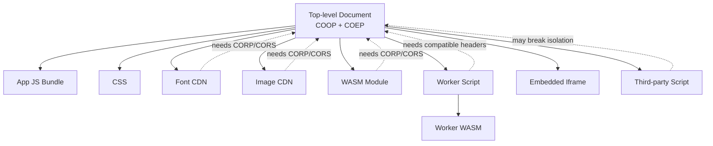
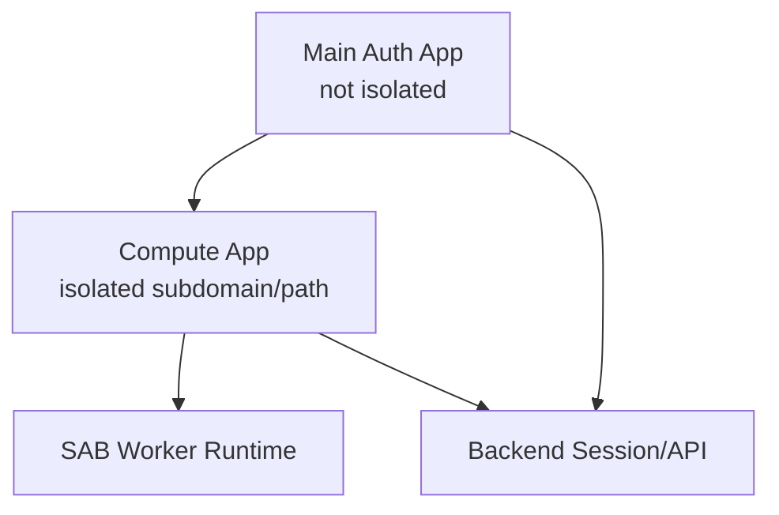
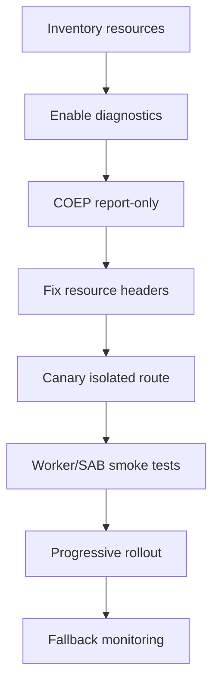
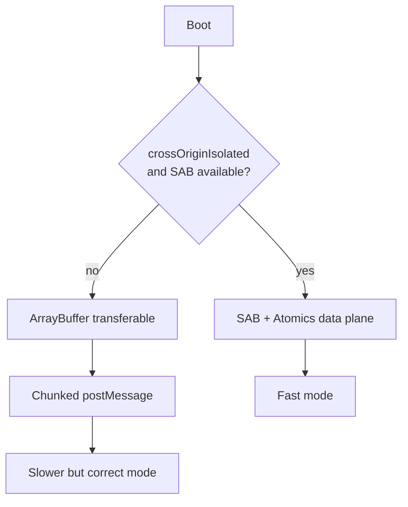
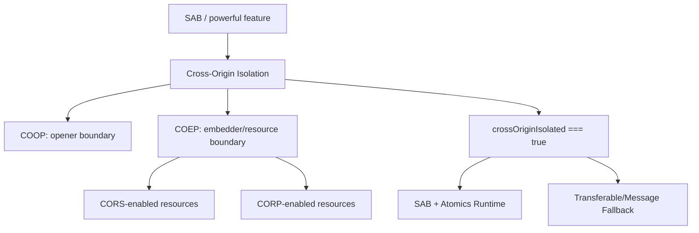

------
title: Learn Multiple Tab Orchestration and Web Worker In Action - Part 058
description: Cross-origin isolation, COOP, COEP, CORP, CORS, deployment traps, resource audit, OAuth/popup impact, dan fallback strategy untuk SharedArrayBuffer dan powerful browser features.
series: learn-multiple-tab-orchestration-web-worker
seriesTitle: Learn Multiple Tab Orchestration and Web Worker In Action
order: 58
partTitle: Cross-Origin Isolation, COOP, COEP
tags:
  - javascript
  - browser-security
  - cross-origin-isolation
  - coop
  - coep
  - sharedarraybuffer
  - web-worker
date: 2026-07-08
---

# Part 058 — Cross-Origin Isolation, COOP, COEP

> Part 057 menjelaskan `SharedArrayBuffer` dan `Atomics`. Sekarang kita bahas syarat deployment yang sering menjadi blocker nyata: **cross-origin isolation**.

Banyak engineer memahami API-nya, lalu gagal saat production karena:

- third-party script tidak punya header yang cocok,
- CDN asset tidak mengirim CORP/CORS,
- OAuth popup berubah behavior,
- iframe partner rusak,
- Service Worker cache menyajikan response lama tanpa header,
- dev server bekerja tetapi production tidak,
- satu image/font/wasm cross-origin mematahkan isolation.

Cross-origin isolation bukan “tambahkan dua header lalu selesai”. Ia adalah **deployment contract** antara document, subresources, popup/opener relationship, iframe, worker, CDN, dan third-party dependency.

---

## 1. Why Cross-Origin Isolation Exists

`SharedArrayBuffer` memberi shared memory concurrency dan high-resolution coordination antar agents. Fitur ini powerful, tetapi juga sensitif terhadap side-channel class attack.

Browser modern mengharuskan halaman masuk ke kondisi isolated sebelum membuka akses penuh ke beberapa powerful features.

Mental model:

```txt
Powerful feature
  -> needs stronger process/resource boundary
  -> document opts into isolation
  -> cross-origin resources must explicitly allow being embedded/loaded
```

Cross-origin isolation biasanya dicapai dengan kombinasi:

```http
Cross-Origin-Opener-Policy: same-origin
Cross-Origin-Embedder-Policy: require-corp
```

atau pada beberapa skenario:

```http
Cross-Origin-Embedder-Policy: credentialless
```

Kemudian kita cek di runtime:

```ts
if (!crossOriginIsolated) {
  // disable SAB path, use transferable/chunked postMessage fallback
}
```

---

## 2. The Three Headers You Must Understand

### COOP — Cross-Origin-Opener-Policy

COOP mengatur hubungan browsing context top-level dengan opener-nya.

Contoh:

```http
Cross-Origin-Opener-Policy: same-origin
```

Efek mental model:

- halaman Anda dipisahkan dari cross-origin opener/openee,
- mengurangi risiko cross-origin window interaction,
- membantu membentuk browsing context group yang lebih isolated.

Trade-off:

- popup flow bisa berubah,
- `window.opener` bisa tidak tersedia seperti sebelumnya,
- integrasi OAuth/payment lama bisa terdampak.

### COEP — Cross-Origin-Embedder-Policy

COEP mengatur apakah document boleh memuat cross-origin resource yang tidak secara eksplisit mengizinkan dirinya dimuat.

Contoh ketat:

```http
Cross-Origin-Embedder-Policy: require-corp
```

Dengan `require-corp`, cross-origin resource perlu salah satu:

- CORS valid, atau
- `Cross-Origin-Resource-Policy` yang mengizinkan.

Contoh alternatif:

```http
Cross-Origin-Embedder-Policy: credentialless
```

`credentialless` dapat membantu beberapa no-cors resource karena request dibuat tanpa credentials, tetapi tetap perlu diuji terhadap threat model, browser support, dan dependency behavior.

### CORP — Cross-Origin-Resource-Policy

CORP adalah header pada **resource** yang menyatakan siapa yang boleh memuat resource tersebut.

Contoh resource boleh dimuat cross-origin:

```http
Cross-Origin-Resource-Policy: cross-origin
```

Contoh resource hanya same-origin:

```http
Cross-Origin-Resource-Policy: same-origin
```

Contoh resource same-site:

```http
Cross-Origin-Resource-Policy: same-site
```

Important:

> COOP/COEP ditempel pada document utama. CORP/CORS harus benar pada subresources yang dimuat document tersebut.

---

## 3. Isolation Is a Graph Property

Halaman Anda tidak isolated hanya karena HTML utama punya header benar. Seluruh resource graph harus compatible.



Jika satu resource cross-origin tidak memenuhi policy, ia bisa gagal dimuat atau mematahkan jalur deployment.

---

## 4. Runtime Capability Check

Jangan menganggap header sudah benar. Cek runtime.

```ts
export function supportsSharedMemoryRuntime(): boolean {
  return typeof SharedArrayBuffer !== "undefined" && globalThis.crossOriginIsolated === true;
}
```

Gunakan fallback adapter.

```ts
type DataPlane =
  | { kind: "shared-memory"; createBuffer(size: number): SharedArrayBuffer }
  | { kind: "transferable"; createBuffer(size: number): ArrayBuffer };

export function selectDataPlane(): DataPlane {
  if (supportsSharedMemoryRuntime()) {
    return {
      kind: "shared-memory",
      createBuffer: size => new SharedArrayBuffer(size),
    };
  }

  return {
    kind: "transferable",
    createBuffer: size => new ArrayBuffer(size),
  };
}
```

Invariant:

> Isolation failure tidak boleh membuat aplikasi mati total jika fitur SAB bukan requirement bisnis absolut.

---

## 5. Header Deployment Examples

### NGINX

```nginx
add_header Cross-Origin-Opener-Policy "same-origin" always;
add_header Cross-Origin-Embedder-Policy "require-corp" always;

# Untuk static assets yang boleh dimuat oleh isolated app dari origin lain,
# set di origin asset tersebut, bukan hanya di app origin.
add_header Cross-Origin-Resource-Policy "same-origin" always;
```

Jika CDN asset berada di domain berbeda, header perlu dikonfigurasi di CDN/resource origin.

### Express / Node.js

```ts
import express from "express";

const app = express();

app.use((req, res, next) => {
  res.setHeader("Cross-Origin-Opener-Policy", "same-origin");
  res.setHeader("Cross-Origin-Embedder-Policy", "require-corp");
  next();
});

app.use(express.static("dist", {
  setHeaders(res) {
    res.setHeader("Cross-Origin-Resource-Policy", "same-origin");
  }
}));
```

### Spring Boot Filter

```java
@Component
public class CrossOriginIsolationHeaderFilter implements Filter {
    @Override
    public void doFilter(
            ServletRequest request,
            ServletResponse response,
            FilterChain chain
    ) throws IOException, ServletException {
        HttpServletResponse http = (HttpServletResponse) response;
        http.setHeader("Cross-Origin-Opener-Policy", "same-origin");
        http.setHeader("Cross-Origin-Embedder-Policy", "require-corp");
        chain.doFilter(request, response);
    }
}
```

### Vite Dev Server

```ts
// vite.config.ts
import { defineConfig } from "vite";

export default defineConfig({
  server: {
    headers: {
      "Cross-Origin-Opener-Policy": "same-origin",
      "Cross-Origin-Embedder-Policy": "require-corp",
      "Cross-Origin-Resource-Policy": "same-origin",
    },
  },
  preview: {
    headers: {
      "Cross-Origin-Opener-Policy": "same-origin",
      "Cross-Origin-Embedder-Policy": "require-corp",
      "Cross-Origin-Resource-Policy": "same-origin",
    },
  },
});
```

Dev server dan production server harus diuji terpisah. Banyak bug hanya muncul setelah asset masuk CDN.

---

## 6. Resource Audit Matrix

Sebelum mengaktifkan COEP di production, buat inventory.

| Resource | Same-origin? | Credentialed? | Controlled by us? | Required header/policy | Risk |
|---|---:|---:|---:|---|---|
| app HTML | yes | yes | yes | COOP + COEP | low |
| JS bundle | yes/CDN | maybe | yes | CORP/CORS | medium |
| worker script | yes/CDN | maybe | yes | compatible MIME + headers | medium |
| WASM | maybe | maybe | yes | CORP/CORS | high |
| fonts | often CDN | no/maybe | maybe | CORP/CORS | medium |
| images | mixed | no | mixed | CORP/CORS or proxy | high |
| analytics script | third-party | yes/no | no | vendor support | high |
| payment iframe | third-party | yes | no | vendor support | high |
| OAuth popup | third-party | yes | no | opener behavior check | high |

Decision rule:

> Jika resource tidak bisa dibuat compatible, isolasi halaman utama mungkin tidak realistis. Gunakan isolated compute sub-app atau fallback non-SAB.

---

## 7. Debugging `crossOriginIsolated === false`

Checklist cepat:

1. Apakah HTML response punya COOP?
2. Apakah HTML response punya COEP?
3. Apakah page served over secure context?
4. Apakah worker script punya MIME benar?
5. Apakah worker script tidak di-cache dari versi lama?
6. Apakah semua cross-origin no-cors resource punya CORP?
7. Apakah CORS resource mengirim header CORS benar?
8. Apakah Service Worker menyajikan response tanpa header?
9. Apakah iframe cross-origin compatible?
10. Apakah CDN menghapus header?
11. Apakah redirect kehilangan header?
12. Apakah dev/prod berbeda?

Tambahkan boot diagnostic:

```ts
export function collectIsolationDiagnostics() {
  return {
    crossOriginIsolated: globalThis.crossOriginIsolated,
    hasSharedArrayBuffer: typeof SharedArrayBuffer !== "undefined",
    protocol: location.protocol,
    origin: location.origin,
    userAgent: navigator.userAgent,
  };
}
```

Kirim hanya metadata aman ke telemetry.

---

## 8. Service Worker Trap

Service Worker dapat membuat debugging isolation membingungkan.

Scenario:

1. server sudah mengirim header benar,
2. tetapi Service Worker lama menyajikan cached HTML lama tanpa header,
3. page tetap tidak isolated,
4. developer melihat network server benar tetapi document dari cache salah.

Rule:

> Jika mengaktifkan cross-origin isolation, audit Service Worker cache untuk HTML, worker scripts, WASM, dan critical static assets.

Cache migration pattern:

```ts
self.addEventListener("activate", event => {
  event.waitUntil((async () => {
    const keys = await caches.keys();
    await Promise.all(
      keys
        .filter(key => key.startsWith("app-shell-v"))
        .filter(key => key !== "app-shell-v-isolated-1")
        .map(key => caches.delete(key))
    );
    await self.clients.claim();
  })());
});
```

Untuk HTML, sering lebih aman network-first saat rollout header security besar.

---

## 9. Worker Script Trap

Worker script juga harus dimuat dengan benar.

Pitfalls:

- wrong MIME type,
- classic/module mismatch,
- CDN path tanpa header,
- worker chunk hash lama,
- Service Worker cache stale,
- CSP `worker-src` menolak script,
- `new Worker(url)` memakai absolute third-party URL yang tidak same-origin.

Smoke test:

```ts
async function smokeTestWorker() {
  return new Promise<void>((resolve, reject) => {
    const worker = new Worker(
      new URL("./isolation-smoke.worker.ts", import.meta.url),
      { type: "module" }
    );

    const timeout = setTimeout(() => {
      worker.terminate();
      reject(new Error("worker smoke test timeout"));
    }, 3000);

    worker.onmessage = event => {
      clearTimeout(timeout);
      worker.terminate();
      if (event.data?.ok) resolve();
      else reject(new Error("worker smoke test failed"));
    };

    worker.onerror = err => {
      clearTimeout(timeout);
      worker.terminate();
      reject(err instanceof Error ? err : new Error("worker error"));
    };
  });
}
```

Worker smoke response:

```ts
postMessage({
  ok: true,
  crossOriginIsolated: globalThis.crossOriginIsolated,
  hasSharedArrayBuffer: typeof SharedArrayBuffer !== "undefined",
});
```

---

## 10. COEP and Third-Party Resources

COEP sering paling menyakitkan karena third-party resources tidak selalu mengirim header yang dibutuhkan.

Examples:

- analytics scripts,
- tag manager,
- ad scripts,
- customer support widgets,
- embedded videos,
- payment frames,
- external avatars/images,
- fonts from public CDN,
- map tiles,
- legacy API responses used as images/downloads.

Mitigation options:

| Option | When to Use | Trade-off |
|---|---|---|
| ask vendor to support CORP/CORS | strategic vendor | slow, not always possible |
| self-host resource | fonts/static scripts | maintenance/security updates |
| proxy resource through own origin | images/artifacts | cost, legal/cache/security implications |
| isolate compute route only | SAB needed only in one module | architecture complexity |
| disable SAB path | feature optional | lower performance |
| use COEP credentialless | compatible scenario | browser/dependency semantics must be tested |

---

## 11. OAuth and Popup Impact

COOP changes opener relationship. OAuth/payment flows historically use popup + `window.opener` or cross-window communication.

Risk:

```txt
Main app opens OAuth popup.
COOP isolates browsing context group.
Popup cannot communicate through previous opener assumption.
Login flow breaks.
```

Safer designs:

1. redirect-based OAuth instead of popup,
2. same-origin callback page that uses server session then redirects,
3. `postMessage` only when opener relationship is verified in target environment,
4. isolate only compute-heavy route, not auth shell,
5. separate subdomain for SAB compute and keep auth app non-isolated.

Architecture option:



This is often more realistic for enterprise apps with many third-party integrations.

---

## 12. Isolated Compute Sub-App Pattern

Jika seluruh app terlalu sulit diisolasi, buat compute island.

```txt
https://app.example.com
  normal app, auth, third-party widgets

https://compute.example.com
  isolated route/subdomain
  strict headers
  no third-party widgets
  SAB/WASM/worker runtime
```

Communication options:

- server-mediated job store,
- same-site authenticated API,
- explicit `postMessage` with strict origin allowlist if iframe/popup is used,
- upload payload to OPFS/IndexedDB per origin is not directly shared, so design data handoff carefully.

Important:

> Different origin means browser storage and BroadcastChannel are not shared. You gain isolation but lose same-origin coordination primitives.

This is a real trade-off.

---

## 13. CSP Interaction

Cross-origin isolation does not replace CSP.

You still need policies like:

```http
Content-Security-Policy: default-src 'self'; script-src 'self'; worker-src 'self'; connect-src 'self' https://api.example.com; img-src 'self' data: https:; object-src 'none'; base-uri 'none'
```

Important CSP fields for worker systems:

| Directive | Why It Matters |
|---|---|
| `worker-src` | controls Worker/SharedWorker/ServiceWorker script sources |
| `script-src` | controls app bundle and imported scripts |
| `connect-src` | controls API/WebSocket endpoints |
| `img-src` | may interact with COEP resource loading |
| `frame-src` | controls embedded frames |
| `default-src` | fallback policy |

Do not loosen CSP just to make COEP easier. That defeats the point of hardening.

---

## 14. Report-Only Rollout

Before hard enforcement, use report-only where supported and useful.

Example:

```http
Cross-Origin-Embedder-Policy-Report-Only: require-corp; report-to="coep-endpoint"
Reporting-Endpoints: coep-endpoint="https://reports.example.com/browser-policy"
```

Rollout stages:



Report-only is not a substitute for browser/device testing. Some breakages only show in specific integration flows.

---

## 15. Backend Contract

Frontend cannot solve isolation alone. Backend/CDN must participate.

Backend responsibilities:

- app HTML headers,
- static asset headers,
- worker script MIME and headers,
- WASM MIME and headers,
- CDN forwarding/preserving headers,
- cache invalidation,
- redirect header consistency,
- Service Worker migration support,
- report endpoint if using Reporting API,
- environment parity.

CI check example:

```bash
curl -I https://app.example.com/ \
  | grep -i "cross-origin-opener-policy"

curl -I https://app.example.com/ \
  | grep -i "cross-origin-embedder-policy"

curl -I https://cdn.example.com/assets/app-worker.js \
  | grep -Ei "content-type|cross-origin-resource-policy|access-control-allow-origin"
```

Use synthetic browser check too, not only `curl`.

---

## 16. Synthetic Browser Test

Playwright-style test:

```ts
import { test, expect } from "@playwright/test";

test("app is cross-origin isolated", async ({ page }) => {
  await page.goto("https://app.example.com/compute");

  const result = await page.evaluate(() => ({
    crossOriginIsolated: window.crossOriginIsolated,
    hasSharedArrayBuffer: typeof SharedArrayBuffer !== "undefined",
  }));

  expect(result.crossOriginIsolated).toBe(true);
  expect(result.hasSharedArrayBuffer).toBe(true);
});
```

Worker smoke test:

```ts
test("worker can use SharedArrayBuffer", async ({ page }) => {
  await page.goto("https://app.example.com/compute");

  const ok = await page.evaluate(async () => {
    const worker = new Worker(new URL("/workers/sab-smoke.js", location.origin), {
      type: "module",
    });

    return await new Promise(resolve => {
      worker.onmessage = event => resolve(event.data?.ok === true);
      worker.onerror = () => resolve(false);
      worker.postMessage({ type: "PING" });
    });
  });

  expect(ok).toBe(true);
});
```

---

## 17. Fallback Strategy

Production app should not have one code path only.



Fallback design:

| Capability | Primary | Fallback |
|---|---|---|
| shared stream | SAB ring buffer | transferable chunks |
| worker wait | Atomics.wait | message event loop |
| high throughput result | shared output buffer | chunked result messages |
| WASM shared memory | shared memory | single-threaded WASM worker |
| low-latency progress | atomic counters | throttled progress messages |

Invariant:

> Fallback boleh lebih lambat, tetapi tidak boleh menghasilkan semantik berbeda.

---

## 18. Environment Parity

Pastikan environment berikut diuji:

- local dev server,
- local production preview,
- staging behind CDN,
- production canary,
- production with Service Worker already installed,
- hard reload,
- normal reload,
- first visit,
- returning visit,
- private/incognito mode,
- WebView/embedded browser if supported,
- enterprise proxy if relevant.

Header bugs sering environment-specific.

---

## 19. Multi-Tab Implications

COOP can affect browsing context grouping. Multi-tab orchestration usually stays same-origin, but opener relationships and popup-based messaging may change.

Do not assume:

```ts
const child = window.open(url);
child!.postMessage(...);
```

will behave the same after COOP hardening.

Use explicit architecture:

- same-origin BroadcastChannel for ordinary app tabs,
- server-mediated OAuth result,
- Service Worker/client messaging within controlled scope,
- avoid popup-opener dependency for critical auth/session state.

---

## 20. Iframe Implications

Embedding and being embedded both matter.

Questions:

- Does your app embed third-party iframe?
- Does another app embed your app?
- Does iframe need SharedArrayBuffer?
- Does iframe have compatible COEP/COOP environment?
- Are sandbox attributes blocking needed behavior?
- Are credentialed resources required?

For serious apps, document iframe policy explicitly.

```txt
This route is isolated and not embeddable by arbitrary third-party pages.
This widget route is non-isolated and does not use SAB.
```

Trying to make every route satisfy every embedding scenario usually creates fragile security policy.

---

## 21. Common Failure Modes

| Symptom | Likely Cause | Fix |
|---|---|---|
| `SharedArrayBuffer` undefined | not isolated / insecure context | add headers, use HTTPS, verify runtime |
| `crossOriginIsolated` false | COOP/COEP missing or resource issue | inspect document headers and console |
| font/image fails to load | COEP blocks cross-origin no-cors resource | add CORP/CORS or self-host |
| worker fails to start | MIME/CSP/path/header issue | inspect network + CSP console |
| works in dev, fails in prod | CDN/header/service worker mismatch | test preview/prod with browser |
| OAuth popup breaks | COOP opener isolation | redirect flow or isolated compute route |
| old users fail only | Service Worker cached old shell | cache migration/claim/reload |
| some browsers fail | support/policy differences | feature detection + fallback |

---

## 22. Production Readiness Checklist

Before enabling SAB-dependent features:

- `crossOriginIsolated` true in target route,
- `SharedArrayBuffer` available,
- app HTML has COOP/COEP,
- worker scripts load with correct MIME and policy,
- WASM loads correctly,
- static assets compatible with COEP,
- third-party scripts audited,
- OAuth/payment flows retested,
- Service Worker cache migration done,
- CSP `worker-src` configured,
- CDN preserves headers,
- redirects preserve expected headers,
- report-only/canary rollout completed,
- synthetic browser test in CI/CD,
- fallback path tested,
- telemetry separates fast-path vs fallback-path,
- user-facing degradation acceptable.

---

## 23. Decision Matrix

| Situation | Recommendation |
|---|---|
| Full app has few third-party dependencies | isolate full app route |
| App heavily depends on third-party widgets | isolate compute-heavy route only |
| OAuth popup is critical and fragile | avoid COOP on auth shell; isolate compute separately |
| SAB is optional optimization | feature detect and fallback |
| SAB is core requirement | enforce isolation and fail early with clear message |
| Vendor resources cannot support COEP | self-host/proxy/remove/vendor change |
| WebView support required | test early; fallback likely needed |

---

## 24. Final Mental Model

Cross-origin isolation is not a frontend flag. It is a browser security boundary built from headers, resource policies, process isolation assumptions, and dependency hygiene.



The engineering lesson:

> Do not decide to use `SharedArrayBuffer` before you decide whether your deployment graph can support cross-origin isolation.

If the graph cannot support it, keep SAB inside an isolated compute island or use a slower but simpler data plane.

---

## References

- MDN — SharedArrayBuffer: https://developer.mozilla.org/en-US/docs/Web/JavaScript/Reference/Global_Objects/SharedArrayBuffer
- MDN — Cross-Origin-Opener-Policy: https://developer.mozilla.org/en-US/docs/Web/HTTP/Reference/Headers/Cross-Origin-Opener-Policy
- MDN — Cross-Origin-Embedder-Policy: https://developer.mozilla.org/en-US/docs/Web/HTTP/Reference/Headers/Cross-Origin-Embedder-Policy
- MDN — Cross-Origin-Resource-Policy: https://developer.mozilla.org/en-US/docs/Web/HTTP/Guides/Cross-Origin_Resource_Policy
- web.dev — Why you need cross-origin isolated for powerful features: https://web.dev/articles/why-coop-coep
