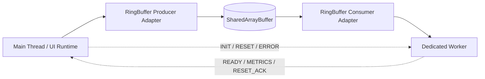
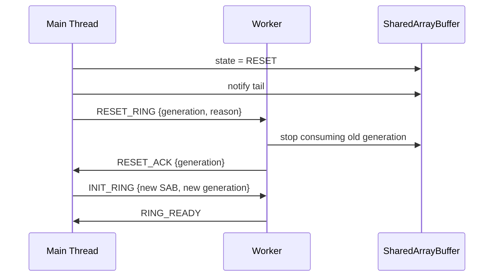

------
title: Learn Multiple Tab Orchestration and Web Worker In Action - Part 060
description: Implementasi ring buffer main thread dan worker menggunakan SharedArrayBuffer, Atomics, slot sequence, backpressure, cancellation, reset, metrics, dan fallback strategy.
series: learn-multiple-tab-orchestration-web-worker
seriesTitle: Learn Multiple Tab Orchestration and Web Worker In Action
order: 60
partTitle: Ring Buffer Between Main Thread and Worker
tags:
  - javascript
  - web-worker
  - sharedarraybuffer
  - atomics
  - ring-buffer
  - performance
  - browser-runtime
date: 2026-07-08
---

# Part 060 — Ring Buffer Between Main Thread and Worker

> Part 059 membahas cara berpikir lock-free/wait-free. Sekarang kita bangun satu data structure nyata: **bounded ring buffer antara main thread dan worker**.

Ring buffer berguna ketika kita punya stream data yang sering dan relatif seragam:

- audio/video frame metadata,
- telemetry samples,
- parser chunks,
- binary transform frames,
- search/index update batches,
- WASM input/output blocks,
- rendering command packets,
- compression/decompression chunks.

Ring buffer bukan pengganti seluruh message protocol. Ia adalah data-plane cepat. Control-plane tetap via `postMessage`.

---

## 1. Target Architecture



Control-plane:

```txt
main -> worker: INIT_RING { sab, layout, generation, capacity, slotBytes }
worker -> main: RING_READY { generation }
worker -> main: RING_METRICS { consumed, dropped, waitTimeouts }
main -> worker: RESET_RING { reason }
```

Data-plane:

```txt
main writes bytes into SAB slot
main publishes slot with Atomics.store
worker waits/reads slot
worker releases slot
```

---

## 2. Scope: SPSC, Not MPMC

Kita mulai dengan **single producer, single consumer**.

```txt
Producer: main thread
Consumer: worker
```

Kenapa?

- producer owns `tail`,
- consumer owns `head`,
- no CAS on hot head/tail path needed,
- easier to reason about wraparound,
- enough for many browser pipelines.

Kalau banyak producer:

```txt
multiple UI producers -> one main-thread adapter -> one SAB producer
```

Jangan langsung membuat global MPMC queue kecuali benar-benar perlu.

---

## 3. Ring Buffer Invariant

Ring buffer punya capacity tetap.

```txt
capacity = number of slots
slotBytes = maximum bytes per frame
```

State:

```txt
head = next slot consumer should read
tail = next slot producer should write
```

Full/empty rule dengan reserved slot:

```txt
empty: head == tail
full:  next(tail) == head
usable slots = capacity - 1
```

Kenapa reserve satu slot? Agar `head == tail` tidak ambigu antara empty dan full.

---

## 4. Memory Layout

Kita gunakan satu `SharedArrayBuffer` dengan header `Int32Array` dan payload `Uint8Array`.

```txt
SAB

Header Int32Array:
  0  magic
  1  version
  2  generation
  3  state
  4  capacity
  5  slotBytes
  6  head
  7  tail
  8  cancel
  9  dropped
  10 produced
  11 consumed
  12 waitTimeout
  13 resetRequested
  14 lastError
  15 reserved

Slot metadata Int32Array:
  for each slot:
    sequence
    length
    kind
    flags

Payload Uint8Array:
  slot 0 bytes
  slot 1 bytes
  ...
```

Diagram:

```txt
+--------------------+
| header             |
+--------------------+
| slot 0 metadata    |
| slot 1 metadata    |
| slot 2 metadata    |
+--------------------+
| slot 0 payload     |
| slot 1 payload     |
| slot 2 payload     |
+--------------------+
```

---

## 5. Constants

```ts
const MAGIC = 0x52494e47; // "RING"
const VERSION = 1;

const OFF_MAGIC = 0;
const OFF_VERSION = 1;
const OFF_GENERATION = 2;
const OFF_STATE = 3;
const OFF_CAPACITY = 4;
const OFF_SLOT_BYTES = 5;
const OFF_HEAD = 6;
const OFF_TAIL = 7;
const OFF_CANCEL = 8;
const OFF_DROPPED = 9;
const OFF_PRODUCED = 10;
const OFF_CONSUMED = 11;
const OFF_WAIT_TIMEOUT = 12;
const OFF_RESET_REQUESTED = 13;
const OFF_LAST_ERROR = 14;

const HEADER_I32 = 64;
const SLOT_META_I32 = 4;

const SLOT_SEQ = 0;
const SLOT_LEN = 1;
const SLOT_KIND = 2;
const SLOT_FLAGS = 3;

const STATE_INIT = 0;
const STATE_OPEN = 1;
const STATE_CLOSING = 2;
const STATE_CLOSED = 3;
const STATE_RESET = 4;
```

---

## 6. Buffer Allocation

```ts
export type RingLayout = {
  capacity: number;
  slotBytes: number;
  generation: number;
  headerBytes: number;
  slotMetaBytes: number;
  payloadOffset: number;
  totalBytes: number;
};

export function createRingBuffer(capacity: number, slotBytes: number): {
  sab: SharedArrayBuffer;
  layout: RingLayout;
} {
  if (capacity < 2) throw new Error("capacity must be at least 2");
  if (slotBytes <= 0) throw new Error("slotBytes must be positive");

  const headerBytes = HEADER_I32 * Int32Array.BYTES_PER_ELEMENT;
  const slotMetaBytes = capacity * SLOT_META_I32 * Int32Array.BYTES_PER_ELEMENT;
  const payloadOffset = headerBytes + slotMetaBytes;
  const totalBytes = payloadOffset + capacity * slotBytes;

  const sab = new SharedArrayBuffer(totalBytes);
  const header = new Int32Array(sab, 0, HEADER_I32);

  const generation = Math.floor(Math.random() * 0x7fffffff);

  Atomics.store(header, OFF_MAGIC, MAGIC);
  Atomics.store(header, OFF_VERSION, VERSION);
  Atomics.store(header, OFF_GENERATION, generation);
  Atomics.store(header, OFF_STATE, STATE_INIT);
  Atomics.store(header, OFF_CAPACITY, capacity);
  Atomics.store(header, OFF_SLOT_BYTES, slotBytes);
  Atomics.store(header, OFF_HEAD, 0);
  Atomics.store(header, OFF_TAIL, 0);

  const meta = new Int32Array(sab, headerBytes, capacity * SLOT_META_I32);
  for (let slot = 0; slot < capacity; slot++) {
    const base = slot * SLOT_META_I32;
    Atomics.store(meta, base + SLOT_SEQ, slot);
    Atomics.store(meta, base + SLOT_LEN, 0);
    Atomics.store(meta, base + SLOT_KIND, 0);
    Atomics.store(meta, base + SLOT_FLAGS, 0);
  }

  Atomics.store(header, OFF_STATE, STATE_OPEN);

  return {
    sab,
    layout: {
      capacity,
      slotBytes,
      generation,
      headerBytes,
      slotMetaBytes,
      payloadOffset,
      totalBytes,
    },
  };
}
```

Important:

```txt
Initialize all metadata before state becomes OPEN.
```

---

## 7. Producer Adapter

Producer writes one frame if capacity is available.

```ts
export type WriteFrame = {
  kind: number;
  bytes: Uint8Array;
  flags?: number;
};

export type WriteResult =
  | { ok: true; slot: number }
  | { ok: false; reason: "closed" | "too-large" | "full" | "generation-mismatch" };

export class RingProducer {
  private header: Int32Array;
  private meta: Int32Array;
  private payload: Uint8Array;

  constructor(
    private readonly sab: SharedArrayBuffer,
    private readonly layout: RingLayout,
  ) {
    this.header = new Int32Array(sab, 0, HEADER_I32);
    this.meta = new Int32Array(sab, layout.headerBytes, layout.capacity * SLOT_META_I32);
    this.payload = new Uint8Array(sab, layout.payloadOffset);
    this.assertLayout();
  }

  write(frame: WriteFrame): WriteResult {
    if (Atomics.load(this.header, OFF_STATE) !== STATE_OPEN) {
      return { ok: false, reason: "closed" };
    }

    if (Atomics.load(this.header, OFF_GENERATION) !== this.layout.generation) {
      return { ok: false, reason: "generation-mismatch" };
    }

    if (frame.bytes.byteLength > this.layout.slotBytes) {
      return { ok: false, reason: "too-large" };
    }

    const capacity = this.layout.capacity;
    const head = Atomics.load(this.header, OFF_HEAD);
    const tail = Atomics.load(this.header, OFF_TAIL);
    const nextTail = (tail + 1) % capacity;

    if (nextTail === head) {
      Atomics.add(this.header, OFF_DROPPED, 1);
      return { ok: false, reason: "full" };
    }

    const slot = tail;
    const metaBase = slot * SLOT_META_I32;
    const payloadBase = slot * this.layout.slotBytes;

    // Write payload first.
    this.payload.set(frame.bytes, payloadBase);

    // Publish metadata.
    Atomics.store(this.meta, metaBase + SLOT_LEN, frame.bytes.byteLength);
    Atomics.store(this.meta, metaBase + SLOT_KIND, frame.kind);
    Atomics.store(this.meta, metaBase + SLOT_FLAGS, frame.flags ?? 0);

    // Publish tail after payload and metadata are visible.
    Atomics.store(this.header, OFF_TAIL, nextTail);
    Atomics.add(this.header, OFF_PRODUCED, 1);

    // Wake consumer waiting on tail.
    Atomics.notify(this.header, OFF_TAIL, 1);

    return { ok: true, slot };
  }

  close(): void {
    Atomics.store(this.header, OFF_STATE, STATE_CLOSING);
    Atomics.notify(this.header, OFF_TAIL, 1);
  }

  private assertLayout(): void {
    if (Atomics.load(this.header, OFF_MAGIC) !== MAGIC) throw new Error("Invalid ring magic");
    if (Atomics.load(this.header, OFF_VERSION) !== VERSION) throw new Error("Invalid ring version");
    if (Atomics.load(this.header, OFF_CAPACITY) !== this.layout.capacity) throw new Error("Capacity mismatch");
    if (Atomics.load(this.header, OFF_SLOT_BYTES) !== this.layout.slotBytes) throw new Error("Slot size mismatch");
  }
}
```

This SPSC design does not CAS on `tail` because only one producer writes `tail`.

---

## 8. Consumer Adapter

Worker-side consumer can block with timeout using `Atomics.wait()`.

```ts
export type ReadFrame = {
  kind: number;
  flags: number;
  bytes: Uint8Array;
  slot: number;
};

export type ReadResult =
  | { ok: true; frame: ReadFrame }
  | { ok: false; reason: "empty" | "closed" | "timeout" | "reset" | "generation-mismatch" };

export class RingConsumer {
  private header: Int32Array;
  private meta: Int32Array;
  private payload: Uint8Array;

  constructor(
    private readonly sab: SharedArrayBuffer,
    private readonly layout: RingLayout,
  ) {
    this.header = new Int32Array(sab, 0, HEADER_I32);
    this.meta = new Int32Array(sab, layout.headerBytes, layout.capacity * SLOT_META_I32);
    this.payload = new Uint8Array(sab, layout.payloadOffset);
    this.assertLayout();
  }

  read(waitMs = 100): ReadResult {
    while (true) {
      const state = Atomics.load(this.header, OFF_STATE);
      if (state === STATE_RESET) return { ok: false, reason: "reset" };
      if (state === STATE_CLOSED) return { ok: false, reason: "closed" };

      if (Atomics.load(this.header, OFF_GENERATION) !== this.layout.generation) {
        return { ok: false, reason: "generation-mismatch" };
      }

      const head = Atomics.load(this.header, OFF_HEAD);
      const tail = Atomics.load(this.header, OFF_TAIL);

      if (head !== tail) {
        return this.consumeSlot(head);
      }

      if (state === STATE_CLOSING) {
        Atomics.store(this.header, OFF_STATE, STATE_CLOSED);
        return { ok: false, reason: "closed" };
      }

      const waitResult = Atomics.wait(this.header, OFF_TAIL, tail, waitMs);
      if (waitResult === "timed-out") {
        Atomics.add(this.header, OFF_WAIT_TIMEOUT, 1);
        return { ok: false, reason: "timeout" };
      }
      // "ok" or "not-equal" means re-check loop.
    }
  }

  private consumeSlot(slot: number): ReadResult {
    const metaBase = slot * SLOT_META_I32;
    const length = Atomics.load(this.meta, metaBase + SLOT_LEN);
    const kind = Atomics.load(this.meta, metaBase + SLOT_KIND);
    const flags = Atomics.load(this.meta, metaBase + SLOT_FLAGS);

    if (length < 0 || length > this.layout.slotBytes) {
      Atomics.store(this.header, OFF_LAST_ERROR, 1);
      Atomics.store(this.header, OFF_STATE, STATE_RESET);
      return { ok: false, reason: "reset" };
    }

    const payloadBase = slot * this.layout.slotBytes;
    const bytes = this.payload.slice(payloadBase, payloadBase + length);

    // Release slot by advancing head.
    const nextHead = (slot + 1) % this.layout.capacity;
    Atomics.store(this.header, OFF_HEAD, nextHead);
    Atomics.add(this.header, OFF_CONSUMED, 1);

    return {
      ok: true,
      frame: { kind, flags, bytes, slot },
    };
  }

  private assertLayout(): void {
    if (Atomics.load(this.header, OFF_MAGIC) !== MAGIC) throw new Error("Invalid ring magic");
    if (Atomics.load(this.header, OFF_VERSION) !== VERSION) throw new Error("Invalid ring version");
    if (Atomics.load(this.header, OFF_CAPACITY) !== this.layout.capacity) throw new Error("Capacity mismatch");
    if (Atomics.load(this.header, OFF_SLOT_BYTES) !== this.layout.slotBytes) throw new Error("Slot size mismatch");
  }
}
```

Note:

```ts
const bytes = this.payload.slice(...)
```

This copies bytes out for safe processing. For maximum zero-copy, worker can process a view directly before advancing head. But direct view processing requires stricter lifetime rules.

---

## 9. Direct View vs Copy-Out

Two consumer strategies:

| Strategy | How | Pros | Cons |
|---|---|---|---|
| Copy-out | `payload.slice(...)` | safe, simple | copy cost |
| Direct view | `payload.subarray(...)` | zero-copy | must finish before releasing slot |

Direct view invariant:

```txt
Consumer must not advance head until all reads from the slot are done.
Producer must not write a slot until it is outside occupied range.
```

For most teams, start with copy-out. Move to direct view only after profiling.

---

## 10. Main Thread Setup

```ts
const { sab, layout } = createRingBuffer(256, 64 * 1024);
const producer = new RingProducer(sab, layout);

const worker = new Worker(new URL("./ring-worker.ts", import.meta.url), {
  type: "module",
});

worker.postMessage({
  type: "INIT_RING",
  sab,
  layout,
});

worker.addEventListener("message", (event) => {
  const msg = event.data;
  if (msg.type === "RING_READY") {
    console.log("worker ready", msg.generation);
  }
  if (msg.type === "RING_METRICS") {
    console.log(msg.metrics);
  }
});

function submitChunk(kind: number, bytes: Uint8Array) {
  const result = producer.write({ kind, bytes });

  if (!result.ok) {
    if (result.reason === "full") {
      // Apply explicit backpressure policy.
      return false;
    }
    throw new Error(`Ring write failed: ${result.reason}`);
  }

  return true;
}
```

---

## 11. Worker Setup

```ts
let consumer: RingConsumer | undefined;
let running = false;

self.addEventListener("message", (event) => {
  const msg = event.data;

  if (msg.type === "INIT_RING") {
    consumer = new RingConsumer(msg.sab, msg.layout);
    running = true;

    self.postMessage({
      type: "RING_READY",
      generation: msg.layout.generation,
    });

    runLoop().catch((error) => {
      self.postMessage({
        type: "RING_ERROR",
        message: error instanceof Error ? error.message : String(error),
      });
    });
  }

  if (msg.type === "STOP_RING") {
    running = false;
  }
});

async function runLoop() {
  if (!consumer) throw new Error("consumer not initialized");

  while (running) {
    const result = consumer.read(250);

    if (!result.ok) {
      if (result.reason === "timeout" || result.reason === "empty") {
        continue;
      }

      self.postMessage({ type: "RING_STOPPED", reason: result.reason });
      return;
    }

    await processFrame(result.frame);
  }
}

async function processFrame(frame: ReadFrame) {
  switch (frame.kind) {
    case 1:
      // parse chunk
      break;
    case 2:
      // transform chunk
      break;
    default:
      // unknown frame kind: protocol error or ignore by policy
      break;
  }
}
```

---

## 12. Backpressure Policy

When producer sees `full`, never “just keep trying forever”.

Choose one policy per stream:

| Policy | Good For | Behavior |
|---|---|---|
| Reject | command-like frames | caller retries later |
| Drop newest | telemetry | current frame discarded |
| Drop oldest | live previews | advance head carefully, lose stale frame |
| Coalesce | progress updates | replace pending frame by key |
| Spill to IndexedDB/OPFS | durable offline work | slower durable queue |
| Slow path postMessage | rare large frame | bypass ring buffer |

Simple reject policy:

```ts
const ok = submitChunk(1, bytes);
if (!ok) {
  scheduleRetry(bytes);
}
```

Telemetry drop policy:

```ts
if (!producer.write({ kind: FRAME_TELEMETRY, bytes }).ok) {
  // acceptable loss; increment metric already done by producer
}
```

Do not use drop policy for business commands.

---

## 13. Drop Oldest Is Dangerous

Drop oldest requires consumer coordination. If producer modifies `head`, it violates SPSC ownership because consumer owns `head`.

Safer option:

```txt
Producer cannot drop oldest directly.
Producer signals overflow.
Consumer decides whether to skip frames.
```

Alternative:

- use overwrite ring buffer only for lossy streams,
- separate lossy telemetry ring from reliable command ring,
- keep ownership rules simple.

---

## 14. Cancellation

Add cancel flag to header.

```ts
function requestCancel(header: Int32Array) {
  Atomics.store(header, OFF_CANCEL, 1);
  Atomics.notify(header, OFF_TAIL, 1);
}

function isCancelled(header: Int32Array): boolean {
  return Atomics.load(header, OFF_CANCEL) === 1;
}
```

Worker loop:

```ts
while (running) {
  if (isCancelled(header)) {
    cleanupPartialWork();
    break;
  }

  const result = consumer.read(250);
  // ...
}
```

Cancellation must be cooperative. If worker is stuck inside CPU-heavy processing, it must periodically check cancel flag.

---

## 15. Reset Protocol

Reset is a control-plane event, not only a shared flag.



Rules:

```txt
Do not reuse SAB after hard reset unless both sides explicitly acknowledge.
Prefer allocate new SAB with new generation.
```

Why? Reuse makes stale reader/writer bugs harder to detect.

---

## 16. Metrics Snapshot

```ts
export function readRingMetrics(sab: SharedArrayBuffer) {
  const header = new Int32Array(sab, 0, HEADER_I32);

  return {
    state: Atomics.load(header, OFF_STATE),
    generation: Atomics.load(header, OFF_GENERATION),
    head: Atomics.load(header, OFF_HEAD),
    tail: Atomics.load(header, OFF_TAIL),
    produced: Atomics.load(header, OFF_PRODUCED),
    consumed: Atomics.load(header, OFF_CONSUMED),
    dropped: Atomics.load(header, OFF_DROPPED),
    waitTimeout: Atomics.load(header, OFF_WAIT_TIMEOUT),
    lastError: Atomics.load(header, OFF_LAST_ERROR),
  };
}
```

Derived queue depth:

```ts
function depth(head: number, tail: number, capacity: number): number {
  return tail >= head ? tail - head : capacity - head + tail;
}
```

Expose metrics periodically via worker message:

```ts
setInterval(() => {
  if (!consumer) return;
  self.postMessage({
    type: "RING_METRICS",
    metrics: readRingMetrics(consumerSab),
  });
}, 1000);
```

In production, aggregate carefully; do not spam the main thread.

---

## 17. Payload Framing

For simple fixed maximum slot:

```txt
slot metadata length tells consumer how many bytes are valid.
```

For variable-size large frames bigger than slot:

Options:

1. reject and use slow path,
2. split into multiple frames,
3. store payload in OPFS/IndexedDB and send reference,
4. allocate bigger ring.

Chunked frame shape:

```ts
const FLAG_FIRST = 1 << 0;
const FLAG_LAST = 1 << 1;

// frame payload includes:
// streamId, chunkIndex, totalChunks, bytes...
```

But chunking complicates failure handling. If one chunk is dropped, the whole logical frame may need to fail.

---

## 18. Feature Detection and Fallback

```ts
export function canUseSharedMemory(): boolean {
  return typeof SharedArrayBuffer !== "undefined" && crossOriginIsolated === true;
}
```

Fallback path:

```ts
if (canUseSharedMemory()) {
  startSabRingPath();
} else {
  startTransferablePostMessagePath();
}
```

Transferable fallback:

```ts
worker.postMessage(
  { type: "FRAME", kind, buffer: bytes.buffer },
  [bytes.buffer],
);
```

Do not make SAB mandatory unless the product can require cross-origin isolation and browser support.

---

## 19. Common Bugs

### Bug 1 — Publishing Tail Before Payload

Wrong:

```ts
Atomics.store(header, OFF_TAIL, nextTail);
payload.set(bytes, payloadBase);
```

Consumer can read tail and consume partially written payload.

Correct:

```ts
payload.set(bytes, payloadBase);
Atomics.store(header, OFF_TAIL, nextTail);
```

### Bug 2 — No Generation Check

Without generation, old worker can read/write stale buffer after reset.

### Bug 3 — Blocking Main Thread

Do not call blocking wait on UI path. Preserve responsiveness.

### Bug 4 — Treating `notify` as Delivery Guarantee

`Atomics.notify()` wakes waiting agents. If consumer was not waiting, no persistent notification exists. Consumer must always check state in a loop.

### Bug 5 — One Ring for All Traffic

Reliable commands, lossy telemetry, and large binary chunks have different semantics. Use separate channels or explicit frame class policies.

---

## 20. Chaos Tests

Test harness ideas:

```txt
1. producer writes 1 million sequential frames
2. consumer verifies sequence monotonicity
3. capacity = 2 to force wraparound
4. random worker termination
5. random reset mid-write
6. random full queue
7. random frame sizes
8. fallback path forced
9. generation mismatch injected
10. protocol version mismatch injected
```

Sequence validation frame:

```ts
type TestFrame = {
  seq: number;
  checksum: number;
  payloadBytes: number;
};
```

Invariant:

```txt
For committed reliable frames:
  no duplicate seq
  no corrupted checksum
  no stale generation
  no consumption after reset
```

For lossy telemetry frames:

```txt
Dropped frames are allowed, but consumed frames must be valid and ordered per stream policy.
```

---

## 21. Performance Benchmarking

Measure:

- p50/p95 write time,
- p50/p95 consume latency,
- queue depth,
- dropped count,
- wait timeout count,
- worker CPU time,
- main thread long tasks,
- payload bytes/sec,
- memory usage/peak,
- fallback frequency.

Benchmark against:

1. structured clone `postMessage`,
2. transferable `postMessage`,
3. SAB ring copy-out,
4. SAB ring direct view.

Do not assume SAB wins. For small infrequent messages, normal `postMessage` is often simpler and good enough.

---

## 22. Production Hardening Checklist

Before shipping:

- [ ] feature detection checks `SharedArrayBuffer` and `crossOriginIsolated`,
- [ ] fallback path exists,
- [ ] layout has magic/version,
- [ ] generation token checked by both sides,
- [ ] capacity and slot size bounded,
- [ ] full queue policy explicit,
- [ ] reset protocol implemented,
- [ ] worker termination tested,
- [ ] wraparound tested,
- [ ] payload length validated,
- [ ] metrics exposed,
- [ ] no blocking wait on main thread,
- [ ] sensitive data excluded or threat-modeled,
- [ ] deployment headers validated in production preview,
- [ ] compatibility tested on supported browsers.

---

## 23. Mental Model Summary

```txt
Ring buffer = bounded byte conveyor belt.
SPSC keeps ownership simple.
Payload write happens before tail publish.
Consumer loops: check state, wait, re-check.
notify is a wakeup, not a durable message.
Generation prevents stale peer corruption.
Backpressure policy is part of correctness.
Fallback path is mandatory for real products.
```

The ring buffer is not the architecture. It is one carefully isolated hot path inside the architecture.

---

## References

- MDN — SharedArrayBuffer: https://developer.mozilla.org/en-US/docs/Web/JavaScript/Reference/Global_Objects/SharedArrayBuffer
- MDN — Atomics.wait(): https://developer.mozilla.org/en-US/docs/Web/JavaScript/Reference/Global_Objects/Atomics/wait
- MDN — Atomics.notify(): https://developer.mozilla.org/en-US/docs/Web/JavaScript/Reference/Global_Objects/Atomics/notify
- MDN — Atomics.waitAsync(): https://developer.mozilla.org/en-US/docs/Web/JavaScript/Reference/Global_Objects/Atomics/waitAsync

