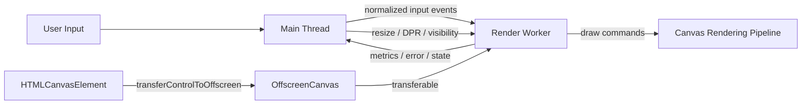
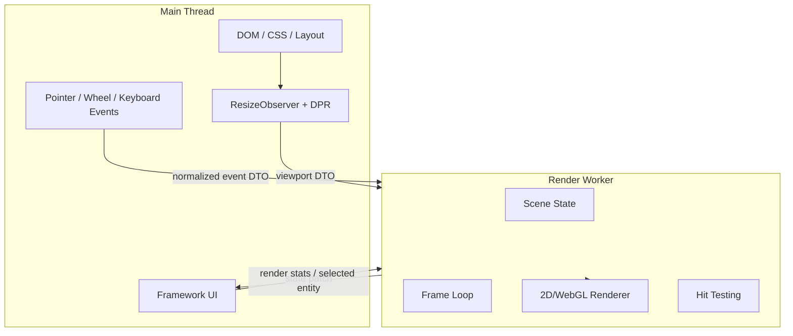
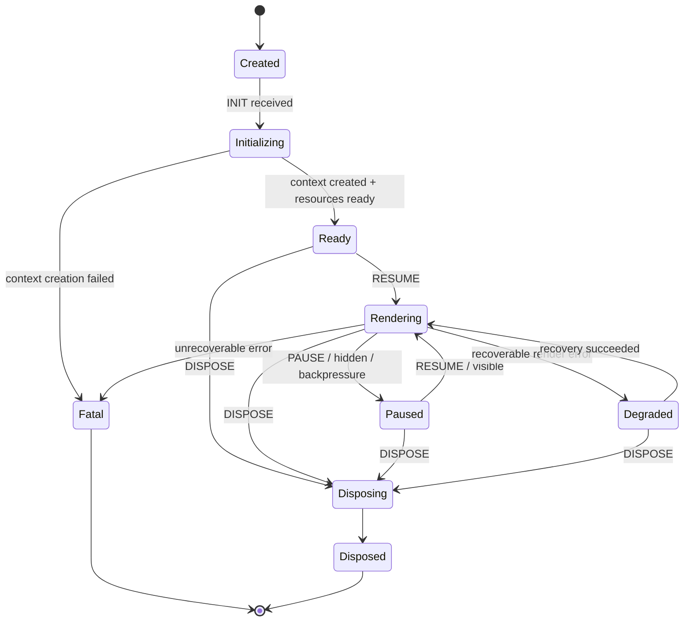
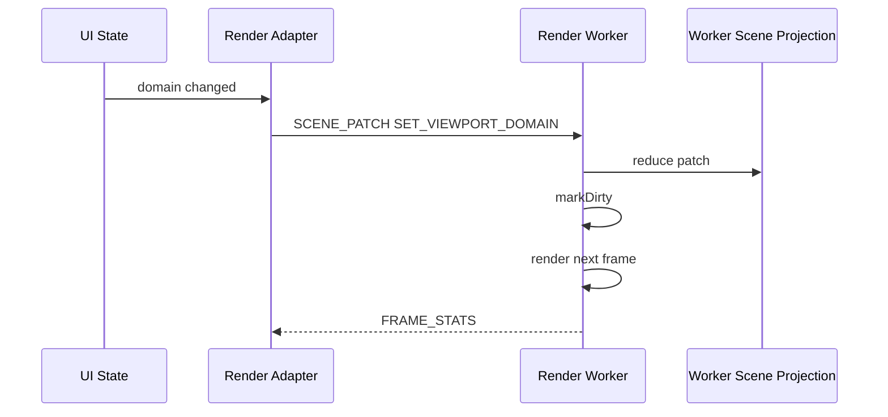
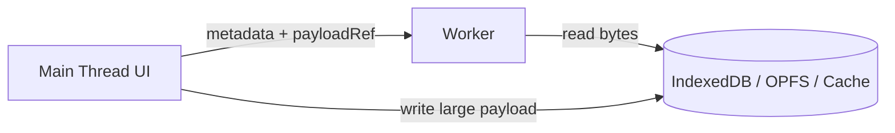
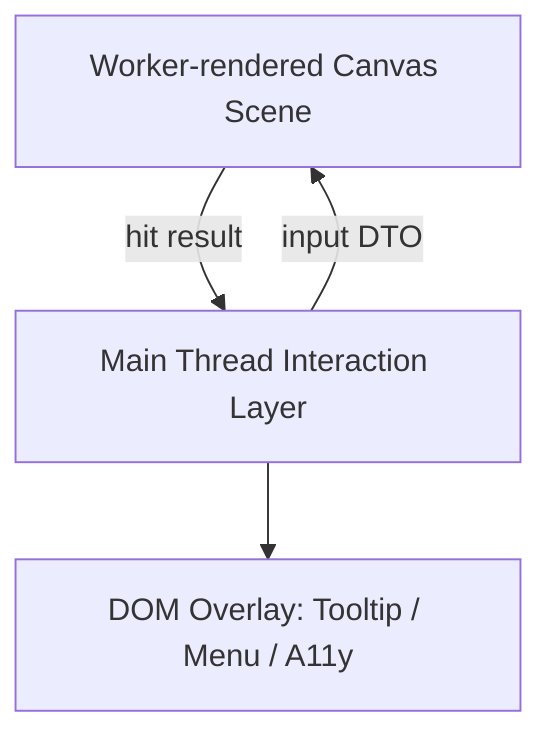
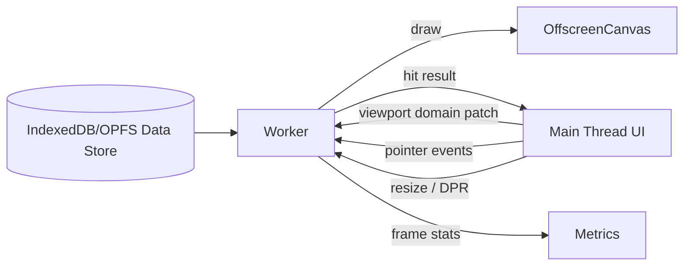

# Part 061 — OffscreenCanvas and Worker-Based Rendering

Rendering terlihat seperti masalah visual. Di production, rendering sering menjadi masalah scheduling.

Main thread harus menangani input, DOM, style calculation, layout, paint, compositing coordination, JavaScript app logic, hydration, framework reconciliation, analytics, dan network callbacks. Ketika rendering canvas berat ikut tinggal di main thread, frame budget menjadi medan perang.

`OffscreenCanvas` memberi kita cara untuk memindahkan sebagian pekerjaan rendering canvas ke worker. Tetapi ini bukan sekadar “gambar di thread lain”. Begitu canvas dikontrol worker, kita sedang membuat rendering actor yang memiliki lifecycle, protocol, backpressure, state ownership, error boundary, dan compatibility fallback sendiri.

Tujuan part ini:

1. membangun mental model `OffscreenCanvas` sebagai rendering boundary;
2. memisahkan DOM/input ownership dari render ownership;
3. mendesain protocol main thread ⇄ render worker;
4. menangani resize, DPR, visibility, pause/resume, dan disposal;
5. memahami kapan worker rendering justru salah;
6. membuat skeleton render runtime yang cukup aman untuk production.

---

## 1. Mental Model

Canvas biasa terikat ke DOM element.

Main thread membaca DOM, menerima event, lalu menjalankan drawing command pada `CanvasRenderingContext2D`, `WebGLRenderingContext`, atau `WebGL2RenderingContext`.

Dengan `OffscreenCanvas`, control surface dapat dipindah keluar dari DOM-facing main thread.



Core shift-nya:

| Concern | Main-thread canvas | Worker-based OffscreenCanvas |
|---|---|---|
| DOM ownership | main thread | main thread tetap |
| input event capture | main thread | main thread tetap |
| rendering state | sering bercampur dengan UI state | idealnya di render worker |
| drawing command | main thread | worker |
| resize observation | main thread | main thread mengirim signal |
| frame loop | `window.requestAnimationFrame` | worker rAF jika tersedia/valid; fallback loop jika perlu |
| failure recovery | page logic langsung terdampak | render actor bisa restart/re-init |

`OffscreenCanvas` bukan menghapus main thread. Ia mengurangi jenis pekerjaan yang harus dilakukan main thread.

---

## 2. Use Case yang Masuk Akal

Gunakan worker-based rendering ketika rendering memiliki karakteristik berikut:

| Workload | Cocok? | Catatan |
|---|---:|---|
| chart ribuan sampai jutaan point | Ya | transform, aggregation, hit-test bisa di-worker-kan |
| minimap/editor canvas besar | Ya | main thread cukup route input dan UI chrome |
| game/visual simulation | Ya | render loop + simulation loop bisa dipisahkan |
| image processing preview | Ya | worker bisa combine compute + render |
| WebGL scene berat | Ya | tergantung library dan compatibility |
| static icon kecil | Tidak | overhead worker tidak sepadan |
| DOM-heavy UI | Tidak | OffscreenCanvas tidak memindahkan DOM/layout |
| canvas yang banyak berinteraksi dengan DOM measurement | Hati-hati | DOM tetap main-thread-only |

Rule praktis:

> OffscreenCanvas berguna ketika bottleneck kamu adalah drawing, simulation, rasterization command generation, hit-testing, atau data transform sebelum render — bukan ketika bottleneck-nya adalah CSS/layout/DOM.

---

## 3. Batas API: Apa yang Bisa dan Tidak Bisa Dipindah

Worker tidak bisa menyentuh DOM.

Jadi worker tidak bisa:

- membaca ukuran element langsung dari DOM;
- membaca CSS computed style;
- menangani pointer event langsung dari DOM element;
- memanggil API DOM yang hanya tersedia di window;
- mengakses framework component tree;
- membuat keputusan layout berbasis DOM tanpa data dari main thread.

Worker bisa:

- menerima `OffscreenCanvas` sebagai transferable;
- membuat rendering context dari canvas tersebut;
- menjalankan draw command;
- menjalankan simulation loop;
- memproses input yang sudah dinormalisasi;
- melakukan hit-test terhadap scene graph internal;
- memuat asset tertentu melalui `fetch`;
- memakai typed arrays/transferables/shared memory untuk data besar;
- mengirim metric/error/progress ke main thread.

Karena itu, architecture-nya harus jelas:



Main thread owns DOM facts. Worker owns render facts.

---

## 4. The First Dangerous Line: Transfer Control

Minimal main-thread setup:

```ts
const canvas = document.querySelector<HTMLCanvasElement>('#viewport');
if (!canvas) throw new Error('canvas not found');

const offscreen = canvas.transferControlToOffscreen();

const worker = new Worker(
  new URL('./render.worker.ts', import.meta.url),
  { type: 'module' },
);

worker.postMessage(
  {
    type: 'INIT',
    canvas: offscreen,
    viewport: readViewport(canvas),
    protocolVersion: 1,
  },
  [offscreen],
);
```

Dua hal penting:

1. `OffscreenCanvas` adalah transferable.
2. Setelah control canvas dipindahkan, main thread tidak lagi boleh memperlakukan canvas itu sebagai drawing surface biasa.

Ini ownership transfer, bukan shared drawing mode.

---

## 5. Protocol, Bukan Callback Acak

Render worker harus dikendalikan oleh protocol yang eksplisit.

Contoh message set:

```ts
type MainToRender =
  | InitMessage
  | ResizeMessage
  | VisibilityMessage
  | InputMessage
  | StatePatchMessage
  | AssetAvailableMessage
  | PauseMessage
  | ResumeMessage
  | DisposeMessage;

type RenderToMain =
  | ReadyMessage
  | FrameStatsMessage
  | HitTestResultMessage
  | RenderErrorMessage
  | FatalMessage;
```

Minimal envelope:

```ts
type Envelope<TPayload> = {
  protocol: 'render-worker.v1';
  id: string;
  kind: string;
  sentAtMs: number;
  generation: number;
  payload: TPayload;
};
```

Kenapa perlu `generation`?

Karena render worker bisa direstart. Response dari worker lama tidak boleh diterima oleh runtime baru.

```ts
function acceptRenderMessage(msg: Envelope<unknown>) {
  if (msg.generation !== currentGeneration) {
    return; // stale render worker
  }

  route(msg);
}
```

---

## 6. Render Worker State Machine

Render worker bukan function. Ia actor.



Production invariant:

> A worker may draw only after INIT succeeds, only for its current generation, and only while not disposed.

---

## 7. Main Thread Adapter

Jangan sebar `worker.postMessage()` di component UI.

Buat adapter:

```ts
type RenderRuntime = {
  init(canvas: HTMLCanvasElement): void;
  resize(viewport: Viewport): void;
  setVisible(visible: boolean): void;
  dispatchInput(event: NormalizedInputEvent): void;
  applyPatch(patch: ScenePatch): void;
  pause(reason: string): void;
  resume(reason: string): void;
  dispose(): void;
};
```

Implementasi adapter bertanggung jawab untuk:

- membuat worker;
- transfer `OffscreenCanvas`;
- menjaga generation token;
- normalize event;
- throttle resize;
- handle worker error;
- restart jika policy mengizinkan;
- expose metric;
- cleanup event listener.

Skeleton:

```ts
export function createRenderRuntime(): RenderRuntime {
  let worker: Worker | null = null;
  let generation = 0;
  let disposed = false;

  function post(kind: string, payload: unknown, transfer: Transferable[] = []) {
    if (!worker || disposed) return;

    worker.postMessage({
      protocol: 'render-worker.v1',
      id: crypto.randomUUID(),
      kind,
      sentAtMs: performance.now(),
      generation,
      payload,
    }, transfer);
  }

  return {
    init(canvas) {
      disposed = false;
      generation += 1;
      worker = new Worker(new URL('./render.worker.ts', import.meta.url), {
        type: 'module',
      });

      worker.onmessage = (event) => {
        const msg = event.data;
        if (msg.generation !== generation) return;
        handleRenderMessage(msg);
      };

      worker.onerror = (error) => {
        reportRenderFatal(error, generation);
      };

      const offscreen = canvas.transferControlToOffscreen();
      post('INIT', { canvas: offscreen, viewport: readViewport(canvas) }, [offscreen]);
    },

    resize(viewport) {
      post('RESIZE', viewport);
    },

    setVisible(visible) {
      post('VISIBILITY', { visible });
    },

    dispatchInput(input) {
      post('INPUT', input);
    },

    applyPatch(patch) {
      post('SCENE_PATCH', patch, patch.transfer ?? []);
    },

    pause(reason) {
      post('PAUSE', { reason });
    },

    resume(reason) {
      post('RESUME', { reason });
    },

    dispose() {
      disposed = true;
      post('DISPOSE', { reason: 'runtime disposed' });
      worker?.terminate();
      worker = null;
    },
  };
}
```

Catatan: dalam kode nyata, jangan transfer `canvas` sebagai field biasa tanpa typing yang jelas. Contoh di atas ringkas untuk memperlihatkan boundary.

---

## 8. Render Worker Skeleton

```ts
type RuntimeState = {
  generation: number;
  canvas: OffscreenCanvas | null;
  ctx: OffscreenCanvasRenderingContext2D | null;
  viewport: Viewport | null;
  running: boolean;
  disposed: boolean;
  frameHandle: number | null;
  scene: SceneState;
};

const state: RuntimeState = {
  generation: 0,
  canvas: null,
  ctx: null,
  viewport: null,
  running: false,
  disposed: false,
  frameHandle: null,
  scene: createInitialScene(),
};

self.onmessage = (event) => {
  const msg = event.data as Envelope<any>;

  if (state.generation !== 0 && msg.generation !== state.generation) {
    return;
  }

  switch (msg.kind) {
    case 'INIT':
      init(msg);
      break;
    case 'RESIZE':
      resize(msg.payload);
      break;
    case 'VISIBILITY':
      setVisible(msg.payload.visible);
      break;
    case 'INPUT':
      handleInput(msg.payload);
      break;
    case 'SCENE_PATCH':
      applyScenePatch(msg.payload);
      break;
    case 'PAUSE':
      pause(msg.payload.reason);
      break;
    case 'RESUME':
      resume(msg.payload.reason);
      break;
    case 'DISPOSE':
      dispose();
      break;
    default:
      postError('UNKNOWN_MESSAGE', { kind: msg.kind });
  }
};

function init(msg: Envelope<{ canvas: OffscreenCanvas; viewport: Viewport }>) {
  state.generation = msg.generation;
  state.canvas = msg.payload.canvas;
  state.viewport = msg.payload.viewport;
  state.ctx = state.canvas.getContext('2d');

  if (!state.ctx) {
    postFatal('CONTEXT_UNAVAILABLE');
    return;
  }

  applyViewport(state.canvas, state.viewport);
  postReady();
  resume('init');
}
```

---

## 9. Resize Is a Protocol, Not a Detail

Canvas rendering quality depends on CSS size and device pixel ratio.

Main thread knows CSS layout. Worker does not.

Viewport DTO:

```ts
type Viewport = {
  cssWidth: number;
  cssHeight: number;
  devicePixelRatio: number;
  backingWidth: number;
  backingHeight: number;
};
```

Main thread:

```ts
function readViewport(canvas: HTMLCanvasElement): Viewport {
  const rect = canvas.getBoundingClientRect();
  const dpr = window.devicePixelRatio || 1;

  return {
    cssWidth: rect.width,
    cssHeight: rect.height,
    devicePixelRatio: dpr,
    backingWidth: Math.max(1, Math.floor(rect.width * dpr)),
    backingHeight: Math.max(1, Math.floor(rect.height * dpr)),
  };
}
```

Worker:

```ts
function applyViewport(canvas: OffscreenCanvas, viewport: Viewport) {
  if (canvas.width !== viewport.backingWidth) {
    canvas.width = viewport.backingWidth;
  }

  if (canvas.height !== viewport.backingHeight) {
    canvas.height = viewport.backingHeight;
  }

  const ctx = state.ctx;
  if (!ctx) return;

  ctx.setTransform(
    viewport.devicePixelRatio,
    0,
    0,
    viewport.devicePixelRatio,
    0,
    0,
  );
}
```

Invariant:

> Worker renders in CSS logical coordinates, canvas backing store is scaled by DPR.

Tanpa invariant ini, seluruh hit-testing dan drawing math akan pelan-pelan rusak.

---

## 10. ResizeObserver Integration

```ts
const observer = new ResizeObserver(() => {
  resizeScheduler.schedule(() => {
    runtime.resize(readViewport(canvas));
  });
});

observer.observe(canvas);

window.addEventListener('resize', () => {
  resizeScheduler.schedule(() => {
    runtime.resize(readViewport(canvas));
  });
});
```

Resize harus di-throttle/coalesce.

Anti-pattern:

```ts
observer = new ResizeObserver(() => {
  runtime.resize(readViewport(canvas)); // can flood worker
});
```

Better:

```ts
function createRafCoalescer(fn: () => void) {
  let scheduled = false;

  return {
    schedule() {
      if (scheduled) return;
      scheduled = true;
      requestAnimationFrame(() => {
        scheduled = false;
        fn();
      });
    },
  };
}
```

Resize flood adalah message storm. Message storm tetap bisa mengganggu main thread walaupun rendering-nya pindah ke worker.

---

## 11. Frame Loop Design

Worker rendering loop memiliki beberapa pilihan:

1. `DedicatedWorkerGlobalScope.requestAnimationFrame` jika tersedia dan cocok dengan target browser;
2. message-driven rendering: render hanya saat state/input berubah;
3. fixed-step simulation + render loop;
4. main-thread clock: main thread mengirim tick signal;
5. fallback `setTimeout`, dengan kualitas pacing lebih rendah.

Jangan hardcode satu strategi tanpa compatibility boundary.

```ts
function scheduleNextFrame() {
  if (!state.running || state.disposed) return;

  if (typeof self.requestAnimationFrame === 'function') {
    state.frameHandle = self.requestAnimationFrame(frame);
    return;
  }

  state.frameHandle = self.setTimeout(() => frame(performance.now()), 16) as unknown as number;
}

function frame(now: number) {
  if (!state.running || state.disposed) return;

  try {
    update(now);
    render(now);
    publishFrameStats(now);
  } catch (error) {
    postRenderError(error);
    pause('render-error');
    return;
  }

  scheduleNextFrame();
}
```

Untuk dashboard/editor, sering lebih baik memakai dirty rendering:

```ts
let dirty = true;

function markDirty(reason: string) {
  dirty = true;
  if (!state.running) return;
  scheduleNextFrame();
}

function frame(now: number) {
  if (!dirty) return;
  dirty = false;
  render(now);
}
```

Game/simulation biasanya perlu continuous loop. Data visualization biasanya tidak.

---

## 12. Input Routing

DOM event tetap di main thread.

Jangan kirim raw DOM event ke worker. DOM event tidak cocok sebagai protocol object.

Normalize:

```ts
type NormalizedPointerEvent = {
  kind: 'pointer';
  phase: 'down' | 'move' | 'up' | 'cancel';
  pointerId: number;
  x: number;
  y: number;
  buttons: number;
  modifiers: {
    alt: boolean;
    ctrl: boolean;
    meta: boolean;
    shift: boolean;
  };
  timeMs: number;
};
```

Main thread:

```ts
canvas.addEventListener('pointermove', (event) => {
  const rect = canvas.getBoundingClientRect();

  runtime.dispatchInput({
    kind: 'pointer',
    phase: 'move',
    pointerId: event.pointerId,
    x: event.clientX - rect.left,
    y: event.clientY - rect.top,
    buttons: event.buttons,
    modifiers: {
      alt: event.altKey,
      ctrl: event.ctrlKey,
      meta: event.metaKey,
      shift: event.shiftKey,
    },
    timeMs: event.timeStamp,
  });
});
```

Worker:

```ts
function handleInput(input: NormalizedPointerEvent) {
  scene.input.apply(input);
  markDirty('input');

  if (input.phase === 'move') {
    const hit = hitTest(scene, input.x, input.y);
    postHitTestResult(hit);
  }
}
```

Invariant:

> Worker input coordinate system must match render coordinate system.

Kalau rendering memakai CSS logical coordinates, input juga harus CSS logical coordinates.

---

## 13. Hit Testing: Worker or Main?

Ada dua model.

### Model A — Hit Test di Main Thread

Cocok jika UI sederhana dan scene kecil.

- Main thread punya data ringan untuk hit area.
- Worker hanya menggambar.
- Latency event → response rendah.

Masalah: data scene harus diduplikasi.

### Model B — Hit Test di Worker

Cocok untuk scene besar.

- Worker memiliki spatial index.
- Main thread mengirim pointer event.
- Worker membalas `HIT_TEST_RESULT`.

Masalah: cursor/tooltip bisa terasa sedikit delayed jika message queue penuh.

Praktik production:

- gunakan worker hit-test untuk heavy scene;
- maintain small “interactive overlay hints” di main thread jika perlu immediate cursor feedback;
- throttle pointer move;
- drop stale pointer move.

```ts
let latestPointerSeq = 0;

function sendPointerMove(input: NormalizedPointerEvent) {
  latestPointerSeq += 1;
  runtime.dispatchInput({ ...input, seq: latestPointerSeq });
}

function handleHitResult(result: { seq: number; targetId: string | null }) {
  if (result.seq < latestPointerSeq - 1) return;
  updateCursor(result.targetId);
}
```

---

## 14. State Synchronization

Worker rendering harus menerima state dalam bentuk patch, bukan full app state.

Bad:

```ts
runtime.applyPatch({
  entireReduxStore,
});
```

Better:

```ts
type ScenePatch =
  | { kind: 'ADD_SERIES'; seriesId: string; points: Float32Array; transfer: Transferable[] }
  | { kind: 'REMOVE_SERIES'; seriesId: string }
  | { kind: 'SET_VIEWPORT_DOMAIN'; xMin: number; xMax: number; yMin: number; yMax: number }
  | { kind: 'SET_SELECTION'; ids: string[] }
  | { kind: 'SET_THEME'; theme: RenderTheme };
```

Worker owns scene projection.

Main thread sends business intent or render-relevant deltas.



---

## 15. Data Movement Strategy

Large data should be transferred, not cloned.

```ts
const points = new Float32Array(rawBuffer);

runtime.applyPatch({
  kind: 'ADD_SERIES',
  seriesId,
  points,
  transfer: [points.buffer],
});
```

Setelah buffer ditransfer, sender tidak boleh menggunakannya lagi.

Jika UI masih butuh data, gunakan salah satu:

1. keep source data in IndexedDB/OPFS and send reference;
2. copy intentionally with budget;
3. use SharedArrayBuffer if isolation and protocol justify complexity;
4. maintain summary/metadata on main thread only.

Data plane pattern:



Untuk payload besar, message bus hanya membawa pointer, bukan byte.

---

## 16. Visibility and Pause Policy

Page hidden bukan berarti worker otomatis berhenti sesuai keinginanmu.

Kirim lifecycle signal.

```ts
document.addEventListener('visibilitychange', () => {
  runtime.setVisible(document.visibilityState === 'visible');
});
```

Worker policy:

```ts
function setVisible(visible: boolean) {
  if (visible) {
    resume('visible');
  } else {
    pause('hidden');
  }
}
```

Namun tidak semua aplikasi harus pause total.

| App type | Hidden policy |
|---|---|
| financial chart live preview | reduce frequency or pause visual render, keep data ingest limited |
| editor canvas | pause render, keep durable save logic separate |
| game | pause simulation unless explicitly background-capable |
| monitoring wallboard | pause if hidden; resume with full redraw |
| export renderer | continue if user explicitly requested export |

Invariant:

> Visual rendering is optional when hidden; durable state work must not depend on render loop.

---

## 17. Context Loss and Recovery

WebGL context can be lost. 2D rendering can also hit resource issues.

Treat renderer as recoverable where possible.

Recovery strategy:

1. detect error/context loss;
2. pause loop;
3. notify main thread;
4. attempt reinitialize context/resources;
5. rebuild scene projection from durable/source data;
6. resume;
7. escalate to fatal if repeated.

```ts
type RenderFailure = {
  kind: 'CONTEXT_LOST' | 'RESOURCE_EXHAUSTED' | 'DRAW_FAILED' | 'UNKNOWN';
  recoverable: boolean;
  generation: number;
  frameSeq: number;
};
```

Do not silently redraw forever after context loss. User-visible degradation is better than invisible corruption.

---

## 18. Asset Loading

Asset ownership needs policy.

Options:

| Asset type | Better owner | Reason |
|---|---|---|
| UI icon used by DOM | main | DOM/UI integration |
| texture used only by renderer | worker | avoids main-thread decode/transfer path |
| authenticated asset | main or Service Worker | auth/session boundary |
| large binary scene | data-plane store + worker read | avoid broadcast/copy |
| theme tokens | main → worker patch | UI owns theme decision |

Worker can `fetch`, but auth, cache, and session state may be coordinated elsewhere. Jangan biarkan render worker menjadi auth policy owner.

---

## 19. Main-Thread Overlay Pattern

Tidak semua visual harus di canvas worker.

Sering lebih baik:

- canvas heavy scene di worker;
- tooltip DOM di main thread;
- context menu DOM di main thread;
- accessibility mirror di DOM;
- keyboard focus di main thread.



Canvas adalah visual surface. Accessibility, focus, and semantic controls sering tetap perlu DOM.

---

## 20. Backpressure for Render Messages

Render worker bisa tertinggal.

Problem:

- resize flood;
- pointermove flood;
- scene patch flood;
- frame stats flood;
- asset decode queue terlalu besar.

Policy per message kind:

| Message | Policy |
|---|---|
| `RESIZE` | keep latest, drop older |
| `POINTER_MOVE` | keep latest per pointer |
| `SCENE_PATCH` | ordered, may compact if commutative |
| `THEME` | keep latest |
| `DISPOSE` | immediate priority |
| `PAUSE`/`RESUME` | ordered lifecycle queue |
| large data patch | admission control by byte budget |

Queue shape:

```ts
type RenderQueue = {
  latestResize?: ResizeMessage;
  latestPointerById: Map<number, InputMessage>;
  orderedPatches: ScenePatchMessage[];
  urgent: Envelope<unknown>[];
};
```

Do not treat all messages equally.

---

## 21. Frame Stats and Observability

Worker must report enough to debug production issues.

Frame stats:

```ts
type FrameStats = {
  generation: number;
  frameSeq: number;
  startedAtMs: number;
  updateMs: number;
  renderMs: number;
  totalMs: number;
  droppedInputCount: number;
  sceneObjectCount: number;
  heapApproxBytes?: number;
};
```

Main thread aggregator:

```ts
function handleFrameStats(stats: FrameStats) {
  metrics.histogram('render.update.ms', stats.updateMs);
  metrics.histogram('render.draw.ms', stats.renderMs);
  metrics.gauge('render.scene.objects', stats.sceneObjectCount);

  if (stats.totalMs > 16.7) {
    metrics.increment('render.frame.over_budget');
  }
}
```

Useful counters:

- worker startup time;
- first frame time;
- average render time;
- p95 render time;
- dropped pointer events;
- resize coalescing count;
- patch queue length;
- bytes transferred;
- context creation failure;
- recoverable error count;
- fatal error count.

Without metrics, OffscreenCanvas becomes a black box.

---

## 22. Error Boundary

Worker-side:

```ts
function safeRender(now: number) {
  const start = performance.now();

  try {
    render(now);
  } catch (error) {
    postMessage({
      protocol: 'render-worker.v1',
      kind: 'RENDER_ERROR',
      generation: state.generation,
      payload: serializeError(error),
    });

    pause('render-error');
  } finally {
    recordRenderDuration(performance.now() - start);
  }
}
```

Main-side:

```ts
worker.onerror = (event) => {
  reportFatal({
    message: event.message,
    filename: event.filename,
    lineno: event.lineno,
    colno: event.colno,
    generation,
  });

  fallbackToMainThreadRendererOrStaticView();
};
```

Failure policy:

| Failure | Action |
|---|---|
| bad patch | reject patch; keep worker alive |
| context unavailable | fallback renderer |
| repeated render exception | pause + show degraded UI |
| worker crash | restart once if safe; otherwise fallback |
| protocol mismatch | fail fast; ask reload/update |
| asset load failure | render placeholder + report |

---

## 23. Compatibility Boundary

Do not assume every environment supports every piece equally.

Feature detection:

```ts
function supportsWorkerOffscreenCanvas(): boolean {
  return typeof HTMLCanvasElement !== 'undefined'
    && 'transferControlToOffscreen' in HTMLCanvasElement.prototype
    && typeof Worker !== 'undefined'
    && typeof OffscreenCanvas !== 'undefined';
}
```

Render strategy selector:

```ts
type RenderStrategy = 'worker-offscreen' | 'main-canvas' | 'static-svg' | 'unsupported';

function selectRenderStrategy(): RenderStrategy {
  if (supportsWorkerOffscreenCanvas()) return 'worker-offscreen';
  if (typeof HTMLCanvasElement !== 'undefined') return 'main-canvas';
  if (typeof SVGElement !== 'undefined') return 'static-svg';
  return 'unsupported';
}
```

Production rule:

> OffscreenCanvas is a progressive enhancement unless your product explicitly defines a browser baseline that guarantees it.

---

## 24. Testing Strategy

Test categories:

### Unit

- scene reducer;
- viewport calculation;
- input normalization;
- queue coalescing;
- patch compaction;
- generation filtering;
- error serialization.

### Integration

- init worker with transferred canvas;
- resize events update backing size;
- pointer events produce hit-test result;
- scene patch renders expected result;
- pause stops frame loop;
- dispose terminates worker.

### Chaos

- send resize flood;
- send pointer flood;
- kill worker mid-frame;
- send stale generation response;
- simulate hidden/visible transitions;
- fail context creation;
- deliver scene patches out of order;
- transfer detached buffer accidentally.

### Visual regression

- screenshot canvas output;
- compare per scenario;
- test DPR variants;
- test theme variants;
- test resize variants.

---

## 25. Case Study: High-Density Time-Series Chart

Problem:

- 2 million points;
- multiple tabs open;
- user pans/zooms quickly;
- tooltip hit-testing required;
- UI must stay interactive.

Architecture:



Worker responsibilities:

- load chunk references;
- downsample by viewport;
- maintain spatial index;
- render line/path/bars;
- hit-test pointer;
- send tooltip candidate.

Main responsibilities:

- route input;
- manage controls;
- own URL/query state;
- show tooltip overlay;
- handle accessibility;
- coordinate worker lifecycle.

Important optimization:

- do not send all points every pan;
- send viewport domain;
- worker reads/chunks data;
- use level-of-detail cache;
- drop stale render jobs.

Render job fencing:

```ts
type RenderJob = {
  jobId: string;
  viewportVersion: number;
  startedAtMs: number;
};

function finishRender(job: RenderJob) {
  if (job.viewportVersion !== state.currentViewportVersion) {
    return; // stale render
  }

  presentFrame();
}
```

---

## 26. Anti-Patterns

### Anti-pattern 1 — Send Whole App State

Worker rendering should not receive the entire app store.

It increases clone cost, coupling, leak risk, and protocol drift.

### Anti-pattern 2 — Ignore DPR

Canvas will look blurry or hit-testing will mismatch.

### Anti-pattern 3 — Let Worker Decide DOM Layout

Worker cannot observe DOM. Main thread must send viewport/layout facts.

### Anti-pattern 4 — Treat Worker rAF as Universal

Use feature detection and fallback. Render loop support and behavior must be tested against your browser baseline.

### Anti-pattern 5 — No Fallback

A blank canvas is worse than a slower main-thread renderer.

### Anti-pattern 6 — Broadcast Huge Render Data

Use transferables, OPFS/IndexedDB references, or SharedArrayBuffer with explicit protocol.

### Anti-pattern 7 — No Disposal

Forgotten worker + transferred canvas + event listeners = leak.

---

## 27. Production Checklist

Use this before shipping worker-rendered canvas:

- [ ] feature detection exists;
- [ ] fallback renderer exists;
- [ ] worker startup handshake exists;
- [ ] generation token guards stale worker messages;
- [ ] resize/DPR protocol tested;
- [ ] input normalized into DTOs;
- [ ] pointer move is throttled/coalesced;
- [ ] scene patches are typed/versioned;
- [ ] large payload uses transfer/reference, not accidental clone;
- [ ] hidden/visible policy exists;
- [ ] pause/resume/dispose are explicit;
- [ ] render errors are reported;
- [ ] fatal worker errors degrade gracefully;
- [ ] visual regression tests cover DPR/resize;
- [ ] frame metrics are emitted;
- [ ] memory growth is monitored;
- [ ] context loss strategy exists for WebGL;
- [ ] accessibility/DOM overlay strategy exists.

---

## 28. Mental Model Summary

OffscreenCanvas is not a magic performance switch.

It is a boundary.

A good boundary has:

1. explicit ownership;
2. typed protocol;
3. clear lifecycle;
4. bounded queues;
5. resize and DPR contract;
6. input normalization;
7. stale result fencing;
8. recovery path;
9. metrics;
10. fallback.

If you only move drawing code to a worker, you get a demo.

If you move rendering ownership, lifecycle, and protocol to a worker, you get an architecture.

---

## References

- MDN — OffscreenCanvas: `https://developer.mozilla.org/en-US/docs/Web/API/OffscreenCanvas`
- MDN — OffscreenCanvasRenderingContext2D: `https://developer.mozilla.org/en-US/docs/Web/API/OffscreenCanvasRenderingContext2D`
- MDN — DedicatedWorkerGlobalScope.requestAnimationFrame: `https://developer.mozilla.org/en-US/docs/Web/API/DedicatedWorkerGlobalScope/requestAnimationFrame`
- web.dev — OffscreenCanvas: `https://web.dev/articles/offscreen-canvas`
