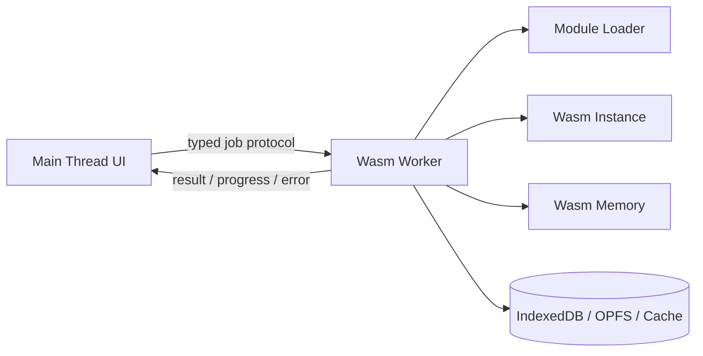
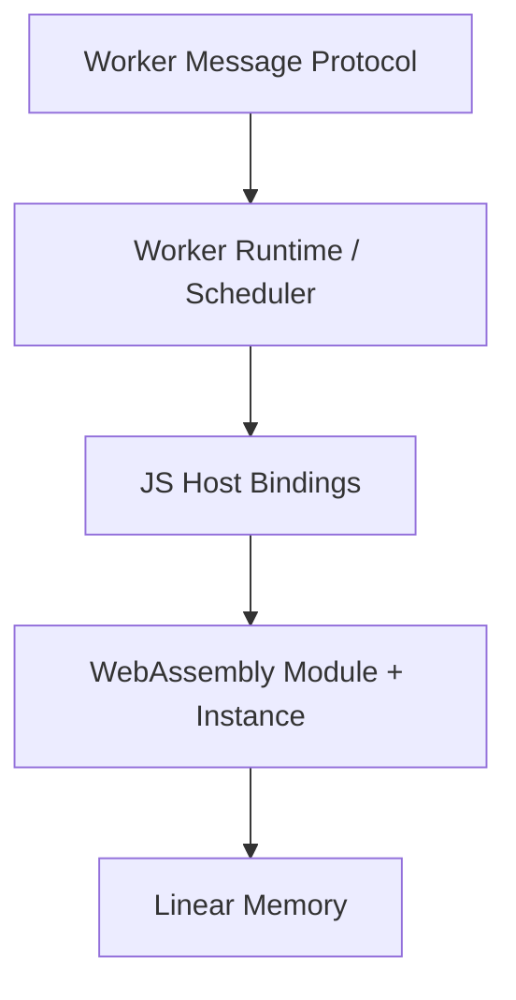
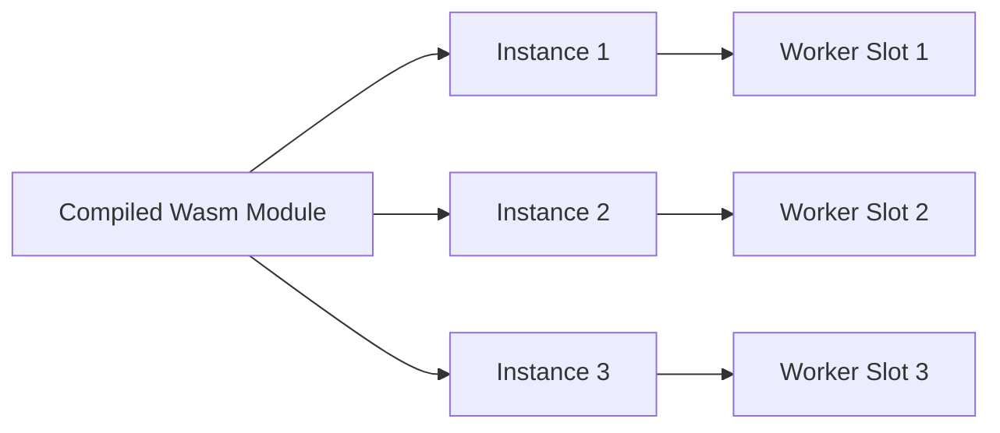
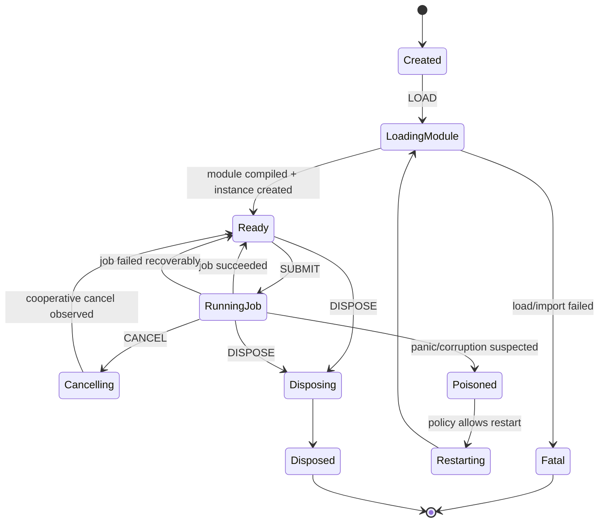
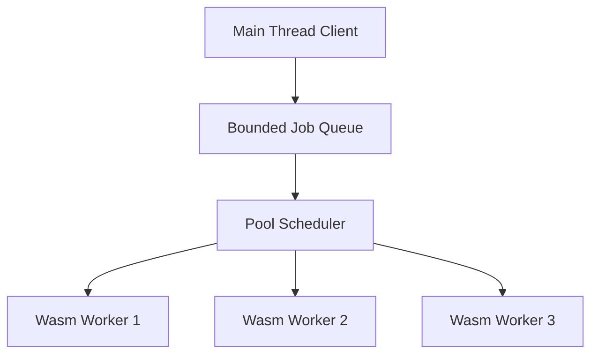
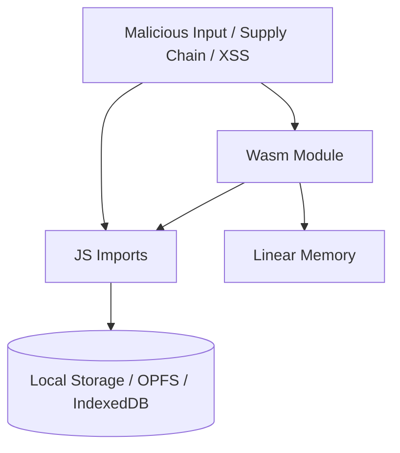
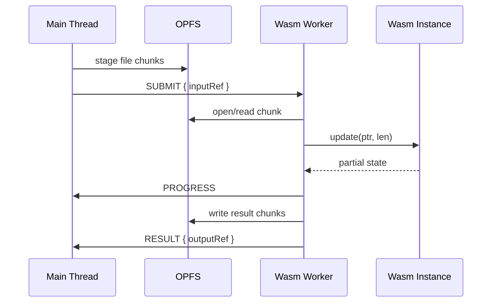

# Part 062 — WebAssembly Inside Workers

WebAssembly di browser sering dijual sebagai “near-native performance”. Itu terlalu dangkal.

Untuk engineer production, pertanyaannya bukan “apakah Wasm cepat?”. Pertanyaannya:

- workload apa yang pantas masuk Wasm;
- bagaimana module dimuat, dicache, dan di-versioning;
- di thread mana instance dijalankan;
- siapa yang memiliki memory;
- bagaimana data masuk/keluar tanpa copy berlebihan;
- bagaimana error/panic diterjemahkan ke protocol JavaScript;
- bagaimana fallback saat CSP/MIME/browser/deployment tidak sesuai;
- bagaimana worker pool dan Wasm instance hidup/mati.

Part ini membahas WebAssembly dalam konteks worker orchestration, bukan tutorial compile Rust/C/C++ ke Wasm.

Target mental model:

> WebAssembly is a compute engine. Worker is the scheduler/isolation boundary. Message protocol is the product contract.

---

## 1. Where Wasm Fits

Wasm cocok ketika pekerjaan memiliki salah satu sifat berikut:

| Workload | Cocok? | Alasan |
|---|---:|---|
| image/video/audio transform | Ya | CPU-heavy, byte-oriented |
| compression/decompression | Ya | tight loops, binary buffers |
| crypto/hash/checksum | Ya, dengan caveat | gunakan Web Crypto jika primitive tersedia; Wasm untuk custom/legacy |
| parser besar | Ya | deterministic CPU work |
| simulation/physics | Ya | numeric-heavy |
| ML inference kecil/menengah | Kadang | tergantung WebGPU/WebNN/library/browser |
| database query engine local | Ya | columnar/bitmap/vectorized work |
| string-heavy DOM UI logic | Tidak biasanya | JS/DOM boundary dominates |
| network orchestration | Tidak | bottleneck bukan compute |
| auth/session coordination | Tidak | correctness/security, bukan CPU |

Rule praktis:

> Jangan memakai Wasm untuk membuat JavaScript terlihat keren. Pakai Wasm ketika compute kernel jelas, boundary data jelas, dan cost crossing JS ⇄ Wasm lebih kecil daripada benefit-nya.

---

## 2. Worker + Wasm Topology

Wasm bisa dijalankan di main thread. Untuk workload berat, itu hampir selalu salah.

Better topology:



Main thread tetap mengurus:

- UI;
- input;
- cancellation intent;
- job admission;
- user-visible progress;
- session/security boundary.

Worker mengurus:

- module loading;
- instance lifecycle;
- memory allocation protocol;
- compute execution;
- chunking/progress;
- panic/error mapping;
- result serialization/transfer.

---

## 3. Wasm Is Not a Service

Wasm module bukan service. Ia lebih mirip library binary yang hidup di dalam JS host.

Ada tiga layer:



Jika kamu expose function Wasm langsung ke UI layer, architecture kamu bocor.

Bad:

```ts
button.onclick = () => wasmExports.compress(input);
```

Better:

```ts
await wasmWorker.submit({
  kind: 'COMPRESS',
  inputRef,
  compressionLevel,
  deadlineMs,
});
```

Worker protocol memberi tempat untuk cancellation, timeout, progress, metrics, versioning, dan fallback.

---

## 4. Loading Strategy

Browser menyediakan beberapa API loading:

| API | Use case |
|---|---|
| `WebAssembly.instantiateStreaming(responsePromise, imports)` | compile + instantiate langsung dari stream response; biasanya pilihan paling efisien |
| `WebAssembly.compileStreaming(responsePromise)` | compile module dulu, instantiate kemudian; cocok untuk cache/reuse module |
| `WebAssembly.instantiate(bufferSource, imports)` | fallback ketika MIME/streaming tidak cocok atau bytes sudah tersedia |
| `WebAssembly.compile(bufferSource)` | compile dari bytes menjadi module |

Streaming path:

```ts
async function loadWasm(url: string, imports: WebAssembly.Imports) {
  const result = await WebAssembly.instantiateStreaming(fetch(url), imports);

  return {
    module: result.module,
    instance: result.instance,
  };
}
```

Fallback path:

```ts
async function loadWasmFallback(url: string, imports: WebAssembly.Imports) {
  const response = await fetch(url);
  const bytes = await response.arrayBuffer();
  const result = await WebAssembly.instantiate(bytes, imports);

  return {
    module: result.module,
    instance: result.instance,
  };
}
```

Important deployment detail:

> `instantiateStreaming` expects a valid streamed response and real-world deployments often require correct `Content-Type: application/wasm`. Strict CSP may also block Wasm compilation/execution unless configured.

Karena itu, loader production harus punya diagnostic.

```ts
type WasmLoadFailure = {
  stage: 'fetch' | 'streaming-instantiate' | 'fallback-instantiate' | 'imports' | 'unknown';
  url: string;
  status?: number;
  contentType?: string | null;
  message: string;
};
```

---

## 5. Module vs Instance

Jangan campur `Module` dan `Instance`.

| Concept | Meaning |
|---|---|
| `WebAssembly.Module` | compiled code artifact |
| `WebAssembly.Instance` | executable instance with imports/exports/memory/table |
| `WebAssembly.Memory` | linear memory used by instance |
| `WebAssembly.Table` | table of references, commonly functions |

Production implication:

- compile cost bisa mahal;
- module bisa direuse untuk membuat instance baru;
- instance memiliki state;
- memory bisa grow dan tidak otomatis shrink seperti yang kamu harapkan;
- instance bukan transaction boundary;
- crash/panic bisa membuat instance tidak safe untuk dipakai ulang tergantung runtime/binding.

Worker pool design:



Namun di browser, `WebAssembly.Module` transfer/caching behavior harus diuji sesuai target browser/bundler. Simpan abstraction, jangan simpan asumsi sebagai API product.

---

## 6. Worker Runtime State Machine



Invariant:

> A Wasm instance may only execute jobs after module handshake succeeds, and may be discarded after panic, memory corruption suspicion, or binding-level invariant violation.

---

## 7. Worker Protocol

Message protocol:

```ts
type MainToWasmWorker =
  | { kind: 'LOAD'; wasmUrl: string; moduleVersion: string; importsVersion: string }
  | { kind: 'SUBMIT'; job: WasmJob }
  | { kind: 'CANCEL'; jobId: string; reason: string }
  | { kind: 'PING' }
  | { kind: 'DISPOSE' };

type WasmWorkerToMain =
  | { kind: 'READY'; capabilities: WasmCapabilities }
  | { kind: 'PROGRESS'; jobId: string; progress: Progress }
  | { kind: 'RESULT'; jobId: string; result: WasmResult }
  | { kind: 'JOB_ERROR'; jobId: string; error: WorkerErrorDto }
  | { kind: 'FATAL'; error: WorkerErrorDto }
  | { kind: 'METRICS'; metrics: WasmWorkerMetrics };
```

Job shape:

```ts
type WasmJob = {
  jobId: string;
  kind: 'COMPRESS' | 'DECODE_IMAGE' | 'QUERY_COLUMNAR' | 'HASH' | 'SIMULATE';
  input: PayloadDescriptor;
  options: Record<string, unknown>;
  deadlineMs?: number;
  idempotencyKey?: string;
};

type PayloadDescriptor =
  | { kind: 'INLINE_BYTES'; bytes: ArrayBuffer; transfer: true }
  | { kind: 'STORE_REF'; store: 'indexeddb' | 'opfs' | 'cache'; ref: string }
  | { kind: 'SHARED_MEMORY'; bufferId: string; offset: number; length: number };
```

The protocol hides the Wasm binding details.

---

## 8. Imports: The Host Contract

Wasm imports are functions/memory/table provided by JS host.

Typical imports:

- logging;
- time;
- random bytes;
- abort/cancellation check;
- memory allocation helpers;
- environment values;
- callbacks for progress.

Example:

```ts
const imports = {
  env: {
    now_ms: () => performance.now(),
    log: (ptr: number, len: number) => {
      const message = readUtf8(ptr, len);
      console.debug('[wasm]', message);
    },
    should_abort: () => cancellationFlag ? 1 : 0,
    report_progress: (current: number, total: number) => {
      progressReporter.report(current, total);
    },
  },
};
```

Imports are part of compatibility contract.

Version them.

```ts
type ImportsManifest = {
  importsVersion: 'env.v3';
  functions: Array<{
    namespace: string;
    name: string;
    signature: string;
    semantics: string;
  }>;
};
```

If JS host imports change but Wasm binary is old, fail fast.

---

## 9. Memory Ownership

Wasm memory is linear memory.

JS sees it as an `ArrayBuffer` via `memory.buffer`.

The critical bug class:

> You keep a typed array view into Wasm memory, then Wasm memory grows, and your view points to an old/detached buffer.

Unsafe pattern:

```ts
const view = new Uint8Array(memory.buffer, ptr, len);
wasmExports.maybe_grow_memory();
use(view); // may be stale
```

Safer pattern:

```ts
function viewBytes(ptr: number, len: number): Uint8Array {
  return new Uint8Array(memory.buffer, ptr, len);
}

wasmExports.maybe_grow_memory();
const fresh = viewBytes(ptr, len);
use(fresh);
```

Memory invariant:

> Do not cache views across calls that may grow memory.

---

## 10. Input/Output Strategies

### Strategy A — Copy Into Wasm Memory

Simple and predictable.

```ts
function copyIntoWasm(input: Uint8Array): { ptr: number; len: number } {
  const ptr = wasm.malloc(input.byteLength);
  const mem = new Uint8Array(memory.buffer, ptr, input.byteLength);
  mem.set(input);
  return { ptr, len: input.byteLength };
}
```

Good for:

- small/medium payload;
- simple API;
- easier correctness.

Bad for:

- huge payload;
- repeated streaming jobs;
- strict memory budget.

### Strategy B — Chunked Copy

```ts
for await (const chunk of readPayloadChunks(inputRef)) {
  const ptr = copyIntoWasm(chunk);
  wasm.update(ptr, chunk.length);
  wasm.free(ptr);
}

const result = wasm.finalize();
```

Good for large input.

### Strategy C — SharedArrayBuffer

If cross-origin isolation exists and complexity is justified:

- JS worker and Wasm read/write shared memory protocol;
- use `Atomics` for coordination;
- avoid repeated transfer/copy;
- harder to reason about correctness.

### Strategy D — Store Reference

For OPFS/IndexedDB/Cache payload:

- main thread sends ref;
- worker loads bytes;
- Wasm processes chunk-by-chunk;
- result stored back by reference.

Best for very large data.

---

## 11. Result Handling

Avoid returning huge result inline by default.

Result descriptor:

```ts
type WasmResult =
  | { kind: 'INLINE_JSON'; value: unknown }
  | { kind: 'INLINE_BYTES'; bytes: ArrayBuffer; transfer: true }
  | { kind: 'STORE_REF'; store: 'opfs' | 'indexeddb' | 'cache'; ref: string; bytes: number }
  | { kind: 'STREAM_SUMMARY'; chunks: number; manifestRef: string };
```

For a compressed file:

```ts
postMessage({
  kind: 'RESULT',
  jobId,
  result: {
    kind: 'STORE_REF',
    store: 'opfs',
    ref: outputRef,
    bytes: outputSize,
  },
});
```

For small hash:

```ts
postMessage({
  kind: 'RESULT',
  jobId,
  result: {
    kind: 'INLINE_JSON',
    value: { sha256: hex },
  },
});
```

---

## 12. Cancellation

Wasm does not magically stop when JS sends `CANCEL`.

Cancellation must be cooperative unless you kill the worker.

Pattern:

1. main sends `CANCEL jobId`;
2. worker marks `cancelRequested`;
3. imports expose `should_abort()`;
4. Wasm kernel checks periodically;
5. Wasm returns abort code;
6. worker maps to `JOB_ERROR` with `CANCELLED`;
7. memory/output cleanup runs.

```ts
let currentCancellation = false;

const imports = {
  env: {
    should_abort: () => currentCancellation ? 1 : 0,
  },
};
```

Wasm-side pseudo-code:

```c
for (int i = 0; i < n; i++) {
  if (should_abort()) {
    return ERR_ABORTED;
  }

  process_item(i);
}
```

Hard cancellation:

```ts
worker.terminate();
```

Hard cancellation discards entire worker and instance. Use it for:

- runaway compute;
- missed deadline;
- memory runaway;
- suspected corruption;
- user navigated away.

---

## 13. Progress Reporting

Progress callbacks from Wasm can flood JS.

Throttle in host binding.

```ts
function createProgressReporter(jobId: string) {
  let lastSentAt = 0;

  return {
    report(current: number, total: number) {
      const now = performance.now();
      if (now - lastSentAt < 100 && current !== total) return;
      lastSentAt = now;

      postMessage({
        kind: 'PROGRESS',
        jobId,
        progress: { current, total, ratio: total === 0 ? 0 : current / total },
      });
    },
  };
}
```

Progress semantics:

| Progress type | Meaning |
|---|---|
| determinate | total known |
| indeterminate | total unknown |
| phase-based | parse → compute → write |
| byte-based | bytes processed |
| item-based | records processed |

Always include phase for complex jobs.

```ts
type Progress = {
  phase: 'loading' | 'parsing' | 'processing' | 'writing' | 'done';
  current?: number;
  total?: number;
  ratio?: number;
};
```

---

## 14. Error and Panic Mapping

Never leak raw Wasm internals as product errors.

Map to stable error DTO:

```ts
type WorkerErrorDto = {
  code:
    | 'WASM_LOAD_FAILED'
    | 'IMPORT_MISMATCH'
    | 'JOB_CANCELLED'
    | 'JOB_TIMEOUT'
    | 'OUT_OF_MEMORY'
    | 'INVALID_INPUT'
    | 'WASM_TRAP'
    | 'PANIC'
    | 'UNKNOWN';
  message: string;
  recoverable: boolean;
  jobId?: string;
  moduleVersion?: string;
  details?: Record<string, unknown>;
};
```

Policy:

| Error | Recover worker? |
|---|---:|
| invalid input | Yes |
| job cancelled | Yes |
| timeout with cooperative abort | Yes |
| Wasm trap | Maybe, depends on runtime state |
| panic from safe binding | Usually restart instance |
| out of memory | Restart worker; maybe reduce concurrency |
| import mismatch | Fatal until reload/deploy fix |

---

## 15. Wasm Worker Pool

When one worker is insufficient, use a pool.

But every worker may load/instantiate its own Wasm instance.

Cost model:

- module fetch;
- compile;
- instantiate;
- memory allocation;
- warmup;
- input copy;
- output copy;
- worker scheduling overhead;
- CPU contention.

Pool shape:



Scheduling policy:

| Job | Placement |
|---|---|
| large memory job | dedicated slot |
| low-latency small job | warm idle worker |
| streaming job | worker with I/O capability |
| user-visible urgent job | priority lane |
| background compaction | low priority, pause on hidden |

Do not size pool to all CPU cores by default. Browser shares CPU with rendering, GC, network, other tabs, OS, and user input.

---

## 16. Module Cache Strategy

Possible layers:

1. HTTP cache for `.wasm` asset;
2. Service Worker Cache API for versioned asset;
3. in-worker compiled module variable;
4. module passed/reused inside worker runtime;
5. app-level manifest.

Manifest:

```ts
type WasmModuleManifest = {
  name: 'image-codec';
  moduleVersion: '2026.07.08-1';
  url: '/assets/wasm/image-codec.abc123.wasm';
  expectedSha256?: string;
  importsVersion: 'env.v3';
  capabilities: string[];
};
```

Cache invariant:

> Module version, JS binding version, and import contract version must be compatible before a job is accepted.

---

## 17. Bundler and Deployment Pitfalls

Common failures:

| Failure | Symptom | Fix |
|---|---|---|
| wrong `.wasm` URL | 404 in production | use bundler asset URL pattern |
| wrong MIME | streaming instantiate fails | serve `application/wasm` or fallback to ArrayBuffer instantiate |
| CSP blocks Wasm | compile/instantiate fails | configure CSP intentionally |
| Service Worker stale asset | old Wasm + new JS binding | versioned cache + manifest compatibility check |
| CDN compression issue | failed decode/instantiate | validate response headers |
| cross-origin asset missing CORS | fetch/instantiate fails | serve same-origin or proper CORS |
| source map unavailable | opaque stack | include debug symbol strategy for non-prod |

Do not test only dev server. Test production build under real headers.

---

## 18. CSP and Security

Wasm execution can be affected by Content Security Policy.

Security principles:

- load Wasm from trusted versioned origin;
- avoid dynamic arbitrary Wasm loading;
- pin manifest version;
- validate input before passing to Wasm;
- bound memory and runtime;
- treat imported host functions as attack surface;
- avoid exposing secrets in linear memory longer than needed;
- clear sensitive buffers where feasible;
- do not put auth tokens into Wasm memory unless absolutely necessary.

Threat model:



Wasm is not a sandbox from your application’s point of view. It runs inside your origin and host imports can do powerful things.

---

## 19. Large File Processing Pattern

Example: process 2 GB local file in browser.

Do not read entire file into memory.

Architecture:



Properties:

- memory bounded;
- resumable if paired with WAL;
- progress visible;
- cancellation possible;
- no giant structured clone;
- output is reference, not inline bytes.

---

## 20. Columnar Query Engine Pattern

Use case:

- local analytics on large dataset;
- user filters/sorts/groups;
- UI must stay responsive.

Architecture:


Boundary:

- JS builds query plan;
- Wasm executes tight vectorized kernels;
- result is compact summary;
- raw dataset lives in OPFS/IndexedDB/chunk cache.

Good Wasm boundary:

```ts
type QueryJob = {
  kind: 'QUERY_COLUMNAR';
  datasetRef: string;
  projection: string[];
  filter: QueryFilter;
  groupBy?: string[];
  limit?: number;
};
```

Bad boundary:

```ts
wasm.eval(queryStringFromUser);
```

Keep query language validation outside the compute kernel.

---

## 21. SharedArrayBuffer + Wasm

When cross-origin isolation is enabled, shared memory can reduce copies.

Use cases:

- streaming audio processing;
- real-time simulation;
- large producer-consumer pipeline;
- JS/Wasm ring buffer;
- rendering/data pipeline with fixed-size slots.

But shared memory raises complexity:

- atomics required;
- memory ordering must be explicit;
- deadlock/livelock possible;
- debugging harder;
- security headers required;
- fallback required.

Ring-buffer architecture:


Rule:

> Shared memory should be introduced only after transfer/reference architecture is proven insufficient.

---

## 22. Observability

Wasm worker metrics:

```ts
type WasmWorkerMetrics = {
  workerId: string;
  moduleVersion: string;
  state: 'loading' | 'ready' | 'running' | 'fatal' | 'disposed';
  loadedAtMs?: number;
  compileMs?: number;
  instantiateMs?: number;
  jobsCompleted: number;
  jobsFailed: number;
  jobsCancelled: number;
  currentJobId?: string;
  currentJobAgeMs?: number;
  memoryPages?: number;
  inputBytesProcessed?: number;
  outputBytesProduced?: number;
};
```

Important histograms:

- module fetch time;
- compile time;
- instantiate time;
- first job latency;
- job duration by kind;
- input copy time;
- output copy time;
- memory page count;
- cancellation latency;
- timeout count;
- worker restart count;
- panic/trap count.

Without this, “Wasm is slow” and “Wasm is fast” are equally meaningless.

---

## 23. Testing Strategy

### Contract tests

- JS host imports match Wasm expected imports;
- module version compatible with binding version;
- capabilities are advertised correctly;
- errors map to stable DTOs.

### Runtime tests

- load module;
- run small job;
- run large job;
- cancel job;
- deadline timeout;
- malformed input;
- memory growth;
- repeated jobs;
- worker restart;
- fallback loader path.

### Deployment tests

- production build URL resolves;
- `.wasm` served with expected headers;
- CSP allows expected behavior;
- Service Worker cache does not serve incompatible old module;
- offline path either works or fails cleanly;
- source map/debug info policy verified.

### Chaos tests

- kill worker during job;
- fail fetch;
- corrupt wasm bytes in test fixture;
- return old module with new JS binding;
- simulate OPFS quota failure;
- trigger cancellation while writing output;
- trigger memory pressure with large input.

---

## 24. Fallback Strategy

Fallback layers:

| Primary | Fallback |
|---|---|
| streaming instantiate | ArrayBuffer instantiate |
| Wasm worker | JS worker implementation |
| JS worker | main-thread small-input implementation |
| large exact operation | sampled/approximate operation |
| rich result | degraded summary |

Example selector:

```ts
type ComputeStrategy =
  | 'wasm-worker'
  | 'js-worker'
  | 'main-thread-small-input'
  | 'unsupported';

async function selectComputeStrategy(): Promise<ComputeStrategy> {
  if (typeof Worker === 'undefined') return 'main-thread-small-input';
  if (typeof WebAssembly !== 'undefined') return 'wasm-worker';
  return 'js-worker';
}
```

Fallback must be product-aware. Some operations should fail with a clear message instead of running a dangerously slow fallback.

---

## 25. Production Checklist

Before shipping Wasm in workers:

- [ ] workload boundary is compute-heavy and data-bounded;
- [ ] worker protocol hides raw Wasm exports;
- [ ] module URL is versioned;
- [ ] imports contract is versioned;
- [ ] streaming load has fallback;
- [ ] production headers tested;
- [ ] CSP tested;
- [ ] Service Worker cache compatibility handled;
- [ ] memory ownership documented;
- [ ] typed array views are not cached across memory growth;
- [ ] cancellation is cooperative or worker kill policy exists;
- [ ] timeout/deadline exists;
- [ ] large input uses chunk/ref/shared memory strategy;
- [ ] output can be returned by reference;
- [ ] error mapping stable;
- [ ] panic/trap policy defined;
- [ ] worker restart policy defined;
- [ ] metrics emitted;
- [ ] fallback exists;
- [ ] deployment smoke test covers real build;
- [ ] security review covers imports and data access.

---

## 26. Mental Model Summary

Wasm is not the architecture.

The architecture is:

1. a bounded compute job;
2. a worker scheduler;
3. a typed message protocol;
4. a versioned module and import contract;
5. a memory ownership model;
6. a cancellation/deadline model;
7. a data movement strategy;
8. a recovery/fallback policy;
9. observability.

When those pieces exist, Wasm becomes powerful.

Without them, Wasm becomes an opaque binary blob with expensive boundary crossings and hard-to-debug failures.

---

## References

- MDN — WebAssembly: `https://developer.mozilla.org/en-US/docs/WebAssembly`
- MDN — Using the WebAssembly JavaScript API: `https://developer.mozilla.org/en-US/docs/WebAssembly/Guides/Using_the_JavaScript_API`
- MDN — `WebAssembly.instantiateStreaming()`: `https://developer.mozilla.org/en-US/docs/WebAssembly/Reference/JavaScript_interface/instantiateStreaming_static`
- MDN — `WebAssembly.compileStreaming()`: `https://developer.mozilla.org/en-US/docs/WebAssembly/Reference/JavaScript_interface/compileStreaming_static`
- MDN — SharedArrayBuffer: `https://developer.mozilla.org/en-US/docs/Web/JavaScript/Reference/Global_Objects/SharedArrayBuffer`
