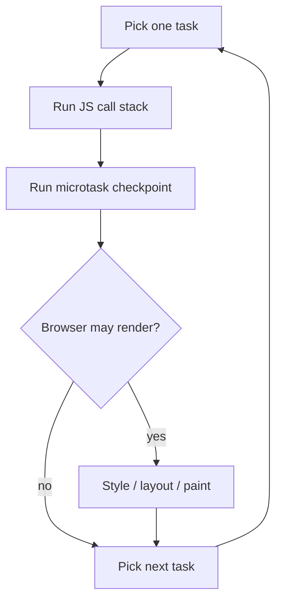
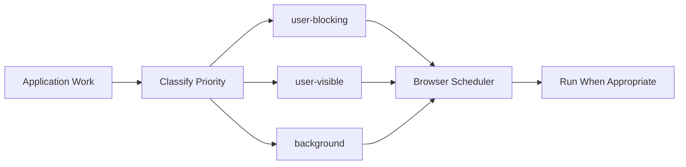
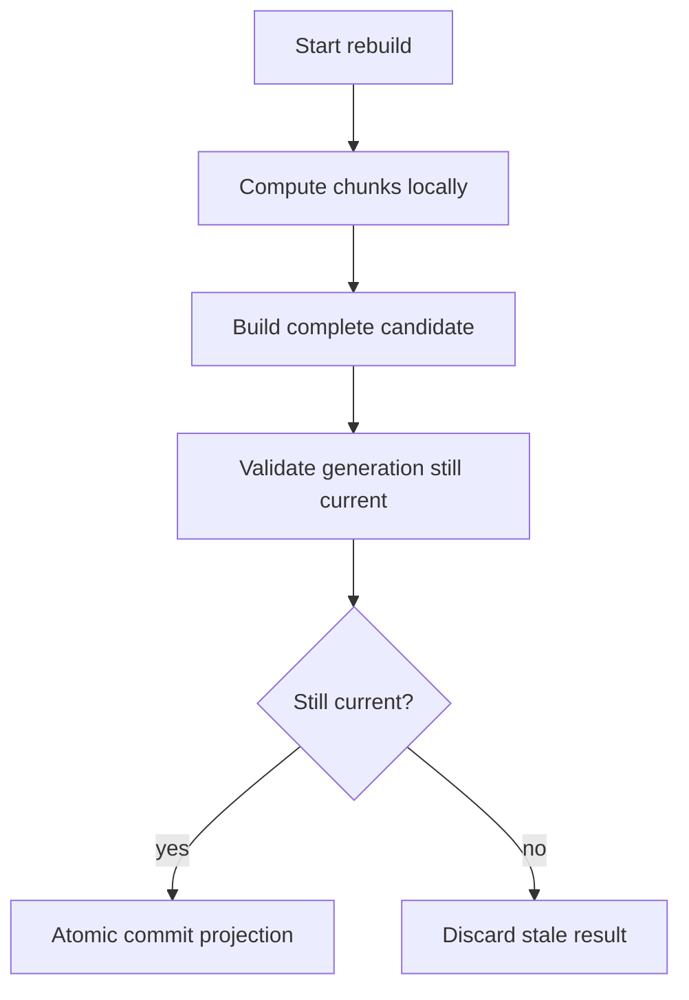
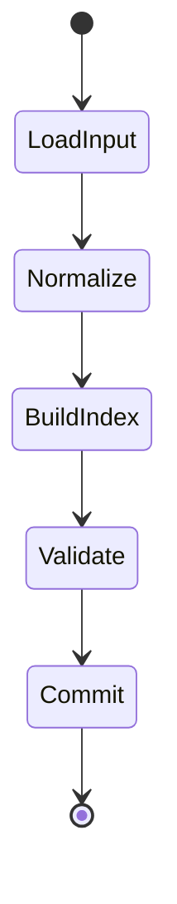
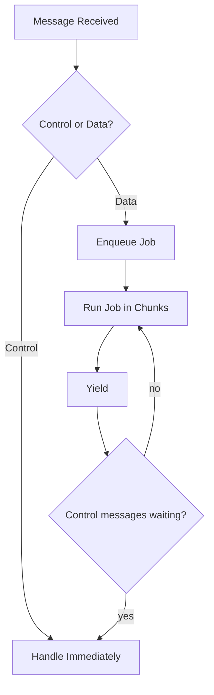
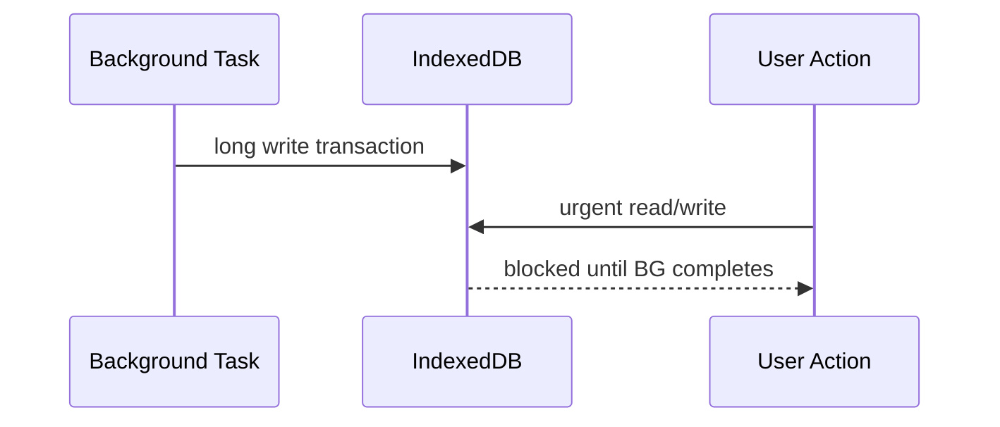
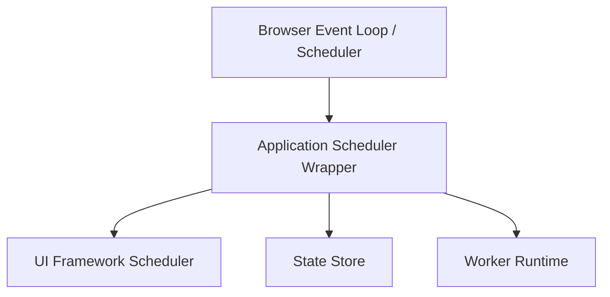
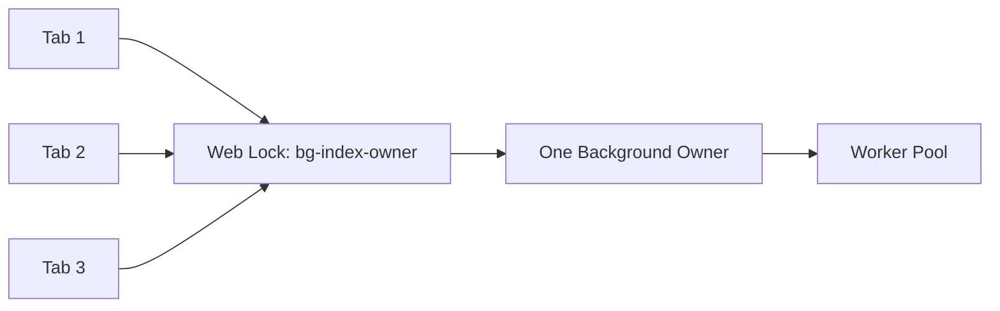

# Part 063 — Scheduler API, `postTask`, `yield`, and Cooperative Scheduling

Di part sebelumnya kita sudah membahas worker, SharedArrayBuffer, Atomics, OffscreenCanvas, dan WebAssembly. Semua itu adalah cara memindahkan atau mempercepat pekerjaan.

Tetapi ada satu kategori masalah yang tidak selesai hanya dengan worker:

> Main thread still needs a scheduler.

Browser sudah punya scheduler internal. Ia harus menyeimbangkan input, rendering, network callbacks, timers, promise jobs, animation callbacks, idle work, dan JavaScript application code. Tetapi application code sering mengeksekusi work sebagai satu blob besar.

Hasilnya:

- input terlambat diproses;
- frame drop;
- animation jank;
- long task;
- React/Vue/Svelte hydration terasa berat;
- progress UI tidak sempat paint;
- tab lain ikut terasa berat karena CPU contention;
- worker result datang cepat tetapi reducer/render di main thread tetap macet.

Part ini membahas **cooperative scheduling** di browser: bagaimana memecah work, memberi prioritas, yield ke browser, dan mendesain task runtime yang tetap deterministic.

Fokusnya bukan sekadar API baru. Fokusnya adalah mental model:

> A browser app is not fast because every function is fast. It is fast because no unit of work monopolizes the user-visible scheduler.

---

## 1. Problem Statement

Misalnya aplikasi case-management regulatory punya halaman workbench. Saat user membuka case besar, aplikasi melakukan:

- parse policy tree;
- normalize 20.000 evidence records;
- build derived timeline;
- compute SLA/escalation state;
- hydrate UI store;
- render table/filter/search index;
- start background sync;
- open WebSocket;
- replay local outbox.

Jika semua dilakukan sebagai satu synchronous chain, browser tidak punya kesempatan memproses input atau paint.

```ts
function openCase(caseId: string) {
  const raw = loadCachedCase(caseId);
  const normalized = normalizeEvidence(raw.evidence);
  const timeline = buildTimeline(normalized);
  const sla = computeSla(timeline);
  const index = buildSearchIndex(normalized);

  store.commit({ normalized, timeline, sla, index });
  renderWorkbench();
}
```

Kode ini terlihat bersih, tetapi ia menyembunyikan satu invariant buruk:

> The user cannot interrupt the work until the call stack returns.

Jika work berjalan 180 ms, maka selama 180 ms:

- click tidak diproses;
- keystroke tidak diproses;
- pointer movement tertunda;
- progress spinner bisa tidak berputar;
- browser tidak bisa melakukan rendering opportunity.

Worker bisa membantu untuk `normalizeEvidence` atau `buildSearchIndex`, tetapi tetap ada main-thread work:

- applying result;
- updating store;
- reconciling UI;
- responding to input;
- showing progress;
- routing cancellation.

Maka kita perlu scheduling di dua level:

1. **placement scheduling**: work masuk main thread atau worker;
2. **execution scheduling**: work dijalankan sekaligus atau dipotong-potong.

---

## 2. Task, Microtask, Render Opportunity

Mental model event loop yang perlu diingat:



Task bisa berasal dari:

- event handler;
- timer;
- message event;
- `postTask`;
- `postMessage`;
- network callbacks;
- browser-internal dispatch.

Microtask berasal dari:

- promise continuation;
- `queueMicrotask`;
- mutation observer callback.

Hal penting:

> Microtasks are not a yielding mechanism for user responsiveness.

Jika kamu memecah loop besar dengan `await Promise.resolve()`, kamu hanya memberi kesempatan microtask lain berjalan. Kamu belum benar-benar memberi browser kesempatan penuh untuk input/render.

Contoh buruk:

```ts
async function processItems(items: Item[]) {
  for (const item of items) {
    processItem(item);
    await Promise.resolve();
  }
}
```

Ini terlihat async, tetapi continuation tetap berada dalam microtask chain. Untuk memberi browser kesempatan memproses task lain, kita perlu yield ke task queue/browser scheduler.

---

## 3. What Counts as a Long Task

Long Task API menganggap task UI thread berdurasi **50 ms atau lebih** sebagai long task.

Jangan salah membaca angka ini. Angka 50 ms bukan target ideal. Itu alarm.

Untuk UI serius:

| Work unit | Interpretasi |
|---|---|
| < 4 ms | biasanya aman untuk frame-sensitive work |
| 4–8 ms | masih wajar, tetapi mulai perlu hati-hati saat frame budget ketat |
| 8–16 ms | bisa mengganggu frame 60 Hz jika sering terjadi |
| 16–50 ms | terasa berat; harus dipecah atau dipindah |
| ≥ 50 ms | long task; responsiveness risk tinggi |

Untuk perangkat low-end, angka aman lebih kecil.

Rule praktis:

> Design for chunks, not average total duration.

Pekerjaan 300 ms tidak selalu buruk jika dipecah menjadi potongan kecil dengan yield. Pekerjaan 70 ms bisa buruk jika memblokir tepat saat user mengetik.

---

## 4. The Scheduler API

Prioritized Task Scheduling API menyediakan dua primitive utama:

- `scheduler.postTask(callback, options)`;
- `scheduler.yield()`.

`postTask` memungkinkan app menjadwalkan callback dengan priority. `yield` memungkinkan async function menyerahkan main thread sementara, lalu melanjutkan eksekusi sebagai continuation yang dijadwalkan.

Priority umum:

| Priority | Gunakan untuk |
|---|---|
| `user-blocking` | work yang langsung dibutuhkan untuk input/interaction saat ini |
| `user-visible` | work yang menghasilkan UI visible, tetapi tidak seurgent input |
| `background` | precompute, cache warming, cleanup, analytics, non-urgent projection |

Diagram mental model:



Penting:

> Priority is a hint to the browser scheduler, not a correctness primitive.

Jangan membangun correctness di atas asumsi bahwa `user-blocking` pasti selalu lebih dulu. Correctness tetap harus dari protocol, state machine, idempotency, lock, dan fencing.

---

## 5. `scheduler.postTask`

Contoh dasar:

```ts
await scheduler.postTask(() => {
  updateVisibleCaseSummary(caseId);
}, { priority: 'user-visible' });
```

Contoh dengan background work:

```ts
scheduler.postTask(() => {
  warmSearchIndex(caseId);
}, { priority: 'background' });
```

Contoh dengan abort:

```ts
const controller = new AbortController();

const promise = scheduler.postTask(
  () => rebuildProjection(caseId),
  {
    priority: 'background',
    signal: controller.signal,
  },
);

// User navigates away.
controller.abort();

try {
  await promise;
} catch (error) {
  if ((error as DOMException).name === 'AbortError') {
    // scheduled task did not run or was canceled before execution
  }
}
```

Catatan penting:

- aborting scheduled task tidak otomatis menghentikan synchronous callback yang sudah mulai berjalan;
- untuk running work, kamu tetap perlu cooperative cancellation inside callback;
- `postTask` bukan worker pool;
- `postTask` bukan replacement untuk state machine;
- `postTask` tidak membuat CPU-bound work menjadi parallel.

---

## 6. `scheduler.yield`

`yield` dipakai untuk memecah async function yang panjang.

```ts
async function normalizeLargeList(items: Item[]) {
  const result: NormalizedItem[] = [];

  for (let i = 0; i < items.length; i++) {
    result.push(normalizeItem(items[i]));

    if (i % 100 === 0) {
      await scheduler.yield();
    }
  }

  return result;
}
```

Ini memberi browser kesempatan menjalankan work lain sebelum continuation dilanjutkan.

Namun jangan yield setiap item tanpa berpikir. Yield punya overhead.

Better:

```ts
async function normalizeLargeList(items: Item[]) {
  const result: NormalizedItem[] = [];
  let chunkStart = performance.now();

  for (let i = 0; i < items.length; i++) {
    result.push(normalizeItem(items[i]));

    const elapsed = performance.now() - chunkStart;
    if (elapsed >= 8) {
      await scheduler.yield();
      chunkStart = performance.now();
    }
  }

  return result;
}
```

Ini lebih adaptive daripada `i % 100` karena item cost bisa tidak seragam.

---

## 7. Yield Fallback

Tidak semua browser mendukung Scheduler API secara merata. Maka scheduling layer harus punya fallback.

```ts
export async function yieldToBrowser(): Promise<void> {
  const maybeScheduler = globalThis.scheduler as
    | { yield?: () => Promise<void> }
    | undefined;

  if (maybeScheduler?.yield) {
    await maybeScheduler.yield();
    return;
  }

  await new Promise<void>((resolve) => {
    setTimeout(resolve, 0);
  });
}
```

Fallback `setTimeout(0)` lebih portable, tetapi tidak sama kualitasnya:

- tidak punya priority inheritance;
- nested timers bisa terkena clamp;
- continuation bisa lebih lambat;
- ordering berbeda.

Karena itu app serius biasanya membuat wrapper:

```ts
export interface BrowserScheduler {
  yield(priority?: TaskPriority): Promise<void>;
  post<T>(fn: () => T | Promise<T>, options?: ScheduleOptions): Promise<T>;
}

type TaskPriority = 'user-blocking' | 'user-visible' | 'background';

type ScheduleOptions = {
  priority?: TaskPriority;
  signal?: AbortSignal;
};
```

Kemudian seluruh app menggunakan wrapper, bukan API mentah.

---

## 8. Main Thread Cooperative Chunking

Chunking berarti membagi work menjadi unit yang cukup kecil.

Contoh workload:

```ts
function computeEscalationForCase(caseRecord: CaseRecord): EscalationState {
  // CPU logic, rule traversal, date math, policy matching
}
```

Naive:

```ts
function computeAll(cases: CaseRecord[]) {
  return cases.map(computeEscalationForCase);
}
```

Cooperative:

```ts
type Progress = {
  processed: number;
  total: number;
};

export async function computeAllCooperative(
  cases: CaseRecord[],
  options: {
    signal: AbortSignal;
    onProgress?: (progress: Progress) => void;
    chunkBudgetMs?: number;
  },
): Promise<EscalationState[]> {
  const budget = options.chunkBudgetMs ?? 8;
  const result: EscalationState[] = [];
  let chunkStart = performance.now();

  for (let i = 0; i < cases.length; i++) {
    if (options.signal.aborted) {
      throw new DOMException('Computation aborted', 'AbortError');
    }

    result.push(computeEscalationForCase(cases[i]));

    const elapsed = performance.now() - chunkStart;
    if (elapsed >= budget) {
      options.onProgress?.({ processed: i + 1, total: cases.length });
      await yieldToBrowser();
      chunkStart = performance.now();
    }
  }

  options.onProgress?.({ processed: cases.length, total: cases.length });
  return result;
}
```

Invariants:

- setiap chunk bounded by time budget;
- cancellation dicek di setiap iterasi/chunk;
- progress throttled at chunk boundary;
- result hanya return setelah complete;
- partial result tidak otomatis commit ke global state.

---

## 9. The Partial Commit Trap

Saat memecah work, muncul godaan untuk commit partial result ke store setiap chunk.

```ts
// Dangerous if global state readers assume completeness.
store.appendComputedStates(partial);
```

Ini bisa membuat state impossible:

- UI melihat sebagian projection;
- tab lain membaca state setengah jadi;
- worker lain memakai derived data incomplete;
- user action terjadi di tengah rebuild.

Better pattern:



Gunakan generation token:

```ts
type ProjectionBuild = {
  generation: number;
  caseId: string;
  result: Projection;
};

let currentGeneration = 0;

export async function rebuildProjection(caseId: string, signal: AbortSignal) {
  const generation = ++currentGeneration;

  const result = await computeProjectionCooperative(caseId, signal);

  if (generation !== currentGeneration) {
    return; // stale
  }

  store.commitProjection({ caseId, generation, result });
}
```

Rule:

> Yielding changes interleaving. Every yielded algorithm needs stale-result protection.

---

## 10. Scheduler Priority as Product Policy

Priority bukan sekadar teknik performance. Ia adalah keputusan produk.

Contoh:

| Work | Priority | Reason |
|---|---|---|
| respond to typing in search box | `user-blocking` | user waits for immediate feedback |
| render selected case summary | `user-visible` | visible soon, but not input critical |
| rebuild full search index | `background` | useful later |
| compact IndexedDB event log | `background` | maintenance |
| cleanup expired cache | `background` | invisible |
| show logout confirmation state | `user-blocking` | security/user action |
| apply session revocation | `user-blocking` | correctness/security |
| prefetch next page data | `background` | speculative |

Do not make everything `user-blocking`.

Jika semua priority tinggi, tidak ada priority.

---

## 11. Runtime Wrapper

Bangun wrapper kecil agar scheduling policy tidak tersebar.

```ts
export type TaskPriority = 'user-blocking' | 'user-visible' | 'background';

export type ScheduleOptions = {
  priority?: TaskPriority;
  signal?: AbortSignal;
  label?: string;
};

export class CooperativeScheduler {
  async post<T>(
    fn: () => T | Promise<T>,
    options: ScheduleOptions = {},
  ): Promise<T> {
    const priority = options.priority ?? 'user-visible';
    const schedulerApi = globalThis.scheduler as
      | {
          postTask?: <R>(
            cb: () => R | Promise<R>,
            opts?: { priority?: TaskPriority; signal?: AbortSignal },
          ) => Promise<R>;
        }
      | undefined;

    if (schedulerApi?.postTask) {
      return schedulerApi.postTask(fn, {
        priority,
        signal: options.signal,
      });
    }

    if (options.signal?.aborted) {
      throw new DOMException('Task aborted', 'AbortError');
    }

    return new Promise<T>((resolve, reject) => {
      const timeout = setTimeout(async () => {
        if (options.signal?.aborted) {
          reject(new DOMException('Task aborted', 'AbortError'));
          return;
        }

        try {
          resolve(await fn());
        } catch (error) {
          reject(error);
        }
      }, 0);

      options.signal?.addEventListener(
        'abort',
        () => {
          clearTimeout(timeout);
          reject(new DOMException('Task aborted', 'AbortError'));
        },
        { once: true },
      );
    });
  }

  async yield(priority: TaskPriority = 'user-visible'): Promise<void> {
    const schedulerApi = globalThis.scheduler as
      | {
          yield?: () => Promise<void>;
          postTask?: <R>(cb: () => R, opts?: { priority?: TaskPriority }) => Promise<R>;
        }
      | undefined;

    if (schedulerApi?.yield) {
      await schedulerApi.yield();
      return;
    }

    if (schedulerApi?.postTask) {
      await schedulerApi.postTask(() => undefined, { priority });
      return;
    }

    await new Promise<void>((resolve) => setTimeout(resolve, 0));
  }
}
```

Kenapa wrapper penting?

- feature detection centralized;
- fallback behavior konsisten;
- observability bisa ditambahkan;
- test bisa inject fake scheduler;
- priority policy bisa diaudit;
- library/framework code tidak langsung mengikat diri ke API tertentu.

---

## 12. Budget-Aware Chunk Runner

Abstraksi umum:

```ts
export type ChunkRunnerOptions = {
  label: string;
  signal: AbortSignal;
  priority?: TaskPriority;
  budgetMs?: number;
  onYield?: (stats: ChunkStats) => void;
};

export type ChunkStats = {
  label: string;
  chunks: number;
  elapsedMs: number;
  processed: number;
};

export async function runChunked<T>(
  items: readonly T[],
  process: (item: T, index: number) => void,
  scheduler: CooperativeScheduler,
  options: ChunkRunnerOptions,
): Promise<void> {
  const budget = options.budgetMs ?? 8;
  const startedAt = performance.now();
  let chunkStartedAt = startedAt;
  let chunks = 0;

  for (let i = 0; i < items.length; i++) {
    if (options.signal.aborted) {
      throw new DOMException(`${options.label} aborted`, 'AbortError');
    }

    process(items[i], i);

    if (performance.now() - chunkStartedAt >= budget) {
      chunks++;
      options.onYield?.({
        label: options.label,
        chunks,
        elapsedMs: performance.now() - startedAt,
        processed: i + 1,
      });

      await scheduler.yield(options.priority ?? 'user-visible');
      chunkStartedAt = performance.now();
    }
  }
}
```

Pemakaian:

```ts
await runChunked(
  evidenceRecords,
  (record) => projection.add(normalizeEvidence(record)),
  appScheduler,
  {
    label: 'case.projection.rebuild',
    signal,
    priority: 'user-visible',
    budgetMs: 6,
    onYield: metrics.recordChunk,
  },
);
```

Invariant penting:

> `process` must be safe to pause between items.

Jika algoritma tidak bisa dipause antar item, buat state machine internal.

---

## 13. Cooperative State Machine

Tidak semua work adalah loop array sederhana. Kadang work punya fase.



Implementasi cooperative:

```ts
type BuildPhase =
  | { kind: 'load-input' }
  | { kind: 'normalize'; offset: number }
  | { kind: 'build-index'; offset: number }
  | { kind: 'validate' }
  | { kind: 'commit' }
  | { kind: 'done' };

class ProjectionBuildMachine {
  private phase: BuildPhase = { kind: 'load-input' };

  constructor(
    private readonly scheduler: CooperativeScheduler,
    private readonly signal: AbortSignal,
  ) {}

  async run() {
    while (this.phase.kind !== 'done') {
      if (this.signal.aborted) {
        throw new DOMException('Build aborted', 'AbortError');
      }

      const chunkStartedAt = performance.now();

      while (performance.now() - chunkStartedAt < 8) {
        this.step();
        if (this.phase.kind === 'done') return;
      }

      await this.scheduler.yield('user-visible');
    }
  }

  private step() {
    switch (this.phase.kind) {
      case 'load-input':
        this.loadInput();
        this.phase = { kind: 'normalize', offset: 0 };
        return;

      case 'normalize':
        this.phase = this.normalizeStep(this.phase.offset);
        return;

      case 'build-index':
        this.phase = this.buildIndexStep(this.phase.offset);
        return;

      case 'validate':
        this.validate();
        this.phase = { kind: 'commit' };
        return;

      case 'commit':
        this.commit();
        this.phase = { kind: 'done' };
        return;

      case 'done':
        return;
    }
  }

  private loadInput() {}
  private normalizeStep(offset: number): BuildPhase { return { kind: 'build-index', offset: 0 }; }
  private buildIndexStep(offset: number): BuildPhase { return { kind: 'validate' }; }
  private validate() {}
  private commit() {}
}
```

Model ini lebih verbose, tetapi production-friendly:

- bisa pause/resume;
- bisa report phase;
- bisa cancel;
- bisa instrument;
- bisa test step-by-step;
- bisa recovery jika state disimpan durable.

---

## 14. Worker Scheduling Still Matters

`postTask` tersedia juga di Web Workers pada browser yang mendukungnya. Tetapi worker tidak punya UI rendering seperti main thread.

Tetap berguna untuk:

- memprioritaskan control message dibanding background compute;
- membiarkan cancellation/progress/control-plane diproses;
- mencegah satu job memonopoli worker event loop;
- membagi work dalam worker pool;
- memberi kesempatan message baru diproses.

Worker loop buruk:

```ts
self.onmessage = (event) => {
  if (event.data.type === 'BUILD_INDEX') {
    buildIndexHuge(event.data.items); // worker tidak bisa process cancel sampai selesai
  }
};
```

Worker loop cooperative:

```ts
self.onmessage = (event) => {
  if (event.data.type === 'BUILD_INDEX') {
    void buildIndexCooperative(event.data.jobId, event.data.items);
  }

  if (event.data.type === 'CANCEL') {
    cancelRegistry.abort(event.data.jobId);
  }
};

async function buildIndexCooperative(jobId: string, items: Item[]) {
  const signal = cancelRegistry.signalFor(jobId);
  let chunkStartedAt = performance.now();

  for (let i = 0; i < items.length; i++) {
    if (signal.aborted) return;

    index.add(items[i]);

    if (performance.now() - chunkStartedAt >= 16) {
      postProgress(jobId, i + 1, items.length);
      await yieldInsideWorker();
      chunkStartedAt = performance.now();
    }
  }

  postDone(jobId, index.snapshot());
}
```

Worker tetap event-loop based. Synchronous compute panjang tetap menunda message cancellation.

---

## 15. Control Plane Must Preempt Data Plane Cooperatively

Dalam worker runtime, ada dua jenis message:

1. control plane: cancel, heartbeat, shutdown, priority change;
2. data plane: compute chunk, parse file, build index.

Jika data plane memonopoli worker, control plane tidak diproses.

Design:



JS tidak memberi preemption sejati. Jadi preemption harus cooperative.

```ts
async function runJob(job: Job) {
  while (!job.done) {
    drainControlMessages();
    job.stepFor(12);
    await yieldInsideWorker();
  }
}
```

---

## 16. Yield Is a Correctness Boundary

Setiap `await` membuka interleaving baru.

Contoh:

```ts
async function saveDraft(draft: Draft) {
  const currentVersion = store.version;

  await scheduler.yield();

  store.save({ ...draft, basedOn: currentVersion });
}
```

Selama yield, state bisa berubah. Maka `currentVersion` bisa stale.

Better:

```ts
async function saveDraft(draft: Draft) {
  const basedOn = store.version;

  await scheduler.yield();

  if (store.version !== basedOn) {
    throw new Error('Draft save became stale');
  }

  store.save({ ...draft, basedOn });
}
```

Atau lebih baik, jadikan save sebagai compare-and-swap di repository layer.

Rule:

> Every yield requires you to ask: what state can change before I resume?

---

## 17. Priority Inversion

Priority inversion terjadi saat low-priority work memegang resource yang high-priority work butuhkan.

Browser example:

- background projection rebuild memegang write lock IndexedDB;
- user action butuh membaca/menulis same store;
- high-priority interaction menunggu background transaction selesai.

Diagram:



Mitigation:

- jangan membuat IndexedDB transaction panjang;
- pecah write menjadi bounded transaction;
- beri cancellation point sebelum commit;
- background work harus yield lebih sering;
- urgent work bisa punya separate object store jika memungkinkan;
- gunakan staging store lalu atomic marker;
- hindari lock besar untuk cleanup/compaction.

---

## 18. `requestIdleCallback` Is Not a Scheduler Strategy

`requestIdleCallback` berguna untuk best-effort idle work, tetapi tidak cocok sebagai fondasi orchestration serius.

Masalah:

- idle time bisa tidak pernah datang;
- background tab behavior berbeda;
- deadline kecil/tidak stabil;
- bukan priority scheduling umum;
- tidak cocok untuk work yang harus eventually run;
- tidak cocok untuk session/security cleanup.

Gunakan `requestIdleCallback` untuk:

- analytics enrichment;
- cache warming non-critical;
- optional precompute;
- low-risk cleanup.

Jangan gunakan untuk:

- logout cleanup;
- token refresh;
- outbox replay yang harus cepat;
- state migration wajib;
- user-visible rendering.

---

## 19. Scheduling Matrix

| Work Type | Main thread? | Worker? | Priority | Yield? | Notes |
|---|---:|---:|---|---:|---|
| click response | Ya | Tidak | `user-blocking` | minimal | keep tiny |
| visible reducer | Ya | Kadang | `user-visible` | jika besar | stale guard |
| table filtering 100k rows | Tidak ideal | Ya | `user-visible` | worker chunk | transfer result carefully |
| search index rebuild | Tidak | Ya | `background` | yes | resumable |
| IndexedDB compaction | Bisa | Ya | `background` | yes | small transactions |
| auth revocation apply | Ya | Ya cleanup | `user-blocking` | limited | correctness first |
| cache cleanup | Tidak harus | SW/worker | `background` | yes | never block UI |
| WebSocket message fanout | Ya adapter | SharedWorker | `user-visible` | bounded | backpressure |
| telemetry flush | Tidak urgent | SW/worker | `background` | yes | drop allowed? |

---

## 20. UI Framework Integration

Framework punya scheduler sendiri, terutama React dengan concurrent rendering. Jangan menganggap browser scheduler dan framework scheduler otomatis sama.

Layering:



Guideline:

- jangan memanggil huge synchronous reducer dari event handler;
- jangan commit 10.000 item sekaligus ke reactive store;
- batch state update;
- schedule expensive derived computation di worker;
- apply worker result dalam chunk jika result besar;
- gunakan framework transition/deferred primitive untuk UI rendering, tetapi tetap jaga browser-level work budget.

Contoh apply result chunked:

```ts
async function applyRowsChunked(rows: Row[], signal: AbortSignal) {
  const batchSize = 500;

  for (let i = 0; i < rows.length; i += batchSize) {
    if (signal.aborted) return;

    store.appendRows(rows.slice(i, i + batchSize));
    await appScheduler.yield('user-visible');
  }
}
```

Tapi hati-hati partial state. UI harus tahu statusnya `loading-partial`, bukan `ready`.

---

## 21. Input-Aware Scheduling

Cooperative scheduling harus sensitif terhadap input.

Ideal behavior:

- user typing → background indexing backs off;
- user scrolling → expensive layout-affecting work postponed;
- user opens modal → visible work prioritized;
- tab hidden → UI work paused; durable background work reduced;
- session revoked → security cleanup preempts everything.

Simple input activity tracker:

```ts
class UserActivityTracker {
  private lastInputAt = 0;

  constructor(target: EventTarget = window) {
    const mark = () => {
      this.lastInputAt = performance.now();
    };

    target.addEventListener('pointerdown', mark, { passive: true });
    target.addEventListener('keydown', mark, { passive: true });
    target.addEventListener('wheel', mark, { passive: true });
  }

  isUserActive(windowMs = 500): boolean {
    return performance.now() - this.lastInputAt < windowMs;
  }
}
```

Use:

```ts
if (activity.isUserActive()) {
  await appScheduler.yield('background');
}
```

Jangan overfit. Browser scheduler sendiri punya banyak informasi yang app tidak punya. App cukup mengurangi agresivitas work-nya.

---

## 22. Visibility-Aware Scheduling

Saat page hidden:

- timer bisa di-throttle;
- rendering tidak relevan;
- lifecycle bisa freeze/discard;
- CPU/battery harus dijaga;
- work user-visible mungkin tidak perlu lanjut.

Policy example:

```ts
function currentSchedulingMode(): 'interactive' | 'hidden' | 'frozen-risk' {
  if (document.visibilityState === 'visible') return 'interactive';
  return 'hidden';
}

function budgetForMode(mode: string): number {
  switch (mode) {
    case 'interactive': return 8;
    case 'hidden': return 20;
    default: return 8;
  }
}
```

Hidden page tidak selalu berarti boleh menjalankan work besar. Browser bisa throttle, laptop battery matters, dan tab mungkin segera discarded.

Rule:

> Hidden-page work should be durable, resumable, and low urgency.

---

## 23. Scheduling Across Tabs

Jika lima tab same-origin menjalankan background work masing-masing, cooperative scheduling per tab belum cukup. CPU tetap contention.

Gunakan multi-tab ownership:



Pattern:

- only leader runs heavy background maintenance;
- other tabs subscribe to result/invalidation;
- urgent visible tab can request leader pause or yield;
- global session/security work can preempt background work;
- background owner uses low priority and short chunks.

Broadcast intent:

```ts
type SchedulerSignal =
  | { type: 'USER_ACTIVE'; tabId: string; at: number }
  | { type: 'PAUSE_BACKGROUND'; reason: string; until: number }
  | { type: 'RESUME_BACKGROUND'; at: number };
```

This is advisory. Correctness must not depend on every tab receiving signal.

---

## 24. Scheduling and Web Locks

Web Locks callback lifetime matters.

Bad:

```ts
await navigator.locks.request('maintenance', async () => {
  await hugeCleanup(); // holds lock for too long
});
```

Better:

```ts
async function runMaintenance(signal: AbortSignal) {
  while (!signal.aborted) {
    const didWork = await navigator.locks.request(
      'maintenance',
      { ifAvailable: true, signal },
      async (lock) => {
        if (!lock) return false;
        return cleanupOneSmallBatch();
      },
    );

    if (!didWork) {
      await appScheduler.yield('background');
      continue;
    }

    await appScheduler.yield('background');
  }
}
```

Principle:

> Hold locks for small commits, not for entire workflows.

Use WAL/state machine for workflow continuity.

---

## 25. Scheduling and IndexedDB

IndexedDB transaction should be small and purposeful.

Bad:

```ts
const tx = db.transaction(['events', 'projection'], 'readwrite');
for (const event of thousands) {
  await tx.objectStore('events').put(event);
  await tx.objectStore('projection').put(project(event));
}
await tx.done;
```

Problems:

- transaction may be long;
- urgent DB operation blocked;
- hard to cancel;
- partial state unclear;
- cross-tab migration/update can be blocked.

Better:

```ts
async function writeEventsInBatches(events: EventRecord[], signal: AbortSignal) {
  const batchSize = 100;

  for (let i = 0; i < events.length; i += batchSize) {
    if (signal.aborted) throw new DOMException('aborted', 'AbortError');

    const batch = events.slice(i, i + batchSize);
    await writeOneEventBatch(batch);
    await appScheduler.yield('background');
  }
}
```

But preserve semantic correctness:

- use batch marker;
- commit sequence;
- recovery scan;
- idempotent writes;
- projection rebuild if incomplete.

---

## 26. Scheduling and Service Worker

Service Worker lifecycle is not a general long-running scheduler.

Do not assume:

- SW stays alive forever;
- background work will finish;
- `setTimeout` in SW is reliable for future work;
- all browsers support all background APIs equally.

Use SW scheduling for:

- fetch handling;
- cache update;
- push/notification handling;
- background sync when available;
- short durable replay batches.

Keep batches bounded:

```ts
self.addEventListener('sync', (event) => {
  if (event.tag === 'outbox-flush') {
    event.waitUntil(flushOutboxBounded({ maxItems: 20, maxMs: 5000 }));
  }
});
```

Then foreground tab can continue later.

---

## 27. Scheduler Telemetry

A scheduler without telemetry becomes superstition.

Collect:

| Metric | Meaning |
|---|---|
| task label | which work ran |
| priority | requested priority |
| queue delay | time from scheduled to start |
| run duration | callback duration |
| chunk count | how many chunks |
| yield count | how often yielded |
| cancellation count | abort effectiveness |
| stale result count | generation mismatch |
| long task count | main-thread blocking alarm |
| dropped background task count | overload behavior |

Wrapper instrumentation:

```ts
type ScheduledMetric = {
  label: string;
  priority: TaskPriority;
  queuedAt: number;
  startedAt: number;
  finishedAt: number;
  status: 'ok' | 'error' | 'aborted';
};

class InstrumentedScheduler extends CooperativeScheduler {
  async post<T>(fn: () => T | Promise<T>, options: ScheduleOptions = {}): Promise<T> {
    const queuedAt = performance.now();
    const label = options.label ?? 'anonymous';
    const priority = options.priority ?? 'user-visible';

    try {
      return await super.post(async () => {
        const startedAt = performance.now();
        try {
          const result = await fn();
          metrics.recordSchedulerTask({
            label,
            priority,
            queuedAt,
            startedAt,
            finishedAt: performance.now(),
            status: 'ok',
          });
          return result;
        } catch (error) {
          metrics.recordSchedulerTask({
            label,
            priority,
            queuedAt,
            startedAt,
            finishedAt: performance.now(),
            status: 'error',
          });
          throw error;
        }
      }, options);
    } catch (error) {
      if ((error as DOMException).name === 'AbortError') {
        metrics.recordSchedulerAbort(label);
      }
      throw error;
    }
  }
}
```

---

## 28. Long Task Observer

Use Long Tasks API as smoke alarm.

```ts
export function observeLongTasks() {
  if (!('PerformanceObserver' in globalThis)) return;

  try {
    const observer = new PerformanceObserver((list) => {
      for (const entry of list.getEntries()) {
        metrics.recordLongTask({
          name: entry.name,
          startTime: entry.startTime,
          duration: entry.duration,
        });
      }
    });

    observer.observe({ entryTypes: ['longtask'] });
  } catch {
    // Unsupported or disabled.
  }
}
```

Long task attribution may be limited. Treat it as signal, not exact blame.

Correlate with scheduler labels:

```ts
performance.mark('task:case-projection:start');
await rebuildCaseProjection();
performance.mark('task:case-projection:end');
performance.measure(
  'task:case-projection',
  'task:case-projection:start',
  'task:case-projection:end',
);
```

---

## 29. Failure Modes

| Failure | Cause | Mitigation |
|---|---|---|
| UI still janky after workerization | main-thread apply/render too big | chunk result application |
| cancellation delayed | compute chunk too large | smaller chunks, check signal |
| background task starves | too much user-visible work | durable checkpoint, retry later |
| urgent task blocked by DB | long background transaction | small transaction, staging marker |
| stale result committed | state changed during yield | generation token/CAS |
| too many yields | overhead dominates | adaptive time budget |
| too few yields | long task remains | lower budget, worker placement |
| priority inversion | background holds resource | lock short, commit short |
| unsupported scheduler API | browser compatibility | wrapper + fallback |
| hidden tab drains battery | work continues aggressively | visibility-aware policy |
| five tabs do same work | no cross-tab ownership | Web Locks leader/owner |

---

## 30. Testing Cooperative Scheduling

Unit test chunk behavior with fake scheduler.

```ts
class FakeScheduler extends CooperativeScheduler {
  yields = 0;

  async yield(): Promise<void> {
    this.yields++;
  }
}
```

Test:

```ts
it('yields during large processing', async () => {
  const scheduler = new FakeScheduler();
  const controller = new AbortController();

  await runChunked(
    Array.from({ length: 10_000 }, (_, i) => i),
    heavyEnoughProcess,
    scheduler,
    {
      label: 'test',
      signal: controller.signal,
      budgetMs: 1,
    },
  );

  expect(scheduler.yields).toBeGreaterThan(0);
});
```

Test cancellation:

```ts
it('stops when aborted', async () => {
  const scheduler = new FakeScheduler();
  const controller = new AbortController();
  let count = 0;

  await expect(
    runChunked(
      Array.from({ length: 10_000 }, (_, i) => i),
      () => {
        count++;
        if (count === 10) controller.abort();
      },
      scheduler,
      { label: 'abort-test', signal: controller.signal, budgetMs: 0 },
    ),
  ).rejects.toThrow(/aborted/i);
});
```

E2E test:

- start huge import;
- type in search box;
- verify input latency remains acceptable;
- cancel import;
- verify no stale projection committed;
- reopen tab;
- verify resumable state.

---

## 31. Build From Scratch: Mini Cooperative Runtime

A minimal production-ish runtime:

```ts
export type CooperativeJob<T> = {
  id: string;
  label: string;
  priority: TaskPriority;
  signal: AbortSignal;
  run: (ctx: CooperativeJobContext) => Promise<T>;
};

export type CooperativeJobContext = {
  yield: () => Promise<void>;
  checkpoint: (label?: string) => Promise<void>;
  signal: AbortSignal;
};

export class CooperativeRuntime {
  constructor(private readonly scheduler: CooperativeScheduler) {}

  async run<T>(job: CooperativeJob<T>): Promise<T> {
    const startedAt = performance.now();
    let checkpoints = 0;

    const ctx: CooperativeJobContext = {
      signal: job.signal,
      yield: async () => {
        checkpoints++;
        await this.scheduler.yield(job.priority);
      },
      checkpoint: async (label) => {
        if (job.signal.aborted) {
          throw new DOMException(`${job.label} aborted`, 'AbortError');
        }
        checkpoints++;
        metrics.recordCheckpoint({ jobId: job.id, label: label ?? job.label });
        await this.scheduler.yield(job.priority);
      },
    };

    try {
      const result = await this.scheduler.post(
        () => job.run(ctx),
        {
          label: job.label,
          priority: job.priority,
          signal: job.signal,
        },
      );

      metrics.recordJobDone({
        jobId: job.id,
        label: job.label,
        elapsedMs: performance.now() - startedAt,
        checkpoints,
      });

      return result;
    } catch (error) {
      metrics.recordJobFailed({
        jobId: job.id,
        label: job.label,
        elapsedMs: performance.now() - startedAt,
        checkpoints,
        errorName: (error as Error).name,
      });
      throw error;
    }
  }
}
```

Usage:

```ts
await runtime.run({
  id: crypto.randomUUID(),
  label: 'case.timeline.rebuild',
  priority: 'user-visible',
  signal,
  run: async (ctx) => {
    const builder = new TimelineBuilder();

    for (const event of events) {
      builder.add(event);

      if (builder.shouldCheckpoint()) {
        await ctx.checkpoint('timeline.chunk');
      }
    }

    return builder.finish();
  },
});
```

---

## 32. Anti-Patterns

### Anti-pattern 1: Everything Becomes Async

```ts
await Promise.resolve();
```

This is not enough. It does not necessarily give browser a rendering/input opportunity.

### Anti-pattern 2: Yield Without Stale Guard

```ts
await scheduler.yield();
store.commit(result);
```

State may have changed.

### Anti-pattern 3: User-Blocking Abuse

```ts
scheduler.postTask(expensiveCleanup, { priority: 'user-blocking' });
```

Priority inflation destroys priority.

### Anti-pattern 4: Long Lock + Yield

```ts
await navigator.locks.request('x', async () => {
  await scheduler.yield();
  await moreWork();
});
```

Yielding while holding lock can increase lock hold time and cause priority inversion. Sometimes necessary, often bad.

### Anti-pattern 5: Worker Without Yield

Moving code to worker but leaving it uninterruptible only moves the blockage. It still delays cancel/control/progress.

---

## 33. Decision Checklist

Before scheduling work, answer:

1. Is this work user-blocking, user-visible, or background?
2. Can it run in worker?
3. Does it need DOM access?
4. What is the maximum acceptable chunk duration?
5. Is it safe to pause between chunks?
6. What state can change while yielded?
7. How do we prevent stale commit?
8. How does cancellation work?
9. What happens if the tab becomes hidden?
10. What happens if another tab already owns this work?
11. What telemetry proves this helps?
12. What fallback runs when Scheduler API is unavailable?

---

## 34. The Engineering Contract

At this level, scheduler code is not just performance polish. It is part of the system contract.

A good browser orchestration runtime should guarantee:

- no known synchronous path monopolizes main thread for large work;
- every large job has cancellation point;
- every yielded job has stale-result guard;
- every background job has priority lower than interaction/security work;
- every multi-tab background job has ownership;
- every storage write is bounded;
- every scheduling layer is observable;
- unsupported APIs degrade gracefully.

---

## 35. Summary

Key points:

- Worker placement solves only part of responsiveness.
- Main-thread result application, reducer work, rendering, and coordination still need scheduling.
- `scheduler.postTask` schedules prioritized tasks where supported.
- `scheduler.yield` is an ergonomic way to break long async work into chunks.
- `Promise.resolve()` is not a real responsiveness yield.
- Yielding introduces interleaving; stale-result protection is mandatory.
- Priority is product policy, not correctness.
- Background work must not hold locks or DB transactions too long.
- Worker code also needs cooperative yield for cancellation/control-plane responsiveness.
- Scheduling must be wrapped, instrumented, tested, and fallback-safe.

Mental model:

> Cooperative scheduling is how application code agrees not to monopolize the browser.

---

## References

- MDN Web Docs — Prioritized Task Scheduling API: https://developer.mozilla.org/en-US/docs/Web/API/Prioritized_Task_Scheduling_API
- MDN Web Docs — Scheduler.postTask(): https://developer.mozilla.org/en-US/docs/Web/API/Scheduler/postTask
- MDN Web Docs — Scheduler.yield(): https://developer.mozilla.org/en-US/docs/Web/API/Scheduler/yield
- Chrome Developers — Use scheduler.yield() to break up long tasks: https://developer.chrome.com/blog/use-scheduler-yield
- web.dev — Optimize long tasks: https://web.dev/articles/optimize-long-tasks
- MDN Web Docs — PerformanceLongTaskTiming: https://developer.mozilla.org/en-US/docs/Web/API/PerformanceLongTaskTiming
- W3C Long Tasks API: https://www.w3.org/TR/longtasks-1/
