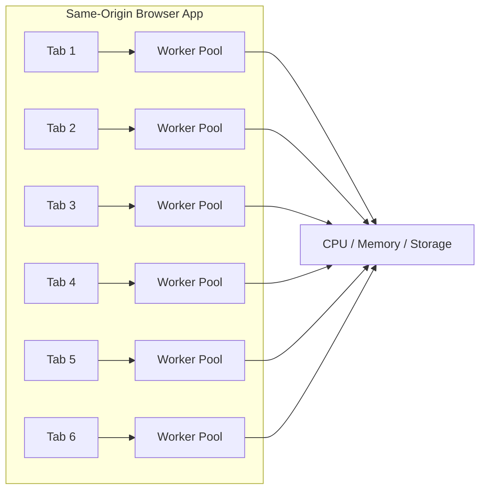
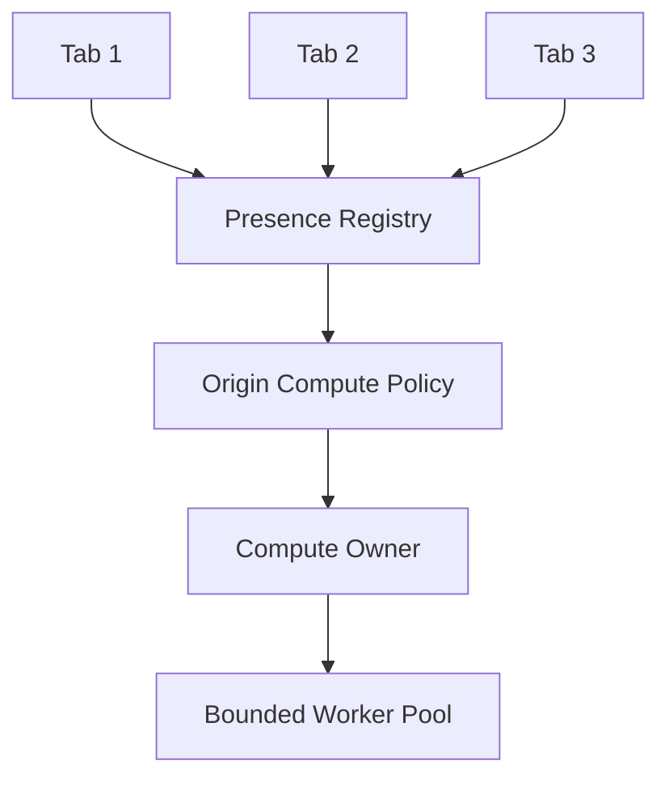
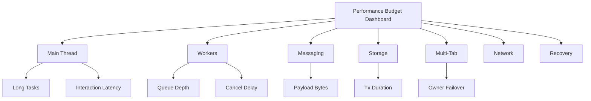
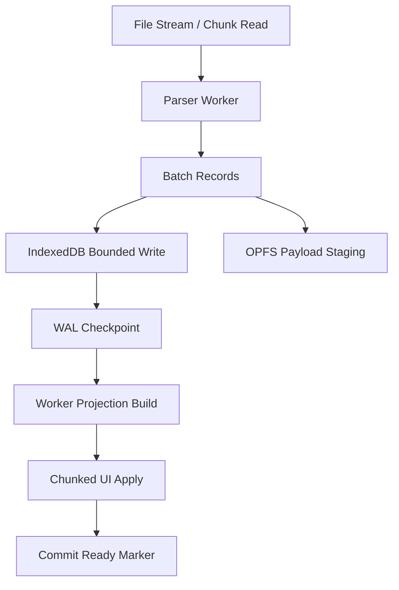
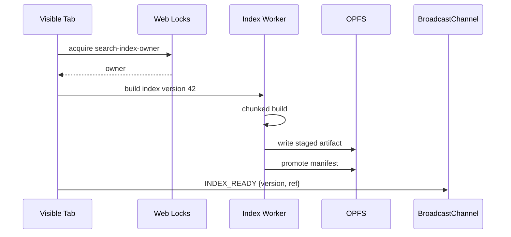

# Part 064 — Performance Budgeting for Multi-Context Apps

Performance optimization tanpa budget adalah opini.

Kita bisa bilang:

- “worker ini cepat”;
- “cache ini efisien”;
- “main thread sudah ringan”;
- “IndexedDB cukup aman”;
- “BroadcastChannel payload tidak besar”.

Tetapi tanpa angka, tidak ada engineering contract.

Part ini membahas **performance budgeting** untuk aplikasi browser modern yang punya banyak context:

- main thread;
- dedicated worker;
- shared worker;
- service worker;
- multiple tabs;
- IndexedDB;
- Cache API;
- OPFS;
- BroadcastChannel;
- Web Locks;
- WebAssembly;
- rendering pipeline;
- background sync;
- session/auth orchestration.

Targetnya bukan micro-benchmark. Targetnya adalah kemampuan menjawab:

> Apa batas aman sistem ini, bagaimana kita tahu saat melewati batas, dan apa mekanisme otomatis untuk mencegah kerusakan UX/correctness?

---

## 1. Performance Budget Is a System Boundary

Budget adalah batas eksplisit untuk resource.

Contoh:

| Resource | Budget Example |
|---|---|
| main-thread chunk | max 8 ms for user-visible batch |
| long task | zero known long tasks on key interaction path |
| worker queue depth | max 100 jobs or 32 MB queued payload |
| BroadcastChannel payload | max 16 KB per message for control plane |
| IndexedDB transaction | max 100 records or 20 ms per batch |
| OPFS write batch | max 4 MB per chunk before checkpoint |
| memory peak during import | max 2x source payload size |
| cache cleanup | max 50 entries per background cycle |
| auth refresh dedupe | one refresh owner per session generation |
| offline replay | max 20 attempts per sync event |

Budget bukan angka sakral. Budget adalah starting contract.

Rule:

> If a subsystem has no budget, it has no backpressure.

---

## 2. Why Multi-Context Apps Need Different Budgets

Traditional frontend performance sering fokus pada:

- bundle size;
- LCP;
- CLS;
- INP;
- TBT;
- long tasks;
- network waterfall.

Itu penting, tetapi belum cukup untuk multi-tab/worker orchestration.

Kita juga perlu budget untuk:

- total workers per tab;
- total workers per origin across tabs;
- per-tab background CPU;
- message fanout;
- cross-tab duplicate work;
- storage transaction contention;
- cache promotion latency;
- recovery time after tab crash;
- leader election failover time;
- stale result discard rate;
- bytes copied across `postMessage`;
- shared memory ring utilization;
- Service Worker event runtime;
- outbox replay batch size.

Satu tab cepat belum berarti origin sehat.

Jika user membuka 6 tab:



Masing-masing tab “masuk budget lokal”, tetapi secara origin/system bisa overload.

---

## 3. Budget Taxonomy

Gunakan beberapa jenis budget.

### 3.1 Latency Budget

Berapa lama user menunggu.

Examples:

- keypress to visual response < 100 ms;
- click to modal open < 100 ms;
- case summary visible < 500 ms;
- local search result first page < 200 ms;
- logout applied in all visible tabs < 300 ms.

### 3.2 Blocking Budget

Berapa lama main thread boleh tertahan.

Examples:

- no known synchronous reducer > 16 ms;
- no chunk > 8 ms during input-sensitive path;
- zero task > 50 ms on critical flow.

### 3.3 Throughput Budget

Berapa banyak work diproses per waktu.

Examples:

- replay 20 outbox commands per sync batch;
- index 5.000 records/sec on baseline laptop;
- parse 10 MB CSV within 3 sec with UI responsive.

### 3.4 Memory Budget

Berapa peak memory yang boleh dipakai.

Examples:

- import pipeline peak < 2x input bytes;
- worker queued transferables < 64 MB;
- no duplicate full dataset per tab;
- cache manifest < 1 MB.

### 3.5 Storage Budget

Berapa storage lokal boleh tumbuh.

Examples:

- event log max 50 MB before compaction warning;
- OPFS temp files expire within 24 hours;
- Cache API old versions max 2 versions;
- outbox max 10.000 entries or 100 MB payload references.

### 3.6 Concurrency Budget

Berapa execution context/work bersamaan.

Examples:

- max 1 heavy background owner per origin;
- max `min(4, hardwareConcurrency - 1)` CPU workers per active tab;
- max 1 auth refresh owner per session;
- max 2 visible worker jobs per tab;
- max 1 cache promotion at a time.

### 3.7 Messaging Budget

Berapa message dan payload.

Examples:

- control message < 16 KB;
- BroadcastChannel fanout < 20/sec under normal load;
- progress event max 4/sec;
- worker result uses transferable for payload > 256 KB;
- large payload by reference through IndexedDB/OPFS, not broadcast.

### 3.8 Recovery Budget

Berapa cepat sistem recover.

Examples:

- dead tab detected < 15 sec;
- leader failover < 5 sec for non-critical work;
- logout reconciliation on visibility restore < 100 ms;
- IndexedDB blocked upgrade prompt < 2 sec;
- orphan WAL recovery < 3 sec on startup.

---

## 4. Define a Baseline Device

Budget harus punya target device.

Jangan hanya pakai MacBook engineer.

Definisikan minimal test matrix:

| Tier | Example Target |
|---|---|
| low-end mobile | 4 CPU cores, constrained memory, thermal throttling |
| mid mobile | common Android/iOS device |
| low-end laptop | dual/quad core, limited RAM |
| enterprise laptop | managed browser, extensions, antivirus overhead |
| high-end dev machine | not primary budget target |

Budget ditentukan berdasarkan target user.

Untuk regulatory/case-management internal apps, sering ada realita:

- laptop corporate bukan high-end;
- browser extensions/security agent banyak;
- VPN/proxy memperlambat network;
- user membuka banyak tab;
- data case besar;
- session timeout ketat;
- long-lived workbench.

Maka budget harus konservatif.

---

## 5. Main Thread Budgets

Main thread adalah resource paling mahal karena user melihat dampaknya langsung.

Suggested starting budget:

| Path | Budget |
|---|---:|
| input handler sync work | < 4 ms |
| visible reducer batch | < 8 ms |
| non-critical visible chunk | < 12 ms |
| known long task | 0 on critical flow |
| full interaction INP target | product-dependent, monitor field data |
| progress render frequency | 4–10/sec |

Do:

- move CPU-heavy work to worker;
- chunk main-thread apply;
- batch framework state updates;
- virtualize large lists;
- avoid JSON parse/stringify on huge objects in interaction path;
- avoid deep clone in reducers;
- avoid synchronous storage in hot path.

Do not:

- run full projection rebuild in event handler;
- append 50.000 reactive rows at once;
- commit worker result without chunking;
- broadcast large payload then parse it in every tab.

---

## 6. Worker Budgets

Workers reduce main-thread pressure, but they are not free.

Costs:

- startup latency;
- memory per worker;
- code chunk download/cache;
- data clone/transfer;
- CPU contention;
- worker queue latency;
- control-plane responsiveness.

Suggested budget:

| Dimension | Budget |
|---|---:|
| worker startup handshake | < 500 ms typical |
| worker pool size | no more than useful CPU parallelism |
| queued jobs | bounded by count and bytes |
| running job chunk | 8–32 ms depending workload |
| progress messages | <= 4/sec per job |
| transfer threshold | use transfer/reference for large buffers |
| cancellation latency | < 100 ms for interactive jobs |

Worker pool sizing:

```ts
export function defaultWorkerPoolSize(): number {
  const cores = navigator.hardwareConcurrency || 4;
  return Math.max(1, Math.min(4, cores - 1));
}
```

Caveat:

- `hardwareConcurrency` is a hint;
- multiple tabs multiply pools;
- low-end devices may need smaller pools;
- hidden tabs should reduce/stop non-critical pools;
- shared origin-level ownership may be needed.

---

## 7. Origin-Level Worker Budget

Per-tab budget can lie.

If each tab starts 4 workers and user opens 5 tabs, that is 20 workers.

Use origin-level coordination:



Policy examples:

- visible focused tab can run visible jobs;
- only one tab owns background indexing;
- hidden tabs pause heavy CPU;
- stale leader expires by lease;
- urgent session/security jobs preempt background jobs.

This is where earlier parts connect:

- BroadcastChannel for advisory signal;
- Web Locks for ownership;
- IndexedDB for durable queue/lease fallback;
- heartbeat for presence;
- generation/fencing for stale owner prevention.

---

## 8. Messaging Budgets

Message passing has cost. Structured clone can clone object graphs. Transferables avoid copy for supported resource ownership transfer. Broadcast fanout multiplies cost by number of recipients.

Control plane budget:

| Message Type | Payload Budget |
|---|---:|
| heartbeat | < 1 KB |
| presence update | < 4 KB |
| invalidation signal | < 4 KB |
| progress update | < 2 KB |
| auth/session event | metadata only |
| worker command | small envelope + payload reference |

Data plane rule:

> Large data should move by transfer or reference, not broadcast object graph.

Bad:

```ts
channel.postMessage({
  type: 'SEARCH_INDEX_READY',
  index: hugeSearchIndexObject,
});
```

Better:

```ts
channel.postMessage({
  type: 'SEARCH_INDEX_READY',
  indexRef: {
    store: 'opfs',
    path: `/indexes/case-${caseId}.bin`,
    version,
    checksum,
  },
});
```

Measure:

- message count/sec;
- average payload size;
- p95 payload size;
- `messageerror` count;
- dropped/suppressed progress messages;
- clone-vs-transfer ratio;
- fanout recipient count.

---

## 9. Broadcast Fanout Budget

BroadcastChannel feels cheap until every tab receives every message.

If N tabs are open:

```txt
cost = sender serialization + N * receiver deserialization + N * handler cost
```

Therefore:

- broadcast metadata only;
- suppress high-frequency progress;
- include topic/subscription if using SharedWorker hub;
- prefer direct MessagePort for one-to-one large reply;
- batch invalidations;
- use durable store + signal pattern.

Example progress throttle:

```ts
class ProgressEmitter {
  private lastSentAt = 0;

  constructor(private readonly minIntervalMs = 250) {}

  emit(progress: Progress) {
    const now = performance.now();
    if (now - this.lastSentAt < this.minIntervalMs && !progress.done) {
      return;
    }

    this.lastSentAt = now;
    channel.postMessage({ type: 'PROGRESS', progress });
  }
}
```

---

## 10. Storage Transaction Budgets

Browser storage is shared per origin, but each API has different behavior.

IndexedDB budget:

| Operation | Suggested Budget |
|---|---:|
| read transaction | small, targeted index/range |
| write transaction | bounded records per batch |
| upgrade transaction | fast, no data migration if avoidable |
| compaction batch | pause/yield between batches |
| outbox claim | short readwrite tx |
| projection commit | atomic marker + bounded payload |

Do not perform huge migration inside `upgradeneeded` unless unavoidable. Prefer lazy migration or rebuild projection.

Cache API budget:

- versioned cache count limited;
- cleanup bounded;
- response clone cost understood;
- auth-sensitive responses not stored casually;
- cache promotion guarded by manifest.

OPFS budget:

- staged temp files cleaned;
- large write chunked;
- metadata stored separately;
- checksum/version marker;
- compaction bounded;
- quota failure handled.

---

## 11. Memory Budgets

Memory failure is often silent until browser kills tab.

Common memory blowups:

- full data cloned main → worker;
- worker clones result back;
- BroadcastChannel sends huge object to all tabs;
- JSON string exists plus parsed object plus normalized object;
- OPFS/IndexedDB read loads entire file/blob into memory;
- worker pool duplicates lookup tables per worker;
- Wasm memory grows and never shrinks;
- stale projections kept after navigation;
- abort does not release references.

Peak memory model:

```txt
peak ≈ source bytes
     + parsed representation
     + normalized representation
     + cloned/transfer staging
     + result representation
     + framework/reactive overhead
```

Budget example:

| Data Size | Max Peak Target |
|---:|---:|
| 10 MB import | < 40 MB |
| 100 MB import | streaming/chunked required |
| search index | no duplicate per tab if avoidable |
| Wasm memory | bounded initial/max pages |

Code policy:

```ts
const LARGE_PAYLOAD_BYTES = 256 * 1024;

function shouldTransfer(bytes: number): boolean {
  return bytes >= LARGE_PAYLOAD_BYTES;
}
```

Better than threshold alone: profile actual device.

---

## 12. Network and Cache Budgets

Multi-tab apps often create network storms:

- each tab refreshes token;
- each tab fetches same case;
- each tab revalidates cache;
- each tab opens WebSocket;
- reconnect storms after network restore;
- offline replay duplicated.

Budget:

| Resource | Budget |
|---|---:|
| token refresh | 1 in-flight per session generation |
| same GET case | 1 in-flight per canonical key if possible |
| WebSocket | 1 owner if product allows shared feed |
| cache revalidation | single-flight per resource |
| offline replay | 1 owner per queue/scope |
| reconnect backoff | jittered, bounded |

Use:

- Web Locks;
- SharedWorker hub;
- Service Worker cache coordinator;
- single-flight map;
- idempotency key;
- durable outbox;
- BroadcastChannel metadata event.

---

## 13. Service Worker Runtime Budgets

Service Worker is event-driven. It may be terminated when idle. Treat it as short-lived coordinator.

Budget examples:

| Event | Budget |
|---|---:|
| fetch handler synchronous logic | tiny |
| cache match/put | bounded by response size |
| sync event replay | max items/time |
| push handler | minimal logic |
| activate cleanup | bounded cache deletion |
| install pre-cache | limited critical assets |

Avoid:

- huge cache cleanup in activate;
- unbounded outbox flush in sync;
- long compute in Service Worker;
- assuming setTimeout-based scheduling;
- relying on SW as always-on daemon.

Use `event.waitUntil()` for event lifetime extension, but still keep work bounded.

---

## 14. Render Budgets

Worker optimization is wasted if rendering explodes.

Common trap:

- worker filters 100.000 rows quickly;
- main thread receives result;
- UI renders 100.000 DOM nodes;
- app janks.

Budget:

| Render Work | Budget |
|---|---:|
| visible row count | virtualized |
| DOM insertion batch | small |
| layout-affecting measurement | minimized |
| canvas frame work | frame budget aware |
| OffscreenCanvas message | frame-rate bounded |
| animation update | no heavy sync compute |

Use:

- virtualization;
- incremental rendering;
- skeleton/placeholder;
- derived result pagination;
- worker returns top-N first;
- progressive enhancement.

---

## 15. Budget as Backpressure Policy

Budget without enforcement is documentation.

Backpressure options:

| Over Budget | Action |
|---|---|
| worker queue too deep | reject, coalesce, supersede, or delay |
| message payload too large | store by reference |
| progress too frequent | throttle/drop |
| memory too high | pause background, compact, release caches |
| DB contention high | reduce batch size |
| multiple tabs active | elect owner |
| hidden tab | pause visible work |
| long tasks detected | lower chunk budget |
| network storm | single-flight/backoff |

Example admission controller:

```ts
type AdmissionDecision =
  | { kind: 'accept' }
  | { kind: 'reject'; reason: string }
  | { kind: 'supersede'; previousJobId: string }
  | { kind: 'defer'; retryAfterMs: number };

class WorkerAdmissionController {
  constructor(
    private readonly maxQueuedJobs: number,
    private readonly maxQueuedBytes: number,
  ) {}

  decide(queue: WorkerQueueSnapshot, job: WorkerJob): AdmissionDecision {
    if (queue.bytes + job.estimatedBytes > this.maxQueuedBytes) {
      if (job.supersedesKey) {
        const previous = queue.findBySupersedesKey(job.supersedesKey);
        if (previous) return { kind: 'supersede', previousJobId: previous.id };
      }

      return { kind: 'reject', reason: 'worker_queue_byte_budget_exceeded' };
    }

    if (queue.count >= this.maxQueuedJobs) {
      return { kind: 'defer', retryAfterMs: 500 };
    }

    return { kind: 'accept' };
  }
}
```

---

## 16. Budget Profiles

Budgets can depend on mode.

```ts
type PerformanceProfile = 'interactive' | 'background' | 'hidden' | 'battery-saver' | 'low-end';

type BudgetProfile = {
  mainChunkMs: number;
  workerChunkMs: number;
  maxWorkerCount: number;
  progressIntervalMs: number;
  maxQueuedBytes: number;
  replayBatchSize: number;
};

const profiles: Record<PerformanceProfile, BudgetProfile> = {
  interactive: {
    mainChunkMs: 6,
    workerChunkMs: 12,
    maxWorkerCount: 2,
    progressIntervalMs: 250,
    maxQueuedBytes: 16 * 1024 * 1024,
    replayBatchSize: 10,
  },
  background: {
    mainChunkMs: 12,
    workerChunkMs: 32,
    maxWorkerCount: 1,
    progressIntervalMs: 1000,
    maxQueuedBytes: 8 * 1024 * 1024,
    replayBatchSize: 20,
  },
  hidden: {
    mainChunkMs: 20,
    workerChunkMs: 50,
    maxWorkerCount: 1,
    progressIntervalMs: 5000,
    maxQueuedBytes: 4 * 1024 * 1024,
    replayBatchSize: 5,
  },
  'battery-saver': {
    mainChunkMs: 4,
    workerChunkMs: 8,
    maxWorkerCount: 1,
    progressIntervalMs: 1000,
    maxQueuedBytes: 4 * 1024 * 1024,
    replayBatchSize: 5,
  },
  'low-end': {
    mainChunkMs: 4,
    workerChunkMs: 8,
    maxWorkerCount: 1,
    progressIntervalMs: 500,
    maxQueuedBytes: 4 * 1024 * 1024,
    replayBatchSize: 5,
  },
};
```

Profile selection can use:

- device memory where available;
- hardware concurrency hint;
- visibility state;
- active input;
- product mode;
- field telemetry;
- user setting;
- enterprise policy.

Do not over-trust any single signal.

---

## 17. Budget Registry

Centralize budgets.

```ts
export type BudgetKey =
  | 'main.caseProjection.chunkMs'
  | 'worker.searchIndex.maxQueuedBytes'
  | 'broadcast.control.maxPayloadBytes'
  | 'indexedDb.write.maxRecordsPerTx'
  | 'outbox.replay.maxBatchSize'
  | 'serviceWorker.sync.maxRuntimeMs';

export class BudgetRegistry {
  private readonly values = new Map<BudgetKey, number>();

  constructor(profile: BudgetProfile) {
    this.values.set('main.caseProjection.chunkMs', profile.mainChunkMs);
    this.values.set('worker.searchIndex.maxQueuedBytes', profile.maxQueuedBytes);
    this.values.set('broadcast.control.maxPayloadBytes', 16 * 1024);
    this.values.set('indexedDb.write.maxRecordsPerTx', 100);
    this.values.set('outbox.replay.maxBatchSize', profile.replayBatchSize);
    this.values.set('serviceWorker.sync.maxRuntimeMs', 5000);
  }

  get(key: BudgetKey): number {
    const value = this.values.get(key);
    if (value == null) throw new Error(`Missing budget: ${key}`);
    return value;
  }
}
```

This makes budgets reviewable in code review.

---

## 18. Enforcing Message Payload Budget

```ts
type Envelope = {
  type: string;
  id: string;
  payload?: unknown;
};

function estimateJsonBytes(value: unknown): number {
  // Rough estimator. Avoid using this for huge payloads in hot path.
  return new Blob([JSON.stringify(value)]).size;
}

class BudgetedBroadcastChannel {
  constructor(
    private readonly channel: BroadcastChannel,
    private readonly maxPayloadBytes: number,
  ) {}

  post(envelope: Envelope) {
    const estimated = estimateJsonBytes(envelope);

    if (estimated > this.maxPayloadBytes) {
      throw new Error(
        `Broadcast payload too large: ${estimated} > ${this.maxPayloadBytes}`,
      );
    }

    this.channel.postMessage(envelope);
  }
}
```

Production note:

- estimating by JSON can be expensive;
- use declared `estimatedBytes` for known payload;
- enforce large payload by schema;
- test with representative payloads.

---

## 19. Enforcing Worker Queue Byte Budget

```ts
class BudgetedWorkerQueue {
  private queuedBytes = 0;
  private readonly queue: WorkerJob[] = [];

  constructor(private readonly maxQueuedBytes: number) {}

  enqueue(job: WorkerJob) {
    if (this.queuedBytes + job.estimatedBytes > this.maxQueuedBytes) {
      throw new Error('Worker queue byte budget exceeded');
    }

    this.queue.push(job);
    this.queuedBytes += job.estimatedBytes;
  }

  dequeue(): WorkerJob | undefined {
    const job = this.queue.shift();
    if (!job) return undefined;

    this.queuedBytes -= job.estimatedBytes;
    return job;
  }
}
```

Better:

- allow supersede;
- allow priority queue;
- reject background before user-visible;
- expose queue pressure telemetry.

---

## 20. Enforcing IndexedDB Batch Budget

```ts
async function putManyBudgeted<T>(
  storeName: string,
  records: T[],
  budget: { maxRecordsPerTx: number },
) {
  for (let i = 0; i < records.length; i += budget.maxRecordsPerTx) {
    const batch = records.slice(i, i + budget.maxRecordsPerTx);
    await putOneBatch(storeName, batch);
    await appScheduler.yield('background');
  }
}
```

Do not confuse this with atomic full workflow. If full workflow needs atomicity, use WAL:

- prepare marker;
- batch writes;
- commit marker;
- recovery cleanup if incomplete.

---

## 21. Observability Dimensions

Performance budget must be observable by dimension.

### 21.1 Main Thread

- long task count;
- long task duration p95/p99;
- interaction latency;
- scheduler task duration;
- reducer commit duration;
- render commit duration;
- result apply duration.

### 21.2 Worker

- startup time;
- queue depth;
- queued bytes;
- job duration;
- chunk duration;
- cancellation latency;
- crash count;
- restart count;
- poison task count;
- transfer bytes.

### 21.3 Messaging

- message count;
- payload bytes;
- fanout count;
- messageerror;
- dropped/throttled progress;
- request-response latency;
- timeout count;
- retry count.

### 21.4 Storage

- transaction duration;
- blocked upgrade count;
- quota errors;
- DB close events;
- object store size estimate;
- compaction runtime;
- WAL recovery runtime;
- outbox backlog.

### 21.5 Multi-Tab

- active tab count;
- leader changes;
- split-brain rejects;
- stale generation discards;
- duplicate work suppressed;
- dead-tab detection latency;
- ownership lock wait time.

---

## 22. Performance Marks and Measures

Use `performance.mark` and `performance.measure` for local timing.

```ts
export async function measureAsync<T>(
  name: string,
  fn: () => Promise<T>,
): Promise<T> {
  const start = `${name}:start:${crypto.randomUUID()}`;
  const end = `${name}:end:${crypto.randomUUID()}`;

  performance.mark(start);
  try {
    return await fn();
  } finally {
    performance.mark(end);
    performance.measure(name, start, end);
    performance.clearMarks(start);
    performance.clearMarks(end);
  }
}
```

Example:

```ts
await measureAsync('worker.searchIndex.build', () =>
  searchIndexWorker.build({ caseId, version }),
);
```

Consume measures:

```ts
const observer = new PerformanceObserver((list) => {
  for (const entry of list.getEntries()) {
    metrics.recordMeasure({
      name: entry.name,
      duration: entry.duration,
      startTime: entry.startTime,
    });
  }
});

observer.observe({ entryTypes: ['measure'] });
```

---

## 23. Field vs Lab Data

Lab data answers:

- can this pass on controlled device?
- does the algorithm meet baseline?
- which code path regressed?
- does CI detect obvious breakage?

Field data answers:

- what happens on real laptops?
- what happens with many tabs?
- what happens with enterprise extensions?
- what happens with slow disks/quota pressure?
- which data shapes hurt most?

Need both.

Never trust local dev machine alone.

---

## 24. Budget Tests in CI

CI performance tests are noisy, but still useful as guardrails.

Test categories:

1. deterministic algorithm benchmark;
2. browser smoke test for long tasks;
3. message payload budget test;
4. worker queue admission test;
5. IndexedDB batch budget test;
6. multi-tab duplicate work test;
7. Service Worker cache cleanup bound test.

Example message schema budget test:

```ts
it('presence heartbeat stays small', () => {
  const msg = makeHeartbeat({ tabId: 'tab-1', generation: 1 });
  const bytes = new Blob([JSON.stringify(msg)]).size;
  expect(bytes).toBeLessThan(1024);
});
```

Example worker queue test:

```ts
it('rejects jobs above byte budget', () => {
  const queue = new BudgetedWorkerQueue(1024);

  expect(() =>
    queue.enqueue({
      id: 'job-1',
      type: 'huge',
      estimatedBytes: 2048,
    } as WorkerJob),
  ).toThrow(/budget/i);
});
```

---

## 25. Multi-Tab Performance Test

Use browser automation to open multiple tabs.

Scenario:

1. open 5 tabs to same app;
2. login/session restore;
3. trigger data refresh in all tabs;
4. verify only one token refresh;
5. verify only one background index owner;
6. verify focused tab remains responsive;
7. close owner tab;
8. verify failover within budget;
9. restore hidden tab;
10. verify stale state rejected.

Metrics:

- network request count;
- Web Lock ownership logs;
- BroadcastChannel messages;
- worker count;
- long tasks;
- failover time;
- duplicate work count.

---

## 26. Performance Budget Dashboard

A useful dashboard groups by subsystem, not by random metric names.



Dashboards should show:

- p50/p95/p99;
- rate;
- threshold;
- release version;
- browser/device segment;
- tab count if available;
- data size bucket.

Data size bucket is critical. Averages hide big-case failures.

---

## 27. Budget Drift

Budget drift happens when each change is locally reasonable but total system gets slower.

Example:

- feature A adds 3 ms reducer work;
- feature B adds 5 ms validation;
- feature C adds 4 ms telemetry enrichment;
- feature D adds 10 KB to every BroadcastChannel message;
- feature E starts another worker.

No single change looks catastrophic. Together they break responsiveness.

Mitigation:

- budget registry;
- code review checklist;
- performance CI smoke tests;
- release dashboard;
- feature-level metrics labels;
- regression budget owner;
- architectural decision records for budget changes.

---

## 28. Budget Ownership

Every budget needs an owner.

| Budget | Owner |
|---|---|
| main thread critical path | UI platform/frontend architecture |
| worker pool policy | frontend platform |
| auth refresh single-flight | auth/session team |
| offline outbox replay | sync/data team |
| IndexedDB schema/migration | client data platform |
| Cache API lifecycle | PWA/platform team |
| observability schema | platform/infra |
| product latency SLO | product + engineering |

Without owner, budget violations become everyone’s problem and no one’s problem.

---

## 29. Budget Negotiation

Budget is not fixed forever. Product sometimes needs heavier work.

Good negotiation:

- define user value;
- define path criticality;
- measure current cost;
- consider worker placement;
- consider progressive loading;
- set fallback for low-end devices;
- set overload behavior;
- add telemetry;
- update budget registry and ADR.

Bad negotiation:

- “it works on my machine”;
- “only a few users have big data”;
- “we can optimize later”;
- “worker makes it fine”;
- “browser will handle it”.

---

## 30. Case Study: Large Case Import

Requirement:

- user imports 100 MB evidence export;
- app parses records;
- builds timeline;
- detects conflicts;
- stores payload locally;
- remains responsive;
- supports cancel;
- supports crash recovery.

Naive pipeline:


Problems:

- peak memory huge;
- main thread blocked;
- no cancellation;
- no recovery;
- DB transaction too long;
- UI render too large.

Budgeted pipeline:



Budgets:

| Stage | Budget |
|---|---:|
| file read chunk | 1–4 MB |
| parse worker chunk | 16–32 ms |
| progress event | <= 4/sec |
| IDB batch | 100–500 records |
| OPFS write chunk | 1–4 MB |
| main-thread apply | 4–8 ms chunk |
| cancellation latency | < 250 ms |
| recovery checkpoint | after each durable batch |
| peak memory | < 2–3x chunk/window, not full file |

---

## 31. Case Study: Token Refresh Storm

Budget:

- one refresh owner per session generation;
- followers wait max 5 sec;
- 401 retry max once per request;
- token metadata event only;
- no token broadcast;
- stale refresh result rejected.

Metrics:

- refresh attempts per generation;
- lock wait time;
- follower timeout;
- stale token discard;
- duplicate refresh prevented;
- logout-refresh race count.

Violation response:

- if duplicate refresh detected, invalidate local session generation;
- if follower timeout, force session revalidation;
- if refresh token rotation conflict, logout all tabs;
- if BroadcastChannel unavailable, use storage event/IDB marker fallback.

This is a performance and security budget.

---

## 32. Case Study: Search Index Rebuild

Budget:

- only one background index owner per origin;
- worker pool max 1 for background index;
- chunk 16 ms;
- progress 2/sec;
- index artifact stored in OPFS;
- BroadcastChannel sends artifact reference only;
- visible tab can request pause;
- stale index rejected by data version.

Pipeline:



Budget violation:

- if worker queue too deep: supersede older index job;
- if tab hidden: pause or reduce priority;
- if memory high: flush chunks to OPFS;
- if version changed: abort stale build.

---

## 33. Runtime Budget Contract

A production orchestration runtime should expose budget checks as first-class APIs.

```ts
export interface RuntimeBudgetContract {
  canBroadcast(bytes: number): boolean;
  canEnqueueWorkerJob(job: WorkerJob): AdmissionDecision;
  workerPoolSizeFor(mode: RuntimeMode): number;
  mainThreadChunkBudget(mode: RuntimeMode): number;
  indexedDbBatchSize(operation: string): number;
  outboxReplayBatchSize(mode: RuntimeMode): number;
}
```

This prevents budgets from becoming scattered magic numbers.

---

## 34. Graceful Degradation

When budget cannot be met, do not just fail mysteriously.

Degradation options:

| Problem | Degradation |
|---|---|
| low memory | disable precompute, stream data |
| no SharedArrayBuffer | use transferables/postMessage |
| no Scheduler API | fallback yield/post task wrapper |
| no SharedWorker | BroadcastChannel + Web Locks fallback |
| no Background Sync | foreground replay |
| quota low | compact, ask user/admin, reduce offline retention |
| many tabs | elect one background owner |
| slow device | lower worker count, smaller chunks |
| hidden page | pause UI work |

Good degradation is explicit.

---

## 35. Performance Budget Review Checklist

For every new feature touching workers/tabs/storage:

1. What is the main-thread budget?
2. What is the worker budget?
3. What is the message payload budget?
4. What is the storage transaction budget?
5. What is the memory peak estimate?
6. Does the feature duplicate work across tabs?
7. Does it need Web Lock ownership?
8. What happens in hidden tab?
9. What happens on crash/restart?
10. What happens on quota error?
11. What happens on unsupported API?
12. What telemetry proves it stays within budget?
13. What backpressure fires when it exceeds budget?
14. What is the product-visible degradation behavior?

---

## 36. Common Budget Smells

| Smell | Meaning |
|---|---|
| “payload is just an object” | no data movement budget |
| “worker will handle it” | no worker/memory budget |
| “we broadcast update” | fanout not considered |
| “migration runs on startup” | startup/blocked budget missing |
| “cleanup in activate” | Service Worker lifetime ignored |
| “retry until success” | no retry budget |
| “all tabs need it” | duplicate work risk |
| “background task” with no owner | cross-tab CPU storm |
| “JSON.stringify for estimate” in hot path | measurement itself may hurt |
| “works in Chrome desktop” | compatibility/device budget missing |

---

## 37. Final Mental Model for Phase 7

Phase 7 covered advanced performance primitives:

- SharedArrayBuffer and Atomics;
- cross-origin isolation;
- lock-free/wait-free thinking;
- ring buffers;
- OffscreenCanvas;
- WebAssembly in workers;
- Scheduler API;
- performance budgeting.

The deeper lesson:

> Advanced browser performance is not about using the strongest primitive everywhere. It is about matching primitive, budget, ownership, lifecycle, and failure model.

A top-tier engineer does not ask only:

- “Can this run faster?”

They ask:

- “Where should it run?”
- “How much may it consume?”
- “Who owns it across tabs?”
- “How is it canceled?”
- “How is it measured?”
- “How does it degrade?”
- “How does it recover?”

---

## 38. Summary

Key points:

- Performance budget is an engineering contract, not a slide.
- Multi-context apps need budgets beyond classic frontend metrics.
- Budget dimensions include latency, blocking, throughput, memory, storage, concurrency, messaging, and recovery.
- Per-tab optimization can still overload the origin.
- Messaging and BroadcastChannel need payload/fanout budgets.
- Worker queues need count and byte budgets.
- Storage writes need transaction and recovery budgets.
- Service Worker work must be bounded by lifecycle reality.
- Budgets must have enforcement and telemetry.
- Budget drift is real; guardrails must live in code and CI.
- Degradation must be explicit when budgets cannot be met.

Mental model:

> You do not truly own browser-side performance until every expensive subsystem has a budget, a backpressure policy, and a measurement loop.

---

## References

- MDN Web Docs — PerformanceLongTaskTiming: https://developer.mozilla.org/en-US/docs/Web/API/PerformanceLongTaskTiming
- web.dev — Optimize long tasks: https://web.dev/articles/optimize-long-tasks
- MDN Web Docs — Prioritized Task Scheduling API: https://developer.mozilla.org/en-US/docs/Web/API/Prioritized_Task_Scheduling_API
- MDN Web Docs — Web Workers API: https://developer.mozilla.org/en-US/docs/Web/API/Web_Workers_API
- MDN Web Docs — Broadcast Channel API: https://developer.mozilla.org/en-US/docs/Web/API/Broadcast_Channel_API
- MDN Web Docs — Web Locks API: https://developer.mozilla.org/en-US/docs/Web/API/Web_Locks_API
- MDN Web Docs — IndexedDB API: https://developer.mozilla.org/en-US/docs/Web/API/IndexedDB_API
- MDN Web Docs — CacheStorage: https://developer.mozilla.org/en-US/docs/Web/API/CacheStorage
- MDN Web Docs — Origin private file system: https://developer.mozilla.org/en-US/docs/Web/API/File_System_API/Origin_private_file_system
- MDN Web Docs — Service Worker API: https://developer.mozilla.org/en-US/docs/Web/API/Service_Worker_API
