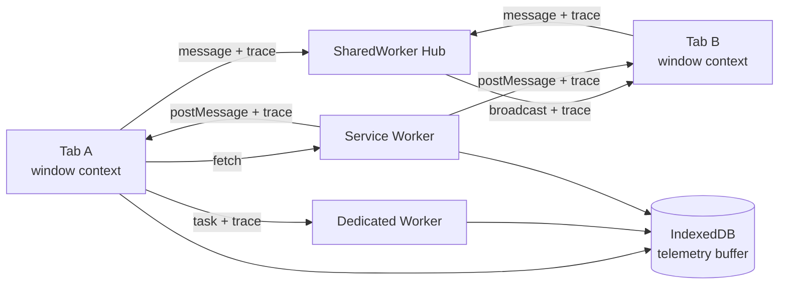
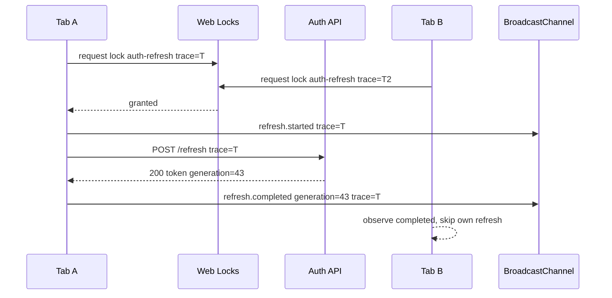

# Part 065 — Observability for Workers and Tabs

Multi-tab orchestration tanpa observability akan terlihat benar sampai production membuktikan sebaliknya.

Masalahnya bukan hanya “ada bug”. Masalahnya adalah bug terjadi di runtime yang terpecah:

- tab A visible;
- tab B hidden;
- tab C restored dari bfcache;
- dedicated worker crash;
- shared worker masih memegang port lama;
- service worker sedang update;
- IndexedDB migration blocked;
- BroadcastChannel message terlambat;
- Web Lock owner sudah stale;
- offline queue sedang replay;
- user klik logout dari tab lain.

Kalau semua context hanya menulis `console.log()`, kita tidak punya sistem. Kita punya noise.

Part ini membahas bagaimana mendesain observability untuk browser-side distributed runtime: **identity, trace, logs, metrics, lifecycle events, queue telemetry, error boundaries, and production dashboards**.

Targetnya bukan membuat frontend menjadi “backend kecil”. Targetnya adalah membuat browser orchestration bisa dijawab dengan data:

> Tab mana yang menjadi owner? Worker mana yang mengerjakan task? Message mana yang hilang? Lock mana yang tertahan? Cache version mana yang aktif? Kenapa user melihat state lama?

---

## 1. Core Mental Model

Observability untuk worker dan multi-tab bukan sekadar logging.

Kita butuh tiga lapis:

| Layer | Pertanyaan |
|---|---|
| **Event log** | Apa yang terjadi? |
| **Metric** | Seberapa sering/lama/besar? |
| **Trace** | Ini bagian dari workflow mana? |

Contoh:

```ts
console.log("refresh started");
```

Itu tidak cukup.

Yang kita butuhkan:

```ts
telemetry.emit({
  type: "auth.refresh.started",
  traceId,
  spanId,
  sessionGeneration,
  tabId,
  workerId,
  lockName: "auth-refresh:tenant-42",
  attempt: 1,
  timestamp: Date.now(),
});
```

Kenapa?

Karena refresh storm tidak bisa dianalisis dari satu log line. Kita perlu tahu:

- berapa tab yang mencoba refresh;
- siapa yang berhasil pegang lock;
- siapa yang fallback sebagai follower;
- berapa lama follower menunggu;
- apakah response dari leader stale;
- apakah session generation berubah di tengah proses.

Rule:

> Browser observability is distributed-system observability inside a hostile lifecycle.

---

## 2. Observability Invariants

Sebelum implementasi, tetapkan invariant.

### Invariant 1 — Every Context Has Identity

Setiap context harus punya identity.

| Identity | Scope | Example |
|---|---|---|
| `tabId` | tab lifetime / page lifetime | `tab_01J...` |
| `connectionId` | connection to hub/channel | `conn_01J...` |
| `workerId` | worker instance | `worker_01J...` |
| `swVersion` | service worker build/runtime version | `sw-2026.07.08.1` |
| `appVersion` | frontend build version | `web-2026.07.08.1` |
| `sessionGeneration` | auth/session epoch | `42` |
| `tenantId` | logical tenant boundary | `tenant-abc` |

Tanpa identity, log lintas tab tidak bisa digabungkan.

### Invariant 2 — Every Workflow Has Trace ID

Workflow lintas context harus punya `traceId`.

Contoh workflow:

- auth refresh;
- logout;
- offline replay;
- cache promotion;
- worker task;
- import file;
- leader election;
- notification suppression;
- IndexedDB migration.

`traceId` harus ikut dalam setiap message envelope.

### Invariant 3 — Every Async Boundary Creates a Span

Async boundary:

- main thread → worker;
- tab → SharedWorker;
- page → service worker;
- service worker → client;
- tab → IndexedDB;
- tab → Web Locks;
- worker → OPFS;
- worker → WASM;
- BroadcastChannel fanout.

Setiap boundary minimal punya:

- `spanId`;
- `parentSpanId`;
- `traceId`;
- start time;
- end time;
- outcome.

### Invariant 4 — Logs Are Structured

Jangan bergantung pada string parsing.

Gunakan event schema.

```ts
type TelemetryEvent = {
  type: string;
  level: "debug" | "info" | "warn" | "error";
  traceId?: string;
  spanId?: string;
  parentSpanId?: string;
  timestamp: number;
  monotonicTime?: number;
  context: RuntimeContext;
  attributes?: Record<string, string | number | boolean | null>;
};
```

### Invariant 5 — Telemetry Must Not Leak Secrets

Jangan log:

- access token;
- refresh token;
- authorization header;
- cookie value;
- full PII payload;
- document content sensitif;
- raw file import;
- complete server response jika mengandung data user.

Telemetry adalah production artifact. Anggap bisa masuk storage, vendor analytics, log pipeline, dan support tooling.

---

## 3. Runtime Context Model

Buat context descriptor sekali, lalu inject ke semua telemetry.

```ts
type RuntimeKind =
  | "window"
  | "dedicated-worker"
  | "shared-worker"
  | "service-worker";

type RuntimeContext = {
  kind: RuntimeKind;
  appVersion: string;
  buildHash: string;
  tabId?: string;
  connectionId?: string;
  workerId?: string;
  serviceWorkerVersion?: string;
  sessionGeneration?: number;
  tenantId?: string;
  visibilityState?: DocumentVisibilityState;
  urlPath?: string;
};
```

Window context bisa punya visibility. Worker tidak.

Service Worker bisa punya script version. Tab tidak langsung tahu tanpa handshake.

SharedWorker bisa tahu daftar connection, tapi tidak tahu penuh state DOM client.

Diagram:



---

## 4. Trace Envelope

Message envelope dari part sebelumnya perlu telemetry fields.

```ts
type MessageEnvelope<TPayload> = {
  protocol: "browser-orchestrator";
  version: 1;

  kind: string;
  id: string;
  correlationId?: string;

  traceId: string;
  spanId: string;
  parentSpanId?: string;

  source: RuntimeContext;
  target?: {
    kind?: RuntimeKind;
    tabId?: string;
    workerId?: string;
    connectionId?: string;
  };

  createdAt: number;
  deadlineAt?: number;
  sessionGeneration?: number;
  fencingToken?: number;

  payload: TPayload;
};
```

Trace bukan tambahan kosmetik. Trace adalah alat untuk menjawab failure.

Contoh auth refresh:



Jika user melapor “muncul logout tiba-tiba”, kita ingin bisa cari:

- semua event dengan `sessionGeneration=42/43`;
- siapa yang memulai refresh;
- apakah ada `refresh.failed`;
- apakah ada `logout.applied` dari tab lain;
- apakah ada stale response dari generation lama.

---

## 5. Event Taxonomy

Jangan biarkan setiap developer menciptakan nama event sendiri.

Gunakan taxonomy stabil.

| Domain | Example Event |
|---|---|
| lifecycle | `tab.visible`, `tab.hidden`, `tab.restored`, `worker.started`, `worker.terminated` |
| messaging | `message.sent`, `message.received`, `message.dropped`, `message.decode_failed` |
| worker | `worker.task.enqueued`, `worker.task.started`, `worker.task.completed`, `worker.task.failed` |
| queue | `queue.rejected`, `queue.backpressure.applied`, `queue.drained` |
| locks | `lock.requested`, `lock.granted`, `lock.timeout`, `lock.released` |
| leader | `leader.elected`, `leader.stepped_down`, `leader.stale_rejected` |
| storage | `idb.tx.started`, `idb.tx.completed`, `idb.blocked`, `quota.exceeded` |
| cache | `cache.hit`, `cache.miss`, `cache.promoted`, `cache.cleaned` |
| service worker | `sw.installing`, `sw.activated`, `sw.controllerchange`, `sw.broadcast.sent` |
| auth | `auth.refresh.started`, `auth.refresh.completed`, `logout.applied` |
| offline | `outbox.enqueued`, `outbox.claimed`, `outbox.replayed`, `outbox.conflict` |
| error | `runtime.error`, `runtime.unhandled_rejection`, `messageerror` |

Naming rule:

> `domain.entity.action`.

Do not encode values into names.

Bad:

```txt
worker_task_failed_due_to_timeout_for_csv_import
```

Good:

```txt
worker.task.failed
attributes.reason = "timeout"
attributes.taskType = "csv.import"
```

---

## 6. Metrics You Actually Need

### Worker Metrics

| Metric | Why It Matters |
|---|---|
| queue depth | overload signal |
| queued bytes | memory pressure signal |
| in-flight tasks | concurrency visibility |
| task duration | slow task detection |
| task age | stuck queue detection |
| cancellation count | user navigation / supersede signal |
| timeout count | mis-sized workload / dead worker |
| crash count | runtime stability |
| restart count | recovery noise |
| poison task count | deterministic bad input |
| transfer bytes | data-plane pressure |

### Multi-Tab Metrics

| Metric | Why It Matters |
|---|---|
| active tab count | fanout pressure |
| visible tab count | UX routing |
| leader age | stale leader detection |
| leadership changes | instability signal |
| heartbeat delay | lifecycle/timer throttling signal |
| stale message rejection | fencing correctness signal |
| duplicate message count | protocol noise |
| broadcast fanout size | message bus pressure |

### Storage Metrics

| Metric | Why It Matters |
|---|---|
| IndexedDB transaction duration | slow local DB path |
| blocked upgrade count | old tab/version skew |
| object store size estimate | compaction pressure |
| quota error count | storage reliability |
| WAL pending count | incomplete workflow |
| outbox pending count | offline debt |
| cache version count | cleanup failure |
| OPFS staged file count | abandoned payloads |

### Service Worker Metrics

| Metric | Why It Matters |
|---|---|
| install/activate duration | update health |
| waiting worker age | stuck update |
| controllerchange count | rollout behavior |
| fetch handler duration | network proxy overhead |
| cache hit/miss | strategy validation |
| broadcast recipients | client visibility |
| background sync attempts | replay health |
| notification click routing failures | UX correctness |

---

## 7. User Timing API for Local Traces

For fine-grained local measurement, use User Timing:

```ts
performance.mark("csv-import:start", {
  detail: { traceId, taskId },
});

// work

performance.mark("csv-import:end", {
  detail: { traceId, taskId },
});

performance.measure("csv-import", {
  start: "csv-import:start",
  end: "csv-import:end",
  detail: { traceId, taskId },
});
```

`performance.mark()` is available in Web Workers, so you can instrument worker-side phases too.

But do not assume every performance entry type is available in every browser/context.

Use feature detection.

```ts
function observePerformanceEntries() {
  if (!("PerformanceObserver" in globalThis)) return;

  const supported = PerformanceObserver.supportedEntryTypes ?? [];

  if (supported.includes("measure")) {
    const observer = new PerformanceObserver((list) => {
      for (const entry of list.getEntries()) {
        telemetry.emit({
          type: "perf.measure",
          level: "debug",
          timestamp: Date.now(),
          monotonicTime: performance.now(),
          context: runtimeContext,
          attributes: {
            name: entry.name,
            durationMs: entry.duration,
          },
        });
      }
    });

    observer.observe({ entryTypes: ["measure"] });
  }
}
```

Important rule:

> Performance API gives signals. Your telemetry model gives meaning.

A `measure` named `worker-task` is useless if it has no task type, trace ID, payload size, queue age, and outcome.

---

## 8. Long Task and Responsiveness Signals

Long task telemetry is especially useful on main thread.

A long task means the UI thread was occupied long enough to threaten responsiveness. Treat it as a symptom, not a root cause.

```ts
function observeLongTasks() {
  if (!("PerformanceObserver" in globalThis)) return;
  if (!PerformanceObserver.supportedEntryTypes?.includes("longtask")) return;

  const observer = new PerformanceObserver((list) => {
    for (const entry of list.getEntries()) {
      telemetry.emit({
        type: "main.long_task.detected",
        level: "warn",
        timestamp: Date.now(),
        monotonicTime: performance.now(),
        context: runtimeContext,
        attributes: {
          name: entry.name,
          durationMs: entry.duration,
          startTimeMs: entry.startTime,
        },
      });
    }
  });

  observer.observe({ entryTypes: ["longtask"] });
}
```

But do not stop at “long task occurred”.

Correlate with:

- worker message response burst;
- large structured clone;
- JSON parse on main thread;
- render batch;
- IndexedDB result hydration;
- BroadcastChannel fanout;
- Service Worker cache promotion notification;
- heavy reconciliation after tab restore.

---

## 9. Queue Telemetry

Worker queue telemetry should be emitted at state transitions.

```ts
type QueueSnapshot = {
  queueName: string;
  depth: number;
  queuedBytes: number;
  inFlight: number;
  oldestAgeMs: number;
};

function emitQueueSnapshot(snapshot: QueueSnapshot) {
  telemetry.emit({
    type: "worker.queue.snapshot",
    level: snapshot.depth > 100 ? "warn" : "debug",
    timestamp: Date.now(),
    monotonicTime: performance.now(),
    context: runtimeContext,
    attributes: snapshot,
  });
}
```

Queue telemetry harus punya threshold.

| Condition | Event |
|---|---|
| queue accepted | `worker.task.enqueued` |
| queue full | `worker.task.rejected` |
| task started | `worker.task.started` |
| task finished | `worker.task.completed` |
| task failed | `worker.task.failed` |
| task timed out | `worker.task.timeout` |
| task cancelled | `worker.task.cancelled` |
| queue over threshold | `worker.queue.overloaded` |
| queue returns normal | `worker.queue.recovered` |

Avoid emitting full snapshot on every single message if throughput is high. Use aggregation.

```ts
class RollingCounter {
  private count = 0;
  private lastFlush = performance.now();

  inc() {
    this.count++;
  }

  flushIfDue(name: string, everyMs: number) {
    const now = performance.now();
    if (now - this.lastFlush < everyMs) return;

    telemetry.emit({
      type: "counter.flush",
      level: "debug",
      timestamp: Date.now(),
      monotonicTime: now,
      context: runtimeContext,
      attributes: { name, count: this.count, windowMs: now - this.lastFlush },
    });

    this.count = 0;
    this.lastFlush = now;
  }
}
```

---

## 10. Messaging Telemetry

Every transport should produce minimal counters.

For `postMessage`:

- sent count;
- received count;
- payload byte estimate;
- transfer count;
- decode failure;
- stale rejection;
- timeout;
- retry;
- duplicate rejection.

For `BroadcastChannel`:

- channel open count;
- channel close count;
- messages sent;
- messages received;
- messages ignored by scope;
- messages rejected by generation/fencing;
- fanout estimate;
- messageerror count.

For `MessagePort`:

- port created;
- port started;
- port closed;
- heartbeat missed;
- request timed out;
- port orphaned.

Example transport wrapper:

```ts
function safePostMessage<T>(
  target: Worker | MessagePort | BroadcastChannel,
  envelope: MessageEnvelope<T>,
  transfer?: Transferable[],
) {
  const start = performance.now();

  try {
    target.postMessage(envelope, transfer ?? []);

    telemetry.emit({
      type: "message.sent",
      level: "debug",
      traceId: envelope.traceId,
      spanId: envelope.spanId,
      timestamp: Date.now(),
      monotonicTime: performance.now(),
      context: runtimeContext,
      attributes: {
        kind: envelope.kind,
        durationMs: performance.now() - start,
        transferCount: transfer?.length ?? 0,
      },
    });
  } catch (error) {
    telemetry.emit({
      type: "message.send_failed",
      level: "error",
      traceId: envelope.traceId,
      spanId: envelope.spanId,
      timestamp: Date.now(),
      monotonicTime: performance.now(),
      context: runtimeContext,
      attributes: {
        kind: envelope.kind,
        errorName: error instanceof Error ? error.name : "UnknownError",
      },
    });

    throw error;
  }
}
```

---

## 11. Error Boundaries Per Context

### Window Error Boundary

```ts
window.addEventListener("error", (event) => {
  telemetry.emit({
    type: "runtime.error",
    level: "error",
    timestamp: Date.now(),
    monotonicTime: performance.now(),
    context: runtimeContext,
    attributes: {
      message: event.message,
      filename: event.filename,
      lineno: event.lineno,
      colno: event.colno,
      errorName: event.error?.name ?? null,
    },
  });
});

window.addEventListener("unhandledrejection", (event) => {
  telemetry.emit({
    type: "runtime.unhandled_rejection",
    level: "error",
    timestamp: Date.now(),
    monotonicTime: performance.now(),
    context: runtimeContext,
    attributes: {
      reason: normalizeErrorReason(event.reason),
    },
  });
});
```

### Dedicated Worker Error Boundary

Main thread side:

```ts
worker.addEventListener("error", (event) => {
  telemetry.emit({
    type: "worker.error",
    level: "error",
    timestamp: Date.now(),
    monotonicTime: performance.now(),
    context: runtimeContext,
    attributes: {
      workerId,
      message: event.message,
      filename: event.filename,
      lineno: event.lineno,
      colno: event.colno,
    },
  });
});

worker.addEventListener("messageerror", () => {
  telemetry.emit({
    type: "worker.messageerror",
    level: "error",
    timestamp: Date.now(),
    monotonicTime: performance.now(),
    context: runtimeContext,
    attributes: { workerId },
  });
});
```

Worker side:

```ts
self.addEventListener("error", (event) => {
  // Send compact error event to owner if possible.
});

self.addEventListener("unhandledrejection", (event) => {
  // Normalize and report.
});
```

Do not rely on one side only. A worker can fail before it has initialized its own telemetry.

### Service Worker Error Boundary

Service Worker telemetry has special constraints:

- lifetime is event-driven;
- telemetry flush may be cut short;
- `event.waitUntil()` is required for async work associated with install/activate/fetch/push/sync;
- never block critical fetch path just to send telemetry.

Pattern:

```ts
self.addEventListener("fetch", (event) => {
  const start = performance.now();

  event.respondWith(handleFetch(event.request));

  event.waitUntil(
    flushFetchMetricEventually({
      urlKind: classifyUrl(event.request.url),
      durationMs: performance.now() - start,
    }),
  );
});
```

---

## 12. Storage Observability

IndexedDB, Cache API, and OPFS should be observed as infrastructure.

### IndexedDB Events

Track:

- open duration;
- upgrade duration;
- blocked upgrades;
- versionchange close;
- transaction duration;
- transaction abort reason;
- object store operation count;
- quota errors.

```ts
function instrumentTx<T>(
  name: string,
  run: () => Promise<T>,
): Promise<T> {
  const start = performance.now();

  telemetry.emit({
    type: "idb.tx.started",
    level: "debug",
    timestamp: Date.now(),
    monotonicTime: start,
    context: runtimeContext,
    attributes: { name },
  });

  return run()
    .then((result) => {
      telemetry.emit({
        type: "idb.tx.completed",
        level: "debug",
        timestamp: Date.now(),
        monotonicTime: performance.now(),
        context: runtimeContext,
        attributes: { name, durationMs: performance.now() - start },
      });
      return result;
    })
    .catch((error) => {
      telemetry.emit({
        type: "idb.tx.failed",
        level: "error",
        timestamp: Date.now(),
        monotonicTime: performance.now(),
        context: runtimeContext,
        attributes: {
          name,
          durationMs: performance.now() - start,
          errorName: error instanceof Error ? error.name : "UnknownError",
        },
      });
      throw error;
    });
}
```

### Cache API Events

Track:

- cache version;
- strategy;
- hit/miss;
- network fallback;
- stale response served;
- promotion;
- cleanup count;
- failure during `put` or `delete`.

### OPFS Events

Track:

- staged file count;
- write batch duration;
- bytes written;
- abandoned temp files;
- compaction duration;
- quota failure.

---

## 13. Web Locks Observability

Locks need explicit telemetry because lock starvation is hard to see.

```ts
async function withObservedLock<T>(
  name: string,
  options: LockOptions,
  run: (lock: Lock) => Promise<T>,
): Promise<T> {
  const requestedAt = performance.now();

  telemetry.emit({
    type: "lock.requested",
    level: "debug",
    timestamp: Date.now(),
    monotonicTime: requestedAt,
    context: runtimeContext,
    attributes: { name, mode: options.mode ?? "exclusive" },
  });

  return navigator.locks.request(name, options, async (lock) => {
    const grantedAt = performance.now();

    telemetry.emit({
      type: "lock.granted",
      level: "debug",
      timestamp: Date.now(),
      monotonicTime: grantedAt,
      context: runtimeContext,
      attributes: {
        name,
        waitMs: grantedAt - requestedAt,
        mode: lock.mode,
      },
    });

    try {
      return await run(lock);
    } finally {
      telemetry.emit({
        type: "lock.released",
        level: "debug",
        timestamp: Date.now(),
        monotonicTime: performance.now(),
        context: runtimeContext,
        attributes: {
          name,
          heldMs: performance.now() - grantedAt,
        },
      });
    }
  });
}
```

Lock telemetry should answer:

- who requested the lock;
- how long they waited;
- how long the lock was held;
- whether lock request was aborted;
- whether fallback lease was used;
- whether stale owner produced side effect after release.

---

## 14. Telemetry Buffering

Do not send network telemetry event by event.

Use local buffer.

```ts
type TelemetryBatch = {
  batchId: string;
  createdAt: number;
  events: TelemetryEvent[];
};
```

Flush policy:

| Trigger | Action |
|---|---|
| batch size reached | flush |
| time interval reached | flush |
| page hidden | best-effort flush |
| fatal error | small emergency flush |
| offline | persist locally |
| quota pressure | drop debug events first |

Browser lifecycle matters.

When page becomes hidden, do not start huge async telemetry upload. Emit compact summary and rely on `sendBeacon` or queued telemetry if appropriate.

Rule:

> Telemetry must never make the user-visible path worse than the bug it is trying to diagnose.

---

## 15. Privacy and Redaction

Observability has security impact.

Create redaction at source, not just in backend pipeline.

```ts
function redactAttributes(
  attributes: Record<string, unknown>,
): Record<string, unknown> {
  const blocked = new Set([
    "accessToken",
    "refreshToken",
    "authorization",
    "cookie",
    "password",
    "secret",
  ]);

  const result: Record<string, unknown> = {};

  for (const [key, value] of Object.entries(attributes)) {
    if (blocked.has(key.toLowerCase())) {
      result[key] = "[REDACTED]";
      continue;
    }

    result[key] = value;
  }

  return result;
}
```

Also avoid high-cardinality values unless needed.

| Risk | Safer Alternative |
|---|---|
| full URL with query params | route pattern or URL kind |
| user email | hashed stable user ID if allowed |
| document title | document type and size bucket |
| raw error with payload | error code + sanitized message |
| file name | extension + size bucket |
| tenant name | tenant ID if policy allows |

---

## 16. Debug Rings

A useful production pattern is an in-memory debug ring buffer.

```ts
class DebugRing<T> {
  private items: T[] = [];
  private cursor = 0;

  constructor(private readonly capacity: number) {}

  push(item: T) {
    if (this.items.length < this.capacity) {
      this.items.push(item);
      return;
    }

    this.items[this.cursor] = item;
    this.cursor = (this.cursor + 1) % this.capacity;
  }

  snapshot(): T[] {
    return [
      ...this.items.slice(this.cursor),
      ...this.items.slice(0, this.cursor),
    ];
  }
}
```

Keep last N:

- message envelopes;
- worker task transitions;
- lock transitions;
- lifecycle transitions;
- cache promotions;
- IDB transaction failures.

Then expose only in development/support mode.

```ts
if (import.meta.env.DEV) {
  Object.assign(globalThis, {
    __orchestratorDebug: {
      dump: () => debugRing.snapshot(),
    },
  });
}
```

Do not expose sensitive production internals by default.

---

## 17. Production Debug Snapshot

When a severe orchestration error occurs, emit a compact snapshot.

```ts
type OrchestratorSnapshot = {
  timestamp: number;
  context: RuntimeContext;
  tabs?: {
    totalKnown: number;
    visibleKnown: number;
    leaderTabId?: string;
    leaderFencingToken?: number;
  };
  worker?: {
    workerId: string;
    state: string;
    queueDepth: number;
    inFlight: number;
    restartCount: number;
  };
  serviceWorker?: {
    controllerState?: string;
    swVersion?: string;
  };
  storage?: {
    idbOpen: boolean;
    outboxPending: number;
    walPending: number;
  };
};
```

Snapshot rule:

> Snapshot state, not payload.

Useful snapshot:

```json
{
  "leaderTabId": "tab_abc",
  "leaderFencingToken": 104,
  "outboxPending": 19,
  "workerQueueDepth": 300
}
```

Dangerous snapshot:

```json
{
  "lastImportedRows": ["full user data here"]
}
```

---

## 18. Dashboards and Alerts

A production dashboard for this series should include at least:

### Runtime Health

- active tab count distribution;
- visible tab count distribution;
- worker crash rate;
- service worker waiting age;
- controllerchange rate;
- unexpected IDB close count.

### Responsiveness

- long task count on key routes;
- worker queue age;
- message latency;
- BroadcastChannel fanout latency;
- main-thread decode/parse duration.

### Correctness

- stale message rejection count;
- stale leader side-effect rejection;
- duplicate command rejection;
- idempotency replay hits;
- conflict count;
- session generation mismatch.

### Reliability

- outbox replay success/failure;
- retry count;
- poison task count;
- lock timeout/abort count;
- cache promotion failure;
- schema migration blocked count.

### Security

- logout propagation latency;
- protected request blocked after revocation;
- token refresh storm prevented;
- unauthorized cache access prevented;
- session cleanup failure count.

---

## 19. SLO Examples

SLO untuk browser orchestration harus spesifik.

| Area | Example SLO |
|---|---|
| logout propagation | 99% of open tabs apply logout within 1 second after receiving signal |
| auth refresh dedupe | no more than one refresh owner per session generation per tenant |
| worker responsiveness | 99% of interactive worker tasks complete or cancel within 2 seconds |
| queue overload | worker queue depth above threshold for less than 5 seconds |
| cache promotion | no mixed manifest/cache version after promotion completes |
| offline replay | 99% of replayable commands eventually reach terminal state |
| stale side effect | zero accepted side effects from stale fencing token |
| migration | zero permanent blocked upgrade without user-visible recovery path |

SLO should map to invariants.

Do not define vanity SLOs.

Bad:

> Average worker task duration below 100 ms.

Better:

> User-visible worker task queue age p95 below 500 ms during active interaction.

Average hides overload.

---

## 20. Minimal Telemetry Runtime

Here is a compact telemetry runtime suitable as a foundation.

```ts
type TelemetryLevel = "debug" | "info" | "warn" | "error";

type TelemetryEvent = {
  type: string;
  level: TelemetryLevel;
  timestamp: number;
  monotonicTime: number;
  context: RuntimeContext;
  traceId?: string;
  spanId?: string;
  parentSpanId?: string;
  attributes?: Record<string, unknown>;
};

class TelemetryClient {
  private buffer: TelemetryEvent[] = [];
  private readonly maxBuffer = 500;

  constructor(
    private readonly context: RuntimeContext,
    private readonly sink: (events: TelemetryEvent[]) => Promise<void>,
  ) {}

  emit(event: Omit<TelemetryEvent, "context" | "timestamp" | "monotonicTime">) {
    const normalized: TelemetryEvent = {
      ...event,
      timestamp: Date.now(),
      monotonicTime: performance.now(),
      context: this.context,
      attributes: redactAttributes(event.attributes ?? {}),
    };

    this.buffer.push(normalized);

    if (this.buffer.length > this.maxBuffer) {
      this.dropDebugEvents();
    }
  }

  async flush() {
    if (this.buffer.length === 0) return;

    const batch = this.buffer.splice(0, this.buffer.length);

    try {
      await this.sink(batch);
    } catch {
      // Keep telemetry best-effort. Do not crash application.
      const retryable = batch.filter((event) => event.level !== "debug");
      this.buffer.unshift(...retryable.slice(-this.maxBuffer));
    }
  }

  private dropDebugEvents() {
    this.buffer = this.buffer
      .filter((event) => event.level !== "debug")
      .slice(-this.maxBuffer);
  }
}
```

Production improvement:

- batch by route/session/workflow;
- offline persistence;
- adaptive sampling;
- rate limit by event type;
- separate critical event sink;
- send compact summary on fatal crash;
- support local debug export.

---

## 21. Observability Anti-Patterns

### Anti-Pattern 1 — Logging Only on Failure

If you only log failure, you cannot reconstruct the path.

You need start/completion/cancel/timeout transitions.

### Anti-Pattern 2 — No Correlation ID

Without correlation ID, multi-context workflows are almost impossible to debug.

### Anti-Pattern 3 — Logging Full Payload

This creates privacy and security exposure.

Log shape, size, version, hash, not sensitive content.

### Anti-Pattern 4 — Worker Logs Only in Worker Console

Worker console output is not enough for production.

Emit structured events to owner or local sink.

### Anti-Pattern 5 — No Sampling Strategy

High-frequency message systems can generate huge telemetry.

Sample debug events, keep all critical events.

### Anti-Pattern 6 — Metrics Without Dimensions

A metric named `worker_task_duration` is weak.

You need dimensions:

- task type;
- worker generation;
- app version;
- browser family;
- route;
- visibility state;
- queue depth bucket;
- payload size bucket.

### Anti-Pattern 7 — Telemetry That Changes Scheduling

Telemetry must not create lock contention, long tasks, storage pressure, or network storms.

---

## 22. Checklist

Before calling your orchestration runtime production-ready, answer:

- Does every context have stable identity?
- Does every cross-context workflow carry `traceId`?
- Are message send/receive/drop/error counted?
- Are worker queue depth and in-flight tasks observable?
- Are worker crash/restart/poison task events observable?
- Are Web Lock wait and hold durations observable?
- Are IndexedDB blocked/versionchange/close events observable?
- Are Service Worker install/activate/controllerchange events observable?
- Is logout propagation measurable?
- Is auth refresh dedupe measurable?
- Are stale fencing rejections visible?
- Are lifecycle transitions visible?
- Is telemetry redacted at source?
- Is telemetry best-effort and bounded?
- Can support export a compact debug snapshot?
- Can you reproduce a reported workflow from trace data?

---

## 23. Final Mental Model

Observability is not a plugin you add later.

For multi-tab orchestration, observability is part of the protocol.

The runtime should treat these as first-class fields:

- identity;
- trace;
- generation;
- fencing;
- lifecycle;
- queue state;
- ownership;
- outcome.

Without those fields, you may still build a working demo.

But you will not build an operational system.

Next, we move from observing the system to **debugging worker systems**: how to reproduce, isolate, inspect, and fix failures across workers, service workers, tabs, channels, and storage.

---

## References

- MDN — PerformanceObserver: https://developer.mozilla.org/en-US/docs/Web/API/PerformanceObserver
- MDN — Performance API performance data: https://developer.mozilla.org/en-US/docs/Web/API/Performance_API/Performance_data
- MDN — Performance.mark(): https://developer.mozilla.org/en-US/docs/Web/API/Performance/mark
- MDN — PerformanceLongTaskTiming: https://developer.mozilla.org/en-US/docs/Web/API/PerformanceLongTaskTiming
- MDN — Worker error event: https://developer.mozilla.org/en-US/docs/Web/API/Worker/error_event
- MDN — Worker.postMessage(): https://developer.mozilla.org/en-US/docs/Web/API/Worker/postMessage
- MDN — Window error event: https://developer.mozilla.org/en-US/docs/Web/API/Window/error_event
