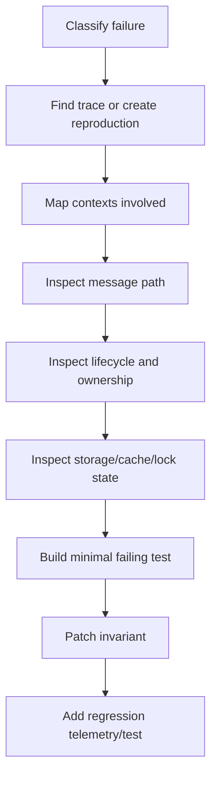
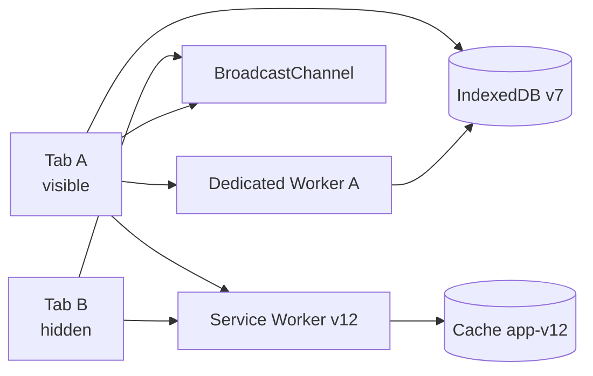

# Part 066 — Debugging Worker Systems

Debugging worker systems is hard because the bug rarely lives in one file.

It lives between:

- caller and worker;
- message and response;
- visible tab and hidden tab;
- old service worker and new service worker;
- cache version and app version;
- worker generation and stale callback;
- IndexedDB migration and old open connection;
- lock owner and follower;
- retry and duplicate side effect.

A beginner asks:

> Why did this worker fail?

A production engineer asks:

> Which context owned the workflow, which generation emitted the effect, which message boundary changed ordering, and which lifecycle transition invalidated our assumption?

Part ini adalah debugging playbook untuk worker dan multi-tab orchestration.

---

## 1. Debugging Model

Jangan mulai dari DevTools.

Mulai dari model.

Every worker bug belongs to one or more classes:

| Class | Symptom |
|---|---|
| lifecycle bug | task lost after tab hidden/closed/reloaded |
| protocol bug | wrong message type, version, or missing correlation ID |
| ordering bug | stale response overwrites newer state |
| ownership bug | two tabs perform the same side effect |
| data movement bug | `DataCloneError`, detached buffer, slow clone |
| scheduling bug | queue stuck, starvation, long task, priority inversion |
| storage bug | blocked migration, aborted transaction, stale projection |
| service worker bug | old controller, waiting worker, wrong cache version |
| security bug | token leaked, stale session accepted, logout incomplete |
| build bug | worker URL, MIME, CSP, source map, chunk path |

Debugging rule:

> Classify before you inspect.

If you do not classify, you will chase logs randomly.

---

## 2. Reproduction First

A bug that cannot be reproduced must be converted into a traceable scenario.

Minimum reproduction record:

```ts
type ReproductionRecord = {
  appVersion: string;
  browser: string;
  route: string;
  visibilitySequence: string[];
  tabCount: number;
  workerKind: "dedicated" | "shared" | "service";
  storageState: {
    idbVersion: number;
    cacheVersion?: string;
    outboxPending?: number;
  };
  sessionGeneration?: number;
  steps: string[];
  expected: string;
  actual: string;
  traceId?: string;
};
```

Bad report:

> Import sometimes hangs.

Good report:

```txt
App: web-2026.07.08.1
Browser: Chrome stable
Route: /cases/import
Tabs: 3 same tenant
Steps:
1. Open tab A and start 200 MB CSV import.
2. Open tab B same route.
3. Hide tab A.
4. Wait until tab B becomes visible.
5. Cancel import from tab B.
Actual: worker in tab A keeps processing and emits completed event.
Expected: cancel should fence generation and prevent stale completed event.
Trace: tr_01J...
```

---

## 3. Debugging Loop

Use a strict loop.



The goal is not to “fix the line”.

The goal is to patch the invariant that allowed the bug.

---

## 4. Context Map Before Logs

Before looking at logs, draw context topology.



Ask:

- Which tab initiated the workflow?
- Which worker owned execution?
- Which service worker controlled the page?
- Which channel carried the signal?
- Which storage transaction committed state?
- Which generation/fencing token was current?
- Which context was hidden/frozen/restored?

Only then inspect logs.

---

## 5. Make Logs Debuggable

Logs must be grep-able by:

- `traceId`;
- `tabId`;
- `workerId`;
- `connectionId`;
- `sessionGeneration`;
- `fencingToken`;
- `taskId`;
- `messageId`;
- `cacheVersion`;
- `swVersion`.

Recommended console format in development:

```ts
function devLog(event: TelemetryEvent) {
  const prefix = [
    event.level.toUpperCase(),
    event.type,
    `trace=${event.traceId ?? "-"}`,
    `tab=${event.context.tabId ?? "-"}`,
    `worker=${event.context.workerId ?? "-"}`,
  ].join(" ");

  console.log(prefix, event.attributes ?? {});
}
```

Example output:

```txt
INFO worker.task.started trace=tr_01J tab=tab_A worker=worker_7 { taskId: "task_9", type: "csv.import" }
WARN worker.task.stale_result_rejected trace=tr_01J tab=tab_B worker=worker_7 { resultGeneration: 12, currentGeneration: 13 }
```

Readable. Searchable. Correlatable.

---

## 6. Source Maps and Worker Build Debugging

Production worker debugging often fails because source maps are wrong.

Checklist:

- worker generated as separate chunk;
- source map emitted for worker chunk;
- source map URL correct under CDN/base path;
- source map access allowed in environment where debugging happens;
- minifier preserves useful function names if needed;
- module worker loaded with correct `type: "module"`;
- MIME type for worker script is valid JavaScript;
- CSP `worker-src` allows worker script origin;
- worker URL resolved relative to built module, not dev server assumption.

Worker creation should be explicit:

```ts
const worker = new Worker(
  new URL("./import.worker.ts", import.meta.url),
  { type: "module", name: "import-worker" },
);
```

Debug symptom matrix:

| Symptom | Likely Cause |
|---|---|
| worker works in dev, fails after build | URL/base path/chunk emission |
| worker script loads as HTML | SPA fallback misconfigured |
| worker fails with MIME error | server returns wrong content type |
| worker blocked by CSP | missing `worker-src` |
| stack trace points to minified blob | missing source map |
| SharedWorker creates multiple hubs | URL/name/version mismatch |
| worker import fails only on CDN | cross-origin/CORS/CORP/header mismatch |

---

## 7. Dedicated Worker Debugging

Dedicated worker bugs are usually easier because one owner owns one worker.

Inspect:

- creation site;
- startup handshake;
- message envelope;
- task queue;
- in-flight map;
- worker generation;
- error event;
- messageerror event;
- termination path.

Development debug adapter:

```ts
class DebugWorkerClient {
  constructor(private readonly worker: Worker) {
    worker.addEventListener("message", (event) => {
      console.debug("[worker<-main] message", event.data);
    });

    worker.addEventListener("messageerror", (event) => {
      console.error("[worker<-main] messageerror", event);
    });

    worker.addEventListener("error", (event) => {
      console.error("[worker] error", {
        message: event.message,
        filename: event.filename,
        lineno: event.lineno,
        colno: event.colno,
      });
    });
  }

  post(message: unknown, transfer?: Transferable[]) {
    console.debug("[main->worker] message", message, {
      transferCount: transfer?.length ?? 0,
    });

    this.worker.postMessage(message, transfer ?? []);
  }
}
```

Be careful with logging payloads. For large binary data, log:

- byte length;
- type;
- hash if needed;
- transfer count;
- ownership state.

Do not log full payload.

---

## 8. Message Replay Debugging

A powerful pattern: record message envelopes and replay them into a worker harness.

```ts
type RecordedMessage = {
  direction: "to-worker" | "from-worker";
  at: number;
  envelope: unknown;
  transferMeta?: Array<{ type: string; byteLength?: number }>;
};
```

Replay harness:

```ts
async function replayWorkerMessages(messages: RecordedMessage[]) {
  const worker = new Worker(new URL("./worker.ts", import.meta.url), {
    type: "module",
  });

  const received: unknown[] = [];

  worker.onmessage = (event) => {
    received.push(event.data);
  };

  for (const msg of messages) {
    if (msg.direction !== "to-worker") continue;
    worker.postMessage(msg.envelope);
    await tick();
  }

  return received;
}

function tick() {
  return new Promise((resolve) => setTimeout(resolve, 0));
}
```

Limitations:

- transferables cannot always be replayed from metadata;
- timing bugs need controlled scheduler;
- storage/network effects must be mocked;
- service worker behavior is harder to replay directly.

Still, replay is invaluable for protocol bugs.

---

## 9. Debugging `messageerror` and `DataCloneError`

Symptoms:

- `postMessage` throws;
- receiver gets `messageerror`;
- worker never receives message;
- sender buffer becomes detached unexpectedly;
- class instance loses prototype;
- function/symbol/DOM node cannot be cloned.

Checklist:

- Are you sending functions?
- Are you sending class instances and expecting methods to survive?
- Are you sending DOM nodes?
- Are you transferring the same buffer twice?
- Are you using a detached buffer after transfer?
- Are you sending `Error` object and expecting all custom fields?
- Are you broadcasting large payload to many tabs?

Safer debug helper:

```ts
function describePayload(value: unknown): unknown {
  if (value instanceof ArrayBuffer) {
    return { type: "ArrayBuffer", byteLength: value.byteLength };
  }

  if (ArrayBuffer.isView(value)) {
    return {
      type: value.constructor.name,
      byteLength: value.byteLength,
      length: value.length,
    };
  }

  if (Array.isArray(value)) {
    return { type: "Array", length: value.length };
  }

  if (value && typeof value === "object") {
    return {
      type: value.constructor?.name ?? "Object",
      keys: Object.keys(value as Record<string, unknown>).slice(0, 20),
    };
  }

  return { type: typeof value };
}
```

---

## 10. SharedWorker Debugging

SharedWorker bugs are topology bugs.

You need to inspect:

- how many clients connected;
- whether `port.start()` was called when needed;
- whether client sent `HELLO`;
- whether duplicate `tabId` exists;
- whether stale connection remained in registry;
- whether heartbeat sweep works;
- whether subscriptions were restored after reconnect;
- whether build URL/name created separate hub instances.

Hub debug endpoint:

```ts
type HubDebugSnapshot = {
  hubId: string;
  startedAt: number;
  connectionCount: number;
  clients: Array<{
    tabId: string;
    connectionId: string;
    role: string;
    lastSeenAt: number;
    subscriptions: string[];
  }>;
  counters: {
    messagesReceived: number;
    messagesSent: number;
    staleRejected: number;
    heartbeatMissed: number;
  };
};
```

Debug request:

```ts
port.postMessage({
  protocol: "hub-debug",
  kind: "debug.snapshot.request",
  id: crypto.randomUUID(),
});
```

Response:

```ts
port.postMessage({
  protocol: "hub-debug",
  kind: "debug.snapshot.response",
  id: crypto.randomUUID(),
  payload: snapshot,
});
```

Never enable unrestricted debug snapshots in production.

---

## 11. Service Worker Debugging

Service Worker debugging is often confusing because of lifecycle.

Critical questions:

- Is there a registered service worker?
- Is it installing, waiting, activating, or active?
- Does the current page have `navigator.serviceWorker.controller`?
- Did `controllerchange` fire?
- Is the page controlled by old or new worker?
- Is `skipWaiting()` being used?
- Is `clients.claim()` being used?
- Which cache names exist?
- Which cache version does the active worker expect?
- Are fetch events actually intercepted?
- Is navigation served from cache or network?

Service Worker debug message:

```ts
navigator.serviceWorker.controller?.postMessage({
  protocol: "sw-debug",
  kind: "debug.snapshot.request",
  id: crypto.randomUUID(),
});
```

Service Worker side:

```ts
self.addEventListener("message", (event) => {
  const msg = event.data;

  if (msg?.protocol !== "sw-debug") return;
  if (msg.kind !== "debug.snapshot.request") return;

  event.waitUntil((async () => {
    const clientsList = await clients.matchAll({
      type: "window",
      includeUncontrolled: true,
    });

    event.source?.postMessage({
      protocol: "sw-debug",
      kind: "debug.snapshot.response",
      id: crypto.randomUUID(),
      correlationId: msg.id,
      payload: {
        swVersion: self.__SW_VERSION__,
        clientCount: clientsList.length,
        cachePrefix: "app-cache",
      },
    });
  })());
});
```

DevTools Application panel can inspect service worker registrations, update service workers, emulate some events, and inspect storage/cache state in Chromium-based browsers.

But production debugging should not require DevTools. Build message-based snapshots too.

---

## 12. Debugging Cache Version Bugs

Symptoms:

- user gets old JS after deploy;
- app shell and API schema mismatch;
- route loads but worker chunk 404s;
- service worker serves old asset;
- cache cleanup deleted active asset;
- some tabs run old code while others run new code.

Checklist:

- app build version in HTML;
- service worker version;
- cache manifest version;
- asset URL hash;
- current controller version;
- waiting worker version;
- active cache names;
- in-flight cache promotion WAL;
- CDN cache headers;
- Service Worker update strategy.

Debug snapshot:

```ts
type CacheDebugSnapshot = {
  appVersion: string;
  serviceWorkerVersion?: string;
  controllerVersion?: string;
  cacheNames: string[];
  activeManifestVersion?: string;
  waitingManifestVersion?: string;
  promotionState?: "none" | "preparing" | "committed" | "aborted";
};
```

Runbook:

1. Confirm page controller version.
2. Confirm cache names.
3. Confirm manifest pointer.
4. Confirm requested asset URL.
5. Confirm network response headers.
6. Confirm whether Service Worker intercepted request.
7. Confirm if old tab blocked activation.

---

## 13. Debugging IndexedDB Migration Bugs

Symptoms:

- upgrade stuck;
- app asks reload forever;
- old tab blocks migration;
- transaction aborts during upgrade;
- object store missing;
- projection version mismatch;
- outbox replay fails after deploy.

Checklist:

- current DB version;
- requested DB version;
- `blocked` event observed;
- old connections receiving `versionchange`;
- whether old tabs close DB connection;
- whether migration is idempotent;
- whether rollback path exists;
- whether app version gate prevents new code from using old schema;
- whether lazy record migration handles old shape.

Connection instrumentation:

```ts
function attachDbDebug(db: IDBDatabase) {
  db.onversionchange = () => {
    telemetry.emit({
      type: "idb.versionchange.received",
      level: "warn",
      timestamp: Date.now(),
      monotonicTime: performance.now(),
      context: runtimeContext,
      attributes: { dbName: db.name, version: db.version },
    });

    db.close();
  };

  db.onclose = () => {
    telemetry.emit({
      type: "idb.connection.closed",
      level: "warn",
      timestamp: Date.now(),
      monotonicTime: performance.now(),
      context: runtimeContext,
      attributes: { dbName: db.name },
    });
  };
}
```

Migration debugging rule:

> Never debug IndexedDB migration using one tab only.

Test at least:

- old tab open;
- new tab opens;
- old tab hidden;
- old tab receives `versionchange`;
- old tab ignores it;
- new tab handles `blocked`;
- user chooses reload;
- migration resumes.

---

## 14. Debugging Web Locks

Symptoms:

- no leader elected;
- leader never steps down;
- followers wait forever;
- duplicate owner observed;
- lock request aborted unexpectedly;
- fallback lease conflicts with Web Lock owner.

Checklist:

- lock name exactly matches across contexts;
- mode is correct;
- request callback is still running;
- lock callback awaits long-running promise intentionally;
- abort signal fired;
- `ifAvailable` returned `null`;
- lock owner has visibility/lifecycle issue;
- stale side effect rejected by fencing token;
- fallback path is not active at the same time incorrectly.

Debug wrapper from Part 065 should log wait and hold time.

Extra dev inspection:

```ts
async function debugLocks() {
  if (!("locks" in navigator)) return null;
  return await navigator.locks.query();
}
```

Use this for development/support diagnostics, not core correctness.

Core correctness must come from protocol invariants:

- single owner;
- fencing token;
- step-down;
- stale effect rejection;
- timeout/abort;
- recovery.

---

## 15. Debugging Race Conditions

Race bugs have signatures.

| Signature | Likely Bug |
|---|---|
| older response overwrites newer state | missing generation guard |
| duplicate network mutation | missing idempotency key/lock |
| UI flickers after tab restore | stale projection accepted |
| logout followed by login reverts to logged-out | session generation race |
| cache reverts to old version | stale promotion event |
| worker completes after cancel | missing cancellation/fencing |
| leader changes rapidly | TTL/heartbeat too aggressive |

Race debugging tactic:

1. Add artificial delay at boundary.
2. Force order reversal.
3. Assert stale path rejects.

Example:

```ts
async function debugDelay(label: string, ms: number) {
  if (!debugFlags.delays[label]) return;
  await new Promise((resolve) => setTimeout(resolve, ms));
}
```

Use it:

```ts
await debugDelay("before-auth-refresh-commit", 2_000);
```

Then reproduce:

- start refresh;
- logout from another tab;
- let refresh complete;
- assert refresh result rejected because session generation changed.

---

## 16. Debugging Lifecycle Bugs

Lifecycle bugs happen when code assumes continuous execution.

Symptoms:

- heartbeat missed after tab hidden;
- hidden tab remains leader;
- queue resumes with stale state after restore;
- `BYE` not emitted on close;
- old tab keeps IDB connection open;
- UI shows stale session after back/forward navigation.

Debug sequence:

```txt
visible -> hidden -> freeze/suspend -> restore -> visible
```

Log:

- `visibilitychange`;
- `pagehide`;
- `pageshow`;
- `freeze` if available;
- `resume` if available;
- heartbeat last seen;
- leader state;
- session generation;
- DB connection state.

On restore, assert:

- reload current session marker;
- revalidate leader ownership;
- reopen DB if needed;
- resubscribe to hub/channel;
- discard stale in-flight responses;
- refresh projection from durable state.

---

## 17. Debugging Memory and Data Movement

Symptoms:

- import crashes tab;
- worker slow despite CPU not saturated;
- GC pauses;
- message send slow;
- memory peak huge;
- buffer detached unexpectedly.

Checklist:

- structured clone vs transfer;
- object graph shape;
- full array copies;
- JSON stringify/parse;
- BroadcastChannel large payload fanout;
- keeping original + cloned + transformed data simultaneously;
- worker pool multiplying memory;
- snapshot debug storing huge payload;
- source maps/dev logs retaining objects.

Debug payload budget:

```ts
function estimateBytes(value: unknown): number {
  if (value instanceof ArrayBuffer) return value.byteLength;
  if (ArrayBuffer.isView(value)) return value.byteLength;

  // Approximation only. Do not use for precise accounting.
  try {
    return new Blob([JSON.stringify(value)]).size;
  } catch {
    return -1;
  }
}
```

Use size buckets, not exact values, in metrics:

```ts
function sizeBucket(bytes: number): string {
  if (bytes < 0) return "unknown";
  if (bytes < 1024) return "<1KB";
  if (bytes < 1024 * 1024) return "<1MB";
  if (bytes < 16 * 1024 * 1024) return "<16MB";
  return ">=16MB";
}
```

---

## 18. Debugging Service Worker Fetch Path

For every surprising response, answer:

- Did request reach network?
- Did Service Worker intercept?
- Which strategy applied?
- Which cache key was used?
- Was response cloned before cache put?
- Was stale response served?
- Did navigation preload apply?
- Was auth header involved?
- Was request same-origin or cross-origin?

Fetch debug event:

```ts
type FetchDebugEvent = {
  requestId: string;
  method: string;
  urlKind: string;
  mode: RequestMode;
  destination: RequestDestination;
  strategy: "network-first" | "cache-first" | "stale-while-revalidate" | "network-only";
  cacheName?: string;
  cacheOutcome?: "hit" | "miss" | "put" | "bypass";
  responseStatus?: number;
  durationMs: number;
};
```

Avoid logging raw URLs with secrets/query params.

Classify URL:

```ts
function classifyUrl(url: string): string {
  const parsed = new URL(url);

  if (parsed.pathname.startsWith("/api/")) return "api";
  if (parsed.pathname.startsWith("/assets/")) return "asset";
  if (parsed.pathname.endsWith(".js")) return "script";
  if (parsed.pathname.endsWith(".css")) return "style";
  return "other";
}
```

---

## 19. Debug Build vs Runtime Separately

Many worker bugs are build bugs disguised as runtime bugs.

Separate diagnosis:

### Build/Load Failure

Worker never starts.

Inspect:

- network request for worker script;
- status code;
- MIME type;
- CSP violation;
- module import failure;
- chunk URL;
- source map.

### Startup Failure

Worker script loads but does not become ready.

Inspect:

- top-level imports;
- startup exception;
- READY handshake missing;
- capability negotiation failure;
- runtime validation failure.

### Runtime Failure

Worker starts, then fails during task.

Inspect:

- task envelope;
- queue state;
- task error boundary;
- timeout;
- cancellation;
- storage/network dependency.

### Shutdown Failure

Worker should stop but continues.

Inspect:

- pending tasks;
- abort controller;
- `terminate()` path;
- stale result guard;
- ownership generation.

---

## 20. Minimal Debug Harness

Build a local page that can exercise worker orchestration without app complexity.

Features:

- create/terminate worker;
- send known task;
- send large payload clone;
- send large payload transfer;
- cancel task;
- crash worker intentionally;
- delay response;
- reorder response;
- simulate hidden/visible;
- open second tab;
- test BroadcastChannel;
- test Web Lock ownership;
- inspect IndexedDB state;
- inspect Cache API state;
- register/unregister Service Worker.

This harness becomes your browser-side lab.

Example control protocol:

```ts
type DebugCommand =
  | { kind: "worker.start" }
  | { kind: "worker.terminate" }
  | { kind: "worker.crash" }
  | { kind: "task.cpu"; durationMs: number }
  | { kind: "task.memory"; bytes: number; transfer: boolean }
  | { kind: "broadcast.ping" }
  | { kind: "lock.acquire"; name: string; holdMs: number }
  | { kind: "idb.snapshot" }
  | { kind: "cache.snapshot" }
  | { kind: "sw.snapshot" };
```

A debug harness prevents you from using production app flows as your only test bench.

---

## 21. Runbook Templates

### Runbook — Worker Task Hung

1. Search by `taskId` or `traceId`.
2. Confirm task enqueued.
3. Confirm task started.
4. Confirm worker generation.
5. Confirm queue depth.
6. Confirm cancellation/deadline.
7. Confirm worker heartbeat.
8. Confirm worker error/unhandled rejection.
9. Confirm storage/network dependency.
10. Force terminate and verify stale result guard.
11. Add regression test.

### Runbook — Duplicate Network Mutation

1. Search by idempotency key.
2. Count owner attempts.
3. Inspect Web Lock acquisition.
4. Inspect fallback lease.
5. Inspect retry state.
6. Inspect server dedupe result.
7. Confirm stale attempts rejected.
8. Patch ownership or idempotency invariant.

### Runbook — Logout Not Propagated

1. Search `logout.applied` events.
2. Compare session generation across tabs.
3. Inspect BroadcastChannel receipt.
4. Inspect durable revocation marker.
5. Inspect hidden/restored tab behavior.
6. Inspect worker/service worker cleanup.
7. Inspect protected fetch fencing.
8. Add restore-path test.

### Runbook — Service Worker Serving Old App

1. Inspect controller version.
2. Inspect active/waiting worker.
3. Inspect cache names.
4. Inspect asset URL hash.
5. Inspect cache manifest pointer.
6. Inspect CDN response.
7. Inspect `skipWaiting`/`clients.claim` policy.
8. Inspect old tabs blocking activation.
9. Add update lifecycle test.

---

## 22. What Good Debugging Feels Like

A good debugging session produces a sentence like:

> The stale CSV import completion came from `worker_7`, generation `12`, after tab B had already cancelled generation `13`; the reducer accepted it because `task.completed` did not carry `sessionGeneration` and `taskGeneration`.

That is actionable.

A bad debugging session produces:

> Worker weirdly sent old data.

That is not actionable.

The difference is not intelligence. It is instrumentation and protocol discipline.

---

## 23. Checklist

Before shipping a worker orchestration system, verify:

- Can you identify every live worker instance?
- Can you inspect current worker queue depth?
- Can you correlate request/response by ID?
- Can you replay message protocol in a harness?
- Can you force worker crash and observe recovery?
- Can you force stale response and verify rejection?
- Can you inspect SharedWorker connected clients?
- Can you inspect Service Worker active/waiting/controller version?
- Can you inspect cache version and manifest pointer?
- Can you reproduce IndexedDB blocked migration?
- Can you simulate two tabs racing for a lock?
- Can you simulate tab hidden/restored during task?
- Can you debug production issue without raw user payload?
- Can you map a bug to an invariant violation?

---

## 24. Final Mental Model

Debugging worker systems is not about knowing one DevTools panel.

It is about preserving causality across boundaries:

- context boundary;
- message boundary;
- lifecycle boundary;
- storage boundary;
- network boundary;
- version boundary;
- ownership boundary.

If causality is lost, debugging becomes guessing.

If causality is preserved, even complex multi-tab bugs become normal engineering work.

Next, we move into **testing multi-tab behavior**: how to encode these failure modes into automated tests instead of relying on manual debugging after production incidents.

---

## References

- MDN — Worker error event: https://developer.mozilla.org/en-US/docs/Web/API/Worker/error_event
- MDN — Worker.postMessage(): https://developer.mozilla.org/en-US/docs/Web/API/Worker/postMessage
- MDN — PerformanceObserver: https://developer.mozilla.org/en-US/docs/Web/API/PerformanceObserver
- Chrome DevTools — Application panel overview: https://developer.chrome.com/docs/devtools/application
- Chrome DevTools — Debug background services: https://developer.chrome.com/docs/devtools/javascript/background-services
- MDN — Service Worker API: https://developer.mozilla.org/en-US/docs/Web/API/Service_Worker_API
- MDN — Web Locks API: https://developer.mozilla.org/en-US/docs/Web/API/Web_Locks_API
