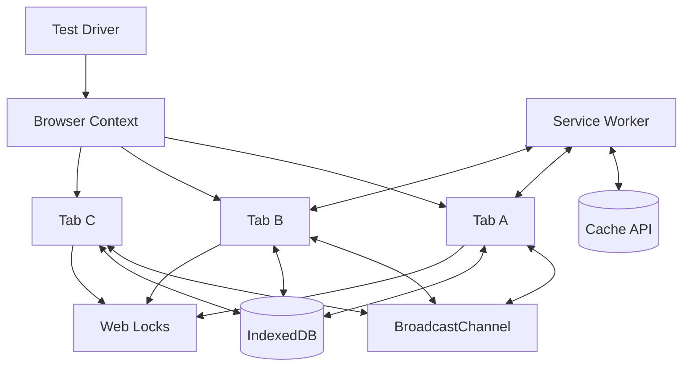
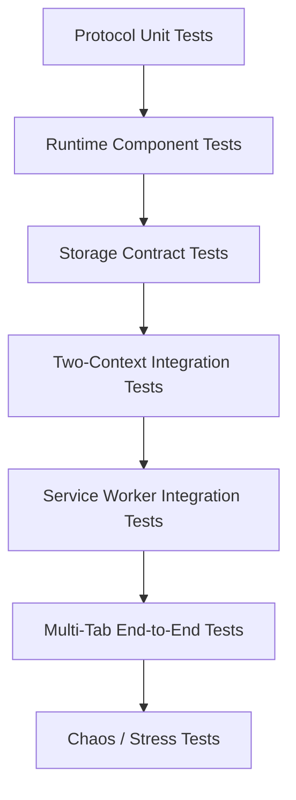
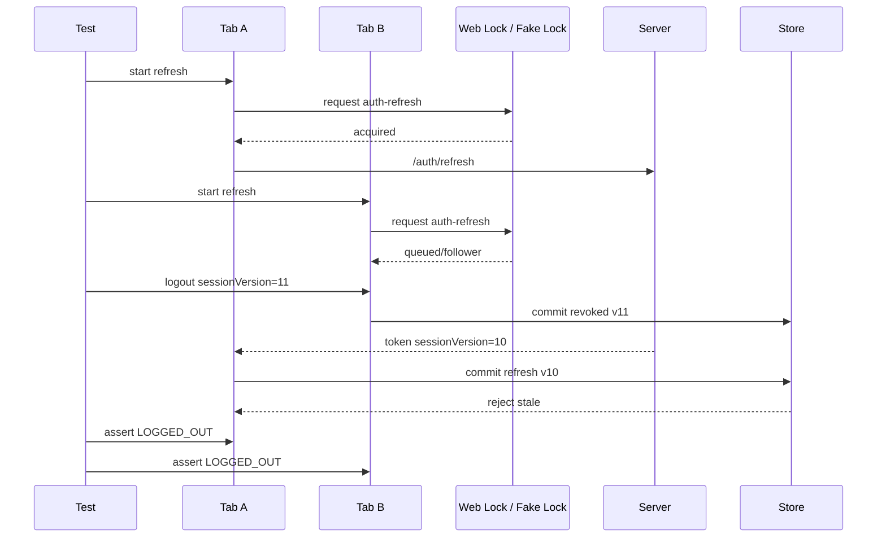

# Part 067 — Testing Multi-Tab Behavior

Multi-tab orchestration cannot be validated by clicking one tab manually.

A single-tab test answers:

> Does this function work when the world is stable?

A multi-tab test must answer:

> Does this system remain correct when multiple browser contexts run different lifecycles, exchange messages out of order, compete for ownership, and observe partially updated state?

That is a different class of testing.

If you test only the happy path, your app may still fail when:

- two tabs refresh auth token at the same time;
- an old tab receives a stale BroadcastChannel message;
- a Service Worker broadcasts a cache update to clients running different app versions;
- an IndexedDB migration is blocked by an old open connection;
- a leader tab closes while holding volatile ownership;
- a hidden tab resumes and overwrites newer session state;
- a follower tab times out and retries the same side effect;
- a page is restored from bfcache with stale in-memory assumptions;
- a SharedWorker hub restarts and clients reconnect with old subscriptions.

Testing multi-tab systems is less about asserting DOM text and more about asserting **system invariants**.

---

## 1. Testing Goal

The goal is not to prove that every possible browser interleaving is covered.

That is impossible.

The goal is to build enough deterministic pressure that the important invariants are repeatedly challenged.

Core invariants:

| Invariant | Meaning |
|---|---|
| single owner | only one context owns a resource-scoped side effect |
| monotonic generation | old worker/tab/session generations cannot overwrite newer state |
| bounded duplicate | duplicate messages do not produce duplicate business effects |
| bounded retry | retry stops under defined policy |
| recovery | crash/reload/freeze eventually converges |
| security cleanup | logout/revocation removes sensitive state everywhere |
| migration safety | old tabs do not corrupt upgraded storage |
| observability | every failure can be attributed to context, generation, and correlation ID |

A test that only checks final UI text is weak.

A strong test checks the invariant directly.

---

## 2. Mental Model: Browser Test as Distributed-System Test

A browser test usually has one `page`.

A multi-tab orchestration test needs a topology.



The test driver must control:

- how many pages exist;
- whether they share a browser context;
- whether service workers are enabled;
- when each page becomes ready;
- when messages are allowed to flow;
- what network responses return;
- which tab closes, reloads, or goes offline;
- how telemetry is collected;
- which invariant is checked after convergence.

The page is not the system.

The **context topology** is the system.

---

## 3. Test Pyramid for Multi-Tab Orchestration

Do not start with E2E tests.

Multi-tab E2E tests are expensive, flaky, and hard to debug if you have no lower-level coverage.

Use this pyramid:



| Layer | What it proves |
|---|---|
| protocol unit tests | reducer, envelope validation, stale rejection, dedupe |
| component tests | queue, worker client, registry, lock adapter |
| storage tests | IndexedDB transaction/recovery/migration behavior |
| two-context tests | message propagation and ownership handoff |
| service worker tests | controller/cache/client messaging behavior |
| E2E tests | user-visible correctness across tabs |
| chaos tests | recovery under hostile lifecycle/network/storage conditions |

The pyramid matters because the bugs are often not visual.

A stale generation bug may not render wrong UI until much later.

Catch it at the reducer boundary.

---

## 4. Build a Testable Runtime

Testing begins in architecture.

A runtime is testable if it exposes explicit adapters:

```ts
type RuntimeAdapters = {
  clock: Clock;
  id: IdGenerator;
  bus: MessageBus;
  storage: StoragePort;
  lock: LockPort;
  network: NetworkPort;
  telemetry: TelemetrySink;
};
```

Avoid hard-coding these inside business logic:

```ts
// Hard to test
const id = crypto.randomUUID();
const now = Date.now();
const channel = new BroadcastChannel("session");
await navigator.locks.request("auth-refresh", fn);
```

Prefer:

```ts
const id = adapters.id.next();
const now = adapters.clock.nowMs();
adapters.bus.publish(event);
await adapters.lock.withLock("auth-refresh", fn);
```

Why?

Because a deterministic test must be able to:

- freeze time;
- generate stable IDs;
- delay or drop messages;
- inject storage failures;
- simulate lock contention;
- inspect telemetry;
- replay events.

If your orchestration runtime is not injectable, your tests will become slow browser scripts that guess what happened.

---

## 5. Protocol Contract Tests

A protocol contract test checks the rules before the browser is involved.

Example envelope:

```ts
type Envelope<TPayload> = {
  protocol: "orchestrator.v1";
  kind: string;
  messageId: string;
  correlationId?: string;
  source: {
    tabId: string;
    connectionId: string;
    generation: number;
  };
  sessionVersion: number;
  createdAtMs: number;
  payload: TPayload;
};
```

Test these rules:

```ts
import { describe, expect, it } from "vitest";
import { acceptEnvelope } from "../runtime/protocol";

describe("protocol acceptance", () => {
  it("rejects stale generation", () => {
    const state = {
      knownGenerationByTab: new Map([["tab-a", 9]])
    };

    const result = acceptEnvelope(state, {
      protocol: "orchestrator.v1",
      kind: "SESSION_UPDATED",
      messageId: "m-1",
      source: {
        tabId: "tab-a",
        connectionId: "conn-old",
        generation: 8
      },
      sessionVersion: 44,
      createdAtMs: 1000,
      payload: {}
    });

    expect(result.accepted).toBe(false);
    expect(result.reason).toBe("STALE_GENERATION");
  });

  it("accepts duplicate message only once", () => {
    const dedupe = new Set<string>();

    const first = acceptEnvelope({ dedupe }, makeMessage("m-1"));
    const second = acceptEnvelope({ dedupe }, makeMessage("m-1"));

    expect(first.accepted).toBe(true);
    expect(second.accepted).toBe(false);
    expect(second.reason).toBe("DUPLICATE_MESSAGE");
  });
});
```

This test runs in milliseconds.

It catches bugs that would be painful to diagnose in Playwright.

---

## 6. Reducer Tests for Global Session State

A multi-tab session reducer must be deterministic.

Given the same ordered event stream, it must produce the same state.

```ts
describe("session reducer", () => {
  it("does not allow login after revocation marker", () => {
    const events = [
      { type: "LOGIN_CONFIRMED", sessionVersion: 10 },
      { type: "SESSION_REVOKED", sessionVersion: 11 },
      { type: "TOKEN_REFRESHED", sessionVersion: 10 }
    ];

    const state = reduceSessionEvents(initialSessionState(), events);

    expect(state.status).toBe("REVOKED");
    expect(state.sessionVersion).toBe(11);
  });
});
```

The key is not the syntax.

The key is this invariant:

> Newer security state beats older convenience state.

If that invariant is not true in the reducer, no amount of E2E testing will save the system.

---

## 7. Fake Message Bus

Testing BroadcastChannel behavior directly is useful, but many rules should first be tested with a fake bus.

A good fake bus can inject failures:

```ts
type DeliveryPolicy = {
  drop?: (msg: Envelope<unknown>) => boolean;
  duplicate?: (msg: Envelope<unknown>) => number;
  delayMs?: (msg: Envelope<unknown>) => number;
  reorder?: boolean;
};

class FakeBus {
  private listeners = new Map<string, Set<(msg: Envelope<unknown>) => void>>();

  constructor(private policy: DeliveryPolicy = {}) {}

  subscribe(topic: string, handler: (msg: Envelope<unknown>) => void) {
    let set = this.listeners.get(topic);
    if (!set) {
      set = new Set();
      this.listeners.set(topic, set);
    }
    set.add(handler);

    return () => set!.delete(handler);
  }

  async publish(topic: string, msg: Envelope<unknown>) {
    if (this.policy.drop?.(msg)) return;

    const count = this.policy.duplicate?.(msg) ?? 1;
    const delay = this.policy.delayMs?.(msg) ?? 0;
    const handlers = [...(this.listeners.get(topic) ?? [])];

    for (let i = 0; i < count; i++) {
      for (const handler of handlers) {
        await sleep(delay);
        handler(msg);
      }
    }
  }
}
```

Use this to test:

- duplicate delivery;
- delayed refresh result;
- stale logout signal;
- out-of-order presence snapshot;
- dropped ACK;
- follower timeout.

Do not wait for the browser to create these races naturally.

Force the race.

---

## 8. Fake Lock Adapter

Web Locks tests in a real browser are necessary.

But ownership logic should also have a fake lock adapter.

```ts
class FakeLockPort {
  private held = new Set<string>();

  async withLock<T>(name: string, fn: () => Promise<T>): Promise<T> {
    if (this.held.has(name)) {
      throw new Error(`lock already held: ${name}`);
    }

    this.held.add(name);
    try {
      return await fn();
    } finally {
      this.held.delete(name);
    }
  }
}
```

Then test business ownership:

```ts
it("allows only one refresh owner", async () => {
  const lock = new FakeLockPort();
  let refreshCount = 0;

  await Promise.allSettled([
    lock.withLock("auth-refresh", async () => refreshCount++),
    lock.withLock("auth-refresh", async () => refreshCount++)
  ]);

  expect(refreshCount).toBe(1);
});
```

This fake is not a complete Web Locks model.

It is a test double for your ownership logic.

Use real-browser tests for Web Locks API semantics.

---

## 9. Playwright Topology: Multiple Pages in One Context

For same-origin tab orchestration, most tests need multiple pages inside the same browser context.

```ts
import { test, expect } from "@playwright/test";

test("two tabs share BroadcastChannel session signal", async ({ context }) => {
  const tabA = await context.newPage();
  const tabB = await context.newPage();

  await tabA.goto("/app");
  await tabB.goto("/app");

  await tabA.evaluate(() => window.__testRuntime.ready());
  await tabB.evaluate(() => window.__testRuntime.ready());

  await tabA.evaluate(() => {
    window.__testRuntime.publishSessionEvent({ type: "LOGOUT_REQUESTED" });
  });

  await expect.poll(async () => {
    return await tabB.evaluate(() => window.__testRuntime.sessionStatus());
  }).toBe("LOGGED_OUT");
});
```

Same context matters because it shares browser storage/session conditions according to the browser context setup.

Separate contexts are useful for isolation tests.

Same context is useful for multi-tab tests.

---

## 10. Page Readiness Contract

Never start a multi-tab test with arbitrary sleeps.

Bad:

```ts
await page.waitForTimeout(1000);
```

Good:

```ts
await expect.poll(async () => {
  return await page.evaluate(() => window.__testRuntime.status());
}).toEqual({ ready: true, workerReady: true, busReady: true });
```

Expose explicit readiness:

```ts
declare global {
  interface Window {
    __testRuntime?: {
      ready(): Promise<boolean>;
      status(): RuntimeStatus;
      telemetry(): TelemetryEvent[];
      forceHeartbeat(): Promise<void>;
      sessionStatus(): string;
    };
  }
}
```

Guard it:

```ts
if (import.meta.env.MODE === "test") {
  window.__testRuntime = createTestRuntimeBridge(runtime);
}
```

Never ship unrestricted chaos/test hooks in production.

---

## 11. Deterministic Barriers

Races are hard because they depend on timing.

A barrier lets the test pause a workflow at a named point.

```ts
class TestBarrier {
  private waiters = new Map<string, () => void>();
  private promises = new Map<string, Promise<void>>();

  wait(name: string) {
    if (!this.promises.has(name)) {
      this.promises.set(name, new Promise(resolve => {
        this.waiters.set(name, resolve);
      }));
    }
    return this.promises.get(name)!;
  }

  release(name: string) {
    this.waiters.get(name)?.();
    this.waiters.delete(name);
  }
}
```

Use it inside critical code only in test mode:

```ts
async function refreshToken(runtime: Runtime) {
  await runtime.testHooks?.barrier.wait("before-refresh-network");
  const response = await runtime.network.refreshToken();

  await runtime.testHooks?.barrier.wait("before-refresh-commit");
  await runtime.session.commitRefresh(response);
}
```

Now the test can force the interleaving:

```ts
await tabA.evaluate(() => window.__testRuntime.startRefresh());
await tabB.evaluate(() => window.__testRuntime.startRefresh());

await tabA.evaluate(() => window.__testRuntime.releaseBarrier("before-refresh-network"));
await tabB.evaluate(() => window.__testRuntime.releaseBarrier("before-refresh-network"));

// assert only one network request escaped
```

Without barriers, this test becomes probabilistic.

Probabilistic tests are useful for stress.

They are not enough for CI correctness gates.

---

## 12. Testing BroadcastChannel Propagation

BroadcastChannel is volatile.

Do not assert that it is durable.

Assert that live contexts receive signals and stale signals are handled safely.

Example:

```ts
test("session event reaches live tabs", async ({ context }) => {
  const a = await context.newPage();
  const b = await context.newPage();

  await a.goto("/app?tab=a");
  await b.goto("/app?tab=b");

  await Promise.all([
    a.evaluate(() => window.__testRuntime.ready()),
    b.evaluate(() => window.__testRuntime.ready())
  ]);

  await a.evaluate(() => window.__testRuntime.broadcast({
    kind: "SESSION_REVOKED",
    sessionVersion: 7
  }));

  await expect.poll(async () => {
    return await b.evaluate(() => window.__testRuntime.lastAcceptedEventKind());
  }).toBe("SESSION_REVOKED");
});
```

Now test stale rejection:

```ts
test("stale session event is ignored", async ({ context }) => {
  const page = await context.newPage();
  await page.goto("/app");

  await page.evaluate(() => window.__testRuntime.setSessionVersion(10));

  await page.evaluate(() => window.__testRuntime.injectMessage({
    kind: "TOKEN_REFRESHED",
    sessionVersion: 9,
    payload: { accessTokenExpiresAt: Date.now() + 60000 }
  }));

  const status = await page.evaluate(() => window.__testRuntime.sessionDebug());
  expect(status.sessionVersion).toBe(10);
  expect(status.rejectedMessages.at(-1).reason).toBe("STALE_SESSION_VERSION");
});
```

The second test is more valuable than the first.

Happy propagation is easy.

Safe rejection is the real correctness property.

---

## 13. Testing `storage` Event Fallback

The `storage` event has a special rule:

- the writing context does not receive its own event;
- other same-origin browsing contexts receive it.

Test that explicitly.

```ts
test("localStorage storage event reaches other tab, not writer", async ({ context }) => {
  const writer = await context.newPage();
  const reader = await context.newPage();

  await writer.goto("/app");
  await reader.goto("/app");

  await writer.evaluate(() => window.__testRuntime.resetStorageEvents());
  await reader.evaluate(() => window.__testRuntime.resetStorageEvents());

  await writer.evaluate(() => {
    localStorage.setItem("orchestrator.signal", JSON.stringify({
      id: "s-1",
      kind: "LOGOUT"
    }));
  });

  await expect.poll(async () => {
    return await reader.evaluate(() => window.__testRuntime.storageEventCount());
  }).toBe(1);

  expect(await writer.evaluate(() => window.__testRuntime.storageEventCount())).toBe(0);
});
```

This matters because a fallback bus that assumes echo-to-self may silently fail.

The writer must update itself directly.

Other tabs are updated through the event.

---

## 14. Testing Web Locks Leader Election

A leader-election test should not assert a specific tab ID unless ranking is deterministic.

It should assert the invariant:

> exactly one leader exists for a resource at a time.

```ts
test("exactly one tab becomes refresh leader", async ({ context }) => {
  const tabs = await Promise.all([
    context.newPage(),
    context.newPage(),
    context.newPage()
  ]);

  await Promise.all(tabs.map((p, i) => p.goto(`/app?tab=${i}`)));

  await Promise.all(tabs.map(p => p.evaluate(() => {
    return window.__testRuntime.startLeaderCandidate("auth-refresh");
  })));

  await expect.poll(async () => {
    const states = await Promise.all(tabs.map(p => {
      return p.evaluate(() => window.__testRuntime.leadershipState("auth-refresh"));
    }));
    return states.filter(s => s === "LEADER").length;
  }).toBe(1);
});
```

Then test handoff:

```ts
test("leadership moves after leader closes", async ({ context }) => {
  const a = await context.newPage();
  const b = await context.newPage();

  await a.goto("/app?tab=a");
  await b.goto("/app?tab=b");

  await Promise.all([
    a.evaluate(() => window.__testRuntime.startLeaderCandidate("sync")),
    b.evaluate(() => window.__testRuntime.startLeaderCandidate("sync"))
  ]);

  const leaderName = await expect.poll(async () => {
    const states = await Promise.all([
      a.evaluate(() => window.__testRuntime.leadershipDebug("sync")),
      b.evaluate(() => window.__testRuntime.leadershipDebug("sync"))
    ]);
    return states.find(s => s.state === "LEADER")?.tabName;
  }).not.toBeUndefined();

  const leaderPage = leaderName === "a" ? a : b;
  const followerPage = leaderName === "a" ? b : a;

  await leaderPage.close();

  await expect.poll(async () => {
    return await followerPage.evaluate(() => window.__testRuntime.leadershipState("sync"));
  }).toBe("LEADER");
});
```

The lock callback must stay alive for the ownership duration.

If your test shows both tabs as leaders, your leadership abstraction is not fencing properly.

---

## 15. Testing Fencing Tokens

Testing single leader is not enough.

You must test that stale leader effects are rejected.

Scenario:

1. Tab A becomes leader with token `10`.
2. Tab A starts a slow effect.
3. Tab A loses leadership or closes.
4. Tab B becomes leader with token `11`.
5. Tab A's stale effect returns late.
6. The state store rejects token `10`.

```ts
test("stale leader effect cannot overwrite newer leader", async ({ context }) => {
  const a = await context.newPage();
  const b = await context.newPage();

  await a.goto("/app?tab=a");
  await b.goto("/app?tab=b");

  await a.evaluate(() => window.__testRuntime.setLeaderToken("cache-refresh", 10));
  await b.evaluate(() => window.__testRuntime.setLeaderToken("cache-refresh", 11));

  await b.evaluate(() => window.__testRuntime.commitLeaderEffect({
    resource: "cache-refresh",
    token: 11,
    value: "new-manifest"
  }));

  await a.evaluate(() => window.__testRuntime.commitLeaderEffect({
    resource: "cache-refresh",
    token: 10,
    value: "old-manifest"
  }));

  const manifest = await b.evaluate(() => window.__testRuntime.currentManifest());

  expect(manifest.value).toBe("new-manifest");
  expect(manifest.token).toBe(11);
});
```

This test should not require real Web Locks.

It tests the receiver-side guard.

That guard is what prevents split brain from causing damage.

---

## 16. Testing Auth Refresh Single-Flight

Auth refresh is the classic multi-tab race.

Test requirements:

- many tabs observe token expiry;
- only one refresh network call escapes;
- followers wait or consume result;
- stale refresh result is rejected;
- logout beats refresh;
- failure does not create infinite retry storm.

Example network counter:

```ts
test("only one refresh request escapes across tabs", async ({ context }) => {
  let refreshCalls = 0;

  await context.route("**/auth/refresh", async route => {
    refreshCalls++;
    await route.fulfill({
      status: 200,
      contentType: "application/json",
      body: JSON.stringify({
        accessToken: "test-token",
        sessionVersion: 42
      })
    });
  });

  const tabs = await Promise.all([context.newPage(), context.newPage(), context.newPage()]);
  await Promise.all(tabs.map(p => p.goto("/app")));

  await Promise.all(tabs.map(p => p.evaluate(() => {
    return window.__testRuntime.forceTokenExpiringSoon();
  })));

  await Promise.all(tabs.map(p => p.evaluate(() => {
    return window.__testRuntime.fetchProtectedResource();
  })));

  expect(refreshCalls).toBe(1);
});
```

Then test logout wins:

```ts
test("logout wins over late refresh", async ({ context }) => {
  let releaseRefresh!: () => void;
  const refreshBarrier = new Promise<void>(resolve => { releaseRefresh = resolve; });

  await context.route("**/auth/refresh", async route => {
    await refreshBarrier;
    await route.fulfill({
      status: 200,
      contentType: "application/json",
      body: JSON.stringify({ accessToken: "late-token", sessionVersion: 10 })
    });
  });

  const a = await context.newPage();
  const b = await context.newPage();
  await a.goto("/app");
  await b.goto("/app");

  const refreshPromise = a.evaluate(() => window.__testRuntime.refreshToken());
  await b.evaluate(() => window.__testRuntime.logout({ sessionVersion: 11 }));

  releaseRefresh();
  await refreshPromise.catch(() => undefined);

  await expect.poll(async () => {
    return await a.evaluate(() => window.__testRuntime.sessionStatus());
  }).toBe("LOGGED_OUT");
});
```

This is a high-value test.

If it fails, your security cleanup is not authoritative.

---

## 17. Testing Notification Suppression

Notification suppression is not just UI.

It is ownership plus dedupe.

```ts
test("only one visible tab claims toast notification", async ({ context }) => {
  const a = await context.newPage();
  const b = await context.newPage();

  await a.goto("/app?tab=a");
  await b.goto("/app?tab=b");

  await Promise.all([
    a.evaluate(() => window.__testRuntime.setVisibilityForTest("visible")),
    b.evaluate(() => window.__testRuntime.setVisibilityForTest("visible"))
  ]);

  await Promise.all([
    a.evaluate(() => window.__testRuntime.receiveDomainEvent({ id: "evt-1", type: "CASE_UPDATED" })),
    b.evaluate(() => window.__testRuntime.receiveDomainEvent({ id: "evt-1", type: "CASE_UPDATED" }))
  ]);

  const counts = await Promise.all([
    a.evaluate(() => window.__testRuntime.toastCount("evt-1")),
    b.evaluate(() => window.__testRuntime.toastCount("evt-1"))
  ]);

  expect(counts.reduce((x, y) => x + y, 0)).toBe(1);
});
```

Do not assert that tab A always wins unless your arbitration policy says so.

Assert total side effect count.

---

## 18. Testing IndexedDB Migration Across Open Tabs

Storage migration bugs are easy to miss.

Test the blocked-upgrade path.

Pseudo-scenario:

1. Tab A opens DB version 1 and keeps connection open.
2. Tab B loads new app and tries DB version 2.
3. Upgrade is blocked.
4. Tab A receives `versionchange` and closes DB.
5. Tab B migration continues.
6. Both tabs converge or old tab enters reload-required state.

Test shape:

```ts
test("old DB connection releases upgrade on versionchange", async ({ context }) => {
  const oldTab = await context.newPage();
  const newTab = await context.newPage();

  await oldTab.goto("/app-v1");
  await oldTab.evaluate(() => window.__testRuntime.openDatabaseVersion(1));

  await newTab.goto("/app-v2");

  const blocked = await expect.poll(async () => {
    return await newTab.evaluate(() => window.__testRuntime.migrationStatus());
  }).toBe("BLOCKED");

  await oldTab.evaluate(() => window.__testRuntime.simulateVersionChange());

  await expect.poll(async () => {
    return await newTab.evaluate(() => window.__testRuntime.migrationStatus());
  }).toBe("MIGRATED");
});
```

The exact hook depends on your DB adapter.

The invariant is fixed:

> Upgrade must not silently hang forever behind an old tab.

---

## 19. Testing Service Worker Modes

Service Worker tests need deliberate mode selection.

Two useful modes:

| Mode | Purpose |
|---|---|
| service workers blocked | predictable network/mock tests |
| service workers allowed | real cache/controller/update tests |

If a test is about API behavior behind mocked routes, blocking Service Workers can reduce surprise.

If a test is about Service Worker orchestration, you must enable them.

Example project config:

```ts
// playwright.config.ts
export default defineConfig({
  projects: [
    {
      name: "app-no-sw",
      use: { serviceWorkers: "block" }
    },
    {
      name: "app-with-sw",
      use: { serviceWorkers: "allow" }
    }
  ]
});
```

Separate these suites.

Do not mix assumptions.

---

## 20. Testing Service Worker Broadcast to Clients

Service Worker broadcast must handle:

- no controlled clients;
- one controlled client;
- many controlled clients;
- hidden clients;
- old app version clients;
- duplicate client messages;
- client ACK timeout.

Example:

```ts
test("service worker broadcasts cache update to all clients", async ({ context }) => {
  const a = await context.newPage();
  const b = await context.newPage();

  await a.goto("/app");
  await b.goto("/app");

  await Promise.all([
    a.evaluate(() => navigator.serviceWorker.ready),
    b.evaluate(() => navigator.serviceWorker.ready)
  ]);

  await a.evaluate(() => {
    return window.__testRuntime.askServiceWorkerToBroadcast({
      kind: "CACHE_MANIFEST_UPDATED",
      manifestVersion: 18
    });
  });

  await expect.poll(async () => {
    const values = await Promise.all([
      a.evaluate(() => window.__testRuntime.cacheManifestVersion()),
      b.evaluate(() => window.__testRuntime.cacheManifestVersion())
    ]);
    return values;
  }).toEqual([18, 18]);
});
```

Also test incompatible client behavior:

```ts
test("old client rejects unsupported service worker message", async ({ context }) => {
  const oldClient = await context.newPage();
  await oldClient.goto("/app-v1");

  await oldClient.evaluate(() => window.__testRuntime.injectServiceWorkerMessage({
    protocol: "sw-control.v3",
    kind: "NEW_CACHE_FORMAT",
    payload: {}
  }));

  const rejected = await oldClient.evaluate(() => window.__testRuntime.rejectedMessages());
  expect(rejected.at(-1).reason).toBe("UNSUPPORTED_PROTOCOL_VERSION");
});
```

Protocol rejection is not failure.

Silent acceptance is failure.

---

## 21. Testing Hidden, Freeze, and Restore Behavior

Visibility is easy to test.

Freezing and discard are harder and browser-specific.

Use layers:

| Behavior | Test technique |
|---|---|
| hidden | app-level visibility adapter override or `visibilitychange` simulation |
| freeze | CDP lifecycle state in Chromium-specific tests, or app-level test hook |
| discard/restore | reload with persisted marker and recovery assertion |
| bfcache-like stale memory | navigate away/back and revalidate on resume |

Do not make all CI depend on experimental lifecycle controls.

Keep browser-specific lifecycle tests in a separate suite.

Example app-level lifecycle adapter:

```ts
type LifecycleState = "ACTIVE" | "HIDDEN" | "FROZEN" | "RESTORED";

class TestLifecycleAdapter {
  private listeners = new Set<(state: LifecycleState) => void>();

  emit(state: LifecycleState) {
    for (const listener of this.listeners) listener(state);
  }

  subscribe(listener: (state: LifecycleState) => void) {
    this.listeners.add(listener);
    return () => this.listeners.delete(listener);
  }
}
```

Test:

```ts
test("hidden leader steps down from expensive work", async ({ page }) => {
  await page.goto("/app");
  await page.evaluate(() => window.__testRuntime.becomeLeader("indexing"));

  await page.evaluate(() => window.__testRuntime.emitLifecycle("HIDDEN"));

  await expect.poll(async () => {
    return await page.evaluate(() => window.__testRuntime.leadershipState("indexing"));
  }).toBe("STEPPING_DOWN");
});
```

This validates your policy.

Browser-specific tests validate API integration.

Both are needed.

---

## 22. Testing Worker Task Queue

Worker queue tests should assert:

- FIFO where required;
- priority ordering where configured;
- bounded queue rejection;
- timeout cleanup;
- cancellation;
- stale response guard;
- worker restart recovery;
- memory budget behavior.

Unit test:

```ts
it("rejects admission when queue is full", async () => {
  const queue = new WorkerTaskQueue({ maxQueued: 2 });

  queue.enqueue(makeTask("a"));
  queue.enqueue(makeTask("b"));

  expect(() => queue.enqueue(makeTask("c"))).toThrow("QUEUE_FULL");
});
```

Browser test:

```ts
test("cancelled worker task does not commit late result", async ({ page }) => {
  await page.goto("/app");

  const taskId = await page.evaluate(() => {
    return window.__testRuntime.startSlowWorkerTask({ durationMs: 10_000 });
  });

  await page.evaluate(id => window.__testRuntime.cancelWorkerTask(id), taskId);
  await page.evaluate(id => window.__testRuntime.forceWorkerComplete(id, { value: "late" }), taskId);

  const state = await page.evaluate(() => window.__testRuntime.workerState());

  expect(state.committedResults).not.toContainEqual({ taskId, value: "late" });
});
```

A cancellation test that only checks promise rejection is incomplete.

Also assert no late commit.

---

## 23. Testing SharedWorker Hub

SharedWorker testing should focus on connection semantics.

Test cases:

| Case | Assertion |
|---|---|
| first client connects | registry contains one connection |
| second tab connects | registry contains two connections |
| tab closes | registry eventually removes connection |
| missed `BYE` | heartbeat expiry removes connection |
| reconnect | new connection generation replaces stale one |
| subscription | broadcast only reaches subscribed clients |
| direct send | target receives exactly one message |
| hub restart | clients reconnect/resubscribe |

Example:

```ts
test("SharedWorker hub tracks two ports", async ({ context }) => {
  const a = await context.newPage();
  const b = await context.newPage();

  await a.goto("/app");
  await b.goto("/app");

  await Promise.all([
    a.evaluate(() => window.__testRuntime.connectSharedHub()),
    b.evaluate(() => window.__testRuntime.connectSharedHub())
  ]);

  await expect.poll(async () => {
    return await a.evaluate(() => window.__testRuntime.sharedHubClientCount());
  }).toBe(2);
});
```

SharedWorker support and behavior can vary by environment.

Keep fallback tests separate.

---

## 24. Testing Storage Quota and Failure Paths

Quota failure is hard to force portably.

Use adapter-level fault injection for most tests.

```ts
class FaultyStorage implements StoragePort {
  constructor(
    private inner: StoragePort,
    private fault: { failWritesAfter?: number }
  ) {}

  private writes = 0;

  async put(key: string, value: unknown) {
    this.writes++;
    if (this.fault.failWritesAfter && this.writes > this.fault.failWritesAfter) {
      throw new DOMException("Quota exceeded", "QuotaExceededError");
    }
    return this.inner.put(key, value);
  }
}
```

Test the invariant:

```ts
it("does not mark WAL committed when payload write fails", async () => {
  const storage = new FaultyStorage(realStorage, { failWritesAfter: 1 });
  const wal = new ClientWal(storage);

  await expect(wal.writePayloadTransaction(makePayload())).rejects.toThrow();

  const records = await wal.scan();
  expect(records.some(r => r.state === "COMMITTED")).toBe(false);
});
```

Do not depend only on actual quota exhaustion.

Make failure injectable.

---

## 25. Testing Network Partition and Offline Queue

Playwright can intercept routes.

Use route failures to simulate network failure deterministically.

```ts
test("offline queue replays after network recovers", async ({ context }) => {
  let online = false;
  const received: string[] = [];

  await context.route("**/api/mutations", async route => {
    if (!online) {
      await route.abort("internetdisconnected");
      return;
    }

    const body = route.request().postDataJSON();
    received.push(body.idempotencyKey);
    await route.fulfill({ status: 200, body: JSON.stringify({ ok: true }) });
  });

  const page = await context.newPage();
  await page.goto("/app");

  await page.evaluate(() => window.__testRuntime.enqueueMutation({ idempotencyKey: "cmd-1" }));
  await page.evaluate(() => window.__testRuntime.flushOutbox());

  expect(received).toEqual([]);

  online = true;
  await page.evaluate(() => window.__testRuntime.flushOutbox());

  await expect.poll(() => received).toEqual(["cmd-1"]);
});
```

Then test duplicate replay:

```ts
test("same outbox command is not sent twice after crash recovery", async ({ page }) => {
  await page.goto("/app");

  await page.evaluate(() => window.__testRuntime.enqueueMutation({ idempotencyKey: "cmd-9" }));
  await page.evaluate(() => window.__testRuntime.markOutboxAttemptStarted("cmd-9"));
  await page.reload();
  await page.evaluate(() => window.__testRuntime.recoverOutbox());

  const attempts = await page.evaluate(() => window.__testRuntime.outboxAttempts("cmd-9"));
  expect(attempts.activeOwners).toBeLessThanOrEqual(1);
});
```

The network test proves transport behavior.

The recovery test proves state-machine behavior.

---

## 26. Testing Cache API Version Promotion

Cache consistency needs promotion tests.

Scenario:

1. current manifest is `v1`;
2. new assets are downloaded into staging cache `v2-staging`;
3. commit marker is not written because crash occurs;
4. app restarts;
5. recovery deletes or completes staging;
6. current manifest is not accidentally changed.

Test shape:

```ts
test("staging cache is not promoted without commit marker", async ({ page }) => {
  await page.goto("/app");

  await page.evaluate(() => window.__testRuntime.cache.setCurrentManifest("v1"));
  await page.evaluate(() => window.__testRuntime.cache.createStagingCache("v2"));
  await page.evaluate(() => window.__testRuntime.cache.simulateCrashBeforeCommit("v2"));

  await page.reload();
  await page.evaluate(() => window.__testRuntime.cache.recover());

  const manifest = await page.evaluate(() => window.__testRuntime.cache.currentManifest());
  expect(manifest.version).toBe("v1");
});
```

This is not a visual test.

It is a storage transaction invariant test.

---

## 27. Testing Observability Itself

A serious orchestration runtime must emit traces.

Test telemetry shape.

```ts
test("leader election emits ownership trace", async ({ page }) => {
  await page.goto("/app");

  await page.evaluate(() => window.__testRuntime.startLeaderCandidate("sync"));

  await expect.poll(async () => {
    const events = await page.evaluate(() => window.__testRuntime.telemetry());
    return events.some(e =>
      e.name === "leader.acquired" &&
      e.resource === "sync" &&
      typeof e.tabId === "string" &&
      typeof e.connectionId === "string" &&
      typeof e.generation === "number"
    );
  }).toBe(true);
});
```

If telemetry is not tested, it will rot.

When production breaks, rotten telemetry is worse than no telemetry because it gives false confidence.

---

## 28. Test Data Isolation

Multi-tab tests leak state easily.

Reset between tests:

- IndexedDB databases;
- CacheStorage caches;
- localStorage/sessionStorage;
- cookies;
- service worker registrations;
- BroadcastChannel listeners;
- SharedWorker connections;
- test hooks;
- telemetry buffers.

Test cleanup helper:

```ts
async function resetBrowserState(page: Page) {
  await page.evaluate(async () => {
    localStorage.clear();
    sessionStorage.clear();

    const dbs = await indexedDB.databases?.() ?? [];
    await Promise.all(dbs.map(db => db.name && indexedDB.deleteDatabase(db.name)));

    const cacheNames = await caches.keys();
    await Promise.all(cacheNames.map(name => caches.delete(name)));

    const regs = await navigator.serviceWorker?.getRegistrations?.() ?? [];
    await Promise.all(regs.map(reg => reg.unregister()));
  });
}
```

Use this carefully.

Some APIs require secure context or permissions.

Some cleanup is async and can race with the next test.

Prefer fresh browser context per test when possible.

---

## 29. Flake Control

Multi-tab tests become flaky when they rely on time instead of state.

Rules:

| Bad | Better |
|---|---|
| `waitForTimeout(1000)` | `expect.poll(condition)` |
| count DOM toast after arbitrary delay | query runtime notification ledger |
| assume tab A wins | assert exactly one winner |
| depend on real network | route network deterministically |
| depend on real clock expiry | fake/injected clock |
| inspect console manually | collect structured telemetry |
| run all browsers for every chaos test | separate browser-specific suites |

A flaky test is usually a hidden design smell.

The system likely lacks explicit readiness, ownership, or observability.

---

## 30. CI Strategy

Do not run every expensive test on every commit.

Use lanes:

| Lane | Frequency | Content |
|---|---|---|
| unit | every commit | protocol, reducer, queue, storage state machine |
| integration | every commit | fake bus, fake lock, IndexedDB adapter |
| smoke browser | every commit | two-tab login/logout, worker startup, cache basic |
| full browser | PR/main | multi-tab, Service Worker, cache migration, auth refresh |
| cross-browser | scheduled/nightly | Chromium, Firefox, WebKit compatibility |
| chaos/stress | nightly/pre-release | random faults, repeated reloads, lifecycle, network |

Keep deterministic correctness tests fast.

Let chaos tests be expensive.

Do not mix them into one undifferentiated suite.

---

## 31. Minimum Multi-Tab Test Suite

If you build only one suite, include these:

1. two tabs receive logout;
2. stale refresh result is rejected after logout;
3. only one token refresh request escapes;
4. only one outbox replay owner exists;
5. leader handoff after tab close;
6. stale leader token cannot commit;
7. storage migration blocked path resolves or fails safely;
8. Service Worker cache update reaches compatible clients;
9. old protocol message is rejected;
10. telemetry includes context/generation/correlation ID.

That suite catches most expensive classes of bugs.

---

## 32. Example Test Runtime Bridge

A small bridge makes browser tests readable.

```ts
export function installTestRuntimeBridge(runtime: OrchestratorRuntime) {
  if (!isTestMode()) return;

  window.__testRuntime = {
    ready: () => runtime.ready(),
    status: () => runtime.status(),
    telemetry: () => runtime.telemetry.snapshot(),

    broadcast: msg => runtime.bus.publishTestMessage(msg),
    injectMessage: msg => runtime.protocol.inject(msg),

    sessionStatus: () => runtime.session.status(),
    sessionDebug: () => runtime.session.debug(),
    setSessionVersion: version => runtime.session.setVersionForTest(version),
    logout: input => runtime.session.logout(input),
    refreshToken: () => runtime.auth.refresh(),
    forceTokenExpiringSoon: () => runtime.auth.forceExpiringSoonForTest(),
    fetchProtectedResource: () => runtime.api.fetchProtectedResource(),

    startLeaderCandidate: resource => runtime.leadership.start(resource),
    leadershipState: resource => runtime.leadership.state(resource),
    leadershipDebug: resource => runtime.leadership.debug(resource),
    setLeaderToken: (resource, token) => runtime.leadership.setTokenForTest(resource, token),
    commitLeaderEffect: effect => runtime.leadership.commitEffectForTest(effect),

    enqueueMutation: command => runtime.outbox.enqueue(command),
    flushOutbox: () => runtime.outbox.flush(),

    cache: runtime.cache.testApi(),

    emitLifecycle: state => runtime.lifecycle.emitForTest(state)
  };
}
```

This is powerful.

Therefore it must be protected.

Rules:

- available only in test builds;
- never expose tokens/secrets through it;
- avoid arbitrary code execution helpers;
- keep methods semantic, not raw internals;
- redact telemetry before exposing it;
- fail app startup if test bridge is enabled in production mode.

---

## 33. Mermaid: Deterministic Race Test



The test is not about whether refresh returns.

The test is about whether stale refresh is harmless.

---

## 34. Common Anti-Patterns

| Anti-pattern | Why it fails |
|---|---|
| one page only | misses cross-tab races |
| sleeps instead of conditions | creates flakes |
| asserting fixed leader tab | over-specifies implementation |
| no stale message tests | accepts old state silently |
| no blocked migration test | DB upgrade can hang in production |
| blocking service workers in all tests | misses real SW behavior |
| enabling service workers in all tests | makes unrelated tests less predictable |
| no test hooks | cannot force races deterministically |
| raw chaos hooks in production | security risk |
| testing only final DOM | misses invariant violations |

---

## 35. Final Checklist

Before trusting a multi-tab orchestration runtime, verify:

- [ ] protocol reducer rejects stale generation;
- [ ] duplicate message does not duplicate effect;
- [ ] leader election has exactly one owner;
- [ ] stale leader effect is fenced;
- [ ] token refresh is single-flight;
- [ ] logout beats late refresh;
- [ ] offline outbox has one replay owner;
- [ ] network failure creates durable retry state;
- [ ] cache promotion is recoverable;
- [ ] IndexedDB migration handles blocked old connections;
- [ ] Service Worker tests run in both blocked and allowed modes where appropriate;
- [ ] BroadcastChannel fallback is tested;
- [ ] storage event fallback is tested if supported;
- [ ] worker queue cancellation rejects late commit;
- [ ] SharedWorker reconnect/resubscribe is tested if used;
- [ ] telemetry emits context identity, generation, correlation ID;
- [ ] test hooks are disabled in production.

---

## 36. Key Takeaway

Multi-tab testing is not browser automation with extra tabs.

It is distributed-system testing inside one origin.

The right question is not:

> Did the UI update?

The right question is:

> Did the invariant survive duplicate contexts, stale messages, lifecycle transitions, storage contention, and delayed side effects?

When you test that way, your browser orchestration runtime becomes much more than a collection of event listeners.

It becomes a system with contracts.

---

## References

- Playwright documentation — Pages and multiple pages in one browser context.
- Playwright documentation — Service Worker testing configuration.
- Chrome for Developers — Page Lifecycle API.
- Chrome DevTools Protocol — Page domain lifecycle controls.
- MDN — Web Locks API.
