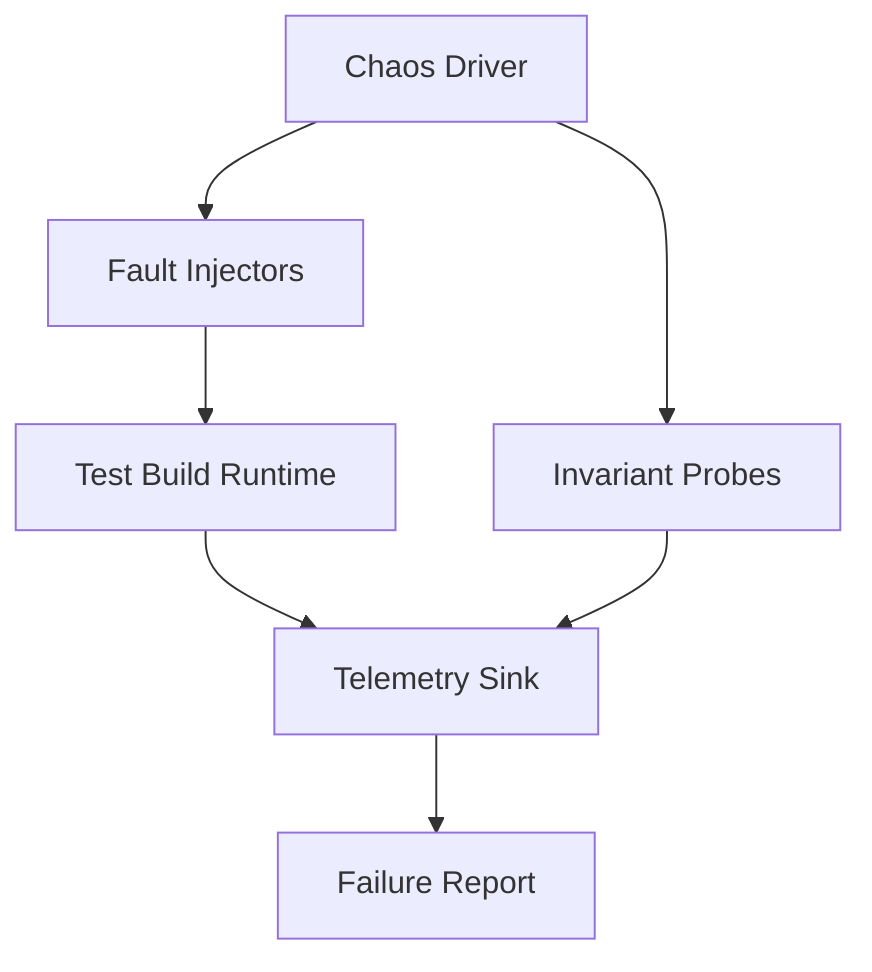
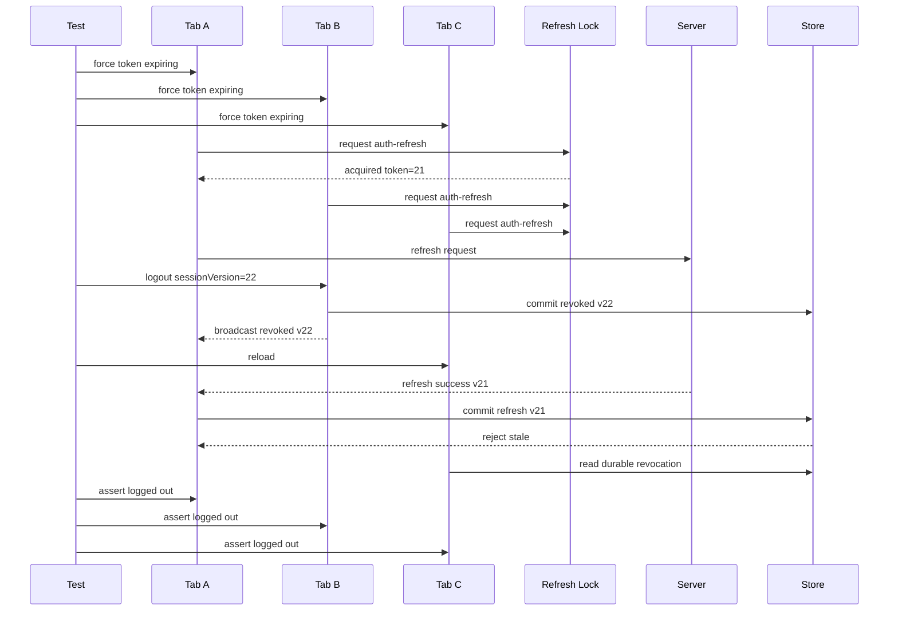
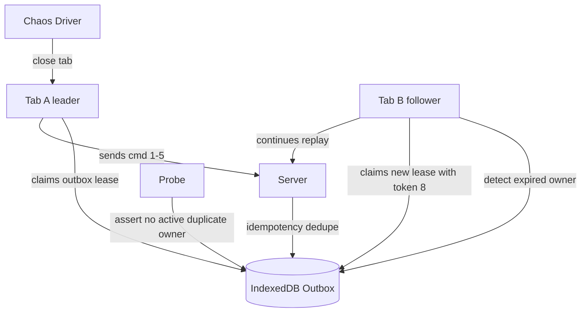

# Part 068 — Chaos Testing Browser Orchestration

Normal tests ask:

> Does the system work when events happen in the expected order?

Chaos tests ask:

> Which assumption breaks first when the browser behaves like a hostile distributed runtime?

Browser orchestration is fragile because the browser is allowed to do things your code does not control:

- freeze hidden pages;
- discard tabs;
- kill workers;
- delay timers;
- reorder user focus;
- throttle background work;
- interrupt network;
- evict storage under pressure;
- keep old Service Workers alive;
- restore pages with stale memory;
- run multiple same-origin tabs with different app versions.

Chaos testing does not mean random destruction.

Good chaos testing is **controlled fault injection plus invariant checking**.

---

## 1. What Chaos Testing Means Here

In backend systems, chaos testing often means killing instances, injecting latency, or cutting network links.

In browser orchestration, the equivalent is:

| Backend chaos | Browser equivalent |
|---|---|
| kill process | close tab, reload page, terminate worker, unregister Service Worker |
| network partition | route abort, offline mode, delayed response, partial response |
| clock skew | fake/injected clock jump, stale heartbeat timestamps |
| node pause | hidden/frozen page, throttled timer, blocked event loop |
| duplicate delivery | duplicated BroadcastChannel/storage event/test bus message |
| message loss | dropped signal, missed ACK, closed port |
| split brain | two tabs believe they own resource |
| stale write | old generation commits after new generation |
| disk full | quota error, storage adapter failure |
| rolling deploy | app v1 tab + app v2 tab + Service Worker update |

The browser is not a data center.

But the reliability problems rhyme.

---

## 2. Chaos Testing Rule

Never inject faults without an invariant.

Bad chaos test:

> Randomly close tabs and see what happens.

Good chaos test:

> Randomly close the current outbox owner while flushing, then assert at most one replay owner exists, no committed command is sent twice without the same idempotency key, and pending commands eventually return to retryable state.

Faults are only useful when they attack a named invariant.

---

## 3. Chaos Architecture

A browser chaos harness has four pieces:



| Component | Responsibility |
|---|---|
| chaos driver | selects scenario, seed, schedule, and fault intensity |
| fault injectors | network/message/storage/lifecycle/worker faults |
| app test runtime | safe semantic hooks into orchestration runtime |
| invariant probes | assert system contracts during and after faults |
| telemetry sink | collect trace events, queue state, ownership state |
| failure report | seed + trace + topology + last events for reproduction |

A chaos failure without a replay seed is just a scary screenshot.

A useful failure can be replayed.

---

## 4. Seeded Chaos

Use a seeded pseudo-random generator.

```ts
class SeededRandom {
  constructor(private state: number) {}

  next() {
    // Simple LCG for deterministic tests, not cryptography.
    this.state = (1664525 * this.state + 1013904223) >>> 0;
    return this.state / 2 ** 32;
  }

  pick<T>(items: T[]): T {
    return items[Math.floor(this.next() * items.length)];
  }

  chance(probability: number) {
    return this.next() < probability;
  }
}
```

Record the seed:

```ts
const seed = Number(process.env.CHAOS_SEED ?? Date.now());
test.info().annotations.push({ type: "chaos-seed", description: String(seed) });
```

When CI finds a failure, rerun with the same seed.

No seed, no science.

---

## 5. Invariant Probe Design

A probe reads system state and returns either OK or violation.

```ts
type InvariantResult =
  | { ok: true }
  | { ok: false; name: string; details: unknown };

type Probe = {
  name: string;
  check(): Promise<InvariantResult>;
};
```

Example leader invariant:

```ts
function exactlyOneLeaderProbe(pages: Page[], resource: string): Probe {
  return {
    name: `exactly-one-leader:${resource}`,
    async check() {
      const states = await Promise.all(pages.map(page => {
        return page.evaluate(resourceName => {
          return window.__testRuntime.leadershipDebug(resourceName);
        }, resource);
      }));

      const leaders = states.filter(s => s.state === "LEADER");

      if (leaders.length > 1) {
        return {
          ok: false,
          name: "MULTIPLE_LEADERS",
          details: leaders
        };
      }

      return { ok: true };
    }
  };
}
```

Some invariants allow zero leaders temporarily.

For example, after a crash, leadership may be unavailable until recovery.

So define invariant type:

| Type | Example |
|---|---|
| safety | never more than one leader |
| liveness | eventually one eligible leader exists |
| security | revoked session never becomes authenticated |
| boundedness | queue length never exceeds limit |
| convergence | all live tabs eventually agree on session version |

Chaos tests should separate safety from liveness.

Safety must hold always.

Liveness may require a convergence window.

---

## 6. Fault Catalog

Start with a catalog.

Do not inject everything at once.

| Fault | Target | Invariant attacked |
|---|---|---|
| close leader tab | Web Locks / lease | handoff, no duplicate effect |
| reload follower tab | registry | reconnect, no stale generation |
| delay refresh response | auth | logout beats refresh |
| duplicate broadcast | bus | idempotency |
| drop ACK | protocol | retry boundedness |
| abort network | outbox | durable retry state |
| block IndexedDB write | WAL | no false commit |
| fail cache promotion | Cache API | manifest consistency |
| freeze page | lifecycle | stale owner cannot commit |
| unregister Service Worker | SW coordination | foreground fallback |
| update Service Worker mid-flow | versioning | old/new compatibility |
| disconnect MessagePort | SharedWorker | heartbeat expiry/reconnect |
| clock jump | liveness | false dead detection controlled |

The catalog becomes your browser reliability test plan.

---

## 7. Message Bus Chaos

A real BroadcastChannel does not give you knobs for drop/duplicate/reorder.

So chaos must be injected at your bus adapter boundary.

```ts
type BusFaultPolicy = {
  dropProbability: number;
  duplicateProbability: number;
  maxDelayMs: number;
  corruptProbability: number;
};

class ChaosBus implements MessageBus {
  constructor(
    private inner: MessageBus,
    private rng: SeededRandom,
    private policy: BusFaultPolicy
  ) {}

  async publish(topic: string, message: Envelope<unknown>) {
    if (this.rng.chance(this.policy.dropProbability)) {
      return;
    }

    const delay = Math.floor(this.rng.next() * this.policy.maxDelayMs);
    await sleep(delay);

    const msg = this.rng.chance(this.policy.corruptProbability)
      ? { ...message, protocol: "unknown.protocol" }
      : message;

    await this.inner.publish(topic, msg);

    if (this.rng.chance(this.policy.duplicateProbability)) {
      await this.inner.publish(topic, msg);
    }
  }
}
```

Test target:

- duplicates do not duplicate effects;
- unsupported protocol is rejected;
- missing ACK triggers bounded retry;
- delayed message cannot overwrite newer state;
- dropped logout signal is recovered through durable marker on resume.

Message chaos teaches one lesson repeatedly:

> The bus is a hint, not the source of truth.

---

## 8. Network Chaos

Network chaos can be injected through request routing.

```ts
class NetworkChaos {
  constructor(private rng: SeededRandom) {}

  async apply(context: BrowserContext) {
    await context.route("**/api/**", async route => {
      const roll = this.rng.next();

      if (roll < 0.10) {
        await route.abort("internetdisconnected");
        return;
      }

      if (roll < 0.25) {
        await sleep(2_000 + Math.floor(this.rng.next() * 3_000));
      }

      await route.continue();
    });
  }
}
```

For auth refresh, use deterministic branching:

| Response | What it tests |
|---|---|
| 200 delayed | stale success fencing |
| 401 | session revocation path |
| 409 | conflict handling |
| 429 | backoff and retry budget |
| network abort | unknown outcome/retry |
| malformed JSON | protocol validation/error boundary |

Example:

```ts
await context.route("**/auth/refresh", async route => {
  const attempt = refreshAttempts++;

  if (attempt === 0) {
    await sleep(3000);
    await route.fulfill({ status: 200, body: JSON.stringify({ sessionVersion: 10 }) });
    return;
  }

  await route.fulfill({ status: 401, body: JSON.stringify({ code: "SESSION_REVOKED" }) });
});
```

Invariant:

> 401 revocation beats delayed 200 refresh.

---

## 9. Lifecycle Chaos

Lifecycle chaos attacks assumptions about timers, cleanup, and ownership.

Faults:

- close tab without `BYE`;
- reload tab during critical section;
- navigate away during outbox flush;
- hide tab during leader work;
- freeze tab in Chromium-specific tests;
- restore tab with stale memory;
- open old app version while new version is active.

Basic close fault:

```ts
async function closeRandomPage(rng: SeededRandom, pages: Page[]) {
  const live = pages.filter(p => !p.isClosed());
  if (live.length === 0) return;

  const page = rng.pick(live);
  await page.close({ runBeforeUnload: false });
}
```

Reload fault:

```ts
async function reloadRandomPage(rng: SeededRandom, pages: Page[]) {
  const live = pages.filter(p => !p.isClosed());
  if (live.length === 0) return;

  const page = rng.pick(live);
  await page.reload({ waitUntil: "domcontentloaded" });
  await page.evaluate(() => window.__testRuntime.ready());
}
```

Visibility/freeze should be abstracted.

```ts
await page.evaluate(() => window.__testRuntime.emitLifecycle("FROZEN"));
await page.evaluate(() => window.__testRuntime.emitLifecycle("RESTORED"));
```

For Chromium-only tests, CDP can be used to drive some lifecycle states.

Keep those tests separate from cross-browser tests.

---

## 10. Worker Chaos

Worker chaos attacks background compute assumptions.

Possible faults:

| Fault | Expected behavior |
|---|---|
| worker startup timeout | caller fails gracefully or retries |
| worker crash during task | task becomes retryable or failed |
| worker returns late result after cancellation | result rejected |
| worker sends malformed message | protocol error, no crash cascade |
| worker memory budget exceeded | task rejected before OOM-like behavior |
| worker generation reset | stale messages rejected |

Expose semantic test hooks:

```ts
window.__testRuntime.workerChaos = {
  crashWorker: () => runtime.workerPool.crashForTest(),
  delayTask: (taskKind, ms) => runtime.workerPool.delayForTest(taskKind, ms),
  sendMalformedMessage: () => runtime.workerPool.injectMalformedMessageForTest(),
  restartWorker: () => runtime.workerPool.restartForTest()
};
```

Test:

```ts
test("worker crash does not leave task pending forever", async ({ page }) => {
  await page.goto("/app");

  const taskId = await page.evaluate(() => window.__testRuntime.startWorkerTask("heavy-parse"));
  await page.evaluate(() => window.__testRuntime.workerChaos.crashWorker());

  await expect.poll(async () => {
    return await page.evaluate(id => window.__testRuntime.taskState(id), taskId);
  }).toMatch(/RETRYABLE|FAILED/);
});
```

Never test worker crash only by killing a JavaScript object in application code.

The invariant is not that the worker died.

The invariant is that the runtime did not lose ownership of pending work.

---

## 11. Web Locks Chaos

Web Locks chaos focuses on contention and cancellation.

Faults:

- many tabs request same lock;
- leader holds lock longer than expected;
- leader closes during lock callback;
- lock acquisition is aborted;
- follower times out waiting;
- fallback lease path is used when Web Locks unavailable;
- stale side effect returns after lock released.

Test shape:

```ts
test("lock owner close causes safe handoff", async ({ context }) => {
  const pages = await Promise.all([
    context.newPage(),
    context.newPage(),
    context.newPage()
  ]);

  await Promise.all(pages.map((p, i) => p.goto(`/app?tab=${i}`)));

  await Promise.all(pages.map(p => p.evaluate(() => {
    return window.__testRuntime.startLeaderCandidate("outbox-flush");
  })));

  const leaderIndex = await expect.poll(async () => {
    const states = await Promise.all(pages.map(p => {
      return p.evaluate(() => window.__testRuntime.leadershipDebug("outbox-flush"));
    }));
    return states.findIndex(s => s.state === "LEADER");
  }).not.toBe(-1);

  await pages[leaderIndex as number].close({ runBeforeUnload: false });

  const remaining = pages.filter(p => !p.isClosed());

  await expect.poll(async () => {
    const states = await Promise.all(remaining.map(p => {
      return p.evaluate(() => window.__testRuntime.leadershipDebug("outbox-flush"));
    }));
    return states.filter(s => s.state === "LEADER").length;
  }).toBe(1);
});
```

Safety invariant:

> Never more than one active owner.

Liveness invariant:

> Eventually one eligible owner exists after failure.

Test both, but report them separately.

---

## 12. IndexedDB Chaos

IndexedDB chaos attacks durable state assumptions.

Faults:

- transaction abort after partial write;
- upgrade blocked by old connection;
- connection closed unexpectedly;
- write latency spike;
- quota-like write failure;
- projection rebuild interrupted;
- compaction interrupted;
- version skew tab writes old schema.

Use adapter injection:

```ts
type DbFault =
  | { type: "abort-transaction"; afterOps: number }
  | { type: "delay-write"; ms: number }
  | { type: "quota-exceeded" }
  | { type: "close-connection" };
```

Example transaction abort:

```ts
class ChaosIdbAdapter implements StoragePort {
  private opCount = 0;

  constructor(
    private inner: StoragePort,
    private fault: DbFault | null
  ) {}

  async put(store: string, value: unknown) {
    this.opCount++;

    if (this.fault?.type === "abort-transaction" && this.opCount > this.fault.afterOps) {
      throw new DOMException("Injected abort", "AbortError");
    }

    return this.inner.put(store, value);
  }
}
```

Invariants:

- WAL is not marked committed before data-plane write completes;
- outbox command cannot be both pending and committed;
- migration either completes or app enters reload-required/error state;
- projections can be rebuilt from log;
- old schema writer is rejected or upgraded safely.

Chaos here prevents a subtle but dangerous bug:

> UI says saved, but durable state was never committed.

---

## 13. Cache API Chaos

Cache chaos attacks artifact consistency.

Faults:

- asset download fails mid-manifest;
- cache put fails;
- manifest commit marker fails;
- old Service Worker serves old cache;
- new app expects new asset format;
- cleanup deletes cache still needed by old client;
- stale-while-revalidate returns old data after logout.

Invariant examples:

| Invariant | Meaning |
|---|---|
| manifest points only to complete cache | no partial promotion |
| old client cache remains while old client active | no premature cleanup |
| private response not reused across sessions | auth boundary preserved |
| stale response cannot overwrite newer manifest | version fencing |
| cache cleanup is safe-point based | no active client broken |

Test partial promotion:

```ts
test("failed cache staging is not promoted", async ({ page }) => {
  await page.goto("/app");

  await page.evaluate(() => window.__testRuntime.cacheChaos.failAfterAsset(3));

  await page.evaluate(() => window.__testRuntime.cache.updateToManifest("v2"));

  const state = await page.evaluate(() => window.__testRuntime.cache.debug());

  expect(state.currentManifest.version).not.toBe("v2");
  expect(state.stagingFailures).toContain("v2");
});
```

Cache API is powerful but not transactional.

Your manifest/WAL protocol supplies the transaction semantics.

---

## 14. Service Worker Update Chaos

Service Worker update behavior creates real-world split-brain conditions.

Faults:

- app v1 tab controlled by SW v1;
- app v2 tab installs SW v2;
- SW v2 waits while SW v1 controls old tab;
- `skipWaiting` activates new SW early;
- `clients.claim` takes clients unexpectedly;
- cache cleanup happens before all old clients reload;
- old client receives new protocol message.

Scenario matrix:

| Scenario | Expected behavior |
|---|---|
| waiting update | user/app sees update available |
| safe reload accepted | clients reload and converge |
| old client rejects new protocol | no silent corruption |
| forced activation | old client either reloads or enters incompatible state |
| rollback | old cache remains available or app fails closed |

Test idea:

```ts
test("old client rejects incompatible SW message during update", async ({ context }) => {
  const oldTab = await context.newPage();
  await oldTab.goto("/app-v1");

  const newTab = await context.newPage();
  await newTab.goto("/app-v2");

  await newTab.evaluate(() => window.__testRuntime.serviceWorkerChaos.activateNewWorker());

  await oldTab.evaluate(() => window.__testRuntime.injectServiceWorkerMessage({
    protocol: "sw-control.v2",
    kind: "CACHE_PROMOTED",
    payload: { manifestVersion: 2 }
  }));

  const state = await oldTab.evaluate(() => window.__testRuntime.protocolDebug());
  expect(state.rejected.at(-1).reason).toBe("UNSUPPORTED_PROTOCOL_VERSION");
});
```

Do not treat Service Worker update as deployment plumbing.

It is a distributed rolling upgrade across browser-resident processes.

---

## 15. SharedWorker Chaos

SharedWorker chaos attacks connection and registry assumptions.

Faults:

- port closes without `BYE`;
- heartbeat stops;
- hub restarts;
- duplicate `HELLO` arrives;
- old connection sends stale message;
- subscription lost after reconnect;
- direct message target no longer exists;
- fallback bus activates while hub still partially alive.

Invariants:

- registry eventually removes dead connection;
- stale connection generation cannot publish as current client;
- subscription state is rebuilt on reconnect;
- direct send failure is visible to caller;
- fallback does not create duplicate side effect.

Example:

```ts
test("SharedWorker stale connection cannot publish after reconnect", async ({ context }) => {
  const page = await context.newPage();
  await page.goto("/app");

  const oldConn = await page.evaluate(() => window.__testRuntime.sharedHub.connectionId());

  await page.evaluate(() => window.__testRuntime.sharedHub.reconnect());

  const newConn = await page.evaluate(() => window.__testRuntime.sharedHub.connectionId());
  expect(newConn).not.toBe(oldConn);

  await page.evaluate(conn => {
    return window.__testRuntime.sharedHub.injectFromConnection(conn, {
      kind: "CLAIM_RESOURCE",
      resource: "sync"
    });
  }, oldConn);

  const rejected = await page.evaluate(() => window.__testRuntime.sharedHub.rejectedMessages());
  expect(rejected.at(-1).reason).toBe("STALE_CONNECTION");
});
```

Again, the important property is not that reconnect happened.

The important property is that old identity lost authority.

---

## 16. Clock Chaos

Heartbeats, leases, TTLs, and retry budgets depend on time.

Real time is hostile.

Inject clock jumps at adapter level.

```ts
class ChaosClock implements Clock {
  private offsetMs = 0;

  nowMs() {
    return Date.now() + this.offsetMs;
  }

  jumpBy(ms: number) {
    this.offsetMs += ms;
  }
}
```

Faults:

- jump forward beyond heartbeat TTL;
- jump backward before last-seen timestamp;
- pause heartbeat scheduler;
- delay retry timers;
- fire multiple overdue timers at once.

Invariants:

- monotonic sequence beats wall clock where possible;
- one clock jump does not produce duplicate leader effects;
- retry budget does not reset infinitely;
- heartbeat expiry produces suspect state before destructive cleanup;
- recovery revalidates rather than trusting old timer state.

Design rule:

> Use wall clock for approximate expiry, not for authority.

Use generation, fencing token, and server versions for authority.

---

## 17. Storage Eviction and Quota Chaos

Browser storage can fail.

You may not be able to force real eviction reliably in CI, but you can simulate its effects:

- missing IndexedDB record;
- missing Cache API entry;
- missing OPFS payload file;
- localStorage marker removed;
- quota exceeded during write;
- partial WAL data-plane artifact missing.

Example recovery test:

```ts
test("missing OPFS payload marks outbox item corrupted", async ({ page }) => {
  await page.goto("/app");

  await page.evaluate(() => window.__testRuntime.outbox.enqueueLargePayload({
    idempotencyKey: "cmd-large-1",
    payloadRef: "opfs://payloads/cmd-large-1.bin"
  }));

  await page.evaluate(() => window.__testRuntime.opfsChaos.deletePayload("cmd-large-1.bin"));
  await page.evaluate(() => window.__testRuntime.outbox.recover());

  const item = await page.evaluate(() => window.__testRuntime.outbox.get("cmd-large-1"));
  expect(item.state).toBe("CORRUPTED_NEEDS_USER_ACTION");
});
```

Do not silently drop corrupted local commands.

Surface them.

---

## 18. Long Task Chaos

A frozen tab is one lifecycle failure.

A blocked main thread is another.

Inject CPU pressure:

```ts
function blockMainThread(ms: number) {
  const end = performance.now() + ms;
  while (performance.now() < end) {
    // intentional busy loop for test mode only
  }
}
```

Test:

```ts
test("heartbeat expiry tolerates temporary main thread stall", async ({ context }) => {
  const a = await context.newPage();
  const b = await context.newPage();

  await a.goto("/app?tab=a");
  await b.goto("/app?tab=b");

  await a.evaluate(() => window.__testRuntime.blockMainThread(2000));

  const presence = await b.evaluate(() => window.__testRuntime.presenceSnapshot());

  expect(presence["tab-a"].state).not.toBe("PERMANENTLY_DEAD");
});
```

Do not make heartbeat TTL too aggressive.

A UI stall should not immediately trigger destructive cleanup.

---

## 19. Chaos Scenario: Auth Refresh Storm

Goal:

> Under many tabs and delayed network, only one refresh call should escape per session version, and logout must beat late refresh.

Faults:

- 5 tabs opened;
- all detect expiring token;
- refresh endpoint delayed;
- random tab logs out;
- refresh response returns late;
- duplicated BroadcastChannel events;
- one tab reloads mid-flow.

Invariants:

- at most one refresh request for session version `N`;
- final session state is revoked;
- no tab stores late access token;
- all live tabs converge to logged out;
- telemetry contains stale refresh rejection.

Pseudo-test:

```ts
test("chaos auth refresh storm", async ({ context }) => {
  const rng = new SeededRandom(77123);
  const pages = await openTabs(context, 5, "/app");

  await installBusChaos(pages, {
    duplicateProbability: 0.25,
    dropProbability: 0.05,
    maxDelayMs: 500
  });

  let refreshCalls = 0;
  await context.route("**/auth/refresh", async route => {
    refreshCalls++;
    await sleep(1500);
    await route.fulfill({ status: 200, body: JSON.stringify({ sessionVersion: 10 }) });
  });

  await Promise.all(pages.map(p => p.evaluate(() => window.__testRuntime.forceTokenExpiringSoon())));
  await Promise.all(pages.map(p => p.evaluate(() => window.__testRuntime.fetchProtectedResource()).catch(() => undefined)));

  await rng.pick(pages).evaluate(() => window.__testRuntime.logout({ sessionVersion: 11 }));
  await rng.pick(pages).reload();

  await assertEventuallyAllLivePages(pages, async page => {
    return page.evaluate(() => window.__testRuntime.sessionStatus());
  }, "LOGGED_OUT");

  expect(refreshCalls).toBeLessThanOrEqual(1);
});
```

This test is high value because it combines:

- lock ownership;
- stale response fencing;
- logout authority;
- bus duplication;
- lifecycle reload.

---

## 20. Chaos Scenario: Outbox Replay Owner Crash

Goal:

> If the current replay owner dies mid-flush, another tab eventually recovers without duplicate uncontrolled side effects.

Faults:

- 3 tabs open;
- outbox has 20 commands;
- one tab becomes replay owner;
- network succeeds for first 5 commands;
- owner tab closes;
- another tab takes ownership;
- server returns duplicate-detected for already committed idempotency keys.

Invariants:

- each command has one terminal state;
- idempotency key used for all attempts;
- no command remains `IN_FLIGHT` forever;
- exactly one active owner at a time;
- committed commands are not rolled back locally.

Pseudo-test:

```ts
test("chaos outbox owner crash", async ({ context }) => {
  const pages = await openTabs(context, 3, "/app");
  const received = new Map<string, number>();

  await context.route("**/api/mutations", async route => {
    const body = route.request().postDataJSON();
    const key = body.idempotencyKey;
    received.set(key, (received.get(key) ?? 0) + 1);
    await route.fulfill({ status: 200, body: JSON.stringify({ ok: true, idempotencyKey: key }) });
  });

  await pages[0].evaluate(() => window.__testRuntime.outbox.enqueueMany(20));
  await pages[0].evaluate(() => window.__testRuntime.outbox.flush());

  await expect.poll(async () => received.size).toBeGreaterThanOrEqual(5);

  const owner = await findLeaderPage(pages, "outbox-flush");
  await owner.close({ runBeforeUnload: false });

  await assertEventually(async () => {
    const live = pages.filter(p => !p.isClosed());
    const states = await Promise.all(live.map(p => p.evaluate(() => window.__testRuntime.outbox.summary())));
    return states.some(s => s.pending === 0 && s.inFlight === 0);
  });
});
```

Do not assert network attempt count is exactly one per command.

That may be unrealistic under unknown outcomes.

Assert idempotency and terminal convergence.

---

## 21. Chaos Scenario: Cache Update During Multi-Version Tabs

Goal:

> App v1 and app v2 can coexist during a Service Worker/cache update without corrupting cache state or breaking active clients.

Faults:

- v1 tab opens;
- v2 deployment becomes available;
- v2 tab opens;
- new Service Worker installs;
- v1 stays open;
- v2 stages new cache;
- v1 receives incompatible message;
- cleanup tries to delete old cache;
- network fails halfway through new asset download.

Invariants:

- v1 either keeps working or enters reload-required state;
- v2 does not promote incomplete cache;
- old cache is not deleted while v1 active;
- incompatible protocol is rejected;
- final manifest points to complete artifact set only.

This scenario catches deployment bugs that usually appear only after release.

---

## 22. Chaos Scenario: Presence and Heartbeat Under Timer Stall

Goal:

> Temporary timer stall does not cause destructive false death, but real dead tabs eventually expire.

Faults:

- tab A leader heartbeat stalls for 5 seconds;
- tab B marks A suspect;
- A resumes and sends newer generation heartbeat;
- later A closes without BYE;
- B eventually expires A and elects new owner.

Invariants:

- suspect is not dead;
- resumed heartbeat can clear suspect if generation is current;
- closed tab eventually expires;
- no duplicate leader side effect during suspect window.

This scenario validates your failure detector.

Most browser presence bugs come from treating liveness as boolean.

---

## 23. Chaos Runner

A simple chaos runner executes steps and probes.

```ts
type ChaosStep = {
  name: string;
  run(): Promise<void>;
};

async function runChaosScenario(input: {
  seed: number;
  steps: ChaosStep[];
  probes: Probe[];
  afterEachStep?: () => Promise<void>;
}) {
  const failures: InvariantResult[] = [];

  for (const step of input.steps) {
    await step.run();
    await input.afterEachStep?.();

    for (const probe of input.probes) {
      const result = await probe.check();
      if (!result.ok) {
        failures.push(result);
        throw new Error(JSON.stringify({
          seed: input.seed,
          step: step.name,
          failure: result
        }, null, 2));
      }
    }
  }

  return { ok: true };
}
```

Do not run probes only at the end.

Safety violations can appear temporarily and then disappear.

If you only check final state, you may miss split brain.

---

## 24. Telemetry Required for Chaos

Every chaos run should capture:

- seed;
- browser name/version;
- app version;
- Service Worker version;
- tab IDs and connection IDs;
- worker generation IDs;
- session version;
- leader token by resource;
- open locks if observable;
- outbox summary;
- queue depth;
- rejected message reasons;
- latest protocol errors;
- storage migration status;
- cache manifest state;
- last 200 telemetry events per context.

Example report shape:

```ts
type ChaosReport = {
  seed: number;
  topology: Array<{
    tabId: string;
    connectionId: string;
    url: string;
    closed: boolean;
  }>;
  app: {
    version: string;
    serviceWorkerVersion?: string;
  };
  invariants: Array<InvariantResult>;
  telemetryTail: TelemetryEvent[];
};
```

A chaos report should let an engineer answer:

> What was the last accepted authority-bearing event before the violation?

If not, your telemetry is insufficient.

---

## 25. Failure Minimization

Random chaos can produce long traces.

When a seed fails, minimize:

1. rerun with same seed;
2. reduce number of tabs;
3. reduce number of faults;
4. keep only faults before first invariant violation;
5. convert random scenario into deterministic regression test;
6. move invariant into lower-level unit/integration test if possible.

The final artifact of chaos is not a flaky random test.

The final artifact is a deterministic regression test that captures the discovered bug.

---

## 26. Safe Production Chaos

Browser chaos in production must be conservative.

Allowed production-safe experiments:

- duplicate non-sensitive signal locally;
- delay non-critical background sync;
- force revalidation on resume;
- sample telemetry for lock wait time;
- simulate cache refresh failure before promotion;
- disable optional worker acceleration;
- increase backoff path sampling.

Avoid production experiments that:

- expose secrets;
- corrupt storage intentionally;
- delete cache/storage randomly;
- force logout randomly;
- break user-submitted data;
- inject arbitrary messages from user-controlled input;
- enable raw test bridge;
- bypass auth/session checks.

For most frontend teams, chaos should remain in CI/pre-release.

Production should use guarded reliability experiments, not destructive chaos.

---

## 27. Security Boundary for Chaos Hooks

Chaos hooks are dangerous.

Rules:

- compile only into test/staging builds;
- guard by explicit environment flag;
- expose semantic actions, not arbitrary eval;
- never return access tokens;
- never allow cross-origin activation;
- never accept arbitrary message payloads from URL params;
- redact telemetry;
- fail build if `__testRuntime` appears in production bundle;
- add automated bundle scan.

Example bundle guard:

```ts
if (import.meta.env.PROD && "__testRuntime" in window) {
  throw new Error("test runtime bridge must not exist in production");
}
```

Also scan output:

```bash
grep -R "__testRuntime" dist && exit 1
```

Simple, crude, useful.

---

## 28. Chaos Test Lane Design

Recommended lanes:

| Lane | Runtime | Purpose |
|---|---:|---|
| smoke chaos | 1-2 min | small deterministic scenarios per PR |
| nightly chaos | 15-30 min | seeded random faults, multiple browsers |
| pre-release chaos | 30-60 min | Service Worker/update/cache/storage scenarios |
| manual investigation | variable | replay failing seeds with trace viewer |

Do not put one-hour chaos in every commit.

Reliability work must be sustainable.

---

## 29. Browser Compatibility Strategy

Some chaos controls are browser-specific.

| Fault | Cross-browser? | Notes |
|---|---|---|
| close page | yes | supported by test driver |
| reload page | yes | supported by test driver |
| route abort/delay | yes in Playwright-supported engines | good for network chaos |
| service worker block/allow | test-framework dependent | use separate projects |
| freeze lifecycle via CDP | Chromium-specific | separate suite |
| Web Locks behavior | browser support dependent | feature detect |
| OPFS sync access handle | support dependent | fallback tests needed |
| SharedWorker | environment dependent | separate compatibility lane |

Do not make Chromium-only lifecycle behavior a universal gate.

Instead:

- run policy tests with adapter hooks everywhere;
- run API integration tests where supported;
- run feature fallback tests explicitly.

---

## 30. Chaos Anti-Patterns

| Anti-pattern | Why it is harmful |
|---|---|
| random faults without seed | cannot reproduce |
| random faults without invariant | cannot interpret |
| checking only final state | misses temporary safety violations |
| using sleeps for convergence | flaky and slow |
| chaos hooks in production | security risk |
| all faults at once | hard to diagnose |
| no telemetry tail | failure is opaque |
| treating duplicate attempt as duplicate effect | wrong delivery model |
| assuming all browsers support same lifecycle controls | false portability |
| not converting failures to regression tests | chaos becomes theater |

Chaos is not maturity signaling.

Chaos is a tool for finding broken assumptions.

---

## 31. Minimum Chaos Suite

If you only build one chaos suite, build this:

1. auth refresh storm with delayed response and logout;
2. outbox replay owner closes mid-flush;
3. duplicate/dropped bus messages during session update;
4. stale leader token tries to commit after handoff;
5. worker crashes during long task;
6. cache staging fails before manifest promotion;
7. IndexedDB migration blocked by old tab;
8. Service Worker update with old and new clients;
9. heartbeat stalls then resumes;
10. reload hidden/follower tabs during leadership transition.

This suite attacks the expensive failure modes.

---

## 32. Mermaid: Chaos Auth Refresh Storm



The late success is intentionally hostile.

The system must reject it.

---

## 33. Mermaid: Outbox Owner Crash



The outbox does not require exactly one network attempt.

It requires exactly one authoritative state transition per command.

---

## 34. Final Checklist

Before calling browser orchestration production-grade, verify chaos coverage for:

- [ ] delayed network response after newer security state;
- [ ] tab close during lock ownership;
- [ ] duplicate BroadcastChannel message;
- [ ] dropped ACK;
- [ ] worker crash during running task;
- [ ] late worker result after cancellation;
- [ ] IndexedDB transaction abort;
- [ ] IndexedDB migration blocked by old connection;
- [ ] Cache API staging failure;
- [ ] Service Worker update with old clients;
- [ ] stale protocol message from older app version;
- [ ] heartbeat stall and resume;
- [ ] real dead tab expiration;
- [ ] storage payload missing/corrupted;
- [ ] telemetry report includes seed and context identity;
- [ ] failing seed is replayable;
- [ ] chaos hooks cannot ship to production.

---

## 35. Key Takeaway

Chaos testing browser orchestration is not about making the browser randomly miserable.

It is about making hidden assumptions visible.

Every chaos test should have this shape:

1. name the invariant;
2. choose the smallest fault that attacks it;
3. run with a seed;
4. collect traceable telemetry;
5. fail on safety violation immediately;
6. wait for liveness only within a bounded convergence window;
7. convert every discovered bug into deterministic regression coverage.

A multi-tab orchestration system that survives chaos is not perfect.

But it has something most frontend systems do not have:

> explicit reliability contracts under hostile browser lifecycle conditions.

That is the difference between a clever browser trick and production architecture.

---

## References

- Playwright documentation — Browser contexts, multiple pages, request routing, and service worker configuration.
- Chrome for Developers — Page Lifecycle API.
- Chrome DevTools Protocol — Page lifecycle state controls.
- MDN — Web Locks API.
- MDN — Worker, BroadcastChannel, IndexedDB, Cache API, and Service Worker documentation.
