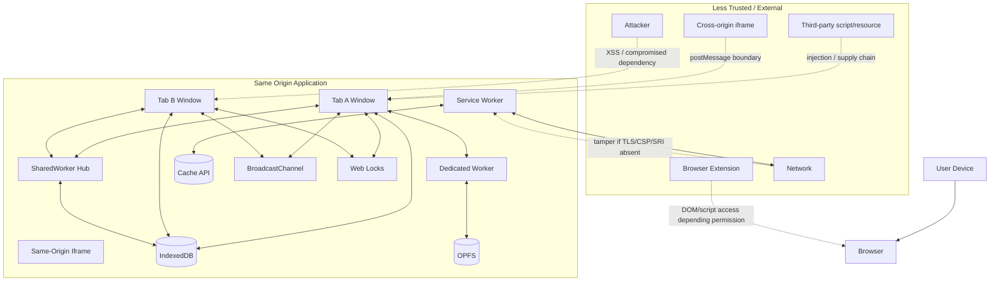
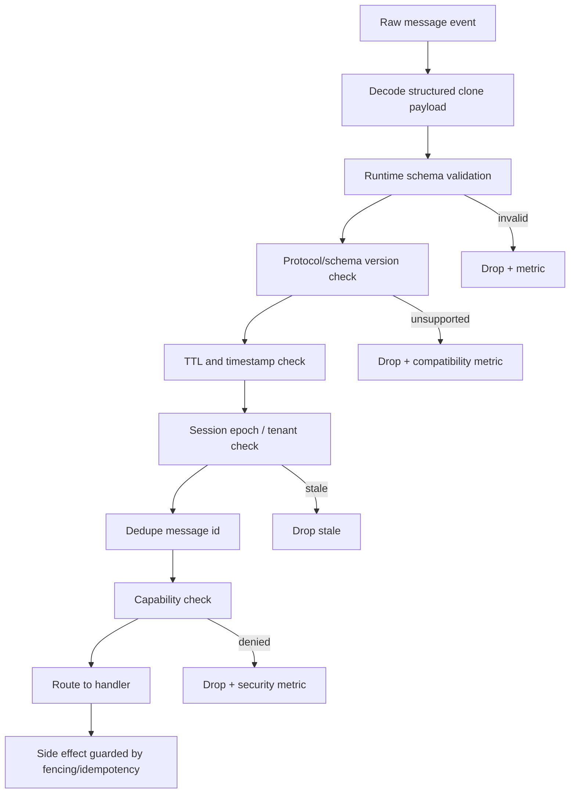
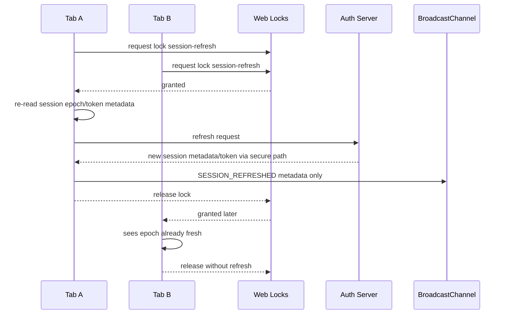
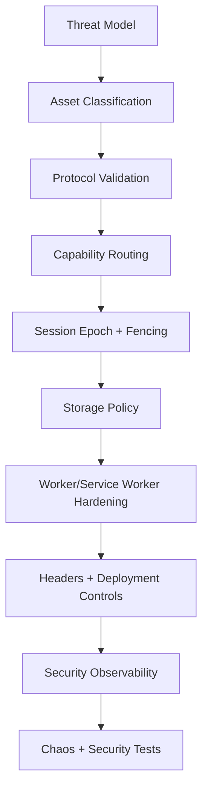

# Part 069 — Security Threat Model for Multi-Tab and Worker Systems

Kita sudah membangun banyak primitive: `postMessage`, `MessageChannel`, `BroadcastChannel`, `SharedWorker`, Service Worker, Web Locks, IndexedDB, Cache API, OPFS, SharedArrayBuffer, dan orchestration runtime.

Sekarang kita harus berhenti sebentar dan bertanya:

> Kalau attacker bisa menjalankan JavaScript di salah satu tab, iframe, extension-injected context, dependency yang compromised, atau versi lama aplikasi, bagian mana dari sistem orchestration kita berubah menjadi amplifier serangan?

Multi-tab orchestration memperbesar surface area. Yang semula hanya state lokal satu tab berubah menjadi sistem dengan:

- banyak execution context;
- banyak channel komunikasi;
- state durable di browser;
- background worker yang tidak terlihat user;
- Service Worker yang dapat memengaruhi network/cache;
- lifecycle yang tidak deterministik;
- kemampuan broadcast ke semua tab;
- shared memory jika memakai `SharedArrayBuffer`;
- dan potensi version skew ketika beberapa tab menjalankan bundle berbeda.

Security posture yang baik bukan berarti semua data dienkripsi di client lalu selesai. Security posture yang baik berarti setiap boundary punya asumsi eksplisit, invariant eksplisit, fallback eksplisit, dan audit trail yang cukup.

---

## 1. Mental Model: Browser-Orchestrated App Sebagai Mini Distributed System Tidak Terpercaya

Jangan melihat browser runtime sebagai satu aplikasi monolitik yang trusted.

Lebih akurat:



Security invariant utama:

> Same-origin communication is not same-trust communication.

Kalau satu same-origin tab terkena XSS, ia dapat mengirim message ke BroadcastChannel yang sama, membuka IndexedDB yang sama, mencoba lock yang sama, memanggil worker adapter yang sama, dan memicu banyak side effect. Karena itu, setiap context harus diperlakukan sebagai caller yang perlu divalidasi secara capability/protocol, bukan sebagai teman internal yang otomatis benar.

---

## 2. Security Boundary yang Sering Disalahpahami

| Boundary | Yang Dijamin | Yang Tidak Dijamin |
|---|---|---|
| Same-Origin Policy | Membatasi akses cross-origin default | Tidak membedakan tab legitimate vs tab compromised same-origin |
| BroadcastChannel | Message same-origin/storage-partition scoped | Tidak memberikan authentication antar sender |
| MessageChannel | Pipe eksplisit antara dua endpoint | Tidak otomatis memvalidasi semantic payload |
| SharedWorker | Hub same-origin untuk banyak context | Bukan sandbox trust antar client same-origin |
| Service Worker | Origin-scoped network/cache worker | Jika script compromised, impact persistent sampai update/unregister |
| Web Locks | Mutual exclusion same-origin | Bukan authorization; tab compromised bisa ikut meminta lock |
| IndexedDB | Transactional local database | Data dapat dibaca script same-origin yang compromised |
| Cache API | Request/Response store origin-scoped | Tidak tahu mana response sensitive kecuali app mengatur |
| OPFS | Origin-private file storage | Tetap dapat diakses script same-origin dengan permission runtime |
| SharedArrayBuffer | Shared memory antar agent | Tidak memberi isolation data; butuh COOP/COEP untuk enablement |
| CSP | Defense-in-depth resource policy | Tidak memperbaiki business-logic authorization yang salah |

Prinsipnya sederhana:

> Browser API memberi isolation primitive. Aplikasi tetap harus membangun authorization, validation, least privilege, dan recovery.

---

## 3. Asset Inventory

Threat model dimulai dari asset, bukan dari API.

| Asset | Contoh | Risiko Utama |
|---|---|---|
| Access token / refresh token | bearer token, rotating refresh token | token theft, refresh storm, replay |
| Session state | user id, tenant id, role, authz version | stale session, tenant bleed, revocation delay |
| Authorization decision cache | permission map, feature flags | privilege escalation jika stale |
| Outbox/offline queue | pending mutation, command payload | duplicate side effect, replay setelah logout |
| IndexedDB domain data | case data, draft, attachments metadata | local data exfiltration via XSS |
| OPFS payload | large files, generated reports, staged upload | sensitive artifact remains after logout |
| Cache API content | static assets, API responses | cache poisoning, private response leakage |
| Worker protocol | commands, task payloads | confused deputy, privilege escalation |
| Service Worker script/cache | routing/cache/update policy | persistent malicious behavior jika compromised |
| Broadcast messages | logout, invalidation, leader signal | spoofing, denial of service, stale event |
| Web Locks resource names | session-refresh, outbox-flush | lock starvation, hijacked ownership |
| Shared memory buffers | ring buffer, WASM memory | cross-context data leak within origin |
| Telemetry | trace id, URL, user/session metadata | accidental PII leakage |

Asset inventory harus menjawab tiga pertanyaan:

1. Siapa boleh membaca asset ini?
2. Siapa boleh memodifikasi asset ini?
3. Bagaimana asset ini dibersihkan, dirotasi, atau dianggap invalid?

Kalau pertanyaan ketiga tidak jelas, sistem akan gagal saat logout, tenant switch, revocation, atau rolling deploy.

---

## 4. Attacker Model

Untuk sistem browser orchestration, attacker tidak selalu berupa remote hacker penuh. Beberapa attacker realistis:

### 4.1 XSS in One Tab

Attacker dapat menjalankan JavaScript di satu tab same-origin.

Kemampuan potensial:

- membaca non-HttpOnly token yang tersimpan di JS-accessible storage;
- memanggil API app dengan credential user;
- mengirim `BroadcastChannel` message palsu;
- membaca/menulis IndexedDB;
- request Web Locks;
- mengirim command ke SharedWorker;
- register listener untuk message;
- menyalahgunakan worker task API;
- memicu Service Worker message;
- membuat outbox mutation;
- mengirim telemetry palsu.

Tidak boleh diasumsikan:

- BroadcastChannel message dari same-origin pasti legitimate;
- lock holder pasti code path legitimate;
- IndexedDB row pasti ditulis runtime sehat;
- worker client pasti UI resmi;
- offline queue entry pasti dibuat user action sah.

### 4.2 Compromised Dependency

Dependency front-end dapat menjalankan code di same execution context.

Dampaknya mirip XSS, tetapi sering lebih sulit dideteksi karena source-nya terlihat sebagai bundle resmi.

Mitigasi utama:

- dependency minimization;
- lockfile discipline;
- CSP;
- Subresource Integrity untuk third-party script klasik;
- build provenance;
- runtime capability isolation;
- tidak mengekspos orchestration API global ke `window` tanpa guard.

### 4.3 Malicious or Buggy Same-Origin Tab Version

Satu tab menjalankan bundle lama setelah deployment.

Dampak:

- protocol version mismatch;
- broadcast event lama;
- cache cleanup salah;
- migration blocked;
- stale authz cache;
- outbox replay dengan format lama.

Mitigasi:

- protocol version field;
- compatibility window;
- schema version per record;
- capability negotiation;
- forced upgrade safe point;
- stale bundle detection.

### 4.4 Cross-Origin Frame / Popup Confusion

Cross-origin iframe atau popup berkomunikasi dengan `window.postMessage`.

Risiko:

- menerima message tanpa origin check;
- memakai `targetOrigin: "*"` untuk data sensitive;
- confused deputy: app melakukan action internal atas instruksi frame luar;
- source window berubah karena navigation.

Mitigasi:

- exact `targetOrigin`;
- verify `event.origin` dan, bila relevan, `event.source`;
- message schema validation;
- explicit capability handshake;
- no token/message secret melalui cross-origin channel kecuali benar-benar dirancang.

### 4.5 Network and Cache Poisoning Scenario

Dengan HTTPS normal, network attacker tidak bebas memodifikasi response. Tetapi cache poisoning masih bisa terjadi melalui:

- bug Service Worker fetch handler;
- cache key terlalu longgar;
- caching response user-specific sebagai public artifact;
- tidak membedakan auth/session/tenant dalam cache policy;
- update manifest compromised;
- stale response diterima setelah session berubah.

Mitigasi:

- classify requests;
- default no-store untuk user-private API response;
- cache only immutable static artifacts kecuali ada policy eksplisit;
- cache namespace by app version;
- metadata manifest;
- response validation;
- cleanup on logout/session switch.

### 4.6 Local Device / Browser Profile Compromise

Jika attacker punya akses lokal ke device/browser profile, browser storage bisa dibaca tergantung OS/browser security posture.

Client-side storage tidak boleh dipakai sebagai vault untuk secret jangka panjang.

Mitigasi realistis:

- minimize sensitive storage;
- prefer HttpOnly Secure SameSite cookies untuk session token bila cocok dengan architecture;
- encrypt local payload hanya jika key management jelas;
- clear sensitive data on logout/revocation;
- short TTL;
- server-side revocation.

---

## 5. Threat Matrix per Primitive

### 5.1 BroadcastChannel

Threat:

- spoofed event;
- duplicate event;
- replayed stale event;
- broadcast storm;
- sensitive data leakage;
- version-skew crash;
- denial of service by flooding.

Rules:

1. Do not broadcast secrets.
2. Every message has `type`, `schemaVersion`, `sessionEpoch`, `senderId`, `messageId`, `createdAt`, and optional `fencingToken`.
3. Receiver validates schema before side effect.
4. Receiver rejects stale `sessionEpoch`.
5. Receiver dedupes by `messageId` for critical event.
6. Receiver treats broadcast as signal, not source of truth.

Example secure-ish envelope:

```ts
type BusEnvelope<T> = {
  protocol: "orchestration.bus";
  schemaVersion: 3;
  type: string;
  messageId: string;
  senderId: string;
  senderKind: "window" | "worker" | "shared-worker" | "service-worker";
  sessionEpoch: number;
  tenantId?: string;
  createdAtMs: number;
  ttlMs: number;
  traceId: string;
  fencingToken?: number;
  payload: T;
};

function shouldAcceptEnvelope(nowMs: number, current: SessionSnapshot, msg: BusEnvelope<unknown>) {
  if (msg.protocol !== "orchestration.bus") return false;
  if (msg.schemaVersion !== 3) return false;
  if (nowMs - msg.createdAtMs > msg.ttlMs) return false;
  if (msg.sessionEpoch !== current.sessionEpoch) return false;
  if (msg.tenantId && msg.tenantId !== current.tenantId) return false;
  return true;
}
```

Security note: this is not cryptographic authentication. If attacker runs same-origin JS, they can mimic the shape. The point is to prevent accidental/stale/mismatched messages and make malicious behavior observable. Real authority still belongs to server and local capability gates.

### 5.2 MessageChannel / MessagePort

Threat:

- port leaked to wrong context;
- unauthorized command routed through trusted port;
- unbounded in-flight requests;
- payload causing clone error or memory pressure;
- confused deputy: worker performs privileged action for unprivileged caller.

Rules:

1. Treat port connection as session requiring HELLO handshake.
2. Assign connection capability set.
3. Route command only if capability allows it.
4. Enforce payload byte budget.
5. Enforce in-flight limit.
6. Do not expose raw `MessagePort` globally.
7. Close port on logout/session switch.

Capability example:

```ts
type Capability =
  | "search:index:read"
  | "search:index:write"
  | "file:stage:write"
  | "outbox:flush"
  | "session:observe";

type Connection = {
  connectionId: string;
  tabId: string;
  sessionEpoch: number;
  capabilities: Set<Capability>;
};

function assertCapability(conn: Connection, cap: Capability) {
  if (!conn.capabilities.has(cap)) {
    throw new ProtocolError("CAPABILITY_DENIED", { cap });
  }
}
```

### 5.3 Dedicated Worker

Threat:

- worker used as CPU DoS engine;
- task queue memory explosion;
- stale worker result applied after session changes;
- sensitive payload remains in worker memory;
- task result sent to wrong owner;
- poison message crashes worker repeatedly.

Rules:

1. Worker owned by one page runtime generation.
2. Every task includes `ownerGeneration` and `sessionEpoch`.
3. Main thread drops stale result.
4. Worker drops stale/cancelled task if possible.
5. Bounded queue and byte budget.
6. Hard restart after fatal error with poison fingerprint detection.
7. On logout, terminate workers handling sensitive data.

### 5.4 SharedWorker

Threat:

- any same-origin tab can connect;
- client impersonation by claiming arbitrary `tabId`;
- hub becomes cross-tab confused deputy;
- stale clients remain in registry;
- memory leak via ports/subscriptions;
- protocol drift across app versions.

Rules:

1. Treat `tabId` as claim, not proof.
2. Use `connectionId` generated at connection time.
3. Require HELLO with app version, schema version, session epoch, and capabilities.
4. Hub should not hold secrets.
5. Hub should not perform security-sensitive server mutation unless receiver/server validates authority.
6. Drop connection on version/session mismatch.
7. Registry entries expire by heartbeat.

### 5.5 Service Worker

Threat:

- persistent malicious SW if attacker controls script once;
- cache poisoning;
- serving private response to wrong session;
- stale worker controls old clients;
- update trap and mixed versions;
- offline queue replay after logout;
- notification abuse;
- hidden network behavior not visible to page code.

Rules:

1. Keep SW small and boring.
2. Avoid storing long-lived secrets in SW global memory.
3. Classify every request before caching.
4. Do not cache authenticated API responses unless policy is explicit and keyed safely.
5. Version cache names.
6. Broadcast update availability, do not force destructive reload without safe point.
7. Cleanup private caches on logout/revocation.
8. Offline replay must check session epoch before send.
9. Use kill switch/version manifest if SW deployment goes wrong.

### 5.6 IndexedDB

Threat:

- XSS reads/writes data;
- corrupted records;
- stale schema;
- migration blocked by old tab;
- poisoned outbox command;
- sensitive data remains after logout;
- quota/eviction partial state.

Rules:

1. Validate records on read, not only on write.
2. Store `schemaVersion` per complex record.
3. Store `sessionEpoch`/`tenantId` for session-bound data.
4. Use transaction for related state changes.
5. Use recovery markers for multi-store workflows.
6. Use compaction and cleanup policy.
7. Keep secret material out unless unavoidable and threat model accepts it.

### 5.7 Cache API

Threat:

- private API response cached under generic key;
- stale artifact served after deploy;
- cache key ignores tenant/auth dimension;
- opaque response cached accidentally;
- sensitive cache not cleared on logout.

Rules:

1. Static immutable assets: cache-friendly.
2. Authenticated domain data: no-store by default.
3. If cached, include explicit metadata and invalidation policy.
4. Version cache namespace.
5. Validate manifest before promotion.
6. Delete private caches on logout.

### 5.8 OPFS

Threat:

- large sensitive files persist after session;
- metadata/payload mismatch;
- partial write after crash;
- file handle ownership confusion;
- local storage quota exhaustion.

Rules:

1. Treat OPFS as data-plane, not metadata truth.
2. IndexedDB manifest is source of truth.
3. Use staged write + manifest promotion.
4. Cleanup orphan files.
5. Store session/tenant boundary in manifest.
6. Never assume file exists because manifest says so; verify on open.

### 5.9 SharedArrayBuffer / Atomics

Threat:

- accidental data leakage across worker tasks;
- stale reader reads old bytes;
- side-channel concerns that require cross-origin isolation;
- race bugs become security bugs;
- buffer reuse without zeroing sensitive data.

Rules:

1. Only enable when performance need is real.
2. Enforce COOP/COEP readiness.
3. Use explicit binary layout.
4. Include generation/session epoch in control header.
5. Zero sensitive regions before reuse.
6. Add reset protocol.
7. Fall back to transferables if isolation unavailable.

---

## 6. STRIDE Applied to Browser Orchestration

| STRIDE | Browser-Orchestration Example | Control |
|---|---|---|
| Spoofing | Fake BroadcastChannel logout/update/leader message | Schema/version/session validation, capability routing, server-side authority |
| Tampering | XSS modifies IndexedDB outbox command | Record validation, idempotency, server authz, command signature only if key model works |
| Repudiation | Tab claims another tab triggered destructive cleanup | Trace envelope, structured logs, source context id |
| Information Disclosure | Token or private payload broadcast to all tabs | No secrets on broadcast, storage minimization, HttpOnly cookies where applicable |
| Denial of Service | Flood worker queue or lock starvation | Bounded queues, rate limit, timeout, lock abort, circuit breaker |
| Elevation of Privilege | Unprivileged iframe asks worker hub to flush sensitive queue | Capability model, origin/source checks, server-side authorization |

STRIDE membantu memastikan threat model tidak hanya membahas XSS. Dalam orchestration, DoS dan confused deputy sering lebih mudah terjadi daripada token theft langsung.

---

## 7. Security Invariants

Gunakan invariant, bukan nasihat abstrak.

### Invariant 1 — No Secret Broadcast

> Access token, refresh token, CSRF secret, private key, raw credential, or one-time secret must never be sent through BroadcastChannel, storage event, telemetry, or cross-tab debug snapshot.

Valid broadcast:

```json
{
  "type": "SESSION_REFRESHED",
  "sessionEpoch": 42,
  "authzVersion": 1208,
  "reason": "refresh-success"
}
```

Invalid broadcast:

```json
{
  "type": "SESSION_REFRESHED",
  "accessToken": "eyJ...",
  "refreshToken": "..."
}
```

### Invariant 2 — Server Remains Authority

> Browser coordination may reduce duplicate work, but must not become source of authorization truth.

Client may decide:

- which tab refreshes token;
- which tab flushes outbox;
- whether local state is stale;
- whether UI needs revalidation.

Server must decide:

- whether token is valid;
- whether user may perform mutation;
- whether idempotency key already committed;
- whether revision conflict exists;
- whether session is revoked.

### Invariant 3 — Every Durable Command Has Identity

Outbox command must have:

- command id;
- idempotency key;
- session epoch;
- tenant id;
- actor/user id if applicable;
- schema version;
- created time;
- dependency/revision precondition;
- retry state.

Without identity, retry is unsafe.

### Invariant 4 — Every Cross-Context Message Is Validated at Receiver

Sender validation is not enough.

Receiver must check:

- protocol;
- type;
- schema version;
- payload shape;
- session epoch;
- tenant boundary;
- capability;
- TTL;
- dedupe id;
- fencing token when side effect matters.

### Invariant 5 — Stale Result Cannot Mutate Current State

Every async result from worker/network/storage must be fenced by runtime generation/session epoch.

```ts
function applyWorkerResult(result: WorkerResult, current: RuntimeState) {
  if (result.ownerGeneration !== current.ownerGeneration) return;
  if (result.sessionEpoch !== current.sessionEpoch) return;
  if (result.requestId !== current.activeRequests.get(result.taskKey)) return;

  commit(result.payload);
}
```

### Invariant 6 — Logout Is a Transaction, Not a Redirect

Logout must:

- mark session revoked locally;
- abort in-flight protected requests;
- cancel/terminate sensitive workers;
- clear session-bound memory;
- clear session-bound IndexedDB rows;
- clear private OPFS payloads;
- delete private caches;
- notify same-origin contexts with metadata-only event;
- prevent offline queue replay from previous session;
- revalidate bfcache/restored pages.

### Invariant 7 — Service Worker Must Be Small, Versioned, and Recoverable

Service Worker should avoid becoming unobservable business runtime.

Keep it responsible for:

- fetch classification;
- static artifact cache;
- offline routing if required;
- update notification;
- narrow background sync if supported;
- notification click routing.

Avoid stuffing it with:

- complex authz logic;
- long-lived domain state;
- large secret handling;
- unversioned cache mutation;
- hidden business workflows that UI cannot reconcile.

---

## 8. Message Validation Layer

A production orchestration system should centralize message validation.



Example:

```ts
type ValidationResult<T> =
  | { ok: true; value: T }
  | { ok: false; reason: string; severity: "debug" | "warn" | "security" };

function validateMessage<T>(raw: unknown, ctx: ReceiverContext): ValidationResult<Envelope<T>> {
  const env = parseEnvelope(raw);
  if (!env.ok) return { ok: false, reason: "bad-envelope", severity: "warn" };

  if (env.value.protocol !== ctx.protocol) {
    return { ok: false, reason: "bad-protocol", severity: "warn" };
  }

  if (!ctx.supportedVersions.has(env.value.schemaVersion)) {
    return { ok: false, reason: "unsupported-version", severity: "warn" };
  }

  if (Date.now() - env.value.createdAtMs > env.value.ttlMs) {
    return { ok: false, reason: "expired", severity: "debug" };
  }

  if (env.value.sessionEpoch !== ctx.sessionEpoch) {
    return { ok: false, reason: "stale-session", severity: "debug" };
  }

  if (ctx.dedupe.has(env.value.messageId)) {
    return { ok: false, reason: "duplicate", severity: "debug" };
  }

  return { ok: true, value: env.value };
}
```

---

## 9. Capability-Based Runtime API

Jangan expose API orchestration sebagai object global tanpa authority model.

Bad:

```ts
window.orchestrator.flushOutbox();
window.orchestrator.refreshToken();
window.orchestrator.clearAllCaches();
```

Better:

```ts
type RuntimeCommand =
  | { type: "outbox.flush"; reason: string }
  | { type: "session.refresh"; deadlineMs: number }
  | { type: "cache.invalidate"; scope: "static" | "domain"; version: string };

type RuntimePrincipal = {
  principalKind: "ui" | "service-worker" | "shared-worker" | "test-harness";
  sessionEpoch: number;
  tenantId?: string;
  capabilities: Set<Capability>;
};

function executeRuntimeCommand(principal: RuntimePrincipal, cmd: RuntimeCommand) {
  const required = capabilityFor(cmd);
  if (!principal.capabilities.has(required)) {
    throw new ProtocolError("CAPABILITY_DENIED");
  }

  return routeCommand(cmd);
}
```

Capability routing does not stop a full XSS running inside privileged UI code. But it reduces accidental confused-deputy paths, makes tests precise, and creates a place to insert future hardening.

---

## 10. Auth and Session Threat Model

### 10.1 Token Storage

Choices:

| Strategy | Benefit | Risk |
|---|---|---|
| Access token in JS memory | Not persisted | lost on reload; XSS can read while active |
| Access token in localStorage | easy | XSS-readable, persistent |
| Refresh token in localStorage | easy | high risk, long-lived theft impact |
| HttpOnly Secure SameSite cookie | JS cannot read token | CSRF/session architecture considerations |
| IndexedDB token storage | structured | still JS-readable under XSS |
| Service Worker memory | hidden from page direct read | still same-origin script/SW lifecycle risks; not durable guarantee |

For high-value apps, avoid persistent JS-readable refresh tokens unless threat model explicitly accepts it.

### 10.2 Refresh Orchestration Security

Threat:

- multiple tabs use same rotating refresh token;
- stale tab overwrites fresh token;
- compromised tab triggers refresh repeatedly;
- token value broadcast to all tabs;
- 401 retry loops cause DoS.

Controls:

- Web Locks for local single refresh owner;
- server-side refresh token rotation with replay detection;
- metadata-only broadcast after refresh;
- re-read token/session source after lock acquired;
- bounded 401 retry;
- stale epoch guard;
- session revoked marker.

Sequence:



### 10.3 Logout and Revocation

Logout message is not enough. It can be lost.

Controls:

- durable revocation marker;
- memory cleanup;
- storage cleanup;
- worker termination;
- in-flight request abort;
- Service Worker/private cache cleanup;
- startup check;
- visible/focus revalidation;
- server-side session invalidation.

---

## 11. Storage Security Policy

Define storage by sensitivity.

| Class | Examples | Storage Policy |
|---|---|---|
| Public static artifact | JS/CSS/font/app shell | Cache API versioned cache OK |
| Public derived data | non-sensitive index, static taxonomy | IndexedDB/Cache OK with version |
| User-private domain data | case drafts, inbox, profile | IndexedDB allowed only with cleanup and TTL |
| Sensitive secret | refresh token, private key | avoid JS-readable persistent storage |
| Large user-private blob | upload staging, report | OPFS with manifest, TTL, cleanup |
| Security marker | revoked session epoch | small durable marker, no secret |

Storage cleanup should be scoped:

```ts
type CleanupScope = {
  sessionEpoch: number;
  tenantId?: string;
  reason: "logout" | "revoked" | "tenant-switch" | "forced-upgrade";
};

async function cleanupSessionBoundStorage(scope: CleanupScope) {
  await idb.transaction("rw", ["outbox", "drafts", "sessionMarkers"], async tx => {
    await tx.outbox.deleteWhere({ sessionEpoch: scope.sessionEpoch });
    await tx.drafts.deleteWhere({ tenantId: scope.tenantId });
    await tx.sessionMarkers.put({ sessionEpoch: scope.sessionEpoch, revoked: true });
  });

  await privateCache.deleteForTenant(scope.tenantId);
  await opfsGc.deleteSessionPayloads(scope.sessionEpoch);
}
```

---

## 12. Service Worker Security Hardening

Service Worker deserves special treatment because it can persist beyond the page lifecycle.

### 12.1 Keep Fetch Handler Narrow

Bad pattern:

```ts
self.addEventListener("fetch", event => {
  event.respondWith(cacheEverything(event.request));
});
```

Better:

```ts
self.addEventListener("fetch", event => {
  const policy = classifyRequest(event.request);

  if (policy.kind === "static-immutable") {
    event.respondWith(cacheFirstStatic(event.request, policy));
    return;
  }

  if (policy.kind === "api-private") {
    event.respondWith(networkOnly(event.request));
    return;
  }

  if (policy.kind === "navigation") {
    event.respondWith(navigationStrategy(event.request));
    return;
  }

  event.respondWith(fetch(event.request));
});
```

### 12.2 Cache Key Must Include Security Dimensions Only When Safe

For private data, the safest cache policy is usually: do not cache.

If caching is required:

- key by tenant/session-aware metadata;
- encrypt only if key management makes sense;
- enforce TTL;
- validate authz version;
- clear on logout;
- never serve private cached data to unknown session.

### 12.3 Update and Kill Switch

A bad Service Worker can be sticky.

Controls:

- version manifest fetched network-first;
- kill switch path not intercepted or with bypass header;
- minimal install/activate logic;
- cache migration guarded;
- monitoring of active SW version;
- forced update safe point.

---

## 13. CSP, SRI, Trusted Types, and Headers

Security headers are not decoration. They constrain how scripts/workers/resources load and reduce XSS blast radius.

Minimum production direction:

```http
Content-Security-Policy:
  default-src 'self';
  script-src 'self' 'nonce-<server-generated>' 'strict-dynamic';
  worker-src 'self';
  connect-src 'self' https://api.example.com;
  img-src 'self' data: https:;
  style-src 'self' 'unsafe-inline';
  object-src 'none';
  base-uri 'none';
  frame-ancestors 'none';
  report-uri https://csp-report.example.com/report;
```

Adjust to your actual app. Do not cargo-cult.

For worker-heavy systems, `worker-src` is critical because it controls allowed Worker, SharedWorker, and ServiceWorker script sources. If you generate workers from `blob:` URL, CSP must explicitly allow it, but allowing `blob:` broadens attack surface. Prefer static worker entry files when possible.

Trusted Types can help reduce DOM XSS sinks in Chromium-based browsers, especially in large apps with many teams.

Subresource Integrity helps when loading third-party scripts via `<script src="...">`, but it does not solve all dynamic import or package supply-chain problems.

---

## 14. Cross-Origin Isolation Security Checklist

If using `SharedArrayBuffer`:

Required direction:

```http
Cross-Origin-Opener-Policy: same-origin
Cross-Origin-Embedder-Policy: require-corp
```

Then every embedded cross-origin resource must be compatible via CORS or CORP, otherwise loading can break.

Checklist:

- all scripts compatible;
- all WASM/resources compatible;
- CDN sends correct headers;
- image/font/media resources checked;
- OAuth popup flow tested;
- analytics/third-party scripts tested;
- Service Worker cache does not serve header-incompatible stale resource;
- fallback path exists when `crossOriginIsolated === false`.

Runtime guard:

```ts
export function supportsSharedMemoryRuntime() {
  return typeof SharedArrayBuffer !== "undefined" && globalThis.crossOriginIsolated === true;
}
```

---

## 15. Threat-Driven Testing

Security controls need tests.

### 15.1 Protocol Fuzzing

Test invalid messages:

- missing `type`;
- wrong `schemaVersion`;
- unknown `sessionEpoch`;
- oversized payload;
- cyclic payload if transport allows clone;
- invalid `tenantId`;
- duplicate `messageId`;
- stale `fencingToken`;
- malformed command.

Expected result:

- no side effect;
- metric emitted;
- no crash loop;
- no unbounded memory growth.

### 15.2 XSS Simulation Harness

Create a test-only malicious same-origin script that attempts:

- send fake logout;
- send fake refresh success;
- insert outbox command;
- request Web Lock repeatedly;
- flood BroadcastChannel;
- connect to SharedWorker with invalid capability;
- poison Cache API entry;
- open IndexedDB old version and block migration.

The point is not to prove XSS harmless. XSS is serious. The point is to ensure orchestration does not multiply damage accidentally.

### 15.3 Session Boundary Tests

Test:

- logout while worker task running;
- logout while outbox replaying;
- logout while Service Worker fetch in flight;
- tenant switch with cached data;
- bfcache restore after revocation;
- refresh success arrives after logout;
- old tab broadcasts stale session state.

Invariant: stale context cannot mutate current session state.

---

## 16. Security Observability

Emit security-relevant metrics without leaking sensitive data.

Useful counters:

- invalid message by reason;
- capability denied;
- stale session message dropped;
- stale fencing token dropped;
- oversized payload rejected;
- worker poison task detected;
- lock timeout;
- migration blocked by old version;
- cache private response prevented;
- logout cleanup failed;
- Service Worker version mismatch;
- CSP violation reports;
- cross-origin isolation unavailable.

Example event:

```ts
securityTelemetry.emit({
  event: "orchestration.message_rejected",
  reason: "stale-session",
  receiverKind: "shared-worker",
  messageType: safeMessageType,
  schemaVersion,
  appVersion,
  traceId,
});
```

Do not log:

- token;
- raw authorization header;
- private payload;
- full user-entered document;
- sensitive URL query params;
- file content;
- unredacted IndexedDB record.

---

## 17. Production Security Checklist

### Message Channels

- [ ] All messages have schema version.
- [ ] All receivers validate runtime shape.
- [ ] All side-effect messages include `messageId`.
- [ ] Stale `sessionEpoch` is dropped.
- [ ] BroadcastChannel never carries tokens/secrets.
- [ ] Cross-origin `postMessage` uses exact `targetOrigin`.
- [ ] Cross-origin receiver verifies `event.origin` and expected source.

### Workers

- [ ] Worker queue bounded.
- [ ] Worker payload byte budget enforced.
- [ ] Worker result fenced by owner generation/session epoch.
- [ ] Worker terminated on logout if it touched sensitive data.
- [ ] Worker errors and `messageerror` observed.
- [ ] Poison task detection exists.

### SharedWorker

- [ ] HELLO handshake required.
- [ ] Connection registry expires stale clients.
- [ ] Capabilities assigned per connection.
- [ ] Hub stores no long-lived secret.
- [ ] Protocol version mismatch handled.

### Service Worker

- [ ] Fetch handler classifies requests.
- [ ] Private API responses are not cached by default.
- [ ] Cache namespace versioned.
- [ ] Update flow tested across multiple tabs.
- [ ] Kill switch/runbook exists.
- [ ] Logout cleanup includes private caches.

### Storage

- [ ] Sensitive data inventory exists.
- [ ] Storage records include session/tenant/version where needed.
- [ ] Records validated on read.
- [ ] Offline queue commands have idempotency key.
- [ ] Logout/revocation cleanup tested.
- [ ] Migration handles blocked old tabs.

### Headers and Deployment

- [ ] CSP includes explicit `worker-src`.
- [ ] CSP report endpoint monitored.
- [ ] Third-party scripts minimized.
- [ ] Cross-origin isolation checked if SharedArrayBuffer used.
- [ ] Service Worker script served with correct cache policy.
- [ ] Source maps protected according to org policy.

---

## 18. Final Mental Model

Security for multi-tab and worker systems is not achieved by one API.

It is achieved by layered invariants:



The top 1% engineer does not ask, "Is BroadcastChannel secure?"

They ask:

- What asset crosses this channel?
- Who is allowed to cause this side effect?
- What happens if the sender is stale?
- What happens if the message is duplicated?
- What happens after logout?
- What happens if an old tab runs old code?
- What happens if a Service Worker is stuck?
- What can the server verify?
- What can be observed when this fails?

That is the level of reasoning needed for browser-side orchestration that survives production.

---

## References

- MDN — `Window.postMessage()`: https://developer.mozilla.org/en-US/docs/Web/API/Window/postMessage
- MDN — Content-Security-Policy `worker-src`: https://developer.mozilla.org/en-US/docs/Web/HTTP/Reference/Headers/Content-Security-Policy/worker-src
- MDN — Broadcast Channel API: https://developer.mozilla.org/en-US/docs/Web/API/Broadcast_Channel_API
- MDN — Worker constructor: https://developer.mozilla.org/en-US/docs/Web/API/Worker/Worker
- MDN — Transferable objects: https://developer.mozilla.org/en-US/docs/Web/API/Web_Workers_API/Transferable_objects
- OWASP — HTML5 Security Cheat Sheet: https://cheatsheetseries.owasp.org/cheatsheets/HTML5_Security_Cheat_Sheet.html
- OWASP — XSS Prevention Cheat Sheet: https://cheatsheetseries.owasp.org/cheatsheets/Cross_Site_Scripting_Prevention_Cheat_Sheet.html
- OWASP — Content Security Policy Cheat Sheet: https://cheatsheetseries.owasp.org/cheatsheets/Content_Security_Policy_Cheat_Sheet.html
