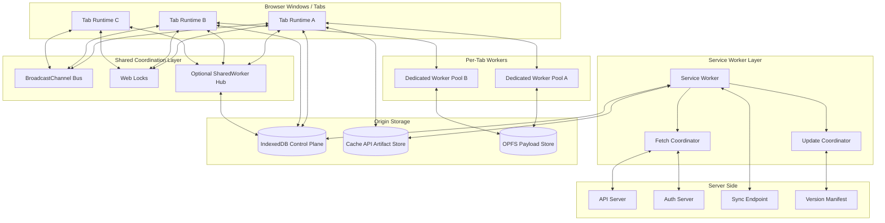
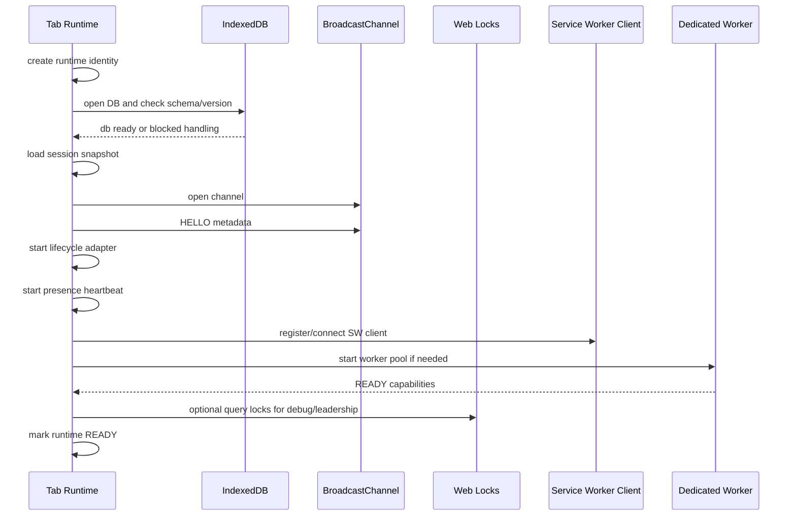
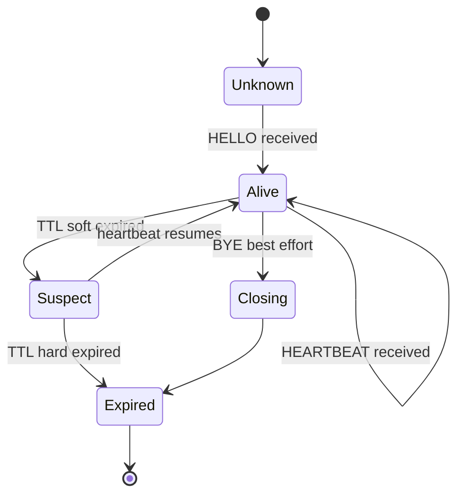
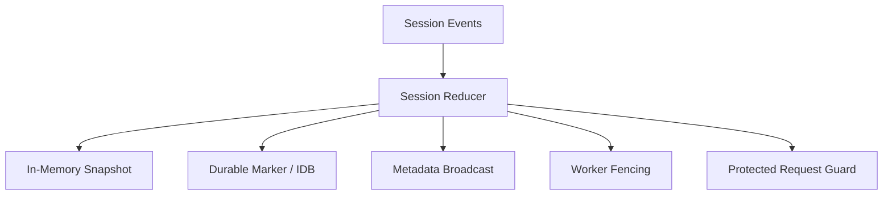
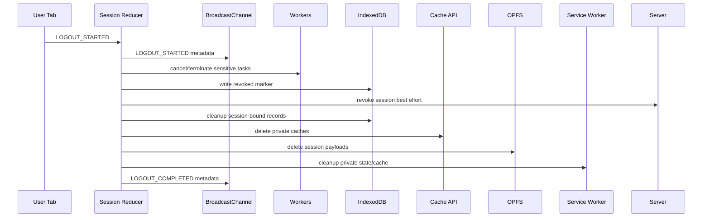
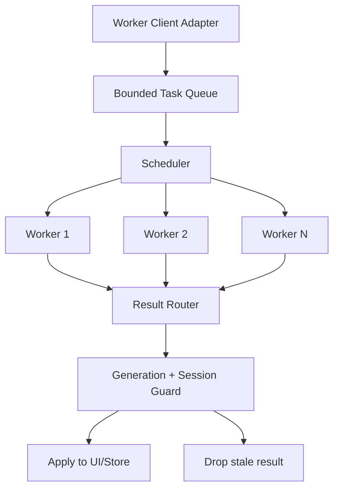
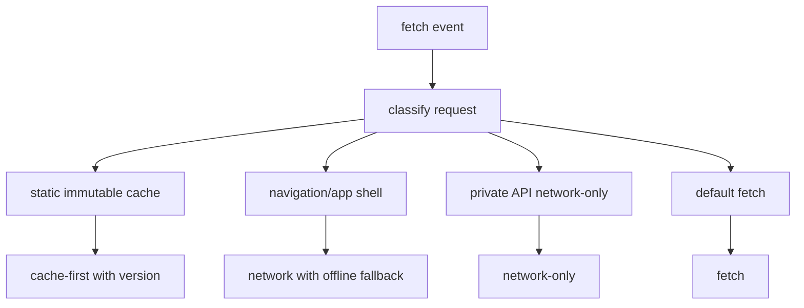
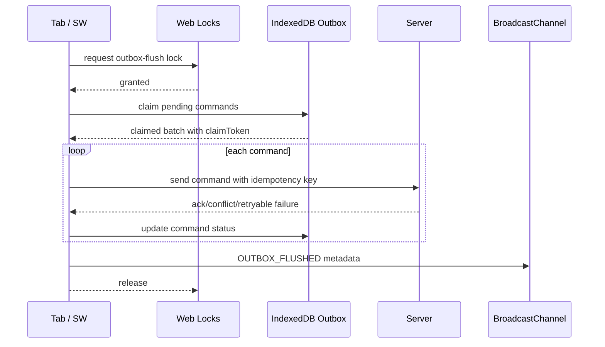
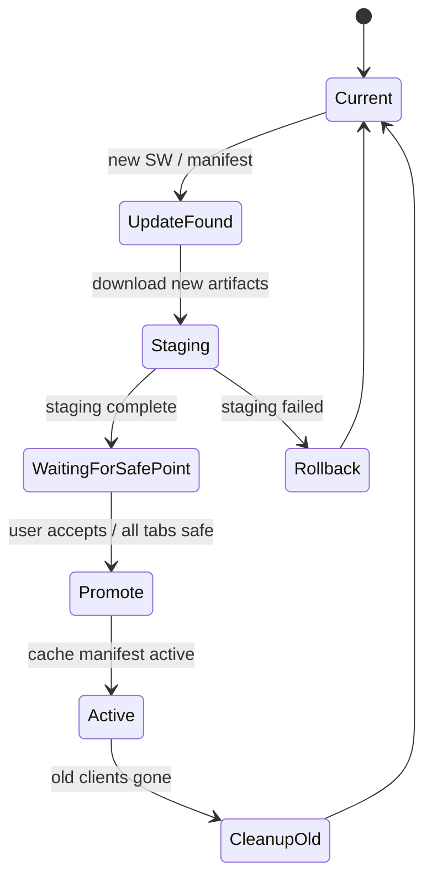
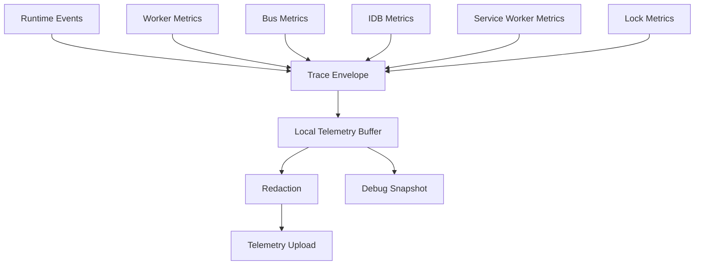

# Part 070 — Reference Architecture: Production Multi-Tab Orchestrator

Kita sudah membahas primitive satu per satu. Sekarang waktunya menyatukan semuanya menjadi satu reference architecture.

Tujuan part ini bukan membuat framework siap pakai. Tujuannya adalah memberi blueprint yang cukup jelas sehingga kamu bisa membangun runtime orchestration sendiri sesuai domain aplikasi.

Kita akan mendesain sistem browser-side untuk aplikasi kompleks, misalnya:

- regulatory case management;
- document-heavy workflow;
- offline-capable dashboard;
- multi-tab admin console;
- analytics console dengan worker-heavy computation;
- aplikasi enterprise dengan auth refresh, tenant switch, background sync, dan cache update.

Masalah yang harus diselesaikan:

1. Banyak tab terbuka untuk user/session yang sama.
2. Tidak boleh terjadi refresh-token storm.
3. Tidak boleh ada duplicate background sync.
4. Tidak boleh ada stale session state setelah logout/revocation.
5. Worker harus mempercepat, bukan membuat memory/CPU collapse.
6. Cache/static asset harus update aman lintas tab.
7. Offline queue harus replay dengan idempotency.
8. Semua channel harus observable dan debuggable.
9. Sistem harus survive tab close, reload, freeze, crash, old bundle, and Service Worker update.

---

## 1. Architecture Overview



Core rule:

> Treat browser orchestration as a local distributed runtime with explicit control-plane, data-plane, ownership, fencing, and recovery.

---

## 2. Component Responsibilities

| Component | Responsibility | Must Not Do |
|---|---|---|
| Tab Runtime | UI state, session reducer, lifecycle adapter, worker client, local intent | store long-lived secrets in global objects; assume it is only tab |
| Dedicated Worker Pool | CPU/memory-heavy work owned by one tab | perform cross-tab leadership; hold session authority |
| BroadcastChannel Bus | volatile signal: invalidation, presence, session metadata, update notice | carry secrets; act as durable source of truth |
| Web Locks | single-owner critical sections: refresh, outbox flush, cache promotion | replace server-side idempotency/authz |
| SharedWorker Hub | optional live same-origin coordination hub | become durable storage or auth authority |
| Service Worker | fetch/cache/update/offline integration | implement hidden complex business workflows without reconciliation |
| IndexedDB | control-plane durable state: outbox, event log, metadata, leases | store raw large files or secrets by default |
| Cache API | versioned static artifacts and explicitly safe responses | cache user-private API responses casually |
| OPFS | large payload/data-plane storage | become source of metadata truth |
| Backend | authorization, idempotency, conflict resolution, session validity | rely on browser coordination for correctness |

---

## 3. Control Plane vs Data Plane

This distinction keeps architecture clean.

### Control Plane

Small structured metadata:

- session epoch;
- tenant id;
- tab registry;
- lock/lease records;
- outbox command metadata;
- cache manifest;
- OPFS file manifest;
- projection sequence;
- worker task status;
- version compatibility;
- telemetry trace ids.

Best storage:

- memory for immediate runtime state;
- IndexedDB for durable control-plane state;
- BroadcastChannel for volatile invalidation signal;
- Web Locks for ownership.

### Data Plane

Large bytes or heavy artifacts:

- files;
- compressed payload;
- parsed index;
- generated report;
- static assets;
- WASM module artifact;
- image/canvas data;
- imported CSV chunks.

Best storage/movement:

- OPFS for origin-private large payload;
- Cache API for Request/Response artifacts;
- transferables for one-owner binary transfer;
- SharedArrayBuffer only when isolation and performance justify it.

Architecture smell:

> If BroadcastChannel carries megabytes, control-plane/data-plane boundary is broken.

---

## 4. Runtime Modules

A clean runtime can be organized as modules:

```txt
src/orchestration/
  runtime/
    createBrowserRuntime.ts
    RuntimeContext.ts
    RuntimeIdentity.ts
    lifecycle.ts
  protocol/
    envelope.ts
    validation.ts
    messageTypes.ts
    errors.ts
  bus/
    BroadcastBus.ts
    StorageEventBus.ts
    CompositeBus.ts
  locks/
    WebLockManager.ts
    IndexedDbLeaseManager.ts
  session/
    SessionStore.ts
    SessionReducer.ts
    TokenRefreshCoordinator.ts
    LogoutCoordinator.ts
  tabs/
    TabRegistry.ts
    Heartbeat.ts
    PresenceStore.ts
  workers/
    WorkerClient.ts
    WorkerPool.ts
    TaskQueue.ts
    taskProtocol.ts
  shared-worker/
    HubClient.ts
    hub.worker.ts
  service-worker/
    sw.ts
    swClient.ts
    cachePolicy.ts
    updateProtocol.ts
  storage/
    db.ts
    OutboxRepository.ts
    EventLogRepository.ts
    CacheManifestRepository.ts
    OpfsManifestRepository.ts
  sync/
    OutboxCoordinator.ts
    ReplayEngine.ts
  observability/
    telemetry.ts
    debugSnapshot.ts
    trace.ts
```

Do not start with this full tree for a small app. But for a serious browser-side runtime, separating protocol, ownership, session, storage, worker, and observability prevents accidental coupling.

---

## 5. Runtime Identity

Every context gets identity.

```ts
type RuntimeIdentity = {
  appVersion: string;
  buildId: string;
  protocolVersion: number;
  contextKind: "window" | "dedicated-worker" | "shared-worker" | "service-worker";
  tabId?: string;
  connectionId?: string;
  workerId?: string;
  serviceWorkerVersion?: string;
  runtimeGeneration: string;
  startedAtMs: number;
};
```

Rules:

- `tabId` survives reload only if your product needs same logical tab continuity.
- `connectionId` changes per connection.
- `runtimeGeneration` changes per boot/reload.
- `appVersion` and `protocolVersion` appear in every HELLO.
- `sessionEpoch` is not identity; it is session boundary.

---

## 6. Message Envelope

All internal cross-context messages use one envelope shape.

```ts
type Envelope<TPayload> = {
  protocol: "browser-orchestrator";
  protocolVersion: 1;
  messageId: string;
  traceId: string;
  causationId?: string;
  correlationId?: string;

  type: string;
  createdAtMs: number;
  ttlMs: number;

  sender: RuntimeIdentity;
  session?: {
    sessionEpoch: number;
    userIdHash?: string;
    tenantId?: string;
    authzVersion?: number;
  };

  fencing?: {
    resource: string;
    token: number;
  };

  payload: TPayload;
};
```

Why envelope matters:

- traceability;
- stale-message rejection;
- protocol migration;
- dedupe;
- correlation request/response;
- security validation;
- debugging replay.

---

## 7. Startup Sequence



Startup invariant:

> UI may render shell early, but protected side effects wait until session/storage/protocol runtime is ready.

---

## 8. Tab Registry and Presence

Tab registry is not truth. It is a liveness estimate.

```ts
type TabPresence = {
  tabId: string;
  runtimeGeneration: string;
  appVersion: string;
  protocolVersion: number;
  sessionEpoch?: number;
  tenantId?: string;
  visibilityState: DocumentVisibilityState;
  lifecycleState: "active" | "hidden" | "frozen-suspected" | "closing";
  lastSeenMonotonicMs: number;
  lastSeenWallMs: number;
  capabilities: string[];
};
```

Flow:



Rules:

- `BYE` is optimization, not correctness.
- Hidden tabs may send heartbeats less reliably.
- Frozen/discarded tabs may stop completely.
- Leadership must not depend on perfect presence.
- Presence snapshot should be queryable for debugging.

---

## 9. Session State Architecture

Session state must be a reducer, not random event handlers.



Session events:

```ts
type SessionEvent =
  | { type: "SESSION_BOOTSTRAPPED"; snapshot: SessionSnapshot }
  | { type: "SESSION_REFRESH_STARTED"; ownerId: string }
  | { type: "SESSION_REFRESH_SUCCEEDED"; epoch: number; authzVersion: number }
  | { type: "SESSION_REFRESH_FAILED"; reason: string }
  | { type: "SESSION_REVOKED"; epoch: number; reason: string }
  | { type: "LOGOUT_STARTED"; reason: string }
  | { type: "LOGOUT_COMPLETED"; epoch: number }
  | { type: "TENANT_SWITCHED"; tenantId: string; epoch: number };
```

Reducer invariant:

- epoch only moves forward;
- revoked session cannot become authenticated again without bootstrap;
- refresh success for old epoch is ignored;
- worker result for old epoch is ignored;
- protected request checks snapshot before send and before apply response.

---

## 10. Token Refresh Coordinator

Goal:

> At most one local browser context attempts refresh for a session at a time, while server still enforces token validity and replay detection.

```ts
async function refreshSession(reason: string) {
  return locks.withExclusive("session-refresh", { timeoutMs: 10_000 }, async () => {
    const before = await sessionStore.read();

    if (!before.needsRefresh()) {
      return before;
    }

    sessionReducer.dispatch({ type: "SESSION_REFRESH_STARTED", ownerId: runtime.id });

    const response = await authApi.refresh({
      sessionEpoch: before.epoch,
      reason,
      idempotencyKey: createIdempotencyKey("refresh", before.epoch),
    });

    const latest = await sessionStore.read();
    if (latest.epoch !== before.epoch) {
      return latest; // stale refresh response
    }

    await sessionStore.commitRefresh(response);

    bus.publish("SESSION_REFRESHED", {
      sessionEpoch: response.epoch,
      authzVersion: response.authzVersion,
    });

    return response;
  });
}
```

Refresh design choices:

- Web Lock reduces local duplicate refresh.
- Server token rotation remains correctness authority.
- Broadcast carries metadata only.
- Follower tabs re-read source of truth, not trust payload blindly.
- Timeout avoids lock wait hanging forever.

---

## 11. Logout Coordinator

Logout is a cross-runtime transaction.



Invariant:

> If logout cleanup fails halfway, startup/revalidation must still observe revoked marker and prevent stale replay.

Pseudo-code:

```ts
async function logout(reason: LogoutReason) {
  const snapshot = sessionStore.current();

  sessionReducer.dispatch({ type: "LOGOUT_STARTED", reason });
  bus.publish("SESSION_LOGOUT_STARTED", { sessionEpoch: snapshot.epoch, reason });

  requestRegistry.abortProtectedRequests(snapshot.epoch);
  workerRuntime.cancelSessionTasks(snapshot.epoch);

  await idb.writeRevokedMarker(snapshot.epoch, reason);

  await Promise.allSettled([
    authApi.revokeBestEffort(snapshot),
    outboxRepository.disableSession(snapshot.epoch),
    cacheRuntime.deletePrivateCaches(snapshot),
    opfsRuntime.deleteSessionPayloads(snapshot.epoch),
    serviceWorkerClient.cleanupSession(snapshot),
  ]);

  sessionReducer.dispatch({ type: "LOGOUT_COMPLETED", epoch: snapshot.epoch });
  bus.publish("SESSION_LOGOUT_COMPLETED", { sessionEpoch: snapshot.epoch });
}
```

---

## 12. Worker Pool Architecture



Worker task envelope:

```ts
type WorkerTask<T> = {
  taskId: string;
  taskType: string;
  ownerRuntimeGeneration: string;
  sessionEpoch?: number;
  priority: "user-blocking" | "user-visible" | "background";
  deadlineMs?: number;
  maxResultBytes?: number;
  transfer?: Transferable[];
  payload: T;
};
```

Worker runtime policies:

- bounded queue;
- max in-flight per worker;
- max payload bytes;
- cancellation via task id;
- hard restart after fatal failure;
- poison task fingerprint;
- result stale guard;
- metrics for queue wait and execution duration.

When to use worker pool:

- parsing large files;
- indexing/search;
- diffing;
- compression;
- PDF/image processing;
- WASM compute;
- projection rebuild.

When not to use worker pool:

- small async network request;
- trivial mapping;
- DOM-dependent logic;
- work dominated by IndexedDB/network latency;
- tasks requiring shared mutable UI state.

---

## 13. SharedWorker Hub Optional Layer

SharedWorker is optional. Use it when there is clear benefit:

- many tabs need one live in-memory hub;
- direct routing between tabs matters;
- shared WebSocket ownership is required;
- central subscription registry simplifies design;
- browser support/deployment constraints are acceptable.

SharedWorker hub API:

```ts
type HubCommand =
  | { type: "HELLO"; tabId: string; appVersion: string; protocolVersion: number; sessionEpoch?: number }
  | { type: "SUBSCRIBE"; topic: string }
  | { type: "UNSUBSCRIBE"; topic: string }
  | { type: "PUBLISH"; topic: string; payload: unknown }
  | { type: "DIRECT"; targetTabId: string; payload: unknown }
  | { type: "PING" };
```

Hub invariants:

- no long-lived secrets;
- per-connection capabilities;
- heartbeat cleanup;
- no unbounded subscriber list;
- reject version mismatch;
- fallback to BroadcastChannel if unavailable.

---

## 14. Service Worker Architecture

Service Worker should be narrow and reliable.



Service Worker modules:

- `cachePolicy.ts` — classifies request;
- `artifactCache.ts` — static cache strategies;
- `updateCoordinator.ts` — install/activate/update message;
- `clientMessenger.ts` — `clients.matchAll()` + `Client.postMessage()`;
- `backgroundSync.ts` — optional sync event integration;
- `killSwitch.ts` — manifest bypass/fallback.

Do not let Service Worker become invisible backend.

Correctness must be reconciled by page runtime and server.

---

## 15. IndexedDB Schema

Reference schema:

```ts
type Stores = {
  runtime_meta: {
    key: string;
    value: unknown;
    updatedAtMs: number;
  };

  session_markers: {
    sessionEpoch: number;
    status: "active" | "revoked" | "logged-out";
    tenantId?: string;
    reason?: string;
    updatedAtMs: number;
  };

  outbox: {
    commandId: string;
    idempotencyKey: string;
    sessionEpoch: number;
    tenantId?: string;
    schemaVersion: number;
    status: "pending" | "claimed" | "sent" | "acked" | "failed" | "conflict" | "dead";
    claimToken?: string;
    attempt: number;
    nextAttemptAtMs: number;
    payloadRef?: PayloadRef;
    payloadInline?: unknown;
    createdAtMs: number;
    updatedAtMs: number;
  };

  event_log: {
    sequence: number;
    eventId: string;
    type: string;
    aggregateId: string;
    schemaVersion: number;
    payload: unknown;
    createdAtMs: number;
  };

  projections: {
    projectionName: string;
    lastSequence: number;
    schemaVersion: number;
    data: unknown;
    updatedAtMs: number;
  };

  file_manifest: {
    fileId: string;
    opfsPath: string;
    sessionEpoch?: number;
    tenantId?: string;
    status: "staged" | "committed" | "orphan" | "deleted";
    sizeBytes: number;
    contentHash?: string;
    createdAtMs: number;
  };

  cache_manifest: {
    cacheName: string;
    appVersion: string;
    manifestVersion: string;
    status: "staging" | "active" | "retired";
    createdAtMs: number;
  };
};
```

Schema principles:

- store metadata in IndexedDB;
- store large bytes in OPFS/Cache;
- every session-bound row includes session epoch;
- every tenant-bound row includes tenant id;
- every complex payload includes schema version;
- every retryable command includes idempotency key.

---

## 16. Outbox Replay Architecture



Replay rules:

- only one local owner flushes at a time;
- each command has idempotency key;
- server dedupes/commits idempotently;
- command claim has TTL;
- old claim can be recovered;
- logout disables previous session commands;
- conflict does not retry forever;
- payload ref validated before send.

---

## 17. Cache Update Architecture



Rules:

- cache names include app/build version;
- staging cache not used until manifest complete;
- promotion writes manifest;
- old caches deleted only after compatibility window;
- multi-tab update notice uses BroadcastChannel/Service Worker message;
- old tabs either continue safely or are prompted to reload.

---

## 18. Web Locks Resource Naming

Lock names should be explicit and scoped.

```ts
const Locks = {
  sessionRefresh: (sessionIdHash: string) => `session:${sessionIdHash}:refresh`,
  logout: (sessionIdHash: string) => `session:${sessionIdHash}:logout`,
  outboxFlush: (tenantId: string) => `tenant:${tenantId}:outbox-flush`,
  cachePromotion: (appVersion: string) => `app:${appVersion}:cache-promotion`,
  projectionRebuild: (name: string) => `projection:${name}:rebuild`,
  opfsGc: () => `opfs:gc`,
};
```

Guidelines:

- use resource-specific locks;
- avoid one global lock;
- include tenant/session scope where needed;
- set timeout/abort signal;
- keep critical section small;
- re-read state after lock acquired;
- never assume lock acquisition means business permission.

---

## 19. Fencing Token Strategy

Use fencing token when stale owner could still emit side effects.

```ts
type FencedOwner = {
  resource: string;
  ownerId: string;
  fencingToken: number;
  acquiredAtMs: number;
  expiresAtMs?: number;
};
```

Local token source options:

- IndexedDB monotonic counter per resource;
- server-issued token for server-side side effect;
- cache manifest version for cache promotion;
- projection sequence for projection updates;
- session epoch for session-bound result.

Receiver rule:

```ts
function acceptFencedUpdate(currentToken: number, incomingToken: number) {
  return incomingToken >= currentToken;
}
```

For destructive or irreversible server mutations, local fencing is not enough. Server must validate token/idempotency/revision.

---

## 20. Observability Architecture



Metrics to capture:

- tab count estimate;
- heartbeat age;
- leader changes;
- lock wait/hold duration;
- refresh attempts;
- refresh dedupe count;
- worker queue length;
- worker execution duration;
- worker error count;
- stale result drops;
- BroadcastChannel message count/drop reason;
- IndexedDB transaction duration/error;
- outbox pending/failed/conflict count;
- Service Worker active version;
- cache promotion status;
- schema migration blocked duration.

Debug snapshot should be safe:

```ts
type DebugSnapshot = {
  runtime: RuntimeIdentity;
  session: {
    epoch: number;
    status: string;
    tenantIdHash?: string;
    authzVersion?: number;
  };
  tabs: {
    alive: number;
    suspect: number;
    expired: number;
  };
  workers: {
    poolSize: number;
    queued: number;
    inFlight: number;
    restarts: number;
  };
  locks: Array<{ nameHash: string; waitMs: number; heldMs?: number }>;
  outbox: {
    pending: number;
    claimed: number;
    failed: number;
    conflict: number;
  };
  serviceWorker: {
    controllerState: string;
    version?: string;
  };
};
```

No tokens, no raw payloads, no PII.

---

## 21. Failure Matrix

| Failure | Detection | Recovery |
|---|---|---|
| Tab closed | heartbeat TTL expires | registry marks expired; ownership via locks moves on |
| Tab frozen | heartbeat stale + visibility hidden | avoid relying on it; revalidate on resume |
| Worker crash | `error`, timeout, heartbeat lost | restart with generation; reject/redo idempotent task |
| Worker poison task | repeated crash same task fingerprint | mark dead-letter; do not infinite restart |
| Broadcast message lost | follower misses signal | re-read durable state on focus/startup |
| Duplicate message | dedupe id seen | drop duplicate |
| Stale message | session epoch/version mismatch | drop stale |
| Refresh owner dies | lock released / timeout | another owner re-reads and refreshes if needed |
| Outbox owner dies | claim TTL expires | another owner reclaims |
| IndexedDB migration blocked | `blocked`/`versionchange` | ask old tabs to close/reload; compatibility mode |
| Cache staging fails | manifest incomplete | rollback staging cache |
| Service Worker stuck waiting | update state observed | prompt safe reload / skipWaiting policy if safe |
| Logout cleanup partial | revoked marker exists | startup cleanup resumes |
| Quota exceeded | storage error | backpressure, cleanup, user-visible degradation |

---

## 22. End-to-End Example: User Opens Three Tabs

Scenario:

- user opens Tab A, B, C;
- token near expiry;
- all tabs make protected requests;
- one tab has offline mutations;
- new app version available;
- Tab B is hidden/frozen;
- user logs out from Tab C.

Expected behavior:

1. All tabs bootstrap runtime and publish HELLO.
2. Tab A gets `session-refresh` lock.
3. Tab B/C wait or continue with bounded request pause.
4. Tab A refreshes token.
5. Tab A broadcasts metadata-only `SESSION_REFRESHED`.
6. Tab B may miss it due to freeze, but revalidates on resume.
7. Outbox flush owner obtains `outbox-flush` lock.
8. Server dedupes commands by idempotency key.
9. Service Worker detects new app version and notifies clients.
10. Cache staging completes but waits for safe point.
11. User logs out from Tab C.
12. Tab C writes revoked marker and broadcasts logout metadata.
13. Tab A receives logout, aborts protected requests, clears memory.
14. Tab B misses broadcast but sees revoked marker on resume/focus.
15. Service Worker private caches are cleaned.
16. Old outbox commands for previous session are disabled.
17. No old worker result can mutate new logged-out state because session epoch guard rejects it.

This is the behavior reference architecture is designed to guarantee.

---

## 23. Implementation Skeleton

```ts
export async function createBrowserOrchestrator(config: OrchestratorConfig) {
  const identity = createRuntimeIdentity(config);
  const telemetry = createTelemetry(config.telemetry);

  const db = await openControlPlaneDb({
    name: config.dbName,
    version: config.dbVersion,
    onBlocked: () => telemetry.warn("idb.blocked"),
  });

  const sessionStore = createSessionStore(db, telemetry);
  const bus = createCompositeBus([
    createBroadcastBus(config.busName, telemetry),
    config.enableStorageFallback ? createStorageEventBus(config.busName, telemetry) : null,
  ].filter(Boolean));

  const locks = createLockManager({
    primary: "web-locks",
    fallback: createIndexedDbLeaseManager(db),
    telemetry,
  });

  const lifecycle = createLifecycleAdapter({ telemetry });
  const tabs = createTabRegistry({ identity, bus, lifecycle, telemetry });
  const session = createSessionRuntime({ identity, db, bus, locks, telemetry });
  const workers = createWorkerPoolRuntime({ identity, session, telemetry, config: config.workers });
  const outbox = createOutboxRuntime({ db, locks, session, bus, telemetry });
  const sw = createServiceWorkerClient({ bus, session, telemetry });

  await session.bootstrap();
  await tabs.start();
  await sw.connect();

  lifecycle.onResume(async () => {
    await session.revalidate("lifecycle-resume");
    await outbox.recoverClaims();
  });

  session.onLogoutStarted(async epoch => {
    workers.cancelSession(epoch);
    outbox.disableSession(epoch);
  });

  return {
    identity,
    session,
    tabs,
    workers,
    outbox,
    serviceWorker: sw,
    debugSnapshot: () => createDebugSnapshot({ identity, session, tabs, workers, outbox, sw }),
    destroy: async () => {
      await tabs.stop();
      await workers.terminateAll();
      await bus.close();
      db.close();
    },
  };
}
```

---

## 24. Decision Matrix

| Requirement | Recommended Primitive |
|---|---|
| Notify all open tabs of logout | BroadcastChannel + durable revoked marker |
| Ensure only one tab refreshes token | Web Locks + server token rotation |
| Share large binary with worker | Transferable ArrayBuffer or OPFS ref |
| Continuous central hub for live tabs | SharedWorker if support acceptable |
| Intercept network/cache static asset | Service Worker |
| Store durable outbox | IndexedDB |
| Store large staged upload file | OPFS + IndexedDB manifest |
| Cache immutable build artifacts | Cache API versioned cache |
| Avoid duplicate background replay | Web Locks + IDB claim TTL + server idempotency |
| Render canvas off main thread | OffscreenCanvas worker |
| Ultra-low-latency worker data path | SharedArrayBuffer + Atomics + COOP/COEP |
| Cross-origin iframe integration | `window.postMessage` with exact origin validation |
| Multi-tab test automation | Playwright multi-page + fake bus/locks for unit |

---

## 25. What to Build First

Do not build everything at once.

### Stage 1 — Safe Messaging Foundation

Build:

- envelope;
- runtime validation;
- BroadcastChannel adapter;
- session epoch guard;
- debug telemetry.

### Stage 2 — Session Coordination

Build:

- session reducer;
- token refresh lock;
- logout transaction;
- stale result guard;
- durable revoked marker.

### Stage 3 — Worker Runtime

Build:

- worker client;
- bounded task queue;
- cancellation;
- generation token;
- error handling.

### Stage 4 — Durable State and Outbox

Build:

- IndexedDB repository;
- outbox schema;
- idempotency key;
- replay lock;
- claim TTL;
- conflict handling.

### Stage 5 — Service Worker and Cache

Build:

- narrow fetch classifier;
- versioned static cache;
- update notification;
- private cache cleanup.

### Stage 6 — Advanced Optimization

Build only if needed:

- SharedWorker hub;
- OPFS large data-plane;
- OffscreenCanvas;
- WebAssembly workers;
- SharedArrayBuffer ring buffer.

---

## 26. Anti-Architecture Patterns

### Anti-pattern 1 — BroadcastChannel as Database

Symptom:

- every tab syncs full state over BroadcastChannel;
- messages contain huge payload;
- tabs disagree after missed event.

Fix:

- put durable state in IndexedDB/server;
- broadcast invalidation pointer only.

### Anti-pattern 2 — Service Worker as Hidden Application Server

Symptom:

- SW contains business workflow, authz cache, domain reducer, background side effects;
- UI cannot explain what happened;
- bugs persist across reload.

Fix:

- keep SW narrow;
- reconcile via page runtime and server;
- version and observe everything.

### Anti-pattern 3 — One Global Web Lock

Symptom:

- unrelated work blocks each other;
- lock contention high;
- deadlock-like UX.

Fix:

- resource-scoped lock names;
- short critical section;
- timeout;
- re-read state after lock.

### Anti-pattern 4 — Worker Without Backpressure

Symptom:

- UI remains responsive briefly, then memory explodes;
- worker queue invisible;
- stale results overwrite new UI.

Fix:

- bounded queue;
- cancellation;
- payload budget;
- owner generation guard.

### Anti-pattern 5 — Logout Is Just Route Change

Symptom:

- other tabs remain logged in;
- offline queue replays after logout;
- private cache remains;
- bfcache restores sensitive screen.

Fix:

- logout transaction;
- durable revoked marker;
- cross-tab metadata broadcast;
- storage/cache/worker cleanup;
- resume revalidation.

---

## 27. Production Readiness Scorecard

| Area | Question | Good Answer |
|---|---|---|
| Protocol | Are messages typed/versioned/validated? | Yes, receiver validates all envelopes |
| Session | Can stale refresh result apply after logout? | No, epoch guard rejects it |
| Workers | Can queue grow unbounded? | No, admission control exists |
| Locks | Are locks resource scoped and abortable? | Yes, timeout and fallback defined |
| Storage | Are session-bound records identifiable? | Yes, epoch/tenant stored |
| Outbox | Are retries idempotent? | Yes, server idempotency key required |
| Cache | Can private response leak to other session? | No, private API no-store by default |
| Service Worker | Is update lifecycle tested multi-tab? | Yes, safe-point flow exists |
| Security | Are secrets broadcast/logged? | No, metadata only |
| Observability | Can production incident be reconstructed? | Mostly, trace/debug snapshot exists |
| Testing | Are freeze/crash/reload cases tested? | Yes, chaos suite covers core invariants |

---

## 28. Final Architecture Invariants

Keep these invariant cards in the repository:

1. BroadcastChannel is a signal bus, not a database.
2. Web Locks coordinate local ownership, not business authorization.
3. IndexedDB is control-plane durable state, not a server replacement.
4. Cache API stores versioned artifacts, not random private responses.
5. OPFS stores bytes; IndexedDB manifest owns metadata.
6. Worker results are never applied without generation/session validation.
7. Logout is a transaction with durable revocation.
8. Offline replay is at-least-once locally and effectively-once only with server idempotency.
9. Service Worker must remain narrow, versioned, observable, and recoverable.
10. Every cross-context message is untrusted until validated.

---

## 29. Closing Mental Model

A production browser orchestrator is not a clever wrapper around Web Workers.

It is a local runtime with:

- identity;
- protocol;
- lifecycle;
- ownership;
- fencing;
- storage contract;
- worker scheduling;
- session state machine;
- network/cache policy;
- security controls;
- observability;
- recovery.

The architecture is successful when most failures become boring:

- a tab closes: lease expires;
- a worker crashes: task fails or restarts with generation;
- a broadcast is missed: durable state catches up;
- token refresh races: lock + server rotation resolves;
- logout happens: epoch invalidates stale work;
- app updates: cache manifest and safe point handle it;
- offline replay duplicates: idempotency key absorbs it;
- migration blocked: old tab is asked to close/reload;
- private data cleanup fails: revoked marker prevents reuse and cleanup resumes.

That is the shape of a browser-side orchestration system that can support serious enterprise workflows.

---

## References

- MDN — Broadcast Channel API: https://developer.mozilla.org/en-US/docs/Web/API/Broadcast_Channel_API
- MDN — Web Locks API: https://developer.mozilla.org/en-US/docs/Web/API/Web_Locks_API
- MDN — Web Workers API: https://developer.mozilla.org/en-US/docs/Web/API/Web_Workers_API
- MDN — Service Worker API: https://developer.mozilla.org/en-US/docs/Web/API/Service_Worker_API
- MDN — CacheStorage: https://developer.mozilla.org/en-US/docs/Web/API/CacheStorage
- MDN — IndexedDB API: https://developer.mozilla.org/en-US/docs/Web/API/IndexedDB_API
- MDN — Origin Private File System: https://developer.mozilla.org/en-US/docs/Web/API/File_System_API/Origin_private_file_system
- MDN — `Window.postMessage()`: https://developer.mozilla.org/en-US/docs/Web/API/Window/postMessage
- MDN — CSP `worker-src`: https://developer.mozilla.org/en-US/docs/Web/HTTP/Reference/Headers/Content-Security-Policy/worker-src
